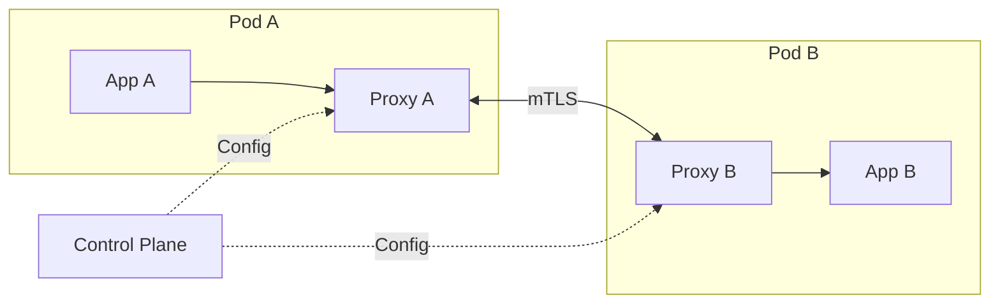

# How to Set Up Service Mesh with Istio/Linkerd in Kubernetes

Author: [nawazdhandala](https://www.github.com/nawazdhandala)

Tags: Kubernetes, Service Mesh, Istio, Linkerd, Networking, Security, Observability, DevOps

Description: A practical guide to implementing service mesh in Kubernetes with both Istio and Linkerd, covering installation, traffic management, security, and observability.

---

Service meshes handle the network complexity of microservices - encryption, load balancing, retries, observability - without changing application code. Istio and Linkerd are the two leading options, each with different philosophies.

## What Is a Service Mesh?

A service mesh injects sidecar proxies alongside your application containers. These proxies intercept all network traffic and apply policies consistently.



### When You Need a Service Mesh

- **Mutual TLS everywhere** without application changes
- **Traffic splitting** for canary deployments
- **Automatic retries and circuit breakers**
- **Distributed tracing** across services
- **Fine-grained traffic policies**

### When You Don't

- Simple applications with few services
- Teams not ready for operational complexity
- Tight resource constraints (sidecars add overhead)

## Istio vs Linkerd Comparison

| Feature | Istio | Linkerd |
|---------|-------|---------|
| Resource footprint | ~100MB per sidecar | ~20MB per sidecar |
| Complexity | Higher | Lower |
| Features | Everything | Essential features |
| Learning curve | Steep | Gentle |
| mTLS | Yes | Yes |
| Traffic management | Advanced | Basic |
| Multi-cluster | Yes | Yes |
| CNCF status | Not CNCF | Graduated |

## Option 1: Linkerd Setup

Linkerd is simpler, lighter, and easier to operate. Start here if you're new to service meshes.

### Install Linkerd CLI

The Linkerd CLI is essential for installing, managing, and debugging your Linkerd installation. It communicates with both the cluster and the control plane.

```bash
# macOS - use Homebrew for easy installation and updates
brew install linkerd

# Linux - download the installation script from the official source
# The script downloads the appropriate binary for your architecture
curl --proto '=https' --tlsv1.2 -sSfL https://run.linkerd.io/install | sh
# Add Linkerd to your PATH for command-line access
export PATH=$HOME/.linkerd2/bin:$PATH

# Verify the CLI is installed correctly
linkerd version
```

### Pre-Installation Check

Before installing Linkerd, run a pre-flight check to ensure your cluster meets all requirements. This identifies potential issues before they cause installation failures.

```bash
# Run pre-installation checks for cluster compatibility
# This verifies Kubernetes version, RBAC, and other requirements
linkerd check --pre
```

### Install Linkerd Control Plane

The control plane installation is a two-step process: first install the CRDs (Custom Resource Definitions), then the control plane components themselves.

```bash
# Install CRDs first - these define Linkerd's custom resources
# Must be applied before the control plane
linkerd install --crds | kubectl apply -f -

# Install the control plane components (identity, destination, proxy-injector)
linkerd install | kubectl apply -f -

# Verify all components are healthy
# This runs comprehensive checks on the installation
linkerd check
```

### Install Viz Extension (Observability)

The Viz extension provides a web-based dashboard and CLI commands for observing traffic, latency, and success rates across your meshed services.

```bash
# Install the visualization extension for metrics and dashboards
linkerd viz install | kubectl apply -f -
# Verify the Viz extension is working
linkerd viz check

# Access the dashboard - this opens a browser window
# The dashboard shows real-time metrics for all meshed services
linkerd viz dashboard &
```

### Inject Sidecars into Your Application

Sidecar injection adds the Linkerd proxy to your pods. You can inject into existing deployments or enable automatic injection for a namespace.

```bash
# Inject sidecars into existing deployments by piping through linkerd inject
# This adds the proxy container to each pod spec
kubectl get deploy -n production -o yaml | linkerd inject - | kubectl apply -f -

# Or add annotation to namespace for automatic injection of all new pods
# This is the recommended approach for production
kubectl annotate namespace production linkerd.io/inject=enabled
```

### Verify Mesh Traffic

After injection, verify that traffic is flowing through the mesh and that the proxies are working correctly.

```bash
# Check the status of meshed pods including success rate and latency
linkerd viz stat deploy -n production

# Watch live traffic in real-time with per-request details
linkerd viz top deploy/api -n production

# View traffic routes to see how requests flow between services
linkerd viz routes deploy/api -n production
```

### Linkerd Traffic Split (Canary)

TrafficSplit allows you to gradually shift traffic between service versions for canary deployments. This uses the SMI (Service Mesh Interface) specification.

```yaml
apiVersion: split.smi-spec.io/v1alpha1
kind: TrafficSplit
metadata:
  name: api-canary
  namespace: production
spec:
  # The root service that receives traffic
  service: api
  backends:
    # Send 90% of traffic to the stable version
    - service: api-stable
      weight: 900m  # 900 milliunits = 90%
    # Send 10% of traffic to the canary version
    - service: api-canary
      weight: 100m  # 100 milliunits = 10%
```

### Linkerd Service Profiles (Retries & Timeouts)

Service Profiles define per-route behavior including timeouts, retries, and what constitutes a failure. This enables fine-grained reliability control.

```yaml
apiVersion: linkerd.io/v1alpha2
kind: ServiceProfile
metadata:
  # Name must match the FQDN of the service
  name: api.production.svc.cluster.local
  namespace: production
spec:
  routes:
    # Define behavior for a specific route
    - name: GET /api/v1/users
      condition:
        method: GET
        pathRegex: /api/v1/users
      # Define what responses count as failures for retry logic
      responseClasses:
        - condition:
            status:
              min: 500
              max: 599
          isFailure: true
      # Maximum time to wait for a response
      timeout: 30s
      # Retry configuration for failed requests
      retries:
        isRetryable: true
        maxRetries: 3
```

## Option 2: Istio Setup

Istio offers more features but requires more operational investment.

### Install istioctl

The istioctl CLI is essential for installing, configuring, and debugging Istio. It provides validation, analysis, and diagnostic capabilities.

```bash
# macOS - use Homebrew for easy installation
brew install istioctl

# Linux - download the latest Istio release
# This includes istioctl and sample configurations
curl -L https://istio.io/downloadIstio | sh -
# Navigate to the Istio directory
cd istio-*
# Add istioctl to your PATH
export PATH=$PWD/bin:$PATH

# Verify istioctl installation
istioctl version
```

### Pre-Installation Check

Run pre-installation checks to ensure your cluster is ready for Istio. This identifies potential issues with resources, permissions, and cluster configuration.

```bash
# Run pre-installation checks for Istio requirements
istioctl x precheck
```

### Install Istio

Istio offers several installation profiles. The demo profile includes all components for testing, while minimal is recommended for production.

```bash
# Install with demo profile (includes observability add-ons)
# Good for learning and testing, not for production
istioctl install --set profile=demo -y

# Or use minimal production profile (control plane only)
# Add components as needed
istioctl install --set profile=minimal -y

# Verify the installation is complete and healthy
istioctl verify-install
# Check that all Istio pods are running
kubectl get pods -n istio-system
```

### Enable Sidecar Injection

Istio uses namespace labels to control automatic sidecar injection. When enabled, all new pods in the namespace receive an Envoy sidecar.

```bash
# Label namespace for automatic sidecar injection
# All new pods in this namespace will get the Envoy sidecar
kubectl label namespace production istio-injection=enabled

# Restart existing pods to inject sidecars
# This triggers a rolling update that adds sidecars to existing deployments
kubectl rollout restart deployment -n production
```

### Install Observability Add-ons

Istio integrates with popular observability tools. These add-ons provide metrics, distributed tracing, and service topology visualization.

```bash
# Apply observability add-ons from the Istio samples
# Prometheus for metrics collection
kubectl apply -f https://raw.githubusercontent.com/istio/istio/release-1.20/samples/addons/prometheus.yaml
# Grafana for dashboards
kubectl apply -f https://raw.githubusercontent.com/istio/istio/release-1.20/samples/addons/grafana.yaml
# Jaeger for distributed tracing
kubectl apply -f https://raw.githubusercontent.com/istio/istio/release-1.20/samples/addons/jaeger.yaml
# Kiali for service mesh visualization
kubectl apply -f https://raw.githubusercontent.com/istio/istio/release-1.20/samples/addons/kiali.yaml

# Access the Kiali dashboard for service mesh visualization
istioctl dashboard kiali
```

### Istio Virtual Service (Traffic Routing)

VirtualService defines how requests are routed to services. This enables sophisticated traffic management including header-based routing and weighted traffic splitting.

```yaml
apiVersion: networking.istio.io/v1beta1
kind: VirtualService
metadata:
  name: api-routing
  namespace: production
spec:
  # Which services this routing applies to
  hosts:
    - api
  http:
    # First rule: route requests with x-canary header to canary version
    - match:
        - headers:
            x-canary:
              exact: "true"
      route:
        - destination:
            host: api
            subset: canary
    # Default rule: split traffic 90/10 between stable and canary
    - route:
        - destination:
            host: api
            subset: stable
          weight: 90  # 90% to stable
        - destination:
            host: api
            subset: canary
          weight: 10  # 10% to canary
```

### Istio Destination Rule (Load Balancing & Subsets)

DestinationRule defines traffic policies after routing decisions are made. It configures load balancing, connection pools, and service subsets.

```yaml
apiVersion: networking.istio.io/v1beta1
kind: DestinationRule
metadata:
  name: api-destination
  namespace: production
spec:
  host: api
  trafficPolicy:
    connectionPool:
      tcp:
        maxConnections: 100  # Maximum TCP connections per host
      http:
        h2UpgradePolicy: UPGRADE  # Upgrade to HTTP/2 when possible
        http1MaxPendingRequests: 100  # Max pending HTTP/1.1 requests
        http2MaxRequests: 1000  # Max concurrent HTTP/2 requests
    loadBalancer:
      simple: LEAST_REQUEST  # Route to host with fewest active requests
    # Outlier detection removes unhealthy hosts from the load balancing pool
    outlierDetection:
      consecutive5xxErrors: 5  # Eject after 5 consecutive 5xx errors
      interval: 30s  # Check interval
      baseEjectionTime: 30s  # Minimum ejection duration
  # Define subsets based on pod labels for traffic splitting
  subsets:
    - name: stable
      labels:
        version: stable
    - name: canary
      labels:
        version: canary
```

### Istio Circuit Breaker

Circuit breakers prevent cascading failures by ejecting unhealthy endpoints from the load balancing pool when they start failing.

```yaml
apiVersion: networking.istio.io/v1beta1
kind: DestinationRule
metadata:
  name: api-circuit-breaker
  namespace: production
spec:
  host: api
  trafficPolicy:
    # Outlier detection implements the circuit breaker pattern
    outlierDetection:
      consecutive5xxErrors: 3  # Eject after 3 consecutive 5xx errors
      interval: 10s  # How often to check for outliers
      baseEjectionTime: 30s  # How long to eject (increases with each ejection)
      maxEjectionPercent: 50  # Never eject more than 50% of hosts
      minHealthPercent: 30  # Require at least 30% healthy hosts
```

### Istio Retry Policy

Retry policies automatically retry failed requests, improving reliability for transient failures. Configure carefully to avoid overloading services.

```yaml
apiVersion: networking.istio.io/v1beta1
kind: VirtualService
metadata:
  name: api-retries
  namespace: production
spec:
  hosts:
    - api
  http:
    - route:
        - destination:
            host: api
      retries:
        attempts: 3  # Maximum retry attempts
        perTryTimeout: 10s  # Timeout for each attempt
        # Conditions that trigger a retry
        retryOn: 5xx,reset,connect-failure,retriable-4xx
```

### Istio Timeout Policy

Timeouts prevent requests from waiting indefinitely and help fail fast when services are slow or unresponsive.

```yaml
apiVersion: networking.istio.io/v1beta1
kind: VirtualService
metadata:
  name: api-timeout
  namespace: production
spec:
  hosts:
    - api
  http:
    - route:
        - destination:
            host: api
      # Request timeout - fails if no response within 30 seconds
      timeout: 30s
```

## Mutual TLS (mTLS) Configuration

### Linkerd mTLS

Linkerd enables mTLS automatically for all meshed traffic. No configuration needed.

Linkerd's zero-config mTLS is one of its key advantages. The identity component issues TLS certificates to all proxies automatically.

```bash
# Verify mTLS is active between services
# Shows the security (mTLS) status of connections between deployments
linkerd viz edges deployment -n production
```

### Istio mTLS

Istio requires explicit configuration for mTLS mode. PeerAuthentication controls how services accept mTLS connections.

```yaml
# Strict mTLS for a specific namespace - all traffic must be encrypted
apiVersion: security.istio.io/v1beta1
kind: PeerAuthentication
metadata:
  name: default
  namespace: production
spec:
  mtls:
    mode: STRICT  # Reject any non-mTLS traffic
---
# Or cluster-wide mTLS - apply to all namespaces
apiVersion: security.istio.io/v1beta1
kind: PeerAuthentication
metadata:
  name: default
  namespace: istio-system  # Apply to istio-system for cluster-wide effect
spec:
  mtls:
    mode: STRICT
```

### Istio Authorization Policy

Authorization policies control access between services based on identity, namespace, and request attributes. This provides fine-grained access control.

```yaml
apiVersion: security.istio.io/v1beta1
kind: AuthorizationPolicy
metadata:
  name: api-authz
  namespace: production
spec:
  # Apply this policy to pods with app: api label
  selector:
    matchLabels:
      app: api
  action: ALLOW  # Allow matching requests, deny all others
  rules:
    - from:
        - source:
            # Only allow requests from the frontend service account
            principals:
              - cluster.local/ns/production/sa/frontend
      to:
        - operation:
            # Only allow GET and POST methods
            methods: ["GET", "POST"]
            # Only allow requests to /api/v1/* paths
            paths: ["/api/v1/*"]
```

## Observability

### Distributed Tracing

Both meshes automatically propagate trace headers (B3, W3C Trace Context).

Distributed tracing allows you to follow requests across multiple services, making it easier to debug latency issues and understand service dependencies.

**Linkerd with Jaeger:**
```bash
# Install Jaeger extension for distributed tracing
linkerd jaeger install | kubectl apply -f -
# Open the Jaeger dashboard to view traces
linkerd jaeger dashboard
```

**Istio with Jaeger:**
```bash
# Open the Jaeger dashboard (assumes Jaeger add-on is installed)
istioctl dashboard jaeger
```

### Metrics

**Linkerd Prometheus metrics:**

Linkerd exposes Prometheus metrics from each sidecar proxy. These metrics include request counts, latency histograms, and success rates.

```bash
# All meshed traffic metrics available at the proxy metrics endpoint
# linkerd-proxy:4191/metrics
```

**Istio Prometheus metrics:**

Istio's Envoy sidecars expose detailed metrics including connection-level and HTTP-level statistics.

```bash
# Available at envoy sidecar metrics endpoint
# istio-proxy:15090/stats/prometheus
```

Key metrics to monitor:
- Request rate
- Error rate
- Latency (P50, P95, P99)
- Connection pool utilization

## Resource Overhead Comparison

### Linkerd (Minimal)

Linkerd uses a Rust-based proxy (linkerd2-proxy) that is significantly lighter than Envoy. These are typical production values.

```yaml
# Typical Linkerd sidecar resources - very lightweight
resources:
  requests:
    cpu: 10m       # 10 millicores is usually sufficient
    memory: 20Mi   # ~20MB memory footprint
  limits:
    cpu: 100m
    memory: 50Mi
```

### Istio (Default)

Istio uses Envoy proxy which is more feature-rich but requires more resources. Tune these based on your traffic patterns.

```yaml
# Typical Istio sidecar resources - more resource-intensive
resources:
  requests:
    cpu: 100m      # 100 millicores baseline
    memory: 128Mi  # ~128MB memory footprint
  limits:
    cpu: 2000m
    memory: 1Gi
```

Tune Istio sidecar resources:

You can override default resource limits per-pod using annotations. This is useful for high-traffic services that need more resources.

```yaml
# Annotation on pod to customize sidecar resources
annotations:
  sidecar.istio.io/proxyCPU: "50m"     # Lower CPU for low-traffic services
  sidecar.istio.io/proxyMemory: "64Mi" # Lower memory limit
```

## Troubleshooting

### Linkerd Troubleshooting

These commands help diagnose common Linkerd issues including proxy injection problems, connectivity issues, and configuration errors.

```bash
# Check overall mesh health and identify issues
linkerd check

# Debug specific deployment - shows metrics and connectivity
linkerd viz stat deploy/api -n production

# View proxy logs for a specific deployment
kubectl logs deploy/api -n production -c linkerd-proxy

# Tap live traffic to see individual requests and responses
linkerd viz tap deploy/api -n production
```

### Istio Troubleshooting

Istio provides powerful diagnostic tools through istioctl. Use these to identify configuration errors and connectivity problems.

```bash
# Analyze configuration for issues - finds common problems
istioctl analyze -n production

# Check synchronization status of all proxies with control plane
istioctl proxy-status

# View detailed proxy configuration (listeners, routes, clusters)
istioctl proxy-config all deploy/api -n production

# Debug sidecar logs for specific issues
kubectl logs deploy/api -n production -c istio-proxy

# Verify mTLS is working between services
istioctl authn tls-check api.production.svc.cluster.local
```

## Migration Strategy

### Starting with Linkerd

1. Install Linkerd control plane
2. Enable injection on non-critical namespace first
3. Monitor for issues
4. Gradually roll out to production namespaces
5. Add service profiles for critical paths

### Starting with Istio

1. Install Istio with minimal profile
2. Enable injection on one namespace
3. Configure strict mTLS gradually
4. Add virtual services for traffic management
5. Implement authorization policies

## Which One Should You Choose?

**Choose Linkerd if:**
- You want simplicity and quick setup
- Resource efficiency matters
- You need core features (mTLS, observability, retries)
- Your team is small

**Choose Istio if:**
- You need advanced traffic management
- You want fine-grained authorization policies
- Multi-cluster federation is required
- You have dedicated platform teams

---

Start with Linkerd if you're new to service meshes. Graduate to Istio when you outgrow Linkerd's capabilities. Both provide the fundamental benefits of mTLS, observability, and traffic management - the difference is in operational complexity and feature breadth.
