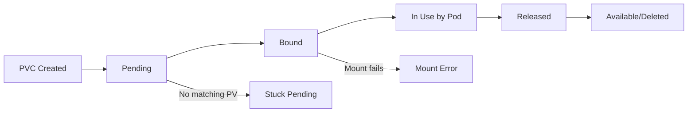

# How to Troubleshoot Kubernetes Persistent Volume Issues

Author: [nawazdhandala](https://www.github.com/nawazdhandala)

Tags: Kubernetes, Storage, Persistent Volumes, Troubleshooting, DevOps

Description: A comprehensive guide to diagnosing and fixing Persistent Volume and Persistent Volume Claim issues in Kubernetes, from binding failures to mount errors.

---

Storage issues in Kubernetes are frustrating because they block pods from starting. This guide covers the most common PV/PVC problems and how to fix them.

## Understanding PV/PVC Lifecycle



### Status Meanings

| Status | Meaning |
|--------|---------|
| Available | PV is ready to be bound |
| Bound | PV/PVC are linked |
| Pending | PVC waiting for PV |
| Released | PV was released but not yet reclaimed |
| Failed | Reclaim policy failed |

## Quick Diagnosis

```bash
# Check PVC status
kubectl get pvc -n <namespace>

# Check PV status
kubectl get pv

# Describe for events
kubectl describe pvc <pvc-name> -n <namespace>
kubectl describe pv <pv-name>

# Check StorageClass
kubectl get storageclass
kubectl describe storageclass <sc-name>

# Check pod events for mount issues
kubectl describe pod <pod-name> -n <namespace> | grep -A 10 "Events"
```

## Problem 1: PVC Stuck in Pending

### Cause 1: No Matching PV

```bash
kubectl describe pvc <pvc-name>
# Events:
# Warning  ProvisioningFailed  no persistent volumes available for this claim
```

**Fix for static provisioning**: Create a matching PV

```yaml
apiVersion: v1
kind: PersistentVolume
metadata:
  name: my-pv
spec:
  capacity:
    storage: 10Gi
  accessModes:
    - ReadWriteOnce
  persistentVolumeReclaimPolicy: Retain
  storageClassName: manual
  hostPath:
    path: /data/my-pv
```

**Fix for dynamic provisioning**: Verify StorageClass exists

```bash
kubectl get storageclass

# If missing, create one (example for AWS EBS)
kubectl apply -f - <<EOF
apiVersion: storage.k8s.io/v1
kind: StorageClass
metadata:
  name: gp3
provisioner: ebs.csi.aws.com
parameters:
  type: gp3
volumeBindingMode: WaitForFirstConsumer
EOF
```

### Cause 2: StorageClass Not Found

```bash
kubectl describe pvc <pvc-name>
# Events:
# Warning  ProvisioningFailed  storageclass.storage.k8s.io "my-storage" not found
```

**Fix**: Check StorageClass name or use default

```yaml
apiVersion: v1
kind: PersistentVolumeClaim
metadata:
  name: my-pvc
spec:
  accessModes:
    - ReadWriteOnce
  resources:
    requests:
      storage: 10Gi
  # storageClassName: ""  # Empty string for default
```

### Cause 3: Capacity Mismatch

PVC requests more storage than available PVs:

```yaml
# PVC requests 100Gi
spec:
  resources:
    requests:
      storage: 100Gi

# But PV only has 50Gi
spec:
  capacity:
    storage: 50Gi
```

**Fix**: Request appropriate size or expand the PV

### Cause 4: Access Mode Mismatch

```yaml
# PVC wants ReadWriteMany
spec:
  accessModes:
    - ReadWriteMany

# But PV only supports ReadWriteOnce
spec:
  accessModes:
    - ReadWriteOnce
```

**Fix**: Match access modes or use appropriate storage backend

| Access Mode | Abbreviation | Description |
|-------------|--------------|-------------|
| ReadWriteOnce | RWO | Single node read/write |
| ReadOnlyMany | ROX | Multiple nodes read-only |
| ReadWriteMany | RWX | Multiple nodes read/write |
| ReadWriteOncePod | RWOP | Single pod read/write |

### Cause 5: WaitForFirstConsumer

PVC stays pending until a pod uses it:

```bash
kubectl describe pvc <pvc-name>
# waiting for first consumer to be created before binding
```

**This is expected behavior** with `volumeBindingMode: WaitForFirstConsumer`. The PVC binds when a pod is scheduled.

### Cause 6: Node Affinity Mismatch

The provisioner can't create volume in any zone where pods can run:

```bash
kubectl describe pvc <pvc-name>
# could not find available zones for claim
```

**Fix**: Check node selectors, affinity rules, and available zones

## Problem 2: Volume Mount Failures

### Cause 1: Volume Not Attached

```bash
kubectl describe pod <pod-name>
# Warning  FailedAttachVolume  AttachVolume.Attach failed for volume "pvc-xxx"
```

**Diagnosis**:

```bash
# Check if volume is attached to another node
kubectl get volumeattachment

# Check CSI driver pods
kubectl get pods -n kube-system | grep csi
```

**Fix**:
- Wait for previous pod to terminate
- Force detach if necessary (dangerous):

```bash
kubectl delete volumeattachment <attachment-name>
```

### Cause 2: Mount Failed - Wrong Filesystem

```bash
kubectl describe pod <pod-name>
# Warning  FailedMount  mount failed: wrong fs type
```

**Fix**: Format the volume or specify correct fsType

```yaml
apiVersion: v1
kind: PersistentVolume
spec:
  csi:
    fsType: ext4  # or xfs
```

### Cause 3: Mount Failed - Permission Denied

```bash
kubectl describe pod <pod-name>
# Warning  FailedMount  mount failed: permission denied
```

**Fix**: Check securityContext

```yaml
spec:
  securityContext:
    fsGroup: 1000
  containers:
    - name: app
      securityContext:
        runAsUser: 1000
        runAsGroup: 1000
```

### Cause 4: Mount Timeout

```bash
kubectl describe pod <pod-name>
# Warning  FailedMount  Unable to attach or mount volumes: timed out
```

**Diagnosis**:

```bash
# Check CSI driver logs
kubectl logs -n kube-system -l app=ebs-csi-controller

# Check node where pod is scheduled
kubectl describe node <node-name> | grep -A 10 "Conditions"
```

**Fix**: Check CSI driver health, cloud credentials, network connectivity

### Cause 5: ReadOnly Filesystem

```bash
kubectl logs <pod-name>
# Error: EROFS: read-only file system
```

**Fix**: Check if PVC is using ReadOnly access mode or if volume is corrupted

## Problem 3: Volume Stuck in Released State

When a PVC is deleted, the PV goes to Released state:

```bash
kubectl get pv
# NAME    CAPACITY   ACCESS MODES   RECLAIM POLICY   STATUS     CLAIM
# my-pv   10Gi       RWO            Retain           Released   default/my-pvc
```

**Fix Options**:

1. **Reclaim manually** (keep data):

```bash
# Remove the claimRef to make PV available again
kubectl patch pv <pv-name> -p '{"spec":{"claimRef": null}}'
```

2. **Delete and recreate**:

```bash
kubectl delete pv <pv-name>
# Recreate with same storage backend
```

## Problem 4: Volume Expansion Issues

### Cause 1: StorageClass Doesn't Allow Expansion

```bash
kubectl describe pvc <pvc-name>
# Warning  VolumeResizeFailed  storageclass does not allow volume expansion
```

**Fix**: Enable expansion in StorageClass

```yaml
apiVersion: storage.k8s.io/v1
kind: StorageClass
metadata:
  name: expandable
provisioner: ebs.csi.aws.com
allowVolumeExpansion: true
```

### Cause 2: Filesystem Not Expanded

Volume expanded but filesystem didn't resize:

```bash
# Inside the pod
df -h /data
# Shows old size
```

**Fix**: Most CSI drivers auto-expand, but some need pod restart:

```bash
kubectl delete pod <pod-name>
# Pod recreates and filesystem expands
```

## Problem 5: Multi-Attach Errors

```bash
kubectl describe pod <pod-name>
# Warning  FailedAttachVolume  Multi-Attach error for volume "pvc-xxx"
```

This happens when:
- Previous pod didn't terminate cleanly
- Using RWO volume with multiple pods
- Deployment updated before old pod died

**Fix**:

```bash
# Find pods using the volume
kubectl get pods -A -o json | jq '.items[] | select(.spec.volumes[]?.persistentVolumeClaim.claimName == "my-pvc") | .metadata.name'

# Force delete stuck pod
kubectl delete pod <old-pod-name> --force --grace-period=0

# Or force detach (use with caution)
kubectl delete volumeattachment <attachment-name>
```

## Problem 6: NFS/Network Storage Issues

### Cause 1: NFS Server Unreachable

```bash
kubectl describe pod <pod-name>
# Warning  FailedMount  mount.nfs: Connection timed out
```

**Fix**: Verify network connectivity from nodes to NFS server

```bash
# Test from node
kubectl debug node/<node-name> -it --image=busybox -- /bin/sh
ping <nfs-server-ip>
showmount -e <nfs-server-ip>
```

### Cause 2: NFS Export Permissions

```bash
kubectl describe pod <pod-name>
# Warning  FailedMount  mount.nfs: access denied
```

**Fix**: Check NFS server exports

```bash
# On NFS server
cat /etc/exports
# Should include cluster node IPs or subnet
# /data 10.0.0.0/16(rw,sync,no_subtree_check,no_root_squash)
```

## Debugging Tools

### Check Volume from Inside Pod

```bash
# Exec into pod
kubectl exec -it <pod-name> -- /bin/sh

# Check mounts
mount | grep <volume-path>
df -h

# Test write
touch /data/test-file
ls -la /data/
```

### Check CSI Driver Status

```bash
# List CSI drivers
kubectl get csidrivers

# Check CSI pods
kubectl get pods -n kube-system -l app.kubernetes.io/component=csi-driver

# Check CSI node status
kubectl get csinodes
```

### Storage Troubleshooting Script

```bash
#!/bin/bash
PVC_NAME=$1
NAMESPACE=${2:-default}

echo "=== PVC Status ==="
kubectl get pvc $PVC_NAME -n $NAMESPACE

echo -e "\n=== PVC Details ==="
kubectl describe pvc $PVC_NAME -n $NAMESPACE

PV_NAME=$(kubectl get pvc $PVC_NAME -n $NAMESPACE -o jsonpath='{.spec.volumeName}')
if [ -n "$PV_NAME" ]; then
  echo -e "\n=== PV Status ==="
  kubectl get pv $PV_NAME

  echo -e "\n=== PV Details ==="
  kubectl describe pv $PV_NAME

  echo -e "\n=== Volume Attachments ==="
  kubectl get volumeattachment | grep $PV_NAME
fi

echo -e "\n=== Pods Using PVC ==="
kubectl get pods -n $NAMESPACE -o json | \
  jq -r ".items[] | select(.spec.volumes[]?.persistentVolumeClaim.claimName == \"$PVC_NAME\") | .metadata.name"

echo -e "\n=== StorageClass ==="
SC=$(kubectl get pvc $PVC_NAME -n $NAMESPACE -o jsonpath='{.spec.storageClassName}')
kubectl describe storageclass $SC
```

## Prevention Best Practices

1. **Use WaitForFirstConsumer** - Prevents zone mismatches
2. **Set appropriate reclaim policies** - Retain for important data
3. **Monitor PVC usage** - Alert before capacity issues
4. **Use VolumeSnapshots** - For backup and recovery
5. **Test storage in staging** - Before production deployment
6. **Document storage requirements** - Access modes, capacity needs

---

Storage issues mostly come down to: mismatched configurations, capacity/quota limits, or connectivity problems. Start with `kubectl describe` to see events, then work through the checklist for your specific error message.
