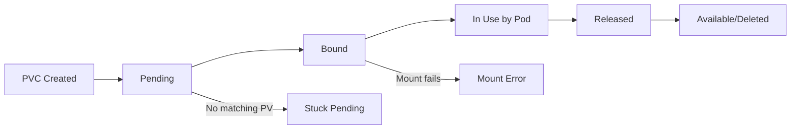

# How to Troubleshoot Kubernetes Persistent Volume Issues

Author: [nawazdhandala](https://www.github.com/nawazdhandala)

Tags: Kubernetes, Storage, Persistent Volumes, Troubleshooting, DevOps

Description: A comprehensive guide to diagnosing and fixing Persistent Volume and Persistent Volume Claim issues in Kubernetes, from binding failures to mount errors.

---

Storage issues in Kubernetes are frustrating because they block pods from starting. This guide covers the most common PV/PVC problems and how to fix them.

## Understanding PV/PVC Lifecycle

The following diagram illustrates the complete lifecycle of Persistent Volumes and Persistent Volume Claims in Kubernetes. Understanding this flow is essential for diagnosing where your storage issues occur in the provisioning and mounting process.



### Status Meanings

| Status | Meaning |
|--------|---------|
| Available | PV is ready to be bound |
| Bound | PV/PVC are linked |
| Pending | PVC waiting for PV |
| Released | PV was released but not yet reclaimed |
| Failed | Reclaim policy failed |

## Quick Diagnosis

These commands provide a comprehensive overview of your storage resources and their current state. Start here when troubleshooting any PV/PVC issue to quickly identify the problem area.

```bash
# Check PVC status - shows binding state and storage class
kubectl get pvc -n <namespace>

# Check PV status - shows capacity, access modes, and reclaim policy
kubectl get pv

# Describe for events - reveals detailed error messages and state transitions
kubectl describe pvc <pvc-name> -n <namespace>
kubectl describe pv <pv-name>

# Check StorageClass - verify the provisioner and parameters are correct
kubectl get storageclass
kubectl describe storageclass <sc-name>

# Check pod events for mount issues - shows volume attachment and mount errors
kubectl describe pod <pod-name> -n <namespace> | grep -A 10 "Events"
```

## Problem 1: PVC Stuck in Pending

### Cause 1: No Matching PV

Use this command to inspect the PVC events and identify why no PV is available. The events section will reveal whether the issue is capacity, access mode, or storage class related.

```bash
# Describe the PVC to see provisioning failure events
kubectl describe pvc <pvc-name>
# Events:
# Warning  ProvisioningFailed  no persistent volumes available for this claim
```

**Fix for static provisioning**: Create a matching PV

This PersistentVolume definition creates a manually provisioned volume using hostPath storage. This is useful for development or single-node clusters where you need to test PVC binding without a cloud provider.

```yaml
# PersistentVolume definition for static provisioning
apiVersion: v1
kind: PersistentVolume
metadata:
  name: my-pv
spec:
  capacity:
    storage: 10Gi                         # Must be >= PVC request
  accessModes:
    - ReadWriteOnce                       # Must match PVC access mode
  persistentVolumeReclaimPolicy: Retain   # Keep data after PVC deletion
  storageClassName: manual                # Must match PVC storageClassName
  hostPath:
    path: /data/my-pv                     # Local path on the node
```

**Fix for dynamic provisioning**: Verify StorageClass exists

This command checks for available StorageClasses and creates a new one if needed. The StorageClass defines how volumes are dynamically provisioned when PVCs request storage.

```bash
# List all available storage classes
kubectl get storageclass

# If missing, create one (example for AWS EBS with gp3 volumes)
kubectl apply -f - <<EOF
apiVersion: storage.k8s.io/v1
kind: StorageClass
metadata:
  name: gp3
provisioner: ebs.csi.aws.com              # CSI driver for AWS EBS
parameters:
  type: gp3                               # EBS volume type
volumeBindingMode: WaitForFirstConsumer   # Delay binding until pod is scheduled
EOF
```

### Cause 2: StorageClass Not Found

This error occurs when the PVC references a StorageClass that does not exist in the cluster. Use describe to identify the missing class name.

```bash
# Check the PVC events for StorageClass errors
kubectl describe pvc <pvc-name>
# Events:
# Warning  ProvisioningFailed  storageclass.storage.k8s.io "my-storage" not found
```

**Fix**: Check StorageClass name or use default

This PVC definition shows how to use the default StorageClass by omitting or emptying the storageClassName field. The cluster's default StorageClass will automatically be assigned.

```yaml
# PVC using the cluster's default StorageClass
apiVersion: v1
kind: PersistentVolumeClaim
metadata:
  name: my-pvc
spec:
  accessModes:
    - ReadWriteOnce
  resources:
    requests:
      storage: 10Gi
  # storageClassName: ""  # Empty string uses default StorageClass
```

### Cause 3: Capacity Mismatch

PVC requests more storage than available PVs:

This example shows a common mismatch where the PVC requests more storage than what the PV offers. The PVC will remain pending until a PV with sufficient capacity becomes available.

```yaml
# PVC requests 100Gi - will not bind to smaller PVs
spec:
  resources:
    requests:
      storage: 100Gi

# But PV only has 50Gi - insufficient for the PVC
spec:
  capacity:
    storage: 50Gi
```

**Fix**: Request appropriate size or expand the PV

### Cause 4: Access Mode Mismatch

Access mode mismatches prevent PVC-PV binding. The PVC must request an access mode that the PV supports. Not all storage backends support all access modes.

```yaml
# PVC wants ReadWriteMany - requires shared storage like NFS
spec:
  accessModes:
    - ReadWriteMany

# But PV only supports ReadWriteOnce - single node access only
spec:
  accessModes:
    - ReadWriteOnce
```

**Fix**: Match access modes or use appropriate storage backend

| Access Mode | Abbreviation | Description |
|-------------|--------------|-------------|
| ReadWriteOnce | RWO | Single node read/write |
| ReadOnlyMany | ROX | Multiple nodes read-only |
| ReadWriteMany | RWX | Multiple nodes read/write |
| ReadWriteOncePod | RWOP | Single pod read/write |

### Cause 5: WaitForFirstConsumer

PVC stays pending until a pod uses it:

This behavior is expected with the WaitForFirstConsumer volume binding mode. It ensures the volume is provisioned in the same zone where the pod is scheduled.

```bash
# Check PVC events - this message indicates normal WaitForFirstConsumer behavior
kubectl describe pvc <pvc-name>
# waiting for first consumer to be created before binding
```

**This is expected behavior** with `volumeBindingMode: WaitForFirstConsumer`. The PVC binds when a pod is scheduled.

### Cause 6: Node Affinity Mismatch

The provisioner can't create volume in any zone where pods can run:

This error indicates a zone constraint conflict between your pod scheduling rules and available storage zones.

```bash
# Check for zone availability issues in PVC events
kubectl describe pvc <pvc-name>
# could not find available zones for claim
```

**Fix**: Check node selectors, affinity rules, and available zones

## Problem 2: Volume Mount Failures

### Cause 1: Volume Not Attached

Volume attachment failures occur when the volume cannot be attached to the node where the pod is scheduled. This is often caused by the volume being attached to another node.

```bash
# Check pod events for attachment failures
kubectl describe pod <pod-name>
# Warning  FailedAttachVolume  AttachVolume.Attach failed for volume "pvc-xxx"
```

**Diagnosis**:

These commands help identify volume attachment issues by showing current attachments and CSI driver status.

```bash
# Check if volume is attached to another node
kubectl get volumeattachment

# Check CSI driver pods are running and healthy
kubectl get pods -n kube-system | grep csi
```

**Fix**:
- Wait for previous pod to terminate
- Force detach if necessary (dangerous):

Use this command only as a last resort when a volume is stuck attached to a node that is unreachable or when the normal detachment process has failed.

```bash
# Force delete the volume attachment - use with caution as it may cause data corruption
kubectl delete volumeattachment <attachment-name>
```

### Cause 2: Mount Failed - Wrong Filesystem

This error occurs when the volume has an incompatible or corrupted filesystem. It commonly happens with newly provisioned volumes or after storage system issues.

```bash
# Check pod events for filesystem errors
kubectl describe pod <pod-name>
# Warning  FailedMount  mount failed: wrong fs type
```

**Fix**: Format the volume or specify correct fsType

Specify the filesystem type in your PersistentVolume configuration to ensure the volume is formatted correctly. Common types are ext4 and xfs.

```yaml
# PV configuration with explicit filesystem type
apiVersion: v1
kind: PersistentVolume
spec:
  csi:
    fsType: ext4  # Specify ext4 or xfs depending on your requirements
```

### Cause 3: Mount Failed - Permission Denied

Permission errors occur when the container process does not have the required permissions to access the mounted volume. This is resolved by configuring the security context.

```bash
# Check pod events for permission errors
kubectl describe pod <pod-name>
# Warning  FailedMount  mount failed: permission denied
```

**Fix**: Check securityContext

Configure the pod's securityContext to set appropriate user, group, and filesystem group permissions that match the volume's ownership requirements.

```yaml
# Pod spec with security context for volume permissions
spec:
  securityContext:
    fsGroup: 1000           # Sets group ownership of mounted volumes
  containers:
    - name: app
      securityContext:
        runAsUser: 1000     # Container runs as this user ID
        runAsGroup: 1000    # Container runs with this group ID
```

### Cause 4: Mount Timeout

Mount timeouts typically indicate CSI driver issues, network connectivity problems, or cloud provider API rate limiting.

```bash
# Check pod events for timeout errors
kubectl describe pod <pod-name>
# Warning  FailedMount  Unable to attach or mount volumes: timed out
```

**Diagnosis**:

These commands help investigate the root cause of mount timeouts by examining CSI driver logs and node conditions.

```bash
# Check CSI driver logs for errors and rate limiting
kubectl logs -n kube-system -l app=ebs-csi-controller

# Check node conditions for disk pressure or other issues
kubectl describe node <node-name> | grep -A 10 "Conditions"
```

**Fix**: Check CSI driver health, cloud credentials, network connectivity

### Cause 5: ReadOnly Filesystem

A read-only filesystem error from within the container indicates either incorrect PVC access mode or volume corruption.

```bash
# Check application logs for read-only filesystem errors
kubectl logs <pod-name>
# Error: EROFS: read-only file system
```

**Fix**: Check if PVC is using ReadOnly access mode or if volume is corrupted

## Problem 3: Volume Stuck in Released State

When a PVC is deleted, the PV goes to Released state:

This output shows a PV in Released state, which means the previous PVC was deleted but the PV cannot be rebound due to its reclaim policy.

```bash
# Check PV status - Released state means the volume contains data from previous claim
kubectl get pv
# NAME    CAPACITY   ACCESS MODES   RECLAIM POLICY   STATUS     CLAIM
# my-pv   10Gi       RWO            Retain           Released   default/my-pvc
```

**Fix Options**:

1. **Reclaim manually** (keep data):

This patch removes the claimRef from the PV, making it Available again so a new PVC can bind to it. The existing data on the volume is preserved.

```bash
# Remove the claimRef to make PV available again - preserves existing data
kubectl patch pv <pv-name> -p '{"spec":{"claimRef": null}}'
```

2. **Delete and recreate**:

Use this approach when you want to start fresh with a clean volume. Ensure you have backed up any important data first.

```bash
# Delete the PV - data may be deleted depending on storage backend
kubectl delete pv <pv-name>
# Recreate with same storage backend
```

## Problem 4: Volume Expansion Issues

### Cause 1: StorageClass Doesn't Allow Expansion

Volume expansion must be explicitly enabled in the StorageClass. Without this setting, PVC resize requests will be rejected.

```bash
# Check PVC events for expansion errors
kubectl describe pvc <pvc-name>
# Warning  VolumeResizeFailed  storageclass does not allow volume expansion
```

**Fix**: Enable expansion in StorageClass

Create or update the StorageClass with allowVolumeExpansion set to true. This allows PVCs using this class to be resized.

```yaml
# StorageClass with volume expansion enabled
apiVersion: storage.k8s.io/v1
kind: StorageClass
metadata:
  name: expandable
provisioner: ebs.csi.aws.com
allowVolumeExpansion: true    # Enables online volume expansion
```

### Cause 2: Filesystem Not Expanded

Volume expanded but filesystem didn't resize:

Even after expanding the underlying volume, the filesystem may need to be resized. Check the actual available space from inside the pod.

```bash
# Inside the pod - check actual filesystem size
df -h /data
# Shows old size - filesystem resize pending
```

**Fix**: Most CSI drivers auto-expand, but some need pod restart:

Restarting the pod triggers the CSI driver to resize the filesystem to match the expanded volume.

```bash
# Delete pod to trigger filesystem expansion on recreation
kubectl delete pod <pod-name>
# Pod recreates and filesystem expands automatically
```

## Problem 5: Multi-Attach Errors

Multi-attach errors indicate a volume is being accessed from multiple locations, which is not supported for ReadWriteOnce volumes.

```bash
# Check pod events for multi-attach errors
kubectl describe pod <pod-name>
# Warning  FailedAttachVolume  Multi-Attach error for volume "pvc-xxx"
```

This happens when:
- Previous pod didn't terminate cleanly
- Using RWO volume with multiple pods
- Deployment updated before old pod died

**Fix**:

These commands help identify and resolve multi-attach issues by finding pods using the volume and cleaning up stale resources.

```bash
# Find pods using the volume - identifies which pods are competing for the volume
kubectl get pods -A -o json | jq '.items[] | select(.spec.volumes[]?.persistentVolumeClaim.claimName == "my-pvc") | .metadata.name'

# Force delete stuck pod - use when pod is stuck in Terminating state
kubectl delete pod <old-pod-name> --force --grace-period=0

# Or force detach (use with caution - may cause data corruption)
kubectl delete volumeattachment <attachment-name>
```

## Problem 6: NFS/Network Storage Issues

### Cause 1: NFS Server Unreachable

NFS mount failures typically indicate network connectivity issues between the Kubernetes nodes and the NFS server.

```bash
# Check pod events for NFS connection errors
kubectl describe pod <pod-name>
# Warning  FailedMount  mount.nfs: Connection timed out
```

**Fix**: Verify network connectivity from nodes to NFS server

Use kubectl debug to run network tests from the node's perspective to verify NFS server accessibility.

```bash
# Test connectivity from node using a debug pod
kubectl debug node/<node-name> -it --image=busybox -- /bin/sh
ping <nfs-server-ip>
showmount -e <nfs-server-ip>  # List available NFS exports
```

### Cause 2: NFS Export Permissions

NFS export permission errors occur when the NFS server is not configured to allow access from the Kubernetes cluster nodes.

```bash
# Check pod events for NFS permission errors
kubectl describe pod <pod-name>
# Warning  FailedMount  mount.nfs: access denied
```

**Fix**: Check NFS server exports

Verify the NFS server's /etc/exports file includes your cluster's network range with appropriate permissions.

```bash
# On NFS server - check export configuration
cat /etc/exports
# Should include cluster node IPs or subnet with proper options
# /data 10.0.0.0/16(rw,sync,no_subtree_check,no_root_squash)
```

## Debugging Tools

### Check Volume from Inside Pod

These commands help verify the volume is correctly mounted and accessible from within the running container.

```bash
# Exec into pod to inspect mounted volumes
kubectl exec -it <pod-name> -- /bin/sh

# Check mounts - verify volume is mounted at expected path
mount | grep <volume-path>
df -h

# Test write permissions - creates a test file to verify write access
touch /data/test-file
ls -la /data/
```

### Check CSI Driver Status

CSI drivers are responsible for provisioning and mounting volumes. These commands verify the CSI infrastructure is healthy.

```bash
# List installed CSI drivers in the cluster
kubectl get csidrivers

# Check CSI driver pods are running
kubectl get pods -n kube-system -l app.kubernetes.io/component=csi-driver

# Check CSI node status - shows which drivers are available on each node
kubectl get csinodes
```

### Storage Troubleshooting Script

This comprehensive troubleshooting script gathers all relevant information about a PVC and its associated resources. Save it as a file and run it with the PVC name and namespace as arguments.

```bash
#!/bin/bash
# Storage troubleshooting script
# Usage: ./storage-debug.sh <pvc-name> [namespace]

PVC_NAME=$1
NAMESPACE=${2:-default}

echo "=== PVC Status ==="
kubectl get pvc $PVC_NAME -n $NAMESPACE

echo -e "\n=== PVC Details ==="
kubectl describe pvc $PVC_NAME -n $NAMESPACE

# Get the bound PV name from the PVC
PV_NAME=$(kubectl get pvc $PVC_NAME -n $NAMESPACE -o jsonpath='{.spec.volumeName}')
if [ -n "$PV_NAME" ]; then
  echo -e "\n=== PV Status ==="
  kubectl get pv $PV_NAME

  echo -e "\n=== PV Details ==="
  kubectl describe pv $PV_NAME

  echo -e "\n=== Volume Attachments ==="
  kubectl get volumeattachment | grep $PV_NAME
fi

# Find pods using this PVC
echo -e "\n=== Pods Using PVC ==="
kubectl get pods -n $NAMESPACE -o json | \
  jq -r ".items[] | select(.spec.volumes[]?.persistentVolumeClaim.claimName == \"$PVC_NAME\") | .metadata.name"

# Get StorageClass details
echo -e "\n=== StorageClass ==="
SC=$(kubectl get pvc $PVC_NAME -n $NAMESPACE -o jsonpath='{.spec.storageClassName}')
kubectl describe storageclass $SC
```

## Prevention Best Practices

1. **Use WaitForFirstConsumer** - Prevents zone mismatches
2. **Set appropriate reclaim policies** - Retain for important data
3. **Monitor PVC usage** - Alert before capacity issues
4. **Use VolumeSnapshots** - For backup and recovery
5. **Test storage in staging** - Before production deployment
6. **Document storage requirements** - Access modes, capacity needs

---

Storage issues mostly come down to: mismatched configurations, capacity/quota limits, or connectivity problems. Start with `kubectl describe` to see events, then work through the checklist for your specific error message.
