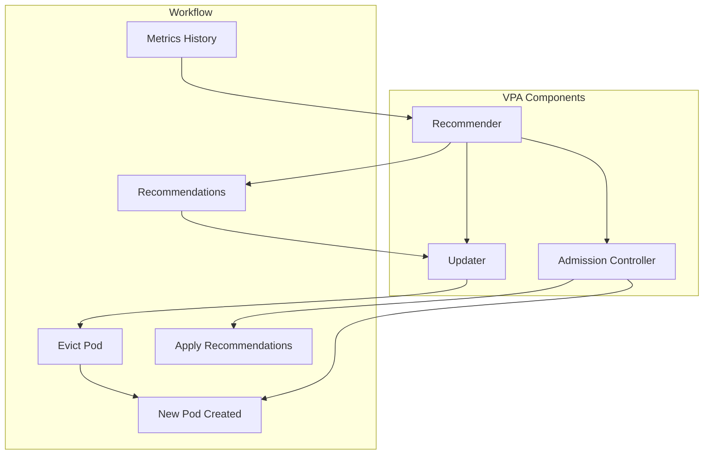

# How to Implement Vertical Pod Autoscaling (VPA) in Kubernetes

Author: [nawazdhandala](https://www.github.com/nawazdhandala)

Tags: Kubernetes, VPA, Autoscaling, Resource Management, Performance, DevOps

Description: A complete guide to implementing Vertical Pod Autoscaler (VPA) in Kubernetes, including installation, configuration modes, integration with HPA, and production best practices.

---

HPA adds more pods. VPA makes existing pods bigger (or smaller). When your application needs more CPU or memory per instance rather than more instances, VPA automatically adjusts resource requests.

## How VPA Works

This diagram illustrates the VPA architecture and how its three components work together to analyze resource usage and adjust pod resources automatically.



VPA has three components:
- **Recommender**: Analyzes metrics and generates recommendations
- **Updater**: Evicts pods that need resizing
- **Admission Controller**: Sets resources on new pods

## Installing VPA

### Install with Kubectl

The following commands clone the official Kubernetes autoscaler repository and run the VPA installation script, which deploys all three VPA components to your cluster.

```bash
# Clone the autoscaler repo containing VPA manifests
git clone https://github.com/kubernetes/autoscaler.git
cd autoscaler/vertical-pod-autoscaler

# Install VPA components (recommender, updater, admission-controller)
./hack/vpa-up.sh

# Verify installation - all three VPA pods should be running
kubectl get pods -n kube-system | grep vpa
```

### Install with Helm

Helm provides a simpler installation method with configurable values. This chart deploys VPA with sensible defaults that can be customized for your environment.

```bash
# Add the Helm repository containing the VPA chart
helm repo add cowboysysop https://cowboysysop.github.io/charts/

# Install VPA in the kube-system namespace
helm install vpa cowboysysop/vertical-pod-autoscaler \
  --namespace kube-system
```

### Verify Installation

After installation, verify that the VPA Custom Resource Definitions are registered and all VPA pods are running correctly.

```bash
# Check CRDs are installed - should show verticalpodautoscalers CRD
kubectl get crd | grep verticalpodautoscaler

# Check all VPA component pods are running
kubectl get pods -n kube-system -l app.kubernetes.io/name=vpa
```

## VPA Update Modes

### Mode 1: Off (Recommendations Only)

Get recommendations without applying them. Safe for production evaluation.

The "Off" mode is the safest way to evaluate VPA. It collects metrics and generates recommendations without making any changes to your pods, allowing you to review suggestions before enabling automatic updates.

```yaml
# VPA in recommendation-only mode - no automatic updates
apiVersion: autoscaling.k8s.io/v1
kind: VerticalPodAutoscaler
metadata:
  name: web-api-vpa
  namespace: production
spec:
  targetRef:
    apiVersion: apps/v1
    kind: Deployment
    name: web-api
  updatePolicy:
    updateMode: "Off"  # Only generate recommendations, don't apply them
```

Check recommendations:

Use the describe command to view VPA's resource recommendations, which include lower bounds, targets, and upper bounds for both CPU and memory.

```bash
# View current recommendations without applying them
kubectl describe vpa web-api-vpa -n production
```

Output:
```
Recommendation:
  Container Recommendations:
    Container Name:  web-api
    Lower Bound:
      Cpu:     25m
      Memory:  262144k
    Target:
      Cpu:     100m
      Memory:  524288k
    Uncapped Target:
      Cpu:     100m
      Memory:  524288k
    Upper Bound:
      Cpu:     500m
      Memory:  1Gi
```

### Mode 2: Initial (Set on Creation Only)

Apply recommendations only when pods are created, not on running pods.

The "Initial" mode applies recommended resources only when new pods are created. This is useful when you want VPA to optimize new deployments but avoid disrupting running workloads.

```yaml
# VPA that only sets resources on pod creation
apiVersion: autoscaling.k8s.io/v1
kind: VerticalPodAutoscaler
metadata:
  name: web-api-vpa
  namespace: production
spec:
  targetRef:
    apiVersion: apps/v1
    kind: Deployment
    name: web-api
  updatePolicy:
    updateMode: "Initial"  # Apply recommendations only at pod creation time
```

### Mode 3: Auto (Full Automation)

Automatically evict and recreate pods with new resources. Use with caution.

The "Auto" mode enables full automation where VPA will evict and recreate pods to apply updated resource recommendations. The minReplicas setting ensures service availability during updates.

```yaml
# VPA with automatic pod updates - use with PodDisruptionBudget
apiVersion: autoscaling.k8s.io/v1
kind: VerticalPodAutoscaler
metadata:
  name: web-api-vpa
  namespace: production
spec:
  targetRef:
    apiVersion: apps/v1
    kind: Deployment
    name: web-api
  updatePolicy:
    updateMode: "Auto"
    minReplicas: 2  # Don't evict if fewer than 2 replicas would remain
```

## Configuring Resource Policies

### Set Min/Max Boundaries

Resource boundaries prevent VPA from setting resources too low (causing OOM kills) or too high (wasting cluster resources). Always set boundaries based on your application's actual requirements.

```yaml
# VPA with resource boundaries to prevent extreme recommendations
apiVersion: autoscaling.k8s.io/v1
kind: VerticalPodAutoscaler
metadata:
  name: web-api-vpa
  namespace: production
spec:
  targetRef:
    apiVersion: apps/v1
    kind: Deployment
    name: web-api
  updatePolicy:
    updateMode: "Auto"
  resourcePolicy:
    containerPolicies:
      - containerName: web-api
        minAllowed:
          cpu: 50m        # Minimum CPU to prevent starvation
          memory: 128Mi   # Minimum memory to prevent OOM
        maxAllowed:
          cpu: 2          # Maximum CPU cap
          memory: 4Gi     # Maximum memory cap
        controlledResources: ["cpu", "memory"]  # Resources VPA manages
```

### Control Specific Resources Only

This configuration allows VPA to control memory while leaving CPU management to HPA. This pattern is useful when you want horizontal scaling based on CPU but vertical scaling for memory.

```yaml
# VPA controlling only memory - CPU managed by HPA
resourcePolicy:
  containerPolicies:
    - containerName: web-api
      controlledResources: ["memory"]  # VPA controls memory only
      # CPU controlled by HPA for horizontal scaling
```

### Exclude Sidecars

Sidecar containers like Istio proxy have their own resource management. Exclude them from VPA to prevent conflicts and ensure stable service mesh operation.

```yaml
# Exclude sidecars from VPA management
resourcePolicy:
  containerPolicies:
    - containerName: istio-proxy
      mode: "Off"  # Don't touch sidecar resources
    - containerName: web-api
      minAllowed:
        cpu: 100m
        memory: 256Mi
```

## VPA + HPA Integration

VPA and HPA conflict if both control the same metric. Here's how to use them together:

### Pattern 1: HPA on CPU, VPA on Memory

This pattern separates concerns: VPA optimizes memory allocation while HPA scales pod count based on CPU utilization. This avoids metric conflicts and provides both vertical and horizontal scaling.

```yaml
# VPA controls memory only - prevents conflict with HPA
apiVersion: autoscaling.k8s.io/v1
kind: VerticalPodAutoscaler
metadata:
  name: web-api-vpa
spec:
  targetRef:
    apiVersion: apps/v1
    kind: Deployment
    name: web-api
  resourcePolicy:
    containerPolicies:
      - containerName: web-api
        controlledResources: ["memory"]  # VPA manages memory
---
# HPA controls replicas based on CPU - no conflict with VPA
apiVersion: autoscaling/v2
kind: HorizontalPodAutoscaler
metadata:
  name: web-api-hpa
spec:
  scaleTargetRef:
    apiVersion: apps/v1
    kind: Deployment
    name: web-api
  minReplicas: 2
  maxReplicas: 20
  metrics:
    - type: Resource
      resource:
        name: cpu
        target:
          type: Utilization
          averageUtilization: 70  # Scale when CPU exceeds 70%
```

### Pattern 2: VPA Recommendations Only + HPA

This conservative pattern uses VPA only for recommendations while HPA handles all actual scaling. You manually apply VPA recommendations during maintenance windows.

```yaml
# VPA in Off mode - provides recommendations without automatic updates
apiVersion: autoscaling.k8s.io/v1
kind: VerticalPodAutoscaler
metadata:
  name: web-api-vpa
spec:
  targetRef:
    apiVersion: apps/v1
    kind: Deployment
    name: web-api
  updatePolicy:
    updateMode: "Off"  # Just get recommendations for manual review
---
# HPA handles all automatic scaling
apiVersion: autoscaling/v2
kind: HorizontalPodAutoscaler
metadata:
  name: web-api-hpa
spec:
  scaleTargetRef:
    apiVersion: apps/v1
    kind: Deployment
    name: web-api
  minReplicas: 2
  maxReplicas: 20
  metrics:
    - type: Resource
      resource:
        name: cpu
        target:
          type: Utilization
          averageUtilization: 70
```

Then periodically apply VPA recommendations manually:

Use these commands during maintenance windows to review and apply VPA recommendations manually, ensuring you have full control over resource changes.

```bash
# Get current VPA recommendation for the deployment
kubectl describe vpa web-api-vpa -n production | grep -A 10 "Target:"

# Update deployment with recommended values during maintenance window
kubectl set resources deployment/web-api -n production \
  --containers=web-api \
  --requests=cpu=100m,memory=512Mi
```

## Production Best Practices

### 1. Start with Off Mode

Always begin with Off mode to observe VPA recommendations without risking service disruption. Review recommendations for at least a week before enabling automatic updates.

```yaml
# Start with Off mode to safely evaluate recommendations
updatePolicy:
  updateMode: "Off"
```

Observe recommendations for at least a week before enabling Auto.

### 2. Set Reasonable Boundaries

Boundaries prevent VPA from making extreme recommendations that could cause application failures or resource waste. Base these on your application's known requirements.

```yaml
# Set boundaries based on application requirements and cluster capacity
resourcePolicy:
  containerPolicies:
    - containerName: web-api
      minAllowed:
        cpu: 50m        # Don't go below functional minimum
        memory: 128Mi
      maxAllowed:
        cpu: 4          # Cap at node capacity limits
        memory: 8Gi
```

### 3. Use minReplicas

The minReplicas setting ensures VPA maintains service availability by never evicting pods if it would drop the replica count below the threshold.

```yaml
# Ensure minimum availability during VPA updates
updatePolicy:
  updateMode: "Auto"
  minReplicas: 2  # Always keep at least 2 pods running during updates
```

### 4. Protect with PodDisruptionBudget

A PodDisruptionBudget (PDB) provides additional protection against VPA-induced disruptions by ensuring a minimum number of pods remain available at all times.

```yaml
# PDB ensures service availability during VPA evictions
apiVersion: policy/v1
kind: PodDisruptionBudget
metadata:
  name: web-api-pdb
  namespace: production
spec:
  minAvailable: 2         # Never allow fewer than 2 pods
  selector:
    matchLabels:
      app: web-api
```

### 5. Monitor Evictions

Monitoring VPA eviction events helps you understand how frequently VPA is updating pods and whether the recommendations are stable.

```bash
# Watch for VPA-triggered eviction events
kubectl get events -n production --field-selector reason=EvictedByVPA

# Check VPA status and current recommendations
kubectl describe vpa web-api-vpa -n production
```

## Troubleshooting VPA

### Recommendations Not Appearing

If VPA is not generating recommendations, check the recommender component and verify metrics-server is providing data.

```bash
# Check VPA status for recommendation errors
kubectl describe vpa <name> -n <namespace>

# Check recommender logs for metrics collection issues
kubectl logs -n kube-system -l app=vpa-recommender

# Ensure metrics-server is working - VPA needs metrics data
kubectl top pods -n <namespace>
```

### Pods Not Being Updated

1. Check updateMode is "Auto" or "Initial"
2. Check minReplicas setting
3. Check PodDisruptionBudget constraints
4. Check resourcePolicy allows changes

These commands help diagnose why pods are not being updated by examining the admission controller and updater components.

```bash
# Check admission controller for resource injection issues
kubectl logs -n kube-system -l app=vpa-admission-controller

# Check updater for eviction issues
kubectl logs -n kube-system -l app=vpa-updater
```

### Recommendations Too Aggressive

Add boundaries:

If VPA recommendations are too high, set maxAllowed limits to cap recommendations at reasonable values for your environment.

```yaml
# Cap recommendations to prevent over-provisioning
resourcePolicy:
  containerPolicies:
    - containerName: web-api
      maxAllowed:
        cpu: 500m      # Cap CPU recommendations
        memory: 1Gi    # Cap memory recommendations
```

### VPA Conflicts with Limits

If your deployment has limits but VPA recommends higher requests, pods may not start:

This conflict occurs when VPA sets requests higher than the deployment's limits. Resolve by either removing limits or setting maxAllowed below the deployment's limits.

```yaml
# VPA recommends 600m CPU
# But deployment has limit of 500m
# Result: Invalid spec - requests cannot exceed limits

# Fix: Set maxAllowed below deployment limit to prevent conflicts
resourcePolicy:
  containerPolicies:
    - containerName: web-api
      maxAllowed:
        cpu: 400m  # Must be below deployment's 500m limit
```

## Monitoring VPA

### Prometheus Metrics

Key VPA metrics:
- `vpa_recommender_recommendation_latency_seconds`
- `vpa_recommender_aggregate_container_states`
- `vpa_updater_eviction_total`

This PrometheusRule creates an alert when VPA recommendations differ significantly from current resource requests, indicating potential optimization opportunities.

```yaml
# PrometheusRule for VPA monitoring
apiVersion: monitoring.coreos.com/v1
kind: PrometheusRule
metadata:
  name: vpa-alerts
spec:
  groups:
    - name: vpa
      rules:
        - alert: VPARecommendationSignificantChange
          expr: |
            abs(
              vpa_recommender_recommendation_cpu_target
              - on(namespace, vpa, container)
              kube_pod_container_resource_requests{resource="cpu"}
            ) / kube_pod_container_resource_requests{resource="cpu"} > 0.5
          for: 1h
          labels:
            severity: info
          annotations:
            summary: "VPA recommendation differs >50% from current request"
```

### Dashboard Queries

These PromQL queries help visualize VPA performance by comparing recommendations against current settings and tracking eviction frequency.

```promql
# Current vs Recommended CPU - shows optimization opportunities
vpa_recommender_recommendation_cpu_target{namespace="production"}
vs
sum(kube_pod_container_resource_requests{resource="cpu", namespace="production"}) by (pod)

# Eviction rate - monitors VPA update frequency
rate(vpa_updater_eviction_total[1h])
```

## VPA for Different Workloads

### Stateless Web Services

Stateless web services are ideal VPA candidates because pods can be safely evicted and recreated without data loss or service disruption.

```yaml
# VPA for stateless web services - safe to use Auto mode
apiVersion: autoscaling.k8s.io/v1
kind: VerticalPodAutoscaler
metadata:
  name: web-api-vpa
spec:
  targetRef:
    apiVersion: apps/v1
    kind: Deployment
    name: web-api
  updatePolicy:
    updateMode: "Auto"
    minReplicas: 2          # Maintain availability during updates
  resourcePolicy:
    containerPolicies:
      - containerName: web-api
        minAllowed:
          cpu: 100m
          memory: 256Mi
        maxAllowed:
          cpu: 2
          memory: 4Gi
```

### Stateful Applications

For stateful applications like databases, use Off mode to get recommendations without automatic updates. Apply changes manually during planned maintenance windows.

```yaml
# VPA for databases - manual updates only to prevent data issues
apiVersion: autoscaling.k8s.io/v1
kind: VerticalPodAutoscaler
metadata:
  name: postgres-vpa
spec:
  targetRef:
    apiVersion: apps/v1
    kind: StatefulSet
    name: postgres
  updatePolicy:
    updateMode: "Off"  # Manual updates only for databases
```

### CronJobs

CronJobs benefit from VPA Auto mode since each job run creates new pods. VPA optimizes resources for future runs based on historical job performance.

```yaml
# VPA for batch jobs - Auto mode is safe since jobs are short-lived
apiVersion: autoscaling.k8s.io/v1
kind: VerticalPodAutoscaler
metadata:
  name: batch-job-vpa
spec:
  targetRef:
    apiVersion: batch/v1
    kind: CronJob
    name: nightly-batch
  updatePolicy:
    updateMode: "Auto"      # Safe for batch jobs
  resourcePolicy:
    containerPolicies:
      - containerName: batch
        minAllowed:
          cpu: 500m         # Batch jobs often need more resources
          memory: 1Gi
        maxAllowed:
          cpu: 4
          memory: 8Gi
```

## When to Use VPA vs HPA

| Use VPA When | Use HPA When |
|--------------|--------------|
| Single-instance applications | Stateless, horizontally scalable apps |
| Memory-bound workloads | CPU-bound workloads |
| Applications that can't scale horizontally | Load varies throughout the day |
| You want automated resource tuning | You need rapid response to traffic |

Best approach: Use both - VPA for right-sizing, HPA for scaling replicas.

---

VPA eliminates the guesswork from resource configuration. Start with Off mode to get recommendations, validate them against your application's behavior, then gradually enable Auto mode with proper boundaries and monitoring. Combined with HPA, you get both the right size pods and the right number of pods.
