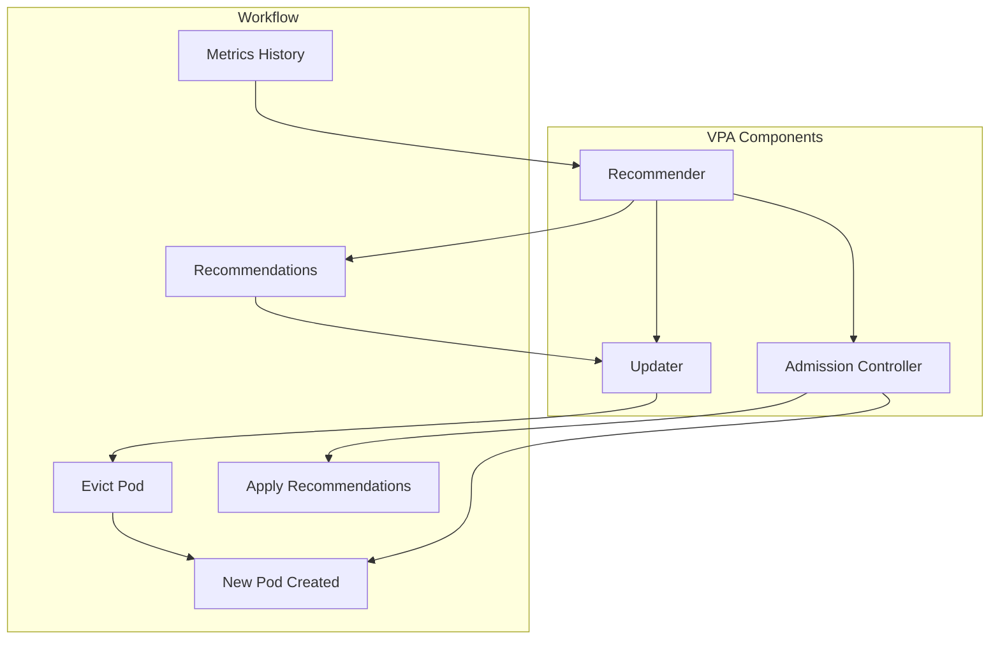

# How to Implement Vertical Pod Autoscaling (VPA) in Kubernetes

Author: [nawazdhandala](https://www.github.com/nawazdhandala)

Tags: Kubernetes, VPA, Autoscaling, Resource Management, Performance, DevOps

Description: A complete guide to implementing Vertical Pod Autoscaler (VPA) in Kubernetes, including installation, configuration modes, integration with HPA, and production best practices.

---

HPA adds more pods. VPA makes existing pods bigger (or smaller). When your application needs more CPU or memory per instance rather than more instances, VPA automatically adjusts resource requests.

## How VPA Works



VPA has three components:
- **Recommender**: Analyzes metrics and generates recommendations
- **Updater**: Evicts pods that need resizing
- **Admission Controller**: Sets resources on new pods

## Installing VPA

### Install with Kubectl

```bash
# Clone the autoscaler repo
git clone https://github.com/kubernetes/autoscaler.git
cd autoscaler/vertical-pod-autoscaler

# Install VPA
./hack/vpa-up.sh

# Verify installation
kubectl get pods -n kube-system | grep vpa
```

### Install with Helm

```bash
helm repo add cowboysysop https://cowboysysop.github.io/charts/
helm install vpa cowboysysop/vertical-pod-autoscaler \
  --namespace kube-system
```

### Verify Installation

```bash
# Check CRDs
kubectl get crd | grep verticalpodautoscaler

# Check components
kubectl get pods -n kube-system -l app.kubernetes.io/name=vpa
```

## VPA Update Modes

### Mode 1: Off (Recommendations Only)

Get recommendations without applying them. Safe for production evaluation.

```yaml
apiVersion: autoscaling.k8s.io/v1
kind: VerticalPodAutoscaler
metadata:
  name: web-api-vpa
  namespace: production
spec:
  targetRef:
    apiVersion: apps/v1
    kind: Deployment
    name: web-api
  updatePolicy:
    updateMode: "Off"
```

Check recommendations:

```bash
kubectl describe vpa web-api-vpa -n production
```

Output:
```
Recommendation:
  Container Recommendations:
    Container Name:  web-api
    Lower Bound:
      Cpu:     25m
      Memory:  262144k
    Target:
      Cpu:     100m
      Memory:  524288k
    Uncapped Target:
      Cpu:     100m
      Memory:  524288k
    Upper Bound:
      Cpu:     500m
      Memory:  1Gi
```

### Mode 2: Initial (Set on Creation Only)

Apply recommendations only when pods are created, not on running pods.

```yaml
apiVersion: autoscaling.k8s.io/v1
kind: VerticalPodAutoscaler
metadata:
  name: web-api-vpa
  namespace: production
spec:
  targetRef:
    apiVersion: apps/v1
    kind: Deployment
    name: web-api
  updatePolicy:
    updateMode: "Initial"
```

### Mode 3: Auto (Full Automation)

Automatically evict and recreate pods with new resources. Use with caution.

```yaml
apiVersion: autoscaling.k8s.io/v1
kind: VerticalPodAutoscaler
metadata:
  name: web-api-vpa
  namespace: production
spec:
  targetRef:
    apiVersion: apps/v1
    kind: Deployment
    name: web-api
  updatePolicy:
    updateMode: "Auto"
    minReplicas: 2  # Don't evict if fewer than 2 replicas
```

## Configuring Resource Policies

### Set Min/Max Boundaries

```yaml
apiVersion: autoscaling.k8s.io/v1
kind: VerticalPodAutoscaler
metadata:
  name: web-api-vpa
  namespace: production
spec:
  targetRef:
    apiVersion: apps/v1
    kind: Deployment
    name: web-api
  updatePolicy:
    updateMode: "Auto"
  resourcePolicy:
    containerPolicies:
      - containerName: web-api
        minAllowed:
          cpu: 50m
          memory: 128Mi
        maxAllowed:
          cpu: 2
          memory: 4Gi
        controlledResources: ["cpu", "memory"]
```

### Control Specific Resources Only

```yaml
resourcePolicy:
  containerPolicies:
    - containerName: web-api
      controlledResources: ["memory"]  # VPA controls memory only
      # CPU controlled by HPA
```

### Exclude Sidecars

```yaml
resourcePolicy:
  containerPolicies:
    - containerName: istio-proxy
      mode: "Off"  # Don't touch sidecars
    - containerName: web-api
      minAllowed:
        cpu: 100m
        memory: 256Mi
```

## VPA + HPA Integration

VPA and HPA conflict if both control the same metric. Here's how to use them together:

### Pattern 1: HPA on CPU, VPA on Memory

```yaml
# VPA controls memory only
apiVersion: autoscaling.k8s.io/v1
kind: VerticalPodAutoscaler
metadata:
  name: web-api-vpa
spec:
  targetRef:
    apiVersion: apps/v1
    kind: Deployment
    name: web-api
  resourcePolicy:
    containerPolicies:
      - containerName: web-api
        controlledResources: ["memory"]
---
# HPA controls replicas based on CPU
apiVersion: autoscaling/v2
kind: HorizontalPodAutoscaler
metadata:
  name: web-api-hpa
spec:
  scaleTargetRef:
    apiVersion: apps/v1
    kind: Deployment
    name: web-api
  minReplicas: 2
  maxReplicas: 20
  metrics:
    - type: Resource
      resource:
        name: cpu
        target:
          type: Utilization
          averageUtilization: 70
```

### Pattern 2: VPA Recommendations Only + HPA

```yaml
# VPA in Off mode for recommendations
apiVersion: autoscaling.k8s.io/v1
kind: VerticalPodAutoscaler
metadata:
  name: web-api-vpa
spec:
  targetRef:
    apiVersion: apps/v1
    kind: Deployment
    name: web-api
  updatePolicy:
    updateMode: "Off"  # Just get recommendations
---
# HPA does actual scaling
apiVersion: autoscaling/v2
kind: HorizontalPodAutoscaler
metadata:
  name: web-api-hpa
spec:
  scaleTargetRef:
    apiVersion: apps/v1
    kind: Deployment
    name: web-api
  minReplicas: 2
  maxReplicas: 20
  metrics:
    - type: Resource
      resource:
        name: cpu
        target:
          type: Utilization
          averageUtilization: 70
```

Then periodically apply VPA recommendations manually:

```bash
# Get recommendation
kubectl describe vpa web-api-vpa -n production | grep -A 10 "Target:"

# Update deployment with recommended values
kubectl set resources deployment/web-api -n production \
  --containers=web-api \
  --requests=cpu=100m,memory=512Mi
```

## Production Best Practices

### 1. Start with Off Mode

```yaml
updatePolicy:
  updateMode: "Off"
```

Observe recommendations for at least a week before enabling Auto.

### 2. Set Reasonable Boundaries

```yaml
resourcePolicy:
  containerPolicies:
    - containerName: web-api
      minAllowed:
        cpu: 50m        # Don't go below functional minimum
        memory: 128Mi
      maxAllowed:
        cpu: 4          # Cap at node capacity
        memory: 8Gi
```

### 3. Use minReplicas

```yaml
updatePolicy:
  updateMode: "Auto"
  minReplicas: 2  # Always keep at least 2 pods running
```

### 4. Protect with PodDisruptionBudget

```yaml
apiVersion: policy/v1
kind: PodDisruptionBudget
metadata:
  name: web-api-pdb
  namespace: production
spec:
  minAvailable: 2
  selector:
    matchLabels:
      app: web-api
```

### 5. Monitor Evictions

```bash
# Watch VPA events
kubectl get events -n production --field-selector reason=EvictedByVPA

# Check VPA status
kubectl describe vpa web-api-vpa -n production
```

## Troubleshooting VPA

### Recommendations Not Appearing

```bash
# Check VPA status
kubectl describe vpa <name> -n <namespace>

# Check recommender logs
kubectl logs -n kube-system -l app=vpa-recommender

# Ensure metrics-server is working
kubectl top pods -n <namespace>
```

### Pods Not Being Updated

1. Check updateMode is "Auto" or "Initial"
2. Check minReplicas setting
3. Check PodDisruptionBudget constraints
4. Check resourcePolicy allows changes

```bash
# Check admission controller
kubectl logs -n kube-system -l app=vpa-admission-controller

# Check updater
kubectl logs -n kube-system -l app=vpa-updater
```

### Recommendations Too Aggressive

Add boundaries:

```yaml
resourcePolicy:
  containerPolicies:
    - containerName: web-api
      maxAllowed:
        cpu: 500m      # Cap recommendations
        memory: 1Gi
```

### VPA Conflicts with Limits

If your deployment has limits but VPA recommends higher requests, pods may not start:

```yaml
# VPA recommends 600m CPU
# But deployment has limit of 500m
# Result: Invalid spec

# Fix: Either remove limits or set maxAllowed below limits
resourcePolicy:
  containerPolicies:
    - containerName: web-api
      maxAllowed:
        cpu: 400m  # Below deployment limit
```

## Monitoring VPA

### Prometheus Metrics

Key VPA metrics:
- `vpa_recommender_recommendation_latency_seconds`
- `vpa_recommender_aggregate_container_states`
- `vpa_updater_eviction_total`

```yaml
apiVersion: monitoring.coreos.com/v1
kind: PrometheusRule
metadata:
  name: vpa-alerts
spec:
  groups:
    - name: vpa
      rules:
        - alert: VPARecommendationSignificantChange
          expr: |
            abs(
              vpa_recommender_recommendation_cpu_target
              - on(namespace, vpa, container)
              kube_pod_container_resource_requests{resource="cpu"}
            ) / kube_pod_container_resource_requests{resource="cpu"} > 0.5
          for: 1h
          labels:
            severity: info
          annotations:
            summary: "VPA recommendation differs >50% from current request"
```

### Dashboard Queries

```promql
# Current vs Recommended CPU
vpa_recommender_recommendation_cpu_target{namespace="production"}
vs
sum(kube_pod_container_resource_requests{resource="cpu", namespace="production"}) by (pod)

# Eviction rate
rate(vpa_updater_eviction_total[1h])
```

## VPA for Different Workloads

### Stateless Web Services

```yaml
apiVersion: autoscaling.k8s.io/v1
kind: VerticalPodAutoscaler
metadata:
  name: web-api-vpa
spec:
  targetRef:
    apiVersion: apps/v1
    kind: Deployment
    name: web-api
  updatePolicy:
    updateMode: "Auto"
    minReplicas: 2
  resourcePolicy:
    containerPolicies:
      - containerName: web-api
        minAllowed:
          cpu: 100m
          memory: 256Mi
        maxAllowed:
          cpu: 2
          memory: 4Gi
```

### Stateful Applications

```yaml
apiVersion: autoscaling.k8s.io/v1
kind: VerticalPodAutoscaler
metadata:
  name: postgres-vpa
spec:
  targetRef:
    apiVersion: apps/v1
    kind: StatefulSet
    name: postgres
  updatePolicy:
    updateMode: "Off"  # Manual updates for databases
```

### CronJobs

```yaml
apiVersion: autoscaling.k8s.io/v1
kind: VerticalPodAutoscaler
metadata:
  name: batch-job-vpa
spec:
  targetRef:
    apiVersion: batch/v1
    kind: CronJob
    name: nightly-batch
  updatePolicy:
    updateMode: "Auto"
  resourcePolicy:
    containerPolicies:
      - containerName: batch
        minAllowed:
          cpu: 500m
          memory: 1Gi
        maxAllowed:
          cpu: 4
          memory: 8Gi
```

## When to Use VPA vs HPA

| Use VPA When | Use HPA When |
|--------------|--------------|
| Single-instance applications | Stateless, horizontally scalable apps |
| Memory-bound workloads | CPU-bound workloads |
| Applications that can't scale horizontally | Load varies throughout the day |
| You want automated resource tuning | You need rapid response to traffic |

Best approach: Use both - VPA for right-sizing, HPA for scaling replicas.

---

VPA eliminates the guesswork from resource configuration. Start with Off mode to get recommendations, validate them against your application's behavior, then gradually enable Auto mode with proper boundaries and monitoring. Combined with HPA, you get both the right size pods and the right number of pods.
