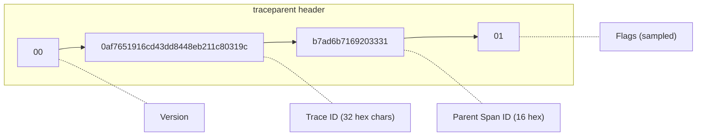

# How to Implement Distributed Tracing in Node.js Microservices

Author: [nawazdhandala](https://github.com/nawazdhandala)

Tags: NodeJS, OpenTelemetry, Tracing, Distributed Systems, Observability, DevOps

Description: Learn to implement distributed tracing across Node.js microservices with context propagation for HTTP, gRPC, and message queues using OpenTelemetry.

---

When a request flows through multiple microservices, understanding where time is spent becomes challenging. Distributed tracing connects the dots by propagating trace context across service boundaries, giving you end-to-end visibility into request flows.

For foundational concepts, see our guides on [traces and spans in OpenTelemetry](https://oneuptime.com/blog/post/2025-08-27-traces-and-spans-in-opentelemetry/view) and [APM tracing for user journeys](https://oneuptime.com/blog/post/2025-10-01-mastering-apm-tracing-user-journeys-in-distributed-systems/view).

## The W3C Trace Context Standard

OpenTelemetry uses W3C Trace Context for propagation:



## Basic Setup

### Shared Tracing Configuration

Create a reusable tracing module that all services can import. This ensures consistent configuration and allows centralized updates.

```javascript
// tracing.js - shared across all microservices
const { NodeSDK } = require('@opentelemetry/sdk-node');
const { getNodeAutoInstrumentations } = require('@opentelemetry/auto-instrumentations-node');
const { OTLPTraceExporter } = require('@opentelemetry/exporter-trace-otlp-http');
const { Resource } = require('@opentelemetry/resources');
const { SemanticResourceAttributes } = require('@opentelemetry/semantic-conventions');
const { BatchSpanProcessor } = require('@opentelemetry/sdk-trace-base');
const { W3CTraceContextPropagator } = require('@opentelemetry/core');

function initTracing(serviceName) {
  const exporter = new OTLPTraceExporter({
    url: process.env.OTEL_EXPORTER_OTLP_ENDPOINT || 'http://collector:4318/v1/traces',
  });

  const sdk = new NodeSDK({
    resource: new Resource({
      [SemanticResourceAttributes.SERVICE_NAME]: serviceName,
      [SemanticResourceAttributes.SERVICE_VERSION]: process.env.SERVICE_VERSION || '1.0.0',
      [SemanticResourceAttributes.DEPLOYMENT_ENVIRONMENT]: process.env.NODE_ENV || 'development',
    }),
    spanProcessor: new BatchSpanProcessor(exporter),
    textMapPropagator: new W3CTraceContextPropagator(),
    instrumentations: [
      getNodeAutoInstrumentations({
        '@opentelemetry/instrumentation-http': { enabled: true },
        '@opentelemetry/instrumentation-express': { enabled: true },
        '@opentelemetry/instrumentation-grpc': { enabled: true },
      }),
    ],
  });

  sdk.start();

  process.on('SIGTERM', async () => {
    await sdk.shutdown();
    process.exit(0);
  });

  return sdk;
}

module.exports = { initTracing };
```

## HTTP Context Propagation

### Service A: API Gateway

The API gateway is the entry point for requests. Auto-instrumentation automatically propagates trace context to downstream services via HTTP headers.

```javascript
// gateway-service/index.js
// Initialize tracing FIRST before any other imports
require('./tracing').initTracing('api-gateway');

const express = require('express');
const { trace, context, propagation, SpanStatusCode } = require('@opentelemetry/api');

const app = express();
const tracer = trace.getTracer('api-gateway');

// The trace context is automatically propagated by auto-instrumentation
app.get('/orders/:id', async (req, res) => {
  const span = trace.getActiveSpan();
  span.setAttribute('order.id', req.params.id);

  try {
    // Fetch from order service - context propagated automatically
    const orderResponse = await fetch(
      `http://order-service:3001/orders/${req.params.id}`
    );
    const order = await orderResponse.json();

    // Fetch from user service
    const userResponse = await fetch(
      `http://user-service:3002/users/${order.userId}`
    );
    const user = await userResponse.json();

    res.json({ order, user });
  } catch (error) {
    span.recordException(error);
    span.setStatus({ code: SpanStatusCode.ERROR });
    res.status(500).json({ error: error.message });
  }
});

app.listen(3000);
```

### Service B: Order Service

The order service receives requests with trace context in headers. OpenTelemetry automatically extracts this context and creates child spans, maintaining the parent-child relationship across services.

```javascript
// order-service/index.js
require('./tracing').initTracing('order-service');

const express = require('express');
const { trace, SpanStatusCode } = require('@opentelemetry/api');

const app = express();
const tracer = trace.getTracer('order-service');

app.get('/orders/:id', async (req, res) => {
  // Active span is a child of the gateway's span
  const span = trace.getActiveSpan();
  span.setAttribute('order.id', req.params.id);

  const order = await tracer.startActiveSpan('fetch-order-from-db', async (dbSpan) => {
    try {
      const result = await db.orders.findById(req.params.id);
      dbSpan.setAttribute('db.rows_affected', result ? 1 : 0);
      dbSpan.setStatus({ code: SpanStatusCode.OK });
      return result;
    } catch (error) {
      dbSpan.recordException(error);
      dbSpan.setStatus({ code: SpanStatusCode.ERROR });
      throw error;
    } finally {
      dbSpan.end();
    }
  });

  if (!order) {
    return res.status(404).json({ error: 'Order not found' });
  }

  res.json(order);
});

app.listen(3001);
```

### Manual Context Propagation

When auto-instrumentation is not available (custom HTTP clients, legacy code), manually inject trace context into outgoing request headers.

```javascript
const { trace, context, propagation, SpanStatusCode } = require('@opentelemetry/api');

async function callService(url, options = {}) {
  const tracer = trace.getTracer('http-client');

  return tracer.startActiveSpan(`HTTP GET ${new URL(url).hostname}`, async (span) => {
    const headers = { ...options.headers };

    // Inject trace context into headers
    propagation.inject(context.active(), headers);

    span.setAttributes({
      'http.method': 'GET',
      'http.url': url,
    });

    try {
      const response = await fetch(url, { ...options, headers });
      span.setAttribute('http.status_code', response.status);

      if (!response.ok) {
        span.setStatus({ code: SpanStatusCode.ERROR });
      }

      return response;
    } catch (error) {
      span.recordException(error);
      span.setStatus({ code: SpanStatusCode.ERROR });
      throw error;
    } finally {
      span.end();
    }
  });
}
```

## gRPC Context Propagation

### gRPC Server

```javascript
// grpc-server.js
require('./tracing').initTracing('grpc-order-service');

const grpc = require('@grpc/grpc-js');
const protoLoader = require('@grpc/proto-loader');
const { trace, SpanStatusCode } = require('@opentelemetry/api');

const tracer = trace.getTracer('grpc-order-service');

const orderService = {
  GetOrder: async (call, callback) => {
    // Span is automatically created by instrumentation
    const span = trace.getActiveSpan();
    span.setAttribute('order.id', call.request.orderId);

    try {
      const order = await db.orders.findById(call.request.orderId);

      if (!order) {
        span.setStatus({ code: SpanStatusCode.ERROR, message: 'Not found' });
        return callback({
          code: grpc.status.NOT_FOUND,
          message: 'Order not found',
        });
      }

      span.setStatus({ code: SpanStatusCode.OK });
      callback(null, order);
    } catch (error) {
      span.recordException(error);
      span.setStatus({ code: SpanStatusCode.ERROR });
      callback(error);
    }
  },
};

const server = new grpc.Server();
server.addService(orderProto.OrderService.service, orderService);
server.bindAsync('0.0.0.0:50051', grpc.ServerCredentials.createInsecure(), () => {
  server.start();
});
```

### gRPC Client

```javascript
// grpc-client.js
const grpc = require('@grpc/grpc-js');
const { trace, propagation, context } = require('@opentelemetry/api');

const client = new orderProto.OrderService(
  'order-service:50051',
  grpc.credentials.createInsecure()
);

async function getOrder(orderId) {
  const tracer = trace.getTracer('api-gateway');

  return tracer.startActiveSpan('grpc-GetOrder', async (span) => {
    const metadata = new grpc.Metadata();

    // Inject trace context into gRPC metadata
    propagation.inject(context.active(), metadata, {
      set: (carrier, key, value) => carrier.set(key, value),
    });

    return new Promise((resolve, reject) => {
      client.GetOrder({ orderId }, metadata, (error, response) => {
        if (error) {
          span.recordException(error);
          span.setStatus({ code: SpanStatusCode.ERROR });
          reject(error);
        } else {
          span.setStatus({ code: SpanStatusCode.OK });
          resolve(response);
        }
        span.end();
      });
    });
  });
}
```

## Message Queue Context Propagation

Message queues (RabbitMQ, Kafka) decouple services but require explicit trace context propagation. Embed the trace context in message headers so consumers can link their processing to the original request.

### Publishing with Trace Context

```javascript
// publisher.js
const amqp = require('amqplib');
const { trace, context, propagation, SpanStatusCode } = require('@opentelemetry/api');

const tracer = trace.getTracer('order-service');

async function publishOrderCreated(order) {
  return tracer.startActiveSpan('publish-order-created', {
    attributes: {
      'messaging.system': 'rabbitmq',
      'messaging.destination': 'orders.created',
      'messaging.operation': 'publish',
      'order.id': order.id,
    },
  }, async (span) => {
    const channel = await getChannel();

    // Inject trace context into message headers
    const headers = {};
    propagation.inject(context.active(), headers);

    const message = {
      data: order,
      metadata: {
        timestamp: Date.now(),
        traceContext: headers,
      },
    };

    try {
      channel.publish(
        'orders',
        'orders.created',
        Buffer.from(JSON.stringify(message)),
        {
          headers, // Include trace context in AMQP headers
          persistent: true,
        }
      );

      span.setStatus({ code: SpanStatusCode.OK });
    } catch (error) {
      span.recordException(error);
      span.setStatus({ code: SpanStatusCode.ERROR });
      throw error;
    } finally {
      span.end();
    }
  });
}
```

### Consuming with Trace Context

```javascript
// consumer.js
require('./tracing').initTracing('notification-service');

const amqp = require('amqplib');
const { trace, context, propagation, SpanStatusCode, ROOT_CONTEXT } = require('@opentelemetry/api');

const tracer = trace.getTracer('notification-service');

async function startConsumer() {
  const channel = await getChannel();

  channel.consume('order-notifications', async (msg) => {
    if (!msg) return;

    const message = JSON.parse(msg.content.toString());

    // Extract trace context from message headers
    const parentContext = propagation.extract(
      ROOT_CONTEXT,
      msg.properties.headers
    );

    // Create span as child of the publishing span
    context.with(parentContext, async () => {
      const span = tracer.startSpan('process-order-notification', {
        attributes: {
          'messaging.system': 'rabbitmq',
          'messaging.destination': 'order-notifications',
          'messaging.operation': 'process',
          'order.id': message.data.id,
        },
      });

      try {
        await sendNotification(message.data);
        span.setStatus({ code: SpanStatusCode.OK });
        channel.ack(msg);
      } catch (error) {
        span.recordException(error);
        span.setStatus({ code: SpanStatusCode.ERROR });
        channel.nack(msg, false, true); // Requeue
      } finally {
        span.end();
      }
    });
  });
}
```

## Kafka Context Propagation

```javascript
// kafka-producer.js
const { Kafka } = require('kafkajs');
const { trace, context, propagation, SpanStatusCode } = require('@opentelemetry/api');

const kafka = new Kafka({ brokers: ['kafka:9092'] });
const producer = kafka.producer();
const tracer = trace.getTracer('order-service');

async function publishEvent(topic, event) {
  return tracer.startActiveSpan(`kafka-publish-${topic}`, {
    attributes: {
      'messaging.system': 'kafka',
      'messaging.destination': topic,
      'messaging.operation': 'publish',
    },
  }, async (span) => {
    // Inject trace context into Kafka headers
    const headers = {};
    propagation.inject(context.active(), headers);

    // Convert headers to Kafka format
    const kafkaHeaders = {};
    for (const [key, value] of Object.entries(headers)) {
      kafkaHeaders[key] = Buffer.from(value);
    }

    try {
      await producer.send({
        topic,
        messages: [{
          key: event.id,
          value: JSON.stringify(event),
          headers: kafkaHeaders,
        }],
      });

      span.setStatus({ code: SpanStatusCode.OK });
    } catch (error) {
      span.recordException(error);
      span.setStatus({ code: SpanStatusCode.ERROR });
      throw error;
    } finally {
      span.end();
    }
  });
}

// kafka-consumer.js
const consumer = kafka.consumer({ groupId: 'notification-service' });

async function startConsumer() {
  await consumer.subscribe({ topic: 'orders', fromBeginning: false });

  await consumer.run({
    eachMessage: async ({ topic, partition, message }) => {
      // Extract trace context from Kafka headers
      const headers = {};
      for (const [key, value] of Object.entries(message.headers || {})) {
        headers[key] = value.toString();
      }

      const parentContext = propagation.extract(ROOT_CONTEXT, headers);

      await context.with(parentContext, async () => {
        const span = tracer.startSpan(`kafka-consume-${topic}`, {
          attributes: {
            'messaging.system': 'kafka',
            'messaging.destination': topic,
            'messaging.kafka.partition': partition,
          },
        });

        try {
          const event = JSON.parse(message.value.toString());
          await processEvent(event);
          span.setStatus({ code: SpanStatusCode.OK });
        } catch (error) {
          span.recordException(error);
          span.setStatus({ code: SpanStatusCode.ERROR });
          throw error;
        } finally {
          span.end();
        }
      });
    },
  });
}
```

## Async Job Context Propagation

For background jobs triggered by HTTP requests:

```javascript
const { trace, context, propagation, ROOT_CONTEXT } = require('@opentelemetry/api');

// When creating a job, serialize trace context
async function createBackgroundJob(jobData) {
  const traceContext = {};
  propagation.inject(context.active(), traceContext);

  await jobQueue.add('process-report', {
    ...jobData,
    _traceContext: traceContext, // Include trace context
  });
}

// When processing a job, restore trace context
async function processJob(job) {
  const parentContext = propagation.extract(
    ROOT_CONTEXT,
    job.data._traceContext || {}
  );

  await context.with(parentContext, async () => {
    const tracer = trace.getTracer('job-processor');
    const span = tracer.startSpan('process-report-job', {
      attributes: {
        'job.id': job.id,
        'job.name': job.name,
      },
    });

    try {
      await generateReport(job.data);
      span.setStatus({ code: SpanStatusCode.OK });
    } catch (error) {
      span.recordException(error);
      span.setStatus({ code: SpanStatusCode.ERROR });
      throw error;
    } finally {
      span.end();
    }
  });
}
```

## Trace Visualization

A distributed trace across services looks like:

```mermaid
gantt
    title Distributed Trace: GET /orders/123
    dateFormat X
    axisFormat %L ms

    section API Gateway
    gateway.request           :0, 150

    section Order Service
    order.fetch              :10, 50

    section User Service
    user.fetch               :20, 40

    section Database
    db.query (orders)        :15, 25
    db.query (users)         :25, 35

    section Notification
    notification.send        :60, 100
```



## Best Practices

| Practice | Why |
|----------|-----|
| **Use semantic conventions** | Consistent attribute names |
| **Propagate context everywhere** | Complete trace visibility |
| **Add business attributes** | Meaningful debugging |
| **Sample appropriately** | Control costs at scale |
| **Include error details** | Faster debugging |

## Summary

| Propagation Type | Method |
|-----------------|--------|
| **HTTP** | Auto-instrumentation or manual header injection |
| **gRPC** | Metadata injection |
| **Message Queues** | Message header injection |
| **Background Jobs** | Serialize context with job data |

Distributed tracing transforms your microservices from a black box into a transparent system where you can follow any request across all service boundaries. Combined with proper instrumentation and context propagation, you gain the visibility needed to debug issues and optimize performance in distributed systems.
