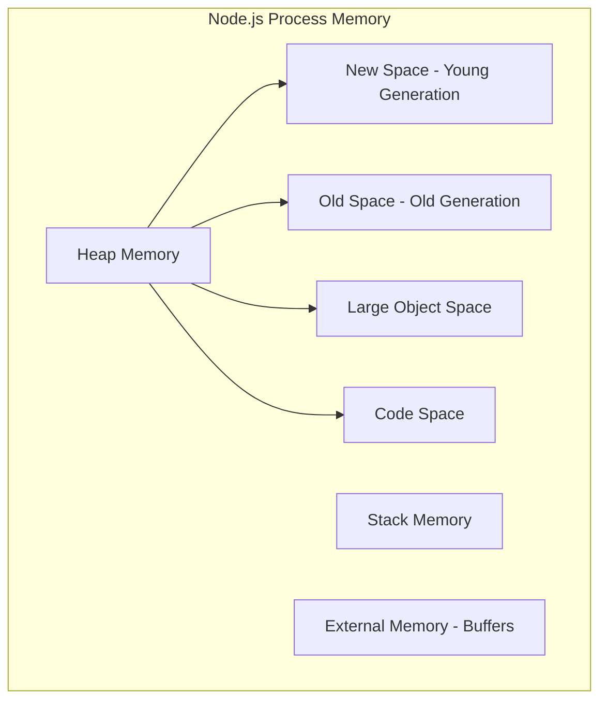

# How to Optimize Node.js Memory Usage and Prevent Memory Leaks

Author: [nawazdhandala](https://github.com/nawazdhandala)

Tags: NodeJS, Performance, Debugging, DevOps, Reliability

Description: Learn heap analysis, weak references, garbage collection tuning, and proven patterns to optimize Node.js memory usage and prevent memory leaks in production.

---

Memory leaks in Node.js are insidious. Your application starts fine, serves traffic for hours or days, then suddenly crashes with `FATAL ERROR: CALL_AND_RETRY_LAST Allocation failed - JavaScript heap out of memory`. Finding and fixing these leaks before they hit production requires understanding how V8's garbage collector works and what patterns cause memory to accumulate.

## Understanding Node.js Memory

Node.js memory is divided into several regions:



| Memory Region | Purpose | Size |
|--------------|---------|------|
| **New Space** | Short-lived objects, frequently collected | 1-8 MB |
| **Old Space** | Long-lived objects, less frequently collected | Up to heap limit |
| **Large Object Space** | Objects > 512KB | As needed |
| **External Memory** | Buffers, native bindings | Outside V8 heap |

## Monitoring Memory Usage

### Basic Memory Metrics

```javascript
function getMemoryUsage() {
  const usage = process.memoryUsage();
  return {
    heapTotal: `${Math.round(usage.heapTotal / 1024 / 1024)} MB`,
    heapUsed: `${Math.round(usage.heapUsed / 1024 / 1024)} MB`,
    external: `${Math.round(usage.external / 1024 / 1024)} MB`,
    rss: `${Math.round(usage.rss / 1024 / 1024)} MB`,
  };
}

// Log periodically
setInterval(() => {
  console.log('Memory:', getMemoryUsage());
}, 30000);
```

### Exposing Memory Metrics with Prometheus

```javascript
const prometheus = require('prom-client');

// Create gauges for memory metrics
const heapUsedGauge = new prometheus.Gauge({
  name: 'nodejs_heap_used_bytes',
  help: 'Node.js heap used in bytes',
});

const heapTotalGauge = new prometheus.Gauge({
  name: 'nodejs_heap_total_bytes',
  help: 'Node.js heap total in bytes',
});

const externalGauge = new prometheus.Gauge({
  name: 'nodejs_external_memory_bytes',
  help: 'Node.js external memory in bytes',
});

// Update metrics
function updateMemoryMetrics() {
  const usage = process.memoryUsage();
  heapUsedGauge.set(usage.heapUsed);
  heapTotalGauge.set(usage.heapTotal);
  externalGauge.set(usage.external);
}

setInterval(updateMemoryMetrics, 5000);
```

## Common Memory Leak Patterns

### 1. Global Variables and Caches

```javascript
// LEAK: Unbounded global cache
const cache = {};

function processRequest(userId, data) {
  cache[userId] = data; // Never cleaned up
  return cache[userId];
}

// FIX: Use bounded cache with TTL
const NodeCache = require('node-cache');
const cache = new NodeCache({
  stdTTL: 600,     // 10 minutes default TTL
  maxKeys: 10000,  // Maximum number of keys
  checkperiod: 120 // Check for expired keys every 2 minutes
});

function processRequest(userId, data) {
  cache.set(userId, data);
  return cache.get(userId);
}
```

### 2. Event Listener Accumulation

```javascript
// LEAK: New listener added on every request
const EventEmitter = require('events');
const emitter = new EventEmitter();

function handleRequest(req, res) {
  emitter.on('data', (data) => {
    res.write(data);
  });
}

// Warning sign: EventEmitter memory leak warning
// (node:12345) MaxListenersExceededWarning

// FIX: Clean up listeners
function handleRequest(req, res) {
  const handler = (data) => res.write(data);
  emitter.on('data', handler);

  req.on('close', () => {
    emitter.removeListener('data', handler);
  });
}

// BETTER: Use once() for one-time listeners
function handleRequest(req, res) {
  emitter.once('data', (data) => {
    res.write(data);
    res.end();
  });
}
```

### 3. Closures Capturing Large Scopes

```javascript
// LEAK: Closure captures entire scope
function createHandler(largeData) {
  const processedData = transform(largeData);
  // largeData is captured by closure even though unused

  return function handler() {
    return processedData;
  };
}

// FIX: Null out unnecessary references
function createHandler(largeData) {
  const processedData = transform(largeData);
  largeData = null; // Release reference

  return function handler() {
    return processedData;
  };
}

// BETTER: Extract only what's needed
function createHandler(largeData) {
  const { id, name } = extractEssentials(largeData);

  return function handler() {
    return { id, name };
  };
}
```

### 4. Forgotten Timers and Intervals

```javascript
// LEAK: Intervals never cleared
class DataFetcher {
  constructor() {
    this.data = [];
    // This interval runs forever
    setInterval(() => {
      this.fetchData();
    }, 1000);
  }

  fetchData() {
    this.data.push(/* large object */);
  }
}

// FIX: Track and clear timers
class DataFetcher {
  constructor() {
    this.data = [];
    this.intervalId = setInterval(() => {
      this.fetchData();
    }, 1000);
  }

  fetchData() {
    this.data.push(/* large object */);
    // Trim data to prevent unbounded growth
    if (this.data.length > 1000) {
      this.data = this.data.slice(-1000);
    }
  }

  destroy() {
    clearInterval(this.intervalId);
    this.data = [];
  }
}
```

### 5. Streams Not Properly Closed

```javascript
// LEAK: Stream error handler missing, stream never closed
function processFile(path) {
  const stream = fs.createReadStream(path);

  stream.on('data', (chunk) => {
    // Process chunk
  });

  // If error occurs, stream stays open
}

// FIX: Handle all stream events
function processFile(path) {
  return new Promise((resolve, reject) => {
    const stream = fs.createReadStream(path);
    const chunks = [];

    stream.on('data', (chunk) => chunks.push(chunk));
    stream.on('end', () => resolve(Buffer.concat(chunks)));
    stream.on('error', (err) => {
      stream.destroy(); // Ensure stream is closed
      reject(err);
    });
  });
}

// BETTER: Use pipeline for automatic cleanup
const { pipeline } = require('stream/promises');

async function processFile(path, outputPath) {
  await pipeline(
    fs.createReadStream(path),
    transformStream,
    fs.createWriteStream(outputPath)
  );
}
```

## Using Weak References

WeakMap and WeakSet hold "weak" references that don't prevent garbage collection:

```javascript
// LEAK: Regular Map keeps objects alive
const cache = new Map();

function cacheObject(key, value) {
  cache.set(key, value);
  // value can never be GC'd while in cache
}

// FIX: WeakMap allows GC when key is no longer referenced
const cache = new WeakMap();

function cacheObject(obj, metadata) {
  cache.set(obj, metadata);
  // When obj is no longer referenced elsewhere,
  // both obj and metadata can be GC'd
}

// Use case: Attaching metadata to DOM nodes or external objects
const nodeMetadata = new WeakMap();

function trackNode(node) {
  nodeMetadata.set(node, {
    createdAt: Date.now(),
    accessCount: 0,
  });
}

// When node is removed from DOM and dereferenced,
// the metadata is automatically cleaned up
```

### WeakRef for Optional Caching

```javascript
// WeakRef allows you to hold a reference that may be GC'd
class OptionalCache {
  constructor() {
    this.cache = new Map();
  }

  set(key, value) {
    this.cache.set(key, new WeakRef(value));
  }

  get(key) {
    const ref = this.cache.get(key);
    if (!ref) return undefined;

    const value = ref.deref();
    if (value === undefined) {
      // Object was garbage collected
      this.cache.delete(key);
    }
    return value;
  }
}

// FinalizationRegistry for cleanup callbacks
const registry = new FinalizationRegistry((heldValue) => {
  console.log(`Object with id ${heldValue} was garbage collected`);
});

function trackObject(obj, id) {
  registry.register(obj, id);
}
```

## Garbage Collection Tuning

### Understanding GC Modes

```bash
# See GC activity
node --trace-gc app.js

# Output:
# [12345:0x...]    10 ms: Scavenge 4.0 (4.5) -> 3.5 (5.5) MB, 1.2 / 0.0 ms
# [12345:0x...]  1000 ms: Mark-sweep 50.0 (60.0) -> 35.0 (60.0) MB, 50.0 / 0.0 ms
```

| GC Type | When | Impact |
|---------|------|--------|
| **Scavenge** | New space full | Fast, ~1-10ms |
| **Mark-sweep** | Old space pressure | Slow, ~50-100ms |
| **Mark-compact** | Memory fragmentation | Slowest, causes pauses |

### Tuning Heap Size

```bash
# Increase max heap size (default ~1.5GB on 64-bit)
node --max-old-space-size=4096 app.js  # 4GB

# Increase new space size for high-allocation apps
node --max-semi-space-size=64 app.js  # 64MB (default 16MB)

# Expose GC for manual triggering (use carefully)
node --expose-gc app.js
```

### Manual GC Triggering (Use Sparingly)

```javascript
// Only available with --expose-gc flag
if (global.gc) {
  // Force garbage collection
  global.gc();

  // Or force full GC
  global.gc(true);
}

// Use case: Before taking heap snapshots
async function takeCleanHeapSnapshot() {
  if (global.gc) {
    global.gc();
    global.gc(); // Run twice to clean finalizers
  }

  // Small delay for GC to complete
  await new Promise(resolve => setTimeout(resolve, 100));

  // Now take snapshot
  return takeHeapSnapshot();
}
```

## Memory-Efficient Patterns

### Stream Large Data Instead of Loading

```javascript
// BAD: Loads entire file into memory
async function processLargeFile(path) {
  const content = await fs.promises.readFile(path, 'utf8');
  const lines = content.split('\n');

  for (const line of lines) {
    await processLine(line);
  }
}

// GOOD: Stream line by line
const readline = require('readline');

async function processLargeFile(path) {
  const stream = fs.createReadStream(path);
  const rl = readline.createInterface({ input: stream });

  for await (const line of rl) {
    await processLine(line);
  }
}
```

### Buffer Pooling

```javascript
// BAD: Creates new buffer for each operation
function processData(data) {
  const buffer = Buffer.alloc(1024);
  // Use buffer
  // Buffer becomes garbage
}

// GOOD: Reuse buffers from a pool
class BufferPool {
  constructor(size, bufferSize) {
    this.pool = [];
    this.bufferSize = bufferSize;

    for (let i = 0; i < size; i++) {
      this.pool.push(Buffer.alloc(bufferSize));
    }
  }

  acquire() {
    return this.pool.pop() || Buffer.alloc(this.bufferSize);
  }

  release(buffer) {
    buffer.fill(0); // Clear sensitive data
    if (this.pool.length < 100) {
      this.pool.push(buffer);
    }
  }
}

const pool = new BufferPool(10, 1024);

function processData(data) {
  const buffer = pool.acquire();
  try {
    // Use buffer
  } finally {
    pool.release(buffer);
  }
}
```

### Pagination for Large Query Results

```javascript
// BAD: Load all results into memory
async function getAllUsers() {
  return await db.query('SELECT * FROM users'); // Could be millions
}

// GOOD: Paginate results
async function* getAllUsers(batchSize = 1000) {
  let offset = 0;

  while (true) {
    const users = await db.query(
      'SELECT * FROM users LIMIT ? OFFSET ?',
      [batchSize, offset]
    );

    if (users.length === 0) break;

    yield* users;
    offset += batchSize;
  }
}

// Usage
for await (const user of getAllUsers()) {
  await processUser(user);
}
```

## Detecting Memory Leaks

### Memory Growth Monitoring

```javascript
class MemoryLeakDetector {
  constructor(options = {}) {
    this.samples = [];
    this.maxSamples = options.maxSamples || 60;
    this.threshold = options.threshold || 1.5; // 50% growth
    this.intervalMs = options.intervalMs || 60000;

    this.start();
  }

  start() {
    this.intervalId = setInterval(() => {
      this.sample();
    }, this.intervalMs);
  }

  sample() {
    const usage = process.memoryUsage();
    this.samples.push({
      timestamp: Date.now(),
      heapUsed: usage.heapUsed,
    });

    if (this.samples.length > this.maxSamples) {
      this.samples.shift();
    }

    this.analyze();
  }

  analyze() {
    if (this.samples.length < 10) return;

    const first = this.samples[0].heapUsed;
    const last = this.samples[this.samples.length - 1].heapUsed;
    const growth = last / first;

    if (growth > this.threshold) {
      console.error(`Memory leak detected: ${Math.round((growth - 1) * 100)}% growth`);
      console.error(`Heap: ${Math.round(first / 1024 / 1024)}MB -> ${Math.round(last / 1024 / 1024)}MB`);

      // Take heap snapshot for investigation
      this.takeSnapshot();
    }
  }

  async takeSnapshot() {
    const inspector = require('inspector');
    const session = new inspector.Session();
    session.connect();

    const chunks = [];
    session.on('HeapProfiler.addHeapSnapshotChunk', (m) => {
      chunks.push(m.params.chunk);
    });

    await new Promise((resolve) => {
      session.post('HeapProfiler.takeHeapSnapshot', null, resolve);
    });

    const filename = `heap-leak-${Date.now()}.heapsnapshot`;
    require('fs').writeFileSync(filename, chunks.join(''));
    console.error(`Heap snapshot saved to ${filename}`);

    session.disconnect();
  }

  stop() {
    clearInterval(this.intervalId);
  }
}

// Start monitoring
new MemoryLeakDetector({
  threshold: 1.3, // Alert on 30% growth
  intervalMs: 60000,
});
```

### Integration with Observability

For production monitoring, send memory metrics to your observability platform:

```javascript
const { metrics } = require('@opentelemetry/api');

const meter = metrics.getMeter('nodejs-memory');

const heapUsedGauge = meter.createObservableGauge('nodejs.heap.used', {
  description: 'Heap memory used in bytes',
  unit: 'bytes',
});

const heapTotalGauge = meter.createObservableGauge('nodejs.heap.total', {
  description: 'Total heap memory in bytes',
  unit: 'bytes',
});

heapUsedGauge.addCallback((result) => {
  result.observe(process.memoryUsage().heapUsed);
});

heapTotalGauge.addCallback((result) => {
  result.observe(process.memoryUsage().heapTotal);
});
```

## Summary: Memory Optimization Checklist

| Category | Action |
|----------|--------|
| **Caches** | Use bounded caches with TTL and max size |
| **Events** | Always remove listeners when done |
| **Closures** | Null out large objects captured in closures |
| **Timers** | Clear intervals and timeouts |
| **Streams** | Use pipeline() or handle all events including error |
| **Large Data** | Stream instead of loading into memory |
| **Queries** | Paginate large result sets |
| **Buffers** | Consider pooling for high-frequency allocations |
| **Monitoring** | Track heap usage over time, alert on growth |
| **GC Tuning** | Adjust heap size for your workload |

Memory management in Node.js requires vigilance. The garbage collector handles most cases automatically, but understanding where it can't help and writing memory-efficient code keeps your applications running reliably under sustained load.
