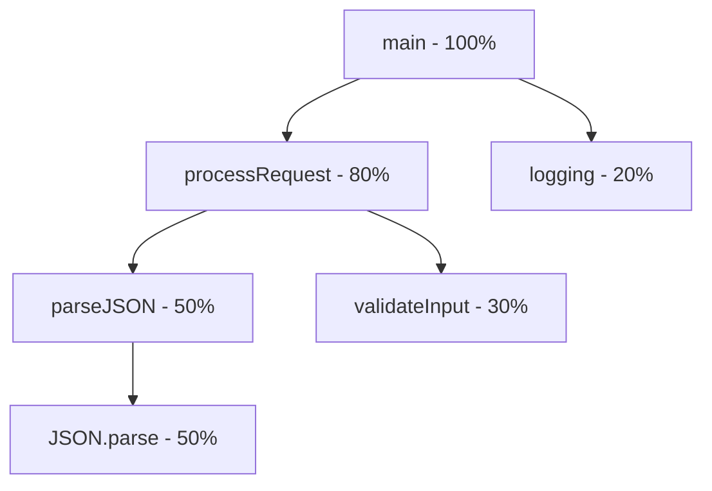

# How to Profile Node.js Applications with V8 Inspector and Chrome DevTools

Author: [nawazdhandala](https://github.com/nawazdhandala)

Tags: NodeJS, Performance, Profiling, Debugging, DevOps

Description: Master CPU profiling, heap snapshots, and flame graphs in Node.js using the V8 Inspector and Chrome DevTools to identify and fix performance bottlenecks.

---

Performance issues in Node.js applications often hide in unexpected places. A single synchronous operation in an async code path, a memory leak from unclosed connections, or an expensive JSON serialization can tank your p99 latencies. The V8 Inspector and Chrome DevTools give you the tools to find these problems systematically.

## Why Profile Your Node.js Applications?

Logs and metrics tell you *that* something is slow. Profiling tells you *where* the time is going:

| Approach | What It Answers |
|----------|-----------------|
| **Logs** | "This request took 2 seconds" |
| **Metrics** | "Average latency increased 50%" |
| **CPU Profile** | "60% of time is spent in `JSON.stringify`" |
| **Heap Snapshot** | "Memory grew from 200MB to 800MB because of cached objects" |

## Connecting to the V8 Inspector

Node.js has built-in inspector support. Start your application with the `--inspect` flag:

```bash
# Start with inspector on default port 9229
node --inspect app.js

# Start with inspector and break on first line
node --inspect-brk app.js

# Start with inspector on custom port
node --inspect=0.0.0.0:9230 app.js
```

You'll see output like:

```
Debugger listening on ws://127.0.0.1:9229/a1b2c3d4-e5f6-7890-abcd-ef1234567890
For help, see: https://nodejs.org/en/docs/inspector
```

### Connecting Chrome DevTools

1. Open Chrome and navigate to `chrome://inspect`
2. Click "Configure" and add `localhost:9229`
3. Your Node.js process appears under "Remote Target"
4. Click "inspect" to open DevTools

### Connecting Programmatically

For production environments where you can't restart with `--inspect`:

```javascript
// Enable inspector dynamically
const inspector = require('inspector');

// Open inspector on port 9229
inspector.open(9229, '127.0.0.1', true);

// You can also close it when done
// inspector.close();
```

## CPU Profiling: Finding Where Time Goes

### Recording a CPU Profile

In Chrome DevTools connected to your Node.js process:

1. Go to the **Performance** tab (or **Profiler** tab)
2. Click **Record** (circle icon)
3. Trigger the slow operation in your application
4. Click **Stop**

### Programmatic CPU Profiling

For automated profiling or production sampling:

```javascript
const inspector = require('inspector');
const fs = require('fs');

const session = new inspector.Session();
session.connect();

function startProfiling() {
  return new Promise((resolve, reject) => {
    session.post('Profiler.enable', (err) => {
      if (err) return reject(err);
      session.post('Profiler.start', (err) => {
        if (err) return reject(err);
        resolve();
      });
    });
  });
}

function stopProfiling() {
  return new Promise((resolve, reject) => {
    session.post('Profiler.stop', (err, { profile }) => {
      if (err) return reject(err);

      // Save to file for later analysis
      fs.writeFileSync(
        `cpu-profile-${Date.now()}.cpuprofile`,
        JSON.stringify(profile)
      );
      resolve(profile);
    });
  });
}

// Usage example: Profile a specific operation
async function profileOperation() {
  await startProfiling();

  // Run the operation you want to profile
  await yourSlowFunction();

  await stopProfiling();
  console.log('Profile saved');
}
```

### Reading CPU Profiles: Flame Graphs

CPU profiles are most useful as flame graphs. Each horizontal bar represents a function call, and its width shows how much time was spent there:



Key things to look for:

| Pattern | What It Means |
|---------|---------------|
| **Wide bars** | Functions consuming significant time |
| **Flat tops** | Leaf functions doing actual work |
| **Deep stacks** | Many nested function calls |
| **Repeating patterns** | Hot loops |

### Example: Finding a Hidden Performance Issue

```javascript
// This looks innocent...
async function getUsers(ids) {
  const users = [];
  for (const id of ids) {
    const user = await db.query('SELECT * FROM users WHERE id = ?', [id]);
    users.push(user);
  }
  return users;
}
```

A CPU profile would show:

```
getUsers        |████████████████████████████████████████| 100%
  db.query      |████████████████████████████████████████| 95%
    tcp.write   |████████████████████                    | 45%
    tcp.read    |████████████████████                    | 45%
```

The fix: batch queries instead of N+1:

```javascript
async function getUsers(ids) {
  return db.query('SELECT * FROM users WHERE id IN (?)', [ids]);
}
```

## Heap Snapshots: Finding Memory Issues

### Taking a Heap Snapshot

In Chrome DevTools:

1. Go to the **Memory** tab
2. Select **Heap snapshot**
3. Click **Take snapshot**

### Programmatic Heap Snapshots

```javascript
const inspector = require('inspector');
const fs = require('fs');

const session = new inspector.Session();

function takeHeapSnapshot() {
  return new Promise((resolve, reject) => {
    session.connect();

    const chunks = [];

    session.on('HeapProfiler.addHeapSnapshotChunk', (m) => {
      chunks.push(m.params.chunk);
    });

    session.post('HeapProfiler.takeHeapSnapshot', null, (err) => {
      if (err) return reject(err);

      const snapshot = chunks.join('');
      fs.writeFileSync(
        `heap-${Date.now()}.heapsnapshot`,
        snapshot
      );

      session.disconnect();
      resolve();
    });
  });
}

// Take snapshot on memory pressure
const MEMORY_THRESHOLD = 500 * 1024 * 1024; // 500MB

setInterval(() => {
  const usage = process.memoryUsage();
  if (usage.heapUsed > MEMORY_THRESHOLD) {
    console.log('Memory threshold exceeded, taking snapshot');
    takeHeapSnapshot();
  }
}, 60000);
```

### Analyzing Heap Snapshots

Key views in Chrome DevTools:

| View | Use Case |
|------|----------|
| **Summary** | Overall memory distribution by constructor |
| **Comparison** | Diff between two snapshots to find leaks |
| **Containment** | Object reference tree |
| **Statistics** | Memory by type (strings, arrays, etc.) |

### Finding Memory Leaks: The Three-Snapshot Technique

1. Take snapshot after app warmup (baseline)
2. Trigger the suspected leak operation multiple times
3. Force garbage collection (`global.gc()` with `--expose-gc`)
4. Take snapshot
5. Repeat steps 2-4
6. Take final snapshot

Compare snapshots 1 and 3. Objects that grew proportionally to the operation count are likely leaks.

### Common Memory Leak Patterns

**1. Event listener accumulation:**

```javascript
// LEAK: Listeners accumulate on every request
app.get('/stream', (req, res) => {
  process.on('data', (data) => {
    res.write(data);
  });
});

// FIX: Clean up listeners
app.get('/stream', (req, res) => {
  const handler = (data) => res.write(data);
  process.on('data', handler);

  res.on('close', () => {
    process.removeListener('data', handler);
  });
});
```

**2. Closure captures:**

```javascript
// LEAK: Closure captures entire scope
function processLargeData(data) {
  const processed = transform(data);

  return function getResult() {
    // 'data' is captured even though we only use 'processed'
    return processed;
  };
}

// FIX: Don't capture unnecessary references
function processLargeData(data) {
  const processed = transform(data);
  data = null; // Allow GC

  return function getResult() {
    return processed;
  };
}
```

**3. Cache without bounds:**

```javascript
// LEAK: Unbounded cache growth
const cache = {};
function getCached(key, compute) {
  if (!cache[key]) {
    cache[key] = compute();
  }
  return cache[key];
}

// FIX: Use LRU cache with size limit
const LRU = require('lru-cache');
const cache = new LRU({ max: 1000 });

function getCached(key, compute) {
  if (!cache.has(key)) {
    cache.set(key, compute());
  }
  return cache.get(key);
}
```

## Allocation Timeline: Finding Allocation Hot Spots

The allocation timeline shows where memory is being allocated over time:

1. **Memory** tab in DevTools
2. Select **Allocation instrumentation on timeline**
3. Click **Start**
4. Trigger operations
5. Click **Stop**

Blue bars show allocations that were garbage collected. Gray bars show allocations that survived (potential leaks if they keep accumulating).

## Production Profiling Strategies

### Conditional Profiling with Signals

```javascript
const inspector = require('inspector');
const fs = require('fs');

let session = null;
let profiling = false;

// Start profiling on SIGUSR1
process.on('SIGUSR1', async () => {
  if (profiling) return;

  profiling = true;
  session = new inspector.Session();
  session.connect();

  await new Promise(resolve => {
    session.post('Profiler.enable', () => {
      session.post('Profiler.start', resolve);
    });
  });

  console.log('CPU profiling started');
});

// Stop profiling on SIGUSR2
process.on('SIGUSR2', async () => {
  if (!profiling) return;

  session.post('Profiler.stop', (err, { profile }) => {
    const filename = `cpu-${Date.now()}.cpuprofile`;
    fs.writeFileSync(filename, JSON.stringify(profile));
    console.log(`Profile saved to ${filename}`);

    session.disconnect();
    session = null;
    profiling = false;
  });
});
```

Usage:

```bash
# Start profiling
kill -USR1 <pid>

# Stop and save
kill -USR2 <pid>
```

### Sampling Profiler for Low Overhead

For production with minimal performance impact:

```javascript
const v8 = require('v8');

// Enable sampling profiler
v8.setFlagsFromString('--prof');

// Or use 0x for easy flame graphs
// npm install -g 0x
// 0x app.js
```

### Continuous Profiling with Pyroscope

For ongoing production profiling, integrate with a continuous profiler:

```javascript
const Pyroscope = require('@pyroscope/nodejs');

Pyroscope.init({
  serverAddress: 'http://pyroscope:4040',
  appName: 'my-nodejs-app',
  tags: {
    region: process.env.REGION,
  },
});

Pyroscope.start();
```

## Correlating Profiles with Traces

For observability-driven debugging, correlate profiles with distributed traces:

```javascript
const { trace } = require('@opentelemetry/api');
const inspector = require('inspector');

async function profiledOperation(operationName, fn) {
  const span = trace.getActiveSpan();
  const traceId = span?.spanContext().traceId;

  const session = new inspector.Session();
  session.connect();

  // Start profiling
  await new Promise(r => session.post('Profiler.enable', r));
  await new Promise(r => session.post('Profiler.start', r));

  try {
    return await fn();
  } finally {
    // Save profile with trace ID in filename
    session.post('Profiler.stop', (err, { profile }) => {
      const filename = `profile-${traceId}-${Date.now()}.cpuprofile`;
      require('fs').writeFileSync(filename, JSON.stringify(profile));

      // Add profile location to span
      span?.setAttribute('profile.path', filename);

      session.disconnect();
    });
  }
}

// Usage
app.get('/slow-endpoint', async (req, res) => {
  const result = await profiledOperation('slow-endpoint', async () => {
    return await computeExpensiveResult();
  });
  res.json(result);
});
```

## Quick Reference: Profiling Commands

```bash
# Start with inspector
node --inspect app.js

# Start with inspector, wait for debugger
node --inspect-brk app.js

# CPU profiling with 0x (flame graphs)
npx 0x app.js

# Heap profiling
node --heap-prof app.js

# Enable GC logging
node --trace-gc app.js

# Detailed GC stats
node --trace-gc --trace-gc-verbose app.js
```

## Summary

| Goal | Tool | Method |
|------|------|--------|
| Find slow functions | CPU Profile | Flame graph analysis |
| Find memory leaks | Heap Snapshot | Three-snapshot comparison |
| Find allocation hotspots | Allocation Timeline | Track surviving allocations |
| Production debugging | Signal-based profiling | SIGUSR1/SIGUSR2 triggers |
| Continuous profiling | Pyroscope/Datadog | Background sampling |

Profiling is a skill that improves with practice. Start by profiling your application under normal load, establish baselines, then investigate when performance degrades. The V8 Inspector and Chrome DevTools give you everything you need to find and fix performance issues systematically.
