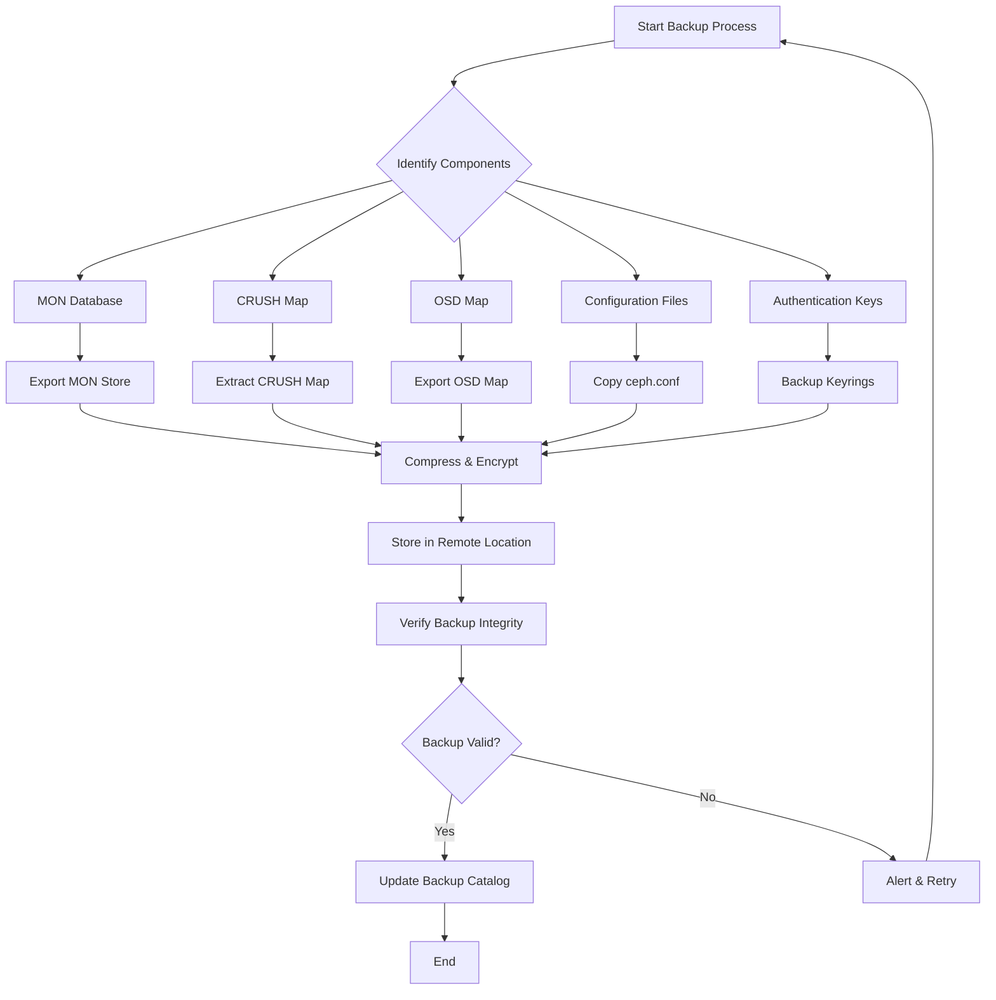
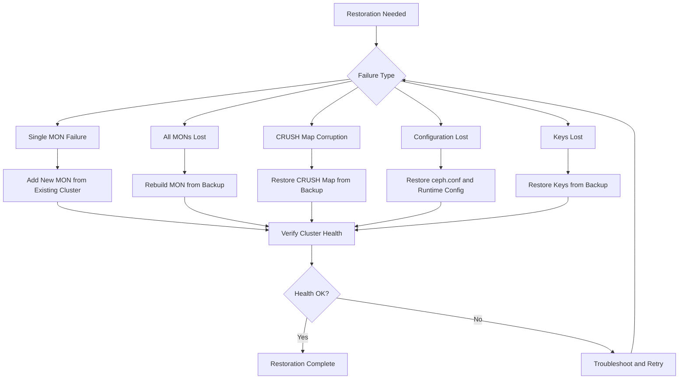

# How to Backup and Restore Ceph Cluster Configurations

Author: [nawazdhandala](https://github.com/nawazdhandala)

Tags: Ceph, Storage, Backup, Disaster Recovery, Configuration, Cloud Native

Description: Learn how to backup and restore Ceph cluster configurations, monitors, and critical metadata.

---

Ceph is a highly reliable, scalable, and distributed storage system that powers many enterprise and cloud-native environments. While Ceph provides built-in data redundancy through replication and erasure coding, protecting your cluster's configuration and metadata is equally critical for disaster recovery. Losing your MON database, CRUSH map, or OSD maps can render your entire cluster inaccessible, even if all your data remains intact on the OSDs.

This comprehensive guide covers everything you need to know about backing up and restoring Ceph cluster configurations, including MON databases, CRUSH maps, OSD maps, and critical metadata. We'll explore both manual and automated backup strategies to ensure your Ceph cluster can recover from any disaster scenario.

## Table of Contents

1. [Understanding Ceph Configuration Components](#understanding-ceph-configuration-components)
2. [Backup Workflow Overview](#backup-workflow-overview)
3. [Backing Up the MON Database](#backing-up-the-mon-database)
4. [Backing Up CRUSH Maps](#backing-up-crush-maps)
5. [Backing Up OSD Maps](#backing-up-osd-maps)
6. [Backing Up Ceph Configuration Files](#backing-up-ceph-configuration-files)
7. [Backing Up Authentication Keys](#backing-up-authentication-keys)
8. [Automated Backup Strategy](#automated-backup-strategy)
9. [Restoring Ceph Cluster Configurations](#restoring-ceph-cluster-configurations)
10. [Disaster Recovery Procedures](#disaster-recovery-procedures)
11. [Best Practices](#best-practices)

## Understanding Ceph Configuration Components

Before diving into backup procedures, it's essential to understand the critical components that make up your Ceph cluster's configuration:

### MON Database

The Monitor (MON) database stores the cluster map, which includes:
- The MON map (monitor membership)
- The OSD map (OSD membership and state)
- The CRUSH map (data placement rules)
- The MDS map (metadata server state)
- The Manager map (manager daemon state)

### CRUSH Map

The CRUSH (Controlled Replication Under Scalable Hashing) map determines how data is distributed across OSDs. It contains:
- Device definitions (OSDs)
- Bucket hierarchy (hosts, racks, rows, datacenters)
- Placement rules

### OSD Map

The OSD map tracks all OSDs in the cluster, their states (up/down, in/out), and epoch information for cluster state versioning.

### Configuration Files

The main configuration file (`ceph.conf`) contains cluster-wide settings, authentication configuration, and daemon-specific parameters.

## Backup Workflow Overview

The following diagram illustrates the complete backup workflow for a Ceph cluster:



## Backing Up the MON Database

The MON database is the most critical component to backup. Without it, your cluster cannot function even if all OSDs are healthy.

### Method 1: Using ceph-monstore-tool

The `ceph-monstore-tool` utility allows you to export the entire MON store to a portable format.

First, stop the monitor daemon on the node you're backing up from to ensure consistency. This prevents any writes during the backup process:

```bash
# Stop the monitor service on the current node
# Replace 'mon1' with your actual monitor hostname
sudo systemctl stop ceph-mon@mon1
```

Export the MON store using the ceph-monstore-tool. This creates a complete copy of the monitor database including all cluster maps:

```bash
# Export the entire MON store to a backup directory
# The store-path points to your monitor's data directory
# The out parameter specifies where to save the backup
sudo ceph-monstore-tool /var/lib/ceph/mon/ceph-mon1 store-copy /backup/mon-backup-$(date +%Y%m%d)
```

After the backup completes, restart the monitor service to resume normal cluster operations:

```bash
# Restart the monitor service after backup is complete
sudo systemctl start ceph-mon@mon1
```

### Method 2: Online Backup Using ceph-volume

For production environments where stopping monitors is not feasible, you can perform an online backup. This method creates a snapshot of the MON data while the service continues running:

```bash
# Create a backup directory with timestamp for organization
BACKUP_DIR="/backup/ceph/mon/$(date +%Y%m%d-%H%M%S)"
sudo mkdir -p "$BACKUP_DIR"

# Use rsync to copy the MON data directory
# The --delete flag ensures the backup matches the source exactly
# The -a flag preserves permissions, timestamps, and other attributes
sudo rsync -av --delete /var/lib/ceph/mon/ceph-$(hostname)/ "$BACKUP_DIR/"
```

### Method 3: LVM Snapshot Backup

If your MON data resides on an LVM volume, you can create a consistent snapshot for backup. This provides a point-in-time copy without stopping services:

```bash
# Create an LVM snapshot of the MON data volume
# Adjust the volume group and logical volume names for your environment
# The snapshot size (5G) should be sufficient for the duration of the backup
sudo lvcreate -L 5G -s -n mon-snap /dev/vg-ceph/lv-mon

# Mount the snapshot to a temporary location for backup
sudo mkdir -p /mnt/mon-snapshot
sudo mount /dev/vg-ceph/mon-snap /mnt/mon-snapshot

# Copy the snapshot data to the backup location
# This gives us a consistent point-in-time backup
sudo rsync -av /mnt/mon-snapshot/ /backup/mon-backup-$(date +%Y%m%d)/

# Clean up: unmount and remove the snapshot after backup
sudo umount /mnt/mon-snapshot
sudo lvremove -f /dev/vg-ceph/mon-snap
```

## Backing Up CRUSH Maps

The CRUSH map defines how data is distributed across your cluster. Always backup the CRUSH map before making any changes to your cluster topology.

### Exporting the CRUSH Map

Export the compiled CRUSH map in binary format. This format can be directly restored to the cluster:

```bash
# Get the current compiled CRUSH map from the cluster
# The -o flag specifies the output file
# This binary format is what Ceph uses internally
sudo ceph osd getcrushmap -o /backup/crushmap-$(date +%Y%m%d).bin
```

For human-readable backups and version control, decompile the CRUSH map. This allows you to review changes and store in git:

```bash
# Decompile the binary CRUSH map to a human-readable text format
# This is useful for reviewing, editing, and version controlling
sudo crushtool -d /backup/crushmap-$(date +%Y%m%d).bin \
    -o /backup/crushmap-$(date +%Y%m%d).txt
```

### Viewing CRUSH Map Contents

Before backing up, you may want to verify the current CRUSH map. This command shows the complete map in text format:

```bash
# Display the current CRUSH map in a readable format
# Useful for documentation and verification purposes
sudo ceph osd crush dump
```

### Automated CRUSH Map Versioning

Create a script to automatically version your CRUSH maps with meaningful commit messages:

```bash
#!/bin/bash
# Script: backup-crushmap.sh
# Purpose: Backup and version control CRUSH map changes
# Run this before and after any topology changes

# Set backup directory - adjust path as needed for your environment
BACKUP_DIR="/backup/ceph/crushmaps"
TIMESTAMP=$(date +%Y%m%d-%H%M%S)

# Create backup directory if it doesn't exist
mkdir -p "$BACKUP_DIR"

# Export the current CRUSH map in binary format
# Binary format is required for restoration
ceph osd getcrushmap -o "$BACKUP_DIR/crushmap-$TIMESTAMP.bin"

# Also create a human-readable version for review and git tracking
crushtool -d "$BACKUP_DIR/crushmap-$TIMESTAMP.bin" \
    -o "$BACKUP_DIR/crushmap-$TIMESTAMP.txt"

# Create a symbolic link to the latest backup for easy reference
ln -sf "$BACKUP_DIR/crushmap-$TIMESTAMP.bin" "$BACKUP_DIR/crushmap-latest.bin"
ln -sf "$BACKUP_DIR/crushmap-$TIMESTAMP.txt" "$BACKUP_DIR/crushmap-latest.txt"

# If using git for version control, commit the changes
if [ -d "$BACKUP_DIR/.git" ]; then
    cd "$BACKUP_DIR"
    git add .
    git commit -m "CRUSH map backup: $TIMESTAMP"
fi

echo "CRUSH map backed up to: $BACKUP_DIR/crushmap-$TIMESTAMP.*"
```

## Backing Up OSD Maps

The OSD map contains the current state of all OSDs, including their status, weights, and epoch information.

### Exporting the OSD Map

Export the current OSD map for backup. This includes all OSD states and the cluster epoch:

```bash
# Export the current OSD map in binary format
# The epoch is included in the filename for reference
EPOCH=$(ceph osd dump | grep epoch | awk '{print $2}')
sudo ceph osd getmap -o /backup/osdmap-epoch-${EPOCH}-$(date +%Y%m%d).bin
```

Create a human-readable dump of the OSD map for documentation and troubleshooting:

```bash
# Export OSD map as human-readable text
# This is useful for reviewing OSD states and configurations
sudo ceph osd dump > /backup/osdmap-dump-$(date +%Y%m%d).txt
```

### Backing Up OSD-Specific Information

For comprehensive disaster recovery, backup individual OSD metadata:

```bash
#!/bin/bash
# Script: backup-osd-metadata.sh
# Purpose: Backup metadata for all OSDs in the cluster
# This information is crucial for rebuilding OSDs

BACKUP_DIR="/backup/ceph/osd-metadata/$(date +%Y%m%d)"
mkdir -p "$BACKUP_DIR"

# Get list of all OSDs in the cluster
# The 'ceph osd ls' command returns all OSD IDs
OSDS=$(ceph osd ls)

# Loop through each OSD and backup its metadata
for osd in $OSDS; do
    echo "Backing up metadata for OSD.$osd"

    # Export OSD metadata including device class, weight, and location
    ceph osd metadata $osd > "$BACKUP_DIR/osd-$osd-metadata.json"

    # Export OSD-specific CRUSH location
    ceph osd find $osd > "$BACKUP_DIR/osd-$osd-location.json"
done

# Backup the OSD tree for cluster topology reference
# This shows the hierarchical view of all OSDs
ceph osd tree > "$BACKUP_DIR/osd-tree.txt"

# Backup OSD pool information
# Includes all pool settings, PG counts, and replication settings
ceph osd pool ls detail > "$BACKUP_DIR/pool-details.txt"

echo "OSD metadata backup complete: $BACKUP_DIR"
```

## Backing Up Ceph Configuration Files

The main configuration file and related settings must be backed up regularly.

### Main Configuration File

Backup the primary Ceph configuration file. This file contains cluster-wide settings:

```bash
# Copy the main ceph.conf file
# This file typically resides in /etc/ceph/
sudo cp /etc/ceph/ceph.conf /backup/ceph-conf-$(date +%Y%m%d).conf

# For distributed deployments, backup all ceph-related configs
sudo tar -czvf /backup/ceph-etc-$(date +%Y%m%d).tar.gz /etc/ceph/
```

### Runtime Configuration Backup

Capture the runtime configuration which may differ from the static config file:

```bash
#!/bin/bash
# Script: backup-runtime-config.sh
# Purpose: Export runtime configuration for all daemon types
# Runtime config may include settings applied via 'ceph config set'

BACKUP_DIR="/backup/ceph/runtime-config/$(date +%Y%m%d)"
mkdir -p "$BACKUP_DIR"

# Export global configuration settings
# These apply to all daemons unless overridden
echo "Exporting global configuration..."
ceph config dump > "$BACKUP_DIR/config-dump.txt"

# Export configuration in JSON format for programmatic restoration
ceph config dump --format=json > "$BACKUP_DIR/config-dump.json"

# Export configuration for each daemon type
# This captures any daemon-specific overrides
for daemon_type in mon osd mds mgr rgw; do
    echo "Exporting $daemon_type configuration..."
    ceph config show-with-defaults "$daemon_type" > "$BACKUP_DIR/config-$daemon_type-defaults.txt" 2>/dev/null || true
done

# Export the configuration assimilated from ceph.conf
ceph config assimilate-conf -i /etc/ceph/ceph.conf -o "$BACKUP_DIR/assimilated-config.conf"

echo "Runtime configuration backup complete: $BACKUP_DIR"
```

## Backing Up Authentication Keys

Ceph uses cephx for authentication. Losing these keys means losing access to your cluster.

### Backup All Keyrings

Create a comprehensive backup of all authentication keys:

```bash
#!/bin/bash
# Script: backup-ceph-keys.sh
# Purpose: Backup all Ceph authentication keyrings
# SECURITY: Store these backups in an encrypted, secure location

BACKUP_DIR="/backup/ceph/keys/$(date +%Y%m%d)"
mkdir -p "$BACKUP_DIR"

# Set restrictive permissions on the backup directory
chmod 700 "$BACKUP_DIR"

# Backup the admin keyring - this has full cluster access
# CRITICAL: This key provides complete cluster control
sudo cp /etc/ceph/ceph.client.admin.keyring "$BACKUP_DIR/"

# Backup all keyrings in /etc/ceph/
# This includes bootstrap keys and any service-specific keys
sudo cp /etc/ceph/*.keyring "$BACKUP_DIR/" 2>/dev/null || true

# Backup bootstrap keyrings for adding new OSDs/MONs
# These are required when expanding the cluster
sudo cp /var/lib/ceph/bootstrap-osd/ceph.keyring "$BACKUP_DIR/bootstrap-osd.keyring" 2>/dev/null || true
sudo cp /var/lib/ceph/bootstrap-mds/ceph.keyring "$BACKUP_DIR/bootstrap-mds.keyring" 2>/dev/null || true
sudo cp /var/lib/ceph/bootstrap-rgw/ceph.keyring "$BACKUP_DIR/bootstrap-rgw.keyring" 2>/dev/null || true
sudo cp /var/lib/ceph/bootstrap-mgr/ceph.keyring "$BACKUP_DIR/bootstrap-mgr.keyring" 2>/dev/null || true

# Export all authentication entities from the cluster
# This provides a complete list of all keys and their capabilities
ceph auth ls > "$BACKUP_DIR/auth-entities.txt"

# Export in JSON format for easier restoration
ceph auth ls --format=json > "$BACKUP_DIR/auth-entities.json"

# Encrypt the backup directory for security
# Replace 'backup-key' with your actual GPG key ID
tar -czf - -C "$(dirname $BACKUP_DIR)" "$(basename $BACKUP_DIR)" | \
    gpg --encrypt --recipient backup-key > "$BACKUP_DIR.tar.gz.gpg"

echo "Keys backed up to: $BACKUP_DIR"
echo "Encrypted archive: $BACKUP_DIR.tar.gz.gpg"
```

### Export Individual Keys

For more granular backup control, export specific authentication keys:

```bash
# Export the admin key separately with full details
ceph auth get client.admin > /backup/keys/client.admin.keyring

# List all auth entities and backup each one
# This ensures no keys are missed
for entity in $(ceph auth ls --format=json | jq -r '.[].entity'); do
    echo "Backing up key for: $entity"
    ceph auth get "$entity" > "/backup/keys/${entity//\//_}.keyring"
done
```

## Automated Backup Strategy

For production environments, implement automated backups with proper scheduling and verification.

### Complete Backup Script

This comprehensive script performs a full backup of all Ceph components:

```bash
#!/bin/bash
# Script: ceph-full-backup.sh
# Purpose: Complete automated backup of Ceph cluster configuration
# Schedule this with cron for regular backups

set -euo pipefail

# Configuration - adjust these variables for your environment
BACKUP_BASE="/backup/ceph"
RETENTION_DAYS=30
REMOTE_BACKUP="backup-server:/remote/ceph-backups"
LOG_FILE="/var/log/ceph-backup.log"
TIMESTAMP=$(date +%Y%m%d-%H%M%S)
BACKUP_DIR="$BACKUP_BASE/$TIMESTAMP"

# Logging function for consistent log formatting
log() {
    echo "[$(date '+%Y-%m-%d %H:%M:%S')] $1" | tee -a "$LOG_FILE"
}

# Error handling function
error_exit() {
    log "ERROR: $1"
    exit 1
}

# Create backup directory structure
mkdir -p "$BACKUP_DIR"/{mon,crushmap,osdmap,config,keys,pools}

log "Starting Ceph cluster backup to $BACKUP_DIR"

# Check cluster health before backup
# We continue even if cluster is degraded, but log the status
HEALTH=$(ceph health 2>/dev/null || echo "UNKNOWN")
log "Cluster health: $HEALTH"

# Backup MON map and store
log "Backing up MON map..."
ceph mon dump > "$BACKUP_DIR/mon/mon-map.txt" || error_exit "Failed to dump MON map"
ceph mon dump --format=json > "$BACKUP_DIR/mon/mon-map.json"

# Backup CRUSH map in both binary and text formats
log "Backing up CRUSH map..."
ceph osd getcrushmap -o "$BACKUP_DIR/crushmap/crushmap.bin" || error_exit "Failed to get CRUSH map"
crushtool -d "$BACKUP_DIR/crushmap/crushmap.bin" -o "$BACKUP_DIR/crushmap/crushmap.txt"

# Backup OSD map and metadata
log "Backing up OSD map..."
ceph osd getmap -o "$BACKUP_DIR/osdmap/osdmap.bin" || error_exit "Failed to get OSD map"
ceph osd dump > "$BACKUP_DIR/osdmap/osdmap-dump.txt"
ceph osd dump --format=json > "$BACKUP_DIR/osdmap/osdmap-dump.json"
ceph osd tree > "$BACKUP_DIR/osdmap/osd-tree.txt"

# Backup pool configurations
log "Backing up pool configurations..."
ceph osd pool ls detail > "$BACKUP_DIR/pools/pool-details.txt"
ceph osd pool ls detail --format=json > "$BACKUP_DIR/pools/pool-details.json"

# Backup each pool's specific settings
for pool in $(ceph osd pool ls); do
    log "  Backing up pool: $pool"
    ceph osd pool get "$pool" all > "$BACKUP_DIR/pools/${pool}-settings.txt" 2>/dev/null || true
done

# Backup configuration
log "Backing up configuration..."
cp /etc/ceph/ceph.conf "$BACKUP_DIR/config/" 2>/dev/null || true
ceph config dump > "$BACKUP_DIR/config/config-dump.txt"
ceph config dump --format=json > "$BACKUP_DIR/config/config-dump.json"

# Backup authentication keys
log "Backing up authentication keys..."
ceph auth ls > "$BACKUP_DIR/keys/auth-list.txt"
ceph auth ls --format=json > "$BACKUP_DIR/keys/auth-list.json"
cp /etc/ceph/*.keyring "$BACKUP_DIR/keys/" 2>/dev/null || true

# Backup MDS map if CephFS is in use
if ceph mds stat &>/dev/null; then
    log "Backing up MDS map..."
    mkdir -p "$BACKUP_DIR/mds"
    ceph mds dump > "$BACKUP_DIR/mds/mds-map.txt" 2>/dev/null || true
    ceph fs ls > "$BACKUP_DIR/mds/filesystems.txt" 2>/dev/null || true
fi

# Backup RGW configuration if in use
if ceph rgw realm list &>/dev/null; then
    log "Backing up RGW configuration..."
    mkdir -p "$BACKUP_DIR/rgw"
    ceph rgw realm list > "$BACKUP_DIR/rgw/realms.txt" 2>/dev/null || true
    ceph rgw zonegroup list > "$BACKUP_DIR/rgw/zonegroups.txt" 2>/dev/null || true
    ceph rgw zone list > "$BACKUP_DIR/rgw/zones.txt" 2>/dev/null || true
fi

# Create a compressed archive of the backup
log "Creating compressed archive..."
tar -czf "$BACKUP_BASE/ceph-backup-$TIMESTAMP.tar.gz" -C "$BACKUP_BASE" "$TIMESTAMP"

# Calculate and store checksum for integrity verification
sha256sum "$BACKUP_BASE/ceph-backup-$TIMESTAMP.tar.gz" > "$BACKUP_BASE/ceph-backup-$TIMESTAMP.sha256"

# Copy to remote backup location
log "Syncing to remote backup location..."
rsync -av "$BACKUP_BASE/ceph-backup-$TIMESTAMP.tar.gz" \
    "$BACKUP_BASE/ceph-backup-$TIMESTAMP.sha256" \
    "$REMOTE_BACKUP/" || log "WARNING: Remote sync failed"

# Clean up old backups based on retention policy
log "Cleaning up old backups (retention: $RETENTION_DAYS days)..."
find "$BACKUP_BASE" -name "ceph-backup-*.tar.gz" -mtime +$RETENTION_DAYS -delete
find "$BACKUP_BASE" -type d -name "20*" -mtime +$RETENTION_DAYS -exec rm -rf {} \; 2>/dev/null || true

log "Backup complete: $BACKUP_BASE/ceph-backup-$TIMESTAMP.tar.gz"
```

### Cron Configuration

Set up automated backup scheduling with cron:

```bash
# Add to crontab: crontab -e
# Run full backup daily at 2 AM
0 2 * * * /usr/local/bin/ceph-full-backup.sh >> /var/log/ceph-backup.log 2>&1

# Run CRUSH map backup every 6 hours for frequent topology changes
0 */6 * * * /usr/local/bin/backup-crushmap.sh >> /var/log/ceph-backup.log 2>&1

# Run configuration backup after any changes (trigger via systemd path unit)
# Create /etc/systemd/system/ceph-config-backup.path
# Create /etc/systemd/system/ceph-config-backup.service
```

### Systemd Backup Service

Create a systemd service for backup automation:

```ini
# /etc/systemd/system/ceph-backup.service
[Unit]
Description=Ceph Cluster Configuration Backup
After=ceph.target

[Service]
Type=oneshot
ExecStart=/usr/local/bin/ceph-full-backup.sh
User=root
StandardOutput=append:/var/log/ceph-backup.log
StandardError=append:/var/log/ceph-backup.log

[Install]
WantedBy=multi-user.target
```

```ini
# /etc/systemd/system/ceph-backup.timer
[Unit]
Description=Daily Ceph Backup Timer

[Timer]
OnCalendar=*-*-* 02:00:00
Persistent=true
RandomizedDelaySec=300

[Install]
WantedBy=timers.target
```

Enable the timer with the following commands:

```bash
# Reload systemd to recognize new service files
sudo systemctl daemon-reload

# Enable and start the backup timer
sudo systemctl enable ceph-backup.timer
sudo systemctl start ceph-backup.timer

# Verify the timer is active
sudo systemctl list-timers | grep ceph
```

## Restoring Ceph Cluster Configurations

The restoration process depends on the extent of the failure. Here we cover various restoration scenarios.

### Restoration Workflow

The following diagram shows the decision process for restoring Ceph configurations:



### Restoring the CRUSH Map

If your CRUSH map becomes corrupted, restore from backup:

```bash
# First, verify the backup CRUSH map is valid
# The --test flag validates the map without applying it
crushtool --test -i /backup/crushmap-backup.bin

# Inject the CRUSH map back into the cluster
# WARNING: This replaces the current CRUSH map entirely
ceph osd setcrushmap -i /backup/crushmap-backup.bin

# Verify the CRUSH map was applied correctly
ceph osd crush dump | head -50
```

### Restoring OSD Map

In case of OSD map issues, you may need to rebuild it:

```bash
# The OSD map typically rebuilds automatically from MON consensus
# However, you can force a specific epoch if needed

# First, check the current OSD map status
ceph osd dump | head -20

# If OSDs are incorrectly marked out, you can mark them back in
# Replace X with the actual OSD ID
ceph osd in X

# If OSDs have incorrect weights, restore from backup data
# Read the backed up OSD tree and reapply weights
while read osd weight; do
    ceph osd crush reweight "osd.$osd" "$weight"
done < /backup/osd-weights.txt
```

### Restoring Authentication Keys

If authentication keys are lost, restore from backup:

```bash
#!/bin/bash
# Script: restore-ceph-keys.sh
# Purpose: Restore Ceph authentication keys from backup
# WARNING: This will overwrite existing keys

BACKUP_DIR="/backup/ceph/keys/20260107"

# Decrypt the backup if encrypted
gpg --decrypt "$BACKUP_DIR.tar.gz.gpg" | tar -xzf - -C /tmp/

# Restore the admin keyring
# This is critical for cluster administration
cp "$BACKUP_DIR/ceph.client.admin.keyring" /etc/ceph/

# Restore bootstrap keyrings
# These are needed for adding new daemons
cp "$BACKUP_DIR/bootstrap-osd.keyring" /var/lib/ceph/bootstrap-osd/ceph.keyring
cp "$BACKUP_DIR/bootstrap-mds.keyring" /var/lib/ceph/bootstrap-mds/ceph.keyring
cp "$BACKUP_DIR/bootstrap-rgw.keyring" /var/lib/ceph/bootstrap-rgw/ceph.keyring

# Set correct permissions on keyring files
chmod 600 /etc/ceph/*.keyring
chown ceph:ceph /etc/ceph/*.keyring

# If you need to restore individual entity keys from the JSON backup
# Parse the backup and recreate keys
cat "$BACKUP_DIR/auth-entities.json" | jq -r '.[] | "\(.entity) \(.key) \(.caps | to_entries | map("\(.key) \(.value|tojson)") | join(" "))"' | \
while read entity key caps; do
    echo "Restoring key for: $entity"
    ceph auth add "$entity" --cap $caps 2>/dev/null || \
    ceph auth caps "$entity" $caps
done

echo "Key restoration complete"
```

### Restoring Configuration

Restore configuration files and runtime settings:

```bash
#!/bin/bash
# Script: restore-ceph-config.sh
# Purpose: Restore Ceph configuration from backup

BACKUP_DIR="/backup/ceph/runtime-config/20260107"

# Restore the main configuration file
cp "$BACKUP_DIR/../ceph-conf-backup.conf" /etc/ceph/ceph.conf

# Restore runtime configuration settings
# Parse the JSON config dump and apply each setting
cat "$BACKUP_DIR/config-dump.json" | jq -r '.[] | "\(.section) \(.name) \(.value)"' | \
while read section name value; do
    # Skip empty values
    [ -z "$value" ] && continue

    echo "Setting: $section $name = $value"
    ceph config set "$section" "$name" "$value" 2>/dev/null || true
done

echo "Configuration restoration complete"
echo "Restart Ceph services to apply changes"
```

## Disaster Recovery Procedures

### Complete MON Database Recovery

If all monitors are lost, follow this procedure to rebuild from OSD data:

```bash
#!/bin/bash
# Script: recover-mon-from-osds.sh
# Purpose: Rebuild MON cluster from OSD data
# Use this only when all monitors are lost but OSDs are intact

# CRITICAL: This is a last-resort procedure
# Ensure you have proper backups before proceeding

# Step 1: Stop all Ceph services
echo "Stopping all Ceph services..."
systemctl stop ceph.target

# Step 2: Collect OSD maps from all OSDs
# Each OSD stores a copy of the cluster maps
echo "Collecting maps from OSDs..."
RECOVERY_DIR="/tmp/ceph-recovery"
mkdir -p "$RECOVERY_DIR"

# Find the most recent maps from OSD data directories
for osd_dir in /var/lib/ceph/osd/ceph-*; do
    osd_id=$(basename "$osd_dir" | cut -d'-' -f2)
    echo "Checking OSD.$osd_id..."

    # Look for map files in the OSD directory
    if [ -d "$osd_dir/current" ]; then
        # Use ceph-objectstore-tool to extract maps
        ceph-objectstore-tool --data-path "$osd_dir" \
            --op list-omap --pgid all 2>/dev/null | \
            grep -E "(osdmap|crush)" > "$RECOVERY_DIR/osd-$osd_id-maps.txt"
    fi
done

# Step 3: Initialize a new MON with the recovered maps
# This requires the FSID from your backup or from OSD superblocks
FSID=$(cat /var/lib/ceph/osd/ceph-0/fsid 2>/dev/null || echo "your-cluster-fsid")

echo "Creating new MON..."
ceph-mon --mkfs -i $(hostname) --fsid "$FSID" --keyring /etc/ceph/ceph.client.admin.keyring

# Step 4: Start the monitor
systemctl start ceph-mon@$(hostname)

# Step 5: Wait for the monitor to be healthy
echo "Waiting for MON to become healthy..."
for i in {1..30}; do
    ceph health && break
    sleep 5
done

echo "MON recovery initiated. Check cluster status with 'ceph -s'"
```

### Recovering a Single Monitor

When one monitor fails but others are healthy:

```bash
#!/bin/bash
# Script: recover-single-mon.sh
# Purpose: Replace a failed monitor in a healthy cluster
# Run this on the replacement host

MON_ID=$(hostname)
MON_IP=$(hostname -I | awk '{print $1}')

# Step 1: Remove the old monitor from the cluster
# Run this from a working monitor
echo "Removing old monitor entry..."
ceph mon remove "$MON_ID"

# Step 2: Create the monitor directory on the new host
echo "Creating monitor directory..."
mkdir -p /var/lib/ceph/mon/ceph-$MON_ID
chown ceph:ceph /var/lib/ceph/mon/ceph-$MON_ID

# Step 3: Get the current monmap from the cluster
echo "Fetching current monmap..."
ceph mon getmap -o /tmp/monmap

# Step 4: Add the new monitor to the monmap
echo "Adding new monitor to monmap..."
monmaptool --add "$MON_ID" "$MON_IP:6789" /tmp/monmap

# Step 5: Create the monitor from the existing cluster
echo "Creating monitor..."
ceph-mon --mkfs -i "$MON_ID" --monmap /tmp/monmap \
    --keyring /etc/ceph/ceph.client.admin.keyring

# Step 6: Set correct ownership
chown -R ceph:ceph /var/lib/ceph/mon/ceph-$MON_ID

# Step 7: Start the monitor service
echo "Starting monitor..."
systemctl start ceph-mon@$MON_ID
systemctl enable ceph-mon@$MON_ID

# Step 8: Verify monitor status
echo "Verifying monitor status..."
ceph mon stat
ceph -s
```

### Pool Recovery

Restore pool configurations from backup:

```bash
#!/bin/bash
# Script: restore-pools.sh
# Purpose: Recreate pools from backup configuration
# Use after complete cluster rebuild

BACKUP_FILE="/backup/ceph/pools/pool-details.json"

# Parse the pool configuration and recreate each pool
cat "$BACKUP_FILE" | jq -r '.[] | @base64' | while read pool_b64; do
    pool=$(echo "$pool_b64" | base64 -d)

    pool_name=$(echo "$pool" | jq -r '.pool_name')
    pool_type=$(echo "$pool" | jq -r '.type')
    pg_num=$(echo "$pool" | jq -r '.pg_num')
    size=$(echo "$pool" | jq -r '.size')
    min_size=$(echo "$pool" | jq -r '.min_size')

    echo "Creating pool: $pool_name"

    # Create the pool with appropriate type
    if [ "$pool_type" = "replicated" ]; then
        ceph osd pool create "$pool_name" "$pg_num" "$pg_num" replicated
    else
        # For erasure coded pools, you'll need the EC profile name
        ec_profile=$(echo "$pool" | jq -r '.erasure_code_profile')
        ceph osd pool create "$pool_name" "$pg_num" "$pg_num" erasure "$ec_profile"
    fi

    # Set pool options
    ceph osd pool set "$pool_name" size "$size"
    ceph osd pool set "$pool_name" min_size "$min_size"

    echo "Pool $pool_name created successfully"
done
```

## Best Practices

### Backup Frequency

Follow these recommended backup frequencies for different components:

| Component | Frequency | Reason |
|-----------|-----------|--------|
| MON Database | Daily | Critical for cluster operation |
| CRUSH Map | Before/after any change | Topology changes are rare but critical |
| OSD Map | Daily | Tracks OSD state changes |
| Configuration | Weekly + on change | Typically static |
| Authentication Keys | Weekly | Rarely change |
| Pool Configuration | After changes | Needed for pool recreation |

### Backup Verification

Always verify your backups are valid and restorable:

```bash
#!/bin/bash
# Script: verify-ceph-backup.sh
# Purpose: Validate Ceph backup integrity
# Run this regularly to ensure backups are usable

BACKUP_ARCHIVE="$1"

if [ -z "$BACKUP_ARCHIVE" ]; then
    echo "Usage: $0 <backup-archive.tar.gz>"
    exit 1
fi

VERIFY_DIR="/tmp/ceph-backup-verify-$$"
mkdir -p "$VERIFY_DIR"

echo "Extracting backup..."
tar -xzf "$BACKUP_ARCHIVE" -C "$VERIFY_DIR"

# Verify CRUSH map
echo "Verifying CRUSH map..."
CRUSH_MAP=$(find "$VERIFY_DIR" -name "crushmap.bin" | head -1)
if [ -n "$CRUSH_MAP" ]; then
    crushtool --test -i "$CRUSH_MAP" && echo "CRUSH map: VALID" || echo "CRUSH map: INVALID"
else
    echo "CRUSH map: NOT FOUND"
fi

# Verify configuration files exist
echo "Verifying configuration..."
[ -f "$VERIFY_DIR"/*/config/ceph.conf ] && echo "ceph.conf: FOUND" || echo "ceph.conf: NOT FOUND"

# Verify keyrings
echo "Verifying keyrings..."
KEYRING_COUNT=$(find "$VERIFY_DIR" -name "*.keyring" | wc -l)
echo "Found $KEYRING_COUNT keyring files"

# Verify JSON files are valid
echo "Verifying JSON files..."
for json_file in $(find "$VERIFY_DIR" -name "*.json"); do
    jq . "$json_file" >/dev/null 2>&1 && echo "$json_file: VALID" || echo "$json_file: INVALID JSON"
done

# Clean up
rm -rf "$VERIFY_DIR"

echo "Backup verification complete"
```

### Storage Recommendations

1. **Multiple Locations**: Store backups in at least two geographically separate locations
2. **Encryption**: Always encrypt backups containing authentication keys
3. **Retention Policy**: Keep daily backups for 7 days, weekly for 4 weeks, monthly for 12 months
4. **Immutable Storage**: Use write-once storage for critical backups to prevent ransomware

### Security Considerations

Protect your Ceph backups with these security measures:

```bash
# Encrypt backups with GPG before storing remotely
gpg --symmetric --cipher-algo AES256 ceph-backup.tar.gz

# Use restricted permissions on backup files
chmod 600 /backup/ceph/*.tar.gz
chown root:root /backup/ceph/*.tar.gz

# Store encryption keys separately from backups
# Never store backup encryption keys in the same location as backups

# Use separate credentials for backup access
# Create a limited-capability key for backup operations
ceph auth get-or-create client.backup \
    mon 'allow r' \
    osd 'allow r' \
    mds 'allow r' \
    mgr 'allow r' \
    -o /etc/ceph/ceph.client.backup.keyring
```

### Testing Recovery Procedures

Regularly test your disaster recovery procedures:

1. **Quarterly DR Drills**: Perform full recovery tests in a non-production environment
2. **Monthly Backup Restoration Tests**: Restore and verify individual components
3. **Document Recovery Times**: Track how long each recovery procedure takes
4. **Update Runbooks**: Keep recovery documentation current with cluster changes

## Conclusion

Protecting your Ceph cluster configuration is as important as protecting the data it stores. By implementing comprehensive backup strategies for MON databases, CRUSH maps, OSD maps, configuration files, and authentication keys, you ensure your cluster can recover from any disaster scenario.

Key takeaways:
- The MON database is the most critical component to backup
- CRUSH maps should be backed up before any topology changes
- Automate backups with proper scheduling and verification
- Store backups in multiple locations with encryption
- Regularly test your recovery procedures

Remember that a backup is only as good as its last successful restoration test. Make disaster recovery drills a regular part of your operations to ensure you're prepared when the unexpected happens.
