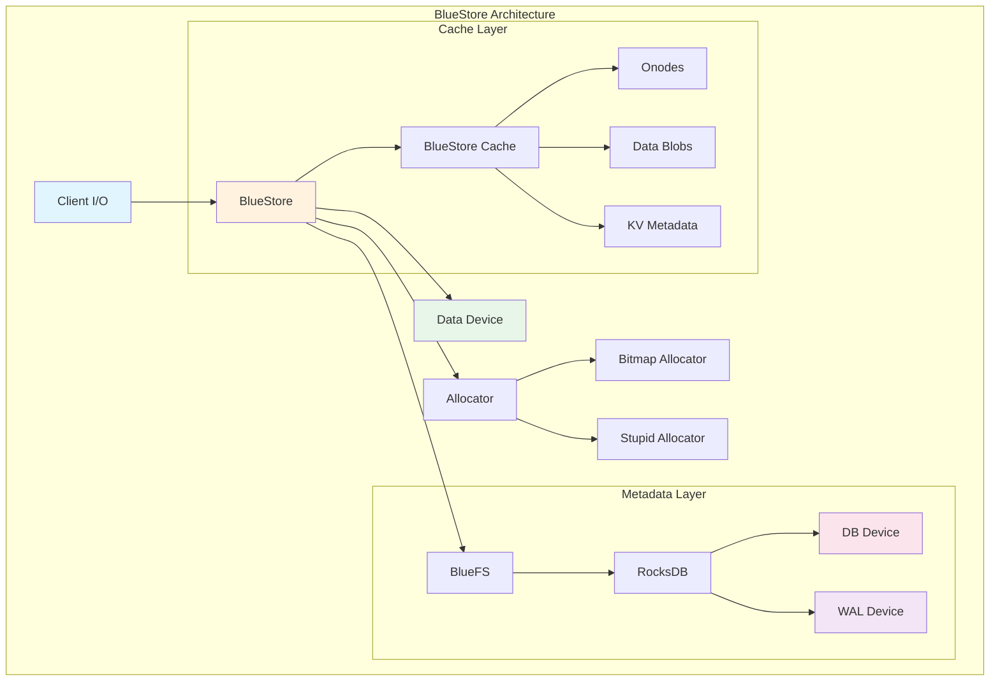
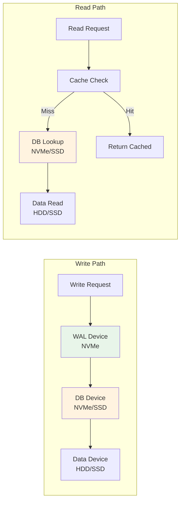
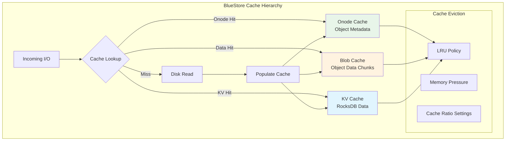
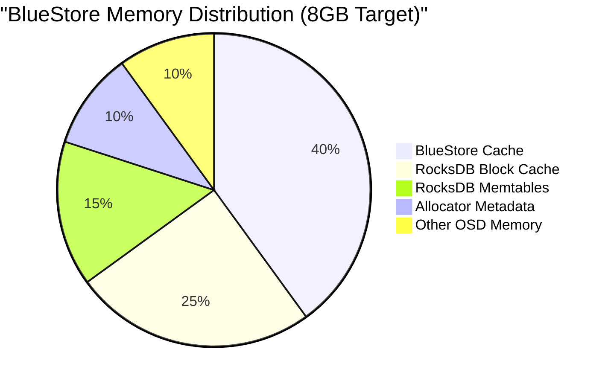
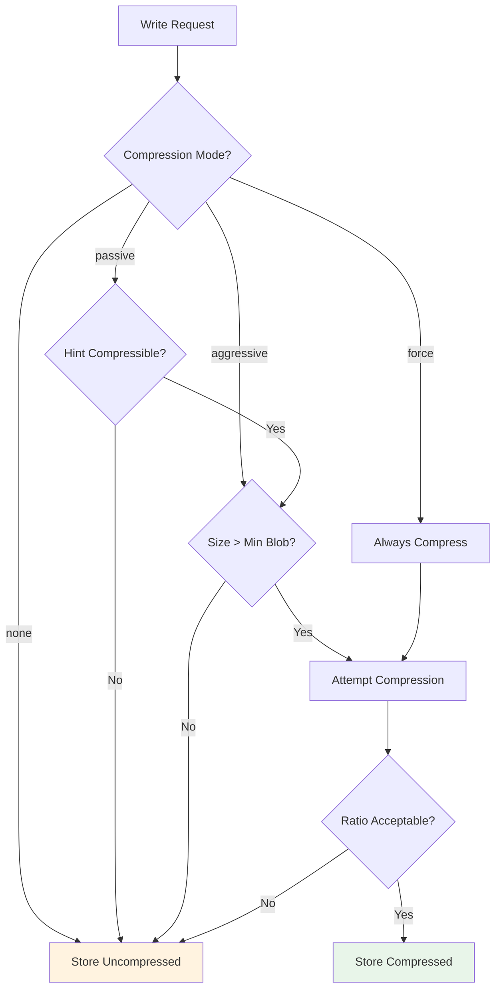
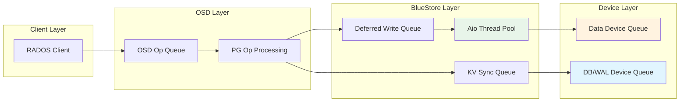
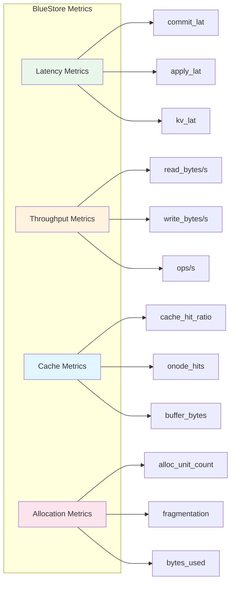
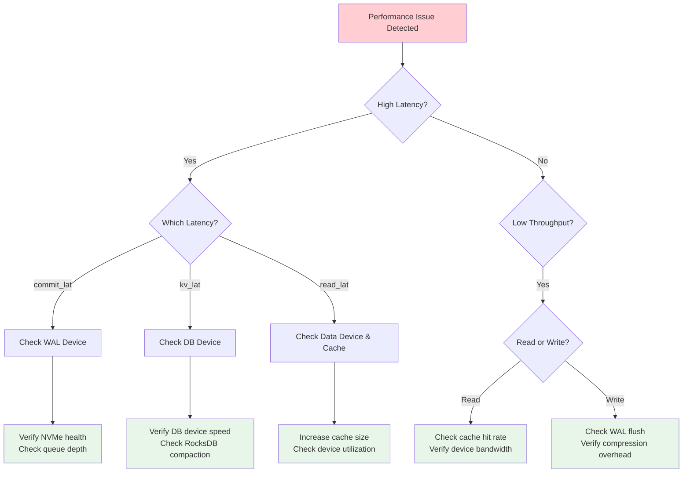

# How to Configure Ceph BlueStore for Maximum Performance

Author: [nawazdhandala](https://github.com/nawazdhandala)

Tags: Ceph, Storage, BlueStore, Performance, Configuration, Cloud Native

Description: A deep dive into configuring Ceph BlueStore for optimal performance in production environments.

---

Ceph BlueStore is the default storage backend for Ceph since the Luminous release, replacing the legacy FileStore. BlueStore provides significant performance improvements by storing data directly on raw block devices, eliminating the overhead of a traditional filesystem. This guide will walk you through configuring BlueStore for maximum performance in production environments.

## Understanding BlueStore Architecture

BlueStore is a storage backend that manages data directly on raw block devices. Unlike FileStore, which relied on a filesystem (typically XFS), BlueStore bypasses the filesystem layer entirely, providing direct control over storage operations.

### BlueStore Components

The following diagram illustrates the core components of BlueStore and their relationships:



### Key Components Explained

- **BlueStore**: The main storage engine that handles all I/O operations
- **BlueFS**: A minimal filesystem used exclusively by RocksDB for metadata storage
- **RocksDB**: An embedded key-value store for object metadata
- **Data Device**: The primary device where object data is stored
- **DB Device**: Optional dedicated device for RocksDB database files
- **WAL Device**: Optional dedicated device for RocksDB write-ahead log
- **Allocator**: Manages free space on the data device

## Prerequisites

Before configuring BlueStore for optimal performance, ensure you have:

- Ceph cluster installed (Quincy or newer recommended)
- Root access to OSD nodes
- Understanding of your storage hardware (NVMe, SSD, HDD)
- Performance benchmarking tools (fio, ceph tell, rados bench)

## Device Separation Strategy

One of the most impactful performance optimizations is separating BlueStore components across different devices based on their I/O characteristics.

### I/O Flow and Device Separation

The following diagram shows how I/O flows through BlueStore components and the optimal device placement:



### Recommended Device Configuration

The optimal device separation depends on your hardware:

| Component | Recommended Device | Size Calculation |
|-----------|-------------------|------------------|
| WAL | NVMe SSD | 1-2 GB per OSD |
| DB | NVMe or fast SSD | 30-60 GB per OSD |
| Data | HDD, SSD, or NVMe | Based on capacity needs |

## Configuring DB and WAL Devices

Separating the DB and WAL onto faster devices is crucial for maximizing performance, especially when using HDDs for data storage.

### Creating OSDs with Separate DB/WAL Devices

The following command creates an OSD with dedicated DB and WAL devices. This configuration places the write-ahead log and database on fast NVMe storage while using an HDD for bulk data storage.

```bash
# Create an OSD with separate DB and WAL devices
# --data: Primary data device (HDD in this case)
# --block-db: Dedicated device partition for RocksDB database
# --block-wal: Dedicated device partition for RocksDB write-ahead log
ceph-volume lvm create \
    --data /dev/sda \
    --block-db /dev/nvme0n1p1 \
    --block-wal /dev/nvme0n1p2
```

### Partitioning NVMe for Multiple OSDs

When sharing an NVMe device across multiple OSDs, proper partitioning ensures balanced performance. The following script creates appropriately sized partitions for both WAL and DB.

```bash
#!/bin/bash
# Script to partition NVMe device for multiple OSD DB/WAL devices
# This example creates partitions for 4 OSDs on a 400GB NVMe

NVME_DEVICE="/dev/nvme0n1"
NUM_OSDS=4

# Calculate partition sizes
# WAL: 2GB per OSD (small but high IOPS)
# DB: 50GB per OSD (stores RocksDB data)
WAL_SIZE="2G"
DB_SIZE="50G"

# Create GPT partition table
parted -s ${NVME_DEVICE} mklabel gpt

# Create WAL partitions first (they benefit most from being at the start of device)
for i in $(seq 1 ${NUM_OSDS}); do
    echo "Creating WAL partition ${i} of size ${WAL_SIZE}"
    parted -s ${NVME_DEVICE} mkpart wal${i} ${WAL_SIZE}
done

# Create DB partitions after WAL partitions
for i in $(seq 1 ${NUM_OSDS}); do
    echo "Creating DB partition ${i} of size ${DB_SIZE}"
    parted -s ${NVME_DEVICE} mkpart db${i} ${DB_SIZE}
done

# Display final partition layout
parted -s ${NVME_DEVICE} print
```

## BlueStore Cache Configuration

BlueStore uses an internal cache to reduce disk I/O. Proper cache configuration is essential for balancing memory usage and performance.

### Cache Architecture

The following diagram shows the BlueStore cache hierarchy and how different cache types interact:



### Cache Configuration Options

The following configuration settings control BlueStore cache behavior. Add these to your ceph.conf file or apply them dynamically.

```ini
[osd]
# Total cache size in bytes
# This is the primary memory allocation for BlueStore caching
# Recommended: 1-4GB per OSD depending on available memory
bluestore_cache_size = 4294967296  # 4GB

# Alternative: Use automatic cache sizing based on OSD memory target
# This automatically adjusts cache size based on available memory
bluestore_cache_autotune = true
osd_memory_target = 8589934592  # 8GB total OSD memory target

# Cache ratio settings control how cache memory is distributed
# These ratios must sum to 1.0

# Ratio of cache for key-value (RocksDB) data
# Higher values improve metadata-heavy workloads
bluestore_cache_kv_ratio = 0.4

# Ratio of cache for object metadata (onodes)
# Important for workloads with many small objects
bluestore_cache_meta_ratio = 0.4

# Ratio of cache for object data blobs
# Calculated as: 1.0 - kv_ratio - meta_ratio
# Higher values improve read-heavy workloads with large objects
# bluestore_cache_data_ratio = 0.2  # Implicit
```

### Dynamic Cache Tuning

For workload-specific optimizations, you can adjust cache parameters at runtime without restarting OSDs. The following commands demonstrate how to tune cache settings dynamically.

```bash
# View current cache statistics for a specific OSD
# This helps identify cache hit rates and memory usage
ceph daemon osd.0 perf dump bluestore

# Adjust cache size dynamically without restart
# Useful for testing different configurations
ceph tell osd.0 config set bluestore_cache_size 8589934592

# Enable cache autotuning for automatic optimization
# This allows Ceph to adjust cache sizes based on memory pressure
ceph tell osd.* config set bluestore_cache_autotune true

# Set memory target for autotuning
# This defines the total memory BlueStore should try to use
ceph tell osd.* config set osd_memory_target 12884901888  # 12GB
```

## Memory and Resource Tuning

Proper memory allocation is critical for BlueStore performance. This section covers comprehensive memory tuning strategies.

### Memory Allocation Overview

The following diagram illustrates how memory is allocated across BlueStore components:



### Comprehensive Memory Configuration

The following configuration provides a complete memory tuning setup for production OSDs. Adjust values based on your available RAM.

```ini
[osd]
# =============================================================================
# Primary Memory Target Configuration
# =============================================================================

# Total memory target for the OSD process
# This should be set based on available system RAM
# Rule of thumb: Leave 2-4GB for OS, divide rest among OSDs
osd_memory_target = 8589934592  # 8GB

# Minimum memory to maintain even under pressure
# Prevents OSD from becoming too memory-constrained
osd_memory_base = 1073741824  # 1GB

# Expected memory overhead for non-cache operations
osd_memory_expected_fragmentation = 0.15

# =============================================================================
# BlueStore-Specific Memory Settings
# =============================================================================

# Enable automatic cache tuning based on memory pressure
# This is recommended for most production deployments
bluestore_cache_autotune = true

# Interval for cache autotuning calculations (seconds)
bluestore_cache_autotune_interval = 5

# When not using autotune, set explicit cache size
# bluestore_cache_size = 4294967296  # 4GB

# =============================================================================
# RocksDB Memory Configuration
# =============================================================================

# Size of each RocksDB memtable
# Larger memtables reduce write amplification but use more memory
bluestore_rocksdb_options = "write_buffer_size=268435456,max_write_buffer_number=4"

# Block cache for RocksDB reads
# This is separate from BlueStore cache
rocksdb_cache_size = 536870912  # 512MB
```

### Allocator Configuration

The allocator manages free space on the data device. Choosing the right allocator impacts both performance and memory usage.

```ini
[osd]
# Allocator selection
# Options: bitmap (default), stupid, avl, btree
# bitmap: Best for most workloads, balanced memory/performance
# stupid: Lower memory usage, good for large sequential writes
bluestore_allocator = bitmap

# Bitmap allocator specific settings
# Block size for allocation tracking
# Smaller values = finer granularity but more memory
bluestore_freelist_blocks_per_key = 128

# Minimum allocation size
# Should match or exceed your workload's typical write size
bluestore_min_alloc_size_hdd = 65536   # 64KB for HDD
bluestore_min_alloc_size_ssd = 4096    # 4KB for SSD
```

## Compression Configuration

BlueStore supports inline compression, which can significantly increase effective storage capacity at the cost of CPU usage.

### Compression Decision Flow

The following diagram shows how BlueStore decides whether to compress data:



### Compression Configuration Options

The following configuration enables and tunes compression for BlueStore. Choose settings based on your workload characteristics.

```ini
[osd]
# =============================================================================
# Compression Mode Selection
# =============================================================================

# Compression mode determines when compression is applied
# Options:
#   none - Never compress (best performance)
#   passive - Only compress if client requests it
#   aggressive - Compress unless client requests no compression
#   force - Always compress (maximum space savings)
bluestore_compression_mode = aggressive

# =============================================================================
# Compression Algorithm Selection
# =============================================================================

# Default compression algorithm
# Options: snappy, zstd, lz4, zlib
# snappy: Fast, moderate compression ratio
# lz4: Very fast, good compression ratio (recommended)
# zstd: Slower, excellent compression ratio
# zlib: Slowest, good compression ratio
bluestore_compression_algorithm = lz4

# Algorithm-specific compression level
# Higher levels = better compression but slower
# For zstd: 1-22 (default 1)
# For zlib: 1-9 (default 5)
bluestore_compression_level = 0  # Use algorithm default

# =============================================================================
# Compression Thresholds
# =============================================================================

# Minimum blob size to consider for compression
# Smaller blobs have poor compression ratios and high overhead
bluestore_compression_min_blob_size = 131072  # 128KB

# Minimum blob size for HDD-specific optimization
bluestore_compression_min_blob_size_hdd = 131072  # 128KB

# Minimum blob size for SSD-specific optimization
bluestore_compression_min_blob_size_ssd = 8192  # 8KB

# Required compression ratio to keep compressed version
# Value of 0.875 means compressed must be <87.5% of original
bluestore_compression_required_ratio = 0.875
```

### Per-Pool Compression Settings

You can configure compression differently for each pool based on data characteristics. The following commands demonstrate pool-level compression configuration.

```bash
# Enable aggressive compression on a specific pool
# Useful for pools containing highly compressible data
ceph osd pool set mypool compression_mode aggressive

# Set compression algorithm for a pool
# Choose based on CPU availability and compression needs
ceph osd pool set mypool compression_algorithm zstd

# Configure compression ratio requirement for a pool
# Lower values require better compression to store compressed version
ceph osd pool set mypool compression_required_ratio 0.8

# Set minimum blob size for compression on a pool
# Prevents wasting CPU on small objects
ceph osd pool set mypool compression_min_blob_size 65536

# View current compression settings for a pool
ceph osd pool get mypool all | grep compression
```

## Advanced Performance Tuning

This section covers advanced tuning options for specific workloads and hardware configurations.

### I/O Scheduler and Queue Tuning

The following diagram shows the I/O path through BlueStore queues:



### Queue and Thread Configuration

The following configuration optimizes BlueStore's internal queuing and threading for high-performance workloads.

```ini
[osd]
# =============================================================================
# Async I/O Configuration
# =============================================================================

# Enable kernel async I/O (recommended for all deployments)
bluestore_aio = true

# Number of I/O threads for async operations
# Increase for NVMe devices, decrease for HDDs
bluestore_aio_threads = 10

# Maximum concurrent AIO operations
# Higher values improve parallelism on fast storage
bluestore_aio_max_queue_depth = 32

# =============================================================================
# Deferred Write Configuration
# =============================================================================

# Threshold for deferred (async) writes
# Writes smaller than this bypass the journal for better latency
bluestore_prefer_deferred_size_hdd = 65536   # 64KB
bluestore_prefer_deferred_size_ssd = 0       # Disable for SSD

# Size threshold for deferred writes
bluestore_deferred_batch_ops = 16

# =============================================================================
# KV Sync Thread Configuration
# =============================================================================

# Number of threads for RocksDB sync operations
bluestore_kv_sync_threads = 1

# Enable parallel kv_sync and kv_finalize threads
bluestore_kv_thread_pipelined = true

# =============================================================================
# OSD Operation Queue Settings
# =============================================================================

# OSD operation thread pool size
# Scale based on CPU cores available to each OSD
osd_op_num_threads_per_shard = 2
osd_op_num_shards = 5

# Prioritize client I/O over background operations
osd_op_queue = wpq
osd_op_queue_cut_off = high
```

### NVMe-Specific Optimizations

For all-NVMe deployments, additional tuning can extract maximum performance. These settings assume modern NVMe SSDs with high parallelism.

```ini
[osd]
# =============================================================================
# NVMe-Optimized Settings
# =============================================================================

# Increase parallelism for NVMe devices
bluestore_aio_threads = 16
bluestore_aio_max_queue_depth = 64

# Disable deferred writes for NVMe (direct writes are fast enough)
bluestore_prefer_deferred_size_ssd = 0

# Optimize allocation unit for NVMe
bluestore_min_alloc_size_ssd = 4096  # 4KB matches NVMe page size

# Increase bluefs buffer sizes for better throughput
bluefs_buffered_io = false
bluefs_max_prefetch = 1048576  # 1MB prefetch

# RocksDB optimizations for NVMe
bluestore_rocksdb_options = "compaction_readahead_size=2097152,max_background_compactions=4"

# =============================================================================
# Disable unnecessary safety features for performance
# WARNING: Only use if you have reliable hardware and UPS
# =============================================================================

# Skip fsync for BlueFS (unsafe without battery-backed cache)
# bluefs_sync_write = false

# Reduce sync frequency (increases risk of data loss on crash)
# bluestore_sync_submit_transaction = false
```

## Monitoring and Benchmarking

Regular monitoring and benchmarking are essential for validating performance configurations.

### Performance Metrics Overview

The following diagram shows the key metrics to monitor for BlueStore performance:



### Monitoring Commands

The following commands help you monitor BlueStore performance and identify bottlenecks.

```bash
# =============================================================================
# Real-time OSD Performance Statistics
# =============================================================================

# View detailed BlueStore performance counters
# Shows latency histograms, throughput, and cache statistics
ceph daemon osd.0 perf dump bluestore

# Get specific BlueStore metrics in JSON format
# Useful for parsing and alerting
ceph daemon osd.0 perf dump bluestore | jq '.bluestore'

# View cache statistics specifically
# Monitor hit rates and memory usage
ceph daemon osd.0 perf dump bluestore | jq '{
  kv_bytes: .bluestore.bluestore_cache_kv_bytes,
  meta_bytes: .bluestore.bluestore_cache_meta_bytes,
  data_bytes: .bluestore.bluestore_cache_data_bytes,
  hit_ratio: .bluestore.bluestore_buffer_hit_bytes /
             (.bluestore.bluestore_buffer_hit_bytes + .bluestore.bluestore_buffer_miss_bytes)
}'

# =============================================================================
# Cluster-Wide Performance Views
# =============================================================================

# View OSD performance summary across the cluster
ceph osd perf

# Get detailed OSD operation latencies
ceph osd pool stats

# View slow operations that might indicate performance issues
ceph daemon osd.0 dump_historic_slow_ops

# =============================================================================
# RocksDB Statistics
# =============================================================================

# View RocksDB compaction statistics
ceph daemon osd.0 bluestore rocksdb stats

# Check for RocksDB stalls that impact write performance
ceph daemon osd.0 perf dump bluefs
```

### Benchmarking with RADOS Bench

Use RADOS bench to establish baseline performance and validate configuration changes.

```bash
# =============================================================================
# RADOS Benchmark Commands
# =============================================================================

# Create a benchmark pool with appropriate settings
ceph osd pool create bench 128 128
ceph osd pool set bench size 1  # Single replica for benchmark consistency

# Sequential write benchmark (60 seconds)
# This tests maximum sequential write throughput
rados bench -p bench 60 write --no-cleanup

# Sequential read benchmark (60 seconds)
# Uses objects created by the write test
rados bench -p bench 60 seq

# Random read benchmark (60 seconds)
# Tests random access patterns
rados bench -p bench 60 rand

# Cleanup benchmark data
rados -p bench cleanup

# =============================================================================
# FIO Benchmarking via RBD
# =============================================================================

# Create an RBD image for FIO testing
rbd create --size 10G --pool bench bench-image

# Map the RBD image to a block device
sudo rbd map bench/bench-image

# Run FIO benchmark (adjust device path as needed)
# This tests 4K random read/write performance
sudo fio --name=randwrite \
    --ioengine=libaio \
    --iodepth=32 \
    --rw=randwrite \
    --bs=4k \
    --size=1G \
    --numjobs=4 \
    --runtime=60 \
    --time_based \
    --filename=/dev/rbd0

# Cleanup after benchmarking
sudo rbd unmap /dev/rbd0
rbd rm bench/bench-image
ceph osd pool delete bench bench --yes-i-really-really-mean-it
```

## Production Configuration Example

The following is a complete production-ready configuration for a high-performance BlueStore deployment with HDDs for data and NVMe for DB/WAL.

```ini
# =============================================================================
# Production BlueStore Configuration
# Optimized for: HDD data devices with NVMe DB/WAL
# =============================================================================

[global]
# Cluster identification
fsid = <your-cluster-fsid>
cluster = ceph

# Monitor configuration
mon_host = mon1,mon2,mon3
mon_initial_members = mon1,mon2,mon3

# Authentication
auth_cluster_required = cephx
auth_service_required = cephx
auth_client_required = cephx

# Network optimization
public_network = 10.0.0.0/24
cluster_network = 10.0.1.0/24
ms_type = async+posix
ms_async_affinity_cores = 0-3

[osd]
# =============================================================================
# BlueStore Engine Configuration
# =============================================================================

# Storage backend (BlueStore is default and recommended)
osd_objectstore = bluestore

# Enable checksum for data integrity
bluestore_csum_type = crc32c

# Extent sizing for optimal I/O patterns
bluestore_extent_map_shard_min_size = 16384
bluestore_extent_map_shard_max_size = 131072

# =============================================================================
# Memory and Cache Configuration
# =============================================================================

# Total memory target per OSD (adjust based on available RAM)
osd_memory_target = 8589934592  # 8GB

# Enable automatic cache tuning
bluestore_cache_autotune = true
bluestore_cache_autotune_interval = 5

# Cache distribution ratios (when autotune is disabled)
# bluestore_cache_size = 4294967296  # 4GB
# bluestore_cache_kv_ratio = 0.4
# bluestore_cache_meta_ratio = 0.4

# =============================================================================
# Allocation Configuration
# =============================================================================

# Allocator selection
bluestore_allocator = bitmap

# Minimum allocation sizes
bluestore_min_alloc_size_hdd = 65536   # 64KB for HDD
bluestore_min_alloc_size_ssd = 4096    # 4KB for NVMe DB/WAL

# =============================================================================
# I/O and Threading Configuration
# =============================================================================

# Async I/O configuration
bluestore_aio = true
bluestore_aio_threads = 8
bluestore_aio_max_queue_depth = 32

# Deferred write configuration
bluestore_prefer_deferred_size_hdd = 65536

# OSD thread pool configuration
osd_op_num_threads_per_shard = 2
osd_op_num_shards = 8

# =============================================================================
# Compression Configuration
# =============================================================================

# Enable compression for space efficiency
bluestore_compression_mode = aggressive
bluestore_compression_algorithm = lz4
bluestore_compression_min_blob_size = 131072
bluestore_compression_required_ratio = 0.875

# =============================================================================
# RocksDB Optimization
# =============================================================================

# RocksDB performance options
bluestore_rocksdb_options = "compression=kNoCompression,max_write_buffer_number=4,min_write_buffer_number_to_merge=1,recycle_log_file_num=4,write_buffer_size=268435456,writable_file_max_buffer_size=0,compaction_readahead_size=2097152"

# =============================================================================
# Recovery and Backfill Tuning
# =============================================================================

# Limit recovery impact on client I/O
osd_recovery_max_active = 3
osd_recovery_max_single_start = 1
osd_max_backfills = 1

# Recovery sleep to reduce I/O impact
osd_recovery_sleep_hdd = 0.1
osd_recovery_sleep_ssd = 0

# =============================================================================
# Scrub Configuration
# =============================================================================

# Schedule scrubs during low-traffic periods
osd_scrub_begin_hour = 1
osd_scrub_end_hour = 6
osd_scrub_sleep = 0.1
```

## Troubleshooting Common Performance Issues

### Identifying Performance Bottlenecks

The following decision tree helps identify common BlueStore performance issues:



### Common Issues and Solutions

The following table summarizes common performance issues and their solutions:

| Symptom | Likely Cause | Solution |
|---------|--------------|----------|
| High commit_lat | Slow WAL device | Move WAL to faster NVMe |
| High kv_lat | RocksDB compaction | Increase DB device size, tune compaction |
| Low cache hit rate | Insufficient cache | Increase osd_memory_target |
| High CPU during writes | Compression overhead | Reduce compression level or use faster algorithm |
| Allocation failures | Fragmentation | Consider zapping and recreating OSD |

## Conclusion

Configuring Ceph BlueStore for maximum performance requires understanding the interplay between hardware, caching, compression, and workload characteristics. Key takeaways include:

1. **Separate DB and WAL devices**: Using fast NVMe for metadata significantly improves performance for HDD-based deployments
2. **Tune cache based on workload**: Use autotuning for general workloads, or manually configure ratios for specific access patterns
3. **Choose compression wisely**: Balance space savings against CPU overhead based on your data compressibility
4. **Monitor continuously**: Regular performance monitoring helps identify issues before they impact users
5. **Benchmark before and after**: Always validate configuration changes with appropriate benchmarks

By following the guidelines in this article, you can achieve optimal BlueStore performance for your specific deployment requirements.

## Additional Resources

- [Ceph BlueStore Documentation](https://docs.ceph.com/en/latest/rados/configuration/bluestore-config-ref/)
- [Ceph Performance Tuning Guide](https://docs.ceph.com/en/latest/rados/configuration/ceph-conf/)
- [RocksDB Tuning Guide](https://github.com/facebook/rocksdb/wiki/RocksDB-Tuning-Guide)
- [Ceph BlueStore Internals](https://docs.ceph.com/en/latest/dev/bluestore/)
