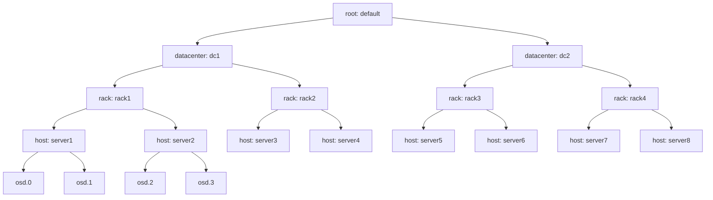
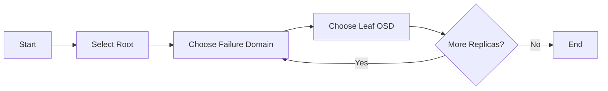
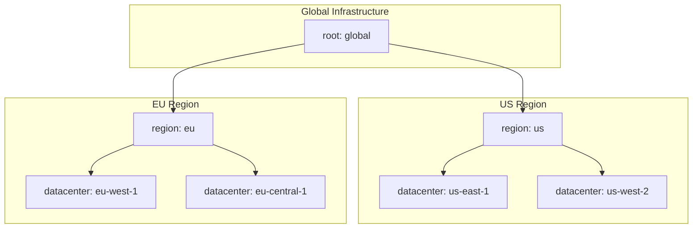
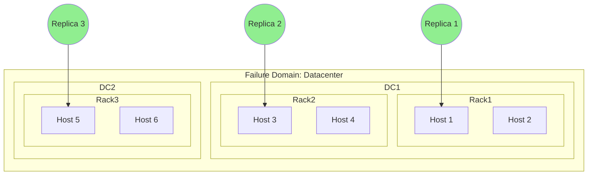
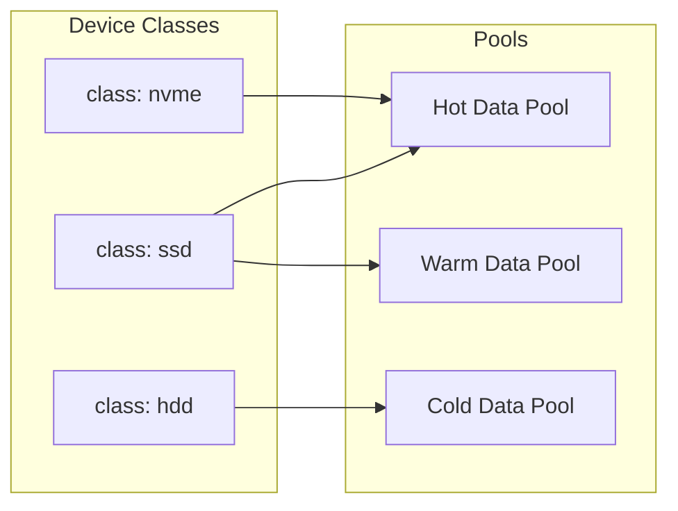

# How to Set Up Ceph CRUSH Maps for Data Locality Control

Author: [nawazdhandala](https://github.com/nawazdhandala)

Tags: Ceph, Storage, CRUSH, Data Locality, High Availability, Cloud Native

Description: Learn how to configure Ceph CRUSH maps to control data placement and ensure fault tolerance.

---

Ceph's CRUSH (Controlled Replication Under Scalable Hashing) algorithm is one of the most powerful features of the Ceph storage system. It enables administrators to define exactly how data is distributed across the cluster, ensuring fault tolerance, performance optimization, and compliance with data locality requirements. In this comprehensive guide, we will explore how to configure CRUSH maps for optimal data placement control.

## Understanding CRUSH Maps

CRUSH maps define the topology of your Ceph cluster. They describe the physical layout of your storage infrastructure and the rules that govern how data is placed across that infrastructure. Unlike traditional storage systems that rely on centralized metadata servers for data placement, CRUSH uses an algorithmic approach that allows any client to compute the location of any object independently.

### Why CRUSH Maps Matter

- **Fault Tolerance**: Distribute replicas across different failure domains (hosts, racks, datacenters)
- **Data Locality**: Keep data close to where it is consumed for better performance
- **Compliance**: Ensure data remains within specific geographic or administrative boundaries
- **Performance Optimization**: Place data on appropriate storage tiers based on access patterns

## CRUSH Hierarchy and Bucket Types

The CRUSH map organizes storage devices into a hierarchical structure called a "bucket hierarchy." Each level in this hierarchy represents a different failure domain.

### Default CRUSH Hierarchy

The following diagram illustrates a typical CRUSH hierarchy:



### Bucket Types

Ceph supports several bucket types, each with different selection algorithms:

| Bucket Type | Description | Use Case |
|------------|-------------|----------|
| `uniform` | All items have identical weights | Homogeneous hardware |
| `list` | Links items in a list | Small clusters with few additions |
| `tree` | Binary search tree | Moderate-sized clusters |
| `straw` | Straw-drawing selection | General purpose, recommended |
| `straw2` | Improved straw algorithm | Default, best performance |

## Viewing Your Current CRUSH Map

Before making changes, you should understand your existing CRUSH map configuration.

The following command exports and decompiles your current CRUSH map:

```bash
# Export the current CRUSH map to a binary file
ceph osd getcrushmap -o crushmap.bin

# Decompile the binary CRUSH map to a human-readable format
crushtool -d crushmap.bin -o crushmap.txt

# View the decompiled CRUSH map
cat crushmap.txt
```

The following command shows the CRUSH hierarchy in a tree format:

```bash
# Display the current CRUSH hierarchy as a tree
# This provides a quick visual overview of your cluster topology
ceph osd crush tree
```

Example output:

```
ID  CLASS  WEIGHT   TYPE NAME
-1         10.00000  root default
-3          5.00000      datacenter dc1
-5          2.50000          rack rack1
-7          1.25000              host server1
 0    hdd   0.62500                  osd.0
 1    ssd   0.62500                  osd.1
-8          1.25000              host server2
 2    hdd   0.62500                  osd.2
 3    ssd   0.62500                  osd.3
```

## Building a Custom CRUSH Hierarchy

Let us build a comprehensive CRUSH hierarchy for a multi-datacenter deployment.

### Step 1: Define the Hierarchy Structure

The following CRUSH map defines a two-datacenter topology with rack and host levels:

```
# CRUSH Map for Multi-Datacenter Deployment
# This configuration defines a hierarchy with datacenters, racks, and hosts

# Tunables control the behavior of the CRUSH algorithm
# Optimal settings for modern Ceph versions
tunable choose_local_tries 0
tunable choose_local_fallback_tries 0
tunable choose_total_tries 50
tunable chooseleaf_descend_once 1
tunable chooseleaf_vary_r 1
tunable chooseleaf_stable 1
tunable straw_calc_version 1
tunable allowed_bucket_algs 54

# Device declarations
# Each OSD is declared with its unique ID
device 0 osd.0 class hdd
device 1 osd.1 class ssd
device 2 osd.2 class hdd
device 3 osd.3 class ssd
device 4 osd.4 class hdd
device 5 osd.5 class ssd
device 6 osd.6 class hdd
device 7 osd.7 class ssd
device 8 osd.8 class hdd
device 9 osd.9 class ssd
device 10 osd.10 class hdd
device 11 osd.11 class ssd

# Host buckets
# Each host contains the OSDs physically installed in that server
host server1 {
    id -10
    alg straw2
    hash 0
    item osd.0 weight 1.000
    item osd.1 weight 1.000
}

host server2 {
    id -11
    alg straw2
    hash 0
    item osd.2 weight 1.000
    item osd.3 weight 1.000
}

host server3 {
    id -12
    alg straw2
    hash 0
    item osd.4 weight 1.000
    item osd.5 weight 1.000
}

host server4 {
    id -13
    alg straw2
    hash 0
    item osd.6 weight 1.000
    item osd.7 weight 1.000
}

host server5 {
    id -14
    alg straw2
    hash 0
    item osd.8 weight 1.000
    item osd.9 weight 1.000
}

host server6 {
    id -15
    alg straw2
    hash 0
    item osd.10 weight 1.000
    item osd.11 weight 1.000
}

# Rack buckets
# Each rack contains multiple hosts within the same physical rack
rack rack1 {
    id -3
    alg straw2
    hash 0
    item server1 weight 2.000
    item server2 weight 2.000
}

rack rack2 {
    id -4
    alg straw2
    hash 0
    item server3 weight 2.000
    item server4 weight 2.000
}

rack rack3 {
    id -5
    alg straw2
    hash 0
    item server5 weight 2.000
    item server6 weight 2.000
}

# Datacenter buckets
# Each datacenter contains multiple racks
datacenter dc1 {
    id -1
    alg straw2
    hash 0
    item rack1 weight 4.000
    item rack2 weight 4.000
}

datacenter dc2 {
    id -2
    alg straw2
    hash 0
    item rack3 weight 4.000
}

# Root bucket
# The root is the top of the hierarchy containing all datacenters
root default {
    id -100
    alg straw2
    hash 0
    item dc1 weight 8.000
    item dc2 weight 4.000
}
```

### Step 2: Add Custom Bucket Types

If you need custom hierarchy levels (e.g., row, room, building, region), define them in the types section:

The following section defines custom bucket types for your CRUSH hierarchy:

```
# Types define the levels in your CRUSH hierarchy
# Lower numbers are closer to OSDs (leaves)
# Higher numbers are closer to root
type 0 osd
type 1 host
type 2 chassis
type 3 rack
type 4 row
type 5 pdu
type 6 pod
type 7 room
type 8 datacenter
type 9 zone
type 10 region
type 11 root
```

## Creating Custom CRUSH Rules

CRUSH rules define how data is placed across your hierarchy. Different rules can be applied to different pools for varying fault tolerance and performance characteristics.

### Understanding CRUSH Rule Structure



### Rule Components

- **min_size / max_size**: Pool size constraints for this rule
- **step take**: Starting point in the hierarchy
- **step choose / chooseleaf**: Selection algorithm
- **step emit**: Output the selected OSDs

### Common CRUSH Rules

The following CRUSH rules demonstrate different placement strategies:

```
# Rule for host-level failure domain
# Replicas are placed on different hosts
# Suitable for small clusters without rack diversity
rule replicated_host {
    id 0
    type replicated
    min_size 1
    max_size 10
    step take default
    step chooseleaf firstn 0 type host
    step emit
}

# Rule for rack-level failure domain
# Replicas are placed in different racks
# Provides better fault tolerance for larger clusters
rule replicated_rack {
    id 1
    type replicated
    min_size 1
    max_size 10
    step take default
    step chooseleaf firstn 0 type rack
    step emit
}

# Rule for datacenter-level failure domain
# Replicas are placed in different datacenters
# Maximum fault tolerance for geo-distributed clusters
rule replicated_datacenter {
    id 2
    type replicated
    min_size 1
    max_size 10
    step take default
    step chooseleaf firstn 0 type datacenter
    step emit
}

# Rule targeting only SSD devices
# Uses device class for storage tier separation
rule ssd_only {
    id 3
    type replicated
    min_size 1
    max_size 10
    step take default class ssd
    step chooseleaf firstn 0 type host
    step emit
}

# Rule targeting only HDD devices
# Cost-effective storage for cold data
rule hdd_only {
    id 4
    type replicated
    min_size 1
    max_size 10
    step take default class hdd
    step chooseleaf firstn 0 type host
    step emit
}
```

### Erasure Coding Rules

The following CRUSH rule is designed for erasure-coded pools:

```
# Rule for erasure-coded pool with rack-level failure domain
# Each chunk is placed in a different rack
rule erasure_rack {
    id 5
    type erasure
    min_size 3
    max_size 20
    step set_chooseleaf_tries 5
    step set_choose_tries 100
    step take default
    step chooseleaf indep 0 type rack
    step emit
}
```

## Rack and Datacenter Awareness Setup

Setting up proper rack and datacenter awareness is crucial for fault tolerance.

### Adding Hosts to Racks

The following commands add hosts to specific racks in your CRUSH hierarchy:

```bash
# Create the datacenter buckets if they do not exist
ceph osd crush add-bucket dc1 datacenter
ceph osd crush add-bucket dc2 datacenter

# Move datacenters under the root
ceph osd crush move dc1 root=default
ceph osd crush move dc2 root=default

# Create rack buckets
ceph osd crush add-bucket rack1 rack
ceph osd crush add-bucket rack2 rack
ceph osd crush add-bucket rack3 rack
ceph osd crush add-bucket rack4 rack

# Place racks in appropriate datacenters
ceph osd crush move rack1 datacenter=dc1
ceph osd crush move rack2 datacenter=dc1
ceph osd crush move rack3 datacenter=dc2
ceph osd crush move rack4 datacenter=dc2

# Move hosts to their respective racks
ceph osd crush move server1 rack=rack1
ceph osd crush move server2 rack=rack1
ceph osd crush move server3 rack=rack2
ceph osd crush move server4 rack=rack2
ceph osd crush move server5 rack=rack3
ceph osd crush move server6 rack=rack3
ceph osd crush move server7 rack=rack4
ceph osd crush move server8 rack=rack4
```

### Verifying the Hierarchy

The following command verifies your CRUSH hierarchy configuration:

```bash
# Display the complete CRUSH tree to verify the hierarchy
ceph osd crush tree

# Check the CRUSH map for any issues
ceph osd crush dump | jq '.buckets[] | {name: .name, type_name: .type_name, items: [.items[].name]}'
```

### Multi-Region Setup Example

The following diagram shows a geo-distributed CRUSH hierarchy:



The following commands set up a multi-region CRUSH hierarchy:

```bash
# Create region buckets for geographic separation
ceph osd crush add-bucket us region
ceph osd crush add-bucket eu region

# Move regions under the global root
ceph osd crush move us root=default
ceph osd crush move eu root=default

# Create datacenter buckets for each region
ceph osd crush add-bucket us-east-1 datacenter
ceph osd crush add-bucket us-west-2 datacenter
ceph osd crush add-bucket eu-west-1 datacenter
ceph osd crush add-bucket eu-central-1 datacenter

# Organize datacenters into their respective regions
ceph osd crush move us-east-1 region=us
ceph osd crush move us-west-2 region=us
ceph osd crush move eu-west-1 region=eu
ceph osd crush move eu-central-1 region=eu
```

## Failure Domain Configuration

Failure domains determine how Ceph distributes replicas to ensure data survives hardware failures.

### Failure Domain Visualization



### Choosing the Right Failure Domain

| Failure Domain | Protection Against | Replica Requirement |
|---------------|-------------------|-------------------|
| OSD | Single disk failure | 2+ replicas |
| Host | Server failure | 2+ replicas, 2+ hosts |
| Rack | Rack failure (power, network) | 3+ replicas, 3+ racks |
| Datacenter | Site failure | 3+ replicas, 3+ DCs |

### Configuring Pool Failure Domain

The following commands configure failure domains for specific pools:

```bash
# Create a pool with rack-level failure domain
ceph osd pool create critical-data 128 128

# Apply the rack-aware CRUSH rule to the pool
ceph osd pool set critical-data crush_rule replicated_rack

# Set the replication size (3 replicas for rack-level fault tolerance)
ceph osd pool set critical-data size 3

# Set the minimum number of replicas for writes to succeed
ceph osd pool set critical-data min_size 2

# Verify the pool configuration
ceph osd pool get critical-data crush_rule
ceph osd pool get critical-data size
```

### Testing Failure Domain Placement

The following commands verify that CRUSH rules are placing data correctly:

```bash
# Test the CRUSH rule placement for a specific object
# This shows which OSDs would be selected for the given object name
crushtool -i crushmap.bin --test --show-mappings \
    --rule 1 --num-rep 3 --min-x 0 --max-x 10

# Verify placement for an existing pool
ceph pg dump pgs_brief | head -20

# Check if all PGs are properly distributed
ceph osd df tree
```

## Device Classes for Storage Tiering

Ceph device classes allow you to separate different storage media types.

### Device Class Overview



### Managing Device Classes

The following commands manage device classes in your Ceph cluster:

```bash
# List all device classes in the cluster
ceph osd crush class ls

# Show OSDs and their device classes
ceph osd crush tree --show-shadow

# Set device class for an OSD
# First, remove any existing class, then set the new one
ceph osd crush rm-device-class osd.0
ceph osd crush set-device-class ssd osd.0

# Batch update device classes for multiple OSDs
for osd in 0 2 4; do
    ceph osd crush rm-device-class osd.$osd
    ceph osd crush set-device-class hdd osd.$osd
done

for osd in 1 3 5; do
    ceph osd crush rm-device-class osd.$osd
    ceph osd crush set-device-class ssd osd.$osd
done
```

### Creating Class-Specific Rules

The following commands create CRUSH rules for specific device classes:

```bash
# Create a rule that uses only SSD devices
ceph osd crush rule create-replicated ssd-rule default host ssd

# Create a rule that uses only HDD devices
ceph osd crush rule create-replicated hdd-rule default host hdd

# Create a rule for NVMe devices with rack failure domain
ceph osd crush rule create-replicated nvme-rack-rule default rack nvme

# List all CRUSH rules
ceph osd crush rule ls

# Dump a specific rule to see its configuration
ceph osd crush rule dump ssd-rule
```

### Creating Tiered Storage Pools

The following commands create storage pools for different tiers:

```bash
# Create a high-performance pool on SSD storage
ceph osd pool create fast-pool 64 64
ceph osd pool set fast-pool crush_rule ssd-rule
ceph osd pool set fast-pool size 3
ceph osd pool application enable fast-pool rbd

# Create a capacity pool on HDD storage
ceph osd pool create capacity-pool 128 128
ceph osd pool set capacity-pool crush_rule hdd-rule
ceph osd pool set capacity-pool size 3
ceph osd pool application enable capacity-pool rbd

# Verify pool configuration
ceph osd pool ls detail
```

## Compiling and Applying CRUSH Maps

After modifying your CRUSH map, you need to compile and apply it to the cluster.

### Complete Workflow

The following commands demonstrate the complete CRUSH map update workflow:

```bash
# Step 1: Export the current CRUSH map
ceph osd getcrushmap -o crushmap.bin

# Step 2: Decompile to text format for editing
crushtool -d crushmap.bin -o crushmap.txt

# Step 3: Edit the CRUSH map
# Use your preferred text editor
vim crushmap.txt

# Step 4: Validate the modified CRUSH map
# This checks for syntax errors and logical issues
crushtool -c crushmap.txt -o crushmap-new.bin

# Step 5: Test the new CRUSH map before applying
# Simulate placement to verify behavior
crushtool -i crushmap-new.bin --test --show-utilization \
    --rule 0 --num-rep 3

# Step 6: Compare placement before and after
crushtool -i crushmap.bin --test --show-mappings \
    --rule 0 --num-rep 3 --min-x 0 --max-x 100 > old-mappings.txt

crushtool -i crushmap-new.bin --test --show-mappings \
    --rule 0 --num-rep 3 --min-x 0 --max-x 100 > new-mappings.txt

diff old-mappings.txt new-mappings.txt

# Step 7: Apply the new CRUSH map
# This will trigger data movement if placement changes
ceph osd setcrushmap -i crushmap-new.bin

# Step 8: Monitor the rebalancing process
ceph -s
ceph pg stat
watch ceph health detail
```

### Controlling Data Movement

The following commands help control data movement during CRUSH changes:

```bash
# Set flags to pause recovery during CRUSH changes
# Useful when making multiple changes
ceph osd set norecover
ceph osd set nobackfill

# Apply CRUSH changes
ceph osd setcrushmap -i crushmap-new.bin

# Unset flags to allow data movement
ceph osd unset norecover
ceph osd unset nobackfill

# Monitor recovery progress
ceph -w

# Limit recovery bandwidth to reduce impact on clients
ceph config set osd osd_recovery_max_active 1
ceph config set osd osd_max_backfills 1
```

## Advanced CRUSH Configuration

### Weight Adjustments

OSD weights affect data distribution. Higher weights receive proportionally more data.

The following commands adjust OSD weights:

```bash
# View current OSD weights
ceph osd crush tree

# Set weight for a specific OSD
# Weight typically corresponds to disk size in TB
ceph osd crush reweight osd.0 2.0

# Temporarily reduce weight for maintenance
# Use reweight (0.0-1.0) for temporary adjustments
ceph osd reweight osd.0 0.5

# Return OSD to full weight
ceph osd reweight osd.0 1.0

# Reweight OSDs by utilization
# Automatically adjusts weights to balance data
ceph osd reweight-by-utilization
```

### CRUSH Tunables

CRUSH tunables control algorithm behavior and affect data placement.

The following commands manage CRUSH tunables:

```bash
# View current tunable profile
ceph osd crush show-tunables

# Set tunable profile for optimal modern behavior
ceph osd crush tunables optimal

# Available tunable profiles:
# - legacy: Old CRUSH behavior
# - argonaut: Ceph 0.48 (Argonaut)
# - bobtail: Ceph 0.56 (Bobtail)
# - firefly: Ceph 0.80 (Firefly)
# - hammer: Ceph 0.94 (Hammer)
# - jewel: Ceph 10.2 (Jewel)
# - optimal: Best for current version

# Set individual tunables
ceph osd crush tunables straw_calc_version 1
```

### Troubleshooting CRUSH Issues

The following commands help diagnose CRUSH-related problems:

```bash
# Check for placement group issues related to CRUSH
ceph pg dump_stuck

# Verify OSD location in CRUSH map
ceph osd find 0

# Check CRUSH rule for a specific pool
ceph osd pool get mypool crush_rule

# Simulate CRUSH placement for debugging
crushtool -i crushmap.bin --test \
    --show-statistics --rule 0 --num-rep 3

# Check for oversized or undersized PGs
ceph health detail | grep -E "(undersized|oversized)"

# Verify all OSDs are in the CRUSH map
ceph osd tree
ceph osd crush tree

# Check for weight anomalies
ceph osd df tree
```

## Production Best Practices

### Pre-Deployment Checklist

1. **Plan your hierarchy carefully** before adding OSDs
2. **Test CRUSH changes** in a staging environment first
3. **Monitor rebalancing** and throttle if necessary
4. **Document your CRUSH configuration** for disaster recovery
5. **Use device classes** to separate storage tiers

### Recommended CRUSH Rule for Production

The following CRUSH rule is recommended for production workloads:

```
# Production-ready replicated rule with rack-level failure domain
# Includes retry parameters for improved reliability
rule production_replicated {
    id 100
    type replicated
    min_size 1
    max_size 10
    # Start from the default root bucket
    step take default
    # Set high retry count for better placement success
    step set_chooseleaf_tries 5
    # Select 0 (all replicas) from different racks
    step chooseleaf firstn 0 type rack
    step emit
}

# Production erasure coding rule
# 4+2 encoding across 6 racks for high durability
rule production_erasure {
    id 101
    type erasure
    min_size 3
    max_size 20
    step set_chooseleaf_tries 5
    step set_choose_tries 100
    step take default
    # Independent selection ensures no duplicate failures
    step chooseleaf indep 0 type rack
    step emit
}
```

### Monitoring CRUSH Health

The following script monitors CRUSH map health:

```bash
#!/bin/bash
# CRUSH Health Check Script
# Run periodically to verify cluster health

echo "=== CRUSH Map Health Check ==="

# Check for any HEALTH_WARN or HEALTH_ERR related to CRUSH
echo "Cluster Health:"
ceph health detail | grep -i crush

# Verify all OSDs are in expected locations
echo -e "\nOSD Location Summary:"
ceph osd tree

# Check PG distribution
echo -e "\nPG Distribution by OSD:"
ceph osd df tree

# Check for misplaced PGs
echo -e "\nMisplaced/Degraded PGs:"
ceph pg ls | grep -v "active+clean" | head -20

# Verify CRUSH rules
echo -e "\nCRUSH Rules:"
ceph osd crush rule ls

# Check pool CRUSH rule assignments
echo -e "\nPool CRUSH Rule Assignments:"
ceph osd pool ls detail | grep -E "(pool|crush_rule)"
```

## Summary

Configuring Ceph CRUSH maps effectively is essential for building a reliable and performant storage infrastructure. Key takeaways from this guide:

1. **Understand your topology**: Map your physical infrastructure to CRUSH buckets
2. **Choose appropriate failure domains**: Balance fault tolerance with availability
3. **Use device classes**: Separate storage tiers for optimal performance
4. **Test before applying**: Always validate CRUSH changes before production
5. **Monitor continuously**: Watch for placement issues and rebalancing impact

CRUSH maps give you fine-grained control over data placement, enabling you to meet strict availability, performance, and compliance requirements. Take the time to design your CRUSH hierarchy properly from the start, and your Ceph cluster will reward you with predictable, reliable storage for years to come.

## Related Resources

- [Ceph CRUSH Map Documentation](https://docs.ceph.com/en/latest/rados/operations/crush-map/)
- [CRUSH Algorithm Paper](https://ceph.com/wp-content/uploads/2016/08/weil-crush-sc06.pdf)
- [Ceph Device Classes](https://docs.ceph.com/en/latest/rados/operations/crush-map/#device-classes)
