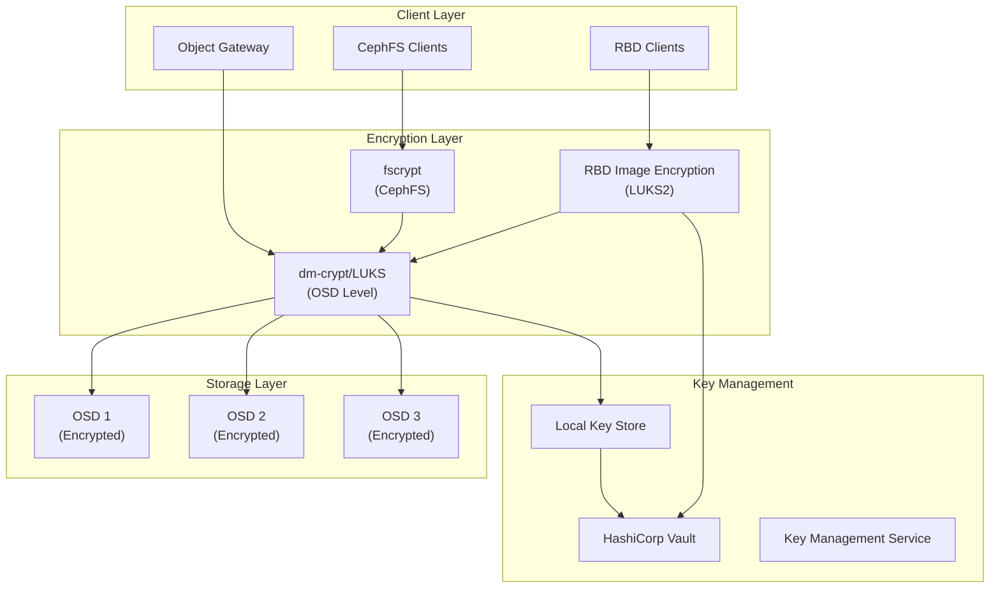
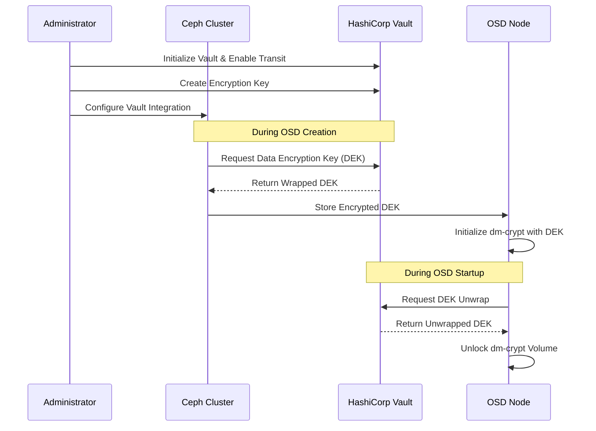
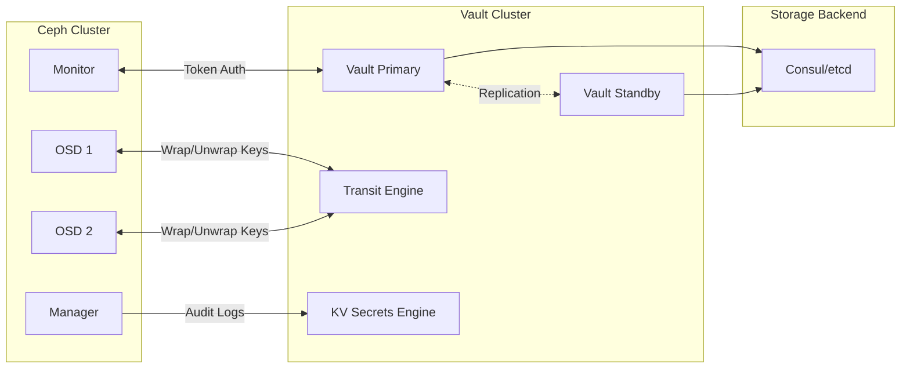
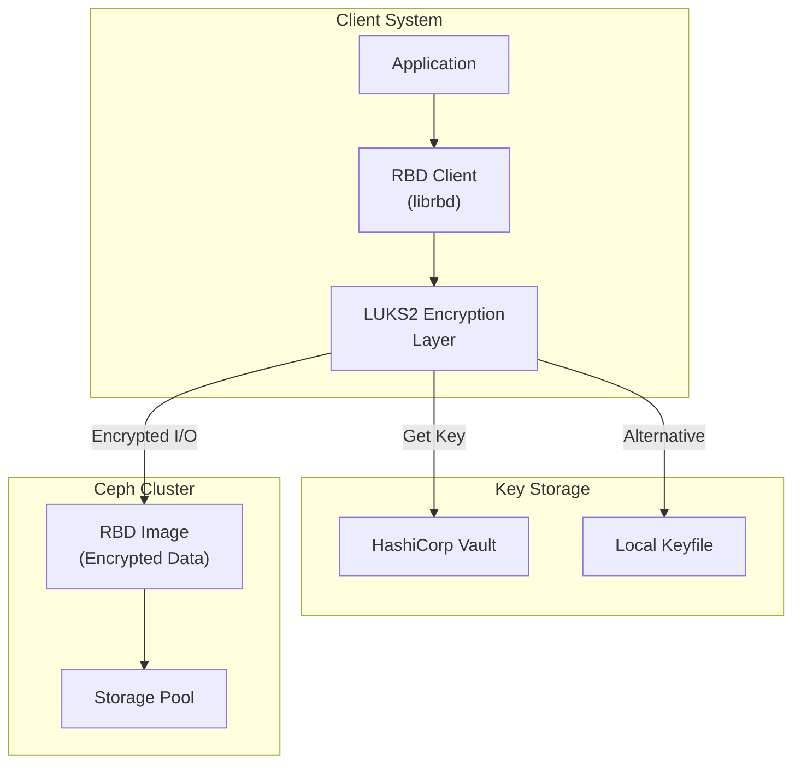
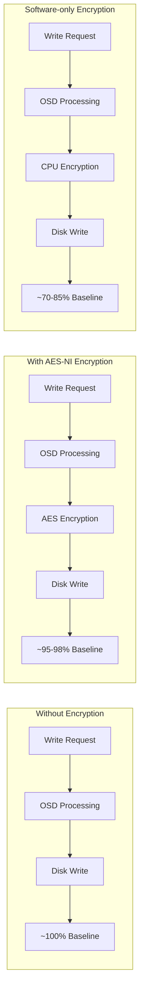

# How to Configure Ceph Encryption at Rest

Author: [nawazdhandala](https://github.com/nawazdhandala)

Tags: Ceph, Storage, Security, Encryption, Compliance, Cloud Native

Description: A complete guide to enabling and managing encryption at rest for Ceph storage.

---

Data security is paramount in modern infrastructure, and encryption at rest is a fundamental requirement for protecting sensitive information stored in your Ceph clusters. This comprehensive guide covers everything you need to know about configuring encryption at rest for Ceph storage, from OSD-level encryption with dm-crypt/LUKS to RBD image encryption and enterprise key management with HashiCorp Vault.

## Table of Contents

1. [Understanding Ceph Encryption Options](#understanding-ceph-encryption-options)
2. [Encryption Architecture Overview](#encryption-architecture-overview)
3. [OSD Encryption with dm-crypt/LUKS](#osd-encryption-with-dm-cryptluks)
4. [Key Management with HashiCorp Vault](#key-management-with-hashicorp-vault)
5. [RBD Image Encryption](#rbd-image-encryption)
6. [CephFS Encryption Considerations](#cephfs-encryption-considerations)
7. [Compliance and Security Best Practices](#compliance-and-security-best-practices)
8. [Performance Considerations](#performance-considerations)
9. [Troubleshooting Common Issues](#troubleshooting-common-issues)

## Understanding Ceph Encryption Options

Ceph provides multiple layers of encryption to protect your data at rest. Understanding these options helps you choose the right approach for your security requirements.

### Types of Encryption in Ceph

| Encryption Type | Scope | Use Case | Performance Impact |
|----------------|-------|----------|-------------------|
| OSD Encryption (dm-crypt/LUKS) | Full disk | All data on OSD | Low (hardware acceleration) |
| RBD Encryption | Per-image | Selective block device encryption | Moderate |
| CephFS fscrypt | Per-directory | File-level encryption | Moderate |
| Client-side | Application | End-to-end encryption | Varies |

## Encryption Architecture Overview

Before diving into implementation, let's understand how encryption fits into the Ceph architecture.



### Key Management Flow



## OSD Encryption with dm-crypt/LUKS

OSD encryption using dm-crypt with LUKS is the most common and recommended approach for encrypting all data stored on Ceph OSDs. This method encrypts the entire block device, ensuring that all data, metadata, and journals are protected.

### Prerequisites

Before enabling OSD encryption, ensure you have the following:

- Ceph cluster version Nautilus (14.x) or later
- cryptsetup package installed on all OSD nodes
- Sufficient CPU resources (AES-NI support recommended)
- Key management solution (Vault recommended for production)

The following command installs the required cryptsetup package on Debian/Ubuntu systems:

```bash
# Install cryptsetup on all OSD nodes
# This package provides the dm-crypt kernel module and userspace tools
sudo apt-get update && sudo apt-get install -y cryptsetup
```

Verify that your CPU supports AES-NI hardware acceleration for optimal performance:

```bash
# Check for AES-NI support on your CPU
# The presence of 'aes' in the output indicates hardware acceleration is available
grep -o aes /proc/cpuinfo | head -1
```

### Enabling OSD Encryption with ceph-volume

Starting with Ceph Nautilus, `ceph-volume` is the recommended tool for OSD deployment with built-in encryption support.

#### Method 1: Encrypt New OSDs During Creation

The following command creates a new encrypted OSD using the lvm batch method. The --dmcrypt flag enables LUKS encryption:

```bash
# Create encrypted OSD using ceph-volume lvm
# --dmcrypt enables dm-crypt/LUKS encryption
# --crush-device-class specifies the device class for CRUSH placement
# Replace /dev/sdb with your actual device path
sudo ceph-volume lvm create --dmcrypt --data /dev/sdb --crush-device-class hdd
```

For batch deployment of multiple encrypted OSDs, use the batch subcommand:

```bash
# Batch create multiple encrypted OSDs
# This is useful when deploying multiple disks at once
# All specified devices will be encrypted with dm-crypt
sudo ceph-volume lvm batch --dmcrypt /dev/sdb /dev/sdc /dev/sdd
```

#### Method 2: Using cephadm for Encrypted OSD Deployment

When using cephadm (recommended for new deployments), you can enable encryption in the OSD specification:

```yaml
# osd-encrypted-spec.yaml
# This specification file defines encrypted OSD deployment
# The 'encrypted: true' option enables dm-crypt for all matching devices
service_type: osd
service_id: encrypted-osds
placement:
  # Target specific hosts for OSD deployment
  hosts:
    - ceph-osd-01
    - ceph-osd-02
    - ceph-osd-03
spec:
  # Enable dm-crypt encryption for all OSDs
  encrypted: true
  # Define data device selection criteria
  data_devices:
    # Select all rotational (HDD) devices
    rotational: 1
    # Minimum size filter to avoid selecting small devices
    size: '100G:'
  # Optional: Define dedicated WAL/DB devices for better performance
  db_devices:
    # Select non-rotational (SSD/NVMe) devices for DB
    rotational: 0
    size: '50G:100G'
```

Apply the OSD specification to deploy encrypted OSDs:

```bash
# Apply the encrypted OSD specification using cephadm
# This will deploy encrypted OSDs on all matching devices
sudo ceph orch apply -i osd-encrypted-spec.yaml
```

### Configuring dm-crypt Options

Ceph provides several configuration options to customize the dm-crypt encryption settings. Add these to your ceph.conf file:

```ini
# /etc/ceph/ceph.conf
# dm-crypt encryption configuration options

[global]
# Enable OSD encryption cluster-wide
# When set to true, all new OSDs will be encrypted by default
osd_dmcrypt_type = luks2

# Specify the encryption cipher and mode
# aes-xts-plain64 is recommended for disk encryption
# 256-bit key provides strong security with good performance
osd_dmcrypt_key_size = 256

# LUKS key slot to use (0-7 available)
# Slot 0 is typically used for the primary key
osd_dmcrypt_key_slot = 0
```

### Managing Encryption Keys

By default, Ceph stores encryption keys in the MON key-value store. You can view and manage these keys (with appropriate permissions):

```bash
# List all dm-crypt keys stored in the cluster
# These keys are used to unlock encrypted OSDs during startup
# WARNING: Treat these keys with extreme care - loss means data loss
sudo ceph config-key ls | grep dm-crypt

# View details of a specific OSD's encryption key
# The key is base64 encoded for storage
# Replace <osd-uuid> with the actual OSD UUID
sudo ceph config-key get dm-crypt/osd/<osd-uuid>/luks
```

### Verifying OSD Encryption Status

After deploying encrypted OSDs, verify the encryption status:

```bash
# Check if dm-crypt is active on OSD devices
# This shows all active dm-crypt mappings
# Look for entries corresponding to your OSD devices
sudo dmsetup status | grep crypt

# Verify LUKS header on an OSD device
# This confirms the device is properly encrypted
# Replace /dev/sdb with your actual OSD device
sudo cryptsetup luksDump /dev/sdb
```

Query the OSD metadata to confirm encryption is enabled:

```bash
# List all OSDs and their encryption status using ceph-volume
# The 'encrypted' field shows whether dm-crypt is enabled
sudo ceph-volume lvm list --format json | jq '.[] | {osd_id: .[0].tags["ceph.osd_id"], encrypted: .[0].tags["ceph.encrypted"]}'
```

## Key Management with HashiCorp Vault

For production environments, integrating Ceph with HashiCorp Vault provides enterprise-grade key management with features like automatic key rotation, audit logging, and centralized secrets management.

### Vault Integration Architecture



### Setting Up Vault for Ceph Integration

First, install and initialize HashiCorp Vault. The following commands set up a production-ready Vault server:

```bash
# Download and install HashiCorp Vault
# Always verify the checksum for security
export VAULT_VERSION="1.15.4"
wget https://releases.hashicorp.com/vault/${VAULT_VERSION}/vault_${VAULT_VERSION}_linux_amd64.zip
unzip vault_${VAULT_VERSION}_linux_amd64.zip
sudo mv vault /usr/local/bin/

# Create Vault configuration directory and user
sudo useradd --system --home /etc/vault.d --shell /bin/false vault
sudo mkdir -p /etc/vault.d /var/lib/vault/data
sudo chown -R vault:vault /etc/vault.d /var/lib/vault
```

Create the Vault server configuration file:

```hcl
# /etc/vault.d/vault.hcl
# Vault server configuration for Ceph integration

# Storage backend configuration
# Using integrated storage (Raft) for high availability
storage "raft" {
  path    = "/var/lib/vault/data"
  node_id = "vault-node-1"
}

# Listener configuration for API access
listener "tcp" {
  address       = "0.0.0.0:8200"
  tls_cert_file = "/etc/vault.d/tls/vault-cert.pem"
  tls_key_file  = "/etc/vault.d/tls/vault-key.pem"
}

# Enable the Vault UI for management
ui = true

# Cluster configuration for HA
cluster_addr = "https://vault-node-1.example.com:8201"
api_addr     = "https://vault-node-1.example.com:8200"

# Disable memory locking if running in container
# Enable in production for security
disable_mlock = false

# Audit logging configuration
# Critical for compliance requirements
telemetry {
  prometheus_retention_time = "60s"
  disable_hostname          = true
}
```

Create a systemd service file for Vault:

```ini
# /etc/systemd/system/vault.service
# Vault systemd service configuration

[Unit]
Description=HashiCorp Vault
Documentation=https://www.vaultproject.io/docs/
Requires=network-online.target
After=network-online.target
ConditionFileNotEmpty=/etc/vault.d/vault.hcl

[Service]
User=vault
Group=vault
ProtectSystem=full
ProtectHome=read-only
PrivateTmp=yes
PrivateDevices=yes
SecureBits=keep-caps
AmbientCapabilities=CAP_IPC_LOCK
NoNewPrivileges=yes
ExecStart=/usr/local/bin/vault server -config=/etc/vault.d/vault.hcl
ExecReload=/bin/kill --signal HUP $MAINPID
KillMode=process
KillSignal=SIGINT
Restart=on-failure
RestartSec=5
TimeoutStopSec=30
LimitNOFILE=65536
LimitMEMLOCK=infinity

[Install]
WantedBy=multi-user.target
```

Initialize and unseal Vault:

```bash
# Start and enable Vault service
sudo systemctl enable --now vault

# Set Vault address environment variable
export VAULT_ADDR='https://vault.example.com:8200'

# Initialize Vault with key shares for disaster recovery
# -key-shares: Total number of key shares to generate
# -key-threshold: Minimum shares needed to unseal
# IMPORTANT: Store these keys securely in separate locations
vault operator init -key-shares=5 -key-threshold=3

# Unseal Vault using threshold number of keys
# Repeat this command with different keys until unsealed
vault operator unseal <key-1>
vault operator unseal <key-2>
vault operator unseal <key-3>
```

### Enabling the Transit Secrets Engine

The Transit secrets engine provides encryption as a service, which Ceph uses for key wrapping:

```bash
# Authenticate to Vault with root token
# In production, use a more restricted token
vault login <root-token>

# Enable the Transit secrets engine
# Transit provides cryptographic operations without exposing keys
vault secrets enable transit

# Create an encryption key for Ceph OSD encryption
# aes256-gcm96 provides authenticated encryption
vault write -f transit/keys/ceph-osd-key \
    type=aes256-gcm96 \
    exportable=false \
    allow_plaintext_backup=false

# Create a separate key for RBD image encryption
vault write -f transit/keys/ceph-rbd-key \
    type=aes256-gcm96 \
    exportable=false
```

### Creating Vault Policies for Ceph

Create fine-grained policies to control Ceph's access to Vault:

```hcl
# ceph-osd-policy.hcl
# Vault policy for Ceph OSD encryption operations

# Allow encrypting and decrypting using the OSD key
path "transit/encrypt/ceph-osd-key" {
  capabilities = ["update"]
}

path "transit/decrypt/ceph-osd-key" {
  capabilities = ["update"]
}

# Allow generating data encryption keys wrapped with the master key
path "transit/datakey/plaintext/ceph-osd-key" {
  capabilities = ["update"]
}

# Allow rewrapping keys during key rotation
path "transit/rewrap/ceph-osd-key" {
  capabilities = ["update"]
}

# Read-only access to key configuration
path "transit/keys/ceph-osd-key" {
  capabilities = ["read"]
}
```

Create a policy for RBD encryption:

```hcl
# ceph-rbd-policy.hcl
# Vault policy for RBD image encryption operations

# Allow all transit operations for RBD encryption
path "transit/encrypt/ceph-rbd-key" {
  capabilities = ["update"]
}

path "transit/decrypt/ceph-rbd-key" {
  capabilities = ["update"]
}

path "transit/datakey/plaintext/ceph-rbd-key" {
  capabilities = ["update"]
}

path "transit/rewrap/ceph-rbd-key" {
  capabilities = ["update"]
}
```

Apply the policies to Vault:

```bash
# Write the OSD policy to Vault
vault policy write ceph-osd-policy ceph-osd-policy.hcl

# Write the RBD policy to Vault
vault policy write ceph-rbd-policy ceph-rbd-policy.hcl

# Create a combined policy for general Ceph operations
vault policy write ceph-admin-policy - <<EOF
# Combined policy for Ceph administrators
path "transit/*" {
  capabilities = ["create", "read", "update", "list"]
}

path "sys/policies/acl/*" {
  capabilities = ["read", "list"]
}
EOF
```

### Configuring AppRole Authentication for Ceph

AppRole is the recommended authentication method for machine-to-machine communication:

```bash
# Enable AppRole authentication method
vault auth enable approle

# Create an AppRole for Ceph OSD nodes
# The role defines how Ceph authenticates to Vault
vault write auth/approle/role/ceph-osd \
    token_policies="ceph-osd-policy" \
    token_ttl=1h \
    token_max_ttl=4h \
    secret_id_ttl=0 \
    secret_id_num_uses=0

# Get the Role ID (public identifier)
vault read auth/approle/role/ceph-osd/role-id

# Generate a Secret ID (keep this secure)
vault write -f auth/approle/role/ceph-osd/secret-id
```

### Configuring Ceph to Use Vault

Configure Ceph to integrate with Vault for key management:

```ini
# /etc/ceph/ceph.conf
# Vault integration configuration

[global]
# RGW/RBD encryption key management with Vault
rgw_crypt_vault_addr = https://vault.example.com:8200
rgw_crypt_vault_auth = agent
rgw_crypt_vault_prefix = /v1/transit/
rgw_crypt_vault_secret_engine = transit
rgw_crypt_vault_token_file = /etc/ceph/vault-token

# SSL/TLS configuration for Vault communication
rgw_crypt_vault_ssl_cacert = /etc/ceph/vault-ca.pem
rgw_crypt_vault_verify_ssl = true

# Namespace support for Vault Enterprise
# rgw_crypt_vault_namespace = ceph-cluster

[client.rgw.gateway-01]
# Per-gateway Vault configuration (optional)
rgw_crypt_vault_addr = https://vault.example.com:8200
```

Create a Vault agent configuration for automatic token renewal:

```hcl
# /etc/vault.d/vault-agent.hcl
# Vault Agent configuration for Ceph integration

# Connect to Vault server
vault {
  address = "https://vault.example.com:8200"

  retry {
    num_retries = 5
  }
}

# Auto-auth using AppRole
auto_auth {
  method "approle" {
    mount_path = "auth/approle"
    config = {
      role_id_file_path   = "/etc/ceph/vault-role-id"
      secret_id_file_path = "/etc/ceph/vault-secret-id"
      remove_secret_id_file_after_reading = false
    }
  }

  # Write token to file for Ceph to use
  sink "file" {
    config = {
      path = "/etc/ceph/vault-token"
      mode = 0640
    }
  }
}

# Cache tokens locally for performance
cache {
  use_auto_auth_token = true
}

# Optional: Template for certificate renewal
template {
  source      = "/etc/vault.d/templates/ceph-cert.tpl"
  destination = "/etc/ceph/ceph-cert.pem"
  perms       = 0644
  command     = "systemctl reload ceph-osd.target"
}
```

### Key Rotation with Vault

Implement automatic key rotation for enhanced security:

```bash
# Configure automatic key rotation every 30 days
# This rotates the master key in Vault, not the data encryption keys
vault write transit/keys/ceph-osd-key/config \
    auto_rotate_period=720h

# Manually trigger key rotation if needed
vault write -f transit/keys/ceph-osd-key/rotate

# View key versions after rotation
vault read transit/keys/ceph-osd-key

# Rewrap data encryption keys with the new master key version
# This should be done after key rotation for existing OSDs
vault write transit/rewrap/ceph-osd-key \
    ciphertext="vault:v1:base64encodedciphertext..."
```

## RBD Image Encryption

RBD (RADOS Block Device) supports native image-level encryption using LUKS2 format. This provides encryption for individual block devices without requiring full OSD encryption.

### RBD Encryption Architecture



### Creating Encrypted RBD Images

Create an encrypted RBD image with LUKS2 format:

```bash
# Create a new RBD image in the specified pool
# Size is specified in megabytes, gigabytes, or terabytes
rbd create mypool/encrypted-image --size 100G

# Format the image with LUKS2 encryption
# You will be prompted to enter a passphrase
# The passphrase is used to derive the encryption key
rbd encryption format mypool/encrypted-image luks2 \
    --encryption-passphrase-file <(echo -n "your-secure-passphrase")
```

For automated deployments, use a keyfile instead of a passphrase:

```bash
# Generate a random encryption key
# Use /dev/random for higher entropy (slower but more secure)
dd if=/dev/urandom of=/etc/ceph/rbd-encryption-key bs=32 count=1

# Set restrictive permissions on the key file
chmod 600 /etc/ceph/rbd-encryption-key

# Create and format encrypted image using keyfile
rbd create mypool/encrypted-volume --size 500G
rbd encryption format mypool/encrypted-volume luks2 \
    --encryption-passphrase-file /etc/ceph/rbd-encryption-key
```

### Mounting Encrypted RBD Images

Map and mount encrypted RBD images on client systems:

```bash
# Map the encrypted RBD image to a local block device
# This requires the encryption passphrase or keyfile
sudo rbd device map mypool/encrypted-volume \
    --encryption-format luks2 \
    --encryption-passphrase-file /etc/ceph/rbd-encryption-key

# The mapped device will be available at /dev/rbdX
# Create a filesystem on the device (first time only)
sudo mkfs.ext4 /dev/rbd0

# Create mount point and mount the encrypted volume
sudo mkdir -p /mnt/encrypted-data
sudo mount /dev/rbd0 /mnt/encrypted-data
```

### Layered Encryption for Snapshots

RBD supports encryption for cloned images and snapshots:

```bash
# Create a snapshot of the encrypted image
# Snapshots inherit the encryption format
rbd snap create mypool/encrypted-volume@snap1

# Protect the snapshot before cloning
rbd snap protect mypool/encrypted-volume@snap1

# Clone the encrypted snapshot
# The clone will use the same encryption key
rbd clone mypool/encrypted-volume@snap1 mypool/encrypted-clone

# Format the clone with its own encryption layer
# This adds a second encryption layer for additional security
rbd encryption format mypool/encrypted-clone luks2 \
    --encryption-passphrase-file /etc/ceph/clone-encryption-key
```

### RBD Encryption with Kubernetes

For Kubernetes environments, configure the Ceph CSI driver to support encrypted PersistentVolumes:

```yaml
# encrypted-storage-class.yaml
# StorageClass for encrypted RBD volumes
apiVersion: storage.k8s.io/v1
kind: StorageClass
metadata:
  name: ceph-rbd-encrypted
  annotations:
    # Mark as default encrypted storage class
    storageclass.kubernetes.io/is-default-class: "false"
provisioner: rbd.csi.ceph.com
parameters:
  # Ceph cluster configuration
  clusterID: ceph-cluster-id
  pool: kubernetes-encrypted
  imageFeatures: layering,exclusive-lock,object-map,fast-diff

  # Enable RBD encryption
  encrypted: "true"

  # Encryption passphrase from Kubernetes Secret
  encryptionKMSID: vault-kms

  # CSI driver options
  csi.storage.k8s.io/provisioner-secret-name: csi-rbd-secret
  csi.storage.k8s.io/provisioner-secret-namespace: ceph-csi
  csi.storage.k8s.io/controller-expand-secret-name: csi-rbd-secret
  csi.storage.k8s.io/controller-expand-secret-namespace: ceph-csi
  csi.storage.k8s.io/node-stage-secret-name: csi-rbd-secret
  csi.storage.k8s.io/node-stage-secret-namespace: ceph-csi

reclaimPolicy: Delete
allowVolumeExpansion: true
volumeBindingMode: Immediate
```

Configure the KMS connection for Ceph CSI:

```yaml
# ceph-csi-kms-config.yaml
# ConfigMap for KMS integration
apiVersion: v1
kind: ConfigMap
metadata:
  name: ceph-csi-encryption-kms-config
  namespace: ceph-csi
data:
  config.json: |
    {
      "vault-kms": {
        "encryptionKMSType": "vault",
        "vaultAddress": "https://vault.example.com:8200",
        "vaultAuthPath": "/v1/auth/kubernetes/login",
        "vaultRole": "ceph-csi-role",
        "vaultPassphraseRoot": "/v1/secret/data",
        "vaultPassphrasePath": "ceph-csi/",
        "vaultCAVerify": "true",
        "vaultCAFromSecret": "vault-ca-cert",
        "tenantConfigName": "ceph-csi-kms-config"
      }
    }
```

Create a PersistentVolumeClaim using the encrypted storage class:

```yaml
# encrypted-pvc.yaml
# PersistentVolumeClaim for encrypted storage
apiVersion: v1
kind: PersistentVolumeClaim
metadata:
  name: encrypted-data-pvc
  namespace: production
spec:
  accessModes:
    - ReadWriteOnce
  storageClassName: ceph-rbd-encrypted
  resources:
    requests:
      storage: 100Gi
```

## CephFS Encryption Considerations

CephFS provides file-level encryption using fscrypt, the Linux filesystem encryption framework.

### CephFS fscrypt Setup

Enable fscrypt support in your CephFS filesystem:

```bash
# Check if the MDS supports fscrypt
ceph fs get cephfs | grep -i encrypt

# Enable fscrypt feature on the filesystem
# NOTE: This requires a recent kernel (5.4+) on clients
ceph fs set cephfs allow_new_snaps true

# Set the encryption policy for new files
# This is done on the client side
fscrypt setup /mnt/cephfs
```

Configure fscrypt on the CephFS mount:

```bash
# Mount CephFS with encryption support
sudo mount -t ceph mon1:6789:/ /mnt/cephfs \
    -o name=admin,secret=<key>,test_dummy_encryption

# Setup fscrypt on the mounted filesystem
sudo fscrypt setup /mnt/cephfs

# Create an encrypted directory
sudo fscrypt encrypt /mnt/cephfs/secure-data \
    --source=custom_passphrase

# Unlock the directory for access
sudo fscrypt unlock /mnt/cephfs/secure-data
```

## Compliance and Security Best Practices

Encryption at rest is often required for regulatory compliance. Here are key considerations for different compliance frameworks.

### Compliance Requirements Matrix

| Framework | Requirement | Ceph Implementation |
|-----------|-------------|---------------------|
| PCI DSS | Encrypt stored cardholder data | OSD encryption + RBD encryption |
| HIPAA | Encryption of PHI at rest | Full disk encryption with key management |
| GDPR | Appropriate technical measures | Encryption + access controls |
| SOC 2 | Encryption of sensitive data | OSD encryption + audit logging |
| FedRAMP | FIPS 140-2 validated encryption | FIPS-compliant dm-crypt configuration |

### FIPS 140-2 Compliance Configuration

For environments requiring FIPS 140-2 compliance:

```bash
# Enable FIPS mode on the operating system first
# This must be done during OS installation or early boot
sudo fips-mode-setup --enable

# Verify FIPS mode is active
cat /proc/sys/crypto/fips_enabled

# Configure dm-crypt to use FIPS-approved algorithms only
# Update ceph.conf to use approved ciphers
# AES-256 in XTS mode is FIPS approved
```

Update Ceph configuration for FIPS compliance:

```ini
# /etc/ceph/ceph.conf
# FIPS 140-2 compliant encryption settings

[global]
# Use FIPS-approved cipher
osd_dmcrypt_type = luks2

# AES-256 key size for FIPS compliance
osd_dmcrypt_key_size = 256

# Ensure only FIPS-approved algorithms are used
# This requires FIPS mode enabled at OS level
ms_cluster_mode = secure
ms_service_mode = secure
ms_client_mode = secure
ms_mon_cluster_mode = secure
ms_mon_service_mode = secure
ms_mon_client_mode = secure
```

### Audit Logging Configuration

Enable comprehensive audit logging for compliance:

```bash
# Enable Vault audit logging for key operations
vault audit enable file file_path=/var/log/vault/audit.log

# Configure Ceph logging for encryption operations
ceph config set global log_to_file true
ceph config set global log_file /var/log/ceph/ceph.log
ceph config set global debug_ms 1
ceph config set global debug_osd 5

# Monitor encryption key access
vault audit list
```

Create a monitoring script for encryption compliance:

```bash
#!/bin/bash
# encryption-compliance-check.sh
# Script to verify encryption compliance status

echo "=== Ceph Encryption Compliance Check ==="
echo "Date: $(date)"
echo ""

# Check OSD encryption status
echo "Checking OSD Encryption Status..."
for osd in $(ceph osd ls); do
    encrypted=$(ceph-volume lvm list --format json 2>/dev/null | \
        jq -r ".[] | select(.[].tags[\"ceph.osd_id\"] == \"$osd\") | .[].tags[\"ceph.encrypted\"]")
    if [ "$encrypted" == "1" ]; then
        echo "  OSD.$osd: ENCRYPTED"
    else
        echo "  OSD.$osd: NOT ENCRYPTED - COMPLIANCE VIOLATION"
    fi
done

echo ""
echo "Checking Vault Integration..."
# Verify Vault is accessible
vault status > /dev/null 2>&1
if [ $? -eq 0 ]; then
    echo "  Vault Status: CONNECTED"
    # Check key exists
    vault read transit/keys/ceph-osd-key > /dev/null 2>&1
    if [ $? -eq 0 ]; then
        echo "  Encryption Key: PRESENT"
    else
        echo "  Encryption Key: MISSING - COMPLIANCE VIOLATION"
    fi
else
    echo "  Vault Status: DISCONNECTED - COMPLIANCE VIOLATION"
fi

echo ""
echo "=== Check Complete ==="
```

### Security Hardening Checklist

```yaml
# encryption-security-checklist.yaml
# Security checklist for Ceph encryption deployment

pre_deployment:
  - name: "Enable FIPS mode if required"
    command: "fips-mode-setup --enable"
    required_for: ["FedRAMP", "HIPAA"]

  - name: "Generate strong encryption keys"
    command: "openssl rand -base64 32"
    notes: "Use hardware RNG if available"

  - name: "Configure HSM integration"
    notes: "For highest security, use HSM-backed keys"

deployment:
  - name: "Enable OSD encryption"
    config: "osd_dmcrypt_type = luks2"

  - name: "Configure Vault integration"
    notes: "Required for production key management"

  - name: "Enable audit logging"
    command: "vault audit enable file"

post_deployment:
  - name: "Verify all OSDs are encrypted"
    command: "ceph-volume lvm list"

  - name: "Test key rotation"
    command: "vault write -f transit/keys/ceph-osd-key/rotate"

  - name: "Document key recovery procedures"
    notes: "Essential for disaster recovery"

ongoing:
  - name: "Monitor encryption status"
    schedule: "Daily"

  - name: "Review audit logs"
    schedule: "Weekly"

  - name: "Rotate encryption keys"
    schedule: "Quarterly or per policy"

  - name: "Test recovery procedures"
    schedule: "Annually"
```

## Performance Considerations

Encryption adds computational overhead. Understanding and optimizing performance is crucial for production deployments.

### Performance Impact Analysis



### Benchmarking Encrypted Performance

Use fio to benchmark encrypted vs unencrypted performance:

```bash
#!/bin/bash
# benchmark-encryption.sh
# Benchmark script to compare encrypted vs unencrypted performance

# Configuration
TEST_SIZE="10G"
RUNTIME="60"
IODEPTH="32"
NUMJOBS="4"

echo "=== Ceph Encryption Performance Benchmark ==="

# Test encrypted RBD device
echo "Testing encrypted RBD device..."
fio --name=encrypted-test \
    --filename=/dev/rbd0 \
    --ioengine=libaio \
    --direct=1 \
    --rw=randrw \
    --bs=4k \
    --size=$TEST_SIZE \
    --runtime=$RUNTIME \
    --iodepth=$IODEPTH \
    --numjobs=$NUMJOBS \
    --group_reporting \
    --output=encrypted-results.json \
    --output-format=json

# Parse and display results
echo "Results saved to encrypted-results.json"
jq '.jobs[0] | {read_iops: .read.iops, write_iops: .write.iops, read_bw_mb: (.read.bw / 1024), write_bw_mb: (.write.bw / 1024)}' encrypted-results.json
```

### Optimization Recommendations

Configure CPU affinity for encryption operations:

```bash
# Set CPU affinity for OSD processes to optimize encryption
# Use CPUs with AES-NI support
# Check which CPUs support AES-NI
lscpu | grep -i aes

# Configure OSD CPU affinity in ceph.conf
# This dedicates specific CPU cores to OSD processes
```

Add the following to ceph.conf for optimized encryption:

```ini
# /etc/ceph/ceph.conf
# Performance optimization for encrypted OSDs

[osd]
# Increase OSD operation threads for encryption overhead
osd_op_threads = 8

# Optimize memory allocation for encryption buffers
osd_memory_target = 8589934592

# Enable async messenger for better throughput
ms_async_op_threads = 5
ms_async_max_op_threads = 10

# Tune recovery to account for encryption overhead
osd_recovery_max_active = 3
osd_recovery_sleep = 0.1

# BlueStore optimizations for encrypted devices
bluestore_cache_size = 4294967296
bluestore_cache_meta_ratio = 0.5
bluestore_cache_kv_ratio = 0.3
```

## Troubleshooting Common Issues

### OSD Fails to Start After Enabling Encryption

If an OSD fails to start with encryption enabled:

```bash
# Check OSD logs for encryption-related errors
sudo journalctl -u ceph-osd@0 | grep -i crypt

# Verify the encryption key is accessible
sudo ceph config-key get dm-crypt/osd/<osd-uuid>/luks

# Check if dm-crypt device is active
sudo dmsetup status

# Manually activate the encrypted OSD for debugging
sudo ceph-volume lvm activate --dmcrypt <osd-id> <osd-uuid>
```

### Vault Connection Failures

Debug Vault connectivity issues:

```bash
# Test Vault connectivity from OSD node
curl -k https://vault.example.com:8200/v1/sys/health

# Verify Vault token is valid
vault token lookup

# Check Vault agent logs
sudo journalctl -u vault-agent

# Test transit encryption manually
vault write transit/encrypt/ceph-osd-key plaintext=$(echo -n "test" | base64)
```

### RBD Encryption Mount Failures

Troubleshoot RBD encryption issues:

```bash
# Check if the RBD image has encryption header
rbd info mypool/encrypted-volume

# Verify encryption format
rbd encryption format mypool/encrypted-volume --format=json | jq .

# Test with verbose output
sudo rbd device map mypool/encrypted-volume \
    --encryption-format luks2 \
    --encryption-passphrase-file /etc/ceph/rbd-key \
    --debug-rbd 20 \
    --debug-ms 1

# Check kernel RBD module logs
dmesg | grep rbd
```

### Performance Degradation After Enabling Encryption

Diagnose encryption performance issues:

```bash
# Check if AES-NI is being used
grep -m1 -o aes /proc/cpuinfo

# Monitor CPU usage during I/O
perf top -p $(pgrep ceph-osd)

# Check for encryption bottlenecks
sudo perf record -g -p $(pgrep ceph-osd) sleep 30
sudo perf report

# Verify dm-crypt is using hardware acceleration
sudo cryptsetup benchmark

# Check OSD op latency
ceph osd perf
```

### Key Recovery Procedures

Document and test key recovery procedures:

```bash
#!/bin/bash
# key-recovery.sh
# Emergency key recovery procedure

# IMPORTANT: This procedure requires access to:
# 1. Vault root token or recovery keys
# 2. Original OSD UUID

OSD_UUID=$1

if [ -z "$OSD_UUID" ]; then
    echo "Usage: $0 <osd-uuid>"
    exit 1
fi

echo "=== OSD Key Recovery Procedure ==="
echo "OSD UUID: $OSD_UUID"
echo ""

# Step 1: Check if key exists in Ceph config-key store
echo "Checking Ceph config-key store..."
KEY=$(ceph config-key get dm-crypt/osd/$OSD_UUID/luks 2>/dev/null)
if [ -n "$KEY" ]; then
    echo "Key found in Ceph config-key store"
    echo "Key: [REDACTED - use ceph config-key get to retrieve]"
else
    echo "Key not found in Ceph config-key store"
fi

# Step 2: Check Vault backup if available
echo ""
echo "Checking Vault backup..."
vault kv get secret/ceph-backup/osd/$OSD_UUID 2>/dev/null
if [ $? -eq 0 ]; then
    echo "Backup key found in Vault"
else
    echo "No backup key found in Vault"
fi

echo ""
echo "=== Recovery Complete ==="
echo "If no keys were found, the OSD data may be unrecoverable."
echo "Consult your disaster recovery documentation."
```

## Conclusion

Ceph encryption at rest provides robust protection for your stored data through multiple complementary approaches. By implementing OSD-level encryption with dm-crypt/LUKS, integrating with HashiCorp Vault for enterprise key management, and utilizing RBD image encryption for granular control, you can meet the most stringent security and compliance requirements.

Key takeaways:

1. **Layer your encryption**: Use OSD encryption as the foundation and add RBD/CephFS encryption for additional security
2. **Invest in key management**: HashiCorp Vault or similar KMS is essential for production deployments
3. **Plan for performance**: Enable AES-NI and tune your configuration for encrypted workloads
4. **Document recovery procedures**: Encryption is only as good as your ability to recover from key loss
5. **Maintain compliance**: Regular audits and key rotation are crucial for regulatory compliance

With proper planning and implementation, encryption at rest adds minimal overhead while providing essential data protection for your Ceph storage infrastructure.

## Additional Resources

- [Ceph Documentation: Encryption](https://docs.ceph.com/en/latest/rados/configuration/osd-config-ref/#encryption)
- [HashiCorp Vault Transit Secrets Engine](https://www.vaultproject.io/docs/secrets/transit)
- [dm-crypt/LUKS Documentation](https://gitlab.com/cryptsetup/cryptsetup/-/wikis/home)
- [NIST SP 800-111: Guide to Storage Encryption](https://csrc.nist.gov/publications/detail/sp/800-111/final)
- [PCI DSS Encryption Requirements](https://www.pcisecuritystandards.org/)
