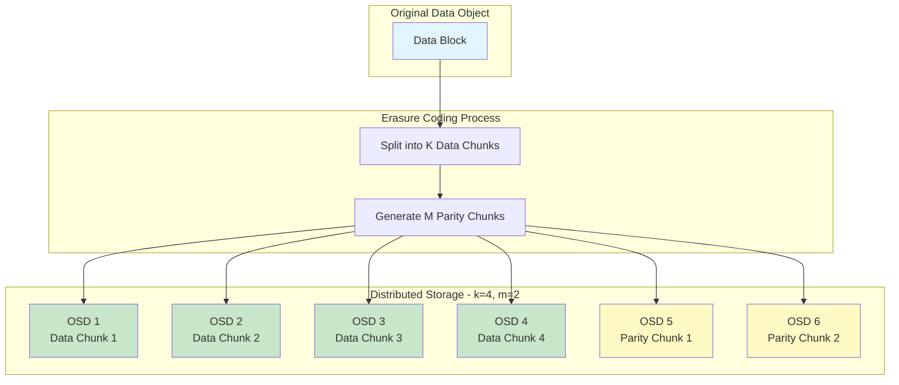
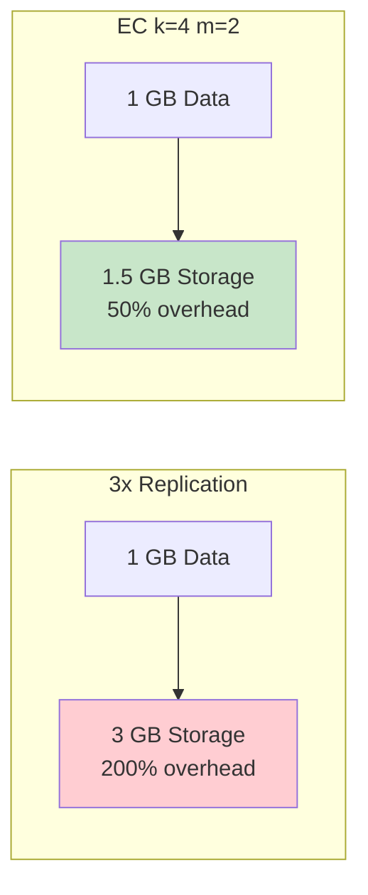
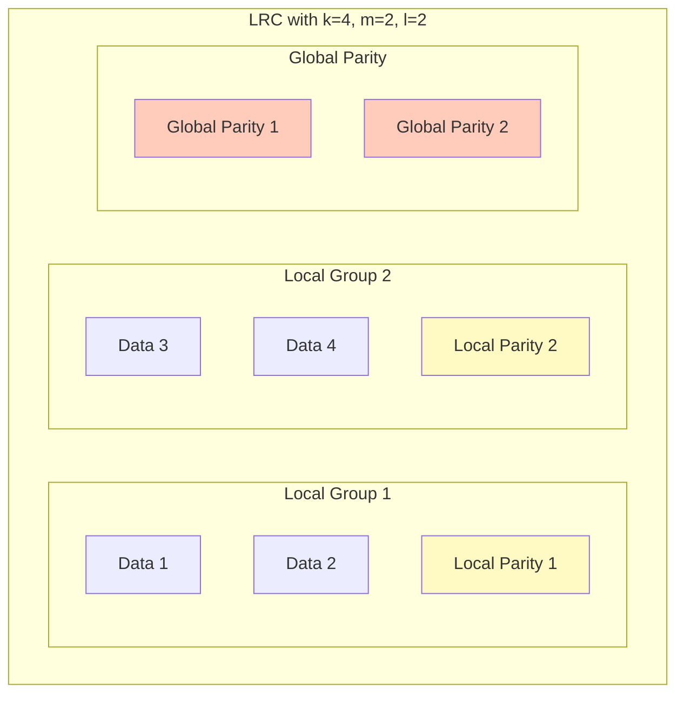
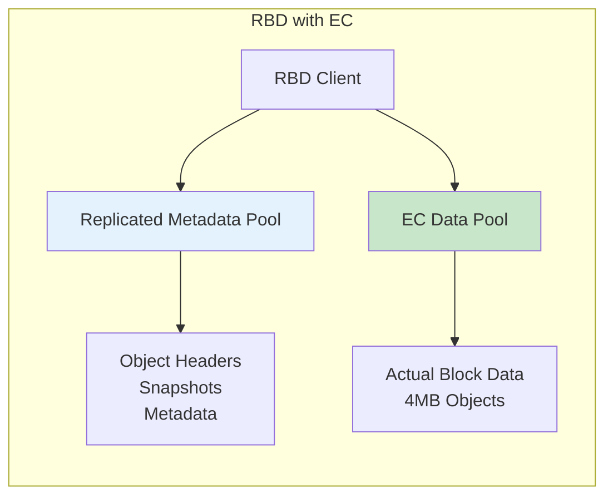
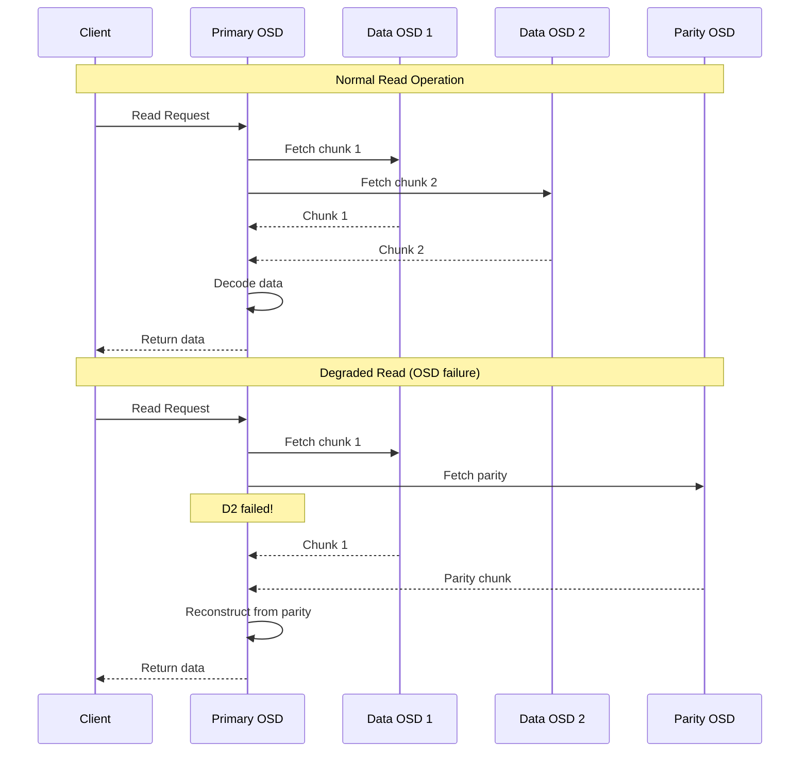
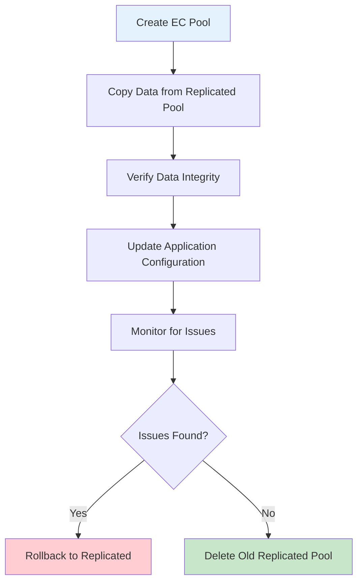

# How to Implement Ceph Erasure Coding for Storage Efficiency

Author: [nawazdhandala](https://github.com/nawazdhandala)

Tags: Ceph, Storage, Erasure Coding, Cost Optimization, Cloud Native

Description: A guide to configuring Ceph erasure coding for improved storage efficiency while maintaining data durability.

---

## Introduction

Ceph is a powerful, open-source distributed storage system that provides object, block, and file storage in a unified platform. One of its most compelling features for optimizing storage costs is **erasure coding (EC)**, a data protection method that provides fault tolerance with significantly less storage overhead compared to traditional replication.

In this comprehensive guide, we will explore how to implement Ceph erasure coding to maximize storage efficiency while maintaining the data durability your applications require.

## What is Erasure Coding?

Erasure coding is a method of data protection where data is broken into fragments, expanded with redundant data pieces, and stored across different locations. Unlike replication (which stores multiple complete copies of data), erasure coding uses mathematical algorithms to reconstruct data from a subset of the stored fragments.

### How Erasure Coding Works

The erasure coding process follows these steps:

1. **Data Fragmentation**: Original data is split into `k` data chunks
2. **Parity Generation**: `m` parity (coding) chunks are calculated using algorithms like Reed-Solomon
3. **Distribution**: All `k + m` chunks are distributed across different OSDs (Object Storage Daemons)
4. **Recovery**: Original data can be reconstructed from any `k` chunks out of the `k + m` total



## Erasure Coding vs Replication: Understanding the Tradeoffs

Before implementing erasure coding, it is essential to understand when to use it versus traditional replication.

### Storage Efficiency Comparison

The following diagram illustrates the storage overhead differences:



### Detailed Comparison Table

| Feature | Replication (3x) | Erasure Coding (k=4, m=2) |
|---------|-----------------|---------------------------|
| Storage Overhead | 200% | 50% |
| Fault Tolerance | 2 failures | 2 failures |
| Read Performance | Excellent | Good |
| Write Performance | Good | Moderate |
| CPU Usage | Low | Higher |
| Recovery Speed | Fast | Slower |
| Minimum OSDs | 3 | k + m (6) |
| Best Use Case | Hot data, small objects | Cold data, large objects |

## Erasure Coding Plugins in Ceph

Ceph supports multiple erasure coding plugins, each with different characteristics:

### 1. Jerasure Plugin (Default)

The Jerasure plugin is the default and most widely used EC plugin in Ceph.

The following command creates an erasure code profile using the Jerasure plugin with Reed-Solomon algorithm:

```bash
# Create an erasure code profile using Jerasure with Reed-Solomon
# k=4: Number of data chunks
# m=2: Number of parity chunks
# technique=reed_sol_van: Reed-Solomon Vandermonde encoding
ceph osd erasure-code-profile set jerasure-profile \
    plugin=jerasure \
    k=4 \
    m=2 \
    technique=reed_sol_van \
    crush-failure-domain=host
```

### 2. ISA Plugin (Intel Storage Acceleration)

The ISA plugin provides optimized performance on Intel processors with SSE and AVX instruction sets.

The following command creates a profile optimized for Intel hardware:

```bash
# Create an ISA erasure code profile for Intel processors
# This leverages hardware acceleration for better performance
ceph osd erasure-code-profile set isa-profile \
    plugin=isa \
    k=4 \
    m=2 \
    technique=reed_sol_van \
    crush-failure-domain=host
```

### 3. LRC Plugin (Local Recovery Codes)

LRC reduces recovery bandwidth by adding local parity chunks, ideal for large clusters.



The following command creates an LRC profile for reduced recovery bandwidth:

```bash
# Create an LRC erasure code profile
# l=2: Creates local parity groups of 2 data chunks each
# This reduces recovery bandwidth by allowing local recovery within groups
ceph osd erasure-code-profile set lrc-profile \
    plugin=lrc \
    k=4 \
    m=2 \
    l=2 \
    crush-failure-domain=host
```

### 4. SHEC Plugin (Shingled Erasure Code)

SHEC provides efficient recovery with lower overhead than LRC.

The following command creates a SHEC profile:

```bash
# Create a SHEC erasure code profile
# c=2: Number of chunks for local parity calculation
# Provides faster recovery than standard Reed-Solomon
ceph osd erasure-code-profile set shec-profile \
    plugin=shec \
    k=4 \
    m=2 \
    c=2 \
    crush-failure-domain=host
```

### 5. Clay Plugin

Clay codes provide optimal recovery bandwidth, minimizing network traffic during rebuilds.

The following command creates a Clay profile for minimal recovery bandwidth:

```bash
# Create a Clay erasure code profile
# d=5: Number of helper chunks for recovery (must be >= k+1)
# Minimizes recovery bandwidth through sub-chunk repair
ceph osd erasure-code-profile set clay-profile \
    plugin=clay \
    k=4 \
    m=2 \
    d=5 \
    crush-failure-domain=host
```

## Step-by-Step Implementation Guide

### Step 1: Verify Cluster Prerequisites

Before implementing erasure coding, verify your cluster meets the requirements:

The following commands check your cluster status and OSD count:

```bash
# Check cluster health status
# Ensure the cluster is in HEALTH_OK state before making changes
ceph health detail

# Verify you have enough OSDs for your EC profile
# For k=4, m=2, you need at least 6 OSDs
ceph osd tree

# Check current erasure code profiles
# Lists all existing EC profiles in the cluster
ceph osd erasure-code-profile ls

# View details of a specific profile
ceph osd erasure-code-profile get default
```

### Step 2: Create an Erasure Code Profile

The following command creates a production-ready EC profile with appropriate parameters:

```bash
# Create a production erasure code profile
# Parameters explained:
#   k=8: 8 data chunks (higher k = better efficiency, more OSDs needed)
#   m=3: 3 parity chunks (can survive 3 simultaneous failures)
#   crush-failure-domain=host: Distribute chunks across different hosts
#   crush-root=default: Use the default CRUSH root
ceph osd erasure-code-profile set production-ec-profile \
    plugin=jerasure \
    k=8 \
    m=3 \
    technique=reed_sol_van \
    crush-failure-domain=host \
    crush-root=default
```

### Step 3: Create an Erasure Coded Pool

The following command creates a pool using the erasure code profile:

```bash
# Create an erasure coded pool
# pool-name: Name of the new pool
# erasure: Pool type (can be 'replicated' or 'erasure')
# production-ec-profile: The EC profile to use
# Note: EC pools require a separate metadata pool for RBD workloads
ceph osd pool create ec-data-pool erasure production-ec-profile

# Verify the pool was created with correct settings
ceph osd pool ls detail | grep ec-data-pool

# Set the application for the pool (rbd, rgw, or cephfs)
# This example sets it for RGW object storage
ceph osd pool application enable ec-data-pool rgw
```

### Step 4: Configure Pool Parameters

The following commands optimize the pool for your workload:

```bash
# Set the minimum size (minimum chunks required for I/O)
# For k=8, m=3 (11 total), min_size should allow degraded operation
# Setting to k+1 allows continued operation with 2 failures
ceph osd pool set ec-data-pool min_size 9

# Enable compression for additional storage savings
# Algorithm options: none, snappy, zlib, zstd, lz4
ceph osd pool set ec-data-pool compression_algorithm zstd

# Set compression mode
# Options: none, passive, aggressive, force
ceph osd pool set ec-data-pool compression_mode passive

# Set compression ratio threshold (only compress if ratio exceeds this)
ceph osd pool set ec-data-pool compression_required_ratio 0.5

# Configure PG (Placement Group) count
# Use the PG calculator: https://ceph.io/pgcalc/
# General formula: (OSDs * 100) / pool_size, rounded to power of 2
ceph osd pool set ec-data-pool pg_num 256
ceph osd pool set ec-data-pool pgp_num 256
```

## Using Erasure Coding with Different Ceph Services

### RGW (RADOS Gateway) Object Storage

RGW is an excellent use case for erasure coding due to typically larger object sizes.

The following configuration enables EC for RGW data pools:

```bash
# Create EC pool for RGW data (large objects)
ceph osd pool create rgw.buckets.data erasure production-ec-profile

# Create replicated pool for RGW index (metadata, small random I/O)
# Metadata pools should remain replicated for performance
ceph osd pool create rgw.buckets.index replicated

# Enable RGW application on both pools
ceph osd pool application enable rgw.buckets.data rgw
ceph osd pool application enable rgw.buckets.index rgw

# Configure RGW to use EC for data placement
# Edit ceph.conf or use the following commands:
ceph config set client.rgw rgw_override_bucket_index_max_shards 16
```

The following RGW zone configuration uses EC for data storage:

```json
{
  "name": "default",
  "placement_pools": [
    {
      "key": "default-placement",
      "val": {
        "index_pool": "rgw.buckets.index",
        "storage_classes": {
          "STANDARD": {
            "data_pool": "rgw.buckets.data"
          }
        },
        "data_extra_pool": "rgw.buckets.non-ec",
        "index_type": 0
      }
    }
  ]
}
```

### RBD (RADOS Block Device)

RBD requires special handling with EC pools because EC pools do not support overwrites directly.



The following commands set up RBD with EC data pool:

```bash
# Create a replicated pool for RBD metadata
# Metadata requires overwrites which EC does not support
ceph osd pool create rbd-metadata replicated
ceph osd pool set rbd-metadata size 3

# Create EC pool for RBD data
ceph osd pool create rbd-data erasure production-ec-profile

# Enable overwrites on EC pool for RBD
# IMPORTANT: This is required for RBD to work with EC
ceph osd pool set rbd-data allow_ec_overwrites true

# Enable RBD application
ceph osd pool application enable rbd-metadata rbd
ceph osd pool application enable rbd-data rbd

# Create an RBD image using both pools
# --data-pool specifies the EC pool for actual data
rbd create --size 100G \
    --data-pool rbd-data \
    --pool rbd-metadata \
    my-ec-image
```

### CephFS (Ceph File System)

CephFS can use EC pools for data while keeping metadata in replicated pools.

The following commands configure CephFS with EC:

```bash
# Create replicated pool for CephFS metadata
# Metadata pools MUST be replicated (EC not supported)
ceph osd pool create cephfs-metadata replicated
ceph osd pool set cephfs-metadata size 3

# Create EC pool for CephFS data
ceph osd pool create cephfs-data erasure production-ec-profile
ceph osd pool set cephfs-data allow_ec_overwrites true

# Create the CephFS filesystem
ceph fs new my-cephfs cephfs-metadata cephfs-data

# Optionally add additional EC pools for different storage tiers
ceph osd pool create cephfs-cold erasure cold-ec-profile
ceph fs add_data_pool my-cephfs cephfs-cold
```

## Performance Tuning for Erasure Coding

### Optimizing EC Parameters

The following table shows recommended EC profiles for different use cases:

| Use Case | Profile (k:m) | Overhead | Fault Tolerance | Notes |
|----------|---------------|----------|-----------------|-------|
| Archival | 8:3 | 37.5% | 3 failures | Maximum efficiency |
| General Purpose | 4:2 | 50% | 2 failures | Balanced |
| High Durability | 6:4 | 66.7% | 4 failures | Extra protection |
| Small Clusters | 2:1 | 50% | 1 failure | Minimum OSDs: 3 |

### Stripe Unit Configuration

The following commands configure stripe unit for optimal performance:

```bash
# View current stripe settings
ceph osd pool get ec-data-pool stripe_width

# The stripe_unit affects I/O size and performance
# Larger stripe units benefit sequential I/O
# Smaller stripe units benefit random I/O
# Default is typically 4KB * k

# Create a profile with custom stripe unit for large sequential I/O
ceph osd erasure-code-profile set large-stripe-profile \
    plugin=jerasure \
    k=8 \
    m=3 \
    technique=reed_sol_van \
    stripe_unit=65536 \
    crush-failure-domain=host
```

### OSD Configuration for EC Workloads

The following configuration options optimize OSDs for EC workloads:

```bash
# Increase OSD memory target for EC operations
# EC encoding/decoding is memory-intensive
ceph config set osd osd_memory_target 4294967296

# Configure OSD recovery settings
# EC recovery can be resource-intensive
ceph config set osd osd_recovery_max_active 3
ceph config set osd osd_recovery_max_active_hdd 1
ceph config set osd osd_recovery_max_active_ssd 3

# Set appropriate thread counts for EC operations
ceph config set osd osd_op_num_threads_per_shard_hdd 2
ceph config set osd osd_op_num_threads_per_shard_ssd 4

# Enable async recovery for better performance
ceph config set osd osd_async_recovery_min_cost 100
```

## Monitoring Erasure Coded Pools

### Health and Status Commands

The following commands help monitor EC pool health:

```bash
# Check pool statistics
ceph df detail

# View pool I/O statistics
ceph osd pool stats ec-data-pool

# Check PG status for EC pool
ceph pg ls-by-pool ec-data-pool

# View detailed PG information
ceph pg dump | grep ec-data-pool

# Check for slow or blocked operations
ceph daemon osd.0 dump_historic_slow_ops
```

### Performance Metrics

The following script monitors EC pool performance:

```bash
#!/bin/bash
# EC Pool Performance Monitor Script
# This script collects key metrics for erasure coded pools

POOL_NAME="ec-data-pool"

# Function to display pool statistics
display_stats() {
    echo "=== EC Pool Statistics ==="
    echo "Timestamp: $(date)"
    echo ""

    # Get pool usage
    echo "--- Storage Usage ---"
    ceph df detail | grep -A1 "NAME" | head -2
    ceph df detail | grep "$POOL_NAME"
    echo ""

    # Get IOPS and throughput
    echo "--- I/O Statistics ---"
    ceph osd pool stats "$POOL_NAME"
    echo ""

    # Get PG states
    echo "--- PG Health ---"
    ceph pg ls-by-pool "$POOL_NAME" | head -20
    echo ""

    # Check for recovery operations
    echo "--- Recovery Status ---"
    ceph status | grep -E "(recovery|backfill|degraded)"
}

# Run the monitoring function
display_stats
```

## Data Recovery and Maintenance

### Understanding EC Recovery



### Recovery Best Practices

The following commands help manage EC pool recovery:

```bash
# Check recovery progress
ceph status
ceph -w  # Watch mode for real-time updates

# Adjust recovery priority and speed
# Lower priority allows client I/O to take precedence
ceph config set osd osd_recovery_priority 5
ceph config set osd osd_recovery_sleep 0.1

# Set recovery limits during peak hours
ceph config set osd osd_recovery_max_active 1

# Restore aggressive recovery during maintenance windows
ceph config set osd osd_recovery_max_active 10
ceph config set osd osd_recovery_sleep 0

# Monitor recovery operations
ceph pg dump_stuck unclean
ceph pg dump_stuck inactive
ceph pg dump_stuck stale
```

### Scrubbing EC Pools

The following commands configure scrubbing for EC pools:

```bash
# EC pools benefit from regular deep scrubbing to verify data integrity
# Configure scrub intervals
ceph config set osd osd_scrub_min_interval 86400   # 1 day
ceph config set osd osd_scrub_max_interval 604800  # 7 days
ceph config set osd osd_deep_scrub_interval 604800 # 7 days

# Manually initiate scrub on specific PGs
ceph pg deep-scrub <pg_id>

# Schedule scrub for entire pool
for pg in $(ceph pg ls-by-pool ec-data-pool -f json | jq -r '.[].pgid'); do
    ceph pg scrub $pg
done
```

## Real-World Use Cases

### Use Case 1: Video Streaming Archive

Large sequential reads make EC ideal for video archives:

```bash
# Create profile optimized for large sequential objects
ceph osd erasure-code-profile set video-archive-profile \
    plugin=jerasure \
    k=10 \
    m=4 \
    technique=reed_sol_van \
    stripe_unit=131072 \
    crush-failure-domain=host

# Create the pool
ceph osd pool create video-archive erasure video-archive-profile

# Configure for large objects
ceph osd pool set video-archive compression_algorithm zstd
ceph osd pool set video-archive compression_mode aggressive
ceph osd pool set video-archive target_max_bytes 100TB
```

### Use Case 2: Backup and Cold Storage

Maximum efficiency for infrequently accessed data:

```bash
# Create high-efficiency profile for backups
ceph osd erasure-code-profile set backup-profile \
    plugin=jerasure \
    k=12 \
    m=2 \
    technique=reed_sol_van \
    crush-failure-domain=rack

# Create the pool with minimal resource allocation
ceph osd pool create backup-storage erasure backup-profile
ceph osd pool set backup-storage pg_num 64
ceph osd pool set backup-storage pgp_num 64

# Enable compression for maximum savings
ceph osd pool set backup-storage compression_algorithm zstd
ceph osd pool set backup-storage compression_mode force
```

### Use Case 3: Object Storage for AI/ML Datasets

Large datasets with mixed access patterns:

```bash
# Create balanced profile for ML workloads
ceph osd erasure-code-profile set ml-data-profile \
    plugin=isa \
    k=6 \
    m=2 \
    crush-failure-domain=host

# Create the pool
ceph osd pool create ml-datasets erasure ml-data-profile

# Configure for mixed workload
ceph osd pool set ml-datasets allow_ec_overwrites true
ceph osd pool application enable ml-datasets rgw
```

## Migration Strategies

### Migrating from Replicated to EC Pools

The following diagram shows the migration workflow:



The following commands migrate data from replicated to EC pool:

```bash
# Create the destination EC pool
ceph osd pool create new-ec-pool erasure production-ec-profile

# Use rados cppool for migration (simple but slow)
rados cppool old-replicated-pool new-ec-pool

# Alternative: Use rbd migration for RBD images
rbd migration prepare --source-pool old-pool \
    --dest-pool new-pool \
    --dest-data-pool ec-data-pool \
    image-name

# Execute the migration
rbd migration execute --pool new-pool image-name

# Commit when satisfied
rbd migration commit --pool new-pool image-name

# Verify data integrity after migration
rados -p new-ec-pool ls | wc -l
ceph pg deep-scrub <pg_id>  # For critical data
```

## Troubleshooting Common Issues

### Issue 1: Pool Creation Fails

The following checklist helps diagnose pool creation failures:

```bash
# Verify sufficient OSDs exist
ceph osd tree | grep -c "up"

# Check CRUSH rules
ceph osd crush rule ls
ceph osd crush rule dump

# Verify the profile is valid
ceph osd erasure-code-profile get production-ec-profile

# Check for existing pools with same name
ceph osd pool ls

# Review ceph logs for detailed errors
journalctl -u ceph-mon@$(hostname) -n 100
```

### Issue 2: Slow Performance

The following commands diagnose EC performance issues:

```bash
# Check OSD performance
ceph osd perf

# Identify slow OSDs
ceph osd df tree

# Check for blocked operations
ceph daemon osd.X dump_blocked_ops

# Review OSD logs
journalctl -u ceph-osd@X -n 500 | grep -i slow

# Test pool performance with rados bench
rados bench -p ec-data-pool 60 write --no-cleanup
rados bench -p ec-data-pool 60 seq
rados bench -p ec-data-pool 60 rand
```

### Issue 3: Recovery Takes Too Long

The following commands address slow recovery:

```bash
# Check recovery status
ceph -s | grep recovery

# Increase recovery resources (during maintenance window)
ceph tell 'osd.*' injectargs '--osd-recovery-max-active 5'
ceph tell 'osd.*' injectargs '--osd-recovery-sleep 0'

# Prioritize specific pool recovery
ceph osd pool set ec-data-pool recovery_priority 10

# Mark OSDs as nearfull threshold lower to prevent issues
ceph config set global mon_osd_nearfull_ratio 0.75
```

## Best Practices Summary

1. **Choose the Right Profile**: Select k and m values based on your durability requirements and cluster size
2. **Use Appropriate Failure Domain**: Set crush-failure-domain to host or rack for production environments
3. **Keep Metadata Replicated**: Always use replicated pools for metadata-heavy workloads
4. **Enable Compression**: Combine EC with compression for maximum storage efficiency
5. **Monitor Regularly**: Set up monitoring for recovery operations and performance metrics
6. **Plan for Capacity**: EC pools require at least k+m OSDs in separate failure domains
7. **Test Before Production**: Validate performance and recovery procedures in a test environment
8. **Consider Object Size**: EC works best with objects larger than the stripe width
9. **Balance Efficiency and Durability**: Higher k values increase efficiency but require more OSDs
10. **Document Your Configuration**: Keep records of EC profiles and pool configurations

## Conclusion

Ceph erasure coding provides a powerful mechanism for reducing storage costs while maintaining data durability. By understanding the tradeoffs between different EC profiles, plugins, and configurations, you can optimize your Ceph cluster for your specific workload requirements.

Key takeaways:
- EC can reduce storage overhead from 200% (3x replication) to as low as 25% (k=8, m=2)
- Choose the right plugin (Jerasure, ISA, LRC, SHEC, or Clay) based on your hardware and recovery requirements
- Always keep metadata pools replicated for performance
- Monitor recovery operations and tune parameters based on your SLAs
- Combine EC with compression for maximum storage efficiency

With proper implementation and tuning, erasure coding can significantly reduce your storage infrastructure costs while providing enterprise-grade data protection.

## Additional Resources

- [Ceph Documentation - Erasure Code](https://docs.ceph.com/en/latest/rados/operations/erasure-code/)
- [Ceph PG Calculator](https://ceph.io/pgcalc/)
- [Ceph Performance Benchmark](https://docs.ceph.com/en/latest/rados/operations/monitoring/)
