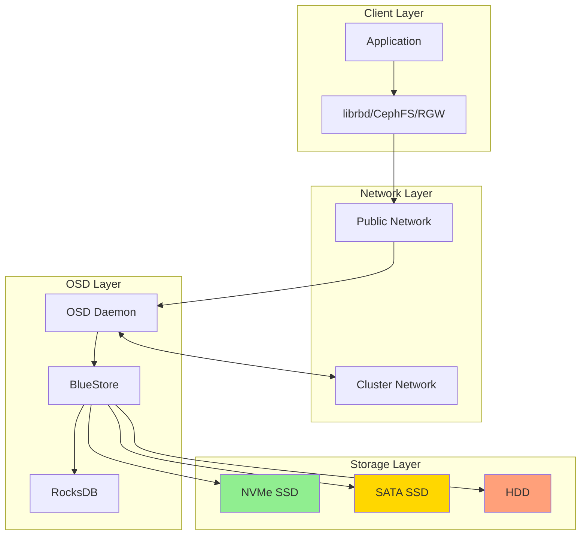
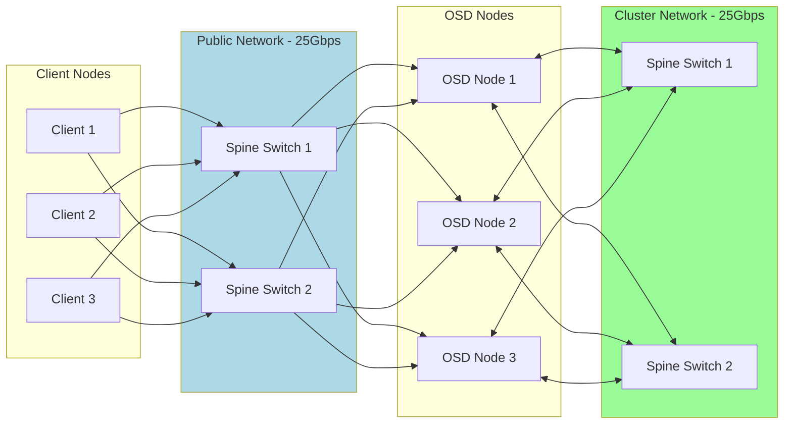
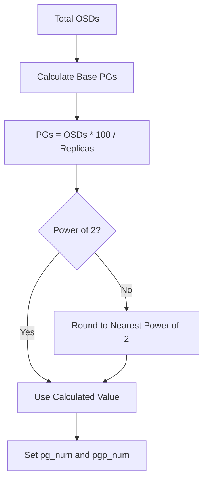
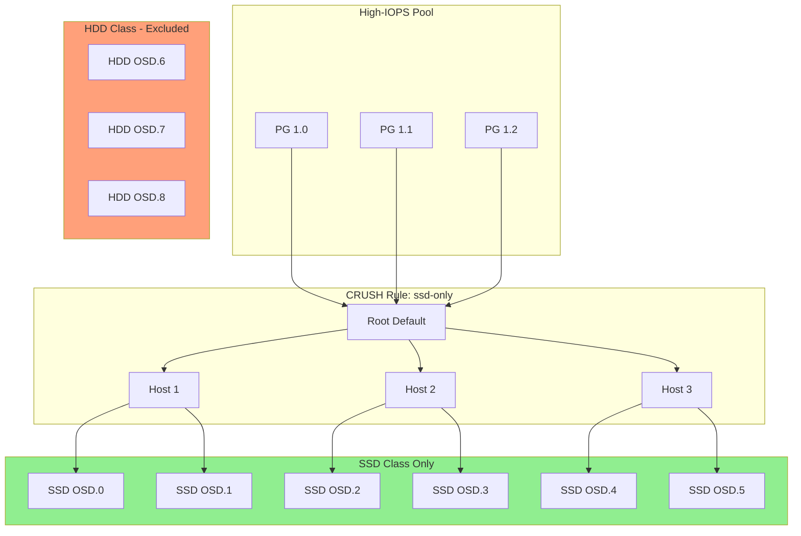
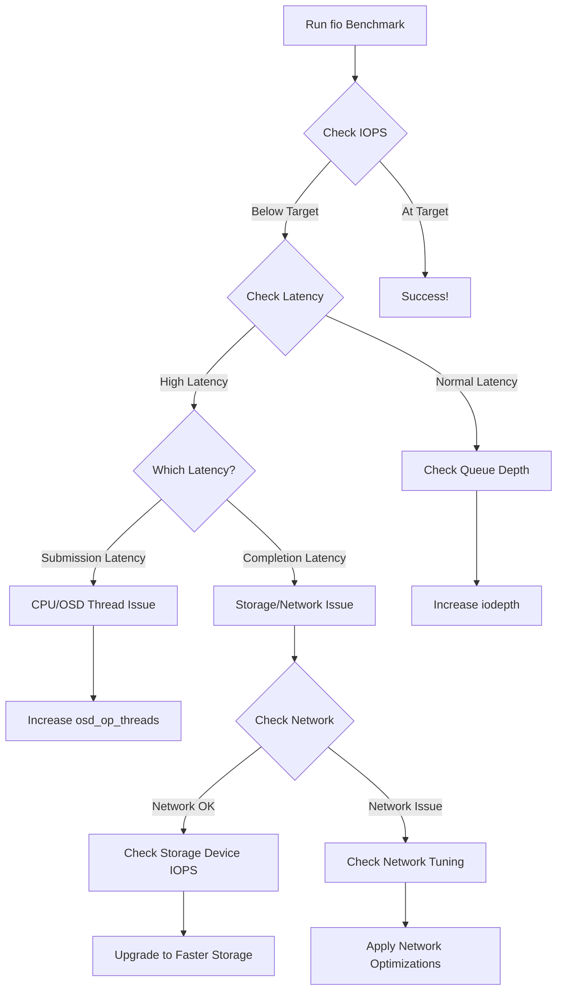
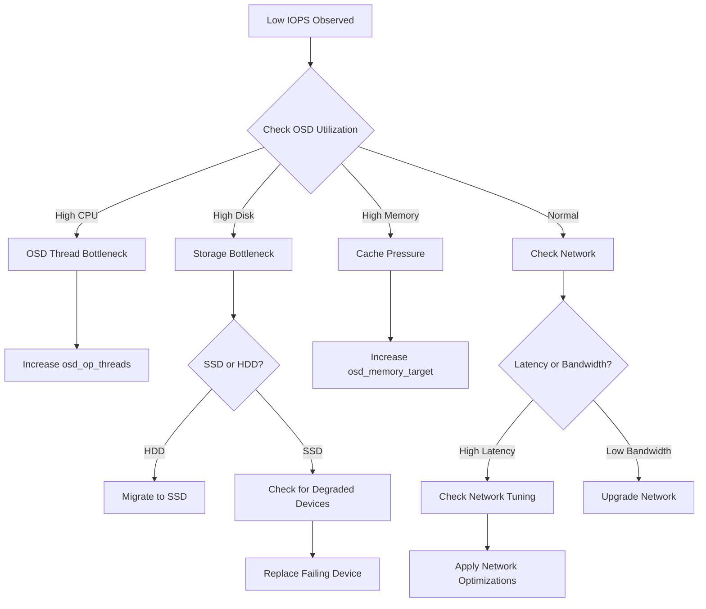

# How to Configure Ceph for High-IOPS Workloads

Author: [nawazdhandala](https://github.com/nawazdhandala)

Tags: Ceph, Storage, Performance, IOPS, Optimization, Cloud Native

Description: Learn how to optimize Ceph configuration for high-IOPS database and transactional workloads.

---

High-IOPS workloads like databases, virtual machines, and transactional applications demand storage systems that can handle thousands of input/output operations per second with minimal latency. Ceph, while known for its scalability and reliability, requires careful tuning to achieve optimal IOPS performance. This comprehensive guide walks you through configuring every layer of Ceph for maximum IOPS throughput.

## Understanding IOPS in Ceph

Before diving into optimization, it's crucial to understand how IOPS flows through Ceph's architecture.



IOPS performance in Ceph depends on:
- **Hardware**: NVMe SSDs provide the best IOPS, followed by SATA SSDs, then HDDs
- **Network**: Low-latency, high-bandwidth networks reduce replication overhead
- **OSD Configuration**: BlueStore settings directly impact I/O efficiency
- **Pool Settings**: Placement groups and replication factor affect parallelism

## Prerequisites

Before optimizing for high IOPS, ensure you have:

- Ceph cluster version 16.x (Pacific) or later
- NVMe or SSD-based OSDs for high-IOPS pools
- 10Gbps or faster network infrastructure
- Dedicated network for cluster traffic (recommended)
- Root access to all Ceph nodes

## Hardware Selection for High IOPS

### Storage Devices

The following table shows typical IOPS capabilities by device type. Use this to set realistic expectations for your cluster.

| Device Type | Random Read IOPS | Random Write IOPS | Latency |
|-------------|------------------|-------------------|---------|
| Enterprise NVMe | 500,000-1,000,000 | 100,000-200,000 | <100us |
| Consumer NVMe | 200,000-500,000 | 50,000-100,000 | 100-200us |
| Enterprise SATA SSD | 75,000-100,000 | 30,000-50,000 | 200-500us |
| 15K RPM HDD | 200-300 | 200-300 | 2-5ms |

### Network Requirements

For high-IOPS workloads, the network must not become a bottleneck. The following diagram illustrates the recommended network architecture.



## OSD and BlueStore Tuning for IOPS

BlueStore is Ceph's default storage backend and offers significant performance advantages. Let's configure it for maximum IOPS.

### Dedicated WAL and DB Devices

Separating the Write-Ahead Log (WAL) and RocksDB database onto fast NVMe devices dramatically improves write IOPS. The WAL handles all incoming writes, while the DB stores metadata.

The following commands create an OSD with dedicated WAL and DB devices. This is the most impactful optimization for write-heavy workloads.

```bash
# Create an OSD with dedicated NVMe devices for WAL and DB
# The main data device can be a slower SSD
# WAL: Handles write-ahead logging (small, very fast)
# DB: Stores RocksDB metadata (larger, fast)
ceph-volume lvm create \
    --data /dev/sdb \
    --block-wal /dev/nvme0n1p1 \
    --block-db /dev/nvme0n1p2
```

### BlueStore Configuration

The following configuration optimizes BlueStore for IOPS. Add these settings to your ceph.conf file under the [osd] section.

```ini
[osd]
# Disable device-specific optimizations that may limit performance
# This allows manual tuning for maximum IOPS
bluestore_devs_source = none

# Increase the number of BlueStore threads for parallel I/O
# Higher values improve IOPS on multi-core systems with fast storage
bluestore_threads = 8

# Set cache size for BlueStore metadata and data
# 4GB cache helps reduce read latency for frequently accessed data
bluestore_cache_size = 4294967296

# Allocate 70% of cache to key-value (metadata) operations
# Metadata caching is critical for IOPS performance
bluestore_cache_kv_ratio = 0.7

# Allocate remaining 30% to data caching
bluestore_cache_data_ratio = 0.3

# Minimum allocation size for SSDs (4KB matches SSD page size)
# Smaller allocations reduce write amplification
bluestore_min_alloc_size_ssd = 4096

# Minimum allocation size for HDDs (larger to reduce seeks)
bluestore_min_alloc_size_hdd = 65536

# Enable aggressive prefetching for sequential workloads
bluestore_cache_autotune = true

# RocksDB compaction settings for reduced latency spikes
# Use level compaction for more predictable IOPS
bluestore_rocksdb_options = compression=none,max_write_buffer_number=8,min_write_buffer_number_to_merge=2,recycle_log_file_num=8,compaction_style=0,write_buffer_size=67108864,target_file_size_base=67108864,max_background_compactions=8,level0_file_num_compaction_trigger=8,level0_slowdown_writes_trigger=32,level0_stop_writes_trigger=64
```

### OSD Memory and CPU Tuning

Proper memory allocation ensures OSDs have sufficient resources for caching and processing. The following settings optimize OSD resource usage.

```ini
[osd]
# Target memory for each OSD process
# 8GB per OSD is recommended for high-IOPS NVMe deployments
osd_memory_target = 8589934592

# Enable memory autotuning within the target limit
osd_memory_cache_autotune = true

# Number of OSD operation threads
# Match this to the number of CPU cores dedicated to each OSD
osd_op_threads = 8

# Number of threads for disk I/O operations
osd_disk_threads = 4

# Increase the number of recovery threads for faster rebalancing
osd_recovery_threads = 2

# Maximum concurrent recovery operations per OSD
# Higher values speed up recovery but may impact client IOPS
osd_recovery_max_active = 3

# Limit backfill operations to protect client I/O
osd_max_backfills = 1

# Priority settings favor client operations over recovery
osd_recovery_op_priority = 3
osd_client_op_priority = 63
```

### Asynchronous Messenger Tuning

The async messenger handles network I/O. Tuning these parameters reduces network-related latency.

```ini
[global]
# Use async+posix messenger for best performance
ms_type = async+posix

# Number of messenger worker threads
# Should match the number of network-handling CPU cores
ms_async_op_threads = 8

# Enable CRC for data integrity (disable only if network is trusted and you need minimal latency)
ms_crc_data = true
ms_crc_header = true

# TCP socket buffer sizes for high-throughput connections
ms_tcp_rcvbuf = 16777216
ms_tcp_sendbuf = 16777216

# Disable Nagle's algorithm for lower latency
ms_tcp_nodelay = true
```

## Network Optimization

Network performance is critical for Ceph IOPS. The following sections cover both Ceph and OS-level network tuning.

### Ceph Network Configuration

Separating public and cluster networks prevents client traffic from competing with replication traffic.

```ini
[global]
# Public network for client access
# Use a high-bandwidth, low-latency network
public_network = 10.0.0.0/24

# Cluster network for OSD replication and recovery
# Dedicated network prevents replication from impacting client IOPS
cluster_network = 10.0.1.0/24

# Bind messenger to specific IP addresses for predictable behavior
ms_bind_ipv4 = true
ms_bind_ipv6 = false
```

### Linux Kernel Network Tuning

Apply these sysctl settings on all Ceph nodes to optimize network stack performance. These settings increase buffer sizes and enable low-latency optimizations.

```bash
# Add to /etc/sysctl.conf and apply with 'sysctl -p'

# Increase socket buffer sizes for high-throughput connections
# These values support up to 25Gbps network speeds
net.core.rmem_max = 134217728
net.core.wmem_max = 134217728
net.core.rmem_default = 16777216
net.core.wmem_default = 16777216

# TCP buffer sizes: min, default, max
# Larger buffers reduce retransmissions on high-latency links
net.ipv4.tcp_rmem = 4096 87380 134217728
net.ipv4.tcp_wmem = 4096 65536 134217728

# Increase the backlog queue for busy servers
net.core.netdev_max_backlog = 250000
net.core.somaxconn = 65535

# Enable TCP window scaling for long fat networks
net.ipv4.tcp_window_scaling = 1

# Enable TCP timestamps for RTT estimation
net.ipv4.tcp_timestamps = 1

# Use SACK for better loss recovery
net.ipv4.tcp_sack = 1

# Disable slow start after idle for consistent performance
net.ipv4.tcp_slow_start_after_idle = 0

# Enable busy polling for reduced latency (requires kernel 4.5+)
net.core.busy_read = 50
net.core.busy_poll = 50
```

### NIC Tuning

Modern NICs have multiple hardware queues that can parallelize packet processing. The following commands optimize NIC settings for Ceph.

```bash
# Replace eth0 with your actual interface name

# Increase ring buffer sizes for better burst handling
# Check maximum values with: ethtool -g eth0
ethtool -G eth0 rx 4096 tx 4096

# Enable adaptive interrupt coalescing for balanced latency/throughput
ethtool -C eth0 adaptive-rx on adaptive-tx on

# For lowest latency, use static coalescing with small values
# ethtool -C eth0 rx-usecs 10 tx-usecs 10

# Enable receive flow steering for multi-queue NICs
# This distributes packet processing across CPU cores
echo "ffff" > /sys/class/net/eth0/queues/rx-0/rps_cpus

# Enable transmit queue selection
echo "ffff" > /sys/class/net/eth0/queues/tx-0/xps_cpus

# Disable pause frames for consistent performance
ethtool -A eth0 rx off tx off
```

## Placement Group and Pool Configuration

Proper PG configuration is essential for distributing I/O evenly across OSDs.

### Calculating Optimal PG Count

The number of PGs affects how data is distributed and how parallelism is achieved. Use this formula to calculate the optimal PG count.



The following script calculates the recommended PG count for your pool. It accounts for OSD count, replication factor, and ensures the result is a power of 2.

```bash
#!/bin/bash
# Calculate optimal PG count for a Ceph pool
# Usage: ./calculate_pgs.sh <osd_count> <replica_count> <pool_percent>

OSD_COUNT=${1:-24}      # Number of OSDs in the cluster
REPLICA_COUNT=${2:-3}   # Replication factor (3 for replicated, 1 for erasure-coded k+m pools)
POOL_PERCENT=${3:-100}  # Percentage of cluster this pool will use

# Calculate raw PG count using Ceph's recommended formula
# Target is 100-200 PGs per OSD
RAW_PGS=$(echo "($OSD_COUNT * 100 * $POOL_PERCENT / 100) / $REPLICA_COUNT" | bc)

# Round to nearest power of 2 for optimal distribution
POWER=1
while [ $POWER -lt $RAW_PGS ]; do
    POWER=$((POWER * 2))
done

# Choose the power of 2 that's closest to our target
LOWER=$((POWER / 2))
if [ $((RAW_PGS - LOWER)) -lt $((POWER - RAW_PGS)) ]; then
    OPTIMAL_PGS=$LOWER
else
    OPTIMAL_PGS=$POWER
fi

echo "Recommended PG count: $OPTIMAL_PGS"
echo "This gives approximately $((OPTIMAL_PGS * REPLICA_COUNT / OSD_COUNT)) PGs per OSD"
```

### Creating a High-IOPS Pool

The following commands create and configure a pool optimized for high-IOPS workloads. We use a 3-way replica for durability and set appropriate PG counts.

```bash
# Create a replicated pool with optimal settings for IOPS
# Using 256 PGs for a 24-OSD cluster with 3x replication
ceph osd pool create high-iops-pool 256 256 replicated

# Set the application for the pool (rbd for block storage)
ceph osd pool application enable high-iops-pool rbd

# Configure pool replication
# Size 3 means 3 copies of data for durability
# Min size 2 allows writes with 2/3 replicas available
ceph osd pool set high-iops-pool size 3
ceph osd pool set high-iops-pool min_size 2

# Enable PG autoscaling for dynamic adjustment
# This helps maintain optimal PG count as the cluster grows
ceph osd pool set high-iops-pool pg_autoscale_mode on

# Set the target ratio for autoscaler (optional)
# This tells the autoscaler what percentage of cluster this pool should use
ceph osd pool set high-iops-pool target_size_ratio 0.5
```

### CRUSH Rules for SSD-Only Placement

To ensure high-IOPS pools only use SSDs, create a CRUSH rule that selects only SSD device classes.

```bash
# Create a CRUSH rule that only selects SSD devices
# This ensures high-IOPS pools never land on HDDs
ceph osd crush rule create-replicated ssd-only default host ssd

# Apply the rule to your high-IOPS pool
ceph osd pool set high-iops-pool crush_rule ssd-only

# Verify the rule is applied
ceph osd pool get high-iops-pool crush_rule
```

The following diagram shows how CRUSH rules direct data to specific device classes.



## RBD (Block Device) Optimization

When using Ceph RBD for block storage, additional tuning improves IOPS for applications like databases.

### RBD Image Configuration

Create RBD images with settings optimized for IOPS workloads.

```bash
# Create an RBD image with optimal settings for high IOPS
# Object size of 64KB balances metadata overhead with I/O granularity
# Striping distributes I/O across multiple OSDs
rbd create high-iops-pool/database-volume \
    --size 500G \
    --object-size 65536 \
    --stripe-unit 65536 \
    --stripe-count 4 \
    --image-feature layering,exclusive-lock,object-map,fast-diff

# Enable image features that improve IOPS
# Object-map and fast-diff reduce metadata operations
rbd feature enable high-iops-pool/database-volume object-map
rbd feature enable high-iops-pool/database-volume fast-diff
```

### Kernel RBD Client Tuning

For kernel-mounted RBD volumes, the following options improve performance. Add these to your mount configuration.

```bash
# Map the RBD volume with optimized options
# queue_depth increases the number of in-flight I/O operations
# read_only=0 enables write operations
rbd map high-iops-pool/database-volume \
    --options rw,queue_depth=128

# For persistent mapping, add to /etc/ceph/rbdmap:
# high-iops-pool/database-volume id=admin,keyring=/etc/ceph/ceph.client.admin.keyring,options=rw queue_depth=128
```

### librbd Tuning for QEMU/KVM

When using RBD with virtualization, tune librbd for maximum IOPS.

```ini
# Add to /etc/ceph/ceph.conf on hypervisors

[client]
# Enable read-ahead for sequential workloads
rbd_readahead_max_bytes = 4194304
rbd_readahead_trigger_requests = 10

# Cache settings for librbd
rbd_cache = true
rbd_cache_size = 134217728
rbd_cache_max_dirty = 100663296
rbd_cache_target_dirty = 67108864
rbd_cache_max_dirty_age = 1.0
rbd_cache_writethrough_until_flush = true

# Increase concurrent operations
rbd_concurrent_management_ops = 20

# Object size for new images (64KB for IOPS workloads)
rbd_default_order = 16
```

## Benchmarking with fio

Proper benchmarking validates your tuning efforts. The following fio configurations test various IOPS scenarios.

### Random Read IOPS Test

This test measures the maximum random read IOPS your Ceph cluster can deliver. It simulates database index lookups.

```ini
# Save as random-read-iops.fio
# Tests random 4K reads which simulate database index operations

[global]
# Use librbd engine for direct Ceph access
ioengine=rbd
# Connect to the Ceph pool and image
pool=high-iops-pool
rbdname=benchmark-volume
# Use direct I/O to bypass OS cache
direct=1
# Number of parallel jobs (simulate multiple clients)
numjobs=16
# Test duration in seconds
runtime=300
# Continue until time expires
time_based=1
# Group results for clarity
group_reporting=1
# Collect latency statistics
lat_target=5000
lat_window=1000000
lat_percentile=99.9

[random-read-4k]
# Random read workload
rw=randread
# 4KB block size matches typical database page size
bs=4k
# Queue depth per job (higher = more IOPS)
iodepth=32
# Total size to operate on
size=100G
```

Run the test with:

```bash
# Run the fio benchmark
# Results will show IOPS, bandwidth, and latency statistics
fio random-read-iops.fio --output=random-read-results.json --output-format=json
```

### Random Write IOPS Test

This test measures random write IOPS, which is typically more challenging for storage systems due to write amplification and replication overhead.

```ini
# Save as random-write-iops.fio
# Tests random 4K writes which simulate transaction log writes

[global]
ioengine=rbd
pool=high-iops-pool
rbdname=benchmark-volume
direct=1
numjobs=16
runtime=300
time_based=1
group_reporting=1

[random-write-4k]
# Random write workload
rw=randwrite
# 4KB block size
bs=4k
# Moderate queue depth for writes (too high can cause latency spikes)
iodepth=16
size=100G
# Sync writes to measure real persistence latency
sync=1
```

### Mixed Read/Write IOPS Test

This test simulates realistic database workloads with a mix of reads and writes.

```ini
# Save as mixed-iops.fio
# Simulates OLTP database workload (70% read, 30% write)

[global]
ioengine=rbd
pool=high-iops-pool
rbdname=benchmark-volume
direct=1
numjobs=8
runtime=300
time_based=1
group_reporting=1

[oltp-simulation]
# Mixed random read/write
rw=randrw
# 70% reads, 30% writes (typical OLTP ratio)
rwmixread=70
# 8KB block size (common database page size)
bs=8k
# Moderate queue depth
iodepth=16
size=100G
```

### Interpreting Benchmark Results

The following diagram shows how to interpret fio output and identify bottlenecks.



Example benchmark output analysis:

```bash
# Parse fio JSON output to extract key metrics
# This script summarizes IOPS, latency, and bandwidth

jq -r '
  .jobs[] |
  "Job: \(.jobname)",
  "Read IOPS: \(.read.iops | floor)",
  "Write IOPS: \(.write.iops | floor)",
  "Read Latency (avg): \(.read.lat_ns.mean / 1000000 | . * 100 | floor / 100)ms",
  "Write Latency (avg): \(.write.lat_ns.mean / 1000000 | . * 100 | floor / 100)ms",
  "Read 99.9th %ile: \(.read.clat_ns.percentile["99.900000"] / 1000000 | . * 100 | floor / 100)ms",
  "Write 99.9th %ile: \(.write.clat_ns.percentile["99.900000"] / 1000000 | . * 100 | floor / 100)ms",
  ""
' random-read-results.json
```

## Complete Configuration Example

Here's a complete `/etc/ceph/ceph.conf` file optimized for high-IOPS workloads. This combines all the tuning parameters discussed in this guide.

```ini
# /etc/ceph/ceph.conf
# Optimized for high-IOPS workloads with NVMe storage

[global]
# Cluster identification
fsid = a1b2c3d4-e5f6-7890-abcd-ef1234567890
cluster = ceph

# Monitor configuration
mon_initial_members = ceph-mon1, ceph-mon2, ceph-mon3
mon_host = 10.0.0.1:6789,10.0.0.2:6789,10.0.0.3:6789

# Authentication (required for production)
auth_cluster_required = cephx
auth_service_required = cephx
auth_client_required = cephx

# Network configuration
# Separate public and cluster networks for better performance
public_network = 10.0.0.0/24
cluster_network = 10.0.1.0/24

# Messenger configuration optimized for low latency
ms_type = async+posix
ms_async_op_threads = 8
ms_tcp_nodelay = true
ms_tcp_rcvbuf = 16777216
ms_tcp_sendbuf = 16777216

# Enable performance monitoring
mgr_modules = dashboard,prometheus,pg_autoscaler

[mon]
# Monitor data path
mon_data = /var/lib/ceph/mon/ceph-$id

# Increase monitor store size for larger clusters
mon_data_size_warn = 15G

# PG warning thresholds
mon_pg_warn_min_per_osd = 30
mon_pg_warn_max_per_osd = 300

[osd]
# OSD data path
osd_data = /var/lib/ceph/osd/ceph-$id

# Memory management
# 8GB per OSD for NVMe deployments
osd_memory_target = 8589934592
osd_memory_cache_autotune = true

# Thread configuration for high-core-count servers
osd_op_threads = 8
osd_disk_threads = 4

# BlueStore configuration
bluestore_cache_size = 4294967296
bluestore_cache_autotune = true
bluestore_cache_kv_ratio = 0.7
bluestore_cache_data_ratio = 0.3

# SSD-optimized allocation
bluestore_min_alloc_size_ssd = 4096

# RocksDB tuning for IOPS
bluestore_rocksdb_options = compression=none,max_write_buffer_number=8,min_write_buffer_number_to_merge=2,recycle_log_file_num=8,compaction_style=0,write_buffer_size=67108864,target_file_size_base=67108864,max_background_compactions=8,level0_file_num_compaction_trigger=8,level0_slowdown_writes_trigger=32,level0_stop_writes_trigger=64

# Recovery tuning (protect client IOPS)
osd_recovery_max_active = 3
osd_max_backfills = 1
osd_recovery_op_priority = 3
osd_client_op_priority = 63

# Scrub scheduling (minimize impact on IOPS)
osd_scrub_begin_hour = 2
osd_scrub_end_hour = 6
osd_scrub_load_threshold = 0.5
osd_scrub_sleep = 0.1

[client]
# RBD cache configuration for IOPS workloads
rbd_cache = true
rbd_cache_size = 134217728
rbd_cache_max_dirty = 100663296
rbd_cache_target_dirty = 67108864
rbd_cache_max_dirty_age = 1.0
rbd_cache_writethrough_until_flush = true

# Read-ahead for sequential workloads
rbd_readahead_max_bytes = 4194304
rbd_readahead_trigger_requests = 10
```

## Monitoring IOPS Performance

Continuous monitoring ensures your optimizations remain effective. The following Prometheus queries help track IOPS metrics.

### Prometheus Queries for IOPS Monitoring

```yaml
# Prometheus alerting rules for Ceph IOPS monitoring
# Save as ceph-iops-alerts.yml

groups:
  - name: ceph-iops-alerts
    rules:
      # Alert when IOPS drops significantly from baseline
      - alert: CephIOPSDrop
        # Calculate IOPS from read and write operations per second
        expr: |
          (rate(ceph_osd_op_r[5m]) + rate(ceph_osd_op_w[5m]))
          < (avg_over_time((rate(ceph_osd_op_r[5m]) + rate(ceph_osd_op_w[5m]))[1h:5m]) * 0.5)
        for: 10m
        labels:
          severity: warning
        annotations:
          summary: "Ceph IOPS dropped below 50% of baseline"
          description: "Current IOPS is significantly lower than the 1-hour average"

      # Alert on high latency (indicating IOPS bottleneck)
      - alert: CephHighLatency
        # Average operation latency in milliseconds
        expr: |
          (ceph_osd_op_latency_sum / ceph_osd_op_latency_count) > 10
        for: 5m
        labels:
          severity: critical
        annotations:
          summary: "Ceph OSD latency exceeds 10ms"
          description: "High latency indicates IOPS performance degradation"
```

### Grafana Dashboard Query Examples

Use these queries in Grafana to visualize IOPS performance:

```promql
# Total cluster read IOPS
sum(rate(ceph_osd_op_r[1m]))

# Total cluster write IOPS
sum(rate(ceph_osd_op_w[1m]))

# Per-OSD IOPS (useful for identifying hot spots)
rate(ceph_osd_op_r{osd=~"osd.*"}[1m]) + rate(ceph_osd_op_w{osd=~"osd.*"}[1m])

# Average read latency in milliseconds
avg(ceph_osd_op_r_latency_sum / ceph_osd_op_r_latency_count) * 1000

# 99th percentile write latency
histogram_quantile(0.99, rate(ceph_osd_op_w_latency_bucket[5m]))

# IOPS by pool
sum by (pool) (rate(ceph_pool_rd[1m]) + rate(ceph_pool_wr[1m]))
```

## Troubleshooting IOPS Issues

When IOPS falls below expectations, follow this systematic troubleshooting approach.

### Common Issues and Solutions

The following flowchart guides you through diagnosing IOPS problems.



### Diagnostic Commands

Use these commands to identify IOPS bottlenecks:

```bash
# Check overall cluster health and any warnings
ceph health detail

# View real-time OSD performance statistics
# Shows IOPS, latency, and bandwidth per OSD
ceph osd perf

# Check for slow operations (ops taking too long)
# These indicate IOPS bottlenecks
ceph daemon osd.0 dump_historic_ops

# Monitor PG distribution (uneven distribution hurts IOPS)
ceph pg dump | awk '/^[0-9]/ {print $1, $15}' | sort -k2 -n

# Check for blocked requests
ceph daemon osd.0 dump_blocked_ops

# View BlueStore cache statistics
ceph daemon osd.0 perf dump | jq '.bluestore'

# Monitor network latency between OSDs
# High latency here impacts replication IOPS
for osd in $(ceph osd ls); do
  echo "OSD.$osd latency:"
  ceph daemon osd.$osd perf dump | jq '.osd.op_latency'
done
```

## Best Practices Summary

To maximize IOPS in Ceph, follow these key principles:

1. **Use NVMe Storage**: NVMe SSDs provide 10-100x more IOPS than HDDs
2. **Separate WAL/DB**: Dedicated fast devices for WAL and DB dramatically improve write IOPS
3. **Tune BlueStore**: Optimize cache sizes and RocksDB settings for your workload
4. **Network Optimization**: Use dedicated cluster networks and tune OS network stack
5. **Proper PG Count**: Calculate and maintain optimal PG-to-OSD ratios
6. **Monitor Continuously**: Use Prometheus/Grafana to track IOPS and latency
7. **Limit Recovery Impact**: Configure recovery settings to protect client IOPS
8. **Use CRUSH Rules**: Ensure high-IOPS pools only use appropriate device classes

## Conclusion

Configuring Ceph for high-IOPS workloads requires attention to every layer of the stack, from hardware selection through BlueStore tuning, network optimization, and proper pool configuration. By following this guide and continuously monitoring performance, you can achieve the IOPS levels required for demanding workloads like databases, virtual machines, and transactional applications.

Remember that Ceph performance tuning is iterative. Start with the baseline configuration, benchmark your workload, and adjust parameters based on observed behavior. The optimal settings depend on your specific hardware, workload characteristics, and performance requirements.

## Additional Resources

- [Ceph Documentation: Performance](https://docs.ceph.com/en/latest/rados/troubleshooting/performance/)
- [BlueStore Configuration Reference](https://docs.ceph.com/en/latest/rados/configuration/bluestore-config-ref/)
- [CRUSH Map Management](https://docs.ceph.com/en/latest/rados/operations/crush-map/)
- [RBD Performance Tuning](https://docs.ceph.com/en/latest/rbd/rbd-config-ref/)
