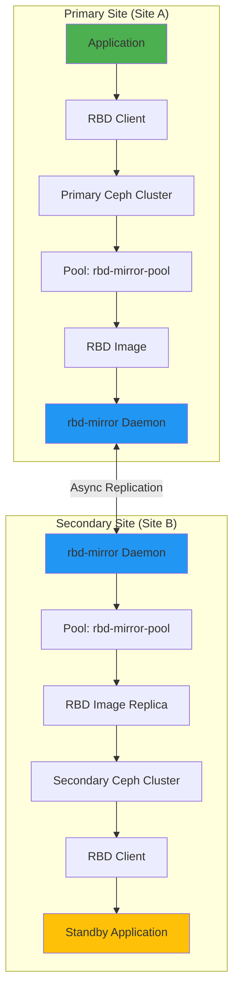
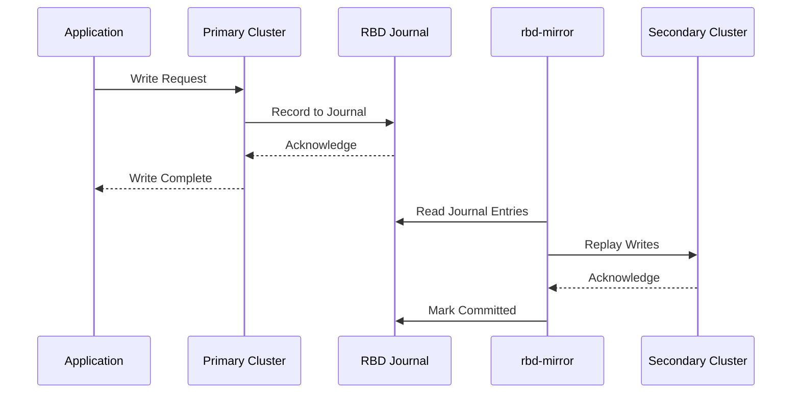
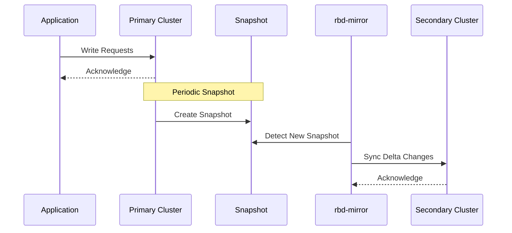
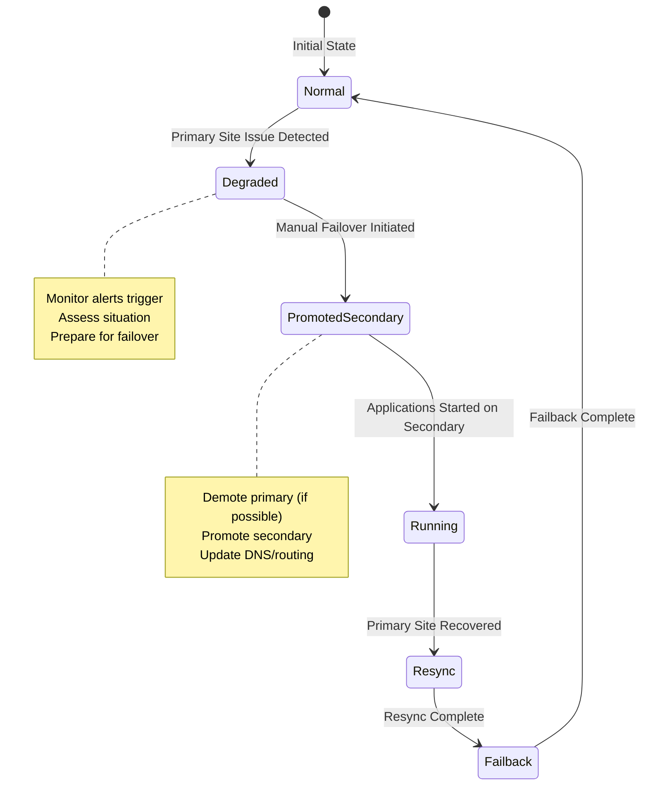
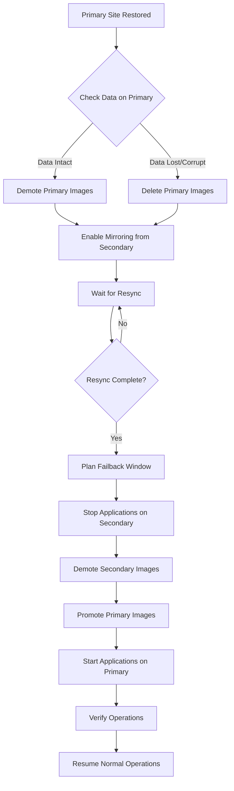
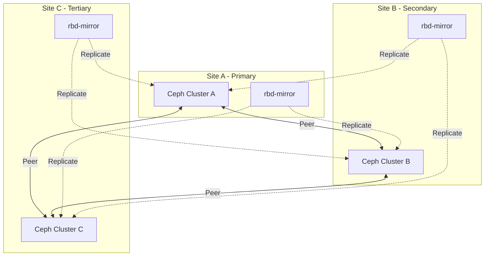

# How to Configure Ceph Mirroring for Disaster Recovery

Author: [nawazdhandala](https://github.com/nawazdhandala)

Tags: Ceph, Storage, Disaster Recovery, High Availability, Backup, Cloud Native

Description: Learn how to set up Ceph RBD mirroring for disaster recovery and cross-site data protection.

---

Ceph RBD (RADOS Block Device) mirroring is a powerful feature that enables asynchronous replication of block device images between two Ceph clusters. This capability is essential for disaster recovery (DR) scenarios, ensuring business continuity when your primary data center experiences an outage. In this comprehensive guide, we will explore how to configure Ceph mirroring, understand the different mirroring modes, and implement proper failover and failback procedures.

## Understanding Ceph RBD Mirroring Architecture

Before diving into the configuration, let's understand how Ceph RBD mirroring works at a high level.



## Mirroring Modes: Journal vs Snapshot

Ceph RBD supports two mirroring modes, each with distinct characteristics and use cases.

### Journal-Based Mirroring



Journal-based mirroring provides the lowest RPO (Recovery Point Objective) as every write is recorded in a journal and replayed on the secondary cluster.

### Snapshot-Based Mirroring



Snapshot-based mirroring is simpler and has lower overhead but provides a higher RPO based on the snapshot interval.

## Prerequisites

Before configuring Ceph mirroring, ensure you have:

- Two Ceph clusters (Ceph Quincy or later recommended)
- Network connectivity between clusters (dedicated replication network recommended)
- Sufficient bandwidth for replication traffic
- ceph-common and rbd-mirror packages installed

## Step 1: Enable Mirroring on the Pool

First, we need to enable the mirroring feature on the RBD pool in both clusters.

The following commands enable mirroring on the pool. The mode can be 'pool' for pool-level mirroring or 'image' for image-level mirroring.

```bash
# On the PRIMARY cluster
# Enable pool-level mirroring - all images in this pool will be mirrored
ceph osd pool create rbd-mirror-pool 128 128
rbd pool init rbd-mirror-pool

# Enable mirroring in 'pool' mode - mirrors all images automatically
# Use 'image' mode if you want to select specific images to mirror
rbd mirror pool enable rbd-mirror-pool pool

# Verify mirroring is enabled
rbd mirror pool info rbd-mirror-pool
```

Repeat the same steps on the secondary cluster:

```bash
# On the SECONDARY cluster
# Create the same pool - pool names must match for mirroring to work
ceph osd pool create rbd-mirror-pool 128 128
rbd pool init rbd-mirror-pool

# Enable mirroring in the same mode as the primary cluster
rbd mirror pool enable rbd-mirror-pool pool

# Verify mirroring is enabled
rbd mirror pool info rbd-mirror-pool
```

## Step 2: Configure Cluster Peering with Bootstrap Token

Cluster peering establishes the trust relationship between the two Ceph clusters. We use bootstrap tokens for secure peer configuration.

### Generate Bootstrap Token on Primary Cluster

The bootstrap token contains the necessary credentials for the secondary cluster to connect to the primary.

```bash
# On the PRIMARY cluster
# Generate a bootstrap token that the secondary cluster will use to peer
# This token contains the cluster's connection details and authentication info
rbd mirror pool peer bootstrap create \
    --site-name primary-site \
    rbd-mirror-pool > /tmp/bootstrap-token-primary

# View the token (base64 encoded JSON)
cat /tmp/bootstrap-token-primary

# The token contains:
# - Cluster FSID
# - Monitor addresses
# - CephX authentication key
# - Site name
```

### Import Bootstrap Token on Secondary Cluster

Transfer the bootstrap token securely to the secondary site and import it.

```bash
# On the SECONDARY cluster
# Copy the bootstrap token from primary site (use secure transfer method)
# scp user@primary-site:/tmp/bootstrap-token-primary /tmp/

# Import the token to establish the peer relationship
# The --direction rx-tx enables bidirectional mirroring capability
rbd mirror pool peer bootstrap import \
    --site-name secondary-site \
    --direction rx-tx \
    rbd-mirror-pool /tmp/bootstrap-token-primary

# Verify the peer relationship is established
rbd mirror pool info rbd-mirror-pool
```

### Verify Peer Configuration

After establishing the peer relationship, verify the configuration on both clusters.

```bash
# Check peer status on both clusters
# This shows the connected peers and their status
rbd mirror pool info rbd-mirror-pool

# Expected output:
# Mode: pool
# Site Name: primary-site (or secondary-site)
# Peers:
#   UUID: <peer-uuid>
#   Site Name: secondary-site (or primary-site)
#   Client Name: client.rbd-mirror-peer
```

## Step 3: Configure the rbd-mirror Daemon

The rbd-mirror daemon is responsible for replicating images between clusters. It should run on the secondary cluster.

### Create the rbd-mirror User

First, create a dedicated user for the rbd-mirror daemon with appropriate permissions.

```bash
# On the SECONDARY cluster
# Create a user for rbd-mirror with necessary capabilities
# The user needs read access to monitor, read-write to RBD pools
ceph auth get-or-create client.rbd-mirror.secondary \
    mon 'profile rbd-mirror' \
    osd 'profile rbd' \
    -o /etc/ceph/ceph.client.rbd-mirror.secondary.keyring

# Set appropriate permissions on the keyring file
chmod 600 /etc/ceph/ceph.client.rbd-mirror.secondary.keyring
```

### Configure and Start the rbd-mirror Service

Configure the rbd-mirror daemon using systemd for production deployments.

```bash
# On the SECONDARY cluster
# Create the rbd-mirror configuration
# The daemon ID can be any unique identifier (using hostname here)
cat > /etc/ceph/ceph.conf.d/rbd-mirror.conf << 'EOF'
[client.rbd-mirror.secondary]
    # Log file location for troubleshooting
    log file = /var/log/ceph/rbd-mirror.log

    # Enable admin socket for runtime queries
    admin socket = /var/run/ceph/rbd-mirror.$pid.asok

    # Number of concurrent image sync operations
    rbd_mirror_concurrent_image_syncs = 5

    # Journal commit delay (milliseconds) - lower = faster failover
    rbd_mirror_journal_commit_delay = 5

    # Sync point interval for progress checkpointing
    rbd_mirror_sync_point_update_age = 30
EOF

# Enable and start the rbd-mirror service
systemctl enable ceph-rbd-mirror@rbd-mirror.secondary
systemctl start ceph-rbd-mirror@rbd-mirror.secondary

# Check the service status
systemctl status ceph-rbd-mirror@rbd-mirror.secondary
```

### Alternative: Deploy rbd-mirror with Cephadm

For Cephadm-managed clusters, deploy rbd-mirror using the orchestrator.

```bash
# Deploy rbd-mirror daemon using cephadm
# This automatically handles user creation and service management
ceph orch apply rbd-mirror --placement="1 secondary-node1"

# Verify the daemon is running
ceph orch ps --daemon-type rbd-mirror

# Check daemon health
ceph orch daemon status rbd-mirror.secondary-node1
```

## Step 4: Create and Configure Mirrored Images

### Creating Images with Journal-Based Mirroring

Journal-based mirroring provides near-synchronous replication with the lowest RPO.

```bash
# On the PRIMARY cluster
# Create an RBD image with journaling feature enabled
# The journaling feature is required for journal-based mirroring
rbd create rbd-mirror-pool/database-vol \
    --size 100G \
    --image-feature exclusive-lock,journaling

# If pool-mode mirroring is enabled, the image is automatically mirrored
# For image-mode pools, explicitly enable mirroring:
rbd mirror image enable rbd-mirror-pool/database-vol journal

# Verify the image mirroring status
rbd mirror image status rbd-mirror-pool/database-vol
```

### Creating Images with Snapshot-Based Mirroring

Snapshot-based mirroring is simpler and works without the journaling feature.

```bash
# On the PRIMARY cluster
# Create an RBD image for snapshot-based mirroring
# Only exclusive-lock feature is required
rbd create rbd-mirror-pool/backup-vol \
    --size 50G \
    --image-feature exclusive-lock

# Enable snapshot-based mirroring
rbd mirror image enable rbd-mirror-pool/backup-vol snapshot

# Create a snapshot schedule for automatic mirroring
# This creates snapshots every 15 minutes for replication
rbd mirror snapshot schedule add \
    --pool rbd-mirror-pool \
    --image backup-vol \
    15m

# List the snapshot schedule
rbd mirror snapshot schedule ls --pool rbd-mirror-pool
```

### Configure Snapshot Schedule at Pool Level

For consistent snapshot intervals across all images in a pool.

```bash
# Set a default snapshot schedule for all images in the pool
# This applies to all snapshot-mode mirrored images
rbd mirror snapshot schedule add --pool rbd-mirror-pool 1h

# Add multiple schedules for different intervals
# Hourly snapshots during business hours, daily otherwise
rbd mirror snapshot schedule add --pool rbd-mirror-pool 1h \
    --start-time 08:00:00

rbd mirror snapshot schedule add --pool rbd-mirror-pool 24h \
    --start-time 00:00:00

# View all schedules
rbd mirror snapshot schedule ls --pool rbd-mirror-pool --recursive
```

## Step 5: Monitoring Mirroring Status

Effective monitoring is crucial for ensuring your disaster recovery solution is working correctly.

### Check Pool Mirroring Status

Monitor the overall health of mirroring at the pool level.

```bash
# Get a summary of the mirroring status for the pool
rbd mirror pool status rbd-mirror-pool

# Expected output shows:
# - Health status (OK, WARNING, ERROR)
# - Number of images in different states
# - Daemon status

# Get detailed status with per-image information
rbd mirror pool status rbd-mirror-pool --verbose
```

### Check Individual Image Status

Monitor specific images for detailed replication status.

```bash
# Check the mirroring status of a specific image
rbd mirror image status rbd-mirror-pool/database-vol

# The output includes:
# - Global image ID
# - State (up+stopped, up+replaying, up+syncing, etc.)
# - Description of current operation
# - Last sync timestamp
# - Peer sites and their sync status

# Example output:
# database-vol:
#   global_id:   12345678-1234-1234-1234-123456789abc
#   state:       up+replaying
#   description: replaying, {"bytes_per_second":1048576,"entries_behind":0}
#   last_update: 2026-01-07 10:30:00
```

### Monitor Replication Lag

Track replication lag to understand your actual RPO.

```bash
# Create a script to monitor replication lag across all images
cat > /usr/local/bin/check-mirror-lag.sh << 'EOF'
#!/bin/bash
# Script to check mirroring lag for all images in a pool
# Returns non-zero exit code if any image is behind

POOL="${1:-rbd-mirror-pool}"
MAX_LAG_SECONDS="${2:-300}"  # 5 minutes default threshold

echo "Checking mirroring status for pool: $POOL"
echo "Maximum acceptable lag: ${MAX_LAG_SECONDS} seconds"
echo "================================================"

# Get status in JSON format for parsing
STATUS=$(rbd mirror pool status $POOL --format json)

# Parse and check each image
echo "$STATUS" | jq -r '.images[] | "\(.name) \(.state) \(.description)"' | \
while read name state desc; do
    echo "Image: $name"
    echo "  State: $state"
    echo "  Details: $desc"

    # Check for error states
    if [[ "$state" == *"error"* ]]; then
        echo "  WARNING: Image is in error state!"
    fi

    # Check entries behind for journal mirroring
    if [[ "$desc" == *"entries_behind"* ]]; then
        behind=$(echo "$desc" | grep -o '"entries_behind":[0-9]*' | cut -d: -f2)
        if [ "$behind" -gt 0 ]; then
            echo "  WARNING: $behind journal entries behind"
        fi
    fi
    echo ""
done

# Get overall health
HEALTH=$(echo "$STATUS" | jq -r '.summary.health')
echo "Overall Health: $HEALTH"

if [ "$HEALTH" != "OK" ]; then
    exit 1
fi
EOF

chmod +x /usr/local/bin/check-mirror-lag.sh

# Run the monitoring script
/usr/local/bin/check-mirror-lag.sh rbd-mirror-pool
```

### Prometheus Metrics for Mirroring

Enable Prometheus metrics for integration with monitoring systems.

```bash
# The rbd-mirror daemon exposes metrics on port 9283 by default
# Verify metrics are being exposed
curl -s http://localhost:9283/metrics | grep rbd_mirror

# Key metrics to monitor:
# - ceph_rbd_mirror_replay_latency: Replication lag
# - ceph_rbd_mirror_replay_bytes: Bytes replicated
# - ceph_rbd_mirror_image_state: Current state of images
```

Create a Prometheus alerting rule for mirroring issues.

```yaml
# prometheus-alerts.yml
# Alert rules for Ceph RBD mirroring monitoring
groups:
  - name: ceph-rbd-mirror
    interval: 30s
    rules:
      # Alert when mirroring is not healthy
      - alert: CephRBDMirrorUnhealthy
        expr: ceph_rbd_mirror_pool_health_status != 0
        for: 5m
        labels:
          severity: critical
        annotations:
          summary: "RBD mirroring is unhealthy"
          description: "Pool {{ $labels.pool }} mirroring has been unhealthy for 5 minutes"

      # Alert when replication lag exceeds threshold
      - alert: CephRBDMirrorLagHigh
        expr: ceph_rbd_mirror_replay_latency > 300
        for: 10m
        labels:
          severity: warning
        annotations:
          summary: "RBD mirroring lag is high"
          description: "Image {{ $labels.image }} has replication lag of {{ $value }} seconds"

      # Alert when rbd-mirror daemon is down
      - alert: CephRBDMirrorDaemonDown
        expr: up{job="rbd-mirror"} == 0
        for: 2m
        labels:
          severity: critical
        annotations:
          summary: "RBD mirror daemon is down"
          description: "The rbd-mirror daemon has been down for 2 minutes"
```

## Step 6: Failover Procedures

When the primary site experiences a disaster, you need to perform a failover to the secondary site.

### Disaster Recovery Architecture



### Planned Failover (Graceful)

When you need to perform maintenance or planned migration.

```bash
# On the PRIMARY cluster (if accessible)
# Step 1: Stop all applications using the RBD images
# This ensures all writes are flushed

# Step 2: Demote the primary image to non-primary
# This triggers a final sync and marks the image as non-primary
rbd mirror image demote rbd-mirror-pool/database-vol

# Verify the demotion is complete
rbd mirror image status rbd-mirror-pool/database-vol
# State should show: up+stopped or up+unknown

# On the SECONDARY cluster
# Step 3: Wait for final sync to complete
# Monitor until all entries are replayed
watch rbd mirror image status rbd-mirror-pool/database-vol

# Step 4: Promote the secondary image to primary
rbd mirror image promote rbd-mirror-pool/database-vol

# Verify the promotion
rbd mirror image status rbd-mirror-pool/database-vol
# State should show: up+stopped (as primary)

# Step 5: Start applications on the secondary site
# Update any necessary configuration to point to the new primary
```

### Unplanned Failover (Disaster)

When the primary site is completely unavailable.

```bash
# On the SECONDARY cluster
# Step 1: Verify the primary site is truly unavailable
# Attempt to reach the primary cluster
timeout 30 ceph --cluster primary status || echo "Primary unreachable"

# Step 2: Force promote the secondary image
# Use --force flag since we cannot demote the primary
rbd mirror image promote --force rbd-mirror-pool/database-vol

# For multiple images, promote all at once
for image in $(rbd ls rbd-mirror-pool); do
    echo "Promoting image: $image"
    rbd mirror image promote --force rbd-mirror-pool/$image
done

# Step 3: Verify all images are promoted
rbd mirror pool status rbd-mirror-pool --verbose

# Step 4: Map the RBD images and start applications
rbd device map rbd-mirror-pool/database-vol
# Device is now available at /dev/rbd0

# Step 5: Mount and verify data integrity
mount /dev/rbd0 /mnt/database
ls -la /mnt/database
```

### Automated Failover Script

Create an automated failover script for faster DR response.

```bash
#!/bin/bash
# failover.sh - Automated Ceph RBD failover script
# Usage: ./failover.sh <pool-name> [--force]

set -e

POOL="${1:-rbd-mirror-pool}"
FORCE="${2:-}"
LOG_FILE="/var/log/ceph/failover-$(date +%Y%m%d-%H%M%S).log"

log() {
    echo "[$(date '+%Y-%m-%d %H:%M:%S')] $1" | tee -a "$LOG_FILE"
}

check_prerequisites() {
    log "Checking prerequisites..."

    # Verify we can connect to local cluster
    if ! ceph status &>/dev/null; then
        log "ERROR: Cannot connect to local Ceph cluster"
        exit 1
    fi

    # Check if pool exists
    if ! ceph osd pool stats "$POOL" &>/dev/null; then
        log "ERROR: Pool $POOL does not exist"
        exit 1
    fi

    log "Prerequisites check passed"
}

promote_images() {
    log "Starting image promotion for pool: $POOL"

    # Get list of all mirrored images
    IMAGES=$(rbd mirror pool status "$POOL" --format json | jq -r '.images[].name')

    FAILED=0
    PROMOTED=0

    for image in $IMAGES; do
        log "Promoting image: $image"

        if [ "$FORCE" == "--force" ]; then
            if rbd mirror image promote --force "$POOL/$image" 2>>"$LOG_FILE"; then
                log "SUCCESS: Promoted $image (forced)"
                ((PROMOTED++))
            else
                log "ERROR: Failed to promote $image"
                ((FAILED++))
            fi
        else
            if rbd mirror image promote "$POOL/$image" 2>>"$LOG_FILE"; then
                log "SUCCESS: Promoted $image"
                ((PROMOTED++))
            else
                log "ERROR: Failed to promote $image"
                ((FAILED++))
            fi
        fi
    done

    log "Promotion complete: $PROMOTED succeeded, $FAILED failed"

    return $FAILED
}

verify_promotion() {
    log "Verifying promotion status..."

    # Check pool status
    STATUS=$(rbd mirror pool status "$POOL" --format json)
    HEALTH=$(echo "$STATUS" | jq -r '.summary.health')

    log "Pool health: $HEALTH"

    # List all image states
    echo "$STATUS" | jq -r '.images[] | "  \(.name): \(.state)"' | while read line; do
        log "$line"
    done
}

main() {
    log "=========================================="
    log "Ceph RBD Failover Script Started"
    log "Pool: $POOL"
    log "Force mode: ${FORCE:-disabled}"
    log "=========================================="

    check_prerequisites
    promote_images
    verify_promotion

    log "=========================================="
    log "Failover complete"
    log "Log file: $LOG_FILE"
    log "=========================================="
}

main
```

## Step 7: Failback Procedures

After the primary site is restored, you need to resync and fail back.

### Failback Workflow



### Resync Primary from Secondary

After the primary site is restored, resync the data from the secondary.

```bash
# On the PRIMARY cluster (after restoration)
# Step 1: Check if images exist and their state
rbd ls rbd-mirror-pool
rbd mirror image status rbd-mirror-pool/database-vol

# If images are corrupt or need to be resynced from scratch:
# Delete the local image to allow full resync
rbd rm rbd-mirror-pool/database-vol

# Step 2: Re-enable mirroring on the pool if needed
rbd mirror pool enable rbd-mirror-pool pool

# Step 3: The rbd-mirror daemon will automatically sync from secondary
# Monitor the sync progress
watch rbd mirror image status rbd-mirror-pool/database-vol

# Check for "syncing" state and progress percentage
rbd mirror pool status rbd-mirror-pool --verbose
```

### Perform Failback

Once resync is complete, perform the failback to restore normal operations.

```bash
# Step 1: Verify resync is 100% complete
rbd mirror image status rbd-mirror-pool/database-vol
# Look for state: up+replaying (not syncing)

# Step 2: On the SECONDARY cluster - Stop applications
systemctl stop application-service

# Step 3: Demote secondary images (graceful handover)
rbd mirror image demote rbd-mirror-pool/database-vol

# Step 4: Wait for final sync to complete on primary
# On PRIMARY cluster
watch rbd mirror image status rbd-mirror-pool/database-vol

# Step 5: Promote primary images
rbd mirror image promote rbd-mirror-pool/database-vol

# Step 6: Verify primary is now the active site
rbd mirror pool status rbd-mirror-pool

# Step 7: Start applications on primary
# Update DNS/load balancer to point to primary
systemctl start application-service

# Step 8: Verify normal operations
rbd mirror pool status rbd-mirror-pool --verbose
```

### Automated Failback Script

```bash
#!/bin/bash
# failback.sh - Automated Ceph RBD failback script
# Performs graceful failback from DR site to primary

set -e

PRIMARY_POOL="${1:-rbd-mirror-pool}"
LOG_FILE="/var/log/ceph/failback-$(date +%Y%m%d-%H%M%S).log"

log() {
    echo "[$(date '+%Y-%m-%d %H:%M:%S')] $1" | tee -a "$LOG_FILE"
}

wait_for_sync() {
    local image=$1
    local max_wait=3600  # 1 hour timeout
    local waited=0

    log "Waiting for $image to complete sync..."

    while [ $waited -lt $max_wait ]; do
        STATUS=$(rbd mirror image status "$PRIMARY_POOL/$image" --format json 2>/dev/null)
        STATE=$(echo "$STATUS" | jq -r '.state')

        if [[ "$STATE" == *"replaying"* ]]; then
            # Check if caught up
            ENTRIES_BEHIND=$(echo "$STATUS" | jq -r '.description' | grep -o 'entries_behind":[0-9]*' | cut -d: -f2 || echo "0")
            if [ "$ENTRIES_BEHIND" == "0" ] || [ -z "$ENTRIES_BEHIND" ]; then
                log "$image is fully synced"
                return 0
            fi
            log "$image has $ENTRIES_BEHIND entries behind, waiting..."
        elif [[ "$STATE" == *"syncing"* ]]; then
            PROGRESS=$(echo "$STATUS" | jq -r '.description')
            log "$image sync progress: $PROGRESS"
        else
            log "$image state: $STATE"
        fi

        sleep 10
        ((waited+=10))
    done

    log "ERROR: Timeout waiting for $image to sync"
    return 1
}

perform_failback() {
    local image=$1

    log "Starting failback for $image"

    # Demote on DR site (this script runs on DR site)
    log "Demoting $image on DR site..."
    rbd mirror image demote "$PRIMARY_POOL/$image"

    # Wait a moment for the state to propagate
    sleep 5

    log "$image demoted on DR site, promote on primary site"
}

main() {
    log "=========================================="
    log "Ceph RBD Failback Script Started"
    log "Pool: $PRIMARY_POOL"
    log "=========================================="

    # Get list of images
    IMAGES=$(rbd mirror pool status "$PRIMARY_POOL" --format json | jq -r '.images[].name')

    # First verify all images are synced
    log "Phase 1: Verifying all images are synced"
    for image in $IMAGES; do
        if ! wait_for_sync "$image"; then
            log "ERROR: Cannot proceed, $image is not synced"
            exit 1
        fi
    done

    # Perform failback
    log "Phase 2: Performing failback"
    for image in $IMAGES; do
        perform_failback "$image"
    done

    log "=========================================="
    log "Failback initiated on DR site"
    log "Now promote images on primary site"
    log "Log file: $LOG_FILE"
    log "=========================================="
}

main
```

## Step 8: Advanced Configuration Options

### Configuring Network Settings for Mirroring

Optimize network settings for better replication performance.

```bash
# Configure dedicated network for mirroring traffic
# Add to ceph.conf on both clusters
cat >> /etc/ceph/ceph.conf << 'EOF'

[global]
    # Use a dedicated cluster network for replication
    cluster_network = 10.0.1.0/24

    # RBD mirror specific settings
    [client.rbd-mirror]
    # Increase the number of concurrent syncs
    rbd_mirror_concurrent_image_syncs = 10

    # Increase the number of journal splay width
    rbd_mirror_journal_poll_age = 1

    # Configure memory limits for caching
    rbd_mirror_memory_cache_size = 1073741824  # 1GB

    # Network tuning for WAN replication
    ms_tcp_nodelay = true
    ms_tcp_rcvbuf = 0
EOF

# Restart rbd-mirror daemon to apply changes
systemctl restart ceph-rbd-mirror@rbd-mirror.secondary
```

### Configuring Image Features for Optimal Mirroring

Set up RBD images with the right features for your use case.

```bash
# For journal-based mirroring (lowest RPO)
# Required features: exclusive-lock, journaling
rbd create rbd-mirror-pool/critical-data \
    --size 500G \
    --image-feature exclusive-lock,journaling,object-map,fast-diff \
    --stripe-unit 4M \
    --stripe-count 16

# Configure journal settings for the image
# Smaller journal objects = more frequent syncs, lower RPO
rbd config image set rbd-mirror-pool/critical-data \
    rbd_journal_object_size 4194304  # 4MB

rbd config image set rbd-mirror-pool/critical-data \
    rbd_journal_splay_width 4

# For snapshot-based mirroring (simpler, lower overhead)
rbd create rbd-mirror-pool/archival-data \
    --size 1T \
    --image-feature exclusive-lock,object-map,fast-diff

# Enable snapshot mirroring with frequent schedule
rbd mirror image enable rbd-mirror-pool/archival-data snapshot
rbd mirror snapshot schedule add --pool rbd-mirror-pool \
    --image archival-data 5m  # 5 minute RPO
```

### Multi-Site Mirroring Configuration

For environments with more than two sites.



Configure multiple peers for multi-site replication.

```bash
# On Site A (Primary)
# Generate bootstrap tokens for both remote sites
rbd mirror pool peer bootstrap create \
    --site-name site-a \
    rbd-mirror-pool > /tmp/bootstrap-site-a

# On Site B
# Import Site A's token
rbd mirror pool peer bootstrap import \
    --site-name site-b \
    --direction rx-tx \
    rbd-mirror-pool /tmp/bootstrap-site-a

# Generate Site B's token for Site C
rbd mirror pool peer bootstrap create \
    --site-name site-b \
    rbd-mirror-pool > /tmp/bootstrap-site-b

# On Site C
# Import tokens from both Site A and Site B
rbd mirror pool peer bootstrap import \
    --site-name site-c \
    --direction rx-tx \
    rbd-mirror-pool /tmp/bootstrap-site-a

rbd mirror pool peer bootstrap import \
    --site-name site-c \
    --direction rx-tx \
    rbd-mirror-pool /tmp/bootstrap-site-b

# Verify all peers on each site
rbd mirror pool info rbd-mirror-pool
# Should show peers to all other sites
```

## Troubleshooting Common Issues

### Mirroring Status Shows Error

```bash
# Check the rbd-mirror daemon logs for errors
journalctl -u ceph-rbd-mirror@rbd-mirror.secondary -f

# Common issues and solutions:

# Issue: "unable to find image"
# Solution: Verify the image exists on primary and mirroring is enabled
rbd mirror image status rbd-mirror-pool/image-name

# Issue: "permission denied"
# Solution: Verify the rbd-mirror user has correct capabilities
ceph auth get client.rbd-mirror.secondary

# Issue: "connection refused"
# Solution: Check network connectivity and firewall rules
ceph --cluster primary status
nc -zv primary-monitor-ip 6789
```

### Replication Lag is Too High

```bash
# Check current sync status and identify bottlenecks
rbd mirror pool status rbd-mirror-pool --verbose

# Increase concurrent sync operations
ceph config set client.rbd-mirror rbd_mirror_concurrent_image_syncs 20

# Check network bandwidth between sites
iperf3 -c secondary-site-ip -p 5201

# If bandwidth is limited, consider:
# 1. Upgrading network links
# 2. Implementing QoS for replication traffic
# 3. Switching to snapshot-based mirroring with longer intervals
```

### Images Stuck in Syncing State

```bash
# Check the sync progress
rbd mirror image status rbd-mirror-pool/stuck-image

# If stuck, try resyncing the image
rbd mirror image resync rbd-mirror-pool/stuck-image

# Monitor the resync progress
watch rbd mirror image status rbd-mirror-pool/stuck-image

# If still stuck, check for exclusive lock issues
rbd lock list rbd-mirror-pool/stuck-image

# Break stale locks if necessary
rbd lock remove rbd-mirror-pool/stuck-image <lock-id> <locker>
```

## Best Practices Summary

1. **Network Design**: Use dedicated replication networks to avoid impacting production traffic
2. **Monitoring**: Implement comprehensive monitoring with alerting for replication lag and daemon health
3. **Testing**: Regularly test failover and failback procedures in a non-production environment
4. **Documentation**: Maintain runbooks for DR procedures and keep them updated
5. **RPO/RTO Planning**: Choose the appropriate mirroring mode based on your RPO/RTO requirements
6. **Security**: Use secure token exchange and encrypt replication traffic between sites
7. **Capacity Planning**: Ensure secondary site has sufficient capacity for all replicated data

## Conclusion

Ceph RBD mirroring provides a robust solution for disaster recovery and cross-site data protection. By following this guide, you have learned how to:

- Configure pool and image mirroring with both journal and snapshot modes
- Establish secure peer relationships using bootstrap tokens
- Deploy and configure the rbd-mirror daemon
- Monitor mirroring status and replication lag
- Perform failover and failback procedures
- Troubleshoot common issues

Remember that disaster recovery is not just about technology - it requires regular testing, documentation, and organizational preparedness. Schedule regular DR drills to ensure your team is ready to respond when a real disaster occurs.
