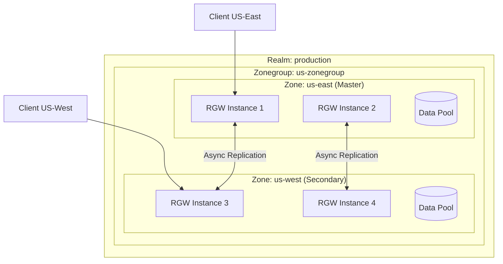
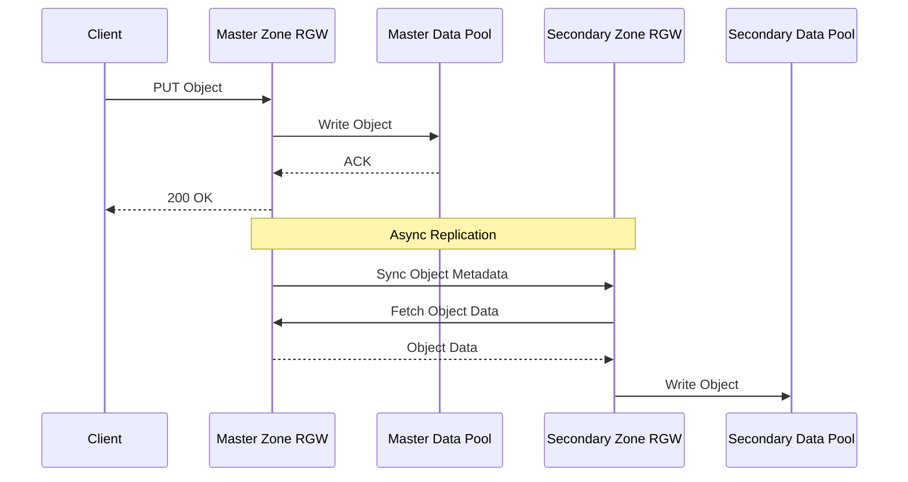
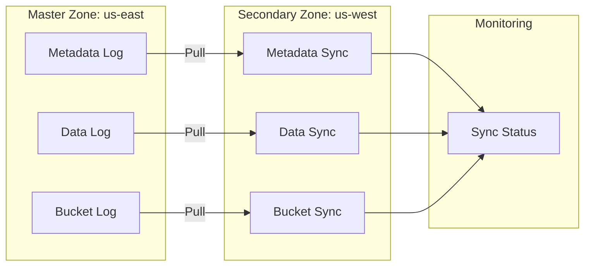
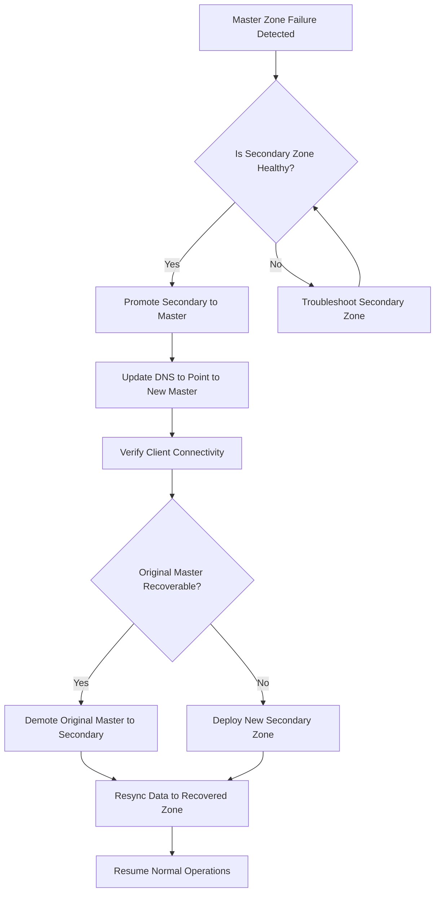
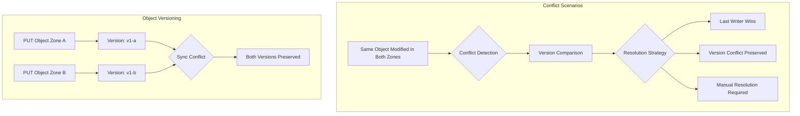
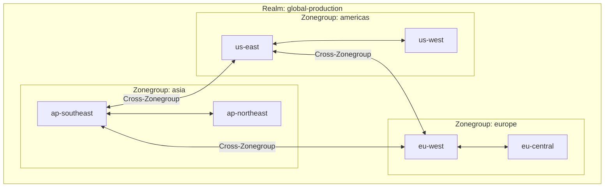

# How to Set Up Ceph Multi-Site Replication for Geo-Redundancy

Author: [nawazdhandala](https://github.com/nawazdhandala)

Tags: Ceph, Storage, Multi-Site, Disaster Recovery, High Availability, Cloud Native

Description: Learn how to configure Ceph RGW multi-site replication for geographic redundancy and disaster recovery.

---

Ceph's RADOS Gateway (RGW) provides a powerful multi-site replication feature that enables geographic redundancy and disaster recovery for your object storage infrastructure. This comprehensive guide walks you through setting up a multi-site Ceph cluster with active-active replication across multiple data centers.

## Table of Contents

1. [Understanding Ceph Multi-Site Architecture](#understanding-ceph-multi-site-architecture)
2. [Prerequisites](#prerequisites)
3. [Configuring the Realm, Zonegroups, and Zones](#configuring-the-realm-zonegroups-and-zones)
4. [Setting Up the Master Zone](#setting-up-the-master-zone)
5. [Configuring the Secondary Zone](#configuring-the-secondary-zone)
6. [Sync Configuration and Monitoring](#sync-configuration-and-monitoring)
7. [Failover Procedures](#failover-procedures)
8. [Conflict Resolution Strategies](#conflict-resolution-strategies)
9. [Advanced Configuration Options](#advanced-configuration-options)
10. [Troubleshooting Common Issues](#troubleshooting-common-issues)

## Understanding Ceph Multi-Site Architecture

Before diving into configuration, it is essential to understand the hierarchical structure of Ceph multi-site replication.

The following diagram illustrates the multi-site architecture with realms, zonegroups, and zones:



### Key Concepts

- **Realm**: The top-level container that encompasses all zonegroups and zones. A realm represents a globally unique namespace.
- **Zonegroup**: A collection of zones that share the same set of buckets. Formerly known as a "region."
- **Zone**: A logical grouping of one or more RGW instances. Each zone has its own data pools and can serve client requests.
- **Period**: A configuration epoch that captures the state of the realm at a point in time.

The data flow in a multi-site setup works as follows:



## Prerequisites

Before setting up multi-site replication, ensure you have:

1. **Two or more Ceph clusters** deployed in different geographic locations
2. **RGW (RADOS Gateway)** installed and running on each cluster
3. **Network connectivity** between clusters (typically over VPN or dedicated links)
4. **Synchronized time** using NTP across all nodes
5. **Ceph version Luminous (12.x) or later** (preferably Pacific or newer for best features)

Verify your Ceph cluster health on both sites before proceeding:

```bash
# Check cluster health on both sites
# This command displays the overall health status of your Ceph cluster
# including any warnings or errors that need attention
ceph health detail

# Verify RGW service is running
# Lists all RGW daemons and their current status
ceph orch ls rgw

# Check RGW daemon status
# Shows detailed information about each RGW daemon including uptime and memory usage
ceph orch ps --daemon-type rgw
```

## Configuring the Realm, Zonegroups, and Zones

The configuration follows a hierarchical approach: Realm -> Zonegroup -> Zone.

### Step 1: Create the Realm on the Master Site

The realm is the top-level container for your multi-site configuration. Execute these commands on the master site:

```bash
# Create a new realm named 'production'
# The realm provides a globally unique namespace for all your multi-site data
# Use --default to set this as the default realm for future operations
radosgw-admin realm create --rgw-realm=production --default

# Verify the realm was created successfully
# This displays the realm configuration in JSON format
radosgw-admin realm get --rgw-realm=production
```

Expected output:

```json
{
    "id": "a1b2c3d4-e5f6-7890-abcd-ef1234567890",
    "name": "production",
    "current_period": "b2c3d4e5-f6a7-8901-bcde-f12345678901",
    "epoch": 1
}
```

### Step 2: Create the Master Zonegroup

The zonegroup defines which zones share the same pool of buckets:

```bash
# Create the master zonegroup
# --endpoints: The RGW endpoint URL(s) for this zonegroup
# --master: Designates this as the master zonegroup where bucket operations are authoritative
# --default: Sets this as the default zonegroup
radosgw-admin zonegroup create \
    --rgw-zonegroup=us-zonegroup \
    --endpoints=https://rgw-east.example.com:443 \
    --rgw-realm=production \
    --master \
    --default

# List all zonegroups to verify creation
radosgw-admin zonegroup list
```

### Step 3: Create the Master Zone

The zone represents the local Ceph cluster's RGW configuration:

```bash
# Create the master zone within the zonegroup
# --access-key and --secret: Credentials for inter-zone communication
# These credentials will be used by secondary zones to authenticate sync requests
radosgw-admin zone create \
    --rgw-zonegroup=us-zonegroup \
    --rgw-zone=us-east \
    --endpoints=https://rgw-east.example.com:443 \
    --access-key=SYSTEM_ACCESS_KEY \
    --secret=SYSTEM_SECRET_KEY \
    --master \
    --default

# Verify the zone configuration
radosgw-admin zone get --rgw-zone=us-east
```

### Step 4: Create the System User

The system user is required for inter-zone synchronization:

```bash
# Create a system user for replication
# --system flag grants this user special privileges for zone synchronization
# --access-key and --secret must match those used in zone creation
radosgw-admin user create \
    --uid=zone.user \
    --display-name="Zone Sync User" \
    --access-key=SYSTEM_ACCESS_KEY \
    --secret=SYSTEM_SECRET_KEY \
    --system

# Verify the system user was created with proper capabilities
radosgw-admin user info --uid=zone.user
```

### Step 5: Commit the Period

The period captures the current configuration state and must be committed and updated:

```bash
# Update and commit the period
# This propagates the configuration changes and creates a new period epoch
radosgw-admin period update --commit

# Verify the period was committed
radosgw-admin period get
```

## Setting Up the Master Zone

With the realm structure in place, configure the RGW daemons on the master zone.

### Configure RGW Daemon

Update the Ceph configuration for RGW:

```bash
# Set RGW configuration parameters
# These settings tell the RGW daemon which realm, zonegroup, and zone to use

# Configure the realm for RGW instances
ceph config set client.rgw rgw_realm production

# Configure the zonegroup
ceph config set client.rgw rgw_zonegroup us-zonegroup

# Configure the zone
ceph config set client.rgw rgw_zone us-east

# Enable the sync log for replication tracking
# This log records all changes that need to be replicated to other zones
ceph config set client.rgw rgw_data_log_changes true

# Set the number of data log shards (adjust based on workload)
# More shards provide better parallelism for high-throughput environments
ceph config set client.rgw rgw_data_log_num_shards 128
```

### Deploy RGW with Ceph Orchestrator

If using cephadm, deploy the RGW service:

```yaml
# rgw-spec.yaml
# This specification file defines the RGW service deployment
# Save this file and apply it using ceph orch apply

service_type: rgw
service_id: us-east
placement:
  # Deploy RGW on these specific hosts for high availability
  hosts:
    - rgw-host-1
    - rgw-host-2
  count: 2
spec:
  # Reference the realm and zone we created earlier
  rgw_realm: production
  rgw_zonegroup: us-zonegroup
  rgw_zone: us-east
  # SSL configuration for secure communication
  ssl: true
  rgw_frontend_port: 443
```

Apply the specification:

```bash
# Apply the RGW service specification
# This deploys the RGW daemons according to the YAML specification
ceph orch apply -i rgw-spec.yaml

# Monitor the deployment progress
# Watch until all RGW daemons show as 'running'
ceph orch ls rgw --refresh

# Verify RGW daemons are running
ceph orch ps --daemon-type rgw
```

### Create Data and Index Pools

Ensure the proper pools exist for the zone:

```bash
# Create the data pool for storing object data
# pg_num should be calculated based on your cluster size and expected data volume
# A common formula: target_pgs = (OSDs * 100) / replicas
ceph osd pool create us-east.rgw.buckets.data 128

# Create the index pool for bucket indexes
# Index pools typically need fewer PGs as they store metadata
ceph osd pool create us-east.rgw.buckets.index 64

# Create the metadata pool
ceph osd pool create us-east.rgw.meta 32

# Enable the application tag for RGW on each pool
# This helps Ceph understand the pool's purpose
ceph osd pool application enable us-east.rgw.buckets.data rgw
ceph osd pool application enable us-east.rgw.buckets.index rgw
ceph osd pool application enable us-east.rgw.meta rgw
```

## Configuring the Secondary Zone

Now set up the secondary zone on the remote Ceph cluster.

### Step 1: Pull the Realm Configuration

On the secondary site, pull the realm configuration from the master:

```bash
# Pull the realm from the master zone
# This downloads the complete realm configuration including zonegroups and zones
# --url: The endpoint of the master zone RGW
# --access-key and --secret: Credentials of the system user created on master
radosgw-admin realm pull \
    --url=https://rgw-east.example.com:443 \
    --access-key=SYSTEM_ACCESS_KEY \
    --secret=SYSTEM_SECRET_KEY

# Set the pulled realm as default on this cluster
radosgw-admin realm default --rgw-realm=production

# Verify the realm was pulled successfully
radosgw-admin realm get --rgw-realm=production
```

### Step 2: Pull the Period

Synchronize the period configuration:

```bash
# Pull the current period from the master
# The period contains the complete multi-site configuration state
radosgw-admin period pull \
    --url=https://rgw-east.example.com:443 \
    --access-key=SYSTEM_ACCESS_KEY \
    --secret=SYSTEM_SECRET_KEY

# Verify the period matches the master
radosgw-admin period get
```

### Step 3: Create the Secondary Zone

Create the secondary zone on the remote cluster:

```bash
# Create the secondary zone
# Note: Do NOT use --master flag as this is a secondary zone
# --endpoints: The RGW endpoint(s) for this secondary zone
radosgw-admin zone create \
    --rgw-zonegroup=us-zonegroup \
    --rgw-zone=us-west \
    --endpoints=https://rgw-west.example.com:443 \
    --access-key=SYSTEM_ACCESS_KEY \
    --secret=SYSTEM_SECRET_KEY

# Verify the zone was created
radosgw-admin zone get --rgw-zone=us-west
```

### Step 4: Update the Zonegroup

Add the secondary zone's endpoints to the zonegroup:

```bash
# Modify the zonegroup to include secondary zone endpoints
# This allows clients to discover all available zones
radosgw-admin zonegroup modify \
    --rgw-zonegroup=us-zonegroup \
    --endpoints=https://rgw-east.example.com:443,https://rgw-west.example.com:443
```

### Step 5: Commit and Push the Period

Finalize the configuration:

```bash
# Update the period with the new zone configuration
radosgw-admin period update --commit

# The period is automatically propagated to all zones
# Verify the period on the secondary site
radosgw-admin period get
```

### Step 6: Configure and Start RGW on Secondary

Deploy RGW on the secondary site:

```bash
# Set RGW configuration for the secondary zone
ceph config set client.rgw rgw_realm production
ceph config set client.rgw rgw_zonegroup us-zonegroup
ceph config set client.rgw rgw_zone us-west
```

Create the RGW specification for the secondary zone:

```yaml
# rgw-spec-secondary.yaml
# Deployment specification for the secondary zone RGW instances

service_type: rgw
service_id: us-west
placement:
  hosts:
    - rgw-host-3
    - rgw-host-4
  count: 2
spec:
  rgw_realm: production
  rgw_zonegroup: us-zonegroup
  rgw_zone: us-west
  ssl: true
  rgw_frontend_port: 443
```

Apply and verify:

```bash
# Deploy the RGW service on the secondary site
ceph orch apply -i rgw-spec-secondary.yaml

# Wait for deployment and verify
ceph orch ps --daemon-type rgw
```

## Sync Configuration and Monitoring

With both zones configured, synchronization begins automatically. Here is how to monitor and configure sync behavior.

### Viewing Sync Status

The following diagram shows the sync monitoring architecture:



Monitor synchronization with these commands:

```bash
# Check overall sync status
# This shows the sync state between all zones in the zonegroup
radosgw-admin sync status

# Example output shows sync progress:
# realm: production
# zonegroup: us-zonegroup
# zone: us-west
# metadata sync: syncing
#   full sync: 0/64 shards
#   incremental sync: 64/64 shards
# data sync source: us-east
#   full sync: 0/128 shards
#   incremental sync: 128/128 shards

# Check detailed metadata sync status
# Metadata includes user accounts, bucket metadata, and access policies
radosgw-admin metadata sync status

# Check data sync status from a specific source zone
# Shows per-shard sync progress for object data
radosgw-admin data sync status --source-zone=us-east

# List any sync errors that need attention
radosgw-admin sync error list
```

### Configuring Sync Policies

Ceph allows fine-grained control over what gets synced:

```bash
# Get the current sync policy for a zonegroup
radosgw-admin sync policy get --rgw-zonegroup=us-zonegroup

# Create a sync group for selective replication
# Sync groups allow you to define which buckets sync to which zones
radosgw-admin sync group create \
    --rgw-zonegroup=us-zonegroup \
    --group-id=critical-data \
    --status=enabled

# Add a sync flow to replicate from master to secondary
# Flows define the direction of data replication
radosgw-admin sync group flow create \
    --rgw-zonegroup=us-zonegroup \
    --group-id=critical-data \
    --flow-id=east-to-west \
    --flow-type=directional \
    --source-zone=us-east \
    --dest-zone=us-west

# Create a pipe to specify which buckets are included
# Pipes filter which buckets participate in a sync flow
radosgw-admin sync group pipe create \
    --rgw-zonegroup=us-zonegroup \
    --group-id=critical-data \
    --pipe-id=critical-buckets \
    --source-zones=us-east \
    --dest-zones=us-west \
    --bucket="critical-*"
```

### Bucket-Level Sync Configuration

For more granular control, configure sync at the bucket level:

```bash
# Enable sync for a specific bucket
# This is useful when you have sync disabled at the zonegroup level
# but want specific buckets to replicate
radosgw-admin bucket sync enable --bucket=my-important-bucket

# Disable sync for a bucket that should remain local-only
radosgw-admin bucket sync disable --bucket=temporary-bucket

# Check sync status for a specific bucket
radosgw-admin bucket sync status --bucket=my-important-bucket

# Manually trigger a full sync for a bucket
# Useful after resolving sync issues or data corruption
radosgw-admin bucket sync run --bucket=my-important-bucket --source-zone=us-east
```

### Monitoring with Prometheus

Set up Prometheus metrics for sync monitoring:

```yaml
# prometheus-rgw-rules.yaml
# Alerting rules for RGW multi-site sync monitoring

groups:
  - name: ceph-rgw-multisite
    rules:
      # Alert when sync is falling behind
      - alert: RGWSyncLagging
        expr: ceph_rgw_sync_lag_seconds > 3600
        for: 15m
        labels:
          severity: warning
        annotations:
          summary: "RGW sync is lagging behind"
          description: "Zone {{ $labels.zone }} sync lag is {{ $value }} seconds"

      # Alert on sync errors
      - alert: RGWSyncErrors
        expr: increase(ceph_rgw_sync_errors_total[1h]) > 10
        for: 5m
        labels:
          severity: critical
        annotations:
          summary: "RGW sync errors detected"
          description: "{{ $value }} sync errors in the last hour"

      # Alert when metadata sync is stalled
      - alert: RGWMetadataSyncStalled
        expr: rate(ceph_rgw_metadata_sync_ops[5m]) == 0 and ceph_rgw_metadata_sync_pending > 0
        for: 30m
        labels:
          severity: critical
        annotations:
          summary: "Metadata sync has stalled"
```

Enable the Prometheus exporter in RGW:

```bash
# Enable Prometheus metrics endpoint on RGW
# Metrics will be available at http://rgw-host:9283/metrics
ceph config set client.rgw rgw_enable_apis "s3, admin, prometheus"

# Set the Prometheus exporter port
ceph config set client.rgw rgw_prometheus_port 9283

# Restart RGW daemons to apply changes
ceph orch restart rgw.us-east
```

## Failover Procedures

When disaster strikes, you need a well-documented failover procedure. The following diagram illustrates the failover process:



### Planned Failover

For maintenance or planned migrations:

```bash
# Step 1: Verify sync is current before failover
# Ensure all data is replicated before switching
radosgw-admin sync status
# Wait until "full sync: 0/X shards" shows 0 for all categories

# Step 2: Stop writes to the master zone (optional but recommended)
# This prevents data divergence during failover
radosgw-admin zone modify --rgw-zone=us-east --read-only

# Step 3: Wait for final sync to complete
# Check sync status repeatedly until fully caught up
watch -n 5 radosgw-admin sync status

# Step 4: Promote the secondary zone to master
# This makes us-west the new authoritative zone for bucket operations
radosgw-admin zone modify \
    --rgw-zone=us-west \
    --master

# Step 5: Demote the original master
radosgw-admin zone modify \
    --rgw-zone=us-east \
    --master=false

# Step 6: Update the zonegroup to reflect new master
radosgw-admin zonegroup modify \
    --rgw-zonegroup=us-zonegroup \
    --master-zone=us-west

# Step 7: Commit the period to propagate changes
radosgw-admin period update --commit

# Step 8: Remove read-only flag from old master (now secondary)
radosgw-admin zone modify --rgw-zone=us-east --read-only=false

# Step 9: Restart all RGW daemons to pick up new configuration
ceph orch restart rgw
```

### Emergency Failover

When the master zone is unavailable:

```bash
# Emergency failover when master is unreachable
# This procedure promotes the secondary zone without coordination

# Step 1: On the secondary zone, promote to master
# Use --yes-i-really-mean-it for emergency operations
radosgw-admin zone modify \
    --rgw-zone=us-west \
    --master \
    --yes-i-really-mean-it

# Step 2: Update the zonegroup
radosgw-admin zonegroup modify \
    --rgw-zonegroup=us-zonegroup \
    --master-zone=us-west

# Step 3: Commit the period locally
# In emergency mode, this creates a new period that may conflict
radosgw-admin period update --commit

# Step 4: Update DNS to point to the new master
# This step is typically done in your DNS management system
# Example using AWS Route 53 CLI:
# aws route53 change-resource-record-sets --hosted-zone-id ZONE_ID --change-batch file://dns-failover.json

# Step 5: Restart RGW daemons
ceph orch restart rgw.us-west

# Step 6: Verify the new master is serving requests
curl -I https://rgw-west.example.com/
```

### Recovering the Failed Zone

After the original master is restored:

```bash
# Step 1: Pull the current period from the new master
# This ensures the recovered zone has the latest configuration
radosgw-admin realm pull \
    --url=https://rgw-west.example.com:443 \
    --access-key=SYSTEM_ACCESS_KEY \
    --secret=SYSTEM_SECRET_KEY

# Step 2: Pull the period
radosgw-admin period pull \
    --url=https://rgw-west.example.com:443 \
    --access-key=SYSTEM_ACCESS_KEY \
    --secret=SYSTEM_SECRET_KEY

# Step 3: Verify the zone is now secondary
radosgw-admin zone get --rgw-zone=us-east

# Step 4: Restart RGW to begin syncing from new master
ceph orch restart rgw.us-east

# Step 5: Monitor sync progress
watch -n 10 radosgw-admin sync status

# Step 6: Verify data integrity after sync completes
radosgw-admin bucket check --all
```

## Conflict Resolution Strategies

In active-active setups, conflicts can occur when the same object is modified in multiple zones simultaneously. Understanding and configuring conflict resolution is critical.

### Understanding Conflict Types



### Enabling Object Versioning

Object versioning is the recommended approach for conflict prevention:

```bash
# Enable versioning on a bucket using the S3 API
# Versioning preserves all versions of an object, avoiding data loss
aws s3api put-bucket-versioning \
    --bucket my-bucket \
    --versioning-configuration Status=Enabled \
    --endpoint-url https://rgw-east.example.com

# Verify versioning is enabled
aws s3api get-bucket-versioning \
    --bucket my-bucket \
    --endpoint-url https://rgw-east.example.com
```

### Configuring Conflict Log

Monitor and resolve conflicts using the conflict log:

```bash
# List sync errors (including conflicts)
# Conflicts appear as sync errors with specific error codes
radosgw-admin sync error list

# Get detailed information about a specific error
radosgw-admin sync error get --error-marker=<marker>

# Retry a failed sync operation after resolving the conflict
radosgw-admin sync error retry --bucket=my-bucket

# Clear resolved errors from the log
radosgw-admin sync error delete --error-marker=<marker>
```

### Implementing Application-Level Conflict Resolution

For applications that require custom conflict resolution:

```python
#!/usr/bin/env python3
"""
conflict_resolver.py
Custom conflict resolution for Ceph RGW multi-site deployments

This script monitors for sync conflicts and applies custom resolution logic
based on object metadata, modification times, or application-specific rules.
"""

import boto3
import json
from datetime import datetime

def get_rgw_client(endpoint, access_key, secret_key):
    """
    Create an S3 client configured for Ceph RGW

    Args:
        endpoint: RGW endpoint URL
        access_key: AWS access key ID
        secret_key: AWS secret access key

    Returns:
        boto3 S3 client configured for RGW
    """
    return boto3.client(
        's3',
        endpoint_url=endpoint,
        aws_access_key_id=access_key,
        aws_secret_access_key=secret_key,
        # Disable SSL verification for self-signed certs (not for production)
        verify=True
    )

def list_object_versions(client, bucket, key):
    """
    List all versions of an object to identify conflicts

    When objects are modified in multiple zones, each version is preserved.
    This function retrieves all versions for conflict analysis.
    """
    response = client.list_object_versions(
        Bucket=bucket,
        Prefix=key
    )

    versions = response.get('Versions', [])
    return sorted(versions, key=lambda x: x['LastModified'], reverse=True)

def resolve_conflict(client, bucket, key, strategy='last_modified'):
    """
    Resolve version conflicts based on the specified strategy

    Strategies:
    - 'last_modified': Keep the most recently modified version
    - 'largest_size': Keep the version with the largest size
    - 'custom_metadata': Use application-specific metadata for resolution
    """
    versions = list_object_versions(client, bucket, key)

    if len(versions) <= 1:
        print(f"No conflict detected for {key}")
        return

    print(f"Found {len(versions)} versions for {key}")

    # Determine the winning version based on strategy
    if strategy == 'last_modified':
        # Keep the most recent version (already sorted)
        winner = versions[0]
    elif strategy == 'largest_size':
        # Keep the largest version
        winner = max(versions, key=lambda x: x['Size'])
    else:
        # Default to last modified
        winner = versions[0]

    print(f"Winner: Version {winner['VersionId']} from {winner['LastModified']}")

    # Delete all non-winning versions
    for version in versions:
        if version['VersionId'] != winner['VersionId']:
            print(f"Deleting version {version['VersionId']}")
            client.delete_object(
                Bucket=bucket,
                Key=key,
                VersionId=version['VersionId']
            )

    return winner

def main():
    """
    Main function to run conflict resolution

    This example connects to both zones and resolves conflicts
    for objects that have been modified in multiple locations.
    """
    # Configuration for both zones
    zones = {
        'us-east': {
            'endpoint': 'https://rgw-east.example.com',
            'access_key': 'YOUR_ACCESS_KEY',
            'secret_key': 'YOUR_SECRET_KEY'
        },
        'us-west': {
            'endpoint': 'https://rgw-west.example.com',
            'access_key': 'YOUR_ACCESS_KEY',
            'secret_key': 'YOUR_SECRET_KEY'
        }
    }

    # Connect to the master zone for resolution
    client = get_rgw_client(
        zones['us-east']['endpoint'],
        zones['us-east']['access_key'],
        zones['us-east']['secret_key']
    )

    # Example: Resolve conflicts in a specific bucket
    bucket = 'my-replicated-bucket'

    # List all objects and check for conflicts
    paginator = client.get_paginator('list_objects_v2')
    for page in paginator.paginate(Bucket=bucket):
        for obj in page.get('Contents', []):
            resolve_conflict(client, bucket, obj['Key'])

if __name__ == '__main__':
    main()
```

### Conflict Prevention Best Practices

1. **Use Object Versioning**: Always enable versioning on critical buckets
2. **Partition Writes**: Design applications to write to different key prefixes per zone
3. **Use Conditional Writes**: Leverage ETags for optimistic concurrency control
4. **Implement Idempotent Operations**: Design operations that can be safely retried

```bash
# Example: Using ETags for conditional writes
# The object is only updated if the current ETag matches
aws s3api put-object \
    --bucket my-bucket \
    --key important-data.json \
    --body data.json \
    --if-match "d41d8cd98f00b204e9800998ecf8427e" \
    --endpoint-url https://rgw-east.example.com
```

## Advanced Configuration Options

### Sync Optimization

Fine-tune synchronization performance:

```bash
# Increase the number of concurrent sync threads
# More threads improve sync throughput but increase resource usage
ceph config set client.rgw rgw_sync_data_inject_threads 16

# Configure sync trace logging for debugging
ceph config set client.rgw rgw_sync_trace_history_size 100

# Set the sync checkpoint interval
# Lower values provide more frequent checkpoints but increase I/O
ceph config set client.rgw rgw_sync_checkpoint_interval 300

# Configure the maximum number of objects to sync in a batch
ceph config set client.rgw rgw_sync_obj_batch_size 64

# Set sync lease duration
# Longer leases reduce coordination overhead but delay failover
ceph config set client.rgw rgw_sync_lease_period 120
```

### Compression and Encryption

Enable compression for replicated data:

```bash
# Enable compression at the pool level
# LZ4 provides good compression ratio with low CPU overhead
ceph osd pool set us-east.rgw.buckets.data compression_algorithm lz4
ceph osd pool set us-east.rgw.buckets.data compression_mode aggressive

# Verify compression settings
ceph osd pool get us-east.rgw.buckets.data compression_algorithm
```

Configure encryption for data in transit:

```bash
# Enable SSL for inter-zone communication
ceph config set client.rgw rgw_remote_addr_param HTTP_X_FORWARDED_FOR

# Configure SSL certificate paths
ceph config set client.rgw rgw_crypt_s3_kms_encryption_keys "testkey-1=YmluCmJvb3N0CmJvb3N0LWJ1aWxkCmNlcGguY29uZgo="

# Enable server-side encryption by default
ceph config set client.rgw rgw_crypt_default_encryption_key "4YSmvJtBv0aZ7geVgAsdpRnLBEwWSWlMIGnRS8a9TSA="
```

### Rate Limiting

Protect zones from overwhelming each other:

```bash
# Set sync bandwidth limit (bytes per second)
# This prevents sync traffic from saturating your network
ceph config set client.rgw rgw_sync_max_bandwidth 104857600  # 100 MB/s

# Configure request rate limits per user
radosgw-admin ratelimit set --ratelimit-scope=user --uid=zone.user \
    --max-read-ops=10000 \
    --max-write-ops=5000 \
    --enabled=true

# Enable rate limiting globally
radosgw-admin ratelimit enable --ratelimit-scope=user --uid=zone.user
```

### Multi-Zonegroup Configuration

For complex deployments spanning multiple regions:



Create multiple zonegroups within a realm:

```bash
# Create additional zonegroups for other regions
# Note: Only one zonegroup can be the master

# Create Europe zonegroup (non-master)
radosgw-admin zonegroup create \
    --rgw-zonegroup=europe \
    --endpoints=https://rgw-eu.example.com:443 \
    --rgw-realm=global-production

# Create zones within the Europe zonegroup
radosgw-admin zone create \
    --rgw-zonegroup=europe \
    --rgw-zone=eu-west \
    --endpoints=https://rgw-eu-west.example.com:443 \
    --access-key=SYSTEM_ACCESS_KEY \
    --secret=SYSTEM_SECRET_KEY \
    --master

# Commit the updated configuration
radosgw-admin period update --commit
```

## Troubleshooting Common Issues

### Sync Stuck or Not Progressing

```bash
# Check for sync errors
radosgw-admin sync error list

# Reset sync for a specific bucket if needed
# WARNING: This will re-sync all data for the bucket
radosgw-admin bucket sync disable --bucket=stuck-bucket
radosgw-admin bucket sync enable --bucket=stuck-bucket

# Force a sync checkpoint
radosgw-admin data sync init --source-zone=us-east

# Check RGW logs for detailed error messages
journalctl -u ceph-radosgw@rgw.us-west.* --since "1 hour ago" | grep -i error
```

### Metadata Sync Issues

```bash
# Check metadata sync status in detail
radosgw-admin metadata sync status

# List pending metadata entries
radosgw-admin metadata list bucket

# Force metadata sync for a specific entry
radosgw-admin metadata sync run
```

### Network Connectivity Problems

```bash
# Test connectivity between zones
curl -v https://rgw-west.example.com/admin/info

# Check if system user credentials are correct
radosgw-admin user info --uid=zone.user

# Verify the endpoints are correctly configured
radosgw-admin zone get --rgw-zone=us-east | jq '.endpoints'

# Test S3 API connectivity with the system user
aws s3 ls --endpoint-url https://rgw-west.example.com
```

### Period Mismatch Errors

```bash
# Get current period on both zones
radosgw-admin period get --rgw-zone=us-east
radosgw-admin period get --rgw-zone=us-west

# If periods don't match, pull and update from master
radosgw-admin period pull \
    --url=https://rgw-east.example.com:443 \
    --access-key=SYSTEM_ACCESS_KEY \
    --secret=SYSTEM_SECRET_KEY

# Commit a new period to sync all zones
radosgw-admin period update --commit
```

### Performance Diagnostics

```bash
# Check RGW performance counters
ceph daemon /var/run/ceph/ceph-client.rgw.us-east.*.asok perf dump

# Monitor sync latency
radosgw-admin sync status --detail

# Check pool performance
ceph osd pool stats us-east.rgw.buckets.data

# Verify RADOS operations
rados -p us-east.rgw.buckets.data bench 10 write --no-cleanup
rados -p us-east.rgw.buckets.data bench 10 seq
rados -p us-east.rgw.buckets.data cleanup
```

## Conclusion

Setting up Ceph multi-site replication provides robust geo-redundancy for your object storage infrastructure. By following this guide, you have learned how to:

1. Configure the realm hierarchy with zonegroups and zones
2. Set up master and secondary zones for active-active replication
3. Monitor and troubleshoot synchronization
4. Perform planned and emergency failovers
5. Implement conflict resolution strategies

Key takeaways for a successful multi-site deployment:

- **Plan your topology carefully**: Consider latency, bandwidth, and regulatory requirements
- **Test failover procedures regularly**: Do not wait for a real disaster to discover issues
- **Monitor sync status proactively**: Set up alerts for sync lag and errors
- **Enable object versioning**: Prevent data loss from concurrent modifications
- **Document your configuration**: Maintain runbooks for common operations

For production deployments, consider implementing automated health checks, runbook automation, and regular disaster recovery drills to ensure your team is prepared for any scenario.

## References

- [Ceph Official Documentation - Multi-Site](https://docs.ceph.com/en/latest/radosgw/multisite/)
- [Ceph RGW Configuration Reference](https://docs.ceph.com/en/latest/radosgw/config-ref/)
- [Ceph Multi-Site Sync Policies](https://docs.ceph.com/en/latest/radosgw/multisite-sync-policy/)
