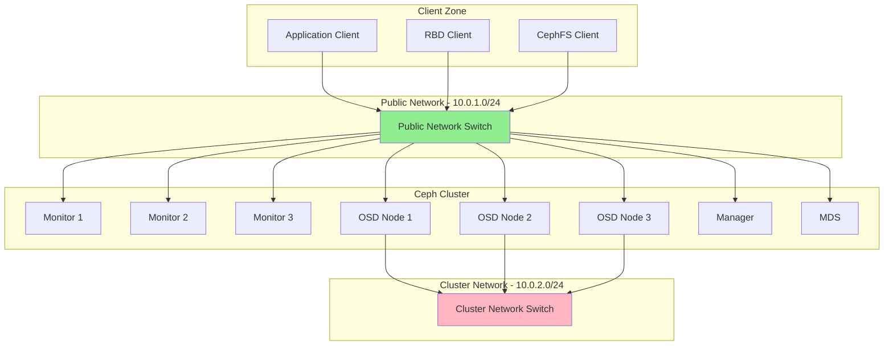
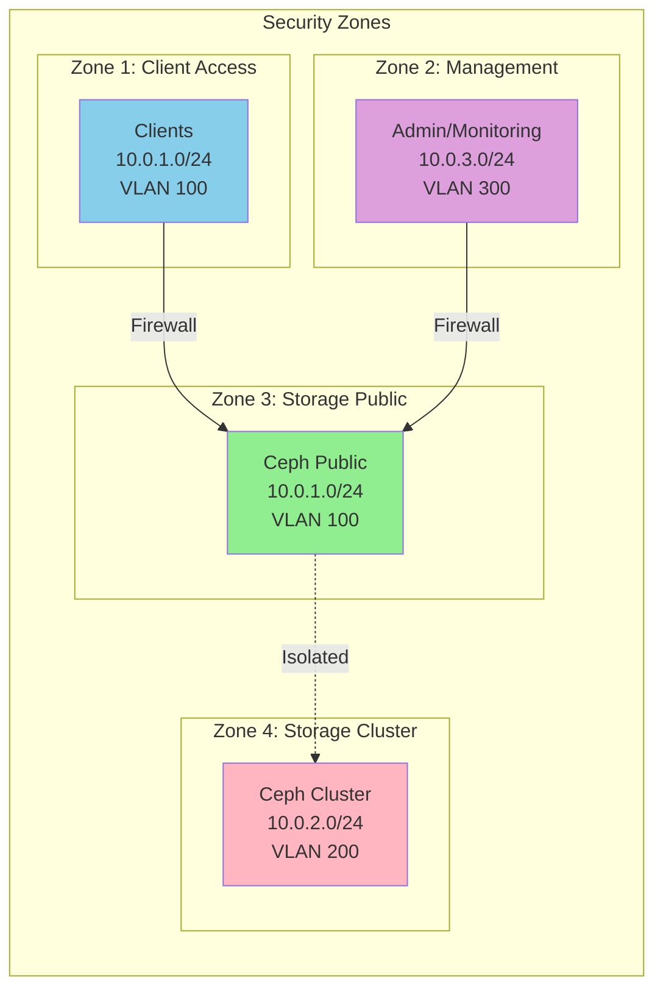
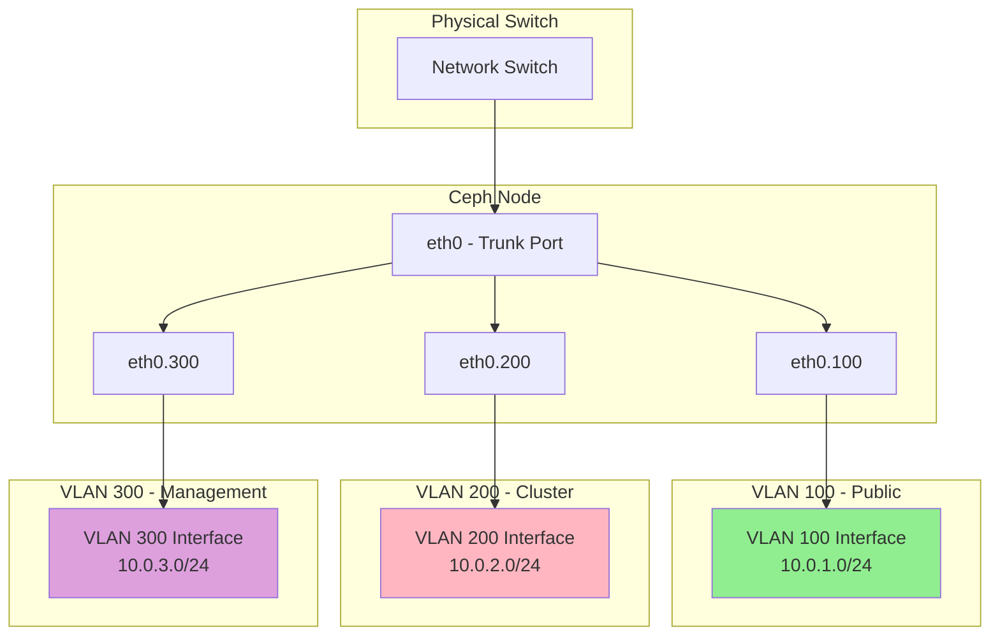
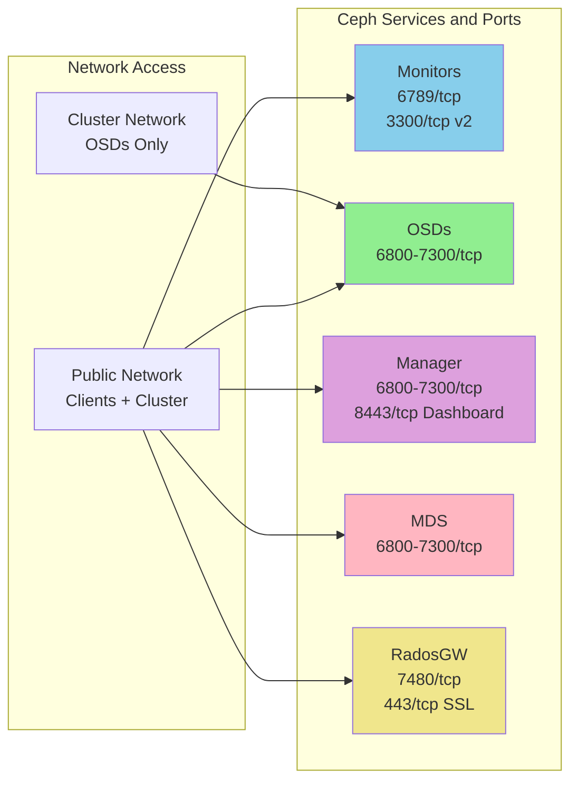
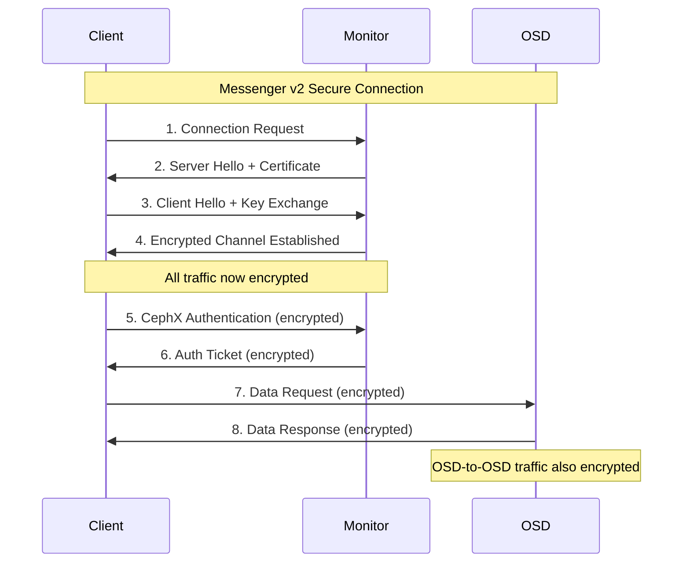

# How to Configure Ceph Network Segmentation for Security

Author: [nawazdhandala](https://github.com/nawazdhandala)

Tags: Ceph, Storage, Networking, Security, Infrastructure, Cloud Native

Description: Learn how to implement network segmentation in Ceph for improved security and performance.

---

## Introduction

Ceph is a powerful distributed storage system that handles petabytes of data across commodity hardware. However, with great power comes great responsibility - securing your Ceph cluster is paramount to protecting your data from unauthorized access and network-based attacks.

Network segmentation is one of the most effective security measures you can implement in a Ceph cluster. By separating client-facing traffic from internal cluster replication traffic, you create defense-in-depth architecture that limits the blast radius of potential security incidents.

In this comprehensive guide, we will cover:

- Public and cluster network separation concepts
- VLAN configuration for Ceph networks
- Firewall rules for securing Ceph ports
- Messenger v2 encryption for in-transit data protection
- Best practices for production deployments

## Understanding Ceph Network Architecture

Before diving into configuration, let us understand how Ceph uses networks. Ceph supports two distinct network types:

1. **Public Network**: Used for client-to-cluster communication (reads/writes) and monitor communication
2. **Cluster Network**: Used exclusively for OSD-to-OSD replication, recovery, and heartbeat traffic



## Prerequisites

Before configuring network segmentation, ensure you have:

- A Ceph cluster (Quincy or later recommended)
- Multiple network interfaces on each node
- Network switches with VLAN support (if using VLANs)
- Root or sudo access on all nodes
- Basic understanding of Linux networking

## Step 1: Planning Your Network Architecture

The following diagram illustrates a recommended network architecture for a secure Ceph deployment:



### Network Planning Table

| Network Type | VLAN ID | Subnet | Purpose | Required Ports |
|-------------|---------|--------|---------|----------------|
| Public | 100 | 10.0.1.0/24 | Client access, MON communication | 6789, 6800-7300 |
| Cluster | 200 | 10.0.2.0/24 | OSD replication, recovery | 6800-7300 |
| Management | 300 | 10.0.3.0/24 | SSH, monitoring, dashboard | 22, 8443, 3000 |

## Step 2: Configuring Network Interfaces

### Physical Interface Setup

First, identify the network interfaces on each node. Each Ceph node should have at least two physical interfaces - one for the public network and one for the cluster network.

```bash
# List all available network interfaces
# This command shows interface names, states, and basic information
ip link show

# Example output:
# 1: lo: <LOOPBACK,UP,LOWER_UP> mtu 65536
# 2: eth0: <BROADCAST,MULTICAST,UP,LOWER_UP> mtu 1500  (public network)
# 3: eth1: <BROADCAST,MULTICAST,UP,LOWER_UP> mtu 1500  (cluster network)
```

### Configure Network Interfaces Using Netplan (Ubuntu)

Create or modify the Netplan configuration file to define both public and cluster network interfaces with proper IP addressing.

```yaml
# /etc/netplan/01-ceph-network.yaml
# This configuration sets up dedicated interfaces for Ceph public and cluster networks
# Apply changes with: sudo netplan apply

network:
  version: 2
  renderer: networkd

  ethernets:
    # Public network interface - handles client traffic and monitor communication
    # This interface should be connected to the client-accessible network
    eth0:
      addresses:
        - 10.0.1.10/24       # Static IP for this node on public network
      routes:
        - to: default
          via: 10.0.1.1       # Default gateway for external connectivity
      nameservers:
        addresses:
          - 10.0.1.1          # DNS server for name resolution
      mtu: 9000               # Jumbo frames for better performance (optional)

    # Cluster network interface - handles OSD replication traffic only
    # This interface should be on an isolated network segment
    eth1:
      addresses:
        - 10.0.2.10/24       # Static IP for this node on cluster network
      mtu: 9000               # Jumbo frames recommended for replication traffic
      # Note: No default route - cluster network is isolated
```

### Configure Network Interfaces Using NetworkManager (RHEL/CentOS)

For RHEL-based systems, use nmcli to configure the network interfaces with proper security settings.

```bash
# Configure the public network interface
# This interface handles client connections and should have firewall rules applied
sudo nmcli connection add \
  con-name "ceph-public" \
  type ethernet \
  ifname eth0 \
  ipv4.addresses "10.0.1.10/24" \
  ipv4.gateway "10.0.1.1" \
  ipv4.dns "10.0.1.1" \
  ipv4.method manual \
  connection.autoconnect yes

# Configure the cluster network interface
# This interface is for OSD-to-OSD traffic only and should be completely isolated
sudo nmcli connection add \
  con-name "ceph-cluster" \
  type ethernet \
  ifname eth1 \
  ipv4.addresses "10.0.2.10/24" \
  ipv4.method manual \
  connection.autoconnect yes \
  ipv4.never-default yes  # Prevents this interface from becoming default route

# Activate both connections
sudo nmcli connection up ceph-public
sudo nmcli connection up ceph-cluster
```

## Step 3: VLAN Configuration for Ceph

VLANs provide Layer 2 isolation between network segments, adding an additional security boundary. This section covers setting up VLAN interfaces for Ceph.

### VLAN Architecture Diagram



### VLAN Configuration with Netplan (Ubuntu)

This configuration creates VLAN interfaces on a single physical trunk port, providing logical separation for different traffic types.

```yaml
# /etc/netplan/02-ceph-vlans.yaml
# VLAN configuration for Ceph network segmentation
# Requires 802.1Q VLAN tagging support on the physical switch

network:
  version: 2
  renderer: networkd

  ethernets:
    # Physical interface configured as trunk port
    # This interface carries all VLAN-tagged traffic
    eth0:
      # No IP address on the physical interface itself
      # All addressing is done on VLAN sub-interfaces
      mtu: 9000

  vlans:
    # VLAN 100: Public network for client access
    # Clients connect to Ceph services through this VLAN
    eth0.100:
      id: 100                    # VLAN ID matching switch configuration
      link: eth0                 # Parent physical interface
      addresses:
        - 10.0.1.10/24          # Node's public network IP
      routes:
        - to: default
          via: 10.0.1.1         # Gateway for external connectivity
      mtu: 9000

    # VLAN 200: Cluster network for OSD replication
    # Completely isolated - no routing to other networks
    eth0.200:
      id: 200                    # VLAN ID for cluster traffic
      link: eth0
      addresses:
        - 10.0.2.10/24          # Node's cluster network IP
      mtu: 9000
      # No routes defined - keeps cluster traffic isolated

    # VLAN 300: Management network for administrative access
    # Used for SSH, monitoring dashboards, and management tools
    eth0.300:
      id: 300                    # VLAN ID for management traffic
      link: eth0
      addresses:
        - 10.0.3.10/24          # Node's management network IP
      mtu: 1500                  # Standard MTU for management traffic
```

### VLAN Configuration with NetworkManager (RHEL/CentOS)

Configure VLAN interfaces using nmcli for RHEL-based distributions.

```bash
# Create VLAN 100 for public network
# This VLAN handles all client-facing Ceph traffic
sudo nmcli connection add \
  con-name "ceph-public-vlan" \
  type vlan \
  dev eth0 \
  id 100 \
  ipv4.addresses "10.0.1.10/24" \
  ipv4.gateway "10.0.1.1" \
  ipv4.method manual

# Create VLAN 200 for cluster network
# This VLAN is isolated and handles only OSD replication traffic
sudo nmcli connection add \
  con-name "ceph-cluster-vlan" \
  type vlan \
  dev eth0 \
  id 200 \
  ipv4.addresses "10.0.2.10/24" \
  ipv4.method manual \
  ipv4.never-default yes  # Ensures no default route through cluster network

# Create VLAN 300 for management network
# Administrative access and monitoring traffic
sudo nmcli connection add \
  con-name "ceph-mgmt-vlan" \
  type vlan \
  dev eth0 \
  id 300 \
  ipv4.addresses "10.0.3.10/24" \
  ipv4.method manual

# Activate all VLAN interfaces
sudo nmcli connection up ceph-public-vlan
sudo nmcli connection up ceph-cluster-vlan
sudo nmcli connection up ceph-mgmt-vlan
```

### Switch Configuration (Cisco Example)

Configure the switch port connected to Ceph nodes as a trunk port to carry multiple VLANs.

```cisco
! Configure the interface connected to a Ceph node as a trunk port
! This allows multiple VLANs to pass through a single physical connection
interface GigabitEthernet0/1
  description Ceph Node 1 Trunk Port
  switchport mode trunk
  ! Only allow required VLANs for security - deny all others
  switchport trunk allowed vlan 100,200,300
  ! Set native VLAN to unused VLAN for security (prevents VLAN hopping)
  switchport trunk native vlan 999
  ! Enable spanning-tree portfast for faster convergence
  spanning-tree portfast trunk
  ! Enable BPDU guard for additional security
  spanning-tree bpduguard enable
  no shutdown

! Create the VLANs if they don't exist
vlan 100
  name Ceph-Public
vlan 200
  name Ceph-Cluster
vlan 300
  name Ceph-Management
vlan 999
  name Native-Unused
```

## Step 4: Configuring Ceph for Network Segmentation

Now configure Ceph to use the separate networks. This is done through the Ceph configuration file.

### Ceph Configuration File

This configuration file tells Ceph daemons which networks to use for different types of traffic.

```ini
# /etc/ceph/ceph.conf
# Main Ceph configuration file with network segmentation settings

[global]
    # Cluster identification
    fsid = a1b2c3d4-e5f6-7890-abcd-ef1234567890

    # Monitor configuration
    # Monitors should be accessible on the public network
    mon_host = 10.0.1.11:6789,10.0.1.12:6789,10.0.1.13:6789

    # PUBLIC NETWORK CONFIGURATION
    # This network is used for:
    # - Client-to-cluster communication (RADOS, RBD, CephFS)
    # - Monitor-to-monitor communication
    # - Client authentication
    public_network = 10.0.1.0/24

    # CLUSTER NETWORK CONFIGURATION
    # This network is used exclusively for:
    # - OSD-to-OSD data replication
    # - Recovery and backfill operations
    # - OSD heartbeat traffic
    # Setting this separates replication traffic from client traffic
    cluster_network = 10.0.2.0/24

    # Authentication settings
    auth_cluster_required = cephx
    auth_service_required = cephx
    auth_client_required = cephx

    # Enable Messenger v2 protocol for enhanced security (see Step 6)
    ms_bind_msgr2 = true
    ms_bind_msgr1 = false  # Disable legacy protocol

[mon]
    # Monitor-specific settings
    # Monitors only need the public network
    mon_allow_pool_delete = false  # Safety setting

    # Bind monitors to specific IP on public network
    # Replace with actual monitor IPs
    public_addr = 10.0.1.11

[osd]
    # OSD-specific settings
    # OSDs use both public and cluster networks

    # OSD journal settings
    osd_journal_size = 10240

    # Recovery settings - limit bandwidth to prevent network saturation
    osd_recovery_max_active = 3
    osd_max_backfills = 1

    # Heartbeat settings for cluster network
    osd_heartbeat_grace = 20
    osd_heartbeat_interval = 6

[mgr]
    # Manager daemon settings
    # Managers bind to the public network for dashboard access
    mgr_modules = dashboard,prometheus

[mds]
    # Metadata Server settings for CephFS
    # MDS uses public network for client communication
    mds_cache_memory_limit = 4294967296  # 4GB cache
```

### Apply Configuration to Running Cluster

After modifying the configuration, apply it to the running cluster daemons.

```bash
# Distribute the updated configuration to all nodes
# This command pushes the config from the admin node to all cluster members
sudo ceph-deploy --overwrite-conf config push node1 node2 node3

# Alternatively, if using cephadm (recommended for newer deployments)
# This applies the configuration through the orchestrator
sudo ceph config assimilate-conf -i /etc/ceph/ceph.conf

# Verify the network configuration is applied correctly
# Check public network setting
sudo ceph config get mon public_network

# Check cluster network setting
sudo ceph config get osd cluster_network

# Verify OSDs are using correct networks
# This shows the addresses each OSD is bound to
sudo ceph osd dump | grep -E "osd\.[0-9]+"
```

### Verify Network Binding

Confirm that daemons are listening on the correct network interfaces.

```bash
# Check which addresses the monitors are listening on
# Should show public network addresses (10.0.1.x)
sudo ss -tlnp | grep ceph-mon

# Check OSD listening addresses
# Should show both public (10.0.1.x) and cluster (10.0.2.x) addresses
sudo ss -tlnp | grep ceph-osd

# Verify cluster network is being used for replication
# This shows the OSD peering information including cluster addresses
sudo ceph osd find 0 | jq '.cluster_addr'
```

## Step 5: Firewall Configuration for Ceph Security

Implementing firewall rules is essential for restricting access to Ceph services. This section covers comprehensive firewall configurations using both iptables and firewalld.

### Ceph Port Reference



### Firewall Rules with iptables

Create comprehensive iptables rules for Ceph network security.

```bash
#!/bin/bash
# /usr/local/bin/ceph-firewall-setup.sh
# Ceph firewall configuration script using iptables
# Run this script on each Ceph node

# Define network variables for easier management
PUBLIC_NET="10.0.1.0/24"
CLUSTER_NET="10.0.2.0/24"
MGMT_NET="10.0.3.0/24"
PUBLIC_IF="eth0.100"
CLUSTER_IF="eth0.200"

# Clear existing rules to start fresh
# WARNING: This will temporarily disrupt network connections
iptables -F
iptables -X

# Set default policies - deny all incoming, allow outgoing
# This creates a secure baseline
iptables -P INPUT DROP
iptables -P FORWARD DROP
iptables -P OUTPUT ACCEPT

# Allow loopback traffic (required for local service communication)
iptables -A INPUT -i lo -j ACCEPT

# Allow established and related connections
# This ensures responses to outgoing connections are permitted
iptables -A INPUT -m state --state ESTABLISHED,RELATED -j ACCEPT

# ============================================
# PUBLIC NETWORK RULES (Client-facing)
# ============================================

# Allow Ceph Monitor traffic on public network only
# Port 6789: Legacy Messenger v1 protocol (if still needed)
# Port 3300: Messenger v2 protocol (recommended)
iptables -A INPUT -i $PUBLIC_IF -p tcp -s $PUBLIC_NET --dport 6789 -j ACCEPT
iptables -A INPUT -i $PUBLIC_IF -p tcp -s $PUBLIC_NET --dport 3300 -j ACCEPT

# Allow OSD client connections on public network
# Port range 6800-7300 is used by OSDs for client communication
iptables -A INPUT -i $PUBLIC_IF -p tcp -s $PUBLIC_NET --dport 6800:7300 -j ACCEPT

# Allow Ceph Manager Dashboard access
# Restrict to management network for security
iptables -A INPUT -i $PUBLIC_IF -p tcp -s $MGMT_NET --dport 8443 -j ACCEPT
iptables -A INPUT -i $PUBLIC_IF -p tcp -s $MGMT_NET --dport 9283 -j ACCEPT  # Prometheus

# Allow RadosGW (Object Gateway) access if deployed
# Port 7480: Default RadosGW port
# Port 443: HTTPS access
iptables -A INPUT -i $PUBLIC_IF -p tcp -s $PUBLIC_NET --dport 7480 -j ACCEPT
iptables -A INPUT -i $PUBLIC_IF -p tcp -s $PUBLIC_NET --dport 443 -j ACCEPT

# ============================================
# CLUSTER NETWORK RULES (Replication traffic)
# ============================================

# Allow all OSD traffic on cluster network
# This includes replication, recovery, and heartbeat traffic
iptables -A INPUT -i $CLUSTER_IF -p tcp -s $CLUSTER_NET --dport 6800:7300 -j ACCEPT

# Allow OSD heartbeat traffic (uses same port range)
# Heartbeats are critical for cluster health detection
iptables -A INPUT -i $CLUSTER_IF -p tcp -s $CLUSTER_NET -j ACCEPT

# ============================================
# MANAGEMENT NETWORK RULES
# ============================================

# Allow SSH access from management network only
# This restricts administrative access to authorized networks
iptables -A INPUT -p tcp -s $MGMT_NET --dport 22 -j ACCEPT

# Allow ICMP (ping) from management network for monitoring
iptables -A INPUT -p icmp -s $MGMT_NET -j ACCEPT

# ============================================
# LOGGING AND DEFAULT DROP
# ============================================

# Log dropped packets for security monitoring
# Logs go to /var/log/messages or /var/log/syslog
iptables -A INPUT -j LOG --log-prefix "CEPH-DROPPED: " --log-level 4

# Final rule: drop everything else (explicit for clarity)
iptables -A INPUT -j DROP

# Save the rules to persist across reboots
# For Debian/Ubuntu:
iptables-save > /etc/iptables/rules.v4

# For RHEL/CentOS:
# service iptables save
```

### Firewall Rules with firewalld (RHEL/CentOS)

For systems using firewalld, create custom zones for Ceph network segmentation.

```bash
#!/bin/bash
# /usr/local/bin/ceph-firewalld-setup.sh
# Ceph firewall configuration using firewalld zones
# Run this script on each Ceph node

# Create custom zone for Ceph public network
# This zone allows client access to Ceph services
firewall-cmd --permanent --new-zone=ceph-public

# Create custom zone for Ceph cluster network
# This zone is restricted to OSD replication traffic only
firewall-cmd --permanent --new-zone=ceph-cluster

# Create custom zone for management access
# Restricted administrative access
firewall-cmd --permanent --new-zone=ceph-mgmt

# Reload to apply new zones
firewall-cmd --reload

# ============================================
# Configure Ceph Public Zone
# ============================================

# Add Ceph monitor ports to public zone
# Port 6789: Messenger v1 (legacy)
# Port 3300: Messenger v2 (secure)
firewall-cmd --permanent --zone=ceph-public --add-port=6789/tcp
firewall-cmd --permanent --zone=ceph-public --add-port=3300/tcp

# Add OSD port range for client connections
firewall-cmd --permanent --zone=ceph-public --add-port=6800-7300/tcp

# Add RadosGW ports if using object storage
firewall-cmd --permanent --zone=ceph-public --add-port=7480/tcp
firewall-cmd --permanent --zone=ceph-public --add-port=443/tcp

# Define the source network for public zone
firewall-cmd --permanent --zone=ceph-public --add-source=10.0.1.0/24

# ============================================
# Configure Ceph Cluster Zone
# ============================================

# Add OSD replication port range
# All OSD-to-OSD communication uses this range
firewall-cmd --permanent --zone=ceph-cluster --add-port=6800-7300/tcp

# Define the source network for cluster zone
# Only cluster network IPs can access these ports
firewall-cmd --permanent --zone=ceph-cluster --add-source=10.0.2.0/24

# ============================================
# Configure Management Zone
# ============================================

# Allow SSH for administrative access
firewall-cmd --permanent --zone=ceph-mgmt --add-service=ssh

# Allow Ceph Dashboard access
firewall-cmd --permanent --zone=ceph-mgmt --add-port=8443/tcp

# Allow Prometheus metrics endpoint
firewall-cmd --permanent --zone=ceph-mgmt --add-port=9283/tcp

# Define the source network for management zone
firewall-cmd --permanent --zone=ceph-mgmt --add-source=10.0.3.0/24

# ============================================
# Assign Interfaces to Zones
# ============================================

# Assign public interface to ceph-public zone
firewall-cmd --permanent --zone=ceph-public --add-interface=eth0.100

# Assign cluster interface to ceph-cluster zone
firewall-cmd --permanent --zone=ceph-cluster --add-interface=eth0.200

# Assign management interface to ceph-mgmt zone
firewall-cmd --permanent --zone=ceph-mgmt --add-interface=eth0.300

# Apply all changes
firewall-cmd --reload

# Verify configuration
echo "=== Zone Configuration ==="
firewall-cmd --list-all-zones | grep -A 20 "ceph-"
```

### nftables Configuration (Modern Alternative)

For newer Linux distributions, nftables provides a more efficient firewall framework.

```bash
#!/usr/sbin/nft -f
# /etc/nftables.d/ceph.nft
# Ceph firewall rules using nftables
# Include this file in main nftables.conf

# Define variables for network addresses
define PUBLIC_NET = 10.0.1.0/24
define CLUSTER_NET = 10.0.2.0/24
define MGMT_NET = 10.0.3.0/24

# Create a table for Ceph firewall rules
table inet ceph_firewall {

    # Chain for incoming traffic
    chain input {
        # Set as filter chain with default drop policy
        type filter hook input priority 0; policy drop;

        # Allow established and related connections
        ct state established,related accept

        # Allow loopback traffic
        iif "lo" accept

        # ============================================
        # Public Network Rules
        # ============================================

        # Ceph Monitor ports - allow from public network
        # These ports handle monitor communication and client authentication
        ip saddr $PUBLIC_NET tcp dport { 6789, 3300 } accept

        # OSD ports for client access - allow from public network
        ip saddr $PUBLIC_NET tcp dport 6800-7300 accept

        # RadosGW ports - allow from public network
        ip saddr $PUBLIC_NET tcp dport { 443, 7480 } accept

        # ============================================
        # Cluster Network Rules
        # ============================================

        # OSD replication traffic - cluster network only
        ip saddr $CLUSTER_NET tcp dport 6800-7300 accept

        # ============================================
        # Management Network Rules
        # ============================================

        # SSH access - management network only
        ip saddr $MGMT_NET tcp dport 22 accept

        # Dashboard and metrics - management network only
        ip saddr $MGMT_NET tcp dport { 8443, 9283 } accept

        # ICMP for monitoring
        ip saddr $MGMT_NET icmp type echo-request accept

        # ============================================
        # Logging and Counters
        # ============================================

        # Log dropped packets with rate limiting
        limit rate 5/minute log prefix "CEPH-DROP: " level warn

        # Counter for dropped packets
        counter drop
    }

    # Chain for forwarding (deny all)
    chain forward {
        type filter hook forward priority 0; policy drop;
    }
}
```

## Step 6: Messenger v2 Encryption Configuration

Ceph Messenger v2 protocol provides encryption and improved security for all Ceph network communication. This section covers enabling and configuring encryption.

### Messenger v2 Security Features



### Enable Messenger v2 Cluster-Wide

Configure Messenger v2 protocol for enhanced security across all Ceph daemons.

```bash
# Enable Messenger v2 on all monitors
# This sets the mon to use msgr2 protocol for all communication
sudo ceph config set mon ms_bind_msgr2 true

# Enable Messenger v2 on all OSDs
sudo ceph config set osd ms_bind_msgr2 true

# Enable Messenger v2 on all managers
sudo ceph config set mgr ms_bind_msgr2 true

# Enable Messenger v2 on all MDS (if using CephFS)
sudo ceph config set mds ms_bind_msgr2 true

# Optionally disable legacy Messenger v1 for security
# WARNING: Ensure all clients support msgr2 before disabling v1
sudo ceph config set global ms_bind_msgr1 false
```

### Configure Encryption Mode

Set the encryption mode for different network types.

```bash
# ============================================
# Cluster Network Encryption (OSD-to-OSD)
# ============================================

# Set cluster network to require encryption
# Options:
#   - "force" = require encryption (recommended for security)
#   - "secure" = prefer encryption, allow unencrypted
#   - "crc" = no encryption, only CRC checksums
#   - "none" = no encryption or checksums
sudo ceph config set osd ms_cluster_mode "secure crc"

# For maximum security, use "force" mode
# This ensures all replication traffic is encrypted
sudo ceph config set osd ms_cluster_mode "secure"

# ============================================
# Client Network Encryption (Client-to-OSD)
# ============================================

# Set service (public) network encryption mode
# This affects client connections to OSDs and monitors
sudo ceph config set global ms_service_mode "secure crc"

# Set client connection encryption requirements
sudo ceph config set global ms_client_mode "secure crc"

# ============================================
# Monitor Encryption Settings
# ============================================

# Require encryption for monitor-to-monitor traffic
sudo ceph config set mon ms_mon_cluster_mode "secure"

# Require encryption for monitor service port
sudo ceph config set mon ms_mon_service_mode "secure"

# ============================================
# Verify Encryption Configuration
# ============================================

# Check current encryption settings for all daemon types
sudo ceph config dump | grep ms_

# Verify monitors are using msgr2
sudo ceph mon dump | grep "msgr2"
```

### Ceph Configuration for Encryption

Add encryption settings directly to the Ceph configuration file for persistence.

```ini
# /etc/ceph/ceph.conf
# Messenger v2 encryption configuration section

[global]
    # Enable Messenger v2 protocol
    ms_bind_msgr2 = true

    # Disable legacy Messenger v1 (optional, for enhanced security)
    # Only disable after confirming all clients support msgr2
    ms_bind_msgr1 = false

    # Client connection encryption mode
    # "secure crc" provides encryption with fallback to CRC
    # "secure" requires encryption (no fallback)
    ms_client_mode = secure crc

    # Service (daemon) encryption mode
    ms_service_mode = secure crc

    # Compression for encrypted connections (optional)
    # Can improve performance for compressible data
    ms_compress_secure = true

[mon]
    # Monitor-specific encryption settings
    # Require encryption for monitor cluster communication
    ms_mon_cluster_mode = secure

    # Require encryption for monitor service connections
    ms_mon_service_mode = secure

[osd]
    # OSD-specific encryption settings
    # Cluster (replication) network encryption mode
    # "secure" ensures all OSD-to-OSD traffic is encrypted
    ms_cluster_mode = secure

    # Client-facing encryption mode
    ms_service_mode = secure crc

[mgr]
    # Manager daemon encryption settings
    ms_service_mode = secure

[mds]
    # MDS encryption settings for CephFS
    ms_service_mode = secure crc
```

### Verify Encryption is Active

Confirm that encryption is working correctly on all connections.

```bash
# Check the status of all Ceph daemons and their encryption state
sudo ceph status -f json-pretty | jq '.health'

# Verify monitor is advertising msgr2 addresses
# Look for "v2:" prefix in monitor addresses
sudo ceph mon dump

# Example output:
# 0: [v2:10.0.1.11:3300/0,v1:10.0.1.11:6789/0] mon.node1

# Check OSD connection status including encryption
# This shows detailed peer connection information
sudo ceph daemon osd.0 dump_ops_in_flight

# Verify encryption on specific connections
sudo ceph daemon osd.0 perf dump | grep -i encrypt

# Test client connection with encryption
# Create a test file and verify it works
echo "test" | sudo rados -p test-pool put testobj -
sudo rados -p test-pool get testobj -
```

## Step 7: Advanced Security Configurations

### Bind Address Restrictions

Restrict which addresses Ceph daemons bind to for additional security.

```ini
# /etc/ceph/ceph.conf
# Advanced bind address configuration

[mon.node1]
    # Bind monitor to specific public network IP only
    # This prevents the monitor from binding to other interfaces
    public_addr = 10.0.1.11

    # Specify the exact msgr2 address format
    # Format: v2:IP:PORT/NONCE
    mon_addr = [v2:10.0.1.11:3300/0,v1:10.0.1.11:6789/0]

[osd]
    # Bind OSDs to specific addresses on each network
    # Public network binding for client communication
    public_addr = 10.0.1.0/24

    # Cluster network binding for replication
    cluster_addr = 10.0.2.0/24

    # Disable binding to all interfaces (0.0.0.0)
    ms_bind_ipv4 = true
    ms_bind_ipv6 = false
```

### CephX Authentication Hardening

Strengthen CephX authentication for additional security.

```bash
# Ensure CephX is required for all authentication
# This prevents any unauthenticated access to the cluster
sudo ceph config set global auth_cluster_required cephx
sudo ceph config set global auth_service_required cephx
sudo ceph config set global auth_client_required cephx

# Set strict authentication mode
# Clients must authenticate before any operation
sudo ceph config set mon auth_supported cephx

# Configure key rotation interval (in seconds)
# Regular key rotation limits the impact of compromised keys
# 86400 seconds = 24 hours
sudo ceph config set global auth_mon_ticket_ttl 86400
sudo ceph config set global auth_service_ticket_ttl 3600

# Create capability-restricted users for different access patterns
# Read-only user for monitoring
sudo ceph auth get-or-create client.monitoring \
    mon 'allow r' \
    osd 'allow r pool=.mgr' \
    mgr 'allow r'

# Application-specific user with limited pool access
sudo ceph auth get-or-create client.webapp \
    mon 'allow r' \
    osd 'allow rw pool=webapp-data' \
    -o /etc/ceph/ceph.client.webapp.keyring
```

### Network Isolation Verification Script

Create a script to verify network segmentation is working correctly.

```bash
#!/bin/bash
# /usr/local/bin/verify-ceph-network-segmentation.sh
# Script to verify Ceph network segmentation is properly configured

echo "=== Ceph Network Segmentation Verification ==="
echo ""

# Define expected networks
PUBLIC_NET="10.0.1"
CLUSTER_NET="10.0.2"

# Function to check if OSD is using correct networks
check_osd_networks() {
    echo "Checking OSD network bindings..."

    for osd_id in $(ceph osd ls); do
        # Get OSD addresses
        osd_info=$(ceph osd find $osd_id 2>/dev/null)

        public_addr=$(echo "$osd_info" | jq -r '.public_addr' | cut -d':' -f1)
        cluster_addr=$(echo "$osd_info" | jq -r '.cluster_addr' | cut -d':' -f1)

        # Verify public address is on public network
        if [[ "$public_addr" == $PUBLIC_NET* ]]; then
            echo "[OK] OSD.$osd_id public address ($public_addr) is on public network"
        else
            echo "[FAIL] OSD.$osd_id public address ($public_addr) NOT on public network!"
        fi

        # Verify cluster address is on cluster network
        if [[ "$cluster_addr" == $CLUSTER_NET* ]]; then
            echo "[OK] OSD.$osd_id cluster address ($cluster_addr) is on cluster network"
        else
            echo "[FAIL] OSD.$osd_id cluster address ($cluster_addr) NOT on cluster network!"
        fi
    done
}

# Function to check monitor addresses
check_mon_networks() {
    echo ""
    echo "Checking Monitor network bindings..."

    ceph mon dump 2>/dev/null | grep "^[0-9]:" | while read line; do
        mon_name=$(echo "$line" | awk '{print $NF}')
        mon_addr=$(echo "$line" | grep -oP '\d+\.\d+\.\d+\.\d+' | head -1)

        if [[ "$mon_addr" == $PUBLIC_NET* ]]; then
            echo "[OK] Monitor $mon_name ($mon_addr) is on public network"
        else
            echo "[FAIL] Monitor $mon_name ($mon_addr) NOT on public network!"
        fi
    done
}

# Function to verify firewall rules
check_firewall() {
    echo ""
    echo "Checking firewall rules..."

    # Check if iptables or nftables is in use
    if command -v iptables &> /dev/null; then
        # Verify Ceph ports are properly restricted
        if iptables -L INPUT -n | grep -q "6789"; then
            echo "[OK] Monitor port 6789 has firewall rules"
        else
            echo "[WARN] Monitor port 6789 may not have specific firewall rules"
        fi

        if iptables -L INPUT -n | grep -q "6800:7300"; then
            echo "[OK] OSD port range has firewall rules"
        else
            echo "[WARN] OSD ports may not have specific firewall rules"
        fi
    fi
}

# Function to check encryption status
check_encryption() {
    echo ""
    echo "Checking Messenger v2 encryption status..."

    # Check if msgr2 is enabled
    msgr2_status=$(ceph config get mon ms_bind_msgr2 2>/dev/null)
    if [[ "$msgr2_status" == "true" ]]; then
        echo "[OK] Messenger v2 is enabled on monitors"
    else
        echo "[WARN] Messenger v2 may not be enabled on monitors"
    fi

    # Check encryption mode
    cluster_mode=$(ceph config get osd ms_cluster_mode 2>/dev/null)
    echo "[INFO] OSD cluster encryption mode: $cluster_mode"

    service_mode=$(ceph config get global ms_service_mode 2>/dev/null)
    echo "[INFO] Service encryption mode: $service_mode"
}

# Run all checks
check_osd_networks
check_mon_networks
check_firewall
check_encryption

echo ""
echo "=== Verification Complete ==="
```

## Step 8: Monitoring and Troubleshooting

### Network Performance Monitoring

Set up monitoring for Ceph network performance.

```bash
# Check network performance between OSDs
# This shows the latency and bandwidth between OSD pairs
sudo ceph osd perf

# Monitor OSD heartbeat status
# Heartbeats that fail may indicate network issues
sudo ceph osd tree

# Check for slow OSD operations that may indicate network problems
sudo ceph daemon osd.0 dump_historic_slow_ops

# Monitor Ceph network metrics with Prometheus
# The manager module exposes these metrics
sudo ceph mgr module enable prometheus

# Example Prometheus query for network bytes
# ceph_osd_op_r_out_bytes + ceph_osd_op_w_in_bytes
```

### Troubleshooting Network Connectivity

Debug network issues between Ceph daemons.

```bash
# Test connectivity between OSD nodes on cluster network
# Run from one OSD node to test reachability of another
ping -c 5 10.0.2.11

# Verify correct interface is being used for cluster traffic
# This shows routing for the cluster network
ip route get 10.0.2.11

# Check for network errors on interfaces
# High error counts indicate potential hardware or configuration issues
ip -s link show eth0.200

# Test OSD-to-OSD connectivity with rados bench
# This exercises the full data path including network
sudo rados bench -p test-pool 60 write --no-cleanup

# Check for dropped packets in firewall logs
sudo journalctl -k | grep "CEPH-DROP"

# Verify VLAN tagging is working correctly
# Should see VLAN-tagged packets on the interface
sudo tcpdump -i eth0 -e vlan

# Debug specific OSD connection issues
sudo ceph daemon osd.0 config show | grep ms_
```

### Common Issues and Solutions

```bash
# Issue: OSD not binding to cluster network
# Solution: Verify cluster_network is set correctly
sudo ceph config get osd cluster_network
# Should return: 10.0.2.0/24

# Issue: Monitors not accessible from clients
# Solution: Check public network configuration and firewall
sudo ss -tlnp | grep ceph-mon
sudo iptables -L -n | grep 6789

# Issue: Slow recovery/backfill operations
# Solution: Verify cluster network is being used and has sufficient bandwidth
sudo ceph osd pool stats | grep -A5 recovery

# Issue: CephX authentication failures
# Solution: Verify keyring files and permissions
sudo ceph auth list
ls -la /etc/ceph/*.keyring

# Issue: Encryption handshake failures
# Solution: Check msgr2 configuration and compatibility
sudo ceph config dump | grep ms_bind
sudo ceph daemon mon.node1 config show | grep ms_
```

## Best Practices Summary

1. **Always Use Separate Networks**: Use dedicated physical or VLAN-segregated networks for public and cluster traffic.

2. **Enable Encryption**: Configure Messenger v2 with encryption for all production deployments.

3. **Implement Defense in Depth**: Use VLANs, firewalls, and encryption together for layered security.

4. **Restrict Management Access**: Limit SSH and dashboard access to a dedicated management network.

5. **Monitor Network Performance**: Set up monitoring for network-related metrics and alerts.

6. **Regular Security Audits**: Periodically verify firewall rules and network segmentation.

7. **Document Your Configuration**: Maintain up-to-date documentation of network architecture and security settings.

8. **Use Jumbo Frames**: Enable jumbo frames (MTU 9000) on cluster networks for better replication performance.

9. **Plan for Growth**: Design network architecture that can scale with your cluster.

10. **Test Failover**: Regularly test network failover scenarios to ensure high availability.

## Conclusion

Network segmentation is a critical security measure for Ceph clusters. By separating public and cluster networks, implementing proper firewall rules, and enabling Messenger v2 encryption, you create a robust security posture that protects your data while maintaining optimal performance.

The configurations provided in this guide offer a strong foundation for securing your Ceph deployment. Remember to adapt these settings to your specific environment and regularly review your security configuration as your cluster evolves.

## References

- [Ceph Documentation - Network Configuration](https://docs.ceph.com/en/latest/rados/configuration/network-config-ref/)
- [Ceph Documentation - Messenger v2](https://docs.ceph.com/en/latest/rados/configuration/msgr2/)
- [Ceph Security Best Practices](https://docs.ceph.com/en/latest/rados/configuration/auth-config-ref/)
- [Linux VLAN Configuration](https://wiki.archlinux.org/title/VLAN)
- [nftables Documentation](https://wiki.nftables.org/)
