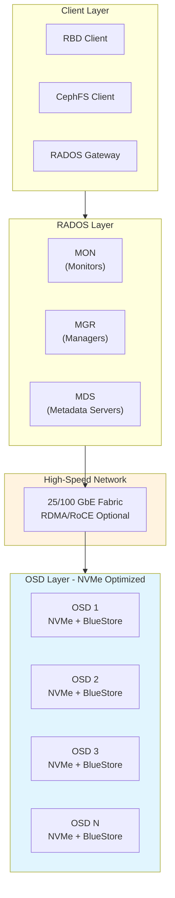
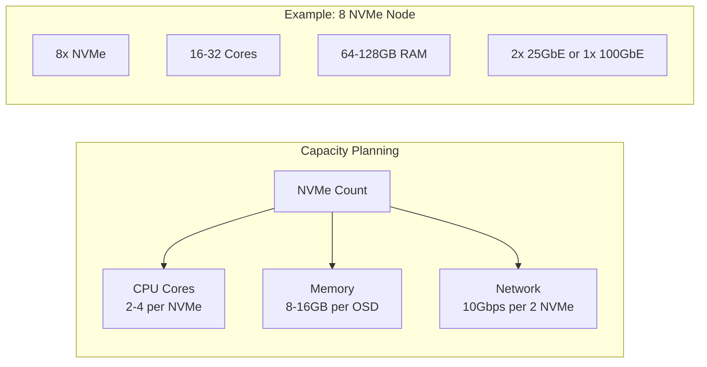
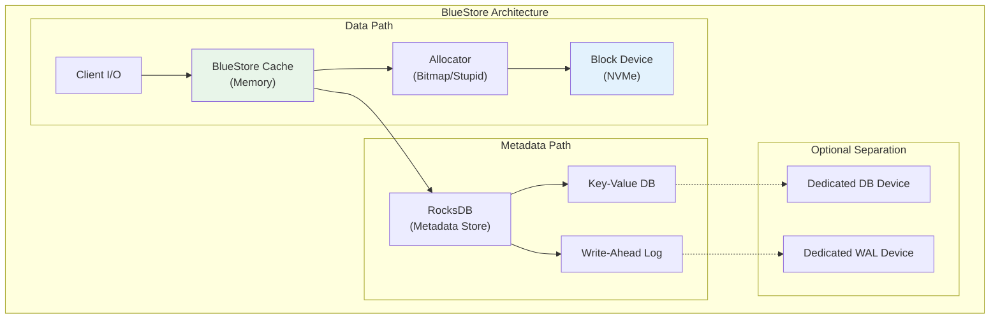
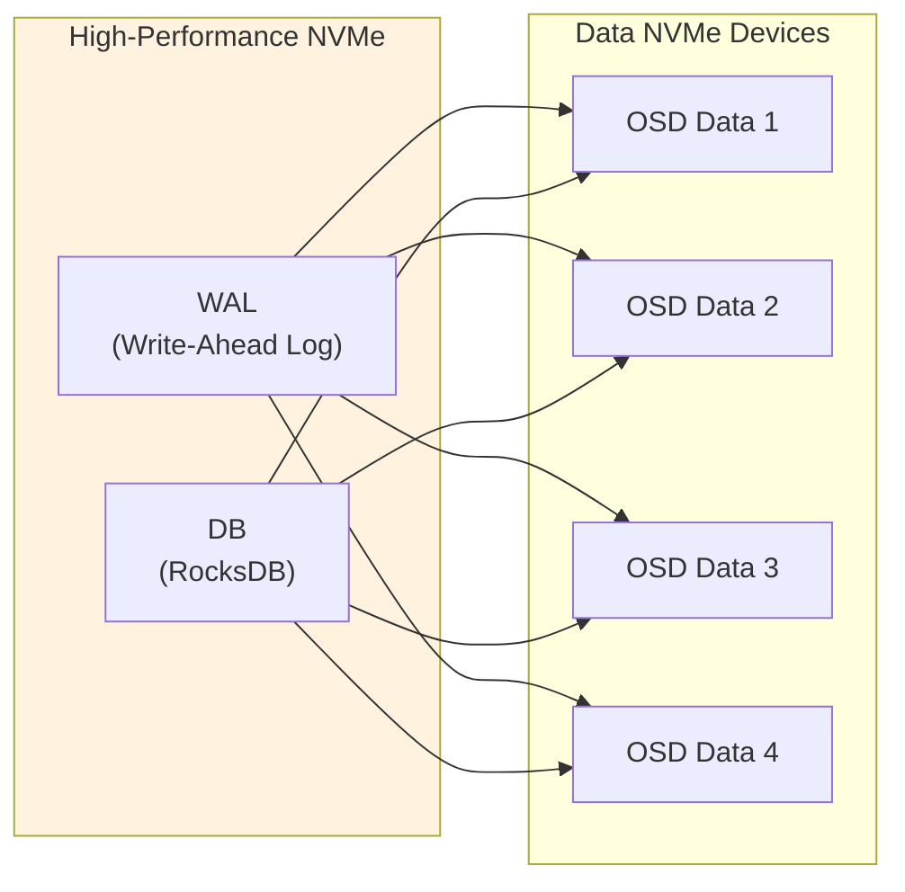
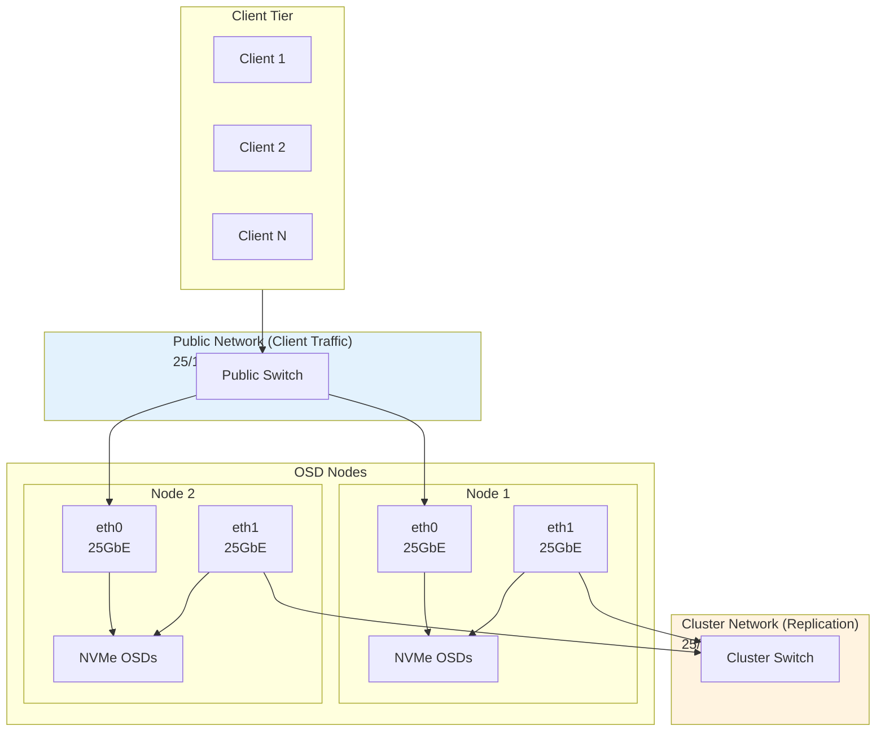
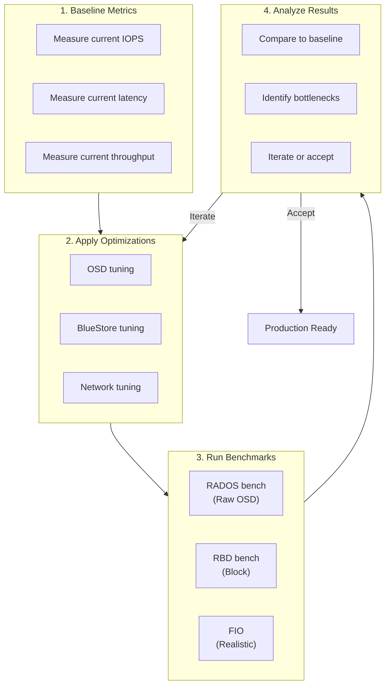

# How to Optimize Ceph Performance for NVMe Storage

Author: [nawazdhandala](https://github.com/nawazdhandala)

Tags: Ceph, Storage, NVMe, Performance, Optimization, Cloud Native

Description: Learn how to tune Ceph for maximum performance on NVMe-based storage systems.

---

NVMe (Non-Volatile Memory Express) storage devices offer dramatically higher performance than traditional SSDs, with lower latency and higher throughput. However, to fully leverage NVMe capabilities in Ceph, you need specific optimizations that differ significantly from HDD or SATA SSD configurations. This comprehensive guide covers everything you need to know to maximize Ceph performance on NVMe storage.

## Table of Contents

1. [Understanding NVMe and Ceph Architecture](#understanding-nvme-and-ceph-architecture)
2. [Pre-Deployment Planning](#pre-deployment-planning)
3. [NVMe-Specific OSD Configuration](#nvme-specific-osd-configuration)
4. [BlueStore Tuning for NVMe](#bluestore-tuning-for-nvme)
5. [Network Configuration for High-Speed Storage](#network-configuration-for-high-speed-storage)
6. [CPU and Memory Optimization](#cpu-and-memory-optimization)
7. [CRUSH Map Optimization](#crush-map-optimization)
8. [Benchmarking and Validation](#benchmarking-and-validation)
9. [Monitoring and Continuous Optimization](#monitoring-and-continuous-optimization)
10. [Troubleshooting Common Issues](#troubleshooting-common-issues)

## Understanding NVMe and Ceph Architecture

Before diving into optimization, it is essential to understand how NVMe storage interacts with Ceph's architecture and why traditional configurations may bottleneck NVMe performance.



### Why NVMe Requires Special Optimization

NVMe devices can deliver:
- **Latency**: Sub-100 microsecond response times (vs. milliseconds for HDDs)
- **IOPS**: 500K+ IOPS per device (vs. 200 for HDDs)
- **Throughput**: 3-7 GB/s per device (vs. 200 MB/s for HDDs)

Traditional Ceph configurations designed for HDDs will severely bottleneck NVMe performance due to:
- Insufficient thread counts
- Suboptimal queue depths
- Network becoming the bottleneck
- CPU becoming the bottleneck instead of storage

## Pre-Deployment Planning

### Hardware Requirements Assessment

Before configuring Ceph, evaluate your hardware to ensure it can support NVMe performance.

The following script audits your system for NVMe readiness, checking CPU cores, memory, network speed, and NVMe device capabilities:

```bash
#!/bin/bash
# NVMe Ceph Readiness Audit Script
# This script checks if your system is ready for high-performance NVMe Ceph deployment

echo "=== Ceph NVMe Readiness Audit ==="
echo ""

# Check CPU cores - NVMe requires adequate CPU resources
# Recommendation: At least 2 cores per NVMe OSD
echo "--- CPU Information ---"
CPU_CORES=$(nproc)
echo "Total CPU cores: $CPU_CORES"
if [ $CPU_CORES -lt 8 ]; then
    echo "WARNING: Less than 8 cores detected. NVMe performance may be CPU-bound."
fi

# Check memory - NVMe OSDs need more memory for caching
# Recommendation: At least 8GB per OSD, 16GB preferred for large clusters
echo ""
echo "--- Memory Information ---"
TOTAL_MEM=$(free -g | awk '/^Mem:/{print $2}')
echo "Total Memory: ${TOTAL_MEM}GB"
if [ $TOTAL_MEM -lt 32 ]; then
    echo "WARNING: Less than 32GB RAM. Consider adding more memory for optimal NVMe performance."
fi

# Check NVMe devices and their capabilities
echo ""
echo "--- NVMe Devices ---"
for nvme in /dev/nvme*n1; do
    if [ -e "$nvme" ]; then
        echo "Device: $nvme"
        # Get NVMe controller information including queue depth support
        nvme id-ctrl $nvme 2>/dev/null | grep -E "(mn|sn|fr|mqes)" || echo "  Unable to query NVMe info (run as root)"
    fi
done

# Check network interfaces for high-speed connectivity
# NVMe clusters should use at least 25GbE, preferably 100GbE
echo ""
echo "--- Network Interfaces ---"
for iface in $(ls /sys/class/net/ | grep -v lo); do
    SPEED=$(cat /sys/class/net/$iface/speed 2>/dev/null || echo "unknown")
    echo "Interface: $iface - Speed: ${SPEED}Mbps"
    if [ "$SPEED" != "unknown" ] && [ $SPEED -lt 25000 ]; then
        echo "  WARNING: Interface speed below 25Gbps may bottleneck NVMe performance"
    fi
done

# Check for NUMA topology - important for NVMe locality
echo ""
echo "--- NUMA Topology ---"
if command -v numactl &> /dev/null; then
    numactl --hardware
else
    echo "numactl not installed. Install with: apt install numactl"
fi

# Check kernel version for NVMe optimizations
echo ""
echo "--- Kernel Version ---"
KERNEL=$(uname -r)
echo "Kernel: $KERNEL"
echo "Recommendation: Use kernel 5.4+ for best NVMe multipath and performance"
```

### Capacity Planning

Understanding the relationship between NVMe count and supporting infrastructure is crucial.

This diagram shows how many CPU cores and network bandwidth you need based on the number of NVMe devices:



## NVMe-Specific OSD Configuration

### Creating NVMe OSDs with Optimal Settings

When creating OSDs on NVMe devices, use specific options to maximize performance.

The following command creates an OSD with BlueStore, which is optimized for flash storage. The crush-device-class parameter ensures proper CRUSH placement:

```bash
# Create an OSD on NVMe with BlueStore (recommended for all flash deployments)
# The --crush-device-class nvme flag creates a separate device class for NVMe
# This allows you to create pools that exclusively use NVMe storage
ceph-volume lvm create \
    --bluestore \
    --data /dev/nvme0n1 \
    --crush-device-class nvme
```

### OSD Configuration File

Create an optimized OSD configuration for NVMe devices. These settings significantly differ from HDD defaults.

This configuration file contains NVMe-specific tuning parameters. Save it as /etc/ceph/ceph.conf:

```ini
[global]
# Cluster identification
fsid = your-cluster-fsid
mon_initial_members = mon1, mon2, mon3
mon_host = 10.0.0.1, 10.0.0.2, 10.0.0.3

# Authentication settings
auth_cluster_required = cephx
auth_service_required = cephx
auth_client_required = cephx

# Public and cluster networks
# Use separate networks for client and replication traffic
public_network = 10.0.0.0/24
cluster_network = 10.1.0.0/24

# Increase default thread pool size for NVMe
# NVMe devices can handle many more concurrent operations
osd_op_num_threads_per_shard_hdd = 1
osd_op_num_threads_per_shard_ssd = 2

# Enable msgr2 protocol for better performance
ms_bind_msgr2 = true

[osd]
# BlueStore is required for NVMe optimization
osd_objectstore = bluestore

# Increase the number of OSD shards
# Each shard handles a portion of PGs independently
# For NVMe, use more shards to parallelize I/O
# Formula: number of shards = number of CPU cores / number of OSDs on node
osd_op_num_shards = 8
osd_op_num_shards_hdd = 5
osd_op_num_shards_ssd = 8

# Recovery and backfill settings optimized for NVMe
# NVMe can handle more concurrent recovery operations
osd_recovery_max_active = 10
osd_recovery_max_active_hdd = 3
osd_recovery_max_active_ssd = 10

# Max backfills - how many PGs can be backfilled simultaneously
osd_max_backfills = 4

# Recovery priority and throttling
# Higher sleep values slow recovery to reduce impact on client I/O
osd_recovery_sleep = 0
osd_recovery_sleep_hdd = 0.1
osd_recovery_sleep_ssd = 0

# Scrub settings - background integrity checking
# NVMe can handle more aggressive scrubbing
osd_scrub_sleep = 0
osd_scrub_chunk_min = 5
osd_scrub_chunk_max = 25

# Deep scrub settings
osd_deep_scrub_interval = 604800  # Weekly deep scrub
osd_scrub_interval_randomize_ratio = 0.5

# Memory target for BlueStore cache
# This is critical for NVMe performance
# Allocate 4-8GB per OSD depending on available memory
bluestore_cache_size_hdd = 1073741824     # 1GB for HDD
bluestore_cache_size_ssd = 4294967296     # 4GB for SSD/NVMe

# Increase the rocksdb cache for metadata
# NVMe benefits from larger metadata caches
bluestore_rocksdb_options = compression=kNoCompression,max_write_buffer_number=4,min_write_buffer_number_to_merge=1,recycle_log_file_num=4,write_buffer_size=268435456,writable_file_max_buffer_size=0,compaction_readahead_size=2097152

# Async messenger settings for high throughput
ms_async_op_threads = 5
ms_async_max_op_threads = 10

# Increase PG log size for better recovery
osd_min_pg_log_entries = 3000
osd_max_pg_log_entries = 10000
osd_pg_log_dups_tracked = 10000
```

### Per-OSD Thread Tuning

For systems with many NVMe devices, tune thread counts based on your CPU topology.

This script calculates optimal thread settings based on your CPU and NVMe count:

```bash
#!/bin/bash
# Calculate optimal OSD thread settings based on system resources
# This script helps determine the right thread count for your NVMe deployment

# Count physical CPU cores (not hyperthreads)
PHYSICAL_CORES=$(lscpu | grep "Core(s) per socket" | awk '{print $4}')
SOCKETS=$(lscpu | grep "Socket(s)" | awk '{print $2}')
TOTAL_CORES=$((PHYSICAL_CORES * SOCKETS))

# Count NVMe devices
NVME_COUNT=$(ls /dev/nvme*n1 2>/dev/null | wc -l)

if [ $NVME_COUNT -eq 0 ]; then
    echo "No NVMe devices found"
    exit 1
fi

# Calculate cores per OSD
CORES_PER_OSD=$((TOTAL_CORES / NVME_COUNT))

# Recommended shard count is cores_per_osd, minimum 4, maximum 12
if [ $CORES_PER_OSD -lt 4 ]; then
    SHARDS=4
elif [ $CORES_PER_OSD -gt 12 ]; then
    SHARDS=12
else
    SHARDS=$CORES_PER_OSD
fi

echo "System Analysis:"
echo "  Physical cores: $TOTAL_CORES"
echo "  NVMe devices: $NVME_COUNT"
echo "  Cores per OSD: $CORES_PER_OSD"
echo ""
echo "Recommended OSD settings:"
echo "  osd_op_num_shards_ssd = $SHARDS"
echo "  osd_op_num_threads_per_shard_ssd = 2"
echo ""
echo "Add these to [osd] section in /etc/ceph/ceph.conf"
```

## BlueStore Tuning for NVMe

BlueStore is Ceph's modern storage backend designed for flash storage. Proper tuning is essential for NVMe performance.

### BlueStore Architecture

Understanding BlueStore's internal structure helps optimize its configuration.



### BlueStore Cache Configuration

The BlueStore cache is crucial for NVMe performance. Configure it based on available memory.

These settings optimize BlueStore's caching behavior for NVMe workloads. Add them to the [osd] section:

```ini
[osd]
# Total cache memory target per OSD
# For NVMe, allocate 4-8GB depending on workload
# This memory is used for caching data and metadata
bluestore_cache_size = 4294967296  # 4GB

# Cache memory ratios
# Adjust based on workload: more kv for metadata-heavy, more data for large objects
bluestore_cache_meta_ratio = 0.4   # 40% for metadata
bluestore_cache_kv_ratio = 0.4     # 40% for RocksDB key-value
bluestore_cache_data_ratio = 0.2   # 20% for object data

# Alternatively, use automatic sizing based on OSD memory target
# This is the recommended approach for modern Ceph versions
osd_memory_target = 8589934592     # 8GB total OSD memory target
osd_memory_base = 805306368        # 768MB base memory
osd_memory_cache_min = 1073741824  # 1GB minimum cache

# Cache trimming behavior
bluestore_cache_trim_interval = 0.05     # Trim every 50ms
bluestore_cache_trim_max_skip_pinned = 1000

# Dirty data thresholds
# These control when data is flushed to disk
bluestore_throttle_bytes = 67108864      # 64MB
bluestore_throttle_deferred_bytes = 134217728  # 128MB
bluestore_throttle_cost_per_io = 0
bluestore_throttle_cost_per_io_hdd = 670000
bluestore_throttle_cost_per_io_ssd = 4000
```

### RocksDB Optimization for NVMe

RocksDB handles BlueStore's metadata. Optimize it for NVMe's low latency.

These RocksDB settings reduce write amplification and improve metadata performance:

```ini
[osd]
# RocksDB configuration optimized for NVMe
# Disable compression - NVMe is fast enough that CPU overhead isn't worth it
# Increase buffer sizes to batch more writes
bluestore_rocksdb_options = \
    compression=kNoCompression,\
    max_write_buffer_number=4,\
    min_write_buffer_number_to_merge=1,\
    recycle_log_file_num=4,\
    write_buffer_size=268435456,\
    writable_file_max_buffer_size=0,\
    compaction_readahead_size=2097152,\
    max_background_compactions=4,\
    max_background_flushes=4

# Block cache for RocksDB reads
# Larger values improve metadata read performance
bluestore_rocksdb_cf = true
bluestore_block_size = 65536             # 64KB blocks for NVMe
bluestore_min_alloc_size_ssd = 4096      # 4KB minimum allocation
```

### Dedicated WAL and DB Devices

For the highest performance, separate WAL and DB onto faster NVMe devices.

This diagram shows the optimal layout when using dedicated devices for WAL and DB:



The following commands create OSDs with dedicated WAL and DB devices. The high-endurance NVMe handles metadata operations:

```bash
# Create an OSD with dedicated WAL and DB on a separate NVMe
# The WAL device handles write-ahead logging (write-intensive)
# The DB device stores RocksDB metadata
# Both benefit from the lowest-latency NVMe available

# First, create volume groups for the DB/WAL device
# This allows multiple OSDs to share the fast device
vgcreate ceph-db-wal /dev/nvme0n1

# Create logical volumes for each OSD's WAL and DB
# WAL size: 2-4GB is typically sufficient
# DB size: 4% of the data device size, minimum 30GB
lvcreate -L 2G -n osd1-wal ceph-db-wal
lvcreate -L 50G -n osd1-db ceph-db-wal

# Create the OSD with dedicated WAL and DB
# nvme1n1 is the data device, nvme0n1 provides WAL/DB
ceph-volume lvm create \
    --bluestore \
    --data /dev/nvme1n1 \
    --block.wal ceph-db-wal/osd1-wal \
    --block.db ceph-db-wal/osd1-db \
    --crush-device-class nvme
```

### BlueStore Allocator Selection

BlueStore supports different allocators. Choose based on your workload.

This configuration selects the appropriate allocator based on your use case:

```ini
[osd]
# Allocator selection for BlueStore
# 'bitmap' - Best for most workloads, good fragmentation resistance
# 'stupid' - Lower CPU overhead, suitable for sequential workloads
# 'avl'    - Legacy allocator, not recommended for NVMe

# For mixed workloads (recommended for most NVMe deployments)
bluestore_allocator = bitmap

# For sequential workloads (large object storage, backup)
# bluestore_allocator = stupid

# Extent size affects allocation granularity
# Larger values reduce fragmentation but may waste space for small objects
bluestore_extent_map_shard_max_size = 1200
bluestore_extent_map_shard_target_size = 500
```

## Network Configuration for High-Speed Storage

Network is often the bottleneck for NVMe-based Ceph clusters. Proper configuration is essential.

### Network Architecture

Implement a dual-network architecture to separate client and replication traffic.



### Network Interface Tuning

Optimize network interfaces for high-throughput, low-latency storage traffic.

This script configures network interfaces for optimal NVMe Ceph performance:

```bash
#!/bin/bash
# Network tuning script for NVMe Ceph clusters
# Run this on all OSD nodes

# Set the interface names for your environment
PUBLIC_IF="eth0"
CLUSTER_IF="eth1"

# Function to tune a network interface
tune_interface() {
    local IFACE=$1
    echo "Tuning interface: $IFACE"

    # Increase ring buffer sizes
    # Higher values improve throughput but add latency
    # Adjust based on your NIC capabilities
    ethtool -G $IFACE rx 4096 tx 4096 2>/dev/null || echo "  Ring buffer adjustment not supported"

    # Enable interrupt coalescing for throughput
    # Lower values reduce latency, higher values improve throughput
    ethtool -C $IFACE rx-usecs 50 tx-usecs 50 2>/dev/null || echo "  Coalescing adjustment not supported"

    # Disable pause frames for consistent performance
    ethtool -A $IFACE rx off tx off 2>/dev/null || echo "  Pause frame adjustment not supported"

    # Enable TSO, GSO, GRO for better CPU efficiency
    ethtool -K $IFACE tso on gso on gro on 2>/dev/null

    # Set interrupt affinity to spread across CPUs
    # This is handled by irqbalance on most systems

    echo "  Interface tuning complete"
}

# Tune both interfaces
tune_interface $PUBLIC_IF
tune_interface $CLUSTER_IF

# Increase socket buffer sizes for high-throughput
# These values support 25Gbps+ connections
cat >> /etc/sysctl.d/99-ceph-network.conf << 'EOF'
# Core network settings for NVMe Ceph
net.core.rmem_max = 134217728
net.core.wmem_max = 134217728
net.core.rmem_default = 33554432
net.core.wmem_default = 33554432
net.core.optmem_max = 40960
net.core.netdev_max_backlog = 250000

# TCP buffer sizes (min, default, max)
net.ipv4.tcp_rmem = 4096 87380 134217728
net.ipv4.tcp_wmem = 4096 87380 134217728

# TCP congestion control
net.ipv4.tcp_congestion_control = bbr
net.core.default_qdisc = fq

# TCP keepalive for storage connections
net.ipv4.tcp_keepalive_time = 600
net.ipv4.tcp_keepalive_intvl = 60
net.ipv4.tcp_keepalive_probes = 5

# Increase connection tracking for busy nodes
net.netfilter.nf_conntrack_max = 1000000
net.netfilter.nf_conntrack_tcp_timeout_established = 86400
EOF

# Apply settings
sysctl -p /etc/sysctl.d/99-ceph-network.conf

echo "Network tuning complete. Consider rebooting for all changes to take effect."
```

### Ceph Messenger Configuration

Configure Ceph's messenger for high-speed networking.

These settings optimize Ceph's network stack for NVMe-class performance:

```ini
[global]
# Enable msgr2 protocol (required for modern features)
ms_bind_msgr2 = true
ms_bind_msgr1 = false  # Disable legacy protocol if all nodes support msgr2

# Messenger async thread settings
# More threads allow higher concurrent message processing
ms_async_op_threads = 5
ms_async_max_op_threads = 10

# Connection settings
ms_tcp_nodelay = true           # Disable Nagle's algorithm for lower latency
ms_tcp_rcvbuf = 0               # Use system default (we've tuned it above)

# Client-side settings
ms_dispatch_throttle_bytes = 104857600  # 100MB

[osd]
# OSD network thread count
# Increase for high-speed networks
osd_client_message_size_cap = 1073741824   # 1GB max message size
osd_client_message_cap = 1000              # Max queued client messages

# Connection limits
ms_osd_max = 0                  # No limit on OSD connections
ms_max_backlog = 4096           # Connection backlog queue size
```

### RDMA/RoCE Configuration (Optional)

For the highest performance, consider RDMA over Converged Ethernet (RoCE).

These settings enable RDMA transport for minimal latency:

```ini
[global]
# RDMA configuration for ultra-low latency
# Requires Mellanox ConnectX or similar RDMA NICs
# Note: Test thoroughly as RDMA requires specific switch configuration

# Enable RDMA messenger
ms_type = async+rdma

# RDMA-specific settings
ms_async_rdma_device_name = mlx5_0    # RDMA device name
ms_async_rdma_enable_hugepage = true  # Use huge pages for RDMA buffers
ms_async_rdma_buffer_size = 131072    # 128KB RDMA buffer
ms_async_rdma_receive_queue_len = 4096
ms_async_rdma_send_buffers = 1024
ms_async_rdma_receive_buffers = 2048

# CQ (Completion Queue) settings
ms_async_rdma_polling_us = 0          # Busy polling for lowest latency
```

## CPU and Memory Optimization

NVMe performance can be limited by CPU and memory configuration. Optimize these resources.

### NUMA Awareness

Ensure OSDs use local CPU and memory resources for best performance.

This script configures NUMA-aware OSD placement:

```bash
#!/bin/bash
# Configure NUMA-aware OSD placement
# This ensures each OSD uses CPUs and memory closest to its NVMe device

# First, identify NVMe to NUMA node mapping
echo "=== NVMe NUMA Mapping ==="
for nvme in /sys/block/nvme*n1/device; do
    DEVICE=$(basename $(dirname $nvme))
    NUMA_NODE=$(cat $nvme/numa_node 2>/dev/null || echo "unknown")
    echo "$DEVICE -> NUMA node $NUMA_NODE"
done

# Create systemd drop-in for NUMA-aware OSD startup
# This example pins OSD 0 to NUMA node 0
create_numa_dropin() {
    local OSD_ID=$1
    local NUMA_NODE=$2
    local DROPIN_DIR="/etc/systemd/system/ceph-osd@${OSD_ID}.service.d"

    mkdir -p $DROPIN_DIR
    cat > "${DROPIN_DIR}/numa.conf" << EOF
[Service]
# Pin OSD $OSD_ID to NUMA node $NUMA_NODE
ExecStart=
ExecStart=/usr/bin/numactl --cpunodebind=$NUMA_NODE --membind=$NUMA_NODE /usr/bin/ceph-osd -f --cluster ceph --id $OSD_ID
EOF

    echo "Created NUMA drop-in for OSD $OSD_ID (NUMA node $NUMA_NODE)"
}

# Example: Create drop-ins for OSDs based on their NVMe NUMA placement
# Adjust this mapping based on your hardware
# create_numa_dropin 0 0
# create_numa_dropin 1 0
# create_numa_dropin 2 1
# create_numa_dropin 3 1

# Reload systemd and restart OSDs
# systemctl daemon-reload
# systemctl restart ceph-osd.target
```

### CPU Frequency and Power Management

Disable CPU power saving for consistent NVMe performance.

These settings ensure CPUs run at maximum performance:

```bash
#!/bin/bash
# Disable CPU power saving for NVMe Ceph nodes
# Power saving features add latency jitter

# Set CPU governor to performance mode
for cpu in /sys/devices/system/cpu/cpu*/cpufreq/scaling_governor; do
    echo "performance" > $cpu
done

# Disable C-states deeper than C1
# Deeper C-states add wake-up latency
grubby --update-kernel=ALL --args="intel_idle.max_cstate=1 processor.max_cstate=1"

# Alternative: Use tuned profile for latency-sensitive workloads
# This is the recommended approach for production systems
yum install -y tuned tuned-profiles-cpu-partitioning
tuned-adm profile latency-performance

# Verify settings
echo "Current CPU governors:"
cat /sys/devices/system/cpu/cpu*/cpufreq/scaling_governor | sort | uniq -c

echo ""
echo "Current tuned profile:"
tuned-adm active
```

### Memory Configuration

Configure memory for optimal Ceph performance.

These kernel parameters optimize memory management for NVMe workloads:

```bash
#!/bin/bash
# Memory tuning for NVMe Ceph clusters

cat > /etc/sysctl.d/99-ceph-memory.conf << 'EOF'
# VM (Virtual Memory) settings for NVMe Ceph

# Reduce swappiness - we want data in memory
vm.swappiness = 10

# Dirty page settings
# NVMe is fast, so we can afford to flush more frequently
vm.dirty_ratio = 10
vm.dirty_background_ratio = 3

# Dirty page expiry time in centiseconds
vm.dirty_expire_centisecs = 500
vm.dirty_writeback_centisecs = 100

# Zone reclaim mode - disable for NUMA systems
# Let the kernel balance memory across NUMA nodes
vm.zone_reclaim_mode = 0

# Increase max memory map areas
# Ceph uses many memory mappings
vm.max_map_count = 262144

# Huge pages configuration (optional but recommended)
# Calculate based on 4GB per OSD * number of OSDs
# Each huge page is 2MB
# Example: 8 OSDs * 4GB = 32GB = 16384 huge pages
# vm.nr_hugepages = 16384
EOF

sysctl -p /etc/sysctl.d/99-ceph-memory.conf

# Configure transparent huge pages (THP)
# Disable THP defrag as it can cause latency spikes
echo never > /sys/kernel/mm/transparent_hugepage/defrag
echo madvise > /sys/kernel/mm/transparent_hugepage/enabled

# Make THP settings persistent
cat > /etc/rc.local << 'EOF'
#!/bin/bash
echo never > /sys/kernel/mm/transparent_hugepage/defrag
echo madvise > /sys/kernel/mm/transparent_hugepage/enabled
exit 0
EOF
chmod +x /etc/rc.local
```

## CRUSH Map Optimization

The CRUSH map controls data placement. Optimize it for NVMe performance and failure domains.

### NVMe-Specific CRUSH Rules

Create CRUSH rules that target NVMe devices specifically.

The following commands create a device class and rules for NVMe storage:

```bash
#!/bin/bash
# Configure CRUSH map for NVMe performance

# First, verify all NVMe OSDs have the correct device class
ceph osd crush class ls
ceph osd crush tree --show-shadow

# Create a CRUSH rule that only uses NVMe devices
# This rule places replicas on different hosts for fault tolerance
ceph osd crush rule create-replicated nvme-replicated default host nvme

# View the new rule
ceph osd crush rule dump nvme-replicated

# Create a high-performance pool using the NVMe rule
ceph osd pool create high-perf 128 128 replicated nvme-replicated

# Set pool parameters for performance
ceph osd pool set high-perf size 3           # 3 replicas
ceph osd pool set high-perf min_size 2       # Allow I/O with 2 replicas
ceph osd pool set high-perf pg_autoscale_mode on  # Automatic PG scaling
```

### Advanced CRUSH Map with Failure Domains

For larger deployments, create a more sophisticated CRUSH hierarchy.

This CRUSH map provides rack-level failure domains with NVMe-specific placement:

```bash
#!/bin/bash
# Advanced CRUSH map for large NVMe deployments

# Export current CRUSH map
ceph osd getcrushmap -o crushmap.bin
crushtool -d crushmap.bin -o crushmap.txt

# Edit crushmap.txt to add rack topology
# Example structure with 3 racks, 4 nodes per rack

cat > crushmap-nvme.txt << 'EOF'
# CRUSH hierarchy for NVMe-optimized cluster

# Device types
type 0 osd
type 1 host
type 2 rack
type 3 datacenter
type 4 root

# Root bucket
root default {
    id -1
    alg straw2
    hash 0
    item rack1 weight 4.0
    item rack2 weight 4.0
    item rack3 weight 4.0
}

# Rack definitions
rack rack1 {
    id -2
    alg straw2
    hash 0
    item node1 weight 1.0
    item node2 weight 1.0
    item node3 weight 1.0
    item node4 weight 1.0
}

rack rack2 {
    id -3
    alg straw2
    hash 0
    item node5 weight 1.0
    item node6 weight 1.0
    item node7 weight 1.0
    item node8 weight 1.0
}

rack rack3 {
    id -4
    alg straw2
    hash 0
    item node9 weight 1.0
    item node10 weight 1.0
    item node11 weight 1.0
    item node12 weight 1.0
}

# Rules for NVMe pools
rule nvme_rack_isolation {
    id 10
    type replicated
    step take default class nvme
    step chooseleaf firstn 0 type rack
    step emit
}

# Rule for erasure coded pools across racks
rule nvme_ec_rack {
    id 11
    type erasure
    step take default class nvme
    step chooseleaf indep 0 type rack
    step emit
}
EOF

# Note: Compile and apply after customizing for your topology
# crushtool -c crushmap-nvme.txt -o crushmap-nvme.bin
# ceph osd setcrushmap -i crushmap-nvme.bin
```

## Benchmarking and Validation

Proper benchmarking validates your optimization efforts and identifies remaining bottlenecks.

### Benchmarking Workflow

Follow a systematic approach to benchmarking.



### RADOS Bench

Use RADOS bench for raw OSD performance testing.

This script runs comprehensive RADOS benchmarks and collects results:

```bash
#!/bin/bash
# RADOS Benchmark Script for NVMe Ceph
# This tests raw OSD performance without client-side overhead

POOL_NAME="bench-pool"
TEST_DURATION=60  # seconds
OBJECT_SIZE="4M"  # Common for most workloads
THREADS=16        # Concurrent operations

# Create benchmark pool if it doesn't exist
ceph osd pool create $POOL_NAME 128 128 replicated nvme-replicated 2>/dev/null

echo "=== RADOS Benchmark Suite ==="
echo "Pool: $POOL_NAME"
echo "Duration: ${TEST_DURATION}s per test"
echo "Object Size: $OBJECT_SIZE"
echo "Threads: $THREADS"
echo ""

# Sequential write benchmark
# Tests sustained write throughput
echo "--- Sequential Write Test ---"
rados bench -p $POOL_NAME $TEST_DURATION write \
    --no-cleanup \
    -b $OBJECT_SIZE \
    -t $THREADS \
    2>&1 | tee rados-write.log

# Extract and display key metrics
echo ""
echo "Write Results Summary:"
grep -E "(Bandwidth|Average IOPS|Average Latency)" rados-write.log

# Sequential read benchmark
# Tests sustained read throughput (from data written above)
echo ""
echo "--- Sequential Read Test ---"
rados bench -p $POOL_NAME $TEST_DURATION seq \
    -t $THREADS \
    2>&1 | tee rados-seq-read.log

echo ""
echo "Sequential Read Results Summary:"
grep -E "(Bandwidth|Average IOPS|Average Latency)" rados-seq-read.log

# Random read benchmark
# Tests random access patterns (typical for databases)
echo ""
echo "--- Random Read Test ---"
rados bench -p $POOL_NAME $TEST_DURATION rand \
    -t $THREADS \
    2>&1 | tee rados-rand-read.log

echo ""
echo "Random Read Results Summary:"
grep -E "(Bandwidth|Average IOPS|Average Latency)" rados-rand-read.log

# Cleanup benchmark data
echo ""
echo "Cleaning up benchmark data..."
rados -p $POOL_NAME cleanup

# Generate summary report
echo ""
echo "=== Benchmark Summary ==="
echo "Write Bandwidth: $(grep "Bandwidth" rados-write.log | awk '{print $3, $4}')"
echo "Seq Read Bandwidth: $(grep "Bandwidth" rados-seq-read.log | awk '{print $3, $4}')"
echo "Rand Read Bandwidth: $(grep "Bandwidth" rados-rand-read.log | awk '{print $3, $4}')"
```

### RBD Bench

Test block device performance with RBD bench.

This script benchmarks RBD block device performance:

```bash
#!/bin/bash
# RBD Benchmark Script for NVMe Ceph
# Tests block device performance which is closer to real workloads

POOL_NAME="rbd-bench"
IMAGE_NAME="bench-image"
IMAGE_SIZE="100G"
BENCH_SIZE="10G"

# Create pool and RBD image
ceph osd pool create $POOL_NAME 128 128 replicated nvme-replicated 2>/dev/null
rbd pool init $POOL_NAME
rbd create --size $IMAGE_SIZE $POOL_NAME/$IMAGE_NAME 2>/dev/null

echo "=== RBD Benchmark Suite ==="
echo "Pool: $POOL_NAME"
echo "Image: $IMAGE_NAME (${IMAGE_SIZE})"
echo ""

# Write benchmark with 4K blocks (database workload)
echo "--- 4K Random Write ---"
rbd bench $POOL_NAME/$IMAGE_NAME \
    --io-type write \
    --io-size 4096 \
    --io-total $BENCH_SIZE \
    --io-pattern rand \
    --io-threads 16 \
    2>&1 | tee rbd-4k-write.log

# Read benchmark with 4K blocks
echo ""
echo "--- 4K Random Read ---"
rbd bench $POOL_NAME/$IMAGE_NAME \
    --io-type read \
    --io-size 4096 \
    --io-total $BENCH_SIZE \
    --io-pattern rand \
    --io-threads 16 \
    2>&1 | tee rbd-4k-read.log

# Large block sequential write (backup/restore workload)
echo ""
echo "--- 1M Sequential Write ---"
rbd bench $POOL_NAME/$IMAGE_NAME \
    --io-type write \
    --io-size 1048576 \
    --io-total $BENCH_SIZE \
    --io-pattern seq \
    --io-threads 4 \
    2>&1 | tee rbd-1m-write.log

# Display summary
echo ""
echo "=== RBD Benchmark Summary ==="
for log in rbd-*.log; do
    TEST=$(basename $log .log)
    IOPS=$(grep "IOPS:" $log | awk '{print $2}')
    BW=$(grep "bandwidth:" $log | awk '{print $2, $3}')
    LAT=$(grep "latency:" $log | awk '{print $2, $3}')
    echo "$TEST: IOPS=$IOPS, BW=$BW, Latency=$LAT"
done

# Cleanup
# rbd rm $POOL_NAME/$IMAGE_NAME
# ceph osd pool delete $POOL_NAME $POOL_NAME --yes-i-really-really-mean-it
```

### FIO Benchmark

Use FIO for realistic workload testing through kernel RBD.

This FIO configuration tests various workload patterns:

```ini
# fio-nvme-ceph.fio
# Comprehensive FIO benchmark for NVMe Ceph (via krbd or librbd)

[global]
# Test parameters
ioengine=rbd           # Use librbd for direct access
# ioengine=libaio      # Use for krbd mapped devices
clientname=admin
pool=rbd-bench
rbdname=bench-image
direct=1               # Bypass page cache
time_based=1           # Run for fixed duration
runtime=60             # 60 seconds per test
ramp_time=5            # Warm-up period
group_reporting=1      # Aggregate results
write_bw_log=fio       # Write bandwidth log
write_lat_log=fio      # Write latency log
write_iops_log=fio     # Write IOPS log
log_avg_msec=1000      # Log every second

# 4K random read - database-like workload
[4k-randread]
bs=4k
rw=randread
iodepth=32
numjobs=4
description="4K random read - simulates database lookups"

# 4K random write - logging/journaling workload
[4k-randwrite]
stonewall
bs=4k
rw=randwrite
iodepth=32
numjobs=4
description="4K random write - simulates logging"

# 4K 70/30 mixed - realistic database workload
[4k-mixed]
stonewall
bs=4k
rw=randrw
rwmixread=70
iodepth=32
numjobs=4
description="4K mixed 70/30 read/write"

# 128K sequential read - analytics workload
[128k-seqread]
stonewall
bs=128k
rw=read
iodepth=16
numjobs=4
description="128K sequential read - analytics"

# 128K sequential write - backup workload
[128k-seqwrite]
stonewall
bs=128k
rw=write
iodepth=16
numjobs=4
description="128K sequential write - backup"
```

Run the FIO benchmark:

```bash
# Run FIO benchmark suite
# First, map the RBD image if using krbd
sudo rbd map rbd-bench/bench-image

# Run FIO with librbd (recommended for testing Ceph directly)
fio fio-nvme-ceph.fio --output=fio-results.json --output-format=json

# Parse results
echo "=== FIO Benchmark Results ==="
jq -r '.jobs[] | "\(.jobname): IOPS=\(.read.iops + .write.iops | floor), BW=\((.read.bw + .write.bw) / 1024 | floor)MB/s, Lat=\((.read.lat_ns.mean + .write.lat_ns.mean) / 1000 | floor)us"' fio-results.json
```

### Performance Validation Checklist

Use this checklist to validate your optimization.

```bash
#!/bin/bash
# Performance Validation Checklist
# Run this after applying optimizations

echo "=== Ceph NVMe Performance Validation ==="
echo ""

# Check 1: OSD configuration
echo "--- OSD Configuration Check ---"
ceph daemon osd.0 config get osd_op_num_shards_ssd 2>/dev/null || \
    ceph config get osd.0 osd_op_num_shards_ssd

ceph daemon osd.0 config get bluestore_cache_size 2>/dev/null || \
    ceph config get osd.0 bluestore_cache_size

# Check 2: BlueStore performance counters
echo ""
echo "--- BlueStore Performance Counters ---"
ceph daemon osd.0 perf dump | jq '.bluestore | {bytes_written, bytes_read, state_latency_compact}'

# Check 3: Network performance
echo ""
echo "--- Network Statistics ---"
ceph daemon osd.0 perf dump | jq '.osd | {op_r, op_w, op_latency}'

# Check 4: Cluster health
echo ""
echo "--- Cluster Health ---"
ceph health detail

# Check 5: PG status
echo ""
echo "--- PG Status ---"
ceph pg stat

# Check 6: Slow requests (should be zero)
echo ""
echo "--- Slow Requests ---"
ceph daemon osd.0 dump_ops_in_flight | jq '.num_ops, .ops | length'

# Expected values for NVMe-optimized cluster:
echo ""
echo "=== Expected Performance Targets ==="
echo "4K Random Read:  200K+ IOPS per OSD"
echo "4K Random Write: 100K+ IOPS per OSD"
echo "Sequential Read:  3+ GB/s per OSD"
echo "Sequential Write: 2+ GB/s per OSD"
echo "Average Latency:  < 1ms for random I/O"
```

## Monitoring and Continuous Optimization

Continuous monitoring helps maintain optimal performance over time.

### Prometheus Metrics Configuration

Configure Ceph to export metrics for Prometheus monitoring.

This configuration enables comprehensive metrics export:

```yaml
# /etc/ceph/ceph.conf additions for Prometheus monitoring
[mgr]
# Enable the Prometheus module for metrics export
mgr/prometheus/server_addr = 0.0.0.0
mgr/prometheus/server_port = 9283

# Enable high-resolution metrics
mgr/prometheus/scrape_interval = 10

# Include per-OSD metrics for performance analysis
mgr/prometheus/rbd_stats_pools = *
```

Enable the module and configure Prometheus:

```bash
# Enable Prometheus module in Ceph
ceph mgr module enable prometheus

# Prometheus scrape configuration
# Add to your prometheus.yml:
```

Prometheus configuration for Ceph metrics collection:

```yaml
# prometheus.yml - Ceph scrape configuration
scrape_configs:
  - job_name: 'ceph'
    static_configs:
      # Add all your Ceph manager nodes
      - targets:
          - 'ceph-mgr1:9283'
          - 'ceph-mgr2:9283'
    relabel_configs:
      - source_labels: [__address__]
        target_label: instance
        regex: '(.*):\d+'
        replacement: '${1}'

  # Scrape Ceph exporters on OSD nodes for detailed metrics
  - job_name: 'ceph-osd'
    static_configs:
      - targets:
          - 'osd-node1:9100'
          - 'osd-node2:9100'
          - 'osd-node3:9100'
```

### Key Performance Metrics

Track these metrics to monitor NVMe Ceph performance.

Grafana dashboard queries for key metrics:

```promql
# OSD Operation Latency (should be < 1ms for NVMe)
# This shows the average commit latency per OSD
avg by (ceph_daemon) (
  rate(ceph_osd_op_r_latency_sum[5m]) /
  rate(ceph_osd_op_r_latency_count[5m])
)

# IOPS per OSD
# Sum of read and write operations per second
sum by (ceph_daemon) (
  rate(ceph_osd_op_r[5m]) +
  rate(ceph_osd_op_w[5m])
)

# Throughput per OSD (bytes/sec)
sum by (ceph_daemon) (
  rate(ceph_osd_op_r_out_bytes[5m]) +
  rate(ceph_osd_op_w_in_bytes[5m])
)

# BlueStore Cache Hit Ratio
# Higher is better - should be > 90% for read-heavy workloads
(
  rate(ceph_bluestore_buffer_hit_bytes[5m]) /
  (rate(ceph_bluestore_buffer_hit_bytes[5m]) + rate(ceph_bluestore_buffer_miss_bytes[5m]))
) * 100

# Slow Operations (should be 0 for healthy NVMe cluster)
sum(ceph_osd_slow_ops)

# Recovery/Backfill impact on performance
# Monitor this during recovery to ensure client I/O isn't impacted
sum(rate(ceph_osd_recovery_ops[5m]))
```

### Alerting Rules

Configure alerts for performance degradation.

Prometheus alerting rules for Ceph NVMe clusters:

```yaml
# ceph-alerts.yml
groups:
  - name: ceph-nvme-performance
    rules:
      # Alert when OSD latency exceeds NVMe expectations
      - alert: CephOSDHighLatency
        expr: |
          avg by (ceph_daemon) (
            rate(ceph_osd_op_r_latency_sum[5m]) /
            rate(ceph_osd_op_r_latency_count[5m])
          ) > 0.001
        for: 5m
        labels:
          severity: warning
        annotations:
          summary: "OSD {{ $labels.ceph_daemon }} latency above 1ms"
          description: "NVMe OSDs should maintain sub-millisecond latency. Current: {{ $value | humanizeDuration }}"

      # Alert on slow operations
      - alert: CephSlowOps
        expr: sum(ceph_osd_slow_ops) > 0
        for: 2m
        labels:
          severity: critical
        annotations:
          summary: "Ceph cluster has {{ $value }} slow operations"
          description: "Slow operations indicate a performance problem. Investigate immediately."

      # Alert on low cache hit ratio
      - alert: CephLowCacheHitRatio
        expr: |
          (
            rate(ceph_bluestore_buffer_hit_bytes[5m]) /
            (rate(ceph_bluestore_buffer_hit_bytes[5m]) + rate(ceph_bluestore_buffer_miss_bytes[5m]))
          ) < 0.7
        for: 15m
        labels:
          severity: warning
        annotations:
          summary: "BlueStore cache hit ratio below 70%"
          description: "Consider increasing bluestore_cache_size or osd_memory_target"

      # Alert on network saturation
      - alert: CephNetworkSaturation
        expr: |
          rate(node_network_transmit_bytes_total{device=~"eth.*"}[5m]) /
          node_network_speed_bytes{device=~"eth.*"} > 0.8
        for: 5m
        labels:
          severity: warning
        annotations:
          summary: "Network interface {{ $labels.device }} above 80% utilization"
          description: "Network may be bottlenecking NVMe performance"
```

## Troubleshooting Common Issues

### Issue 1: High OSD Latency

When OSD latency is higher than expected for NVMe storage.

Diagnostic and resolution steps for high latency:

```bash
#!/bin/bash
# Diagnose high OSD latency

OSD_ID=$1
if [ -z "$OSD_ID" ]; then
    echo "Usage: $0 <osd_id>"
    exit 1
fi

echo "=== Diagnosing OSD.$OSD_ID Latency ==="

# Check OSD operation latency histogram
echo ""
echo "--- Operation Latency Histogram ---"
ceph daemon osd.$OSD_ID perf dump | jq '.osd.op_latency'

# Check for slow ops
echo ""
echo "--- Slow Operations ---"
ceph daemon osd.$OSD_ID dump_slow_requests

# Check BlueStore commit latency
echo ""
echo "--- BlueStore Latency ---"
ceph daemon osd.$OSD_ID perf dump | jq '.bluestore.state_aio_wait_lat, .bluestore.commit_lat'

# Check if CPU is throttling
echo ""
echo "--- CPU Frequency ---"
cat /sys/devices/system/cpu/cpu*/cpufreq/scaling_cur_freq | sort | uniq -c

# Check for disk latency at the device level
echo ""
echo "--- NVMe Device Latency ---"
OSD_DEVICE=$(ceph-volume lvm list $OSD_ID --format json | jq -r '.[].devices[0]')
if [ -n "$OSD_DEVICE" ]; then
    iostat -x $OSD_DEVICE 1 3
fi

# Common fixes for high latency:
echo ""
echo "=== Common Fixes ==="
echo "1. Increase osd_op_num_shards_ssd if CPU is available"
echo "2. Check for NUMA imbalance with numastat"
echo "3. Verify CPU governor is set to 'performance'"
echo "4. Increase BlueStore cache if cache hit ratio is low"
echo "5. Check network latency between OSD nodes"
```

### Issue 2: Suboptimal Throughput

When throughput is lower than NVMe device specifications.

Throughput diagnostics:

```bash
#!/bin/bash
# Diagnose suboptimal throughput

echo "=== Throughput Diagnostics ==="

# Check network throughput capability
echo ""
echo "--- Network Interface Speed ---"
for iface in $(ls /sys/class/net/ | grep -v lo); do
    SPEED=$(cat /sys/class/net/$iface/speed 2>/dev/null || echo "unknown")
    echo "$iface: ${SPEED}Mbps"
done

# Check OSD thread configuration
echo ""
echo "--- OSD Thread Configuration ---"
ceph daemon osd.0 config get osd_op_num_shards
ceph daemon osd.0 config get ms_async_op_threads

# Check for network bottleneck
echo ""
echo "--- Network Utilization ---"
sar -n DEV 1 5 2>/dev/null || echo "Install sysstat for network monitoring"

# Check NVMe device throughput capability
echo ""
echo "--- NVMe Raw Performance ---"
# Quick test of raw NVMe throughput (not through Ceph)
# Only run this on a spare device!
# fio --name=nvme-raw --filename=/dev/nvme0n1 --direct=1 --rw=read --bs=1M --iodepth=32 --numjobs=4 --runtime=10 --time_based

# Check PG distribution
echo ""
echo "--- PG Distribution ---"
ceph osd df tree

# Fixes for low throughput:
echo ""
echo "=== Common Fixes ==="
echo "1. Ensure cluster network is separate from public network"
echo "2. Increase socket buffer sizes in sysctl"
echo "3. Check for asymmetric PG distribution"
echo "4. Verify replication/EC settings aren't causing bottleneck"
echo "5. Consider RDMA/RoCE for networking"
```

### Issue 3: Recovery Impacting Performance

When recovery operations affect client I/O performance.

Configure recovery throttling for NVMe:

```ini
[osd]
# Recovery settings that balance speed with client I/O impact
# These are more aggressive than HDD defaults since NVMe can handle more

# Maximum concurrent recovery operations per OSD
# NVMe can handle more concurrent operations
osd_recovery_max_active = 5
osd_recovery_max_active_ssd = 10

# Maximum backfill operations
osd_max_backfills = 2

# Recovery sleep - add small delay to reduce impact
# Set to 0 for fastest recovery, increase to reduce client impact
osd_recovery_sleep = 0
osd_recovery_sleep_ssd = 0
osd_recovery_sleep_hdd = 0.1

# Recovery priority (lower = higher priority)
osd_recovery_priority = 5

# Recovery operation size
osd_recovery_max_chunk = 8388608  # 8MB chunks for NVMe
osd_recovery_op_priority = 3

# Client I/O priority during recovery
osd_client_op_priority = 63  # Higher priority for client ops
osd_recovery_op_priority = 3 # Lower priority for recovery

# Rate limiting (bytes/sec) - set to 0 for unlimited
osd_recovery_max_single_start = 5
osd_recovery_sleep_hybrid = 0.025
```

### Issue 4: Memory Usage Issues

When OSDs are using too much or too little memory.

Memory tuning and diagnostics:

```bash
#!/bin/bash
# Memory diagnostics for Ceph OSDs

echo "=== OSD Memory Analysis ==="

# Check current memory usage per OSD
echo ""
echo "--- OSD Process Memory Usage ---"
ps aux | grep -E 'ceph-osd' | awk '{printf "%-20s %8s MB\n", $11, $6/1024}'

# Check BlueStore cache usage
echo ""
echo "--- BlueStore Cache Statistics ---"
for osd in $(ceph osd ls); do
    CACHE=$(ceph daemon osd.$osd perf dump 2>/dev/null | jq -r '.bluestore.bluestore_cache_bytes // "N/A"')
    echo "OSD.$osd: $((CACHE / 1024 / 1024)) MB"
done

# Check configured memory targets
echo ""
echo "--- Memory Configuration ---"
ceph daemon osd.0 config get osd_memory_target
ceph daemon osd.0 config get bluestore_cache_size

# Memory optimization recommendations
echo ""
echo "=== Recommendations ==="
TOTAL_MEM=$(free -g | awk '/^Mem:/{print $2}')
OSD_COUNT=$(ceph osd ls | wc -l)
MEM_PER_OSD=$((TOTAL_MEM / OSD_COUNT))

echo "Total system memory: ${TOTAL_MEM}GB"
echo "OSDs on this node: $OSD_COUNT"
echo "Recommended osd_memory_target: ${MEM_PER_OSD}GB ($((MEM_PER_OSD * 1024 * 1024 * 1024)) bytes)"

if [ $MEM_PER_OSD -lt 4 ]; then
    echo "WARNING: Less than 4GB per OSD. Consider adding memory."
fi
```

## Conclusion

Optimizing Ceph for NVMe storage requires attention to multiple layers: OSD configuration, BlueStore tuning, network optimization, and proper hardware utilization. Key takeaways include:

1. **OSD Configuration**: Increase shard counts and thread pools to match NVMe parallelism
2. **BlueStore Tuning**: Allocate adequate cache memory and optimize RocksDB settings
3. **Network**: Use high-speed networking (25GbE+) with proper tuning; consider RDMA for the lowest latency
4. **CPU/Memory**: Ensure NUMA-aware placement and disable power-saving features
5. **Monitoring**: Continuously monitor performance metrics and set up alerting for degradation

With proper optimization, NVMe-based Ceph clusters can deliver:
- Sub-millisecond latency for random I/O
- Hundreds of thousands of IOPS per OSD
- Multi-gigabyte per second throughput per OSD

Remember that optimization is an iterative process. Benchmark before and after changes, and monitor production performance continuously to maintain optimal operation.

## Additional Resources

- [Ceph Documentation - BlueStore](https://docs.ceph.com/en/latest/rados/configuration/bluestore-config-ref/)
- [Ceph Performance Tuning Guide](https://docs.ceph.com/en/latest/rados/configuration/osd-config-ref/)
- [NVMe Technical Specifications](https://nvmexpress.org/specifications/)
- [Red Hat Ceph Storage Tuning Guide](https://access.redhat.com/documentation/en-us/red_hat_ceph_storage/)
