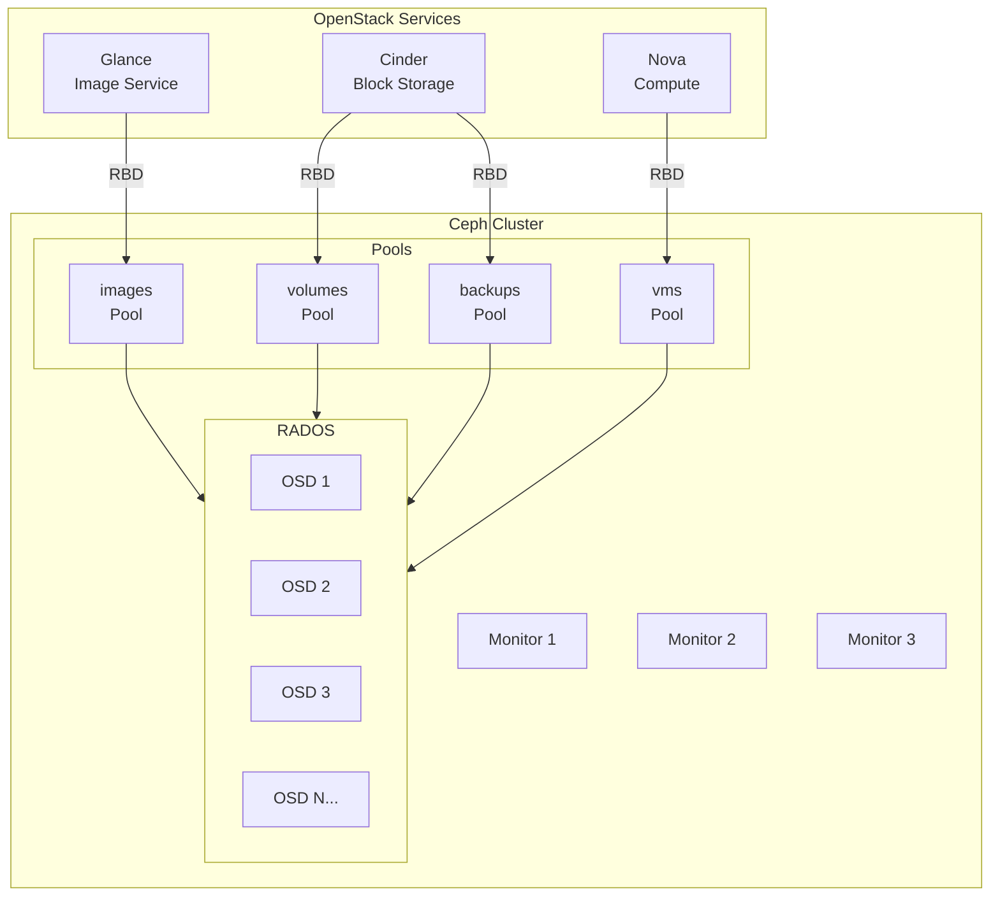
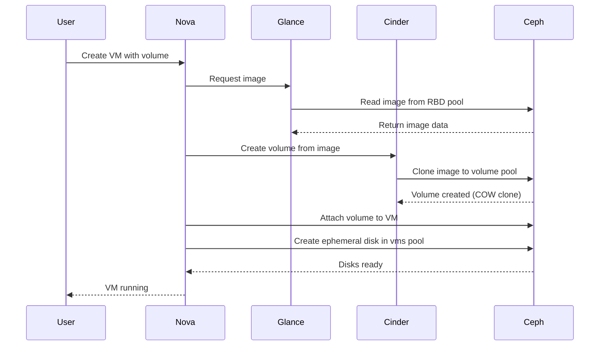
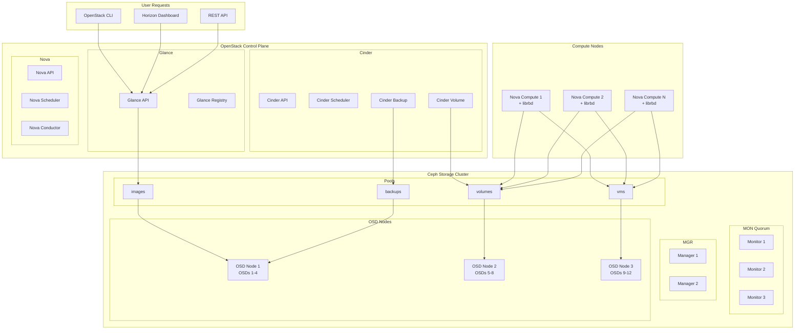

# How to Integrate Ceph with OpenStack for Cloud Storage

Author: [nawazdhandala](https://github.com/nawazdhandala)

Tags: Ceph, OpenStack, Storage, Cloud, Integration, Infrastructure

Description: A complete guide to integrating Ceph as the storage backend for OpenStack services.

---

## Introduction

Ceph is a distributed storage system that provides excellent scalability, reliability, and performance for cloud environments. When integrated with OpenStack, Ceph can serve as a unified storage backend for block storage (Cinder), image storage (Glance), and ephemeral storage (Nova). This integration eliminates the need for multiple storage solutions and provides features like thin provisioning, snapshots, and copy-on-write cloning.

In this comprehensive guide, we will walk through the complete process of integrating Ceph with OpenStack, covering all major storage services, authentication configuration, performance tuning, and troubleshooting.

## Architecture Overview

Before diving into the configuration, let us understand how Ceph integrates with OpenStack services.



## Data Flow Architecture

Understanding the data flow between OpenStack and Ceph is crucial for troubleshooting and optimization.



## Prerequisites

Before starting the integration, ensure you have the following:

- A working Ceph cluster (Reef or later recommended)
- OpenStack deployment (Zed or later)
- Network connectivity between OpenStack nodes and Ceph monitors
- Root or sudo access on all nodes
- Python Ceph bindings installed

Let us verify the Ceph cluster health before proceeding.

The following command checks the overall health status of your Ceph cluster and ensures all components are operational before integrating with OpenStack.

```bash
# Check Ceph cluster status
ceph -s

# Example output should show:
#   cluster:
#     id:     a1b2c3d4-e5f6-7890-abcd-ef1234567890
#     health: HEALTH_OK
#
#   services:
#     mon: 3 daemons, quorum ceph-mon-1,ceph-mon-2,ceph-mon-3
#     mgr: ceph-mgr-1(active), standbys: ceph-mgr-2
#     osd: 12 osds: 12 up, 12 in
```

## Step 1: Create Ceph Pools for OpenStack

OpenStack requires separate pools for different services. We will create pools with appropriate placement groups (PGs) based on cluster size.

The number of placement groups affects data distribution and performance. Use the Ceph PG calculator or the formula: (OSDs * 100) / replicas, rounded to the nearest power of 2.

```bash
# Create pool for Glance images
# The 'images' pool stores VM images that Glance manages
# Using 128 PGs as a starting point for a medium-sized cluster
ceph osd pool create images 128

# Create pool for Cinder volumes
# The 'volumes' pool stores persistent block devices attached to VMs
ceph osd pool create volumes 128

# Create pool for Cinder backups
# The 'backups' pool stores volume backup data
ceph osd pool create backups 128

# Create pool for Nova ephemeral disks
# The 'vms' pool stores temporary VM disks that are deleted when VMs terminate
ceph osd pool create vms 128
```

After creating pools, initialize them for RBD (RADOS Block Device) use.

```bash
# Initialize pools for RBD usage
# This enables the RBD application tag required for block storage operations
rbd pool init images
rbd pool init volumes
rbd pool init backups
rbd pool init vms
```

## Step 2: Configure Ceph Authentication

Ceph uses CephX authentication to secure access between clients and the cluster. We need to create separate users for each OpenStack service with appropriate permissions.

### Create Ceph Users for OpenStack Services

The following commands create authentication keys with specific capabilities. Each service gets only the permissions it needs, following the principle of least privilege.

```bash
# Create user for Glance with read/write access to the images pool
# Glance needs: MON read, OSD read/write on images pool
ceph auth get-or-create client.glance \
    mon 'profile rbd' \
    osd 'profile rbd pool=images' \
    mgr 'profile rbd pool=images' \
    -o /etc/ceph/ceph.client.glance.keyring
```

```bash
# Create user for Cinder with access to volumes, images, and backups pools
# Cinder needs to read images (for volume creation from images) and write to volumes/backups
ceph auth get-or-create client.cinder \
    mon 'profile rbd' \
    osd 'profile rbd pool=volumes, profile rbd pool=vms, profile rbd-read-only pool=images' \
    mgr 'profile rbd pool=volumes, profile rbd pool=vms' \
    -o /etc/ceph/ceph.client.cinder.keyring
```

```bash
# Create user for Cinder backup service
# Backup service needs access to both volumes (source) and backups (destination) pools
ceph auth get-or-create client.cinder-backup \
    mon 'profile rbd' \
    osd 'profile rbd pool=backups' \
    mgr 'profile rbd pool=backups' \
    -o /etc/ceph/ceph.client.cinder-backup.keyring
```

```bash
# Create user for Nova compute with access to vms and volumes pools
# Nova needs to create ephemeral disks and attach Cinder volumes
ceph auth get-or-create client.nova \
    mon 'profile rbd' \
    osd 'profile rbd pool=vms, profile rbd pool=volumes, profile rbd-read-only pool=images' \
    mgr 'profile rbd pool=vms' \
    -o /etc/ceph/ceph.client.nova.keyring
```

### Distribute Keys to OpenStack Nodes

Copy the keyring files to the appropriate OpenStack service nodes.

```bash
# Copy Glance keyring to Glance API nodes
# Ensure proper ownership for the glance service user
scp /etc/ceph/ceph.client.glance.keyring glance-node:/etc/ceph/
ssh glance-node "chown glance:glance /etc/ceph/ceph.client.glance.keyring"
ssh glance-node "chmod 640 /etc/ceph/ceph.client.glance.keyring"

# Copy Cinder keyrings to Cinder nodes
scp /etc/ceph/ceph.client.cinder.keyring cinder-node:/etc/ceph/
ssh cinder-node "chown cinder:cinder /etc/ceph/ceph.client.cinder.keyring"
ssh cinder-node "chmod 640 /etc/ceph/ceph.client.cinder.keyring"

# Copy Nova keyring to all compute nodes
# This must be done for each compute node in your cluster
for node in compute-{1..10}; do
    scp /etc/ceph/ceph.client.nova.keyring ${node}:/etc/ceph/
    ssh ${node} "chown nova:nova /etc/ceph/ceph.client.nova.keyring"
    ssh ${node} "chmod 640 /etc/ceph/ceph.client.nova.keyring"
done
```

### Copy Ceph Configuration

All OpenStack nodes need the Ceph configuration file to locate the monitors.

```bash
# Copy ceph.conf to all OpenStack nodes
# This file contains monitor addresses and cluster configuration
for node in glance-node cinder-node compute-{1..10}; do
    scp /etc/ceph/ceph.conf ${node}:/etc/ceph/
    ssh ${node} "chmod 644 /etc/ceph/ceph.conf"
done
```

## Step 3: Configure Glance for Ceph

Glance stores VM images that are used to boot instances. Using Ceph as the Glance backend enables copy-on-write cloning when creating volumes from images.

### Edit Glance API Configuration

The following configuration tells Glance to use Ceph RBD as its storage backend. This enables efficient image storage and fast volume creation through COW cloning.

```ini
# /etc/glance/glance-api.conf

[DEFAULT]
# Enable multiple storage backends (Ceph is recommended as default)
enabled_backends = rbd:rbd

[glance_store]
# Set RBD as the default backend for storing images
default_backend = rbd

[rbd]
# RBD backend configuration for Ceph integration
# The store description helps identify this backend in logs
rbd_store_description = Ceph RBD backend

# The Ceph pool where Glance will store images
rbd_store_pool = images

# The Ceph user for authentication (without 'client.' prefix)
rbd_store_user = glance

# Path to the Ceph configuration file
rbd_store_ceph_conf = /etc/ceph/ceph.conf

# Chunk size for streaming images to/from Ceph (in bytes)
# 8MB chunks provide good performance for large image transfers
rbd_store_chunk_size = 8
```

### Enable Copy-on-Write Cloning

To enable efficient volume creation from images, configure Glance to expose image locations to other services.

```ini
# /etc/glance/glance-api.conf

[DEFAULT]
# Allow Glance to expose the storage location of images
# This enables Cinder to use COW cloning instead of copying entire images
show_image_direct_url = True

# Control which location metadata fields are visible
# Include 'direct_url' to expose the RBD location to Cinder
show_multiple_locations = True

# List of URL schemes that are allowed for direct access
# This permits Cinder to access images via the rbd:// protocol
allowed_direct_url_schemes = rbd
```

### Restart Glance Services

After configuration changes, restart the Glance API service to apply settings.

```bash
# Restart Glance API service to apply configuration changes
systemctl restart glance-api

# Verify service is running correctly
systemctl status glance-api

# Check logs for any Ceph connection errors
journalctl -u glance-api -f --no-pager | head -50
```

### Test Glance Integration

Upload a test image to verify the Ceph integration is working.

```bash
# Download a test image (CirrOS is small and perfect for testing)
wget http://download.cirros-cloud.net/0.6.2/cirros-0.6.2-x86_64-disk.img

# Upload image to Glance using Ceph backend
# The image will be stored in the 'images' pool as an RBD image
openstack image create "cirros-test" \
    --file cirros-0.6.2-x86_64-disk.img \
    --disk-format qcow2 \
    --container-format bare \
    --public

# Verify the image is stored in Ceph
# The image should appear as an RBD image in the images pool
rbd -p images ls

# Check image details to confirm RBD storage location
openstack image show cirros-test -f yaml | grep -A5 locations
```

## Step 4: Configure Cinder for Ceph

Cinder provides block storage volumes that can be attached to VMs. Configuring Cinder with Ceph enables features like snapshots, cloning, and volume migration.

### Edit Cinder Configuration

The following configuration sets up Ceph as the primary volume backend for Cinder with optimized settings for OpenStack workloads.

```ini
# /etc/cinder/cinder.conf

[DEFAULT]
# Enable the RBD volume backend
enabled_backends = ceph

# Set Ceph as the default volume type
default_volume_type = ceph

# Enable image-to-volume optimization (uses Ceph COW cloning)
# This significantly speeds up volume creation from Glance images
allowed_direct_url_schemes = cinder,rbd

# Glance API version for image operations
glance_api_version = 2

[ceph]
# Backend display name shown in OpenStack
volume_backend_name = ceph

# Use the RBD volume driver for Ceph integration
volume_driver = cinder.volume.drivers.rbd.RBDDriver

# Ceph cluster name (usually 'ceph' unless you have multiple clusters)
rbd_cluster_name = ceph

# Path to Ceph configuration file
rbd_ceph_conf = /etc/ceph/ceph.conf

# Enable flattening of volumes cloned from snapshots
# This removes the parent-child dependency after cloning
rbd_flatten_volume_from_snapshot = False

# Maximum number of nested clones before flattening
# Prevents deep clone chains that can impact performance
rbd_max_clone_depth = 5

# Size of stripe unit for RBD images (in bytes)
# 4MB stripes work well for most workloads
rbd_store_chunk_size = 4

# Ceph pool for storing volumes
rbd_pool = volumes

# Ceph user for volume operations
rbd_user = cinder

# Secret UUID for libvirt authentication (we'll configure this later)
# This allows Nova to authenticate when attaching volumes
rbd_secret_uuid = 457eb676-33da-42ec-9a8c-9293d545c337

# Exclusive lock feature for live migration support
rbd_exclusive_cinder_pool = True
```

### Configure Cinder Backup

Cinder backup service can store volume backups in a separate Ceph pool for data protection.

```ini
# /etc/cinder/cinder.conf

[DEFAULT]
# Set the backup driver to use Ceph
backup_driver = cinder.backup.drivers.ceph.CephBackupDriver

# Ceph configuration for backup operations
backup_ceph_conf = /etc/ceph/ceph.conf

# Ceph user for backup operations
backup_ceph_user = cinder-backup

# Chunk size for backup data (in bytes)
backup_ceph_chunk_size = 134217728

# Ceph pool for storing backups
backup_ceph_pool = backups

# Stripe unit size for backup images
backup_ceph_stripe_unit = 0

# Number of stripes (0 means no striping)
backup_ceph_stripe_count = 0
```

### Create Cinder Volume Type

Create a volume type that maps to the Ceph backend for user selection.

```bash
# Create a volume type for Ceph-backed volumes
# Users can select this type when creating volumes
openstack volume type create ceph

# Associate the volume type with the Ceph backend
# The volume_backend_name must match the backend configuration
openstack volume type set ceph \
    --property volume_backend_name=ceph
```

### Restart Cinder Services

Apply the configuration by restarting Cinder services.

```bash
# Restart Cinder services to apply configuration
systemctl restart cinder-volume
systemctl restart cinder-backup
systemctl restart cinder-scheduler

# Verify services are running
openstack volume service list

# Check for any errors in logs
journalctl -u cinder-volume -f --no-pager | head -50
```

### Test Cinder Integration

Create a test volume to verify the integration.

```bash
# Create a 10GB test volume using Ceph backend
openstack volume create --size 10 --type ceph test-volume

# Check volume status (should become 'available')
openstack volume show test-volume -f yaml

# Verify the volume exists in Ceph
# The volume name in Ceph includes the volume- prefix and UUID
rbd -p volumes ls

# Create a volume from an image to test COW cloning
openstack volume create --size 10 --type ceph \
    --image cirros-test test-volume-from-image
```

## Step 5: Configure Nova for Ceph

Nova can use Ceph for ephemeral disks, enabling live migration and providing consistent storage performance across compute nodes.

### Configure Libvirt Secret for Ceph Authentication

Nova uses libvirt to manage VMs, and libvirt needs a secret to authenticate with Ceph when attaching RBD volumes.

First, create a libvirt secret definition file.

```xml
<!-- /tmp/ceph-secret.xml -->
<!-- This secret allows libvirt to authenticate with Ceph -->
<secret ephemeral='no' private='no'>
  <!-- UUID must match rbd_secret_uuid in cinder.conf -->
  <uuid>457eb676-33da-42ec-9a8c-9293d545c337</uuid>
  <usage type='ceph'>
    <!-- Name identifies this secret in libvirt -->
    <name>client.cinder secret</name>
  </usage>
</secret>
```

Apply the secret on all compute nodes.

```bash
# Run these commands on each compute node

# Define the libvirt secret
virsh secret-define --file /tmp/ceph-secret.xml

# Get the Ceph key for the cinder user
# This key will be used by libvirt to authenticate with Ceph
CINDER_KEY=$(ceph auth get-key client.cinder)

# Set the secret value to the Cinder user's key
# The UUID must match the secret definition
virsh secret-set-value --secret 457eb676-33da-42ec-9a8c-9293d545c337 \
    --base64 "$CINDER_KEY"

# Verify the secret is defined
virsh secret-list
```

### Edit Nova Configuration

Configure Nova to use Ceph for ephemeral disks and to properly attach Cinder volumes.

```ini
# /etc/nova/nova.conf

[libvirt]
# Use RBD for VM images (ephemeral disks)
# This stores instance disks in Ceph instead of local storage
images_type = rbd

# Ceph pool for ephemeral instance disks
images_rbd_pool = vms

# Ceph user for Nova operations
images_rbd_ceph_conf = /etc/ceph/ceph.conf
rbd_user = nova

# Secret UUID for volume attachment (must match libvirt secret)
rbd_secret_uuid = 457eb676-33da-42ec-9a8c-9293d545c337

# Disk cachemodes for better performance with Ceph
# Use writeback caching for network-backed storage
disk_cachemodes = network=writeback

# Enable live migration with RBD-backed instances
# These settings allow seamless VM migration between compute nodes
live_migration_flag = VIR_MIGRATE_UNDEFINE_SOURCE,VIR_MIGRATE_PEER2PEER,VIR_MIGRATE_LIVE

# Inject password and SSH key into instances
# Disabled when using Ceph as it conflicts with RBD-backed images
inject_password = false
inject_key = false
inject_partition = -2

# Hardware machine type for optimal performance
hw_machine_type = x86_64=pc-i440fx-2.11
```

### Configure Nova for Direct Image Access

Enable Nova to access Glance images directly from Ceph without downloading.

```ini
# /etc/nova/nova.conf

[glance]
# API servers for image operations
api_servers = http://glance-api:9292

[DEFAULT]
# Allow Nova to access images directly from RBD
# This enables efficient instance creation using COW cloning
force_raw_images = False
```

### Restart Nova Services

Apply the configuration by restarting Nova compute services.

```bash
# Restart Nova compute on all compute nodes
systemctl restart nova-compute

# Verify Nova compute is running
systemctl status nova-compute

# Check for Ceph-related errors in logs
journalctl -u nova-compute | grep -i ceph | tail -20

# Verify Nova can see the Ceph storage
nova-manage cell_v2 discover_hosts
```

### Test Nova Integration

Create a test instance to verify the integration.

```bash
# Create a network for testing (if not already exists)
openstack network create test-net
openstack subnet create --network test-net \
    --subnet-range 192.168.100.0/24 test-subnet

# Create a flavor for testing
openstack flavor create --ram 512 --disk 10 --vcpus 1 test-flavor

# Launch an instance using Ceph-backed ephemeral disk
openstack server create --flavor test-flavor \
    --image cirros-test \
    --network test-net \
    test-instance

# Check instance status
openstack server show test-instance

# Verify ephemeral disk is in Ceph
# Look for an RBD image with the instance UUID
rbd -p vms ls | grep $(openstack server show test-instance -f value -c id)
```

## Performance Tuning for OpenStack Workloads

Optimizing Ceph for OpenStack requires tuning both the Ceph cluster and the OpenStack services.

### Ceph Pool Configuration

Configure pool settings for optimal performance with OpenStack workloads.

```bash
# Set replication size for each pool
# Size 3 with min_size 2 provides fault tolerance while allowing degraded writes
ceph osd pool set images size 3
ceph osd pool set images min_size 2

ceph osd pool set volumes size 3
ceph osd pool set volumes min_size 2

ceph osd pool set vms size 3
ceph osd pool set vms min_size 2

# Enable RBD caching at the pool level
# This improves read performance for frequently accessed data
ceph osd pool set volumes rbd_cache true
ceph osd pool set vms rbd_cache true
```

### Ceph Client Configuration

Optimize the Ceph client settings on OpenStack nodes for better performance.

```ini
# /etc/ceph/ceph.conf - Client section for OpenStack nodes

[client]
# Enable RBD caching on the client side
# Writeback caching improves write performance significantly
rbd_cache = true

# Maximum size of the RBD cache in bytes (64MB)
rbd_cache_size = 67108864

# Maximum size of dirty (unflushed) data in cache (48MB)
rbd_cache_max_dirty = 50331648

# Target size to start flushing dirty data (32MB)
rbd_cache_target_dirty = 33554432

# Maximum time dirty data can remain unflushed (seconds)
rbd_cache_max_dirty_age = 2

# Writethrough caching until first flush (safer for crash recovery)
rbd_cache_writethrough_until_flush = true

# Concurrent operations per OSD
rbd_concurrent_management_ops = 20

# Default features for new RBD images
# Enable layering for COW cloning, exclusive-lock for live migration
rbd_default_features = 3
```

### Cinder Performance Tuning

Optimize Cinder for high-throughput volume operations.

```ini
# /etc/cinder/cinder.conf

[ceph]
# Maximum concurrent operations for volume management
rbd_concurrent_flatten_operations = 10

# Timeout for RBD operations (seconds)
rados_connect_timeout = 5

# Report volume capabilities to scheduler for intelligent placement
report_dynamic_total_capacity = True

# Enable multipath for HA volume attachments
use_multipath_for_image_xfer = True
```

### Nova Performance Tuning

Optimize Nova for better VM performance with Ceph storage.

```ini
# /etc/nova/nova.conf

[libvirt]
# Use native threads for better I/O performance
io_emulator_threads = native

# Configure virtio-blk for better disk performance
disk_mode = virtio-blk

# CPU and memory settings for better VM performance
cpu_mode = host-passthrough
hw_disk_discard = unmap
```

### Network Tuning

Optimize network settings for Ceph traffic on OpenStack nodes.

```bash
# Increase socket buffer sizes for better network throughput
# Add to /etc/sysctl.conf on all nodes

# Read buffer maximum
net.core.rmem_max = 268435456

# Write buffer maximum
net.core.wmem_max = 268435456

# TCP read buffer sizes (min, default, max)
net.ipv4.tcp_rmem = 4096 87380 134217728

# TCP write buffer sizes (min, default, max)
net.ipv4.tcp_wmem = 4096 65536 134217728

# Apply settings without reboot
sysctl -p
```

## Integration Architecture Summary

Here is a complete view of the integrated architecture with all components.



## Troubleshooting Common Issues

### Issue 1: Authentication Failures

Ceph authentication errors are common when keyring permissions or user capabilities are incorrect.

Symptoms include errors like "auth: unable to find a keyring" or "permission denied" in service logs.

```bash
# Check if keyring file exists and has correct permissions
ls -la /etc/ceph/ceph.client.*.keyring

# The keyring files should be readable by the service user
# Example for Cinder:
-rw-r----- 1 cinder cinder 64 Jan 01 12:00 /etc/ceph/ceph.client.cinder.keyring

# Verify the user can authenticate with Ceph
# Run this as the service user or with the service's keyring
ceph --id cinder -s

# If authentication fails, verify the user exists and has correct caps
ceph auth get client.cinder

# Expected output shows the user's capabilities:
# [client.cinder]
#     key = AQC0JH5...
#     caps mon = "profile rbd"
#     caps osd = "profile rbd pool=volumes, profile rbd pool=vms, ..."
```

### Issue 2: Pool Not Found Errors

Services may fail to connect if pools are not properly initialized.

```bash
# List all pools to verify they exist
ceph osd lspools

# Verify pools are initialized for RBD
rbd pool stats images
rbd pool stats volumes
rbd pool stats vms
rbd pool stats backups

# If a pool is missing, create and initialize it
ceph osd pool create volumes 128
rbd pool init volumes

# Check for PG issues that might affect pool availability
ceph health detail | grep -i pg
```

### Issue 3: Volume Attachment Failures

Nova may fail to attach Cinder volumes if libvirt secrets are not configured correctly.

```bash
# Check if libvirt secret is defined
virsh secret-list

# Verify the secret UUID matches cinder.conf
grep rbd_secret_uuid /etc/cinder/cinder.conf

# Check if the secret has a value set
virsh secret-get-value 457eb676-33da-42ec-9a8c-9293d545c337

# If the secret is missing or incorrect, recreate it
virsh secret-undefine 457eb676-33da-42ec-9a8c-9293d545c337
virsh secret-define --file /tmp/ceph-secret.xml
virsh secret-set-value --secret 457eb676-33da-42ec-9a8c-9293d545c337 \
    --base64 "$(ceph auth get-key client.cinder)"

# Check Nova compute logs for attachment errors
journalctl -u nova-compute | grep -i "rbd\|ceph\|attach" | tail -30
```

### Issue 4: Slow Image Operations

Glance image uploads or downloads may be slow due to network or configuration issues.

```bash
# Check network connectivity to Ceph monitors
for mon in ceph-mon-{1..3}; do
    ping -c 3 $mon
done

# Verify Ceph cluster is healthy
ceph health detail

# Check for slow OSD operations
ceph osd perf

# Monitor Ceph I/O during image operations
ceph -w &

# Test direct RBD performance
rbd bench --io-type write --io-size 4M --io-total 1G volumes/test-bench

# Clean up test image
rbd rm volumes/test-bench
```

### Issue 5: Live Migration Failures

Live migration may fail if Ceph connectivity or permissions are inconsistent across compute nodes.

```bash
# Verify Ceph connectivity on both source and destination nodes
# Run on each compute node:
ceph --id nova -s

# Check that RBD images are accessible
rbd --id nova -p vms ls

# Verify libvirt can access the secret on both nodes
virsh secret-get-value 457eb676-33da-42ec-9a8c-9293d545c337

# Check for network issues between compute nodes
ssh compute-2 ping -c 3 compute-1

# Review Nova conductor logs for migration errors
journalctl -u nova-conductor | grep -i migration | tail -30
```

### Issue 6: COW Clone Failures

Copy-on-write cloning may fail if image format or Glance configuration is incorrect.

```bash
# Check if Glance is exposing image locations
openstack image show <image-id> -c locations -f yaml

# Verify image format is raw (COW works best with raw images)
openstack image show <image-id> -c disk_format

# Convert qcow2 to raw for better COW performance
qemu-img convert -f qcow2 -O raw input.qcow2 output.raw

# Upload as raw format
openstack image create "raw-image" \
    --file output.raw \
    --disk-format raw \
    --container-format bare

# Check Cinder logs for cloning operations
journalctl -u cinder-volume | grep -i clone | tail -20
```

### Diagnostic Commands Summary

Here is a quick reference for common diagnostic commands.

```bash
# Overall Ceph health
ceph -s
ceph health detail

# Pool statistics
ceph df
rados df

# OSD performance
ceph osd perf
ceph osd tree

# RBD image management
rbd -p volumes ls
rbd -p volumes info volume-<uuid>

# Check for stuck operations
ceph pg stat
ceph osd blocked-by

# Service connectivity test
ceph --id glance -s
ceph --id cinder -s
ceph --id nova -s

# OpenStack service status
openstack volume service list
openstack compute service list

# Log locations
# Glance: /var/log/glance/api.log
# Cinder: /var/log/cinder/volume.log
# Nova: /var/log/nova/nova-compute.log
```

## Security Best Practices

### Network Isolation

Isolate Ceph traffic from public networks for security and performance.

```bash
# Configure separate network for Ceph cluster traffic
# In /etc/ceph/ceph.conf

[global]
# Public network for client access (OpenStack nodes)
public_network = 10.0.1.0/24

# Cluster network for OSD replication (internal)
cluster_network = 10.0.2.0/24

# Bind monitor to specific address
mon_host = 10.0.1.10,10.0.1.11,10.0.1.12
```

### Key Rotation

Periodically rotate Ceph authentication keys for enhanced security.

```bash
# Generate a new key for the cinder user
ceph auth caps client.cinder \
    mon 'profile rbd' \
    osd 'profile rbd pool=volumes, profile rbd pool=vms, profile rbd-read-only pool=images' \
    mgr 'profile rbd pool=volumes, profile rbd pool=vms'

# Export the new keyring
ceph auth get client.cinder -o /etc/ceph/ceph.client.cinder.keyring.new

# Distribute new keyring to all nodes
# Update libvirt secrets with new key
# Restart affected services

# Verify authentication still works
ceph --id cinder -s
```

### Audit Logging

Enable Ceph audit logging to track access and changes.

```ini
# /etc/ceph/ceph.conf

[mon]
# Enable audit logging
mon_cluster_log_to_syslog = true
mon_cluster_log_to_syslog_level = info
mon_cluster_log_to_syslog_facility = auth

# Log authentication events
auth_cluster_required = cephx
auth_service_required = cephx
auth_client_required = cephx
```

## Monitoring and Observability

### Enable Ceph Prometheus Metrics

Configure Ceph to expose metrics for monitoring.

```bash
# Enable the Prometheus module in Ceph Manager
ceph mgr module enable prometheus

# Configure Prometheus to scrape Ceph metrics
# Add to prometheus.yml:
# - job_name: 'ceph'
#   static_configs:
#     - targets: ['ceph-mgr-1:9283']

# Verify metrics are available
curl http://ceph-mgr-1:9283/metrics | head -50
```

### Key Metrics to Monitor

Track these metrics for a healthy Ceph-OpenStack integration:

```yaml
# Prometheus alerting rules for Ceph-OpenStack integration

groups:
  - name: ceph-openstack
    rules:
      # Alert when Ceph cluster health degrades
      - alert: CephHealthWarning
        expr: ceph_health_status != 0
        for: 5m
        labels:
          severity: warning
        annotations:
          summary: "Ceph cluster health is not OK"

      # Alert on high OSD latency affecting OpenStack
      - alert: CephOSDHighLatency
        expr: ceph_osd_apply_latency_ms > 100
        for: 5m
        labels:
          severity: warning
        annotations:
          summary: "Ceph OSD latency is high"

      # Alert on low pool space (affects volume creation)
      - alert: CephPoolNearFull
        expr: (ceph_pool_bytes_used / ceph_pool_max_avail) > 0.75
        for: 5m
        labels:
          severity: warning
        annotations:
          summary: "Ceph pool is running low on space"

      # Alert on slow RBD operations
      - alert: CephSlowOps
        expr: ceph_pg_slow_ops > 0
        for: 10m
        labels:
          severity: warning
        annotations:
          summary: "Ceph has slow operations"
```

## Conclusion

Integrating Ceph with OpenStack provides a powerful, unified storage solution that scales with your cloud infrastructure. By following this guide, you have configured:

1. **Glance Integration**: VM images stored in Ceph with copy-on-write cloning support for fast volume creation
2. **Cinder Integration**: Persistent block storage with snapshots, backups, and efficient volume operations
3. **Nova Integration**: Ephemeral disks in Ceph enabling live migration and consistent VM storage
4. **Authentication**: Secure CephX authentication with service-specific users and capabilities
5. **Performance Tuning**: Optimized settings for OpenStack workloads
6. **Troubleshooting**: Diagnostic tools and solutions for common issues

This integration eliminates the need for multiple storage solutions, reduces operational complexity, and provides enterprise-grade features like thin provisioning, snapshots, and seamless live migration across compute nodes.

## Additional Resources

- [Ceph Documentation - Block Device and OpenStack](https://docs.ceph.com/en/latest/rbd/rbd-openstack/)
- [OpenStack Cinder Documentation - Ceph RBD Driver](https://docs.openstack.org/cinder/latest/configuration/block-storage/drivers/ceph-rbd-volume-driver.html)
- [OpenStack Glance Documentation - RBD Backend](https://docs.openstack.org/glance/latest/configuration/glance_api.html)
- [Red Hat OpenStack Platform - Ceph Integration Guide](https://access.redhat.com/documentation/en-us/red_hat_openstack_platform/)
