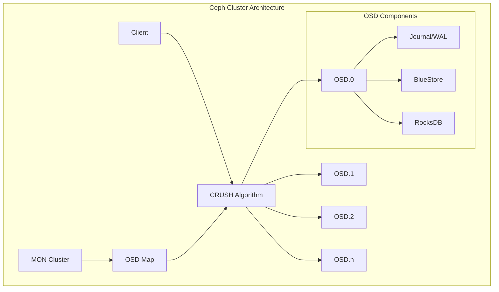
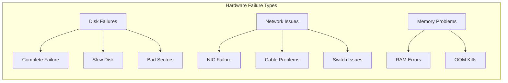
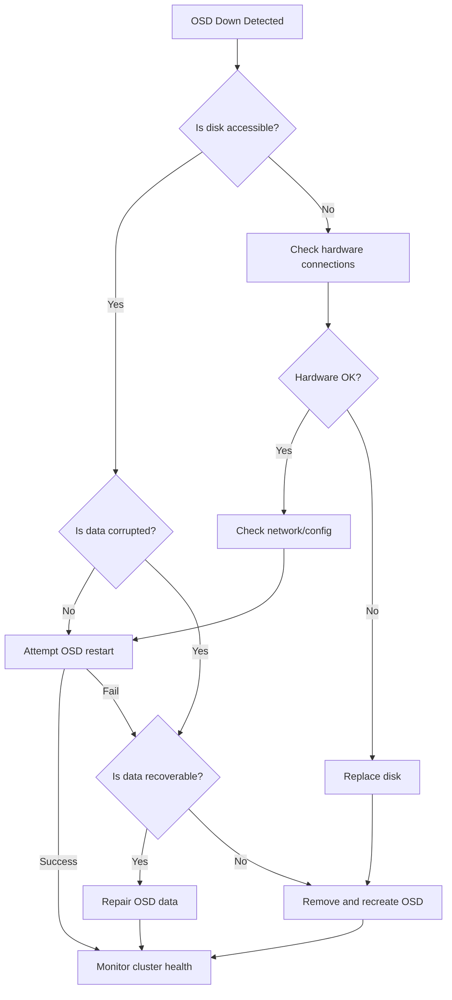
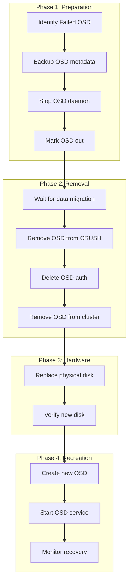
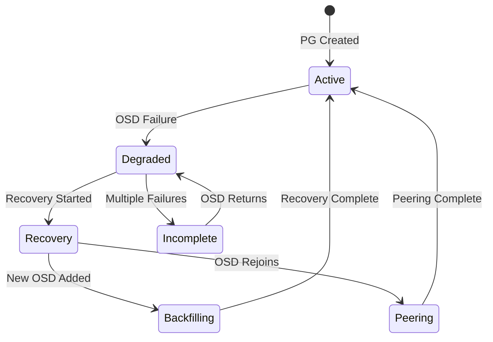

# How to Troubleshoot Ceph OSD Failures and Recovery

Author: [nawazdhandala](https://github.com/nawazdhandala)

Tags: Ceph, Storage, Troubleshooting, OSDs, High Availability, Cloud Native

Description: A practical guide to diagnosing and recovering from Ceph OSD failures.

---

Ceph Object Storage Daemons (OSDs) are the workhorses of any Ceph cluster, responsible for storing data, handling replication, recovery, and rebalancing. When OSDs fail, the cluster's health degrades, potentially impacting data availability and performance. This comprehensive guide covers everything you need to know about diagnosing OSD failures, implementing recovery procedures, and optimizing the recovery process.

## Table of Contents

1. [Understanding Ceph OSD Architecture](#understanding-ceph-osd-architecture)
2. [Common OSD Failure Scenarios](#common-osd-failure-scenarios)
3. [Diagnostic Commands and Tools](#diagnostic-commands-and-tools)
4. [Log Analysis Techniques](#log-analysis-techniques)
5. [OSD Recovery Procedures](#osd-recovery-procedures)
6. [OSD Replacement Workflow](#osd-replacement-workflow)
7. [Recovery Monitoring and Optimization](#recovery-monitoring-and-optimization)
8. [Best Practices and Prevention](#best-practices-and-prevention)

## Understanding Ceph OSD Architecture

Before diving into troubleshooting, it's essential to understand how OSDs work within the Ceph ecosystem.



Each OSD daemon manages one storage device and handles:
- Object storage and retrieval
- Data replication across failure domains
- Recovery and backfilling operations
- Heartbeat monitoring with peer OSDs

## Common OSD Failure Scenarios

Understanding the root cause of OSD failures is crucial for effective troubleshooting. Here are the most common scenarios:

### 1. Hardware Failures



### 2. Software and Configuration Issues

- Corrupted BlueStore database
- Incorrect CRUSH map configuration
- Resource exhaustion (memory, file descriptors)
- Incompatible software versions after upgrades

### 3. Performance-Related Failures

- Slow ops leading to OSD marking itself down
- Journal/WAL device failures
- Network latency causing heartbeat timeouts

## Diagnostic Commands and Tools

### Checking Cluster Health

The first step in troubleshooting is to assess the overall cluster health.

This command provides a quick overview of the cluster status including any health warnings:

```bash
# Display the overall cluster health status
# The output shows HEALTH_OK, HEALTH_WARN, or HEALTH_ERR
ceph health detail
```

For a more comprehensive view, use the status command:

```bash
# Get detailed cluster status including:
# - Cluster ID and health
# - Monitor status
# - OSD status (up/down, in/out)
# - Pool statistics
# - PG (Placement Group) status
ceph status
```

### Identifying Problematic OSDs

To find OSDs that are down or out of the cluster:

```bash
# List all OSDs with their status
# Shows OSD ID, host, status (up/down), weight, and reweight
ceph osd tree
```

Example output interpretation:

```bash
# Example output from 'ceph osd tree':
# ID  CLASS  WEIGHT   TYPE NAME         STATUS  REWEIGHT  PRI-AFF
# -1         4.00000  root default
# -3         2.00000      host node1
#  0    hdd  1.00000          osd.0         up   1.00000  1.00000
#  1    hdd  1.00000          osd.1       down   1.00000  1.00000  <-- Problem OSD
# -5         2.00000      host node2
#  2    hdd  1.00000          osd.2         up   1.00000  1.00000
#  3    hdd  1.00000          osd.3         up   1.00000  1.00000
```

### Detailed OSD Information

Get comprehensive information about a specific OSD:

```bash
# Find detailed metadata about a specific OSD
# Replace <osd-id> with the actual OSD number (e.g., 0, 1, 2)
ceph osd find <osd-id>

# Example: Find information about OSD.1
ceph osd find 1
```

Check OSD performance statistics:

```bash
# Display performance counters for a specific OSD
# Useful for identifying slow operations and bottlenecks
ceph daemon osd.<id> perf dump

# Get the current configuration of an OSD
ceph daemon osd.<id> config show
```

### Checking OSD Utilization

Monitor disk space usage across OSDs:

```bash
# Display disk utilization for all OSDs
# Shows raw usage, percentage, and variance from mean
ceph osd df

# Tree view with utilization showing hierarchical structure
ceph osd df tree
```

### Examining Placement Groups

Placement Groups (PGs) distribute data across OSDs. Check their health:

```bash
# Show PGs with problems (stuck, degraded, etc.)
ceph pg dump_stuck

# Get detailed information about stuck PGs
# Possible states: inactive, unclean, stale, undersized, degraded
ceph pg dump_stuck unclean

# Query a specific PG for detailed information
ceph pg <pg-id> query
```

## Log Analysis Techniques

Ceph logs contain valuable information for diagnosing OSD issues.

### Locating OSD Logs

```bash
# Default log location for OSD logs
# Replace X with the OSD ID number
ls -la /var/log/ceph/ceph-osd.*.log

# On containerized deployments (Rook-Ceph), check pod logs
kubectl -n rook-ceph logs -l app=rook-ceph-osd --tail=100
```

### Searching for Common Error Patterns

Use these commands to find specific error patterns in logs:

```bash
# Search for slow operations - indicates performance issues
# Slow ops occur when operations exceed the warning threshold
grep -i "slow request" /var/log/ceph/ceph-osd.*.log

# Look for OSD failures and crashes
grep -E "(suicide|assert|segfault)" /var/log/ceph/ceph-osd.*.log

# Find heartbeat failures - indicates network or overload issues
grep -i "heartbeat_check" /var/log/ceph/ceph-osd.*.log

# Check for disk errors reported by the OSD
grep -i "error" /var/log/ceph/ceph-osd.*.log | grep -i "disk\|io\|write\|read"
```

### Real-time Log Monitoring

```bash
# Follow the log file in real-time for a specific OSD
# Useful during active troubleshooting
tail -f /var/log/ceph/ceph-osd.1.log

# Filter for specific patterns while following
tail -f /var/log/ceph/ceph-osd.1.log | grep -E "(error|warn|slow)"
```

### Adjusting Log Verbosity

Increase logging temporarily for deeper analysis:

```bash
# Increase debug level for OSD subsystems
# Levels range from 0 (minimal) to 20 (maximum verbosity)
# Warning: High debug levels generate significant log volume
ceph tell osd.<id> config set debug_osd 10
ceph tell osd.<id> config set debug_bluestore 10

# Reset to default levels after troubleshooting
ceph tell osd.<id> config set debug_osd 0
ceph tell osd.<id> config set debug_bluestore 0
```

## OSD Recovery Procedures

### Recovery Decision Flowchart



### Restarting a Failed OSD

When an OSD has crashed but the underlying disk is healthy:

```bash
# Check if the OSD service is running
# This shows the systemd unit status and recent logs
systemctl status ceph-osd@<id>

# Attempt to start the OSD service
# The OSD will perform crash recovery automatically if needed
systemctl start ceph-osd@<id>

# Verify the OSD is now up in the cluster
# Look for the OSD status changing from 'down' to 'up'
ceph osd tree | grep osd.<id>
```

### Marking OSD Out Manually

If an OSD needs maintenance or is consistently failing:

```bash
# Mark the OSD as 'out' to trigger data redistribution
# This tells Ceph to rebalance data away from this OSD
# The OSD can still be 'up' but won't receive new data
ceph osd out <id>

# Verify the OSD is now marked out
ceph osd tree | grep osd.<id>
```

### Repairing Inconsistent PGs

When PGs report inconsistencies:

```bash
# First, identify PGs with repair needs
ceph health detail | grep inconsistent

# Initiate repair on a specific PG
# This scrubs the PG and fixes any inconsistencies
# Format: ceph pg repair <pool-id>.<pg-id>
ceph pg repair <pg-id>

# For deep scrub issues, force a deep scrub first
ceph pg deep-scrub <pg-id>
```

### Recovering from BlueStore Corruption

BlueStore database corruption requires special handling:

```bash
# First, stop the OSD to prevent further damage
systemctl stop ceph-osd@<id>

# Check the BlueStore filesystem integrity
# This runs fsck on the OSD's BlueStore database
ceph-bluestore-tool fsck --path /var/lib/ceph/osd/ceph-<id>

# Attempt automatic repair of detected issues
ceph-bluestore-tool repair --path /var/lib/ceph/osd/ceph-<id>

# If repair succeeds, restart the OSD
systemctl start ceph-osd@<id>
```

## OSD Replacement Workflow

When a disk has failed completely, follow this procedure to replace it:

### Complete OSD Replacement Process



### Step 1: Prepare for Removal

```bash
# Record the OSD ID and associated metadata before removal
# This information is useful for documentation and recovery
ceph osd find <id>
ceph osd metadata <id>

# Check which PGs are on this OSD
# This helps estimate recovery time
ceph pg ls-by-osd <id>

# Mark the OSD out to start data rebalancing
# This begins the process of copying data to other OSDs
ceph osd out <id>
```

### Step 2: Stop and Remove the OSD

```bash
# Stop the OSD daemon safely
# This allows any pending operations to complete
systemctl stop ceph-osd@<id>

# Remove the OSD from the CRUSH map
# This prevents the OSD from being assigned any PGs
ceph osd crush remove osd.<id>

# Remove the OSD's authentication keys
# This revokes the OSD's permission to join the cluster
ceph auth del osd.<id>

# Remove the OSD from the cluster entirely
ceph osd rm <id>

# Verify removal was successful
ceph osd tree
```

### Step 3: Prepare the New Disk

```bash
# Identify the new disk device
# List all block devices and find the replacement
lsblk -o NAME,SIZE,MODEL,SERIAL

# Wipe any existing data from the new disk
# WARNING: This destroys all data on the specified device
# Double-check the device name before running
wipefs -a /dev/sdX

# Optional: Secure erase for SSDs (if supported)
# This ensures a clean state for the new OSD
hdparm --user-master u --security-set-pass p /dev/sdX
hdparm --user-master u --security-erase p /dev/sdX
```

### Step 4: Create the New OSD

Using ceph-volume (recommended for modern Ceph versions):

```bash
# Create a new OSD on the prepared disk
# This command handles all the setup: partitioning, formatting, and registration
# The --data flag specifies the disk to use for OSD data
ceph-volume lvm create --data /dev/sdX

# If using a separate WAL/DB device for performance:
# This is common when using HDDs with SSD for metadata
ceph-volume lvm create --data /dev/sdX --block.wal /dev/nvmeY --block.db /dev/nvmeZ
```

### Step 5: Verify New OSD

```bash
# Check that the new OSD appears in the cluster
ceph osd tree

# Verify the OSD is healthy and accepting data
ceph osd stat

# Monitor the backfill/recovery progress
ceph -w
```

## Recovery Monitoring and Optimization

### Understanding Recovery States



### Monitoring Recovery Progress

```bash
# Watch recovery progress in real-time
# Shows ongoing operations and their rates
ceph -w

# Get detailed recovery statistics
# Displays objects recovering, degraded objects, and rate
ceph pg stat

# Check specific recovery/backfill metrics
# Useful for estimating time to completion
ceph status | grep -E "(recovery|backfill|degraded)"
```

### Understanding Recovery Output

```bash
# Example output from 'ceph pg stat':
# 256 pgs: 250 active+clean, 6 active+recovery_wait+degraded
# 1.5 TiB data, 4.5 TiB used, 11 TiB / 16 TiB avail
# 45/1000 objects degraded (4.500%)
# recovery io 156 MB/s, 45 objects/s

# Key metrics to monitor:
# - Number of degraded objects (should decrease)
# - Recovery I/O rate (adjust if too high/low)
# - PG states (watch for stuck states)
```

### Optimizing Recovery Performance

Balance recovery speed against client I/O impact:

```bash
# Increase recovery threads for faster recovery
# Default is 1, increase during maintenance windows
ceph tell osd.* config set osd_recovery_max_active 3

# Adjust recovery operation priority
# Lower values = higher priority (1-63)
# Lower priority means faster recovery but more client impact
ceph tell osd.* config set osd_recovery_op_priority 3

# Limit recovery bandwidth to reduce client I/O impact
# Set in bytes per second (0 = unlimited)
ceph tell osd.* config set osd_recovery_max_single_start 1
ceph tell osd.* config set osd_max_backfills 1

# For aggressive recovery (maintenance window only):
# These settings prioritize recovery over client I/O
ceph tell osd.* config set osd_recovery_sleep 0
ceph tell osd.* config set osd_recovery_max_active 5
ceph tell osd.* config set osd_max_backfills 3
```

### Prioritizing Critical Pool Recovery

```bash
# Set recovery priority for specific pools
# Higher values = higher priority
# Range: 0 (lowest) to 10 (highest)
ceph osd pool set <pool-name> recovery_priority 5

# Temporarily pause recovery on less critical pools
ceph osd pool set <pool-name> recovery_priority 0
```

### Preventing Unnecessary Recovery

During planned maintenance:

```bash
# Set the noout flag to prevent OSD being marked out
# Useful for short maintenance windows
ceph osd set noout

# Also consider setting norecover and nobackfill
# This completely pauses recovery operations
ceph osd set norecover
ceph osd set nobackfill

# IMPORTANT: Remember to unset these flags after maintenance!
ceph osd unset noout
ceph osd unset norecover
ceph osd unset nobackfill
```

## Best Practices and Prevention

### Proactive Monitoring Setup

```bash
# Enable detailed health checks
ceph config set global mon_health_to_clog true
ceph config set global mon_health_detail_to_clog true

# Set up disk health monitoring with SMART
# Check disk health for all OSD devices
for osd in $(ceph osd ls); do
    device=$(ceph osd metadata $osd | jq -r '.devices')
    smartctl -H /dev/$device
done
```

### Recommended Alert Thresholds

```bash
# Configure warning thresholds in ceph.conf or via config set
# Alert when disk usage exceeds 75%
ceph config set global mon_osd_full_ratio 0.85
ceph config set global mon_osd_nearfull_ratio 0.75

# Set OSD down warning time
# Alert if OSD is down for more than 5 minutes
ceph config set global mon_osd_down_out_interval 300
```

### Capacity Planning

```bash
# Calculate available capacity considering failure scenarios
# Formula: usable_capacity = total_capacity * (1 - 1/min_size) * (1 - reserve)

# Check current capacity with replication considered
ceph df detail

# Estimate time to full based on growth rate
rados df
```

### Regular Maintenance Tasks

```bash
# Enable automatic scrubbing to detect data corruption
# Schedule deep scrubs during low-traffic periods
ceph config set global osd_scrub_begin_hour 2
ceph config set global osd_scrub_end_hour 6

# Set scrub intervals
# Regular scrub: daily, Deep scrub: weekly
ceph config set global osd_scrub_interval 86400
ceph config set global osd_deep_scrub_interval 604800
```

### Documentation and Runbooks

Maintain updated documentation including:

1. **Cluster topology diagram** with node names, IP addresses, and disk mappings
2. **OSD inventory** listing disk serial numbers, purchase dates, and replacement history
3. **Recovery runbooks** with step-by-step procedures for common failures
4. **Contact information** for hardware vendors and on-call engineers

## Troubleshooting Quick Reference

### Common Issues and Solutions

| Symptom | Likely Cause | Solution |
|---------|--------------|----------|
| OSD frequently flapping | Network issues or slow disk | Check network latency, review SMART data |
| Slow ops warnings | Overloaded OSD or dying disk | Check disk utilization, review `iostat` |
| OSD won't start | Corrupted BlueStore | Run `ceph-bluestore-tool repair` |
| PGs stuck in inactive | Missing OSDs | Check if required OSDs are running |
| Recovery stalled | Resource constraints | Adjust recovery settings, check bandwidth |

### Emergency Commands

```bash
# Force primary affinity reset (use with caution)
ceph osd primary-affinity osd.<id> 0

# Force PG recovery (for stuck PGs)
ceph pg force-recovery <pg-id>

# Force PG backfill (for stuck PGs)
ceph pg force-backfill <pg-id>

# Cancel stuck scrub operations
ceph pg cancel-force-recovery <pg-id>
ceph pg cancel-force-backfill <pg-id>
```

## Conclusion

Effective Ceph OSD troubleshooting requires a systematic approach combining cluster-wide health checks, individual OSD diagnostics, and log analysis. By understanding the recovery process and knowing how to optimize it, you can minimize downtime and maintain data availability even when hardware fails.

Key takeaways:
- Always check cluster health first with `ceph health detail`
- Use the OSD tree to identify problematic OSDs
- Analyze logs for specific error patterns before taking action
- Balance recovery speed against client I/O impact
- Implement proactive monitoring to catch issues early
- Document your cluster topology and maintain runbooks

Remember that Ceph is designed to handle failures gracefully, but proper troubleshooting skills ensure you can resolve issues quickly and maintain optimal cluster performance.
