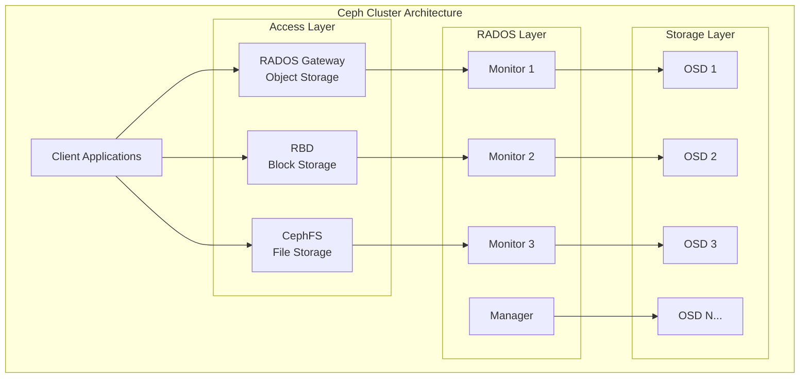
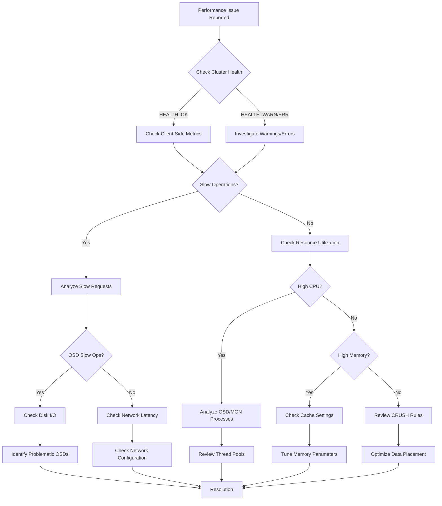
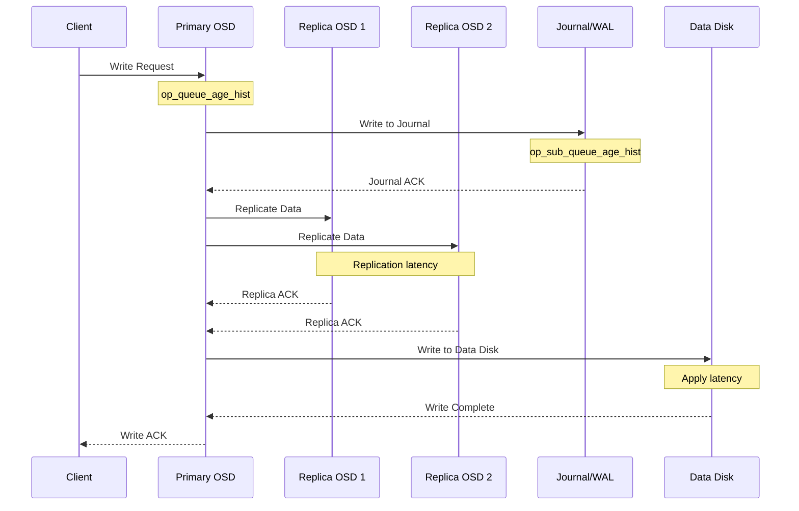
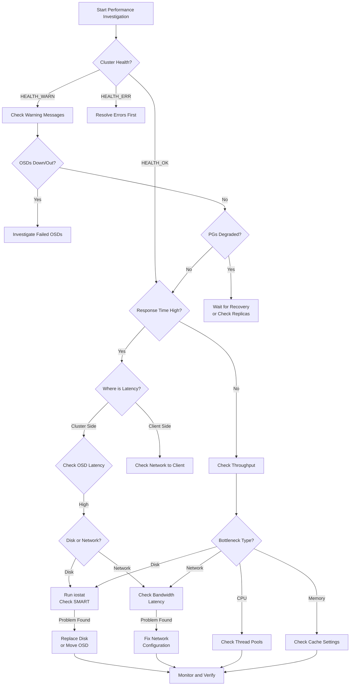

# How to Troubleshoot Ceph Performance Issues

Author: [nawazdhandala](https://github.com/nawazdhandala)

Tags: Ceph, Storage, Performance, Troubleshooting, Debugging, Cloud Native

Description: A practical guide to diagnosing and resolving performance problems in Ceph clusters.

---

Ceph is a powerful distributed storage system that provides object, block, and file storage in a unified platform. However, like any complex distributed system, Ceph can experience performance issues that require systematic troubleshooting. This comprehensive guide will walk you through the tools, techniques, and methodologies for diagnosing and resolving Ceph performance problems.

## Table of Contents

1. [Understanding Ceph Architecture](#understanding-ceph-architecture)
2. [Performance Diagnostic Workflow](#performance-diagnostic-workflow)
3. [Essential Performance Commands](#essential-performance-commands)
4. [Identifying Common Bottlenecks](#identifying-common-bottlenecks)
5. [Slow Request Analysis](#slow-request-analysis)
6. [Network Troubleshooting](#network-troubleshooting)
7. [Disk I/O Troubleshooting](#disk-io-troubleshooting)
8. [OSD Performance Tuning](#osd-performance-tuning)
9. [Monitor Performance Issues](#monitor-performance-issues)
10. [Advanced Debugging Techniques](#advanced-debugging-techniques)

## Understanding Ceph Architecture

Before diving into troubleshooting, it is essential to understand the key components that can affect performance:



## Performance Diagnostic Workflow

Follow this systematic approach when troubleshooting Ceph performance issues:



## Essential Performance Commands

### Cluster Health Overview

The first step in any troubleshooting session is to check the overall cluster health:

```bash
# Check the overall cluster health status
# This provides a quick summary of any issues affecting the cluster
ceph health detail

# Get a comprehensive status report including all cluster components
# Shows MON quorum, OSD status, PG states, and pool information
ceph status

# Display detailed cluster information in JSON format for parsing
# Useful for automation and detailed analysis
ceph status --format json-pretty
```

### Performance Statistics

These commands help you understand current cluster performance metrics:

```bash
# Monitor real-time I/O statistics across the cluster
# Shows read/write IOPS, bandwidth, and client connections
ceph -s

# Watch cluster status continuously with 1-second refresh
# Useful for monitoring during active troubleshooting
watch -n 1 ceph -s

# Get detailed OSD performance statistics
# Shows latency percentiles for commit and apply operations
ceph osd perf

# Display OSD performance in table format sorted by latency
# Helps identify the slowest OSDs quickly
ceph osd perf | sort -k3 -n -r | head -20
```

### OSD Tree and Status

Understanding your OSD layout is crucial for performance analysis:

```bash
# Display the OSD tree showing the CRUSH hierarchy
# Shows hosts, racks, and OSD status within the cluster topology
ceph osd tree

# Show detailed OSD status including PG counts and utilization
# Helps identify unbalanced or overloaded OSDs
ceph osd df tree

# Get OSD utilization statistics
# Shows variance and standard deviation for capacity planning
ceph osd df plain
```

### Pool Statistics

Monitor pool-level performance to identify problematic pools:

```bash
# Display all pools with their I/O statistics
# Shows read/write operations per second and bandwidth per pool
ceph osd pool stats

# Get detailed pool information including replication settings
# Lists all pools with their PG count, size, and CRUSH ruleset
ceph osd pool ls detail

# Monitor pool I/O in real-time
# Continuously displays operations and bandwidth for all pools
rados df
```

## Identifying Common Bottlenecks

### PG State Analysis

Placement Groups in degraded states often indicate performance issues:

```bash
# Show all PG states with counts
# Healthy clusters should show mostly 'active+clean' PGs
ceph pg stat

# List PGs that are not in the optimal 'active+clean' state
# These PGs may be affecting cluster performance
ceph pg ls | grep -v 'active+clean'

# Get detailed information about a specific PG
# Replace '1.a' with the actual PG ID from the previous command
ceph pg 1.a query

# Find PGs with the most operations (potential hotspots)
# Helps identify workload imbalances
ceph pg dump pgs_brief | sort -k3 -n -r | head -10
```

### Capacity Bottlenecks

Running low on capacity can severely impact performance:

```bash
# Check overall cluster capacity and utilization
# Shows total, used, and available space with percentages
ceph df

# Detailed capacity information per pool
# Helps identify pools consuming the most space
ceph df detail

# Check OSD utilization to find nearly-full OSDs
# OSDs above 85% can trigger slowdowns and rebalancing
ceph osd df | awk '$6 > 85 {print $0}'

# Calculate and display OSD utilization variance
# High variance indicates unbalanced data distribution
ceph osd df plain | tail -1
```

## Slow Request Analysis

Slow requests are one of the most common performance issues in Ceph clusters.

### Understanding Slow Ops



### Detecting Slow Operations

```bash
# List all OSDs with slow operations (requests taking > 30s)
# These are logged as warnings and indicate performance problems
ceph daemon osd.0 ops

# Get histogram of operation queue age for a specific OSD
# Shows distribution of how long operations wait in queue
ceph daemon osd.0 perf dump | jq '.osd.op_queue_age_hist'

# Check for blocked requests in the cluster log
# Blocked ops are more severe than slow ops
grep -i "slow\|blocked" /var/log/ceph/ceph.log | tail -50

# Get a summary of slow operations across all OSDs
# The cluster warns when ops exceed the slow threshold (default 30s)
ceph health detail | grep -i slow
```

### Analyzing Slow Operations in Detail

```bash
# Dump all in-flight operations for a specific OSD
# Shows current operations with their age and state
ceph daemon osd.0 dump_ops_in_flight

# Get historical operations that were slow
# Helps identify patterns in slow operations
ceph daemon osd.0 dump_historic_ops

# Show slow operations with detailed timing breakdown
# Reveals which phase of the operation is slow
ceph daemon osd.0 dump_historic_slow_ops

# Parse slow operations to find the most common slow op types
# Helps focus troubleshooting on the right operation types
ceph daemon osd.0 dump_historic_slow_ops | \
  jq -r '.ops[].description' | sort | uniq -c | sort -rn
```

### Slow Operation Types and Causes

The following table helps identify the cause based on slow operation type:

| Operation Type | Likely Cause | Investigation Steps |
|---------------|--------------|---------------------|
| `osd_op` | Disk I/O or Journal issues | Check disk latency, journal device |
| `osd_repop` | Network or replica OSD issues | Check network, replica OSD health |
| `pg_info`, `pg_query` | Monitor or peering issues | Check monitor latency, PG states |
| `subop` | Replica write issues | Check replica OSD performance |

## Network Troubleshooting

Network issues are a common cause of Ceph performance problems.

### Network Architecture Check

```bash
# Verify cluster and public network configuration
# Ceph uses separate networks for client and cluster traffic
ceph config get mon public_network
ceph config get osd cluster_network

# Check OSD network bindings
# Each OSD should have correct IP bindings for both networks
ceph osd dump | grep -E "osd\.[0-9]+" | head -10

# Verify network interface statistics on OSD nodes
# Look for errors, dropped packets, or overruns
ip -s link show

# Check for network interface errors that could cause slowdowns
# Non-zero error counts indicate network problems
netstat -i | awk 'NR>2 && ($4>0 || $8>0)'
```

### Network Latency Testing

```bash
# Test network latency between OSD nodes using ping
# High latency (>1ms in datacenter) indicates network issues
ping -c 100 <osd-node-ip> | tail -1

# Use iperf3 to test bandwidth between nodes
# Run this on the receiving node first
iperf3 -s

# Run this on the sending node to test throughput
# Results should match expected network capacity
iperf3 -c <receiver-ip> -t 30

# Test with multiple parallel streams to simulate OSD traffic
# Ceph uses multiple connections, so parallel testing is realistic
iperf3 -c <receiver-ip> -t 30 -P 4

# Check for TCP retransmissions indicating network problems
# High retransmission rates cause significant latency
netstat -s | grep -i retrans
```

### Network Configuration Verification

```bash
# Check MTU settings on all network interfaces
# Jumbo frames (MTU 9000) can improve performance
ip link show | grep mtu

# Verify TCP settings for optimal Ceph performance
# These kernel parameters affect network throughput
sysctl net.core.rmem_max
sysctl net.core.wmem_max
sysctl net.ipv4.tcp_rmem
sysctl net.ipv4.tcp_wmem

# Check for network socket buffer overflows
# Overflows indicate the network stack cannot keep up
cat /proc/net/snmp | grep -A1 Tcp
```

### Recommended Network Tuning

```bash
# Apply recommended network tuning for Ceph clusters
# These settings improve throughput and reduce latency
# Add to /etc/sysctl.conf for persistence

# Increase socket buffer sizes for better throughput
sysctl -w net.core.rmem_max=67108864
sysctl -w net.core.wmem_max=67108864
sysctl -w net.core.rmem_default=33554432
sysctl -w net.core.wmem_default=33554432

# Optimize TCP settings for high-throughput storage traffic
sysctl -w net.ipv4.tcp_rmem="4096 87380 33554432"
sysctl -w net.ipv4.tcp_wmem="4096 65536 33554432"

# Enable TCP window scaling for large bandwidth-delay products
sysctl -w net.ipv4.tcp_window_scaling=1

# Reduce TCP connection timeouts for faster recovery
sysctl -w net.ipv4.tcp_fin_timeout=15
```

## Disk I/O Troubleshooting

Disk I/O is often the primary bottleneck in Ceph clusters.

### Disk Performance Analysis

```bash
# Monitor disk I/O in real-time using iostat
# Focus on await (average wait time) and util (utilization percentage)
iostat -xz 1

# Check disk I/O for specific OSD devices
# High await (>10ms for SSD, >20ms for HDD) indicates problems
iostat -xz 1 /dev/sda /dev/sdb

# Use dstat for comprehensive system monitoring
# Shows CPU, disk, network, and memory in one view
dstat -cdnm --disk-util

# Monitor disk latency with ioping
# Tests actual read/write latency to the device
ioping -c 100 /var/lib/ceph/osd/ceph-0/
```

### OSD Disk Latency Analysis

```bash
# Get detailed latency statistics from OSD perf counters
# Shows apply and commit latency histograms
ceph daemon osd.0 perf dump | jq '.osd'

# Check specific latency metrics for an OSD
# commit_latency_ms should be low (<10ms for flash)
ceph daemon osd.0 perf dump | jq '{
  op_latency: .osd.op_latency,
  op_process_latency: .osd.op_process_latency,
  op_prepare_latency: .osd.op_prepare_latency
}'

# Compare latency across all OSDs to find outliers
# Run from the mon node to check all OSDs
for osd in $(ceph osd ls); do
  echo "OSD.$osd:"
  ceph daemon osd.$osd perf dump 2>/dev/null | \
    jq -r '.osd.op_latency.avgcount, .osd.op_latency.sum' | \
    paste - - | awk '{if ($1>0) print "  avg_latency:", $2/$1}'
done

# Check BlueStore specific metrics
# Shows compression, deferred writes, and cache statistics
ceph daemon osd.0 perf dump | jq '.bluestore'
```

### Identifying Slow Disks

```bash
# Create a script to identify slow disks across the cluster
# This compares actual disk latency against expected thresholds

# First, collect SMART data to check disk health
smartctl -a /dev/sda | grep -E "(Reallocated|Pending|Uncorrect)"

# Check for disks with high latency using ceph tell
ceph tell 'osd.*' bench 12288000 4096

# Monitor disk I/O wait time by device
# High iowait indicates disk bottleneck
sar -d 1 10

# Check for disks experiencing thermal throttling
# Temperature above 45C for SSDs can cause throttling
smartctl -a /dev/sda | grep Temperature
```

### BlueStore Performance Tuning

```bash
# Check current BlueStore cache settings
# Larger caches improve read performance but use more memory
ceph config get osd bluestore_cache_size_ssd
ceph config get osd bluestore_cache_size_hdd

# View BlueStore cache hit ratios
# Low hit ratios indicate cache is too small
ceph daemon osd.0 perf dump | jq '.bluestore.bluestore_cache_miss'
ceph daemon osd.0 perf dump | jq '.bluestore.bluestore_cache_hit'

# Calculate cache hit percentage
ceph daemon osd.0 perf dump | jq '
  (.bluestore.bluestore_cache_hit) /
  (.bluestore.bluestore_cache_hit + .bluestore.bluestore_cache_miss) * 100
'

# Tune BlueStore for better performance (requires restart)
# Increase cache size for SSDs
ceph config set osd bluestore_cache_size_ssd 4294967296

# Enable and tune deferred writes for HDDs
ceph config set osd bluestore_prefer_deferred_size_hdd 32768
```

## OSD Performance Tuning

### Thread Pool Optimization

```bash
# Check current OSD thread pool settings
# More threads can help with concurrent I/O
ceph config get osd osd_op_num_threads_per_shard
ceph config get osd osd_op_num_shards

# View current thread utilization
ceph daemon osd.0 perf dump | jq '.osd.op_queue_max_ops'

# Increase thread pool size for high-performance storage
# Adjust based on CPU core count (typically 2-4 threads per core)
ceph config set osd osd_op_num_threads_per_shard 2
ceph config set osd osd_op_num_shards 8

# Configure recovery and backfill thread limits
# Prevents recovery from overwhelming normal I/O
ceph config set osd osd_recovery_max_active 3
ceph config set osd osd_recovery_max_single_start 1
ceph config set osd osd_max_backfills 1
```

### Memory Configuration

```bash
# Check OSD memory settings and usage
ceph daemon osd.0 perf dump | jq '.mempool'

# View memory allocation by category
ceph daemon osd.0 dump_mempools

# Configure OSD memory target (BlueStore auto-tuning)
# Set based on available RAM per OSD (typically 4-8GB)
ceph config set osd osd_memory_target 4294967296

# Enable memory auto-tuning for balanced cache allocation
ceph config set osd bluestore_cache_autotune true

# Set memory cache minimum to prevent over-aggressive trimming
ceph config set osd bluestore_cache_autotune_chunk_size 33554432
```

### PG Configuration

```bash
# Check PG distribution across OSDs
# Uneven distribution causes hotspots
ceph osd df tree | awk 'NR>1 {print $10, $1}' | sort -n | tail -10

# View PG count per pool
ceph osd pool ls detail | grep -E "pool.*pg_num"

# Calculate optimal PG count for a pool
# Formula: (OSDs * 100) / pool_size / replication_factor
# Round up to nearest power of 2
echo "Recommended PGs: $(($(ceph osd ls | wc -l) * 100 / 3))"

# Increase PG count for better distribution (if needed)
# Only increase, and do so gradually to avoid disruption
ceph osd pool set <pool-name> pg_num 256
ceph osd pool set <pool-name> pgp_num 256

# Enable PG auto-scaling for automatic management
ceph osd pool set <pool-name> pg_autoscale_mode on
```

## Monitor Performance Issues

### Monitor Health Checks

```bash
# Check monitor quorum status
# All monitors should be in quorum for optimal performance
ceph quorum_status --format json-pretty

# View monitor election history
# Frequent elections indicate instability
ceph mon stat

# Check monitor store size
# Large store size can slow down operations
ceph daemon mon.$(hostname -s) mon_status | jq '.sync_provider'

# Analyze monitor performance statistics
ceph daemon mon.$(hostname -s) perf dump | jq '.mon'
```

### Monitor Latency Analysis

```bash
# Test monitor response time
# High latency affects all cluster operations
ceph ping mon.$(hostname -s)

# Measure time for common monitor operations
time ceph osd dump > /dev/null

# Check monitor operation latency metrics
ceph daemon mon.$(hostname -s) perf dump | jq '{
  election: .mon.election_win,
  paxos: .paxos
}'

# Monitor store compact (reduce fragmentation)
# Run during maintenance window as it can impact performance
ceph daemon mon.$(hostname -s) compact
```

### Leveldb/RocksDB Optimization

```bash
# Check monitor store statistics
ceph daemon mon.$(hostname -s) perf dump | jq '.rocksdb'

# View store size and compaction status
du -sh /var/lib/ceph/mon/ceph-$(hostname -s)/store.db/

# Force compaction if store is fragmented
# This is blocking and should be done during maintenance
ceph tell mon.* compact

# Configure RocksDB for better performance
# Adjust based on available memory
ceph config set mon mon_rocksdb_options "compression=kNoCompression"
```

## Advanced Debugging Techniques

### OSD Debug Logging

```bash
# Enable debug logging for a specific OSD temporarily
# WARNING: This generates significant log volume
ceph tell osd.0 config set debug_osd 20
ceph tell osd.0 config set debug_ms 1

# Enable BlueStore debug logging for I/O issues
ceph tell osd.0 config set debug_bluestore 15

# Watch OSD logs for specific issues
tail -f /var/log/ceph/ceph-osd.0.log | grep -iE "slow|block|error"

# Reset debug logging to default after investigation
ceph tell osd.0 config set debug_osd 0
ceph tell osd.0 config set debug_ms 0
ceph tell osd.0 config set debug_bluestore 0
```

### Performance Profiling

```bash
# Enable OSD performance counters dump
ceph daemon osd.0 perf dump > /tmp/osd0_perf_before.json

# Wait some time and collect again
sleep 60
ceph daemon osd.0 perf dump > /tmp/osd0_perf_after.json

# Compare performance counters to identify changes
diff /tmp/osd0_perf_before.json /tmp/osd0_perf_after.json

# Use ceph-objectstore-tool for offline OSD analysis
# Only on stopped OSDs
ceph-objectstore-tool --data-path /var/lib/ceph/osd/ceph-0 \
  --op list-pgs

# Profile OSD with perf for CPU hotspot analysis
# Requires perf package installed
perf top -p $(pgrep -f "ceph-osd.*id.*0")
```

### RADOS Bench Testing

```bash
# Run write benchmark to test pool performance
# Creates test objects to measure throughput
rados bench -p <pool-name> 60 write --no-cleanup

# Run sequential read benchmark
# Tests read performance on previously written objects
rados bench -p <pool-name> 60 seq

# Run random read benchmark for IOPS testing
# More representative of typical workloads
rados bench -p <pool-name> 60 rand

# Clean up benchmark objects after testing
rados -p <pool-name> cleanup

# Run benchmark with specific object size
# Smaller objects test IOPS, larger test throughput
rados bench -p <pool-name> 60 write -b 4096 --no-cleanup
```

### RBD Performance Testing

```bash
# Create a test image for benchmarking
rbd create test-image --size 10240 --pool <pool-name>

# Map the image for testing
rbd map <pool-name>/test-image

# Run fio benchmark against the RBD device
# Tests 4K random read/write performance
fio --name=test --filename=/dev/rbd0 --ioengine=libaio \
    --direct=1 --bs=4k --iodepth=32 --rw=randrw \
    --size=1G --numjobs=4 --group_reporting --runtime=60

# Test sequential write throughput
fio --name=seqwrite --filename=/dev/rbd0 --ioengine=libaio \
    --direct=1 --bs=1M --iodepth=16 --rw=write \
    --size=5G --numjobs=1 --group_reporting

# Unmap and remove test image
rbd unmap /dev/rbd0
rbd rm <pool-name>/test-image
```

## Performance Troubleshooting Decision Tree



## Common Issues and Solutions

### Issue: High Latency on All Operations

```bash
# Step 1: Check for slow requests
ceph health detail | grep slow

# Step 2: Identify which OSDs have slow ops
ceph osd perf | sort -k3 -n -r | head -10

# Step 3: Check disk I/O on problematic OSD hosts
ssh <osd-host> "iostat -xz 1 5"

# Step 4: Check for network issues between nodes
ping -c 100 <other-node> | tail -1

# Solution: If disk latency is high, consider:
# - Replacing slow/failing disks
# - Moving to faster storage (SSD/NVMe)
# - Reducing recovery/backfill impact
ceph config set osd osd_recovery_sleep_hdd 0.1
```

### Issue: Degraded PGs Not Recovering

```bash
# Check why PGs are stuck
ceph pg dump_stuck

# View recovery statistics
ceph pg stat

# Check if recovery is throttled
ceph config get osd osd_recovery_max_active

# Temporarily increase recovery priority if needed
ceph config set osd osd_recovery_max_active 5
ceph config set osd osd_recovery_priority 10

# Force recovery of stuck PGs
ceph pg repair <pg-id>
```

### Issue: Unbalanced Data Distribution

```bash
# Check OSD utilization variance
ceph osd df tree | tail -1

# View PG distribution
ceph osd df tree | awk '{print $10, $1}' | sort -n

# Rebalance by adjusting reweight
# Lower weight for overloaded OSDs (value between 0 and 1)
ceph osd reweight <osd-id> 0.9

# Use the reweight-by-utilization command for automatic balancing
# This adjusts weights to target even distribution
ceph osd reweight-by-utilization 105 0.1

# Enable the balancer module for automatic rebalancing
ceph mgr module enable balancer
ceph balancer mode upmap
ceph balancer on
```

## Monitoring and Alerting Setup

### Prometheus Metrics Collection

```bash
# Enable the Prometheus module in Ceph MGR
ceph mgr module enable prometheus

# Configure Prometheus endpoint (default port 9283)
ceph config set mgr mgr/prometheus/server_addr 0.0.0.0
ceph config set mgr mgr/prometheus/server_port 9283

# Verify metrics are exposed
curl http://localhost:9283/metrics | head -50

# Key metrics to monitor:
# - ceph_osd_op_r_latency_sum / ceph_osd_op_r_latency_count (read latency)
# - ceph_osd_op_w_latency_sum / ceph_osd_op_w_latency_count (write latency)
# - ceph_pg_degraded (degraded PGs)
# - ceph_osd_apply_latency_ms (OSD apply latency)
```

### Key Performance Metrics to Monitor

| Metric | Warning Threshold | Critical Threshold |
|--------|------------------|-------------------|
| OSD Apply Latency | > 10ms | > 50ms |
| OSD Commit Latency | > 5ms | > 20ms |
| Cluster Utilization | > 70% | > 85% |
| PG Degraded Count | > 0 | > 100 |
| Slow Ops Count | > 0 | > 10 |
| Recovery Ops | > 100/s | > 500/s |

## Conclusion

Troubleshooting Ceph performance requires a systematic approach that considers all components of the distributed storage system. Key takeaways include:

1. **Start with cluster health**: Always check `ceph health detail` first to understand the overall state.

2. **Follow the data path**: Trace performance issues from client through network to OSD and disk.

3. **Use the right tools**: Leverage Ceph's built-in diagnostic commands like `ceph daemon` and `ceph tell`.

4. **Monitor proactively**: Set up Prometheus and Grafana for continuous monitoring to catch issues early.

5. **Document baselines**: Know your normal performance metrics so you can identify deviations.

6. **Test changes**: Use RADOS bench and fio to validate performance after making configuration changes.

By following the diagnostic workflows and commands outlined in this guide, you can effectively identify and resolve most Ceph performance issues, ensuring your storage cluster operates at optimal efficiency.

## Additional Resources

- [Ceph Official Documentation](https://docs.ceph.com/)
- [Ceph Performance Guide](https://docs.ceph.com/en/latest/rados/configuration/ceph-conf/)
- [Ceph Troubleshooting Guide](https://docs.ceph.com/en/latest/rados/troubleshooting/)
- [Ceph BlueStore Tuning](https://docs.ceph.com/en/latest/rados/configuration/bluestore-config-ref/)
