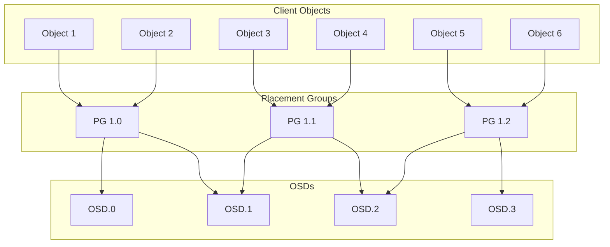
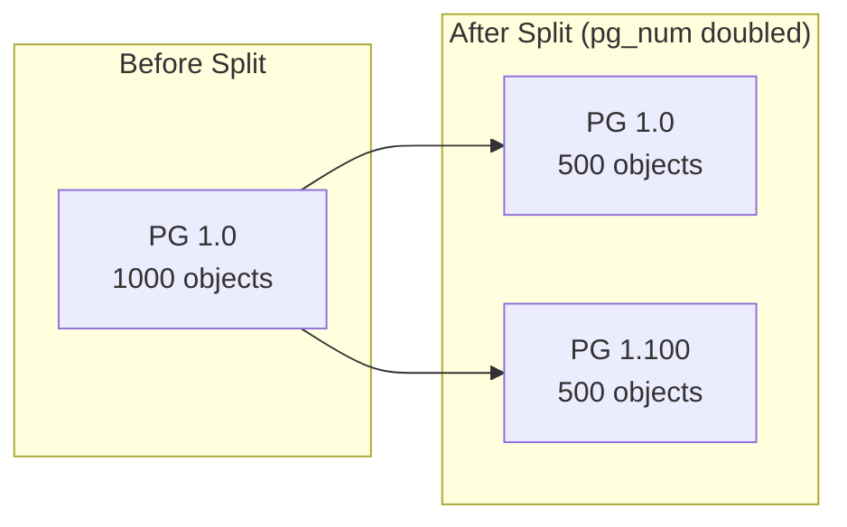
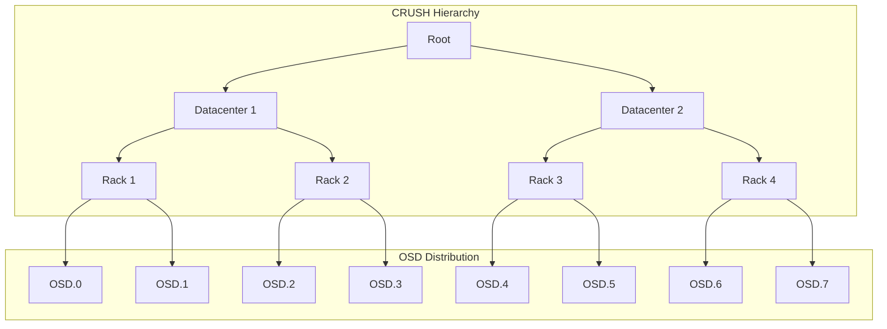
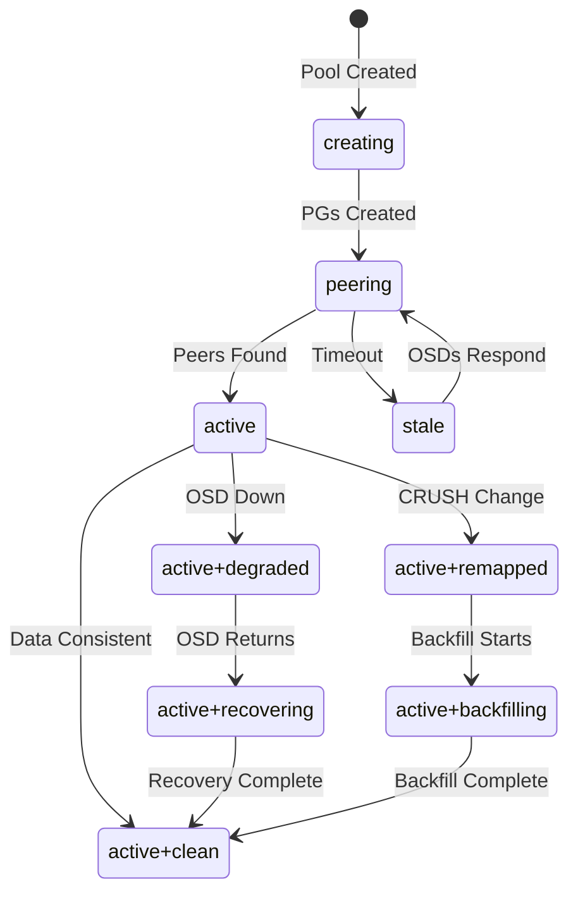

# How to Configure Ceph Placement Groups for Optimal Performance

Author: [nawazdhandala](https://github.com/nawazdhandala)

Tags: Ceph, Storage, Performance, Configuration, Cloud Native

Description: A guide to understanding and configuring Ceph placement groups (PGs) for optimal cluster performance.

---

## Introduction

Ceph is a highly scalable, software-defined storage system that provides object, block, and file storage from a single unified platform. At the heart of Ceph's data distribution mechanism lies the concept of **Placement Groups (PGs)**. Understanding and properly configuring PGs is crucial for achieving optimal cluster performance, efficient data distribution, and system reliability.

This guide covers everything you need to know about Ceph Placement Groups, from fundamental concepts to advanced configuration techniques, including the PG autoscaler, manual PG adjustments, and troubleshooting common issues.

## What Are Placement Groups?

Placement Groups are an abstraction layer between objects and OSDs (Object Storage Daemons). They serve as a logical collection of objects that are mapped to OSDs together. Instead of tracking millions of individual objects, Ceph tracks thousands of PGs, making data management more efficient.



### Why PGs Matter for Performance

1. **Data Distribution**: PGs determine how data is spread across OSDs
2. **Recovery Efficiency**: Smaller, well-distributed PGs enable faster recovery
3. **Resource Utilization**: Proper PG count prevents hotspots and underutilization
4. **Memory Overhead**: Each PG consumes memory on OSDs

## Understanding PG Calculation

The number of PGs affects cluster performance significantly. Too few PGs lead to uneven data distribution, while too many waste resources and slow down recovery.

### The PG Calculation Formula

The recommended formula for calculating the total number of PGs for a pool is:

```
Total PGs = (Target PGs per OSD * Number of OSDs * Pool Data Percentage) / Replication Factor
```

This command retrieves the current OSD count and calculates recommended PGs:

```bash
# Get the number of OSDs in the cluster
ceph osd stat

# Example output: 12 osds: 12 up, 12 in
# For a pool using 100% of cluster with replication factor 3 and target 100 PGs per OSD:
# Total PGs = (100 * 12 * 1.0) / 3 = 400
# Round to nearest power of 2: 512
```

### PG Count Guidelines

Here is a table showing recommended PG counts based on OSD count:

| OSDs | Replication | Recommended PGs per Pool |
|------|-------------|-------------------------|
| < 5  | 3           | 64 - 128               |
| 5-10 | 3           | 128 - 256              |
| 10-50| 3           | 256 - 512              |
| > 50 | 3           | 512 - 4096             |

## Configuring PG Autoscaler

The PG autoscaler automatically adjusts the number of PGs based on cluster usage patterns. This feature was introduced in Ceph Nautilus and is the recommended approach for most deployments.

### Enabling the Autoscaler Module

First, enable the PG autoscaler manager module:

```bash
# Enable the pg_autoscaler module in the Ceph manager
ceph mgr module enable pg_autoscaler
```

### Setting Autoscaler Modes

The autoscaler supports three modes: `on`, `warn`, and `off`:

```bash
# Set autoscaler to automatic mode for a specific pool
# This allows Ceph to automatically adjust PG count
ceph osd pool set <pool-name> pg_autoscale_mode on

# Set autoscaler to warn mode - it will suggest changes but not apply them
# Useful for production environments where you want manual control
ceph osd pool set <pool-name> pg_autoscale_mode warn

# Disable autoscaler for a pool
# Use this when you want complete manual control over PG count
ceph osd pool set <pool-name> pg_autoscale_mode off
```

### Setting Default Autoscaler Mode

Configure the default autoscaler mode for all new pools:

```bash
# Set the default pg_autoscale_mode for all newly created pools
# This ensures consistent behavior across your cluster
ceph config set global osd_pool_default_pg_autoscale_mode on
```

### Viewing Autoscaler Status

Check the current autoscaler recommendations and status:

```bash
# Display autoscaler status for all pools
# Shows current PG count, target PG count, and autoscaler decisions
ceph osd pool autoscale-status
```

Example output:

```
POOL                     SIZE  TARGET SIZE  RATE  RAW CAPACITY   RATIO  TARGET RATIO  EFFECTIVE RATIO  BIAS  PG_NUM  NEW PG_NUM  AUTOSCALE
device_health_metrics      0                 3.0        20.0T   0.0000                                  1.0       1              on
rbd                     1.5T                 3.0        20.0T   0.2250                                  1.0     128         256  on
cephfs_data             5.0T                 3.0        20.0T   0.7500                                  1.0     256         512  on
cephfs_metadata          50M                 3.0        20.0T   0.0075                                  4.0      32              on
```

### Configuring Target Ratios

Set target ratios to help the autoscaler understand expected pool sizes:

```bash
# Set the target ratio for a pool
# This tells the autoscaler what percentage of cluster capacity this pool should use
# Value between 0.0 and 1.0 (e.g., 0.5 = 50% of cluster capacity)
ceph osd pool set <pool-name> target_size_ratio 0.3

# Alternatively, set an absolute target size in bytes
# Useful when you know the expected data size
ceph osd pool set <pool-name> target_size_bytes 1T
```

### Setting PG Number Limits

Configure minimum and maximum PG boundaries:

```bash
# Set minimum number of PGs for a pool
# Prevents autoscaler from reducing PGs below this threshold
ceph osd pool set <pool-name> pg_num_min 32

# Set maximum number of PGs (global setting)
# Prevents excessive PG creation which can impact performance
ceph config set global mon_max_pg_per_osd 250
```

## Manual PG Configuration

Sometimes manual PG configuration is necessary, especially for specialized workloads or during initial cluster setup.

### Creating a Pool with Specific PG Count

Create a new pool with a specific number of PGs:

```bash
# Create a replicated pool with specified PG count
# Syntax: ceph osd pool create <pool-name> <pg_num> [pgp_num] [replicated|erasure]
# pg_num: Number of placement groups
# pgp_num: Number of placement groups for placement (usually same as pg_num)
ceph osd pool create mypool 128 128 replicated

# Create an erasure-coded pool with specific PG count
# Erasure coding provides space efficiency at the cost of compute overhead
ceph osd pool create ec-pool 256 256 erasure
```

### Modifying PG Count for Existing Pools

Adjust PG count for an existing pool:

```bash
# Increase the number of PGs in an existing pool
# Note: This triggers PG splitting which causes data movement
ceph osd pool set <pool-name> pg_num 256

# Set the placement group count for placement
# This should match pg_num after the split completes
ceph osd pool set <pool-name> pgp_num 256
```

### Viewing Current PG Configuration

Inspect current PG settings for pools:

```bash
# Show detailed information about a specific pool including PG settings
ceph osd pool get <pool-name> all

# List all pools with their PG counts
ceph osd pool ls detail

# Get specific PG-related settings
ceph osd pool get <pool-name> pg_num
ceph osd pool get <pool-name> pgp_num
ceph osd pool get <pool-name> pg_num_target
```

## PG Splitting and Merging

PG splitting divides existing PGs into smaller ones, while merging combines PGs. These operations are essential for scaling clusters.

### Understanding PG Splitting



### Performing PG Splitting

Split PGs by increasing the pg_num:

```bash
# First, check current PG distribution and health
ceph pg stat

# Increase pg_num to trigger splitting
# Best practice: Double the PG count to maintain even distribution
# Current: 128, New: 256
ceph osd pool set <pool-name> pg_num 256

# Monitor the splitting progress
# Look for 'splitting' state in PG status
ceph pg stat

# Once splitting completes, update pgp_num to redistribute
# This triggers the actual data movement
ceph osd pool set <pool-name> pgp_num 256

# Monitor data movement progress
ceph -s
```

### Controlling Split Rate

Limit the rate of PG splitting to minimize performance impact:

```bash
# Set the maximum number of PGs that can be splitting simultaneously per OSD
# Lower values reduce performance impact but slow down the process
ceph config set osd osd_max_pg_per_osd_hard_ratio 3

# Set the split threshold to control when splits happen
# This affects how aggressively the autoscaler splits PGs
ceph config set mgr mgr/pg_autoscaler/threshold 3.0
```

### PG Merging (Reducing PG Count)

Merge PGs by decreasing the pg_num (available in Ceph Nautilus and later):

```bash
# Check if PG merging is supported
ceph features

# Reduce the number of PGs (triggers merging)
# Note: pg_num can only be reduced to a power of 2 that divides the current pg_num
ceph osd pool set <pool-name> pg_num 64

# Monitor the merging process
ceph pg stat

# Update pgp_num after merging completes
ceph osd pool set <pool-name> pgp_num 64
```

## Data Distribution Analysis

Understanding how data is distributed across PGs and OSDs is essential for performance optimization.

### Visualizing Data Distribution



### Checking PG Distribution

Analyze how PGs are distributed across OSDs:

```bash
# Show PG distribution per OSD
# Helps identify imbalanced OSDs
ceph osd df tree

# Get detailed PG statistics
ceph pg dump

# Show PG distribution summary
ceph pg stat

# Check for skewed data distribution
# Look for OSDs with significantly more PGs than others
ceph osd utilization
```

### Analyzing PG States

Monitor PG states to ensure cluster health:

```bash
# List all PGs with their current states
ceph pg ls

# Filter PGs by state (e.g., show only recovering PGs)
ceph pg ls recovering

# Get detailed information about a specific PG
ceph pg <pg_id> query

# Show PG state summary
ceph pg stat
```

## Troubleshooting PG Issues

Common PG problems and their solutions.

### Diagnosing PG States



### Common PG Problems

#### Stuck PGs

Identify and resolve stuck PGs:

```bash
# Find PGs that are stuck in various states
# 'stuck inactive' - PGs not able to serve I/O
# 'stuck unclean' - PGs with degraded data
# 'stuck stale' - PGs with no OSD reporting
ceph pg dump_stuck inactive
ceph pg dump_stuck unclean
ceph pg dump_stuck stale

# Check for specific stuck states with time threshold (in seconds)
ceph pg dump_stuck inactive 300

# Force PG recovery if stuck
# Use with caution - only when absolutely necessary
ceph pg force-recovery <pg_id>

# Force PG backfill if stuck
ceph pg force-backfill <pg_id>
```

#### Inconsistent PGs

Handle PGs with data inconsistency:

```bash
# Find inconsistent PGs
ceph health detail | grep inconsistent

# Repair an inconsistent PG
# This performs a scrub and fixes inconsistencies
ceph pg repair <pg_id>

# Deep scrub a specific PG to detect inconsistencies
ceph pg deep-scrub <pg_id>

# Initiate a scrub on all PGs (use during maintenance windows)
ceph osd pool scrub <pool-name>
```

#### Too Many PGs Per OSD

Address warnings about excessive PGs per OSD:

```bash
# Check current PGs per OSD
ceph osd df

# View the warning threshold
ceph config get mon mon_max_pg_per_osd

# Increase the threshold if appropriate for your hardware
# Only do this if OSDs have sufficient memory (1GB+ per 100 PGs recommended)
ceph config set global mon_max_pg_per_osd 300

# Alternatively, reduce PGs in pools or add more OSDs
ceph osd pool set <pool-name> pg_num <lower_number>
```

### Recovery and Backfill Tuning

Optimize recovery performance:

```bash
# Set maximum number of concurrent backfill operations per OSD
# Higher values speed up recovery but increase I/O load
ceph config set osd osd_max_backfills 2

# Set maximum recovery operations per OSD
ceph config set osd osd_recovery_max_active 5

# Limit recovery I/O to reduce impact on client operations
# Value in bytes per second
ceph config set osd osd_recovery_max_single_start 1

# Set recovery operation priority (lower = less priority)
# Range: 1-63, default is 5
ceph config set osd osd_recovery_op_priority 3

# Set recovery sleep interval to reduce OSD load
# Time in seconds between recovery operations
ceph config set osd osd_recovery_sleep 0.1
```

### PG Peering Issues

Resolve PGs stuck in peering state:

```bash
# Check which OSDs a PG is mapped to
ceph pg map <pg_id>

# Check OSD status for the affected PG
ceph osd status

# View detailed PG query for peering issues
ceph pg <pg_id> query | grep -A 20 peering

# If an OSD is blocking peering and cannot recover, mark it lost
# WARNING: This can result in data loss - use only as last resort
ceph osd lost <osd_id> --yes-i-really-mean-it
```

## Advanced PG Configuration

### Configuring PG Parameters for Different Workloads

Optimize PG settings for specific use cases:

```bash
# For high-throughput sequential workloads (e.g., video streaming)
# Use larger PGs for better sequential I/O
ceph osd pool set <pool-name> pg_num 64
ceph osd pool set <pool-name> target_size_ratio 0.5

# For random I/O workloads (e.g., databases)
# Use more PGs for better parallelism
ceph osd pool set <pool-name> pg_num 256
ceph osd pool set <pool-name> pg_autoscale_mode on

# For CephFS metadata pool
# Use more PGs relative to data as metadata operations are frequent
# Set higher autoscale bias
ceph osd pool set cephfs_metadata pg_autoscale_bias 4
```

### Pool-Level PG Configuration

Configure PG settings at the pool level:

```bash
# Set the minimum PG number (prevents autoscaler from going below)
ceph osd pool set <pool-name> pg_num_min 64

# Set autoscale bias to influence PG allocation priority
# Higher values give this pool more PGs relative to others
ceph osd pool set <pool-name> pg_autoscale_bias 2.0

# Set bulk flag for pools that store large objects
# Optimizes PG behavior for bulk data
ceph osd pool set <pool-name> bulk true
```

### Monitoring PG Performance

Set up monitoring for PG-related metrics:

```bash
# Enable detailed PG statistics
ceph config set mgr mgr/prometheus/rbd_stats_pools "*"

# Check PG-related performance metrics
ceph daemon osd.0 perf dump | grep -i pg

# View PG latency statistics
ceph osd pool stats <pool-name>

# Monitor PG operation rates
ceph osd pool stats
```

## Best Practices Summary

### PG Configuration Checklist

1. **Use the PG Autoscaler**: Enable `pg_autoscale_mode on` for most pools
2. **Set Appropriate Targets**: Configure `target_size_ratio` or `target_size_bytes`
3. **Monitor Regularly**: Check `ceph osd pool autoscale-status` periodically
4. **Avoid Extremes**: Neither too few nor too many PGs
5. **Plan for Growth**: Consider future cluster expansion when setting PGs
6. **Test Changes**: Validate PG changes in non-production first

### Quick Reference Commands

Essential commands for PG management:

```bash
# Health and status
ceph health detail           # Check cluster health including PG issues
ceph pg stat                 # PG status summary
ceph osd pool autoscale-status  # Autoscaler status

# Configuration
ceph osd pool set <pool> pg_num <num>           # Set PG count
ceph osd pool set <pool> pg_autoscale_mode on   # Enable autoscaler
ceph osd pool set <pool> target_size_ratio 0.3  # Set target ratio

# Troubleshooting
ceph pg dump_stuck unclean   # Find stuck PGs
ceph pg <pg_id> query        # Query specific PG
ceph pg repair <pg_id>       # Repair inconsistent PG
```

## Conclusion

Proper Placement Group configuration is fundamental to Ceph cluster performance. The key takeaways are:

1. **Understand Your Workload**: Different workloads benefit from different PG configurations
2. **Leverage Autoscaling**: The PG autoscaler handles most scenarios well
3. **Monitor Continuously**: Regular monitoring prevents PG-related issues
4. **Scale Gradually**: Make incremental changes and observe results
5. **Plan for Recovery**: Consider recovery time when setting PG counts

By following the guidelines in this comprehensive guide, you can ensure your Ceph cluster maintains optimal performance and reliability through proper Placement Group management.

## Additional Resources

- [Ceph Documentation - Placement Groups](https://docs.ceph.com/en/latest/rados/operations/placement-groups/)
- [Ceph PG Calculator](https://ceph.io/pgcalc/)
- [CRUSH Algorithm Paper](https://ceph.io/assets/pdfs/weil-crush-sc06.pdf)
- [Ceph Performance Tuning Guide](https://docs.ceph.com/en/latest/rados/configuration/osd-config-ref/)
