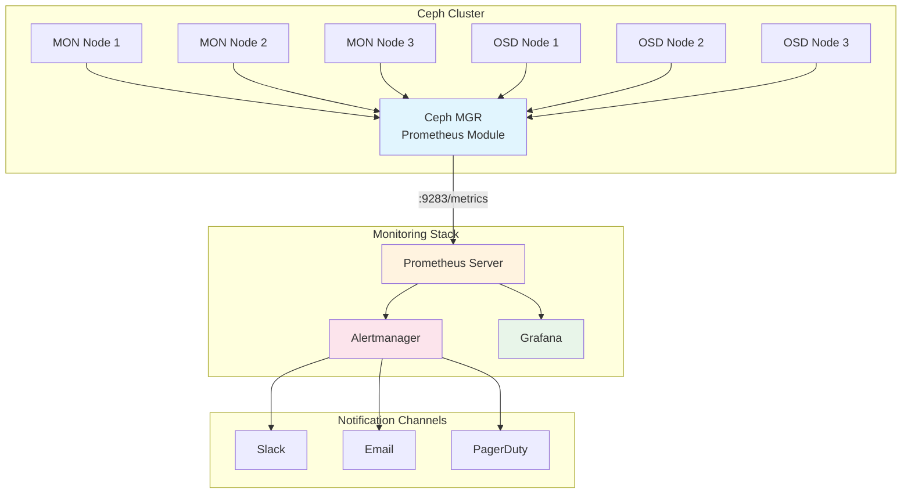
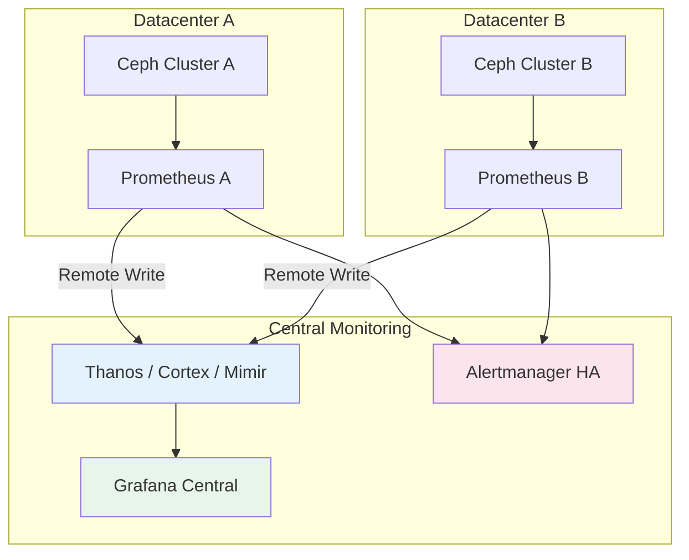

# How to Monitor Ceph Cluster Health with Prometheus and Grafana

Author: [nawazdhandala](https://github.com/nawazdhandala)

Tags: Ceph, Prometheus, Grafana, Monitoring, Observability, Storage

Description: A complete guide to setting up comprehensive monitoring for Ceph clusters using Prometheus and Grafana.

---

Ceph is a powerful, scalable distributed storage system that provides object, block, and file storage in a single unified platform. However, managing a Ceph cluster effectively requires robust monitoring to detect issues before they impact your applications. In this comprehensive guide, we will walk through setting up Prometheus and Grafana to monitor your Ceph cluster health, performance, and capacity.

## Table of Contents

1. [Understanding Ceph Monitoring Architecture](#understanding-ceph-monitoring-architecture)
2. [Prerequisites](#prerequisites)
3. [Enabling the Ceph MGR Prometheus Module](#enabling-the-ceph-mgr-prometheus-module)
4. [Configuring Prometheus to Scrape Ceph Metrics](#configuring-prometheus-to-scrape-ceph-metrics)
5. [Setting Up Grafana Dashboards](#setting-up-grafana-dashboards)
6. [Key Metrics to Monitor](#key-metrics-to-monitor)
7. [Creating Alerting Rules](#creating-alerting-rules)
8. [Health Check Configurations](#health-check-configurations)
9. [Advanced Monitoring Patterns](#advanced-monitoring-patterns)
10. [Troubleshooting Common Issues](#troubleshooting-common-issues)

## Understanding Ceph Monitoring Architecture

Before diving into the configuration, let's understand how the monitoring stack fits together. The following diagram illustrates the data flow from Ceph to your monitoring dashboards:



The Ceph Manager (MGR) daemon includes a built-in Prometheus module that exposes cluster metrics on an HTTP endpoint. Prometheus scrapes these metrics at regular intervals, stores them in its time-series database, and Grafana queries Prometheus to visualize the data.

## Prerequisites

Before proceeding, ensure you have the following components ready:

- A running Ceph cluster (Quincy or later recommended)
- At least one Ceph MGR daemon running
- Prometheus server (version 2.45 or later)
- Grafana (version 10.0 or later)
- Network connectivity between Prometheus and Ceph MGR nodes

The following command verifies your Ceph cluster status and MGR availability:

```bash
# Check overall cluster health and ensure MGR daemons are running
# This command provides a quick overview of cluster status
ceph status

# Example output showing healthy cluster with active MGR:
# cluster:
#   id:     a7f64266-0894-4f1e-a635-d0aeaca0e993
#   health: HEALTH_OK
#
# services:
#   mon: 3 daemons, quorum ceph-mon1,ceph-mon2,ceph-mon3
#   mgr: ceph-mgr1(active), standbys: ceph-mgr2
#   osd: 12 osds: 12 up, 12 in
```

## Enabling the Ceph MGR Prometheus Module

The Ceph MGR Prometheus module is the gateway for all cluster metrics. Let's enable and configure it properly.

### Step 1: Enable the Prometheus Module

The following commands enable the Prometheus module on your Ceph MGR daemon:

```bash
# Enable the prometheus module in Ceph MGR
# This activates the metrics endpoint on the active MGR daemon
ceph mgr module enable prometheus

# Verify the module is enabled and running
# The output should show 'prometheus' in the list of enabled modules
ceph mgr module ls | grep -A5 enabled_modules
```

### Step 2: Configure the Prometheus Module

You can customize the Prometheus module settings to match your environment:

```bash
# Set the network address where metrics will be exposed
# Use 0.0.0.0 to listen on all interfaces, or specify a specific IP
ceph config set mgr mgr/prometheus/server_addr 0.0.0.0

# Set the port for the metrics endpoint (default is 9283)
# Ensure this port is open in your firewall rules
ceph config set mgr mgr/prometheus/port 9283

# Enable scraping of RBD (block device) performance metrics
# This provides detailed I/O statistics for RBD images
ceph config set mgr mgr/prometheus/rbd_stats_pools "*"

# Set the interval for collecting RBD stats (in seconds)
# Lower values provide more granular data but increase overhead
ceph config set mgr mgr/prometheus/rbd_stats_pools_refresh_interval 300

# Restart the MGR module to apply changes
ceph mgr module disable prometheus && ceph mgr module enable prometheus
```

### Step 3: Verify Metrics Endpoint

Confirm that the Prometheus endpoint is accessible:

```bash
# Replace <mgr-node-ip> with your active MGR node's IP address
# This should return Prometheus-formatted metrics
curl -s http://<mgr-node-ip>:9283/metrics | head -50

# Check for specific Ceph metrics to verify proper operation
# The ceph_health_status metric is fundamental for cluster health monitoring
curl -s http://<mgr-node-ip>:9283/metrics | grep ceph_health_status

# Expected output format:
# ceph_health_status 0
# Where: 0 = HEALTH_OK, 1 = HEALTH_WARN, 2 = HEALTH_ERR
```

## Configuring Prometheus to Scrape Ceph Metrics

Now we need to configure Prometheus to collect metrics from the Ceph MGR endpoint.

### Step 1: Update Prometheus Configuration

Add the following job configuration to your `prometheus.yml` file:

```yaml
# Prometheus configuration for Ceph cluster monitoring
# This configuration enables comprehensive Ceph metrics collection

global:
  # Scrape interval determines how frequently Prometheus collects metrics
  # 15 seconds provides good granularity without excessive overhead
  scrape_interval: 15s

  # Evaluation interval for alerting rules
  # Matches scrape interval for consistent alert evaluation
  evaluation_interval: 15s

# Alertmanager configuration for sending alerts
alerting:
  alertmanagers:
    - static_configs:
        - targets:
            # Replace with your Alertmanager address
            - alertmanager:9093

# Load alerting rules from external files
# We'll create these rule files in a later section
rule_files:
  - "/etc/prometheus/rules/ceph_alerts.yml"
  - "/etc/prometheus/rules/ceph_recording_rules.yml"

scrape_configs:
  # Job for scraping Ceph MGR Prometheus metrics
  - job_name: 'ceph'

    # Honor labels from Ceph to preserve cluster identification
    # This is important when monitoring multiple Ceph clusters
    honor_labels: true

    # Static configuration for Ceph MGR endpoints
    # For high availability, list all MGR nodes
    static_configs:
      - targets:
          # Primary MGR node
          - 'ceph-mgr1:9283'
          # Standby MGR node (Prometheus will scrape active MGR)
          - 'ceph-mgr2:9283'
        labels:
          # Add custom labels for identification
          cluster: 'production-ceph'
          environment: 'production'

    # Relabel configurations for better metric organization
    relabel_configs:
      # Add instance label based on target address
      - source_labels: [__address__]
        target_label: instance
        regex: '([^:]+):\d+'
        replacement: '${1}'

      # Add a source label to identify metrics origin
      - target_label: source
        replacement: 'ceph-mgr'

    # Metric relabeling to drop unnecessary high-cardinality metrics
    # This helps reduce storage requirements
    metric_relabel_configs:
      # Keep only essential OSD metrics by filtering device-level details
      - source_labels: [__name__]
        regex: 'ceph_osd_apply_latency_ms|ceph_osd_commit_latency_ms'
        action: keep
```

### Step 2: Advanced Service Discovery Configuration

For dynamic environments, use file-based service discovery:

```yaml
# File-based service discovery for dynamic Ceph MGR endpoints
# This is useful when MGR nodes change frequently or in containerized deployments

scrape_configs:
  - job_name: 'ceph-cluster'

    # Use file-based service discovery
    # Prometheus will watch this file for changes and update targets
    file_sd_configs:
      - files:
          - '/etc/prometheus/targets/ceph_targets.json'
        # Refresh interval for checking file changes
        refresh_interval: 30s

    # Add authentication if your Ceph MGR requires it
    # Uncomment and configure if using authentication
    # basic_auth:
    #   username: 'prometheus'
    #   password_file: '/etc/prometheus/secrets/ceph_password'

    # TLS configuration for secure metrics scraping
    # Enable this if your Ceph MGR uses HTTPS
    # tls_config:
    #   ca_file: '/etc/prometheus/certs/ca.crt'
    #   cert_file: '/etc/prometheus/certs/client.crt'
    #   key_file: '/etc/prometheus/certs/client.key'
    #   insecure_skip_verify: false
```

Create the corresponding targets file:

```json
// File: /etc/prometheus/targets/ceph_targets.json
// This file defines the Ceph MGR endpoints for Prometheus to scrape
// Update this file when adding or removing MGR nodes

[
  {
    "targets": [
      "ceph-mgr1.example.com:9283",
      "ceph-mgr2.example.com:9283"
    ],
    "labels": {
      "cluster": "production-ceph",
      "datacenter": "dc1",
      "environment": "production"
    }
  },
  {
    "targets": [
      "ceph-mgr-staging1.example.com:9283"
    ],
    "labels": {
      "cluster": "staging-ceph",
      "datacenter": "dc1",
      "environment": "staging"
    }
  }
]
```

### Step 3: Validate Prometheus Configuration

Before restarting Prometheus, validate the configuration:

```bash
# Use promtool to check configuration syntax
# This prevents startup failures due to configuration errors
promtool check config /etc/prometheus/prometheus.yml

# Expected output for valid configuration:
# Checking /etc/prometheus/prometheus.yml
#   SUCCESS: 1 rule files found
#
# Checking /etc/prometheus/rules/ceph_alerts.yml
#   SUCCESS: 10 rules found

# Reload Prometheus configuration without restart
# This applies changes immediately with zero downtime
curl -X POST http://localhost:9090/-/reload

# Alternatively, send SIGHUP to the Prometheus process
# kill -HUP $(pgrep prometheus)
```

## Setting Up Grafana Dashboards

Grafana provides powerful visualization capabilities for Ceph metrics. Let's set up comprehensive dashboards.

### Step 1: Configure Prometheus Data Source

First, add Prometheus as a data source in Grafana:

```yaml
# File: /etc/grafana/provisioning/datasources/prometheus.yml
# This file configures Prometheus as a data source for Grafana
# Place this in your Grafana provisioning directory

apiVersion: 1

datasources:
  # Primary Prometheus data source for Ceph metrics
  - name: Prometheus-Ceph
    type: prometheus
    access: proxy
    url: http://prometheus:9090
    isDefault: true

    # Enable exemplar support for trace correlation
    jsonData:
      exemplarTraceIdDestinations:
        - name: trace_id
          datasourceUid: tempo
      httpMethod: POST
      manageAlerts: true
      prometheusType: Prometheus
      prometheusVersion: "2.45.0"

    # Scrape interval should match Prometheus configuration
    editable: false
```

### Step 2: Import Official Ceph Dashboard

The Ceph community maintains official Grafana dashboards. Here's how to import them:

```bash
# Download the official Ceph dashboard JSON
# This dashboard is maintained by the Ceph community and includes comprehensive panels
curl -o /tmp/ceph-dashboard.json \
  https://raw.githubusercontent.com/ceph/ceph/main/monitoring/ceph-mixin/dashboards_out/ceph-cluster.json

# Import via Grafana API
# Replace <grafana-host> and <api-key> with your values
curl -X POST \
  -H "Authorization: Bearer <api-key>" \
  -H "Content-Type: application/json" \
  -d @/tmp/ceph-dashboard.json \
  http://<grafana-host>:3000/api/dashboards/db
```

### Step 3: Create Custom Ceph Overview Dashboard

Here's a custom dashboard JSON that provides a comprehensive cluster overview:

```json
{
  "annotations": {
    "list": [
      {
        "datasource": "Prometheus-Ceph",
        "enable": true,
        "expr": "changes(ceph_health_status[5m]) > 0",
        "name": "Health Status Changes",
        "tagKeys": "cluster",
        "titleFormat": "Cluster Health Changed"
      }
    ]
  },
  "title": "Ceph Cluster Overview",
  "description": "Comprehensive overview of Ceph cluster health, performance, and capacity",
  "uid": "ceph-overview-v1",
  "version": 1,
  "panels": [
    {
      "id": 1,
      "title": "Cluster Health Status",
      "type": "stat",
      "description": "Current cluster health: 0=OK, 1=WARN, 2=ERR",
      "gridPos": {"h": 4, "w": 6, "x": 0, "y": 0},
      "targets": [
        {
          "expr": "ceph_health_status",
          "legendFormat": "Health Status"
        }
      ],
      "fieldConfig": {
        "defaults": {
          "mappings": [
            {"type": "value", "options": {"0": {"text": "HEALTHY", "color": "green"}}},
            {"type": "value", "options": {"1": {"text": "WARNING", "color": "yellow"}}},
            {"type": "value", "options": {"2": {"text": "ERROR", "color": "red"}}}
          ],
          "thresholds": {
            "mode": "absolute",
            "steps": [
              {"color": "green", "value": null},
              {"color": "yellow", "value": 1},
              {"color": "red", "value": 2}
            ]
          }
        }
      }
    },
    {
      "id": 2,
      "title": "Total Cluster Capacity",
      "type": "gauge",
      "description": "Percentage of total cluster capacity used",
      "gridPos": {"h": 4, "w": 6, "x": 6, "y": 0},
      "targets": [
        {
          "expr": "(ceph_cluster_total_used_bytes / ceph_cluster_total_bytes) * 100",
          "legendFormat": "Used %"
        }
      ],
      "fieldConfig": {
        "defaults": {
          "unit": "percent",
          "min": 0,
          "max": 100,
          "thresholds": {
            "mode": "absolute",
            "steps": [
              {"color": "green", "value": null},
              {"color": "yellow", "value": 70},
              {"color": "orange", "value": 80},
              {"color": "red", "value": 90}
            ]
          }
        }
      }
    },
    {
      "id": 3,
      "title": "OSD Status Overview",
      "type": "stat",
      "description": "Count of OSDs in different states",
      "gridPos": {"h": 4, "w": 6, "x": 12, "y": 0},
      "targets": [
        {
          "expr": "count(ceph_osd_up == 1)",
          "legendFormat": "Up"
        },
        {
          "expr": "count(ceph_osd_up == 0)",
          "legendFormat": "Down"
        },
        {
          "expr": "count(ceph_osd_in == 1)",
          "legendFormat": "In"
        }
      ]
    },
    {
      "id": 4,
      "title": "IOPS Over Time",
      "type": "timeseries",
      "description": "Read and write operations per second across the cluster",
      "gridPos": {"h": 8, "w": 12, "x": 0, "y": 4},
      "targets": [
        {
          "expr": "sum(rate(ceph_osd_op_r[5m]))",
          "legendFormat": "Read IOPS"
        },
        {
          "expr": "sum(rate(ceph_osd_op_w[5m]))",
          "legendFormat": "Write IOPS"
        }
      ],
      "fieldConfig": {
        "defaults": {
          "unit": "ops"
        }
      }
    },
    {
      "id": 5,
      "title": "Throughput Over Time",
      "type": "timeseries",
      "description": "Read and write throughput in bytes per second",
      "gridPos": {"h": 8, "w": 12, "x": 12, "y": 4},
      "targets": [
        {
          "expr": "sum(rate(ceph_osd_op_r_out_bytes[5m]))",
          "legendFormat": "Read Throughput"
        },
        {
          "expr": "sum(rate(ceph_osd_op_w_in_bytes[5m]))",
          "legendFormat": "Write Throughput"
        }
      ],
      "fieldConfig": {
        "defaults": {
          "unit": "Bps"
        }
      }
    },
    {
      "id": 6,
      "title": "OSD Latency Distribution",
      "type": "heatmap",
      "description": "Distribution of OSD apply latency across the cluster",
      "gridPos": {"h": 8, "w": 12, "x": 0, "y": 12},
      "targets": [
        {
          "expr": "ceph_osd_apply_latency_ms",
          "legendFormat": "{{osd}}"
        }
      ]
    },
    {
      "id": 7,
      "title": "Pool Usage",
      "type": "table",
      "description": "Storage usage breakdown by pool",
      "gridPos": {"h": 8, "w": 12, "x": 12, "y": 12},
      "targets": [
        {
          "expr": "ceph_pool_stored_raw",
          "legendFormat": "{{name}}",
          "format": "table",
          "instant": true
        }
      ]
    }
  ],
  "templating": {
    "list": [
      {
        "name": "cluster",
        "type": "query",
        "datasource": "Prometheus-Ceph",
        "query": "label_values(ceph_health_status, cluster)",
        "refresh": 1,
        "includeAll": true
      },
      {
        "name": "pool",
        "type": "query",
        "datasource": "Prometheus-Ceph",
        "query": "label_values(ceph_pool_stored_raw{cluster=~\"$cluster\"}, name)",
        "refresh": 1,
        "includeAll": true
      }
    ]
  },
  "time": {
    "from": "now-6h",
    "to": "now"
  },
  "refresh": "30s"
}
```

### Step 4: Provision Dashboard via Configuration

For automated deployment, use Grafana's provisioning feature:

```yaml
# File: /etc/grafana/provisioning/dashboards/ceph.yml
# This configuration tells Grafana where to find dashboard JSON files
# Dashboards are automatically loaded and updated when files change

apiVersion: 1

providers:
  # Provider for Ceph-related dashboards
  - name: 'Ceph Dashboards'
    orgId: 1
    folder: 'Ceph Monitoring'
    folderUid: 'ceph-folder'
    type: file
    disableDeletion: false
    updateIntervalSeconds: 30
    allowUiUpdates: true
    options:
      # Path where dashboard JSON files are stored
      path: /var/lib/grafana/dashboards/ceph
      # Watch for file changes and reload automatically
      foldersFromFilesStructure: true
```

## Key Metrics to Monitor

Understanding which metrics to monitor is crucial for effective Ceph cluster management. Here's a comprehensive breakdown:

### Cluster Health Metrics

```promql
# Primary cluster health indicator
# 0 = HEALTH_OK, 1 = HEALTH_WARN, 2 = HEALTH_ERR
ceph_health_status

# Number of health checks currently failing
# Use this to track the number of issues requiring attention
ceph_health_detail

# Monitor daemon availability
# These should always equal your expected daemon count
ceph_mon_quorum_status
ceph_mgr_status
```

### Capacity and Storage Metrics

```promql
# Total raw bytes available in the cluster
# This represents the sum of all OSD storage devices
ceph_cluster_total_bytes

# Total raw bytes used in the cluster
# Monitor this against total_bytes for capacity planning
ceph_cluster_total_used_bytes

# Available bytes for new data
# When this approaches zero, new writes will fail
ceph_cluster_total_avail_bytes

# Per-pool storage metrics for granular capacity tracking
# Useful for identifying which pools consume the most storage
ceph_pool_bytes_used{pool="<pool_name>"}
ceph_pool_stored_raw{pool="<pool_name>"}
ceph_pool_max_avail{pool="<pool_name>"}

# Object count per pool
# High object counts can impact metadata operations
ceph_pool_objects{pool="<pool_name>"}
```

### Performance Metrics

```promql
# OSD operation rates (operations per second)
# These metrics help identify I/O patterns and bottlenecks
rate(ceph_osd_op_r[5m])      # Read operations rate
rate(ceph_osd_op_w[5m])      # Write operations rate
rate(ceph_osd_op_rw[5m])     # Read-modify-write operations rate

# Throughput metrics (bytes per second)
# Essential for understanding data transfer rates
rate(ceph_osd_op_r_out_bytes[5m])    # Read throughput
rate(ceph_osd_op_w_in_bytes[5m])     # Write throughput

# Latency metrics (milliseconds)
# High latency indicates performance issues
ceph_osd_apply_latency_ms    # Time to apply writes to storage
ceph_osd_commit_latency_ms   # Time to commit writes (journal/WAL)

# Recovery and backfill operations
# Monitor these during cluster expansion or OSD failures
ceph_pg_recovering
ceph_pg_backfilling
rate(ceph_osd_recovery_ops[5m])
```

### OSD Health Metrics

```promql
# OSD availability status
# ceph_osd_up: 1 = running, 0 = not running
# ceph_osd_in: 1 = in cluster, 0 = out of cluster
ceph_osd_up
ceph_osd_in

# OSD weight affects data distribution
# Weight of 0 means OSD won't receive new data
ceph_osd_weight

# OSD utilization percentage
# Uneven utilization can indicate rebalancing is needed
ceph_osd_utilization

# Slow OSD operations
# High values indicate performance problems
ceph_osd_slow_ops
```

### Placement Group (PG) Metrics

```promql
# Total PG count per pool
# Should remain stable unless pool configuration changes
ceph_pool_num_pg{pool="<pool_name>"}

# PG states indicating issues
# Non-zero values for these require investigation
ceph_pg_degraded         # PGs with reduced replica count
ceph_pg_inconsistent     # PGs with inconsistent data
ceph_pg_undersized       # PGs below minimum size
ceph_pg_stale            # PGs not updating (OSD failure)
ceph_pg_peering          # PGs establishing relationships
ceph_pg_remapped         # PGs temporarily on wrong OSDs

# Healthy PG states
# These should represent the majority of your PGs
ceph_pg_active           # PGs actively serving I/O
ceph_pg_clean            # PGs with all replicas present
```

## Creating Alerting Rules

Proper alerting is essential for proactive cluster management. Here are comprehensive alerting rules:

### Critical Health Alerts

```yaml
# File: /etc/prometheus/rules/ceph_alerts.yml
# Critical alerting rules for Ceph cluster monitoring
# These rules trigger alerts for conditions requiring immediate attention

groups:
  - name: ceph-critical-alerts
    # Evaluate rules every 30 seconds for quick detection
    interval: 30s
    rules:
      # Alert when cluster health is in ERROR state
      # This indicates a critical issue requiring immediate action
      - alert: CephClusterHealthError
        expr: ceph_health_status == 2
        for: 1m
        labels:
          severity: critical
          team: storage
        annotations:
          summary: "Ceph cluster health is in ERROR state"
          description: |
            Cluster {{ $labels.cluster }} health status is ERROR.
            This indicates a critical issue such as data unavailability,
            multiple OSD failures, or MON quorum loss.
            Check cluster status immediately with: ceph health detail
          runbook_url: "https://wiki.example.com/runbooks/ceph-health-error"

      # Alert when cluster health is in WARNING state
      # Warnings should be addressed before they escalate to errors
      - alert: CephClusterHealthWarning
        expr: ceph_health_status == 1
        for: 5m
        labels:
          severity: warning
          team: storage
        annotations:
          summary: "Ceph cluster health is in WARNING state"
          description: |
            Cluster {{ $labels.cluster }} health status is WARNING.
            Common causes include near-full OSDs, degraded PGs, or
            clock skew between nodes.
            Investigate with: ceph health detail
          runbook_url: "https://wiki.example.com/runbooks/ceph-health-warning"

      # Alert when OSDs are down
      # OSD failures reduce redundancy and can cause data unavailability
      - alert: CephOSDDown
        expr: ceph_osd_up == 0
        for: 2m
        labels:
          severity: critical
          team: storage
        annotations:
          summary: "Ceph OSD {{ $labels.ceph_daemon }} is down"
          description: |
            OSD {{ $labels.ceph_daemon }} on cluster {{ $labels.cluster }}
            has been down for more than 2 minutes.
            Data redundancy may be compromised.
            Check OSD status: ceph osd tree | grep {{ $labels.ceph_daemon }}
          runbook_url: "https://wiki.example.com/runbooks/ceph-osd-down"

      # Alert when multiple OSDs are down simultaneously
      # Multiple failures indicate a systemic issue
      - alert: CephMultipleOSDsDown
        expr: count(ceph_osd_up == 0) > 1
        for: 1m
        labels:
          severity: critical
          team: storage
        annotations:
          summary: "Multiple Ceph OSDs are down"
          description: |
            {{ $value }} OSDs are currently down on cluster {{ $labels.cluster }}.
            This may indicate a host failure, network issue, or power problem.
            Immediate investigation required.
          runbook_url: "https://wiki.example.com/runbooks/ceph-multiple-osds-down"
```

### Capacity Alerts

```yaml
  - name: ceph-capacity-alerts
    interval: 1m
    rules:
      # Alert when cluster capacity exceeds 80%
      # At this level, performance may start degrading
      - alert: CephClusterNearFull
        expr: |
          (ceph_cluster_total_used_bytes / ceph_cluster_total_bytes) * 100 > 80
        for: 5m
        labels:
          severity: warning
          team: storage
        annotations:
          summary: "Ceph cluster capacity above 80%"
          description: |
            Cluster {{ $labels.cluster }} is {{ printf "%.1f" $value }}% full.
            Performance may degrade as capacity increases.
            Consider adding OSDs or removing unused data.
          runbook_url: "https://wiki.example.com/runbooks/ceph-capacity-warning"

      # Alert when cluster capacity exceeds 90%
      # This is a critical threshold requiring immediate action
      - alert: CephClusterCriticallyFull
        expr: |
          (ceph_cluster_total_used_bytes / ceph_cluster_total_bytes) * 100 > 90
        for: 2m
        labels:
          severity: critical
          team: storage
        annotations:
          summary: "Ceph cluster capacity above 90%"
          description: |
            Cluster {{ $labels.cluster }} is {{ printf "%.1f" $value }}% full.
            Writes may be blocked soon. Emergency capacity action required.
            Add OSDs immediately or enable full ratio bypass.
          runbook_url: "https://wiki.example.com/runbooks/ceph-capacity-critical"

      # Alert when individual OSD is nearly full
      # Unbalanced OSDs can cause write failures even when cluster has space
      - alert: CephOSDNearFull
        expr: ceph_osd_utilization > 85
        for: 5m
        labels:
          severity: warning
          team: storage
        annotations:
          summary: "Ceph OSD {{ $labels.ceph_daemon }} is nearly full"
          description: |
            OSD {{ $labels.ceph_daemon }} utilization is {{ printf "%.1f" $value }}%.
            This OSD may stop accepting writes before others.
            Consider reweighting: ceph osd reweight {{ $labels.ceph_daemon }} 0.9
          runbook_url: "https://wiki.example.com/runbooks/ceph-osd-full"
```

### Performance Alerts

```yaml
  - name: ceph-performance-alerts
    interval: 1m
    rules:
      # Alert on high OSD latency
      # High latency indicates storage performance issues
      - alert: CephOSDHighLatency
        expr: ceph_osd_apply_latency_ms > 100
        for: 5m
        labels:
          severity: warning
          team: storage
        annotations:
          summary: "High latency on Ceph OSD {{ $labels.ceph_daemon }}"
          description: |
            OSD {{ $labels.ceph_daemon }} apply latency is {{ printf "%.0f" $value }}ms.
            Normal latency should be under 20ms for SSDs, 50ms for HDDs.
            Check for disk issues: smartctl -a /dev/sd<x>
          runbook_url: "https://wiki.example.com/runbooks/ceph-high-latency"

      # Alert on slow OSD operations
      # Slow ops indicate clients are waiting too long for responses
      - alert: CephOSDSlowOps
        expr: ceph_osd_slow_ops > 0
        for: 5m
        labels:
          severity: warning
          team: storage
        annotations:
          summary: "Slow operations detected on OSD {{ $labels.ceph_daemon }}"
          description: |
            OSD {{ $labels.ceph_daemon }} has {{ $value }} slow operations.
            This may indicate disk problems, network issues, or overload.
            Check OSD perf: ceph daemon osd.{{ $labels.ceph_daemon }} perf dump
          runbook_url: "https://wiki.example.com/runbooks/ceph-slow-ops"

      # Alert on degraded PGs
      # Degraded PGs have reduced redundancy
      - alert: CephPGsDegraded
        expr: ceph_pg_degraded > 0
        for: 10m
        labels:
          severity: warning
          team: storage
        annotations:
          summary: "Ceph cluster has degraded placement groups"
          description: |
            {{ $value }} placement groups are degraded on {{ $labels.cluster }}.
            Data redundancy is reduced until recovery completes.
            Check PG status: ceph pg stat
          runbook_url: "https://wiki.example.com/runbooks/ceph-pg-degraded"

      # Alert on inactive PGs
      # Inactive PGs cannot serve I/O
      - alert: CephPGsInactive
        expr: ceph_pg_total - ceph_pg_active > 0
        for: 5m
        labels:
          severity: critical
          team: storage
        annotations:
          summary: "Ceph cluster has inactive placement groups"
          description: |
            Some placement groups are inactive on {{ $labels.cluster }}.
            I/O to affected pools will fail or hang.
            List affected PGs: ceph pg ls inactive
          runbook_url: "https://wiki.example.com/runbooks/ceph-pg-inactive"
```

### Monitor and Manager Alerts

```yaml
  - name: ceph-daemon-alerts
    interval: 30s
    rules:
      # Alert when MON quorum is at risk
      # Loss of quorum causes cluster to become read-only
      - alert: CephMonQuorumAtRisk
        expr: count(ceph_mon_quorum_status == 1) < 2
        for: 1m
        labels:
          severity: critical
          team: storage
        annotations:
          summary: "Ceph MON quorum at risk"
          description: |
            Only {{ $value }} MON(s) are in quorum on {{ $labels.cluster }}.
            Quorum requires majority of MONs. Cluster may become read-only.
            Check MON status: ceph mon stat
          runbook_url: "https://wiki.example.com/runbooks/ceph-mon-quorum"

      # Alert when MGR is down
      # MGR provides dashboard, metrics, and other management features
      - alert: CephMGRDown
        expr: up{job="ceph"} == 0
        for: 2m
        labels:
          severity: warning
          team: storage
        annotations:
          summary: "Ceph MGR endpoint is not responding"
          description: |
            Cannot scrape metrics from Ceph MGR on {{ $labels.instance }}.
            This may indicate MGR daemon failure or network issues.
            Check MGR status: ceph mgr stat
          runbook_url: "https://wiki.example.com/runbooks/ceph-mgr-down"
```

## Health Check Configurations

Beyond alerting, regular health checks help maintain cluster stability.

### Recording Rules for Efficient Queries

Recording rules pre-compute frequently used expressions:

```yaml
# File: /etc/prometheus/rules/ceph_recording_rules.yml
# Recording rules pre-calculate expensive queries for dashboard efficiency
# These rules run at the evaluation interval and store results as new metrics

groups:
  - name: ceph-recording-rules
    interval: 1m
    rules:
      # Pre-calculate cluster utilization percentage
      # This is queried frequently by dashboards
      - record: ceph:cluster:utilization_percent
        expr: |
          (ceph_cluster_total_used_bytes / ceph_cluster_total_bytes) * 100
        labels:
          aggregation: cluster

      # Pre-calculate total IOPS across cluster
      # Aggregating across all OSDs is expensive without pre-computation
      - record: ceph:cluster:total_read_iops
        expr: sum(rate(ceph_osd_op_r[5m]))
        labels:
          aggregation: cluster

      - record: ceph:cluster:total_write_iops
        expr: sum(rate(ceph_osd_op_w[5m]))
        labels:
          aggregation: cluster

      # Pre-calculate total throughput
      - record: ceph:cluster:total_read_throughput_bytes
        expr: sum(rate(ceph_osd_op_r_out_bytes[5m]))
        labels:
          aggregation: cluster

      - record: ceph:cluster:total_write_throughput_bytes
        expr: sum(rate(ceph_osd_op_w_in_bytes[5m]))
        labels:
          aggregation: cluster

      # Pre-calculate average OSD latency
      # Useful for quick performance overview
      - record: ceph:osd:avg_apply_latency_ms
        expr: avg(ceph_osd_apply_latency_ms)
        labels:
          aggregation: cluster

      - record: ceph:osd:max_apply_latency_ms
        expr: max(ceph_osd_apply_latency_ms)
        labels:
          aggregation: cluster

      # Pre-calculate OSD status counts
      # These are used in overview dashboards
      - record: ceph:osd:count_up
        expr: count(ceph_osd_up == 1)
        labels:
          aggregation: cluster

      - record: ceph:osd:count_down
        expr: count(ceph_osd_up == 0)
        labels:
          aggregation: cluster

      - record: ceph:osd:count_in
        expr: count(ceph_osd_in == 1)
        labels:
          aggregation: cluster

      # Pre-calculate PG health status
      - record: ceph:pg:degraded_ratio
        expr: |
          ceph_pg_degraded / ceph_pg_total
        labels:
          aggregation: cluster

      # Calculate capacity runway (days until full at current rate)
      # Useful for capacity planning
      - record: ceph:cluster:days_until_full
        expr: |
          (ceph_cluster_total_avail_bytes /
           deriv(ceph_cluster_total_used_bytes[24h])) / 86400
        labels:
          aggregation: cluster
```

### Automated Health Check Script

Create a script for periodic health verification:

```bash
#!/bin/bash
# File: /usr/local/bin/ceph-health-check.sh
# Automated Ceph health check script for integration with monitoring systems
# Run via cron or systemd timer for periodic checks

set -euo pipefail

# Configuration variables
PROMETHEUS_URL="${PROMETHEUS_URL:-http://localhost:9090}"
SLACK_WEBHOOK="${SLACK_WEBHOOK:-}"
LOG_FILE="/var/log/ceph-health-check.log"
CHECK_INTERVAL=300  # 5 minutes

# Logging function with timestamps
log() {
    echo "[$(date '+%Y-%m-%d %H:%M:%S')] $*" | tee -a "$LOG_FILE"
}

# Function to query Prometheus metrics
query_prometheus() {
    local query="$1"
    curl -s "${PROMETHEUS_URL}/api/v1/query" \
        --data-urlencode "query=${query}" | \
        jq -r '.data.result[0].value[1] // "N/A"'
}

# Function to send Slack notification
send_slack_alert() {
    local message="$1"
    local severity="${2:-warning}"

    if [[ -n "$SLACK_WEBHOOK" ]]; then
        local color
        case "$severity" in
            critical) color="danger" ;;
            warning)  color="warning" ;;
            *)        color="good" ;;
        esac

        curl -s -X POST "$SLACK_WEBHOOK" \
            -H 'Content-type: application/json' \
            -d "{
                \"attachments\": [{
                    \"color\": \"${color}\",
                    \"title\": \"Ceph Health Check Alert\",
                    \"text\": \"${message}\",
                    \"ts\": $(date +%s)
                }]
            }" > /dev/null
    fi
}

# Main health check function
perform_health_check() {
    log "Starting Ceph health check..."
    local issues_found=0
    local report=""

    # Check cluster health status
    health_status=$(query_prometheus "ceph_health_status")
    case "$health_status" in
        0)
            log "Cluster health: OK"
            ;;
        1)
            log "WARNING: Cluster health is in WARNING state"
            report+="- Cluster health is WARNING\n"
            ((issues_found++))
            ;;
        2)
            log "CRITICAL: Cluster health is in ERROR state"
            report+="- Cluster health is ERROR\n"
            ((issues_found++))
            send_slack_alert "Ceph cluster health is ERROR!" "critical"
            ;;
        *)
            log "Unable to determine cluster health status"
            ;;
    esac

    # Check cluster capacity
    capacity=$(query_prometheus "(ceph_cluster_total_used_bytes / ceph_cluster_total_bytes) * 100")
    if [[ "$capacity" != "N/A" ]]; then
        capacity_int=${capacity%.*}
        if ((capacity_int >= 90)); then
            log "CRITICAL: Cluster capacity at ${capacity}%"
            report+="- Cluster capacity critical: ${capacity}%\n"
            ((issues_found++))
            send_slack_alert "Ceph cluster capacity at ${capacity}%!" "critical"
        elif ((capacity_int >= 80)); then
            log "WARNING: Cluster capacity at ${capacity}%"
            report+="- Cluster capacity warning: ${capacity}%\n"
            ((issues_found++))
        else
            log "Cluster capacity: ${capacity}%"
        fi
    fi

    # Check OSD status
    osds_down=$(query_prometheus "count(ceph_osd_up == 0)")
    if [[ "$osds_down" != "N/A" ]] && [[ "$osds_down" != "0" ]]; then
        log "WARNING: ${osds_down} OSD(s) are down"
        report+="- ${osds_down} OSD(s) down\n"
        ((issues_found++))
    else
        log "All OSDs are up"
    fi

    # Check for degraded PGs
    pgs_degraded=$(query_prometheus "ceph_pg_degraded")
    if [[ "$pgs_degraded" != "N/A" ]] && [[ "$pgs_degraded" != "0" ]]; then
        log "WARNING: ${pgs_degraded} PG(s) are degraded"
        report+="- ${pgs_degraded} PG(s) degraded\n"
        ((issues_found++))
    else
        log "No degraded PGs"
    fi

    # Check average OSD latency
    avg_latency=$(query_prometheus "avg(ceph_osd_apply_latency_ms)")
    if [[ "$avg_latency" != "N/A" ]]; then
        latency_int=${avg_latency%.*}
        if ((latency_int > 100)); then
            log "WARNING: Average OSD latency is high: ${avg_latency}ms"
            report+="- High OSD latency: ${avg_latency}ms\n"
            ((issues_found++))
        else
            log "Average OSD latency: ${avg_latency}ms"
        fi
    fi

    # Summary
    log "Health check completed. Issues found: ${issues_found}"

    if ((issues_found > 0)); then
        log "Issues summary:\n${report}"
        return 1
    fi

    return 0
}

# Run health check
perform_health_check
exit $?
```

### Systemd Timer for Scheduled Health Checks

```ini
# File: /etc/systemd/system/ceph-health-check.service
# Systemd service unit for Ceph health check script
# This service runs the health check script on demand or via timer

[Unit]
Description=Ceph Cluster Health Check
After=network.target prometheus.service

[Service]
Type=oneshot
ExecStart=/usr/local/bin/ceph-health-check.sh
User=root
Group=root
StandardOutput=journal
StandardError=journal

# Environment file for configuration
EnvironmentFile=-/etc/default/ceph-health-check

[Install]
WantedBy=multi-user.target
```

```ini
# File: /etc/systemd/system/ceph-health-check.timer
# Systemd timer to run health checks every 5 minutes
# Provides scheduled execution of the health check service

[Unit]
Description=Run Ceph Health Check every 5 minutes
Requires=ceph-health-check.service

[Timer]
# Run 2 minutes after boot
OnBootSec=2min

# Run every 5 minutes thereafter
OnUnitActiveSec=5min

# Randomize start time by up to 30 seconds to prevent thundering herd
RandomizedDelaySec=30

# Persist timer across reboots
Persistent=true

[Install]
WantedBy=timers.target
```

## Advanced Monitoring Patterns

### Multi-Cluster Monitoring Architecture

For organizations managing multiple Ceph clusters, here's an advanced architecture:



### Federation Configuration for Multi-Cluster

```yaml
# File: /etc/prometheus/prometheus.yml (Central Prometheus)
# Configuration for federating metrics from multiple Ceph clusters
# This aggregates metrics from all clusters into a central location

global:
  scrape_interval: 30s
  evaluation_interval: 30s

  # External labels identify this Prometheus in a federation
  external_labels:
    monitor: 'central-prometheus'
    environment: 'production'

scrape_configs:
  # Federate from Datacenter A Prometheus
  - job_name: 'federate-dc-a'
    honor_labels: true
    metrics_path: '/federate'
    params:
      # Only federate Ceph-related metrics
      'match[]':
        - '{job="ceph"}'
        - '{__name__=~"ceph.*"}'
    static_configs:
      - targets:
          - 'prometheus-dc-a.example.com:9090'
        labels:
          datacenter: 'dc-a'
          region: 'us-east-1'

  # Federate from Datacenter B Prometheus
  - job_name: 'federate-dc-b'
    honor_labels: true
    metrics_path: '/federate'
    params:
      'match[]':
        - '{job="ceph"}'
        - '{__name__=~"ceph.*"}'
    static_configs:
      - targets:
          - 'prometheus-dc-b.example.com:9090'
        labels:
          datacenter: 'dc-b'
          region: 'eu-west-1'
```

### Remote Write Configuration for Long-Term Storage

```yaml
# Remote write configuration for sending metrics to long-term storage
# Compatible with Thanos, Cortex, Mimir, or other remote write receivers

remote_write:
  # Primary remote write endpoint
  - url: "https://mimir.example.com/api/v1/push"

    # Queue configuration for handling backpressure
    queue_config:
      # Maximum samples per batch
      max_samples_per_send: 5000
      # Maximum number of shards for parallel writes
      max_shards: 200
      # Capacity of each shard's queue
      capacity: 10000
      # Minimum backoff between retries
      min_backoff: 30ms
      # Maximum backoff between retries
      max_backoff: 5s
      # Batch send timeout
      batch_send_deadline: 5s

    # Retry failed requests
    retry_on_http_429: true

    # Authentication for remote write
    basic_auth:
      username: prometheus
      password_file: /etc/prometheus/secrets/remote_write_password

    # TLS configuration
    tls_config:
      ca_file: /etc/prometheus/certs/ca.crt

    # Relabel configs to add identifying labels
    write_relabel_configs:
      - source_labels: [__name__]
        regex: 'ceph.*'
        action: keep
      - target_label: source_cluster
        replacement: 'production'
```

### RBD Performance Monitoring

Enable detailed RBD (RADOS Block Device) monitoring:

```bash
# Enable RBD stats collection for all pools
# This provides per-image I/O statistics
ceph config set mgr mgr/prometheus/rbd_stats_pools "*"

# Or enable for specific pools only
# This reduces metric cardinality for large clusters
ceph config set mgr mgr/prometheus/rbd_stats_pools "rbd,kubernetes"

# Set collection interval (default 300 seconds)
# Lower values provide more granular data but increase load
ceph config set mgr mgr/prometheus/rbd_stats_pools_refresh_interval 60
```

RBD-specific PromQL queries:

```promql
# IOPS per RBD image
# Useful for identifying hot images
rate(ceph_rbd_read_ops[5m])
rate(ceph_rbd_write_ops[5m])

# Throughput per RBD image
rate(ceph_rbd_read_bytes[5m])
rate(ceph_rbd_write_bytes[5m])

# Latency per RBD image
ceph_rbd_read_latency_sum / ceph_rbd_read_latency_count
ceph_rbd_write_latency_sum / ceph_rbd_write_latency_count

# Top 10 RBD images by write IOPS
topk(10, rate(ceph_rbd_write_ops[5m]))
```

## Troubleshooting Common Issues

### Issue 1: No Metrics from Ceph MGR

If Prometheus cannot scrape metrics from Ceph MGR:

```bash
# Verify the prometheus module is enabled
ceph mgr module ls | grep prometheus

# Check which MGR is active (metrics are only served by active MGR)
ceph mgr stat

# Verify the MGR is listening on the expected port
ss -tlnp | grep 9283

# Test connectivity from Prometheus server
curl -v http://<mgr-ip>:9283/metrics

# Check MGR logs for errors
ceph log last 100 mgr | grep -i error

# If module fails to start, check for Python dependency issues
ceph mgr module enable prometheus 2>&1
```

### Issue 2: Missing or Incomplete Metrics

Some metrics may be missing due to configuration issues:

```bash
# Verify all expected metric families are present
curl -s http://<mgr-ip>:9283/metrics | grep -c "^ceph_"

# Check for scrape errors in Prometheus
# Access Prometheus UI: http://prometheus:9090/targets

# Verify RBD stats are enabled if RBD metrics are missing
ceph config get mgr mgr/prometheus/rbd_stats_pools

# Check for high cardinality issues that might cause drops
# Look for "sample limit exceeded" in Prometheus logs
journalctl -u prometheus | grep -i "sample"
```

### Issue 3: High Scrape Latency

If scraping Ceph metrics takes too long:

```bash
# Check the metric count
curl -s http://<mgr-ip>:9283/metrics | wc -l

# Large clusters may have thousands of metrics
# Consider filtering at the MGR level or using metric_relabel_configs

# Reduce RBD stats pools if not needed
ceph config set mgr mgr/prometheus/rbd_stats_pools ""

# Increase Prometheus scrape timeout if necessary
# In prometheus.yml, add to the ceph job:
# scrape_timeout: 30s
```

### Issue 4: Alert Fatigue

Too many alerts can lead to alert fatigue:

```yaml
# Use inhibition rules to suppress lower-priority alerts
# when higher-priority alerts are firing

# File: /etc/alertmanager/alertmanager.yml
inhibit_rules:
  # When cluster is in ERROR, suppress WARNING alerts
  - source_matchers:
      - severity="critical"
      - alertname=~"CephCluster.*"
    target_matchers:
      - severity="warning"
      - alertname=~"CephCluster.*"
    equal:
      - cluster

  # When multiple OSDs are down, suppress individual OSD alerts
  - source_matchers:
      - alertname="CephMultipleOSDsDown"
    target_matchers:
      - alertname="CephOSDDown"
    equal:
      - cluster
```

### Issue 5: Dashboard Performance

Slow Grafana dashboards can be improved:

```yaml
# Use recording rules for expensive queries (covered earlier)

# Reduce dashboard refresh rate for historical data
# In dashboard JSON:
{
  "refresh": "1m",  # Instead of "10s"
  "time": {
    "from": "now-6h",  # Limit time range
    "to": "now"
  }
}

# Use appropriate step intervals in queries
# In panel targets:
{
  "step": "60s"  # Don't use default 15s for week-long graphs
}
```

## Conclusion

Monitoring your Ceph cluster with Prometheus and Grafana provides deep visibility into cluster health, performance, and capacity. By following this guide, you have:

1. **Enabled the Ceph MGR Prometheus module** to expose cluster metrics
2. **Configured Prometheus** to scrape and store Ceph metrics efficiently
3. **Set up Grafana dashboards** for comprehensive visualization
4. **Created alerting rules** for proactive issue detection
5. **Implemented health checks** for regular cluster validation
6. **Learned advanced patterns** for multi-cluster monitoring

Key takeaways for maintaining a healthy monitoring setup:

- **Start with essential metrics** and expand monitoring coverage as needed
- **Tune alert thresholds** based on your specific environment and SLAs
- **Use recording rules** to improve dashboard performance
- **Regularly review and update** dashboards and alerts as your cluster evolves
- **Document runbooks** for each alert to enable quick incident response

With proper monitoring in place, you can proactively identify issues before they impact your applications and make informed decisions about capacity planning and performance optimization.

## Additional Resources

- [Ceph Documentation - Prometheus Module](https://docs.ceph.com/en/latest/mgr/prometheus/)
- [Prometheus Best Practices](https://prometheus.io/docs/practices/naming/)
- [Grafana Dashboard Best Practices](https://grafana.com/docs/grafana/latest/dashboards/best-practices/)
- [Ceph Mixin - Official Dashboards and Alerts](https://github.com/ceph/ceph/tree/main/monitoring/ceph-mixin)
