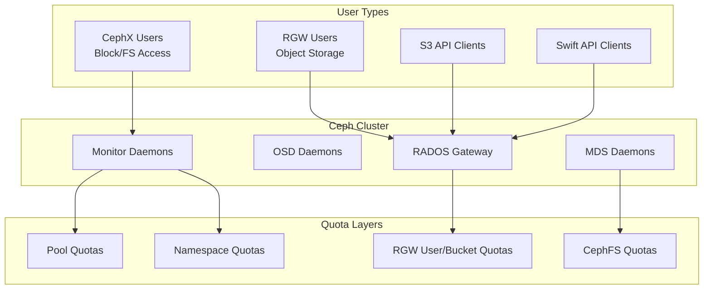
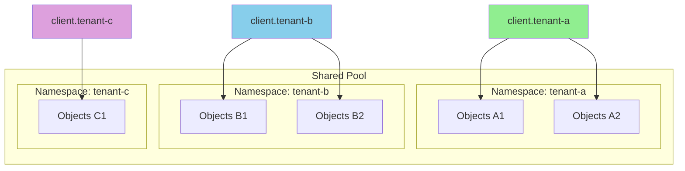
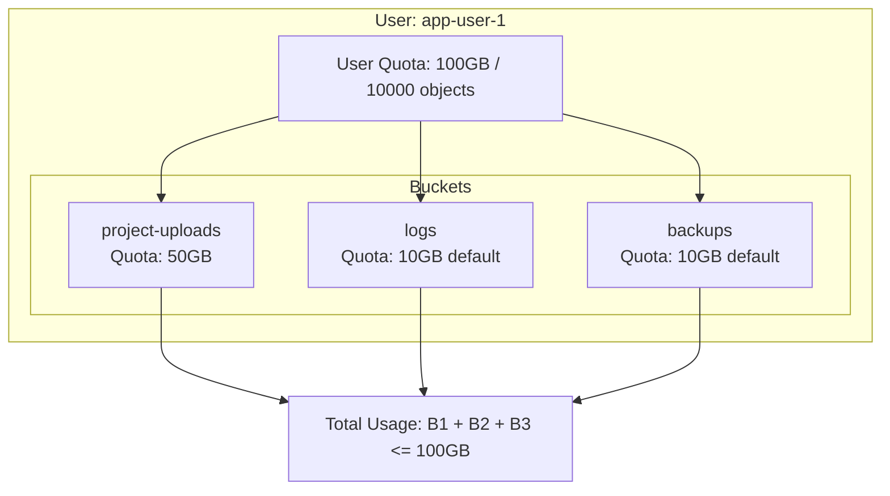
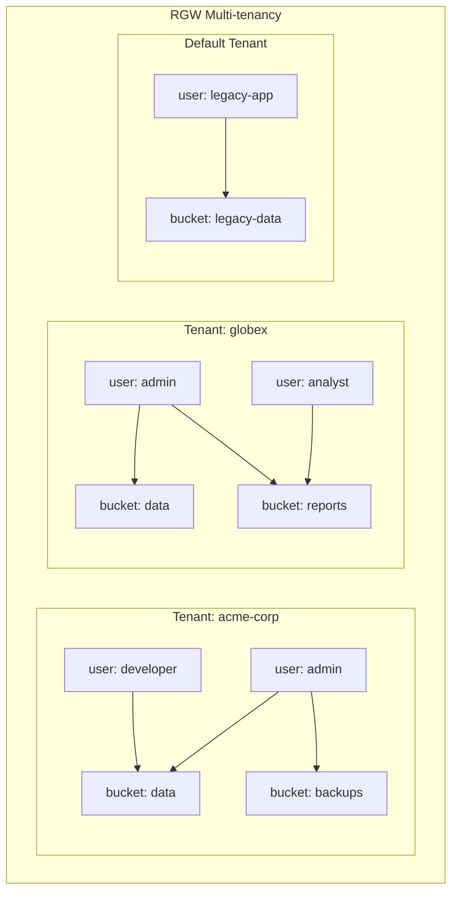
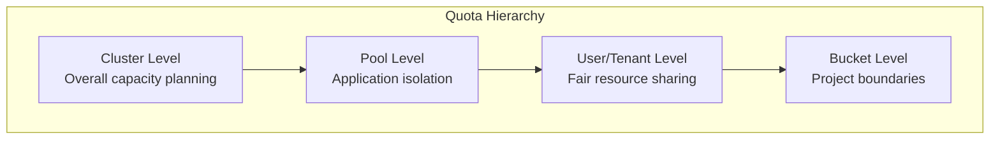

# How to Implement Ceph Quotas and User Management

Author: [nawazdhandala](https://github.com/nawazdhandala)

Tags: Ceph, Storage, Quotas, Security, Multi-tenancy, Cloud Native

Description: Learn how to configure storage quotas and manage users in Ceph for multi-tenant environments.

---

Ceph is a powerful, unified distributed storage system that provides object, block, and file storage. In multi-tenant environments, proper user management and quota enforcement are critical for ensuring fair resource allocation, preventing storage abuse, and maintaining system stability. This comprehensive guide covers everything you need to know about implementing quotas and managing users in Ceph.

## Table of Contents

1. [Understanding Ceph's User and Quota Architecture](#understanding-cephs-user-and-quota-architecture)
2. [CephX Authentication Deep Dive](#cephx-authentication-deep-dive)
3. [Pool Quotas Configuration](#pool-quotas-configuration)
4. [Namespace Quotas and Isolation](#namespace-quotas-and-isolation)
5. [RADOS Gateway (RGW) User Management](#rados-gateway-rgw-user-management)
6. [RGW Quota Management](#rgw-quota-management)
7. [Multi-tenancy Configuration](#multi-tenancy-configuration)
8. [Monitoring and Alerts](#monitoring-and-alerts)
9. [Best Practices and Troubleshooting](#best-practices-and-troubleshooting)

## Understanding Ceph's User and Quota Architecture

Before diving into implementation, it's essential to understand how Ceph handles authentication, authorization, and resource limits across its different interfaces.



### Key Concepts

- **CephX Users**: Authentication entities used for RADOS, RBD (block), and CephFS access
- **RGW Users**: Separate user entities for S3/Swift object storage access
- **Pools**: Logical partitions for storing objects with configurable quotas
- **Namespaces**: Subdivisions within pools for additional isolation
- **Tenants**: RGW concept for complete user and bucket isolation

## CephX Authentication Deep Dive

CephX is Ceph's native authentication protocol, similar to Kerberos. It provides mutual authentication between clients and the cluster.

### Creating CephX Users

The following command creates a new CephX user with specific capabilities. The `mon` capability allows the user to read cluster information, while `osd` grants read/write access to the specified pool.

```bash
# Create a new CephX user with capabilities for a specific pool
# -n: Specify the entity name (client.<username>)
# --gen-key: Auto-generate a secret key
# --cap mon: Monitor capabilities (usually 'r' for read)
# --cap osd: OSD capabilities defining pool access
ceph auth get-or-create client.appuser \
    mon 'allow r' \
    osd 'allow rw pool=app-data' \
    -o /etc/ceph/ceph.client.appuser.keyring
```

This command outputs the keyring to a file that can be distributed to clients. The keyring contains the user's secret key needed for authentication.

### Capability Profiles Explained

Ceph uses capability strings to define permissions. Here's a detailed breakdown of common capability patterns:

```bash
# Read-only access to a specific pool
# Useful for backup or monitoring applications
ceph auth get-or-create client.readonly \
    mon 'allow r' \
    osd 'allow r pool=production-data'

# Full administrative access (use with caution)
# This grants complete control over the cluster
ceph auth get-or-create client.admin \
    mon 'allow *' \
    osd 'allow *' \
    mds 'allow *' \
    mgr 'allow *'

# RBD (block storage) specific user with image restrictions
# The 'class-read' and 'class-write' allow RBD operations
# 'namespace' limits access to specific RBD namespace
ceph auth get-or-create client.rbd-user \
    mon 'allow r' \
    osd 'allow class-read object_prefix rbd_children, allow rwx pool=rbd-pool namespace=app-namespace'
```

### Managing CephX Users

These commands help you list, inspect, and manage existing CephX users:

```bash
# List all authentication entities in the cluster
# This shows all users, daemons, and their capabilities
ceph auth ls

# Get detailed information about a specific user
# Useful for verifying user capabilities before deployment
ceph auth get client.appuser

# Export user credentials to a keyring file
# The keyring can be securely distributed to clients
ceph auth export client.appuser -o /tmp/appuser.keyring

# Modify existing user capabilities
# This updates permissions without regenerating the key
ceph auth caps client.appuser \
    mon 'allow r' \
    osd 'allow rw pool=app-data, allow r pool=shared-data'

# Delete a user from the cluster
# Always verify no active clients use this user before deletion
ceph auth del client.appuser
```

### Keyring Distribution and Security

Proper keyring management is crucial for cluster security:

```bash
# Create a minimal keyring for client distribution
# This contains only the user's key, not admin credentials
ceph auth get client.appuser -o /etc/ceph/ceph.client.appuser.keyring

# Set restrictive permissions on keyring files
# Only the application user should read this file
chmod 600 /etc/ceph/ceph.client.appuser.keyring
chown appuser:appuser /etc/ceph/ceph.client.appuser.keyring

# Verify the keyring works by testing cluster connectivity
# This should show cluster health if authentication succeeds
ceph -n client.appuser --keyring=/etc/ceph/ceph.client.appuser.keyring health
```

## Pool Quotas Configuration

Pool quotas prevent any single pool from consuming excessive cluster resources. Ceph supports two types of pool quotas: maximum objects and maximum bytes.

### Setting Pool Quotas

The following commands configure quota limits on a pool. Once reached, write operations to that pool will fail:

```bash
# Set a maximum size quota on a pool (100 GB in this example)
# This limits total data stored in the pool
ceph osd pool set-quota app-data max_bytes 107374182400

# Set a maximum object count quota (1 million objects)
# Useful for limiting metadata overhead and object fragmentation
ceph osd pool set-quota app-data max_objects 1000000

# Apply both quotas simultaneously for comprehensive limits
ceph osd pool set-quota app-data max_bytes 107374182400 max_objects 1000000

# Remove quotas by setting them to zero
# Zero means unlimited (no quota enforcement)
ceph osd pool set-quota app-data max_bytes 0
ceph osd pool set-quota app-data max_objects 0
```

### Viewing Pool Quota Status

Monitor quota usage to proactively manage storage capacity:

```bash
# Display current quota settings and usage for a specific pool
# Shows max_bytes, max_objects, and current usage
ceph osd pool get-quota app-data

# Get detailed pool statistics including usage
# This provides comprehensive pool information
ceph df detail

# List all pools with their quota configurations
# Useful for auditing across multiple pools
for pool in $(ceph osd pool ls); do
    echo "=== Pool: $pool ==="
    ceph osd pool get-quota $pool
done
```

### Pool Quota Warning Example

This script helps monitor quota usage and send alerts before limits are reached:

```bash
#!/bin/bash
# Script: check_pool_quotas.sh
# Purpose: Monitor pool quotas and alert when usage exceeds threshold

# Configuration
ALERT_THRESHOLD=80  # Alert when usage exceeds 80%
POOLS=("app-data" "user-uploads" "backups")

for pool in "${POOLS[@]}"; do
    # Get pool statistics in JSON format for easy parsing
    stats=$(ceph df detail --format=json | jq -r ".pools[] | select(.name==\"$pool\")")

    # Extract current usage and quota limit
    used_bytes=$(echo "$stats" | jq -r '.stats.bytes_used')

    # Get quota settings
    quota_json=$(ceph osd pool get-quota "$pool" --format=json)
    max_bytes=$(echo "$quota_json" | jq -r '.quota_max_bytes')

    # Skip if no quota is set (max_bytes = 0)
    if [ "$max_bytes" -eq 0 ]; then
        echo "Pool $pool: No byte quota set"
        continue
    fi

    # Calculate usage percentage
    usage_percent=$((used_bytes * 100 / max_bytes))

    echo "Pool $pool: ${usage_percent}% used (${used_bytes}/${max_bytes} bytes)"

    # Alert if threshold exceeded
    if [ "$usage_percent" -ge "$ALERT_THRESHOLD" ]; then
        echo "WARNING: Pool $pool quota usage (${usage_percent}%) exceeds threshold!"
        # Add your alerting mechanism here (email, Slack, PagerDuty, etc.)
    fi
done
```

## Namespace Quotas and Isolation

Namespaces provide an additional layer of isolation within pools. While Ceph doesn't natively support namespace quotas at the RADOS level, you can implement isolation through CephX capabilities and application-level controls.

### Creating Namespace-Isolated Users

This approach restricts users to specific namespaces within a pool:

```bash
# Create a user restricted to a specific namespace
# The 'namespace=' directive limits all operations to that namespace
ceph auth get-or-create client.tenant-a \
    mon 'allow r' \
    osd 'allow rwx pool=shared-pool namespace=tenant-a' \
    -o /etc/ceph/ceph.client.tenant-a.keyring

# Create another user for a different namespace
# This user cannot access tenant-a's data even in the same pool
ceph auth get-or-create client.tenant-b \
    mon 'allow r' \
    osd 'allow rwx pool=shared-pool namespace=tenant-b' \
    -o /etc/ceph/ceph.client.tenant-b.keyring
```

### Namespace Architecture Diagram



### RBD Namespace Quotas

For RBD (block storage), you can implement namespace-level quotas using these techniques:

```bash
# Create an RBD pool with namespace support
ceph osd pool create rbd-pool 128

# Initialize the pool for RBD use
rbd pool init rbd-pool

# Create namespaces for different tenants
rbd namespace create rbd-pool/tenant-a
rbd namespace create rbd-pool/tenant-b

# Create user with namespace-restricted access
ceph auth get-or-create client.rbd-tenant-a \
    mon 'allow r, allow command "osd blocklist"' \
    osd 'allow rwx pool=rbd-pool namespace=tenant-a' \
    -o /etc/ceph/ceph.client.rbd-tenant-a.keyring
```

Application-level quota tracking for RBD namespaces:

```python
#!/usr/bin/env python3
"""
RBD Namespace Quota Manager
Tracks and enforces quotas at the namespace level
"""

import rados
import rbd
import json
from typing import Dict, Optional

class RBDNamespaceQuotaManager:
    def __init__(self, conf_file: str = '/etc/ceph/ceph.conf'):
        # Initialize connection to the Ceph cluster
        self.cluster = rados.Rados(conffile=conf_file)
        self.cluster.connect()

        # Quota configuration (in bytes)
        # This could be loaded from a database or configuration file
        self.namespace_quotas: Dict[str, int] = {}

    def set_namespace_quota(self, pool: str, namespace: str, max_bytes: int):
        """
        Set a quota limit for a specific namespace
        This is stored in our quota manager, not in Ceph natively
        """
        key = f"{pool}/{namespace}"
        self.namespace_quotas[key] = max_bytes
        print(f"Set quota for {key}: {max_bytes} bytes")

    def get_namespace_usage(self, pool: str, namespace: str) -> int:
        """
        Calculate total bytes used by all images in a namespace
        Iterates through all images and sums their provisioned size
        """
        total_bytes = 0

        # Open an I/O context for the pool
        with self.cluster.open_ioctx(pool) as ioctx:
            # Set the namespace context
            ioctx.set_namespace(namespace)

            # Create RBD instance
            rbd_inst = rbd.RBD()

            # List all images in this namespace
            images = rbd_inst.list(ioctx)

            for image_name in images:
                # Open each image to get its size
                with rbd.Image(ioctx, image_name) as img:
                    # Get the provisioned size of the image
                    size = img.size()
                    total_bytes += size

        return total_bytes

    def check_quota(self, pool: str, namespace: str,
                    additional_bytes: int = 0) -> bool:
        """
        Check if creating/expanding storage would exceed quota
        Returns True if within quota, False if would exceed
        """
        key = f"{pool}/{namespace}"

        # If no quota set, allow the operation
        if key not in self.namespace_quotas:
            return True

        current_usage = self.get_namespace_usage(pool, namespace)
        quota_limit = self.namespace_quotas[key]

        # Check if current + additional would exceed limit
        if current_usage + additional_bytes > quota_limit:
            print(f"Quota exceeded for {key}: "
                  f"{current_usage + additional_bytes} > {quota_limit}")
            return False

        return True

    def create_image_with_quota_check(self, pool: str, namespace: str,
                                       image_name: str, size: int) -> bool:
        """
        Create an RBD image only if it doesn't exceed namespace quota
        """
        # First check if we have quota available
        if not self.check_quota(pool, namespace, size):
            raise Exception(f"Quota exceeded: Cannot create {size} byte image")

        # Create the image within the namespace
        with self.cluster.open_ioctx(pool) as ioctx:
            ioctx.set_namespace(namespace)
            rbd_inst = rbd.RBD()
            rbd_inst.create(ioctx, image_name, size)

        print(f"Created image {namespace}/{image_name} ({size} bytes)")
        return True

    def get_quota_report(self) -> Dict:
        """
        Generate a report of all namespace quotas and usage
        """
        report = {}

        for key, quota in self.namespace_quotas.items():
            pool, namespace = key.split('/')
            usage = self.get_namespace_usage(pool, namespace)

            report[key] = {
                'quota_bytes': quota,
                'used_bytes': usage,
                'available_bytes': quota - usage,
                'usage_percent': round((usage / quota) * 100, 2)
            }

        return report

    def close(self):
        """Clean up cluster connection"""
        self.cluster.shutdown()


# Example usage
if __name__ == '__main__':
    manager = RBDNamespaceQuotaManager()

    # Set quotas for different tenants (100GB each)
    manager.set_namespace_quota('rbd-pool', 'tenant-a', 100 * 1024**3)
    manager.set_namespace_quota('rbd-pool', 'tenant-b', 100 * 1024**3)

    # Create an image with quota enforcement
    try:
        manager.create_image_with_quota_check(
            'rbd-pool', 'tenant-a', 'data-volume', 10 * 1024**3
        )
    except Exception as e:
        print(f"Failed to create image: {e}")

    # Print quota report
    report = manager.get_quota_report()
    print(json.dumps(report, indent=2))

    manager.close()
```

## RADOS Gateway (RGW) User Management

The RADOS Gateway provides S3 and Swift compatible object storage. RGW has its own user management system separate from CephX.

### Creating RGW Users

RGW users are created using the `radosgw-admin` command:

```bash
# Create a new RGW user with S3 access
# --uid: Unique identifier for the user
# --display-name: Human-readable name shown in management interfaces
# --email: Contact email for the user
radosgw-admin user create \
    --uid="app-user-1" \
    --display-name="Application User 1" \
    --email="app1@example.com"

# The command outputs JSON with access keys and secret keys
# Example output:
# {
#     "user_id": "app-user-1",
#     "display_name": "Application User 1",
#     "email": "app1@example.com",
#     "keys": [
#         {
#             "user": "app-user-1",
#             "access_key": "ABCDEFGHIJKLMNOPQRST",
#             "secret_key": "1234567890abcdefghij1234567890ABCDEFGHIJ"
#         }
#     ]
# }
```

### Managing User Keys

RGW users can have multiple access keys for key rotation and different applications:

```bash
# Generate an additional access key for an existing user
# Useful for rotating keys without service interruption
radosgw-admin key create \
    --uid="app-user-1" \
    --key-type=s3 \
    --gen-access-key \
    --gen-secret

# Create a key with specific access and secret keys
# Useful when migrating from another S3-compatible service
radosgw-admin key create \
    --uid="app-user-1" \
    --key-type=s3 \
    --access-key="CUSTOMACCESSKEY12345" \
    --secret-key="CustomSecretKey1234567890abcdefghij"

# Remove a specific access key
# Use when decommissioning old keys after rotation
radosgw-admin key rm \
    --uid="app-user-1" \
    --key-type=s3 \
    --access-key="ABCDEFGHIJKLMNOPQRST"
```

### User Administration Commands

These commands help manage RGW users throughout their lifecycle:

```bash
# List all RGW users in the system
radosgw-admin user list

# Get detailed information about a specific user
# Shows keys, caps, quotas, and usage statistics
radosgw-admin user info --uid="app-user-1"

# Modify user properties
radosgw-admin user modify \
    --uid="app-user-1" \
    --display-name="Updated Application User 1" \
    --email="updated@example.com"

# Suspend a user (disable access without deletion)
# Useful for temporarily disabling accounts
radosgw-admin user suspend --uid="app-user-1"

# Re-enable a suspended user
radosgw-admin user enable --uid="app-user-1"

# Delete a user and all associated data
# WARNING: This removes all user buckets and objects
radosgw-admin user rm --uid="app-user-1" --purge-data
```

### Subuser Management

Subusers allow delegating access with different permission levels:

```bash
# Create a subuser with read-only Swift access
# Subusers inherit from the parent but can have restricted permissions
radosgw-admin subuser create \
    --uid="app-user-1" \
    --subuser="app-user-1:readonly" \
    --access=read

# Create a subuser with full access for a specific application
radosgw-admin subuser create \
    --uid="app-user-1" \
    --subuser="app-user-1:backup-agent" \
    --access=full

# Generate Swift keys for a subuser
radosgw-admin key create \
    --subuser="app-user-1:readonly" \
    --key-type=swift \
    --gen-secret

# Access levels available:
# read     - Read-only access
# write    - Write-only access
# readwrite - Both read and write
# full     - Complete access including ACL management
```

## RGW Quota Management

RGW supports quotas at both user and bucket levels, providing fine-grained control over storage consumption.

### User Quota Configuration

User quotas limit the total storage a single user can consume across all their buckets:

```bash
# Enable and set user quota (100GB max, 10000 objects max)
# These limits apply across all buckets owned by the user
radosgw-admin quota set \
    --quota-scope=user \
    --uid="app-user-1" \
    --max-size=100G \
    --max-objects=10000

# Enable the user quota (quotas are disabled by default)
radosgw-admin quota enable \
    --quota-scope=user \
    --uid="app-user-1"

# View current quota settings and usage
radosgw-admin user info --uid="app-user-1" | jq '.user_quota'

# Disable user quota (removes limits but preserves settings)
radosgw-admin quota disable \
    --quota-scope=user \
    --uid="app-user-1"
```

### Bucket Quota Configuration

Bucket quotas limit individual bucket sizes, useful for per-project or per-application limits:

```bash
# Set quota on a specific bucket (50GB, 5000 objects)
# This overrides user-level quotas for this specific bucket
radosgw-admin quota set \
    --quota-scope=bucket \
    --uid="app-user-1" \
    --bucket="project-uploads" \
    --max-size=50G \
    --max-objects=5000

# Enable the bucket quota
radosgw-admin quota enable \
    --quota-scope=bucket \
    --uid="app-user-1" \
    --bucket="project-uploads"

# Set a default bucket quota for all new buckets created by a user
# This applies to buckets created after this setting
radosgw-admin quota set \
    --quota-scope=bucket \
    --uid="app-user-1" \
    --max-size=10G \
    --max-objects=1000

# Enable default bucket quotas
radosgw-admin quota enable \
    --quota-scope=bucket \
    --uid="app-user-1"
```

### Quota Management Diagram



### Checking Quota Usage

Monitor quota usage to prevent service disruptions:

```bash
# Get user statistics including quota usage
radosgw-admin user stats --uid="app-user-1" --sync-stats

# Output includes:
# - Total bytes used
# - Number of objects
# - Comparison against quota limits

# Get detailed bucket statistics
radosgw-admin bucket stats --bucket="project-uploads"

# List all buckets with their usage
radosgw-admin bucket list --uid="app-user-1"
```

### Quota Enforcement Script

This script automates quota monitoring and enforcement:

```bash
#!/bin/bash
# Script: rgw_quota_monitor.sh
# Purpose: Monitor RGW quotas and take action when limits approached

# Configuration
WARNING_THRESHOLD=80
CRITICAL_THRESHOLD=95
LOG_FILE="/var/log/ceph/rgw_quota_monitor.log"

log_message() {
    echo "$(date '+%Y-%m-%d %H:%M:%S') - $1" >> "$LOG_FILE"
}

check_user_quota() {
    local uid=$1

    # Get user info with quota details
    user_info=$(radosgw-admin user info --uid="$uid" 2>/dev/null)

    if [ $? -ne 0 ]; then
        log_message "ERROR: Failed to get info for user $uid"
        return 1
    fi

    # Check if quota is enabled
    quota_enabled=$(echo "$user_info" | jq -r '.user_quota.enabled')

    if [ "$quota_enabled" != "true" ]; then
        log_message "INFO: User $uid has no quota enabled"
        return 0
    fi

    # Get quota values
    max_size=$(echo "$user_info" | jq -r '.user_quota.max_size')

    # Get current usage (sync stats first for accuracy)
    radosgw-admin user stats --uid="$uid" --sync-stats > /dev/null 2>&1
    stats=$(radosgw-admin user stats --uid="$uid" 2>/dev/null)
    current_size=$(echo "$stats" | jq -r '.stats.size_actual')

    # Calculate percentage (handle edge cases)
    if [ "$max_size" -gt 0 ] && [ "$current_size" -gt 0 ]; then
        usage_percent=$((current_size * 100 / max_size))

        log_message "INFO: User $uid using ${usage_percent}% of quota"

        if [ "$usage_percent" -ge "$CRITICAL_THRESHOLD" ]; then
            log_message "CRITICAL: User $uid at ${usage_percent}% quota usage!"
            # Add notification mechanism here (email, Slack, etc.)
            send_alert "CRITICAL" "$uid" "$usage_percent"
        elif [ "$usage_percent" -ge "$WARNING_THRESHOLD" ]; then
            log_message "WARNING: User $uid at ${usage_percent}% quota usage"
            send_alert "WARNING" "$uid" "$usage_percent"
        fi
    fi
}

send_alert() {
    local severity=$1
    local uid=$2
    local percentage=$3

    # Example: Send to a webhook (customize as needed)
    # curl -X POST "https://alerts.example.com/webhook" \
    #     -H "Content-Type: application/json" \
    #     -d "{\"severity\":\"$severity\",\"user\":\"$uid\",\"usage\":$percentage}"

    echo "ALERT: [$severity] User $uid at ${percentage}% quota"
}

# Main execution - check all users
log_message "Starting quota check run"

for uid in $(radosgw-admin user list 2>/dev/null | jq -r '.[]'); do
    check_user_quota "$uid"
done

log_message "Quota check run completed"
```

## Multi-tenancy Configuration

RGW supports multi-tenancy, allowing complete isolation between different organizational units or customers.

### Understanding Multi-tenancy

Multi-tenancy in RGW provides:
- Separate user namespaces per tenant
- Isolated bucket namespaces (same bucket name can exist in different tenants)
- Tenant-level quota management
- Complete data isolation



### Creating Tenant Users

Tenant users are created by specifying the tenant name in the user ID:

```bash
# Create a user in a specific tenant
# Format: --uid="<tenant>$<username>"
radosgw-admin user create \
    --uid="acme-corp\$admin" \
    --display-name="ACME Corp Admin" \
    --email="admin@acme-corp.com"

# Create additional users in the same tenant
radosgw-admin user create \
    --uid="acme-corp\$developer" \
    --display-name="ACME Developer" \
    --email="dev@acme-corp.com"

# Create a user in a different tenant
radosgw-admin user create \
    --uid="globex\$admin" \
    --display-name="Globex Admin" \
    --email="admin@globex.com"

# List all users in a specific tenant
radosgw-admin user list --tenant="acme-corp"
```

### Tenant Quota Configuration

Set quotas at the tenant level for organizational limits:

```bash
# Create a tenant admin user first
radosgw-admin user create \
    --uid="enterprise-a\$admin" \
    --display-name="Enterprise A Admin" \
    --admin

# Set a quota for all users in a tenant
# This requires setting quotas on each user, as tenant-wide quotas
# are managed through aggregate monitoring

# Recommended approach: Create a quota policy script
```

Here's a comprehensive tenant quota management script:

```python
#!/usr/bin/env python3
"""
RGW Tenant Quota Manager
Manages quotas and usage across multiple tenants
"""

import subprocess
import json
from typing import Dict, List, Optional
from dataclasses import dataclass

@dataclass
class TenantConfig:
    """Configuration for a single tenant"""
    name: str
    max_size_bytes: int
    max_objects: int
    max_users: int
    max_buckets_per_user: int

class TenantQuotaManager:
    def __init__(self):
        # Define tenant configurations
        # In production, load this from a database or config file
        self.tenant_configs: Dict[str, TenantConfig] = {}

    def run_radosgw_admin(self, args: List[str]) -> dict:
        """Execute radosgw-admin command and return JSON output"""
        cmd = ['radosgw-admin'] + args + ['--format=json']
        result = subprocess.run(cmd, capture_output=True, text=True)

        if result.returncode != 0:
            raise Exception(f"Command failed: {result.stderr}")

        return json.loads(result.stdout) if result.stdout.strip() else {}

    def register_tenant(self, config: TenantConfig):
        """Register a new tenant with quota configuration"""
        self.tenant_configs[config.name] = config
        print(f"Registered tenant: {config.name}")
        print(f"  Max size: {config.max_size_bytes / (1024**3):.2f} GB")
        print(f"  Max objects: {config.max_objects}")
        print(f"  Max users: {config.max_users}")

    def create_tenant_user(self, tenant: str, username: str,
                           display_name: str, email: str,
                           is_admin: bool = False) -> dict:
        """
        Create a user within a tenant with appropriate quotas
        """
        if tenant not in self.tenant_configs:
            raise Exception(f"Tenant {tenant} not registered")

        config = self.tenant_configs[tenant]

        # Check if tenant user limit is reached
        existing_users = self.get_tenant_users(tenant)
        if len(existing_users) >= config.max_users:
            raise Exception(f"Tenant {tenant} has reached max user limit")

        # Create the user
        # Using escaped dollar sign for tenant$user format
        uid = f"{tenant}${username}"

        args = [
            'user', 'create',
            f'--uid={uid}',
            f'--display-name={display_name}',
            f'--email={email}'
        ]

        if is_admin:
            args.append('--admin')

        user_info = self.run_radosgw_admin(args)

        # Set user quota based on fair share of tenant quota
        # Each user gets equal share by default
        user_quota_size = config.max_size_bytes // config.max_users
        user_quota_objects = config.max_objects // config.max_users

        self.set_user_quota(uid, user_quota_size, user_quota_objects)

        # Set bucket limit
        self.run_radosgw_admin([
            'user', 'modify',
            f'--uid={uid}',
            f'--max-buckets={config.max_buckets_per_user}'
        ])

        return user_info

    def get_tenant_users(self, tenant: str) -> List[str]:
        """Get all users in a tenant"""
        all_users = self.run_radosgw_admin(['user', 'list'])

        # Filter users by tenant prefix
        tenant_users = [
            u for u in all_users
            if u.startswith(f"{tenant}$")
        ]

        return tenant_users

    def set_user_quota(self, uid: str, max_size: int, max_objects: int):
        """Set and enable quota for a user"""
        # Set the quota values
        self.run_radosgw_admin([
            'quota', 'set',
            '--quota-scope=user',
            f'--uid={uid}',
            f'--max-size={max_size}',
            f'--max-objects={max_objects}'
        ])

        # Enable the quota
        self.run_radosgw_admin([
            'quota', 'enable',
            '--quota-scope=user',
            f'--uid={uid}'
        ])

    def get_tenant_usage(self, tenant: str) -> dict:
        """Calculate total usage across all users in a tenant"""
        users = self.get_tenant_users(tenant)

        total_size = 0
        total_objects = 0
        user_details = []

        for uid in users:
            # Sync stats first
            subprocess.run(
                ['radosgw-admin', 'user', 'stats', f'--uid={uid}', '--sync-stats'],
                capture_output=True
            )

            # Get user stats
            try:
                stats = self.run_radosgw_admin(['user', 'stats', f'--uid={uid}'])
                size = stats.get('stats', {}).get('size_actual', 0)
                objects = stats.get('stats', {}).get('num_objects', 0)

                total_size += size
                total_objects += objects

                user_details.append({
                    'uid': uid,
                    'size': size,
                    'objects': objects
                })
            except Exception as e:
                print(f"Warning: Could not get stats for {uid}: {e}")

        return {
            'tenant': tenant,
            'total_size': total_size,
            'total_objects': total_objects,
            'user_count': len(users),
            'users': user_details
        }

    def generate_tenant_report(self) -> List[dict]:
        """Generate a usage report for all registered tenants"""
        reports = []

        for tenant_name, config in self.tenant_configs.items():
            usage = self.get_tenant_usage(tenant_name)

            report = {
                'tenant': tenant_name,
                'quota': {
                    'max_size': config.max_size_bytes,
                    'max_objects': config.max_objects,
                    'max_users': config.max_users
                },
                'usage': {
                    'size': usage['total_size'],
                    'objects': usage['total_objects'],
                    'users': usage['user_count']
                },
                'utilization': {
                    'size_percent': round(
                        (usage['total_size'] / config.max_size_bytes) * 100, 2
                    ) if config.max_size_bytes > 0 else 0,
                    'objects_percent': round(
                        (usage['total_objects'] / config.max_objects) * 100, 2
                    ) if config.max_objects > 0 else 0,
                    'users_percent': round(
                        (usage['user_count'] / config.max_users) * 100, 2
                    ) if config.max_users > 0 else 0
                }
            }

            reports.append(report)

        return reports


# Example usage
if __name__ == '__main__':
    manager = TenantQuotaManager()

    # Register tenants with their quotas
    # 1 TB storage, 10M objects, 50 users, 100 buckets per user
    manager.register_tenant(TenantConfig(
        name='enterprise-a',
        max_size_bytes=1024 * 1024 * 1024 * 1024,  # 1 TB
        max_objects=10000000,
        max_users=50,
        max_buckets_per_user=100
    ))

    # Smaller tenant: 100 GB, 1M objects, 10 users
    manager.register_tenant(TenantConfig(
        name='startup-b',
        max_size_bytes=100 * 1024 * 1024 * 1024,  # 100 GB
        max_objects=1000000,
        max_users=10,
        max_buckets_per_user=20
    ))

    # Create a user in a tenant
    try:
        user = manager.create_tenant_user(
            tenant='enterprise-a',
            username='john.doe',
            display_name='John Doe',
            email='john@enterprise-a.com'
        )
        print(f"Created user: {json.dumps(user, indent=2)}")
    except Exception as e:
        print(f"Error creating user: {e}")

    # Generate usage report
    reports = manager.generate_tenant_report()
    print("\n=== Tenant Usage Report ===")
    print(json.dumps(reports, indent=2))
```

### S3 Client Configuration for Multi-tenant Access

Configure S3 clients to access tenant-specific resources:

```python
#!/usr/bin/env python3
"""
S3 Client Configuration for Multi-tenant RGW Access
Demonstrates how to configure boto3 for tenant-aware operations
"""

import boto3
from botocore.config import Config

def create_tenant_s3_client(
    endpoint_url: str,
    access_key: str,
    secret_key: str,
    tenant: str = None
) -> boto3.client:
    """
    Create an S3 client configured for a specific tenant

    For multi-tenant access, the access key format is:
    <tenant>$<access_key> for tenanted users
    <access_key> for non-tenanted (default tenant) users
    """

    # If tenant is specified, prepend to access key
    # This is how RGW identifies the tenant context
    if tenant:
        access_key = f"{tenant}${access_key}"

    # Configure the S3 client with appropriate settings
    s3_client = boto3.client(
        's3',
        endpoint_url=endpoint_url,
        aws_access_key_id=access_key,
        aws_secret_access_key=secret_key,
        # Use path-style addressing for RGW compatibility
        config=Config(
            s3={'addressing_style': 'path'},
            signature_version='s3v4'
        )
    )

    return s3_client


def demo_tenant_operations():
    """
    Demonstrate multi-tenant S3 operations
    """
    # RGW endpoint
    endpoint = "http://rgw.example.com:8080"

    # Create clients for different tenants
    # Note: These credentials would come from radosgw-admin user create output

    # Client for tenant 'acme-corp'
    acme_client = create_tenant_s3_client(
        endpoint_url=endpoint,
        access_key="ACME_ACCESS_KEY",
        secret_key="ACME_SECRET_KEY",
        tenant="acme-corp"
    )

    # Client for tenant 'globex'
    globex_client = create_tenant_s3_client(
        endpoint_url=endpoint,
        access_key="GLOBEX_ACCESS_KEY",
        secret_key="GLOBEX_SECRET_KEY",
        tenant="globex"
    )

    # Both tenants can have a bucket named 'data' - they're isolated
    try:
        # Create bucket in acme-corp tenant
        acme_client.create_bucket(Bucket='data')
        print("Created bucket 'data' in acme-corp tenant")

        # Create bucket with same name in globex tenant
        globex_client.create_bucket(Bucket='data')
        print("Created bucket 'data' in globex tenant")

        # Upload to acme-corp's data bucket
        acme_client.put_object(
            Bucket='data',
            Key='reports/quarterly.pdf',
            Body=b'ACME quarterly report content'
        )
        print("Uploaded file to acme-corp/data bucket")

        # Upload to globex's data bucket
        globex_client.put_object(
            Bucket='data',
            Key='reports/quarterly.pdf',
            Body=b'Globex quarterly report content'
        )
        print("Uploaded file to globex/data bucket")

        # Verify isolation - each tenant only sees their own data
        acme_objects = acme_client.list_objects_v2(Bucket='data')
        globex_objects = globex_client.list_objects_v2(Bucket='data')

        print(f"\nACME 'data' bucket contents: {len(acme_objects.get('Contents', []))} objects")
        print(f"Globex 'data' bucket contents: {len(globex_objects.get('Contents', []))} objects")

    except Exception as e:
        print(f"Error: {e}")


if __name__ == '__main__':
    demo_tenant_operations()
```

## Monitoring and Alerts

Effective monitoring is essential for managing quotas and users at scale.

### Prometheus Metrics for Quota Monitoring

Ceph exposes metrics that can be scraped by Prometheus:

```yaml
# prometheus-ceph-alerts.yaml
# Prometheus alerting rules for Ceph quota monitoring

groups:
  - name: ceph_quota_alerts
    interval: 60s
    rules:
      # Alert when pool usage exceeds 80% of quota
      - alert: CephPoolQuotaWarning
        expr: |
          (ceph_pool_bytes_used / ceph_pool_quota_bytes) * 100 > 80
          and ceph_pool_quota_bytes > 0
        for: 5m
        labels:
          severity: warning
        annotations:
          summary: "Pool {{ $labels.pool_id }} approaching quota limit"
          description: "Pool is at {{ $value | printf \"%.1f\" }}% of quota"

      # Alert when pool usage exceeds 95% of quota
      - alert: CephPoolQuotaCritical
        expr: |
          (ceph_pool_bytes_used / ceph_pool_quota_bytes) * 100 > 95
          and ceph_pool_quota_bytes > 0
        for: 2m
        labels:
          severity: critical
        annotations:
          summary: "Pool {{ $labels.pool_id }} near quota limit"
          description: "Pool is at {{ $value | printf \"%.1f\" }}% of quota - writes may fail soon"

      # Alert when any RGW user exceeds 80% of their quota
      - alert: RGWUserQuotaWarning
        expr: |
          (ceph_rgw_user_bytes_used / ceph_rgw_user_quota_bytes) * 100 > 80
          and ceph_rgw_user_quota_bytes > 0
        for: 5m
        labels:
          severity: warning
        annotations:
          summary: "RGW user {{ $labels.user }} approaching quota"
          description: "User is at {{ $value | printf \"%.1f\" }}% of storage quota"
```

### Custom Metrics Exporter

This Python script exports additional quota metrics to Prometheus:

```python
#!/usr/bin/env python3
"""
Ceph Quota Metrics Exporter
Exports detailed quota usage metrics for Prometheus
"""

import subprocess
import json
import time
from prometheus_client import start_http_server, Gauge, Info
from typing import Dict, List

# Define Prometheus metrics
# Gauges are used for values that can go up and down

# Pool metrics
pool_quota_max_bytes = Gauge(
    'ceph_pool_quota_max_bytes',
    'Maximum bytes allowed in pool',
    ['pool_name']
)
pool_quota_max_objects = Gauge(
    'ceph_pool_quota_max_objects',
    'Maximum objects allowed in pool',
    ['pool_name']
)
pool_used_bytes = Gauge(
    'ceph_pool_used_bytes',
    'Bytes currently used in pool',
    ['pool_name']
)
pool_used_objects = Gauge(
    'ceph_pool_used_objects',
    'Objects currently in pool',
    ['pool_name']
)
pool_quota_usage_percent = Gauge(
    'ceph_pool_quota_usage_percent',
    'Percentage of quota used',
    ['pool_name', 'quota_type']
)

# RGW user metrics
rgw_user_quota_max_bytes = Gauge(
    'ceph_rgw_user_quota_max_bytes',
    'Maximum bytes allowed for user',
    ['user_id', 'tenant']
)
rgw_user_quota_max_objects = Gauge(
    'ceph_rgw_user_quota_max_objects',
    'Maximum objects allowed for user',
    ['user_id', 'tenant']
)
rgw_user_used_bytes = Gauge(
    'ceph_rgw_user_used_bytes',
    'Bytes currently used by user',
    ['user_id', 'tenant']
)
rgw_user_used_objects = Gauge(
    'ceph_rgw_user_used_objects',
    'Objects currently owned by user',
    ['user_id', 'tenant']
)
rgw_user_bucket_count = Gauge(
    'ceph_rgw_user_bucket_count',
    'Number of buckets owned by user',
    ['user_id', 'tenant']
)


def run_command(cmd: List[str]) -> str:
    """Execute a command and return stdout"""
    result = subprocess.run(cmd, capture_output=True, text=True)
    if result.returncode != 0:
        raise Exception(f"Command failed: {result.stderr}")
    return result.stdout


def parse_tenant_user(uid: str) -> tuple:
    """Parse tenant and username from uid"""
    if '$' in uid:
        parts = uid.split('$', 1)
        return parts[0], parts[1]
    return '', uid


def collect_pool_metrics():
    """Collect and export pool quota metrics"""
    try:
        # Get pool list
        pools_json = run_command(['ceph', 'osd', 'pool', 'ls', '--format=json'])
        pools = json.loads(pools_json)

        # Get detailed pool stats
        df_json = run_command(['ceph', 'df', 'detail', '--format=json'])
        df_data = json.loads(df_json)

        # Create a lookup for pool stats
        pool_stats = {p['name']: p for p in df_data.get('pools', [])}

        for pool_name in pools:
            # Get quota settings
            quota_json = run_command([
                'ceph', 'osd', 'pool', 'get-quota', pool_name, '--format=json'
            ])
            quota = json.loads(quota_json)

            max_bytes = quota.get('quota_max_bytes', 0)
            max_objects = quota.get('quota_max_objects', 0)

            # Export quota limits
            pool_quota_max_bytes.labels(pool_name=pool_name).set(max_bytes)
            pool_quota_max_objects.labels(pool_name=pool_name).set(max_objects)

            # Get current usage from df output
            stats = pool_stats.get(pool_name, {}).get('stats', {})
            used_bytes = stats.get('bytes_used', 0)
            used_objects = stats.get('objects', 0)

            pool_used_bytes.labels(pool_name=pool_name).set(used_bytes)
            pool_used_objects.labels(pool_name=pool_name).set(used_objects)

            # Calculate and export usage percentages
            if max_bytes > 0:
                bytes_percent = (used_bytes / max_bytes) * 100
                pool_quota_usage_percent.labels(
                    pool_name=pool_name,
                    quota_type='bytes'
                ).set(bytes_percent)

            if max_objects > 0:
                objects_percent = (used_objects / max_objects) * 100
                pool_quota_usage_percent.labels(
                    pool_name=pool_name,
                    quota_type='objects'
                ).set(objects_percent)

    except Exception as e:
        print(f"Error collecting pool metrics: {e}")


def collect_rgw_metrics():
    """Collect and export RGW user quota metrics"""
    try:
        # Get all RGW users
        users_json = run_command(['radosgw-admin', 'user', 'list', '--format=json'])
        users = json.loads(users_json)

        for uid in users:
            tenant, username = parse_tenant_user(uid)

            # Sync stats for accurate usage data
            subprocess.run(
                ['radosgw-admin', 'user', 'stats', f'--uid={uid}', '--sync-stats'],
                capture_output=True
            )

            # Get user info including quotas
            user_json = run_command([
                'radosgw-admin', 'user', 'info', f'--uid={uid}', '--format=json'
            ])
            user_info = json.loads(user_json)

            # Extract quota settings
            user_quota = user_info.get('user_quota', {})
            if user_quota.get('enabled', False):
                max_bytes = user_quota.get('max_size', 0)
                max_objects = user_quota.get('max_objects', 0)

                rgw_user_quota_max_bytes.labels(
                    user_id=username, tenant=tenant
                ).set(max_bytes)
                rgw_user_quota_max_objects.labels(
                    user_id=username, tenant=tenant
                ).set(max_objects)

            # Get usage stats
            stats_json = run_command([
                'radosgw-admin', 'user', 'stats', f'--uid={uid}', '--format=json'
            ])
            stats = json.loads(stats_json)

            user_stats = stats.get('stats', {})
            used_bytes = user_stats.get('size_actual', 0)
            used_objects = user_stats.get('num_objects', 0)

            rgw_user_used_bytes.labels(
                user_id=username, tenant=tenant
            ).set(used_bytes)
            rgw_user_used_objects.labels(
                user_id=username, tenant=tenant
            ).set(used_objects)

            # Count buckets
            bucket_count = len(user_info.get('buckets', []))
            rgw_user_bucket_count.labels(
                user_id=username, tenant=tenant
            ).set(bucket_count)

    except Exception as e:
        print(f"Error collecting RGW metrics: {e}")


def main():
    """Main function - starts the metrics server and collection loop"""
    # Start Prometheus metrics server on port 9283
    # (commonly used for Ceph exporters)
    start_http_server(9283)
    print("Metrics server started on port 9283")

    # Collection interval in seconds
    collection_interval = 60

    while True:
        print(f"Collecting metrics at {time.strftime('%Y-%m-%d %H:%M:%S')}")

        # Collect all metrics
        collect_pool_metrics()
        collect_rgw_metrics()

        # Wait before next collection
        time.sleep(collection_interval)


if __name__ == '__main__':
    main()
```

### Grafana Dashboard Configuration

Create a Grafana dashboard for visualizing quota usage:

```json
{
  "dashboard": {
    "title": "Ceph Quota Dashboard",
    "panels": [
      {
        "title": "Pool Quota Usage",
        "type": "gauge",
        "gridPos": {"h": 8, "w": 12, "x": 0, "y": 0},
        "targets": [
          {
            "expr": "ceph_pool_quota_usage_percent{quota_type=\"bytes\"}",
            "legendFormat": "{{ pool_name }}"
          }
        ],
        "fieldConfig": {
          "defaults": {
            "thresholds": {
              "mode": "percentage",
              "steps": [
                {"color": "green", "value": null},
                {"color": "yellow", "value": 70},
                {"color": "orange", "value": 80},
                {"color": "red", "value": 90}
              ]
            },
            "max": 100,
            "unit": "percent"
          }
        }
      },
      {
        "title": "RGW User Storage Usage",
        "type": "timeseries",
        "gridPos": {"h": 8, "w": 12, "x": 12, "y": 0},
        "targets": [
          {
            "expr": "ceph_rgw_user_used_bytes",
            "legendFormat": "{{ tenant }}/{{ user_id }}"
          }
        ],
        "fieldConfig": {
          "defaults": {
            "unit": "bytes"
          }
        }
      },
      {
        "title": "Top Users by Storage",
        "type": "bargauge",
        "gridPos": {"h": 8, "w": 12, "x": 0, "y": 8},
        "targets": [
          {
            "expr": "topk(10, ceph_rgw_user_used_bytes)",
            "legendFormat": "{{ tenant }}/{{ user_id }}"
          }
        ],
        "fieldConfig": {
          "defaults": {
            "unit": "bytes"
          }
        }
      },
      {
        "title": "Quota Utilization Heatmap",
        "type": "heatmap",
        "gridPos": {"h": 8, "w": 12, "x": 12, "y": 8},
        "targets": [
          {
            "expr": "(ceph_rgw_user_used_bytes / ceph_rgw_user_quota_max_bytes) * 100",
            "legendFormat": "{{ tenant }}/{{ user_id }}"
          }
        ]
      }
    ]
  }
}
```

## Best Practices and Troubleshooting

### Best Practices

#### 1. Quota Planning

Before implementing quotas, carefully plan your allocation strategy:

```bash
# Calculate total available storage
# This helps determine fair quota allocation
ceph df

# Example output analysis:
# - RAW STORAGE: 100 TiB total, 30 TiB used, 70 TiB available
# - Consider replication factor (typically 3x)
# - Usable storage = RAW / replication_factor
# - Leave 20-30% headroom for operations

# Calculate usable storage for quotas
# With 100 TiB raw and 3x replication:
# Usable = 100 TiB / 3 = ~33 TiB
# After 25% headroom: 33 TiB * 0.75 = ~25 TiB allocatable
```

#### 2. Hierarchical Quota Strategy

Implement quotas at multiple levels for flexibility:



#### 3. Key Security Practices

Follow these security guidelines for user management:

```bash
# 1. Use minimal capabilities - principle of least privilege
# BAD: Overly permissive
ceph auth get-or-create client.app mon 'allow *' osd 'allow *'

# GOOD: Specific and limited
ceph auth get-or-create client.app \
    mon 'allow r' \
    osd 'allow rw pool=app-pool'

# 2. Rotate keys regularly
# Generate new key for existing user
ceph auth get-or-create client.app

# 3. Use separate users per application
# Each microservice should have its own credentials
ceph auth get-or-create client.service-a mon 'allow r' osd 'allow rw pool=service-a-data'
ceph auth get-or-create client.service-b mon 'allow r' osd 'allow rw pool=service-b-data'

# 4. Audit user access periodically
ceph auth ls > /var/log/ceph/auth-audit-$(date +%Y%m%d).log
```

### Common Issues and Solutions

#### Issue 1: Quota Not Being Enforced

```bash
# Check if quota is actually enabled
ceph osd pool get-quota <pool-name>

# Verify OSD quota enforcement setting
ceph config get osd osd_pool_default_quota_max_bytes

# Check for quota-related errors in logs
grep -i quota /var/log/ceph/ceph-osd.*.log

# Solution: Ensure quotas are properly set and cluster is healthy
ceph health detail
```

#### Issue 2: RGW User Cannot Access Buckets

```bash
# Verify user exists and has correct keys
radosgw-admin user info --uid="problematic-user"

# Check user capabilities
radosgw-admin caps list --uid="problematic-user"

# Verify bucket ownership
radosgw-admin bucket stats --bucket="bucket-name"

# Check RGW logs for authentication errors
grep -i "problematic-user" /var/log/ceph/ceph-client.rgw.*.log

# Solution: Ensure user has correct access keys and bucket permissions
radosgw-admin bucket link --bucket="bucket-name" --uid="correct-owner"
```

#### Issue 3: Multi-tenant Bucket Name Collision

```bash
# If buckets appear to collide across tenants, verify tenant isolation
# Check bucket owner information
radosgw-admin bucket stats --bucket="data"

# List buckets with tenant info
radosgw-admin bucket list --uid="tenant\$user"

# Verify tenant configuration in RGW
ceph config get client.rgw rgw_enable_apis
```

#### Issue 4: Quota Stats Not Updating

```bash
# Force stats synchronization for a user
radosgw-admin user stats --uid="user-id" --sync-stats

# For all users (may take time on large deployments)
for uid in $(radosgw-admin user list | jq -r '.[]'); do
    radosgw-admin user stats --uid="$uid" --sync-stats
done

# Check if RGW usage log is enabled
ceph config get client.rgw rgw_enable_usage_log

# Enable usage logging if disabled
ceph config set client.rgw rgw_enable_usage_log true
```

### Automation Script for Quota Management

This comprehensive script automates common quota management tasks:

```bash
#!/bin/bash
# Script: ceph_quota_manager.sh
# Purpose: Comprehensive quota and user management automation

set -e

# Configuration
LOG_FILE="/var/log/ceph/quota_manager.log"
CONFIG_FILE="/etc/ceph/quota_policies.json"

log() {
    echo "$(date '+%Y-%m-%d %H:%M:%S') [$1] $2" | tee -a "$LOG_FILE"
}

# Function to create a new tenant with standard quotas
create_tenant() {
    local tenant_name=$1
    local quota_gb=$2
    local max_users=$3

    log "INFO" "Creating tenant: $tenant_name (${quota_gb}GB, ${max_users} users)"

    # Create admin user for tenant
    radosgw-admin user create \
        --uid="${tenant_name}\$admin" \
        --display-name="${tenant_name} Admin" \
        --admin

    # Set tenant admin quota
    local quota_bytes=$((quota_gb * 1024 * 1024 * 1024))
    radosgw-admin quota set \
        --quota-scope=user \
        --uid="${tenant_name}\$admin" \
        --max-size="$quota_bytes"

    radosgw-admin quota enable \
        --quota-scope=user \
        --uid="${tenant_name}\$admin"

    log "INFO" "Tenant $tenant_name created successfully"
}

# Function to add user to tenant
add_tenant_user() {
    local tenant=$1
    local username=$2
    local display_name=$3
    local quota_gb=$4

    local uid="${tenant}\$${username}"

    log "INFO" "Creating user: $uid"

    radosgw-admin user create \
        --uid="$uid" \
        --display-name="$display_name"

    if [ -n "$quota_gb" ]; then
        local quota_bytes=$((quota_gb * 1024 * 1024 * 1024))
        radosgw-admin quota set \
            --quota-scope=user \
            --uid="$uid" \
            --max-size="$quota_bytes"
        radosgw-admin quota enable \
            --quota-scope=user \
            --uid="$uid"
    fi

    log "INFO" "User $uid created with ${quota_gb}GB quota"
}

# Function to generate quota report
generate_report() {
    local output_file=${1:-"/tmp/quota_report_$(date +%Y%m%d).json"}

    log "INFO" "Generating quota report to $output_file"

    {
        echo "{"
        echo "  \"generated\": \"$(date -Iseconds)\","
        echo "  \"pools\": ["

        local first=true
        for pool in $(ceph osd pool ls); do
            [ "$first" = true ] || echo ","
            first=false

            quota=$(ceph osd pool get-quota "$pool" --format=json)
            stats=$(ceph df detail --format=json | jq ".pools[] | select(.name==\"$pool\")")

            echo "    {"
            echo "      \"name\": \"$pool\","
            echo "      \"quota\": $quota,"
            echo "      \"usage\": $stats"
            echo -n "    }"
        done

        echo ""
        echo "  ],"
        echo "  \"rgw_users\": ["

        first=true
        for uid in $(radosgw-admin user list | jq -r '.[]'); do
            [ "$first" = true ] || echo ","
            first=false

            radosgw-admin user stats --uid="$uid" --sync-stats > /dev/null 2>&1
            user_info=$(radosgw-admin user info --uid="$uid" --format=json)
            user_stats=$(radosgw-admin user stats --uid="$uid" --format=json)

            echo "    {"
            echo "      \"uid\": \"$uid\","
            echo "      \"quota\": $(echo "$user_info" | jq '.user_quota'),"
            echo "      \"usage\": $(echo "$user_stats" | jq '.stats')"
            echo -n "    }"
        done

        echo ""
        echo "  ]"
        echo "}"
    } > "$output_file"

    log "INFO" "Report generated: $output_file"
}

# Function to cleanup unused users
cleanup_inactive_users() {
    local days_inactive=${1:-90}

    log "INFO" "Finding users inactive for $days_inactive days"

    local cutoff_date=$(date -d "-${days_inactive} days" +%s)

    for uid in $(radosgw-admin user list | jq -r '.[]'); do
        # Get user stats
        stats=$(radosgw-admin user stats --uid="$uid" --format=json 2>/dev/null)

        # Check last activity (this is a simplified check)
        # In production, you'd check actual access logs
        num_objects=$(echo "$stats" | jq -r '.stats.num_objects // 0')

        if [ "$num_objects" -eq 0 ]; then
            log "WARN" "User $uid has no objects - candidate for review"
        fi
    done
}

# Main command handler
case "${1:-help}" in
    create-tenant)
        create_tenant "$2" "$3" "$4"
        ;;
    add-user)
        add_tenant_user "$2" "$3" "$4" "$5"
        ;;
    report)
        generate_report "$2"
        ;;
    cleanup)
        cleanup_inactive_users "$2"
        ;;
    help|*)
        echo "Ceph Quota Manager"
        echo ""
        echo "Usage:"
        echo "  $0 create-tenant <name> <quota_gb> <max_users>"
        echo "  $0 add-user <tenant> <username> <display_name> [quota_gb]"
        echo "  $0 report [output_file]"
        echo "  $0 cleanup [days_inactive]"
        ;;
esac
```

## Conclusion

Implementing robust quota and user management in Ceph is essential for maintaining a healthy, secure, and fair multi-tenant storage environment. Key takeaways from this guide:

1. **CephX Authentication**: Use the principle of least privilege when defining capabilities. Always scope access to specific pools and operations.

2. **Pool Quotas**: Set both byte and object limits to prevent runaway consumption. Monitor usage proactively with alerting.

3. **Namespace Isolation**: Combine CephX capabilities with namespace restrictions for additional security layers within shared pools.

4. **RGW User Management**: Leverage RGW's built-in user and quota system for S3/Swift workloads. Use subusers for delegated access.

5. **Multi-tenancy**: Implement tenant isolation using RGW's native multi-tenancy features for complete separation of user namespaces.

6. **Monitoring**: Deploy comprehensive monitoring with Prometheus and Grafana to track quota usage and receive early warnings.

7. **Automation**: Use scripts and tools to manage quotas at scale, generate reports, and maintain compliance.

By following these practices, you can effectively manage a Ceph cluster that serves multiple teams, applications, or customers while ensuring fair resource allocation and preventing any single tenant from impacting others.

## Additional Resources

- [Ceph Documentation - User Management](https://docs.ceph.com/en/latest/rados/operations/user-management/)
- [Ceph Documentation - Pools](https://docs.ceph.com/en/latest/rados/operations/pools/)
- [RADOS Gateway Admin Guide](https://docs.ceph.com/en/latest/radosgw/admin/)
- [Ceph Multi-tenancy Documentation](https://docs.ceph.com/en/latest/radosgw/multitenancy/)
