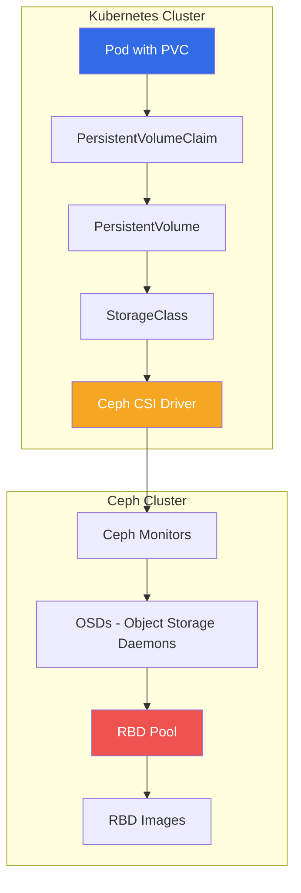
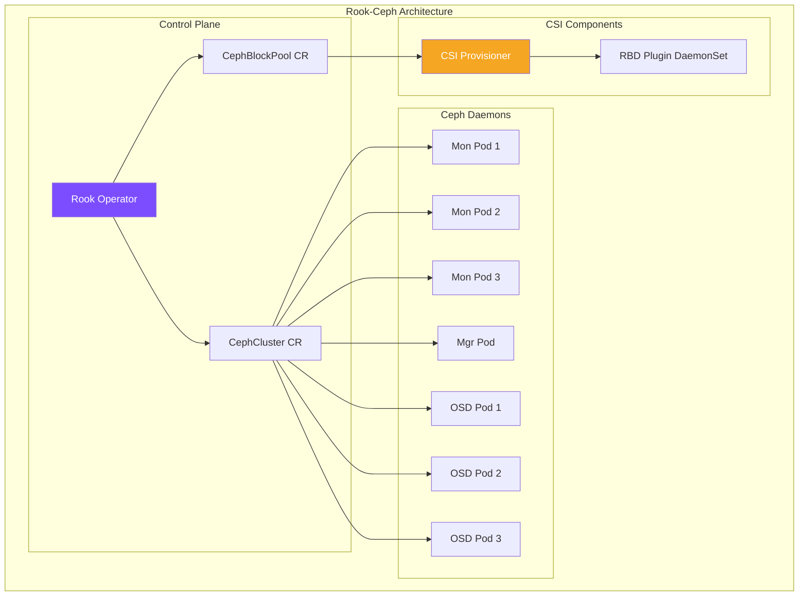
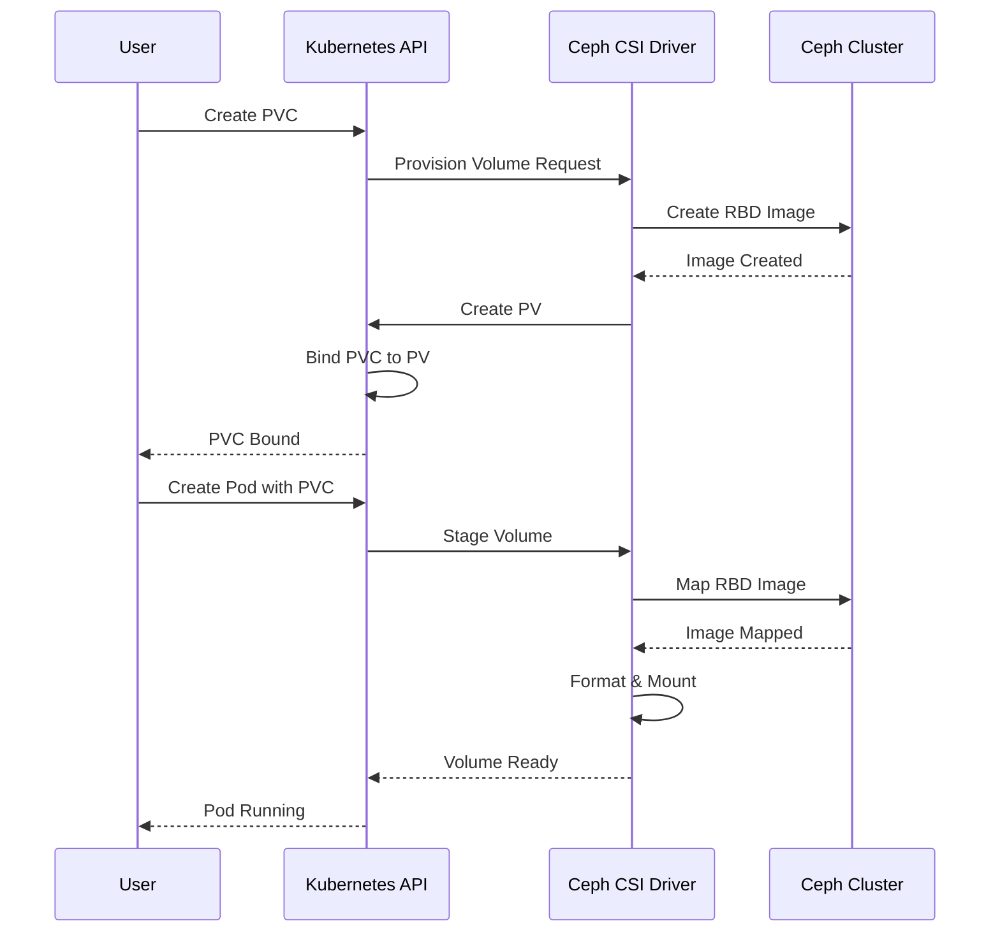
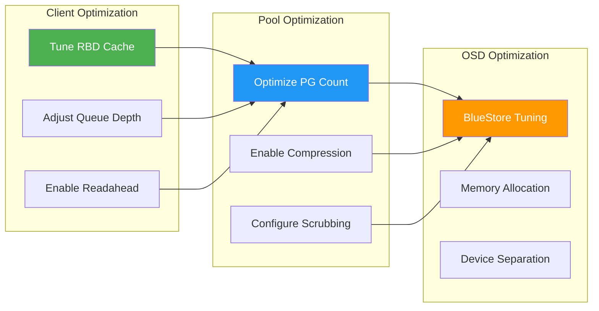

# How to Configure Ceph RBD Block Storage for Kubernetes Persistent Volumes

Author: [nawazdhandala](https://github.com/nawazdhandala)

Tags: Ceph, Kubernetes, Storage, Persistent Volumes, Rook, Cloud Native

Description: Learn how to configure Ceph RBD (RADOS Block Device) as persistent volume storage for Kubernetes workloads.

---

Ceph RBD (RADOS Block Device) provides enterprise-grade block storage for Kubernetes clusters, offering features like thin provisioning, snapshots, clones, and high availability. This comprehensive guide walks you through configuring Ceph RBD as persistent volume storage for your Kubernetes workloads, from initial pool creation to advanced performance tuning.

## Architecture Overview

Before diving into configuration, let's understand how Ceph RBD integrates with Kubernetes:



The architecture shows the complete flow from a Kubernetes Pod requesting storage through to the actual Ceph RBD image. The CSI (Container Storage Interface) driver acts as the bridge between Kubernetes and Ceph.

## Prerequisites

Before proceeding, ensure you have:

- A running Ceph cluster (Quincy or later recommended)
- A Kubernetes cluster (v1.20+)
- kubectl configured with cluster admin access
- Helm 3.x installed (for Rook deployment)
- At least 3 nodes for proper Ceph replication

## Part 1: Ceph RBD Pool Creation and Configuration

### Step 1: Create the RBD Pool

First, we need to create a dedicated pool for Kubernetes persistent volumes. The pool configuration affects performance, durability, and capacity.

```bash
# Create an RBD pool named 'kubernetes' with 128 placement groups
# Placement groups (PGs) determine data distribution across OSDs
# Formula: Target PGs = (OSDs * 100) / replica count, rounded to power of 2
ceph osd pool create kubernetes 128 128

# Enable the RBD application on the pool
# This is required for Ceph to recognize the pool as an RBD pool
ceph osd pool application enable kubernetes rbd

# Initialize the pool for RBD use
# This creates necessary metadata for RBD operations
rbd pool init kubernetes
```

### Step 2: Configure Pool Replication

Configure the replication factor based on your durability requirements and available OSDs:

```bash
# Set the pool size (number of replicas) to 3
# This means each object is stored on 3 different OSDs
ceph osd pool set kubernetes size 3

# Set the minimum number of replicas required for I/O operations
# Setting min_size to 2 allows operations to continue if one replica is unavailable
ceph osd pool set kubernetes min_size 2

# Verify pool configuration
ceph osd pool get kubernetes all
```

### Step 3: Create Ceph User for Kubernetes

Create a dedicated Ceph user with appropriate permissions for Kubernetes operations:

```bash
# Create a client user 'kubernetes' with specific capabilities:
# - mon: 'profile rbd' allows RBD-specific monitor operations
# - osd: 'profile rbd pool=kubernetes' restricts access to only the kubernetes pool
# - mgr: 'profile rbd pool=kubernetes' allows manager operations for RBD
ceph auth get-or-create client.kubernetes \
    mon 'profile rbd' \
    osd 'profile rbd pool=kubernetes' \
    mgr 'profile rbd pool=kubernetes' \
    -o /etc/ceph/ceph.client.kubernetes.keyring

# Display the keyring (you'll need this for Kubernetes secrets)
ceph auth get client.kubernetes
```

### Step 4: Configure RBD Features

Configure the default features for RBD images created in this pool:

```bash
# Enable useful RBD features by default
# - layering: enables cloning and copy-on-write
# - exclusive-lock: required for features like journaling
# - object-map: improves performance for sparse images
# - fast-diff: enables fast diff calculations
# - deep-flatten: allows flattening of cloned images
ceph osd pool set kubernetes rbd_default_features 125

# Alternatively, set features using names (more readable)
# The numeric value 125 corresponds to: layering + exclusive-lock + object-map + fast-diff + deep-flatten
```

## Part 2: Deploying Rook-Ceph Operator (Recommended Approach)

Rook provides a cloud-native storage orchestrator for Ceph, simplifying deployment and management in Kubernetes.

### Rook-Ceph Architecture



### Step 1: Install Rook-Ceph Operator

Deploy the Rook operator using Helm:

```bash
# Add the Rook Helm repository
helm repo add rook-release https://charts.rook.io/release

# Update Helm repositories to fetch latest charts
helm repo update

# Create the rook-ceph namespace
kubectl create namespace rook-ceph

# Install the Rook-Ceph operator with production settings
# - enableDiscoveryDaemon: automatically discovers storage devices
# - csi.enableRbdDriver: enables the RBD CSI driver
helm install rook-ceph rook-release/rook-ceph \
    --namespace rook-ceph \
    --set enableDiscoveryDaemon=true \
    --set csi.enableRbdDriver=true \
    --set csi.enableCephfsDriver=false \
    --wait
```

### Step 2: Deploy Ceph Cluster

Create a CephCluster custom resource to deploy the Ceph cluster:

```yaml
# ceph-cluster.yaml
# This manifest defines the Ceph cluster configuration
# It specifies which nodes and devices to use for storage
apiVersion: ceph.rook.io/v1
kind: CephCluster
metadata:
  name: rook-ceph
  namespace: rook-ceph
spec:
  # Ceph version to deploy - use Quincy (v17) or later for best compatibility
  cephVersion:
    image: quay.io/ceph/ceph:v18.2.0
    allowUnsupported: false

  # Data directory on the host where Ceph data is stored
  dataDirHostPath: /var/lib/rook

  # Skip upgrade checks (not recommended for production)
  skipUpgradeChecks: false

  # Continue if PGs are not clean during upgrade
  continueUpgradeAfterChecksEvenIfNotHealthy: false

  # Monitor configuration
  mon:
    # Number of monitors - odd number for quorum (3 or 5 recommended)
    count: 3
    # Allow monitors on the same node (only for testing)
    allowMultiplePerNode: false

  # Manager configuration
  mgr:
    count: 2
    allowMultiplePerNode: false
    modules:
      # Enable the dashboard module for web UI
      - name: dashboard
        enabled: true
      # Enable Prometheus module for metrics
      - name: prometheus
        enabled: true

  # Dashboard configuration
  dashboard:
    enabled: true
    ssl: true

  # Monitoring configuration for Prometheus integration
  monitoring:
    enabled: true
    metricsDisabled: false

  # Network configuration
  network:
    # Use host network for better performance (optional)
    # provider: host
    connections:
      encryption:
        enabled: false
      compression:
        enabled: false

  # Crash collector for debugging
  crashCollector:
    disable: false

  # Log collector configuration
  logCollector:
    enabled: true
    periodicity: daily
    maxLogSize: 500M

  # Resource specifications for Ceph daemons
  resources:
    mgr:
      limits:
        memory: "1Gi"
      requests:
        cpu: "500m"
        memory: "512Mi"
    mon:
      limits:
        memory: "2Gi"
      requests:
        cpu: "1000m"
        memory: "1Gi"
    osd:
      limits:
        memory: "4Gi"
      requests:
        cpu: "1000m"
        memory: "2Gi"

  # Storage configuration
  storage:
    # Use all nodes by default
    useAllNodes: true
    # Use all devices on each node
    useAllDevices: true
    # Only use devices matching this filter (optional)
    # deviceFilter: "^sd[b-z]"

    # Alternative: Specify nodes and devices explicitly
    # nodes:
    #   - name: "node1"
    #     devices:
    #       - name: "sdb"
    #       - name: "sdc"
    #   - name: "node2"
    #     devices:
    #       - name: "sdb"

    # OSD configuration
    config:
      # Use BlueStore (default and recommended)
      storeType: bluestore
      # OSD memory target in bytes (4GB)
      osd_memory_target: "4294967296"
```

Apply the cluster configuration:

```bash
# Apply the CephCluster resource
kubectl apply -f ceph-cluster.yaml

# Watch the cluster deployment progress
# This may take several minutes depending on cluster size
kubectl -n rook-ceph get pods -w

# Check cluster health
kubectl -n rook-ceph exec -it deploy/rook-ceph-tools -- ceph status
```

### Step 3: Create CephBlockPool

Create a block pool for Kubernetes persistent volumes:

```yaml
# ceph-block-pool.yaml
# This defines an RBD pool managed by Rook
# The pool will be used by the StorageClass for dynamic provisioning
apiVersion: ceph.rook.io/v1
kind: CephBlockPool
metadata:
  name: kubernetes-pool
  namespace: rook-ceph
spec:
  # Failure domain for replica placement
  # 'host' ensures replicas are on different nodes
  failureDomain: host

  # Replication configuration
  replicated:
    # Number of replicas
    size: 3
    # Require replicas on different failure domains
    requireSafeReplicaSize: true

  # Pool parameters
  parameters:
    # Compression mode: none, passive, aggressive, force
    compression_mode: none

  # Quotas (optional)
  # quotas:
  #   maxSize: 100Gi
  #   maxObjects: 1000000

  # Mirroring configuration (for disaster recovery)
  # mirroring:
  #   enabled: true
  #   mode: image
```

Apply the block pool:

```bash
# Create the CephBlockPool
kubectl apply -f ceph-block-pool.yaml

# Verify pool creation
kubectl -n rook-ceph exec -it deploy/rook-ceph-tools -- ceph osd pool ls detail
```

## Part 3: StorageClass and PVC Setup

### Storage Provisioning Flow



### Step 1: Create StorageClass

Create a StorageClass for dynamic provisioning of Ceph RBD volumes:

```yaml
# ceph-rbd-storageclass.yaml
# StorageClass enables dynamic provisioning of PersistentVolumes
# When a PVC is created, Kubernetes automatically creates the corresponding RBD image
apiVersion: storage.k8s.io/v1
kind: StorageClass
metadata:
  name: ceph-rbd
  annotations:
    # Set as default StorageClass (optional)
    storageclass.kubernetes.io/is-default-class: "true"

# CSI driver name for Rook-Ceph RBD
provisioner: rook-ceph.rbd.csi.ceph.com

# Parameters passed to the CSI driver
parameters:
  # Cluster ID references the Rook-Ceph cluster
  clusterID: rook-ceph

  # Pool name where RBD images will be created
  pool: kubernetes-pool

  # Image format: 2 is the current format supporting advanced features
  imageFormat: "2"

  # Image features to enable
  # layering: enables copy-on-write cloning
  # exclusive-lock: required for consistent snapshots
  # object-map: optimizes IO operations on sparse images
  # fast-diff: enables fast diff calculations for snapshots
  # deep-flatten: allows complete flattening of cloned images
  imageFeatures: layering,exclusive-lock,object-map,fast-diff,deep-flatten

  # CSI secrets for provisioning and node operations
  # These secrets contain Ceph credentials
  csi.storage.k8s.io/provisioner-secret-name: rook-csi-rbd-provisioner
  csi.storage.k8s.io/provisioner-secret-namespace: rook-ceph
  csi.storage.k8s.io/controller-expand-secret-name: rook-csi-rbd-provisioner
  csi.storage.k8s.io/controller-expand-secret-namespace: rook-ceph
  csi.storage.k8s.io/node-stage-secret-name: rook-csi-rbd-node
  csi.storage.k8s.io/node-stage-secret-namespace: rook-ceph

  # Filesystem type to use when mounting
  csi.storage.k8s.io/fstype: ext4

# Volume reclaim policy
# - Delete: RBD image is deleted when PVC is deleted
# - Retain: RBD image is retained (manual cleanup required)
reclaimPolicy: Delete

# Allow volume expansion
allowVolumeExpansion: true

# Volume binding mode
# - Immediate: PV is created immediately when PVC is created
# - WaitForFirstConsumer: PV creation waits until Pod is scheduled
mountOptions:
  # Mount options for the filesystem
  - discard
```

Apply the StorageClass:

```bash
# Create the StorageClass
kubectl apply -f ceph-rbd-storageclass.yaml

# Verify StorageClass creation
kubectl get storageclass ceph-rbd -o yaml
```

### Step 2: Create PersistentVolumeClaim

Create a PVC to request storage:

```yaml
# example-pvc.yaml
# PersistentVolumeClaim requests storage from the StorageClass
# The CSI driver will automatically create an RBD image
apiVersion: v1
kind: PersistentVolumeClaim
metadata:
  name: ceph-rbd-pvc
  namespace: default
spec:
  # Access modes determine how the volume can be mounted
  # ReadWriteOnce: can be mounted read-write by a single node
  accessModes:
    - ReadWriteOnce

  # Storage class to use for provisioning
  storageClassName: ceph-rbd

  # Requested storage size
  resources:
    requests:
      storage: 10Gi
```

Apply and verify the PVC:

```bash
# Create the PVC
kubectl apply -f example-pvc.yaml

# Watch PVC binding status
kubectl get pvc ceph-rbd-pvc -w

# Once bound, check the created PV
kubectl get pv

# Verify the RBD image was created in Ceph
kubectl -n rook-ceph exec -it deploy/rook-ceph-tools -- rbd ls kubernetes-pool
```

### Step 3: Use PVC in a Pod

Deploy a Pod that uses the PVC:

```yaml
# example-pod.yaml
# This Pod mounts the Ceph RBD volume and writes test data
apiVersion: v1
kind: Pod
metadata:
  name: ceph-rbd-test
  namespace: default
spec:
  containers:
    - name: test-container
      image: nginx:latest
      # Mount the Ceph RBD volume
      volumeMounts:
        - name: ceph-volume
          mountPath: /data
      # Resource limits for the container
      resources:
        limits:
          memory: "128Mi"
          cpu: "500m"

  # Define the volume using the PVC
  volumes:
    - name: ceph-volume
      persistentVolumeClaim:
        claimName: ceph-rbd-pvc

  # Optional: specify node selector for testing
  # nodeSelector:
  #   kubernetes.io/hostname: node1
```

Apply and verify:

```bash
# Create the Pod
kubectl apply -f example-pod.yaml

# Wait for Pod to be running
kubectl get pod ceph-rbd-test -w

# Verify the volume is mounted
kubectl exec -it ceph-rbd-test -- df -h /data

# Test write operations
kubectl exec -it ceph-rbd-test -- sh -c "echo 'Hello from Ceph RBD!' > /data/test.txt"
kubectl exec -it ceph-rbd-test -- cat /data/test.txt
```

## Part 4: Advanced Configuration

### Block Volume Mode

For applications that need raw block devices (like databases), use volumeMode: Block:

```yaml
# block-mode-pvc.yaml
# Block mode provides raw block device access without filesystem
# Useful for applications that manage their own data format
apiVersion: v1
kind: PersistentVolumeClaim
metadata:
  name: ceph-rbd-block-pvc
  namespace: default
spec:
  accessModes:
    - ReadWriteOnce
  # Block mode instead of Filesystem mode
  volumeMode: Block
  storageClassName: ceph-rbd
  resources:
    requests:
      storage: 20Gi
---
apiVersion: v1
kind: Pod
metadata:
  name: block-device-pod
  namespace: default
spec:
  containers:
    - name: block-container
      image: ubuntu:22.04
      command: ["sleep", "infinity"]
      # Use volumeDevices instead of volumeMounts for block volumes
      volumeDevices:
        - name: block-volume
          # Path where the block device will appear
          devicePath: /dev/xvda
  volumes:
    - name: block-volume
      persistentVolumeClaim:
        claimName: ceph-rbd-block-pvc
```

### Volume Snapshots

Enable and use volume snapshots for backup and cloning:

```yaml
# snapshot-class.yaml
# VolumeSnapshotClass defines how snapshots are created
apiVersion: snapshot.storage.k8s.io/v1
kind: VolumeSnapshotClass
metadata:
  name: ceph-rbd-snapclass
driver: rook-ceph.rbd.csi.ceph.com
parameters:
  # Cluster and pool information
  clusterID: rook-ceph
  pool: kubernetes-pool

  # CSI secrets for snapshot operations
  csi.storage.k8s.io/snapshotter-secret-name: rook-csi-rbd-provisioner
  csi.storage.k8s.io/snapshotter-secret-namespace: rook-ceph

# Deletion policy: Delete or Retain
deletionPolicy: Delete
---
# volume-snapshot.yaml
# VolumeSnapshot creates a point-in-time snapshot of a PVC
apiVersion: snapshot.storage.k8s.io/v1
kind: VolumeSnapshot
metadata:
  name: ceph-rbd-snapshot
  namespace: default
spec:
  volumeSnapshotClassName: ceph-rbd-snapclass
  source:
    persistentVolumeClaimName: ceph-rbd-pvc
```

Create and use snapshots:

```bash
# Create the VolumeSnapshotClass
kubectl apply -f snapshot-class.yaml

# Create a snapshot of the PVC
kubectl apply -f volume-snapshot.yaml

# Check snapshot status
kubectl get volumesnapshot ceph-rbd-snapshot -o yaml

# Verify snapshot in Ceph
kubectl -n rook-ceph exec -it deploy/rook-ceph-tools -- rbd snap ls kubernetes-pool/<image-name>
```

### Clone from Snapshot

Create a new PVC from a snapshot:

```yaml
# clone-from-snapshot.yaml
# Create a new PVC populated with data from a snapshot
apiVersion: v1
kind: PersistentVolumeClaim
metadata:
  name: ceph-rbd-clone
  namespace: default
spec:
  accessModes:
    - ReadWriteOnce
  storageClassName: ceph-rbd
  resources:
    requests:
      # Size must be >= source PVC size
      storage: 10Gi
  # Data source references the snapshot
  dataSource:
    name: ceph-rbd-snapshot
    kind: VolumeSnapshot
    apiGroup: snapshot.storage.k8s.io
```

### Volume Cloning (Direct PVC Clone)

Clone directly from an existing PVC:

```yaml
# pvc-clone.yaml
# Clone an existing PVC without creating a snapshot first
# Uses Ceph's copy-on-write cloning for efficiency
apiVersion: v1
kind: PersistentVolumeClaim
metadata:
  name: ceph-rbd-pvc-clone
  namespace: default
spec:
  accessModes:
    - ReadWriteOnce
  storageClassName: ceph-rbd
  resources:
    requests:
      storage: 10Gi
  # Reference the source PVC directly
  dataSource:
    name: ceph-rbd-pvc
    kind: PersistentVolumeClaim
```

## Part 5: Performance Tuning

### Performance Optimization Flow



### High-Performance StorageClass

Create a StorageClass optimized for performance:

```yaml
# high-performance-storageclass.yaml
# StorageClass with performance-optimized settings
apiVersion: storage.k8s.io/v1
kind: StorageClass
metadata:
  name: ceph-rbd-fast
provisioner: rook-ceph.rbd.csi.ceph.com
parameters:
  clusterID: rook-ceph
  pool: kubernetes-pool
  imageFormat: "2"
  imageFeatures: layering,exclusive-lock,object-map,fast-diff

  # Use XFS for better performance with large files
  csi.storage.k8s.io/fstype: xfs

  # MapOptions for performance tuning
  # queue_depth: number of outstanding I/O requests (higher = more parallelism)
  # lock_on_read: disable for better read performance if exclusive access guaranteed
  mapOptions: "queue_depth=128,lock_on_read=0"

  # Mounter options
  # rbd-nbd provides better performance than kernel RBD in some scenarios
  # mounter: rbd-nbd

  csi.storage.k8s.io/provisioner-secret-name: rook-csi-rbd-provisioner
  csi.storage.k8s.io/provisioner-secret-namespace: rook-ceph
  csi.storage.k8s.io/controller-expand-secret-name: rook-csi-rbd-provisioner
  csi.storage.k8s.io/controller-expand-secret-namespace: rook-ceph
  csi.storage.k8s.io/node-stage-secret-name: rook-csi-rbd-node
  csi.storage.k8s.io/node-stage-secret-namespace: rook-ceph

reclaimPolicy: Delete
allowVolumeExpansion: true

# Mount options for performance
mountOptions:
  - noatime
  - nodiratime
  - discard
```

### Pool Performance Tuning

Optimize pool settings for better performance:

```bash
# Optimize placement group autoscaling
# pg_autoscale_mode: on - automatically adjusts PG count based on pool usage
ceph osd pool set kubernetes-pool pg_autoscale_mode on

# Set target PG ratio for autoscaler
# This helps the autoscaler understand expected pool usage
ceph osd pool set kubernetes-pool target_size_ratio 0.3

# Configure pool for SSD storage (if using SSDs)
# Sets the appropriate CRUSH rule for SSD devices
ceph osd pool set kubernetes-pool crush_rule ssd_rule

# Enable pool statistics collection for monitoring
ceph osd pool set kubernetes-pool pg_num_min 32

# Configure recovery and backfill priorities
# Lower values = higher priority for client I/O
ceph config set osd osd_recovery_priority 5
ceph config set osd osd_recovery_max_active 3
ceph config set osd osd_recovery_max_single_start 1
```

### RBD Client Cache Configuration

Configure RBD cache settings for improved performance:

```bash
# Enable RBD cache (on clients/nodes)
# These settings are typically configured in ceph.conf or via ConfigMaps

# Example ceph.conf additions for high performance:
# [client]
# rbd_cache = true
# rbd_cache_size = 268435456  # 256MB cache
# rbd_cache_max_dirty = 201326592  # 192MB max dirty before writeback
# rbd_cache_target_dirty = 134217728  # 128MB target dirty (starts writeback)
# rbd_cache_max_dirty_age = 5  # Max age in seconds before forced writeback
# rbd_cache_writethrough_until_flush = true  # Safer for data integrity

# For Rook, configure via ConfigMap
kubectl -n rook-ceph create configmap rook-config-override --from-literal=config="
[client]
rbd_cache = true
rbd_cache_size = 268435456
rbd_cache_max_dirty = 201326592
rbd_cache_target_dirty = 134217728
"
```

### OSD Performance Tuning

Configure OSDs for optimal performance:

```yaml
# ceph-cluster-performance.yaml
# CephCluster with performance-optimized OSD settings
apiVersion: ceph.rook.io/v1
kind: CephCluster
metadata:
  name: rook-ceph
  namespace: rook-ceph
spec:
  cephVersion:
    image: quay.io/ceph/ceph:v18.2.0

  storage:
    useAllNodes: true
    useAllDevices: true
    config:
      # BlueStore OSD configuration for performance
      # Increase memory target for better caching
      osd_memory_target: "8589934592"  # 8GB

      # BlueStore cache configuration
      bluestore_cache_size_ssd: "4294967296"  # 4GB for SSD
      bluestore_cache_size_hdd: "1073741824"  # 1GB for HDD

      # Disable auto-class for manual device class assignment
      # crushDeviceClass: ssd

  # Separate devices for WAL and DB (recommended for HDDs)
  # This significantly improves performance when using HDDs for data
  # storage:
  #   nodes:
  #     - name: "node1"
  #       devices:
  #         - name: "sdb"
  #           config:
  #             metadataDevice: "nvme0n1"  # Fast SSD for metadata
  #             databaseSizeMB: "40960"
  #             walSizeMB: "10240"
```

### Monitoring Performance

Set up monitoring to track storage performance:

```yaml
# servicemonitor.yaml
# ServiceMonitor for Prometheus to scrape Ceph metrics
apiVersion: monitoring.coreos.com/v1
kind: ServiceMonitor
metadata:
  name: rook-ceph-mgr
  namespace: rook-ceph
  labels:
    team: rook
spec:
  namespaceSelector:
    matchNames:
      - rook-ceph
  selector:
    matchLabels:
      app: rook-ceph-mgr
      rook_cluster: rook-ceph
  endpoints:
    - port: http-metrics
      path: /metrics
      interval: 10s
```

Key metrics to monitor:

```bash
# Check pool I/O statistics
kubectl -n rook-ceph exec -it deploy/rook-ceph-tools -- ceph osd pool stats kubernetes-pool

# Monitor RBD performance
kubectl -n rook-ceph exec -it deploy/rook-ceph-tools -- rbd perf image iotop

# Check OSD latency
kubectl -n rook-ceph exec -it deploy/rook-ceph-tools -- ceph osd perf

# View slow operations
kubectl -n rook-ceph exec -it deploy/rook-ceph-tools -- ceph daemon osd.0 dump_historic_slow_ops
```

## Part 6: Troubleshooting

### Common Issues and Solutions

#### PVC Stuck in Pending

```bash
# Check CSI driver pods
kubectl -n rook-ceph get pods -l app=csi-rbdplugin

# Check provisioner logs
kubectl -n rook-ceph logs -l app=csi-rbdplugin-provisioner -c csi-provisioner

# Verify StorageClass exists and is default
kubectl get sc

# Check for events
kubectl describe pvc <pvc-name>
```

#### Volume Mount Failures

```bash
# Check node plugin logs
kubectl -n rook-ceph logs -l app=csi-rbdplugin -c csi-rbdplugin

# Verify RBD image exists
kubectl -n rook-ceph exec -it deploy/rook-ceph-tools -- rbd ls kubernetes-pool

# Check image status
kubectl -n rook-ceph exec -it deploy/rook-ceph-tools -- rbd status kubernetes-pool/<image-name>

# Check for watchers (active mounts)
kubectl -n rook-ceph exec -it deploy/rook-ceph-tools -- rbd status kubernetes-pool/<image-name> --format json
```

#### Performance Issues

```bash
# Check cluster health
kubectl -n rook-ceph exec -it deploy/rook-ceph-tools -- ceph health detail

# View OSD utilization
kubectl -n rook-ceph exec -it deploy/rook-ceph-tools -- ceph osd df

# Check for slow requests
kubectl -n rook-ceph exec -it deploy/rook-ceph-tools -- ceph daemon mon.a dump_historic_slow_ops

# Analyze PG distribution
kubectl -n rook-ceph exec -it deploy/rook-ceph-tools -- ceph pg dump
```

## Best Practices Summary

1. **Pool Configuration**
   - Use appropriate PG count based on OSD count and expected growth
   - Enable pg_autoscale for automatic PG management
   - Set proper replication factor (3 for production)

2. **StorageClass Design**
   - Create separate StorageClasses for different workload types
   - Enable volume expansion for flexibility
   - Use appropriate filesystem type (ext4 for general, xfs for large files)

3. **Performance Optimization**
   - Separate metadata devices for HDD pools
   - Enable RBD caching on clients
   - Use appropriate queue depth settings
   - Monitor and tune based on workload patterns

4. **High Availability**
   - Deploy minimum 3 monitors
   - Ensure proper failure domain configuration
   - Enable volume snapshots for backup
   - Consider mirroring for disaster recovery

5. **Security**
   - Use dedicated Ceph users with minimal permissions
   - Enable encryption for sensitive data
   - Regularly rotate credentials
   - Keep Ceph and CSI drivers updated

## Conclusion

Configuring Ceph RBD for Kubernetes persistent volumes provides enterprise-grade block storage with excellent performance, scalability, and reliability. By following this guide, you have learned how to:

- Create and configure Ceph RBD pools for Kubernetes
- Deploy Rook-Ceph operator for simplified management
- Set up StorageClasses for dynamic provisioning
- Configure PVCs and use them in Pods
- Implement snapshots and cloning
- Optimize performance for your workloads

Ceph RBD combined with Kubernetes CSI provides a robust foundation for stateful applications, offering features like thin provisioning, snapshots, and seamless scaling that are essential for modern cloud-native infrastructure.
