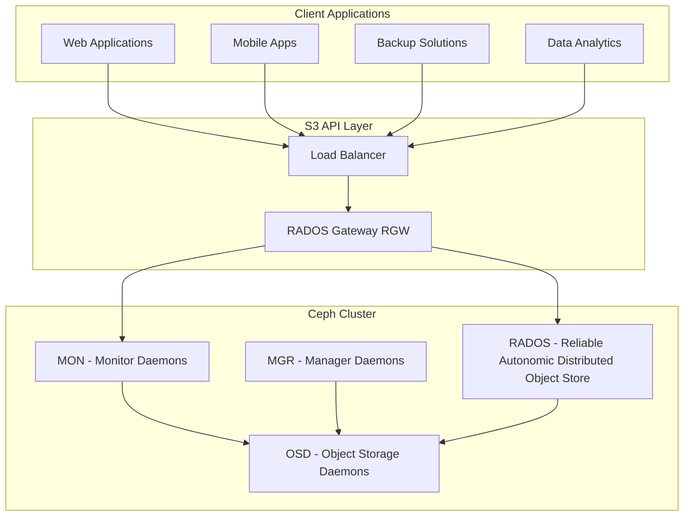
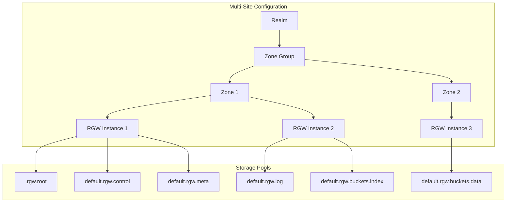
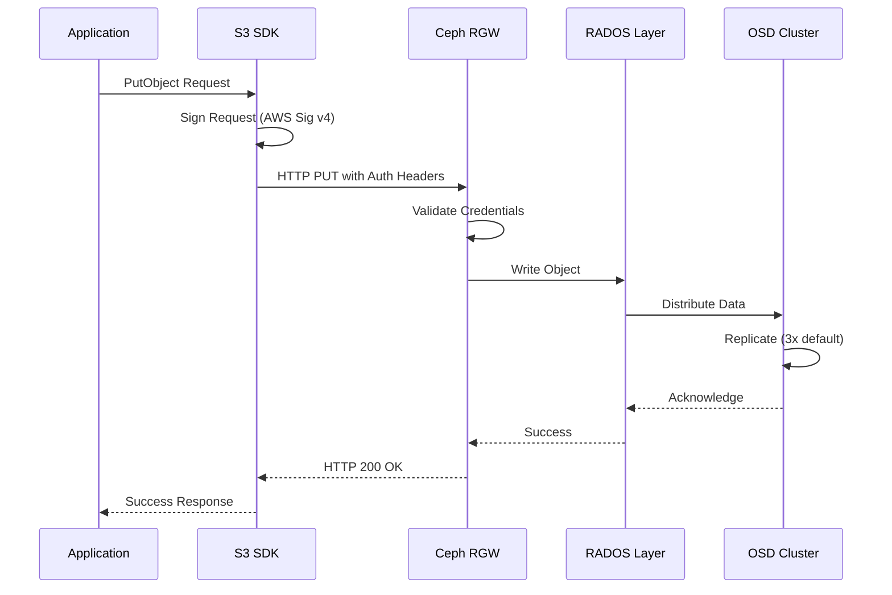
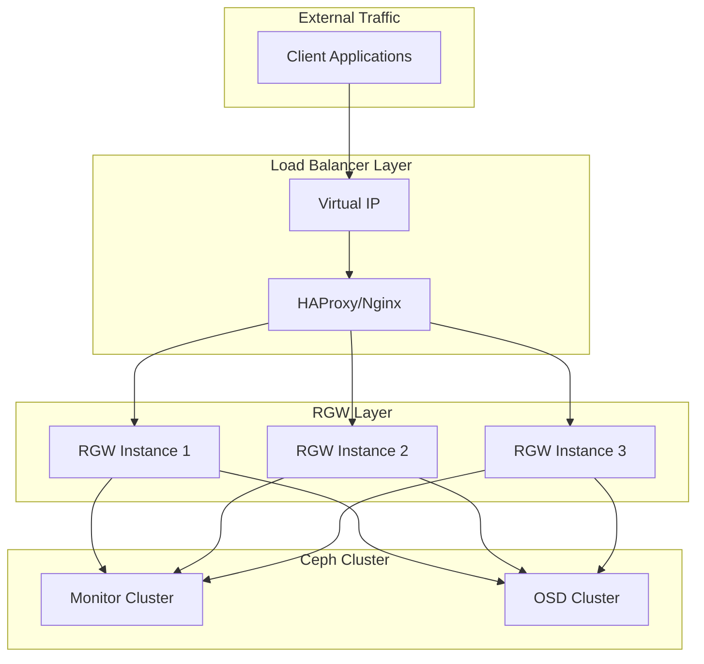

# How to Configure Ceph Object Storage (RGW) as S3-Compatible Storage

Author: [nawazdhandala](https://github.com/nawazdhandala)

Tags: Ceph, Object Storage, S3, RGW, Cloud Native, Storage

Description: Learn how to deploy and configure Ceph RADOS Gateway (RGW) for S3-compatible object storage.

---

## Introduction

Ceph RADOS Gateway (RGW) is a powerful object storage interface built on top of Ceph's distributed storage system. It provides a RESTful API that is fully compatible with Amazon S3, making it an excellent choice for organizations looking to build their own S3-compatible storage infrastructure without vendor lock-in.

In this comprehensive guide, we will walk through deploying and configuring Ceph RGW, setting up S3 API compatibility, managing users and buckets, and integrating with applications using standard S3 SDKs.

## Architecture Overview

Before diving into the configuration, let's understand how Ceph RGW fits into the overall Ceph architecture.



The architecture shows how client applications communicate with RGW through a load balancer, and RGW translates S3 API calls into RADOS operations on the underlying Ceph cluster.

## Prerequisites

Before configuring RGW, ensure you have the following:

- A running Ceph cluster (Reef or later recommended)
- At least 3 monitor nodes for high availability
- Sufficient OSD nodes for data storage
- Network connectivity between all nodes
- Root or sudo access on all nodes

## Part 1: Installing Ceph RGW

### Step 1: Install RGW Package

First, install the RGW package on the node(s) that will serve as your gateway(s).

```bash
# Install the Ceph RGW package on Ubuntu/Debian systems
# This package provides the RADOS Gateway daemon and utilities
sudo apt update
sudo apt install -y radosgw

# For RHEL/CentOS systems, use:
# sudo dnf install -y ceph-radosgw
```

### Step 2: Deploy RGW Using Cephadm

If you're using Cephadm (the recommended deployment method for modern Ceph clusters), you can deploy RGW more easily.

```bash
# Deploy a single RGW instance on a specific host
# The 'default' is the realm name, and 'us-east-1' is the zone name
# This creates an S3-compatible endpoint on the specified host
sudo cephadm shell -- ceph orch apply rgw default.us-east-1 --placement="1 rgw-host1"

# To deploy multiple RGW instances for high availability:
# This spreads RGW daemons across multiple hosts for load balancing
sudo cephadm shell -- ceph orch apply rgw default.us-east-1 --placement="3 rgw-host1 rgw-host2 rgw-host3"
```

### Step 3: Verify RGW Deployment

After deployment, verify that RGW is running correctly.

```bash
# Check the status of all Ceph services including RGW
# You should see rgw daemons listed with 'running' status
sudo ceph orch ls

# Check specifically for RGW daemons
# This shows detailed information about each RGW instance
sudo ceph orch ps --daemon-type rgw

# Verify RGW is responding to HTTP requests
# Default port is 80 for HTTP, adjust if you've configured differently
curl http://localhost:80
```

## Part 2: RGW Configuration

### Understanding the RGW Configuration Hierarchy



### Step 4: Create a Realm

A realm is the top-level container for RGW configuration, especially important for multi-site deployments.

```bash
# Create a new realm for your S3 service
# The realm groups zone groups together and enables multi-site replication
sudo radosgw-admin realm create --rgw-realm=mycompany --default

# Verify the realm was created successfully
sudo radosgw-admin realm list
```

### Step 5: Create a Zone Group

Zone groups contain zones and define the geographical or logical grouping.

```bash
# Create a zone group within the realm
# Zone groups contain multiple zones for data replication
# The 'master' flag indicates this is the primary zone group
sudo radosgw-admin zonegroup create --rgw-zonegroup=us --endpoints=http://rgw-host1:80 --rgw-realm=mycompany --master --default

# List zone groups to verify creation
sudo radosgw-admin zonegroup list
```

### Step 6: Create a Zone

Zones are the actual data stores within a zone group.

```bash
# Create the primary zone in the zone group
# Each zone has its own pools and can serve S3 requests
# The 'master' flag indicates this zone receives writes first
sudo radosgw-admin zone create --rgw-zonegroup=us --rgw-zone=us-east-1 --endpoints=http://rgw-host1:80 --master --default

# Commit the period to activate the configuration
# A period represents a configuration epoch in the multi-site setup
sudo radosgw-admin period update --commit
```

### Step 7: Configure RGW Daemon Settings

Configure the RGW daemon with essential settings.

```bash
# Set the RGW frontend configuration
# Beast is the modern, high-performance HTTP frontend for RGW
# port=8080 specifies the listening port for S3 API requests
sudo ceph config set client.rgw rgw_frontends "beast port=8080"

# Enable the S3 API (enabled by default, but good to verify)
# This ensures S3-compatible API endpoints are active
sudo ceph config set client.rgw rgw_enable_apis "s3, s3website, swift, swift_auth, admin"

# Set the default storage class for new objects
sudo ceph config set client.rgw rgw_default_storage_class "STANDARD"

# Configure object versioning support
# This allows S3 bucket versioning to work correctly
sudo ceph config set client.rgw rgw_enable_lc_threads true

# Set the maximum object size (5GB is S3's single PUT limit)
sudo ceph config set client.rgw rgw_max_put_size 5368709120
```

### Step 8: Advanced RGW Configuration File

For more detailed configuration, create or modify the Ceph configuration file.

```ini
# /etc/ceph/ceph.conf
# This configuration file contains advanced RGW settings
# Add this section for each RGW instance

[client.rgw.rgw-host1]
# The hostname where this RGW instance runs
host = rgw-host1

# Keyring file containing authentication credentials
keyring = /var/lib/ceph/radosgw/ceph-rgw.rgw-host1/keyring

# Log file location for debugging and monitoring
log_file = /var/log/ceph/ceph-rgw-rgw-host1.log

# Frontend configuration: beast is recommended for production
# ssl_port enables HTTPS, ssl_certificate/key specify TLS files
rgw_frontends = beast port=80 ssl_port=443 ssl_certificate=/etc/ceph/ssl/rgw.crt ssl_private_key=/etc/ceph/ssl/rgw.key

# DNS-style bucket naming (e.g., bucket.s3.example.com)
# Set to true for AWS S3 compatibility
rgw_dns_name = s3.example.com

# Thread pool size for handling requests
# Increase for high-traffic deployments
rgw_thread_pool_size = 512

# Number of RGW instances for this daemon
rgw_num_rados_handles = 4

# Enable server-side encryption
rgw_crypt_s3_kms_backend = vault

# Object lock support (for compliance/retention)
rgw_enable_lc_threads = true

# Bucket index sharding for large buckets
# Helps distribute index load across OSDs
rgw_bucket_index_max_aio = 128

# Garbage collection settings
rgw_gc_max_objs = 32
rgw_gc_obj_min_wait = 7200
rgw_gc_processor_period = 3600
```

## Part 3: User and Access Management

### Step 9: Create S3 Users

Create users that will access the S3-compatible storage.

```bash
# Create a new S3 user with display name and email
# This generates access key and secret key for S3 API authentication
# The uid is the unique identifier for the user
sudo radosgw-admin user create \
    --uid="myapp-user" \
    --display-name="My Application User" \
    --email="myapp@example.com"

# Sample output will include:
# {
#     "user_id": "myapp-user",
#     "display_name": "My Application User",
#     "keys": [
#         {
#             "access_key": "ABCDEFGHIJKLMNOP1234",
#             "secret_key": "AbCdEfGhIjKlMnOpQrStUvWxYz1234567890AbCd"
#         }
#     ]
# }
```

### Step 10: Generate Additional Access Keys

You can create multiple access keys for a single user.

```bash
# Generate an additional access key for the user
# Useful for key rotation or different application access
sudo radosgw-admin key create --uid="myapp-user" --key-type=s3 --gen-access-key --gen-secret

# List all keys for a user
sudo radosgw-admin user info --uid="myapp-user"
```

### Step 11: Set User Quotas

Implement quotas to control resource usage.

```bash
# Enable and set user-level quotas
# max-size limits total storage (in bytes, KB, MB, GB, or TB)
# max-objects limits the total number of objects
sudo radosgw-admin quota set --quota-scope=user --uid="myapp-user" \
    --max-size=100G \
    --max-objects=1000000

# Enable the quota (quotas are disabled by default after setting)
sudo radosgw-admin quota enable --quota-scope=user --uid="myapp-user"

# Set bucket-level quotas for the user
# This limits individual bucket sizes
sudo radosgw-admin quota set --quota-scope=bucket --uid="myapp-user" \
    --max-size=10G \
    --max-objects=100000

# Enable bucket quota
sudo radosgw-admin quota enable --quota-scope=bucket --uid="myapp-user"

# View current quota settings
sudo radosgw-admin user info --uid="myapp-user"
```

### Step 12: Create Admin Users

Create administrative users for managing the RGW cluster.

```bash
# Create an admin user with full capabilities
# The caps parameter grants administrative permissions
sudo radosgw-admin user create \
    --uid="admin-user" \
    --display-name="RGW Administrator" \
    --caps="buckets=*;users=*;usage=*;metadata=*;zone=*"

# Grant specific capabilities to existing users
# This example grants read access to bucket information
sudo radosgw-admin caps add --uid="myapp-user" --caps="buckets=read"

# Remove capabilities from a user
sudo radosgw-admin caps rm --uid="myapp-user" --caps="buckets=read"
```

## Part 4: Bucket Management

### Step 13: Create and Manage Buckets

Buckets can be created via the S3 API or using radosgw-admin commands.

```bash
# Create a bucket using the AWS CLI (requires configuration first)
# This demonstrates the S3-compatible API in action
aws --endpoint-url http://rgw-host1:8080 s3 mb s3://my-application-bucket

# Alternatively, use radosgw-admin for bucket operations
# Link a bucket to a specific user
sudo radosgw-admin bucket link --bucket=my-application-bucket --uid=myapp-user

# List all buckets
sudo radosgw-admin bucket list

# Get detailed bucket information
sudo radosgw-admin bucket stats --bucket=my-application-bucket

# Enable versioning on a bucket
aws --endpoint-url http://rgw-host1:8080 s3api put-bucket-versioning \
    --bucket my-application-bucket \
    --versioning-configuration Status=Enabled
```

### Step 14: Configure Bucket Policies

Implement access control using bucket policies.

```json
// bucket-policy.json
// This policy allows public read access to objects in the bucket
// WARNING: Only use public policies for truly public content
{
    "Version": "2012-10-17",
    "Statement": [
        {
            "Sid": "PublicReadGetObject",
            "Effect": "Allow",
            "Principal": "*",
            "Action": "s3:GetObject",
            "Resource": "arn:aws:s3:::my-public-bucket/*"
        },
        {
            "Sid": "AllowAuthenticatedUploads",
            "Effect": "Allow",
            "Principal": {
                "AWS": "arn:aws:iam:::user/myapp-user"
            },
            "Action": [
                "s3:PutObject",
                "s3:DeleteObject"
            ],
            "Resource": "arn:aws:s3:::my-public-bucket/*"
        }
    ]
}
```

Apply the bucket policy using the AWS CLI.

```bash
# Apply the bucket policy to enable access control
# The policy file must be valid JSON following AWS IAM policy syntax
aws --endpoint-url http://rgw-host1:8080 s3api put-bucket-policy \
    --bucket my-public-bucket \
    --policy file://bucket-policy.json

# Verify the policy was applied correctly
aws --endpoint-url http://rgw-host1:8080 s3api get-bucket-policy \
    --bucket my-public-bucket
```

### Step 15: Configure Lifecycle Policies

Set up lifecycle rules for automatic data management.

```json
// lifecycle-policy.json
// This lifecycle configuration manages object expiration and transitions
// Helps optimize storage costs by moving old data to cheaper tiers
{
    "Rules": [
        {
            "ID": "MoveToGlacierAfter90Days",
            "Status": "Enabled",
            "Filter": {
                "Prefix": "archives/"
            },
            "Transitions": [
                {
                    "Days": 90,
                    "StorageClass": "GLACIER"
                }
            ]
        },
        {
            "ID": "DeleteTempFilesAfter7Days",
            "Status": "Enabled",
            "Filter": {
                "Prefix": "temp/"
            },
            "Expiration": {
                "Days": 7
            }
        },
        {
            "ID": "CleanupIncompleteUploads",
            "Status": "Enabled",
            "Filter": {
                "Prefix": ""
            },
            "AbortIncompleteMultipartUpload": {
                "DaysAfterInitiation": 7
            }
        }
    ]
}
```

Apply the lifecycle policy.

```bash
# Apply lifecycle rules to automate data management
# Objects matching the rules will be automatically transitioned or deleted
aws --endpoint-url http://rgw-host1:8080 s3api put-bucket-lifecycle-configuration \
    --bucket my-application-bucket \
    --lifecycle-configuration file://lifecycle-policy.json

# View current lifecycle configuration
aws --endpoint-url http://rgw-host1:8080 s3api get-bucket-lifecycle-configuration \
    --bucket my-application-bucket
```

## Part 5: Application Integration

### S3 SDK Integration Architecture



### Step 16: Python Integration with boto3

Here's how to integrate with Ceph RGW using Python's boto3 library.

```python
#!/usr/bin/env python3
"""
Ceph RGW S3 Integration Example
This module demonstrates how to interact with Ceph RGW using boto3
Compatible with both AWS S3 and Ceph RGW endpoints
"""

import boto3
from botocore.config import Config
from botocore.exceptions import ClientError
import logging

# Configure logging to track operations
logging.basicConfig(level=logging.INFO)
logger = logging.getLogger(__name__)


def create_s3_client(endpoint_url: str, access_key: str, secret_key: str):
    """
    Create an S3 client configured for Ceph RGW.

    The endpoint_url points to your RGW service instead of AWS.
    Signature version must be 's3v4' for compatibility.

    Args:
        endpoint_url: The RGW endpoint (e.g., http://rgw-host1:8080)
        access_key: RGW access key from radosgw-admin
        secret_key: RGW secret key from radosgw-admin

    Returns:
        boto3 S3 client configured for Ceph RGW
    """
    # Configure the client with S3v4 signatures
    # path_style addressing uses endpoint/bucket format
    # instead of bucket.endpoint format
    config = Config(
        signature_version='s3v4',
        s3={
            'addressing_style': 'path'
        },
        retries={
            'max_attempts': 3,
            'mode': 'adaptive'
        }
    )

    client = boto3.client(
        's3',
        endpoint_url=endpoint_url,
        aws_access_key_id=access_key,
        aws_secret_access_key=secret_key,
        config=config
    )

    return client


def create_bucket(client, bucket_name: str) -> bool:
    """
    Create a new S3 bucket in Ceph RGW.

    Args:
        client: boto3 S3 client
        bucket_name: Name for the new bucket

    Returns:
        True if bucket created or already exists, False on error
    """
    try:
        # Create the bucket
        # LocationConstraint is required for some RGW configurations
        client.create_bucket(
            Bucket=bucket_name,
            CreateBucketConfiguration={
                'LocationConstraint': 'us-east-1'
            }
        )
        logger.info(f"Bucket '{bucket_name}' created successfully")
        return True
    except ClientError as e:
        error_code = e.response['Error']['Code']
        if error_code == 'BucketAlreadyOwnedByYou':
            logger.info(f"Bucket '{bucket_name}' already exists")
            return True
        logger.error(f"Failed to create bucket: {e}")
        return False


def upload_file(client, bucket_name: str, file_path: str, object_key: str) -> bool:
    """
    Upload a file to Ceph RGW with optional metadata.

    Args:
        client: boto3 S3 client
        bucket_name: Target bucket name
        file_path: Local path to the file
        object_key: S3 object key (path in bucket)

    Returns:
        True on success, False on error
    """
    try:
        # Upload with metadata and content type
        # ExtraArgs allows setting headers like ContentType and Metadata
        client.upload_file(
            file_path,
            bucket_name,
            object_key,
            ExtraArgs={
                'ContentType': 'application/octet-stream',
                'Metadata': {
                    'uploaded-by': 'ceph-rgw-example',
                    'application': 'my-app'
                }
            }
        )
        logger.info(f"Uploaded '{file_path}' to 's3://{bucket_name}/{object_key}'")
        return True
    except ClientError as e:
        logger.error(f"Upload failed: {e}")
        return False


def download_file(client, bucket_name: str, object_key: str, local_path: str) -> bool:
    """
    Download a file from Ceph RGW.

    Args:
        client: boto3 S3 client
        bucket_name: Source bucket name
        object_key: S3 object key to download
        local_path: Local path to save the file

    Returns:
        True on success, False on error
    """
    try:
        client.download_file(bucket_name, object_key, local_path)
        logger.info(f"Downloaded 's3://{bucket_name}/{object_key}' to '{local_path}'")
        return True
    except ClientError as e:
        logger.error(f"Download failed: {e}")
        return False


def generate_presigned_url(client, bucket_name: str, object_key: str,
                           expiration: int = 3600) -> str:
    """
    Generate a pre-signed URL for temporary access.

    Pre-signed URLs allow temporary access to private objects
    without sharing credentials. Useful for downloads and uploads.

    Args:
        client: boto3 S3 client
        bucket_name: Bucket containing the object
        object_key: Object to generate URL for
        expiration: URL validity in seconds (default 1 hour)

    Returns:
        Pre-signed URL string
    """
    try:
        url = client.generate_presigned_url(
            'get_object',
            Params={
                'Bucket': bucket_name,
                'Key': object_key
            },
            ExpiresIn=expiration
        )
        logger.info(f"Generated pre-signed URL valid for {expiration} seconds")
        return url
    except ClientError as e:
        logger.error(f"Failed to generate pre-signed URL: {e}")
        return None


def list_objects_with_pagination(client, bucket_name: str, prefix: str = '') -> list:
    """
    List objects in a bucket with automatic pagination.

    Uses a paginator to handle buckets with many objects.
    The S3 API returns max 1000 objects per request.

    Args:
        client: boto3 S3 client
        bucket_name: Bucket to list
        prefix: Optional prefix to filter objects

    Returns:
        List of object keys
    """
    objects = []

    # Create a paginator for handling large result sets
    # This automatically handles continuation tokens
    paginator = client.get_paginator('list_objects_v2')

    # Iterate through all pages of results
    for page in paginator.paginate(Bucket=bucket_name, Prefix=prefix):
        if 'Contents' in page:
            for obj in page['Contents']:
                objects.append({
                    'Key': obj['Key'],
                    'Size': obj['Size'],
                    'LastModified': obj['LastModified']
                })

    return objects


def multipart_upload(client, bucket_name: str, object_key: str,
                     file_path: str, part_size: int = 100 * 1024 * 1024) -> bool:
    """
    Upload large files using multipart upload.

    Multipart upload is required for files larger than 5GB
    and recommended for files larger than 100MB for reliability.

    Args:
        client: boto3 S3 client
        bucket_name: Target bucket
        object_key: S3 object key
        file_path: Local file path
        part_size: Size of each part (default 100MB)

    Returns:
        True on success, False on error
    """
    import os
    import math

    file_size = os.path.getsize(file_path)

    try:
        # Initiate multipart upload
        # This returns an upload ID to track the parts
        response = client.create_multipart_upload(
            Bucket=bucket_name,
            Key=object_key,
            ContentType='application/octet-stream'
        )
        upload_id = response['UploadId']
        logger.info(f"Started multipart upload with ID: {upload_id}")

        parts = []
        part_number = 1

        # Upload file in parts
        with open(file_path, 'rb') as f:
            while True:
                data = f.read(part_size)
                if not data:
                    break

                # Upload each part
                part_response = client.upload_part(
                    Bucket=bucket_name,
                    Key=object_key,
                    PartNumber=part_number,
                    UploadId=upload_id,
                    Body=data
                )

                # Track part info for completion
                parts.append({
                    'PartNumber': part_number,
                    'ETag': part_response['ETag']
                })

                logger.info(f"Uploaded part {part_number}")
                part_number += 1

        # Complete the multipart upload
        # This assembles all parts into the final object
        client.complete_multipart_upload(
            Bucket=bucket_name,
            Key=object_key,
            UploadId=upload_id,
            MultipartUpload={'Parts': parts}
        )

        logger.info(f"Completed multipart upload of '{object_key}'")
        return True

    except ClientError as e:
        logger.error(f"Multipart upload failed: {e}")
        # Abort the upload to clean up incomplete parts
        try:
            client.abort_multipart_upload(
                Bucket=bucket_name,
                Key=object_key,
                UploadId=upload_id
            )
        except:
            pass
        return False


# Example usage
if __name__ == '__main__':
    # Configuration for Ceph RGW
    RGW_ENDPOINT = 'http://rgw-host1:8080'
    ACCESS_KEY = 'your-access-key'
    SECRET_KEY = 'your-secret-key'

    # Create the S3 client
    s3_client = create_s3_client(RGW_ENDPOINT, ACCESS_KEY, SECRET_KEY)

    # Create a bucket
    create_bucket(s3_client, 'my-test-bucket')

    # Upload a file
    upload_file(s3_client, 'my-test-bucket', '/path/to/local/file.txt', 'uploads/file.txt')

    # Generate a pre-signed URL
    url = generate_presigned_url(s3_client, 'my-test-bucket', 'uploads/file.txt')
    print(f"Pre-signed URL: {url}")
```

### Step 17: Node.js Integration with AWS SDK

Here's how to integrate with Ceph RGW using Node.js.

```javascript
/**
 * Ceph RGW S3 Integration for Node.js
 * This module provides S3-compatible operations for Ceph RGW
 * Uses AWS SDK v3 for modern async/await patterns
 */

const {
    S3Client,
    CreateBucketCommand,
    PutObjectCommand,
    GetObjectCommand,
    ListObjectsV2Command,
    DeleteObjectCommand,
    GetObjectCommand
} = require('@aws-sdk/client-s3');
const { getSignedUrl } = require('@aws-sdk/s3-request-presigner');
const fs = require('fs');
const { Readable } = require('stream');

/**
 * Create an S3 client configured for Ceph RGW
 * The endpoint must point to your RGW service URL
 * forcePathStyle: true ensures bucket-in-path addressing
 *
 * @param {string} endpoint - RGW endpoint URL
 * @param {string} accessKeyId - RGW access key
 * @param {string} secretAccessKey - RGW secret key
 * @returns {S3Client} Configured S3 client
 */
function createRGWClient(endpoint, accessKeyId, secretAccessKey) {
    const client = new S3Client({
        endpoint: endpoint,
        region: 'us-east-1',  // Region can be any string for RGW
        credentials: {
            accessKeyId: accessKeyId,
            secretAccessKey: secretAccessKey
        },
        // Force path-style addressing (bucket in URL path)
        // Virtual-hosted style requires DNS configuration
        forcePathStyle: true
    });

    return client;
}

/**
 * Create a new bucket in Ceph RGW
 *
 * @param {S3Client} client - S3 client
 * @param {string} bucketName - Name for the new bucket
 * @returns {Promise<boolean>} Success status
 */
async function createBucket(client, bucketName) {
    try {
        const command = new CreateBucketCommand({
            Bucket: bucketName
        });

        await client.send(command);
        console.log(`Bucket '${bucketName}' created successfully`);
        return true;
    } catch (error) {
        // Handle bucket already exists
        if (error.name === 'BucketAlreadyOwnedByYou') {
            console.log(`Bucket '${bucketName}' already exists`);
            return true;
        }
        console.error('Failed to create bucket:', error);
        return false;
    }
}

/**
 * Upload a file to Ceph RGW
 * Supports both file paths and Buffer objects
 *
 * @param {S3Client} client - S3 client
 * @param {string} bucketName - Target bucket
 * @param {string} key - Object key in bucket
 * @param {string|Buffer} body - File path or Buffer
 * @param {Object} metadata - Optional metadata
 * @returns {Promise<boolean>} Success status
 */
async function uploadObject(client, bucketName, key, body, metadata = {}) {
    try {
        // Read file if body is a path string
        let content = body;
        if (typeof body === 'string' && fs.existsSync(body)) {
            content = fs.readFileSync(body);
        }

        const command = new PutObjectCommand({
            Bucket: bucketName,
            Key: key,
            Body: content,
            // Optional metadata attached to the object
            Metadata: metadata,
            // Content type for proper file handling
            ContentType: 'application/octet-stream'
        });

        await client.send(command);
        console.log(`Uploaded object to s3://${bucketName}/${key}`);
        return true;
    } catch (error) {
        console.error('Upload failed:', error);
        return false;
    }
}

/**
 * Download an object from Ceph RGW
 * Returns the content as a Buffer for flexibility
 *
 * @param {S3Client} client - S3 client
 * @param {string} bucketName - Source bucket
 * @param {string} key - Object key to download
 * @returns {Promise<Buffer|null>} Object content or null on error
 */
async function downloadObject(client, bucketName, key) {
    try {
        const command = new GetObjectCommand({
            Bucket: bucketName,
            Key: key
        });

        const response = await client.send(command);

        // Convert stream to buffer
        // AWS SDK v3 returns a readable stream
        const chunks = [];
        for await (const chunk of response.Body) {
            chunks.push(chunk);
        }

        const buffer = Buffer.concat(chunks);
        console.log(`Downloaded s3://${bucketName}/${key} (${buffer.length} bytes)`);
        return buffer;
    } catch (error) {
        console.error('Download failed:', error);
        return null;
    }
}

/**
 * List objects in a bucket with pagination support
 * Handles continuation tokens automatically
 *
 * @param {S3Client} client - S3 client
 * @param {string} bucketName - Bucket to list
 * @param {string} prefix - Optional key prefix filter
 * @returns {Promise<Array>} Array of object metadata
 */
async function listObjects(client, bucketName, prefix = '') {
    const objects = [];
    let continuationToken = undefined;

    do {
        const command = new ListObjectsV2Command({
            Bucket: bucketName,
            Prefix: prefix,
            // Pagination token for subsequent requests
            ContinuationToken: continuationToken,
            // Maximum objects per request (1000 is S3 max)
            MaxKeys: 1000
        });

        const response = await client.send(command);

        if (response.Contents) {
            for (const obj of response.Contents) {
                objects.push({
                    key: obj.Key,
                    size: obj.Size,
                    lastModified: obj.LastModified,
                    etag: obj.ETag
                });
            }
        }

        // Check if there are more results
        continuationToken = response.NextContinuationToken;
    } while (continuationToken);

    return objects;
}

/**
 * Generate a pre-signed URL for temporary access
 * Useful for sharing private objects without exposing credentials
 *
 * @param {S3Client} client - S3 client
 * @param {string} bucketName - Bucket containing the object
 * @param {string} key - Object key
 * @param {number} expiresIn - URL validity in seconds
 * @returns {Promise<string>} Pre-signed URL
 */
async function generatePresignedUrl(client, bucketName, key, expiresIn = 3600) {
    const command = new GetObjectCommand({
        Bucket: bucketName,
        Key: key
    });

    const url = await getSignedUrl(client, command, {
        expiresIn: expiresIn
    });

    console.log(`Generated pre-signed URL valid for ${expiresIn} seconds`);
    return url;
}

/**
 * Delete an object from Ceph RGW
 *
 * @param {S3Client} client - S3 client
 * @param {string} bucketName - Bucket containing the object
 * @param {string} key - Object key to delete
 * @returns {Promise<boolean>} Success status
 */
async function deleteObject(client, bucketName, key) {
    try {
        const command = new DeleteObjectCommand({
            Bucket: bucketName,
            Key: key
        });

        await client.send(command);
        console.log(`Deleted s3://${bucketName}/${key}`);
        return true;
    } catch (error) {
        console.error('Delete failed:', error);
        return false;
    }
}

// Example usage
async function main() {
    // Configuration - replace with your RGW details
    const RGW_ENDPOINT = 'http://rgw-host1:8080';
    const ACCESS_KEY = 'your-access-key';
    const SECRET_KEY = 'your-secret-key';

    // Create the client
    const client = createRGWClient(RGW_ENDPOINT, ACCESS_KEY, SECRET_KEY);

    // Create a bucket
    await createBucket(client, 'nodejs-test-bucket');

    // Upload an object
    await uploadObject(
        client,
        'nodejs-test-bucket',
        'data/test.json',
        Buffer.from(JSON.stringify({ hello: 'world' })),
        { 'created-by': 'nodejs-example' }
    );

    // List objects
    const objects = await listObjects(client, 'nodejs-test-bucket');
    console.log('Objects in bucket:', objects);

    // Generate a pre-signed URL
    const url = await generatePresignedUrl(
        client,
        'nodejs-test-bucket',
        'data/test.json'
    );
    console.log('Pre-signed URL:', url);
}

main().catch(console.error);

module.exports = {
    createRGWClient,
    createBucket,
    uploadObject,
    downloadObject,
    listObjects,
    generatePresignedUrl,
    deleteObject
};
```

### Step 18: Go Integration

Here's how to integrate with Ceph RGW using Go.

```go
// Package main demonstrates Ceph RGW S3 integration in Go
// Uses the official AWS SDK for Go v2
package main

import (
	"context"
	"fmt"
	"io"
	"log"
	"os"
	"time"

	"github.com/aws/aws-sdk-go-v2/aws"
	"github.com/aws/aws-sdk-go-v2/config"
	"github.com/aws/aws-sdk-go-v2/credentials"
	"github.com/aws/aws-sdk-go-v2/service/s3"
	"github.com/aws/aws-sdk-go-v2/service/s3/types"
)

// RGWClient wraps the S3 client with Ceph RGW-specific configuration
type RGWClient struct {
	client   *s3.Client
	endpoint string
}

// NewRGWClient creates a new S3 client configured for Ceph RGW
// The endpoint should be your RGW service URL (e.g., http://rgw-host1:8080)
// UsePathStyle must be true for RGW compatibility
func NewRGWClient(endpoint, accessKey, secretKey string) (*RGWClient, error) {
	// Create a custom credentials provider
	// This bypasses the default AWS credential chain
	credProvider := credentials.NewStaticCredentialsProvider(
		accessKey,
		secretKey,
		"", // Session token is not used with RGW
	)

	// Load base configuration with custom endpoint
	cfg, err := config.LoadDefaultConfig(context.TODO(),
		config.WithCredentialsProvider(credProvider),
		config.WithRegion("us-east-1"), // Region can be any string for RGW
	)
	if err != nil {
		return nil, fmt.Errorf("failed to load config: %w", err)
	}

	// Create S3 client with custom endpoint and path-style addressing
	client := s3.NewFromConfig(cfg, func(o *s3.Options) {
		o.BaseEndpoint = aws.String(endpoint)
		o.UsePathStyle = true // Required for RGW
	})

	return &RGWClient{
		client:   client,
		endpoint: endpoint,
	}, nil
}

// CreateBucket creates a new bucket in Ceph RGW
// Returns nil if bucket created successfully or already exists
func (r *RGWClient) CreateBucket(ctx context.Context, bucketName string) error {
	_, err := r.client.CreateBucket(ctx, &s3.CreateBucketInput{
		Bucket: aws.String(bucketName),
		CreateBucketConfiguration: &types.CreateBucketConfiguration{
			LocationConstraint: types.BucketLocationConstraint("us-east-1"),
		},
	})

	if err != nil {
		// Check if bucket already exists (owned by us)
		// This is not an error condition
		var bae *types.BucketAlreadyOwnedByYou
		if errors.As(err, &bae) {
			log.Printf("Bucket '%s' already exists", bucketName)
			return nil
		}
		return fmt.Errorf("failed to create bucket: %w", err)
	}

	log.Printf("Created bucket '%s'", bucketName)
	return nil
}

// UploadFile uploads a local file to Ceph RGW
// Reads the entire file into memory - for large files, use multipart upload
func (r *RGWClient) UploadFile(ctx context.Context, bucketName, key, filePath string) error {
	// Open the file for reading
	file, err := os.Open(filePath)
	if err != nil {
		return fmt.Errorf("failed to open file: %w", err)
	}
	defer file.Close()

	// Get file info for content length
	fileInfo, err := file.Stat()
	if err != nil {
		return fmt.Errorf("failed to stat file: %w", err)
	}

	// Upload the file with metadata
	_, err = r.client.PutObject(ctx, &s3.PutObjectInput{
		Bucket:        aws.String(bucketName),
		Key:           aws.String(key),
		Body:          file,
		ContentLength: aws.Int64(fileInfo.Size()),
		ContentType:   aws.String("application/octet-stream"),
		// Custom metadata attached to the object
		Metadata: map[string]string{
			"uploaded-by": "go-rgw-client",
			"timestamp":   time.Now().Format(time.RFC3339),
		},
	})

	if err != nil {
		return fmt.Errorf("failed to upload file: %w", err)
	}

	log.Printf("Uploaded '%s' to s3://%s/%s", filePath, bucketName, key)
	return nil
}

// DownloadFile downloads an object from Ceph RGW to a local file
func (r *RGWClient) DownloadFile(ctx context.Context, bucketName, key, localPath string) error {
	// Get the object from RGW
	result, err := r.client.GetObject(ctx, &s3.GetObjectInput{
		Bucket: aws.String(bucketName),
		Key:    aws.String(key),
	})
	if err != nil {
		return fmt.Errorf("failed to get object: %w", err)
	}
	defer result.Body.Close()

	// Create local file for writing
	file, err := os.Create(localPath)
	if err != nil {
		return fmt.Errorf("failed to create file: %w", err)
	}
	defer file.Close()

	// Copy the object content to the local file
	written, err := io.Copy(file, result.Body)
	if err != nil {
		return fmt.Errorf("failed to write file: %w", err)
	}

	log.Printf("Downloaded s3://%s/%s to '%s' (%d bytes)", bucketName, key, localPath, written)
	return nil
}

// ListObjects lists all objects in a bucket with optional prefix filter
// Uses pagination to handle large buckets
func (r *RGWClient) ListObjects(ctx context.Context, bucketName, prefix string) ([]types.Object, error) {
	var objects []types.Object

	// Create paginator for automatic pagination handling
	paginator := s3.NewListObjectsV2Paginator(r.client, &s3.ListObjectsV2Input{
		Bucket: aws.String(bucketName),
		Prefix: aws.String(prefix),
	})

	// Iterate through all pages of results
	for paginator.HasMorePages() {
		page, err := paginator.NextPage(ctx)
		if err != nil {
			return nil, fmt.Errorf("failed to list objects: %w", err)
		}
		objects = append(objects, page.Contents...)
	}

	return objects, nil
}

// GeneratePresignedURL creates a pre-signed URL for temporary object access
// The URL is valid for the specified duration
func (r *RGWClient) GeneratePresignedURL(ctx context.Context, bucketName, key string, duration time.Duration) (string, error) {
	// Create a presign client from the regular client
	presignClient := s3.NewPresignClient(r.client)

	// Generate the pre-signed URL
	presignedReq, err := presignClient.PresignGetObject(ctx, &s3.GetObjectInput{
		Bucket: aws.String(bucketName),
		Key:    aws.String(key),
	}, s3.WithPresignExpires(duration))

	if err != nil {
		return "", fmt.Errorf("failed to generate presigned URL: %w", err)
	}

	log.Printf("Generated pre-signed URL valid for %v", duration)
	return presignedReq.URL, nil
}

// DeleteObject removes an object from Ceph RGW
func (r *RGWClient) DeleteObject(ctx context.Context, bucketName, key string) error {
	_, err := r.client.DeleteObject(ctx, &s3.DeleteObjectInput{
		Bucket: aws.String(bucketName),
		Key:    aws.String(key),
	})

	if err != nil {
		return fmt.Errorf("failed to delete object: %w", err)
	}

	log.Printf("Deleted s3://%s/%s", bucketName, key)
	return nil
}

func main() {
	// Configuration - replace with your RGW details
	endpoint := "http://rgw-host1:8080"
	accessKey := "your-access-key"
	secretKey := "your-secret-key"

	// Create the RGW client
	client, err := NewRGWClient(endpoint, accessKey, secretKey)
	if err != nil {
		log.Fatalf("Failed to create client: %v", err)
	}

	ctx := context.Background()

	// Create a bucket
	if err := client.CreateBucket(ctx, "go-test-bucket"); err != nil {
		log.Printf("CreateBucket error: %v", err)
	}

	// Upload a file
	if err := client.UploadFile(ctx, "go-test-bucket", "data/test.txt", "/path/to/local/file.txt"); err != nil {
		log.Printf("UploadFile error: %v", err)
	}

	// List objects
	objects, err := client.ListObjects(ctx, "go-test-bucket", "")
	if err != nil {
		log.Printf("ListObjects error: %v", err)
	} else {
		for _, obj := range objects {
			fmt.Printf("Object: %s (Size: %d)\n", *obj.Key, *obj.Size)
		}
	}

	// Generate a pre-signed URL valid for 1 hour
	url, err := client.GeneratePresignedURL(ctx, "go-test-bucket", "data/test.txt", time.Hour)
	if err != nil {
		log.Printf("GeneratePresignedURL error: %v", err)
	} else {
		fmt.Printf("Pre-signed URL: %s\n", url)
	}
}
```

## Part 6: High Availability and Load Balancing

### RGW High Availability Architecture



### Step 19: Configure HAProxy for RGW Load Balancing

Set up HAProxy to distribute traffic across multiple RGW instances.

```haproxy
# /etc/haproxy/haproxy.cfg
# HAProxy configuration for Ceph RGW load balancing
# This provides high availability and distributes S3 API requests

global
    # Global settings apply to all sections
    log /dev/log local0
    log /dev/log local1 notice
    chroot /var/lib/haproxy
    stats socket /run/haproxy/admin.sock mode 660 level admin
    stats timeout 30s
    user haproxy
    group haproxy
    daemon

    # SSL/TLS settings for secure connections
    ssl-default-bind-ciphers ECDHE-ECDSA-AES128-GCM-SHA256:ECDHE-RSA-AES128-GCM-SHA256
    ssl-default-bind-options ssl-min-ver TLSv1.2 no-tls-tickets

defaults
    # Default settings for all proxies
    log     global
    mode    http
    option  httplog
    option  dontlognull
    option  forwardfor
    option  http-server-close

    # Timeouts for various operations
    # Adjust based on your largest expected object transfers
    timeout connect 10s
    timeout client  300s
    timeout server  300s
    timeout http-request 60s

    # Retry failed connections
    retries 3
    option  redispatch

# Statistics page for monitoring
# Access at http://haproxy-host:8404/stats
listen stats
    bind *:8404
    stats enable
    stats uri /stats
    stats refresh 10s
    stats admin if LOCALHOST

# Frontend for HTTP traffic
# Listens on port 80 and forwards to RGW backends
frontend rgw_http_frontend
    bind *:80
    # Redirect HTTP to HTTPS in production
    # http-request redirect scheme https unless { ssl_fc }
    default_backend rgw_http_backend

# Frontend for HTTPS traffic
# Terminates SSL and forwards to RGW
frontend rgw_https_frontend
    bind *:443 ssl crt /etc/haproxy/certs/rgw.pem

    # Add security headers
    http-response set-header Strict-Transport-Security max-age=31536000

    default_backend rgw_http_backend

# Backend configuration for RGW instances
# Uses round-robin load balancing with health checks
backend rgw_http_backend
    # Balance algorithm: roundrobin distributes evenly
    # Use 'leastconn' for varying request sizes
    balance roundrobin

    # Enable HTTP health checks
    # RGW responds to GET / with status info
    option httpchk GET /
    http-check expect status 200

    # Health check intervals
    default-server inter 3s fall 3 rise 2

    # RGW backend servers
    # Each server entry defines an RGW instance
    # 'check' enables health checks, 'ssl verify none' for self-signed certs
    server rgw1 rgw-host1:8080 check weight 100
    server rgw2 rgw-host2:8080 check weight 100
    server rgw3 rgw-host3:8080 check weight 100

    # Backup server (only used when all primary servers are down)
    # server rgw-backup rgw-backup-host:8080 check backup
```

### Step 20: Configure Keepalived for Virtual IP

Use Keepalived for automatic failover of the virtual IP.

```bash
# /etc/keepalived/keepalived.conf
# Keepalived configuration for HAProxy high availability
# Manages a floating VIP that moves between HAProxy nodes

global_defs {
    # Unique identifier for this router in the VRRP group
    router_id RGW_LB_1

    # Email notifications for failover events
    notification_email {
        admin@example.com
    }
    notification_email_from keepalived@example.com
    smtp_server localhost
    smtp_connect_timeout 30
}

# Health check script for HAProxy
# This script determines if HAProxy is healthy
vrrp_script check_haproxy {
    # Check if HAProxy process is running
    script "/usr/bin/killall -0 haproxy"
    interval 2      # Check every 2 seconds
    weight 2        # Add 2 to priority if healthy
    fall 2          # Require 2 failures before unhealthy
    rise 2          # Require 2 successes before healthy
}

# VRRP instance for the virtual IP
vrrp_instance RGW_VIP {
    # Interface for VRRP communication
    interface eth0

    # Initial state (MASTER or BACKUP)
    state MASTER

    # Virtual router ID (must be same on all nodes)
    virtual_router_id 51

    # Priority (higher = more likely to be master)
    # Primary node should have highest priority
    priority 101

    # Advertisement interval in seconds
    advert_int 1

    # Authentication between VRRP peers
    authentication {
        auth_type PASS
        auth_pass rgw_secret_key
    }

    # Virtual IP address(es) to manage
    virtual_ipaddress {
        192.168.1.100/24 dev eth0 label eth0:rgw
    }

    # Track the HAProxy health check script
    track_script {
        check_haproxy
    }

    # Scripts to run on state change
    notify_master "/etc/keepalived/scripts/notify_master.sh"
    notify_backup "/etc/keepalived/scripts/notify_backup.sh"
    notify_fault  "/etc/keepalived/scripts/notify_fault.sh"
}
```

## Part 7: Monitoring and Troubleshooting

### Step 21: Enable RGW Metrics for Prometheus

Configure RGW to expose metrics for Prometheus monitoring.

```bash
# Enable the Prometheus module in Ceph Manager
# This exposes metrics at http://mgr-host:9283/metrics
sudo ceph mgr module enable prometheus

# Configure RGW to expose its own metrics
# These are specific to S3 operations and performance
sudo ceph config set client.rgw rgw_enable_usage_log true
sudo ceph config set client.rgw rgw_usage_log_tick_interval 30
sudo ceph config set client.rgw rgw_usage_log_flush_threshold 1024

# Enable ops log for detailed request tracking
sudo ceph config set client.rgw rgw_enable_ops_log true
sudo ceph config set client.rgw rgw_ops_log_rados true
```

### Step 22: Prometheus Configuration for RGW

Configure Prometheus to scrape RGW metrics.

```yaml
# /etc/prometheus/prometheus.yml
# Prometheus configuration for Ceph RGW monitoring
# Scrapes metrics from Ceph Manager and individual RGW instances

global:
  scrape_interval: 15s
  evaluation_interval: 15s

scrape_configs:
  # Scrape Ceph Manager metrics
  # Includes cluster health, OSD stats, and pool metrics
  - job_name: 'ceph-mgr'
    static_configs:
      - targets: ['ceph-mgr1:9283', 'ceph-mgr2:9283']
    metrics_path: /metrics

  # Scrape individual RGW instance metrics
  # Each RGW exposes metrics on its admin port
  - job_name: 'ceph-rgw'
    static_configs:
      - targets:
        - 'rgw-host1:9090'
        - 'rgw-host2:9090'
        - 'rgw-host3:9090'
    metrics_path: /admin/prometheus
    # Authentication for admin endpoint
    basic_auth:
      username: 'prometheus-user'
      password: 'prometheus-secret'

  # HAProxy metrics for load balancer monitoring
  - job_name: 'haproxy'
    static_configs:
      - targets: ['haproxy1:8404', 'haproxy2:8404']
```

### Step 23: Common Troubleshooting Commands

Here are essential commands for troubleshooting RGW issues.

```bash
# Check overall RGW service status
# Shows all RGW daemons and their current state
sudo ceph orch ps --daemon-type rgw

# View RGW daemon logs for errors
# Replace rgw.default.us-east-1.rgw-host1 with your daemon name
sudo ceph log last 100 --channel cluster --log_level 0

# Check RGW-specific logs on the host
sudo journalctl -u ceph-radosgw@rgw.default.us-east-1.rgw-host1 -f

# Verify RGW pools exist and are healthy
# RGW creates several pools for metadata and data
sudo ceph osd pool ls detail | grep rgw

# Check bucket index health
# Bucket index problems cause listing and access issues
sudo radosgw-admin bucket check --bucket=my-bucket

# Repair bucket index if corrupted
# Only run this if bucket check shows issues
sudo radosgw-admin bucket reshard --bucket=my-bucket --num-shards=16

# Check user information and credentials
sudo radosgw-admin user info --uid=myapp-user

# View bucket statistics and metadata
sudo radosgw-admin bucket stats --bucket=my-bucket

# Test S3 connectivity with curl
# Uses AWS signature v4 for authentication
curl -v http://rgw-host1:8080/

# Debug S3 request/response with AWS CLI
# Enable debug logging to see full request details
aws --endpoint-url http://rgw-host1:8080 s3 ls --debug 2>&1 | head -100

# Check RGW sync status (for multi-site)
sudo radosgw-admin sync status

# View RGW performance metrics
sudo ceph daemon rgw.default.us-east-1.rgw-host1 perf dump

# Check RADOS cluster health
# RGW depends on a healthy RADOS cluster
sudo ceph health detail
sudo ceph status
```

### Step 24: Performance Tuning

Optimize RGW for better performance.

```bash
# Increase the number of RADOS handles
# More handles allow more parallel operations to the cluster
sudo ceph config set client.rgw rgw_num_rados_handles 8

# Adjust thread pool size based on CPU cores
# More threads handle more concurrent requests
sudo ceph config set client.rgw rgw_thread_pool_size 1024

# Enable request caching
# Reduces load on RADOS for repeated reads
sudo ceph config set client.rgw rgw_cache_enabled true
sudo ceph config set client.rgw rgw_cache_lru_size 50000

# Optimize bucket index sharding
# More shards improve performance for buckets with many objects
sudo ceph config set client.rgw rgw_override_bucket_index_max_shards 16

# Tune garbage collection
# Faster GC frees space sooner after deletions
sudo ceph config set client.rgw rgw_gc_max_concurrent_io 20
sudo ceph config set client.rgw rgw_gc_max_trim_chunk 64

# Enable data compression (if CPU resources available)
# Reduces storage usage and network transfer
sudo ceph osd pool set default.rgw.buckets.data compression_mode aggressive
sudo ceph osd pool set default.rgw.buckets.data compression_algorithm zstd

# Optimize for large objects
# Increases stripe size for better throughput
sudo ceph config set client.rgw rgw_obj_stripe_size 4194304
```

## Part 8: Security Best Practices

### Step 25: Enable SSL/TLS

Secure RGW with TLS encryption.

```bash
# Generate a self-signed certificate (for testing only)
# In production, use certificates from a trusted CA
sudo openssl req -x509 -nodes -days 365 -newkey rsa:2048 \
    -keyout /etc/ceph/ssl/rgw.key \
    -out /etc/ceph/ssl/rgw.crt \
    -subj "/CN=s3.example.com"

# Combine into a PEM file for HAProxy
sudo cat /etc/ceph/ssl/rgw.crt /etc/ceph/ssl/rgw.key > /etc/haproxy/certs/rgw.pem

# Configure RGW to use SSL directly (without HAProxy)
sudo ceph config set client.rgw rgw_frontends "beast ssl_port=443 ssl_certificate=/etc/ceph/ssl/rgw.crt ssl_private_key=/etc/ceph/ssl/rgw.key"

# Restart RGW to apply SSL configuration
sudo ceph orch restart rgw.default.us-east-1
```

### Step 26: Implement Access Logging

Enable comprehensive access logging for security auditing.

```bash
# Enable ops logging for all S3 operations
# Logs are stored in RADOS pools
sudo ceph config set client.rgw rgw_enable_ops_log true
sudo ceph config set client.rgw rgw_ops_log_rados true
sudo ceph config set client.rgw rgw_ops_log_socket_path /var/run/ceph/rgw_ops.sock

# Enable usage logging for billing and capacity planning
sudo ceph config set client.rgw rgw_enable_usage_log true

# Configure log rotation
sudo ceph config set client.rgw rgw_log_object_name "%Y-%m-%d-%H"

# View usage statistics
sudo radosgw-admin usage show --uid=myapp-user

# Trim old usage logs (keeps last 30 days)
sudo radosgw-admin usage trim --end-date=$(date -d '30 days ago' +%Y-%m-%d)
```

## Conclusion

You have now successfully configured Ceph RADOS Gateway (RGW) as an S3-compatible object storage solution. This setup provides:

- **S3 API Compatibility**: Full support for S3 operations, enabling seamless integration with existing applications and tools
- **Scalability**: Horizontal scaling by adding more RGW instances and OSD nodes
- **High Availability**: Load balancing and automatic failover for continuous service
- **Security**: TLS encryption, access control policies, and comprehensive logging
- **Flexibility**: Multi-site replication support for disaster recovery and geographic distribution

### Key Takeaways

1. **Architecture Planning**: Design your RGW deployment with realms, zone groups, and zones for future scalability
2. **User Management**: Use radosgw-admin to create users with appropriate quotas and permissions
3. **Application Integration**: Leverage standard S3 SDKs in any programming language
4. **Monitoring**: Enable Prometheus metrics for visibility into RGW performance
5. **Security**: Always enable TLS in production and implement proper access controls

### Next Steps

- Explore multi-site replication for disaster recovery
- Implement server-side encryption using Vault or KMS
- Set up automated backup policies using lifecycle rules
- Configure bucket notifications for event-driven architectures
- Integrate with Kubernetes using the S3 CSI driver

Ceph RGW provides enterprise-grade object storage that you fully control, making it an excellent choice for organizations seeking S3 compatibility without vendor lock-in.
