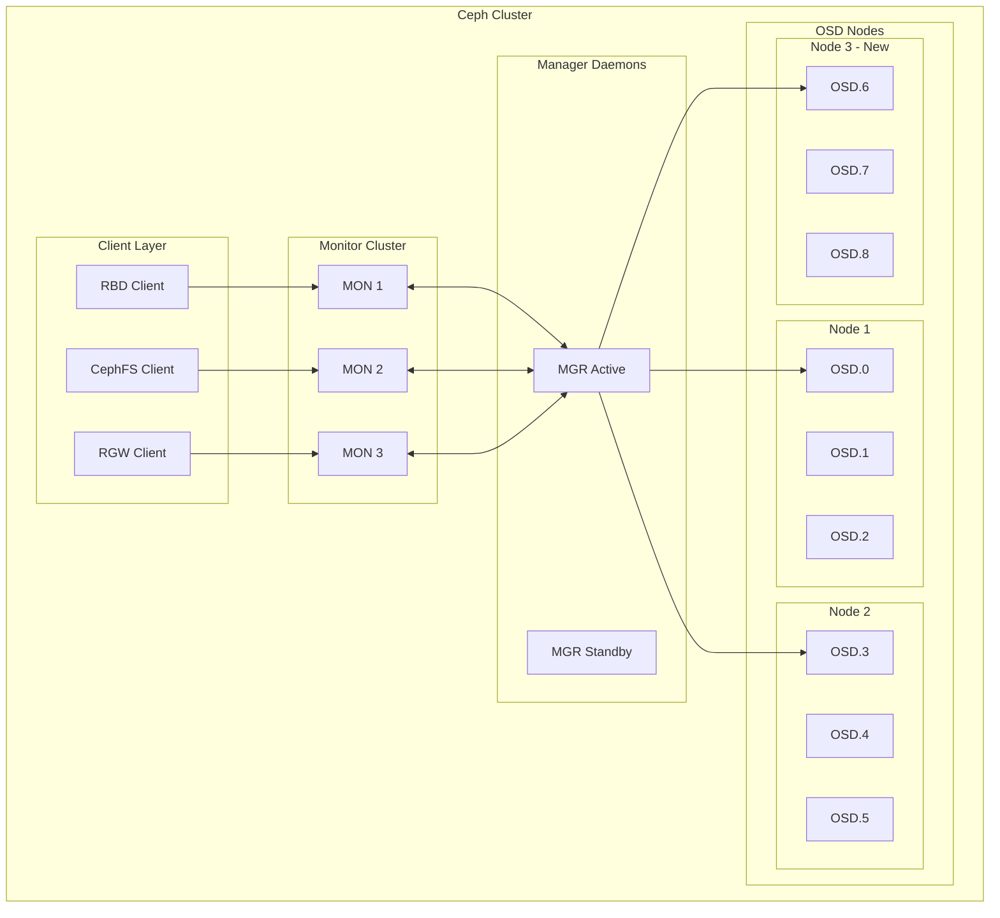
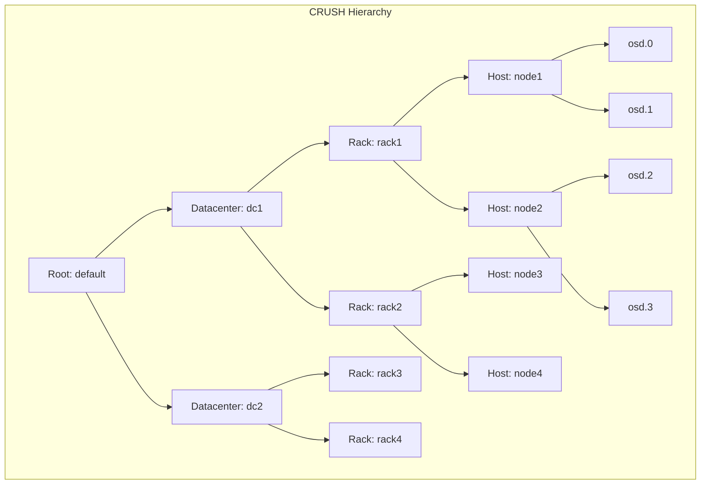
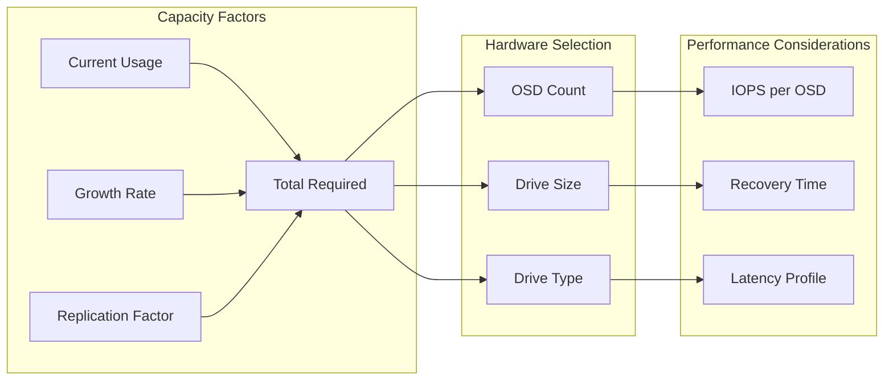
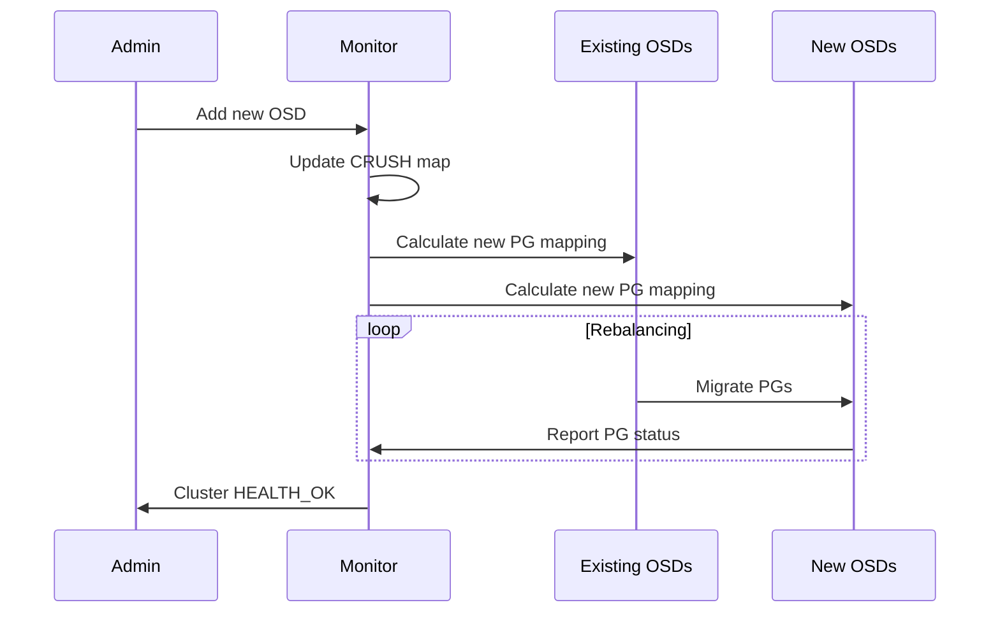
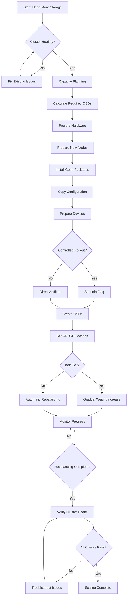

# How to Scale Ceph OSDs for Increased Storage Capacity

Author: [nawazdhandala](https://github.com/nawazdhandala)

Tags: Ceph, Storage, Scaling, OSDs, High Availability, Cloud Native

Description: Learn how to safely add new OSDs to expand your Ceph cluster storage capacity without downtime.

---

## Introduction

Ceph is a powerful distributed storage system that provides excellent scalability and fault tolerance. One of its core strengths is the ability to seamlessly expand storage capacity by adding new Object Storage Daemons (OSDs). This guide walks you through the complete process of scaling Ceph OSDs, from initial planning to monitoring data migration.

Whether you're running out of storage space or planning for future growth, understanding how to properly scale your Ceph cluster is essential for maintaining a healthy and performant storage infrastructure.

## Understanding Ceph OSD Architecture

Before diving into the scaling process, let's understand how OSDs fit into the Ceph ecosystem.

### What is an OSD?

An OSD (Object Storage Daemon) is the component responsible for storing data, handling data replication, recovery, and rebalancing. Each OSD typically corresponds to a single storage device (HDD, SSD, or NVMe).

### Ceph Cluster Topology

The following diagram illustrates how OSDs integrate with other Ceph components:



### CRUSH Map and Data Distribution

Ceph uses the CRUSH (Controlled Replication Under Scalable Hashing) algorithm to determine data placement. Understanding CRUSH is crucial for proper OSD scaling:



## Pre-Scaling Checklist

Before adding new OSDs, ensure your cluster is healthy and you have a solid plan.

### Step 1: Verify Cluster Health

Check the current cluster status to ensure there are no existing issues:

```bash
# Display overall cluster health status
# HEALTH_OK indicates the cluster is ready for expansion
ceph health detail

# Get comprehensive cluster status including:
# - Cluster ID and health
# - Monitor quorum status
# - OSD statistics
# - Pool information
ceph status

# Verify all existing OSDs are up and running
# Look for 'up' and 'in' status for each OSD
ceph osd tree
```

### Step 2: Check Current Capacity

Understand your current storage utilization:

```bash
# Display disk usage per OSD and pool
# Shows RAW storage, used space, and available space
ceph osd df

# Alternative: Get detailed usage statistics with tree view
# This shows usage organized by CRUSH hierarchy
ceph osd df tree

# Check pool-specific statistics
# Useful for understanding which pools consume the most space
ceph df detail
```

### Step 3: Verify Network Connectivity

Ensure the new OSD nodes can communicate with the cluster:

```bash
# Test connectivity to monitor nodes from the new OSD host
# Replace with your actual monitor IP addresses
ping -c 3 mon1.example.com
ping -c 3 mon2.example.com
ping -c 3 mon3.example.com

# Verify the cluster network is reachable
# Ceph uses separate public and cluster networks
# Public network: client-to-cluster communication
# Cluster network: OSD-to-OSD replication traffic
ip route get 10.0.0.0  # Replace with your cluster network
```

## Capacity Planning

Proper capacity planning ensures smooth scaling operations.

### Calculating Required OSDs

Use this formula to determine how many OSDs you need:

```bash
# Formula for calculating required raw capacity:
# Required Raw = (Usable Capacity * Replication Factor) / (1 - Reserved Overhead)

# Example calculation for 100TB usable with 3x replication:
# Required Raw = (100TB * 3) / (1 - 0.30)
# Required Raw = 300TB / 0.70
# Required Raw ≈ 428TB

# Calculate number of OSDs needed:
# For 8TB drives: 428TB / 8TB = 54 OSDs
# For 16TB drives: 428TB / 16TB = 27 OSDs
```

### Capacity Planning Considerations



## Preparing New OSD Nodes

### Step 1: Install Ceph Packages

Install the necessary Ceph packages on the new OSD node:

```bash
# Add the Ceph repository (for Ubuntu/Debian)
# Using Reef release as an example - adjust for your version
wget -q -O- 'https://download.ceph.com/keys/release.asc' | sudo apt-key add -
echo "deb https://download.ceph.com/debian-reef/ $(lsb_release -sc) main" | \
    sudo tee /etc/apt/sources.list.d/ceph.list

# Update package lists and install ceph-osd package
sudo apt update
sudo apt install -y ceph-osd ceph-common

# Verify the installation
ceph --version
```

### Step 2: Configure Ceph on the New Node

Copy the Ceph configuration and keyring files:

```bash
# Copy the ceph.conf from an existing node
# This ensures consistent configuration across the cluster
sudo scp admin@existing-node:/etc/ceph/ceph.conf /etc/ceph/ceph.conf

# Copy the bootstrap-osd keyring
# This keyring is required for OSD creation
sudo scp admin@existing-node:/var/lib/ceph/bootstrap-osd/ceph.keyring \
    /var/lib/ceph/bootstrap-osd/ceph.keyring

# Set proper permissions on the keyring
sudo chown ceph:ceph /var/lib/ceph/bootstrap-osd/ceph.keyring
sudo chmod 600 /var/lib/ceph/bootstrap-osd/ceph.keyring
```

### Step 3: Prepare Storage Devices

Identify and prepare the storage devices for OSD use:

```bash
# List all available block devices
# Look for devices that are not yet in use
lsblk -o NAME,SIZE,TYPE,MOUNTPOINT,FSTYPE

# Example output:
# NAME   SIZE TYPE MOUNTPOINT FSTYPE
# sda    500G disk
# ├─sda1 500M part /boot      ext4
# └─sda2 499G part /          ext4
# sdb      8T disk                    <- Available for OSD
# sdc      8T disk                    <- Available for OSD
# sdd      8T disk                    <- Available for OSD

# Wipe any existing filesystem signatures
# WARNING: This destroys all data on the device
sudo wipefs -a /dev/sdb
sudo wipefs -a /dev/sdc
sudo wipefs -a /dev/sdd

# Verify the devices are clean
sudo blkid /dev/sdb /dev/sdc /dev/sdd
# Should return no output if properly wiped
```

## Adding New OSDs

### Method 1: Using ceph-volume (Recommended)

The modern and recommended approach for OSD creation:

```bash
# Create OSDs using the BlueStore backend (default and recommended)
# This command will:
# 1. Create a new OSD ID
# 2. Format the device with BlueStore
# 3. Start the OSD daemon
# 4. Add the OSD to the CRUSH map

# Basic OSD creation - single device
sudo ceph-volume lvm create --data /dev/sdb

# Create OSD with separate WAL device for improved performance
# The WAL (Write-Ahead Log) on faster storage improves write latency
sudo ceph-volume lvm create --data /dev/sdb --block.wal /dev/nvme0n1p1

# Create OSD with separate DB and WAL devices
# DB (database) stores BlueStore metadata
# Placing both on NVMe significantly improves performance
sudo ceph-volume lvm create \
    --data /dev/sdb \
    --block.db /dev/nvme0n1p2 \
    --block.wal /dev/nvme0n1p1
```

### Method 2: Batch Creation

For adding multiple OSDs at once:

```bash
# Prepare multiple devices in batch
# This discovers all available devices and creates OSDs
sudo ceph-volume lvm batch --yes /dev/sdb /dev/sdc /dev/sdd

# Preview what will be created without making changes
# Always run this first to verify the plan
sudo ceph-volume lvm batch --report /dev/sdb /dev/sdc /dev/sdd

# Batch creation with dedicated NVMe for DB/WAL
# This automatically allocates NVMe space across HDDs
sudo ceph-volume lvm batch \
    --yes \
    /dev/sdb /dev/sdc /dev/sdd \
    --db-devices /dev/nvme0n1
```

### Method 3: Using Ceph Orchestrator (cephadm)

For clusters deployed with cephadm:

```bash
# Add the new host to the cluster
# This registers the host with the orchestrator
ceph orch host add new-osd-node.example.com 192.168.1.10

# Label the host for OSD placement
ceph orch host label add new-osd-node.example.com osd

# Apply OSD specification to all labeled hosts
# This automatically creates OSDs on available devices
ceph orch apply osd --all-available-devices

# Or apply a specific OSD specification from a YAML file
ceph orch apply -i osd_spec.yaml
```

Here's an example OSD specification file:

```yaml
# osd_spec.yaml
# Defines how OSDs should be deployed across the cluster
service_type: osd
service_id: default_drive_group
placement:
  # Target hosts with the 'osd' label
  label: osd
spec:
  # Data devices configuration
  data_devices:
    # Use all rotational (HDD) devices
    rotational: true
    # Minimum size filter
    size: '4T:'
  # Optional: DB devices on faster storage
  db_devices:
    # Use non-rotational (SSD/NVMe) devices
    rotational: false
    size: ':500G'
  # Enable encryption for data at rest
  encrypted: false
  # OSD memory target (useful for dense nodes)
  osd_memory_target: 4294967296  # 4GB
```

## Managing OSD Weight and CRUSH Location

### Setting OSD Weight

OSD weight determines how much data an OSD receives relative to others:

```bash
# View current OSD weights
# Weight 1.0 is typical for a standard drive
ceph osd tree

# Set OSD weight based on device size
# Use the 'reweight' command to adjust data distribution
# Value range: 0.0 (no data) to 1.0+ (proportional to size)
ceph osd reweight osd.6 1.0

# Alternatively, use CRUSH weight for permanent adjustment
# This is based on device capacity in TB
ceph osd crush reweight osd.6 8.0  # For an 8TB drive

# Auto-reweight OSDs based on their utilization
# This helps balance data across OSDs with different usage
ceph osd reweight-by-utilization 105  # Threshold percentage
```

### Configuring CRUSH Location

Place OSDs correctly in the CRUSH hierarchy:

```bash
# Move an OSD to the correct location in CRUSH hierarchy
# This ensures proper failure domain distribution
ceph osd crush move osd.6 host=new-osd-node rack=rack1 datacenter=dc1

# Add a new bucket (e.g., new rack) to the hierarchy
ceph osd crush add-bucket rack3 rack
ceph osd crush move rack3 root=default datacenter=dc1

# Verify the CRUSH tree structure
ceph osd crush tree

# Export CRUSH map for detailed inspection
ceph osd getcrushmap -o crushmap.bin
crushtool -d crushmap.bin -o crushmap.txt
cat crushmap.txt
```

## Rebalancing Strategies

When new OSDs are added, Ceph automatically rebalances data. Proper management of this process is crucial.

### Understanding Rebalancing



### Controlling Rebalancing Speed

Balance between migration speed and cluster performance:

```bash
# Check current recovery/backfill settings
ceph config get osd osd_recovery_max_active
ceph config get osd osd_max_backfills

# For PRODUCTION environments - prioritize client I/O
# Use conservative settings to minimize performance impact
ceph config set osd osd_recovery_max_active 1
ceph config set osd osd_max_backfills 1
ceph config set osd osd_recovery_sleep 0.1

# For MAINTENANCE windows - faster migration
# Use aggressive settings when client load is low
ceph config set osd osd_recovery_max_active 3
ceph config set osd osd_max_backfills 3
ceph config set osd osd_recovery_sleep 0

# Set recovery priority (higher = faster, but more impact)
# Range: 1 (lowest) to 63 (highest)
ceph config set osd osd_recovery_priority 5
```

### Gradual OSD Introduction

Add OSDs gradually using the `noin` flag:

```bash
# Set the 'noin' flag to prevent automatic data placement
# This allows controlled introduction of new OSDs
ceph osd set noin

# Add the new OSDs
sudo ceph-volume lvm create --data /dev/sdb
sudo ceph-volume lvm create --data /dev/sdc
sudo ceph-volume lvm create --data /dev/sdd

# Verify OSDs are up but not receiving data
ceph osd tree
# Look for: osd.6  up  0  (weight 0 means no data)

# Gradually set weights to introduce data
# Start with low weight and increase over time
ceph osd crush reweight osd.6 1.0
# Wait for rebalancing to complete
ceph -w  # Watch cluster status

ceph osd crush reweight osd.7 1.0
# Repeat for remaining OSDs

# Remove the 'noin' flag when done
ceph osd unset noin
```

### Pausing and Resuming Rebalancing

Control rebalancing for maintenance or emergencies:

```bash
# Pause all recovery and backfill operations
# Useful during peak hours or emergencies
ceph osd set noout      # Prevent marking OSDs as out
ceph osd set norebalance # Stop rebalancing
ceph osd set nobackfill  # Stop backfill operations
ceph osd set norecover   # Stop recovery operations

# Check current flags
ceph osd dump | grep flags

# Resume operations
# Always unset in reverse order
ceph osd unset norecover
ceph osd unset nobackfill
ceph osd unset norebalance
ceph osd unset noout

# Verify rebalancing has resumed
ceph -s
```

## Monitoring Data Migration

### Real-time Cluster Monitoring

Monitor the cluster during rebalancing:

```bash
# Watch cluster status in real-time
# Shows ongoing recovery operations and their progress
ceph -w

# Example output during rebalancing:
# 2024-01-07 10:30:00  cluster:
#     health: HEALTH_WARN
#             Degraded data redundancy: 1234/100000 objects degraded
#     services:
#       mon: 3 daemons, quorum a,b,c
#       mgr: x(active)
#       osd: 12 osds: 12 up, 12 in; 543 remapped pgs
#     progress:
#       Rebalancing (12h)
#         [......................]

# Get detailed progress information
ceph progress

# Show PG (Placement Group) recovery statistics
ceph pg stat
```

### Detailed OSD Performance Monitoring

Track individual OSD performance during migration:

```bash
# Get performance counters for all OSDs
# Shows operations per second, latency, and bandwidth
ceph osd perf

# Check specific OSD status
ceph osd find 6  # Find OSD 6's location and status

# Monitor OSD operation queue depth
# High queue depth indicates OSD is under heavy load
ceph daemon osd.6 perf dump | jq '.osd.op_queue_ops'

# Watch recovery operations in progress
ceph osd pool stats

# Get detailed recovery statistics
ceph pg dump_stuck recovering
ceph pg dump_stuck degraded
```

### Using the Ceph Dashboard

The Ceph Dashboard provides visual monitoring:

```bash
# Enable the dashboard module if not already enabled
ceph mgr module enable dashboard

# Set up dashboard access
ceph dashboard create-self-signed-cert
ceph dashboard set-login-credentials admin secure_password

# Get dashboard URL
ceph mgr services | jq '.dashboard'
# Output: "https://mgr-node:8443/"
```

### Creating Custom Monitoring Scripts

Here's a script for automated monitoring:

```bash
#!/bin/bash
# monitor_rebalancing.sh
# Monitors Ceph cluster rebalancing progress and sends alerts

# Configuration
ALERT_THRESHOLD=80  # Alert if usage exceeds this percentage
CHECK_INTERVAL=60   # Check every 60 seconds
LOG_FILE="/var/log/ceph/rebalancing_monitor.log"

# Function to log messages with timestamps
log_message() {
    echo "$(date '+%Y-%m-%d %H:%M:%S') - $1" | tee -a "$LOG_FILE"
}

# Function to get cluster health
get_health() {
    ceph health 2>/dev/null
}

# Function to get rebalancing progress
get_progress() {
    ceph progress json 2>/dev/null | jq -r '.events[] |
        select(.message | contains("Rebalancing")) |
        "\(.message): \(.progress * 100 | floor)%"'
}

# Function to get PG statistics
get_pg_stats() {
    ceph pg stat 2>/dev/null
}

# Main monitoring loop
log_message "Starting rebalancing monitor..."

while true; do
    HEALTH=$(get_health)
    PROGRESS=$(get_progress)
    PG_STATS=$(get_pg_stats)

    log_message "Health: $HEALTH"

    if [ -n "$PROGRESS" ]; then
        log_message "Rebalancing Progress: $PROGRESS"
    else
        log_message "No active rebalancing operations"
    fi

    log_message "PG Stats: $PG_STATS"

    # Check if rebalancing is complete
    if [[ "$HEALTH" == "HEALTH_OK" ]] && [[ -z "$PROGRESS" ]]; then
        log_message "Rebalancing complete! Cluster is healthy."
        # Optionally send notification here
    fi

    sleep $CHECK_INTERVAL
done
```

## Post-Scaling Verification

After adding OSDs, verify the cluster is healthy and data is properly distributed.

### Verify OSD Status

```bash
# Check all OSDs are up and in
# All OSDs should show 'up' and 'in' status
ceph osd tree

# Verify OSD utilization is balanced
# Look for even distribution across OSDs (within ~10%)
ceph osd df tree

# Check for any slow or blocked OSDs
ceph osd blocked-by

# Verify OSD versions are consistent
ceph osd versions
```

### Verify Data Distribution

```bash
# Check pool statistics and distribution
ceph df detail

# Verify PG distribution across OSDs
# Even PG distribution indicates proper balancing
ceph osd pool ls detail

# Check for any misplaced or degraded objects
ceph health detail

# Verify CRUSH rules are being honored
ceph osd pool get <pool-name> crush_rule
```

### Performance Validation

```bash
# Run a simple benchmark to verify performance
# Write test (be careful in production!)
rados bench -p <pool-name> 60 write --no-cleanup

# Read test
rados bench -p <pool-name> 60 seq

# Cleanup test data
rados -p <pool-name> cleanup

# Check overall cluster IOPS
ceph osd pool stats
```

## Scaling Workflow Diagram

The complete OSD scaling workflow:



## Troubleshooting Common Issues

### Issue: OSD Won't Start

```bash
# Check OSD logs for errors
sudo journalctl -u ceph-osd@6 -n 100

# Common causes and solutions:
# 1. Missing keyring
ls -la /var/lib/ceph/osd/ceph-6/keyring

# 2. Wrong ownership
sudo chown -R ceph:ceph /var/lib/ceph/osd/ceph-6/

# 3. Device issues
sudo ceph-volume lvm list

# 4. Re-activate the OSD
sudo ceph-volume lvm activate 6 <osd-fsid>
```

### Issue: Slow Rebalancing

```bash
# Check for network bottlenecks
iperf3 -c other-osd-node -t 30

# Check for disk I/O saturation
iostat -x 1 5

# Increase recovery limits during maintenance window
ceph config set osd osd_recovery_max_active 5
ceph config set osd osd_max_backfills 5
```

### Issue: Uneven Data Distribution

```bash
# Check CRUSH weights
ceph osd crush tree

# Verify PG count is sufficient
# Rule of thumb: 100-200 PGs per OSD
ceph osd pool get <pool-name> pg_num

# Adjust PG count if needed (must be power of 2)
ceph osd pool set <pool-name> pg_num 256
ceph osd pool set <pool-name> pgp_num 256

# Force rebalance by adjusting weights
ceph osd reweight-by-utilization
```

## Best Practices Summary

1. **Always verify cluster health** before adding new OSDs
2. **Plan capacity** with growth projections (6-12 months)
3. **Use controlled rollouts** for production environments
4. **Monitor rebalancing** to catch issues early
5. **Document changes** for future reference
6. **Test performance** after scaling operations
7. **Keep configurations consistent** across all nodes
8. **Maintain proper CRUSH hierarchy** for fault tolerance
9. **Schedule scaling** during low-traffic periods
10. **Have a rollback plan** in case of issues

## Conclusion

Scaling Ceph OSDs is a straightforward process when properly planned and executed. By following this guide, you can safely expand your storage capacity while maintaining high availability and data integrity.

Key takeaways:
- Always start with a healthy cluster
- Use `ceph-volume` for modern OSD deployment
- Control rebalancing speed to minimize performance impact
- Monitor the migration process closely
- Verify data distribution after scaling completes

With Ceph's intelligent data distribution and automatic rebalancing, your cluster can grow seamlessly to meet increasing storage demands.

## Additional Resources

- [Ceph Official Documentation](https://docs.ceph.com/en/latest/)
- [Ceph OSD Configuration Reference](https://docs.ceph.com/en/latest/rados/configuration/osd-config-ref/)
- [CRUSH Map Management](https://docs.ceph.com/en/latest/rados/operations/crush-map/)
- [Ceph Performance Tuning](https://docs.ceph.com/en/latest/rados/configuration/bluestore-config-ref/)
