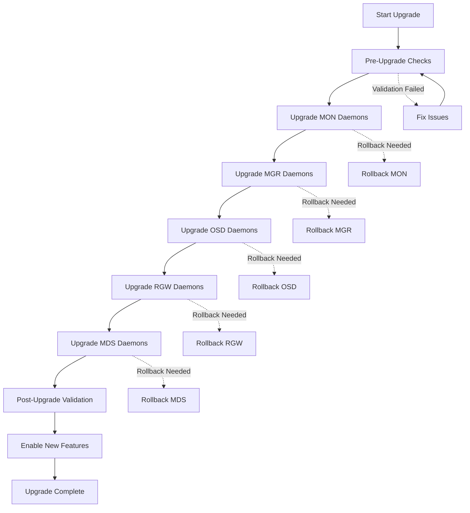
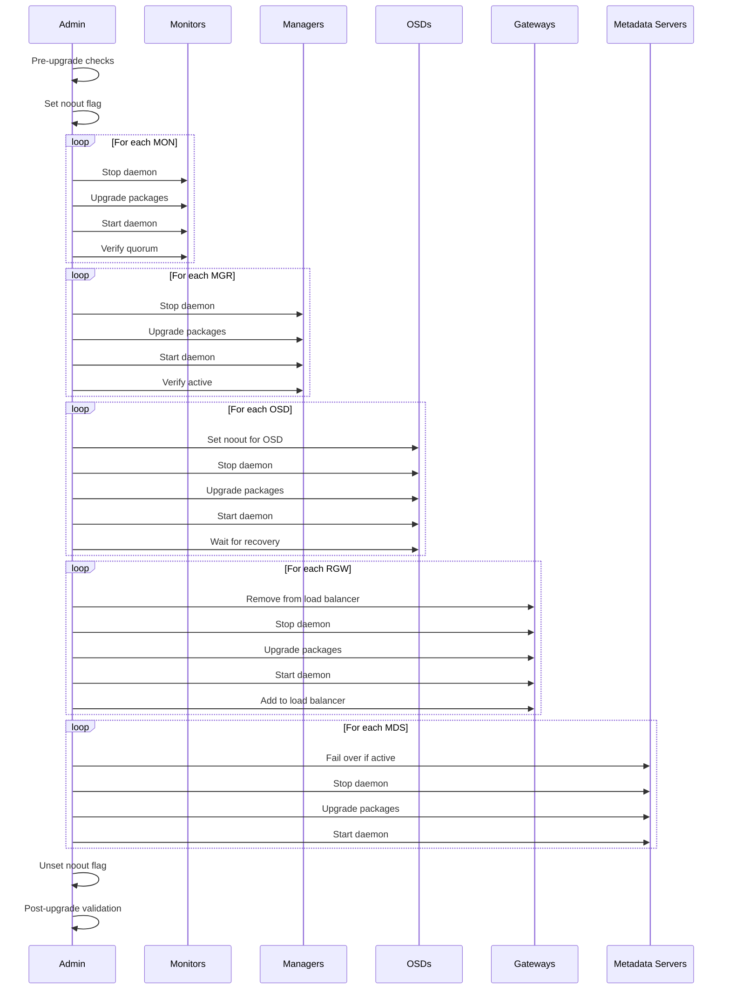
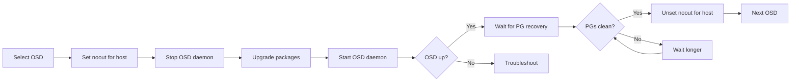
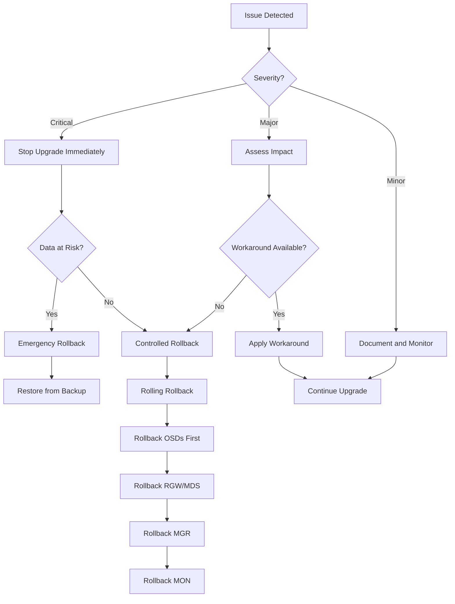

# How to Upgrade Ceph Cluster with Zero Downtime

Author: [nawazdhandala](https://github.com/nawazdhandala)

Tags: Ceph, Storage, Upgrade, Zero Downtime, Maintenance, Cloud Native

Description: A step-by-step guide to upgrading Ceph clusters without service interruption.

---

Upgrading a Ceph cluster is a critical maintenance task that, when done correctly, can be performed without any service interruption. This comprehensive guide walks you through the entire process of upgrading your Ceph cluster with zero downtime, covering pre-upgrade checks, the rolling upgrade procedure for each component, and rollback strategies.

## Table of Contents

1. [Understanding Ceph Upgrade Architecture](#understanding-ceph-upgrade-architecture)
2. [Pre-Upgrade Checklist](#pre-upgrade-checklist)
3. [Upgrade Workflow Overview](#upgrade-workflow-overview)
4. [Upgrading Ceph Monitors (MON)](#upgrading-ceph-monitors-mon)
5. [Upgrading Ceph Managers (MGR)](#upgrading-ceph-managers-mgr)
6. [Upgrading Ceph OSDs](#upgrading-ceph-osds)
7. [Upgrading Ceph RADOS Gateway (RGW)](#upgrading-ceph-rados-gateway-rgw)
8. [Upgrading MDS (Metadata Servers)](#upgrading-mds-metadata-servers)
9. [Post-Upgrade Validation](#post-upgrade-validation)
10. [Rollback Procedures](#rollback-procedures)
11. [Best Practices and Tips](#best-practices-and-tips)

## Understanding Ceph Upgrade Architecture

Ceph is designed with high availability in mind, which makes zero-downtime upgrades possible. The key principles that enable this are:

- **Redundancy**: Multiple instances of each daemon type ensure service continuity
- **Rolling upgrades**: Components can be upgraded one at a time
- **Version compatibility**: Ceph maintains backward compatibility between adjacent major versions
- **CRUSH algorithm**: Data placement continues to work during partial upgrades

### Component Upgrade Order

The recommended upgrade order is critical for maintaining cluster stability:



## Pre-Upgrade Checklist

Before starting any upgrade, thorough preparation is essential. The following checks ensure your cluster is healthy and ready for the upgrade process.

### Check Cluster Health Status

This command displays the overall health of your Ceph cluster. The cluster should report HEALTH_OK before proceeding.

```bash
# Check overall cluster health - must be HEALTH_OK before upgrade
ceph health detail
```

### Verify Cluster Status

This provides a comprehensive view of your cluster including monitor quorum, OSD status, and pool information.

```bash
# Get detailed cluster status including all components
ceph status
```

### Check OSD Status

Ensure all OSDs are up and in. Any down or out OSDs should be addressed before upgrading.

```bash
# Verify all OSDs are up and in the cluster
ceph osd status

# List all OSDs with their current state
ceph osd tree
```

### Verify PG Status

All placement groups should be active+clean. Any degraded or recovering PGs indicate data that needs to be synchronized.

```bash
# Check placement group status - all should be active+clean
ceph pg stat

# Get detailed PG status if issues are found
ceph pg dump_stuck unclean
```

### Check Version Compatibility

Verify the current version and ensure the target version is compatible for a direct upgrade.

```bash
# Display current Ceph version for all daemons
ceph versions

# Check version compatibility matrix
ceph features
```

### Document Current Configuration

Create a backup of your current configuration before making any changes.

```bash
# Export current cluster configuration to a file
ceph config dump > /backup/ceph-config-backup-$(date +%Y%m%d).txt

# Export the CRUSH map for backup
ceph osd getcrushmap -o /backup/crushmap-backup-$(date +%Y%m%d).bin

# Decompile CRUSH map for readable backup
crushtool -d /backup/crushmap-backup-$(date +%Y%m%d).bin \
    -o /backup/crushmap-backup-$(date +%Y%m%d).txt
```

### Create Pre-Upgrade Health Check Script

This script automates all pre-upgrade checks and provides a clear go/no-go decision.

```bash
#!/bin/bash
# pre-upgrade-check.sh
# Comprehensive pre-upgrade health check script for Ceph clusters
# Run this script before starting any upgrade procedure

set -e

echo "=========================================="
echo "Ceph Pre-Upgrade Health Check"
echo "Date: $(date)"
echo "=========================================="

# Color codes for output formatting
RED='\033[0;31m'
GREEN='\033[0;32m'
YELLOW='\033[1;33m'
NC='\033[0m' # No Color

ERRORS=0

# Function to check cluster health status
check_health() {
    echo -e "\n[1/8] Checking cluster health..."
    HEALTH=$(ceph health 2>/dev/null)
    if [[ "$HEALTH" == "HEALTH_OK" ]]; then
        echo -e "${GREEN}PASS${NC}: Cluster is healthy"
    else
        echo -e "${RED}FAIL${NC}: Cluster health is $HEALTH"
        ceph health detail
        ((ERRORS++))
    fi
}

# Function to verify all monitors are in quorum
check_mon_quorum() {
    echo -e "\n[2/8] Checking monitor quorum..."
    MON_COUNT=$(ceph mon stat 2>/dev/null | grep -oP '\d+ mons' | grep -oP '\d+')
    QUORUM_COUNT=$(ceph quorum_status 2>/dev/null | jq '.quorum | length')

    if [[ "$MON_COUNT" == "$QUORUM_COUNT" ]]; then
        echo -e "${GREEN}PASS${NC}: All $MON_COUNT monitors are in quorum"
    else
        echo -e "${RED}FAIL${NC}: Only $QUORUM_COUNT of $MON_COUNT monitors in quorum"
        ((ERRORS++))
    fi
}

# Function to check OSD status
check_osd_status() {
    echo -e "\n[3/8] Checking OSD status..."
    TOTAL_OSDS=$(ceph osd stat 2>/dev/null | grep -oP '\d+ osds' | head -1 | grep -oP '\d+')
    UP_OSDS=$(ceph osd stat 2>/dev/null | grep -oP '\d+ up' | grep -oP '\d+')
    IN_OSDS=$(ceph osd stat 2>/dev/null | grep -oP '\d+ in' | grep -oP '\d+')

    if [[ "$TOTAL_OSDS" == "$UP_OSDS" ]] && [[ "$TOTAL_OSDS" == "$IN_OSDS" ]]; then
        echo -e "${GREEN}PASS${NC}: All $TOTAL_OSDS OSDs are up and in"
    else
        echo -e "${RED}FAIL${NC}: $UP_OSDS up, $IN_OSDS in out of $TOTAL_OSDS total"
        ((ERRORS++))
    fi
}

# Function to check placement group status
check_pg_status() {
    echo -e "\n[4/8] Checking placement group status..."
    PG_STATUS=$(ceph pg stat 2>/dev/null)

    if echo "$PG_STATUS" | grep -q "active+clean"; then
        CLEAN_PGS=$(echo "$PG_STATUS" | grep -oP '\d+(?= active\+clean)')
        TOTAL_PGS=$(echo "$PG_STATUS" | grep -oP '\d+(?= pgs)')

        if [[ "$CLEAN_PGS" == "$TOTAL_PGS" ]]; then
            echo -e "${GREEN}PASS${NC}: All $TOTAL_PGS PGs are active+clean"
        else
            echo -e "${YELLOW}WARN${NC}: $CLEAN_PGS of $TOTAL_PGS PGs are active+clean"
            ceph pg dump_stuck unclean
            ((ERRORS++))
        fi
    else
        echo -e "${RED}FAIL${NC}: Unable to determine PG status"
        ((ERRORS++))
    fi
}

# Function to check available disk space
check_disk_space() {
    echo -e "\n[5/8] Checking OSD disk space..."
    MAX_USAGE=$(ceph osd df 2>/dev/null | awk 'NR>1 {print $7}' | \
        sed 's/%//' | sort -rn | head -1)

    if (( $(echo "$MAX_USAGE < 80" | bc -l) )); then
        echo -e "${GREEN}PASS${NC}: Maximum OSD usage is ${MAX_USAGE}%"
    elif (( $(echo "$MAX_USAGE < 90" | bc -l) )); then
        echo -e "${YELLOW}WARN${NC}: Maximum OSD usage is ${MAX_USAGE}% (consider rebalancing)"
    else
        echo -e "${RED}FAIL${NC}: Maximum OSD usage is ${MAX_USAGE}% (too high for upgrade)"
        ((ERRORS++))
    fi
}

# Function to verify no ongoing recovery operations
check_recovery() {
    echo -e "\n[6/8] Checking for ongoing recovery..."
    RECOVERING=$(ceph status 2>/dev/null | grep -E "recovering|degraded|backfilling" || true)

    if [[ -z "$RECOVERING" ]]; then
        echo -e "${GREEN}PASS${NC}: No recovery operations in progress"
    else
        echo -e "${RED}FAIL${NC}: Recovery operations in progress"
        echo "$RECOVERING"
        ((ERRORS++))
    fi
}

# Function to check MGR module status
check_mgr_modules() {
    echo -e "\n[7/8] Checking MGR modules..."
    ACTIVE_MGR=$(ceph mgr stat 2>/dev/null | jq -r '.active_name')

    if [[ -n "$ACTIVE_MGR" ]] && [[ "$ACTIVE_MGR" != "null" ]]; then
        echo -e "${GREEN}PASS${NC}: Active MGR is $ACTIVE_MGR"
    else
        echo -e "${RED}FAIL${NC}: No active MGR daemon"
        ((ERRORS++))
    fi
}

# Function to display version information
check_versions() {
    echo -e "\n[8/8] Current version information..."
    ceph versions
}

# Run all checks
check_health
check_mon_quorum
check_osd_status
check_pg_status
check_disk_space
check_recovery
check_mgr_modules
check_versions

# Final summary
echo -e "\n=========================================="
echo "Pre-Upgrade Check Summary"
echo "=========================================="

if [[ $ERRORS -eq 0 ]]; then
    echo -e "${GREEN}All checks passed! Cluster is ready for upgrade.${NC}"
    exit 0
else
    echo -e "${RED}$ERRORS check(s) failed. Please resolve issues before upgrading.${NC}"
    exit 1
fi
```

## Upgrade Workflow Overview

The following diagram illustrates the complete upgrade workflow with decision points and validation steps.



## Upgrading Ceph Monitors (MON)

Monitors are the first component to upgrade. They maintain the cluster map and must maintain quorum throughout the upgrade process.

### Step 1: Set Cluster Flags

Before starting the upgrade, set the noout flag to prevent OSDs from being marked out during the maintenance window.

```bash
# Set the noout flag to prevent OSD removal during upgrade
# This is critical to avoid unnecessary data rebalancing
ceph osd set noout

# Verify the flag is set
ceph osd dump | grep flags
```

### Step 2: Upgrade Monitors One at a Time

This script handles upgrading a single monitor node. Run this on each monitor node sequentially, waiting for quorum to be re-established before proceeding to the next.

```bash
#!/bin/bash
# upgrade-mon.sh
# Script to upgrade a single Ceph Monitor daemon
# Usage: ./upgrade-mon.sh <mon-id>

MON_ID=$1

if [[ -z "$MON_ID" ]]; then
    echo "Usage: $0 <mon-id>"
    exit 1
fi

echo "Starting upgrade of mon.$MON_ID"

# Step 1: Verify current quorum status before making changes
echo "Checking quorum status..."
ceph quorum_status | jq '.quorum_names'

# Step 2: Stop the monitor daemon gracefully
# Using systemctl for systemd-managed installations
echo "Stopping ceph-mon@$MON_ID..."
sudo systemctl stop ceph-mon@$MON_ID

# Step 3: Update the Ceph packages
# For Ubuntu/Debian systems
echo "Upgrading Ceph packages..."
sudo apt update
sudo apt install -y ceph-mon ceph-common

# For RHEL/CentOS systems, use:
# sudo dnf update -y ceph-mon ceph-common

# Step 4: Start the upgraded monitor daemon
echo "Starting ceph-mon@$MON_ID..."
sudo systemctl start ceph-mon@$MON_ID

# Step 5: Wait for the monitor to rejoin quorum
echo "Waiting for monitor to rejoin quorum..."
sleep 10

# Step 6: Verify quorum is re-established
QUORUM_CHECK=$(ceph quorum_status 2>/dev/null | jq -r '.quorum_names[]' | grep -c "$MON_ID" || true)

if [[ "$QUORUM_CHECK" -gt 0 ]]; then
    echo "SUCCESS: mon.$MON_ID has rejoined quorum"
    ceph quorum_status | jq '.quorum_names'
else
    echo "WARNING: mon.$MON_ID may not have rejoined quorum yet"
    echo "Please verify manually before proceeding"
fi

# Step 7: Display version to confirm upgrade
echo "Current mon.$MON_ID version:"
ceph daemon mon.$MON_ID version
```

### Step 3: Verify All Monitors Upgraded

After upgrading all monitors, verify they are all running the new version.

```bash
# Check version of all monitor daemons
# All monitors should show the same new version
ceph tell mon.* version

# Verify quorum with all monitors
ceph mon stat

# Check detailed monitor status
ceph mon dump
```

## Upgrading Ceph Managers (MGR)

Managers provide additional monitoring and management functionality. They support active-standby failover, allowing seamless upgrades.

### Upgrade Manager Daemons

This script upgrades manager daemons with automatic failover handling.

```bash
#!/bin/bash
# upgrade-mgr.sh
# Script to upgrade Ceph Manager daemons
# Usage: ./upgrade-mgr.sh <mgr-id>

MGR_ID=$1

if [[ -z "$MGR_ID" ]]; then
    echo "Usage: $0 <mgr-id>"
    exit 1
fi

echo "Starting upgrade of mgr.$MGR_ID"

# Step 1: Check if this is the active manager
ACTIVE_MGR=$(ceph mgr stat | jq -r '.active_name')
echo "Current active manager: $ACTIVE_MGR"

# Step 2: If upgrading the active manager, trigger failover first
if [[ "$ACTIVE_MGR" == "$MGR_ID" ]]; then
    echo "This is the active manager. Triggering failover..."

    # Fail the active manager to a standby
    ceph mgr fail $MGR_ID

    # Wait for failover to complete
    sleep 5

    # Verify new active manager
    NEW_ACTIVE=$(ceph mgr stat | jq -r '.active_name')
    echo "New active manager: $NEW_ACTIVE"
fi

# Step 3: Stop the manager daemon
echo "Stopping ceph-mgr@$MGR_ID..."
sudo systemctl stop ceph-mgr@$MGR_ID

# Step 4: Upgrade packages
echo "Upgrading Ceph manager packages..."
sudo apt update
sudo apt install -y ceph-mgr ceph-common

# For RHEL/CentOS:
# sudo dnf update -y ceph-mgr ceph-common

# Step 5: Start the upgraded manager
echo "Starting ceph-mgr@$MGR_ID..."
sudo systemctl start ceph-mgr@$MGR_ID

# Step 6: Verify manager is running
sleep 5
MGR_STATUS=$(ceph mgr stat | jq -r '.standbys[].name' 2>/dev/null | grep "$MGR_ID" || \
             ceph mgr stat | jq -r '.active_name' | grep "$MGR_ID" || echo "")

if [[ -n "$MGR_STATUS" ]]; then
    echo "SUCCESS: mgr.$MGR_ID is running"
else
    echo "WARNING: mgr.$MGR_ID status unclear. Please verify manually."
fi

# Step 7: Show current manager status
echo "Current manager status:"
ceph mgr stat
```

### Verify Manager Module Status

After upgrading managers, ensure all modules are functioning correctly.

```bash
# List all manager modules and their status
ceph mgr module ls

# Check specific important modules
ceph mgr services

# Verify dashboard is accessible (if enabled)
ceph mgr module enable dashboard 2>/dev/null || true
ceph dashboard get-prometheus-api-host
```

## Upgrading Ceph OSDs

OSDs store the actual data and require careful handling during upgrades. The rolling upgrade approach ensures data availability throughout the process.

### OSD Upgrade Strategy



### Upgrade OSD Daemons

This comprehensive script upgrades OSDs on a per-host basis for efficiency while maintaining data safety.

```bash
#!/bin/bash
# upgrade-osd-host.sh
# Script to upgrade all OSDs on a single host
# Usage: ./upgrade-osd-host.sh <hostname>

HOSTNAME=$1
WAIT_TIMEOUT=300  # 5 minutes timeout for PG recovery

if [[ -z "$HOSTNAME" ]]; then
    echo "Usage: $0 <hostname>"
    exit 1
fi

echo "=========================================="
echo "Upgrading OSDs on host: $HOSTNAME"
echo "=========================================="

# Step 1: Get list of OSDs on this host
echo "Identifying OSDs on $HOSTNAME..."
OSD_LIST=$(ceph osd tree | grep -A1 "$HOSTNAME" | grep osd | awk '{print $4}' | sed 's/osd\.//')

if [[ -z "$OSD_LIST" ]]; then
    echo "No OSDs found on $HOSTNAME"
    exit 1
fi

echo "Found OSDs: $OSD_LIST"

# Step 2: Set noout flag for this specific host
# This prevents the cluster from marking OSDs as out during upgrade
echo "Setting noout flag for host $HOSTNAME..."
ceph osd set-group noout $HOSTNAME

# Step 3: Stop all OSD daemons on this host
echo "Stopping OSD daemons on $HOSTNAME..."
for OSD_ID in $OSD_LIST; do
    echo "Stopping osd.$OSD_ID..."
    sudo systemctl stop ceph-osd@$OSD_ID
done

# Step 4: Verify all OSDs are stopped
sleep 5
for OSD_ID in $OSD_LIST; do
    STATUS=$(systemctl is-active ceph-osd@$OSD_ID 2>/dev/null)
    if [[ "$STATUS" == "active" ]]; then
        echo "ERROR: osd.$OSD_ID is still running"
        exit 1
    fi
done
echo "All OSDs stopped successfully"

# Step 5: Upgrade packages on this host
echo "Upgrading Ceph OSD packages..."
sudo apt update
sudo apt install -y ceph-osd ceph-common

# For RHEL/CentOS:
# sudo dnf update -y ceph-osd ceph-common

# Step 6: Start all OSD daemons
echo "Starting OSD daemons..."
for OSD_ID in $OSD_LIST; do
    echo "Starting osd.$OSD_ID..."
    sudo systemctl start ceph-osd@$OSD_ID
done

# Step 7: Wait for OSDs to come up
echo "Waiting for OSDs to come online..."
sleep 10

for OSD_ID in $OSD_LIST; do
    OSD_UP=$(ceph osd tree | grep "osd.$OSD_ID" | grep -c "up" || true)
    if [[ "$OSD_UP" -eq 0 ]]; then
        echo "WARNING: osd.$OSD_ID may not be up yet"
    else
        echo "osd.$OSD_ID is up"
    fi
done

# Step 8: Wait for PG recovery with timeout
echo "Waiting for PG recovery..."
START_TIME=$(date +%s)

while true; do
    CURRENT_TIME=$(date +%s)
    ELAPSED=$((CURRENT_TIME - START_TIME))

    if [[ $ELAPSED -gt $WAIT_TIMEOUT ]]; then
        echo "WARNING: Timeout waiting for PG recovery"
        echo "Current PG status:"
        ceph pg stat
        break
    fi

    # Check if all PGs are active+clean
    PG_STATUS=$(ceph pg stat 2>/dev/null)
    if echo "$PG_STATUS" | grep -q "active+clean" && \
       ! echo "$PG_STATUS" | grep -qE "degraded|recovering|backfilling"; then
        echo "All PGs are active+clean"
        break
    fi

    echo "Waiting for PGs to recover... (${ELAPSED}s elapsed)"
    sleep 10
done

# Step 9: Unset the noout flag for this host
echo "Unsetting noout flag for host $HOSTNAME..."
ceph osd unset-group noout $HOSTNAME

# Step 10: Verify OSD versions
echo "Verifying OSD versions on $HOSTNAME:"
for OSD_ID in $OSD_LIST; do
    ceph tell osd.$OSD_ID version
done

echo "=========================================="
echo "Upgrade complete for host: $HOSTNAME"
echo "=========================================="
```

### Monitor OSD Upgrade Progress

Use this script to monitor the overall upgrade progress across all OSDs.

```bash
#!/bin/bash
# monitor-osd-upgrade.sh
# Script to monitor OSD upgrade progress

echo "OSD Version Distribution:"
echo "========================="
ceph versions | jq '.osd'

echo ""
echo "OSD Status Summary:"
echo "==================="
ceph osd stat

echo ""
echo "PG Status:"
echo "=========="
ceph pg stat

echo ""
echo "Recovery Progress (if any):"
echo "==========================="
ceph status | grep -E "recovery|degraded|backfill" || echo "No recovery in progress"
```

## Upgrading Ceph RADOS Gateway (RGW)

RGW provides S3 and Swift compatible object storage interfaces. With proper load balancer configuration, RGW instances can be upgraded without any client-visible downtime.

### RGW Upgrade with Load Balancer Integration

This script coordinates RGW upgrades with load balancer health checks.

```bash
#!/bin/bash
# upgrade-rgw.sh
# Script to upgrade RGW daemon with load balancer coordination
# Usage: ./upgrade-rgw.sh <rgw-instance-id>

RGW_ID=$1
LB_API_URL=${LB_API_URL:-"http://localhost:8080/api/v1"}  # Your load balancer API

if [[ -z "$RGW_ID" ]]; then
    echo "Usage: $0 <rgw-instance-id>"
    exit 1
fi

echo "Starting upgrade of radosgw.$RGW_ID"

# Step 1: Get current RGW endpoint information
RGW_HOST=$(hostname)
RGW_PORT=$(ceph config get client.rgw.$RGW_ID rgw_frontends | grep -oP 'port=\K\d+' || echo "7480")

echo "RGW endpoint: $RGW_HOST:$RGW_PORT"

# Step 2: Mark RGW instance as unhealthy in load balancer
# This drains existing connections gracefully
# Adjust this command based on your load balancer (HAProxy, NGINX, etc.)
echo "Draining connections from load balancer..."

# Example for HAProxy via stats socket:
# echo "set server backend_rgw/$RGW_ID state drain" | \
#     sudo socat stdio /var/run/haproxy/admin.sock

# Example for NGINX using upstream module:
# curl -X POST "$LB_API_URL/upstreams/rgw_cluster/servers/$RGW_HOST:$RGW_PORT/drain"

# Wait for connections to drain (adjust timeout as needed)
echo "Waiting for connections to drain (30 seconds)..."
sleep 30

# Step 3: Stop the RGW daemon
echo "Stopping radosgw.$RGW_ID..."
sudo systemctl stop ceph-radosgw@rgw.$RGW_ID

# Step 4: Upgrade packages
echo "Upgrading RGW packages..."
sudo apt update
sudo apt install -y radosgw ceph-common

# For RHEL/CentOS:
# sudo dnf update -y ceph-radosgw ceph-common

# Step 5: Start the upgraded RGW daemon
echo "Starting radosgw.$RGW_ID..."
sudo systemctl start ceph-radosgw@rgw.$RGW_ID

# Step 6: Wait for RGW to be ready
echo "Waiting for RGW to be ready..."
MAX_RETRIES=30
RETRY_COUNT=0

while [[ $RETRY_COUNT -lt $MAX_RETRIES ]]; do
    # Check if RGW is responding to health checks
    HTTP_CODE=$(curl -s -o /dev/null -w "%{http_code}" http://localhost:$RGW_PORT/ 2>/dev/null)

    if [[ "$HTTP_CODE" == "200" ]] || [[ "$HTTP_CODE" == "403" ]]; then
        echo "RGW is responding (HTTP $HTTP_CODE)"
        break
    fi

    ((RETRY_COUNT++))
    echo "Waiting for RGW... ($RETRY_COUNT/$MAX_RETRIES)"
    sleep 2
done

if [[ $RETRY_COUNT -eq $MAX_RETRIES ]]; then
    echo "WARNING: RGW may not be fully ready. Please verify manually."
fi

# Step 7: Re-enable RGW in load balancer
echo "Re-enabling RGW in load balancer..."

# Example for HAProxy:
# echo "set server backend_rgw/$RGW_ID state ready" | \
#     sudo socat stdio /var/run/haproxy/admin.sock

# Example for NGINX:
# curl -X POST "$LB_API_URL/upstreams/rgw_cluster/servers/$RGW_HOST:$RGW_PORT/enable"

# Step 8: Verify RGW is receiving traffic
echo "Verifying RGW is receiving traffic..."
sleep 5
radosgw-admin sync status 2>/dev/null || echo "Sync status check completed"

echo "Upgrade complete for radosgw.$RGW_ID"
```

### Verify RGW Functionality

After upgrading RGW instances, verify S3 and Swift endpoints are working correctly.

```bash
#!/bin/bash
# verify-rgw.sh
# Script to verify RGW functionality after upgrade

RGW_ENDPOINT=${1:-"http://localhost:7480"}

echo "Verifying RGW at $RGW_ENDPOINT"
echo "==============================="

# Check RGW service response
echo -e "\n[1/4] Checking service response..."
HTTP_CODE=$(curl -s -o /dev/null -w "%{http_code}" "$RGW_ENDPOINT/")
if [[ "$HTTP_CODE" == "200" ]] || [[ "$HTTP_CODE" == "403" ]]; then
    echo "PASS: RGW is responding (HTTP $HTTP_CODE)"
else
    echo "FAIL: Unexpected response code: $HTTP_CODE"
fi

# Check S3 endpoint info
echo -e "\n[2/4] Checking S3 endpoint..."
curl -s "$RGW_ENDPOINT/?format=json" | jq '.' 2>/dev/null || echo "S3 endpoint check completed"

# Check realm/zone configuration
echo -e "\n[3/4] Checking realm configuration..."
radosgw-admin realm list 2>/dev/null || echo "No multi-site configuration"

# Check user count
echo -e "\n[4/4] Checking user database..."
USER_COUNT=$(radosgw-admin user list 2>/dev/null | jq '. | length')
echo "Total RGW users: $USER_COUNT"

echo -e "\nRGW verification complete"
```

## Upgrading MDS (Metadata Servers)

MDS servers handle CephFS metadata operations. They support active-standby configuration for high availability during upgrades.

### MDS Upgrade Procedure

This script handles MDS upgrades with proper failover management for CephFS.

```bash
#!/bin/bash
# upgrade-mds.sh
# Script to upgrade MDS daemons
# Usage: ./upgrade-mds.sh <mds-id>

MDS_ID=$1

if [[ -z "$MDS_ID" ]]; then
    echo "Usage: $0 <mds-id>"
    exit 1
fi

echo "Starting upgrade of mds.$MDS_ID"

# Step 1: Check current MDS status
echo "Checking MDS status..."
ceph mds stat

# Step 2: Identify if this MDS is active
ACTIVE_MDS=$(ceph fs status 2>/dev/null | grep "active" | awk '{print $1}')
echo "Active MDS daemons: $ACTIVE_MDS"

# Step 3: If this is an active MDS, fail it over
if echo "$ACTIVE_MDS" | grep -q "$MDS_ID"; then
    echo "mds.$MDS_ID is active. Initiating failover..."

    # Set the MDS to fail over to standby
    ceph mds fail $MDS_ID

    # Wait for failover to complete
    echo "Waiting for failover to complete..."
    sleep 10

    # Verify new active MDS
    NEW_ACTIVE=$(ceph fs status 2>/dev/null | grep "active" | awk '{print $1}')
    echo "New active MDS: $NEW_ACTIVE"
fi

# Step 4: Stop the MDS daemon
echo "Stopping ceph-mds@$MDS_ID..."
sudo systemctl stop ceph-mds@$MDS_ID

# Step 5: Upgrade packages
echo "Upgrading MDS packages..."
sudo apt update
sudo apt install -y ceph-mds ceph-common

# For RHEL/CentOS:
# sudo dnf update -y ceph-mds ceph-common

# Step 6: Start the upgraded MDS daemon
echo "Starting ceph-mds@$MDS_ID..."
sudo systemctl start ceph-mds@$MDS_ID

# Step 7: Wait for MDS to be available
echo "Waiting for MDS to be available..."
sleep 10

# Step 8: Verify MDS status
echo "Current MDS status:"
ceph mds stat

# Step 9: Check filesystem status
echo "Filesystem status:"
ceph fs status

echo "Upgrade complete for mds.$MDS_ID"
```

### Verify CephFS After MDS Upgrade

Ensure CephFS is fully functional after MDS upgrades.

```bash
#!/bin/bash
# verify-cephfs.sh
# Script to verify CephFS functionality after MDS upgrade

echo "CephFS Verification"
echo "==================="

# Check filesystem status
echo -e "\n[1/5] Filesystem status:"
ceph fs status

# Check MDS versions
echo -e "\n[2/5] MDS versions:"
ceph tell mds.* version

# Verify MDS sessions
echo -e "\n[3/5] Active MDS sessions:"
ceph daemon mds.$(ceph fs status | grep active | awk '{print $1}') session ls 2>/dev/null | \
    jq '. | length' | xargs -I {} echo "Active sessions: {}"

# Check for any stuck requests
echo -e "\n[4/5] Checking for stuck requests:"
ceph daemon mds.$(ceph fs status | grep active | awk '{print $1}') dump_ops_in_flight 2>/dev/null | \
    jq '.ops | length' | xargs -I {} echo "In-flight ops: {}"

# Verify mount functionality (if test mount point exists)
echo -e "\n[5/5] Mount verification:"
if mountpoint -q /mnt/cephfs 2>/dev/null; then
    echo "CephFS is mounted at /mnt/cephfs"
    ls /mnt/cephfs >/dev/null 2>&1 && echo "Mount is accessible" || echo "Mount access failed"
else
    echo "No test mount point found at /mnt/cephfs"
fi

echo -e "\nCephFS verification complete"
```

## Post-Upgrade Validation

After upgrading all components, perform comprehensive validation to ensure the cluster is healthy.

### Complete Post-Upgrade Validation Script

```bash
#!/bin/bash
# post-upgrade-validation.sh
# Comprehensive post-upgrade validation script

echo "=========================================="
echo "Ceph Post-Upgrade Validation"
echo "Date: $(date)"
echo "=========================================="

ERRORS=0

# Function to check overall health
check_health() {
    echo -e "\n[1/10] Checking cluster health..."
    HEALTH=$(ceph health 2>/dev/null)
    if [[ "$HEALTH" == "HEALTH_OK" ]]; then
        echo "PASS: Cluster is healthy"
    else
        echo "WARN: Cluster health is $HEALTH"
        ceph health detail
    fi
}

# Function to verify all versions match
check_versions() {
    echo -e "\n[2/10] Verifying component versions..."
    ceph versions

    # Check for version mismatches
    MON_VERSIONS=$(ceph versions | jq -r '.mon | keys | length')
    OSD_VERSIONS=$(ceph versions | jq -r '.osd | keys | length')

    if [[ "$MON_VERSIONS" -eq 1 ]] && [[ "$OSD_VERSIONS" -eq 1 ]]; then
        echo "PASS: All daemons running same version"
    else
        echo "WARN: Multiple versions detected"
        ((ERRORS++))
    fi
}

# Function to verify flags are cleared
check_flags() {
    echo -e "\n[3/10] Checking cluster flags..."
    FLAGS=$(ceph osd dump | grep "^flags" | cut -d' ' -f2-)

    if echo "$FLAGS" | grep -q "noout"; then
        echo "WARN: noout flag is still set"
        echo "Run: ceph osd unset noout"
        ((ERRORS++))
    else
        echo "PASS: noout flag is cleared"
    fi
}

# Function to verify PG status
check_pgs() {
    echo -e "\n[4/10] Checking placement groups..."
    PG_STAT=$(ceph pg stat)
    echo "$PG_STAT"

    if echo "$PG_STAT" | grep -qE "degraded|undersized|stale"; then
        echo "WARN: Some PGs are not healthy"
        ((ERRORS++))
    else
        echo "PASS: All PGs are healthy"
    fi
}

# Function to verify OSD status
check_osds() {
    echo -e "\n[5/10] Checking OSD status..."
    OSD_STAT=$(ceph osd stat)
    echo "$OSD_STAT"

    TOTAL=$(echo "$OSD_STAT" | grep -oP '\d+ osds' | grep -oP '\d+')
    UP=$(echo "$OSD_STAT" | grep -oP '\d+ up' | grep -oP '\d+')

    if [[ "$TOTAL" -eq "$UP" ]]; then
        echo "PASS: All OSDs are up"
    else
        echo "FAIL: Some OSDs are down"
        ((ERRORS++))
    fi
}

# Function to verify monitor quorum
check_monitors() {
    echo -e "\n[6/10] Checking monitor quorum..."
    ceph mon stat

    MON_COUNT=$(ceph mon stat | grep -oP '\d+ mons' | grep -oP '\d+')
    QUORUM=$(ceph quorum_status | jq '.quorum | length')

    if [[ "$MON_COUNT" -eq "$QUORUM" ]]; then
        echo "PASS: All monitors in quorum"
    else
        echo "FAIL: Not all monitors in quorum"
        ((ERRORS++))
    fi
}

# Function to verify MGR status
check_mgr() {
    echo -e "\n[7/10] Checking MGR status..."
    ceph mgr stat

    ACTIVE=$(ceph mgr stat | jq -r '.active_name')
    if [[ -n "$ACTIVE" ]] && [[ "$ACTIVE" != "null" ]]; then
        echo "PASS: MGR is active ($ACTIVE)"
    else
        echo "FAIL: No active MGR"
        ((ERRORS++))
    fi
}

# Function to test RADOS functionality
check_rados() {
    echo -e "\n[8/10] Testing RADOS functionality..."

    # Create a test object
    echo "test-data-$(date +%s)" | rados -p .mgr put upgrade-test-object - 2>/dev/null

    if [[ $? -eq 0 ]]; then
        echo "PASS: RADOS write successful"

        # Read the object back
        rados -p .mgr get upgrade-test-object - 2>/dev/null
        if [[ $? -eq 0 ]]; then
            echo "PASS: RADOS read successful"
        else
            echo "FAIL: RADOS read failed"
            ((ERRORS++))
        fi

        # Clean up
        rados -p .mgr rm upgrade-test-object 2>/dev/null
    else
        echo "FAIL: RADOS write failed"
        ((ERRORS++))
    fi
}

# Function to check RBD functionality
check_rbd() {
    echo -e "\n[9/10] Checking RBD pools..."
    RBD_POOLS=$(ceph osd pool ls | grep -E "rbd|images|volumes" || echo "")

    if [[ -n "$RBD_POOLS" ]]; then
        for POOL in $RBD_POOLS; do
            echo "Images in pool $POOL:"
            rbd ls $POOL 2>/dev/null | head -5
        done
    else
        echo "INFO: No RBD pools found"
    fi
}

# Function to verify new features are available
check_new_features() {
    echo -e "\n[10/10] Checking new features..."

    # Show current required features
    echo "Current required OSD features:"
    ceph osd dump | grep "require_osd_release"

    # Show available features
    echo "Available features:"
    ceph features
}

# Run all checks
check_health
check_versions
check_flags
check_pgs
check_osds
check_monitors
check_mgr
check_rados
check_rbd
check_new_features

# Summary
echo ""
echo "=========================================="
echo "Post-Upgrade Validation Summary"
echo "=========================================="

if [[ $ERRORS -eq 0 ]]; then
    echo "All validation checks passed!"
    echo ""
    echo "Next steps:"
    echo "1. Enable new features: ceph osd require-osd-release <release>"
    echo "2. Monitor cluster for 24-48 hours"
    echo "3. Update client libraries if needed"
else
    echo "$ERRORS validation check(s) require attention"
fi
```

### Enable New Features After Upgrade

After all components are upgraded and validated, enable new features for the release.

```bash
#!/bin/bash
# enable-new-features.sh
# Script to enable new Ceph features after upgrade

# First verify all daemons are running the new version
echo "Verifying all daemons are on new version..."
ceph versions

# Get the current release
CURRENT_RELEASE=$(ceph osd dump 2>/dev/null | grep require_osd_release | awk '{print $2}')
echo "Current required OSD release: $CURRENT_RELEASE"

# Prompt for new release
read -p "Enter new release to require (e.g., quincy, reef): " NEW_RELEASE

if [[ -z "$NEW_RELEASE" ]]; then
    echo "No release specified. Exiting."
    exit 1
fi

# Confirm before proceeding
echo ""
echo "WARNING: This will set require_osd_release to $NEW_RELEASE"
echo "This is a one-way operation - you cannot downgrade after this!"
read -p "Are you sure you want to continue? (yes/no): " CONFIRM

if [[ "$CONFIRM" != "yes" ]]; then
    echo "Aborted."
    exit 0
fi

# Set the new required release
echo "Setting require_osd_release to $NEW_RELEASE..."
ceph osd require-osd-release $NEW_RELEASE

# Verify the change
echo "New required OSD release:"
ceph osd dump | grep require_osd_release

echo ""
echo "New features enabled successfully!"
echo "The cluster is now running with $NEW_RELEASE features."
```

## Rollback Procedures

Despite careful planning, sometimes rollbacks are necessary. These procedures help restore the previous version if critical issues are encountered.

### Rollback Decision Workflow



### OSD Rollback Procedure

This script performs a controlled rollback of OSD daemons.

```bash
#!/bin/bash
# rollback-osd.sh
# Script to rollback OSD daemons to previous version
# Usage: ./rollback-osd.sh <hostname> <previous-version>

HOSTNAME=$1
PREV_VERSION=$2

if [[ -z "$HOSTNAME" ]] || [[ -z "$PREV_VERSION" ]]; then
    echo "Usage: $0 <hostname> <previous-version>"
    echo "Example: $0 osd-node-01 17.2.6"
    exit 1
fi

echo "=========================================="
echo "Rolling back OSDs on $HOSTNAME to $PREV_VERSION"
echo "=========================================="

# Step 1: Set maintenance flags
echo "Setting maintenance flags..."
ceph osd set noout
ceph osd set nobackfill
ceph osd set norecover

# Step 2: Get OSDs on this host
OSD_LIST=$(ceph osd tree | grep -A1 "$HOSTNAME" | grep osd | awk '{print $4}' | sed 's/osd\.//')

# Step 3: Stop all OSDs on host
echo "Stopping OSDs..."
for OSD_ID in $OSD_LIST; do
    sudo systemctl stop ceph-osd@$OSD_ID
done

# Step 4: Downgrade packages
echo "Downgrading Ceph packages to version $PREV_VERSION..."

# For Ubuntu/Debian:
sudo apt install -y --allow-downgrades \
    ceph-osd=$PREV_VERSION-1 \
    ceph-common=$PREV_VERSION-1

# For RHEL/CentOS:
# sudo dnf downgrade -y ceph-osd-$PREV_VERSION ceph-common-$PREV_VERSION

# Step 5: Start OSDs
echo "Starting OSDs..."
for OSD_ID in $OSD_LIST; do
    sudo systemctl start ceph-osd@$OSD_ID
done

# Step 6: Wait for OSDs to come up
echo "Waiting for OSDs to come online..."
sleep 15

# Step 7: Verify rollback
echo "Verifying OSD versions:"
for OSD_ID in $OSD_LIST; do
    ceph tell osd.$OSD_ID version
done

# Step 8: Clear maintenance flags
echo "Clearing maintenance flags..."
ceph osd unset noout
ceph osd unset nobackfill
ceph osd unset norecover

echo "Rollback complete for $HOSTNAME"
```

### Monitor Rollback Procedure

Monitors require careful rollback due to their role in cluster coordination.

```bash
#!/bin/bash
# rollback-mon.sh
# Script to rollback a monitor daemon
# Usage: ./rollback-mon.sh <mon-id> <previous-version>

MON_ID=$1
PREV_VERSION=$2

if [[ -z "$MON_ID" ]] || [[ -z "$PREV_VERSION" ]]; then
    echo "Usage: $0 <mon-id> <previous-version>"
    exit 1
fi

echo "Rolling back mon.$MON_ID to version $PREV_VERSION"

# Step 1: Verify quorum can be maintained
MON_COUNT=$(ceph mon stat | grep -oP '\d+ mons' | grep -oP '\d+')
QUORUM_MIN=$((MON_COUNT / 2 + 1))

echo "Cluster has $MON_COUNT monitors, minimum quorum: $QUORUM_MIN"

# Step 2: Stop the monitor
echo "Stopping ceph-mon@$MON_ID..."
sudo systemctl stop ceph-mon@$MON_ID

# Step 3: Verify quorum is maintained
sleep 5
CURRENT_QUORUM=$(ceph quorum_status 2>/dev/null | jq '.quorum | length')

if [[ "$CURRENT_QUORUM" -lt "$QUORUM_MIN" ]]; then
    echo "CRITICAL: Quorum lost! Starting monitor immediately..."
    sudo systemctl start ceph-mon@$MON_ID
    exit 1
fi

echo "Quorum maintained with $CURRENT_QUORUM monitors"

# Step 4: Downgrade packages
echo "Downgrading monitor packages..."
sudo apt install -y --allow-downgrades \
    ceph-mon=$PREV_VERSION-1 \
    ceph-common=$PREV_VERSION-1

# Step 5: Start the monitor
echo "Starting ceph-mon@$MON_ID..."
sudo systemctl start ceph-mon@$MON_ID

# Step 6: Verify quorum is restored
sleep 10
ceph quorum_status | jq '.quorum_names'

echo "Rollback complete for mon.$MON_ID"
```

### Emergency Recovery Procedure

In case of critical failures, use this emergency recovery procedure.

```bash
#!/bin/bash
# emergency-recovery.sh
# Emergency recovery procedure for critical Ceph failures
# WARNING: Use only when cluster is in critical state

echo "=========================================="
echo "CEPH EMERGENCY RECOVERY PROCEDURE"
echo "=========================================="
echo ""
echo "WARNING: This procedure is for emergency use only!"
echo "It may result in temporary data unavailability."
echo ""
read -p "Type 'I UNDERSTAND' to continue: " CONFIRM

if [[ "$CONFIRM" != "I UNDERSTAND" ]]; then
    echo "Aborted."
    exit 1
fi

# Step 1: Set all safety flags
echo "[1/6] Setting safety flags..."
ceph osd set noout
ceph osd set nobackfill
ceph osd set norecover
ceph osd set norebalance
ceph osd set pause

# Step 2: Capture current state
echo "[2/6] Capturing current cluster state..."
mkdir -p /backup/emergency-recovery-$(date +%Y%m%d-%H%M%S)
BACKUP_DIR=/backup/emergency-recovery-$(date +%Y%m%d-%H%M%S)

ceph status > $BACKUP_DIR/status.txt
ceph osd dump > $BACKUP_DIR/osd-dump.txt
ceph mon dump > $BACKUP_DIR/mon-dump.txt
ceph pg dump > $BACKUP_DIR/pg-dump.txt
ceph osd getcrushmap -o $BACKUP_DIR/crushmap.bin

echo "Backup saved to $BACKUP_DIR"

# Step 3: Identify problematic daemons
echo "[3/6] Identifying problematic daemons..."
echo ""
echo "Down OSDs:"
ceph osd tree | grep down

echo ""
echo "Problematic PGs:"
ceph pg dump_stuck inactive 2>/dev/null | head -20
ceph pg dump_stuck unclean 2>/dev/null | head -20

# Step 4: Attempt recovery
echo "[4/6] Attempting daemon recovery..."
echo ""
echo "Restart all OSD daemons? This may help with stuck daemons."
read -p "Continue? (yes/no): " RESTART_OSDS

if [[ "$RESTART_OSDS" == "yes" ]]; then
    # Restart OSDs on local node
    for OSD_UNIT in $(systemctl list-units --type=service | grep ceph-osd@ | awk '{print $1}'); do
        echo "Restarting $OSD_UNIT..."
        sudo systemctl restart $OSD_UNIT
        sleep 2
    done
fi

# Step 5: Clear safety flags gradually
echo "[5/6] Clearing safety flags..."
ceph osd unset pause
sleep 10

ceph osd unset norebalance
sleep 10

ceph osd unset norecover
sleep 10

ceph osd unset nobackfill
sleep 10

ceph osd unset noout

# Step 6: Monitor recovery
echo "[6/6] Monitoring recovery..."
echo ""
echo "Current cluster status:"
ceph status

echo ""
echo "Recovery progress will continue in the background."
echo "Monitor with: watch 'ceph status'"
echo ""
echo "If issues persist, consider:"
echo "1. Rolling back to previous version"
echo "2. Restoring from backup"
echo "3. Contacting Ceph support"
```

## Best Practices and Tips

### Pre-Upgrade Best Practices

1. **Read Release Notes**: Always review the official release notes for breaking changes and new requirements.

2. **Test in Staging**: Perform the upgrade on a staging cluster first.

3. **Backup Configuration**: Export all cluster configurations before starting.

4. **Schedule Maintenance Window**: Even with zero-downtime upgrades, have a maintenance window as backup.

5. **Document Current State**: Record current versions, configurations, and performance baselines.

### During Upgrade Best Practices

Checklist for maintaining stability during the upgrade process:

```bash
#!/bin/bash
# upgrade-checklist.sh
# Interactive checklist for Ceph upgrade

echo "Ceph Upgrade Checklist"
echo "======================"
echo ""

CHECKLIST=(
    "Reviewed release notes for target version"
    "Verified upgrade path compatibility"
    "Backed up cluster configuration"
    "Backed up CRUSH map"
    "Tested upgrade on staging cluster"
    "Scheduled maintenance window"
    "Notified stakeholders"
    "Verified cluster health is HEALTH_OK"
    "All OSDs are up and in"
    "All PGs are active+clean"
    "Sufficient disk space available"
    "Set noout flag"
    "Prepared rollback procedure"
    "Have access to previous version packages"
)

COMPLETED=0
for item in "${CHECKLIST[@]}"; do
    read -p "[ ] $item (y/n): " RESPONSE
    if [[ "$RESPONSE" == "y" ]]; then
        ((COMPLETED++))
    fi
done

echo ""
echo "Completed: $COMPLETED / ${#CHECKLIST[@]}"

if [[ $COMPLETED -eq ${#CHECKLIST[@]} ]]; then
    echo "All checks passed. You may proceed with the upgrade."
else
    echo "Please complete all checklist items before proceeding."
fi
```

### Post-Upgrade Best Practices

1. **Monitor for 24-48 Hours**: Watch for any latent issues after the upgrade.

2. **Verify Client Compatibility**: Ensure all clients can still connect.

3. **Update Documentation**: Record the new version and any configuration changes.

4. **Enable New Features Gradually**: Don't enable all new features at once.

5. **Performance Baseline**: Compare post-upgrade performance with pre-upgrade baselines.

### Common Pitfalls to Avoid

| Pitfall | How to Avoid |
|---------|--------------|
| Upgrading multiple components simultaneously | Always upgrade one daemon at a time |
| Forgetting to unset noout flag | Include flag removal in post-upgrade checklist |
| Ignoring minor health warnings | Investigate all warnings before proceeding |
| Rushing through the upgrade | Allow time for PG recovery between OSD upgrades |
| Not testing rollback procedure | Practice rollback on staging cluster |
| Upgrading during peak usage | Schedule upgrades during low-usage periods |

### Monitoring During Upgrade

Use this dashboard command to monitor the upgrade progress continuously:

```bash
#!/bin/bash
# monitor-upgrade.sh
# Real-time monitoring during Ceph upgrade

while true; do
    clear
    echo "=========================================="
    echo "Ceph Upgrade Monitor - $(date)"
    echo "=========================================="

    echo -e "\n--- Cluster Health ---"
    ceph health

    echo -e "\n--- Version Distribution ---"
    ceph versions | jq -c '.'

    echo -e "\n--- OSD Status ---"
    ceph osd stat

    echo -e "\n--- PG Status ---"
    ceph pg stat

    echo -e "\n--- Recovery Progress ---"
    ceph status | grep -E "recovery|degraded|backfill|misplaced" || echo "No recovery in progress"

    echo -e "\n--- Active Flags ---"
    ceph osd dump | grep "^flags"

    echo -e "\nRefreshing in 10 seconds... (Ctrl+C to exit)"
    sleep 10
done
```

## Conclusion

Upgrading a Ceph cluster with zero downtime requires careful planning, systematic execution, and thorough validation. By following the procedures outlined in this guide, you can safely upgrade your cluster while maintaining service availability for your applications.

Key takeaways:

1. **Always perform pre-upgrade checks** to ensure the cluster is healthy before starting.
2. **Follow the correct upgrade order**: MON -> MGR -> OSD -> RGW -> MDS.
3. **Upgrade one daemon at a time** and wait for the cluster to stabilize.
4. **Monitor cluster health continuously** throughout the upgrade process.
5. **Have rollback procedures ready** in case issues arise.
6. **Validate thoroughly after the upgrade** before enabling new features.

With these practices in place, you can confidently maintain your Ceph cluster while taking advantage of new features and improvements in each release.

## Additional Resources

- [Official Ceph Upgrade Documentation](https://docs.ceph.com/en/latest/cephadm/upgrade/)
- [Ceph Release Notes](https://docs.ceph.com/en/latest/releases/)
- [Ceph Mailing List](https://lists.ceph.io/)
- [Ceph Community Slack](https://ceph.io/community/)
