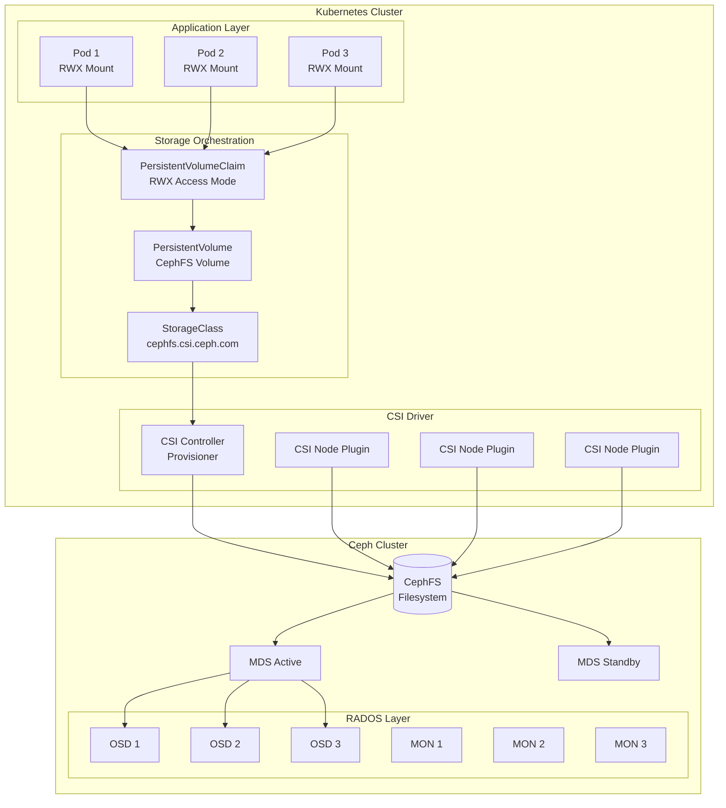
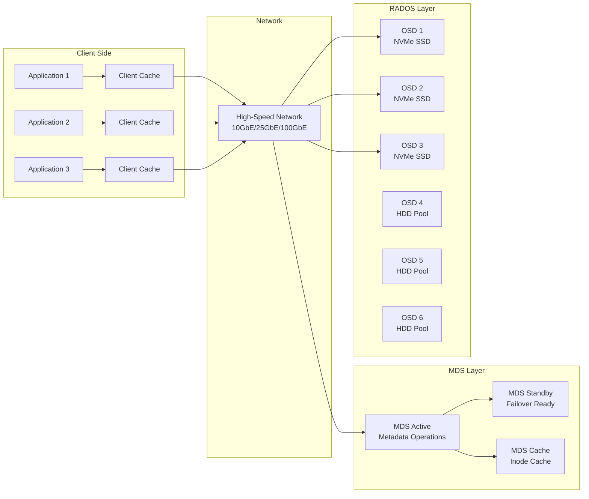
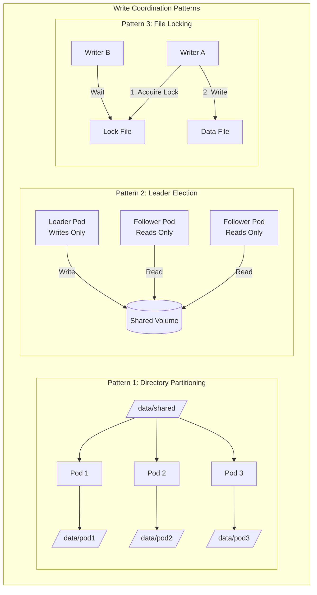

# How to Set Up CephFS for Shared Filesystem Access in Kubernetes

Author: [nawazdhandala](https://github.com/nawazdhandala)

Tags: Ceph, CephFS, Kubernetes, Storage, Shared Storage, Cloud Native

Description: A complete guide to configuring CephFS for shared filesystem access across multiple Kubernetes pods.

---

## Introduction

CephFS is a POSIX-compliant distributed filesystem built on top of Ceph's distributed object store (RADOS). It provides a powerful solution for shared filesystem access in Kubernetes environments, enabling multiple pods to read and write to the same filesystem simultaneously using the ReadWriteMany (RWX) access mode.

This guide walks you through the complete process of setting up CephFS for shared filesystem access in Kubernetes, from deploying Ceph to configuring the CSI driver and creating shared persistent volumes.

## Architecture Overview

Before diving into the implementation, let's understand how CephFS integrates with Kubernetes:



## Prerequisites

Before setting up CephFS, ensure you have:

- A running Kubernetes cluster (v1.20+)
- A Ceph cluster (Nautilus 14.x or later recommended)
- `kubectl` configured to access your cluster
- Helm 3.x installed
- At least 3 nodes for high availability

## Step 1: Deploy Ceph Using Rook

Rook is the recommended way to deploy Ceph on Kubernetes. It simplifies the deployment and management of Ceph clusters.

### Install Rook Operator

The Rook operator watches for Ceph cluster CRDs and manages the Ceph daemons.

```yaml
# rook-operator.yaml
# This manifest deploys the Rook Ceph operator which manages the lifecycle
# of Ceph clusters running on Kubernetes. The operator handles deployment,
# configuration, and day-2 operations like scaling and upgrades.
apiVersion: v1
kind: Namespace
metadata:
  name: rook-ceph
---
# The CRDs define the custom resources that Rook uses to manage Ceph.
# These must be installed before the operator can function.
apiVersion: apiextensions.k8s.io/v1
kind: CustomResourceDefinition
metadata:
  name: cephclusters.ceph.rook.io
spec:
  group: ceph.rook.io
  names:
    kind: CephCluster
    listKind: CephClusterList
    plural: cephclusters
    singular: cephcluster
  scope: Namespaced
  versions:
    - name: v1
      served: true
      storage: true
      schema:
        openAPIV3Schema:
          type: object
          x-kubernetes-preserve-unknown-fields: true
```

Apply the Rook operator using Helm for a production-ready deployment:

```bash
# Add the Rook Helm repository which contains the official Rook charts
helm repo add rook-release https://charts.rook.io/release

# Update the Helm repositories to get the latest chart versions
helm repo update

# Install the Rook operator in the rook-ceph namespace
# The operator will watch for CephCluster CRDs and manage Ceph daemons
helm install --create-namespace --namespace rook-ceph rook-ceph rook-release/rook-ceph \
  --set csi.enableCephfsDriver=true \
  --set csi.enableRbdDriver=true
```

### Create the Ceph Cluster

Once the operator is running, create the Ceph cluster:

```yaml
# ceph-cluster.yaml
# This manifest defines the Ceph cluster configuration including monitors,
# OSDs, and metadata servers. The cluster will automatically discover available
# storage devices on the specified nodes.
apiVersion: ceph.rook.io/v1
kind: CephCluster
metadata:
  name: rook-ceph
  namespace: rook-ceph
spec:
  # The Ceph container image version to use
  # Using a specific version ensures reproducibility
  cephVersion:
    image: quay.io/ceph/ceph:v18.2.0
    allowUnsupported: false

  # The data directory where Ceph stores its configuration and data
  dataDirHostPath: /var/lib/rook

  # Skip upgrade checks if you want to force upgrades (not recommended for production)
  skipUpgradeChecks: false

  # Continue upgrading even if a check fails
  continueUpgradeAfterChecksEvenIfNotHealthy: false

  # Monitor configuration - monitors maintain the cluster state
  # At least 3 monitors are required for high availability
  mon:
    count: 3
    allowMultiplePerNode: false

  # Manager configuration - managers handle cluster metrics and modules
  mgr:
    count: 2
    allowMultiplePerNode: false
    modules:
      - name: pg_autoscaler
        enabled: true
      - name: dashboard
        enabled: true

  # Enable the Ceph dashboard for web-based management
  dashboard:
    enabled: true
    ssl: true

  # Enable monitoring with Prometheus
  monitoring:
    enabled: true
    metricsDisabled: false

  # Network configuration for the Ceph cluster
  network:
    connections:
      encryption:
        enabled: false
      compression:
        enabled: false
      requireMsgr2: false

  # Crash collector gathers crash reports from Ceph daemons
  crashCollector:
    disable: false

  # Log collector settings
  logCollector:
    enabled: true
    periodicity: daily
    maxLogSize: 500M

  # Clean up policy for when the cluster is deleted
  cleanupPolicy:
    confirmation: ""
    sanitizeDisks:
      method: quick
      dataSource: zero
      iteration: 1
    allowUninstallWithVolumes: false

  # Resource requests and limits for Ceph daemons
  resources:
    mgr:
      limits:
        memory: "1Gi"
      requests:
        cpu: "500m"
        memory: "512Mi"
    mon:
      limits:
        memory: "2Gi"
      requests:
        cpu: "1000m"
        memory: "1Gi"
    osd:
      limits:
        memory: "4Gi"
      requests:
        cpu: "1000m"
        memory: "2Gi"

  # Storage configuration - defines which devices to use for OSDs
  storage:
    # Use all nodes that have the ceph-node=true label
    useAllNodes: false
    useAllDevices: false
    nodes:
      - name: "node1"
        devices:
          - name: "sdb"
          - name: "sdc"
      - name: "node2"
        devices:
          - name: "sdb"
          - name: "sdc"
      - name: "node3"
        devices:
          - name: "sdb"
          - name: "sdc"

  # Priority class for Ceph pods
  priorityClassNames:
    mon: system-node-critical
    osd: system-node-critical
    mgr: system-cluster-critical

  # Disruption management settings
  disruptionManagement:
    managePodBudgets: true
    osdMaintenanceTimeout: 30
    pgHealthCheckTimeout: 0
```

Apply the cluster configuration:

```bash
# Apply the Ceph cluster configuration
# This will trigger the Rook operator to deploy all Ceph daemons
kubectl apply -f ceph-cluster.yaml

# Watch the cluster deployment progress
# The cluster is ready when HEALTH is HEALTH_OK
kubectl -n rook-ceph get cephcluster -w
```

## Step 2: Create the CephFS Filesystem

With the Ceph cluster running, create a CephFS filesystem:

```yaml
# cephfs-filesystem.yaml
# This manifest creates a CephFS filesystem with metadata and data pools.
# The filesystem consists of two pools: one for metadata (small, fast) and
# one for data (large, replicated for durability).
apiVersion: ceph.rook.io/v1
kind: CephFilesystem
metadata:
  name: cephfs
  namespace: rook-ceph
spec:
  # Metadata server configuration
  # MDS servers handle filesystem metadata operations (directory listings, permissions)
  # Active-standby configuration provides high availability
  metadataServer:
    # Number of active MDS servers
    # Multiple active MDS servers enable directory subtree partitioning for scale
    activeCount: 1

    # Number of standby MDS servers for failover
    activeStandby: true

    # Resource requirements for MDS pods
    resources:
      limits:
        memory: "4Gi"
      requests:
        cpu: "1000m"
        memory: "2Gi"

    # Priority class for MDS pods
    priorityClassName: system-cluster-critical

    # Placement configuration for MDS pods
    placement:
      tolerations:
        - key: "storage-node"
          operator: "Exists"
          effect: "NoSchedule"

  # Data pools configuration
  # Multiple data pools can be created for different performance tiers
  dataPools:
    - name: data0
      # Failure domain determines how data is distributed
      # 'host' ensures replicas are on different hosts
      failureDomain: host

      # Replication configuration for durability
      replicated:
        size: 3
        requireSafeReplicaSize: true

      # Compression settings - can improve storage efficiency
      compressionMode: none

      # Parameters for the pool
      parameters:
        # Target PGs per OSD for autoscaling
        pg_autoscale_mode: "on"
        target_size_ratio: "0.8"

  # Metadata pool configuration
  # Metadata pool should be fast and highly available
  metadataPool:
    failureDomain: host
    replicated:
      size: 3
      requireSafeReplicaSize: true
    parameters:
      pg_autoscale_mode: "on"
      target_size_ratio: "0.2"

  # Preserve pools on filesystem deletion (recommended for production)
  preservePoolsOnDelete: true

  # Preserve filesystem on deletion
  preserveFilesystemOnDelete: true
```

Apply and verify:

```bash
# Create the CephFS filesystem
# This command creates the metadata and data pools, then initializes the filesystem
kubectl apply -f cephfs-filesystem.yaml

# Wait for the MDS pods to be running
# MDS pods handle all metadata operations for CephFS
kubectl -n rook-ceph get pod -l app=rook-ceph-mds -w

# Verify the filesystem is active
# The filesystem should show HEALTH_OK when ready
kubectl -n rook-ceph get cephfilesystem
```

## Step 3: Configure the Ceph CSI Driver

The CSI driver enables Kubernetes to provision and manage CephFS volumes.

### Create the CSI ConfigMap

```yaml
# csi-config-map.yaml
# This ConfigMap contains the Ceph cluster connection information
# required by the CSI driver to communicate with the Ceph cluster.
apiVersion: v1
kind: ConfigMap
metadata:
  name: ceph-csi-config
  namespace: rook-ceph
data:
  # JSON configuration for Ceph clusters
  # clusterID must match the cluster ID in your StorageClass
  config.json: |-
    [
      {
        "clusterID": "rook-ceph",
        "monitors": [
          "rook-ceph-mon-a.rook-ceph.svc.cluster.local:6789",
          "rook-ceph-mon-b.rook-ceph.svc.cluster.local:6789",
          "rook-ceph-mon-c.rook-ceph.svc.cluster.local:6789"
        ],
        "cephFS": {
          "subvolumeGroup": "csi"
        }
      }
    ]
```

### Create CSI Encryption ConfigMap (Optional but Recommended)

```yaml
# csi-kms-config-map.yaml
# This ConfigMap configures encryption settings for the CSI driver.
# Even if not using encryption, this ConfigMap should exist.
apiVersion: v1
kind: ConfigMap
metadata:
  name: ceph-csi-encryption-kms-config
  namespace: rook-ceph
data:
  # Empty configuration when encryption is not used
  config.json: |-
    {}
```

### Create the CephFS StorageClass

```yaml
# cephfs-storageclass.yaml
# This StorageClass defines how CephFS volumes are provisioned.
# It uses the CSI driver to dynamically create subvolumes in CephFS.
apiVersion: storage.k8s.io/v1
kind: StorageClass
metadata:
  name: cephfs
  annotations:
    # Set as default storage class if desired
    storageclass.kubernetes.io/is-default-class: "false"
# The CSI driver that handles volume provisioning
# This is the CephFS CSI driver provided by Rook
provisioner: rook-ceph.cephfs.csi.ceph.com
parameters:
  # The cluster ID must match the clusterID in csi-config-map
  clusterID: rook-ceph

  # The CephFS filesystem name created earlier
  fsName: cephfs

  # The pool where data will be stored
  pool: cephfs-data0

  # Secret containing Ceph admin credentials for provisioning
  # This secret is automatically created by Rook
  csi.storage.k8s.io/provisioner-secret-name: rook-csi-cephfs-provisioner
  csi.storage.k8s.io/provisioner-secret-namespace: rook-ceph

  # Secret for controller operations (expand, snapshot)
  csi.storage.k8s.io/controller-expand-secret-name: rook-csi-cephfs-provisioner
  csi.storage.k8s.io/controller-expand-secret-namespace: rook-ceph

  # Secret for node operations (mount)
  csi.storage.k8s.io/node-stage-secret-name: rook-csi-cephfs-node
  csi.storage.k8s.io/node-stage-secret-namespace: rook-ceph

  # Mounter type: 'kernel' uses the kernel CephFS driver (faster)
  # 'fuse' uses FUSE (more compatible, easier to debug)
  mounter: kernel

# Reclaim policy determines what happens to volumes when PVCs are deleted
# 'Delete' removes the volume, 'Retain' keeps it for manual cleanup
reclaimPolicy: Delete

# Allow volume expansion after creation
allowVolumeExpansion: true

# Mount options applied to all volumes using this StorageClass
mountOptions:
  # Read-ahead setting for sequential read optimization
  - "readdir_max_bytes=1048576"
  # Async metadata operations for better performance
  - "async_readdir"
```

Apply the configurations:

```bash
# Apply the CSI configuration
kubectl apply -f csi-config-map.yaml
kubectl apply -f csi-kms-config-map.yaml
kubectl apply -f cephfs-storageclass.yaml

# Verify the StorageClass was created
kubectl get storageclass cephfs
```

## Step 4: Create a Shared PersistentVolumeClaim

Now create a PVC with ReadWriteMany access mode for shared filesystem access:

```yaml
# shared-pvc.yaml
# This PersistentVolumeClaim requests shared storage that can be mounted
# by multiple pods simultaneously. The RWX access mode enables this.
apiVersion: v1
kind: PersistentVolumeClaim
metadata:
  name: shared-data
  namespace: default
  labels:
    # Labels for easy identification and management
    app: shared-storage
    type: cephfs
spec:
  # ReadWriteMany allows multiple pods to mount the volume simultaneously
  # This is the key feature that makes CephFS valuable for shared storage
  accessModes:
    - ReadWriteMany

  # Use the CephFS StorageClass created earlier
  storageClassName: cephfs

  # Filesystem mode (as opposed to Block mode)
  volumeMode: Filesystem

  # Requested storage size
  # CephFS supports thin provisioning, so actual usage may be less
  resources:
    requests:
      storage: 100Gi
```

Apply and verify:

```bash
# Create the shared PVC
kubectl apply -f shared-pvc.yaml

# Check the PVC status - should transition to 'Bound'
kubectl get pvc shared-data -w

# Verify the PV was automatically created
kubectl get pv | grep shared-data
```

## Step 5: Deploy Applications Using Shared Storage

### Example: Multi-Pod Deployment with Shared Storage

```yaml
# shared-app-deployment.yaml
# This deployment demonstrates multiple pods accessing the same CephFS volume
# simultaneously. Each pod can read and write to the shared filesystem.
apiVersion: apps/v1
kind: Deployment
metadata:
  name: shared-app
  namespace: default
spec:
  # Multiple replicas will all mount the same shared volume
  replicas: 3
  selector:
    matchLabels:
      app: shared-app
  template:
    metadata:
      labels:
        app: shared-app
    spec:
      # Anti-affinity ensures pods are distributed across nodes
      # This demonstrates true multi-node shared access
      affinity:
        podAntiAffinity:
          preferredDuringSchedulingIgnoredDuringExecution:
            - weight: 100
              podAffinityTerm:
                labelSelector:
                  matchExpressions:
                    - key: app
                      operator: In
                      values:
                        - shared-app
                topologyKey: kubernetes.io/hostname

      containers:
        - name: app
          image: nginx:latest

          # Volume mount configuration
          volumeMounts:
            - name: shared-data
              # Mount path inside the container
              mountPath: /data
              # Set to false to allow writes
              readOnly: false

          # Resource limits for the container
          resources:
            requests:
              cpu: "100m"
              memory: "128Mi"
            limits:
              cpu: "500m"
              memory: "256Mi"

          # Liveness probe to ensure container health
          livenessProbe:
            httpGet:
              path: /
              port: 80
            initialDelaySeconds: 10
            periodSeconds: 10

          # Readiness probe to ensure container is ready
          readinessProbe:
            httpGet:
              path: /
              port: 80
            initialDelaySeconds: 5
            periodSeconds: 5

      # Volume configuration referencing the shared PVC
      volumes:
        - name: shared-data
          persistentVolumeClaim:
            claimName: shared-data
---
# Service to expose the application
apiVersion: v1
kind: Service
metadata:
  name: shared-app
  namespace: default
spec:
  selector:
    app: shared-app
  ports:
    - protocol: TCP
      port: 80
      targetPort: 80
  type: ClusterIP
```

### Example: StatefulSet with Shared Storage

```yaml
# shared-statefulset.yaml
# StatefulSet with shared storage for stateful applications
# that need stable network identities and shared persistent storage.
apiVersion: apps/v1
kind: StatefulSet
metadata:
  name: shared-statefulset
  namespace: default
spec:
  serviceName: shared-statefulset
  replicas: 3
  selector:
    matchLabels:
      app: shared-statefulset
  template:
    metadata:
      labels:
        app: shared-statefulset
    spec:
      containers:
        - name: app
          image: busybox:latest
          command:
            - sh
            - -c
            # Write pod identity to shared storage to demonstrate multi-pod access
            - |
              while true; do
                echo "$(date): Hello from $(hostname)" >> /shared/log.txt
                echo "Current log entries:"
                tail -10 /shared/log.txt
                sleep 10
              done

          volumeMounts:
            # Shared volume mounted to all pods
            - name: shared-data
              mountPath: /shared
            # Per-pod local storage (optional)
            - name: local-data
              mountPath: /local

          resources:
            requests:
              cpu: "50m"
              memory: "64Mi"
            limits:
              cpu: "200m"
              memory: "128Mi"

      volumes:
        # Reference to the shared CephFS PVC
        - name: shared-data
          persistentVolumeClaim:
            claimName: shared-data

  # Per-pod volume claim template for local storage
  volumeClaimTemplates:
    - metadata:
        name: local-data
      spec:
        accessModes: ["ReadWriteOnce"]
        storageClassName: cephfs
        resources:
          requests:
            storage: 10Gi
---
# Headless service for StatefulSet
apiVersion: v1
kind: Service
metadata:
  name: shared-statefulset
  namespace: default
spec:
  clusterIP: None
  selector:
    app: shared-statefulset
  ports:
    - port: 80
      targetPort: 80
```

Apply and verify:

```bash
# Deploy the shared application
kubectl apply -f shared-app-deployment.yaml

# Verify pods are running on different nodes
kubectl get pods -o wide -l app=shared-app

# Test shared access by writing from one pod and reading from another
kubectl exec -it $(kubectl get pods -l app=shared-app -o jsonpath='{.items[0].metadata.name}') \
  -- sh -c "echo 'Hello from Pod 1' > /data/test.txt"

kubectl exec -it $(kubectl get pods -l app=shared-app -o jsonpath='{.items[1].metadata.name}') \
  -- cat /data/test.txt
```

## Step 6: CephFS Subvolume Groups (Advanced)

For better isolation and quota management, use CephFS subvolume groups:

```yaml
# cephfs-subvolumegroup.yaml
# Subvolume groups provide isolation between different applications
# or teams using the same CephFS filesystem.
apiVersion: ceph.rook.io/v1
kind: CephFilesystemSubVolumeGroup
metadata:
  name: team-a-volumes
  namespace: rook-ceph
spec:
  # Reference to the parent filesystem
  filesystemName: cephfs

  # Name of the subvolume group in CephFS
  name: team-a

  # Optional: Set quotas for the subvolume group
  # This limits total storage used by all volumes in the group
  # quota: 500Gi

  # Optional: Data pool for this subvolume group
  # dataPoolName: cephfs-data0

  # Pinning configuration for MDS affinity
  # This can improve performance by keeping related data on the same MDS
  pinning:
    distributed: 1
```

Create a StorageClass that uses the subvolume group:

```yaml
# cephfs-storageclass-team-a.yaml
# StorageClass specific to team-a with subvolume group isolation
apiVersion: storage.k8s.io/v1
kind: StorageClass
metadata:
  name: cephfs-team-a
provisioner: rook-ceph.cephfs.csi.ceph.com
parameters:
  clusterID: rook-ceph
  fsName: cephfs
  pool: cephfs-data0

  # Use the team-a subvolume group for isolation
  csi.storage.k8s.io/fsSubVolumeGroup: team-a

  csi.storage.k8s.io/provisioner-secret-name: rook-csi-cephfs-provisioner
  csi.storage.k8s.io/provisioner-secret-namespace: rook-ceph
  csi.storage.k8s.io/controller-expand-secret-name: rook-csi-cephfs-provisioner
  csi.storage.k8s.io/controller-expand-secret-namespace: rook-ceph
  csi.storage.k8s.io/node-stage-secret-name: rook-csi-cephfs-node
  csi.storage.k8s.io/node-stage-secret-namespace: rook-ceph

  mounter: kernel
reclaimPolicy: Delete
allowVolumeExpansion: true
```

## Performance Considerations for Shared Access

### CephFS Performance Architecture



### Performance Tuning Configuration

```yaml
# cephfs-performance-tuning.yaml
# This ConfigMap contains CephFS tuning parameters for optimal performance
# in shared access scenarios. Apply these based on your workload characteristics.
apiVersion: v1
kind: ConfigMap
metadata:
  name: cephfs-tuning
  namespace: rook-ceph
data:
  # MDS tuning parameters
  # These are applied via Ceph configuration
  mds-tuning.sh: |
    #!/bin/bash

    # Increase MDS cache size for better metadata performance
    # Default is 4GB, increase for large file counts
    ceph config set mds mds_cache_memory_limit 8589934592

    # Enable directory fragmentation for large directories
    # This distributes directory entries across multiple objects
    ceph config set mds mds_bal_fragment_dirs true

    # Increase max directory size before fragmentation
    ceph config set mds mds_bal_fragment_size_max 100000

    # Enable client metadata caching
    # Reduces metadata server load for repeated operations
    ceph config set mds client_cache_size 16384

    # Session timeout for idle clients
    ceph config set mds session_timeout 120

    # Increase caps limit per client for better concurrency
    ceph config set mds mds_max_caps_per_client 1048576

  # Client-side tuning for mount options
  mount-options.conf: |
    # Recommended mount options for CephFS
    # These can be added to the StorageClass mountOptions

    # Read-ahead buffer size (default 8MB, increase for sequential reads)
    readahead_size=16777216

    # Maximum read-ahead (important for large files)
    readahead_max_bytes=16777216

    # Enable async readdir for better directory listing performance
    async_readdir=true

    # Directory read cache size
    readdir_max_bytes=1048576

    # Write buffer settings (for buffered writes)
    wsize=16777216

    # Read buffer settings
    rsize=16777216
```

### StorageClass with Performance Optimizations

```yaml
# cephfs-storageclass-performance.yaml
# StorageClass optimized for high-performance shared access workloads
apiVersion: storage.k8s.io/v1
kind: StorageClass
metadata:
  name: cephfs-performance
  annotations:
    description: "High-performance CephFS for shared workloads"
provisioner: rook-ceph.cephfs.csi.ceph.com
parameters:
  clusterID: rook-ceph
  fsName: cephfs
  pool: cephfs-data0

  # Use kernel mounter for best performance
  # Kernel mounter is faster than FUSE but requires kernel support
  mounter: kernel

  csi.storage.k8s.io/provisioner-secret-name: rook-csi-cephfs-provisioner
  csi.storage.k8s.io/provisioner-secret-namespace: rook-ceph
  csi.storage.k8s.io/controller-expand-secret-name: rook-csi-cephfs-provisioner
  csi.storage.k8s.io/controller-expand-secret-namespace: rook-ceph
  csi.storage.k8s.io/node-stage-secret-name: rook-csi-cephfs-node
  csi.storage.k8s.io/node-stage-secret-namespace: rook-ceph
reclaimPolicy: Delete
allowVolumeExpansion: true

# Mount options for performance optimization
mountOptions:
  # Increase read-ahead for sequential workloads
  - "readahead_max_bytes=16777216"
  - "readdir_max_bytes=1048576"

  # Async directory operations
  - "async_readdir"

  # Disable access time updates to reduce metadata overhead
  - "noatime"

  # Write buffer size (16MB)
  - "wsize=16777216"

  # Read buffer size (16MB)
  - "rsize=16777216"
```

### Workload-Specific Configurations

```yaml
# cephfs-workload-configs.yaml
# Different StorageClass configurations for various workload types

---
# Configuration for large file workloads (video, backup, ML datasets)
apiVersion: storage.k8s.io/v1
kind: StorageClass
metadata:
  name: cephfs-large-files
  annotations:
    description: "Optimized for large file sequential access"
provisioner: rook-ceph.cephfs.csi.ceph.com
parameters:
  clusterID: rook-ceph
  fsName: cephfs
  pool: cephfs-data0
  mounter: kernel
  csi.storage.k8s.io/provisioner-secret-name: rook-csi-cephfs-provisioner
  csi.storage.k8s.io/provisioner-secret-namespace: rook-ceph
  csi.storage.k8s.io/controller-expand-secret-name: rook-csi-cephfs-provisioner
  csi.storage.k8s.io/controller-expand-secret-namespace: rook-ceph
  csi.storage.k8s.io/node-stage-secret-name: rook-csi-cephfs-node
  csi.storage.k8s.io/node-stage-secret-namespace: rook-ceph
reclaimPolicy: Delete
allowVolumeExpansion: true
mountOptions:
  # Large read-ahead for sequential access
  - "readahead_max_bytes=67108864"
  - "noatime"
  - "wsize=67108864"
  - "rsize=67108864"

---
# Configuration for many small files (web assets, config files)
apiVersion: storage.k8s.io/v1
kind: StorageClass
metadata:
  name: cephfs-small-files
  annotations:
    description: "Optimized for many small files"
provisioner: rook-ceph.cephfs.csi.ceph.com
parameters:
  clusterID: rook-ceph
  fsName: cephfs
  pool: cephfs-data0
  mounter: kernel
  csi.storage.k8s.io/provisioner-secret-name: rook-csi-cephfs-provisioner
  csi.storage.k8s.io/provisioner-secret-namespace: rook-ceph
  csi.storage.k8s.io/controller-expand-secret-name: rook-csi-cephfs-provisioner
  csi.storage.k8s.io/controller-expand-secret-namespace: rook-ceph
  csi.storage.k8s.io/node-stage-secret-name: rook-csi-cephfs-node
  csi.storage.k8s.io/node-stage-secret-namespace: rook-ceph
reclaimPolicy: Delete
allowVolumeExpansion: true
mountOptions:
  # Smaller buffers for many small files
  - "readahead_max_bytes=4194304"
  - "readdir_max_bytes=2097152"
  - "async_readdir"
  - "noatime"
  - "wsize=4194304"
  - "rsize=4194304"

---
# Configuration for mixed workloads (general purpose)
apiVersion: storage.k8s.io/v1
kind: StorageClass
metadata:
  name: cephfs-general
  annotations:
    description: "Balanced configuration for mixed workloads"
provisioner: rook-ceph.cephfs.csi.ceph.com
parameters:
  clusterID: rook-ceph
  fsName: cephfs
  pool: cephfs-data0
  mounter: kernel
  csi.storage.k8s.io/provisioner-secret-name: rook-csi-cephfs-provisioner
  csi.storage.k8s.io/provisioner-secret-namespace: rook-ceph
  csi.storage.k8s.io/controller-expand-secret-name: rook-csi-cephfs-provisioner
  csi.storage.k8s.io/controller-expand-secret-namespace: rook-ceph
  csi.storage.k8s.io/node-stage-secret-name: rook-csi-cephfs-node
  csi.storage.k8s.io/node-stage-secret-namespace: rook-ceph
reclaimPolicy: Delete
allowVolumeExpansion: true
mountOptions:
  - "readahead_max_bytes=8388608"
  - "readdir_max_bytes=1048576"
  - "async_readdir"
  - "noatime"
```

## Monitoring and Troubleshooting

### Monitoring Dashboard

```yaml
# cephfs-monitoring.yaml
# ServiceMonitor for Prometheus to scrape CephFS metrics
apiVersion: monitoring.coreos.com/v1
kind: ServiceMonitor
metadata:
  name: ceph-metrics
  namespace: rook-ceph
  labels:
    team: storage
spec:
  selector:
    matchLabels:
      app: rook-ceph-mgr
  endpoints:
    - port: http-metrics
      path: /metrics
      interval: 15s
---
# PrometheusRule for CephFS alerts
apiVersion: monitoring.coreos.com/v1
kind: PrometheusRule
metadata:
  name: cephfs-alerts
  namespace: rook-ceph
spec:
  groups:
    - name: cephfs.rules
      rules:
        # Alert when MDS is not active
        - alert: CephFSMDSNotActive
          expr: ceph_mds_metadata{state!="active"} > 0
          for: 5m
          labels:
            severity: warning
          annotations:
            summary: "CephFS MDS is not in active state"
            description: "MDS {{ $labels.ceph_daemon }} is in {{ $labels.state }} state"

        # Alert on high MDS cache pressure
        - alert: CephFSMDSCachePressure
          expr: (ceph_mds_mem_rss / ceph_mds_cache_size) > 0.9
          for: 10m
          labels:
            severity: warning
          annotations:
            summary: "CephFS MDS cache under pressure"
            description: "MDS cache usage is above 90%"

        # Alert on slow metadata operations
        - alert: CephFSSlowMetadataOps
          expr: rate(ceph_mds_reply_latency_sum[5m]) / rate(ceph_mds_reply_latency_count[5m]) > 0.5
          for: 5m
          labels:
            severity: warning
          annotations:
            summary: "CephFS metadata operations are slow"
            description: "Average metadata operation latency is above 500ms"
```

### Troubleshooting Commands

```bash
# Check overall Ceph cluster health
# This provides a quick overview of cluster status
kubectl -n rook-ceph exec -it deploy/rook-ceph-tools -- ceph status

# Check CephFS filesystem status
# Shows MDS status, data pools, and client connections
kubectl -n rook-ceph exec -it deploy/rook-ceph-tools -- ceph fs status cephfs

# List active MDS sessions (connected clients)
# Useful for understanding current load
kubectl -n rook-ceph exec -it deploy/rook-ceph-tools -- ceph daemon mds.cephfs-a session ls

# Check MDS performance counters
# Shows metadata operation counts and latencies
kubectl -n rook-ceph exec -it deploy/rook-ceph-tools -- ceph daemon mds.cephfs-a perf dump

# View subvolumes created by CSI
# Each PVC creates a subvolume
kubectl -n rook-ceph exec -it deploy/rook-ceph-tools -- ceph fs subvolume ls cephfs csi

# Check PVC mount status on a specific node
# Verify the volume is properly mounted
kubectl debug node/<node-name> -it --image=busybox -- mount | grep ceph

# View CSI driver logs for troubleshooting
# Check for provisioning or mount errors
kubectl -n rook-ceph logs -l app=csi-cephfsplugin -c csi-cephfsplugin --tail=100

# View CSI provisioner logs
kubectl -n rook-ceph logs -l app=csi-cephfsplugin-provisioner -c csi-cephfsplugin --tail=100
```

### Common Issues and Solutions

```yaml
# troubleshooting-guide.yaml
# This ConfigMap documents common issues and their solutions
apiVersion: v1
kind: ConfigMap
metadata:
  name: cephfs-troubleshooting-guide
  namespace: rook-ceph
data:
  issues.md: |
    # CephFS Troubleshooting Guide

    ## Issue: PVC stuck in Pending state

    Causes:
    1. CSI driver not running
    2. StorageClass not found
    3. Ceph cluster unhealthy

    Solutions:
    ```bash
    # Check CSI driver pods
    kubectl -n rook-ceph get pods -l app=csi-cephfsplugin

    # Check StorageClass exists
    kubectl get sc cephfs

    # Check Ceph health
    kubectl -n rook-ceph exec -it deploy/rook-ceph-tools -- ceph health detail
    ```

    ## Issue: Pod can't mount CephFS volume

    Causes:
    1. Node doesn't have ceph-common installed
    2. Network connectivity issues
    3. Secret not found

    Solutions:
    ```bash
    # For kernel mounter, ensure ceph-common is installed on nodes
    # Or switch to fuse mounter in StorageClass

    # Check CSI node plugin logs
    kubectl -n rook-ceph logs -l app=csi-cephfsplugin -c csi-cephfsplugin

    # Verify secrets exist
    kubectl -n rook-ceph get secret rook-csi-cephfs-node
    ```

    ## Issue: Slow filesystem performance

    Causes:
    1. MDS cache too small
    2. Network bottleneck
    3. OSD overloaded

    Solutions:
    ```bash
    # Increase MDS cache
    ceph config set mds mds_cache_memory_limit 8589934592

    # Check network latency
    kubectl -n rook-ceph exec -it deploy/rook-ceph-tools -- ceph osd perf

    # Monitor OSD utilization
    kubectl -n rook-ceph exec -it deploy/rook-ceph-tools -- ceph osd df
    ```

    ## Issue: File locking conflicts with multiple pods

    Causes:
    1. Application not using proper file locking
    2. NFS-style locking not supported

    Solutions:
    - Use POSIX file locking (flock, fcntl)
    - Implement application-level locking
    - Consider using leader election for write coordination
```

## Best Practices for Shared CephFS Access

### Application Design Patterns



### Security Configuration

```yaml
# cephfs-security.yaml
# Security configurations for CephFS in production
---
# Network policy to restrict access to Ceph
apiVersion: networking.k8s.io/v1
kind: NetworkPolicy
metadata:
  name: cephfs-access-policy
  namespace: default
spec:
  podSelector:
    matchLabels:
      cephfs-access: "true"
  policyTypes:
    - Egress
  egress:
    # Allow access to Ceph monitors
    - to:
        - namespaceSelector:
            matchLabels:
              name: rook-ceph
          podSelector:
            matchLabels:
              app: rook-ceph-mon
      ports:
        - protocol: TCP
          port: 6789
        - protocol: TCP
          port: 3300
    # Allow access to Ceph OSDs
    - to:
        - namespaceSelector:
            matchLabels:
              name: rook-ceph
          podSelector:
            matchLabels:
              app: rook-ceph-osd
      ports:
        - protocol: TCP
          port: 6800
          endPort: 7300
    # Allow access to MDS
    - to:
        - namespaceSelector:
            matchLabels:
              name: rook-ceph
          podSelector:
            matchLabels:
              app: rook-ceph-mds
      ports:
        - protocol: TCP
          port: 6800
          endPort: 7300

---
# Pod Security Policy for CephFS access
apiVersion: v1
kind: Pod
metadata:
  name: secure-cephfs-pod
  namespace: default
spec:
  securityContext:
    # Run as non-root user
    runAsNonRoot: true
    runAsUser: 1000
    runAsGroup: 1000
    fsGroup: 1000
    # Secure mount options
    seccompProfile:
      type: RuntimeDefault
  containers:
    - name: app
      image: nginx:latest
      securityContext:
        allowPrivilegeEscalation: false
        capabilities:
          drop:
            - ALL
        readOnlyRootFilesystem: true
      volumeMounts:
        - name: shared-data
          mountPath: /data
        # Temporary directory for nginx
        - name: tmp
          mountPath: /tmp
        - name: var-run
          mountPath: /var/run
        - name: var-cache
          mountPath: /var/cache/nginx
  volumes:
    - name: shared-data
      persistentVolumeClaim:
        claimName: shared-data
    - name: tmp
      emptyDir: {}
    - name: var-run
      emptyDir: {}
    - name: var-cache
      emptyDir: {}
```

## Conclusion

CephFS provides a robust solution for shared filesystem access in Kubernetes environments. By following this guide, you have learned how to:

1. **Deploy Ceph using Rook** - Automated Ceph cluster deployment and management
2. **Create CephFS filesystems** - Configure metadata and data pools for optimal performance
3. **Set up CSI drivers** - Enable dynamic volume provisioning
4. **Use ReadWriteMany volumes** - Share storage across multiple pods
5. **Optimize performance** - Tune CephFS for your specific workload
6. **Monitor and troubleshoot** - Keep your storage infrastructure healthy

CephFS is particularly well-suited for workloads that require:
- True shared filesystem semantics (POSIX-compliant)
- Concurrent read/write access from multiple pods
- Dynamic scaling of storage capacity
- High availability and data durability

For production deployments, always ensure you have:
- Adequate network bandwidth (10GbE minimum recommended)
- Proper monitoring and alerting configured
- Regular backup procedures in place
- Tested disaster recovery procedures

## Additional Resources

- [Ceph Documentation](https://docs.ceph.com/)
- [Rook Documentation](https://rook.io/docs/rook/latest/)
- [Ceph CSI Driver](https://github.com/ceph/ceph-csi)
- [Kubernetes CSI Documentation](https://kubernetes-csi.github.io/docs/)
