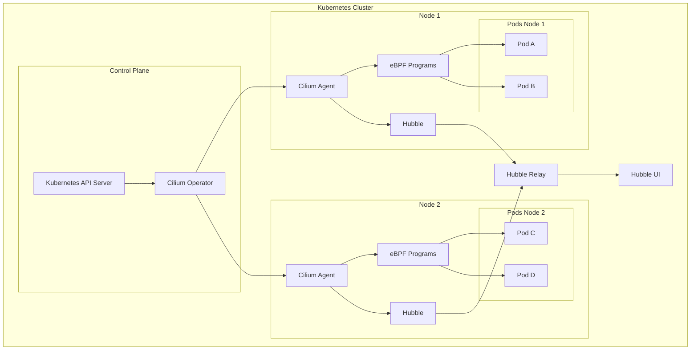
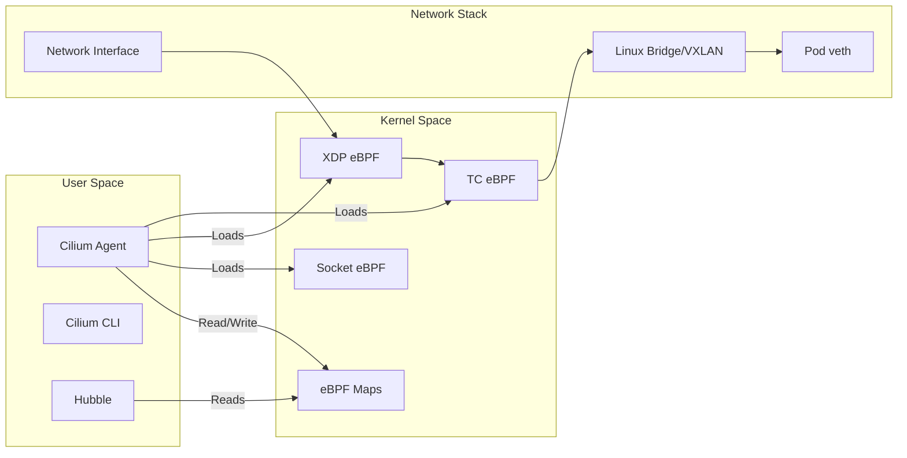
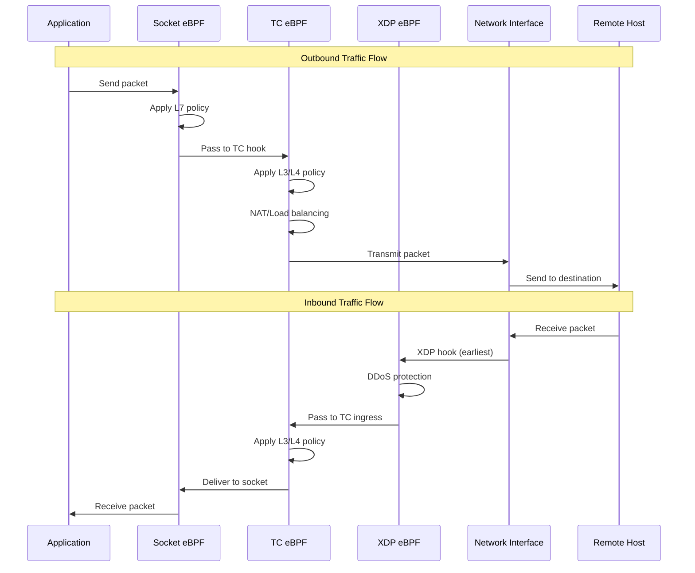
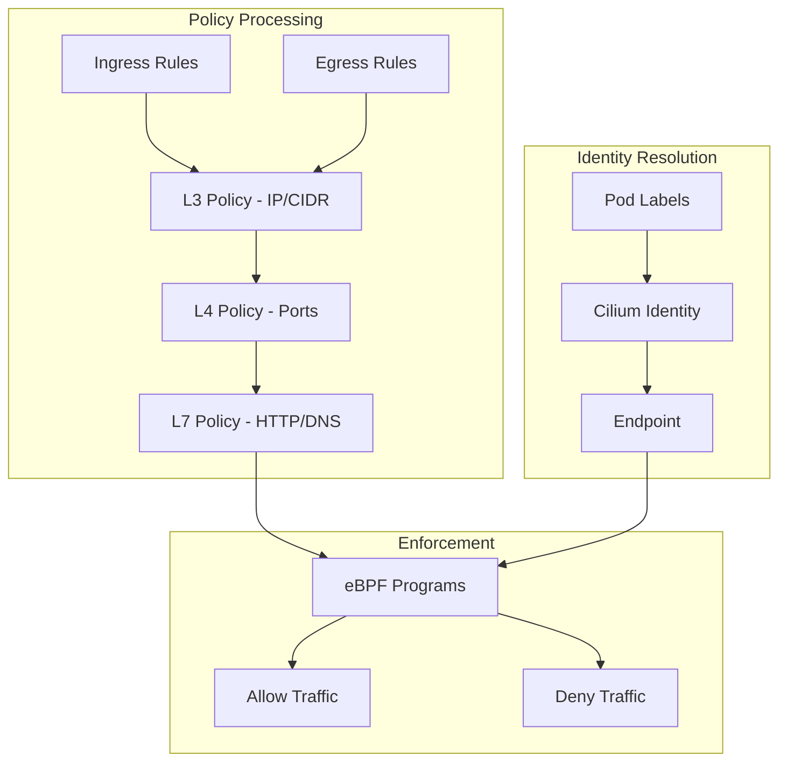
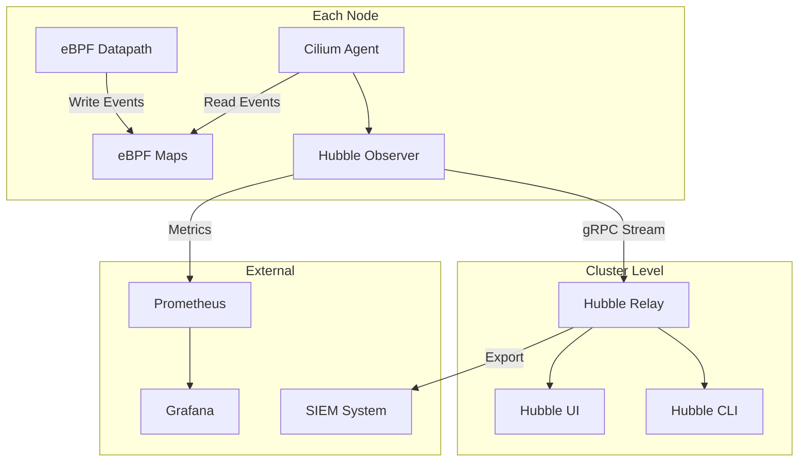
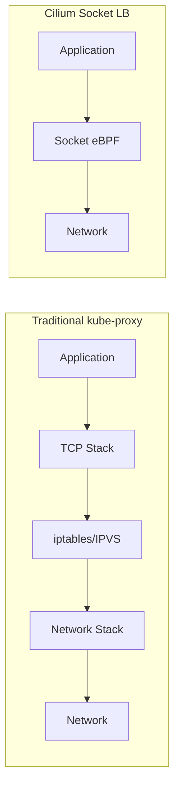
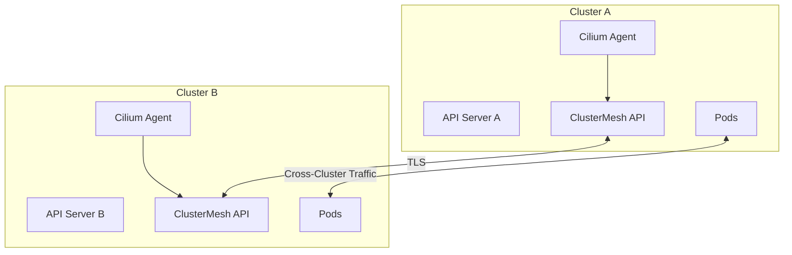

# How to Deploy Cilium CNI for eBPF-Powered Kubernetes Networking

Author: [nawazdhandala](https://github.com/nawazdhandala)

Tags: eBPF, Cilium, Kubernetes, Networking, CNI, Cloud Native

Description: A complete guide to deploying Cilium CNI for high-performance, eBPF-based Kubernetes networking.

---

## Introduction

Cilium is a powerful open-source networking, security, and observability solution for Kubernetes that leverages eBPF (extended Berkeley Packet Filter) technology. Unlike traditional CNI plugins that rely on iptables for packet filtering and routing, Cilium uses eBPF programs that run directly in the Linux kernel, providing significantly better performance, security, and observability capabilities.

In this comprehensive guide, we will explore how to deploy Cilium CNI in your Kubernetes cluster, configure network policies, set up Hubble for observability, and understand the performance benefits that eBPF brings to container networking.

## Why Choose Cilium?

Before diving into the deployment, let's understand why Cilium stands out among other CNI plugins:

1. **eBPF-Powered Performance**: By running networking logic directly in the kernel, Cilium eliminates the overhead of iptables chains
2. **Identity-Based Security**: Cilium assigns identities to pods based on labels, enabling fine-grained security policies
3. **Built-in Observability**: Hubble provides deep visibility into network flows without additional tooling
4. **Service Mesh Integration**: Cilium can replace traditional service mesh sidecars with eBPF-based implementations
5. **Multi-Cluster Support**: ClusterMesh enables seamless networking across multiple Kubernetes clusters

## Architecture Overview

The following diagram illustrates the high-level architecture of Cilium in a Kubernetes cluster:



## Cilium Component Architecture

The following diagram shows how Cilium components interact with the Linux kernel and Kubernetes:



## Prerequisites

Before deploying Cilium, ensure your environment meets the following requirements:

- Kubernetes cluster version 1.16 or later
- Linux kernel version 4.19 or later (5.4+ recommended for full feature set)
- Helm 3.x installed for deployment
- kubectl configured to access your cluster
- No other CNI plugin installed (or plan to migrate)

The following command checks your kernel version to ensure compatibility:

```bash
# Check your Linux kernel version
# Cilium requires kernel 4.19+ for basic functionality
# Kernel 5.4+ enables advanced features like socket-level load balancing
uname -r
```

This command verifies that your Kubernetes cluster is accessible and running:

```bash
# Verify your Kubernetes cluster is accessible
# This should return the list of nodes in your cluster
kubectl get nodes
```

## Installing Cilium CLI

The Cilium CLI is a command-line tool that simplifies Cilium installation and troubleshooting. Install it with the following commands:

```bash
# Download the Cilium CLI for Linux
# The CLI provides commands for installation, connectivity testing, and debugging
CILIUM_CLI_VERSION=$(curl -s https://raw.githubusercontent.com/cilium/cilium-cli/main/stable.txt)
CLI_ARCH=amd64

# For ARM64 systems, uncomment the following line:
# CLI_ARCH=arm64

# Download and install the Cilium CLI binary
curl -L --fail --remote-name-all https://github.com/cilium/cilium-cli/releases/download/${CILIUM_CLI_VERSION}/cilium-linux-${CLI_ARCH}.tar.gz{,.sha256sum}

# Verify the checksum to ensure download integrity
sha256sum --check cilium-linux-${CLI_ARCH}.tar.gz.sha256sum

# Extract and install to /usr/local/bin
sudo tar xzvfC cilium-linux-${CLI_ARCH}.tar.gz /usr/local/bin

# Clean up downloaded files
rm cilium-linux-${CLI_ARCH}.tar.gz{,.sha256sum}
```

For macOS users, the installation is simpler using Homebrew:

```bash
# Install Cilium CLI on macOS using Homebrew
# This automatically handles updates and dependencies
brew install cilium-cli
```

## Deploying Cilium with Helm

Helm is the recommended method for deploying Cilium in production environments. First, add the Cilium Helm repository:

```bash
# Add the official Cilium Helm repository
# This repository contains the latest stable Cilium charts
helm repo add cilium https://helm.cilium.io/

# Update your Helm repositories to fetch the latest chart versions
helm repo update
```

### Basic Installation

For a basic Cilium installation with default settings, use the following command:

```bash
# Install Cilium with default configuration
# This creates the cilium-system namespace and deploys all required components
helm install cilium cilium/cilium --version 1.15.0 \
    --namespace kube-system \
    --set operator.replicas=1
```

### Production Installation with Hubble

For production environments, we recommend enabling Hubble for observability and configuring additional features. Create a values file for your installation:

```yaml
# cilium-values.yaml
# Production-ready Cilium configuration with Hubble observability

# Enable Hubble for network flow visibility
hubble:
  enabled: true
  # Enable Hubble metrics for Prometheus integration
  metrics:
    enabled:
      - dns
      - drop
      - tcp
      - flow
      - icmp
      - http
    serviceMonitor:
      enabled: false
  relay:
    # Deploy Hubble Relay for centralized flow collection
    enabled: true
    replicas: 1
  ui:
    # Deploy Hubble UI for visual network flow analysis
    enabled: true
    replicas: 1
    ingress:
      enabled: false

# Configure the Cilium operator
operator:
  # Run multiple operator replicas for high availability
  replicas: 2

# Enable native routing for better performance
# This bypasses overlay encapsulation when possible
routingMode: native

# Enable IPv4 masquerading for pods to access external networks
ipv4NativeRoutingCIDR: "10.0.0.0/8"

# Enable bandwidth manager for pod egress rate limiting
bandwidthManager:
  enabled: true

# Configure IPAM (IP Address Management)
ipam:
  # Use cluster-pool mode for automatic IP allocation
  mode: cluster-pool
  operator:
    clusterPoolIPv4PodCIDRList:
      - "10.244.0.0/16"
    clusterPoolIPv4MaskSize: 24

# Enable socket-level load balancing
# This replaces kube-proxy for service handling
kubeProxyReplacement: true

# Configure load balancer settings
loadBalancer:
  # Use DSR (Direct Server Return) for improved performance
  mode: dsr
  # Use Maglev for consistent hashing
  algorithm: maglev

# Enable local redirect policy for node-local traffic optimization
localRedirectPolicy: true

# Configure BGP for external load balancing (optional)
bgp:
  enabled: false

# Enable WireGuard encryption for pod-to-pod traffic
encryption:
  enabled: false
  type: wireguard

# Resource limits for Cilium agent
resources:
  limits:
    cpu: 4000m
    memory: 4Gi
  requests:
    cpu: 100m
    memory: 512Mi
```

Deploy Cilium using the values file:

```bash
# Install Cilium with the production configuration
# This enables Hubble, native routing, and other production features
helm install cilium cilium/cilium --version 1.15.0 \
    --namespace kube-system \
    --values cilium-values.yaml
```

## Data Flow Architecture

The following diagram illustrates how traffic flows through Cilium's eBPF datapath:



## Verifying the Installation

After deploying Cilium, verify that all components are running correctly:

```bash
# Check the status of Cilium pods
# All pods should be in Running state with all containers ready
kubectl get pods -n kube-system -l app.kubernetes.io/part-of=cilium

# Use the Cilium CLI to check overall status
# This provides a comprehensive view of Cilium health
cilium status --wait

# Verify Cilium connectivity across the cluster
# This runs a series of connectivity tests between pods
cilium connectivity test
```

The expected output should show all Cilium components as healthy:

```
    /¯¯\
 /¯¯\__/¯¯\    Cilium:             OK
 \__/¯¯\__/    Operator:           OK
 /¯¯\__/¯¯\    Envoy DaemonSet:    disabled (using embedded mode)
 \__/¯¯\__/    Hubble Relay:       OK
    \__/       ClusterMesh:        disabled

Deployment             cilium-operator    Desired: 2, Ready: 2/2, Available: 2/2
DaemonSet              cilium             Desired: 3, Ready: 3/3, Available: 3/3
Deployment             hubble-relay       Desired: 1, Ready: 1/1, Available: 1/1
Deployment             hubble-ui          Desired: 1, Ready: 1/1, Available: 1/1
```

## Configuring Network Policies

Cilium extends Kubernetes NetworkPolicy with CiliumNetworkPolicy, which provides more powerful L3-L7 policy capabilities. The following diagram shows the policy enforcement flow:



### Basic Network Policy

The following policy allows ingress traffic only from pods with the label `app: frontend` to pods with the label `app: backend` on port 8080:

```yaml
# basic-network-policy.yaml
# This CiliumNetworkPolicy restricts ingress to the backend pods
# Only pods labeled 'app: frontend' can communicate with backend on port 8080
apiVersion: "cilium.io/v2"
kind: CiliumNetworkPolicy
metadata:
  name: "backend-ingress-policy"
  namespace: default
spec:
  # This policy applies to pods with the label app=backend
  endpointSelector:
    matchLabels:
      app: backend
  ingress:
    # Allow traffic from pods labeled app=frontend
    - fromEndpoints:
        - matchLabels:
            app: frontend
      toPorts:
        # Only allow traffic on TCP port 8080
        - ports:
            - port: "8080"
              protocol: TCP
```

Apply the policy with kubectl:

```bash
# Apply the network policy to restrict backend access
# Traffic from non-frontend pods will be blocked
kubectl apply -f basic-network-policy.yaml
```

### L7 HTTP Policy

Cilium can enforce policies at the HTTP layer, allowing you to restrict access based on HTTP methods, paths, and headers:

```yaml
# l7-http-policy.yaml
# This policy restricts HTTP traffic to the API service
# Only GET and POST methods are allowed to specific paths
apiVersion: "cilium.io/v2"
kind: CiliumNetworkPolicy
metadata:
  name: "api-http-policy"
  namespace: default
spec:
  # Apply to pods labeled app=api
  endpointSelector:
    matchLabels:
      app: api
  ingress:
    - fromEndpoints:
        # Allow from any endpoint in the cluster
        - matchLabels: {}
      toPorts:
        - ports:
            - port: "8080"
              protocol: TCP
          rules:
            http:
              # Allow GET requests to health check endpoint
              - method: "GET"
                path: "/health"
              # Allow GET requests to any path under /api/v1/
              - method: "GET"
                path: "/api/v1/.*"
              # Allow POST requests to specific endpoints
              - method: "POST"
                path: "/api/v1/users"
              - method: "POST"
                path: "/api/v1/orders"
```

### DNS-Based Policy

Cilium can enforce policies based on DNS names, which is useful for controlling egress to external services:

```yaml
# dns-egress-policy.yaml
# This policy restricts egress to specific external domains
# Pods can only communicate with allowed external services
apiVersion: "cilium.io/v2"
kind: CiliumNetworkPolicy
metadata:
  name: "external-egress-policy"
  namespace: default
spec:
  # Apply to pods labeled app=external-client
  endpointSelector:
    matchLabels:
      app: external-client
  egress:
    # Allow DNS queries to resolve domain names
    - toEndpoints:
        - matchLabels:
            "k8s:io.kubernetes.pod.namespace": kube-system
            "k8s:k8s-app": kube-dns
      toPorts:
        - ports:
            - port: "53"
              protocol: ANY
          rules:
            dns:
              # Allow DNS lookups for these specific domains
              - matchPattern: "*.github.com"
              - matchPattern: "api.slack.com"
              - matchPattern: "*.amazonaws.com"
    # Allow HTTPS traffic to resolved domain names
    - toFQDNs:
        - matchPattern: "*.github.com"
        - matchPattern: "api.slack.com"
        - matchPattern: "*.amazonaws.com"
      toPorts:
        - ports:
            - port: "443"
              protocol: TCP
```

### Cluster-Wide Network Policy

For cluster-wide policies that apply across all namespaces, use CiliumClusterwideNetworkPolicy:

```yaml
# clusterwide-policy.yaml
# This policy applies to all pods in the cluster
# It enforces a default deny for external traffic
apiVersion: "cilium.io/v2"
kind: CiliumClusterwideNetworkPolicy
metadata:
  name: "default-deny-external"
spec:
  # This empty selector matches all endpoints in the cluster
  endpointSelector: {}
  ingress:
    # Allow traffic from within the cluster
    - fromEntities:
        - cluster
  egress:
    # Allow traffic to cluster-internal destinations
    - toEntities:
        - cluster
    # Allow DNS queries
    - toEndpoints:
        - matchLabels:
            "k8s:io.kubernetes.pod.namespace": kube-system
            "k8s:k8s-app": kube-dns
      toPorts:
        - ports:
            - port: "53"
              protocol: ANY
```

## Setting Up Hubble for Observability

Hubble is Cilium's built-in observability platform that provides deep visibility into network flows, DNS queries, and HTTP requests.

### Accessing Hubble UI

To access the Hubble UI, use port-forwarding:

```bash
# Forward the Hubble UI port to your local machine
# Access the UI at http://localhost:12000
cilium hubble ui
```

Alternatively, you can manually port-forward:

```bash
# Port-forward the Hubble UI service
# The UI provides a graphical view of network flows
kubectl port-forward -n kube-system svc/hubble-ui 12000:80
```

### Using Hubble CLI

Install the Hubble CLI for command-line observability:

```bash
# Download and install the Hubble CLI
HUBBLE_VERSION=$(curl -s https://raw.githubusercontent.com/cilium/hubble/master/stable.txt)
HUBBLE_ARCH=amd64

# Download the Hubble CLI binary
curl -L --fail --remote-name-all https://github.com/cilium/hubble/releases/download/$HUBBLE_VERSION/hubble-linux-${HUBBLE_ARCH}.tar.gz{,.sha256sum}

# Verify the checksum
sha256sum --check hubble-linux-${HUBBLE_ARCH}.tar.gz.sha256sum

# Install to /usr/local/bin
sudo tar xzvfC hubble-linux-${HUBBLE_ARCH}.tar.gz /usr/local/bin

# Clean up
rm hubble-linux-${HUBBLE_ARCH}.tar.gz{,.sha256sum}
```

Use Hubble to observe network flows:

```bash
# Enable Hubble port-forwarding
# This allows the Hubble CLI to connect to the Hubble Relay
cilium hubble port-forward &

# Observe all network flows in real-time
# This shows source, destination, verdict, and protocol information
hubble observe

# Filter flows by namespace
# Useful for debugging specific applications
hubble observe --namespace default

# Filter by pod name
# Watch traffic to/from a specific pod
hubble observe --pod backend-7f9d5b8c4-xxxxx

# Filter by verdict (forwarded, dropped, error)
# Useful for troubleshooting connectivity issues
hubble observe --verdict DROPPED

# Filter by HTTP method and path
# Requires L7 visibility to be enabled
hubble observe --http-method GET --http-path "/api/.*"

# Export flows in JSON format for further analysis
hubble observe --output json > flows.json
```

### Hubble Metrics for Prometheus

Hubble can export metrics to Prometheus for long-term monitoring and alerting. The following is an example ServiceMonitor for Prometheus Operator:

```yaml
# hubble-servicemonitor.yaml
# Configure Prometheus to scrape Hubble metrics
apiVersion: monitoring.coreos.com/v1
kind: ServiceMonitor
metadata:
  name: hubble
  namespace: kube-system
  labels:
    app: hubble
spec:
  selector:
    matchLabels:
      k8s-app: hubble
  namespaceSelector:
    matchNames:
      - kube-system
  endpoints:
    - port: hubble-metrics
      interval: 30s
      path: /metrics
```

Example Prometheus queries for Hubble metrics:

```promql
# Total number of forwarded packets per source/destination
sum(rate(hubble_flows_processed_total{verdict="FORWARDED"}[5m])) by (source, destination)

# Dropped packets rate by reason
sum(rate(hubble_drop_total[5m])) by (reason)

# HTTP request latency by path
histogram_quantile(0.99, sum(rate(hubble_http_request_duration_seconds_bucket[5m])) by (le, path))

# DNS query rate by query type
sum(rate(hubble_dns_queries_total[5m])) by (query, qtypes)
```

## Hubble Observability Flow

The following diagram shows how Hubble collects and processes observability data:



## Performance Benefits of eBPF

Cilium's eBPF-based architecture provides significant performance improvements over traditional iptables-based CNI plugins. Here's why:

### 1. No iptables Overhead

Traditional CNI plugins create iptables rules for each service and endpoint. As the cluster grows, the number of rules increases linearly, causing performance degradation. Cilium uses eBPF maps that provide O(1) lookup time regardless of cluster size.

```bash
# Compare iptables rules with Cilium
# In a traditional CNI, this would show thousands of rules
iptables -L -n | wc -l

# With Cilium in kube-proxy replacement mode, iptables is minimal
# Service routing is handled entirely in eBPF
```

### 2. Socket-Level Load Balancing

When Cilium replaces kube-proxy, it performs load balancing at the socket level, avoiding unnecessary network stack traversals:



### 3. XDP for High-Speed Processing

XDP (eXpress Data Path) processes packets at the earliest possible point in the network stack, before the kernel allocates any data structures:

```yaml
# Enable XDP acceleration in Cilium
# This provides maximum performance for ingress traffic
# cilium-values.yaml
loadBalancer:
  acceleration: native  # Use XDP when available
```

### 4. Connection Tracking Optimization

Cilium's eBPF-based connection tracking is more efficient than netfilter's conntrack:

```bash
# View Cilium's eBPF connection tracking entries
# These are stored in eBPF maps for fast lookup
cilium bpf ct list global

# Compare with netfilter conntrack
# Cilium's implementation has lower memory overhead
conntrack -L | wc -l
```

## Performance Comparison

The following metrics compare Cilium with traditional iptables-based solutions:

| Metric | iptables/kube-proxy | Cilium eBPF | Improvement |
|--------|---------------------|-------------|-------------|
| Service lookup latency | O(n) | O(1) | Linear to constant |
| Memory per service | ~200 bytes | ~64 bytes | 3x reduction |
| CPU usage at 10k services | High | Low | 50-80% reduction |
| First packet latency | ~100us | ~20us | 5x faster |
| Throughput (Gbps) | ~40 Gbps | ~100+ Gbps | 2.5x+ improvement |

## Replacing kube-proxy

To fully leverage Cilium's performance benefits, you can replace kube-proxy entirely:

```bash
# When installing Cilium, disable kube-proxy
helm install cilium cilium/cilium --version 1.15.0 \
    --namespace kube-system \
    --set kubeProxyReplacement=true \
    --set k8sServiceHost=<API_SERVER_IP> \
    --set k8sServicePort=<API_SERVER_PORT>

# If kube-proxy is already running, delete it
kubectl -n kube-system delete ds kube-proxy

# Clean up kube-proxy iptables rules
# Run this on each node
iptables-save | grep -v KUBE | iptables-restore
```

Verify that Cilium has taken over service handling:

```bash
# Check that Cilium is handling services
cilium status | grep KubeProxyReplacement

# View the eBPF service map
# This shows all Kubernetes services handled by Cilium
cilium service list
```

## Cluster Mesh for Multi-Cluster Networking

Cilium ClusterMesh enables seamless connectivity between multiple Kubernetes clusters:



Enable ClusterMesh in your Cilium installation:

```yaml
# clustermesh-values.yaml
# Enable ClusterMesh for multi-cluster connectivity
cluster:
  name: cluster-a
  id: 1

clustermesh:
  useAPIServer: true
  apiserver:
    replicas: 2
    tls:
      auto:
        enabled: true
        method: helm
```

## Troubleshooting Cilium

Common troubleshooting commands:

```bash
# Check Cilium agent status on a specific node
kubectl exec -n kube-system cilium-xxxxx -- cilium status

# View Cilium endpoint list (pods managed by Cilium)
kubectl exec -n kube-system cilium-xxxxx -- cilium endpoint list

# Debug policy enforcement for a specific endpoint
kubectl exec -n kube-system cilium-xxxxx -- cilium policy get

# Check eBPF maps
kubectl exec -n kube-system cilium-xxxxx -- cilium bpf lb list

# View detailed logs
kubectl logs -n kube-system cilium-xxxxx --tail=100

# Run connectivity test to identify issues
cilium connectivity test

# Monitor Cilium events in real-time
cilium monitor
```

## Best Practices

1. **Start with Permissive Policies**: Begin with allow-all policies and gradually add restrictions
2. **Use Identity-Based Policies**: Leverage Cilium identities instead of IP-based rules
3. **Enable Hubble from Day One**: Observability is crucial for troubleshooting
4. **Test Connectivity Regularly**: Use `cilium connectivity test` in CI/CD pipelines
5. **Monitor eBPF Map Usage**: Ensure maps don't reach capacity limits
6. **Use Native Routing When Possible**: It provides better performance than overlay
7. **Keep Cilium Updated**: New versions bring performance improvements and bug fixes

## Conclusion

Cilium CNI brings the power of eBPF to Kubernetes networking, providing superior performance, security, and observability compared to traditional CNI plugins. By running networking logic directly in the Linux kernel, Cilium eliminates iptables bottlenecks and enables advanced features like L7 policy enforcement, transparent encryption, and service mesh capabilities.

Key takeaways from this guide:

- Cilium uses eBPF for high-performance packet processing
- Hubble provides built-in observability for network flows
- CiliumNetworkPolicy enables L3-L7 security policies
- Replacing kube-proxy with Cilium improves service routing performance
- ClusterMesh enables multi-cluster networking

As Kubernetes adoption continues to grow, eBPF-based networking solutions like Cilium are becoming the standard for production deployments that require high performance, security, and observability.

## Additional Resources

- [Cilium Documentation](https://docs.cilium.io/)
- [eBPF.io - Introduction to eBPF](https://ebpf.io/)
- [Hubble Documentation](https://docs.cilium.io/en/stable/gettingstarted/hubble/)
- [Cilium Network Policy Editor](https://editor.cilium.io/)
- [Cilium GitHub Repository](https://github.com/cilium/cilium)
