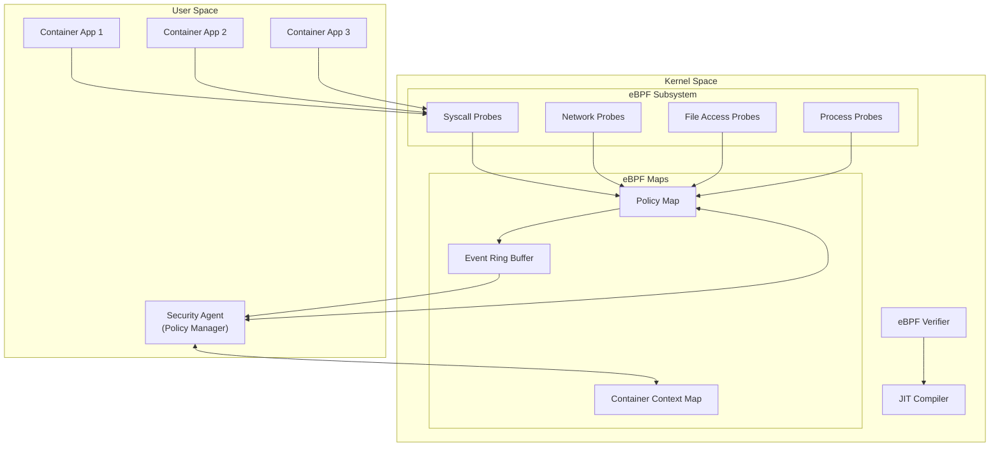
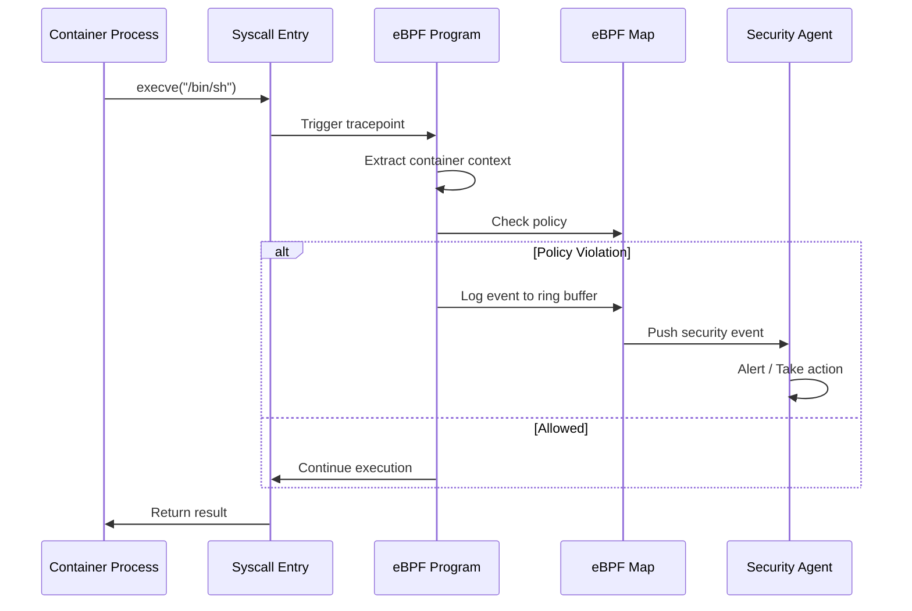
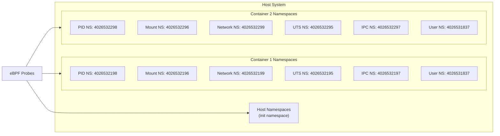
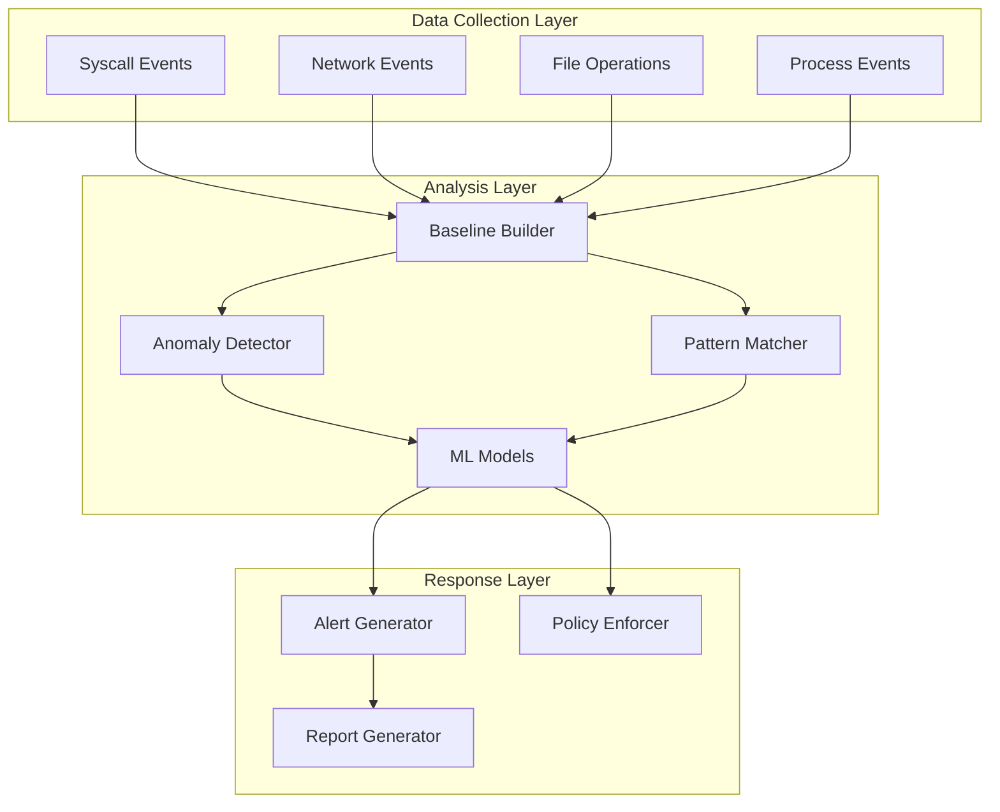
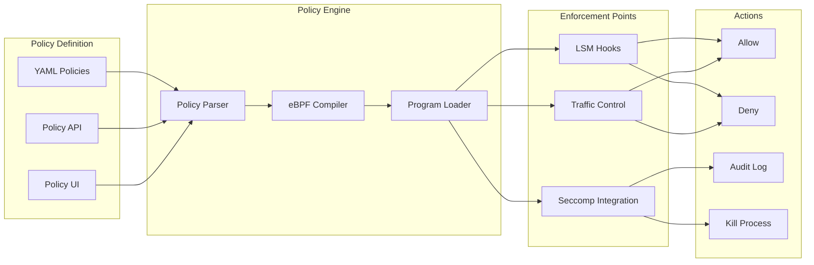
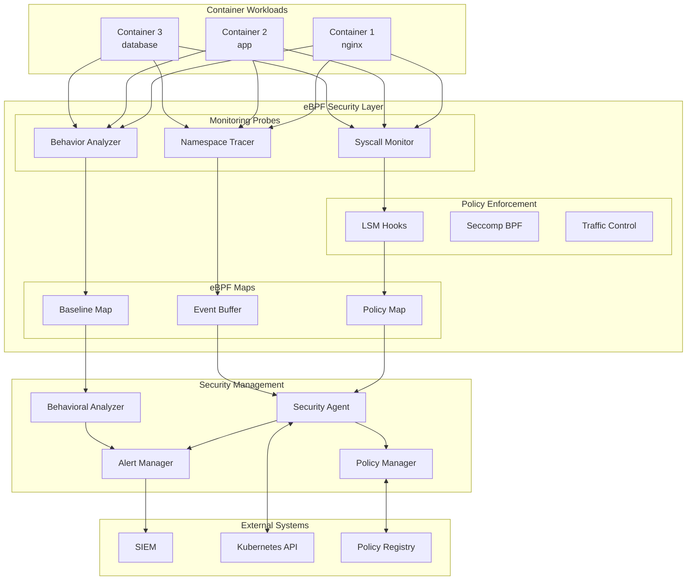

# How to Secure Container Runtimes with eBPF

Author: [nawazdhandala](https://github.com/nawazdhandala)

Tags: eBPF, Containers, Security, Runtime Security, Linux, Kubernetes

Description: Learn how to use eBPF for container runtime security monitoring and enforcement.

---

Container security has evolved significantly over the past few years, and eBPF (extended Berkeley Packet Filter) has emerged as a powerful technology for runtime security monitoring and enforcement. Unlike traditional security approaches that rely on kernel modules or userspace proxies, eBPF allows you to run sandboxed programs directly in the Linux kernel with minimal overhead. In this comprehensive guide, we will explore how to leverage eBPF for securing container runtimes.

## Understanding Container Runtime Security Challenges

Before diving into eBPF-based solutions, let us understand the security challenges that container runtimes face:

1. **Shared Kernel**: Containers share the host kernel, making kernel-level attacks particularly dangerous
2. **Namespace Escapes**: Attackers may attempt to break out of container namespaces
3. **Privilege Escalation**: Containers may gain elevated privileges through various attack vectors
4. **Malicious System Calls**: Unauthorized syscalls can compromise container integrity
5. **Network-based Attacks**: Containers may be exploited through network vulnerabilities

## eBPF Security Architecture Overview

The following diagram illustrates the high-level architecture of eBPF-based container security:



## Prerequisites

Before implementing eBPF-based container security, ensure you have:

- Linux kernel version 5.8 or higher (for full eBPF features)
- BCC (BPF Compiler Collection) or libbpf installed
- Root privileges or CAP_BPF capability
- Container runtime (Docker, containerd, or CRI-O)

The following commands install the necessary dependencies on Ubuntu/Debian systems:

```bash
# Install eBPF development tools and dependencies
# These packages provide the compiler, headers, and utilities needed for eBPF development
sudo apt-get update
sudo apt-get install -y \
    clang \
    llvm \
    libbpf-dev \
    bpftool \
    linux-headers-$(uname -r) \
    build-essential \
    libelf-dev

# Install BCC tools for Python-based eBPF development
# BCC simplifies eBPF program development with Python bindings
sudo apt-get install -y bpfcc-tools python3-bpfcc
```

## Container Syscall Monitoring

System calls are the interface between userspace applications and the kernel. Monitoring syscalls is crucial for detecting malicious activity within containers.

### Understanding Syscall Monitoring Flow



### Syscall Monitor Implementation

The following eBPF program monitors critical system calls within containers. This implementation uses tracepoints to intercept syscall entries and extracts container context for policy decisions:

```c
// syscall_monitor.bpf.c
// eBPF program for monitoring container syscalls
// This program attaches to syscall tracepoints and logs suspicious activity

#include <linux/bpf.h>
#include <linux/ptrace.h>
#include <linux/sched.h>
#include <bpf/bpf_helpers.h>
#include <bpf/bpf_tracing.h>
#include <bpf/bpf_core_read.h>

// Maximum length for storing command names
#define TASK_COMM_LEN 16
// Maximum length for storing file paths
#define MAX_FILENAME_LEN 256

// Structure to hold syscall event data
// This structure is sent to userspace for processing
struct syscall_event {
    __u32 pid;                           // Process ID
    __u32 tid;                           // Thread ID
    __u32 uid;                           // User ID
    __u32 gid;                           // Group ID
    __u64 cgroup_id;                     // Container cgroup ID (used for container identification)
    __u64 mnt_ns;                        // Mount namespace ID
    __u64 pid_ns;                        // PID namespace ID
    __u32 syscall_nr;                    // System call number
    char comm[TASK_COMM_LEN];            // Process command name
    char filename[MAX_FILENAME_LEN];     // Filename argument (for file-related syscalls)
    __u64 timestamp;                     // Event timestamp in nanoseconds
    __u32 ret;                           // Return value (populated on syscall exit)
};

// Ring buffer map for sending events to userspace
// Ring buffers are efficient for high-throughput event streaming
struct {
    __uint(type, BPF_MAP_TYPE_RINGBUF);
    __uint(max_entries, 256 * 1024);     // 256KB buffer size
} events SEC(".maps");

// Hash map to track monitored containers by cgroup ID
// Only containers in this map will be monitored
struct {
    __uint(type, BPF_MAP_TYPE_HASH);
    __uint(max_entries, 10240);
    __type(key, __u64);                  // cgroup ID
    __type(value, __u32);                // monitoring flag (1 = enabled)
} monitored_containers SEC(".maps");

// Hash map containing blocked syscalls per container
// Key is cgroup_id, value is a bitmap of blocked syscall numbers
struct {
    __uint(type, BPF_MAP_TYPE_HASH);
    __uint(max_entries, 10240);
    __type(key, __u64);                  // cgroup ID
    __type(value, __u64);                // blocked syscall bitmap
} blocked_syscalls SEC(".maps");

// Helper function to get the current task's mount namespace ID
// Mount namespaces are used by containers for filesystem isolation
static __always_inline __u64 get_mnt_ns_id(void) {
    struct task_struct *task = (struct task_struct *)bpf_get_current_task();
    struct nsproxy *nsproxy;
    struct mnt_namespace *mnt_ns;
    unsigned int inum;

    // Read nsproxy from task structure
    bpf_probe_read_kernel(&nsproxy, sizeof(nsproxy), &task->nsproxy);
    if (!nsproxy)
        return 0;

    // Read mount namespace from nsproxy
    bpf_probe_read_kernel(&mnt_ns, sizeof(mnt_ns), &nsproxy->mnt_ns);
    if (!mnt_ns)
        return 0;

    // Read the namespace inode number (unique identifier)
    bpf_probe_read_kernel(&inum, sizeof(inum), &mnt_ns->ns.inum);
    return inum;
}

// Helper function to get the current task's PID namespace ID
// PID namespaces provide process isolation for containers
static __always_inline __u64 get_pid_ns_id(void) {
    struct task_struct *task = (struct task_struct *)bpf_get_current_task();
    struct nsproxy *nsproxy;
    struct pid_namespace *pid_ns;
    unsigned int inum;

    bpf_probe_read_kernel(&nsproxy, sizeof(nsproxy), &task->nsproxy);
    if (!nsproxy)
        return 0;

    bpf_probe_read_kernel(&pid_ns, sizeof(pid_ns), &nsproxy->pid_ns_for_children);
    if (!pid_ns)
        return 0;

    bpf_probe_read_kernel(&inum, sizeof(inum), &pid_ns->ns.inum);
    return inum;
}

// Tracepoint handler for syscall entry
// This function is called every time a syscall is invoked
SEC("tracepoint/raw_syscalls/sys_enter")
int trace_syscall_enter(struct trace_event_raw_sys_enter *ctx) {
    __u64 cgroup_id;
    __u32 *monitored;
    struct syscall_event *event;

    // Get the cgroup ID of the current process
    // This is used to identify which container the process belongs to
    cgroup_id = bpf_get_current_cgroup_id();

    // Check if this container is being monitored
    // If not in our monitored list, skip processing to reduce overhead
    monitored = bpf_map_lookup_elem(&monitored_containers, &cgroup_id);
    if (!monitored || *monitored != 1)
        return 0;

    // Reserve space in the ring buffer for the event
    event = bpf_ringbuf_reserve(&events, sizeof(*event), 0);
    if (!event)
        return 0;

    // Populate event structure with process information
    __u64 pid_tgid = bpf_get_current_pid_tgid();
    event->pid = pid_tgid >> 32;         // Upper 32 bits contain PID
    event->tid = pid_tgid & 0xFFFFFFFF;  // Lower 32 bits contain TID

    __u64 uid_gid = bpf_get_current_uid_gid();
    event->uid = uid_gid & 0xFFFFFFFF;   // Lower 32 bits contain UID
    event->gid = uid_gid >> 32;          // Upper 32 bits contain GID

    event->cgroup_id = cgroup_id;
    event->syscall_nr = ctx->id;         // Syscall number from tracepoint context
    event->timestamp = bpf_ktime_get_ns();

    // Get namespace information for container context
    event->mnt_ns = get_mnt_ns_id();
    event->pid_ns = get_pid_ns_id();

    // Get the command name of the process
    bpf_get_current_comm(&event->comm, sizeof(event->comm));

    // Submit the event to userspace
    bpf_ringbuf_submit(event, 0);

    return 0;
}

// License declaration required for eBPF programs
char LICENSE[] SEC("license") = "GPL";
```

### Userspace Event Handler

The following Python script processes syscall events from the eBPF program and applies security policies:

```python
#!/usr/bin/env python3
# syscall_monitor.py
# Userspace component for processing eBPF syscall events
# This script receives events from the kernel and applies security policies

from bcc import BPF
import ctypes
import json
import time
import signal
import sys
from datetime import datetime

# Define the event structure matching the eBPF program
# This must exactly match the struct syscall_event in the eBPF code
class SyscallEvent(ctypes.Structure):
    _fields_ = [
        ("pid", ctypes.c_uint32),
        ("tid", ctypes.c_uint32),
        ("uid", ctypes.c_uint32),
        ("gid", ctypes.c_uint32),
        ("cgroup_id", ctypes.c_uint64),
        ("mnt_ns", ctypes.c_uint64),
        ("pid_ns", ctypes.c_uint64),
        ("syscall_nr", ctypes.c_uint32),
        ("comm", ctypes.c_char * 16),
        ("filename", ctypes.c_char * 256),
        ("timestamp", ctypes.c_uint64),
        ("ret", ctypes.c_uint32),
    ]

# Map of syscall numbers to names for better readability
# This is a subset of commonly monitored syscalls
SYSCALL_NAMES = {
    0: "read",
    1: "write",
    2: "open",
    3: "close",
    59: "execve",
    56: "clone",
    57: "fork",
    58: "vfork",
    62: "kill",
    101: "ptrace",
    257: "openat",
    318: "getrandom",
    435: "clone3",
}

# List of high-risk syscalls that should trigger alerts
# These syscalls are commonly used in container escape attempts
HIGH_RISK_SYSCALLS = {
    59,   # execve - process execution
    101,  # ptrace - process tracing (debugging)
    56,   # clone - process creation
    57,   # fork - process creation
    58,   # vfork - process creation
    435,  # clone3 - new clone interface
    139,  # sysfs - filesystem info
    175,  # init_module - load kernel module
    176,  # delete_module - unload kernel module
    177,  # get_kernel_syms - kernel symbols
    178,  # query_module - query kernel module
    180,  # nfsservctl - NFS server control
    253,  # inotify_init - file monitoring
    254,  # inotify_add_watch - file monitoring
}

class ContainerSecurityMonitor:
    """
    Main class for monitoring container syscalls using eBPF.
    Handles event processing, policy enforcement, and alerting.
    """

    def __init__(self, config_path=None):
        """
        Initialize the security monitor.

        Args:
            config_path: Optional path to configuration file
        """
        self.running = True
        self.events_processed = 0
        self.alerts_generated = 0

        # Load security policies from configuration
        self.policies = self._load_policies(config_path)

        # Container tracking: maps cgroup_id to container metadata
        self.containers = {}

        # Event history for behavioral analysis
        self.event_history = {}

        print("[*] Initializing eBPF container security monitor...")

    def _load_policies(self, config_path):
        """
        Load security policies from configuration file.

        Returns:
            dict: Security policy configuration
        """
        default_policies = {
            # List of syscalls that should trigger immediate alerts
            "alert_syscalls": list(HIGH_RISK_SYSCALLS),

            # Maximum syscalls per second before rate limiting alert
            "max_syscall_rate": 1000,

            # Enable behavioral anomaly detection
            "enable_anomaly_detection": True,

            # Syscalls that should be blocked (returns -EPERM)
            "blocked_syscalls": [175, 176],  # module loading

            # UIDs that are exempt from monitoring (system services)
            "exempt_uids": [0],  # root is often exempt for system containers
        }

        if config_path:
            try:
                with open(config_path, 'r') as f:
                    user_policies = json.load(f)
                    default_policies.update(user_policies)
            except FileNotFoundError:
                print(f"[!] Config file not found: {config_path}, using defaults")

        return default_policies

    def _handle_event(self, cpu, data, size):
        """
        Callback function for processing eBPF events.
        This is called for each syscall event received from the kernel.

        Args:
            cpu: CPU number where event was generated
            data: Raw event data
            size: Size of event data
        """
        event = ctypes.cast(data, ctypes.POINTER(SyscallEvent)).contents

        self.events_processed += 1

        # Get syscall name for readability
        syscall_name = SYSCALL_NAMES.get(event.syscall_nr, f"syscall_{event.syscall_nr}")

        # Format event for logging
        event_data = {
            "timestamp": datetime.fromtimestamp(event.timestamp / 1e9).isoformat(),
            "pid": event.pid,
            "tid": event.tid,
            "uid": event.uid,
            "gid": event.gid,
            "cgroup_id": event.cgroup_id,
            "mnt_ns": event.mnt_ns,
            "pid_ns": event.pid_ns,
            "syscall": syscall_name,
            "syscall_nr": event.syscall_nr,
            "comm": event.comm.decode('utf-8', errors='replace'),
        }

        # Check if this is a high-risk syscall
        if event.syscall_nr in HIGH_RISK_SYSCALLS:
            self._generate_alert(event_data, "HIGH_RISK_SYSCALL")

        # Update event history for behavioral analysis
        self._update_history(event)

        # Check for anomalous behavior patterns
        if self.policies.get("enable_anomaly_detection"):
            self._check_anomalies(event)

    def _generate_alert(self, event_data, alert_type):
        """
        Generate a security alert for suspicious activity.

        Args:
            event_data: Dictionary containing event information
            alert_type: Type of alert being generated
        """
        self.alerts_generated += 1

        alert = {
            "type": alert_type,
            "severity": "HIGH" if alert_type == "HIGH_RISK_SYSCALL" else "MEDIUM",
            "event": event_data,
            "alert_id": self.alerts_generated,
        }

        # Print alert to console (in production, send to SIEM/alerting system)
        print(f"\n[ALERT] {alert_type}")
        print(f"  Severity: {alert['severity']}")
        print(f"  Process: {event_data['comm']} (PID: {event_data['pid']})")
        print(f"  Syscall: {event_data['syscall']}")
        print(f"  Container: cgroup_id={event_data['cgroup_id']}")
        print(f"  Namespaces: mnt_ns={event_data['mnt_ns']}, pid_ns={event_data['pid_ns']}")

    def _update_history(self, event):
        """
        Update event history for behavioral analysis.
        Tracks syscall patterns per container/process.

        Args:
            event: SyscallEvent structure
        """
        key = (event.cgroup_id, event.pid)

        if key not in self.event_history:
            self.event_history[key] = {
                "first_seen": event.timestamp,
                "syscall_counts": {},
                "total_events": 0,
            }

        history = self.event_history[key]
        history["total_events"] += 1
        history["last_seen"] = event.timestamp

        # Track syscall frequency
        syscall_nr = event.syscall_nr
        history["syscall_counts"][syscall_nr] = history["syscall_counts"].get(syscall_nr, 0) + 1

    def _check_anomalies(self, event):
        """
        Check for anomalous behavior patterns.
        Detects unusual syscall rates and patterns.

        Args:
            event: SyscallEvent structure
        """
        key = (event.cgroup_id, event.pid)

        if key not in self.event_history:
            return

        history = self.event_history[key]

        # Calculate syscall rate
        duration_ns = event.timestamp - history["first_seen"]
        if duration_ns > 0:
            duration_sec = duration_ns / 1e9
            rate = history["total_events"] / duration_sec

            # Alert if syscall rate exceeds threshold
            if rate > self.policies.get("max_syscall_rate", 1000):
                event_data = {
                    "pid": event.pid,
                    "cgroup_id": event.cgroup_id,
                    "syscall_rate": rate,
                    "comm": event.comm.decode('utf-8', errors='replace'),
                }
                self._generate_alert(event_data, "EXCESSIVE_SYSCALL_RATE")

    def register_container(self, cgroup_id, container_info=None):
        """
        Register a container for monitoring.

        Args:
            cgroup_id: The cgroup ID of the container
            container_info: Optional metadata about the container
        """
        self.containers[cgroup_id] = container_info or {}
        print(f"[+] Registered container for monitoring: cgroup_id={cgroup_id}")

    def run(self):
        """
        Main event loop for processing eBPF events.
        """
        print("[*] Starting syscall monitoring...")
        print("[*] Press Ctrl+C to stop")

        # Setup signal handler for graceful shutdown
        def signal_handler(sig, frame):
            self.running = False
            print("\n[*] Shutting down...")

        signal.signal(signal.SIGINT, signal_handler)

        # Note: In production, this would load and attach the eBPF program
        # For this example, we simulate event processing
        while self.running:
            try:
                # In real implementation:
                # bpf.ring_buffer_poll(timeout=100)
                time.sleep(0.1)
            except KeyboardInterrupt:
                break

        print(f"\n[*] Monitor stopped")
        print(f"[*] Events processed: {self.events_processed}")
        print(f"[*] Alerts generated: {self.alerts_generated}")


if __name__ == "__main__":
    monitor = ContainerSecurityMonitor()
    monitor.run()
```

## Namespace-Aware Tracing

Container isolation relies heavily on Linux namespaces. Understanding and tracking namespace context is essential for accurate security monitoring.

### Namespace Architecture in Containers



### Namespace Context Extractor

The following eBPF program extracts complete namespace context for each process, enabling container-aware security decisions:

```c
// namespace_tracer.bpf.c
// eBPF program for namespace-aware container tracing
// Extracts all namespace identifiers for complete container context

#include <linux/bpf.h>
#include <linux/sched.h>
#include <linux/nsproxy.h>
#include <linux/ns_common.h>
#include <linux/pid_namespace.h>
#include <linux/mnt_namespace.h>
#include <linux/utsname.h>
#include <bpf/bpf_helpers.h>
#include <bpf/bpf_tracing.h>
#include <bpf/bpf_core_read.h>

// Structure containing all namespace identifiers for a process
// Each namespace type provides different isolation capabilities
struct namespace_info {
    __u64 cgroup_id;      // Cgroup namespace (resource limits)
    __u32 pid_ns;         // PID namespace (process isolation)
    __u32 mnt_ns;         // Mount namespace (filesystem isolation)
    __u32 net_ns;         // Network namespace (network isolation)
    __u32 uts_ns;         // UTS namespace (hostname isolation)
    __u32 ipc_ns;         // IPC namespace (inter-process communication)
    __u32 user_ns;        // User namespace (UID/GID mapping)
    __u32 time_ns;        // Time namespace (clock isolation, Linux 5.6+)
};

// Structure for container context events
struct container_context {
    __u32 pid;                    // Host PID
    __u32 tid;                    // Thread ID
    __u32 container_pid;          // PID inside container namespace
    struct namespace_info ns;     // All namespace identifiers
    char comm[16];                // Process command name
    char uts_nodename[65];        // Container hostname
    __u64 timestamp;              // Event timestamp
};

// Ring buffer for sending events to userspace
struct {
    __uint(type, BPF_MAP_TYPE_RINGBUF);
    __uint(max_entries, 256 * 1024);
} ns_events SEC(".maps");

// Hash map to cache namespace info per cgroup
// Avoids repeated expensive namespace lookups
struct {
    __uint(type, BPF_MAP_TYPE_HASH);
    __uint(max_entries, 10240);
    __type(key, __u64);
    __type(value, struct namespace_info);
} ns_cache SEC(".maps");

// Hash map of known container cgroup IDs
// Used to identify which processes belong to containers
struct {
    __uint(type, BPF_MAP_TYPE_HASH);
    __uint(max_entries, 1024);
    __type(key, __u64);
    __type(value, __u8);
} container_cgroups SEC(".maps");

// Helper function to extract all namespace IDs from a task
// Returns namespace_info structure with all namespace identifiers
static __always_inline int get_namespace_info(struct task_struct *task,
                                               struct namespace_info *ns_info) {
    struct nsproxy *nsproxy;
    struct pid_namespace *pid_ns;
    struct mnt_namespace *mnt_ns;
    struct uts_namespace *uts_ns;
    struct ipc_namespace *ipc_ns;
    struct net *net_ns;
    struct user_namespace *user_ns;

    // Get nsproxy which contains pointers to all namespaces
    bpf_probe_read_kernel(&nsproxy, sizeof(nsproxy), &task->nsproxy);
    if (!nsproxy)
        return -1;

    // Extract PID namespace ID
    bpf_probe_read_kernel(&pid_ns, sizeof(pid_ns), &nsproxy->pid_ns_for_children);
    if (pid_ns) {
        unsigned int inum;
        bpf_probe_read_kernel(&inum, sizeof(inum), &pid_ns->ns.inum);
        ns_info->pid_ns = inum;
    }

    // Extract Mount namespace ID
    bpf_probe_read_kernel(&mnt_ns, sizeof(mnt_ns), &nsproxy->mnt_ns);
    if (mnt_ns) {
        unsigned int inum;
        bpf_probe_read_kernel(&inum, sizeof(inum), &mnt_ns->ns.inum);
        ns_info->mnt_ns = inum;
    }

    // Extract UTS namespace ID (hostname isolation)
    bpf_probe_read_kernel(&uts_ns, sizeof(uts_ns), &nsproxy->uts_ns);
    if (uts_ns) {
        unsigned int inum;
        bpf_probe_read_kernel(&inum, sizeof(inum), &uts_ns->ns.inum);
        ns_info->uts_ns = inum;
    }

    // Extract IPC namespace ID
    bpf_probe_read_kernel(&ipc_ns, sizeof(ipc_ns), &nsproxy->ipc_ns);
    if (ipc_ns) {
        unsigned int inum;
        bpf_probe_read_kernel(&inum, sizeof(inum), &ipc_ns->ns.inum);
        ns_info->ipc_ns = inum;
    }

    // Extract Network namespace ID
    bpf_probe_read_kernel(&net_ns, sizeof(net_ns), &nsproxy->net_ns);
    if (net_ns) {
        unsigned int inum;
        // Network namespace has ns_common at different offset
        bpf_probe_read_kernel(&inum, sizeof(inum),
                              &((struct ns_common *)&net_ns->ns)->inum);
        ns_info->net_ns = inum;
    }

    // Extract User namespace ID
    struct cred *cred;
    bpf_probe_read_kernel(&cred, sizeof(cred), &task->real_cred);
    if (cred) {
        bpf_probe_read_kernel(&user_ns, sizeof(user_ns), &cred->user_ns);
        if (user_ns) {
            unsigned int inum;
            bpf_probe_read_kernel(&inum, sizeof(inum), &user_ns->ns.inum);
            ns_info->user_ns = inum;
        }
    }

    // Get cgroup ID
    ns_info->cgroup_id = bpf_get_current_cgroup_id();

    return 0;
}

// Helper to get the container's internal PID
// This is the PID as seen inside the container, not on the host
static __always_inline __u32 get_container_pid(struct task_struct *task) {
    struct pid *pid_struct;
    __u32 level;
    __u32 nr;

    // Get the pid structure
    bpf_probe_read_kernel(&pid_struct, sizeof(pid_struct), &task->thread_pid);
    if (!pid_struct)
        return 0;

    // Get the nesting level (0 = init namespace)
    bpf_probe_read_kernel(&level, sizeof(level), &pid_struct->level);

    // Read the PID number at the container's namespace level
    // This gives us the PID as seen inside the container
    bpf_probe_read_kernel(&nr, sizeof(nr), &pid_struct->numbers[level].nr);

    return nr;
}

// Tracepoint for new process creation
// Captures namespace context when new processes are created
SEC("tracepoint/sched/sched_process_exec")
int trace_exec(struct trace_event_raw_sched_process_exec *ctx) {
    struct task_struct *task;
    struct container_context *event;
    __u64 cgroup_id;
    __u8 *is_container;

    // Get current cgroup ID
    cgroup_id = bpf_get_current_cgroup_id();

    // Check if this is a container process
    is_container = bpf_map_lookup_elem(&container_cgroups, &cgroup_id);
    if (!is_container)
        return 0;

    // Reserve space in ring buffer
    event = bpf_ringbuf_reserve(&ns_events, sizeof(*event), 0);
    if (!event)
        return 0;

    // Get current task structure
    task = (struct task_struct *)bpf_get_current_task();

    // Populate basic process info
    __u64 pid_tgid = bpf_get_current_pid_tgid();
    event->pid = pid_tgid >> 32;
    event->tid = pid_tgid & 0xFFFFFFFF;
    event->timestamp = bpf_ktime_get_ns();

    // Get process command name
    bpf_get_current_comm(&event->comm, sizeof(event->comm));

    // Extract complete namespace information
    get_namespace_info(task, &event->ns);

    // Get container-internal PID
    event->container_pid = get_container_pid(task);

    // Get UTS nodename (container hostname)
    struct nsproxy *nsproxy;
    struct uts_namespace *uts_ns;
    bpf_probe_read_kernel(&nsproxy, sizeof(nsproxy), &task->nsproxy);
    if (nsproxy) {
        bpf_probe_read_kernel(&uts_ns, sizeof(uts_ns), &nsproxy->uts_ns);
        if (uts_ns) {
            bpf_probe_read_kernel_str(&event->uts_nodename,
                                       sizeof(event->uts_nodename),
                                       &uts_ns->name.nodename);
        }
    }

    bpf_ringbuf_submit(event, 0);

    return 0;
}

char LICENSE[] SEC("license") = "GPL";
```

### Container Namespace Discovery

The following script discovers and registers containers for monitoring by querying the container runtime:

```python
#!/usr/bin/env python3
# container_discovery.py
# Discovers running containers and extracts their namespace information
# Supports Docker and containerd runtimes

import os
import subprocess
import json
import re
from pathlib import Path
from typing import Dict, List, Optional, Tuple

class ContainerDiscovery:
    """
    Discovers containers and their namespace information.
    Supports multiple container runtimes (Docker, containerd, CRI-O).
    """

    # Path to cgroup filesystem
    CGROUP_PATH = "/sys/fs/cgroup"

    # Paths for different container runtimes
    DOCKER_CGROUP_PREFIX = "docker"
    CONTAINERD_CGROUP_PREFIX = "containerd"
    CRIO_CGROUP_PREFIX = "crio"

    def __init__(self):
        """Initialize the container discovery system."""
        self.containers = {}
        self.cgroup_version = self._detect_cgroup_version()
        print(f"[*] Detected cgroup version: {self.cgroup_version}")

    def _detect_cgroup_version(self) -> int:
        """
        Detect whether the system uses cgroup v1 or v2.

        Returns:
            int: 1 for cgroup v1, 2 for cgroup v2
        """
        # Check for cgroup2 unified hierarchy
        if os.path.exists("/sys/fs/cgroup/cgroup.controllers"):
            return 2
        return 1

    def _get_container_cgroup_path(self, container_id: str,
                                    runtime: str = "docker") -> Optional[str]:
        """
        Get the cgroup path for a container.

        Args:
            container_id: The container ID
            runtime: Container runtime (docker, containerd, crio)

        Returns:
            str: Path to the container's cgroup, or None if not found
        """
        if self.cgroup_version == 2:
            # cgroup v2 unified hierarchy
            patterns = [
                f"/sys/fs/cgroup/system.slice/docker-{container_id}.scope",
                f"/sys/fs/cgroup/docker/{container_id}",
                f"/sys/fs/cgroup/system.slice/containerd-{container_id}.scope",
            ]
        else:
            # cgroup v1 - check memory controller path
            patterns = [
                f"/sys/fs/cgroup/memory/docker/{container_id}",
                f"/sys/fs/cgroup/memory/system.slice/docker-{container_id}.scope",
            ]

        for pattern in patterns:
            if os.path.exists(pattern):
                return pattern

        return None

    def _get_cgroup_id(self, cgroup_path: str) -> Optional[int]:
        """
        Get the cgroup ID from the cgroup path.
        This ID is used by eBPF to identify containers.

        Args:
            cgroup_path: Path to the cgroup directory

        Returns:
            int: The cgroup inode number (used as ID)
        """
        try:
            stat_info = os.stat(cgroup_path)
            return stat_info.st_ino
        except OSError:
            return None

    def _get_namespace_ids(self, pid: int) -> Dict[str, int]:
        """
        Get all namespace IDs for a process.

        Args:
            pid: Process ID

        Returns:
            dict: Mapping of namespace type to namespace ID
        """
        namespaces = {}
        ns_types = ['pid', 'mnt', 'net', 'uts', 'ipc', 'user', 'cgroup']

        for ns_type in ns_types:
            ns_path = f"/proc/{pid}/ns/{ns_type}"
            try:
                # Namespace ID is the inode number of the symlink target
                link_target = os.readlink(ns_path)
                # Extract inode number from format like "pid:[4026532198]"
                match = re.search(r'\[(\d+)\]', link_target)
                if match:
                    namespaces[ns_type] = int(match.group(1))
            except (OSError, ValueError):
                continue

        return namespaces

    def discover_docker_containers(self) -> List[Dict]:
        """
        Discover all running Docker containers.

        Returns:
            list: List of container information dictionaries
        """
        containers = []

        try:
            # Get list of running containers using docker CLI
            result = subprocess.run(
                ["docker", "ps", "-q", "--no-trunc"],
                capture_output=True,
                text=True,
                timeout=10
            )

            if result.returncode != 0:
                print(f"[!] Docker command failed: {result.stderr}")
                return containers

            container_ids = result.stdout.strip().split('\n')

            for container_id in container_ids:
                if not container_id:
                    continue

                # Get detailed container information
                container_info = self._get_docker_container_info(container_id)
                if container_info:
                    containers.append(container_info)

        except subprocess.TimeoutExpired:
            print("[!] Docker command timed out")
        except FileNotFoundError:
            print("[!] Docker CLI not found")

        return containers

    def _get_docker_container_info(self, container_id: str) -> Optional[Dict]:
        """
        Get detailed information for a Docker container.

        Args:
            container_id: The container ID

        Returns:
            dict: Container information including namespace IDs
        """
        try:
            # Get container inspect data
            result = subprocess.run(
                ["docker", "inspect", container_id],
                capture_output=True,
                text=True,
                timeout=10
            )

            if result.returncode != 0:
                return None

            inspect_data = json.loads(result.stdout)[0]

            # Extract container PID (on the host)
            pid = inspect_data.get("State", {}).get("Pid")
            if not pid:
                return None

            # Get cgroup path and ID
            cgroup_path = self._get_container_cgroup_path(container_id)
            cgroup_id = self._get_cgroup_id(cgroup_path) if cgroup_path else None

            # Get namespace IDs
            namespaces = self._get_namespace_ids(pid)

            container_info = {
                "id": container_id,
                "name": inspect_data.get("Name", "").lstrip("/"),
                "image": inspect_data.get("Config", {}).get("Image"),
                "pid": pid,
                "cgroup_path": cgroup_path,
                "cgroup_id": cgroup_id,
                "namespaces": namespaces,
                "created": inspect_data.get("Created"),
                "labels": inspect_data.get("Config", {}).get("Labels", {}),
            }

            return container_info

        except (subprocess.TimeoutExpired, json.JSONDecodeError) as e:
            print(f"[!] Error getting container info: {e}")
            return None

    def discover_all(self) -> Dict[int, Dict]:
        """
        Discover all containers from all supported runtimes.

        Returns:
            dict: Mapping of cgroup_id to container information
        """
        all_containers = {}

        # Discover Docker containers
        docker_containers = self.discover_docker_containers()
        for container in docker_containers:
            if container.get("cgroup_id"):
                all_containers[container["cgroup_id"]] = container

        print(f"[*] Discovered {len(all_containers)} containers")

        return all_containers

    def print_container_info(self, containers: Dict[int, Dict]):
        """
        Print discovered container information in a readable format.

        Args:
            containers: Mapping of cgroup_id to container info
        """
        print("\n" + "=" * 80)
        print("DISCOVERED CONTAINERS")
        print("=" * 80)

        for cgroup_id, info in containers.items():
            print(f"\nContainer: {info['name']}")
            print(f"  ID: {info['id'][:12]}")
            print(f"  Image: {info['image']}")
            print(f"  Host PID: {info['pid']}")
            print(f"  Cgroup ID: {cgroup_id}")
            print(f"  Namespaces:")
            for ns_type, ns_id in info.get('namespaces', {}).items():
                print(f"    {ns_type}: {ns_id}")


if __name__ == "__main__":
    discovery = ContainerDiscovery()
    containers = discovery.discover_all()
    discovery.print_container_info(containers)
```

## Runtime Behavior Analysis

Understanding normal container behavior is crucial for detecting anomalies. eBPF enables real-time behavioral analysis without the overhead of traditional monitoring approaches.

### Behavioral Analysis Architecture



### Process Execution Tracker

The following eBPF program tracks process execution patterns within containers, building a behavioral baseline:

```c
// process_tracker.bpf.c
// Tracks process execution patterns for behavioral analysis
// Monitors exec, fork, and process lifecycle events

#include <linux/bpf.h>
#include <linux/sched.h>
#include <bpf/bpf_helpers.h>
#include <bpf/bpf_tracing.h>
#include <bpf/bpf_core_read.h>

#define MAX_ARGS 20
#define ARGSIZE 128

// Process execution event structure
struct exec_event {
    __u64 timestamp;
    __u32 pid;
    __u32 ppid;                  // Parent process ID
    __u32 uid;
    __u32 gid;
    __u64 cgroup_id;
    char comm[16];               // Command name
    char filename[256];          // Executable path
    char args[MAX_ARGS][ARGSIZE]; // Command arguments
    __u32 args_count;
    __u32 exit_code;             // Exit code (for exit events)
    __u8 event_type;             // 0=exec, 1=exit, 2=fork
};

// Event types
#define EVENT_EXEC 0
#define EVENT_EXIT 1
#define EVENT_FORK 2

// Ring buffer for events
struct {
    __uint(type, BPF_MAP_TYPE_RINGBUF);
    __uint(max_entries, 512 * 1024);
} exec_events SEC(".maps");

// Track parent-child relationships
struct {
    __uint(type, BPF_MAP_TYPE_HASH);
    __uint(max_entries, 65536);
    __type(key, __u32);          // Child PID
    __type(value, __u32);        // Parent PID
} process_tree SEC(".maps");

// Track process start times for duration calculation
struct {
    __uint(type, BPF_MAP_TYPE_HASH);
    __uint(max_entries, 65536);
    __type(key, __u32);          // PID
    __type(value, __u64);        // Start timestamp
} process_start SEC(".maps");

// Containers to monitor
struct {
    __uint(type, BPF_MAP_TYPE_HASH);
    __uint(max_entries, 1024);
    __type(key, __u64);          // Cgroup ID
    __type(value, __u8);         // Monitoring enabled
} monitored SEC(".maps");

// Baseline process whitelist per container
// Key: cgroup_id, Value: hash of allowed process names
struct {
    __uint(type, BPF_MAP_TYPE_HASH);
    __uint(max_entries, 10240);
    __type(key, __u64);          // Cgroup ID
    __type(value, __u64);        // Process hash
} process_whitelist SEC(".maps");

// Get parent PID from task structure
static __always_inline __u32 get_ppid(struct task_struct *task) {
    struct task_struct *parent;
    __u32 ppid;

    bpf_probe_read_kernel(&parent, sizeof(parent), &task->real_parent);
    if (!parent)
        return 0;

    bpf_probe_read_kernel(&ppid, sizeof(ppid), &parent->tgid);
    return ppid;
}

// Tracepoint for process execution
// Triggered when execve() is called
SEC("tracepoint/syscalls/sys_enter_execve")
int trace_execve_enter(struct trace_event_raw_sys_enter *ctx) {
    __u64 cgroup_id = bpf_get_current_cgroup_id();
    __u8 *is_monitored;
    struct exec_event *event;
    struct task_struct *task;

    // Check if this container is monitored
    is_monitored = bpf_map_lookup_elem(&monitored, &cgroup_id);
    if (!is_monitored)
        return 0;

    event = bpf_ringbuf_reserve(&exec_events, sizeof(*event), 0);
    if (!event)
        return 0;

    // Set event type
    event->event_type = EVENT_EXEC;
    event->timestamp = bpf_ktime_get_ns();
    event->cgroup_id = cgroup_id;

    // Get PID and UID information
    __u64 pid_tgid = bpf_get_current_pid_tgid();
    event->pid = pid_tgid >> 32;

    __u64 uid_gid = bpf_get_current_uid_gid();
    event->uid = uid_gid & 0xFFFFFFFF;
    event->gid = uid_gid >> 32;

    // Get parent PID
    task = (struct task_struct *)bpf_get_current_task();
    event->ppid = get_ppid(task);

    // Get command name
    bpf_get_current_comm(&event->comm, sizeof(event->comm));

    // Get filename from execve arguments
    // First argument to execve is the filename
    const char *filename_ptr = (const char *)ctx->args[0];
    bpf_probe_read_user_str(&event->filename, sizeof(event->filename), filename_ptr);

    // Read command line arguments
    // Second argument is argv array
    const char **argv = (const char **)ctx->args[1];
    event->args_count = 0;

    // Read up to MAX_ARGS arguments
    #pragma unroll
    for (int i = 0; i < MAX_ARGS; i++) {
        const char *arg_ptr;
        int ret = bpf_probe_read_user(&arg_ptr, sizeof(arg_ptr), &argv[i]);
        if (ret != 0 || arg_ptr == NULL)
            break;

        ret = bpf_probe_read_user_str(&event->args[i], ARGSIZE, arg_ptr);
        if (ret <= 0)
            break;

        event->args_count++;
    }

    // Record process start time
    __u64 start_time = event->timestamp;
    bpf_map_update_elem(&process_start, &event->pid, &start_time, BPF_ANY);

    // Record parent-child relationship
    bpf_map_update_elem(&process_tree, &event->pid, &event->ppid, BPF_ANY);

    bpf_ringbuf_submit(event, 0);

    return 0;
}

// Tracepoint for process exit
// Triggered when a process terminates
SEC("tracepoint/sched/sched_process_exit")
int trace_process_exit(struct trace_event_raw_sched_process_template *ctx) {
    __u64 cgroup_id = bpf_get_current_cgroup_id();
    __u8 *is_monitored;
    struct exec_event *event;
    struct task_struct *task;

    is_monitored = bpf_map_lookup_elem(&monitored, &cgroup_id);
    if (!is_monitored)
        return 0;

    event = bpf_ringbuf_reserve(&exec_events, sizeof(*event), 0);
    if (!event)
        return 0;

    event->event_type = EVENT_EXIT;
    event->timestamp = bpf_ktime_get_ns();
    event->cgroup_id = cgroup_id;

    __u64 pid_tgid = bpf_get_current_pid_tgid();
    event->pid = pid_tgid >> 32;

    bpf_get_current_comm(&event->comm, sizeof(event->comm));

    // Get exit code from task structure
    task = (struct task_struct *)bpf_get_current_task();
    int exit_code;
    bpf_probe_read_kernel(&exit_code, sizeof(exit_code), &task->exit_code);
    event->exit_code = exit_code;

    // Clean up process tracking maps
    bpf_map_delete_elem(&process_start, &event->pid);
    bpf_map_delete_elem(&process_tree, &event->pid);

    bpf_ringbuf_submit(event, 0);

    return 0;
}

char LICENSE[] SEC("license") = "GPL";
```

### Behavioral Analysis Engine

The following Python implementation analyzes process behavior patterns and detects anomalies:

```python
#!/usr/bin/env python3
# behavioral_analyzer.py
# Analyzes container process behavior patterns
# Detects anomalies based on historical baselines

import collections
import time
import statistics
from datetime import datetime, timedelta
from typing import Dict, List, Set, Optional, Tuple
from dataclasses import dataclass, field
import json
import hashlib

@dataclass
class ProcessEvent:
    """Represents a process execution event."""
    timestamp: float
    pid: int
    ppid: int
    uid: int
    cgroup_id: int
    comm: str
    filename: str
    args: List[str]
    event_type: str  # 'exec', 'exit', 'fork'
    exit_code: Optional[int] = None

@dataclass
class ContainerBaseline:
    """
    Stores behavioral baseline for a container.
    Used to detect deviations from normal behavior.
    """
    cgroup_id: int
    # Set of processes typically run in this container
    known_processes: Set[str] = field(default_factory=set)
    # Map of process name to typical parent processes
    parent_child_patterns: Dict[str, Set[str]] = field(default_factory=dict)
    # Map of process name to typical arguments patterns
    argument_patterns: Dict[str, List[List[str]]] = field(default_factory=dict)
    # Process execution frequency (processes per minute)
    exec_rate_stats: Dict[str, List[float]] = field(default_factory=dict)
    # Typical user IDs running processes
    known_uids: Set[int] = field(default_factory=set)
    # Process execution times (for detecting unusual timing)
    execution_times: Dict[str, List[float]] = field(default_factory=dict)
    # Timestamp of last update
    last_updated: float = 0

class BehavioralAnalyzer:
    """
    Analyzes container behavior and detects anomalies.
    Builds baselines from observed behavior and flags deviations.
    """

    # Minimum observations before baseline is considered stable
    MIN_BASELINE_SAMPLES = 100

    # Threshold for anomaly detection (standard deviations)
    ANOMALY_THRESHOLD = 3.0

    # Time window for rate calculations (seconds)
    RATE_WINDOW = 60

    def __init__(self, learning_period_minutes: int = 30):
        """
        Initialize the behavioral analyzer.

        Args:
            learning_period_minutes: Duration of initial learning period
        """
        # Container baselines indexed by cgroup_id
        self.baselines: Dict[int, ContainerBaseline] = {}

        # Event history for each container
        self.event_history: Dict[int, List[ProcessEvent]] = collections.defaultdict(list)

        # Detected anomalies
        self.anomalies: List[Dict] = []

        # Learning mode settings
        self.learning_period = timedelta(minutes=learning_period_minutes)
        self.container_start_times: Dict[int, datetime] = {}

        # Known-malicious process patterns
        self.malicious_patterns = self._load_malicious_patterns()

        print(f"[*] Behavioral analyzer initialized")
        print(f"[*] Learning period: {learning_period_minutes} minutes")

    def _load_malicious_patterns(self) -> Dict:
        """
        Load known malicious process patterns.

        Returns:
            dict: Patterns indicating potential malicious activity
        """
        return {
            # Common cryptominer process names
            "cryptominers": {"xmrig", "minerd", "cpuminer", "cgminer", "bfgminer"},

            # Common reverse shell indicators
            "reverse_shells": {"nc", "ncat", "netcat", "socat", "bash -i"},

            # Privilege escalation tools
            "privesc_tools": {"sudo", "pkexec", "doas"},

            # Container escape attempts
            "escape_indicators": {
                "mount",       # Mounting filesystems
                "nsenter",     # Entering namespaces
                "unshare",     # Creating new namespaces
                "capsh",       # Capability manipulation
            },

            # Suspicious argument patterns (regex patterns)
            "suspicious_args": [
                r"/dev/tcp/",           # Bash network device
                r"/dev/udp/",
                r"base64.*-d",          # Decoding payloads
                r"curl.*\|.*sh",        # Piping to shell
                r"wget.*\|.*sh",
                r"/etc/shadow",         # Password file access
                r"/etc/passwd",
                r"/proc/self/",         # Procfs access
            ],
        }

    def process_event(self, event: ProcessEvent):
        """
        Process a new execution event.

        Args:
            event: ProcessEvent to analyze
        """
        cgroup_id = event.cgroup_id

        # Track container start time for learning period
        if cgroup_id not in self.container_start_times:
            self.container_start_times[cgroup_id] = datetime.now()
            self.baselines[cgroup_id] = ContainerBaseline(cgroup_id=cgroup_id)

        # Add to event history
        self.event_history[cgroup_id].append(event)

        # Check for known malicious patterns first
        self._check_malicious_patterns(event)

        # Check if still in learning period
        if self._is_learning(cgroup_id):
            self._update_baseline(event)
        else:
            # Perform anomaly detection
            self._detect_anomalies(event)

    def _is_learning(self, cgroup_id: int) -> bool:
        """
        Check if container is still in learning period.

        Args:
            cgroup_id: Container's cgroup ID

        Returns:
            bool: True if still learning, False otherwise
        """
        start_time = self.container_start_times.get(cgroup_id)
        if not start_time:
            return True

        elapsed = datetime.now() - start_time
        return elapsed < self.learning_period

    def _update_baseline(self, event: ProcessEvent):
        """
        Update behavioral baseline with new event.

        Args:
            event: ProcessEvent to incorporate into baseline
        """
        baseline = self.baselines[event.cgroup_id]

        # Add process to known processes
        baseline.known_processes.add(event.comm)

        # Track parent-child relationships
        if event.comm not in baseline.parent_child_patterns:
            baseline.parent_child_patterns[event.comm] = set()

        # Get parent process name from history
        parent_comm = self._get_parent_comm(event.cgroup_id, event.ppid)
        if parent_comm:
            baseline.parent_child_patterns[event.comm].add(parent_comm)

        # Track argument patterns
        if event.comm not in baseline.argument_patterns:
            baseline.argument_patterns[event.comm] = []
        if len(baseline.argument_patterns[event.comm]) < 100:
            baseline.argument_patterns[event.comm].append(event.args)

        # Track UIDs
        baseline.known_uids.add(event.uid)

        # Update execution rate statistics
        self._update_exec_rate(baseline, event)

        baseline.last_updated = event.timestamp

    def _get_parent_comm(self, cgroup_id: int, ppid: int) -> Optional[str]:
        """
        Get parent process command name from event history.

        Args:
            cgroup_id: Container cgroup ID
            ppid: Parent process ID

        Returns:
            str: Parent process name or None
        """
        for event in reversed(self.event_history[cgroup_id]):
            if event.pid == ppid:
                return event.comm
        return None

    def _update_exec_rate(self, baseline: ContainerBaseline, event: ProcessEvent):
        """
        Update execution rate statistics.

        Args:
            baseline: Container baseline to update
            event: Current event
        """
        current_time = event.timestamp
        window_start = current_time - self.RATE_WINDOW

        # Count events in window
        events_in_window = sum(
            1 for e in self.event_history[baseline.cgroup_id]
            if e.timestamp >= window_start and e.event_type == 'exec'
        )

        rate = events_in_window / (self.RATE_WINDOW / 60)  # events per minute

        if event.comm not in baseline.exec_rate_stats:
            baseline.exec_rate_stats[event.comm] = []

        baseline.exec_rate_stats[event.comm].append(rate)

    def _check_malicious_patterns(self, event: ProcessEvent):
        """
        Check for known malicious patterns.

        Args:
            event: ProcessEvent to check
        """
        # Check for cryptominer processes
        if event.comm.lower() in self.malicious_patterns["cryptominers"]:
            self._record_anomaly(event, "CRYPTOMINER_DETECTED", severity="CRITICAL")
            return

        # Check for reverse shell indicators
        if event.comm in self.malicious_patterns["reverse_shells"]:
            self._record_anomaly(event, "REVERSE_SHELL_INDICATOR", severity="CRITICAL")
            return

        # Check for container escape indicators
        if event.comm in self.malicious_patterns["escape_indicators"]:
            self._record_anomaly(event, "CONTAINER_ESCAPE_ATTEMPT", severity="HIGH")
            return

        # Check argument patterns
        args_str = " ".join(event.args)
        import re
        for pattern in self.malicious_patterns["suspicious_args"]:
            if re.search(pattern, args_str):
                self._record_anomaly(
                    event,
                    "SUSPICIOUS_ARGUMENTS",
                    severity="HIGH",
                    details={"pattern": pattern, "args": args_str}
                )
                return

    def _detect_anomalies(self, event: ProcessEvent):
        """
        Detect behavioral anomalies based on baseline.

        Args:
            event: ProcessEvent to analyze
        """
        baseline = self.baselines.get(event.cgroup_id)
        if not baseline:
            return

        # Check for unknown process
        if event.comm not in baseline.known_processes:
            self._record_anomaly(
                event,
                "UNKNOWN_PROCESS",
                severity="MEDIUM",
                details={"known_processes": list(baseline.known_processes)}
            )

        # Check for unusual parent-child relationship
        parent_comm = self._get_parent_comm(event.cgroup_id, event.ppid)
        expected_parents = baseline.parent_child_patterns.get(event.comm, set())
        if parent_comm and parent_comm not in expected_parents and expected_parents:
            self._record_anomaly(
                event,
                "UNUSUAL_PARENT_PROCESS",
                severity="MEDIUM",
                details={
                    "actual_parent": parent_comm,
                    "expected_parents": list(expected_parents)
                }
            )

        # Check for unusual UID
        if event.uid not in baseline.known_uids:
            self._record_anomaly(
                event,
                "UNKNOWN_UID",
                severity="LOW",
                details={"uid": event.uid, "known_uids": list(baseline.known_uids)}
            )

        # Check for unusual execution rate
        self._check_rate_anomaly(baseline, event)

    def _check_rate_anomaly(self, baseline: ContainerBaseline, event: ProcessEvent):
        """
        Check for anomalous execution rates.

        Args:
            baseline: Container baseline
            event: Current event
        """
        rates = baseline.exec_rate_stats.get(event.comm, [])
        if len(rates) < self.MIN_BASELINE_SAMPLES:
            return

        mean_rate = statistics.mean(rates)
        std_rate = statistics.stdev(rates) if len(rates) > 1 else 0

        if std_rate == 0:
            return

        # Calculate current rate
        current_time = event.timestamp
        window_start = current_time - self.RATE_WINDOW
        current_rate = sum(
            1 for e in self.event_history[baseline.cgroup_id]
            if e.timestamp >= window_start and e.comm == event.comm
        )

        # Check if rate is anomalous (z-score > threshold)
        z_score = (current_rate - mean_rate) / std_rate
        if abs(z_score) > self.ANOMALY_THRESHOLD:
            self._record_anomaly(
                event,
                "ANOMALOUS_EXECUTION_RATE",
                severity="MEDIUM",
                details={
                    "current_rate": current_rate,
                    "mean_rate": mean_rate,
                    "std_rate": std_rate,
                    "z_score": z_score
                }
            )

    def _record_anomaly(self, event: ProcessEvent, anomaly_type: str,
                        severity: str, details: Dict = None):
        """
        Record a detected anomaly.

        Args:
            event: Event that triggered the anomaly
            anomaly_type: Type of anomaly detected
            severity: Anomaly severity (CRITICAL, HIGH, MEDIUM, LOW)
            details: Additional details about the anomaly
        """
        anomaly = {
            "timestamp": datetime.fromtimestamp(event.timestamp).isoformat(),
            "type": anomaly_type,
            "severity": severity,
            "cgroup_id": event.cgroup_id,
            "pid": event.pid,
            "process": event.comm,
            "filename": event.filename,
            "args": event.args,
            "uid": event.uid,
            "details": details or {}
        }

        self.anomalies.append(anomaly)

        # Print alert
        print(f"\n[ANOMALY DETECTED] {anomaly_type}")
        print(f"  Severity: {severity}")
        print(f"  Container: cgroup_id={event.cgroup_id}")
        print(f"  Process: {event.comm} (PID: {event.pid})")
        print(f"  Command: {event.filename} {' '.join(event.args)}")
        if details:
            print(f"  Details: {json.dumps(details, indent=4)}")

    def get_baseline_summary(self, cgroup_id: int) -> Dict:
        """
        Get summary of container baseline.

        Args:
            cgroup_id: Container cgroup ID

        Returns:
            dict: Baseline summary
        """
        baseline = self.baselines.get(cgroup_id)
        if not baseline:
            return {"error": "No baseline found"}

        return {
            "cgroup_id": cgroup_id,
            "known_processes": list(baseline.known_processes),
            "known_uids": list(baseline.known_uids),
            "process_count": len(baseline.known_processes),
            "is_learning": self._is_learning(cgroup_id),
            "last_updated": datetime.fromtimestamp(baseline.last_updated).isoformat()
                if baseline.last_updated else None,
        }

    def export_baselines(self, filepath: str):
        """
        Export baselines to JSON file.

        Args:
            filepath: Path to export file
        """
        export_data = {}
        for cgroup_id, baseline in self.baselines.items():
            export_data[str(cgroup_id)] = {
                "known_processes": list(baseline.known_processes),
                "known_uids": list(baseline.known_uids),
                "parent_child_patterns": {
                    k: list(v) for k, v in baseline.parent_child_patterns.items()
                },
            }

        with open(filepath, 'w') as f:
            json.dump(export_data, f, indent=2)

        print(f"[*] Exported {len(export_data)} baselines to {filepath}")


if __name__ == "__main__":
    analyzer = BehavioralAnalyzer(learning_period_minutes=5)
    print("[*] Behavioral analyzer ready")
    print("[*] In production, this would receive events from eBPF")
```

## Policy Enforcement

eBPF enables not just monitoring but also active policy enforcement. You can block syscalls, terminate processes, and restrict network access in real-time.

### Policy Enforcement Architecture



### LSM-based Policy Enforcement

The following eBPF program uses Linux Security Modules (LSM) hooks to enforce security policies:

```c
// policy_enforcer.bpf.c
// eBPF program for policy enforcement using LSM hooks
// Enforces file access, network, and process policies

#include <linux/bpf.h>
#include <linux/lsm_hooks.h>
#include <linux/capability.h>
#include <bpf/bpf_helpers.h>
#include <bpf/bpf_tracing.h>
#include <bpf/bpf_core_read.h>

// Policy decision constants
#define POLICY_ALLOW 0
#define POLICY_DENY -EPERM
#define POLICY_AUDIT 1

// Maximum path length for file policies
#define MAX_PATH_LEN 256

// File access policy structure
struct file_policy {
    char path_prefix[MAX_PATH_LEN];  // Path prefix to match
    __u32 allowed_operations;         // Bitmask: 1=read, 2=write, 4=exec
    __u32 denied_operations;          // Bitmask for denied operations
    __u8 audit_only;                  // If 1, only audit, don't block
};

// Network policy structure
struct network_policy {
    __u32 allowed_ports[16];         // Allowed destination ports
    __u32 denied_ports[16];          // Denied destination ports
    __u32 allowed_port_count;
    __u32 denied_port_count;
    __u8 allow_egress;               // Allow outbound connections
    __u8 allow_ingress;              // Allow inbound connections
};

// Process policy structure
struct process_policy {
    __u64 allowed_caps;              // Allowed Linux capabilities
    __u64 denied_caps;               // Denied capabilities
    __u8 no_new_privs;               // Enforce no_new_privs
    __u8 allow_ptrace;               // Allow process tracing
};

// Container security policy combining all policy types
struct container_policy {
    struct file_policy file;
    struct network_policy network;
    struct process_policy process;
    __u8 enforce;                    // 0=audit only, 1=enforce
};

// Map of container policies indexed by cgroup_id
struct {
    __uint(type, BPF_MAP_TYPE_HASH);
    __uint(max_entries, 1024);
    __type(key, __u64);
    __type(value, struct container_policy);
} container_policies SEC(".maps");

// Audit log ring buffer
struct {
    __uint(type, BPF_MAP_TYPE_RINGBUF);
    __uint(max_entries, 256 * 1024);
} audit_events SEC(".maps");

// Audit event structure
struct audit_event {
    __u64 timestamp;
    __u64 cgroup_id;
    __u32 pid;
    __u32 uid;
    char comm[16];
    char hook[32];                   // LSM hook name
    char target[MAX_PATH_LEN];       // Target of the operation
    __u32 operation;                 // Operation attempted
    __s32 decision;                  // Policy decision
};

// Helper function to log audit events
static __always_inline void audit_log(const char *hook, const char *target,
                                       __u32 operation, __s32 decision) {
    struct audit_event *event;

    event = bpf_ringbuf_reserve(&audit_events, sizeof(*event), 0);
    if (!event)
        return;

    event->timestamp = bpf_ktime_get_ns();
    event->cgroup_id = bpf_get_current_cgroup_id();

    __u64 pid_tgid = bpf_get_current_pid_tgid();
    event->pid = pid_tgid >> 32;

    __u64 uid_gid = bpf_get_current_uid_gid();
    event->uid = uid_gid & 0xFFFFFFFF;

    bpf_get_current_comm(&event->comm, sizeof(event->comm));

    // Copy hook name
    __builtin_memcpy(event->hook, hook, sizeof(event->hook));

    // Copy target (truncate if necessary)
    if (target) {
        bpf_probe_read_kernel_str(&event->target, sizeof(event->target), target);
    }

    event->operation = operation;
    event->decision = decision;

    bpf_ringbuf_submit(event, 0);
}

// LSM hook for file open operations
// Controls which files containers can access
SEC("lsm/file_open")
int BPF_PROG(enforce_file_open, struct file *file) {
    __u64 cgroup_id = bpf_get_current_cgroup_id();
    struct container_policy *policy;
    char path[MAX_PATH_LEN];
    int ret;

    // Look up policy for this container
    policy = bpf_map_lookup_elem(&container_policies, &cgroup_id);
    if (!policy)
        return POLICY_ALLOW;  // No policy means allow

    // Get file path
    struct path *f_path = &file->f_path;
    struct dentry *dentry;
    bpf_probe_read_kernel(&dentry, sizeof(dentry), &f_path->dentry);

    // Read filename from dentry
    struct qstr d_name;
    bpf_probe_read_kernel(&d_name, sizeof(d_name), &dentry->d_name);
    bpf_probe_read_kernel_str(&path, sizeof(path), d_name.name);

    // Check if path matches any policy prefix
    // In production, this would do proper prefix matching
    __u32 operation = 1;  // Read operation

    // Check flags to determine operation type
    unsigned int f_flags;
    bpf_probe_read_kernel(&f_flags, sizeof(f_flags), &file->f_flags);

    if (f_flags & O_WRONLY || f_flags & O_RDWR)
        operation |= 2;  // Write operation

    // Check against policy
    if (operation & policy->file.denied_operations) {
        if (policy->enforce) {
            audit_log("file_open", path, operation, POLICY_DENY);
            return POLICY_DENY;
        }
        audit_log("file_open", path, operation, POLICY_AUDIT);
    }

    return POLICY_ALLOW;
}

// LSM hook for socket creation
// Controls network access for containers
SEC("lsm/socket_create")
int BPF_PROG(enforce_socket_create, int family, int type, int protocol, int kern) {
    __u64 cgroup_id = bpf_get_current_cgroup_id();
    struct container_policy *policy;

    // Skip kernel-internal sockets
    if (kern)
        return POLICY_ALLOW;

    policy = bpf_map_lookup_elem(&container_policies, &cgroup_id);
    if (!policy)
        return POLICY_ALLOW;

    // Check if network access is allowed
    // For raw sockets, apply additional restrictions
    if (type == SOCK_RAW) {
        if (policy->enforce) {
            audit_log("socket_create", "RAW_SOCKET", type, POLICY_DENY);
            return POLICY_DENY;
        }
        audit_log("socket_create", "RAW_SOCKET", type, POLICY_AUDIT);
    }

    return POLICY_ALLOW;
}

// LSM hook for capability checks
// Enforces capability restrictions in containers
SEC("lsm/capable")
int BPF_PROG(enforce_capable, const struct cred *cred, struct user_namespace *ns,
             int cap, unsigned int opts) {
    __u64 cgroup_id = bpf_get_current_cgroup_id();
    struct container_policy *policy;

    policy = bpf_map_lookup_elem(&container_policies, &cgroup_id);
    if (!policy)
        return POLICY_ALLOW;

    // Check if capability is denied
    __u64 cap_mask = 1ULL << cap;

    if (cap_mask & policy->process.denied_caps) {
        if (policy->enforce) {
            audit_log("capable", "CAPABILITY_DENIED", cap, POLICY_DENY);
            return POLICY_DENY;
        }
        audit_log("capable", "CAPABILITY_DENIED", cap, POLICY_AUDIT);
    }

    // Some capabilities require special handling
    // CAP_SYS_ADMIN is particularly dangerous in containers
    if (cap == CAP_SYS_ADMIN) {
        audit_log("capable", "CAP_SYS_ADMIN_REQUESTED", cap, POLICY_AUDIT);
    }

    return POLICY_ALLOW;
}

// LSM hook for ptrace operations
// Prevents container processes from debugging each other
SEC("lsm/ptrace_access_check")
int BPF_PROG(enforce_ptrace, struct task_struct *child, unsigned int mode) {
    __u64 cgroup_id = bpf_get_current_cgroup_id();
    struct container_policy *policy;

    policy = bpf_map_lookup_elem(&container_policies, &cgroup_id);
    if (!policy)
        return POLICY_ALLOW;

    // Deny ptrace if policy restricts it
    if (!policy->process.allow_ptrace) {
        if (policy->enforce) {
            audit_log("ptrace", "PTRACE_DENIED", mode, POLICY_DENY);
            return POLICY_DENY;
        }
        audit_log("ptrace", "PTRACE_DENIED", mode, POLICY_AUDIT);
    }

    return POLICY_ALLOW;
}

// LSM hook for kernel module loading
// Always deny module loading from containers
SEC("lsm/kernel_module_request")
int BPF_PROG(enforce_module_request, char *kmod_name) {
    __u64 cgroup_id = bpf_get_current_cgroup_id();
    struct container_policy *policy;

    policy = bpf_map_lookup_elem(&container_policies, &cgroup_id);
    if (!policy)
        return POLICY_ALLOW;

    // Always deny kernel module loading from containers
    if (policy->enforce) {
        audit_log("kernel_module", kmod_name, 0, POLICY_DENY);
        return POLICY_DENY;
    }

    audit_log("kernel_module", kmod_name, 0, POLICY_AUDIT);
    return POLICY_ALLOW;
}

char LICENSE[] SEC("license") = "GPL";
```

### Policy Definition and Management

The following Python code provides a policy management interface for defining and applying container security policies:

```python
#!/usr/bin/env python3
# policy_manager.py
# Manages container security policies and loads them into eBPF maps
# Supports YAML policy definitions

import yaml
import json
import ctypes
from typing import Dict, List, Optional, Any
from dataclasses import dataclass, asdict
from pathlib import Path
import subprocess

# Policy structures matching eBPF definitions
@dataclass
class FilePolicy:
    """File access policy configuration."""
    path_prefix: str = ""
    allowed_operations: int = 0   # Bitmask: 1=read, 2=write, 4=exec
    denied_operations: int = 0
    audit_only: bool = False

@dataclass
class NetworkPolicy:
    """Network access policy configuration."""
    allowed_ports: List[int] = None
    denied_ports: List[int] = None
    allow_egress: bool = True
    allow_ingress: bool = True

    def __post_init__(self):
        self.allowed_ports = self.allowed_ports or []
        self.denied_ports = self.denied_ports or []

@dataclass
class ProcessPolicy:
    """Process execution policy configuration."""
    allowed_capabilities: List[str] = None
    denied_capabilities: List[str] = None
    no_new_privs: bool = True
    allow_ptrace: bool = False

    def __post_init__(self):
        self.allowed_capabilities = self.allowed_capabilities or []
        self.denied_capabilities = self.denied_capabilities or []

@dataclass
class ContainerPolicy:
    """Complete container security policy."""
    name: str
    description: str = ""
    enforce: bool = False  # False = audit only, True = enforce
    file_policy: FilePolicy = None
    network_policy: NetworkPolicy = None
    process_policy: ProcessPolicy = None
    selectors: Dict[str, str] = None  # Label selectors for matching

    def __post_init__(self):
        self.file_policy = self.file_policy or FilePolicy()
        self.network_policy = self.network_policy or NetworkPolicy()
        self.process_policy = self.process_policy or ProcessPolicy()
        self.selectors = self.selectors or {}


# Linux capability name to bit mapping
CAPABILITY_BITS = {
    "CAP_CHOWN": 0,
    "CAP_DAC_OVERRIDE": 1,
    "CAP_DAC_READ_SEARCH": 2,
    "CAP_FOWNER": 3,
    "CAP_FSETID": 4,
    "CAP_KILL": 5,
    "CAP_SETGID": 6,
    "CAP_SETUID": 7,
    "CAP_SETPCAP": 8,
    "CAP_LINUX_IMMUTABLE": 9,
    "CAP_NET_BIND_SERVICE": 10,
    "CAP_NET_BROADCAST": 11,
    "CAP_NET_ADMIN": 12,
    "CAP_NET_RAW": 13,
    "CAP_IPC_LOCK": 14,
    "CAP_IPC_OWNER": 15,
    "CAP_SYS_MODULE": 16,
    "CAP_SYS_RAWIO": 17,
    "CAP_SYS_CHROOT": 18,
    "CAP_SYS_PTRACE": 19,
    "CAP_SYS_PACCT": 20,
    "CAP_SYS_ADMIN": 21,
    "CAP_SYS_BOOT": 22,
    "CAP_SYS_NICE": 23,
    "CAP_SYS_RESOURCE": 24,
    "CAP_SYS_TIME": 25,
    "CAP_SYS_TTY_CONFIG": 26,
    "CAP_MKNOD": 27,
    "CAP_LEASE": 28,
    "CAP_AUDIT_WRITE": 29,
    "CAP_AUDIT_CONTROL": 30,
    "CAP_SETFCAP": 31,
    "CAP_MAC_OVERRIDE": 32,
    "CAP_MAC_ADMIN": 33,
    "CAP_SYSLOG": 34,
    "CAP_WAKE_ALARM": 35,
    "CAP_BLOCK_SUSPEND": 36,
    "CAP_AUDIT_READ": 37,
    "CAP_PERFMON": 38,
    "CAP_BPF": 39,
    "CAP_CHECKPOINT_RESTORE": 40,
}


class PolicyManager:
    """
    Manages container security policies.
    Loads policies from YAML files and applies them via eBPF maps.
    """

    def __init__(self, policy_dir: str = "/etc/container-security/policies"):
        """
        Initialize the policy manager.

        Args:
            policy_dir: Directory containing policy YAML files
        """
        self.policy_dir = Path(policy_dir)
        self.policies: Dict[str, ContainerPolicy] = {}
        self.applied_policies: Dict[int, str] = {}  # cgroup_id -> policy_name

        print(f"[*] Policy manager initialized")
        print(f"[*] Policy directory: {self.policy_dir}")

    def load_policy_file(self, filepath: Path) -> Optional[ContainerPolicy]:
        """
        Load a policy from a YAML file.

        Args:
            filepath: Path to the YAML policy file

        Returns:
            ContainerPolicy or None if loading fails
        """
        try:
            with open(filepath, 'r') as f:
                data = yaml.safe_load(f)

            # Parse file policy
            file_policy = None
            if 'file' in data:
                fp = data['file']
                file_policy = FilePolicy(
                    path_prefix=fp.get('path_prefix', ''),
                    allowed_operations=self._parse_operations(fp.get('allow', [])),
                    denied_operations=self._parse_operations(fp.get('deny', [])),
                    audit_only=fp.get('audit_only', False)
                )

            # Parse network policy
            network_policy = None
            if 'network' in data:
                np = data['network']
                network_policy = NetworkPolicy(
                    allowed_ports=np.get('allowed_ports', []),
                    denied_ports=np.get('denied_ports', []),
                    allow_egress=np.get('allow_egress', True),
                    allow_ingress=np.get('allow_ingress', True)
                )

            # Parse process policy
            process_policy = None
            if 'process' in data:
                pp = data['process']
                process_policy = ProcessPolicy(
                    allowed_capabilities=pp.get('allowed_capabilities', []),
                    denied_capabilities=pp.get('denied_capabilities', []),
                    no_new_privs=pp.get('no_new_privs', True),
                    allow_ptrace=pp.get('allow_ptrace', False)
                )

            policy = ContainerPolicy(
                name=data.get('name', filepath.stem),
                description=data.get('description', ''),
                enforce=data.get('enforce', False),
                file_policy=file_policy,
                network_policy=network_policy,
                process_policy=process_policy,
                selectors=data.get('selectors', {})
            )

            print(f"[+] Loaded policy: {policy.name}")
            return policy

        except Exception as e:
            print(f"[!] Error loading policy from {filepath}: {e}")
            return None

    def _parse_operations(self, ops: List[str]) -> int:
        """
        Parse file operation list into bitmask.

        Args:
            ops: List of operation strings ('read', 'write', 'exec')

        Returns:
            int: Bitmask of operations
        """
        bitmask = 0
        op_map = {'read': 1, 'write': 2, 'exec': 4}
        for op in ops:
            if op.lower() in op_map:
                bitmask |= op_map[op.lower()]
        return bitmask

    def _capabilities_to_bitmask(self, caps: List[str]) -> int:
        """
        Convert capability names to bitmask.

        Args:
            caps: List of capability names

        Returns:
            int: Bitmask of capabilities
        """
        bitmask = 0
        for cap in caps:
            cap_upper = cap.upper()
            if not cap_upper.startswith("CAP_"):
                cap_upper = f"CAP_{cap_upper}"
            if cap_upper in CAPABILITY_BITS:
                bitmask |= (1 << CAPABILITY_BITS[cap_upper])
        return bitmask

    def load_all_policies(self):
        """Load all policies from the policy directory."""
        if not self.policy_dir.exists():
            print(f"[!] Policy directory does not exist: {self.policy_dir}")
            return

        for policy_file in self.policy_dir.glob("*.yaml"):
            policy = self.load_policy_file(policy_file)
            if policy:
                self.policies[policy.name] = policy

        for policy_file in self.policy_dir.glob("*.yml"):
            policy = self.load_policy_file(policy_file)
            if policy:
                self.policies[policy.name] = policy

        print(f"[*] Loaded {len(self.policies)} policies")

    def match_policy(self, container_labels: Dict[str, str]) -> Optional[ContainerPolicy]:
        """
        Find a matching policy for a container based on labels.

        Args:
            container_labels: Container label dictionary

        Returns:
            Matching ContainerPolicy or None
        """
        for policy in self.policies.values():
            if self._labels_match(policy.selectors, container_labels):
                return policy
        return None

    def _labels_match(self, selectors: Dict[str, str],
                      labels: Dict[str, str]) -> bool:
        """
        Check if container labels match policy selectors.

        Args:
            selectors: Policy label selectors
            labels: Container labels

        Returns:
            bool: True if all selectors match
        """
        if not selectors:
            return False  # Empty selector matches nothing

        for key, value in selectors.items():
            if key not in labels or labels[key] != value:
                return False
        return True

    def apply_policy(self, cgroup_id: int, policy: ContainerPolicy):
        """
        Apply a policy to a container via eBPF maps.

        Args:
            cgroup_id: Container's cgroup ID
            policy: Policy to apply
        """
        # Convert policy to eBPF-compatible format
        ebpf_policy = self._policy_to_ebpf(policy)

        # In production, this would use bpftool or libbpf to update the map
        print(f"[+] Applying policy '{policy.name}' to cgroup {cgroup_id}")
        print(f"    Enforce mode: {policy.enforce}")
        print(f"    File policy: {policy.file_policy}")
        print(f"    Network policy: {policy.network_policy}")
        print(f"    Process policy: {policy.process_policy}")

        self.applied_policies[cgroup_id] = policy.name

        # Use bpftool to update the map (requires BPF filesystem mounted)
        # This is a simplified example - production code would use proper bindings
        try:
            # Create key file (cgroup_id as 8 bytes little-endian)
            key_hex = cgroup_id.to_bytes(8, 'little').hex()

            # Create value file with policy structure
            # (simplified - real implementation would serialize the full structure)
            value_hex = self._serialize_policy(policy)

            print(f"    Key (hex): {key_hex}")
            print(f"    Value (hex): {value_hex[:64]}...")

        except Exception as e:
            print(f"[!] Error applying policy: {e}")

    def _policy_to_ebpf(self, policy: ContainerPolicy) -> bytes:
        """
        Convert policy to eBPF-compatible binary format.

        Args:
            policy: ContainerPolicy to convert

        Returns:
            bytes: Binary representation for eBPF map
        """
        # This would create the binary structure matching the eBPF struct
        return bytes()

    def _serialize_policy(self, policy: ContainerPolicy) -> str:
        """
        Serialize policy for debugging purposes.

        Args:
            policy: Policy to serialize

        Returns:
            str: Hex representation of policy
        """
        # Simplified serialization for demonstration
        data = {
            "enforce": 1 if policy.enforce else 0,
            "denied_caps": self._capabilities_to_bitmask(
                policy.process_policy.denied_capabilities if policy.process_policy else []
            ),
        }
        return json.dumps(data)

    def list_policies(self) -> List[Dict]:
        """
        List all loaded policies.

        Returns:
            List of policy summaries
        """
        return [
            {
                "name": p.name,
                "description": p.description,
                "enforce": p.enforce,
                "selectors": p.selectors
            }
            for p in self.policies.values()
        ]

    def get_applied_policies(self) -> Dict[int, str]:
        """
        Get mapping of applied policies.

        Returns:
            Dict mapping cgroup_id to policy name
        """
        return self.applied_policies.copy()


# Example policy YAML template
EXAMPLE_POLICY = """
# Container Security Policy
# This policy restricts container capabilities and network access

name: restricted-container
description: Restrictive policy for untrusted containers

# Set to true to enforce (block), false to only audit
enforce: true

# Label selectors to match containers
selectors:
  app: untrusted
  environment: production

# File access policy
file:
  # Paths to protect
  path_prefix: /etc
  # Allowed operations (read, write, exec)
  allow:
    - read
  # Denied operations
  deny:
    - write
    - exec
  audit_only: false

# Network policy
network:
  # Only allow specific outbound ports
  allowed_ports:
    - 80
    - 443
    - 53
  # Block these ports
  denied_ports:
    - 22
    - 23
  allow_egress: true
  allow_ingress: false

# Process policy
process:
  # Capabilities to allow
  allowed_capabilities:
    - NET_BIND_SERVICE
  # Capabilities to deny (these are particularly dangerous)
  denied_capabilities:
    - SYS_ADMIN
    - SYS_PTRACE
    - SYS_MODULE
    - NET_ADMIN
    - NET_RAW
  # Prevent privilege escalation
  no_new_privs: true
  # Disable process tracing
  allow_ptrace: false
"""


if __name__ == "__main__":
    # Create example policy file
    policy_dir = Path("/tmp/container-policies")
    policy_dir.mkdir(exist_ok=True)

    example_file = policy_dir / "restricted.yaml"
    with open(example_file, 'w') as f:
        f.write(EXAMPLE_POLICY)

    print(f"[*] Created example policy: {example_file}")

    # Initialize and load policies
    manager = PolicyManager(str(policy_dir))
    manager.load_all_policies()

    # Display loaded policies
    print("\n[*] Loaded policies:")
    for policy_info in manager.list_policies():
        print(f"    - {policy_info['name']}: {policy_info['description']}")
```

## Putting It All Together

The following diagram shows the complete eBPF container security system architecture:



## Deployment Considerations

When deploying eBPF-based container security, consider the following:

### Kernel Requirements

The following table summarizes the kernel version requirements for different eBPF features used in container security:

| Feature | Minimum Kernel Version |
|---------|----------------------|
| Basic tracepoints | 4.1 |
| BPF_MAP_TYPE_RINGBUF | 5.8 |
| LSM BPF hooks | 5.7 |
| BTF (BPF Type Format) | 5.2 |
| CO-RE (Compile Once, Run Everywhere) | 5.2 |
| Signed BPF programs | 5.15 |

### Performance Tuning

The following configuration optimizes eBPF for production container security deployments:

```bash
# Increase BPF memory limits for high-throughput monitoring
# These settings allow larger BPF programs and more map entries
sudo sysctl -w kernel.bpf_stats_enabled=1
sudo sysctl -w net.core.bpf_jit_enable=1
sudo sysctl -w net.core.bpf_jit_harden=2

# Increase locked memory limit for BPF maps
# Required for large ring buffers and hash maps
ulimit -l unlimited

# Or in /etc/security/limits.conf:
# * soft memlock unlimited
# * hard memlock unlimited
```

### Integration with Kubernetes

For Kubernetes environments, deploy the security agent as a DaemonSet to ensure coverage across all nodes:

```yaml
# kubernetes/security-agent-daemonset.yaml
# DaemonSet for deploying eBPF security agent on all nodes
apiVersion: apps/v1
kind: DaemonSet
metadata:
  name: ebpf-security-agent
  namespace: kube-system
  labels:
    app: ebpf-security
spec:
  selector:
    matchLabels:
      app: ebpf-security
  template:
    metadata:
      labels:
        app: ebpf-security
    spec:
      # Run on all nodes including control plane
      tolerations:
        - key: node-role.kubernetes.io/control-plane
          operator: Exists
          effect: NoSchedule
        - key: node-role.kubernetes.io/master
          operator: Exists
          effect: NoSchedule

      # Host namespaces required for eBPF
      hostPID: true
      hostNetwork: true

      containers:
        - name: security-agent
          image: ebpf-security-agent:latest
          securityContext:
            privileged: true  # Required for eBPF
          volumeMounts:
            # Mount BPF filesystem
            - name: bpf-fs
              mountPath: /sys/fs/bpf
            # Mount debug filesystem for tracepoints
            - name: debug-fs
              mountPath: /sys/kernel/debug
            # Access to container runtime socket
            - name: containerd-sock
              mountPath: /run/containerd/containerd.sock
            # Policy configuration
            - name: policies
              mountPath: /etc/container-security/policies
          resources:
            requests:
              cpu: 100m
              memory: 256Mi
            limits:
              cpu: 500m
              memory: 512Mi

      volumes:
        - name: bpf-fs
          hostPath:
            path: /sys/fs/bpf
            type: DirectoryOrCreate
        - name: debug-fs
          hostPath:
            path: /sys/kernel/debug
            type: Directory
        - name: containerd-sock
          hostPath:
            path: /run/containerd/containerd.sock
            type: Socket
        - name: policies
          configMap:
            name: security-policies
```

## Conclusion

eBPF provides a powerful foundation for container runtime security. By leveraging kernel-level visibility with minimal overhead, you can implement comprehensive security monitoring and enforcement that was previously impossible without kernel modifications.

Key takeaways from this guide:

1. **Syscall Monitoring**: Use eBPF tracepoints to monitor all system calls from containers, enabling detection of malicious activity at the lowest level.

2. **Namespace-Aware Tracing**: Extract complete namespace context to accurately identify container boundaries and detect escape attempts.

3. **Behavioral Analysis**: Build baselines of normal container behavior to detect anomalies and unknown threats through statistical analysis.

4. **Policy Enforcement**: Use LSM BPF hooks to enforce security policies in real-time, blocking unauthorized operations before they complete.

5. **Production Considerations**: Ensure proper kernel versions, resource limits, and Kubernetes integration for reliable production deployments.

The code examples in this guide provide a foundation for building a comprehensive container security solution. For production use, consider established eBPF security tools like Falco, Tetragon, or Tracee, which provide battle-tested implementations of these concepts.

## Further Reading

- [eBPF.io](https://ebpf.io/) - Official eBPF documentation and tutorials
- [BPF CO-RE Reference Guide](https://nakryiko.com/posts/bpf-core-reference-guide/) - Comprehensive CO-RE documentation
- [Cilium Tetragon](https://tetragon.io/) - eBPF-based security observability and runtime enforcement
- [Falco](https://falco.org/) - Cloud-native runtime security
- [Linux Kernel BPF Documentation](https://www.kernel.org/doc/html/latest/bpf/) - Official kernel documentation
