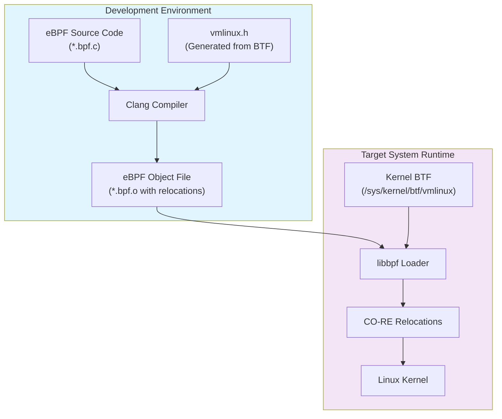
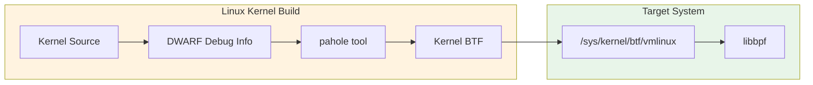
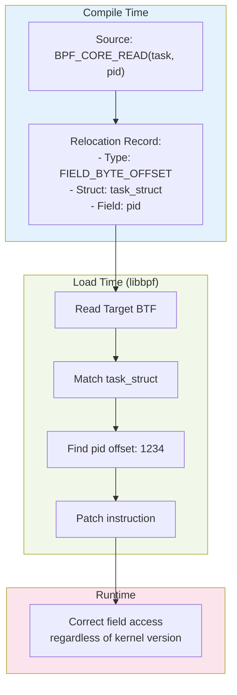

# How to Build Portable eBPF Programs with CO-RE

Author: [nawazdhandala](https://github.com/nawazdhandala)

Tags: eBPF, CO-RE, BTF, Linux, Portability, Programming

Description: A guide to using CO-RE (Compile Once - Run Everywhere) for portable eBPF programs across kernel versions.

---

## Introduction

eBPF (extended Berkeley Packet Filter) has revolutionized Linux observability, networking, and security. However, one of the biggest challenges developers face is making eBPF programs work across different kernel versions. Traditional eBPF programs often break when the kernel's internal data structures change between versions.

**CO-RE (Compile Once - Run Everywhere)** solves this problem by enabling eBPF programs to be compiled once and run on any kernel that supports BTF (BPF Type Format). This guide will walk you through everything you need to know to build truly portable eBPF programs.

## Understanding the Portability Problem

Before CO-RE, eBPF developers had two main approaches:

1. **BCC (BPF Compiler Collection)**: Compiles eBPF programs at runtime using kernel headers on the target system
2. **Pre-compiled programs**: Compile separate binaries for each target kernel version

Both approaches have significant drawbacks:

- BCC requires LLVM/Clang and kernel headers on every target machine
- Pre-compiled programs require maintaining multiple versions and knowing target kernels in advance

## CO-RE Architecture Overview

The following diagram illustrates how CO-RE enables portable eBPF programs:



## Key Components of CO-RE

### 1. BTF (BPF Type Format)

BTF is a compact metadata format that describes the types used in the kernel. It's essential for CO-RE because it provides:

- Complete type information for kernel structures
- Field offsets, sizes, and types
- Function signatures and parameters

The following diagram shows the BTF data flow:



### 2. vmlinux.h Generation

The `vmlinux.h` header file contains all kernel type definitions extracted from BTF. This single header replaces the need for kernel headers.

To generate vmlinux.h from your running kernel, use the bpftool utility:

```bash
# Generate vmlinux.h from the running kernel's BTF
bpftool btf dump file /sys/kernel/btf/vmlinux format c > vmlinux.h
```

You can also generate it from a specific kernel's BTF file for cross-compilation:

```bash
# Generate from a specific BTF file (useful for cross-compilation)
bpftool btf dump file /path/to/vmlinux format c > vmlinux.h

# Check if your kernel has BTF enabled
ls -la /sys/kernel/btf/vmlinux
```

### 3. CO-RE Helper Macros

libbpf provides essential macros for CO-RE. The following header shows the key macros you'll use:

```c
/* Essential CO-RE helper macros from libbpf */

/* BPF_CORE_READ - Safe field access with automatic relocation
 * This macro generates CO-RE relocations that libbpf resolves at load time
 * It handles pointer dereferencing safely in BPF context
 */
#define BPF_CORE_READ(src, field) \
    bpf_core_read(&dst, sizeof(dst), &(src)->field)

/* bpf_core_field_exists - Check if a field exists in the target kernel
 * Returns 1 if the field exists, 0 otherwise
 * Useful for conditional logic based on kernel version
 */
#define bpf_core_field_exists(field) \
    __builtin_preserve_field_info(field, BPF_FIELD_EXISTS)

/* bpf_core_field_size - Get the size of a field in the target kernel
 * Returns the actual size of the field on the running kernel
 */
#define bpf_core_field_size(field) \
    __builtin_preserve_field_info(field, BPF_FIELD_SIZE)

/* bpf_core_field_offset - Get the offset of a field
 * Returns the byte offset of the field within its structure
 */
#define bpf_core_field_offset(field) \
    __builtin_preserve_field_info(field, BPF_FIELD_OFFSET)
```

## Building Your First CO-RE Program

### Project Structure

A typical CO-RE project has this recommended directory structure:

```
my-ebpf-project/
├── src/
│   ├── vmlinux.h           # Generated kernel types
│   ├── program.bpf.c       # eBPF program (runs in kernel)
│   └── loader.c            # User-space loader program
├── include/
│   └── common.h            # Shared definitions
├── Makefile
└── README.md
```

### Step 1: Create the eBPF Program

This example program traces process execution by attaching to the execve system call. It demonstrates CO-RE field access for portable structure reading:

```c
/* program.bpf.c - eBPF program with CO-RE support
 *
 * This program traces process execution and demonstrates
 * portable field access across kernel versions.
 */

/* Include vmlinux.h FIRST - it provides all kernel type definitions
 * This replaces traditional kernel headers like <linux/sched.h>
 */
#include "vmlinux.h"

/* libbpf helpers provide CO-RE macros and BPF helper definitions */
#include <bpf/bpf_helpers.h>
#include <bpf/bpf_tracing.h>
#include <bpf/bpf_core_read.h>

/* Define the structure for events we'll send to user-space
 * This structure is shared between kernel and user-space code
 */
struct event {
    __u32 pid;           /* Process ID */
    __u32 ppid;          /* Parent process ID */
    __u32 uid;           /* User ID */
    char comm[16];       /* Command name (process name) */
    char filename[256];  /* Executed filename */
};

/* Ring buffer map for sending events to user-space
 * Ring buffers are more efficient than perf buffers for high-throughput
 */
struct {
    __uint(type, BPF_MAP_TYPE_RINGBUF);
    __uint(max_entries, 256 * 1024);  /* 256 KB buffer */
} events SEC(".maps");

/* Tracepoint for sched_process_exec - fired when a process calls execve
 *
 * SEC() macro defines the ELF section name, which tells libbpf
 * where to attach this program
 */
SEC("tp/sched/sched_process_exec")
int handle_exec(struct trace_event_raw_sched_process_exec *ctx)
{
    struct event *e;
    struct task_struct *task;

    /* Reserve space in the ring buffer for our event
     * This is more efficient than stack allocation for large structs
     */
    e = bpf_ringbuf_reserve(&events, sizeof(*e), 0);
    if (!e) {
        return 0;  /* Buffer full, drop this event */
    }

    /* Get the current task_struct pointer
     * bpf_get_current_task() returns the current process context
     */
    task = (struct task_struct *)bpf_get_current_task();

    /* BPF_CORE_READ safely reads fields from kernel structures
     * It generates CO-RE relocations that adapt to different kernel versions
     *
     * Reading PID: task->tgid (thread group ID = process ID in Linux)
     */
    e->pid = BPF_CORE_READ(task, tgid);

    /* Reading parent PID requires traversing the parent pointer first
     * BPF_CORE_READ handles the pointer chain: task->real_parent->tgid
     */
    e->ppid = BPF_CORE_READ(task, real_parent, tgid);

    /* Reading UID from credentials structure
     * The cred pointer contains security credentials
     * We access: task->cred->uid.val
     */
    e->uid = BPF_CORE_READ(task, cred, uid.val);

    /* Get the command name (process name)
     * bpf_get_current_comm is a helper that safely copies the comm field
     */
    bpf_get_current_comm(&e->comm, sizeof(e->comm));

    /* Read the filename from the tracepoint context
     * ctx->__data_loc_filename contains the offset to the filename string
     * We use bpf_probe_read_str for safe string reading
     */
    unsigned int fname_off = ctx->__data_loc_filename & 0xFFFF;
    bpf_probe_read_str(&e->filename, sizeof(e->filename),
                       (void *)ctx + fname_off);

    /* Submit the event to user-space
     * This makes the reserved buffer space available for reading
     */
    bpf_ringbuf_submit(e, 0);

    return 0;
}

/* License declaration is REQUIRED for eBPF programs
 * GPL license is needed to use certain BPF helper functions
 */
char LICENSE[] SEC("license") = "GPL";
```

### Step 2: Create the User-Space Loader

The loader program opens the compiled eBPF object, loads it into the kernel, and processes events from the ring buffer:

```c
/* loader.c - User-space program to load and interact with eBPF
 *
 * This program demonstrates the libbpf skeleton approach
 * for loading CO-RE eBPF programs.
 */

#include <stdio.h>
#include <stdlib.h>
#include <string.h>
#include <errno.h>
#include <signal.h>
#include <unistd.h>
#include <sys/resource.h>

/* libbpf headers for BPF operations */
#include <bpf/libbpf.h>
#include <bpf/bpf.h>

/* Include the auto-generated skeleton header
 * This is created by bpftool from the compiled .bpf.o file
 */
#include "program.skel.h"

/* Shared event structure definition
 * Must match the structure defined in the eBPF program
 */
struct event {
    __u32 pid;
    __u32 ppid;
    __u32 uid;
    char comm[16];
    char filename[256];
};

/* Global flag for graceful shutdown on SIGINT/SIGTERM */
static volatile bool exiting = false;

/* Signal handler for clean termination */
static void sig_handler(int sig)
{
    exiting = true;
}

/* Callback function for processing ring buffer events
 *
 * Parameters:
 *   ctx  - User-provided context (unused here)
 *   data - Pointer to the event data from eBPF
 *   size - Size of the event data
 *
 * Returns: 0 to continue processing, non-zero to stop
 */
static int handle_event(void *ctx, void *data, size_t size)
{
    const struct event *e = data;

    /* Print event information in a structured format */
    printf("%-8d %-8d %-8d %-16s %s\n",
           e->pid, e->ppid, e->uid, e->comm, e->filename);

    return 0;
}

/* libbpf logging callback for debugging
 * Set LIBBPF_DEBUG environment variable to enable verbose output
 */
static int libbpf_print_fn(enum libbpf_print_level level,
                           const char *format, va_list args)
{
    /* Only print warnings and errors by default */
    if (level == LIBBPF_DEBUG)
        return 0;
    return vfprintf(stderr, format, args);
}

int main(int argc, char **argv)
{
    struct program_bpf *skel;
    struct ring_buffer *rb = NULL;
    int err;

    /* Set up libbpf logging */
    libbpf_set_print(libbpf_print_fn);

    /* Install signal handlers for graceful shutdown */
    signal(SIGINT, sig_handler);
    signal(SIGTERM, sig_handler);

    /* Step 1: Open the BPF skeleton
     * This parses the ELF file and prepares BPF objects
     * No kernel interaction happens yet
     */
    skel = program_bpf__open();
    if (!skel) {
        fprintf(stderr, "Failed to open BPF skeleton\n");
        return 1;
    }

    /* Step 2: Load the BPF program into the kernel
     * This is where CO-RE relocations are applied!
     * libbpf reads /sys/kernel/btf/vmlinux and adjusts field offsets
     */
    err = program_bpf__load(skel);
    if (err) {
        fprintf(stderr, "Failed to load BPF skeleton: %d\n", err);
        goto cleanup;
    }

    /* Step 3: Attach the BPF program to its hook point
     * For tracepoints, this enables the program to receive events
     */
    err = program_bpf__attach(skel);
    if (err) {
        fprintf(stderr, "Failed to attach BPF skeleton: %d\n", err);
        goto cleanup;
    }

    /* Step 4: Set up ring buffer polling
     * We pass our callback function that processes each event
     */
    rb = ring_buffer__new(bpf_map__fd(skel->maps.events),
                          handle_event, NULL, NULL);
    if (!rb) {
        err = -1;
        fprintf(stderr, "Failed to create ring buffer\n");
        goto cleanup;
    }

    /* Print header for output */
    printf("%-8s %-8s %-8s %-16s %s\n",
           "PID", "PPID", "UID", "COMM", "FILENAME");

    /* Main event loop - poll for events until signaled to exit */
    while (!exiting) {
        /* Poll with 100ms timeout
         * Returns number of events processed, or negative on error
         */
        err = ring_buffer__poll(rb, 100);
        if (err == -EINTR) {
            /* Interrupted by signal, check if we should exit */
            err = 0;
            break;
        }
        if (err < 0) {
            fprintf(stderr, "Error polling ring buffer: %d\n", err);
            break;
        }
    }

cleanup:
    /* Clean up resources in reverse order of creation */
    ring_buffer__free(rb);
    program_bpf__destroy(skel);

    return err < 0 ? 1 : 0;
}
```

### Step 3: Create the Makefile

This Makefile handles vmlinux.h generation, eBPF compilation, skeleton generation, and user-space compilation:

```makefile
# Makefile for CO-RE eBPF project
#
# This Makefile handles the complete build process:
# 1. Generate vmlinux.h from kernel BTF
# 2. Compile eBPF program with clang
# 3. Generate BPF skeleton header
# 4. Compile user-space loader

# Compiler settings
CLANG ?= clang
LLC ?= llc
BPFTOOL ?= bpftool

# Architecture detection for BPF target
ARCH := $(shell uname -m | sed 's/x86_64/x86/' | sed 's/aarch64/arm64/')

# Compiler flags for eBPF programs
# -target bpf: Generate BPF bytecode
# -D__TARGET_ARCH_*: Define architecture for vmlinux.h
# -g: Include debug info (required for CO-RE)
# -O2: Optimization level (required for BPF)
BPF_CFLAGS := -target bpf \
              -D__TARGET_ARCH_$(ARCH) \
              -g -O2 \
              -Wall -Werror

# Include paths
INCLUDES := -I./src -I./include -I/usr/include

# User-space compiler flags
CFLAGS := -g -Wall -O2
LDFLAGS := -lbpf -lelf -lz

# Source files
BPF_SRC := src/program.bpf.c
BPF_OBJ := src/program.bpf.o
SKEL_H := src/program.skel.h
LOADER_SRC := src/loader.c
LOADER_BIN := loader

# Default target
all: $(LOADER_BIN)

# Step 1: Generate vmlinux.h from running kernel's BTF
# This extracts all kernel type definitions into a single header
src/vmlinux.h:
	@echo "Generating vmlinux.h from kernel BTF..."
	$(BPFTOOL) btf dump file /sys/kernel/btf/vmlinux format c > $@

# Step 2: Compile eBPF program
# Note: We depend on vmlinux.h being generated first
$(BPF_OBJ): $(BPF_SRC) src/vmlinux.h
	@echo "Compiling eBPF program..."
	$(CLANG) $(BPF_CFLAGS) $(INCLUDES) -c $< -o $@

# Step 3: Generate BPF skeleton header
# The skeleton provides type-safe access to maps and programs
$(SKEL_H): $(BPF_OBJ)
	@echo "Generating BPF skeleton..."
	$(BPFTOOL) gen skeleton $< > $@

# Step 4: Compile user-space loader
# Depends on skeleton header for type definitions
$(LOADER_BIN): $(LOADER_SRC) $(SKEL_H)
	@echo "Compiling user-space loader..."
	$(CLANG) $(CFLAGS) $(INCLUDES) $< -o $@ $(LDFLAGS)

# Clean build artifacts
clean:
	rm -f $(BPF_OBJ) $(SKEL_H) $(LOADER_BIN)
	rm -f src/vmlinux.h

# Remove all generated files including vmlinux.h
distclean: clean
	rm -f src/vmlinux.h

# Install to system path
install: $(LOADER_BIN)
	install -m 755 $(LOADER_BIN) /usr/local/bin/

.PHONY: all clean distclean install
```

## Field Access Relocations Deep Dive

CO-RE relocations are the magic that makes portability work. Let's understand the different types:

### Relocation Types

The following diagram shows the CO-RE relocation process:



### Understanding CO-RE Relocation Types

This example demonstrates different CO-RE relocation types and how they adapt to kernel changes:

```c
/* Understanding CO-RE Relocation Types
 *
 * CO-RE supports several relocation types that handle different
 * aspects of structure field access.
 */

#include "vmlinux.h"
#include <bpf/bpf_helpers.h>
#include <bpf/bpf_core_read.h>

SEC("kprobe/do_sys_open")
int trace_open(struct pt_regs *ctx)
{
    struct task_struct *task;
    task = (struct task_struct *)bpf_get_current_task();

    /*
     * FIELD_BYTE_OFFSET relocation
     *
     * This is the most common relocation type. It records:
     * - The structure type (task_struct)
     * - The field name (pid)
     * - The expected offset at compile time
     *
     * At load time, libbpf looks up the actual offset in the
     * target kernel's BTF and patches the instruction.
     */
    __u32 pid = BPF_CORE_READ(task, pid);

    /*
     * FIELD_EXISTS relocation
     *
     * Checks if a field exists in the target kernel.
     * This is crucial for handling fields that were added
     * or removed between kernel versions.
     *
     * Example: The 'loginuid' field might not exist in all kernels
     */
    if (bpf_core_field_exists(task->loginuid)) {
        /* Field exists, safe to access */
        __u32 loginuid = BPF_CORE_READ(task, loginuid.val);
        bpf_printk("loginuid: %d\n", loginuid);
    }

    /*
     * FIELD_SIZE relocation
     *
     * Returns the size of a field in the target kernel.
     * Useful when field sizes might vary (e.g., when a field
     * type changes from u32 to u64 between versions).
     */
    __u32 comm_size = bpf_core_field_size(task->comm);
    bpf_printk("comm field size: %d\n", comm_size);

    /*
     * TYPE_EXISTS relocation
     *
     * Checks if a type exists in the target kernel.
     * Useful for conditional compilation based on kernel features.
     */
    if (bpf_core_type_exists(struct bpf_sock_ops)) {
        bpf_printk("bpf_sock_ops type is available\n");
    }

    /*
     * TYPE_SIZE relocation
     *
     * Returns the total size of a structure type.
     * Useful when allocating memory or calculating offsets.
     */
    __u32 task_size = bpf_core_type_size(struct task_struct);
    bpf_printk("task_struct size: %d bytes\n", task_size);

    return 0;
}

char LICENSE[] SEC("license") = "GPL";
```

### Handling Renamed Fields

Sometimes kernel developers rename fields between versions. CO-RE provides a mechanism to handle this using field aliases:

```c
/* Handling renamed fields with CO-RE
 *
 * Sometimes kernel structures change field names between versions.
 * CO-RE's __builtin_preserve_access_index() and field matching
 * can handle these cases.
 */

#include "vmlinux.h"
#include <bpf/bpf_helpers.h>
#include <bpf/bpf_core_read.h>

/*
 * Define a local type that matches the kernel structure
 * but with the field name we want to use.
 *
 * Example: In some kernels, task_struct uses 'state',
 * while newer kernels use '__state' for the process state.
 */

/* Older kernel version structure */
struct task_struct___old {
    long state;        /* Named 'state' in older kernels */
} __attribute__((preserve_access_index));

/* Newer kernel version structure */
struct task_struct___new {
    long __state;      /* Renamed to '__state' in newer kernels */
} __attribute__((preserve_access_index));

SEC("kprobe/finish_task_switch")
int trace_context_switch(struct pt_regs *ctx)
{
    struct task_struct *task;
    long state;

    task = (struct task_struct *)bpf_get_current_task();

    /*
     * Use bpf_core_field_exists to check which field name
     * is present in the target kernel, then read accordingly.
     *
     * This pattern allows a single binary to work on both
     * old and new kernels.
     */
    if (bpf_core_field_exists(((struct task_struct___new *)0)->__state)) {
        /* Newer kernel: use __state */
        state = BPF_CORE_READ((struct task_struct___new *)task, __state);
    } else {
        /* Older kernel: use state */
        state = BPF_CORE_READ((struct task_struct___old *)task, state);
    }

    bpf_printk("Process state: %ld\n", state);

    return 0;
}

char LICENSE[] SEC("license") = "GPL";
```

## Advanced CO-RE Patterns

### Pattern 1: Flexible Structure Reading

This pattern handles structures that vary significantly between kernel versions:

```c
/* Advanced CO-RE Pattern: Flexible Structure Reading
 *
 * This pattern demonstrates how to handle structures that
 * may have different layouts or nested structures across
 * kernel versions.
 */

#include "vmlinux.h"
#include <bpf/bpf_helpers.h>
#include <bpf/bpf_core_read.h>

/*
 * Reading network socket information is complex because
 * the socket structure hierarchy changes between kernels.
 *
 * This helper function demonstrates safe socket reading
 * that works across kernel versions.
 */
static __always_inline int get_socket_info(struct sock *sk,
                                           __u32 *saddr,
                                           __u32 *daddr,
                                           __u16 *sport,
                                           __u16 *dport)
{
    /*
     * The socket common fields are usually in sk_common.
     * We use BPF_CORE_READ to safely traverse the structure.
     */

    /* Read source and destination addresses */
    *saddr = BPF_CORE_READ(sk, __sk_common.skc_rcv_saddr);
    *daddr = BPF_CORE_READ(sk, __sk_common.skc_daddr);

    /* Read ports - note they're stored in network byte order */
    *sport = BPF_CORE_READ(sk, __sk_common.skc_num);
    *dport = BPF_CORE_READ(sk, __sk_common.skc_dport);

    return 0;
}

/*
 * Reading from file structures requires handling the
 * f_path -> dentry -> d_name chain, which can vary.
 */
static __always_inline int get_file_name(struct file *file,
                                         char *buf,
                                         size_t buf_len)
{
    struct dentry *dentry;
    struct qstr dname;

    /*
     * Traverse the file -> path -> dentry -> name chain
     * Each BPF_CORE_READ generates a separate relocation
     */
    dentry = BPF_CORE_READ(file, f_path.dentry);

    /* Read the entire qstr structure */
    dname = BPF_CORE_READ(dentry, d_name);

    /* Safely copy the name string */
    bpf_probe_read_kernel_str(buf, buf_len, dname.name);

    return 0;
}

SEC("kprobe/tcp_connect")
int trace_tcp_connect(struct pt_regs *ctx)
{
    struct sock *sk = (struct sock *)PT_REGS_PARM1(ctx);
    __u32 saddr, daddr;
    __u16 sport, dport;

    get_socket_info(sk, &saddr, &daddr, &sport, &dport);

    bpf_printk("TCP connect: %pI4:%d -> %pI4:%d\n",
               &saddr, sport, &daddr, __builtin_bswap16(dport));

    return 0;
}

char LICENSE[] SEC("license") = "GPL";
```

### Pattern 2: Feature Detection at Runtime

This pattern uses CO-RE to detect kernel features and adapt behavior:

```c
/* CO-RE Pattern: Runtime Feature Detection
 *
 * Use CO-RE to detect kernel features and capabilities
 * at load time, enabling graceful degradation or
 * feature adaptation.
 */

#include "vmlinux.h"
#include <bpf/bpf_helpers.h>
#include <bpf/bpf_core_read.h>

/* Global variables that get set based on kernel capabilities */
const volatile bool has_ringbuf_support = false;
const volatile bool has_cgroup_v2 = false;
const volatile __u32 kernel_version = 0;

/*
 * Feature flags map - stores detected capabilities
 * User-space can read this to understand what features
 * are available in the loaded program.
 */
struct {
    __uint(type, BPF_MAP_TYPE_ARRAY);
    __uint(max_entries, 16);
    __type(key, __u32);
    __type(value, __u32);
} feature_flags SEC(".maps");

/*
 * Initialization program that runs once at startup
 * to detect kernel features using CO-RE.
 */
SEC("tracepoint/raw_syscalls/sys_enter")
int detect_features(void *ctx)
{
    __u32 key, value;

    /*
     * Check for cgroup v2 support by testing if
     * the cgroup_bpf type exists.
     */
    key = 0;  /* Feature index for cgroup v2 */
    value = bpf_core_type_exists(struct cgroup_bpf) ? 1 : 0;
    bpf_map_update_elem(&feature_flags, &key, &value, BPF_ANY);

    /*
     * Check for specific map types by checking
     * if related types exist.
     */
    key = 1;  /* Feature index for task storage */
    value = bpf_core_type_exists(struct bpf_local_storage_map) ? 1 : 0;
    bpf_map_update_elem(&feature_flags, &key, &value, BPF_ANY);

    /*
     * Check for BTF-enabled raw tracepoints
     */
    key = 2;  /* Feature index for BTF tracepoints */
    value = bpf_core_type_exists(struct btf_type) ? 1 : 0;
    bpf_map_update_elem(&feature_flags, &key, &value, BPF_ANY);

    /*
     * Detect specific kernel structure changes
     * Example: Check if task_struct has io_context member
     */
    key = 3;  /* Feature index for IO context */
    value = bpf_core_field_exists(struct task_struct, io_context) ? 1 : 0;
    bpf_map_update_elem(&feature_flags, &key, &value, BPF_ANY);

    return 0;
}

char LICENSE[] SEC("license") = "GPL";
```

## Compatibility Testing

### Testing Across Kernel Versions

Testing your CO-RE programs across multiple kernel versions is essential. Use this systematic approach:

```bash
#!/bin/bash
# test_compatibility.sh
#
# Test CO-RE eBPF program across multiple kernel versions
# using Docker containers with different kernel versions.

set -e

# Define kernel versions to test
# These should cover major kernel versions your users might have
KERNELS=(
    "5.4"   # Ubuntu 20.04 LTS
    "5.10"  # Debian 11
    "5.15"  # Ubuntu 22.04 LTS
    "6.1"   # Debian 12
    "6.5"   # Ubuntu 23.10
    "6.8"   # Latest stable
)

# Build the eBPF program once (that's the point of CO-RE!)
echo "Building CO-RE eBPF program..."
make clean && make

# Run verification using bpftool
echo "Verifying BPF object file..."
bpftool btf dump file src/program.bpf.o

# Check for CO-RE relocations in the object file
echo "Checking CO-RE relocations..."
llvm-readelf -r src/program.bpf.o | grep -i "reloc"

# For each kernel version, we use a container to test loading
# Note: This requires appropriate Docker images with BTF support
for kernel in "${KERNELS[@]}"; do
    echo "======================================"
    echo "Testing on kernel $kernel"
    echo "======================================"

    # Use a container with the specific kernel's BTF
    # In practice, you'd have pre-built images for this
    docker run --rm \
        --privileged \
        -v $(pwd):/work \
        -w /work \
        "btf-test-kernel:$kernel" \
        ./test_load.sh

    echo "Kernel $kernel: PASSED"
done

echo "All compatibility tests passed!"
```

### Validating CO-RE Relocations

Use this helper script to validate that relocations are properly generated:

```bash
#!/bin/bash
# validate_relocations.sh
#
# Validate that CO-RE relocations are correctly embedded
# in the compiled eBPF object file.

BPF_OBJ="${1:-src/program.bpf.o}"

echo "Analyzing CO-RE relocations in: $BPF_OBJ"
echo "=============================================="

# Check if the object file exists
if [[ ! -f "$BPF_OBJ" ]]; then
    echo "ERROR: Object file not found: $BPF_OBJ"
    exit 1
fi

# Dump BTF information
echo ""
echo "1. BTF Type Information:"
echo "------------------------"
bpftool btf dump file "$BPF_OBJ" | head -50

# Show ELF sections (should include .BTF and .BTF.ext)
echo ""
echo "2. ELF Sections:"
echo "----------------"
llvm-readelf -S "$BPF_OBJ" | grep -E "(BTF|\.text|\.maps)"

# Check for relocation sections
echo ""
echo "3. Relocation Sections:"
echo "-----------------------"
llvm-readelf -r "$BPF_OBJ" 2>/dev/null || echo "No relocations found"

# Detailed BTF.ext dump showing CO-RE relocations
echo ""
echo "4. CO-RE Relocation Details:"
echo "----------------------------"
bpftool btf dump file "$BPF_OBJ" format raw | \
    grep -A5 "CORE_RELOC" || echo "Use newer bpftool for detailed output"

# Verify the program can be loaded (dry-run)
echo ""
echo "5. Load Verification (dry-run):"
echo "--------------------------------"
if bpftool prog load "$BPF_OBJ" /sys/fs/bpf/test_prog 2>&1; then
    echo "SUCCESS: Program loaded successfully"
    rm -f /sys/fs/bpf/test_prog
else
    echo "Note: Load test requires root and compatible kernel"
fi

echo ""
echo "Validation complete!"
```

### Unit Testing with BTF Compatibility

This test suite verifies CO-RE functionality programmatically:

```c
/* test_core.c - Unit tests for CO-RE functionality
 *
 * These tests verify that CO-RE relocations work correctly
 * and that the program can adapt to different kernel structures.
 */

#include <stdio.h>
#include <stdlib.h>
#include <string.h>
#include <errno.h>
#include <assert.h>

#include <bpf/libbpf.h>
#include <bpf/btf.h>

/* Test result tracking */
static int tests_passed = 0;
static int tests_failed = 0;

#define TEST_ASSERT(cond, msg) do { \
    if (!(cond)) { \
        fprintf(stderr, "FAIL: %s\n", msg); \
        tests_failed++; \
        return -1; \
    } else { \
        printf("PASS: %s\n", msg); \
        tests_passed++; \
    } \
} while(0)

/*
 * Test 1: Verify kernel has BTF support
 *
 * BTF must be available for CO-RE to work. This test
 * checks if /sys/kernel/btf/vmlinux exists and is readable.
 */
static int test_kernel_btf_support(void)
{
    struct btf *btf;

    /* Try to load kernel BTF */
    btf = btf__load_vmlinux_btf();
    TEST_ASSERT(btf != NULL, "Kernel BTF is available");

    /* Verify basic type lookup works */
    int task_struct_id = btf__find_by_name(btf, "task_struct");
    TEST_ASSERT(task_struct_id > 0, "task_struct type found in BTF");

    btf__free(btf);
    return 0;
}

/*
 * Test 2: Verify BPF object has CO-RE relocations
 *
 * The compiled BPF object should contain BTF and BTF.ext
 * sections with CO-RE relocation information.
 */
static int test_object_has_relocations(const char *obj_path)
{
    struct bpf_object *obj;
    int err;

    /* Open BPF object without loading */
    obj = bpf_object__open(obj_path);
    TEST_ASSERT(obj != NULL, "BPF object file opened successfully");

    /* Check if BTF is present */
    const struct btf *btf = bpf_object__btf(obj);
    TEST_ASSERT(btf != NULL, "BPF object contains BTF");

    /* Verify the object has programs */
    struct bpf_program *prog;
    int prog_count = 0;
    bpf_object__for_each_program(prog, obj) {
        prog_count++;
    }
    TEST_ASSERT(prog_count > 0, "BPF object contains programs");

    bpf_object__close(obj);
    return 0;
}

/*
 * Test 3: Verify CO-RE loading with relocations
 *
 * This test actually loads the BPF program, which triggers
 * CO-RE relocation processing.
 */
static int test_core_loading(const char *obj_path)
{
    struct bpf_object *obj;
    int err;

    /* Open BPF object */
    obj = bpf_object__open(obj_path);
    TEST_ASSERT(obj != NULL, "BPF object opened for loading");

    /* Load triggers CO-RE relocations */
    err = bpf_object__load(obj);

    /*
     * Note: Loading may fail due to permissions or missing
     * attach points. We primarily care that relocation
     * processing succeeded.
     */
    if (err == 0) {
        TEST_ASSERT(1, "BPF object loaded with CO-RE relocations");
    } else {
        /* Check if failure was due to relocations or other reasons */
        fprintf(stderr, "Note: Load failed (err=%d), may need root\n", err);
    }

    bpf_object__close(obj);
    return 0;
}

/*
 * Test 4: Verify specific type relocations
 *
 * Check that relocations for known types are resolvable.
 */
static int test_type_relocations(void)
{
    struct btf *btf;

    btf = btf__load_vmlinux_btf();
    TEST_ASSERT(btf != NULL, "Kernel BTF loaded for type test");

    /* Check common types used in CO-RE programs */
    const char *required_types[] = {
        "task_struct",
        "file",
        "sock",
        "sk_buff",
        "pt_regs",
        NULL
    };

    for (int i = 0; required_types[i]; i++) {
        int id = btf__find_by_name(btf, required_types[i]);
        char msg[256];
        snprintf(msg, sizeof(msg), "Type '%s' found in kernel BTF",
                 required_types[i]);
        TEST_ASSERT(id > 0, msg);
    }

    btf__free(btf);
    return 0;
}

int main(int argc, char **argv)
{
    const char *obj_path = "src/program.bpf.o";

    if (argc > 1) {
        obj_path = argv[1];
    }

    printf("CO-RE Compatibility Test Suite\n");
    printf("==============================\n");
    printf("Testing object: %s\n\n", obj_path);

    /* Run all tests */
    test_kernel_btf_support();
    test_object_has_relocations(obj_path);
    test_core_loading(obj_path);
    test_type_relocations();

    /* Print summary */
    printf("\n==============================\n");
    printf("Tests passed: %d\n", tests_passed);
    printf("Tests failed: %d\n", tests_failed);
    printf("==============================\n");

    return tests_failed > 0 ? 1 : 0;
}
```

## Best Practices

### 1. Always Use BPF_CORE_READ

Never access kernel structure fields directly. Always use CO-RE helpers:

```c
/* WRONG: Direct field access - NOT portable! */
__u32 pid = task->pid;

/* CORRECT: CO-RE field access - portable across kernel versions */
__u32 pid = BPF_CORE_READ(task, pid);
```

### 2. Check Field Existence Before Access

Always verify fields exist before accessing them:

```c
/* Check before accessing optional or version-specific fields */
if (bpf_core_field_exists(task->some_optional_field)) {
    value = BPF_CORE_READ(task, some_optional_field);
} else {
    /* Use fallback or default value */
    value = 0;
}
```

### 3. Use Preserve Access Index Attribute

Define local structure copies with the preserve_access_index attribute for custom type handling:

```c
/* Define local types that preserve field access semantics */
struct my_task_subset {
    __u32 pid;
    __u32 tgid;
    char comm[16];
} __attribute__((preserve_access_index));
```

### 4. Generate vmlinux.h from Target Kernel Range

For maximum compatibility, generate vmlinux.h from the oldest supported kernel:

```bash
# Generate from the oldest kernel you want to support
# This ensures all field names match older kernels
bpftool btf dump file /path/to/old-kernel-btf format c > vmlinux.h
```

### 5. Handle Enum Value Changes

Kernel enum values can change between versions. Use CO-RE enum relocations:

```c
/* Use enum value relocation for portable enum handling */
__u32 state = bpf_core_enum_value(enum task_state, TASK_RUNNING);
```

## Troubleshooting Common Issues

### Issue: "Unknown relocation" Error

If you see this error when loading your program, it usually means the target kernel's BTF doesn't contain the required type. Verify your kernel has BTF support:

```bash
# Verify BTF support on the target system
ls -la /sys/kernel/btf/vmlinux

# If missing, your kernel may need CONFIG_DEBUG_INFO_BTF=y
```

### Issue: Field Offset Mismatch

If field accesses return wrong values, the field might have moved. Use bpftool to inspect the actual layout on the target:

```bash
# Dump structure layout from running kernel
bpftool btf dump file /sys/kernel/btf/vmlinux | grep -A20 "task_struct"
```

### Issue: Type Not Found

If a type doesn't exist on the target kernel, use type existence checks and provide fallback behavior:

```c
/* Handle missing types gracefully */
if (bpf_core_type_exists(struct new_kernel_type)) {
    /* Use new type */
} else {
    /* Fallback for older kernels */
}
```

## Complete Build and Run Example

Here's a complete workflow from source to running program:

```bash
#!/bin/bash
# complete_workflow.sh - Full CO-RE build and run example

set -e

echo "Step 1: Check Prerequisites"
echo "==========================="
command -v clang >/dev/null || { echo "clang not found"; exit 1; }
command -v bpftool >/dev/null || { echo "bpftool not found"; exit 1; }
ls /sys/kernel/btf/vmlinux >/dev/null || { echo "Kernel BTF not found"; exit 1; }

echo "Step 2: Generate vmlinux.h"
echo "=========================="
bpftool btf dump file /sys/kernel/btf/vmlinux format c > src/vmlinux.h
echo "Generated $(wc -l < src/vmlinux.h) lines of type definitions"

echo "Step 3: Compile eBPF Program"
echo "============================"
clang -target bpf -D__TARGET_ARCH_x86 -g -O2 \
    -I./src -I./include \
    -c src/program.bpf.c -o src/program.bpf.o
echo "Compiled eBPF program: $(ls -lh src/program.bpf.o | awk '{print $5}')"

echo "Step 4: Verify CO-RE Relocations"
echo "================================="
bpftool btf dump file src/program.bpf.o | head -20

echo "Step 5: Generate Skeleton"
echo "========================="
bpftool gen skeleton src/program.bpf.o > src/program.skel.h
echo "Generated skeleton header"

echo "Step 6: Compile Loader"
echo "======================"
clang -g -Wall -O2 \
    -I./src -I./include \
    src/loader.c -o loader \
    -lbpf -lelf -lz
echo "Compiled loader: $(ls -lh loader | awk '{print $5}')"

echo "Step 7: Run (requires root)"
echo "==========================="
echo "Execute: sudo ./loader"
echo ""
echo "Build complete! Your CO-RE eBPF program is ready."
```

## Conclusion

CO-RE transforms eBPF development by eliminating the portability problem that has long plagued eBPF programs. By leveraging BTF and libbpf's relocation capabilities, you can:

- Write eBPF programs once and run them on any BTF-enabled kernel
- Eliminate the need for runtime compilation
- Reduce deployment complexity significantly
- Focus on program logic instead of version-specific workarounds

Key takeaways:

1. **Generate vmlinux.h** from your target kernel's BTF
2. **Use BPF_CORE_READ** for all structure field accesses
3. **Check field existence** for version-specific fields
4. **Test across multiple kernel versions** before deployment
5. **Handle missing types gracefully** with fallback logic

With CO-RE, the promise of "Compile Once - Run Everywhere" for eBPF is finally realized, making it practical to deploy sophisticated observability and security tools across diverse Linux environments.

## References

- [libbpf Documentation](https://libbpf.readthedocs.io/)
- [BPF CO-RE Reference Guide](https://nakryiko.com/posts/bpf-core-reference-guide/)
- [BTF Deduplication](https://nakryiko.com/posts/btf-dedup/)
- [Linux Kernel BPF Documentation](https://www.kernel.org/doc/html/latest/bpf/)
- [bpftool Manual](https://man7.org/linux/man-pages/man8/bpftool.8.html)
