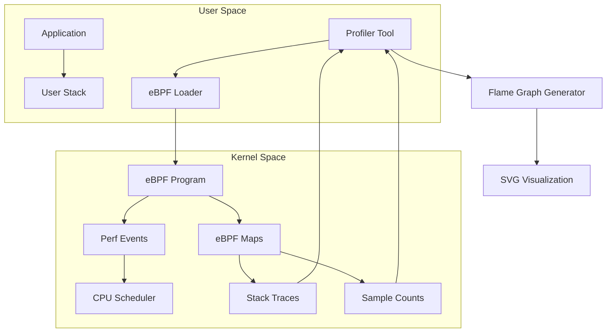
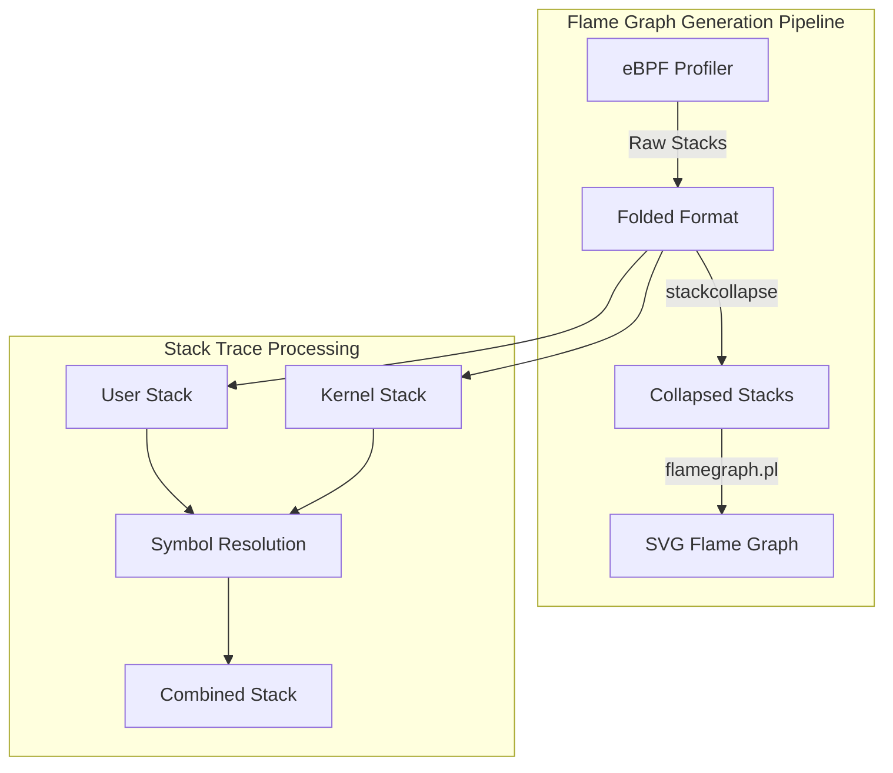
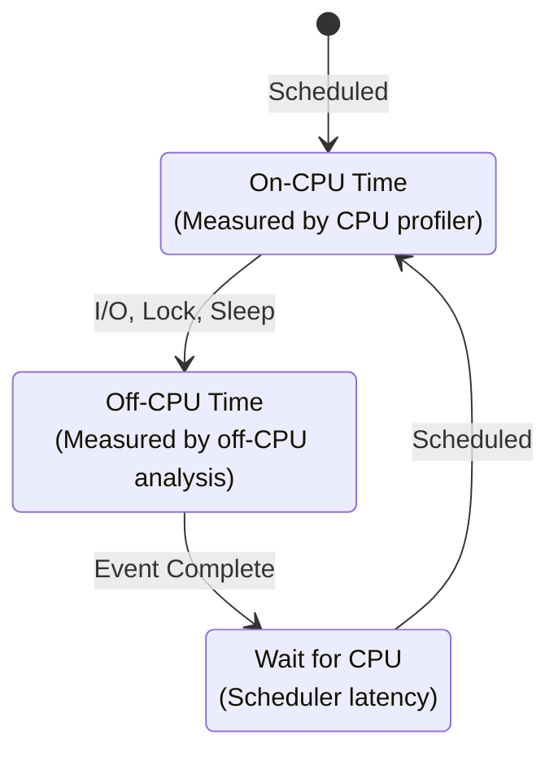
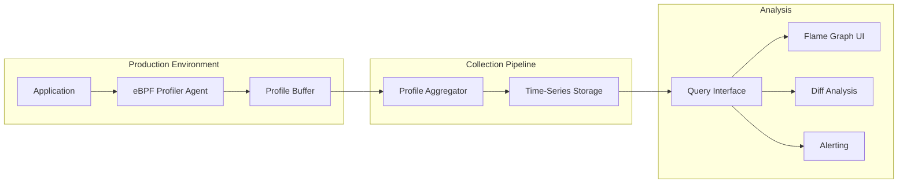

# How to Profile CPU Performance with eBPF

Author: [nawazdhandala](https://github.com/nawazdhandala)

Tags: eBPF, CPU, Profiling, Performance, Linux, Flamegraph

Description: A guide to using eBPF for CPU profiling and generating flame graphs for performance analysis.

---

CPU profiling is essential for understanding where your application spends its time. Traditional profiling tools often introduce significant overhead, but eBPF (extended Berkeley Packet Filter) provides a revolutionary approach to CPU profiling with minimal performance impact. In this comprehensive guide, we will explore how to use eBPF for CPU profiling, generate flame graphs, perform off-CPU analysis, and set up continuous profiling.

## Table of Contents

1. [Understanding eBPF CPU Profiling](#understanding-ebpf-cpu-profiling)
2. [Prerequisites and Setup](#prerequisites-and-setup)
3. [CPU Sampling with eBPF](#cpu-sampling-with-ebpf)
4. [Generating Flame Graphs](#generating-flame-graphs)
5. [Off-CPU Analysis](#off-cpu-analysis)
6. [Continuous Profiling Setup](#continuous-profiling-setup)
7. [Best Practices and Troubleshooting](#best-practices-and-troubleshooting)

## Understanding eBPF CPU Profiling

eBPF allows you to run sandboxed programs in the Linux kernel without changing kernel source code or loading kernel modules. For CPU profiling, eBPF programs attach to perf events and collect stack traces with minimal overhead.



### Why eBPF for CPU Profiling?

Traditional profilers like `perf` or instrumentation-based profilers have their limitations:

- **perf**: Requires post-processing and can generate large data files
- **Instrumentation**: Modifies code and introduces overhead
- **Sampling profilers**: May miss short-lived functions

eBPF profiling offers several advantages:

- **Low overhead**: Typically less than 1% CPU overhead
- **Real-time aggregation**: Stack traces are aggregated in-kernel
- **No code modification**: Works with any application
- **Safe**: eBPF programs are verified before execution

## Prerequisites and Setup

Before diving into eBPF CPU profiling, ensure your system meets the requirements.

### System Requirements

The following commands check your kernel version and eBPF support. eBPF profiling requires Linux kernel 4.9 or later, with kernel 5.x recommended for full features.

```bash
# Check kernel version - should be 4.9+ for basic eBPF, 5.x+ recommended
uname -r

# Verify eBPF support in your kernel
cat /boot/config-$(uname -r) | grep BPF

# Expected output should include:
# CONFIG_BPF=y
# CONFIG_BPF_SYSCALL=y
# CONFIG_BPF_JIT=y
```

### Installing BCC Tools

BCC (BPF Compiler Collection) provides a toolkit for creating eBPF programs. The following commands install BCC on various Linux distributions.

```bash
# Ubuntu/Debian - install the full BCC toolkit including Python bindings
sudo apt-get update
sudo apt-get install -y bpfcc-tools linux-headers-$(uname -r) python3-bpfcc

# RHEL/CentOS/Fedora - use dnf for modern package management
sudo dnf install -y bcc-tools bcc-devel kernel-devel

# Arch Linux - available in the community repository
sudo pacman -S bcc bcc-tools python-bcc
```

### Installing bpftrace

bpftrace is a high-level tracing language for eBPF. It simplifies writing eBPF programs for quick profiling tasks.

```bash
# Ubuntu/Debian - bpftrace provides a simpler syntax for eBPF programs
sudo apt-get install -y bpftrace

# RHEL/CentOS/Fedora
sudo dnf install -y bpftrace

# Verify installation by checking the version
bpftrace --version
```

### Installing Flame Graph Tools

Flame graphs provide visual representation of stack traces. Clone the FlameGraph repository to convert profiling data into SVG visualizations.

```bash
# Clone the FlameGraph repository from Brendan Gregg's GitHub
git clone https://github.com/brendangregg/FlameGraph.git
cd FlameGraph

# Add to PATH for easy access from any directory
echo 'export PATH=$PATH:'$(pwd) >> ~/.bashrc
source ~/.bashrc
```

## CPU Sampling with eBPF

CPU sampling captures stack traces at regular intervals to understand where CPU time is spent. Let us explore multiple approaches.

### Using profile from BCC

The `profile` tool from BCC is the simplest way to start CPU profiling. It samples stack traces at a configurable frequency.

```bash
# Profile all CPUs at 99 Hz for 30 seconds
# -F 99: Sample at 99 Hz (avoids lock-step sampling issues with 100 Hz)
# -a: Profile all CPUs
# 30: Duration in seconds
sudo profile -F 99 -a 30 > profile_output.txt

# Profile a specific process by PID
# Replace 1234 with your target process ID
sudo profile -F 99 -p 1234 30 > app_profile.txt

# Include user and kernel stacks with folded output for flame graphs
# -f: Output in folded format (compatible with flame graph tools)
# -U: Include user-space stacks
# -K: Include kernel-space stacks
sudo profile -F 99 -a -f -U -K 30 > folded_stacks.txt
```

### Understanding the Output

The profile tool output shows stack traces with sample counts. Here is how to interpret the folded format that is used for flame graph generation.

```bash
# Example folded stack trace format:
# process_name;function1;function2;function3 count
#
# Each line represents a unique stack trace
# Semicolons separate stack frames (bottom to top)
# The number at the end is how many times this stack was sampled

# View the top CPU consumers from folded output
# Sort by sample count (last field) in descending order
sort -t ' ' -k 2 -rn folded_stacks.txt | head -20
```

### Custom eBPF CPU Profiler with bpftrace

For more control over profiling, you can write custom bpftrace scripts. This script samples stack traces and aggregates them in a map.

```bash
#!/usr/bin/env bpftrace
# cpu_profiler.bt - Custom CPU profiler using bpftrace
# This script samples all CPUs at 99 Hz and collects user + kernel stacks

# Profile probe fires at the specified frequency on all CPUs
# The 'profile' probe type is specifically designed for CPU profiling
profile:hz:99
{
    # @stacks is a map that aggregates stack traces
    # ustack: captures user-space stack trace
    # kstack: captures kernel-space stack trace
    # comm: process name for identification
    # count(): increments the counter for this unique stack combination
    @stacks[ustack, kstack, comm] = count();
}

# END block executes when the script terminates (Ctrl+C)
END
{
    # Print the aggregated stacks sorted by count
    print(@stacks);
}
```

Save and run the profiler with a timeout to collect samples for a specific duration.

```bash
# Save the script and run it for 30 seconds
# timeout ensures we collect a fixed sample set
sudo timeout 30 bpftrace cpu_profiler.bt > custom_profile.txt

# For targeting a specific process, modify the probe:
# Add a filter to only profile when the current process matches
sudo bpftrace -e '
profile:hz:99 /comm == "myapp"/ {
    @stacks[ustack, kstack] = count();
}
END {
    print(@stacks);
}
' > myapp_profile.txt
```

### Writing a Custom eBPF Program in C

For production-grade profiling, you may need a C-based eBPF program. The following example shows a complete BCC Python program with an embedded eBPF C program.

```python
#!/usr/bin/env python3
"""
cpu_profiler.py - Production-grade CPU profiler using BCC

This profiler attaches to perf events to sample CPU activity
and aggregates stack traces in eBPF maps for efficient in-kernel
processing.
"""

from bcc import BPF, PerfType, PerfSWConfig
from time import sleep
import signal
import sys

# eBPF program written in C
# This code runs in the kernel to collect stack traces
bpf_program = """
#include <uapi/linux/ptrace.h>
#include <linux/sched.h>

// Define the structure to hold our profiling key
// This combines process info with stack trace IDs for efficient aggregation
struct key_t {
    u32 pid;                    // Process ID
    u32 tgid;                   // Thread group ID (main process ID)
    int user_stack_id;          // ID referencing user-space stack trace
    int kernel_stack_id;        // ID referencing kernel-space stack trace
    char comm[TASK_COMM_LEN];   // Process/thread name (16 bytes)
};

// BPF_HASH creates a hash map to count occurrences of each unique stack
// Key: struct key_t (process + stack info)
// Value: u64 (count of samples)
BPF_HASH(counts, struct key_t, u64);

// BPF_STACK_TRACE creates a special map for storing stack traces
// The stack trace is stored once and referenced by ID (more efficient)
// 16384 = maximum number of unique stack traces to store
BPF_STACK_TRACE(stack_traces, 16384);

// This function is called on each perf event (CPU sample)
int do_perf_event(struct bpf_perf_event_data *ctx) {
    // Get current task information
    u64 id = bpf_get_current_pid_tgid();
    u32 pid = id;           // Lower 32 bits = thread ID
    u32 tgid = id >> 32;    // Upper 32 bits = process ID

    // Skip idle process (PID 0) to reduce noise
    if (pid == 0)
        return 0;

    // Build the key for this sample
    struct key_t key = {};
    key.pid = pid;
    key.tgid = tgid;

    // Capture stack traces and store them in the stack_traces map
    // BPF_F_USER_STACK: capture user-space frames
    // BPF_F_REUSE_STACKID: reuse existing stack ID if identical
    key.user_stack_id = stack_traces.get_stackid(
        &ctx->regs,
        BPF_F_USER_STACK
    );

    // Capture kernel-space stack trace
    // No flag needed for kernel stack (it's the default)
    key.kernel_stack_id = stack_traces.get_stackid(
        &ctx->regs,
        0
    );

    // Get the process/thread name
    bpf_get_current_comm(&key.comm, sizeof(key.comm));

    // Increment the count for this unique stack trace
    // lookup_or_try_init: get existing value or initialize to 0
    u64 *val = counts.lookup_or_try_init(&key, &(u64){0});
    if (val) {
        (*val)++;
    }

    return 0;
}
"""

def signal_handler(sig, frame):
    """Handle Ctrl+C gracefully"""
    print("\nStopping profiler...")
    sys.exit(0)

def main():
    # Set up signal handler for clean shutdown
    signal.signal(signal.SIGINT, signal_handler)

    # Load and compile the eBPF program
    print("Loading eBPF program...")
    b = BPF(text=bpf_program)

    # Attach to perf events for CPU sampling
    # PerfType.SOFTWARE: use software-based events
    # PerfSWConfig.CPU_CLOCK: sample based on CPU clock
    # sample_freq=99: sample at 99 Hz (per CPU)
    b.attach_perf_event(
        ev_type=PerfType.SOFTWARE,
        ev_config=PerfSWConfig.CPU_CLOCK,
        fn_name="do_perf_event",
        sample_freq=99
    )

    print("Profiling... Press Ctrl+C to stop.")

    # Collect samples for the specified duration
    duration = 30  # seconds
    try:
        sleep(duration)
    except KeyboardInterrupt:
        pass

    print("\nProcessing results...")

    # Get references to our eBPF maps
    counts = b["counts"]
    stack_traces = b["stack_traces"]

    # Process and output the results in folded format
    # This format is compatible with flame graph tools
    for k, v in sorted(counts.items(), key=lambda x: x[1].value, reverse=True):
        # Build the stack trace string
        stack = []

        # Add user-space frames (if captured successfully)
        if k.user_stack_id >= 0:
            user_stack = stack_traces.walk(k.user_stack_id)
            for addr in user_stack:
                # Resolve symbol name from address
                sym = b.sym(addr, k.tgid, show_offset=True)
                stack.append(sym.decode('utf-8', 'replace'))

        # Add kernel-space frames (if captured successfully)
        if k.kernel_stack_id >= 0:
            kernel_stack = stack_traces.walk(k.kernel_stack_id)
            for addr in kernel_stack:
                # Kernel symbols use ksym instead of sym
                sym = b.ksym(addr, show_offset=True)
                stack.append(sym.decode('utf-8', 'replace'))

        # Output in folded format: comm;frame1;frame2;... count
        if stack:
            comm = k.comm.decode('utf-8', 'replace')
            print(f"{comm};{';'.join(reversed(stack))} {v.value}")

if __name__ == "__main__":
    main()
```

Run the custom profiler to generate folded stack traces.

```bash
# Make the script executable and run with sudo
chmod +x cpu_profiler.py
sudo python3 cpu_profiler.py > folded_output.txt
```

## Generating Flame Graphs

Flame graphs transform stack traces into interactive SVG visualizations. Each box represents a function, with width proportional to time spent.



### Basic Flame Graph Generation

Convert the folded stack traces from our profiler into a flame graph visualization.

```bash
# Generate a flame graph from the profile tool output
# Step 1: Profile with folded output format
sudo profile -F 99 -a -f 30 > stacks.folded

# Step 2: Generate the flame graph SVG
# --title: Sets the title displayed at the top of the graph
# --colors: Color scheme (java, perl, js, etc. or 'hot' for CPU)
./FlameGraph/flamegraph.pl \
    --title "CPU Flame Graph" \
    --colors hot \
    stacks.folded > cpu_flamegraph.svg

# Open in browser to view the interactive SVG
# On Linux with a desktop environment:
xdg-open cpu_flamegraph.svg
# On macOS:
# open cpu_flamegraph.svg
```

### Differential Flame Graphs

Differential flame graphs compare two profiles to show performance changes. Red indicates regression, blue indicates improvement.

```bash
# Capture a baseline profile (before optimization)
sudo profile -F 99 -a -f 30 > baseline.folded

# Make your code changes, then capture a new profile
sudo profile -F 99 -a -f 30 > optimized.folded

# Generate a differential flame graph
# difffolded.pl computes the difference between two profiles
# The output shows what changed between the two runs
./FlameGraph/difffolded.pl baseline.folded optimized.folded | \
    ./FlameGraph/flamegraph.pl \
        --title "Differential Flame Graph (Blue=Faster, Red=Slower)" \
        --negate \
        > diff_flamegraph.svg
```

### Filtering and Focusing Flame Graphs

You can filter flame graphs to focus on specific parts of your application.

```bash
# Filter stacks to only include specific functions
# grep filters the folded stacks before generating the graph
grep "myfunction" stacks.folded | \
    ./FlameGraph/flamegraph.pl \
        --title "Flame Graph - myfunction only" \
        > filtered_flamegraph.svg

# Invert the flame graph (icicle graph) for top-down view
# This shows callers instead of callees
./FlameGraph/flamegraph.pl \
    --title "Icicle Graph (inverted)" \
    --inverted \
    stacks.folded > icicle_graph.svg

# Generate a flame chart (time-ordered, not merged)
# Useful for understanding execution over time
./FlameGraph/flamegraph.pl \
    --title "Flame Chart" \
    --flamechart \
    stacks.folded > flamechart.svg
```

### Automated Flame Graph Script

Create a reusable script for generating flame graphs with various options.

```bash
#!/bin/bash
# generate_flamegraph.sh - Automated flame graph generation script
# Usage: ./generate_flamegraph.sh [duration] [output_prefix] [pid]

# Configuration with defaults
DURATION=${1:-30}           # Default: 30 seconds
OUTPUT_PREFIX=${2:-"cpu"}   # Default: "cpu"
TARGET_PID=${3:-""}         # Default: all processes
SAMPLE_FREQ=99              # Sample frequency in Hz
FLAMEGRAPH_DIR="${HOME}/FlameGraph"

# Ensure FlameGraph tools are available
if [[ ! -d "$FLAMEGRAPH_DIR" ]]; then
    echo "Error: FlameGraph tools not found at $FLAMEGRAPH_DIR"
    echo "Clone from: https://github.com/brendangregg/FlameGraph"
    exit 1
fi

# Build the profile command based on whether a PID is specified
if [[ -n "$TARGET_PID" ]]; then
    PROFILE_CMD="profile -F $SAMPLE_FREQ -p $TARGET_PID -f $DURATION"
    TITLE="CPU Flame Graph - PID $TARGET_PID"
else
    PROFILE_CMD="profile -F $SAMPLE_FREQ -a -f $DURATION"
    TITLE="CPU Flame Graph - All Processes"
fi

# Generate timestamp for unique filenames
TIMESTAMP=$(date +%Y%m%d_%H%M%S)
FOLDED_FILE="${OUTPUT_PREFIX}_${TIMESTAMP}.folded"
SVG_FILE="${OUTPUT_PREFIX}_${TIMESTAMP}.svg"

echo "Starting CPU profiling for $DURATION seconds..."
echo "Output files: $FOLDED_FILE, $SVG_FILE"

# Run the profiler
sudo $PROFILE_CMD > "$FOLDED_FILE"

# Check if we got any data
if [[ ! -s "$FOLDED_FILE" ]]; then
    echo "Error: No profiling data collected"
    exit 1
fi

# Generate the flame graph
echo "Generating flame graph..."
$FLAMEGRAPH_DIR/flamegraph.pl \
    --title "$TITLE - $(date)" \
    --subtitle "Duration: ${DURATION}s, Freq: ${SAMPLE_FREQ}Hz" \
    --colors hot \
    --width 1800 \
    --height 16 \
    "$FOLDED_FILE" > "$SVG_FILE"

echo "Flame graph generated: $SVG_FILE"

# Print summary statistics
echo ""
echo "=== Profiling Summary ==="
echo "Total unique stacks: $(wc -l < "$FOLDED_FILE")"
echo "Total samples: $(awk '{sum += $NF} END {print sum}' "$FOLDED_FILE")"
echo "Top 5 hottest stacks:"
sort -t ' ' -k2 -rn "$FOLDED_FILE" | head -5
```

## Off-CPU Analysis

Off-CPU analysis identifies where threads spend time waiting (blocked). This is crucial for understanding I/O latency, lock contention, and scheduling issues.



### Understanding Off-CPU vs On-CPU

The following diagram illustrates the relationship between on-CPU and off-CPU time.

```mermaid
gantt
    title Thread Execution Timeline
    dateFormat X
    axisFormat %s

    section Thread 1
    Running (On-CPU)     :active, 0, 2
    Blocked (Off-CPU)    :crit, 2, 5
    Running (On-CPU)     :active, 5, 7
    Blocked (Off-CPU)    :crit, 7, 8
    Running (On-CPU)     :active, 8, 10
```



### Off-CPU Profiling with BCC

BCC provides the `offcputime` tool for off-CPU analysis. It tracks time spent in blocked states.

```bash
# Basic off-CPU profiling for all processes
# Shows where threads are blocked and for how long
# Units are in microseconds by default
sudo offcputime 30 > offcpu_stacks.txt

# Profile a specific process with folded output
# -f: folded output for flame graph generation
# -p: target specific PID
sudo offcputime -f -p $(pgrep myapp) 30 > offcpu_folded.txt

# Filter by minimum off-CPU time (reduce noise)
# --min-block-time: only show blocks longer than 1ms (1000 microseconds)
sudo offcputime -f --min-block-time 1000 30 > offcpu_significant.txt

# Include kernel stacks for complete picture
# -K: include kernel stack traces
# -U: include user stack traces
sudo offcputime -K -U -f 30 > offcpu_full_stacks.txt
```

### Custom Off-CPU Profiler with bpftrace

For more detailed off-CPU analysis, use this custom bpftrace script that captures blocking reasons.

```bash
#!/usr/bin/env bpftrace
# offcpu_profiler.bt - Detailed off-CPU analysis
# Traces when threads are descheduled and records the duration

# Include kernel headers for task state definitions
#include <linux/sched.h>

# Probe: scheduler switch event
# This fires every time the CPU switches from one task to another
tracepoint:sched:sched_switch
{
    # Record the timestamp when a task goes off-CPU
    # Only track if the previous task (being switched out) is going to sleep
    # prev_state != 0 means the task is not runnable (it's blocking)
    if (args->prev_state != 0) {
        # Store the start time using PID as key
        @start[args->prev_pid] = nsecs;
        # Store the stack trace for this blocking event
        @block_stacks[args->prev_pid] = ustack;
    }
}

# Probe: when a task comes back on-CPU
tracepoint:sched:sched_switch
{
    # Calculate off-CPU time for the next task (being switched in)
    $pid = args->next_pid;
    $start = @start[$pid];

    # Only process if we have a start time for this PID
    if ($start > 0) {
        # Calculate duration in microseconds
        $duration_us = (nsecs - $start) / 1000;

        # Only record significant blocking (> 1ms)
        if ($duration_us > 1000) {
            # Aggregate by stack trace and comm
            @offcpu[@block_stacks[$pid], args->next_comm] =
                sum($duration_us);
            @offcpu_count[@block_stacks[$pid], args->next_comm] =
                count();
        }

        # Clean up
        delete(@start[$pid]);
        delete(@block_stacks[$pid]);
    }
}

# Interval probe to show progress every 5 seconds
interval:s:5
{
    print("Still profiling...");
}

# Cleanup and output on exit
END
{
    # Clear temporary maps
    clear(@start);
    clear(@block_stacks);

    # Print results sorted by total off-CPU time
    print("\n=== Off-CPU Time by Stack (microseconds) ===");
    print(@offcpu);

    print("\n=== Off-CPU Event Counts ===");
    print(@offcpu_count);
}
```

Run the off-CPU profiler.

```bash
# Run the off-CPU profiler for 30 seconds
sudo timeout 30 bpftrace offcpu_profiler.bt > offcpu_analysis.txt

# Or for a specific process
sudo bpftrace -e '
tracepoint:sched:sched_switch /args->prev_comm == "myapp"/ {
    if (args->prev_state != 0) {
        @start[args->prev_pid] = nsecs;
        @stacks[args->prev_pid] = ustack;
    }
}

tracepoint:sched:sched_switch /args->next_comm == "myapp"/ {
    $start = @start[args->next_pid];
    if ($start > 0) {
        @offcpu[@stacks[args->next_pid]] = sum((nsecs - $start) / 1000);
        delete(@start[args->next_pid]);
        delete(@stacks[args->next_pid]);
    }
}
' 2>/dev/null
```

### Generating Off-CPU Flame Graphs

Convert off-CPU data into flame graphs using a cold color scheme to distinguish from on-CPU graphs.

```bash
# Generate off-CPU flame graph from offcputime output
sudo offcputime -f 30 > offcpu.folded

# Use 'cold' colors (blue) to distinguish from on-CPU (hot/red)
./FlameGraph/flamegraph.pl \
    --title "Off-CPU Flame Graph" \
    --subtitle "Time spent blocked (I/O, locks, sleep)" \
    --colors blue \
    --countname "microseconds" \
    offcpu.folded > offcpu_flamegraph.svg
```

### Combined On-CPU and Off-CPU Analysis

For a complete picture, analyze both on-CPU and off-CPU time together.

```bash
#!/bin/bash
# combined_profile.sh - Capture both on-CPU and off-CPU profiles

DURATION=30
PID=${1:-""}

echo "Starting combined CPU analysis for ${DURATION}s..."

# Run both profilers in parallel
if [[ -n "$PID" ]]; then
    # Profile specific process
    sudo profile -F 99 -p $PID -f $DURATION > oncpu.folded &
    sudo offcputime -f -p $PID $DURATION > offcpu.folded &
else
    # Profile all processes
    sudo profile -F 99 -a -f $DURATION > oncpu.folded &
    sudo offcputime -f $DURATION > offcpu.folded &
fi

# Wait for both to complete
wait

echo "Generating flame graphs..."

# On-CPU flame graph (hot colors)
./FlameGraph/flamegraph.pl \
    --title "On-CPU Time" \
    --colors hot \
    oncpu.folded > oncpu_flamegraph.svg

# Off-CPU flame graph (cold colors)
./FlameGraph/flamegraph.pl \
    --title "Off-CPU Time" \
    --colors blue \
    --countname "us" \
    offcpu.folded > offcpu_flamegraph.svg

# Create an HTML page showing both side by side
cat > combined_analysis.html << 'EOF'
<!DOCTYPE html>
<html>
<head>
    <title>Combined CPU Analysis</title>
    <style>
        body { font-family: Arial, sans-serif; margin: 20px; }
        .container { display: flex; flex-wrap: wrap; gap: 20px; }
        .graph { flex: 1; min-width: 800px; }
        h2 { color: #333; }
        iframe { width: 100%; height: 400px; border: 1px solid #ccc; }
    </style>
</head>
<body>
    <h1>Combined CPU Analysis</h1>
    <div class="container">
        <div class="graph">
            <h2>On-CPU (Where time is spent computing)</h2>
            <iframe src="oncpu_flamegraph.svg"></iframe>
        </div>
        <div class="graph">
            <h2>Off-CPU (Where time is spent waiting)</h2>
            <iframe src="offcpu_flamegraph.svg"></iframe>
        </div>
    </div>
</body>
</html>
EOF

echo "Analysis complete. Open combined_analysis.html in a browser."
```

## Continuous Profiling Setup

Continuous profiling runs constantly in production, capturing profiles with minimal overhead. This enables retrospective analysis of performance issues.



### Lightweight Continuous Profiler Service

Create a systemd service for continuous CPU profiling with automatic rotation.

```bash
#!/bin/bash
# continuous_profiler.sh - Lightweight continuous profiling daemon
# Designed to run as a systemd service with minimal overhead

# Configuration
PROFILE_DIR="/var/lib/cpu-profiles"
PROFILE_INTERVAL=60      # Seconds between profiles
PROFILE_DURATION=10      # Duration of each profile
SAMPLE_FREQ=49           # Lower frequency for less overhead
RETENTION_HOURS=24       # How long to keep profiles
MAX_DISK_MB=1000         # Maximum disk usage in MB

# Create profile directory if it doesn't exist
mkdir -p "$PROFILE_DIR"

# Function to clean old profiles
cleanup_old_profiles() {
    # Remove profiles older than retention period
    find "$PROFILE_DIR" -name "*.folded" -mmin +$((RETENTION_HOURS * 60)) -delete
    find "$PROFILE_DIR" -name "*.svg" -mmin +$((RETENTION_HOURS * 60)) -delete

    # Also check total disk usage
    local usage_mb=$(du -sm "$PROFILE_DIR" | cut -f1)
    if [[ $usage_mb -gt $MAX_DISK_MB ]]; then
        # Delete oldest files until under limit
        while [[ $(du -sm "$PROFILE_DIR" | cut -f1) -gt $MAX_DISK_MB ]]; do
            oldest=$(ls -t "$PROFILE_DIR"/*.folded 2>/dev/null | tail -1)
            [[ -n "$oldest" ]] && rm -f "$oldest" "${oldest%.folded}.svg"
        done
    fi
}

# Function to capture a profile
capture_profile() {
    local timestamp=$(date +%Y%m%d_%H%M%S)
    local folded_file="${PROFILE_DIR}/cpu_${timestamp}.folded"
    local svg_file="${PROFILE_DIR}/cpu_${timestamp}.svg"

    # Capture profile with timeout to ensure it completes
    timeout $((PROFILE_DURATION + 5)) \
        profile -F $SAMPLE_FREQ -a -f $PROFILE_DURATION > "$folded_file" 2>/dev/null

    # Only generate SVG if we got data
    if [[ -s "$folded_file" ]]; then
        flamegraph.pl \
            --title "CPU Profile - $(date -d @$(date +%s) '+%Y-%m-%d %H:%M:%S')" \
            --colors hot \
            "$folded_file" > "$svg_file" 2>/dev/null

        echo "[$(date)] Profile captured: $folded_file"
    else
        rm -f "$folded_file"
        echo "[$(date)] Warning: Empty profile captured"
    fi
}

# Main loop
echo "Starting continuous profiler..."
echo "Profile directory: $PROFILE_DIR"
echo "Interval: ${PROFILE_INTERVAL}s, Duration: ${PROFILE_DURATION}s"

while true; do
    # Cleanup old profiles
    cleanup_old_profiles

    # Capture a new profile
    capture_profile

    # Wait for next interval
    sleep $((PROFILE_INTERVAL - PROFILE_DURATION))
done
```

### Systemd Service Configuration

Create a systemd service to run the continuous profiler.

```ini
# /etc/systemd/system/cpu-profiler.service
# Systemd service for continuous CPU profiling

[Unit]
Description=Continuous CPU Profiler using eBPF
Documentation=https://github.com/brendangregg/FlameGraph
After=network.target

[Service]
Type=simple
# Run the profiler script
ExecStart=/usr/local/bin/continuous_profiler.sh
# Restart on failure with a delay
Restart=always
RestartSec=10
# Run as root (required for eBPF)
User=root
# Resource limits to prevent profiler from impacting system
CPUQuota=5%
MemoryMax=256M
# Security hardening
NoNewPrivileges=no
ProtectSystem=strict
ReadWritePaths=/var/lib/cpu-profiles
# Logging
StandardOutput=journal
StandardError=journal
SyslogIdentifier=cpu-profiler

[Install]
WantedBy=multi-user.target
```

Install and start the service.

```bash
# Copy the profiler script to a system location
sudo cp continuous_profiler.sh /usr/local/bin/
sudo chmod +x /usr/local/bin/continuous_profiler.sh

# Install the systemd service
sudo cp cpu-profiler.service /etc/systemd/system/
sudo systemctl daemon-reload

# Enable and start the service
sudo systemctl enable cpu-profiler
sudo systemctl start cpu-profiler

# Check status
sudo systemctl status cpu-profiler

# View logs
sudo journalctl -u cpu-profiler -f
```

### Profile Query Tool

Create a tool to query and analyze collected profiles.

```python
#!/usr/bin/env python3
"""
profile_query.py - Query and analyze continuous profiling data

This tool helps you find and compare profiles from continuous profiling.
"""

import os
import sys
import argparse
from datetime import datetime, timedelta
from pathlib import Path
import subprocess

PROFILE_DIR = "/var/lib/cpu-profiles"

def list_profiles(start_time=None, end_time=None, limit=20):
    """List available profiles within a time range."""
    profiles = []

    for f in Path(PROFILE_DIR).glob("cpu_*.folded"):
        # Extract timestamp from filename: cpu_YYYYMMDD_HHMMSS.folded
        try:
            ts_str = f.stem.replace("cpu_", "")
            ts = datetime.strptime(ts_str, "%Y%m%d_%H%M%S")

            # Filter by time range
            if start_time and ts < start_time:
                continue
            if end_time and ts > end_time:
                continue

            profiles.append((ts, f))
        except ValueError:
            continue

    # Sort by timestamp descending (newest first)
    profiles.sort(key=lambda x: x[0], reverse=True)

    return profiles[:limit]

def find_profile_at(target_time):
    """Find the profile closest to a specific time."""
    profiles = list_profiles()

    if not profiles:
        return None

    # Find closest profile
    closest = min(profiles, key=lambda x: abs(x[0] - target_time))
    return closest

def generate_diff(profile1_path, profile2_path, output_path):
    """Generate a differential flame graph between two profiles."""
    # Use difffolded.pl to compute the difference
    diff_cmd = f"difffolded.pl {profile1_path} {profile2_path}"
    flamegraph_cmd = "flamegraph.pl --title 'Differential Flame Graph' --negate"

    with open(output_path, 'w') as f:
        p1 = subprocess.Popen(
            diff_cmd.split(),
            stdout=subprocess.PIPE
        )
        p2 = subprocess.Popen(
            flamegraph_cmd.split(),
            stdin=p1.stdout,
            stdout=f
        )
        p2.wait()

    return output_path

def analyze_profile(profile_path):
    """Analyze a single profile and print statistics."""
    stacks = {}
    total_samples = 0

    with open(profile_path) as f:
        for line in f:
            parts = line.strip().rsplit(' ', 1)
            if len(parts) == 2:
                stack, count = parts[0], int(parts[1])
                stacks[stack] = count
                total_samples += count

    print(f"\nProfile: {profile_path}")
    print(f"Total samples: {total_samples}")
    print(f"Unique stacks: {len(stacks)}")
    print("\nTop 10 hottest stacks:")

    for stack, count in sorted(stacks.items(), key=lambda x: -x[1])[:10]:
        pct = (count / total_samples) * 100
        # Show just the leaf function for readability
        leaf = stack.split(';')[-1] if ';' in stack else stack
        print(f"  {pct:5.1f}% ({count:6d})  {leaf[:60]}")

def main():
    parser = argparse.ArgumentParser(
        description="Query and analyze continuous profiling data"
    )

    subparsers = parser.add_subparsers(dest='command', help='Commands')

    # List command
    list_parser = subparsers.add_parser('list', help='List available profiles')
    list_parser.add_argument(
        '--hours', type=int, default=24,
        help='Show profiles from last N hours'
    )
    list_parser.add_argument(
        '--limit', type=int, default=20,
        help='Maximum profiles to show'
    )

    # Analyze command
    analyze_parser = subparsers.add_parser(
        'analyze', help='Analyze a specific profile'
    )
    analyze_parser.add_argument(
        'profile', help='Profile file path or timestamp (YYYYMMDD_HHMMSS)'
    )

    # Diff command
    diff_parser = subparsers.add_parser(
        'diff', help='Generate differential flame graph'
    )
    diff_parser.add_argument('before', help='Before profile')
    diff_parser.add_argument('after', help='After profile')
    diff_parser.add_argument(
        '-o', '--output', default='diff.svg',
        help='Output SVG file'
    )

    # Find command
    find_parser = subparsers.add_parser(
        'find', help='Find profile at specific time'
    )
    find_parser.add_argument(
        'time', help='Time to find (YYYY-MM-DD HH:MM:SS)'
    )

    args = parser.parse_args()

    if args.command == 'list':
        start_time = datetime.now() - timedelta(hours=args.hours)
        profiles = list_profiles(start_time=start_time, limit=args.limit)

        print(f"Profiles from last {args.hours} hours:\n")
        for ts, path in profiles:
            size = path.stat().st_size / 1024  # KB
            print(f"  {ts.strftime('%Y-%m-%d %H:%M:%S')}  {size:7.1f}KB  {path.name}")

    elif args.command == 'analyze':
        if os.path.exists(args.profile):
            analyze_profile(args.profile)
        else:
            # Try to find by timestamp
            try:
                ts = datetime.strptime(args.profile, "%Y%m%d_%H%M%S")
                profile = find_profile_at(ts)
                if profile:
                    analyze_profile(profile[1])
                else:
                    print(f"No profile found for {args.profile}")
            except ValueError:
                print(f"Invalid profile: {args.profile}")

    elif args.command == 'diff':
        generate_diff(args.before, args.after, args.output)
        print(f"Differential flame graph saved to: {args.output}")

    elif args.command == 'find':
        try:
            target = datetime.strptime(args.time, "%Y-%m-%d %H:%M:%S")
            profile = find_profile_at(target)
            if profile:
                print(f"Closest profile: {profile[1]}")
                print(f"Timestamp: {profile[0]}")
            else:
                print("No profiles found")
        except ValueError:
            print("Invalid time format. Use: YYYY-MM-DD HH:MM:SS")

    else:
        parser.print_help()

if __name__ == "__main__":
    main()
```

### Integration with Monitoring Systems

Export profiling data to your monitoring stack for alerting and correlation.

```python
#!/usr/bin/env python3
"""
profile_exporter.py - Export profiling metrics to Prometheus

This script runs alongside the continuous profiler and exports
key metrics for monitoring and alerting.
"""

from prometheus_client import start_http_server, Gauge, Counter
from pathlib import Path
import time
import os

# Prometheus metrics
PROFILE_COUNT = Counter(
    'cpu_profiles_total',
    'Total number of CPU profiles captured'
)

PROFILE_SAMPLES = Gauge(
    'cpu_profile_samples',
    'Number of samples in the latest profile'
)

TOP_FUNCTION_PCT = Gauge(
    'cpu_top_function_percent',
    'Percentage of CPU time in the top function',
    ['function']
)

PROFILE_AGE = Gauge(
    'cpu_profile_age_seconds',
    'Age of the most recent profile in seconds'
)

PROFILE_DIR = "/var/lib/cpu-profiles"

def parse_latest_profile():
    """Parse the most recent profile and extract metrics."""
    profiles = sorted(Path(PROFILE_DIR).glob("cpu_*.folded"))

    if not profiles:
        return

    latest = profiles[-1]

    # Update profile age
    age = time.time() - latest.stat().st_mtime
    PROFILE_AGE.set(age)
    PROFILE_COUNT.inc()

    # Parse the profile
    stacks = {}
    total_samples = 0

    with open(latest) as f:
        for line in f:
            parts = line.strip().rsplit(' ', 1)
            if len(parts) == 2:
                stack, count = parts[0], int(parts[1])
                # Get the leaf function (top of stack)
                leaf = stack.split(';')[-1] if ';' in stack else stack
                stacks[leaf] = stacks.get(leaf, 0) + count
                total_samples += count

    PROFILE_SAMPLES.set(total_samples)

    # Export top 5 functions
    # Clear existing labels first
    TOP_FUNCTION_PCT._metrics.clear()

    if total_samples > 0:
        for func, count in sorted(
            stacks.items(),
            key=lambda x: -x[1]
        )[:5]:
            pct = (count / total_samples) * 100
            # Truncate function name for label
            func_label = func[:50] if len(func) > 50 else func
            TOP_FUNCTION_PCT.labels(function=func_label).set(pct)

def main():
    """Main loop for the exporter."""
    # Start Prometheus HTTP server on port 9101
    start_http_server(9101)
    print("Prometheus exporter started on :9101")

    # Parse profiles every 30 seconds
    while True:
        try:
            parse_latest_profile()
        except Exception as e:
            print(f"Error parsing profile: {e}")

        time.sleep(30)

if __name__ == "__main__":
    main()
```

## Best Practices and Troubleshooting

### Performance Impact Considerations

When using eBPF profiling in production, consider the following to minimize overhead.

```bash
# Monitor the profiler's own CPU usage
# The profiler should use less than 1% CPU
pidstat -p $(pgrep -f "profile|bpftrace") 1

# Check eBPF map memory usage
# Maps consume kernel memory proportional to their size
sudo bpftool map list

# Recommended settings for production profiling:
# - Sample frequency: 49-99 Hz (avoid powers of 10)
# - Profile duration: 10-30 seconds
# - Interval between profiles: 1-5 minutes
# - Stack depth: limit to 127 frames (default)
```

### Common Issues and Solutions

The following troubleshooting guide addresses common problems with eBPF profiling.

```bash
# Issue: "perf_event_open failed" error
# Solution: Check permissions and perf_event_paranoid setting
cat /proc/sys/kernel/perf_event_paranoid
# If > 1, reduce it for profiling (requires root or capabilities):
sudo sysctl kernel.perf_event_paranoid=1

# Issue: Missing symbols in stack traces
# Solution: Install debug symbols for your application
# For Ubuntu/Debian:
sudo apt-get install libc6-dbg
# For your own application, compile with -g flag:
gcc -g -O2 myapp.c -o myapp

# Issue: "[unknown]" frames in stack traces
# Solution 1: Check if ASLR is interfering
cat /proc/sys/kernel/randomize_va_space
# Solution 2: Ensure frame pointers are preserved
# Recompile with: -fno-omit-frame-pointer

# Issue: Stack traces are truncated
# Solution: Increase stack depth limit
sudo sysctl kernel.perf_event_max_stack=256

# Issue: High overhead from profiling
# Solution: Reduce sample frequency
sudo profile -F 49 ...  # Lower frequency = less overhead
```

### Symbol Resolution Tips

Getting accurate function names in stack traces requires proper symbol resolution.

```bash
# For compiled languages (C/C++/Rust/Go):
# Compile with debug info and frame pointers
CFLAGS="-g -fno-omit-frame-pointer" make

# For Go programs specifically:
# Go 1.17+ preserves frame pointers by default on amd64
# For older versions or other architectures:
go build -gcflags="-l" -ldflags="-compressdwarf=false" ./...

# For JIT-compiled languages (Java, Node.js):
# Enable perf map generation for symbol resolution

# Java: Add these JVM flags
java -XX:+PreserveFramePointer \
     -XX:+UnlockDiagnosticVMOptions \
     -XX:+DumpPerfMapAtExit \
     -jar myapp.jar

# Node.js: Use --perf-basic-prof flag
node --perf-basic-prof app.js

# Python: Use py-spy for Python-aware profiling
pip install py-spy
sudo py-spy record -o profile.svg -- python myapp.py
```

### Security Considerations

eBPF profiling requires elevated privileges. Follow these security best practices.

```bash
# Option 1: Run profiler as root (simplest but least secure)
sudo profile -F 99 ...

# Option 2: Use capabilities instead of full root
# Grant specific capabilities to the profiler binary
sudo setcap cap_sys_admin,cap_perfmon=ep /usr/sbin/profile
# Note: cap_perfmon requires kernel 5.8+

# Option 3: Use unprivileged eBPF (limited functionality)
# Check if unprivileged eBPF is allowed
cat /proc/sys/kernel/unprivileged_bpf_disabled
# 0 = allowed, 1 = disabled, 2 = disabled + log attempts

# For systemd services, use these security options:
# - AmbientCapabilities=CAP_SYS_ADMIN CAP_PERFMON
# - CapabilityBoundingSet=CAP_SYS_ADMIN CAP_PERFMON
# - NoNewPrivileges=no (required for capabilities)
```

## Conclusion

eBPF-based CPU profiling provides a powerful, low-overhead method for understanding application performance. By combining on-CPU and off-CPU analysis with flame graph visualization, you can identify performance bottlenecks with precision.

Key takeaways:

1. **Use appropriate tools**: BCC's `profile` for quick analysis, custom eBPF programs for production
2. **Sample wisely**: 49-99 Hz provides good resolution with minimal overhead
3. **Analyze both on-CPU and off-CPU**: Complete picture requires understanding both compute and wait time
4. **Set up continuous profiling**: Enable retrospective analysis of performance issues
5. **Preserve symbols**: Compile with debug info and frame pointers for accurate stack traces

With these techniques, you can proactively identify and resolve performance issues before they impact your users.

## Further Reading

- [BPF Performance Tools](https://www.brendangregg.com/bpf-performance-tools-book.html) by Brendan Gregg
- [Linux perf_events documentation](https://perf.wiki.kernel.org/)
- [FlameGraph repository](https://github.com/brendangregg/FlameGraph)
- [BCC tools repository](https://github.com/iovisor/bcc)
- [bpftrace reference guide](https://github.com/iovisor/bpftrace/blob/master/docs/reference_guide.md)
