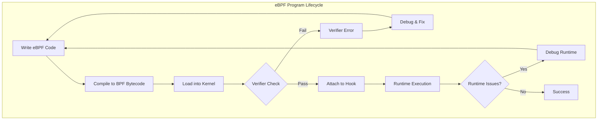
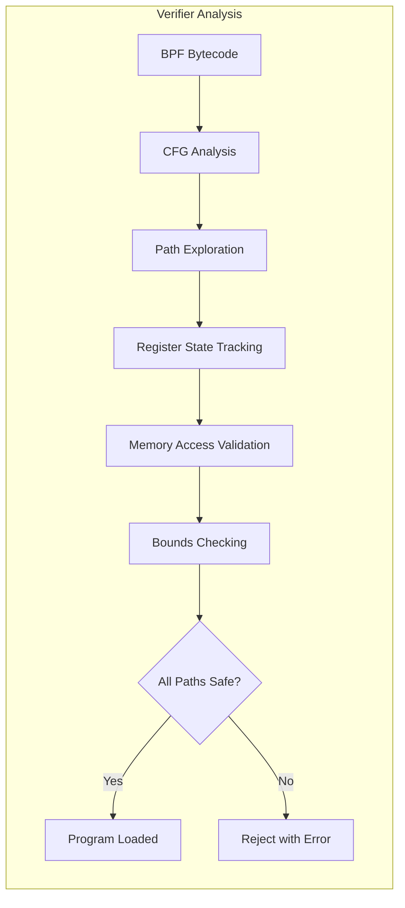
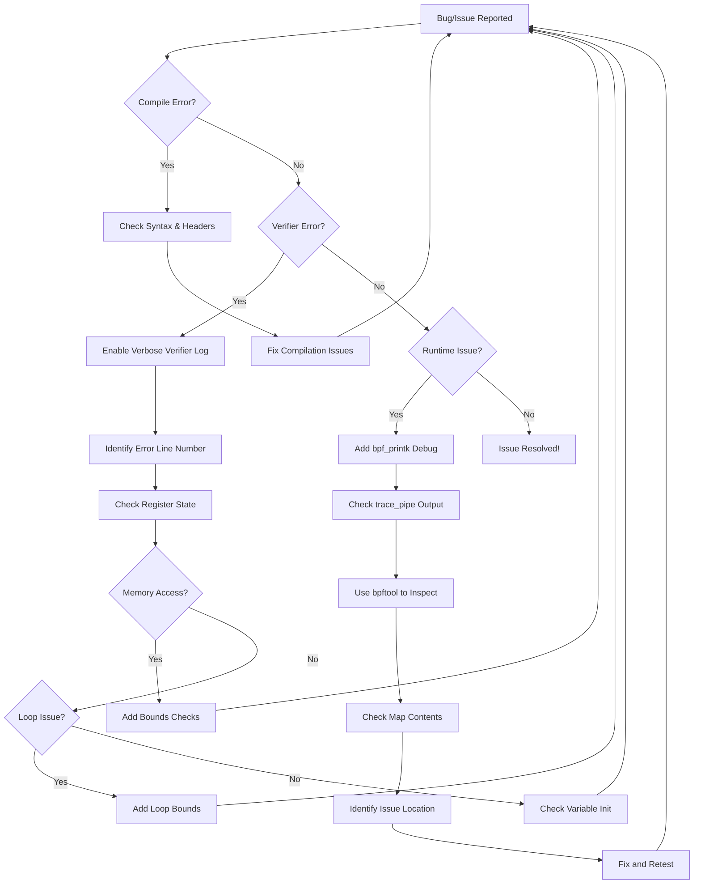

# How to Debug and Troubleshoot eBPF Programs

Author: [nawazdhandala](https://github.com/nawazdhandala)

Tags: eBPF, Debugging, Troubleshooting, Linux, Development

Description: A practical guide to debugging common eBPF program issues and verifier errors.

---

eBPF (extended Berkeley Packet Filter) is a powerful technology that allows running sandboxed programs in the Linux kernel. However, debugging eBPF programs can be challenging due to the unique constraints of the kernel environment, the verifier's strict checks, and limited debugging tools compared to user-space applications. This comprehensive guide will walk you through the essential techniques and tools for debugging and troubleshooting eBPF programs effectively.

## Table of Contents

1. [Understanding the eBPF Debugging Landscape](#understanding-the-ebpf-debugging-landscape)
2. [The eBPF Verifier: Your First Debugging Tool](#the-ebpf-verifier-your-first-debugging-tool)
3. [Common Verifier Errors and Solutions](#common-verifier-errors-and-solutions)
4. [Using bpftool for Debugging](#using-bpftool-for-debugging)
5. [Logging and Tracing Techniques](#logging-and-tracing-techniques)
6. [Debug Workflow Best Practices](#debug-workflow-best-practices)
7. [Common Pitfalls and Solutions](#common-pitfalls-and-solutions)
8. [Advanced Debugging Techniques](#advanced-debugging-techniques)
9. [Conclusion](#conclusion)

## Understanding the eBPF Debugging Landscape

Before diving into specific debugging techniques, it's important to understand the unique challenges of debugging eBPF programs:



### Key Debugging Challenges

1. **No Traditional Debuggers**: You cannot use GDB or similar debuggers directly on eBPF code running in the kernel
2. **Verifier Constraints**: The verifier enforces strict rules that can produce cryptic errors
3. **Limited Logging**: No direct access to printf-style debugging in the kernel
4. **State Visibility**: Limited visibility into program state during execution
5. **Kernel Context**: Programs run in kernel context with different memory and safety requirements

## The eBPF Verifier: Your First Debugging Tool

The eBPF verifier is both a safety mechanism and your most important debugging tool. Understanding its output is crucial for fixing loading errors.

### How the Verifier Works



### Reading Verifier Output

The verifier output follows a specific format. Here's how to interpret it:

The verifier log shows instruction numbers, register states, and the specific check that failed. Understanding this format is essential for debugging.

```c
// Example: A simple eBPF program that might trigger verifier errors
// This program attempts to read from a map but has potential issues

#include <linux/bpf.h>
#include <bpf/bpf_helpers.h>

// Define a BPF hash map to store process information
struct {
    __uint(type, BPF_MAP_TYPE_HASH);
    __uint(max_entries, 1024);
    __type(key, __u32);
    __type(value, __u64);
} my_map SEC(".maps");

// This kprobe program demonstrates common verifier issues
SEC("kprobe/sys_execve")
int trace_execve(struct pt_regs *ctx)
{
    __u32 key = 0;

    // Lookup returns a pointer that might be NULL
    // The verifier will reject if we don't check for NULL
    __u64 *value = bpf_map_lookup_elem(&my_map, &key);

    // WRONG: Accessing value without NULL check causes verifier error
    // __u64 data = *value;  // This will be rejected!

    // CORRECT: Always check for NULL before dereferencing
    if (value) {
        __u64 data = *value;
        // Use the data safely here
    }

    return 0;
}

char LICENSE[] SEC("license") = "GPL";
```

### Enabling Verbose Verifier Output

When loading eBPF programs, you can enable verbose logging to get more details:

The following code shows how to enable verbose verifier output when loading programs using libbpf. This is invaluable for debugging complex verifier errors.

```c
// Enable verbose verifier logging during program load
// This helper function demonstrates how to get detailed verifier output

#include <bpf/libbpf.h>
#include <stdio.h>
#include <errno.h>

// Custom log buffer for capturing verifier output
// Larger buffer = more detailed logs for complex programs
#define LOG_BUF_SIZE (1024 * 1024)  // 1MB should be sufficient for most cases

static char verifier_log[LOG_BUF_SIZE];

int load_bpf_program_with_debug(const char *obj_path)
{
    struct bpf_object *obj;
    struct bpf_program *prog;
    int err;

    // Open the BPF object file
    obj = bpf_object__open(obj_path);
    if (libbpf_get_error(obj)) {
        fprintf(stderr, "Failed to open BPF object: %s\n", obj_path);
        return -1;
    }

    // Iterate through all programs in the object file
    bpf_object__for_each_program(prog, obj) {
        // Set log level to verbose (2 = most verbose)
        // Level 0: No logging
        // Level 1: Basic errors only
        // Level 2: Verbose with register states
        bpf_program__set_log_level(prog, 2);

        // Provide our buffer for capturing log output
        bpf_program__set_log_buf(prog, verifier_log, LOG_BUF_SIZE);
    }

    // Attempt to load the BPF object into the kernel
    err = bpf_object__load(obj);
    if (err) {
        // Print the verifier log on failure - this is the key debugging info
        fprintf(stderr, "Verifier log:\n%s\n", verifier_log);
        fprintf(stderr, "Failed to load BPF object: %d\n", err);
        bpf_object__close(obj);
        return err;
    }

    printf("BPF program loaded successfully!\n");
    return 0;
}
```

## Common Verifier Errors and Solutions

### Error 1: Invalid Memory Access

This is one of the most common errors. It occurs when the verifier cannot prove memory access is safe.

The following example demonstrates an invalid memory access and how to fix it:

```c
// PROBLEMATIC CODE: Direct packet access without bounds checking
// The verifier cannot prove this access is within packet bounds

SEC("xdp")
int xdp_packet_parser_bad(struct xdp_md *ctx)
{
    // Get pointers to packet data
    void *data = (void *)(long)ctx->data;
    void *data_end = (void *)(long)ctx->data_end;

    // WRONG: Accessing eth header without bounds check
    // Verifier error: "invalid access to packet"
    struct ethhdr *eth = data;
    __u16 proto = eth->h_proto;  // This will fail!

    return XDP_PASS;
}

// FIXED CODE: Always perform bounds checking before packet access
// The verifier needs to see explicit bounds checks in the code flow

SEC("xdp")
int xdp_packet_parser_good(struct xdp_md *ctx)
{
    void *data = (void *)(long)ctx->data;
    void *data_end = (void *)(long)ctx->data_end;

    // Define pointer to ethernet header
    struct ethhdr *eth = data;

    // CORRECT: Explicit bounds check before accessing packet data
    // This check must compare (pointer + size) against data_end
    if ((void *)(eth + 1) > data_end) {
        // Packet is too small, drop it
        return XDP_DROP;
    }

    // Now the verifier knows eth access is safe
    __u16 proto = eth->h_proto;

    return XDP_PASS;
}
```

### Error 2: Unbounded Loops

The verifier rejects programs with loops it cannot prove will terminate.

eBPF programs must have bounded loops. Here's how to structure loops correctly:

```c
// PROBLEMATIC CODE: Unbounded loop that verifier will reject
// The verifier cannot prove this loop terminates

SEC("xdp")
int process_headers_bad(struct xdp_md *ctx)
{
    int i = 0;

    // WRONG: Variable loop bound - verifier cannot prove termination
    // Error: "back-edge from insn X to Y"
    while (some_condition) {  // Unbounded!
        i++;
        // process something
    }

    return XDP_PASS;
}

// FIXED CODE: Use bounded loops with compile-time known limits
// The #pragma unroll directive helps with small, known iterations

#define MAX_HEADERS 10  // Compile-time constant

SEC("xdp")
int process_headers_good(struct xdp_md *ctx)
{
    // Method 1: Bounded for loop with constant limit
    // The verifier can prove this terminates after MAX_HEADERS iterations
    #pragma unroll
    for (int i = 0; i < MAX_HEADERS; i++) {
        if (!some_condition) {
            break;  // Early exit is fine
        }
        // process header i
    }

    return XDP_PASS;
}

// Alternative: Using bpf_loop helper (available in newer kernels 5.17+)
// This is preferred for larger loop counts

static long loop_callback(u32 index, void *ctx)
{
    // Process each iteration
    // Return 0 to continue, 1 to break
    return 0;
}

SEC("xdp")
int process_with_bpf_loop(struct xdp_md *ctx)
{
    // bpf_loop provides a verifier-safe way to iterate
    // The kernel guarantees termination after nr_loops iterations
    long ret = bpf_loop(MAX_HEADERS, loop_callback, NULL, 0);

    return XDP_PASS;
}
```

### Error 3: Stack Size Exceeded

eBPF programs have a 512-byte stack limit. Exceeding this causes verifier rejection.

Here's how to work around stack size limitations:

```c
// PROBLEMATIC CODE: Large stack allocation exceeds 512-byte limit
// Verifier error: "combined stack size of X calls is Y. Too large"

SEC("kprobe/sys_read")
int trace_read_bad(struct pt_regs *ctx)
{
    // WRONG: This struct is too large for the stack
    // Each eBPF function has a 512-byte stack limit
    char large_buffer[1024];  // This will fail!

    return 0;
}

// FIXED CODE: Use per-CPU arrays or maps for large data structures
// This moves data off the limited stack to map memory

// Define a per-CPU array for large temporary storage
// Per-CPU arrays avoid lock contention and are efficient
struct {
    __uint(type, BPF_MAP_TYPE_PERCPU_ARRAY);
    __uint(max_entries, 1);
    __type(key, __u32);
    __type(value, char[1024]);  // Large buffer stored in map
} heap SEC(".maps");

SEC("kprobe/sys_read")
int trace_read_good(struct pt_regs *ctx)
{
    __u32 key = 0;

    // Get pointer to our "heap" storage from the per-CPU map
    // This provides a large buffer without using stack space
    char *buffer = bpf_map_lookup_elem(&heap, &key);
    if (!buffer) {
        return 0;  // Should never happen with PERCPU_ARRAY
    }

    // Now we can use buffer safely - it's 1024 bytes
    // Remember to initialize before use
    __builtin_memset(buffer, 0, 1024);

    return 0;
}
```

### Error 4: Invalid Register State

This occurs when the verifier detects potentially uninitialized or invalid register values.

```c
// PROBLEMATIC CODE: Using potentially uninitialized values
// Verifier tracks register state and rejects uncertain paths

SEC("kprobe/sys_write")
int trace_write_bad(struct pt_regs *ctx)
{
    __u64 value;
    __u32 key = 0;

    // Map lookup might fail, leaving 'value' uninitialized
    __u64 *ptr = bpf_map_lookup_elem(&my_map, &key);

    // WRONG: Conditional assignment leaves value uncertain
    if (ptr) {
        value = *ptr;
    }
    // At this point, verifier sees 'value' as potentially uninitialized

    // Using 'value' here triggers: "invalid read from stack"
    bpf_printk("Value: %llu\n", value);  // Error!

    return 0;
}

// FIXED CODE: Always initialize variables and handle all paths
// The verifier must see definite assignment on all code paths

SEC("kprobe/sys_write")
int trace_write_good(struct pt_regs *ctx)
{
    // CORRECT: Initialize at declaration
    __u64 value = 0;  // Default value ensures it's always valid
    __u32 key = 0;

    __u64 *ptr = bpf_map_lookup_elem(&my_map, &key);

    if (ptr) {
        value = *ptr;
    }
    // Now 'value' is definitely initialized (either 0 or from map)

    bpf_printk("Value: %llu\n", value);  // Works!

    return 0;
}
```

### Error 5: Type Mismatch and BTF Issues

BTF (BPF Type Format) errors occur when there's a mismatch between expected and actual types.

```c
// PROBLEMATIC CODE: Incorrect context type for program type
// Each BPF program type expects a specific context structure

// WRONG: Using wrong context type for tracepoint
// Tracepoints need specific traced event structures
SEC("tracepoint/syscalls/sys_enter_read")
int trace_read_wrong_ctx(struct pt_regs *ctx)  // Wrong type!
{
    // This will fail with BTF/type mismatch error
    return 0;
}

// FIXED CODE: Use the correct context type for each program type
// Tracepoint context is defined by the trace event format

// First, define the correct context structure
// This matches /sys/kernel/debug/tracing/events/syscalls/sys_enter_read/format
struct trace_event_raw_sys_enter {
    unsigned short common_type;
    unsigned char common_flags;
    unsigned char common_preempt_count;
    int common_pid;
    long id;
    unsigned long args[6];
};

SEC("tracepoint/syscalls/sys_enter_read")
int trace_read_correct_ctx(struct trace_event_raw_sys_enter *ctx)
{
    // Access syscall arguments correctly
    int fd = ctx->args[0];
    void *buf = (void *)ctx->args[1];
    size_t count = ctx->args[2];

    bpf_printk("read(fd=%d, count=%zu)\n", fd, count);

    return 0;
}
```

## Using bpftool for Debugging

bpftool is an essential utility for inspecting and debugging eBPF programs and maps at runtime.

### Installing bpftool

First, ensure bpftool is installed on your system:

```bash
# On Ubuntu/Debian - install from kernel tools package
# The package name includes the kernel version
sudo apt-get install linux-tools-$(uname -r) linux-tools-common

# On Fedora/RHEL - install from bpftool package
sudo dnf install bpftool

# Build from source for latest features
# Clone the kernel source and build bpftool directly
git clone --depth 1 https://github.com/torvalds/linux.git
cd linux/tools/bpf/bpftool
make
sudo make install
```

### Listing Loaded Programs

Use bpftool to see all currently loaded eBPF programs:

```bash
# List all loaded BPF programs with basic info
# Shows ID, type, name, and when it was loaded
sudo bpftool prog list

# Example output:
# 42: kprobe  name trace_execve  tag abc123def456  gpl
#     loaded_at 2024-01-07T10:30:00+0000  uid 0
#     xlated 256B  jited 189B  memlock 4096B

# Get detailed information about a specific program by ID
# Includes memory usage, BTF info, and attached hooks
sudo bpftool prog show id 42

# List programs in JSON format for scripting
# Useful for automated monitoring and tooling
sudo bpftool prog list --json | jq .
```

### Dumping Program Instructions

Examine the actual BPF bytecode to understand what your program does:

```bash
# Dump the translated (pre-JIT) BPF instructions
# This shows the bytecode the verifier analyzed
sudo bpftool prog dump xlated id 42

# Example output shows each instruction:
# 0: (bf) r6 = r1              ; Save context pointer
# 1: (85) call bpf_get_current_pid_tgid#14
# 2: (77) r0 >>= 32            ; Extract PID from upper 32 bits
# ...

# Dump the JIT-compiled native instructions
# This shows actual machine code running in kernel
sudo bpftool prog dump jited id 42

# Dump with source line annotations (requires BTF and debug info)
# This correlates bytecode back to your C source code
sudo bpftool prog dump xlated id 42 linum

# Visualize the control flow graph as DOT format
# Pipe to graphviz to generate visual representation
sudo bpftool prog dump xlated id 42 visual > prog.dot
dot -Tpng prog.dot -o prog.png
```

### Inspecting Maps

BPF maps are key-value stores used by eBPF programs. Here's how to inspect them:

```bash
# List all BPF maps in the system
# Shows map ID, type, name, and key/value sizes
sudo bpftool map list

# Example output:
# 5: hash  name my_map  flags 0x0
#    key 4B  value 8B  max_entries 1024  memlock 86016B

# Show detailed info about a specific map
sudo bpftool map show id 5

# Dump all entries in a map
# Shows all key-value pairs currently stored
sudo bpftool map dump id 5

# Example output:
# key: 00 00 00 01  value: 64 00 00 00 00 00 00 00
# key: 00 00 00 02  value: c8 00 00 00 00 00 00 00

# Lookup a specific key in the map
# Specify key bytes in hex format
sudo bpftool map lookup id 5 key 0x01 0x00 0x00 0x00

# Update a map entry (useful for testing/debugging)
sudo bpftool map update id 5 key 0x01 0x00 0x00 0x00 value 0xff 0x00 0x00 0x00 0x00 0x00 0x00 0x00

# Delete a map entry
sudo bpftool map delete id 5 key 0x01 0x00 0x00 0x00
```

### Inspecting BTF Information

BTF provides type information crucial for debugging:

```bash
# List BTF objects loaded in the kernel
sudo bpftool btf list

# Dump BTF type information for a specific program
# Shows all type definitions used by the program
sudo bpftool btf dump id 42

# Dump kernel BTF (available on kernels 5.4+)
# This shows all kernel types available to BPF programs
sudo bpftool btf dump file /sys/kernel/btf/vmlinux

# Search for specific types in kernel BTF
# Useful when writing CO-RE programs
sudo bpftool btf dump file /sys/kernel/btf/vmlinux format c | grep "struct task_struct"
```

### Debugging with bpftool Feature Detection

Check what BPF features are available on your kernel:

```bash
# List all supported BPF features
# Essential for understanding what's available on your system
sudo bpftool feature

# Output includes:
# - Supported program types (kprobe, tracepoint, xdp, etc.)
# - Supported map types (hash, array, ringbuf, etc.)
# - Available helpers for each program type
# - JIT and other kernel configuration

# Probe specific features
sudo bpftool feature probe kernel

# Check helper availability for a program type
# Shows which helper functions can be called
sudo bpftool feature probe helpers
```

## Logging and Tracing Techniques

Since traditional debugging isn't available, logging becomes crucial for understanding program behavior.

### Using bpf_printk for Debug Output

bpf_printk writes to the kernel trace buffer. It's the primary printf-style debugging method:

```c
// Using bpf_printk for runtime debugging
// Output goes to /sys/kernel/debug/tracing/trace_pipe

#include <linux/bpf.h>
#include <bpf/bpf_helpers.h>

SEC("kprobe/sys_openat")
int trace_openat(struct pt_regs *ctx)
{
    // Get current process ID
    __u64 pid_tgid = bpf_get_current_pid_tgid();
    __u32 pid = pid_tgid >> 32;
    __u32 tid = pid_tgid & 0xFFFFFFFF;

    // Basic print - format string has max 3 arguments
    // Note: bpf_printk is limited in format specifiers
    bpf_printk("openat called by PID: %d, TID: %d\n", pid, tid);

    // Get current task's comm (process name)
    char comm[16];
    bpf_get_current_comm(&comm, sizeof(comm));

    // Print process name - strings need %s specifier
    bpf_printk("Process name: %s\n", comm);

    // Print pointer values for debugging memory issues
    bpf_printk("Context pointer: %px\n", ctx);

    // Print entry to function (helps trace execution flow)
    bpf_printk(">>> ENTER trace_openat\n");

    // ... program logic here ...

    bpf_printk("<<< EXIT trace_openat\n");

    return 0;
}

char LICENSE[] SEC("license") = "GPL";
```

Reading the trace output from bpf_printk:

```bash
# Read trace output in real-time
# This shows all bpf_printk output from running programs
sudo cat /sys/kernel/debug/tracing/trace_pipe

# Filter trace output for specific program
# Use grep to focus on your program's output
sudo cat /sys/kernel/debug/tracing/trace_pipe | grep "trace_openat"

# Clear the trace buffer before starting
echo > /sys/kernel/debug/tracing/trace

# Set trace buffer size if you're generating lots of output
echo 8192 > /sys/kernel/debug/tracing/buffer_size_kb
```

### Using BPF Ring Buffer for Structured Logging

For production debugging, ring buffers provide more efficient structured logging:

```c
// Ring buffer provides efficient, structured event logging
// Much more efficient than bpf_printk for high-volume events

#include <linux/bpf.h>
#include <bpf/bpf_helpers.h>

// Define the event structure we'll send to userspace
// Include all debugging information you might need
struct debug_event {
    __u64 timestamp;      // When the event occurred
    __u32 pid;            // Process ID
    __u32 tid;            // Thread ID
    __u32 cpu;            // CPU where event occurred
    __u32 event_type;     // Type of event for filtering
    char comm[16];        // Process name
    __s64 return_value;   // Function return value if applicable
    char message[64];     // Debug message
};

// Ring buffer map for sending events to userspace
struct {
    __uint(type, BPF_MAP_TYPE_RINGBUF);
    __uint(max_entries, 256 * 1024);  // 256KB buffer
} debug_events SEC(".maps");

// Helper to emit debug events
// Use this throughout your program for consistent logging
static __always_inline void emit_debug_event(
    __u32 event_type,
    const char *msg,
    __s64 ret_val)
{
    // Reserve space in ring buffer
    struct debug_event *event;
    event = bpf_ringbuf_reserve(&debug_events, sizeof(*event), 0);
    if (!event) {
        return;  // Buffer full, event dropped
    }

    // Fill in event details
    event->timestamp = bpf_ktime_get_ns();

    __u64 pid_tgid = bpf_get_current_pid_tgid();
    event->pid = pid_tgid >> 32;
    event->tid = pid_tgid & 0xFFFFFFFF;

    event->cpu = bpf_get_smp_processor_id();
    event->event_type = event_type;
    event->return_value = ret_val;

    bpf_get_current_comm(&event->comm, sizeof(event->comm));

    // Copy message (bpf_probe_read_kernel_str for safety)
    __builtin_memcpy(event->message, msg, sizeof(event->message));

    // Submit event to userspace
    bpf_ringbuf_submit(event, 0);
}

// Event type constants for filtering
#define EVENT_ENTRY  1
#define EVENT_EXIT   2
#define EVENT_ERROR  3
#define EVENT_DEBUG  4

SEC("kprobe/sys_openat")
int trace_openat_ringbuf(struct pt_regs *ctx)
{
    emit_debug_event(EVENT_ENTRY, "openat entry", 0);

    // ... program logic ...

    emit_debug_event(EVENT_EXIT, "openat exit", 0);

    return 0;
}

char LICENSE[] SEC("license") = "GPL";
```

Userspace code to read ring buffer events:

```c
// Userspace program to read and display debug events
// Compile with: gcc -o reader reader.c -lbpf

#include <stdio.h>
#include <signal.h>
#include <bpf/libbpf.h>
#include <time.h>

// Must match the kernel-side event structure exactly
struct debug_event {
    __u64 timestamp;
    __u32 pid;
    __u32 tid;
    __u32 cpu;
    __u32 event_type;
    char comm[16];
    __s64 return_value;
    char message[64];
};

// Event type names for display
static const char *event_type_str[] = {
    [1] = "ENTRY",
    [2] = "EXIT",
    [3] = "ERROR",
    [4] = "DEBUG",
};

static volatile bool running = true;

// Signal handler for graceful shutdown
static void sig_handler(int sig)
{
    running = false;
}

// Callback for each event received from ring buffer
static int handle_event(void *ctx, void *data, size_t data_sz)
{
    struct debug_event *event = data;

    // Convert timestamp to readable format
    time_t ts_sec = event->timestamp / 1000000000;
    struct tm *tm = localtime(&ts_sec);
    char time_str[32];
    strftime(time_str, sizeof(time_str), "%H:%M:%S", tm);

    // Print formatted event
    printf("[%s.%09llu] CPU:%u PID:%-6u %-16s %-6s %s (ret=%lld)\n",
           time_str,
           event->timestamp % 1000000000,
           event->cpu,
           event->pid,
           event->comm,
           event_type_str[event->event_type] ?: "UNKNOWN",
           event->message,
           event->return_value);

    return 0;
}

int main(int argc, char **argv)
{
    struct ring_buffer *rb = NULL;
    int map_fd;

    // Set up signal handlers
    signal(SIGINT, sig_handler);
    signal(SIGTERM, sig_handler);

    // Find the ring buffer map by name
    // In practice, you'd get this from the loaded BPF object
    map_fd = bpf_obj_get("/sys/fs/bpf/debug_events");
    if (map_fd < 0) {
        fprintf(stderr, "Failed to find ring buffer map\n");
        return 1;
    }

    // Create ring buffer manager
    rb = ring_buffer__new(map_fd, handle_event, NULL, NULL);
    if (!rb) {
        fprintf(stderr, "Failed to create ring buffer\n");
        return 1;
    }

    printf("Listening for debug events... (Ctrl+C to stop)\n");
    printf("%-20s %-4s %-6s %-16s %-6s %s\n",
           "TIME", "CPU", "PID", "COMM", "TYPE", "MESSAGE");
    printf("-----------------------------------------------------------\n");

    // Poll for events
    while (running) {
        int err = ring_buffer__poll(rb, 100 /* timeout_ms */);
        if (err < 0 && err != -EINTR) {
            fprintf(stderr, "Error polling ring buffer: %d\n", err);
            break;
        }
    }

    ring_buffer__free(rb);
    return 0;
}
```

### Using Maps for State Inspection

Maps can be used to expose internal state for debugging:

```c
// Use maps to expose internal program state for debugging
// Userspace can read these maps to understand program behavior

#include <linux/bpf.h>
#include <bpf/bpf_helpers.h>

// Statistics counters for program debugging
struct stats {
    __u64 total_calls;      // Total number of calls
    __u64 successful;       // Successful operations
    __u64 failed;           // Failed operations
    __u64 filtered;         // Filtered/skipped events
    __u64 last_timestamp;   // Most recent event time
    __u32 last_pid;         // Most recent PID
    __u32 last_error;       // Most recent error code
};

// Per-CPU array for lock-free statistics updates
struct {
    __uint(type, BPF_MAP_TYPE_PERCPU_ARRAY);
    __uint(max_entries, 1);
    __type(key, __u32);
    __type(value, struct stats);
} debug_stats SEC(".maps");

// Debug flags map - userspace can toggle debug features
struct {
    __uint(type, BPF_MAP_TYPE_ARRAY);
    __uint(max_entries, 1);
    __type(key, __u32);
    __type(value, __u32);
} debug_flags SEC(".maps");

// Debug flag bit definitions
#define DEBUG_FLAG_VERBOSE    (1 << 0)  // Enable verbose logging
#define DEBUG_FLAG_TRACE_ALL  (1 << 1)  // Trace all events
#define DEBUG_FLAG_DUMP_CTX   (1 << 2)  // Dump context info

// Helper to check if a debug flag is set
static __always_inline bool debug_flag_set(__u32 flag)
{
    __u32 key = 0;
    __u32 *flags = bpf_map_lookup_elem(&debug_flags, &key);
    return flags && (*flags & flag);
}

// Helper to update statistics
static __always_inline void update_stats(bool success, __u32 error)
{
    __u32 key = 0;
    struct stats *s = bpf_map_lookup_elem(&debug_stats, &key);
    if (!s) return;

    // Update counters atomically (per-CPU so no locking needed)
    __sync_fetch_and_add(&s->total_calls, 1);
    if (success) {
        __sync_fetch_and_add(&s->successful, 1);
    } else {
        __sync_fetch_and_add(&s->failed, 1);
        s->last_error = error;
    }

    s->last_timestamp = bpf_ktime_get_ns();
    s->last_pid = bpf_get_current_pid_tgid() >> 32;
}

SEC("kprobe/vfs_read")
int trace_vfs_read(struct pt_regs *ctx)
{
    // Check if verbose debugging is enabled
    if (debug_flag_set(DEBUG_FLAG_VERBOSE)) {
        bpf_printk("vfs_read entry\n");
    }

    // ... program logic ...
    bool success = true;  // Set based on actual operation

    // Update statistics for monitoring
    update_stats(success, 0);

    return 0;
}

char LICENSE[] SEC("license") = "GPL";
```

Reading debug stats from userspace:

```bash
# Dump debug statistics map to see program behavior
sudo bpftool map dump name debug_stats

# Watch statistics in real-time (updates every second)
watch -n 1 'sudo bpftool map dump name debug_stats'

# Toggle debug flags from userspace
# Enable verbose mode (flag bit 0)
sudo bpftool map update name debug_flags key 0 0 0 0 value 1 0 0 0

# Disable all debug flags
sudo bpftool map update name debug_flags key 0 0 0 0 value 0 0 0 0
```

## Debug Workflow Best Practices

Here's a systematic approach to debugging eBPF programs:



### Step-by-Step Debug Checklist

Follow this checklist when debugging eBPF issues:

```c
// Comprehensive debug wrapper for eBPF programs
// Include this header for consistent debugging across programs

#ifndef __DEBUG_H__
#define __DEBUG_H__

#include <linux/bpf.h>
#include <bpf/bpf_helpers.h>

// Compile-time debug level control
// Set to 0 for production, 1-3 for increasing verbosity
#ifndef DEBUG_LEVEL
#define DEBUG_LEVEL 1
#endif

// Conditional debug macros - compiled out when DEBUG_LEVEL is 0
#if DEBUG_LEVEL >= 1
#define DEBUG1(fmt, ...) bpf_printk("[DBG1] " fmt, ##__VA_ARGS__)
#else
#define DEBUG1(fmt, ...) do {} while(0)
#endif

#if DEBUG_LEVEL >= 2
#define DEBUG2(fmt, ...) bpf_printk("[DBG2] " fmt, ##__VA_ARGS__)
#else
#define DEBUG2(fmt, ...) do {} while(0)
#endif

#if DEBUG_LEVEL >= 3
#define DEBUG3(fmt, ...) bpf_printk("[DBG3] " fmt, ##__VA_ARGS__)
#else
#define DEBUG3(fmt, ...) do {} while(0)
#endif

// Always-on error logging
#define ERROR(fmt, ...) bpf_printk("[ERR] " fmt, ##__VA_ARGS__)

// Function entry/exit tracing
#define TRACE_ENTRY() DEBUG2(">>> %s\n", __func__)
#define TRACE_EXIT()  DEBUG2("<<< %s\n", __func__)

// Assert-like macro for debugging
// Logs condition and location when assertion fails
#define BPF_ASSERT(cond, msg) do { \
    if (!(cond)) { \
        ERROR("ASSERT FAILED: %s at %s:%d\n", msg, __FILE__, __LINE__); \
    } \
} while(0)

// Pointer validation helper
#define CHECK_PTR(ptr) do { \
    if (!(ptr)) { \
        ERROR("NULL ptr: " #ptr " at %s:%d\n", __FILE__, __LINE__); \
        return 0; \
    } \
} while(0)

#endif // __DEBUG_H__
```

Using the debug utilities in your program:

```c
// Example program using debug utilities

#define DEBUG_LEVEL 2  // Enable level 1 and 2 debug messages
#include "debug.h"

SEC("kprobe/vfs_write")
int trace_write(struct pt_regs *ctx)
{
    TRACE_ENTRY();

    __u32 key = 0;
    __u64 *value = bpf_map_lookup_elem(&my_map, &key);

    // Use CHECK_PTR for automatic NULL checking with logging
    CHECK_PTR(value);

    DEBUG1("Map value: %llu\n", *value);

    // Conditional detailed debugging
    DEBUG2("Full context: pid=%u, cpu=%u\n",
           bpf_get_current_pid_tgid() >> 32,
           bpf_get_smp_processor_id());

    // Assert-style checks for invariants
    BPF_ASSERT(*value < 1000000, "value out of expected range");

    TRACE_EXIT();
    return 0;
}
```

## Common Pitfalls and Solutions

### Pitfall 1: Forgetting NULL Checks

One of the most common mistakes is forgetting to check map lookup results:

```c
// THE PROBLEM: Map lookups can return NULL
// This is the #1 cause of verifier rejections for beginners

SEC("kprobe/sys_read")
int bad_example(struct pt_regs *ctx)
{
    __u32 key = 0;
    __u64 *value = bpf_map_lookup_elem(&my_map, &key);

    // WRONG: Direct dereference without NULL check
    // Verifier: "R0 invalid mem access 'map_value_or_null'"
    return *value;  // CRASH!
}

// THE SOLUTION: Always check for NULL after map lookups

SEC("kprobe/sys_read")
int good_example(struct pt_regs *ctx)
{
    __u32 key = 0;
    __u64 *value = bpf_map_lookup_elem(&my_map, &key);

    // CORRECT: Explicit NULL check before use
    if (!value) {
        return 0;  // Handle missing key gracefully
    }

    // Now verifier knows value is definitely not NULL
    return *value;  // Safe!
}
```

### Pitfall 2: Incorrect Pointer Arithmetic

Pointer arithmetic in eBPF requires careful bounds tracking:

```c
// THE PROBLEM: Pointer arithmetic can lose verifier tracking
// Moving pointers without re-validating bounds causes errors

SEC("xdp")
int packet_parse_bad(struct xdp_md *ctx)
{
    void *data = (void *)(long)ctx->data;
    void *data_end = (void *)(long)ctx->data_end;

    struct ethhdr *eth = data;
    if ((void *)(eth + 1) > data_end)
        return XDP_DROP;

    // Move to IP header
    void *ip_start = data + sizeof(struct ethhdr);

    // WRONG: Need to revalidate after pointer arithmetic
    // The verifier lost track of bounds relationship
    struct iphdr *ip = ip_start;
    __u8 protocol = ip->protocol;  // Error!

    return XDP_PASS;
}

// THE SOLUTION: Re-validate bounds after every pointer movement

SEC("xdp")
int packet_parse_good(struct xdp_md *ctx)
{
    void *data = (void *)(long)ctx->data;
    void *data_end = (void *)(long)ctx->data_end;

    // Validate ethernet header
    struct ethhdr *eth = data;
    if ((void *)(eth + 1) > data_end)
        return XDP_DROP;

    // Move to IP header position
    struct iphdr *ip = (void *)(eth + 1);

    // CORRECT: Re-validate bounds for IP header access
    if ((void *)(ip + 1) > data_end)
        return XDP_DROP;

    // Now verifier knows ip access is safe
    __u8 protocol = ip->protocol;  // Works!

    return XDP_PASS;
}
```

### Pitfall 3: Stack Variable Scope Issues

Local variables must remain valid for the duration of their use:

```c
// THE PROBLEM: Returning pointers to stack variables
// Stack variables are only valid within their function scope

SEC("kprobe/sys_open")
int stack_scope_bad(struct pt_regs *ctx)
{
    __u32 key;
    __u64 value;

    // Getting current PID as key
    key = bpf_get_current_pid_tgid() >> 32;

    // WRONG: Passing address of uninitialized stack variable
    // to a function that might store it
    if (bpf_map_update_elem(&my_map, &key, &value, BPF_ANY)) {
        // value is uninitialized - undefined behavior!
        return 0;
    }

    return 0;
}

// THE SOLUTION: Initialize stack variables before use

SEC("kprobe/sys_open")
int stack_scope_good(struct pt_regs *ctx)
{
    __u32 key;
    __u64 value = 1;  // CORRECT: Initialize before use

    key = bpf_get_current_pid_tgid() >> 32;

    // Now value has a defined value
    if (bpf_map_update_elem(&my_map, &key, &value, BPF_ANY)) {
        return 0;
    }

    return 0;
}
```

### Pitfall 4: Incorrect Helper Function Usage

Each eBPF program type has access to specific helper functions:

```c
// THE PROBLEM: Using helpers not available for program type
// Different program types have different helper access

// XDP programs cannot use certain helpers
SEC("xdp")
int xdp_wrong_helper(struct xdp_md *ctx)
{
    char comm[16];

    // WRONG: bpf_get_current_comm not available in XDP context
    // XDP runs before socket/process context is established
    bpf_get_current_comm(&comm, sizeof(comm));  // Error!

    return XDP_PASS;
}

// THE SOLUTION: Use only helpers available for your program type
// Check bpftool feature probe or kernel documentation

SEC("kprobe/sys_execve")
int kprobe_correct_helper(struct pt_regs *ctx)
{
    char comm[16];

    // CORRECT: kprobes run in process context, this helper works
    bpf_get_current_comm(&comm, sizeof(comm));

    bpf_printk("Process: %s\n", comm);

    return 0;
}

// For XDP, use available helpers
SEC("xdp")
int xdp_correct_helper(struct xdp_md *ctx)
{
    // XDP has access to: bpf_xdp_adjust_head, bpf_xdp_adjust_tail,
    // bpf_redirect, bpf_redirect_map, etc.

    // Get nanosecond timestamp (available everywhere)
    __u64 ts = bpf_ktime_get_ns();

    return XDP_PASS;
}
```

### Pitfall 5: Endianness Issues

Network data is big-endian, but x86 is little-endian:

```c
// THE PROBLEM: Byte order mismatches cause incorrect values
// Network protocols use big-endian (network byte order)

#include <linux/if_ether.h>
#include <linux/ip.h>
#include <linux/tcp.h>
#include <bpf/bpf_endian.h>  // Include endian conversion helpers

SEC("xdp")
int endian_wrong(struct xdp_md *ctx)
{
    void *data = (void *)(long)ctx->data;
    void *data_end = (void *)(long)ctx->data_end;

    struct ethhdr *eth = data;
    if ((void *)(eth + 1) > data_end)
        return XDP_DROP;

    // WRONG: Comparing network byte order to host byte order
    // ETH_P_IP is defined in host order, eth->h_proto is network order
    if (eth->h_proto == ETH_P_IP) {  // This comparison is broken!
        // Won't match correctly on little-endian systems
    }

    return XDP_PASS;
}

// THE SOLUTION: Use endian conversion macros consistently

SEC("xdp")
int endian_correct(struct xdp_md *ctx)
{
    void *data = (void *)(long)ctx->data;
    void *data_end = (void *)(long)ctx->data_end;

    struct ethhdr *eth = data;
    if ((void *)(eth + 1) > data_end)
        return XDP_DROP;

    // CORRECT: Convert constant to network byte order for comparison
    // bpf_htons = host to network short (16-bit)
    if (eth->h_proto == bpf_htons(ETH_P_IP)) {
        // Now comparison works correctly!

        struct iphdr *ip = (void *)(eth + 1);
        if ((void *)(ip + 1) > data_end)
            return XDP_DROP;

        // For reading values to use, convert FROM network order
        // bpf_ntohs = network to host short
        __u16 total_len = bpf_ntohs(ip->tot_len);

        // bpf_ntohl = network to host long (32-bit) for addresses
        __u32 src_ip = bpf_ntohl(ip->saddr);

        bpf_printk("IP len=%u, src=%u\n", total_len, src_ip);
    }

    return XDP_PASS;
}
```

## Advanced Debugging Techniques

### Using GDB with User-Space Components

While you can't debug eBPF kernel code with GDB, you can debug user-space loaders:

```bash
# Compile user-space loader with debug symbols
gcc -g -O0 -o loader loader.c -lbpf -lelf -lz

# Run loader under GDB
gdb ./loader

# In GDB, set breakpoints on libbpf functions
(gdb) break bpf_object__load
(gdb) break bpf_program__attach

# Run and inspect state when loading fails
(gdb) run
(gdb) print verifier_log
(gdb) print errno
```

### Kernel Tracing with ftrace

Use ftrace to trace BPF-related kernel functions:

```bash
# Enable tracing of BPF system calls and functions
echo 1 > /sys/kernel/debug/tracing/events/bpf/enable

# Trace specific BPF events
echo 1 > /sys/kernel/debug/tracing/events/bpf/bpf_prog_load/enable
echo 1 > /sys/kernel/debug/tracing/events/bpf/bpf_prog_run/enable

# View trace output
cat /sys/kernel/debug/tracing/trace_pipe

# Trace all functions called during BPF operations
echo 'bpf*' > /sys/kernel/debug/tracing/set_ftrace_filter
echo function > /sys/kernel/debug/tracing/current_tracer
echo 1 > /sys/kernel/debug/tracing/tracing_on

# Clean up when done
echo 0 > /sys/kernel/debug/tracing/tracing_on
echo nop > /sys/kernel/debug/tracing/current_tracer
```

### Memory Debugging with Sanitizers

Use clang sanitizers for user-space component debugging:

```bash
# Compile with AddressSanitizer for memory issues
clang -g -fsanitize=address -o loader loader.c -lbpf -lelf -lz

# Compile with UndefinedBehaviorSanitizer
clang -g -fsanitize=undefined -o loader loader.c -lbpf -lelf -lz

# Run and get detailed reports on issues
ASAN_OPTIONS=detect_leaks=1 ./loader
```

### Creating Minimal Reproducible Examples

When debugging complex issues, create minimal test cases:

```c
// Minimal reproducer for debugging specific verifier issues
// Strip down to the smallest code that reproduces the error

#include <linux/bpf.h>
#include <bpf/bpf_helpers.h>

// Minimal map definition
struct {
    __uint(type, BPF_MAP_TYPE_HASH);
    __uint(max_entries, 1);
    __type(key, __u32);
    __type(value, __u64);
} test_map SEC(".maps");

// Minimal program to reproduce issue
SEC("kprobe/__x64_sys_getpid")
int minimal_test(struct pt_regs *ctx)
{
    // Only include code necessary to reproduce the bug
    __u32 key = 0;
    __u64 *val = bpf_map_lookup_elem(&test_map, &key);

    // The problematic pattern isolated
    if (val) {
        // Issue reproduction code here
    }

    return 0;
}

char LICENSE[] SEC("license") = "GPL";
```

### Performance Debugging

Identify performance bottlenecks in eBPF programs:

```bash
# Get program runtime statistics
sudo bpftool prog profile id 42 duration 5 cycles instructions

# Example output:
#          42 run_cnt
#       10000 run_time_ns
#        5000 cycles
#        2500 instructions

# Show program execution count and average runtime
sudo bpftool prog show id 42 --json | jq '.run_cnt, .run_time_ns'

# Use perf to profile BPF programs
sudo perf stat -e 'bpf:*' -a sleep 10

# Trace BPF program execution times
sudo perf record -e 'bpf:bpf_prog_run' -a sleep 10
sudo perf report
```

## Debugging Environment Setup

Set up a proper development environment for eBPF debugging:

```bash
#!/bin/bash
# setup-ebpf-debug-env.sh
# Script to set up eBPF debugging environment

set -e

echo "=== Setting up eBPF Debug Environment ==="

# 1. Install required packages
echo "[1/5] Installing required packages..."
sudo apt-get update
sudo apt-get install -y \
    clang \
    llvm \
    libbpf-dev \
    linux-headers-$(uname -r) \
    linux-tools-$(uname -r) \
    bpftrace \
    perf-tools-unstable

# 2. Mount debugfs if not mounted
echo "[2/5] Ensuring debugfs is mounted..."
if ! mountpoint -q /sys/kernel/debug; then
    sudo mount -t debugfs none /sys/kernel/debug
fi

# 3. Set up BPF filesystem
echo "[3/5] Setting up BPF filesystem..."
if ! mountpoint -q /sys/fs/bpf; then
    sudo mount -t bpf none /sys/fs/bpf
fi

# 4. Configure kernel for BPF debugging
echo "[4/5] Configuring kernel parameters..."
sudo sysctl -w kernel.bpf_stats_enabled=1
sudo sysctl -w kernel.unprivileged_bpf_disabled=0

# 5. Set up trace buffer
echo "[5/5] Configuring trace buffer..."
echo 16384 | sudo tee /sys/kernel/debug/tracing/buffer_size_kb

echo "=== Environment Setup Complete ==="
echo ""
echo "Useful commands:"
echo "  bpftool prog list          - List loaded BPF programs"
echo "  bpftool map list           - List BPF maps"
echo "  cat /sys/kernel/debug/tracing/trace_pipe - View bpf_printk output"
echo "  bpftool feature            - Check available BPF features"
```

## Conclusion

Debugging eBPF programs requires a different mindset than traditional application debugging. The key strategies include:

1. **Master the Verifier**: Understanding verifier output is crucial. Enable verbose logging and learn to interpret register state information.

2. **Use bpftool Extensively**: This tool is invaluable for inspecting loaded programs, maps, and BTF information.

3. **Leverage bpf_printk**: While limited, it's your primary runtime debugging tool. Structure your output for easy parsing.

4. **Use Ring Buffers for Production**: For high-volume event logging, ring buffers are more efficient than bpf_printk.

5. **Create Debug Maps**: Expose internal state through maps for real-time inspection.

6. **Follow the Debug Workflow**: Systematically work through compilation, verification, and runtime issues.

7. **Build Minimal Reproducers**: When stuck, isolate the problem to the smallest possible code.

Remember that eBPF debugging is an iterative process. Start with simple programs, build understanding incrementally, and maintain good debugging instrumentation throughout your code.

## Additional Resources

- [BPF and XDP Reference Guide](https://docs.cilium.io/en/stable/bpf/)
- [Linux Kernel BPF Documentation](https://www.kernel.org/doc/html/latest/bpf/)
- [libbpf Documentation](https://libbpf.readthedocs.io/)
- [bpftool Manual Pages](https://man7.org/linux/man-pages/man8/bpftool.8.html)
- [eBPF.io - The eBPF Community Site](https://ebpf.io/)
