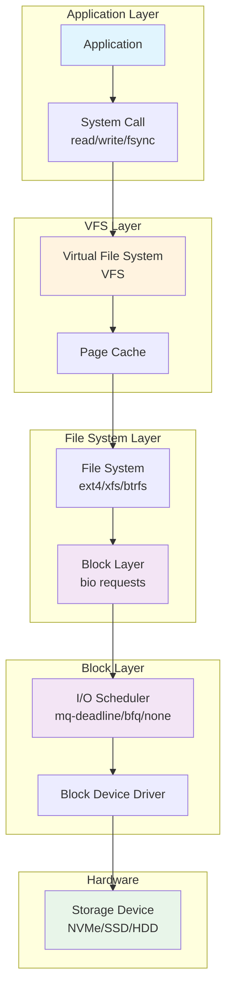
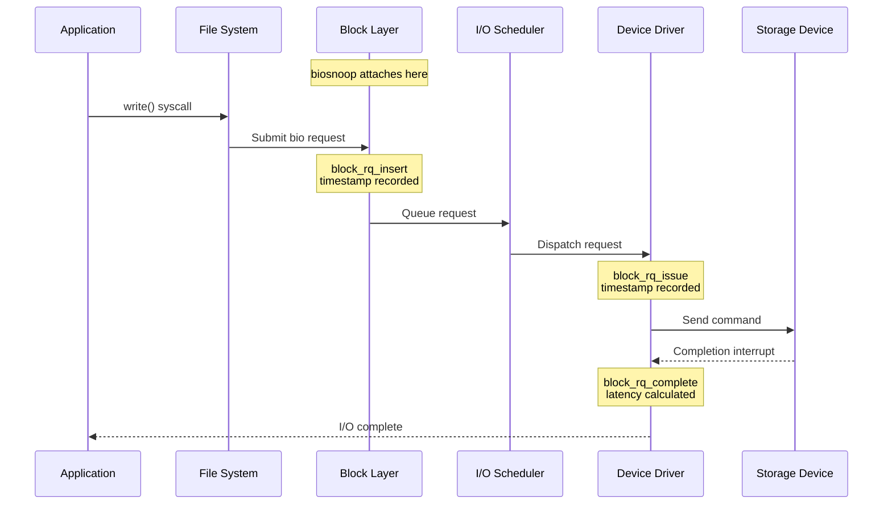
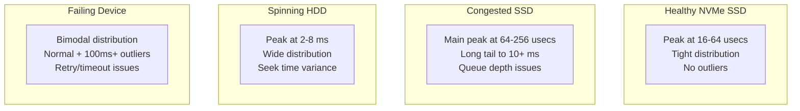
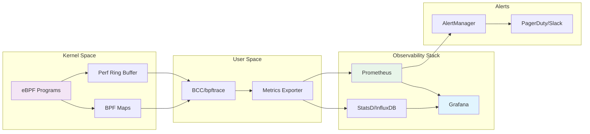

# How to Analyze Disk I/O Performance with eBPF

Author: [nawazdhandala](https://github.com/nawazdhandala)

Tags: eBPF, Storage, Disk I/O, Performance, Linux, Monitoring

Description: A guide to using eBPF for detailed disk I/O analysis and latency troubleshooting.

---

Disk I/O performance is often the bottleneck in modern applications, from databases to container workloads. Traditional tools like `iostat` and `iotop` provide aggregate statistics, but they lack the granularity needed to identify specific latency outliers, trace I/O requests through the storage stack, or correlate I/O patterns with application behavior. eBPF (extended Berkeley Packet Filter) changes this by enabling deep, low-overhead tracing of the Linux block I/O subsystem.

In this comprehensive guide, we will explore how to use eBPF for detailed disk I/O analysis, covering block I/O tracing, latency histograms, and file system tracing with practical, well-commented code examples.

## Understanding the Linux I/O Stack

Before diving into eBPF tracing, it is essential to understand how I/O requests flow through the Linux kernel. The following diagram illustrates the path from application to disk:



eBPF allows us to attach probes at multiple points in this stack:
- **Tracepoints**: Stable kernel instrumentation points (e.g., `block:block_rq_issue`)
- **Kprobes**: Dynamic probes on any kernel function
- **USDT probes**: User-space static probes in applications
- **Fentry/Fexit**: Faster function entry/exit probes (on newer kernels)

## Prerequisites and Setup

Before we begin, ensure you have the necessary tools installed. BCC (BPF Compiler Collection) provides high-level tracing tools and a Python framework for writing eBPF programs.

The following commands install BCC tools on common Linux distributions:

```bash
# Install BCC tools on Ubuntu/Debian
# This package includes pre-built tools like biosnoop, biolatency, and more
sudo apt-get update
sudo apt-get install -y bpfcc-tools linux-headers-$(uname -r)

# Install BCC tools on RHEL/CentOS/Fedora
# The python3-bcc package provides the Python bindings for custom programs
sudo dnf install -y bcc-tools python3-bcc kernel-devel-$(uname -r)

# Install bpftrace for one-liner tracing
# bpftrace provides a high-level language for eBPF scripting
sudo apt-get install -y bpftrace  # Debian/Ubuntu
sudo dnf install -y bpftrace      # Fedora/RHEL
```

Verify your kernel supports eBPF:

```bash
# Check kernel version (4.9+ required, 5.x+ recommended for full features)
uname -r

# Verify BPF filesystem is mounted (required for loading BPF programs)
mount | grep bpf

# If not mounted, mount the BPF filesystem
sudo mount -t bpf bpf /sys/fs/bpf
```

## Block I/O Tracing with biosnoop

The `biosnoop` tool traces every block I/O request, showing per-I/O latency in real-time. This is invaluable for identifying slow I/O operations that aggregate statistics would hide.

### Basic biosnoop Usage

Run biosnoop to see all block I/O operations with their latencies:

```bash
# Run biosnoop to trace all block I/O operations
# Columns: TIME=timestamp, COMM=process name, PID=process ID
# DISK=device, T=type (R=read,W=write), SECTOR=disk sector, BYTES=I/O size
# LAT(ms)=latency in milliseconds
sudo biosnoop

# Example output:
# TIME(s)     COMM           PID    DISK    T  SECTOR    BYTES   LAT(ms)
# 0.000000    mysqld         1234   nvme0n1 R  12345678  4096    0.15
# 0.001234    postgres       5678   sda     W  87654321  8192    2.34
# 0.002345    dd             9012   nvme0n1 W  11111111  131072  0.89
```

### Filtering by Device or Process

When dealing with busy systems, filtering helps focus on specific I/O patterns:

```bash
# Filter biosnoop output to show only I/O from a specific disk device
# The -d flag specifies the device name to trace
sudo biosnoop -d sda

# Filter by process name to trace I/O from specific applications
# Useful for debugging database or application I/O patterns
sudo biosnoop | grep -E "(mysqld|postgres)"

# Show only I/O operations with latency greater than 10ms
# Helps identify slow I/O operations that may cause performance issues
sudo biosnoop | awk '$NF > 10 {print}'
```

### Understanding biosnoop Output

The following diagram shows how biosnoop traces I/O through the block layer:



## Latency Histograms with biolatency

While `biosnoop` shows individual I/O operations, `biolatency` aggregates latencies into histograms, revealing the distribution of I/O performance. This is crucial for understanding whether you have consistent latencies or a bimodal distribution with slow outliers.

### Basic biolatency Usage

Generate a latency histogram for all block I/O:

```bash
# Run biolatency to generate a histogram of block I/O latencies
# By default, shows microsecond-granularity power-of-2 histograms
# Press Ctrl+C to stop and display results
sudo biolatency

# Example output:
#      usecs               : count     distribution
#          0 -> 1          : 0        |                                        |
#          2 -> 3          : 0        |                                        |
#          4 -> 7          : 12       |*                                       |
#          8 -> 15         : 156      |**********                              |
#         16 -> 31         : 589      |****************************************|
#         32 -> 63         : 423      |*****************************           |
#         64 -> 127        : 201      |**************                          |
#        128 -> 255        : 45       |***                                     |
#        256 -> 511        : 12       |*                                       |
#        512 -> 1023       : 3        |                                        |
#       1024 -> 2047       : 1        |                                        |
```

### Advanced biolatency Options

Customize the histogram output for different analysis needs:

```bash
# Show millisecond-granularity histograms instead of microseconds
# Useful for slower storage devices like HDDs
sudo biolatency -m

# Generate a histogram every 5 seconds for trend analysis
# The interval flag (-i) specifies the reporting period
sudo biolatency -m 5

# Filter by specific disk device to isolate device performance
# The -d flag limits tracing to the specified device
sudo biolatency -d nvme0n1

# Show histograms broken down by disk device
# Useful for comparing performance across different storage devices
sudo biolatency -D

# Show histograms broken down by I/O flags (read vs write)
# Helps identify if reads or writes have different latency profiles
sudo biolatency -F
```

### Interpreting Latency Distributions

The following histogram patterns indicate different performance characteristics:



## Custom eBPF Programs for Block I/O

For deeper analysis, you can write custom eBPF programs. The following example traces block I/O with additional context about queue depth and I/O patterns.

### Block I/O Latency Tracer with BCC

This Python program using BCC traces block I/O and calculates per-device statistics:

```python
#!/usr/bin/env python3
# block_io_tracer.py - Custom eBPF block I/O latency tracer
#
# This program traces block I/O requests and calculates latency statistics
# for each storage device. It demonstrates how to use BPF hash maps and
# histograms for aggregating I/O metrics.

from bcc import BPF
from time import sleep, strftime
import argparse

# Define the eBPF program that will run in the kernel
# This C code is compiled to BPF bytecode and loaded into the kernel
bpf_program = """
#include <uapi/linux/ptrace.h>
#include <linux/blk-mq.h>

// Structure to store request start time and details
// This is stored in a hash map keyed by request pointer
struct request_info {
    u64 start_ts;       // Timestamp when request was issued
    u32 data_len;       // Size of the I/O request in bytes
    char disk[32];      // Name of the disk device
};

// Structure for the latency histogram key
// We create separate histograms for each disk device
struct hist_key {
    char disk[32];      // Disk device name
    u64 slot;           // Histogram bucket (log2 of latency)
};

// Hash map to store in-flight request information
// Key: pointer to struct request, Value: request_info struct
BPF_HASH(start, struct request *, struct request_info);

// Histogram to store latency distribution per disk
// Key: disk name + bucket, Value: count of requests in that bucket
BPF_HISTOGRAM(dist, struct hist_key);

// Counter for total bytes read/written per disk
BPF_HASH(bytes, char[32], u64);

// Tracepoint: fires when a block I/O request is issued to the device
// This is when the request leaves the I/O scheduler and goes to the driver
TRACEPOINT_PROBE(block, block_rq_issue) {
    struct request_info info = {};

    // Record the current timestamp in nanoseconds
    info.start_ts = bpf_ktime_get_ns();

    // Get the request size from the tracepoint arguments
    info.data_len = args->bytes;

    // Copy the disk name from the tracepoint arguments
    // Using bpf_probe_read_str for safe string copy
    bpf_probe_read_str(&info.disk, sizeof(info.disk), args->disk);

    // Store the request info in our hash map
    // The key is the request pointer (unique per in-flight request)
    struct request *req = (struct request *)args->__data_loc_cmd;
    start.update(&req, &info);

    return 0;
}

// Tracepoint: fires when a block I/O request completes
// We calculate latency as the difference between now and issue time
TRACEPOINT_PROBE(block, block_rq_complete) {
    struct request *req = (struct request *)args->__data_loc_cmd;
    struct request_info *infop;

    // Look up the request in our hash map
    infop = start.lookup(&req);
    if (infop == 0) {
        // Request was issued before tracing started, ignore it
        return 0;
    }

    // Calculate latency in microseconds
    u64 latency_us = (bpf_ktime_get_ns() - infop->start_ts) / 1000;

    // Create histogram key with disk name and latency bucket
    struct hist_key hkey = {};
    bpf_probe_read_str(&hkey.disk, sizeof(hkey.disk), infop->disk);

    // Calculate log2 bucket for the histogram
    // This gives us power-of-2 buckets: 1, 2, 4, 8, 16, 32, ...
    hkey.slot = bpf_log2l(latency_us);

    // Increment the histogram bucket
    dist.increment(hkey);

    // Update bytes counter for this disk
    u64 *bytesp = bytes.lookup(&infop->disk);
    if (bytesp) {
        *bytesp += infop->data_len;
    } else {
        u64 data_len = infop->data_len;
        bytes.update(&infop->disk, &data_len);
    }

    // Remove the request from our tracking map
    start.delete(&req);

    return 0;
}
"""

def print_histogram(bpf):
    """Print the latency histogram for each disk device."""
    print("\n%-8s" % strftime("%H:%M:%S"))

    # Get unique disk names from the histogram
    dist = bpf["dist"]
    disks = set()
    for k, v in dist.items():
        disks.add(k.disk.decode('utf-8', 'replace').rstrip('\x00'))

    # Print histogram for each disk
    for disk in sorted(disks):
        print(f"\nDisk: {disk}")
        print("     usecs              : count     distribution")

        # Collect buckets for this disk
        buckets = {}
        for k, v in dist.items():
            if k.disk.decode('utf-8', 'replace').rstrip('\x00') == disk:
                buckets[k.slot] = v.value

        # Find the maximum count for scaling the histogram bars
        max_count = max(buckets.values()) if buckets else 1

        # Print each bucket
        for slot in sorted(buckets.keys()):
            low = 2 ** slot
            high = 2 ** (slot + 1) - 1
            count = buckets[slot]
            bar_len = int(40 * count / max_count)
            bar = '*' * bar_len
            print(f"  {low:8} -> {high:<8} : {count:<8} |{bar:<40}|")

def main():
    parser = argparse.ArgumentParser(
        description="Trace block I/O latency with eBPF")
    parser.add_argument("-i", "--interval", type=int, default=5,
        help="Output interval in seconds (default: 5)")
    args = parser.parse_args()

    print("Tracing block I/O... Hit Ctrl+C to end.")

    # Load the BPF program into the kernel
    # BCC compiles the C code and loads it automatically
    b = BPF(text=bpf_program)

    try:
        while True:
            sleep(args.interval)
            print_histogram(b)
            # Clear the histogram for the next interval
            b["dist"].clear()
    except KeyboardInterrupt:
        print("\nDetaching...")

if __name__ == "__main__":
    main()
```

### Running the Custom Tracer

Execute the custom tracer with appropriate permissions:

```bash
# Make the script executable
chmod +x block_io_tracer.py

# Run with sudo (required for eBPF)
# The -i flag sets the reporting interval in seconds
sudo ./block_io_tracer.py -i 10

# Example output:
# Tracing block I/O... Hit Ctrl+C to end.
#
# 14:32:15
#
# Disk: nvme0n1
#      usecs              : count     distribution
#         8 -> 15         : 1234     |****************************************|
#        16 -> 31         : 567      |******************                      |
#        32 -> 63         : 89       |***                                     |
#
# Disk: sda
#      usecs              : count     distribution
#      2048 -> 4095       : 45       |****************************************|
#      4096 -> 8191       : 123      |*************************               |
```

## Block I/O Tracing with bpftrace

bpftrace provides a high-level scripting language for quick eBPF one-liners and scripts. It is ideal for ad-hoc analysis and exploration.

### Basic Block I/O One-liners

These one-liners demonstrate common block I/O analysis patterns:

```bash
# Count block I/O operations by disk device
# Uses the block_rq_issue tracepoint which fires when I/O is issued
sudo bpftrace -e 'tracepoint:block:block_rq_issue { @[args->disk] = count(); }'

# Show I/O size distribution as a histogram
# Useful for understanding your workload's I/O size patterns
sudo bpftrace -e 'tracepoint:block:block_rq_issue { @size = hist(args->bytes); }'

# Count I/O by process name
# Helps identify which applications generate the most I/O
sudo bpftrace -e 'tracepoint:block:block_rq_issue { @[comm] = count(); }'

# Measure block I/O latency (issue to complete)
# Uses both tracepoints to calculate the time delta
sudo bpftrace -e '
tracepoint:block:block_rq_issue {
    @start[args->dev, args->sector] = nsecs;
}
tracepoint:block:block_rq_complete /@start[args->dev, args->sector]/ {
    @usecs = hist((nsecs - @start[args->dev, args->sector]) / 1000);
    delete(@start[args->dev, args->sector]);
}'
```

### Comprehensive Block I/O Script

This bpftrace script provides detailed I/O analysis with multiple metrics:

```bash
#!/usr/bin/env bpftrace
# bio_analysis.bt - Comprehensive block I/O analysis script
#
# This script traces block I/O operations and provides:
# - Latency histograms per device
# - I/O size distributions
# - Per-process I/O counts
# - Read vs Write breakdown
#
# Usage: sudo bpftrace bio_analysis.bt

BEGIN
{
    // Print header when tracing starts
    printf("Tracing block I/O... Hit Ctrl+C to end.\n\n");
}

// Trace when block I/O requests are issued to the device driver
// Record the timestamp for latency calculation
tracepoint:block:block_rq_issue
{
    // Store issue timestamp keyed by device and sector
    // This combination uniquely identifies an I/O request
    @issue_time[args->dev, args->sector] = nsecs;

    // Count I/O operations by process
    @io_by_process[comm] = count();

    // Categorize by read (R) or write (W) operation
    // The rwbs field contains flags: R=read, W=write, S=sync, etc.
    @io_by_type[str(args->rwbs)] = count();

    // Track I/O size distribution
    @io_size_bytes = hist(args->bytes);

    // Count I/O per disk device
    @io_by_disk[args->disk] = count();
}

// Trace when block I/O requests complete
// Calculate and record latency
tracepoint:block:block_rq_complete
/@issue_time[args->dev, args->sector]/
{
    // Calculate latency in microseconds
    $latency_us = (nsecs - @issue_time[args->dev, args->sector]) / 1000;

    // Store latency in a histogram per disk device
    @latency_us[args->disk] = hist($latency_us);

    // Track maximum latency seen per disk
    @max_latency_us[args->disk] = max($latency_us);

    // Track total latency for average calculation
    @total_latency[args->disk] = sum($latency_us);
    @io_count[args->disk] = count();

    // Clean up the issue time entry
    delete(@issue_time[args->dev, args->sector]);
}

// On exit (Ctrl+C), print a summary
END
{
    printf("\n=== Block I/O Analysis Summary ===\n\n");

    printf("--- I/O Count by Process ---\n");
    print(@io_by_process);

    printf("\n--- I/O Count by Type ---\n");
    print(@io_by_type);

    printf("\n--- I/O Count by Disk ---\n");
    print(@io_by_disk);

    printf("\n--- I/O Size Distribution (bytes) ---\n");
    print(@io_size_bytes);

    printf("\n--- Latency Histograms by Disk (usecs) ---\n");
    print(@latency_us);

    printf("\n--- Maximum Latency by Disk (usecs) ---\n");
    print(@max_latency_us);

    // Clean up maps
    clear(@issue_time);
    clear(@io_by_process);
    clear(@io_by_type);
    clear(@io_by_disk);
    clear(@io_size_bytes);
    clear(@latency_us);
    clear(@max_latency_us);
    clear(@total_latency);
    clear(@io_count);
}
```

Run the script with:

```bash
# Save the script to a file
# The .bt extension is conventional for bpftrace scripts
sudo bpftrace bio_analysis.bt

# Example output after Ctrl+C:
#
# === Block I/O Analysis Summary ===
#
# --- I/O Count by Process ---
# @io_by_process[mysqld]: 12456
# @io_by_process[postgres]: 8923
# @io_by_process[jbd2/sda1-8]: 1567
#
# --- I/O Count by Type ---
# @io_by_type[R]: 15234
# @io_by_type[WS]: 7712
#
# --- Latency Histograms by Disk (usecs) ---
# @latency_us[nvme0n1]:
# [16, 32)       8923 |@@@@@@@@@@@@@@@@@@@@@@@@@@@@@@@@@@@@@@@@|
# [32, 64)       4521 |@@@@@@@@@@@@@@@@@@@@                    |
# [64, 128)      1234 |@@@@@@                                  |
```

## File System Tracing

While block I/O tracing shows what happens at the storage layer, file system tracing reveals the higher-level operations that generate those I/O requests.

### VFS (Virtual File System) Tracing

Trace file operations at the VFS layer to see what files are being accessed:

```bash
# Trace file opens and show the filename
# vfs_open is called for every file open operation
sudo bpftrace -e '
kprobe:vfs_open {
    printf("%s opened %s\n", comm, str(arg0));
}'

# Trace file reads with size information
# Shows which files are being read and how much data
sudo bpftrace -e '
kprobe:vfs_read {
    @reads[comm, str(((struct file *)arg0)->f_path.dentry->d_name.name)] = count();
    @read_bytes[comm] = sum(arg2);
}'

# Trace file writes with size information
sudo bpftrace -e '
kprobe:vfs_write {
    @writes[comm, str(((struct file *)arg0)->f_path.dentry->d_name.name)] = count();
    @write_bytes[comm] = sum(arg2);
}'
```

### ext4 File System Tracing

For ext4-specific insights, trace the ext4 functions directly:

```bash
# Trace ext4 file reads and show latency
# Useful for understanding file system overhead separate from device latency
sudo bpftrace -e '
kprobe:ext4_file_read_iter {
    @start[tid] = nsecs;
}
kretprobe:ext4_file_read_iter /@start[tid]/ {
    @read_latency_ns = hist(nsecs - @start[tid]);
    delete(@start[tid]);
}'

# Trace ext4 sync operations (fsync/fdatasync)
# These are often performance-critical for databases
sudo bpftrace -e '
kprobe:ext4_sync_file {
    @start[tid] = nsecs;
    @sync_count = count();
}
kretprobe:ext4_sync_file /@start[tid]/ {
    @sync_latency_us = hist((nsecs - @start[tid]) / 1000);
    delete(@start[tid]);
}'
```

### File System Cache Analysis

Understanding page cache behavior is crucial for I/O performance:

```bash
#!/usr/bin/env bpftrace
# pagecache_analysis.bt - Analyze page cache hit/miss ratio
#
# This script traces page cache lookups and calculates hit rates
# High miss rates indicate insufficient memory or working set issues

BEGIN
{
    printf("Tracing page cache... Hit Ctrl+C for summary.\n");
}

// Trace page cache lookups via pagecache_get_page
// This function is called when the kernel looks up a page in cache
kprobe:pagecache_get_page
{
    @lookups = count();
}

// If pagecache_get_page returns NULL, it's a cache miss
// The page must be read from disk
kretprobe:pagecache_get_page /retval == 0/
{
    @misses = count();
}

// Trace page cache additions (pages being added to cache)
kprobe:add_to_page_cache_lru
{
    @additions = count();
}

// Trace page writeback (dirty pages being flushed to disk)
kprobe:__writeback_single_inode
{
    @writebacks = count();
}

END
{
    printf("\n=== Page Cache Analysis ===\n");
    printf("Total lookups: ");
    print(@lookups);
    printf("Cache misses: ");
    print(@misses);
    printf("Pages added to cache: ");
    print(@additions);
    printf("Writeback operations: ");
    print(@writebacks);

    clear(@lookups);
    clear(@misses);
    clear(@additions);
    clear(@writebacks);
}
```

## Comprehensive I/O Analysis Script

The following Python script combines multiple eBPF probes to provide a complete picture of I/O performance:

```python
#!/usr/bin/env python3
# io_analyzer.py - Comprehensive I/O performance analyzer using eBPF
#
# This script traces I/O at multiple layers:
# 1. Block layer - raw device I/O latency
# 2. File system layer - file operation latency
# 3. Process level - per-process I/O statistics
#
# Usage: sudo ./io_analyzer.py [-d DEVICE] [-p PID] [-i INTERVAL]

from bcc import BPF
from time import sleep, strftime
import argparse
import os

# eBPF program for comprehensive I/O tracing
bpf_program = """
#include <uapi/linux/ptrace.h>
#include <linux/blk-mq.h>

// Structure for per-process I/O statistics
struct proc_io_stats {
    u64 read_bytes;      // Total bytes read
    u64 write_bytes;     // Total bytes written
    u64 read_count;      // Number of read operations
    u64 write_count;     // Number of write operations
    u64 total_latency;   // Sum of all I/O latencies (for average)
    u64 max_latency;     // Maximum single I/O latency seen
};

// Key for per-process stats map
struct proc_key {
    u32 pid;
    char comm[16];
};

// Track in-flight requests
struct req_info {
    u64 ts;              // Issue timestamp
    u32 pid;             // Process ID
    u32 data_len;        // Request size
    char comm[16];       // Process name
    char rwbs[8];        // Read/Write/Sync flags
};

// Maps for tracking and aggregation
BPF_HASH(inflight, u64, struct req_info);
BPF_HASH(proc_stats, struct proc_key, struct proc_io_stats);
BPF_HISTOGRAM(latency_hist);
BPF_HISTOGRAM(size_hist);

// Filter variables (set from Python)
BPF_ARRAY(filter_pid, u32, 1);

// Helper to check if we should trace this PID
static inline bool should_trace(u32 pid) {
    u32 key = 0;
    u32 *filter = filter_pid.lookup(&key);
    if (filter && *filter != 0 && *filter != pid) {
        return false;
    }
    return true;
}

// Trace block I/O issue
TRACEPOINT_PROBE(block, block_rq_issue)
{
    u32 pid = bpf_get_current_pid_tgid() >> 32;

    if (!should_trace(pid)) {
        return 0;
    }

    struct req_info info = {};
    info.ts = bpf_ktime_get_ns();
    info.pid = pid;
    info.data_len = args->bytes;
    bpf_get_current_comm(&info.comm, sizeof(info.comm));
    bpf_probe_read_str(&info.rwbs, sizeof(info.rwbs), args->rwbs);

    // Use device + sector as unique key for the request
    u64 key = ((u64)args->dev << 32) | (args->sector & 0xFFFFFFFF);
    inflight.update(&key, &info);

    // Update size histogram
    size_hist.increment(bpf_log2l(args->bytes));

    return 0;
}

// Trace block I/O completion
TRACEPOINT_PROBE(block, block_rq_complete)
{
    u64 key = ((u64)args->dev << 32) | (args->sector & 0xFFFFFFFF);
    struct req_info *infop = inflight.lookup(&key);

    if (infop == 0) {
        return 0;
    }

    // Calculate latency
    u64 latency_us = (bpf_ktime_get_ns() - infop->ts) / 1000;

    // Update latency histogram
    latency_hist.increment(bpf_log2l(latency_us));

    // Update per-process statistics
    struct proc_key pkey = {};
    pkey.pid = infop->pid;
    __builtin_memcpy(pkey.comm, infop->comm, sizeof(pkey.comm));

    struct proc_io_stats *stats = proc_stats.lookup(&pkey);
    struct proc_io_stats new_stats = {};

    if (stats) {
        new_stats = *stats;
    }

    // Check if this was a read or write based on rwbs flags
    if (infop->rwbs[0] == 'R') {
        new_stats.read_bytes += infop->data_len;
        new_stats.read_count++;
    } else if (infop->rwbs[0] == 'W') {
        new_stats.write_bytes += infop->data_len;
        new_stats.write_count++;
    }

    new_stats.total_latency += latency_us;
    if (latency_us > new_stats.max_latency) {
        new_stats.max_latency = latency_us;
    }

    proc_stats.update(&pkey, &new_stats);
    inflight.delete(&key);

    return 0;
}
"""

def print_stats(bpf):
    """Print I/O statistics."""
    print("\n" + "=" * 70)
    print(f"I/O Statistics - {strftime('%Y-%m-%d %H:%M:%S')}")
    print("=" * 70)

    # Print latency histogram
    print("\nLatency Histogram (microseconds):")
    bpf["latency_hist"].print_log2_hist("usecs")

    # Print size histogram
    print("\nI/O Size Histogram (bytes):")
    bpf["size_hist"].print_log2_hist("bytes")

    # Print per-process statistics
    print("\nPer-Process I/O Statistics:")
    print("-" * 70)
    print(f"{'PID':<8} {'COMM':<16} {'READS':<10} {'WRITES':<10} "
          f"{'READ MB':<10} {'WRITE MB':<10} {'AVG LAT':<10} {'MAX LAT':<10}")
    print("-" * 70)

    proc_stats = bpf["proc_stats"]
    for key, stats in sorted(proc_stats.items(),
                             key=lambda x: x[1].read_bytes + x[1].write_bytes,
                             reverse=True):
        total_ops = stats.read_count + stats.write_count
        avg_lat = stats.total_latency / total_ops if total_ops > 0 else 0

        comm = key.comm.decode('utf-8', 'replace').rstrip('\x00')
        print(f"{key.pid:<8} {comm:<16} {stats.read_count:<10} "
              f"{stats.write_count:<10} {stats.read_bytes/1024/1024:<10.2f} "
              f"{stats.write_bytes/1024/1024:<10.2f} {avg_lat:<10.1f} "
              f"{stats.max_latency:<10}")

def main():
    parser = argparse.ArgumentParser(
        description="Comprehensive I/O analyzer using eBPF",
        formatter_class=argparse.RawDescriptionHelpFormatter,
        epilog="""
Examples:
    # Trace all I/O with 5-second intervals
    sudo ./io_analyzer.py -i 5

    # Trace only I/O from a specific process
    sudo ./io_analyzer.py -p 1234

    # Trace for 60 seconds then exit
    sudo ./io_analyzer.py -d 60
        """)

    parser.add_argument("-p", "--pid", type=int, default=0,
        help="Trace only this PID (default: all)")
    parser.add_argument("-i", "--interval", type=int, default=5,
        help="Output interval in seconds (default: 5)")
    parser.add_argument("-d", "--duration", type=int, default=0,
        help="Duration to run in seconds (default: until Ctrl+C)")

    args = parser.parse_args()

    print("Loading eBPF program...")
    b = BPF(text=bpf_program)

    # Set PID filter if specified
    if args.pid:
        b["filter_pid"][0] = args.pid
        print(f"Filtering for PID: {args.pid}")

    print(f"Tracing I/O... Output every {args.interval} seconds. "
          "Hit Ctrl+C to end.")

    elapsed = 0
    try:
        while True:
            sleep(args.interval)
            elapsed += args.interval

            print_stats(b)

            # Clear histograms for next interval
            b["latency_hist"].clear()
            b["size_hist"].clear()
            b["proc_stats"].clear()

            if args.duration and elapsed >= args.duration:
                print(f"\nDuration of {args.duration}s reached, exiting...")
                break

    except KeyboardInterrupt:
        print("\nDetaching...")

if __name__ == "__main__":
    main()
```

## Real-World Troubleshooting Examples

### Example 1: Identifying Slow I/O Operations

When users complain about application slowness, use this workflow to identify I/O bottlenecks:

```bash
# Step 1: Check for slow I/O operations with biosnoop
# Look for any I/O taking more than 10ms
sudo biosnoop | awk '$NF > 10 {print $0; count++} END {print "Slow ops:", count}'

# Step 2: Get latency distribution to understand the pattern
# A bimodal distribution suggests intermittent issues
sudo biolatency -m 10

# Step 3: Identify which processes are causing slow I/O
# This bpftrace one-liner shows processes with high-latency I/O
sudo bpftrace -e '
tracepoint:block:block_rq_issue { @start[args->dev, args->sector] = nsecs; }
tracepoint:block:block_rq_complete /@start[args->dev, args->sector]/ {
    $lat = (nsecs - @start[args->dev, args->sector]) / 1000000;
    if ($lat > 10) {
        printf("Slow I/O: %s pid=%d latency=%dms\n", comm, pid, $lat);
    }
    delete(@start[args->dev, args->sector]);
}'
```

### Example 2: Database I/O Analysis

Database workloads have specific I/O patterns. This example shows how to analyze them:

```bash
# Trace fsync calls from database processes
# Databases frequently call fsync for durability; slow fsyncs hurt performance
sudo bpftrace -e '
kprobe:ext4_sync_file /comm == "mysqld" || comm == "postgres"/ {
    @start[tid] = nsecs;
}
kretprobe:ext4_sync_file /@start[tid]/ {
    $lat_ms = (nsecs - @start[tid]) / 1000000;
    @fsync_lat = hist($lat_ms);
    if ($lat_ms > 100) {
        printf("Slow fsync: %s lat=%dms\n", comm, $lat_ms);
    }
    delete(@start[tid]);
}'

# Analyze I/O patterns from MySQL/MariaDB
# Shows read vs write ratio and sizes
sudo bpftrace -e '
tracepoint:block:block_rq_issue /comm == "mysqld"/ {
    @ops[str(args->rwbs)] = count();
    @sizes[str(args->rwbs)] = hist(args->bytes);
}'
```

### Example 3: Container I/O Isolation Issues

In containerized environments, I/O contention between containers is common:

```bash
# Trace I/O by cgroup (container)
# Helps identify which containers are consuming I/O resources
sudo bpftrace -e '
#include <linux/cgroup.h>

tracepoint:block:block_rq_issue {
    @io_by_cgroup[cgroup] = count();
    @bytes_by_cgroup[cgroup] = sum(args->bytes);
}

interval:s:10 {
    print(@io_by_cgroup);
    print(@bytes_by_cgroup);
    clear(@io_by_cgroup);
    clear(@bytes_by_cgroup);
}'
```

## I/O Performance Visualization Architecture

The following diagram shows how to set up continuous I/O monitoring with eBPF:



## Best Practices and Considerations

### Performance Overhead

eBPF tracing has minimal overhead, but consider these guidelines:

```bash
# Measure the overhead of your tracing
# Compare system performance with and without tracing
# BPF programs typically add <1% overhead for per-event tracing

# For high-frequency events, use sampling instead of tracing everything
# This bpftrace example samples every 1000th I/O operation
sudo bpftrace -e '
tracepoint:block:block_rq_issue /(nsecs / 1000) % 1000 == 0/ {
    @sampled_io[args->disk] = count();
}'
```

### Production Safety

When running eBPF in production:

1. **Test in staging first** - Verify your programs work correctly
2. **Use timeouts** - Avoid infinite loops in BPF programs
3. **Monitor BPF program CPU usage** - Check `/proc/[pid]/fd/` for BPF maps
4. **Use rate limiting for output** - Avoid flooding logs with events

### Kernel Version Compatibility

Different kernel versions support different eBPF features:

```bash
# Check available tracepoints on your kernel
sudo ls /sys/kernel/debug/tracing/events/block/

# Check BPF features supported by your kernel
sudo bpftool feature probe kernel

# For older kernels (pre-4.9), consider using perf or ftrace instead
```

## Conclusion

eBPF provides unprecedented visibility into disk I/O performance at multiple layers of the storage stack. From quick one-liners with bpftrace to comprehensive analysis scripts with BCC, you can now:

- Trace individual I/O operations with microsecond precision
- Build latency histograms to understand I/O distributions
- Identify slow I/O operations and correlate them with processes
- Analyze file system behavior separate from block device performance
- Monitor I/O in production with minimal overhead

The tools and techniques covered in this guide form the foundation for effective I/O performance analysis. Start with the pre-built tools like `biosnoop` and `biolatency`, then graduate to custom scripts as your needs become more specific. Remember that I/O performance issues often stem from application behavior, so combining eBPF analysis with application-level tracing provides the complete picture needed for effective troubleshooting.

## Further Reading

- [BCC Tools Documentation](https://github.com/iovisor/bcc)
- [bpftrace Reference Guide](https://github.com/iovisor/bpftrace/blob/master/docs/reference_guide.md)
- [Linux Block Layer Documentation](https://www.kernel.org/doc/html/latest/block/index.html)
- [Brendan Gregg's eBPF Tools](https://www.brendangregg.com/ebpf.html)
