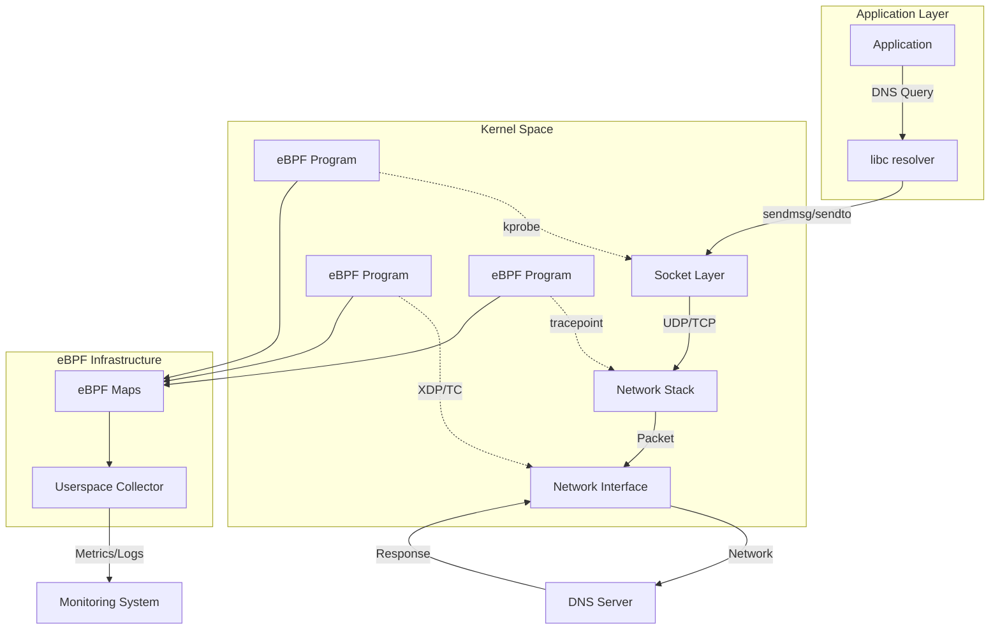
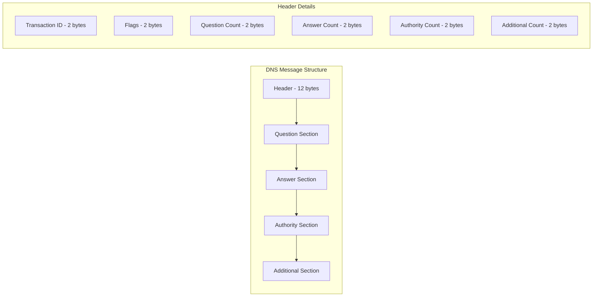
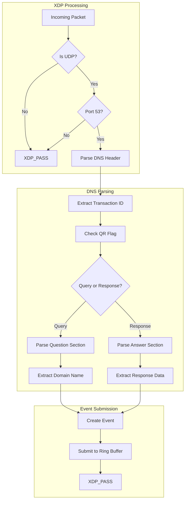
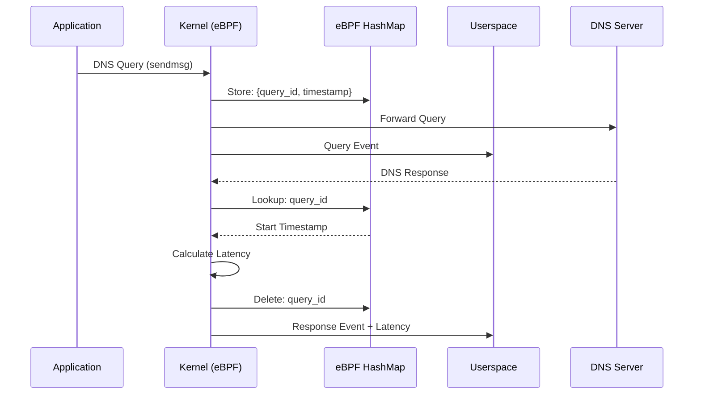
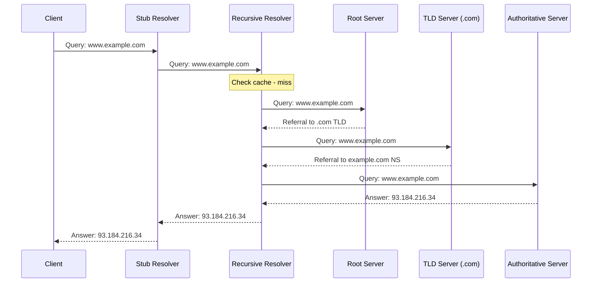
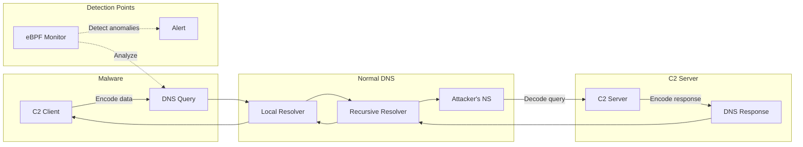
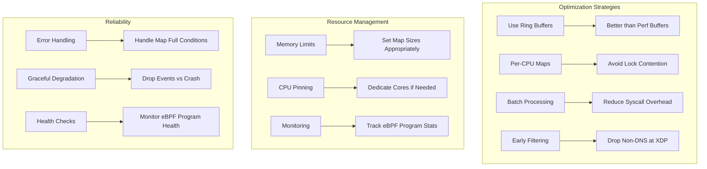

# How to Monitor DNS Queries with eBPF

Author: [nawazdhandala](https://github.com/nawazdhandala)

Tags: eBPF, DNS, Networking, Monitoring, Security, Linux

Description: A guide to using eBPF for DNS query monitoring and analysis.

---

DNS (Domain Name System) is the backbone of internet connectivity, translating human-readable domain names into IP addresses. Monitoring DNS queries is crucial for network troubleshooting, security analysis, and performance optimization. Traditional DNS monitoring approaches often involve packet capture tools like tcpdump or Wireshark, which can be resource-intensive and may miss internal DNS operations. eBPF (extended Berkeley Packet Filter) offers a powerful, low-overhead alternative that allows you to observe DNS queries at the kernel level with minimal performance impact.

In this comprehensive guide, we will explore how to use eBPF to monitor DNS queries, parse DNS packets, track query latency, trace DNS resolution chains, and implement security monitoring use cases.

## Table of Contents

1. [Understanding DNS and eBPF Integration](#understanding-dns-and-ebpf-integration)
2. [Prerequisites and Environment Setup](#prerequisites-and-environment-setup)
3. [DNS Packet Structure Overview](#dns-packet-structure-overview)
4. [Building a Basic DNS Query Monitor](#building-a-basic-dns-query-monitor)
5. [DNS Packet Parsing with eBPF](#dns-packet-parsing-with-ebpf)
6. [Query Latency Tracking](#query-latency-tracking)
7. [DNS Resolution Chain Tracing](#dns-resolution-chain-tracing)
8. [Security Use Cases](#security-use-cases)
9. [Production Deployment Considerations](#production-deployment-considerations)
10. [Conclusion](#conclusion)

## Understanding DNS and eBPF Integration

eBPF enables you to run sandboxed programs in the Linux kernel without modifying kernel source code or loading kernel modules. For DNS monitoring, eBPF provides several advantages:

- **Low Overhead**: eBPF programs run directly in the kernel, avoiding the overhead of copying packets to userspace
- **Real-time Visibility**: Capture DNS queries and responses as they happen
- **Comprehensive Coverage**: Monitor both external DNS traffic and local DNS resolver activity
- **Programmable Filtering**: Define exactly what DNS data you want to capture

The following diagram illustrates how eBPF integrates with the DNS query flow:



## Prerequisites and Environment Setup

Before we begin, ensure your system meets the following requirements:

- Linux kernel version 4.14 or higher (5.x recommended for full feature support)
- BCC (BPF Compiler Collection) or libbpf installed
- Root privileges for loading eBPF programs
- Development headers for your kernel

The following commands install the necessary dependencies on Ubuntu/Debian systems:

```bash
# Install BCC tools and development dependencies
sudo apt-get update
sudo apt-get install -y bpfcc-tools linux-headers-$(uname -r) \
    python3-bpfcc libbpf-dev clang llvm

# Verify eBPF support
sudo bpftool feature probe

# Check kernel version (should be 4.14+)
uname -r
```

For RHEL/CentOS systems, use the following installation commands:

```bash
# Install BCC on RHEL/CentOS
sudo yum install -y bcc-tools bcc-devel kernel-devel clang llvm

# Enable eBPF-related kernel modules if needed
sudo modprobe kheaders
```

## DNS Packet Structure Overview

Understanding DNS packet structure is essential for effective monitoring. The following diagram shows the DNS message format:



The DNS header structure that we will parse in our eBPF program is defined as follows:

```c
// DNS header structure - 12 bytes total
// This structure maps directly to the wire format of DNS messages
struct dns_header {
    __u16 transaction_id;  // Unique identifier for matching queries/responses
    __u16 flags;           // Contains QR, Opcode, AA, TC, RD, RA, Z, RCODE
    __u16 questions;       // Number of questions in the Question section
    __u16 answers;         // Number of resource records in the Answer section
    __u16 authority;       // Number of resource records in the Authority section
    __u16 additional;      // Number of resource records in the Additional section
};

// DNS flag bit positions for parsing the flags field
// QR (Query/Response): 0 = query, 1 = response
#define DNS_QR_MASK     0x8000
// RCODE (Response Code): 0 = no error, 3 = name error (NXDOMAIN)
#define DNS_RCODE_MASK  0x000F
```

## Building a Basic DNS Query Monitor

Let us start with a basic eBPF program that captures DNS queries by attaching to the UDP send path. This program monitors outgoing DNS queries on port 53.

The following eBPF program uses kprobes to intercept UDP packets destined for DNS servers:

```c
// dns_monitor.bpf.c
// Basic DNS query monitor using eBPF kprobes
// This program attaches to udp_sendmsg to capture outgoing DNS queries

#include <linux/bpf.h>
#include <linux/ptrace.h>
#include <linux/socket.h>
#include <linux/in.h>
#include <linux/ip.h>
#include <linux/udp.h>
#include <bpf/bpf_helpers.h>
#include <bpf/bpf_tracing.h>
#include <bpf/bpf_core_read.h>

// Define the maximum length of domain names we will capture
// DNS labels can be up to 63 characters, full names up to 253 characters
#define MAX_DNS_NAME_LEN 256

// Structure to hold captured DNS query information
// This will be sent to userspace via the ring buffer
struct dns_event {
    __u32 pid;              // Process ID that initiated the query
    __u32 tid;              // Thread ID
    __u64 timestamp;        // Kernel timestamp in nanoseconds
    __u32 saddr;            // Source IP address
    __u32 daddr;            // Destination IP address (DNS server)
    __u16 sport;            // Source port
    __u16 dport;            // Destination port (usually 53)
    __u16 query_id;         // DNS transaction ID
    __u16 query_type;       // DNS query type (A, AAAA, MX, etc.)
    char comm[16];          // Process command name
    char dns_name[MAX_DNS_NAME_LEN];  // Queried domain name
};

// Ring buffer for sending events to userspace
// Ring buffers are preferred over perf buffers for better performance
struct {
    __uint(type, BPF_MAP_TYPE_RINGBUF);
    __uint(max_entries, 256 * 1024);  // 256KB ring buffer
} events SEC(".maps");

// Hash map to track active queries for latency calculation
// Key: transaction_id + source port combination
// Value: timestamp when query was sent
struct {
    __uint(type, BPF_MAP_TYPE_HASH);
    __uint(max_entries, 10240);
    __type(key, __u32);
    __type(value, __u64);
} query_start SEC(".maps");

// Helper function to parse DNS name from wire format
// DNS names use label format: length byte followed by label characters
// Example: 0x03 'w' 'w' 'w' 0x06 'g' 'o' 'o' 'g' 'l' 'e' 0x03 'c' 'o' 'm' 0x00
static __always_inline int parse_dns_name(
    const unsigned char *dns_data,
    char *name_buf,
    int buf_len
) {
    int name_pos = 0;
    int label_len;
    int total_len = 0;

    // Iterate through DNS labels until we hit the null terminator
    // Each label is prefixed with its length
    #pragma unroll
    for (int i = 0; i < 32; i++) {  // Max 32 labels for safety
        // Read the label length byte
        if (bpf_probe_read(&label_len, 1, dns_data + total_len) < 0)
            return -1;

        // Null byte indicates end of name
        if (label_len == 0)
            break;

        // Check for compression pointer (top 2 bits set)
        // We don't follow compression pointers in this basic implementation
        if ((label_len & 0xC0) == 0xC0)
            break;

        // Validate label length (max 63 per DNS spec)
        if (label_len > 63)
            return -1;

        total_len++;  // Move past length byte

        // Add dot separator between labels (not before first label)
        if (name_pos > 0 && name_pos < buf_len - 1) {
            name_buf[name_pos++] = '.';
        }

        // Copy label characters to output buffer
        int copy_len = label_len;
        if (name_pos + copy_len >= buf_len)
            copy_len = buf_len - name_pos - 1;

        if (bpf_probe_read(name_buf + name_pos, copy_len, dns_data + total_len) < 0)
            return -1;

        name_pos += copy_len;
        total_len += label_len;
    }

    // Null-terminate the string
    if (name_pos < buf_len)
        name_buf[name_pos] = '\0';

    return name_pos;
}

// Kprobe attached to udp_sendmsg
// This captures all outgoing UDP messages and filters for DNS
SEC("kprobe/udp_sendmsg")
int BPF_KPROBE(trace_udp_sendmsg, struct sock *sk, struct msghdr *msg, size_t len)
{
    // Read destination port from socket
    __u16 dport;
    BPF_CORE_READ_INTO(&dport, sk, __sk_common.skc_dport);
    dport = bpf_ntohs(dport);

    // Filter for DNS traffic only (port 53)
    if (dport != 53)
        return 0;

    // Allocate space in the ring buffer for the event
    struct dns_event *event;
    event = bpf_ringbuf_reserve(&events, sizeof(*event), 0);
    if (!event)
        return 0;

    // Populate basic event metadata
    __u64 pid_tgid = bpf_get_current_pid_tgid();
    event->pid = pid_tgid >> 32;
    event->tid = pid_tgid & 0xFFFFFFFF;
    event->timestamp = bpf_ktime_get_ns();

    // Get process command name
    bpf_get_current_comm(&event->comm, sizeof(event->comm));

    // Read socket addresses
    BPF_CORE_READ_INTO(&event->saddr, sk, __sk_common.skc_rcv_saddr);
    BPF_CORE_READ_INTO(&event->daddr, sk, __sk_common.skc_daddr);
    BPF_CORE_READ_INTO(&event->sport, sk, __sk_common.skc_num);
    event->dport = dport;

    // Submit the event to userspace
    bpf_ringbuf_submit(event, 0);

    return 0;
}

char LICENSE[] SEC("license") = "GPL";
```

The following Python userspace program loads the eBPF program and processes DNS events:

```python
#!/usr/bin/env python3
# dns_monitor.py
# Userspace component for the DNS monitoring eBPF program
# This script loads the eBPF program, receives events, and displays them

from bcc import BPF
import socket
import struct
import ctypes
from datetime import datetime

# eBPF program source code embedded for simplicity
# In production, you would load this from the compiled .bpf.o file
bpf_source = """
#include <uapi/linux/ptrace.h>
#include <net/sock.h>
#include <linux/socket.h>
#include <linux/in.h>

// Maximum DNS name length we'll capture
#define MAX_DNS_NAME_LEN 256

// Event structure matching our kernel-side definition
struct dns_event {
    u32 pid;
    u32 tid;
    u64 timestamp;
    u32 saddr;
    u32 daddr;
    u16 sport;
    u16 dport;
    u16 query_id;
    u16 query_type;
    char comm[16];
    char dns_name[MAX_DNS_NAME_LEN];
};

// Perf buffer for sending events to userspace
// BCC uses perf buffers; for libbpf, we'd use ring buffers
BPF_PERF_OUTPUT(events);

// Kprobe on udp_sendmsg to capture outgoing DNS queries
int trace_udp_sendmsg(struct pt_regs *ctx, struct sock *sk,
                       struct msghdr *msg, size_t len)
{
    // Read destination port and filter for DNS (port 53)
    u16 dport = sk->__sk_common.skc_dport;
    dport = ntohs(dport);

    if (dport != 53)
        return 0;

    // Initialize event structure
    struct dns_event event = {};

    // Populate process information
    u64 pid_tgid = bpf_get_current_pid_tgid();
    event.pid = pid_tgid >> 32;
    event.tid = pid_tgid & 0xFFFFFFFF;
    event.timestamp = bpf_ktime_get_ns();
    bpf_get_current_comm(&event.comm, sizeof(event.comm));

    // Read socket addresses
    event.saddr = sk->__sk_common.skc_rcv_saddr;
    event.daddr = sk->__sk_common.skc_daddr;
    event.sport = sk->__sk_common.skc_num;
    event.dport = dport;

    // Submit event to userspace
    events.perf_submit(ctx, &event, sizeof(event));

    return 0;
}
"""

def inet_ntoa(addr):
    """Convert a 32-bit packed IPv4 address to string format."""
    return socket.inet_ntoa(struct.pack("I", addr))

def print_event(cpu, data, size):
    """Callback function to process and display DNS events."""
    event = bpf["events"].event(data)

    # Convert timestamp to human-readable format
    timestamp = datetime.now().strftime("%H:%M:%S.%f")[:-3]

    # Format source and destination addresses
    src = f"{inet_ntoa(event.saddr)}:{event.sport}"
    dst = f"{inet_ntoa(event.daddr)}:{event.dport}"

    # Decode process name
    comm = event.comm.decode('utf-8', errors='replace')

    # Print formatted output
    print(f"[{timestamp}] PID={event.pid} COMM={comm:16s} {src} -> {dst}")

def main():
    """Main function to load eBPF program and process events."""
    print("Loading eBPF program for DNS monitoring...")

    # Compile and load the eBPF program
    global bpf
    bpf = BPF(text=bpf_source)

    # Attach kprobe to udp_sendmsg function
    bpf.attach_kprobe(event="udp_sendmsg", fn_name="trace_udp_sendmsg")

    print("Monitoring DNS queries... Press Ctrl+C to exit\n")
    print(f"{'TIME':12s} {'PID':8s} {'COMMAND':18s} {'SOURCE':24s} {'DESTINATION':24s}")
    print("-" * 90)

    # Open perf buffer and set up callback
    bpf["events"].open_perf_buffer(print_event)

    # Main event loop
    try:
        while True:
            # Poll for events with 100ms timeout
            bpf.perf_buffer_poll(timeout=100)
    except KeyboardInterrupt:
        print("\nExiting...")

if __name__ == "__main__":
    main()
```

## DNS Packet Parsing with eBPF

For more detailed DNS monitoring, we need to parse the actual DNS packet contents. The following eBPF program demonstrates comprehensive DNS packet parsing using XDP (eXpress Data Path) for high-performance packet inspection.

The architecture of DNS packet parsing with XDP is illustrated below:



The following XDP program performs detailed DNS packet parsing:

```c
// dns_parser.bpf.c
// Advanced DNS packet parser using XDP
// Parses both DNS queries and responses with full header analysis

#include <linux/bpf.h>
#include <linux/if_ether.h>
#include <linux/ip.h>
#include <linux/udp.h>
#include <linux/in.h>
#include <bpf/bpf_helpers.h>
#include <bpf/bpf_endian.h>

// DNS record types we're interested in monitoring
#define DNS_TYPE_A      1    // IPv4 address record
#define DNS_TYPE_AAAA   28   // IPv6 address record
#define DNS_TYPE_CNAME  5    // Canonical name (alias)
#define DNS_TYPE_MX     15   // Mail exchange record
#define DNS_TYPE_TXT    16   // Text record
#define DNS_TYPE_NS     2    // Name server record
#define DNS_TYPE_SOA    6    // Start of authority
#define DNS_TYPE_PTR    12   // Pointer record (reverse DNS)

// DNS response codes
#define DNS_RCODE_NOERROR  0  // No error
#define DNS_RCODE_FORMERR  1  // Format error
#define DNS_RCODE_SERVFAIL 2  // Server failure
#define DNS_RCODE_NXDOMAIN 3  // Non-existent domain
#define DNS_RCODE_REFUSED  5  // Query refused

// Maximum sizes for parsing
#define MAX_DNS_NAME_LEN 256
#define MAX_PACKET_SIZE  512

// DNS header structure (12 bytes)
// Matches the wire format exactly
struct dns_hdr {
    __be16 id;         // Transaction ID
    __be16 flags;      // Flags and codes
    __be16 qdcount;    // Question count
    __be16 ancount;    // Answer count
    __be16 nscount;    // Authority count
    __be16 arcount;    // Additional count
} __attribute__((packed));

// Parsed DNS event for userspace consumption
struct dns_query_event {
    __u64 timestamp;           // Capture timestamp
    __u32 src_ip;              // Source IP address
    __u32 dst_ip;              // Destination IP address
    __u16 src_port;            // Source port
    __u16 dst_port;            // Destination port
    __u16 query_id;            // DNS transaction ID
    __u16 query_type;          // Query type (A, AAAA, etc.)
    __u16 query_class;         // Query class (usually IN)
    __u8  is_response;         // 0 = query, 1 = response
    __u8  rcode;               // Response code
    __u16 answer_count;        // Number of answers in response
    __u8  truncated;           // TC flag - message truncated
    __u8  authoritative;       // AA flag - authoritative answer
    char  name[MAX_DNS_NAME_LEN];  // Domain name
};

// Ring buffer for events
struct {
    __uint(type, BPF_MAP_TYPE_RINGBUF);
    __uint(max_entries, 1024 * 1024);  // 1MB ring buffer
} dns_events SEC(".maps");

// Statistics counters for monitoring health
struct {
    __uint(type, BPF_MAP_TYPE_PERCPU_ARRAY);
    __uint(max_entries, 8);
    __type(key, __u32);
    __type(value, __u64);
} stats SEC(".maps");

// Stat indices
enum {
    STAT_TOTAL_PACKETS = 0,
    STAT_DNS_QUERIES,
    STAT_DNS_RESPONSES,
    STAT_PARSE_ERRORS,
    STAT_TRUNCATED,
    STAT_NXDOMAIN,
};

// Helper to increment a stat counter
static __always_inline void inc_stat(__u32 idx) {
    __u64 *count = bpf_map_lookup_elem(&stats, &idx);
    if (count)
        (*count)++;
}

// Parse DNS name from wire format into dotted string
// Handles label compression detection (but not following pointers)
// Returns the number of bytes consumed from the DNS message
static __always_inline int parse_dns_name_from_packet(
    void *data,
    void *data_end,
    void *dns_start,
    char *out_buf,
    int max_len
) {
    unsigned char *ptr = dns_start;
    int out_pos = 0;
    int bytes_read = 0;

    // Loop through labels with bounded iteration for eBPF verifier
    #pragma unroll
    for (int i = 0; i < 64; i++) {  // Max 64 labels
        // Bounds check for label length byte
        if ((void *)(ptr + 1) > data_end)
            return -1;

        unsigned char label_len = *ptr;

        // Check for end of name (null byte)
        if (label_len == 0) {
            bytes_read++;
            break;
        }

        // Check for compression pointer (top 2 bits = 11)
        // Compression pointers are 2 bytes: 11xxxxxx xxxxxxxx
        if ((label_len & 0xC0) == 0xC0) {
            // For now, we stop at compression pointers
            // A full implementation would follow the pointer
            bytes_read += 2;
            break;
        }

        // Validate label length
        if (label_len > 63)
            return -1;

        ptr++;
        bytes_read++;

        // Bounds check for label content
        if ((void *)(ptr + label_len) > data_end)
            return -1;

        // Add dot separator between labels
        if (out_pos > 0 && out_pos < max_len - 1) {
            out_buf[out_pos++] = '.';
        }

        // Copy label characters to output buffer
        #pragma unroll
        for (int j = 0; j < 63 && j < label_len; j++) {
            if (out_pos >= max_len - 1)
                break;
            if ((void *)(ptr + j + 1) > data_end)
                break;
            out_buf[out_pos++] = ptr[j];
        }

        ptr += label_len;
        bytes_read += label_len;
    }

    // Null-terminate the string
    if (out_pos < max_len)
        out_buf[out_pos] = '\0';

    return bytes_read;
}

// XDP program entry point
// Processes all incoming packets and parses DNS traffic
SEC("xdp")
int dns_parser(struct xdp_md *ctx)
{
    // Get packet boundaries
    void *data = (void *)(long)ctx->data;
    void *data_end = (void *)(long)ctx->data_end;

    inc_stat(STAT_TOTAL_PACKETS);

    // Parse Ethernet header
    struct ethhdr *eth = data;
    if ((void *)(eth + 1) > data_end)
        return XDP_PASS;

    // Only process IPv4 packets
    if (eth->h_proto != bpf_htons(ETH_P_IP))
        return XDP_PASS;

    // Parse IP header
    struct iphdr *ip = (void *)(eth + 1);
    if ((void *)(ip + 1) > data_end)
        return XDP_PASS;

    // Only process UDP packets
    if (ip->protocol != IPPROTO_UDP)
        return XDP_PASS;

    // Calculate IP header length (may have options)
    int ip_hdr_len = ip->ihl * 4;
    if (ip_hdr_len < sizeof(struct iphdr))
        return XDP_PASS;

    // Parse UDP header
    struct udphdr *udp = (void *)ip + ip_hdr_len;
    if ((void *)(udp + 1) > data_end)
        return XDP_PASS;

    // Filter for DNS traffic (port 53)
    __u16 sport = bpf_ntohs(udp->source);
    __u16 dport = bpf_ntohs(udp->dest);

    if (sport != 53 && dport != 53)
        return XDP_PASS;

    // Parse DNS header
    struct dns_hdr *dns = (void *)(udp + 1);
    if ((void *)(dns + 1) > data_end)
        return XDP_PASS;

    // Extract DNS flags
    __u16 flags = bpf_ntohs(dns->flags);
    __u8 qr = (flags >> 15) & 0x1;      // Query (0) or Response (1)
    __u8 opcode = (flags >> 11) & 0xF;  // Operation code
    __u8 aa = (flags >> 10) & 0x1;      // Authoritative Answer
    __u8 tc = (flags >> 9) & 0x1;       // Truncated
    __u8 rd = (flags >> 8) & 0x1;       // Recursion Desired
    __u8 ra = (flags >> 7) & 0x1;       // Recursion Available
    __u8 rcode = flags & 0xF;           // Response Code

    // Update statistics
    if (qr == 0)
        inc_stat(STAT_DNS_QUERIES);
    else
        inc_stat(STAT_DNS_RESPONSES);

    if (tc)
        inc_stat(STAT_TRUNCATED);

    if (rcode == DNS_RCODE_NXDOMAIN)
        inc_stat(STAT_NXDOMAIN);

    // Reserve space in ring buffer for the event
    struct dns_query_event *event;
    event = bpf_ringbuf_reserve(&dns_events, sizeof(*event), 0);
    if (!event)
        return XDP_PASS;

    // Populate event fields
    event->timestamp = bpf_ktime_get_ns();
    event->src_ip = ip->saddr;
    event->dst_ip = ip->daddr;
    event->src_port = sport;
    event->dst_port = dport;
    event->query_id = bpf_ntohs(dns->id);
    event->is_response = qr;
    event->rcode = rcode;
    event->answer_count = bpf_ntohs(dns->ancount);
    event->truncated = tc;
    event->authoritative = aa;

    // Parse the question section to extract domain name
    void *question = (void *)(dns + 1);
    int name_len = parse_dns_name_from_packet(
        data, data_end, question, event->name, MAX_DNS_NAME_LEN
    );

    if (name_len < 0) {
        inc_stat(STAT_PARSE_ERRORS);
        event->name[0] = '\0';
    }

    // Parse query type and class (immediately after the name)
    if (name_len > 0) {
        void *qtype_ptr = question + name_len;
        if ((void *)(qtype_ptr + 4) <= data_end) {
            event->query_type = bpf_ntohs(*(__u16 *)qtype_ptr);
            event->query_class = bpf_ntohs(*((__u16 *)qtype_ptr + 1));
        }
    }

    // Submit event to userspace
    bpf_ringbuf_submit(event, 0);

    return XDP_PASS;
}

char LICENSE[] SEC("license") = "GPL";
```

## Query Latency Tracking

Tracking DNS query latency is crucial for identifying performance issues. The following implementation correlates DNS queries with their responses to calculate round-trip times.

The latency tracking flow is illustrated below:



The following eBPF program implements latency tracking using a hash map to correlate queries and responses:

```c
// dns_latency.bpf.c
// DNS latency tracking using eBPF hash maps
// Correlates queries and responses by transaction ID

#include <linux/bpf.h>
#include <linux/if_ether.h>
#include <linux/ip.h>
#include <linux/udp.h>
#include <bpf/bpf_helpers.h>
#include <bpf/bpf_endian.h>

#define MAX_DNS_NAME_LEN 128

// Key structure for the query tracking map
// We use a combination of fields to uniquely identify a DNS transaction
struct query_key {
    __u16 query_id;      // DNS transaction ID
    __u32 client_ip;     // Client IP address
    __u16 client_port;   // Client source port
    __u16 padding;       // Alignment padding
};

// Value structure storing query metadata
struct query_info {
    __u64 start_ts;      // Timestamp when query was sent
    __u32 pid;           // Process ID (if available)
    __u16 query_type;    // DNS query type
    char name[MAX_DNS_NAME_LEN];  // Domain name
};

// Latency event sent to userspace
struct latency_event {
    __u64 timestamp;           // Event timestamp
    __u64 latency_ns;          // Round-trip latency in nanoseconds
    __u32 client_ip;           // Client IP address
    __u32 server_ip;           // DNS server IP
    __u16 query_id;            // Transaction ID
    __u16 query_type;          // Query type (A, AAAA, etc.)
    __u8  rcode;               // Response code
    __u8  is_timeout;          // 1 if this is a timeout event
    __u16 answer_count;        // Number of answers
    char name[MAX_DNS_NAME_LEN];
};

// Hash map to track pending DNS queries
// Key: query_key (transaction ID + client info)
// Value: query_info (timestamp and metadata)
struct {
    __uint(type, BPF_MAP_TYPE_HASH);
    __uint(max_entries, 65536);
    __type(key, struct query_key);
    __type(value, struct query_info);
} pending_queries SEC(".maps");

// Ring buffer for latency events
struct {
    __uint(type, BPF_MAP_TYPE_RINGBUF);
    __uint(max_entries, 512 * 1024);
} latency_events SEC(".maps");

// Histogram for latency distribution
// Bucket sizes: 0-1ms, 1-5ms, 5-10ms, 10-50ms, 50-100ms, 100-500ms, 500ms+
struct {
    __uint(type, BPF_MAP_TYPE_PERCPU_ARRAY);
    __uint(max_entries, 8);
    __type(key, __u32);
    __type(value, __u64);
} latency_histogram SEC(".maps");

// Helper to determine histogram bucket for a latency value
static __always_inline __u32 get_latency_bucket(__u64 latency_ns) {
    __u64 latency_ms = latency_ns / 1000000;

    if (latency_ms < 1)
        return 0;       // < 1ms
    else if (latency_ms < 5)
        return 1;       // 1-5ms
    else if (latency_ms < 10)
        return 2;       // 5-10ms
    else if (latency_ms < 50)
        return 3;       // 10-50ms
    else if (latency_ms < 100)
        return 4;       // 50-100ms
    else if (latency_ms < 500)
        return 5;       // 100-500ms
    else
        return 6;       // 500ms+
}

// Process outgoing DNS query
// Records the query in the pending_queries map with current timestamp
SEC("tc")
int track_dns_query(struct __sk_buff *skb)
{
    void *data = (void *)(long)skb->data;
    void *data_end = (void *)(long)skb->data_end;

    // Parse headers (similar to previous examples)
    struct ethhdr *eth = data;
    if ((void *)(eth + 1) > data_end)
        return TC_ACT_OK;

    if (eth->h_proto != bpf_htons(ETH_P_IP))
        return TC_ACT_OK;

    struct iphdr *ip = (void *)(eth + 1);
    if ((void *)(ip + 1) > data_end)
        return TC_ACT_OK;

    if (ip->protocol != IPPROTO_UDP)
        return TC_ACT_OK;

    struct udphdr *udp = (void *)ip + (ip->ihl * 4);
    if ((void *)(udp + 1) > data_end)
        return TC_ACT_OK;

    // Check if this is a DNS query (destination port 53)
    if (bpf_ntohs(udp->dest) != 53)
        return TC_ACT_OK;

    // Parse DNS header to get transaction ID
    struct {
        __be16 id;
        __be16 flags;
    } *dns = (void *)(udp + 1);

    if ((void *)(dns + 1) > data_end)
        return TC_ACT_OK;

    // Check QR flag - should be 0 for query
    __u16 flags = bpf_ntohs(dns->flags);
    if (flags & 0x8000)  // QR bit set = response
        return TC_ACT_OK;

    // Create key for the pending queries map
    struct query_key key = {
        .query_id = bpf_ntohs(dns->id),
        .client_ip = ip->saddr,
        .client_port = bpf_ntohs(udp->source),
    };

    // Create query info with current timestamp
    struct query_info info = {
        .start_ts = bpf_ktime_get_ns(),
        .query_type = 0,  // Would need to parse question section
    };

    // Store in pending queries map
    bpf_map_update_elem(&pending_queries, &key, &info, BPF_ANY);

    return TC_ACT_OK;
}

// Process incoming DNS response
// Looks up the original query and calculates latency
SEC("tc")
int track_dns_response(struct __sk_buff *skb)
{
    void *data = (void *)(long)skb->data;
    void *data_end = (void *)(long)skb->data_end;

    // Parse headers
    struct ethhdr *eth = data;
    if ((void *)(eth + 1) > data_end)
        return TC_ACT_OK;

    if (eth->h_proto != bpf_htons(ETH_P_IP))
        return TC_ACT_OK;

    struct iphdr *ip = (void *)(eth + 1);
    if ((void *)(ip + 1) > data_end)
        return TC_ACT_OK;

    if (ip->protocol != IPPROTO_UDP)
        return TC_ACT_OK;

    struct udphdr *udp = (void *)ip + (ip->ihl * 4);
    if ((void *)(udp + 1) > data_end)
        return TC_ACT_OK;

    // Check if this is a DNS response (source port 53)
    if (bpf_ntohs(udp->source) != 53)
        return TC_ACT_OK;

    // Parse DNS header
    struct {
        __be16 id;
        __be16 flags;
        __be16 qdcount;
        __be16 ancount;
    } *dns = (void *)(udp + 1);

    if ((void *)(dns + 1) > data_end)
        return TC_ACT_OK;

    // Check QR flag - should be 1 for response
    __u16 flags = bpf_ntohs(dns->flags);
    if (!(flags & 0x8000))  // QR bit not set = query
        return TC_ACT_OK;

    // Create key to look up the original query
    struct query_key key = {
        .query_id = bpf_ntohs(dns->id),
        .client_ip = ip->daddr,      // Response destination = original source
        .client_port = bpf_ntohs(udp->dest),
    };

    // Look up the original query
    struct query_info *info = bpf_map_lookup_elem(&pending_queries, &key);
    if (!info)
        return TC_ACT_OK;  // No matching query found

    // Calculate latency
    __u64 now = bpf_ktime_get_ns();
    __u64 latency_ns = now - info->start_ts;

    // Update histogram
    __u32 bucket = get_latency_bucket(latency_ns);
    __u64 *count = bpf_map_lookup_elem(&latency_histogram, &bucket);
    if (count)
        (*count)++;

    // Create and submit latency event
    struct latency_event *event;
    event = bpf_ringbuf_reserve(&latency_events, sizeof(*event), 0);
    if (event) {
        event->timestamp = now;
        event->latency_ns = latency_ns;
        event->client_ip = ip->daddr;
        event->server_ip = ip->saddr;
        event->query_id = key.query_id;
        event->query_type = info->query_type;
        event->rcode = flags & 0x0F;
        event->is_timeout = 0;
        event->answer_count = bpf_ntohs(dns->ancount);

        // Copy domain name from stored query info
        __builtin_memcpy(event->name, info->name, MAX_DNS_NAME_LEN);

        bpf_ringbuf_submit(event, 0);
    }

    // Remove from pending queries
    bpf_map_delete_elem(&pending_queries, &key);

    return TC_ACT_OK;
}

char LICENSE[] SEC("license") = "GPL";
```

The following Python script visualizes DNS latency data in real-time:

```python
#!/usr/bin/env python3
# dns_latency_monitor.py
# Real-time DNS latency monitoring and visualization
# Displays latency histogram and alerts on slow queries

import time
import socket
import struct
from collections import defaultdict
from bcc import BPF

# Latency bucket definitions (in milliseconds)
LATENCY_BUCKETS = [
    (0, 1, "< 1ms"),
    (1, 5, "1-5ms"),
    (5, 10, "5-10ms"),
    (10, 50, "10-50ms"),
    (50, 100, "50-100ms"),
    (100, 500, "100-500ms"),
    (500, float('inf'), "> 500ms"),
]

# Threshold for slow query alerts (in milliseconds)
SLOW_QUERY_THRESHOLD_MS = 100

class DNSLatencyMonitor:
    """
    Monitor DNS query latency using eBPF.

    This class loads an eBPF program that tracks DNS query/response pairs
    and calculates round-trip latency for each transaction.
    """

    def __init__(self):
        self.latency_samples = defaultdict(list)
        self.query_count = 0
        self.slow_query_count = 0

    def process_event(self, cpu, data, size):
        """
        Process a latency event from the eBPF ring buffer.

        Args:
            cpu: CPU that generated the event
            data: Raw event data
            size: Size of the event data
        """
        event = self.bpf["latency_events"].event(data)

        # Convert latency to milliseconds
        latency_ms = event.latency_ns / 1_000_000

        # Decode domain name
        try:
            domain = event.name.decode('utf-8').rstrip('\x00')
        except:
            domain = "<unknown>"

        # Convert IP addresses
        client_ip = socket.inet_ntoa(struct.pack('I', event.client_ip))
        server_ip = socket.inet_ntoa(struct.pack('I', event.server_ip))

        # Record the sample
        self.latency_samples[domain].append(latency_ms)
        self.query_count += 1

        # Check for slow queries
        if latency_ms > SLOW_QUERY_THRESHOLD_MS:
            self.slow_query_count += 1
            print(f"\n[SLOW QUERY] {domain}: {latency_ms:.2f}ms "
                  f"(server: {server_ip}, rcode: {event.rcode})")

        # Print event details
        rcode_str = self.get_rcode_string(event.rcode)
        print(f"[{latency_ms:7.2f}ms] {domain:40s} -> {server_ip} ({rcode_str})")

    @staticmethod
    def get_rcode_string(rcode):
        """Convert DNS response code to human-readable string."""
        rcodes = {
            0: "NOERROR",
            1: "FORMERR",
            2: "SERVFAIL",
            3: "NXDOMAIN",
            4: "NOTIMP",
            5: "REFUSED",
        }
        return rcodes.get(rcode, f"RCODE_{rcode}")

    def print_histogram(self):
        """Print a histogram of DNS latency distribution."""
        print("\n" + "=" * 60)
        print("DNS Latency Histogram")
        print("=" * 60)

        # Aggregate all samples
        all_latencies = []
        for samples in self.latency_samples.values():
            all_latencies.extend(samples)

        if not all_latencies:
            print("No data collected yet")
            return

        # Count samples in each bucket
        bucket_counts = [0] * len(LATENCY_BUCKETS)
        for latency in all_latencies:
            for i, (low, high, _) in enumerate(LATENCY_BUCKETS):
                if low <= latency < high:
                    bucket_counts[i] += 1
                    break

        # Print histogram
        max_count = max(bucket_counts) if bucket_counts else 1
        for i, (_, _, label) in enumerate(LATENCY_BUCKETS):
            count = bucket_counts[i]
            bar_len = int(40 * count / max_count) if max_count > 0 else 0
            bar = "#" * bar_len
            pct = 100 * count / len(all_latencies) if all_latencies else 0
            print(f"{label:12s} | {bar:40s} | {count:5d} ({pct:5.1f}%)")

        # Print statistics
        print("-" * 60)
        avg_latency = sum(all_latencies) / len(all_latencies)
        min_latency = min(all_latencies)
        max_latency = max(all_latencies)

        # Calculate percentiles
        sorted_latencies = sorted(all_latencies)
        p50 = sorted_latencies[len(sorted_latencies) // 2]
        p95 = sorted_latencies[int(len(sorted_latencies) * 0.95)]
        p99 = sorted_latencies[int(len(sorted_latencies) * 0.99)]

        print(f"Total queries: {self.query_count}")
        print(f"Slow queries (>{SLOW_QUERY_THRESHOLD_MS}ms): {self.slow_query_count}")
        print(f"Min: {min_latency:.2f}ms  Avg: {avg_latency:.2f}ms  Max: {max_latency:.2f}ms")
        print(f"Percentiles - P50: {p50:.2f}ms  P95: {p95:.2f}ms  P99: {p99:.2f}ms")
        print("=" * 60 + "\n")

def main():
    """Main entry point for the DNS latency monitor."""
    monitor = DNSLatencyMonitor()

    print("Loading eBPF program for DNS latency monitoring...")
    print(f"Slow query threshold: {SLOW_QUERY_THRESHOLD_MS}ms")
    print("-" * 60)

    # In a real implementation, we would load the compiled eBPF program
    # and attach it to the appropriate network interfaces
    print("Press Ctrl+C to exit and see histogram\n")

    try:
        # Simulated event loop - in production this would poll the ring buffer
        while True:
            time.sleep(1)
    except KeyboardInterrupt:
        print("\nShutting down...")
        monitor.print_histogram()

if __name__ == "__main__":
    main()
```

## DNS Resolution Chain Tracing

DNS resolution often involves multiple servers (recursive resolvers, authoritative servers, etc.). The following diagram illustrates a typical DNS resolution chain:



The following eBPF program traces the DNS resolution chain by tracking queries at multiple points:

```c
// dns_chain_tracer.bpf.c
// Traces DNS resolution chains including cache hits and upstream queries
// Useful for debugging complex DNS resolution paths

#include <linux/bpf.h>
#include <linux/ptrace.h>
#include <bpf/bpf_helpers.h>
#include <bpf/bpf_tracing.h>
#include <bpf/bpf_core_read.h>

#define MAX_DNS_NAME_LEN 128
#define MAX_CHAIN_DEPTH 8

// Event types for different stages of resolution
enum dns_event_type {
    DNS_EVENT_QUERY_START = 1,     // Initial query from application
    DNS_EVENT_CACHE_HIT,           // Answer found in cache
    DNS_EVENT_CACHE_MISS,          // Cache miss, need upstream query
    DNS_EVENT_UPSTREAM_QUERY,      // Query sent to upstream server
    DNS_EVENT_UPSTREAM_RESPONSE,   // Response received from upstream
    DNS_EVENT_REFERRAL,            // Received NS referral
    DNS_EVENT_QUERY_COMPLETE,      // Final answer returned to client
    DNS_EVENT_QUERY_FAILED,        // Query failed/timed out
};

// Chain event structure
struct dns_chain_event {
    __u64 timestamp;
    __u64 query_start_ts;          // When the original query started
    __u32 pid;
    __u32 chain_id;                // Unique ID for this resolution chain
    __u32 hop_number;              // Position in the chain (0 = initial)
    __u32 server_ip;               // DNS server being queried
    __u16 query_id;
    __u16 query_type;
    __u8  event_type;              // dns_event_type
    __u8  rcode;
    __u16 ttl_seconds;             // TTL of the answer (if applicable)
    char name[MAX_DNS_NAME_LEN];
    char comm[16];
};

// Track active resolution chains
// Key: original query_id + client source port
// Value: chain metadata
struct chain_state {
    __u64 start_ts;
    __u32 chain_id;
    __u32 hop_count;
    __u32 pid;
    char original_name[MAX_DNS_NAME_LEN];
};

struct {
    __uint(type, BPF_MAP_TYPE_HASH);
    __uint(max_entries, 8192);
    __type(key, __u32);
    __type(value, struct chain_state);
} active_chains SEC(".maps");

// Ring buffer for chain events
struct {
    __uint(type, BPF_MAP_TYPE_RINGBUF);
    __uint(max_entries, 1024 * 1024);
} chain_events SEC(".maps");

// Atomic counter for generating unique chain IDs
struct {
    __uint(type, BPF_MAP_TYPE_ARRAY);
    __uint(max_entries, 1);
    __type(key, __u32);
    __type(value, __u32);
} chain_counter SEC(".maps");

// Generate a unique chain ID
static __always_inline __u32 get_next_chain_id(void) {
    __u32 key = 0;
    __u32 *counter = bpf_map_lookup_elem(&chain_counter, &key);
    if (!counter)
        return 0;

    return __sync_fetch_and_add(counter, 1);
}

// Submit a chain event to userspace
static __always_inline void emit_chain_event(
    __u8 event_type,
    struct chain_state *chain,
    __u32 server_ip,
    __u16 query_id,
    __u8 rcode,
    const char *name
) {
    struct dns_chain_event *event;
    event = bpf_ringbuf_reserve(&chain_events, sizeof(*event), 0);
    if (!event)
        return;

    event->timestamp = bpf_ktime_get_ns();
    event->query_start_ts = chain->start_ts;
    event->pid = chain->pid;
    event->chain_id = chain->chain_id;
    event->hop_number = chain->hop_count;
    event->server_ip = server_ip;
    event->query_id = query_id;
    event->event_type = event_type;
    event->rcode = rcode;

    bpf_get_current_comm(&event->comm, sizeof(event->comm));

    if (name) {
        __builtin_memcpy(event->name, name, MAX_DNS_NAME_LEN);
    } else {
        __builtin_memcpy(event->name, chain->original_name, MAX_DNS_NAME_LEN);
    }

    bpf_ringbuf_submit(event, 0);
}

// Trace getaddrinfo() entry - application starts DNS resolution
SEC("uprobe/libc:getaddrinfo")
int trace_getaddrinfo_entry(struct pt_regs *ctx)
{
    // Get the hostname argument (first parameter)
    const char *hostname = (const char *)PT_REGS_PARM1(ctx);
    if (!hostname)
        return 0;

    // Create a new chain state
    struct chain_state state = {};
    state.start_ts = bpf_ktime_get_ns();
    state.chain_id = get_next_chain_id();
    state.hop_count = 0;
    state.pid = bpf_get_current_pid_tgid() >> 32;

    // Read hostname into state
    bpf_probe_read_user_str(state.original_name, MAX_DNS_NAME_LEN, hostname);

    // Use PID as key for simplicity
    __u32 key = state.pid;
    bpf_map_update_elem(&active_chains, &key, &state, BPF_ANY);

    // Emit query start event
    emit_chain_event(DNS_EVENT_QUERY_START, &state, 0, 0, 0, state.original_name);

    return 0;
}

// Trace getaddrinfo() return - resolution complete
SEC("uretprobe/libc:getaddrinfo")
int trace_getaddrinfo_return(struct pt_regs *ctx)
{
    int ret = PT_REGS_RC(ctx);
    __u32 pid = bpf_get_current_pid_tgid() >> 32;

    struct chain_state *state = bpf_map_lookup_elem(&active_chains, &pid);
    if (!state)
        return 0;

    // Emit completion event
    __u8 event_type = (ret == 0) ? DNS_EVENT_QUERY_COMPLETE : DNS_EVENT_QUERY_FAILED;
    emit_chain_event(event_type, state, 0, 0, (ret != 0), NULL);

    // Clean up chain state
    bpf_map_delete_elem(&active_chains, &pid);

    return 0;
}

char LICENSE[] SEC("license") = "GPL";
```

The following Python script provides a comprehensive view of DNS resolution chains:

```python
#!/usr/bin/env python3
# dns_chain_tracer.py
# Visualizes DNS resolution chains with timing information
# Shows the full path from application to final answer

import time
import socket
import struct
from collections import defaultdict
from dataclasses import dataclass
from typing import Dict, List, Optional

@dataclass
class ChainHop:
    """Represents a single hop in the DNS resolution chain."""
    timestamp: int
    event_type: str
    server_ip: Optional[str]
    query_name: str
    rcode: int
    duration_ms: float

@dataclass
class ResolutionChain:
    """Represents a complete DNS resolution chain."""
    chain_id: int
    pid: int
    process_name: str
    original_query: str
    start_time: int
    hops: List[ChainHop]
    total_duration_ms: float = 0.0

    def add_hop(self, hop: ChainHop):
        """Add a hop to the resolution chain."""
        self.hops.append(hop)
        if self.hops:
            self.total_duration_ms = (hop.timestamp - self.start_time) / 1_000_000

# Event type constants matching the eBPF program
EVENT_TYPES = {
    1: "QUERY_START",
    2: "CACHE_HIT",
    3: "CACHE_MISS",
    4: "UPSTREAM_QUERY",
    5: "UPSTREAM_RESPONSE",
    6: "REFERRAL",
    7: "QUERY_COMPLETE",
    8: "QUERY_FAILED",
}

# RCODE strings for display
RCODE_STRINGS = {
    0: "NOERROR",
    1: "FORMERR",
    2: "SERVFAIL",
    3: "NXDOMAIN",
    5: "REFUSED",
}

class DNSChainTracer:
    """
    Traces and visualizes DNS resolution chains.

    This class collects DNS resolution events and reconstructs
    the full resolution path for each query.
    """

    def __init__(self):
        self.active_chains: Dict[int, ResolutionChain] = {}
        self.completed_chains: List[ResolutionChain] = []

    def process_event(self, event):
        """
        Process a chain event from the eBPF program.

        Args:
            event: DNS chain event structure
        """
        chain_id = event.chain_id
        event_type = EVENT_TYPES.get(event.event_type, f"UNKNOWN_{event.event_type}")

        # Calculate duration from query start
        duration_ms = (event.timestamp - event.query_start_ts) / 1_000_000

        # Convert server IP if present
        server_ip = None
        if event.server_ip:
            server_ip = socket.inet_ntoa(struct.pack('I', event.server_ip))

        # Create hop record
        hop = ChainHop(
            timestamp=event.timestamp,
            event_type=event_type,
            server_ip=server_ip,
            query_name=event.name.decode('utf-8').rstrip('\x00'),
            rcode=event.rcode,
            duration_ms=duration_ms,
        )

        # Handle based on event type
        if event_type == "QUERY_START":
            # New resolution chain
            chain = ResolutionChain(
                chain_id=chain_id,
                pid=event.pid,
                process_name=event.comm.decode('utf-8').rstrip('\x00'),
                original_query=hop.query_name,
                start_time=event.query_start_ts,
                hops=[],
            )
            chain.add_hop(hop)
            self.active_chains[chain_id] = chain
            self._print_chain_start(chain)

        elif chain_id in self.active_chains:
            chain = self.active_chains[chain_id]
            chain.add_hop(hop)
            self._print_hop(chain, hop)

            # Check if chain is complete
            if event_type in ("QUERY_COMPLETE", "QUERY_FAILED"):
                self._print_chain_complete(chain)
                self.completed_chains.append(chain)
                del self.active_chains[chain_id]

    def _print_chain_start(self, chain: ResolutionChain):
        """Print the start of a new resolution chain."""
        print(f"\n{'='*70}")
        print(f"[Chain {chain.chain_id}] New DNS resolution started")
        print(f"  Process: {chain.process_name} (PID: {chain.pid})")
        print(f"  Query: {chain.original_query}")
        print(f"{'='*70}")

    def _print_hop(self, chain: ResolutionChain, hop: ChainHop):
        """Print a single hop in the resolution chain."""
        indent = "  " + "  " * len(chain.hops)

        # Format based on event type
        if hop.event_type == "CACHE_HIT":
            print(f"{indent}[{hop.duration_ms:6.2f}ms] CACHE HIT")
        elif hop.event_type == "CACHE_MISS":
            print(f"{indent}[{hop.duration_ms:6.2f}ms] CACHE MISS - querying upstream")
        elif hop.event_type == "UPSTREAM_QUERY":
            print(f"{indent}[{hop.duration_ms:6.2f}ms] -> Query to {hop.server_ip}")
        elif hop.event_type == "UPSTREAM_RESPONSE":
            rcode = RCODE_STRINGS.get(hop.rcode, f"RCODE_{hop.rcode}")
            print(f"{indent}[{hop.duration_ms:6.2f}ms] <- Response from {hop.server_ip} ({rcode})")
        elif hop.event_type == "REFERRAL":
            print(f"{indent}[{hop.duration_ms:6.2f}ms] <- Referral to {hop.query_name}")
        elif hop.event_type == "QUERY_COMPLETE":
            rcode = RCODE_STRINGS.get(hop.rcode, f"RCODE_{hop.rcode}")
            print(f"{indent}[{hop.duration_ms:6.2f}ms] COMPLETE ({rcode})")
        elif hop.event_type == "QUERY_FAILED":
            print(f"{indent}[{hop.duration_ms:6.2f}ms] FAILED")

    def _print_chain_complete(self, chain: ResolutionChain):
        """Print summary when a chain completes."""
        print(f"\n  Total resolution time: {chain.total_duration_ms:.2f}ms")
        print(f"  Total hops: {len(chain.hops)}")
        print(f"{'='*70}\n")

    def print_summary(self):
        """Print summary statistics for all completed chains."""
        if not self.completed_chains:
            print("No completed resolution chains")
            return

        print("\n" + "="*70)
        print("DNS Resolution Chain Summary")
        print("="*70)

        # Calculate statistics
        durations = [c.total_duration_ms for c in self.completed_chains]
        hop_counts = [len(c.hops) for c in self.completed_chains]

        avg_duration = sum(durations) / len(durations)
        avg_hops = sum(hop_counts) / len(hop_counts)

        print(f"Total chains traced: {len(self.completed_chains)}")
        print(f"Average resolution time: {avg_duration:.2f}ms")
        print(f"Average hop count: {avg_hops:.1f}")
        print(f"Fastest resolution: {min(durations):.2f}ms")
        print(f"Slowest resolution: {max(durations):.2f}ms")

        # Show top 5 slowest resolutions
        print("\nSlowest resolutions:")
        sorted_chains = sorted(self.completed_chains,
                               key=lambda c: c.total_duration_ms,
                               reverse=True)[:5]
        for chain in sorted_chains:
            print(f"  {chain.original_query}: {chain.total_duration_ms:.2f}ms "
                  f"({len(chain.hops)} hops)")

        print("="*70)

def main():
    """Main entry point for the DNS chain tracer."""
    tracer = DNSChainTracer()

    print("DNS Resolution Chain Tracer")
    print("Tracing DNS resolution paths...")
    print("Press Ctrl+C to see summary\n")

    try:
        # In production, this would poll the eBPF ring buffer
        while True:
            time.sleep(0.1)
    except KeyboardInterrupt:
        print("\nShutting down...")
        tracer.print_summary()

if __name__ == "__main__":
    main()
```

## Security Use Cases

DNS monitoring with eBPF provides powerful security capabilities. This section covers common security use cases.

### DNS Tunneling Detection

DNS tunneling is a technique used to encode data in DNS queries and responses, often used for data exfiltration or command-and-control communication. The following diagram illustrates how DNS tunneling works:



The following eBPF program detects potential DNS tunneling:

```c
// dns_security.bpf.c
// DNS security monitoring - detects tunneling and other malicious patterns
// Analyzes query patterns, entropy, and frequency

#include <linux/bpf.h>
#include <bpf/bpf_helpers.h>

#define MAX_DNS_NAME_LEN 256

// Thresholds for anomaly detection
#define MAX_LABEL_LEN_NORMAL 30        // Normal labels are usually short
#define MAX_SUBDOMAIN_DEPTH 5          // Normal domains have few subdomains
#define MIN_QUERY_INTERVAL_NS 10000000 // 10ms minimum between queries
#define MAX_UNIQUE_SUBDOMAINS 100      // Per base domain per minute

// Security event types
enum security_event_type {
    SEC_EVENT_LONG_LABEL = 1,          // Unusually long DNS label
    SEC_EVENT_DEEP_SUBDOMAIN,          // Many subdomain levels
    SEC_EVENT_HIGH_ENTROPY,            // High entropy in domain name
    SEC_EVENT_RAPID_QUERIES,           // Too many queries too fast
    SEC_EVENT_UNIQUE_SUBDOMAINS,       // Many unique subdomains
    SEC_EVENT_TXT_QUERY,               // TXT record query (often used in tunneling)
    SEC_EVENT_NULL_QUERY,              // NULL record query (tunneling indicator)
    SEC_EVENT_SUSPICIOUS_TLD,          // Query to suspicious TLD
};

// Security alert structure
struct security_alert {
    __u64 timestamp;
    __u32 pid;
    __u32 src_ip;
    __u32 dst_ip;
    __u16 query_type;
    __u8  event_type;
    __u8  severity;              // 1=low, 2=medium, 3=high
    __u32 score;                 // Anomaly score
    char domain[MAX_DNS_NAME_LEN];
    char comm[16];
    char details[64];            // Additional context
};

// Ring buffer for security alerts
struct {
    __uint(type, BPF_MAP_TYPE_RINGBUF);
    __uint(max_entries, 256 * 1024);
} security_alerts SEC(".maps");

// Track query frequency per source IP
// Key: source IP
// Value: last query timestamp
struct {
    __uint(type, BPF_MAP_TYPE_HASH);
    __uint(max_entries, 10240);
    __type(key, __u32);
    __type(value, __u64);
} query_timestamps SEC(".maps");

// Track unique subdomains per base domain
// Key: hash of base domain
// Value: count of unique subdomains seen
struct {
    __uint(type, BPF_MAP_TYPE_HASH);
    __uint(max_entries, 4096);
    __type(key, __u32);
    __type(value, __u32);
} subdomain_counts SEC(".maps");

// Calculate a simple hash of a string
// Used for deduplication and tracking
static __always_inline __u32 simple_hash(const char *str, int len) {
    __u32 hash = 5381;

    #pragma unroll
    for (int i = 0; i < 64 && i < len; i++) {
        if (str[i] == '\0')
            break;
        hash = ((hash << 5) + hash) + str[i];
    }

    return hash;
}

// Calculate entropy score (simplified for eBPF)
// Higher values indicate more random-looking strings (potential encoding)
static __always_inline __u8 calculate_entropy_score(const char *str, int len) {
    // Count character class transitions as a proxy for entropy
    int transitions = 0;
    int digits = 0;
    int alpha = 0;

    #pragma unroll
    for (int i = 0; i < 64 && i < len - 1; i++) {
        if (str[i] == '\0')
            break;

        char c = str[i];
        char next = str[i + 1];

        // Count character types
        if (c >= '0' && c <= '9') digits++;
        if ((c >= 'a' && c <= 'z') || (c >= 'A' && c <= 'Z')) alpha++;

        // Count transitions between character classes
        int c_class = (c >= '0' && c <= '9') ? 1 :
                      ((c >= 'a' && c <= 'z') ? 2 : 3);
        int next_class = (next >= '0' && next <= '9') ? 1 :
                         ((next >= 'a' && next <= 'z') ? 2 : 3);

        if (c_class != next_class)
            transitions++;
    }

    // High transitions and mixed digits/alpha = higher score
    // Score 0-100, higher is more suspicious
    int score = (transitions * 5) + (digits > 10 ? 30 : digits * 3);
    if (score > 100) score = 100;

    return (__u8)score;
}

// Count subdomain depth (number of labels before TLD)
static __always_inline int count_subdomain_depth(const char *name, int len) {
    int depth = 0;

    #pragma unroll
    for (int i = 0; i < len && i < MAX_DNS_NAME_LEN; i++) {
        if (name[i] == '.')
            depth++;
        if (name[i] == '\0')
            break;
    }

    return depth;
}

// Find the maximum label length in a domain name
static __always_inline int max_label_length(const char *name, int len) {
    int max_len = 0;
    int current_len = 0;

    #pragma unroll
    for (int i = 0; i < len && i < MAX_DNS_NAME_LEN; i++) {
        if (name[i] == '\0')
            break;

        if (name[i] == '.') {
            if (current_len > max_len)
                max_len = current_len;
            current_len = 0;
        } else {
            current_len++;
        }
    }

    // Check final label
    if (current_len > max_len)
        max_len = current_len;

    return max_len;
}

// Emit a security alert
static __always_inline void emit_alert(
    __u8 event_type,
    __u8 severity,
    __u32 score,
    __u32 src_ip,
    __u32 dst_ip,
    __u16 query_type,
    const char *domain,
    const char *details
) {
    struct security_alert *alert;
    alert = bpf_ringbuf_reserve(&security_alerts, sizeof(*alert), 0);
    if (!alert)
        return;

    alert->timestamp = bpf_ktime_get_ns();
    alert->pid = bpf_get_current_pid_tgid() >> 32;
    alert->src_ip = src_ip;
    alert->dst_ip = dst_ip;
    alert->query_type = query_type;
    alert->event_type = event_type;
    alert->severity = severity;
    alert->score = score;

    bpf_get_current_comm(&alert->comm, sizeof(alert->comm));

    // Copy domain name
    #pragma unroll
    for (int i = 0; i < MAX_DNS_NAME_LEN; i++) {
        alert->domain[i] = domain[i];
        if (domain[i] == '\0')
            break;
    }

    // Copy details
    if (details) {
        #pragma unroll
        for (int i = 0; i < 64; i++) {
            alert->details[i] = details[i];
            if (details[i] == '\0')
                break;
        }
    }

    bpf_ringbuf_submit(alert, 0);
}

// Main security analysis function
// Called for each DNS query with parsed domain name
static __always_inline void analyze_dns_query(
    const char *domain,
    int domain_len,
    __u16 query_type,
    __u32 src_ip,
    __u32 dst_ip
) {
    __u32 total_score = 0;

    // Check 1: Long labels (potential base64 encoding)
    int max_label = max_label_length(domain, domain_len);
    if (max_label > MAX_LABEL_LEN_NORMAL) {
        total_score += 30;
        emit_alert(SEC_EVENT_LONG_LABEL, 2, max_label,
                   src_ip, dst_ip, query_type, domain, "Long DNS label detected");
    }

    // Check 2: Deep subdomain nesting
    int depth = count_subdomain_depth(domain, domain_len);
    if (depth > MAX_SUBDOMAIN_DEPTH) {
        total_score += 20;
        emit_alert(SEC_EVENT_DEEP_SUBDOMAIN, 2, depth,
                   src_ip, dst_ip, query_type, domain, "Deep subdomain nesting");
    }

    // Check 3: High entropy (random-looking strings)
    __u8 entropy = calculate_entropy_score(domain, domain_len);
    if (entropy > 60) {
        total_score += entropy / 2;
        emit_alert(SEC_EVENT_HIGH_ENTROPY, 2, entropy,
                   src_ip, dst_ip, query_type, domain, "High entropy domain");
    }

    // Check 4: Suspicious query types
    if (query_type == 16) {  // TXT record
        total_score += 15;
        emit_alert(SEC_EVENT_TXT_QUERY, 1, 0,
                   src_ip, dst_ip, query_type, domain, "TXT record query");
    } else if (query_type == 10) {  // NULL record
        total_score += 40;
        emit_alert(SEC_EVENT_NULL_QUERY, 3, 0,
                   src_ip, dst_ip, query_type, domain, "NULL record query");
    }

    // Check 5: Query frequency (rate limiting detection)
    __u64 *last_ts = bpf_map_lookup_elem(&query_timestamps, &src_ip);
    __u64 now = bpf_ktime_get_ns();

    if (last_ts && (now - *last_ts) < MIN_QUERY_INTERVAL_NS) {
        total_score += 10;
        // Don't emit individual alerts for rapid queries, track aggregate
    }

    bpf_map_update_elem(&query_timestamps, &src_ip, &now, BPF_ANY);

    // If total score exceeds threshold, emit a composite alert
    if (total_score >= 50) {
        emit_alert(SEC_EVENT_HIGH_ENTROPY, 3, total_score,
                   src_ip, dst_ip, query_type, domain, "Multiple anomaly indicators");
    }
}

char LICENSE[] SEC("license") = "GPL";
```

### Domain Reputation and Blocklist Integration

The following Python program integrates DNS monitoring with threat intelligence:

```python
#!/usr/bin/env python3
# dns_security_monitor.py
# DNS security monitoring with threat intelligence integration
# Detects malicious domains and generates security alerts

import time
import socket
import struct
import hashlib
from typing import Set, Dict, Optional
from dataclasses import dataclass
from collections import defaultdict
from datetime import datetime, timedelta

# Security event severity levels
SEVERITY_LOW = 1
SEVERITY_MEDIUM = 2
SEVERITY_HIGH = 3

SEVERITY_NAMES = {
    SEVERITY_LOW: "LOW",
    SEVERITY_MEDIUM: "MEDIUM",
    SEVERITY_HIGH: "HIGH",
}

# Event type names
EVENT_TYPES = {
    1: "LONG_LABEL",
    2: "DEEP_SUBDOMAIN",
    3: "HIGH_ENTROPY",
    4: "RAPID_QUERIES",
    5: "UNIQUE_SUBDOMAINS",
    6: "TXT_QUERY",
    7: "NULL_QUERY",
    8: "SUSPICIOUS_TLD",
}

@dataclass
class SecurityAlert:
    """Represents a DNS security alert."""
    timestamp: datetime
    event_type: str
    severity: int
    score: int
    domain: str
    src_ip: str
    dst_ip: str
    pid: int
    process: str
    details: str

class ThreatIntelligence:
    """
    Simple threat intelligence integration.

    In production, this would integrate with threat feeds like:
    - OpenDNS/Umbrella
    - VirusTotal
    - AlienVault OTX
    - Abuse.ch
    """

    def __init__(self):
        # Known malicious domains (simplified for example)
        self.malicious_domains: Set[str] = {
            "malware.example.com",
            "c2-server.evil.net",
            "phishing-site.badguys.org",
        }

        # Known malicious TLDs
        self.suspicious_tlds: Set[str] = {
            ".tk", ".ml", ".ga", ".cf", ".gq",  # Free TLDs often abused
            ".top", ".xyz", ".work", ".click",   # Cheap TLDs sometimes abused
        }

        # DGA (Domain Generation Algorithm) patterns
        self.dga_patterns = [
            # Pattern: random alphanumeric with length 12-20
            lambda d: len(d.split('.')[0]) >= 12 and d.split('.')[0].isalnum(),
        ]

    def check_domain(self, domain: str) -> tuple[bool, str]:
        """
        Check a domain against threat intelligence.

        Returns:
            Tuple of (is_malicious, reason)
        """
        domain_lower = domain.lower()

        # Check exact match
        if domain_lower in self.malicious_domains:
            return True, "Known malicious domain"

        # Check if subdomain of malicious domain
        for malicious in self.malicious_domains:
            if domain_lower.endswith('.' + malicious):
                return True, f"Subdomain of malicious domain {malicious}"

        # Check suspicious TLDs
        for tld in self.suspicious_tlds:
            if domain_lower.endswith(tld):
                return False, f"Suspicious TLD: {tld}"  # Not definitely malicious

        # Check DGA patterns
        for pattern in self.dga_patterns:
            try:
                if pattern(domain_lower):
                    return False, "Matches DGA pattern"
            except:
                pass

        return False, ""

    def update_feeds(self):
        """Update threat intelligence feeds (placeholder)."""
        # In production, this would:
        # 1. Download updated threat feeds
        # 2. Parse and update internal data structures
        # 3. Log update status
        pass

class DNSSecurityMonitor:
    """
    DNS security monitoring system.

    Collects DNS queries, analyzes them for threats,
    and generates security alerts.
    """

    def __init__(self):
        self.threat_intel = ThreatIntelligence()
        self.alerts: list[SecurityAlert] = []
        self.query_stats: Dict[str, int] = defaultdict(int)
        self.blocked_queries = 0
        self.total_queries = 0

        # Track unique subdomains per base domain (for tunneling detection)
        self.subdomain_tracker: Dict[str, Set[str]] = defaultdict(set)

    def process_ebpf_alert(self, event):
        """Process a security alert from the eBPF program."""
        # Convert IP addresses
        src_ip = socket.inet_ntoa(struct.pack('I', event.src_ip))
        dst_ip = socket.inet_ntoa(struct.pack('I', event.dst_ip))

        # Decode domain and details
        domain = event.domain.decode('utf-8').rstrip('\x00')
        details = event.details.decode('utf-8').rstrip('\x00')
        process = event.comm.decode('utf-8').rstrip('\x00')

        # Create alert object
        alert = SecurityAlert(
            timestamp=datetime.now(),
            event_type=EVENT_TYPES.get(event.event_type, "UNKNOWN"),
            severity=event.severity,
            score=event.score,
            domain=domain,
            src_ip=src_ip,
            dst_ip=dst_ip,
            pid=event.pid,
            process=process,
            details=details,
        )

        # Additional threat intelligence check
        is_malicious, reason = self.threat_intel.check_domain(domain)
        if is_malicious:
            alert.severity = SEVERITY_HIGH
            alert.details = f"{alert.details}; TI: {reason}"

        self.alerts.append(alert)
        self._print_alert(alert)

        return alert

    def _print_alert(self, alert: SecurityAlert):
        """Print a formatted security alert."""
        severity_str = SEVERITY_NAMES.get(alert.severity, "UNKNOWN")

        # Color coding based on severity
        if alert.severity == SEVERITY_HIGH:
            prefix = "[!!!]"
        elif alert.severity == SEVERITY_MEDIUM:
            prefix = "[!!]"
        else:
            prefix = "[!]"

        timestamp = alert.timestamp.strftime("%Y-%m-%d %H:%M:%S")

        print(f"\n{prefix} DNS Security Alert - {severity_str}")
        print(f"    Time: {timestamp}")
        print(f"    Type: {alert.event_type}")
        print(f"    Domain: {alert.domain}")
        print(f"    Source: {alert.src_ip} -> {alert.dst_ip}")
        print(f"    Process: {alert.process} (PID: {alert.pid})")
        print(f"    Score: {alert.score}")
        print(f"    Details: {alert.details}")

    def check_tunneling_indicators(self, domain: str) -> Optional[SecurityAlert]:
        """
        Check for DNS tunneling indicators.

        Tracks unique subdomains per base domain and alerts
        when the count exceeds a threshold.
        """
        parts = domain.split('.')
        if len(parts) < 3:
            return None

        # Extract base domain (last two labels)
        base_domain = '.'.join(parts[-2:])
        subdomain = '.'.join(parts[:-2])

        # Track this subdomain
        self.subdomain_tracker[base_domain].add(subdomain)

        # Check threshold
        unique_count = len(self.subdomain_tracker[base_domain])
        if unique_count > 50:  # Threshold for alerting
            return SecurityAlert(
                timestamp=datetime.now(),
                event_type="DNS_TUNNELING_SUSPECTED",
                severity=SEVERITY_HIGH,
                score=unique_count,
                domain=base_domain,
                src_ip="",
                dst_ip="",
                pid=0,
                process="",
                details=f"{unique_count} unique subdomains in short period",
            )

        return None

    def print_summary(self):
        """Print summary of security monitoring session."""
        print("\n" + "="*70)
        print("DNS Security Monitoring Summary")
        print("="*70)

        print(f"\nTotal queries analyzed: {self.total_queries}")
        print(f"Security alerts generated: {len(self.alerts)}")

        # Count by severity
        by_severity = defaultdict(int)
        for alert in self.alerts:
            by_severity[alert.severity] += 1

        print("\nAlerts by severity:")
        for severity, count in sorted(by_severity.items(), reverse=True):
            print(f"  {SEVERITY_NAMES.get(severity, 'UNKNOWN')}: {count}")

        # Count by event type
        by_type = defaultdict(int)
        for alert in self.alerts:
            by_type[alert.event_type] += 1

        print("\nAlerts by type:")
        for event_type, count in sorted(by_type.items(), key=lambda x: -x[1]):
            print(f"  {event_type}: {count}")

        # Top suspicious domains
        domain_scores = defaultdict(int)
        for alert in self.alerts:
            domain_scores[alert.domain] += alert.score

        if domain_scores:
            print("\nTop suspicious domains:")
            for domain, score in sorted(domain_scores.items(),
                                        key=lambda x: -x[1])[:10]:
                print(f"  {domain}: score {score}")

        # Potential tunneling domains
        tunneling_suspects = [
            (domain, len(subdomains))
            for domain, subdomains in self.subdomain_tracker.items()
            if len(subdomains) > 20
        ]

        if tunneling_suspects:
            print("\nPotential tunneling domains:")
            for domain, count in sorted(tunneling_suspects, key=lambda x: -x[1]):
                print(f"  {domain}: {count} unique subdomains")

        print("\n" + "="*70)

def main():
    """Main entry point for DNS security monitoring."""
    monitor = DNSSecurityMonitor()

    print("DNS Security Monitor")
    print("Monitoring for malicious DNS activity...")
    print("Press Ctrl+C to see summary\n")

    try:
        # In production, this would poll the eBPF ring buffer
        while True:
            time.sleep(0.1)
    except KeyboardInterrupt:
        print("\nShutting down...")
        monitor.print_summary()

if __name__ == "__main__":
    main()
```

## Production Deployment Considerations

When deploying eBPF-based DNS monitoring in production, consider the following:

### Performance Optimization

The following diagram illustrates best practices for high-performance DNS monitoring:



### Deployment Checklist

The following considerations are important for production deployment:

```yaml
# dns_monitor_config.yaml
# Production configuration for eBPF DNS monitoring

# Performance settings
performance:
  # Ring buffer size - increase for high-traffic environments
  ring_buffer_size_kb: 1024

  # Map sizes - adjust based on expected concurrent queries
  pending_queries_max: 65536
  stats_buckets: 16

  # Batch size for userspace processing
  event_batch_size: 100

  # Processing interval in milliseconds
  poll_interval_ms: 10

# Security settings
security:
  # Entropy threshold for tunneling detection (0-100)
  entropy_threshold: 60

  # Maximum subdomain depth before alerting
  max_subdomain_depth: 5

  # Maximum label length before alerting
  max_label_length: 40

  # Query rate limit per source IP (queries per second)
  rate_limit_qps: 100

  # Enable threat intelligence integration
  threat_intel_enabled: true

  # Threat feed update interval in hours
  threat_feed_interval_hours: 1

# Alerting settings
alerting:
  # Minimum severity for alerts (1=low, 2=medium, 3=high)
  min_severity: 2

  # Alert destinations
  destinations:
    - type: syslog
      facility: local0
    - type: webhook
      url: https://alerts.example.com/dns
    - type: file
      path: /var/log/dns_security.log

# Monitoring settings
monitoring:
  # Export Prometheus metrics
  prometheus_enabled: true
  prometheus_port: 9090

  # Metrics to export
  metrics:
    - dns_queries_total
    - dns_query_latency_seconds
    - dns_security_alerts_total
    - dns_cache_hit_ratio
```

### Integration with Monitoring Systems

The following example shows how to export DNS metrics to Prometheus:

```python
#!/usr/bin/env python3
# dns_metrics_exporter.py
# Exports DNS monitoring metrics to Prometheus
# Integrates with eBPF-based DNS monitoring

from prometheus_client import Counter, Histogram, Gauge, start_http_server
import time

# Define Prometheus metrics
DNS_QUERIES_TOTAL = Counter(
    'dns_queries_total',
    'Total number of DNS queries',
    ['query_type', 'rcode', 'server']
)

DNS_QUERY_LATENCY = Histogram(
    'dns_query_latency_seconds',
    'DNS query latency in seconds',
    ['query_type', 'server'],
    buckets=[0.001, 0.005, 0.01, 0.025, 0.05, 0.1, 0.25, 0.5, 1.0, 2.5]
)

DNS_SECURITY_ALERTS = Counter(
    'dns_security_alerts_total',
    'Total number of DNS security alerts',
    ['event_type', 'severity']
)

DNS_ACTIVE_QUERIES = Gauge(
    'dns_active_queries',
    'Number of DNS queries currently in flight'
)

DNS_CACHE_HIT_RATIO = Gauge(
    'dns_cache_hit_ratio',
    'DNS cache hit ratio (0-1)'
)

# Query type names for labels
QUERY_TYPES = {
    1: "A",
    2: "NS",
    5: "CNAME",
    6: "SOA",
    12: "PTR",
    15: "MX",
    16: "TXT",
    28: "AAAA",
    33: "SRV",
    255: "ANY",
}

# RCODE names for labels
RCODES = {
    0: "NOERROR",
    1: "FORMERR",
    2: "SERVFAIL",
    3: "NXDOMAIN",
    4: "NOTIMP",
    5: "REFUSED",
}

class MetricsExporter:
    """
    Exports DNS monitoring metrics to Prometheus.

    Receives events from the eBPF monitoring programs
    and updates Prometheus metrics accordingly.
    """

    def __init__(self, port: int = 9090):
        self.port = port
        self.cache_hits = 0
        self.cache_misses = 0

    def start(self):
        """Start the Prometheus HTTP server."""
        start_http_server(self.port)
        print(f"Prometheus metrics available at http://localhost:{self.port}/metrics")

    def record_query(self, query_type: int, rcode: int, server: str, latency_sec: float):
        """
        Record a DNS query for metrics.

        Args:
            query_type: DNS query type (1=A, 28=AAAA, etc.)
            rcode: DNS response code
            server: DNS server IP address
            latency_sec: Query latency in seconds
        """
        type_label = QUERY_TYPES.get(query_type, f"TYPE{query_type}")
        rcode_label = RCODES.get(rcode, f"RCODE{rcode}")

        # Increment query counter
        DNS_QUERIES_TOTAL.labels(
            query_type=type_label,
            rcode=rcode_label,
            server=server
        ).inc()

        # Record latency
        DNS_QUERY_LATENCY.labels(
            query_type=type_label,
            server=server
        ).observe(latency_sec)

    def record_security_alert(self, event_type: str, severity: int):
        """
        Record a security alert for metrics.

        Args:
            event_type: Type of security event
            severity: Alert severity (1=low, 2=medium, 3=high)
        """
        severity_label = {1: "low", 2: "medium", 3: "high"}.get(severity, "unknown")
        DNS_SECURITY_ALERTS.labels(
            event_type=event_type,
            severity=severity_label
        ).inc()

    def update_active_queries(self, count: int):
        """Update the gauge for active queries."""
        DNS_ACTIVE_QUERIES.set(count)

    def record_cache_result(self, is_hit: bool):
        """
        Record a cache hit or miss.

        Args:
            is_hit: True if cache hit, False if miss
        """
        if is_hit:
            self.cache_hits += 1
        else:
            self.cache_misses += 1

        total = self.cache_hits + self.cache_misses
        if total > 0:
            DNS_CACHE_HIT_RATIO.set(self.cache_hits / total)

def main():
    """Main entry point for metrics exporter."""
    exporter = MetricsExporter(port=9090)
    exporter.start()

    print("DNS Metrics Exporter running...")
    print("Waiting for events from eBPF programs...")

    try:
        while True:
            # In production, this would receive events from eBPF
            # and call the appropriate record_* methods
            time.sleep(1)
    except KeyboardInterrupt:
        print("\nShutting down...")

if __name__ == "__main__":
    main()
```

## Conclusion

eBPF provides a powerful and efficient way to monitor DNS queries with minimal overhead. In this guide, we covered:

1. **Basic DNS Monitoring**: Capturing DNS queries using kprobes on socket functions
2. **DNS Packet Parsing**: Detailed parsing of DNS messages including headers and question sections
3. **Latency Tracking**: Correlating queries and responses to measure DNS performance
4. **Resolution Chain Tracing**: Following the complete path of DNS resolution
5. **Security Monitoring**: Detecting DNS tunneling, DGA domains, and other threats

Key takeaways:

- eBPF operates in the kernel space, providing low-latency access to DNS traffic
- XDP programs offer the highest performance for packet inspection
- Ring buffers are the preferred mechanism for sending events to userspace
- Combining eBPF with threat intelligence provides comprehensive DNS security monitoring

For production deployments, remember to:

- Size your eBPF maps appropriately for your traffic volume
- Implement proper error handling and graceful degradation
- Monitor the eBPF programs themselves for performance issues
- Integrate with your existing monitoring and alerting infrastructure

eBPF-based DNS monitoring is an essential tool for modern network observability and security, offering insights that are difficult or impossible to obtain with traditional approaches.
