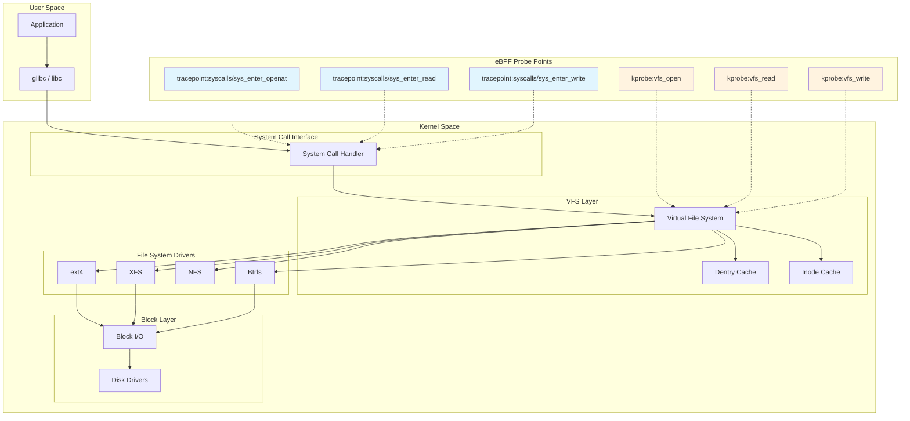
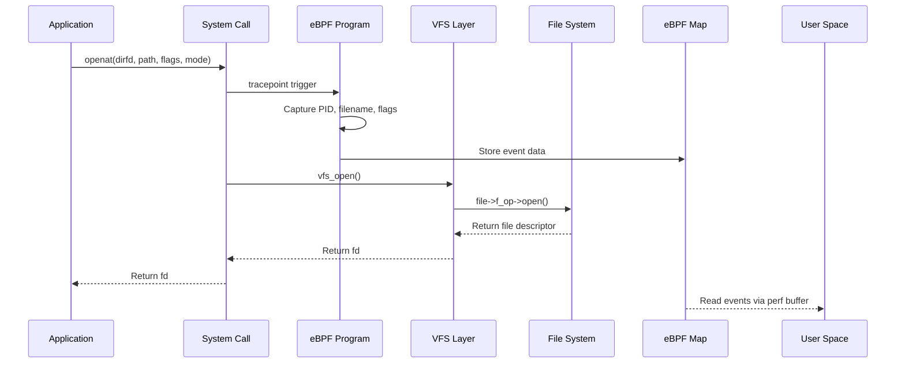
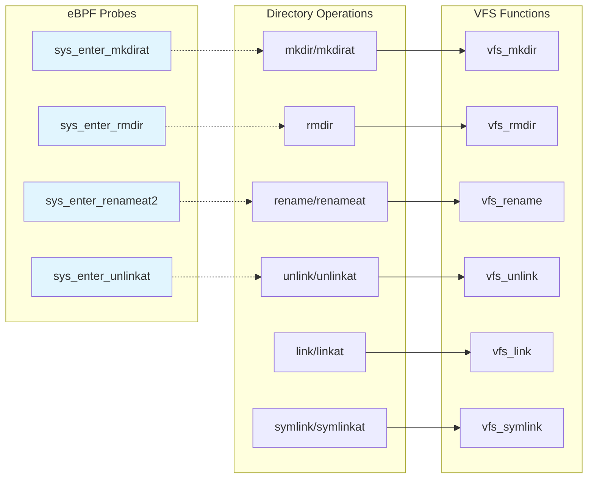
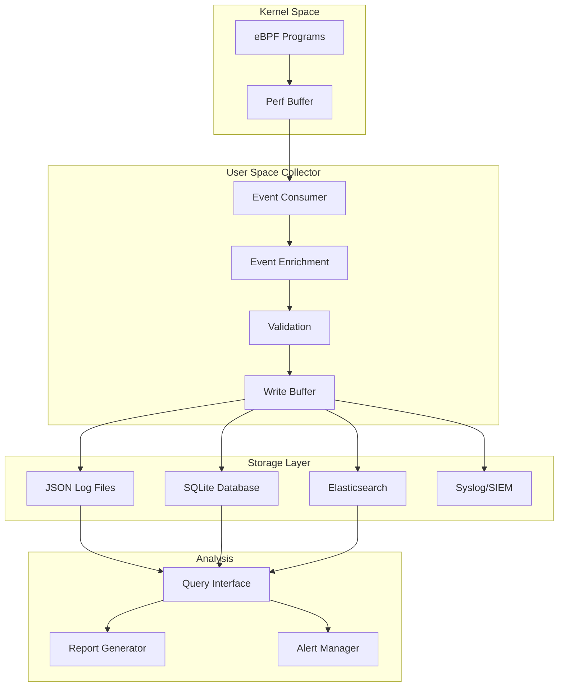

# How to Monitor File Access with eBPF

Author: [nawazdhandala](https://github.com/nawazdhandala)

Tags: eBPF, File System, Linux, Security, Monitoring, Auditing

Description: A guide to using eBPF for file access monitoring and auditing.

---

File access monitoring is a critical component of security auditing, compliance, and intrusion detection systems. Traditional approaches like auditd or inotify have limitations in terms of performance overhead and visibility. eBPF (extended Berkeley Packet Filter) provides a powerful, low-overhead alternative that allows you to trace file operations at the kernel level with minimal impact on system performance.

In this comprehensive guide, we will explore how to use eBPF to monitor file access patterns, detect sensitive file access, trace directory operations, and generate audit trails for compliance purposes.

## Table of Contents

1. [Understanding the Linux VFS Layer](#understanding-the-linux-vfs-layer)
2. [Prerequisites](#prerequisites)
3. [File Open Tracing](#file-open-tracing)
4. [File Read/Write Monitoring](#file-readwrite-monitoring)
5. [Directory Operations Monitoring](#directory-operations-monitoring)
6. [Sensitive File Access Detection](#sensitive-file-access-detection)
7. [Audit Trail Generation](#audit-trail-generation)
8. [Production Considerations](#production-considerations)
9. [Conclusion](#conclusion)

## Understanding the Linux VFS Layer

Before diving into eBPF-based file monitoring, it is essential to understand how the Linux Virtual File System (VFS) layer works. The VFS provides a unified interface for all file system operations, making it the ideal place to attach eBPF probes.

The following diagram illustrates the VFS architecture and the key system calls we will be tracing:



The diagram shows how user applications interact with the kernel through the VFS layer. We can attach eBPF programs at various points:

- **Tracepoints**: Stable interfaces at system call entry/exit points
- **Kprobes**: Dynamic probes on kernel functions like `vfs_open`, `vfs_read`, `vfs_write`
- **LSM hooks**: Security-focused hooks for access control decisions

## Prerequisites

Before we begin, ensure your system meets the following requirements:

The following commands install the necessary tools and verify your kernel supports eBPF:

```bash
# Check kernel version (requires 4.18+ for full eBPF support, 5.8+ recommended)
uname -r

# Install BCC tools on Ubuntu/Debian
# BCC provides Python bindings for eBPF development
sudo apt-get update
sudo apt-get install -y bpfcc-tools linux-headers-$(uname -r) python3-bpfcc

# Install libbpf and bpftool for CO-RE (Compile Once, Run Everywhere) programs
sudo apt-get install -y libbpf-dev bpftool

# Verify eBPF is available by checking the bpf syscall
# The output should show the bpf system call number
grep bpf /proc/kallsyms | head -5

# Check if BTF (BPF Type Format) is available for CO-RE
# BTF enables portable eBPF programs across kernel versions
ls -la /sys/kernel/btf/vmlinux
```

## File Open Tracing

Monitoring file open operations is fundamental to understanding what files processes are accessing. We will use the `openat` system call tracepoint, which is the modern interface for opening files.

The following diagram shows the flow of an open operation:



This Python program uses BCC to trace all file open operations with detailed metadata:

```python
#!/usr/bin/env python3
"""
file_open_tracer.py - Monitor all file open operations using eBPF

This script attaches to the openat/openat2 system calls to capture:
- Process ID and thread ID
- User ID and group ID
- Full file path being opened
- Open flags (read, write, create, etc.)
- Timestamp of the operation

Usage: sudo python3 file_open_tracer.py
"""

from bcc import BPF
from datetime import datetime
import ctypes
import os

# Define the eBPF program that runs in kernel space
# This program attaches to the sys_enter_openat tracepoint
bpf_program = """
#include <uapi/linux/ptrace.h>
#include <linux/sched.h>
#include <linux/fs.h>

// Structure to hold file open event data
// This gets sent to user space via the perf buffer
struct file_open_event {
    u32 pid;           // Process ID
    u32 tid;           // Thread ID
    u32 uid;           // User ID
    u32 gid;           // Group ID
    u64 timestamp;     // Event timestamp in nanoseconds
    int flags;         // Open flags (O_RDONLY, O_WRONLY, etc.)
    char comm[16];     // Process name (command)
    char filename[256]; // File path being opened
};

// Perf buffer to send events to user space
// Using perf buffers instead of BPF maps for streaming data
BPF_PERF_OUTPUT(file_open_events);

// Tracepoint for sys_enter_openat
// This fires when any process calls openat()
TRACEPOINT_PROBE(syscalls, sys_enter_openat) {
    struct file_open_event event = {};

    // Get process and thread identifiers
    // bpf_get_current_pid_tgid() returns (PID << 32) | TID
    u64 pid_tgid = bpf_get_current_pid_tgid();
    event.pid = pid_tgid >> 32;      // Extract PID (upper 32 bits)
    event.tid = pid_tgid & 0xFFFFFFFF; // Extract TID (lower 32 bits)

    // Get user and group IDs for access control auditing
    u64 uid_gid = bpf_get_current_uid_gid();
    event.uid = uid_gid & 0xFFFFFFFF;  // Extract UID (lower 32 bits)
    event.gid = uid_gid >> 32;          // Extract GID (upper 32 bits)

    // Capture timestamp for audit trail
    event.timestamp = bpf_ktime_get_ns();

    // Get the open flags from the tracepoint arguments
    // args->flags contains O_RDONLY, O_WRONLY, O_CREAT, etc.
    event.flags = args->flags;

    // Get the process name (limited to 16 characters)
    bpf_get_current_comm(&event.comm, sizeof(event.comm));

    // Read the filename from user space memory
    // args->filename is a pointer to user space string
    bpf_probe_read_user_str(&event.filename, sizeof(event.filename),
                            args->filename);

    // Submit the event to the perf buffer for user space processing
    file_open_events.perf_submit(args, &event, sizeof(event));

    return 0;
}
"""

# Open flags mapping for human-readable output
# These correspond to the flags defined in <fcntl.h>
OPEN_FLAGS = {
    0: "O_RDONLY",
    1: "O_WRONLY",
    2: "O_RDWR",
    64: "O_CREAT",
    128: "O_EXCL",
    512: "O_TRUNC",
    1024: "O_APPEND",
    2048: "O_NONBLOCK",
}

def decode_flags(flags):
    """
    Decode numeric flags into human-readable string.
    Handles both access mode (O_RDONLY, O_WRONLY, O_RDWR) and
    additional flags (O_CREAT, O_TRUNC, etc.)
    """
    result = []

    # Access mode is stored in the lowest 2 bits
    access_mode = flags & 3
    if access_mode == 0:
        result.append("O_RDONLY")
    elif access_mode == 1:
        result.append("O_WRONLY")
    elif access_mode == 2:
        result.append("O_RDWR")

    # Check additional flags by masking each bit
    if flags & 64:
        result.append("O_CREAT")
    if flags & 128:
        result.append("O_EXCL")
    if flags & 512:
        result.append("O_TRUNC")
    if flags & 1024:
        result.append("O_APPEND")
    if flags & 2048:
        result.append("O_NONBLOCK")

    return "|".join(result) if result else str(flags)

def print_event(cpu, data, size):
    """
    Callback function called for each event from the perf buffer.
    Formats and prints the file open event details.
    """
    # Cast the raw data to our event structure
    event = bpf["file_open_events"].event(data)

    # Convert timestamp to human-readable format
    timestamp = datetime.now().strftime("%Y-%m-%d %H:%M:%S.%f")

    # Decode the filename bytes to string
    filename = event.filename.decode('utf-8', errors='replace')
    comm = event.comm.decode('utf-8', errors='replace')

    # Print formatted output
    print(f"[{timestamp}] "
          f"PID={event.pid} TID={event.tid} "
          f"UID={event.uid} GID={event.gid} "
          f"COMM={comm} "
          f"FILE={filename} "
          f"FLAGS={decode_flags(event.flags)}")

def main():
    print("Starting file open tracer...")
    print("Press Ctrl+C to exit\n")

    # Compile and load the eBPF program into the kernel
    bpf = BPF(text=bpf_program)

    # Open the perf buffer and register our callback
    # page_cnt controls buffer size (8 pages = 32KB typically)
    bpf["file_open_events"].open_perf_buffer(print_event, page_cnt=64)

    # Print header for output
    print(f"{'Timestamp':<26} {'PID':<8} {'UID':<6} {'Command':<16} {'File':<50} {'Flags'}")
    print("-" * 120)

    # Main event loop - poll the perf buffer for events
    try:
        while True:
            # poll() blocks until events are available or timeout
            bpf.perf_buffer_poll()
    except KeyboardInterrupt:
        print("\nExiting...")

if __name__ == "__main__":
    main()
```

## File Read/Write Monitoring

Monitoring read and write operations provides insights into data flow and helps detect data exfiltration attempts. We will trace both the system calls and the actual bytes transferred.

The following program monitors file read and write operations with byte counts:

```python
#!/usr/bin/env python3
"""
file_rw_monitor.py - Monitor file read/write operations with byte counts

This script tracks all file I/O operations including:
- Read operations with bytes read
- Write operations with bytes written
- File descriptor to filename mapping
- Per-process I/O statistics

Usage: sudo python3 file_rw_monitor.py
"""

from bcc import BPF
from datetime import datetime
import ctypes

# eBPF program for read/write monitoring
# Uses both entry and exit tracepoints to capture return values
bpf_program = """
#include <uapi/linux/ptrace.h>
#include <linux/sched.h>

// Event types to distinguish read from write
#define EVENT_READ  1
#define EVENT_WRITE 2

// Structure for I/O events
struct io_event {
    u32 pid;
    u32 tid;
    u64 timestamp;
    u32 fd;              // File descriptor
    s64 bytes;           // Bytes read/written (negative on error)
    u8 event_type;       // READ or WRITE
    char comm[16];
};

// Perf buffer for streaming events
BPF_PERF_OUTPUT(io_events);

// Hash map to store arguments between entry and exit
// Key: pid_tgid, Value: file descriptor
BPF_HASH(active_reads, u64, u32);
BPF_HASH(active_writes, u64, u32);

// Entry point for read syscall
// Capture the file descriptor before the call completes
TRACEPOINT_PROBE(syscalls, sys_enter_read) {
    u64 pid_tgid = bpf_get_current_pid_tgid();
    u32 fd = args->fd;

    // Store fd for retrieval in exit probe
    active_reads.update(&pid_tgid, &fd);
    return 0;
}

// Exit point for read syscall
// Capture the return value (bytes read or error)
TRACEPOINT_PROBE(syscalls, sys_exit_read) {
    u64 pid_tgid = bpf_get_current_pid_tgid();

    // Look up the fd we stored in the entry probe
    u32 *fd_ptr = active_reads.lookup(&pid_tgid);
    if (!fd_ptr) {
        return 0;  // No matching entry, skip
    }

    struct io_event event = {};
    event.pid = pid_tgid >> 32;
    event.tid = pid_tgid & 0xFFFFFFFF;
    event.timestamp = bpf_ktime_get_ns();
    event.fd = *fd_ptr;
    event.bytes = args->ret;  // Return value: bytes read or -errno
    event.event_type = EVENT_READ;

    bpf_get_current_comm(&event.comm, sizeof(event.comm));

    // Clean up the hash entry
    active_reads.delete(&pid_tgid);

    // Only report successful reads with actual data
    if (event.bytes > 0) {
        io_events.perf_submit(args, &event, sizeof(event));
    }

    return 0;
}

// Entry point for write syscall
TRACEPOINT_PROBE(syscalls, sys_enter_write) {
    u64 pid_tgid = bpf_get_current_pid_tgid();
    u32 fd = args->fd;

    active_writes.update(&pid_tgid, &fd);
    return 0;
}

// Exit point for write syscall
TRACEPOINT_PROBE(syscalls, sys_exit_write) {
    u64 pid_tgid = bpf_get_current_pid_tgid();

    u32 *fd_ptr = active_writes.lookup(&pid_tgid);
    if (!fd_ptr) {
        return 0;
    }

    struct io_event event = {};
    event.pid = pid_tgid >> 32;
    event.tid = pid_tgid & 0xFFFFFFFF;
    event.timestamp = bpf_ktime_get_ns();
    event.fd = *fd_ptr;
    event.bytes = args->ret;
    event.event_type = EVENT_WRITE;

    bpf_get_current_comm(&event.comm, sizeof(event.comm));

    active_writes.delete(&pid_tgid);

    // Only report successful writes
    if (event.bytes > 0) {
        io_events.perf_submit(args, &event, sizeof(event));
    }

    return 0;
}
"""

# Statistics tracking for summary output
class IOStats:
    """Track per-process I/O statistics."""
    def __init__(self):
        self.read_bytes = 0
        self.write_bytes = 0
        self.read_count = 0
        self.write_count = 0

# Global stats dictionary
process_stats = {}

def print_event(cpu, data, size):
    """Process and display I/O events."""
    global process_stats

    event = bpf["io_events"].event(data)

    timestamp = datetime.now().strftime("%H:%M:%S.%f")[:-3]
    comm = event.comm.decode('utf-8', errors='replace')
    event_type = "READ" if event.event_type == 1 else "WRITE"

    # Update statistics
    key = (event.pid, comm)
    if key not in process_stats:
        process_stats[key] = IOStats()

    if event.event_type == 1:
        process_stats[key].read_bytes += event.bytes
        process_stats[key].read_count += 1
    else:
        process_stats[key].write_bytes += event.bytes
        process_stats[key].write_count += 1

    # Format bytes for readability
    if event.bytes >= 1024 * 1024:
        bytes_str = f"{event.bytes / (1024*1024):.2f} MB"
    elif event.bytes >= 1024:
        bytes_str = f"{event.bytes / 1024:.2f} KB"
    else:
        bytes_str = f"{event.bytes} B"

    print(f"[{timestamp}] {event_type:<5} PID={event.pid:<6} "
          f"FD={event.fd:<4} BYTES={bytes_str:<12} COMM={comm}")

def print_summary():
    """Print I/O statistics summary."""
    print("\n" + "=" * 80)
    print("I/O Summary by Process")
    print("=" * 80)
    print(f"{'PID':<8} {'Command':<16} {'Read Ops':<10} {'Read Bytes':<15} "
          f"{'Write Ops':<10} {'Write Bytes':<15}")
    print("-" * 80)

    for (pid, comm), stats in sorted(process_stats.items()):
        print(f"{pid:<8} {comm:<16} {stats.read_count:<10} "
              f"{stats.read_bytes:<15} {stats.write_count:<10} "
              f"{stats.write_bytes:<15}")

def main():
    global bpf

    print("Starting file I/O monitor...")
    print("Press Ctrl+C for summary and exit\n")

    bpf = BPF(text=bpf_program)
    bpf["io_events"].open_perf_buffer(print_event, page_cnt=64)

    print(f"{'Time':<15} {'Type':<5} {'PID':<10} {'FD':<6} "
          f"{'Bytes':<15} {'Command'}")
    print("-" * 70)

    try:
        while True:
            bpf.perf_buffer_poll()
    except KeyboardInterrupt:
        print_summary()

if __name__ == "__main__":
    main()
```

## Directory Operations Monitoring

Monitoring directory operations helps track file system structure changes, which is important for detecting unauthorized modifications or malware activity.

The following diagram shows the directory operation flow:



This program monitors directory creation, deletion, renaming, and file unlinking:

```python
#!/usr/bin/env python3
"""
directory_monitor.py - Monitor directory operations using eBPF

Tracks directory and file structure changes including:
- Directory creation (mkdir)
- Directory removal (rmdir)
- File/directory renaming
- File unlinking (deletion)
- Symlink creation

Usage: sudo python3 directory_monitor.py
"""

from bcc import BPF
from datetime import datetime

# eBPF program for directory operation monitoring
bpf_program = """
#include <uapi/linux/ptrace.h>
#include <linux/sched.h>

// Operation type constants
#define OP_MKDIR    1
#define OP_RMDIR    2
#define OP_UNLINK   3
#define OP_RENAME   4
#define OP_SYMLINK  5

// Directory operation event structure
struct dir_event {
    u32 pid;
    u32 uid;
    u64 timestamp;
    u8 op_type;
    u16 mode;              // Permission mode for mkdir
    char comm[16];
    char path[256];        // Primary path
    char path2[256];       // Secondary path (for rename)
};

BPF_PERF_OUTPUT(dir_events);

// Monitor mkdir operations
// Captures directory creation with permission mode
TRACEPOINT_PROBE(syscalls, sys_enter_mkdirat) {
    struct dir_event event = {};

    u64 pid_tgid = bpf_get_current_pid_tgid();
    event.pid = pid_tgid >> 32;

    u64 uid_gid = bpf_get_current_uid_gid();
    event.uid = uid_gid & 0xFFFFFFFF;

    event.timestamp = bpf_ktime_get_ns();
    event.op_type = OP_MKDIR;
    event.mode = args->mode;  // Permission bits

    bpf_get_current_comm(&event.comm, sizeof(event.comm));
    bpf_probe_read_user_str(&event.path, sizeof(event.path), args->pathname);

    dir_events.perf_submit(args, &event, sizeof(event));
    return 0;
}

// Monitor rmdir operations
// Captures directory removal attempts
TRACEPOINT_PROBE(syscalls, sys_enter_rmdir) {
    struct dir_event event = {};

    u64 pid_tgid = bpf_get_current_pid_tgid();
    event.pid = pid_tgid >> 32;

    u64 uid_gid = bpf_get_current_uid_gid();
    event.uid = uid_gid & 0xFFFFFFFF;

    event.timestamp = bpf_ktime_get_ns();
    event.op_type = OP_RMDIR;

    bpf_get_current_comm(&event.comm, sizeof(event.comm));
    bpf_probe_read_user_str(&event.path, sizeof(event.path), args->pathname);

    dir_events.perf_submit(args, &event, sizeof(event));
    return 0;
}

// Monitor unlink/unlinkat operations
// Captures file deletion attempts
TRACEPOINT_PROBE(syscalls, sys_enter_unlinkat) {
    struct dir_event event = {};

    u64 pid_tgid = bpf_get_current_pid_tgid();
    event.pid = pid_tgid >> 32;

    u64 uid_gid = bpf_get_current_uid_gid();
    event.uid = uid_gid & 0xFFFFFFFF;

    event.timestamp = bpf_ktime_get_ns();
    event.op_type = OP_UNLINK;

    bpf_get_current_comm(&event.comm, sizeof(event.comm));
    bpf_probe_read_user_str(&event.path, sizeof(event.path), args->pathname);

    dir_events.perf_submit(args, &event, sizeof(event));
    return 0;
}

// Monitor rename operations
// Captures both source and destination paths
TRACEPOINT_PROBE(syscalls, sys_enter_renameat2) {
    struct dir_event event = {};

    u64 pid_tgid = bpf_get_current_pid_tgid();
    event.pid = pid_tgid >> 32;

    u64 uid_gid = bpf_get_current_uid_gid();
    event.uid = uid_gid & 0xFFFFFFFF;

    event.timestamp = bpf_ktime_get_ns();
    event.op_type = OP_RENAME;

    bpf_get_current_comm(&event.comm, sizeof(event.comm));

    // Capture source path
    bpf_probe_read_user_str(&event.path, sizeof(event.path), args->oldname);
    // Capture destination path
    bpf_probe_read_user_str(&event.path2, sizeof(event.path2), args->newname);

    dir_events.perf_submit(args, &event, sizeof(event));
    return 0;
}

// Monitor symlink creation
TRACEPOINT_PROBE(syscalls, sys_enter_symlinkat) {
    struct dir_event event = {};

    u64 pid_tgid = bpf_get_current_pid_tgid();
    event.pid = pid_tgid >> 32;

    u64 uid_gid = bpf_get_current_uid_gid();
    event.uid = uid_gid & 0xFFFFFFFF;

    event.timestamp = bpf_ktime_get_ns();
    event.op_type = OP_SYMLINK;

    bpf_get_current_comm(&event.comm, sizeof(event.comm));

    // Target of the symlink
    bpf_probe_read_user_str(&event.path, sizeof(event.path), args->oldname);
    // Name of the symlink
    bpf_probe_read_user_str(&event.path2, sizeof(event.path2), args->newname);

    dir_events.perf_submit(args, &event, sizeof(event));
    return 0;
}
"""

# Operation type to string mapping
OP_NAMES = {
    1: "MKDIR",
    2: "RMDIR",
    3: "UNLINK",
    4: "RENAME",
    5: "SYMLINK"
}

# Color codes for different operations (terminal output)
OP_COLORS = {
    1: "\033[92m",   # Green for mkdir
    2: "\033[91m",   # Red for rmdir
    3: "\033[91m",   # Red for unlink
    4: "\033[93m",   # Yellow for rename
    5: "\033[94m",   # Blue for symlink
}
RESET_COLOR = "\033[0m"

def print_event(cpu, data, size):
    """Process and display directory operation events."""
    event = bpf["dir_events"].event(data)

    timestamp = datetime.now().strftime("%Y-%m-%d %H:%M:%S")
    op_name = OP_NAMES.get(event.op_type, "UNKNOWN")
    color = OP_COLORS.get(event.op_type, "")

    comm = event.comm.decode('utf-8', errors='replace')
    path = event.path.decode('utf-8', errors='replace')
    path2 = event.path2.decode('utf-8', errors='replace')

    # Format output based on operation type
    if event.op_type == 4:  # RENAME
        detail = f"{path} -> {path2}"
    elif event.op_type == 5:  # SYMLINK
        detail = f"{path2} -> {path}"
    elif event.op_type == 1:  # MKDIR
        detail = f"{path} (mode={oct(event.mode)})"
    else:
        detail = path

    print(f"{color}[{timestamp}] {op_name:<8}{RESET_COLOR} "
          f"PID={event.pid:<6} UID={event.uid:<5} "
          f"COMM={comm:<16} {detail}")

def main():
    global bpf

    print("Starting directory operations monitor...")
    print("Tracking: mkdir, rmdir, unlink, rename, symlink")
    print("Press Ctrl+C to exit\n")

    bpf = BPF(text=bpf_program)
    bpf["dir_events"].open_perf_buffer(print_event, page_cnt=64)

    print(f"{'Timestamp':<22} {'Operation':<10} {'PID':<8} "
          f"{'UID':<7} {'Command':<18} {'Path'}")
    print("-" * 100)

    try:
        while True:
            bpf.perf_buffer_poll()
    except KeyboardInterrupt:
        print("\nExiting...")

if __name__ == "__main__":
    main()
```

## Sensitive File Access Detection

One of the most valuable use cases for eBPF file monitoring is detecting access to sensitive files like `/etc/passwd`, `/etc/shadow`, SSH keys, or application secrets.

The following program monitors access to predefined sensitive files and paths:

```python
#!/usr/bin/env python3
"""
sensitive_file_monitor.py - Detect access to sensitive files using eBPF

This security monitoring tool alerts on access to:
- System authentication files (/etc/passwd, /etc/shadow)
- SSH keys and configuration
- Cryptocurrency wallets
- Cloud credentials (AWS, GCP, Azure)
- Application secrets and tokens
- Database configuration files

Usage: sudo python3 sensitive_file_monitor.py [--alert-only]
"""

from bcc import BPF
from datetime import datetime
import argparse
import json
import syslog

# Define sensitive file patterns and categories
# These patterns are checked against opened file paths
SENSITIVE_PATTERNS = {
    "authentication": [
        "/etc/passwd",
        "/etc/shadow",
        "/etc/sudoers",
        "/etc/security/",
        "/etc/pam.d/",
    ],
    "ssh_keys": [
        "/.ssh/id_rsa",
        "/.ssh/id_ed25519",
        "/.ssh/id_ecdsa",
        "/.ssh/authorized_keys",
        "/.ssh/known_hosts",
        "/etc/ssh/ssh_host_",
    ],
    "cloud_credentials": [
        "/.aws/credentials",
        "/.aws/config",
        "/.config/gcloud/",
        "/.azure/",
        "/.kube/config",
    ],
    "crypto_wallets": [
        "/.bitcoin/wallet.dat",
        "/.ethereum/keystore/",
        "/.gnupg/private-keys",
    ],
    "application_secrets": [
        ".env",
        "/secrets/",
        "/vault/",
        "credentials.json",
        "secrets.yaml",
        "secrets.yml",
        ".htpasswd",
    ],
    "database_config": [
        "/etc/mysql/",
        "/var/lib/mysql/",
        "/etc/postgresql/",
        "/var/lib/postgresql/",
        "/etc/redis/",
        "/etc/mongodb.conf",
    ],
}

# eBPF program with sensitive file detection
bpf_program = """
#include <uapi/linux/ptrace.h>
#include <linux/sched.h>
#include <linux/fs.h>

// Alert levels
#define ALERT_LOW      1
#define ALERT_MEDIUM   2
#define ALERT_HIGH     3
#define ALERT_CRITICAL 4

struct file_access_event {
    u32 pid;
    u32 ppid;           // Parent PID for process lineage
    u32 uid;
    u32 gid;
    u64 timestamp;
    int flags;
    char comm[16];
    char filename[256];
    char parent_comm[16];  // Parent process name
};

BPF_PERF_OUTPUT(file_events);

// Hash map to track processes we've already alerted on
// Prevents duplicate alerts for the same process/file combination
BPF_HASH(alerted, u64, u64);

TRACEPOINT_PROBE(syscalls, sys_enter_openat) {
    struct file_access_event event = {};

    // Get process information
    u64 pid_tgid = bpf_get_current_pid_tgid();
    event.pid = pid_tgid >> 32;

    u64 uid_gid = bpf_get_current_uid_gid();
    event.uid = uid_gid & 0xFFFFFFFF;
    event.gid = uid_gid >> 32;

    event.timestamp = bpf_ktime_get_ns();
    event.flags = args->flags;

    // Get current process name
    bpf_get_current_comm(&event.comm, sizeof(event.comm));

    // Read filename from user space
    bpf_probe_read_user_str(&event.filename, sizeof(event.filename),
                            args->filename);

    // Get parent process information for context
    // This helps identify the process chain that led to file access
    struct task_struct *task = (struct task_struct *)bpf_get_current_task();
    struct task_struct *parent;
    bpf_probe_read_kernel(&parent, sizeof(parent), &task->real_parent);

    bpf_probe_read_kernel(&event.ppid, sizeof(event.ppid), &parent->pid);
    bpf_probe_read_kernel_str(&event.parent_comm, sizeof(event.parent_comm),
                              parent->comm);

    // Submit all events - filtering happens in user space
    // This allows dynamic pattern updates without reloading eBPF
    file_events.perf_submit(args, &event, sizeof(event));

    return 0;
}
"""

class SensitiveFileMonitor:
    """Monitor for sensitive file access with alerting capabilities."""

    def __init__(self, alert_only=False, syslog_enabled=False):
        self.alert_only = alert_only
        self.syslog_enabled = syslog_enabled
        self.alert_count = 0
        self.compiled_patterns = self._compile_patterns()

        if syslog_enabled:
            syslog.openlog("sensitive-file-monitor",
                          syslog.LOG_PID,
                          syslog.LOG_SECURITY)

    def _compile_patterns(self):
        """Flatten patterns for efficient matching."""
        patterns = []
        for category, paths in SENSITIVE_PATTERNS.items():
            for path in paths:
                patterns.append((category, path))
        return patterns

    def check_sensitive(self, filename):
        """
        Check if a filename matches any sensitive pattern.
        Returns (is_sensitive, category, matched_pattern)
        """
        for category, pattern in self.compiled_patterns:
            if pattern in filename:
                return True, category, pattern
        return False, None, None

    def get_alert_level(self, category, flags):
        """
        Determine alert severity based on category and access mode.
        Write access to critical files triggers higher alerts.
        """
        # Check if write access is requested
        is_write = (flags & 3) in [1, 2]  # O_WRONLY or O_RDWR

        if category in ["authentication", "ssh_keys"]:
            return "CRITICAL" if is_write else "HIGH"
        elif category in ["cloud_credentials", "crypto_wallets"]:
            return "HIGH" if is_write else "MEDIUM"
        else:
            return "MEDIUM" if is_write else "LOW"

    def log_alert(self, event_data):
        """Log alert to syslog if enabled."""
        if self.syslog_enabled:
            msg = json.dumps(event_data)
            syslog.syslog(syslog.LOG_WARNING, msg)

    def process_event(self, cpu, data, size):
        """Process file access events and generate alerts."""
        event = bpf["file_events"].event(data)

        filename = event.filename.decode('utf-8', errors='replace')
        comm = event.comm.decode('utf-8', errors='replace')
        parent_comm = event.parent_comm.decode('utf-8', errors='replace')

        # Check if this is a sensitive file
        is_sensitive, category, pattern = self.check_sensitive(filename)

        if not is_sensitive and self.alert_only:
            return

        timestamp = datetime.now().isoformat()
        alert_level = self.get_alert_level(category, event.flags) if is_sensitive else "INFO"

        # Build event data structure
        event_data = {
            "timestamp": timestamp,
            "level": alert_level,
            "category": category,
            "pid": event.pid,
            "ppid": event.ppid,
            "uid": event.uid,
            "gid": event.gid,
            "command": comm,
            "parent_command": parent_comm,
            "filename": filename,
            "flags": event.flags,
            "write_access": (event.flags & 3) in [1, 2],
        }

        if is_sensitive:
            self.alert_count += 1

            # Color-coded console output based on severity
            colors = {
                "CRITICAL": "\033[91m",  # Red
                "HIGH": "\033[93m",      # Yellow
                "MEDIUM": "\033[94m",    # Blue
                "LOW": "\033[92m",       # Green
            }
            reset = "\033[0m"
            color = colors.get(alert_level, "")

            print(f"{color}[{alert_level}]{reset} [{timestamp}]")
            print(f"  Category: {category}")
            print(f"  File: {filename}")
            print(f"  Process: {comm} (PID: {event.pid})")
            print(f"  Parent: {parent_comm} (PPID: {event.ppid})")
            print(f"  User: UID={event.uid} GID={event.gid}")
            print(f"  Access: {'WRITE' if event_data['write_access'] else 'READ'}")
            print("")

            # Log to syslog for SIEM integration
            self.log_alert(event_data)
        else:
            # Non-sensitive file access (only shown if not alert_only)
            print(f"[INFO] {comm} (PID:{event.pid}) accessed {filename}")

def main():
    global bpf

    parser = argparse.ArgumentParser(
        description="Monitor sensitive file access using eBPF"
    )
    parser.add_argument("--alert-only", action="store_true",
                       help="Only show alerts for sensitive files")
    parser.add_argument("--syslog", action="store_true",
                       help="Send alerts to syslog")
    args = parser.parse_args()

    print("=" * 60)
    print("Sensitive File Access Monitor")
    print("=" * 60)
    print("\nMonitoring categories:")
    for category in SENSITIVE_PATTERNS.keys():
        print(f"  - {category}")
    print("\nPress Ctrl+C to exit\n")
    print("-" * 60)

    bpf = BPF(text=bpf_program)
    monitor = SensitiveFileMonitor(
        alert_only=args.alert_only,
        syslog_enabled=args.syslog
    )

    bpf["file_events"].open_perf_buffer(monitor.process_event, page_cnt=128)

    try:
        while True:
            bpf.perf_buffer_poll()
    except KeyboardInterrupt:
        print(f"\n\nTotal alerts generated: {monitor.alert_count}")

if __name__ == "__main__":
    main()
```

## Audit Trail Generation

For compliance requirements (SOC2, HIPAA, PCI-DSS), you need to generate proper audit trails with structured logging and retention capabilities.

The following diagram shows the audit trail architecture:



This comprehensive audit trail generator provides structured logging with multiple output formats:

```python
#!/usr/bin/env python3
"""
audit_trail_generator.py - Generate compliance-ready audit trails using eBPF

Features:
- Structured JSON logging for SIEM integration
- SQLite storage for local querying
- Event enrichment with user/group names
- Configurable retention policies
- Real-time alerting integration
- Compliance report generation

Usage: sudo python3 audit_trail_generator.py --output /var/log/file-audit
"""

from bcc import BPF
from datetime import datetime, timedelta
import argparse
import json
import sqlite3
import pwd
import grp
import os
import threading
import queue
import hashlib
import socket

# eBPF program for comprehensive file operation auditing
bpf_program = """
#include <uapi/linux/ptrace.h>
#include <linux/sched.h>
#include <linux/fs.h>
#include <linux/nsproxy.h>
#include <linux/ns_common.h>

// Comprehensive audit event structure
struct audit_event {
    u64 timestamp;
    u32 pid;
    u32 tid;
    u32 ppid;
    u32 uid;
    u32 gid;
    u32 euid;           // Effective UID
    u32 egid;           // Effective GID
    u32 session_id;     // Session ID for user tracking
    u64 cgroup_id;      // Container identification
    int syscall_nr;     // System call number
    int flags;          // Open flags
    int ret_value;      // Return value (fd or error)
    char comm[16];
    char filename[256];
    char cwd[256];      // Current working directory
};

BPF_PERF_OUTPUT(audit_events);

// Track open operations to capture return values
BPF_HASH(inflight_opens, u64, struct audit_event);

TRACEPOINT_PROBE(syscalls, sys_enter_openat) {
    struct audit_event event = {};

    u64 pid_tgid = bpf_get_current_pid_tgid();
    event.pid = pid_tgid >> 32;
    event.tid = pid_tgid & 0xFFFFFFFF;

    event.timestamp = bpf_ktime_get_ns();

    // Get user credentials
    u64 uid_gid = bpf_get_current_uid_gid();
    event.uid = uid_gid & 0xFFFFFFFF;
    event.gid = uid_gid >> 32;

    // Get effective credentials from task struct
    struct task_struct *task = (struct task_struct *)bpf_get_current_task();

    // Get parent PID
    struct task_struct *parent;
    bpf_probe_read_kernel(&parent, sizeof(parent), &task->real_parent);
    bpf_probe_read_kernel(&event.ppid, sizeof(event.ppid), &parent->pid);

    // Get session ID for tracking user sessions
    bpf_probe_read_kernel(&event.session_id, sizeof(event.session_id),
                          &task->sessionid);

    // Get cgroup ID for container identification
    event.cgroup_id = bpf_get_current_cgroup_id();

    event.syscall_nr = 257;  // __NR_openat
    event.flags = args->flags;

    bpf_get_current_comm(&event.comm, sizeof(event.comm));
    bpf_probe_read_user_str(&event.filename, sizeof(event.filename),
                            args->filename);

    // Store for matching with exit probe
    inflight_opens.update(&pid_tgid, &event);

    return 0;
}

TRACEPOINT_PROBE(syscalls, sys_exit_openat) {
    u64 pid_tgid = bpf_get_current_pid_tgid();

    struct audit_event *event_ptr = inflight_opens.lookup(&pid_tgid);
    if (!event_ptr) {
        return 0;
    }

    struct audit_event event = *event_ptr;
    event.ret_value = args->ret;

    // Submit completed event with return value
    audit_events.perf_submit(args, &event, sizeof(event));

    inflight_opens.delete(&pid_tgid);
    return 0;
}

// Monitor write operations for data modification tracking
TRACEPOINT_PROBE(syscalls, sys_enter_write) {
    // Only track writes to regular files (fd > 2)
    if (args->fd <= 2) {
        return 0;
    }

    struct audit_event event = {};

    u64 pid_tgid = bpf_get_current_pid_tgid();
    event.pid = pid_tgid >> 32;
    event.tid = pid_tgid & 0xFFFFFFFF;
    event.timestamp = bpf_ktime_get_ns();

    u64 uid_gid = bpf_get_current_uid_gid();
    event.uid = uid_gid & 0xFFFFFFFF;
    event.gid = uid_gid >> 32;

    event.cgroup_id = bpf_get_current_cgroup_id();
    event.syscall_nr = 1;  // __NR_write
    event.flags = args->fd;  // Store fd in flags field

    bpf_get_current_comm(&event.comm, sizeof(event.comm));

    audit_events.perf_submit(args, &event, sizeof(event));
    return 0;
}
"""

class AuditTrailGenerator:
    """
    Generates compliance-ready audit trails from eBPF events.
    Supports multiple output formats and retention policies.
    """

    def __init__(self, output_dir, retention_days=90):
        self.output_dir = output_dir
        self.retention_days = retention_days
        self.hostname = socket.gethostname()
        self.event_queue = queue.Queue(maxsize=10000)
        self.running = True

        # Create output directory
        os.makedirs(output_dir, exist_ok=True)

        # Initialize SQLite database for queryable storage
        self.db_path = os.path.join(output_dir, "audit.db")
        self._init_database()

        # Start background writer thread
        self.writer_thread = threading.Thread(target=self._write_events)
        self.writer_thread.daemon = True
        self.writer_thread.start()

        # User/group name cache for enrichment
        self.user_cache = {}
        self.group_cache = {}

    def _init_database(self):
        """Initialize SQLite database with audit schema."""
        conn = sqlite3.connect(self.db_path)
        cursor = conn.cursor()

        # Create audit events table with indexes for common queries
        cursor.execute("""
            CREATE TABLE IF NOT EXISTS audit_events (
                id INTEGER PRIMARY KEY AUTOINCREMENT,
                timestamp TEXT NOT NULL,
                hostname TEXT NOT NULL,
                pid INTEGER NOT NULL,
                tid INTEGER,
                ppid INTEGER,
                uid INTEGER NOT NULL,
                gid INTEGER NOT NULL,
                username TEXT,
                groupname TEXT,
                command TEXT NOT NULL,
                syscall TEXT NOT NULL,
                filename TEXT,
                flags INTEGER,
                result INTEGER,
                cgroup_id INTEGER,
                session_id INTEGER,
                event_hash TEXT UNIQUE
            )
        """)

        # Create indexes for efficient querying
        cursor.execute("""
            CREATE INDEX IF NOT EXISTS idx_timestamp
            ON audit_events(timestamp)
        """)
        cursor.execute("""
            CREATE INDEX IF NOT EXISTS idx_uid
            ON audit_events(uid)
        """)
        cursor.execute("""
            CREATE INDEX IF NOT EXISTS idx_filename
            ON audit_events(filename)
        """)
        cursor.execute("""
            CREATE INDEX IF NOT EXISTS idx_command
            ON audit_events(command)
        """)

        conn.commit()
        conn.close()

    def _get_username(self, uid):
        """Resolve UID to username with caching."""
        if uid not in self.user_cache:
            try:
                self.user_cache[uid] = pwd.getpwuid(uid).pw_name
            except KeyError:
                self.user_cache[uid] = str(uid)
        return self.user_cache[uid]

    def _get_groupname(self, gid):
        """Resolve GID to group name with caching."""
        if gid not in self.group_cache:
            try:
                self.group_cache[gid] = grp.getgrgid(gid).gr_name
            except KeyError:
                self.group_cache[gid] = str(gid)
        return self.group_cache[gid]

    def _syscall_name(self, nr):
        """Convert syscall number to name."""
        syscalls = {
            1: "write",
            257: "openat",
            0: "read",
            2: "open",
            3: "close",
        }
        return syscalls.get(nr, f"syscall_{nr}")

    def _compute_event_hash(self, event_data):
        """Compute unique hash for event deduplication."""
        key_data = f"{event_data['timestamp']}{event_data['pid']}{event_data['syscall']}{event_data.get('filename', '')}"
        return hashlib.sha256(key_data.encode()).hexdigest()[:32]

    def enrich_event(self, event):
        """Enrich raw eBPF event with additional context."""
        timestamp = datetime.now()

        event_data = {
            "timestamp": timestamp.isoformat(),
            "timestamp_unix": timestamp.timestamp(),
            "hostname": self.hostname,
            "pid": event.pid,
            "tid": event.tid,
            "ppid": event.ppid,
            "uid": event.uid,
            "gid": event.gid,
            "username": self._get_username(event.uid),
            "groupname": self._get_groupname(event.gid),
            "command": event.comm.decode('utf-8', errors='replace'),
            "syscall": self._syscall_name(event.syscall_nr),
            "syscall_nr": event.syscall_nr,
            "flags": event.flags,
            "result": event.ret_value,
            "cgroup_id": event.cgroup_id,
            "session_id": event.session_id,
        }

        # Add filename if present
        filename = event.filename.decode('utf-8', errors='replace')
        if filename:
            event_data["filename"] = filename

        # Add event hash for deduplication
        event_data["event_hash"] = self._compute_event_hash(event_data)

        return event_data

    def _write_events(self):
        """Background thread to write events to storage."""
        batch = []
        batch_size = 100

        while self.running:
            try:
                event = self.event_queue.get(timeout=1.0)
                batch.append(event)

                if len(batch) >= batch_size:
                    self._flush_batch(batch)
                    batch = []
            except queue.Empty:
                if batch:
                    self._flush_batch(batch)
                    batch = []

    def _flush_batch(self, batch):
        """Write a batch of events to storage."""
        if not batch:
            return

        # Write to JSON log file (daily rotation)
        date_str = datetime.now().strftime("%Y-%m-%d")
        json_path = os.path.join(self.output_dir, f"audit-{date_str}.json")

        with open(json_path, "a") as f:
            for event in batch:
                f.write(json.dumps(event) + "\n")

        # Write to SQLite database
        conn = sqlite3.connect(self.db_path)
        cursor = conn.cursor()

        for event in batch:
            try:
                cursor.execute("""
                    INSERT OR IGNORE INTO audit_events
                    (timestamp, hostname, pid, tid, ppid, uid, gid,
                     username, groupname, command, syscall, filename,
                     flags, result, cgroup_id, session_id, event_hash)
                    VALUES (?, ?, ?, ?, ?, ?, ?, ?, ?, ?, ?, ?, ?, ?, ?, ?, ?)
                """, (
                    event["timestamp"],
                    event["hostname"],
                    event["pid"],
                    event.get("tid"),
                    event.get("ppid"),
                    event["uid"],
                    event["gid"],
                    event["username"],
                    event["groupname"],
                    event["command"],
                    event["syscall"],
                    event.get("filename"),
                    event.get("flags"),
                    event.get("result"),
                    event.get("cgroup_id"),
                    event.get("session_id"),
                    event["event_hash"],
                ))
            except sqlite3.Error as e:
                print(f"Database error: {e}")

        conn.commit()
        conn.close()

    def process_event(self, cpu, data, size):
        """Process incoming eBPF events."""
        event = bpf["audit_events"].event(data)
        enriched = self.enrich_event(event)

        # Add to processing queue
        try:
            self.event_queue.put_nowait(enriched)
        except queue.Full:
            print("Warning: Event queue full, dropping event")

        # Print to console
        print(f"[{enriched['timestamp']}] "
              f"{enriched['syscall']:<8} "
              f"PID={enriched['pid']:<6} "
              f"USER={enriched['username']:<12} "
              f"CMD={enriched['command']:<16} "
              f"FILE={enriched.get('filename', 'N/A')}")

    def cleanup_old_logs(self):
        """Remove logs older than retention period."""
        cutoff = datetime.now() - timedelta(days=self.retention_days)

        # Clean up JSON logs
        for filename in os.listdir(self.output_dir):
            if filename.startswith("audit-") and filename.endswith(".json"):
                date_str = filename[6:-5]  # Extract date
                try:
                    file_date = datetime.strptime(date_str, "%Y-%m-%d")
                    if file_date < cutoff:
                        os.remove(os.path.join(self.output_dir, filename))
                        print(f"Removed old log: {filename}")
                except ValueError:
                    pass

        # Clean up database entries
        conn = sqlite3.connect(self.db_path)
        cursor = conn.cursor()
        cursor.execute("""
            DELETE FROM audit_events
            WHERE timestamp < ?
        """, (cutoff.isoformat(),))
        deleted = cursor.rowcount
        conn.commit()
        conn.close()

        if deleted > 0:
            print(f"Removed {deleted} old database entries")

    def generate_report(self, start_time=None, end_time=None):
        """Generate compliance report for the specified time range."""
        if not start_time:
            start_time = (datetime.now() - timedelta(days=1)).isoformat()
        if not end_time:
            end_time = datetime.now().isoformat()

        conn = sqlite3.connect(self.db_path)
        cursor = conn.cursor()

        report = {
            "report_generated": datetime.now().isoformat(),
            "hostname": self.hostname,
            "time_range": {"start": start_time, "end": end_time},
            "summary": {},
            "top_users": [],
            "top_files": [],
            "top_commands": [],
        }

        # Total events
        cursor.execute("""
            SELECT COUNT(*) FROM audit_events
            WHERE timestamp BETWEEN ? AND ?
        """, (start_time, end_time))
        report["summary"]["total_events"] = cursor.fetchone()[0]

        # Events by syscall
        cursor.execute("""
            SELECT syscall, COUNT(*) as count
            FROM audit_events
            WHERE timestamp BETWEEN ? AND ?
            GROUP BY syscall
            ORDER BY count DESC
        """, (start_time, end_time))
        report["summary"]["by_syscall"] = dict(cursor.fetchall())

        # Top users
        cursor.execute("""
            SELECT username, COUNT(*) as count
            FROM audit_events
            WHERE timestamp BETWEEN ? AND ?
            GROUP BY username
            ORDER BY count DESC
            LIMIT 10
        """, (start_time, end_time))
        report["top_users"] = [
            {"username": row[0], "count": row[1]}
            for row in cursor.fetchall()
        ]

        # Top accessed files
        cursor.execute("""
            SELECT filename, COUNT(*) as count
            FROM audit_events
            WHERE timestamp BETWEEN ? AND ? AND filename IS NOT NULL
            GROUP BY filename
            ORDER BY count DESC
            LIMIT 20
        """, (start_time, end_time))
        report["top_files"] = [
            {"filename": row[0], "count": row[1]}
            for row in cursor.fetchall()
        ]

        conn.close()

        return report

    def shutdown(self):
        """Graceful shutdown."""
        self.running = False
        self.writer_thread.join(timeout=5)

        # Flush remaining events
        remaining = []
        while not self.event_queue.empty():
            remaining.append(self.event_queue.get())
        if remaining:
            self._flush_batch(remaining)

def main():
    global bpf

    parser = argparse.ArgumentParser(
        description="Generate compliance-ready audit trails using eBPF"
    )
    parser.add_argument("--output", "-o", default="/var/log/file-audit",
                       help="Output directory for audit logs")
    parser.add_argument("--retention", "-r", type=int, default=90,
                       help="Log retention in days (default: 90)")
    parser.add_argument("--report", action="store_true",
                       help="Generate report and exit")
    args = parser.parse_args()

    generator = AuditTrailGenerator(args.output, args.retention)

    if args.report:
        report = generator.generate_report()
        print(json.dumps(report, indent=2))
        return

    print("=" * 70)
    print("File Access Audit Trail Generator")
    print("=" * 70)
    print(f"Output directory: {args.output}")
    print(f"Retention period: {args.retention} days")
    print("\nPress Ctrl+C to generate report and exit\n")
    print("-" * 70)

    bpf = BPF(text=bpf_program)
    bpf["audit_events"].open_perf_buffer(generator.process_event, page_cnt=256)

    # Run cleanup periodically
    last_cleanup = datetime.now()
    cleanup_interval = timedelta(hours=1)

    try:
        while True:
            bpf.perf_buffer_poll(timeout=1000)

            # Periodic cleanup
            if datetime.now() - last_cleanup > cleanup_interval:
                generator.cleanup_old_logs()
                last_cleanup = datetime.now()
    except KeyboardInterrupt:
        print("\n\nGenerating final report...")
        report = generator.generate_report()

        report_path = os.path.join(args.output, "final_report.json")
        with open(report_path, "w") as f:
            json.dump(report, f, indent=2)

        print(f"\nReport saved to: {report_path}")
        print(f"Total events captured: {report['summary']['total_events']}")

        generator.shutdown()

if __name__ == "__main__":
    main()
```

## Production Considerations

When deploying eBPF-based file monitoring in production, consider the following:

### Performance Optimization

The following techniques help minimize the performance impact of eBPF file monitoring:

```python
# Example: Filtering in kernel space to reduce event volume
# This eBPF code only reports events for specific file patterns

filter_bpf = """
#include <uapi/linux/ptrace.h>

// LPM trie for efficient prefix matching
// Key: path prefix, Value: should monitor (1) or not (0)
BPF_LPM_TRIE(monitored_paths, u64);

TRACEPOINT_PROBE(syscalls, sys_enter_openat) {
    char filename[256];
    bpf_probe_read_user_str(&filename, sizeof(filename), args->filename);

    // Check if path starts with monitored prefix
    // Using LPM trie for O(1) prefix matching
    struct {
        u32 prefixlen;
        char data[256];
    } key = {};

    key.prefixlen = 256 * 8;  // bits
    __builtin_memcpy(key.data, filename, 256);

    u64 *value = monitored_paths.lookup(&key);
    if (!value || *value == 0) {
        return 0;  // Skip non-monitored paths
    }

    // Continue with event processing...
    return 0;
}
"""
```

### High Availability

For production deployments, consider these reliability patterns:

```python
#!/usr/bin/env python3
"""
Example: HA-ready file monitor with graceful degradation
"""

import signal
import sys
from contextlib import contextmanager

class HAFileMonitor:
    """High-availability wrapper for eBPF file monitor."""

    def __init__(self):
        self.bpf = None
        self.running = True

        # Register signal handlers for graceful shutdown
        signal.signal(signal.SIGTERM, self._handle_signal)
        signal.signal(signal.SIGINT, self._handle_signal)
        signal.signal(signal.SIGHUP, self._handle_reload)

    def _handle_signal(self, signum, frame):
        """Handle shutdown signals gracefully."""
        print(f"\nReceived signal {signum}, shutting down...")
        self.running = False

    def _handle_reload(self, signum, frame):
        """Handle config reload on SIGHUP."""
        print("Reloading configuration...")
        # Reload patterns, thresholds, etc.

    @contextmanager
    def safe_bpf_operation(self):
        """Context manager for safe eBPF operations."""
        try:
            yield
        except Exception as e:
            print(f"eBPF operation failed: {e}")
            # Log error, trigger alert, attempt recovery
            self._attempt_recovery()

    def _attempt_recovery(self):
        """Attempt to recover from eBPF failures."""
        print("Attempting recovery...")
        # Detach and reattach probes
        # Reinitialize perf buffers
        # Fall back to reduced monitoring if needed

    def health_check(self):
        """Return health status for monitoring systems."""
        return {
            "status": "healthy" if self.running else "shutting_down",
            "bpf_loaded": self.bpf is not None,
            "events_processed": self.event_count,
            "errors": self.error_count,
        }
```

### Container Support

When monitoring containerized workloads, map cgroup IDs to container names:

```python
def get_container_name(cgroup_id):
    """
    Resolve cgroup ID to container name.
    Works with Docker, containerd, and CRI-O.
    """
    # Check Docker
    docker_path = f"/sys/fs/cgroup/memory/docker"
    if os.path.exists(docker_path):
        for container_id in os.listdir(docker_path):
            cgroup_path = f"{docker_path}/{container_id}"
            # Compare cgroup IDs
            # Return container name from Docker API
            pass

    # Check containerd/Kubernetes
    k8s_path = "/sys/fs/cgroup/memory/kubepods"
    if os.path.exists(k8s_path):
        # Parse Kubernetes pod/container structure
        pass

    return f"cgroup-{cgroup_id}"
```

## Conclusion

eBPF provides a powerful and efficient mechanism for monitoring file access at the kernel level. In this guide, we covered:

1. **VFS Layer Understanding**: How the Linux Virtual File System provides a unified interface for file operations that we can trace with eBPF.

2. **File Open Tracing**: Capturing all file open operations with full context including process information, user credentials, and access flags.

3. **Read/Write Monitoring**: Tracking data flow by monitoring read and write operations with byte counts.

4. **Directory Operations**: Detecting file system structure changes including directory creation, deletion, and file renaming.

5. **Sensitive File Detection**: Building a security monitoring system that alerts on access to critical system files and credentials.

6. **Audit Trail Generation**: Creating compliance-ready audit logs with structured storage, retention policies, and reporting capabilities.

The eBPF-based approach offers significant advantages over traditional methods:

- **Low Overhead**: eBPF programs run in kernel space with JIT compilation, minimizing performance impact
- **Comprehensive Visibility**: Direct access to kernel data structures provides complete context
- **Real-time Detection**: Events are captured synchronously as they occur
- **Flexibility**: Programs can be updated without kernel modifications or reboots
- **Safety**: The eBPF verifier ensures programs cannot crash or compromise the kernel

For production deployments, consider integrating these monitoring capabilities with your existing SIEM, implementing proper log rotation and retention, and establishing alerting thresholds based on your security requirements.

## Further Reading

- [BPF Performance Tools](https://www.brendangregg.com/bpf-performance-tools-book.html) by Brendan Gregg
- [Linux Kernel Documentation - BPF](https://www.kernel.org/doc/html/latest/bpf/index.html)
- [BCC Reference Guide](https://github.com/iovisor/bcc/blob/master/docs/reference_guide.md)
- [libbpf Documentation](https://libbpf.readthedocs.io/)
- [eBPF.io](https://ebpf.io/) - The official eBPF community site
