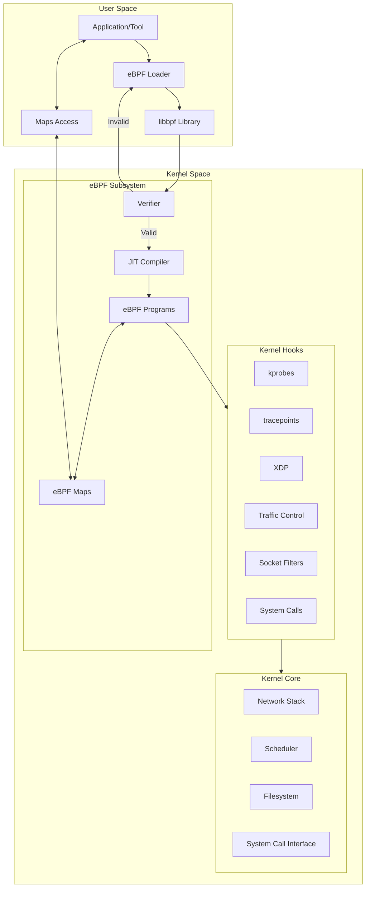
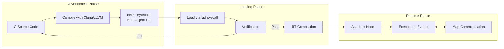
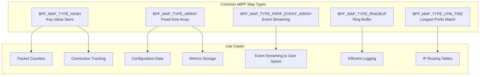
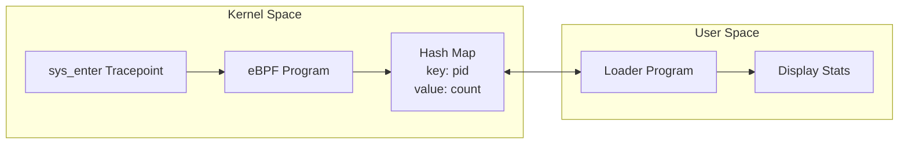
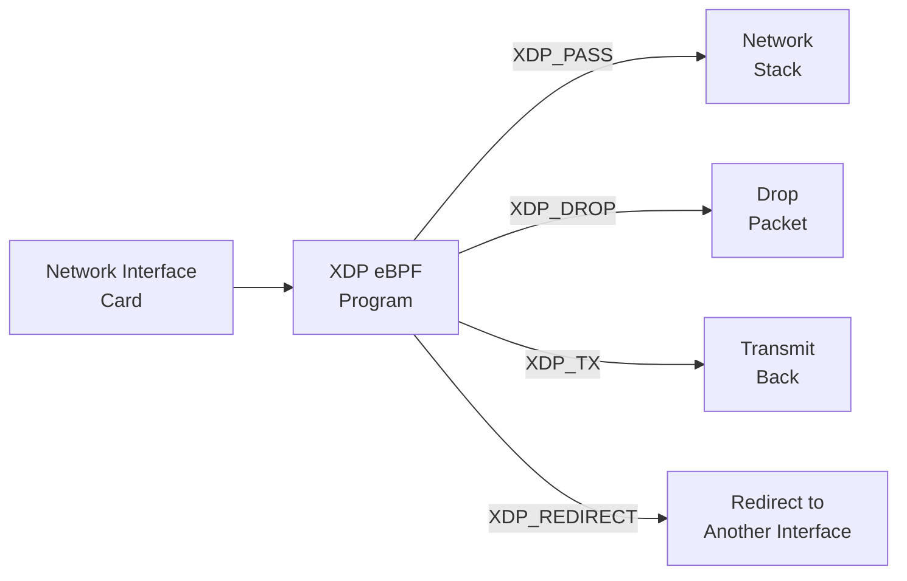

# How to Get Started with eBPF Programming on Linux

Author: [nawazdhandala](https://github.com/nawazdhandala)

Tags: eBPF, Linux, Kernel, Programming, Observability, Security

Description: A beginner's guide to eBPF programming on Linux, covering fundamentals and first programs.

---

## Introduction

Extended Berkeley Packet Filter (eBPF) is a revolutionary technology that allows you to run sandboxed programs in the Linux kernel without changing kernel source code or loading kernel modules. Originally designed for network packet filtering, eBPF has evolved into a powerful platform for observability, security, and performance monitoring.

This guide will walk you through the fundamentals of eBPF programming, from understanding the architecture to writing and running your first eBPF programs.

## What is eBPF?

eBPF (extended Berkeley Packet Filter) is a virtual machine embedded in the Linux kernel that allows user-defined programs to run safely in kernel space. These programs can be attached to various kernel hooks and events, enabling powerful capabilities like:

- **Network packet filtering and manipulation**
- **System call tracing and monitoring**
- **Performance profiling and analysis**
- **Security policy enforcement**
- **Container and Kubernetes observability**

## eBPF Architecture Overview

The following diagram illustrates the high-level architecture of eBPF:



### Key Components

1. **eBPF Programs**: Small programs written in a restricted C subset, compiled to eBPF bytecode
2. **Verifier**: Ensures programs are safe and won't crash the kernel
3. **JIT Compiler**: Translates eBPF bytecode to native machine code for performance
4. **eBPF Maps**: Key-value data structures for sharing data between eBPF programs and user space
5. **Hooks**: Attachment points in the kernel where eBPF programs can run

## eBPF Program Lifecycle

The following diagram shows the lifecycle of an eBPF program from source code to execution:



## Setting Up Your Development Environment

### Prerequisites

Before you begin, ensure you have a Linux system with kernel version 4.4 or higher (5.x+ recommended for full feature support).

The following commands install the necessary development tools and libraries for eBPF programming:

```bash
# Update package lists to get the latest versions
sudo apt update

# Install essential build tools and headers
# - build-essential: GCC compiler and make
# - linux-headers: Kernel headers for your running kernel
# - libbpf-dev: Library for loading eBPF programs
# - clang/llvm: Compiler for eBPF bytecode generation
# - libelf-dev: Library for ELF file handling
# - bpftool: Utility for inspecting eBPF programs and maps
sudo apt install -y build-essential \
    linux-headers-$(uname -r) \
    libbpf-dev \
    clang \
    llvm \
    libelf-dev \
    linux-tools-common \
    linux-tools-$(uname -r) \
    bpftool
```

### Verify Installation

These commands verify that all required tools are properly installed:

```bash
# Check Clang version - needed for compiling eBPF programs
# You should see version 10 or higher for best compatibility
clang --version

# Check LLVM version - provides the backend for eBPF bytecode generation
llc --version

# Check bpftool availability - essential for debugging and inspection
# This tool allows you to list, inspect, and manage eBPF programs and maps
bpftool version

# Verify kernel supports eBPF by checking available program types
# This lists all eBPF features supported by your kernel
bpftool feature
```

### Kernel Configuration

Ensure your kernel has eBPF support enabled. These configuration options should be set:

```bash
# Check kernel configuration for eBPF support
# CONFIG_BPF=y means eBPF is enabled in your kernel
# CONFIG_BPF_SYSCALL=y enables the bpf() system call
# CONFIG_BPF_JIT=y enables Just-In-Time compilation for performance
grep CONFIG_BPF /boot/config-$(uname -r)

# Expected output should include:
# CONFIG_BPF=y
# CONFIG_BPF_SYSCALL=y
# CONFIG_BPF_JIT=y
# CONFIG_HAVE_BPF_JIT=y
```

## Understanding eBPF Maps

eBPF maps are the primary mechanism for communication between eBPF programs and user space. They are also used for maintaining state across eBPF program invocations.



## Your First eBPF Program: Hello World with kprobe

Let's start with a simple program that traces the `execve` system call - executed whenever a new program is launched.

### Project Structure

Create the following directory structure for your project:

```bash
# Create project directory structure
# This organizes your eBPF source files and build artifacts
mkdir -p ebpf-hello/{src,include}
cd ebpf-hello
```

### Step 1: Write the eBPF Program

Create the eBPF kernel-space program that will run in the kernel:

```c
/* File: src/hello.bpf.c
 *
 * This is the eBPF program that runs in kernel space.
 * It attaches to the execve system call and logs whenever
 * a new process is executed.
 */

// Required header for eBPF helper definitions
// This provides access to eBPF helper functions and types
#include <linux/bpf.h>

// Provides BPF helper function macros like SEC() and BPF_KPROBE()
// SEC() macro defines the ELF section where the program is placed
#include <bpf/bpf_helpers.h>

// Provides macros for kprobe/kretprobe attachment
#include <bpf/bpf_tracing.h>

// Define the license - GPL is required for many helper functions
// Without GPL license, certain eBPF helpers won't be available
char LICENSE[] SEC("license") = "GPL";

// SEC("kprobe/...") tells the loader where to attach this program
// We're attaching to __x64_sys_execve - the execve syscall handler
// This function is called every time a new program is executed
SEC("kprobe/__x64_sys_execve")
int hello_execve(struct pt_regs *ctx)
{
    // Get the process ID and thread group ID
    // bpf_get_current_pid_tgid() returns both in a single 64-bit value
    // Upper 32 bits = TGID (process ID), Lower 32 bits = PID (thread ID)
    __u64 pid_tgid = bpf_get_current_pid_tgid();
    __u32 pid = pid_tgid >> 32;  // Extract the process ID

    // Get the current process name (comm)
    // This buffer will hold up to 16 characters of the process name
    char comm[16];

    // bpf_get_current_comm() fills the buffer with current process name
    // Returns 0 on success, negative error code on failure
    bpf_get_current_comm(&comm, sizeof(comm));

    // Print a message to the kernel trace pipe
    // bpf_printk() is a debugging helper - output goes to:
    // /sys/kernel/debug/tracing/trace_pipe
    // Format: "Hello from eBPF! PID: <pid>, Command: <comm>"
    bpf_printk("Hello from eBPF! PID: %d, Command: %s\n", pid, comm);

    // Return 0 to indicate successful execution
    // Non-zero returns can affect program behavior depending on type
    return 0;
}
```

### Step 2: Create the User-Space Loader

Create the user-space program that loads and manages the eBPF program:

```c
/* File: src/hello.c
 *
 * This is the user-space loader program that:
 * 1. Opens the compiled eBPF object file
 * 2. Loads the eBPF program into the kernel
 * 3. Attaches it to the specified hook point
 * 4. Keeps the program running until interrupted
 */

#include <stdio.h>
#include <stdlib.h>
#include <signal.h>
#include <unistd.h>

// libbpf provides the API for loading and managing eBPF programs
#include <bpf/libbpf.h>
#include <bpf/bpf.h>

// Global flag for signal handling - volatile ensures visibility across threads
static volatile sig_atomic_t running = 1;

// Signal handler for graceful shutdown
// Called when user presses Ctrl+C (SIGINT) or sends SIGTERM
static void sig_handler(int sig)
{
    // Set running to 0 to exit the main loop
    running = 0;
}

int main(int argc, char **argv)
{
    // Declare pointers for eBPF object and link
    // bpf_object represents the loaded ELF file
    // bpf_link represents the attachment to a hook point
    struct bpf_object *obj;
    struct bpf_program *prog;
    struct bpf_link *link = NULL;
    int err;

    // Register signal handlers for graceful cleanup
    // SIGINT is sent when user presses Ctrl+C
    // SIGTERM is the standard termination signal
    signal(SIGINT, sig_handler);
    signal(SIGTERM, sig_handler);

    // Open and load the eBPF object file
    // This parses the ELF file and prepares programs for loading
    // "hello.bpf.o" is the compiled eBPF bytecode
    obj = bpf_object__open_file("hello.bpf.o", NULL);
    if (libbpf_get_error(obj)) {
        fprintf(stderr, "ERROR: Failed to open BPF object file\n");
        return 1;
    }

    // Load the eBPF program into the kernel
    // This triggers the verifier to validate the program
    // If verification fails, this function returns an error
    err = bpf_object__load(obj);
    if (err) {
        fprintf(stderr, "ERROR: Failed to load BPF object: %d\n", err);
        goto cleanup;
    }

    // Find the specific program by its section name
    // The section name matches what we defined with SEC() macro
    prog = bpf_object__find_program_by_name(obj, "hello_execve");
    if (!prog) {
        fprintf(stderr, "ERROR: Failed to find BPF program\n");
        err = -1;
        goto cleanup;
    }

    // Attach the program to its hook point
    // For kprobes, this creates the attachment automatically
    // based on the SEC("kprobe/...") definition
    link = bpf_program__attach(prog);
    if (libbpf_get_error(link)) {
        fprintf(stderr, "ERROR: Failed to attach BPF program\n");
        link = NULL;
        err = -1;
        goto cleanup;
    }

    // Print instructions for the user
    printf("Successfully loaded and attached eBPF program!\n");
    printf("Run 'sudo cat /sys/kernel/debug/tracing/trace_pipe' to see output\n");
    printf("Press Ctrl+C to exit...\n");

    // Main loop - keep the program running
    // The eBPF program continues to execute as long as this runs
    while (running) {
        // Sleep to avoid busy-waiting and reduce CPU usage
        sleep(1);
    }

    printf("\nDetaching and cleaning up...\n");

cleanup:
    // Clean up resources in reverse order of creation
    // Destroy the link first to detach from the hook
    if (link)
        bpf_link__destroy(link);

    // Close the object to free all associated resources
    bpf_object__close(obj);

    return err;
}
```

### Step 3: Create the Makefile

The Makefile automates the build process for both eBPF and user-space programs:

```makefile
# File: Makefile
#
# Build system for eBPF programs
# Uses Clang for eBPF compilation and GCC for user-space code

# Compiler settings
# clang is required for eBPF - GCC doesn't support eBPF target
CLANG := clang
CC := gcc

# Architecture detection for proper header includes
# eBPF programs need architecture-specific definitions
ARCH := $(shell uname -m | sed 's/x86_64/x86/' | sed 's/aarch64/arm64/')

# Compiler flags for eBPF programs
# -target bpf: Generate eBPF bytecode
# -D__TARGET_ARCH_$(ARCH): Define architecture for CO-RE
# -O2: Optimization required for eBPF (verifier needs it)
# -g: Include debug info for better error messages
BPF_CFLAGS := -target bpf \
              -D__TARGET_ARCH_$(ARCH) \
              -O2 \
              -g \
              -Wall

# Compiler flags for user-space programs
# -lbpf: Link against libbpf
# -lelf: Link against libelf for ELF parsing
CFLAGS := -Wall -O2
LDFLAGS := -lbpf -lelf

# Default target builds everything
all: hello.bpf.o hello

# Rule to compile eBPF program
# Input: src/hello.bpf.c (eBPF source)
# Output: hello.bpf.o (eBPF bytecode in ELF format)
hello.bpf.o: src/hello.bpf.c
	$(CLANG) $(BPF_CFLAGS) -c $< -o $@

# Rule to compile user-space loader
# Links against libbpf for eBPF management functions
hello: src/hello.c
	$(CC) $(CFLAGS) $< $(LDFLAGS) -o $@

# Clean up build artifacts
clean:
	rm -f *.o hello

# Phony targets don't correspond to actual files
.PHONY: all clean
```

### Step 4: Build and Run

Execute these commands to build and run your eBPF program:

```bash
# Build both the eBPF program and the loader
# This compiles hello.bpf.c to eBPF bytecode and hello.c to executable
make

# Run the loader with root privileges
# Root is required because loading eBPF programs needs CAP_BPF capability
sudo ./hello
```

In another terminal, view the eBPF output:

```bash
# The trace_pipe file shows output from bpf_printk()
# This is a streaming file - new output appears as events occur
sudo cat /sys/kernel/debug/tracing/trace_pipe
```

Now run any command in a third terminal to see the eBPF program in action:

```bash
# Each command execution triggers our eBPF program
# You should see "Hello from eBPF!" messages in trace_pipe
ls
whoami
date
```

## A More Advanced Example: System Call Counter

Let's create a more practical program that counts system calls per process using eBPF maps:



### eBPF Program with Maps

This program demonstrates using eBPF maps for data collection:

```c
/* File: src/syscount.bpf.c
 *
 * This eBPF program counts system calls per process.
 * It demonstrates:
 * - Using eBPF maps for data storage
 * - Attaching to tracepoints
 * - Atomic operations in eBPF
 */

#include <linux/bpf.h>
#include <bpf/bpf_helpers.h>

// Define the license - required for using certain helpers
char LICENSE[] SEC("license") = "GPL";

// Define a hash map to store syscall counts per PID
// This map persists across eBPF program invocations
// Key: Process ID (u32)
// Value: Syscall count (u64)
// Max entries: 10240 (should be enough for most systems)
struct {
    __uint(type, BPF_MAP_TYPE_HASH);   // Hash map for O(1) lookups
    __uint(max_entries, 10240);         // Maximum number of entries
    __type(key, __u32);                 // Key type: 32-bit unsigned (PID)
    __type(value, __u64);               // Value type: 64-bit unsigned (count)
} syscall_count SEC(".maps");           // SEC(".maps") places in maps section

// Attach to the raw_syscalls:sys_enter tracepoint
// This fires at the entry of every system call
// Using raw tracepoint for minimal overhead
SEC("tracepoint/raw_syscalls/sys_enter")
int count_syscalls(void *ctx)
{
    // Get the process ID (TGID in kernel terms)
    // We use TGID because we want per-process, not per-thread counts
    __u64 pid_tgid = bpf_get_current_pid_tgid();
    __u32 pid = pid_tgid >> 32;

    // Initialize count to 1 for new entries
    __u64 init_val = 1;
    __u64 *count;

    // Look up existing count for this PID
    // bpf_map_lookup_elem returns pointer to value or NULL if not found
    count = bpf_map_lookup_elem(&syscall_count, &pid);

    if (count) {
        // PID exists in map - increment the count
        // __sync_fetch_and_add provides atomic increment
        // This is important because multiple CPUs might update simultaneously
        __sync_fetch_and_add(count, 1);
    } else {
        // PID not in map - add it with initial count of 1
        // BPF_NOEXIST flag ensures we don't overwrite if another CPU added it
        bpf_map_update_elem(&syscall_count, &pid, &init_val, BPF_NOEXIST);
    }

    return 0;
}
```

### User-Space Program to Read Map Data

This loader reads and displays the syscall counts:

```c
/* File: src/syscount.c
 *
 * User-space program that:
 * 1. Loads the syscall counting eBPF program
 * 2. Periodically reads the map data
 * 3. Displays syscall counts per process
 */

#include <stdio.h>
#include <stdlib.h>
#include <signal.h>
#include <unistd.h>
#include <time.h>
#include <bpf/libbpf.h>
#include <bpf/bpf.h>

static volatile sig_atomic_t running = 1;

static void sig_handler(int sig)
{
    running = 0;
}

// Function to print syscall statistics from the map
// Iterates through all entries and displays PID -> count pairs
void print_stats(int map_fd)
{
    __u32 key, next_key;
    __u64 value;

    printf("\n%-10s %-15s\n", "PID", "SYSCALL COUNT");
    printf("%-10s %-15s\n", "---", "-------------");

    // Get the first key in the map
    // bpf_map_get_next_key with NULL key returns the first key
    if (bpf_map_get_next_key(map_fd, NULL, &key) != 0) {
        printf("No data yet...\n");
        return;
    }

    // Iterate through all keys in the map
    // This loop continues until get_next_key returns error (end of map)
    do {
        // Look up the value for current key
        if (bpf_map_lookup_elem(map_fd, &key, &value) == 0) {
            printf("%-10u %-15llu\n", key, value);
        }
        // Get the next key, using current key as reference
    } while (bpf_map_get_next_key(map_fd, &key, &next_key) == 0 &&
             (key = next_key, 1));
}

int main(int argc, char **argv)
{
    struct bpf_object *obj;
    struct bpf_program *prog;
    struct bpf_link *link = NULL;
    struct bpf_map *map;
    int map_fd;
    int err;

    signal(SIGINT, sig_handler);
    signal(SIGTERM, sig_handler);

    // Open the compiled eBPF object file
    obj = bpf_object__open_file("syscount.bpf.o", NULL);
    if (libbpf_get_error(obj)) {
        fprintf(stderr, "ERROR: Failed to open BPF object\n");
        return 1;
    }

    // Load the program into the kernel
    err = bpf_object__load(obj);
    if (err) {
        fprintf(stderr, "ERROR: Failed to load BPF object: %d\n", err);
        goto cleanup;
    }

    // Find and attach the program
    prog = bpf_object__find_program_by_name(obj, "count_syscalls");
    if (!prog) {
        fprintf(stderr, "ERROR: Failed to find BPF program\n");
        err = -1;
        goto cleanup;
    }

    link = bpf_program__attach(prog);
    if (libbpf_get_error(link)) {
        fprintf(stderr, "ERROR: Failed to attach BPF program\n");
        link = NULL;
        err = -1;
        goto cleanup;
    }

    // Get the map file descriptor for reading data
    // The map was defined in the eBPF program with SEC(".maps")
    map = bpf_object__find_map_by_name(obj, "syscall_count");
    if (!map) {
        fprintf(stderr, "ERROR: Failed to find BPF map\n");
        err = -1;
        goto cleanup;
    }

    // Get the file descriptor for map operations
    map_fd = bpf_map__fd(map);

    printf("Counting syscalls... Press Ctrl+C to stop.\n");

    // Main loop - print statistics every 2 seconds
    while (running) {
        sleep(2);
        if (running) {  // Check again after sleep
            print_stats(map_fd);
        }
    }

    printf("\nFinal statistics:\n");
    print_stats(map_fd);

cleanup:
    if (link)
        bpf_link__destroy(link);
    bpf_object__close(obj);

    return err;
}
```

## XDP (eXpress Data Path) Example

XDP provides the fastest possible packet processing by running eBPF programs at the earliest point in the network stack:



This XDP program drops packets from a specific IP address:

```c
/* File: src/xdp_drop.bpf.c
 *
 * XDP program that drops packets from a blocklisted IP.
 * Demonstrates:
 * - XDP program structure
 * - Packet parsing in eBPF
 * - Using maps for configuration
 */

#include <linux/bpf.h>
#include <linux/if_ether.h>   // Ethernet header definitions
#include <linux/ip.h>         // IP header definitions
#include <bpf/bpf_helpers.h>
#include <bpf/bpf_endian.h>   // Byte order conversion helpers

char LICENSE[] SEC("license") = "GPL";

// Map to store blocklisted IP addresses
// Key: IP address (network byte order)
// Value: Drop count (for statistics)
struct {
    __uint(type, BPF_MAP_TYPE_HASH);
    __uint(max_entries, 1024);
    __type(key, __u32);           // IPv4 address
    __type(value, __u64);         // Packet drop count
} blocklist SEC(".maps");

// XDP program to filter packets
// SEC("xdp") marks this as an XDP program
SEC("xdp")
int xdp_drop_ip(struct xdp_md *ctx)
{
    // Get pointers to packet data
    // data points to start of packet, data_end to end
    void *data = (void *)(long)ctx->data;
    void *data_end = (void *)(long)ctx->data_end;

    // Parse Ethernet header
    // First, verify we have enough data for an Ethernet header
    struct ethhdr *eth = data;
    if ((void *)(eth + 1) > data_end) {
        // Packet too small - pass it through
        return XDP_PASS;
    }

    // Check if this is an IP packet
    // ETH_P_IP is 0x0800 in host byte order
    // bpf_ntohs converts from network to host byte order
    if (bpf_ntohs(eth->h_proto) != ETH_P_IP) {
        // Not an IP packet - let it through
        return XDP_PASS;
    }

    // Parse IP header
    // Calculate IP header position (right after Ethernet header)
    struct iphdr *ip = (void *)(eth + 1);
    if ((void *)(ip + 1) > data_end) {
        // Packet too small for IP header - pass it through
        return XDP_PASS;
    }

    // Check if source IP is in our blocklist
    // saddr is already in network byte order
    __u32 src_ip = ip->saddr;
    __u64 *count = bpf_map_lookup_elem(&blocklist, &src_ip);

    if (count) {
        // IP is blocklisted - increment counter and drop
        __sync_fetch_and_add(count, 1);

        // XDP_DROP tells the NIC to drop this packet immediately
        // The packet never reaches the network stack
        return XDP_DROP;
    }

    // IP not in blocklist - allow packet through
    // XDP_PASS sends packet to normal network stack processing
    return XDP_PASS;
}
```

## Debugging eBPF Programs

### Using bpftool

bpftool is essential for inspecting loaded eBPF programs:

```bash
# List all loaded eBPF programs
# Shows program ID, type, name, and attachment information
sudo bpftool prog list

# Show detailed information about a specific program
# Replace <ID> with the program ID from the list command
sudo bpftool prog show id <ID>

# Dump the eBPF bytecode of a program
# Useful for debugging what the verifier sees
sudo bpftool prog dump xlated id <ID>

# Dump the JIT-compiled native code
# Shows the actual machine code that runs
sudo bpftool prog dump jited id <ID>

# List all eBPF maps
# Shows map ID, type, key/value sizes, and max entries
sudo bpftool map list

# Dump contents of a specific map
# Displays all key-value pairs in the map
sudo bpftool map dump id <ID>

# Show map contents in JSON format for scripting
sudo bpftool map dump id <ID> --json
```

### Verifier Output

When your program fails to load, the verifier provides detailed error messages:

```bash
# Enable verbose verifier output by setting log level
# This helps understand why the verifier rejected your program

# In code, use bpf_object__open_file with LIBBPF_OPTS:
# LIBBPF_OPTS(bpf_object_open_opts, opts,
#     .kernel_log_buf = log_buf,
#     .kernel_log_size = sizeof(log_buf),
#     .kernel_log_level = 1,
# );

# Common verifier errors and solutions:
# - "R1 invalid mem access": Check bounds before dereferencing
# - "unreachable instruction": Dead code that verifier can't prove safe
# - "infinite loop detected": Ensure all loops have bounds
# - "invalid bpf_context access": Check struct offset calculations
```

### Trace Debugging

Use bpf_printk for simple debugging:

```bash
# View bpf_printk output in real-time
# This is the simplest debugging method
sudo cat /sys/kernel/debug/tracing/trace_pipe

# Clear the trace buffer before testing
echo > /sys/kernel/debug/tracing/trace

# Filter output by program name
sudo cat /sys/kernel/debug/tracing/trace_pipe | grep "hello"
```

## Common Pitfalls and Solutions

### 1. Verifier Rejections

The verifier is strict about memory safety. Common issues include:

```c
/* WRONG: Unbounded memory access */
// The verifier can't prove this access is safe
char *ptr = some_pointer;
char value = *ptr;  // Might access invalid memory

/* CORRECT: Always check bounds first */
// Prove to verifier that access is within bounds
if (ptr >= data && ptr + 1 <= data_end) {
    char value = *ptr;  // Verifier knows this is safe
}
```

### 2. Stack Size Limits

eBPF programs have a 512-byte stack limit:

```c
/* WRONG: Large stack allocation */
char buffer[1024];  // Exceeds stack limit

/* CORRECT: Use maps for large data */
struct {
    __uint(type, BPF_MAP_TYPE_PERCPU_ARRAY);
    __uint(max_entries, 1);
    __type(key, __u32);
    __type(value, char[1024]);
} buffer_map SEC(".maps");

// Then use the map as scratch space
__u32 zero = 0;
char *buffer = bpf_map_lookup_elem(&buffer_map, &zero);
```

### 3. Loop Restrictions

eBPF verifier requires bounded loops:

```c
/* WRONG: Unbounded loop */
while (condition) {
    // Verifier can't prove this terminates
}

/* CORRECT: Bounded loop with pragma */
#pragma unroll
for (int i = 0; i < 10; i++) {
    // Verifier knows this runs at most 10 times
}

/* CORRECT: Use bpf_loop helper (Linux 5.17+) */
// For dynamic iteration counts
bpf_loop(max_iterations, callback_fn, ctx, 0);
```

## Best Practices

### 1. Use CO-RE (Compile Once, Run Everywhere)

CO-RE enables your eBPF programs to run across different kernel versions:

```c
/* Use CO-RE for portable eBPF programs */
// Include vmlinux.h generated from your kernel's BTF
#include "vmlinux.h"
#include <bpf/bpf_helpers.h>
#include <bpf/bpf_core_read.h>

// Use BPF_CORE_READ for portable field access
// This handles struct layout differences across kernels
SEC("kprobe/do_sys_open")
int trace_open(struct pt_regs *ctx)
{
    struct task_struct *task = (void *)bpf_get_current_task();

    // CO-RE handles field offset calculation at load time
    pid_t pid = BPF_CORE_READ(task, pid);

    return 0;
}
```

### 2. Minimize Map Lookups

Map operations have overhead; cache when possible:

```c
/* Inefficient: Multiple lookups */
__u64 *val1 = bpf_map_lookup_elem(&map, &key);
// ... do something ...
__u64 *val2 = bpf_map_lookup_elem(&map, &key);  // Redundant

/* Better: Single lookup, reuse pointer */
__u64 *val = bpf_map_lookup_elem(&map, &key);
if (val) {
    // Use val throughout
}
```

### 3. Use Per-CPU Maps for High-Frequency Updates

Per-CPU maps avoid lock contention:

```c
/* For high-frequency counters, use per-CPU maps */
struct {
    __uint(type, BPF_MAP_TYPE_PERCPU_ARRAY);
    __uint(max_entries, 1);
    __type(key, __u32);
    __type(value, __u64);
} counter SEC(".maps");

// Each CPU has its own copy - no contention
```

## Resources for Further Learning

- **Official Documentation**: [kernel.org eBPF docs](https://docs.kernel.org/bpf/)
- **libbpf Repository**: [github.com/libbpf/libbpf](https://github.com/libbpf/libbpf)
- **BCC Tools**: [github.com/iovisor/bcc](https://github.com/iovisor/bcc)
- **eBPF Summit**: [ebpf.io/summit](https://ebpf.io/summit/)
- **Brendan Gregg's Blog**: Excellent eBPF tutorials and examples

## Conclusion

eBPF opens up powerful possibilities for Linux system programming, from observability and security to networking and performance optimization. While the learning curve can be steep due to the verifier's strict requirements, the benefits of running custom code safely in the kernel are immense.

Key takeaways from this guide:

1. **Start simple**: Begin with kprobe programs and bpf_printk debugging
2. **Understand the verifier**: It's your friend, not your enemy - it ensures safety
3. **Master maps**: They're the key to useful eBPF programs
4. **Use modern tools**: libbpf and CO-RE make development much easier
5. **Practice packet parsing**: XDP programs require careful bounds checking

With these foundations, you're ready to explore the vast ecosystem of eBPF tools and create your own kernel-level programs. Happy eBPF programming!
