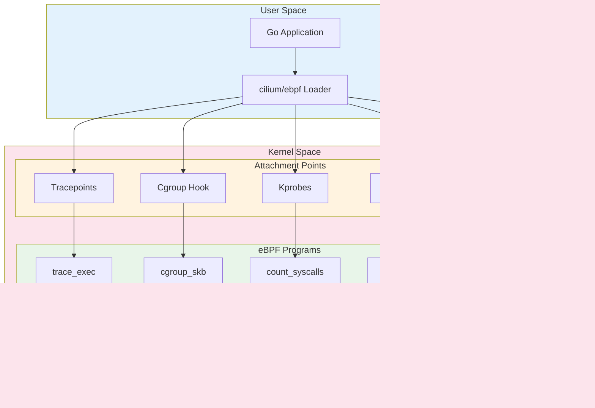

# How to Write eBPF Programs in Go with cilium/ebpf

Author: [nawazdhandala](https://github.com/nawazdhandala)

Tags: eBPF, Go, cilium/ebpf, Programming, Linux, Cloud Native

Description: A guide to developing eBPF programs in Go using the cilium/ebpf library.

---

eBPF (extended Berkeley Packet Filter) has revolutionized how we observe, trace, and secure Linux systems. With the cilium/ebpf library, Go developers can harness this powerful technology without deep kernel programming expertise. This comprehensive guide walks you through writing eBPF programs in Go, from setup to production-ready implementations.

## Table of Contents

1. [Understanding eBPF and cilium/ebpf](#understanding-ebpf-and-ciliumebpf)
2. [Prerequisites and Environment Setup](#prerequisites-and-environment-setup)
3. [Project Structure](#project-structure)
4. [Writing Your First eBPF Program](#writing-your-first-ebpf-program)
5. [BPF-to-Go Code Generation with bpf2go](#bpf-to-go-code-generation-with-bpf2go)
6. [Working with eBPF Maps](#working-with-ebpf-maps)
7. [Loading and Attaching Programs](#loading-and-attaching-programs)
8. [CO-RE: Compile Once - Run Everywhere](#co-re-compile-once---run-everywhere)
9. [Advanced Patterns](#advanced-patterns)
10. [Testing and Debugging](#testing-and-debugging)
11. [Production Considerations](#production-considerations)

## Understanding eBPF and cilium/ebpf

eBPF allows you to run sandboxed programs in the Linux kernel without changing kernel source code or loading kernel modules. The cilium/ebpf library provides a pure Go implementation for loading, compiling, and debugging eBPF programs.

The following diagram illustrates how eBPF programs flow from source to execution:


## Prerequisites and Environment Setup

Before starting, ensure you have the following installed:

### System Requirements

The following packages and tools are required for eBPF development on Linux:

```bash
# Install required packages on Ubuntu/Debian
sudo apt-get update
sudo apt-get install -y \
    clang \
    llvm \
    libbpf-dev \
    linux-headers-$(uname -r) \
    build-essential

# Install Go 1.21 or later
# Download from https://golang.org/dl/

# Verify clang version (must be 10+)
clang --version

# Verify kernel headers are installed
ls /usr/src/linux-headers-$(uname -r)
```

### Go Module Setup

Initialize your Go module and install the cilium/ebpf library:

```bash
# Create project directory
mkdir -p ~/ebpf-go-project
cd ~/ebpf-go-project

# Initialize Go module
go mod init github.com/yourusername/ebpf-go-project

# Install cilium/ebpf library and tools
go get github.com/cilium/ebpf@latest
go get github.com/cilium/ebpf/cmd/bpf2go@latest
```

## Project Structure

A well-organized project structure helps manage eBPF programs and their Go counterparts effectively:

```
ebpf-go-project/
|-- go.mod
|-- go.sum
|-- main.go                    # Main application entry point
|-- bpf/
|   |-- headers/
|   |   |-- vmlinux.h          # Kernel type definitions for CO-RE
|   |   |-- bpf_helpers.h      # BPF helper function definitions
|   |-- program.c              # eBPF program source code
|-- internal/
|   |-- ebpf/
|   |   |-- program_bpfel.go   # Generated code (little-endian)
|   |   |-- program_bpfeb.go   # Generated code (big-endian)
|   |   |-- program_bpfel.o    # Compiled BPF object (little-endian)
|   |   |-- program_bpfeb.o    # Compiled BPF object (big-endian)
|   |   |-- loader.go          # eBPF program loader utilities
|-- cmd/
|   |-- trace/
|   |   |-- main.go            # Tracing application
|-- Makefile                   # Build automation
```

## Writing Your First eBPF Program

Let's create a simple eBPF program that traces system calls. This program attaches to the `execve` tracepoint and records executed processes.

### The eBPF C Program

This C program defines an eBPF tracepoint handler that captures process execution events and stores them in a ring buffer for userspace consumption:

```c
// bpf/program.c
// This header is auto-generated and contains kernel type definitions
// enabling CO-RE (Compile Once - Run Everywhere) functionality
#include "vmlinux.h"

// BPF helper functions and macros from libbpf
#include <bpf/bpf_helpers.h>
#include <bpf/bpf_tracing.h>
#include <bpf/bpf_core_read.h>

// Define the maximum length for command names we'll capture
#define TASK_COMM_LEN 16

// Event structure that will be sent to userspace
// This structure must match the Go struct definition exactly
struct event {
    __u32 pid;                    // Process ID
    __u32 uid;                    // User ID
    char comm[TASK_COMM_LEN];     // Command name (process name)
    __u64 timestamp;              // Event timestamp in nanoseconds
};

// Define a ring buffer map for efficient event delivery to userspace
// Ring buffers are preferred over perf buffers for better performance
struct {
    __uint(type, BPF_MAP_TYPE_RINGBUF);  // Map type: ring buffer
    __uint(max_entries, 256 * 1024);      // 256KB buffer size
} events SEC(".maps");

// Tracepoint handler for sched_process_exec
// SEC() macro places this function in a specific ELF section
// The section name determines where the program will be attached
SEC("tracepoint/sched/sched_process_exec")
int trace_exec(struct trace_event_raw_sched_process_exec *ctx)
{
    // Reserve space in the ring buffer for our event
    // If the buffer is full, this returns NULL
    struct event *e = bpf_ringbuf_reserve(&events, sizeof(*e), 0);
    if (!e) {
        return 0;  // Buffer full, drop event
    }

    // Get the current process ID (lower 32 bits of tgid_pid)
    e->pid = bpf_get_current_pid_tgid() >> 32;

    // Get the current user ID (lower 32 bits of uid_gid)
    e->uid = bpf_get_current_uid_gid() & 0xFFFFFFFF;

    // Get the current process command name
    // This helper safely reads the comm field from task_struct
    bpf_get_current_comm(&e->comm, sizeof(e->comm));

    // Record timestamp in nanoseconds since boot
    e->timestamp = bpf_ktime_get_ns();

    // Submit the event to userspace
    // The event becomes visible to readers after this call
    bpf_ringbuf_submit(e, 0);

    return 0;
}

// License declaration is required for eBPF programs
// GPL license enables access to all BPF helper functions
char LICENSE[] SEC("license") = "GPL";
```

## BPF-to-Go Code Generation with bpf2go

The `bpf2go` tool compiles eBPF C code and generates Go bindings automatically. This is the recommended approach for production use.

### Setting Up bpf2go

Create a Go file that contains the go:generate directive. This directive tells the Go toolchain to run bpf2go when you execute `go generate`:

```go
// internal/ebpf/gen.go
package ebpf

// The go:generate directive below compiles the eBPF program and generates Go code
// Flags explained:
//   -cc clang           : Use clang as the compiler
//   -target amd64,arm64 : Generate code for both x86_64 and ARM64 architectures
//   -type event         : Generate Go struct for the 'event' type from C
//   program              : Base name for generated files (program_bpfel.go, etc.)
//   ../bpf/program.c    : Path to the eBPF C source file
//go:generate go run github.com/cilium/ebpf/cmd/bpf2go -cc clang -target amd64,arm64 -type event program ../bpf/program.c -- -I../bpf/headers

```

### Generating the Code

Run the code generation command from your project root:

```bash
# Generate Go bindings from eBPF C code
# This creates program_bpfel.go, program_bpfeb.go, and .o object files
go generate ./internal/ebpf/...
```

The following diagram shows the bpf2go generation workflow:


### Understanding Generated Code

The generated Go code includes embedded BPF bytecode and type-safe structures. Here's what gets generated:

```go
// This is an example of what bpf2go generates (simplified for clarity)
// The actual generated file contains more detail

package ebpf

import (
    "github.com/cilium/ebpf"
)

// programSpecs contains all eBPF program specifications
// These specs describe the programs before they're loaded into the kernel
type programSpecs struct {
    TraceExec *ebpf.ProgramSpec `ebpf:"trace_exec"`
}

// programMaps contains references to all eBPF maps
// Maps are the primary mechanism for sharing data between kernel and userspace
type programMaps struct {
    Events *ebpf.Map `ebpf:"events"`
}

// programObjects contains loaded eBPF programs and maps
// Use these after calling LoadProgram() to interact with the kernel
type programObjects struct {
    programPrograms
    programMaps
}

// event matches the C struct definition exactly
// Field order and sizes must match for correct data reading
type event struct {
    Pid       uint32
    Uid       uint32
    Comm      [16]byte
    Timestamp uint64
}

// loadProgram loads all eBPF programs and maps from the embedded object file
func loadProgram() (*programObjects, error) {
    // Implementation provided by bpf2go
}
```

## Working with eBPF Maps

eBPF maps are data structures shared between kernel space and user space. They enable bidirectional communication and data persistence.

### Common Map Types

The following diagram illustrates the different eBPF map types and their use cases:


### Hash Map Example

This example demonstrates creating and using a hash map to track network connections by storing connection metadata keyed by IP address pairs:

```c
// bpf/maps_example.c
#include "vmlinux.h"
#include <bpf/bpf_helpers.h>

// Define a key structure for our hash map
// This will uniquely identify each connection
struct conn_key {
    __u32 src_ip;    // Source IP address
    __u32 dst_ip;    // Destination IP address
    __u16 src_port;  // Source port
    __u16 dst_port;  // Destination port
};

// Define a value structure to store connection statistics
struct conn_value {
    __u64 packets;   // Total packets seen
    __u64 bytes;     // Total bytes transferred
    __u64 last_seen; // Timestamp of last packet
};

// Define a hash map for connection tracking
// Hash maps provide O(1) lookup, insert, and delete operations
struct {
    __uint(type, BPF_MAP_TYPE_HASH);        // Map type
    __uint(max_entries, 10000);              // Maximum number of entries
    __type(key, struct conn_key);            // Key type
    __type(value, struct conn_value);        // Value type
} connections SEC(".maps");

// Define a per-CPU array for high-performance counters
// Per-CPU maps avoid lock contention on multi-core systems
struct {
    __uint(type, BPF_MAP_TYPE_PERCPU_ARRAY);
    __uint(max_entries, 1);
    __type(key, __u32);
    __type(value, __u64);
} packet_counter SEC(".maps");

SEC("xdp")
int count_packets(struct xdp_md *ctx)
{
    // Index for our single counter
    __u32 key = 0;

    // Lookup the counter in the per-CPU array
    __u64 *count = bpf_map_lookup_elem(&packet_counter, &key);
    if (count) {
        // Atomically increment the counter
        // Each CPU has its own copy, so no locking needed
        __sync_fetch_and_add(count, 1);
    }

    // Continue processing the packet normally
    return XDP_PASS;
}

char LICENSE[] SEC("license") = "GPL";
```

### Go Code for Map Operations

This Go code demonstrates the complete lifecycle of working with eBPF maps - lookup, update, iteration, and deletion:

```go
// internal/ebpf/maps.go
package ebpf

import (
    "encoding/binary"
    "errors"
    "fmt"
    "net"
    "unsafe"

    "github.com/cilium/ebpf"
)

// ConnKey represents a connection identifier
// Field order and sizes must exactly match the C struct
type ConnKey struct {
    SrcIP   uint32 // Source IP in network byte order
    DstIP   uint32 // Destination IP in network byte order
    SrcPort uint16 // Source port in network byte order
    DstPort uint16 // Destination port in network byte order
}

// ConnValue stores connection statistics
// This must match the C struct layout exactly
type ConnValue struct {
    Packets  uint64 // Packet count
    Bytes    uint64 // Byte count
    LastSeen uint64 // Unix timestamp in nanoseconds
}

// MapOperations wraps eBPF map operations with type safety
type MapOperations struct {
    connections *ebpf.Map
}

// NewMapOperations creates a new MapOperations instance
func NewMapOperations(m *ebpf.Map) *MapOperations {
    return &MapOperations{connections: m}
}

// Lookup retrieves connection statistics for a given key
// Returns nil if the connection is not found
func (mo *MapOperations) Lookup(key ConnKey) (*ConnValue, error) {
    var value ConnValue

    // LookupWithFlags allows specifying lookup behavior
    // The default behavior returns ErrKeyNotExist if not found
    err := mo.connections.Lookup(key, &value)
    if err != nil {
        if errors.Is(err, ebpf.ErrKeyNotExist) {
            return nil, nil // Key not found is not an error
        }
        return nil, fmt.Errorf("map lookup failed: %w", err)
    }

    return &value, nil
}

// Update inserts or updates a connection entry
// Flags control behavior: UpdateAny, UpdateNoExist, UpdateExist
func (mo *MapOperations) Update(key ConnKey, value ConnValue) error {
    // UpdateAny creates a new entry or updates existing one
    err := mo.connections.Update(key, value, ebpf.UpdateAny)
    if err != nil {
        return fmt.Errorf("map update failed: %w", err)
    }
    return nil
}

// Delete removes a connection entry from the map
func (mo *MapOperations) Delete(key ConnKey) error {
    err := mo.connections.Delete(key)
    if err != nil && !errors.Is(err, ebpf.ErrKeyNotExist) {
        return fmt.Errorf("map delete failed: %w", err)
    }
    return nil
}

// Iterate walks through all entries in the map
// The callback function is called for each entry
func (mo *MapOperations) Iterate(fn func(key ConnKey, value ConnValue) bool) error {
    var key ConnKey
    var value ConnValue

    // Create an iterator for batch reading
    iter := mo.connections.Iterate()

    // Iterate through all entries
    for iter.Next(&key, &value) {
        // Call the callback function
        // If it returns false, stop iteration
        if !fn(key, value) {
            break
        }
    }

    // Check for iteration errors
    if err := iter.Err(); err != nil {
        return fmt.Errorf("map iteration failed: %w", err)
    }

    return nil
}

// BatchLookup performs efficient bulk reads from the map
// This is more efficient than individual lookups for large datasets
func (mo *MapOperations) BatchLookup(keys []ConnKey) ([]ConnValue, error) {
    values := make([]ConnValue, len(keys))

    // BatchLookup reads multiple entries in a single syscall
    count, err := mo.connections.BatchLookup(keys, values, nil)
    if err != nil && !errors.Is(err, ebpf.ErrKeyNotExist) {
        return nil, fmt.Errorf("batch lookup failed: %w", err)
    }

    return values[:count], nil
}

// IPToUint32 converts a net.IP to uint32 in network byte order
func IPToUint32(ip net.IP) uint32 {
    ip = ip.To4()
    if ip == nil {
        return 0
    }
    return binary.BigEndian.Uint32(ip)
}

// Uint32ToIP converts a uint32 in network byte order to net.IP
func Uint32ToIP(n uint32) net.IP {
    ip := make(net.IP, 4)
    binary.BigEndian.PutUint32(ip, n)
    return ip
}
```

### Ring Buffer Operations

Ring buffers are the preferred method for streaming events from kernel to userspace. This example shows how to consume events from a ring buffer:

```go
// internal/ebpf/ringbuf.go
package ebpf

import (
    "bytes"
    "context"
    "encoding/binary"
    "errors"
    "fmt"
    "os"

    "github.com/cilium/ebpf/ringbuf"
)

// Event represents a process execution event from the kernel
// Field layout must match the C struct exactly
type Event struct {
    PID       uint32   // Process ID
    UID       uint32   // User ID
    Comm      [16]byte // Command name (null-terminated)
    Timestamp uint64   // Nanoseconds since boot
}

// EventReader reads events from an eBPF ring buffer
type EventReader struct {
    reader *ringbuf.Reader
}

// NewEventReader creates a ring buffer reader for the given map
func NewEventReader(eventsMap *ebpf.Map) (*EventReader, error) {
    // Create a reader that will block waiting for events
    reader, err := ringbuf.NewReader(eventsMap)
    if err != nil {
        return nil, fmt.Errorf("creating ring buffer reader: %w", err)
    }

    return &EventReader{reader: reader}, nil
}

// Close releases resources associated with the reader
func (er *EventReader) Close() error {
    return er.reader.Close()
}

// Read blocks until an event is available and returns it
// The context can be used to cancel the read operation
func (er *EventReader) Read(ctx context.Context) (*Event, error) {
    // Create a channel to receive the result
    type result struct {
        event *Event
        err   error
    }
    ch := make(chan result, 1)

    // Read in a goroutine so we can respect context cancellation
    go func() {
        record, err := er.reader.Read()
        if err != nil {
            ch <- result{nil, err}
            return
        }

        // Parse the binary data into our Event struct
        event, err := parseEvent(record.RawSample)
        ch <- result{event, err}
    }()

    // Wait for either the event or context cancellation
    select {
    case <-ctx.Done():
        // Context was cancelled, close the reader to unblock Read()
        er.reader.Close()
        return nil, ctx.Err()
    case res := <-ch:
        return res.event, res.err
    }
}

// ReadEvents continuously reads events and sends them to a channel
// It stops when the context is cancelled
func (er *EventReader) ReadEvents(ctx context.Context, events chan<- *Event) error {
    for {
        // Check if context is cancelled
        select {
        case <-ctx.Done():
            return ctx.Err()
        default:
        }

        // Read the next event
        record, err := er.reader.Read()
        if err != nil {
            if errors.Is(err, ringbuf.ErrClosed) {
                return nil // Normal shutdown
            }
            if errors.Is(err, os.ErrDeadlineExceeded) {
                continue // Timeout, try again
            }
            return fmt.Errorf("reading from ring buffer: %w", err)
        }

        // Parse the event
        event, err := parseEvent(record.RawSample)
        if err != nil {
            return fmt.Errorf("parsing event: %w", err)
        }

        // Send event to channel (non-blocking with context check)
        select {
        case events <- event:
        case <-ctx.Done():
            return ctx.Err()
        }
    }
}

// parseEvent converts raw bytes into an Event struct
func parseEvent(data []byte) (*Event, error) {
    // Verify we have enough data
    if len(data) < int(unsafe.Sizeof(Event{})) {
        return nil, fmt.Errorf("event data too short: %d bytes", len(data))
    }

    // Parse using binary.Read for safe deserialization
    var event Event
    reader := bytes.NewReader(data)

    if err := binary.Read(reader, binary.LittleEndian, &event); err != nil {
        return nil, fmt.Errorf("parsing event: %w", err)
    }

    return &event, nil
}

// CommString returns the command name as a Go string
// It handles null-termination and trimming
func (e *Event) CommString() string {
    // Find the null terminator
    n := bytes.IndexByte(e.Comm[:], 0)
    if n == -1 {
        n = len(e.Comm)
    }
    return string(e.Comm[:n])
}
```

## Loading and Attaching Programs

Loading eBPF programs involves multiple steps: parsing the object file, loading programs and maps into the kernel, and attaching programs to their hook points.

### Complete Loader Implementation

This implementation shows the full lifecycle of loading and attaching eBPF programs:

```go
// internal/ebpf/loader.go
package ebpf

import (
    "fmt"
    "os"
    "runtime"

    "github.com/cilium/ebpf"
    "github.com/cilium/ebpf/link"
    "github.com/cilium/ebpf/rlimit"
)

// Loader manages the lifecycle of eBPF programs
type Loader struct {
    objects *programObjects
    links   []link.Link
}

// LoaderOptions configures the eBPF loader
type LoaderOptions struct {
    // PinPath enables persistent BPF object pinning
    // When set, maps and programs persist after the process exits
    PinPath string

    // LogLevel controls the BPF verifier log level (0-2)
    // Higher levels provide more detailed output for debugging
    LogLevel uint32

    // LogSize sets the size of the verifier log buffer
    LogSize int
}

// NewLoader creates and initializes a new eBPF program loader
func NewLoader(opts LoaderOptions) (*Loader, error) {
    // Remove memory lock limit for eBPF programs
    // This is required on kernels < 5.11
    if err := rlimit.RemoveMemlock(); err != nil {
        return nil, fmt.Errorf("removing memlock limit: %w", err)
    }

    // Set up collection options for loading
    collOpts := &ebpf.CollectionOptions{
        Programs: ebpf.ProgramOptions{
            // LogLevel controls verifier output verbosity
            LogLevel: ebpf.LogLevel(opts.LogLevel),
            // LogSize sets the verifier log buffer size
            LogSize: opts.LogSize,
        },
    }

    // If pinning is enabled, set up the pin path
    if opts.PinPath != "" {
        // Ensure the pin directory exists
        if err := os.MkdirAll(opts.PinPath, 0755); err != nil {
            return nil, fmt.Errorf("creating pin path: %w", err)
        }
        collOpts.Maps = ebpf.MapOptions{
            PinPath: opts.PinPath,
        }
    }

    // Load the eBPF programs and maps from the embedded object file
    // This function is generated by bpf2go
    spec, err := loadProgram()
    if err != nil {
        return nil, fmt.Errorf("loading BPF spec: %w", err)
    }

    // Load the collection into the kernel
    var objs programObjects
    if err := spec.LoadAndAssign(&objs, collOpts); err != nil {
        // On failure, try to get detailed verifier output
        var ve *ebpf.VerifierError
        if errors.As(err, &ve) {
            return nil, fmt.Errorf("verifier error: %+v", ve)
        }
        return nil, fmt.Errorf("loading BPF objects: %w", err)
    }

    return &Loader{
        objects: &objs,
        links:   make([]link.Link, 0),
    }, nil
}

// AttachTracepoint attaches the trace_exec program to its tracepoint
func (l *Loader) AttachTracepoint() error {
    // link.Tracepoint attaches a program to a kernel tracepoint
    // The tracepoint is specified by group and name
    lnk, err := link.Tracepoint("sched", "sched_process_exec", l.objects.TraceExec, nil)
    if err != nil {
        return fmt.Errorf("attaching tracepoint: %w", err)
    }

    // Store the link so we can detach later
    l.links = append(l.links, lnk)

    return nil
}

// AttachKprobe attaches a program to a kernel function entry point
func (l *Loader) AttachKprobe(symbol string, prog *ebpf.Program) error {
    // Kprobes allow attaching to any kernel function
    lnk, err := link.Kprobe(symbol, prog, nil)
    if err != nil {
        return fmt.Errorf("attaching kprobe to %s: %w", symbol, err)
    }

    l.links = append(l.links, lnk)
    return nil
}

// AttachKretprobe attaches a program to a kernel function return point
func (l *Loader) AttachKretprobe(symbol string, prog *ebpf.Program) error {
    // Kretprobes trigger when a function returns
    lnk, err := link.Kretprobe(symbol, prog, nil)
    if err != nil {
        return fmt.Errorf("attaching kretprobe to %s: %w", symbol, err)
    }

    l.links = append(l.links, lnk)
    return nil
}

// AttachXDP attaches an XDP program to a network interface
func (l *Loader) AttachXDP(ifaceName string, prog *ebpf.Program) error {
    // Get the interface index
    iface, err := net.InterfaceByName(ifaceName)
    if err != nil {
        return fmt.Errorf("getting interface %s: %w", ifaceName, err)
    }

    // Attach XDP program to the interface
    // XDP programs process packets at the earliest possible point
    lnk, err := link.AttachXDP(link.XDPOptions{
        Program:   prog,
        Interface: iface.Index,
        Flags:     link.XDPGenericMode, // Use generic mode for compatibility
    })
    if err != nil {
        return fmt.Errorf("attaching XDP to %s: %w", ifaceName, err)
    }

    l.links = append(l.links, lnk)
    return nil
}

// AttachCgroup attaches a cgroup program
func (l *Loader) AttachCgroup(cgroupPath string, prog *ebpf.Program, attachType ebpf.AttachType) error {
    // Open the cgroup directory
    cgroupFd, err := os.Open(cgroupPath)
    if err != nil {
        return fmt.Errorf("opening cgroup %s: %w", cgroupPath, err)
    }

    // Attach the program to the cgroup
    lnk, err := link.AttachCgroup(link.CgroupOptions{
        Path:    cgroupFd.Name(),
        Attach:  attachType,
        Program: prog,
    })
    if err != nil {
        cgroupFd.Close()
        return fmt.Errorf("attaching to cgroup: %w", err)
    }

    l.links = append(l.links, lnk)
    return nil
}

// EventsMap returns the events ring buffer map
func (l *Loader) EventsMap() *ebpf.Map {
    return l.objects.Events
}

// Close detaches all programs and releases resources
func (l *Loader) Close() error {
    var errs []error

    // Detach all links
    for _, lnk := range l.links {
        if err := lnk.Close(); err != nil {
            errs = append(errs, err)
        }
    }

    // Close all program and map objects
    if err := l.objects.Close(); err != nil {
        errs = append(errs, err)
    }

    if len(errs) > 0 {
        return fmt.Errorf("closing loader: %v", errs)
    }

    return nil
}
```

### Attachment Flow Diagram

The following diagram shows how different program types attach to their respective hook points:



## CO-RE: Compile Once - Run Everywhere

CO-RE (Compile Once - Run Everywhere) solves the problem of kernel version compatibility. It allows eBPF programs compiled on one kernel version to run on different kernel versions without recompilation.

### How CO-RE Works

CO-RE relies on BTF (BPF Type Format) information embedded in modern kernels. The following diagram explains the CO-RE mechanism:


### Generating vmlinux.h

The vmlinux.h header contains all kernel type definitions needed for CO-RE. Generate it from a running kernel:

```bash
# Generate vmlinux.h from the running kernel's BTF information
# This requires a kernel with BTF support (5.2+)
bpftool btf dump file /sys/kernel/btf/vmlinux format c > bpf/headers/vmlinux.h

# Verify the file was created
ls -la bpf/headers/vmlinux.h
```

### CO-RE Enabled eBPF Program

This example demonstrates CO-RE features including struct field access with relocation:

```c
// bpf/core_example.c
// vmlinux.h provides all kernel types via BTF
// This eliminates the need for kernel headers
#include "vmlinux.h"
#include <bpf/bpf_helpers.h>
#include <bpf/bpf_tracing.h>
#include <bpf/bpf_core_read.h>

// Event structure for file access monitoring
struct file_event {
    __u32 pid;
    __u32 uid;
    char filename[256];
    char comm[16];
};

// Ring buffer for events
struct {
    __uint(type, BPF_MAP_TYPE_RINGBUF);
    __uint(max_entries, 256 * 1024);
} file_events SEC(".maps");

// Use BPF_CORE_READ to safely read kernel structures
// This macro generates relocations that are resolved at load time
// based on the target kernel's actual structure layout
SEC("kprobe/do_sys_openat2")
int trace_openat(struct pt_regs *ctx)
{
    struct file_event *e;

    // Reserve space in ring buffer
    e = bpf_ringbuf_reserve(&file_events, sizeof(*e), 0);
    if (!e) {
        return 0;
    }

    // Get process information
    e->pid = bpf_get_current_pid_tgid() >> 32;
    e->uid = bpf_get_current_uid_gid() & 0xFFFFFFFF;
    bpf_get_current_comm(&e->comm, sizeof(e->comm));

    // Read the filename from the second argument (const char *filename)
    // Using bpf_probe_read_user_str for user-space strings
    const char *filename = (const char *)PT_REGS_PARM2(ctx);
    bpf_probe_read_user_str(&e->filename, sizeof(e->filename), filename);

    bpf_ringbuf_submit(e, 0);
    return 0;
}

// Example of CO-RE field existence check
// This program adapts to different kernel versions
SEC("kprobe/tcp_connect")
int trace_tcp_connect(struct pt_regs *ctx)
{
    struct sock *sk = (struct sock *)PT_REGS_PARM1(ctx);

    // BPF_CORE_READ handles structure offsets that differ between kernel versions
    // The loader will patch these reads based on the target kernel's BTF
    __u16 family = BPF_CORE_READ(sk, __sk_common.skc_family);
    __u16 dport = BPF_CORE_READ(sk, __sk_common.skc_dport);

    // Check if field exists in this kernel version using CO-RE
    // This enables writing programs that work across kernel versions
    if (bpf_core_field_exists(sk->sk_max_ack_backlog)) {
        // Field exists in this kernel, safe to read
        __u32 backlog = BPF_CORE_READ(sk, sk_max_ack_backlog);
        // Use backlog...
    }

    return 0;
}

char LICENSE[] SEC("license") = "GPL";
```

### Loading CO-RE Programs in Go

The cilium/ebpf library handles CO-RE relocations automatically when loading programs:

```go
// internal/ebpf/core_loader.go
package ebpf

import (
    "fmt"
    "os"

    "github.com/cilium/ebpf"
    "github.com/cilium/ebpf/btf"
)

// CORELoader loads CO-RE enabled eBPF programs
type CORELoader struct {
    spec *ebpf.CollectionSpec
    opts *ebpf.CollectionOptions
}

// NewCORELoader creates a loader for CO-RE programs
func NewCORELoader() (*CORELoader, error) {
    // Load the eBPF spec from embedded data
    spec, err := loadProgram()
    if err != nil {
        return nil, fmt.Errorf("loading spec: %w", err)
    }

    // Configure collection options for CO-RE
    opts := &ebpf.CollectionOptions{
        Programs: ebpf.ProgramOptions{
            // The kernel BTF is automatically loaded from /sys/kernel/btf/vmlinux
            // on supported kernels (5.2+)

            // For custom BTF (e.g., testing with different kernel versions):
            // KernelTypes: customBTF,
        },
    }

    return &CORELoader{
        spec: spec,
        opts: opts,
    }, nil
}

// LoadWithCustomBTF loads programs using BTF from a file
// This is useful for testing against different kernel versions
func (cl *CORELoader) LoadWithCustomBTF(btfPath string) (*programObjects, error) {
    // Load BTF from the specified file
    kernelBTF, err := btf.LoadSpec(btfPath)
    if err != nil {
        return nil, fmt.Errorf("loading BTF from %s: %w", btfPath, err)
    }

    // Use the custom BTF for CO-RE relocations
    cl.opts.Programs.KernelTypes = kernelBTF

    return cl.Load()
}

// Load loads the eBPF programs with CO-RE relocations
func (cl *CORELoader) Load() (*programObjects, error) {
    var objs programObjects

    // LoadAndAssign performs CO-RE relocations automatically
    // It matches the compiled program's type expectations with
    // the running kernel's actual structure layouts
    if err := cl.spec.LoadAndAssign(&objs, cl.opts); err != nil {
        return nil, fmt.Errorf("loading objects: %w", err)
    }

    return &objs, nil
}

// VerifyBTFSupport checks if the running kernel supports BTF
func VerifyBTFSupport() error {
    // Check for vmlinux BTF
    if _, err := os.Stat("/sys/kernel/btf/vmlinux"); err != nil {
        if os.IsNotExist(err) {
            return fmt.Errorf("kernel BTF not available: upgrade to kernel 5.2+ with CONFIG_DEBUG_INFO_BTF=y")
        }
        return err
    }
    return nil
}
```

## Advanced Patterns

### Tail Calls

Tail calls allow one eBPF program to call another, enabling modular program design:

```c
// bpf/tail_calls.c
#include "vmlinux.h"
#include <bpf/bpf_helpers.h>

// Program array map for tail calls
// This map stores references to other eBPF programs
struct {
    __uint(type, BPF_MAP_TYPE_PROG_ARRAY);
    __uint(max_entries, 8);
    __type(key, __u32);
    __type(value, __u32);  // FD of the target program
} progs SEC(".maps");

// Index constants for the program array
#define PROG_PARSE_HTTP  0
#define PROG_PARSE_DNS   1
#define PROG_LOG_EVENT   2

// Main entry point that dispatches to protocol-specific handlers
SEC("xdp")
int xdp_dispatcher(struct xdp_md *ctx)
{
    void *data = (void *)(long)ctx->data;
    void *data_end = (void *)(long)ctx->data_end;

    // Parse Ethernet header
    struct ethhdr *eth = data;
    if ((void *)(eth + 1) > data_end) {
        return XDP_PASS;
    }

    // Check protocol and tail call to appropriate handler
    if (eth->h_proto == bpf_htons(0x0800)) {  // IPv4
        // Parse IP header to determine L4 protocol
        struct iphdr *ip = (void *)(eth + 1);
        if ((void *)(ip + 1) > data_end) {
            return XDP_PASS;
        }

        if (ip->protocol == IPPROTO_TCP) {
            // Tail call to HTTP parser (if port 80/443)
            bpf_tail_call(ctx, &progs, PROG_PARSE_HTTP);
        } else if (ip->protocol == IPPROTO_UDP) {
            // Tail call to DNS parser (if port 53)
            bpf_tail_call(ctx, &progs, PROG_PARSE_DNS);
        }
    }

    // If tail call fails or no match, pass the packet
    return XDP_PASS;
}

// HTTP parsing handler (called via tail call)
SEC("xdp")
int xdp_parse_http(struct xdp_md *ctx)
{
    // HTTP-specific parsing logic
    // ...

    // Can chain to another program
    bpf_tail_call(ctx, &progs, PROG_LOG_EVENT);

    return XDP_PASS;
}

char LICENSE[] SEC("license") = "GPL";
```

### Perf Events

For high-frequency events, perf events provide efficient batched delivery:

```go
// internal/ebpf/perf.go
package ebpf

import (
    "bytes"
    "context"
    "encoding/binary"
    "fmt"

    "github.com/cilium/ebpf"
    "github.com/cilium/ebpf/perf"
)

// PerfEventReader reads events from a perf event array
type PerfEventReader struct {
    reader *perf.Reader
}

// NewPerfEventReader creates a reader for the given perf event array map
func NewPerfEventReader(perfMap *ebpf.Map, perCPUBufferSize int) (*PerfEventReader, error) {
    // Create a perf event reader
    // Each CPU gets its own ring buffer of the specified size
    reader, err := perf.NewReader(perfMap, perCPUBufferSize)
    if err != nil {
        return nil, fmt.Errorf("creating perf reader: %w", err)
    }

    return &PerfEventReader{reader: reader}, nil
}

// ReadLoop continuously reads events and processes them
func (pr *PerfEventReader) ReadLoop(ctx context.Context, handler func(Event) error) error {
    for {
        select {
        case <-ctx.Done():
            return ctx.Err()
        default:
        }

        // Read the next event (blocking)
        record, err := pr.reader.Read()
        if err != nil {
            if perf.IsClosed(err) {
                return nil
            }
            return fmt.Errorf("reading perf event: %w", err)
        }

        // Check if we lost events due to buffer overflow
        if record.LostSamples > 0 {
            // Log or handle lost samples
            fmt.Printf("lost %d samples\n", record.LostSamples)
            continue
        }

        // Parse the event data
        var event Event
        if err := binary.Read(bytes.NewReader(record.RawSample), binary.LittleEndian, &event); err != nil {
            return fmt.Errorf("parsing event: %w", err)
        }

        // Process the event
        if err := handler(event); err != nil {
            return fmt.Errorf("handling event: %w", err)
        }
    }
}

// Close releases resources
func (pr *PerfEventReader) Close() error {
    return pr.reader.Close()
}
```

## Testing and Debugging

### Unit Testing eBPF Programs

Testing eBPF programs requires running them in a controlled environment:

```go
// internal/ebpf/loader_test.go
package ebpf

import (
    "context"
    "os/exec"
    "testing"
    "time"

    "github.com/cilium/ebpf/rlimit"
)

// TestLoadProgram verifies that the eBPF program loads successfully
func TestLoadProgram(t *testing.T) {
    // Skip if not running as root
    if os.Geteuid() != 0 {
        t.Skip("test requires root privileges")
    }

    // Skip if BTF is not available
    if err := VerifyBTFSupport(); err != nil {
        t.Skipf("BTF not available: %v", err)
    }

    // Remove memlock limit
    if err := rlimit.RemoveMemlock(); err != nil {
        t.Fatalf("removing memlock: %v", err)
    }

    // Load the program
    loader, err := NewLoader(LoaderOptions{})
    if err != nil {
        t.Fatalf("creating loader: %v", err)
    }
    defer loader.Close()

    // Verify we got the expected maps
    if loader.EventsMap() == nil {
        t.Error("events map is nil")
    }
}

// TestTracepointAttachment verifies tracepoint attachment
func TestTracepointAttachment(t *testing.T) {
    if os.Geteuid() != 0 {
        t.Skip("test requires root privileges")
    }

    if err := rlimit.RemoveMemlock(); err != nil {
        t.Fatalf("removing memlock: %v", err)
    }

    loader, err := NewLoader(LoaderOptions{})
    if err != nil {
        t.Fatalf("creating loader: %v", err)
    }
    defer loader.Close()

    // Attach to tracepoint
    if err := loader.AttachTracepoint(); err != nil {
        t.Fatalf("attaching tracepoint: %v", err)
    }
}

// TestEventCapture verifies that events are captured correctly
func TestEventCapture(t *testing.T) {
    if os.Geteuid() != 0 {
        t.Skip("test requires root privileges")
    }

    if err := rlimit.RemoveMemlock(); err != nil {
        t.Fatalf("removing memlock: %v", err)
    }

    loader, err := NewLoader(LoaderOptions{})
    if err != nil {
        t.Fatalf("creating loader: %v", err)
    }
    defer loader.Close()

    if err := loader.AttachTracepoint(); err != nil {
        t.Fatalf("attaching: %v", err)
    }

    // Create event reader
    reader, err := NewEventReader(loader.EventsMap())
    if err != nil {
        t.Fatalf("creating reader: %v", err)
    }
    defer reader.Close()

    // Spawn a process to trigger an event
    ctx, cancel := context.WithTimeout(context.Background(), 5*time.Second)
    defer cancel()

    // Run a command to generate an exec event
    go func() {
        exec.Command("echo", "test").Run()
    }()

    // Read the event
    event, err := reader.Read(ctx)
    if err != nil {
        t.Fatalf("reading event: %v", err)
    }

    // Verify event data
    if event.PID == 0 {
        t.Error("event PID is 0")
    }
}
```

### Debugging with bpftool

Use bpftool to inspect loaded programs and maps:

```bash
# List all loaded BPF programs
sudo bpftool prog list

# Show detailed information about a specific program
sudo bpftool prog show id <program_id>

# Dump program instructions (JIT-compiled)
sudo bpftool prog dump jited id <program_id>

# List all BPF maps
sudo bpftool map list

# Dump map contents
sudo bpftool map dump id <map_id>

# Show BTF information
sudo bpftool btf list

# Generate vmlinux.h
sudo bpftool btf dump file /sys/kernel/btf/vmlinux format c > vmlinux.h
```

## Production Considerations

### Complete Main Application

Here is a production-ready main application that ties everything together:

```go
// main.go
package main

import (
    "context"
    "flag"
    "fmt"
    "log"
    "os"
    "os/signal"
    "syscall"
    "time"

    "github.com/yourusername/ebpf-go-project/internal/ebpf"
)

// Command-line flags
var (
    logLevel = flag.Uint("log-level", 0, "BPF verifier log level (0-2)")
    pinPath  = flag.String("pin-path", "", "Path for BPF object pinning")
)

func main() {
    flag.Parse()

    // Verify we have root privileges
    if os.Geteuid() != 0 {
        log.Fatal("This program requires root privileges")
    }

    // Verify BTF support
    if err := ebpf.VerifyBTFSupport(); err != nil {
        log.Fatalf("BTF not available: %v", err)
    }

    // Create context for graceful shutdown
    ctx, cancel := context.WithCancel(context.Background())
    defer cancel()

    // Handle shutdown signals
    sigChan := make(chan os.Signal, 1)
    signal.Notify(sigChan, syscall.SIGINT, syscall.SIGTERM)
    go func() {
        <-sigChan
        log.Println("Received shutdown signal")
        cancel()
    }()

    // Initialize the eBPF loader
    loader, err := ebpf.NewLoader(ebpf.LoaderOptions{
        LogLevel: uint32(*logLevel),
        PinPath:  *pinPath,
    })
    if err != nil {
        log.Fatalf("Failed to load eBPF program: %v", err)
    }
    defer loader.Close()

    // Attach to tracepoint
    if err := loader.AttachTracepoint(); err != nil {
        log.Fatalf("Failed to attach tracepoint: %v", err)
    }
    log.Println("eBPF program attached successfully")

    // Create event reader
    reader, err := ebpf.NewEventReader(loader.EventsMap())
    if err != nil {
        log.Fatalf("Failed to create event reader: %v", err)
    }
    defer reader.Close()

    // Create event channel
    events := make(chan *ebpf.Event, 100)

    // Start reading events in a goroutine
    go func() {
        if err := reader.ReadEvents(ctx, events); err != nil {
            if ctx.Err() == nil {
                log.Printf("Event reader error: %v", err)
            }
        }
    }()

    // Process events
    log.Println("Listening for process execution events...")
    eventCount := 0

    for {
        select {
        case <-ctx.Done():
            log.Printf("Shutting down. Processed %d events.", eventCount)
            return

        case event := <-events:
            eventCount++
            processEvent(event)
        }
    }
}

// processEvent handles a single process execution event
func processEvent(event *ebpf.Event) {
    // Convert timestamp to human-readable format
    bootTime := getBootTime()
    eventTime := bootTime.Add(time.Duration(event.Timestamp))

    // Log the event
    fmt.Printf("[%s] PID: %-6d UID: %-6d Command: %s\n",
        eventTime.Format("15:04:05.000"),
        event.PID,
        event.UID,
        event.CommString(),
    )
}

// getBootTime returns the system boot time
func getBootTime() time.Time {
    var info syscall.Sysinfo_t
    syscall.Sysinfo(&info)
    return time.Now().Add(-time.Duration(info.Uptime) * time.Second)
}
```

### Makefile for Build Automation

This Makefile automates the build process including eBPF code generation:

```makefile
# Makefile
.PHONY: all generate build clean test

# Build variables
CLANG ?= clang
CFLAGS := -O2 -g -Wall -Werror

# Targets
all: generate build

# Generate eBPF Go bindings
generate:
	go generate ./internal/ebpf/...

# Build the Go binary
build:
	CGO_ENABLED=0 go build -o bin/tracer ./main.go

# Clean build artifacts
clean:
	rm -rf bin/
	rm -f internal/ebpf/*_bpfel.go internal/ebpf/*_bpfeb.go
	rm -f internal/ebpf/*.o

# Run tests
test:
	sudo go test -v ./internal/ebpf/...

# Generate vmlinux.h from running kernel
vmlinux:
	bpftool btf dump file /sys/kernel/btf/vmlinux format c > bpf/headers/vmlinux.h

# Run the tracer (requires root)
run: build
	sudo ./bin/tracer
```

### Resource Limits and Best Practices

Consider these production recommendations for deploying eBPF programs:

```go
// internal/ebpf/resources.go
package ebpf

import (
    "fmt"
    "os"
    "runtime"

    "github.com/cilium/ebpf/rlimit"
)

// ResourceConfig defines resource limits for eBPF programs
type ResourceConfig struct {
    // MaxMapEntries limits the size of BPF maps
    MaxMapEntries int

    // RingBufferSize sets the ring buffer size in bytes
    RingBufferSize int

    // PinMaps enables persistent map storage
    PinMaps bool

    // CPUPinning pins the program to specific CPUs
    CPUPinning []int
}

// DefaultResourceConfig returns sensible defaults for production use
func DefaultResourceConfig() ResourceConfig {
    return ResourceConfig{
        MaxMapEntries:  10000,
        RingBufferSize: 256 * 1024, // 256KB
        PinMaps:        false,
        CPUPinning:     nil,
    }
}

// ApplyResourceLimits configures system resource limits for eBPF
func ApplyResourceLimits() error {
    // Remove memory lock limit
    // Required for eBPF programs on kernels < 5.11
    if err := rlimit.RemoveMemlock(); err != nil {
        return fmt.Errorf("removing memlock: %w", err)
    }

    // Lock the current goroutine to its OS thread
    // This is important when working with cgroups and namespaces
    runtime.LockOSThread()

    return nil
}

// VerifyKernelSupport checks if the kernel supports required features
func VerifyKernelSupport() error {
    // Check for required kernel features
    checks := []struct {
        path string
        name string
    }{
        {"/sys/kernel/btf/vmlinux", "BTF"},
        {"/proc/sys/kernel/unprivileged_bpf_disabled", "BPF syscall"},
    }

    for _, check := range checks {
        if _, err := os.Stat(check.path); err != nil {
            if os.IsNotExist(err) {
                return fmt.Errorf("%s not available (missing %s)", check.name, check.path)
            }
            return fmt.Errorf("checking %s: %w", check.name, err)
        }
    }

    return nil
}
```

## Summary

This guide covered the essential aspects of developing eBPF programs in Go with cilium/ebpf:

1. **Environment Setup**: Installing prerequisites including clang, LLVM, and the cilium/ebpf library
2. **Project Structure**: Organizing eBPF C code and Go bindings for maintainability
3. **BPF-to-Go Generation**: Using bpf2go for automatic code generation
4. **Map Operations**: Working with hash maps, ring buffers, and per-CPU arrays
5. **Program Loading**: Loading and attaching programs to various hook points
6. **CO-RE**: Writing portable eBPF programs that work across kernel versions
7. **Advanced Patterns**: Implementing tail calls and perf events
8. **Testing**: Unit testing eBPF programs and using debugging tools
9. **Production**: Building robust, production-ready applications

The cilium/ebpf library provides a powerful foundation for building observability, security, and networking tools. By following the patterns in this guide, you can leverage eBPF's capabilities while maintaining type safety and Go's productivity benefits.

## Additional Resources

- [cilium/ebpf GitHub Repository](https://github.com/cilium/ebpf)
- [eBPF Documentation](https://ebpf.io/what-is-ebpf/)
- [BPF and XDP Reference Guide](https://docs.cilium.io/en/latest/bpf/)
- [Linux Kernel BTF Documentation](https://www.kernel.org/doc/html/latest/bpf/btf.html)
- [libbpf-bootstrap](https://github.com/libbpf/libbpf-bootstrap) - Examples and templates
