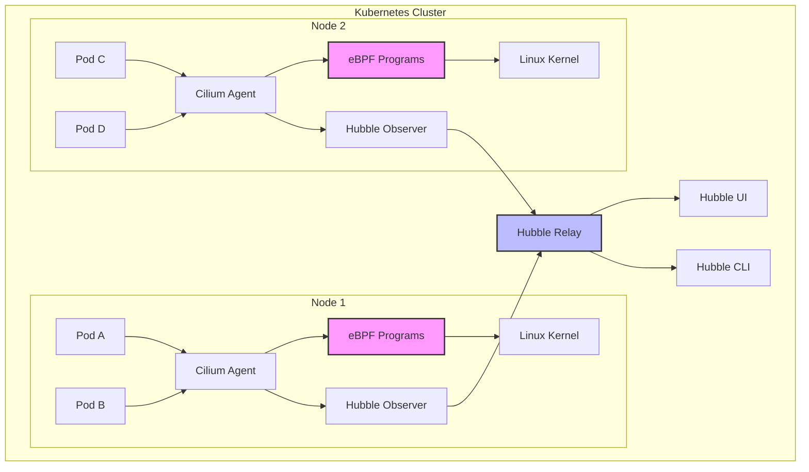
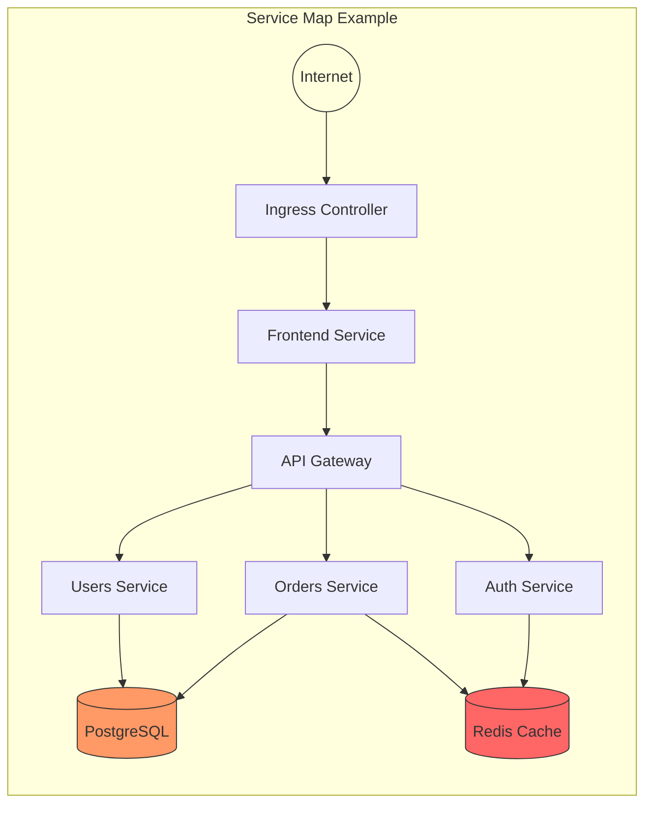
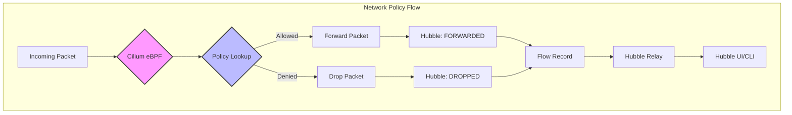

# How to Use Hubble for eBPF-Based Kubernetes Observability

Author: [nawazdhandala](https://github.com/nawazdhandala)

Tags: eBPF, Hubble, Kubernetes, Observability, Cilium, Cloud Native

Description: A guide to deploying Hubble for deep network and application observability in Kubernetes.

---

## Introduction to Hubble

Hubble is a fully distributed networking and security observability platform built on top of Cilium and eBPF. It provides deep visibility into the communication and behavior of services as well as the networking infrastructure in a completely transparent manner.

Unlike traditional observability tools that rely on application-level instrumentation, Hubble leverages eBPF (extended Berkeley Packet Filter) to collect data directly from the Linux kernel. This approach offers several advantages:

- **Zero instrumentation required**: No code changes or sidecars needed
- **Low overhead**: eBPF programs run efficiently in the kernel
- **Complete visibility**: Captures all network traffic, including encrypted connections
- **Real-time insights**: Immediate visibility into network flows and service dependencies

## Architecture Overview

The following diagram illustrates how Hubble integrates with Cilium and Kubernetes to provide observability:



## Prerequisites

Before installing Hubble, ensure you have:

- A Kubernetes cluster (version 1.21 or later)
- kubectl configured to access your cluster
- Helm 3.x installed
- Cilium CNI installed (Hubble is a component of Cilium)

## Installing Cilium with Hubble

Hubble is integrated into Cilium, so the installation process involves deploying Cilium with Hubble enabled. Below are the step-by-step instructions.

### Step 1: Add the Cilium Helm Repository

First, add the official Cilium Helm chart repository to your Helm installation:

```bash
# Add the Cilium Helm repository
helm repo add cilium https://helm.cilium.io/

# Update your local Helm chart repository cache
helm repo update
```

### Step 2: Install Cilium with Hubble Enabled

Deploy Cilium with Hubble and its UI component enabled. This command installs both Cilium CNI and the complete Hubble observability stack:

```bash
# Install Cilium with Hubble enabled
# - hubble.enabled: Activates the Hubble observability layer
# - hubble.relay.enabled: Enables Hubble Relay for aggregating flows from all nodes
# - hubble.ui.enabled: Deploys the Hubble UI for visual exploration
helm install cilium cilium/cilium --version 1.15.0 \
  --namespace kube-system \
  --set hubble.enabled=true \
  --set hubble.relay.enabled=true \
  --set hubble.ui.enabled=true
```

### Step 3: Verify the Installation

Confirm that all Cilium and Hubble components are running correctly:

```bash
# Check the status of Cilium pods in the kube-system namespace
# You should see cilium, hubble-relay, and hubble-ui pods running
kubectl get pods -n kube-system -l app.kubernetes.io/part-of=cilium
```

Expected output showing healthy pods:

```
NAME                                READY   STATUS    RESTARTS   AGE
cilium-operator-69b677f97c-lg9xm    1/1     Running   0          2m
cilium-xwkz7                        1/1     Running   0          2m
hubble-relay-7fd8b45b8c-q9zl2       1/1     Running   0          2m
hubble-ui-64b4b9dfb9-lmkjh          2/2     Running   0          2m
```

## Configuring Hubble for Enhanced Observability

Hubble can be configured to capture different levels of detail. Here's an advanced configuration that enables comprehensive observability:

### Advanced Hubble Configuration

Create a values file for fine-grained control over Hubble settings:

```yaml
# hubble-values.yaml
# This configuration enables comprehensive observability features

hubble:
  # Enable the core Hubble functionality
  enabled: true

  # Configure flow collection metrics
  metrics:
    # Enable Prometheus metrics for Hubble
    enabled:
      - dns:query
      - drop
      - tcp
      - flow
      - icmp
      - http

    # ServiceMonitor for Prometheus Operator integration
    serviceMonitor:
      enabled: true

  # Hubble Relay configuration for cluster-wide visibility
  relay:
    enabled: true
    # Number of relay replicas for high availability
    replicas: 2
    # Resource limits for the relay pods
    resources:
      limits:
        cpu: 500m
        memory: 512Mi
      requests:
        cpu: 100m
        memory: 64Mi

  # Hubble UI configuration
  ui:
    enabled: true
    # Number of UI replicas
    replicas: 1
    # Configure ingress if you want external access
    ingress:
      enabled: false

  # Configure what flows to observe
  # The redact option helps with privacy by hiding sensitive data
  redact:
    enabled: false

  # Flow export configuration for external systems
  export:
    static:
      enabled: false
```

Apply the advanced configuration using Helm upgrade:

```bash
# Upgrade Cilium installation with the custom Hubble configuration
# This applies the settings from hubble-values.yaml
helm upgrade cilium cilium/cilium \
  --namespace kube-system \
  --reuse-values \
  -f hubble-values.yaml
```

## Using the Hubble CLI

The Hubble CLI is a powerful tool for querying and analyzing network flows directly from the command line.

### Installing the Hubble CLI

Download and install the Hubble CLI on your local machine:

```bash
# Set the Hubble CLI version to download
HUBBLE_VERSION=$(curl -s https://raw.githubusercontent.com/cilium/hubble/master/stable.txt)

# Download the appropriate binary for your architecture
# This example is for Linux AMD64; adjust for your OS
curl -L --remote-name-all \
  https://github.com/cilium/hubble/releases/download/${HUBBLE_VERSION}/hubble-linux-amd64.tar.gz \
  https://github.com/cilium/hubble/releases/download/${HUBBLE_VERSION}/hubble-linux-amd64.tar.gz.sha256sum

# Verify the download integrity using the SHA256 checksum
sha256sum --check hubble-linux-amd64.tar.gz.sha256sum

# Extract the binary to a location in your PATH
sudo tar xzvf hubble-linux-amd64.tar.gz -C /usr/local/bin
```

For macOS users, use Homebrew for a simpler installation:

```bash
# Install Hubble CLI using Homebrew on macOS
brew install hubble
```

### Connecting to Hubble Relay

To use the Hubble CLI, you need to establish a connection to the Hubble Relay service:

```bash
# Set up port forwarding to the Hubble Relay service
# This makes Hubble Relay accessible on localhost:4245
kubectl port-forward -n kube-system svc/hubble-relay 4245:80 &

# Verify the connection by checking Hubble status
# This should show the Hubble Relay status and connected nodes
hubble status
```

Expected status output:

```
Healthcheck (via localhost:4245): Ok
Current/Max Flows: 16,384/16,384 (100.00%)
Flows/s: 24.89
Connected Nodes: 3/3
```

### Observing Network Flows

The `hubble observe` command is your primary tool for watching network flows in real-time:

```bash
# Observe all flows in real-time across the entire cluster
# This streams all network events as they happen
hubble observe

# Filter flows for a specific namespace
# Useful for focusing on a particular application
hubble observe --namespace production

# Observe flows for a specific pod by label selector
# Great for debugging individual services
hubble observe --pod app=frontend

# Watch only HTTP traffic with request/response details
# The -t http flag filters for Layer 7 HTTP flows
hubble observe -t http

# Observe DNS queries and responses
# Helpful for debugging DNS resolution issues
hubble observe -t dns

# Filter flows by verdict (forwarded, dropped, error)
# Essential for troubleshooting network policies
hubble observe --verdict DROPPED

# Combine multiple filters for precise observation
# This shows only dropped traffic in the production namespace
hubble observe --namespace production --verdict DROPPED
```

### Flow Query Examples

Here are practical examples for common debugging scenarios:

```bash
# Find all traffic between two specific services
# Useful for verifying service-to-service communication
hubble observe \
  --from-pod default/frontend \
  --to-pod default/backend

# Monitor all egress traffic leaving the cluster
# Helps identify external dependencies
hubble observe --to-identity world

# Watch for TCP connection issues (SYN, RST, FIN events)
# Great for debugging connection timeouts
hubble observe -t trace:sock

# View flows with full Layer 7 HTTP details
# Shows HTTP methods, paths, and response codes
hubble observe -t http -o json | jq .

# Export flows to a file for later analysis
# The -o jsonpb format provides full flow details
hubble observe -o jsonpb > flows.json
```

## Using the Hubble UI

The Hubble UI provides a visual interface for exploring network flows and service dependencies.

### Accessing the Hubble UI

There are several ways to access the Hubble UI:

```bash
# Method 1: Port forwarding (simplest for local access)
# This makes the UI available at http://localhost:12000
kubectl port-forward -n kube-system svc/hubble-ui 12000:80 &

# Open the UI in your default browser
open http://localhost:12000
```

For production environments, configure an Ingress:

```yaml
# hubble-ui-ingress.yaml
# This Ingress exposes the Hubble UI externally with TLS
apiVersion: networking.k8s.io/v1
kind: Ingress
metadata:
  name: hubble-ui
  namespace: kube-system
  annotations:
    # Use cert-manager for automatic TLS certificate management
    cert-manager.io/cluster-issuer: letsencrypt-prod
    # Enable basic authentication for security
    nginx.ingress.kubernetes.io/auth-type: basic
    nginx.ingress.kubernetes.io/auth-secret: hubble-ui-auth
spec:
  ingressClassName: nginx
  tls:
    - hosts:
        - hubble.example.com
      secretName: hubble-ui-tls
  rules:
    - host: hubble.example.com
      http:
        paths:
          - path: /
            pathType: Prefix
            backend:
              service:
                name: hubble-ui
                port:
                  number: 80
```

Apply the Ingress configuration:

```bash
# Create basic auth secret for UI protection
# Generate the htpasswd file with your desired username and password
htpasswd -c auth admin

# Create the Kubernetes secret from the htpasswd file
kubectl create secret generic hubble-ui-auth \
  --from-file=auth \
  -n kube-system

# Apply the Ingress configuration
kubectl apply -f hubble-ui-ingress.yaml
```

## Service Map Visualization

One of Hubble's most powerful features is the automatic generation of service dependency maps.

### Understanding the Service Map

The Hubble UI automatically creates a visual representation of service-to-service communication:



### Generating Service Maps Programmatically

You can also generate service dependency information using the Hubble CLI:

```bash
# Get a list of all observed endpoints and their identities
# This provides the building blocks for a service map
hubble observe --print-node-name \
  --output json | \
  jq -r '[.source.namespace, .source.pod_name, .destination.namespace, .destination.pod_name] | @tsv' | \
  sort -u

# Export flow data for external visualization tools
# This creates a dataset suitable for graph visualization
hubble observe \
  --since 1h \
  --output jsonpb | \
  jq -c '{
    source: (.source.namespace + "/" + .source.pod_name),
    dest: (.destination.namespace + "/" + .destination.pod_name),
    protocol: .l4.protocol
  }' > service-flows.jsonl
```

## Flow Visualization and Analysis

### Real-Time Flow Dashboard

Create a Grafana dashboard to visualize Hubble metrics:

```yaml
# hubble-dashboard-configmap.yaml
# This ConfigMap contains a Grafana dashboard for Hubble metrics
apiVersion: v1
kind: ConfigMap
metadata:
  name: hubble-grafana-dashboard
  namespace: monitoring
  labels:
    grafana_dashboard: "true"
data:
  hubble-dashboard.json: |
    {
      "dashboard": {
        "title": "Hubble Network Observability",
        "panels": [
          {
            "title": "Flow Rate",
            "type": "graph",
            "targets": [
              {
                "expr": "sum(rate(hubble_flows_processed_total[5m])) by (verdict)",
                "legendFormat": "{{verdict}}"
              }
            ]
          },
          {
            "title": "HTTP Requests by Status",
            "type": "graph",
            "targets": [
              {
                "expr": "sum(rate(hubble_http_requests_total[5m])) by (status)",
                "legendFormat": "{{status}}"
              }
            ]
          },
          {
            "title": "DNS Query Latency",
            "type": "heatmap",
            "targets": [
              {
                "expr": "sum(rate(hubble_dns_query_duration_seconds_bucket[5m])) by (le)",
                "legendFormat": "{{le}}"
              }
            ]
          },
          {
            "title": "Dropped Flows by Reason",
            "type": "piechart",
            "targets": [
              {
                "expr": "sum(hubble_drop_total) by (reason)",
                "legendFormat": "{{reason}}"
              }
            ]
          }
        ]
      }
    }
```

### Analyzing Flow Patterns

Use these queries to identify patterns and anomalies:

```bash
# Count flows by source namespace over the last hour
# Helps identify which namespaces generate the most traffic
hubble observe --since 1h -o json | \
  jq -r '.source.namespace' | \
  sort | uniq -c | sort -rn | head -20

# Identify the most common destination ports
# Useful for understanding service communication patterns
hubble observe --since 1h -o json | \
  jq -r '.l4.TCP.destination_port // .l4.UDP.destination_port' | \
  sort | uniq -c | sort -rn | head -20

# Find services with the highest error rates
# Critical for identifying problematic services
hubble observe --since 1h --verdict DROPPED -o json | \
  jq -r '[.source.namespace, .source.pod_name] | @tsv' | \
  sort | uniq -c | sort -rn | head -10
```

## Network Policy Visualization

Hubble helps you understand and debug Kubernetes Network Policies by showing which policies affect traffic flows.

### Visualizing Policy Decisions

```bash
# View flows with policy information
# The policy-verdict field shows which policy allowed or denied the traffic
hubble observe --output json | \
  jq 'select(.policy_match_type != null) | {
    src: .source.pod_name,
    dst: .destination.pod_name,
    verdict: .verdict,
    policy: .policy_match_type
  }'

# Find all dropped flows due to policy violations
# Essential for troubleshooting network policy issues
hubble observe --verdict DROPPED -o json | \
  jq 'select(.drop_reason_desc | contains("POLICY"))' | \
  jq -c '{
    src: .source.namespace + "/" + .source.pod_name,
    dst: .destination.namespace + "/" + .destination.pod_name,
    reason: .drop_reason_desc
  }'
```

### Policy Flow Diagram

The following diagram shows how Hubble visualizes policy enforcement:



## Troubleshooting Common Issues

### Hubble Not Showing Flows

If you don't see any flows in Hubble, check these common issues:

```bash
# Verify Hubble is enabled in Cilium
# The output should show hubble.enabled: true
kubectl get configmap -n kube-system cilium-config -o yaml | grep hubble

# Check if Hubble Relay is running and connected
kubectl logs -n kube-system -l app.kubernetes.io/name=hubble-relay --tail=50

# Verify Cilium agent has Hubble observer running
# Look for "Hubble" entries in the agent status
cilium status | grep -i hubble

# Check if there's enough buffer space for flows
# Low buffer can cause flow loss
hubble status
```

### High Memory Usage

If Hubble consumes too much memory, adjust the flow buffer:

```yaml
# Reduce memory usage by limiting flow buffer size
# hubble-memory-values.yaml
hubble:
  enabled: true
  # Reduce the flow buffer size (default is 4096)
  # Lower values reduce memory but may drop flows under high load
  flowBufferSize: 2048

  relay:
    enabled: true
    # Limit the number of flows cached in relay
    resources:
      limits:
        memory: 256Mi
```

### Missing Layer 7 Visibility

For HTTP/gRPC visibility, ensure Layer 7 proxy is enabled:

```bash
# Check if L7 proxy is enabled
kubectl get ciliumendpoints -A -o json | \
  jq '.items[] | select(.status.policy.ingress != null)'

# Enable L7 visibility for a specific namespace
# This CiliumNetworkPolicy enables HTTP parsing
kubectl apply -f - <<EOF
apiVersion: cilium.io/v2
kind: CiliumNetworkPolicy
metadata:
  name: l7-visibility
  namespace: default
spec:
  endpointSelector:
    matchLabels:
      app: api
  ingress:
    - fromEndpoints:
        - matchLabels: {}
      toPorts:
        - ports:
            - port: "80"
              protocol: TCP
          rules:
            http:
              - method: ".*"
EOF
```

## Integration with External Observability Tools

### Exporting to OpenTelemetry

Configure Hubble to export traces to an OpenTelemetry collector:

```yaml
# hubble-otel-values.yaml
# Enable OpenTelemetry export for distributed tracing integration
hubble:
  enabled: true

  # Configure trace export to OpenTelemetry collector
  otel:
    enabled: true
    endpoint: "otel-collector.monitoring.svc.cluster.local:4317"
    # Use gRPC for efficient trace export
    insecure: true
```

### Exporting to Prometheus

Hubble metrics are already Prometheus-compatible. Create a ServiceMonitor:

```yaml
# hubble-servicemonitor.yaml
# ServiceMonitor for Prometheus Operator to scrape Hubble metrics
apiVersion: monitoring.coreos.com/v1
kind: ServiceMonitor
metadata:
  name: hubble
  namespace: monitoring
  labels:
    release: prometheus
spec:
  selector:
    matchLabels:
      k8s-app: hubble
  namespaceSelector:
    matchNames:
      - kube-system
  endpoints:
    - port: hubble-metrics
      interval: 30s
      path: /metrics
```

## Best Practices

### 1. Security Considerations

Secure your Hubble deployment:

```yaml
# Enable TLS for Hubble Relay communication
# This ensures encrypted communication between components
hubble:
  tls:
    enabled: true
    auto:
      enabled: true
      method: helm
      certValidityDuration: 1095
```

### 2. Resource Management

Configure appropriate resource limits:

```yaml
# Production-ready resource configuration
hubble:
  relay:
    resources:
      limits:
        cpu: 1000m
        memory: 1Gi
      requests:
        cpu: 100m
        memory: 128Mi

  ui:
    resources:
      limits:
        cpu: 500m
        memory: 256Mi
      requests:
        cpu: 50m
        memory: 64Mi
```

### 3. Retention and Storage

Configure appropriate flow retention:

```yaml
# Configure flow retention for long-term analysis
hubble:
  # Keep more flows in memory for historical queries
  flowBufferSize: 16384

  # Export flows to external storage for long-term retention
  export:
    static:
      enabled: true
      filePath: /var/run/hubble/flows.log
      # Rotate files to prevent disk exhaustion
      maxSize: 100Mi
      maxFiles: 5
```

## Conclusion

Hubble provides unprecedented visibility into Kubernetes network behavior through eBPF-based observability. By following this guide, you've learned how to:

- Install and configure Hubble with Cilium
- Use the Hubble CLI for real-time flow observation
- Access and navigate the Hubble UI
- Generate and interpret service dependency maps
- Visualize and troubleshoot network policies
- Integrate Hubble with external monitoring tools

With Hubble, you can quickly identify network issues, understand service dependencies, and ensure your network policies work as intended - all without modifying your applications.

## Additional Resources

- [Official Hubble Documentation](https://docs.cilium.io/en/stable/observability/hubble/)
- [Cilium GitHub Repository](https://github.com/cilium/cilium)
- [eBPF Documentation](https://ebpf.io/)
- [Hubble CLI Reference](https://docs.cilium.io/en/stable/observability/hubble/hubble-cli/)
