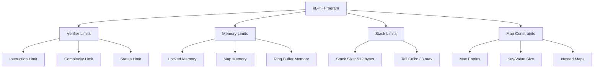
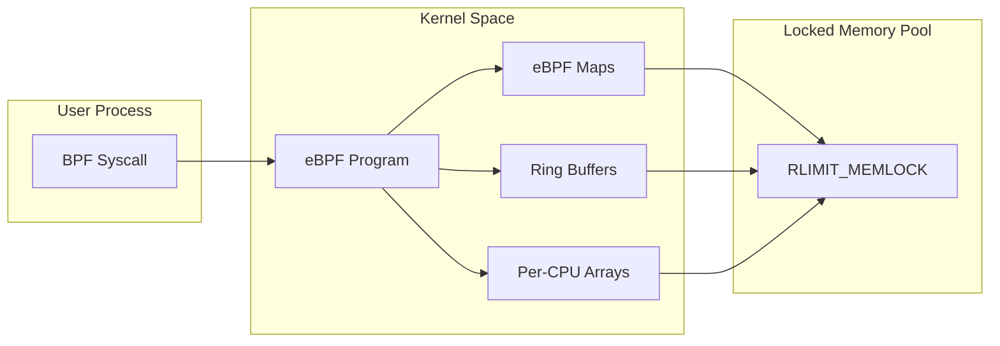
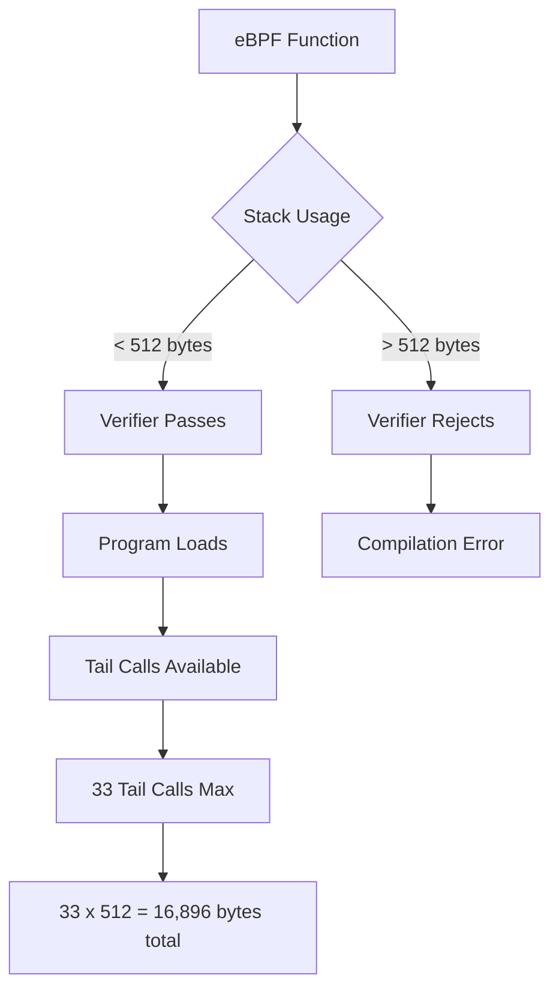
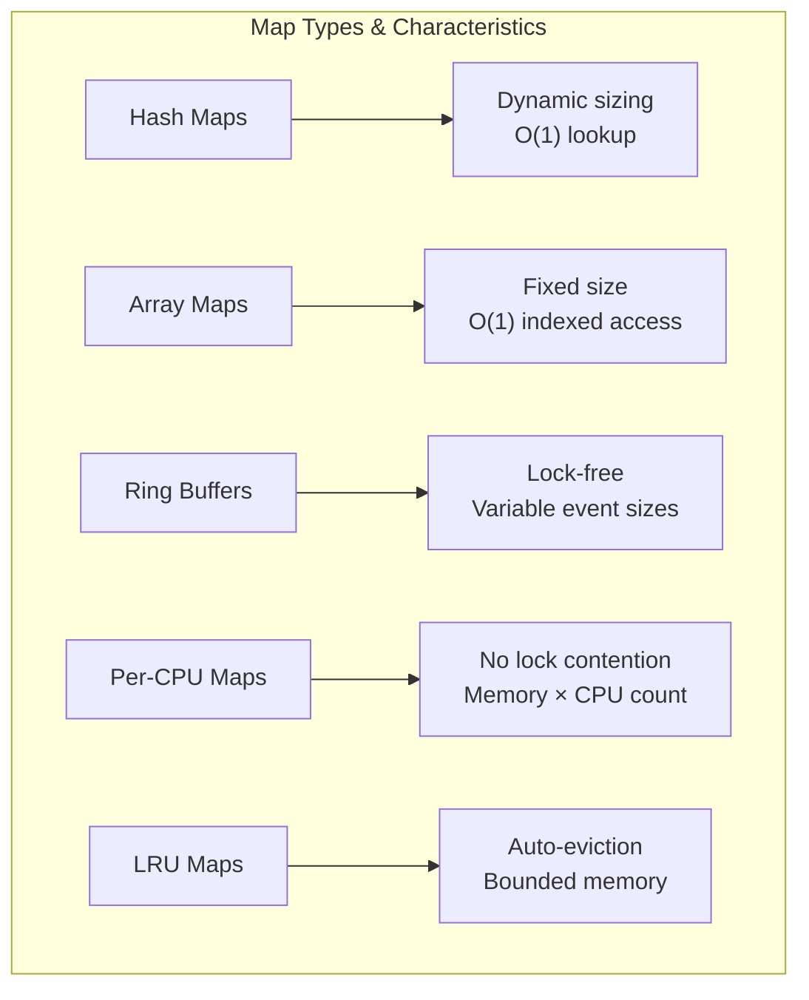
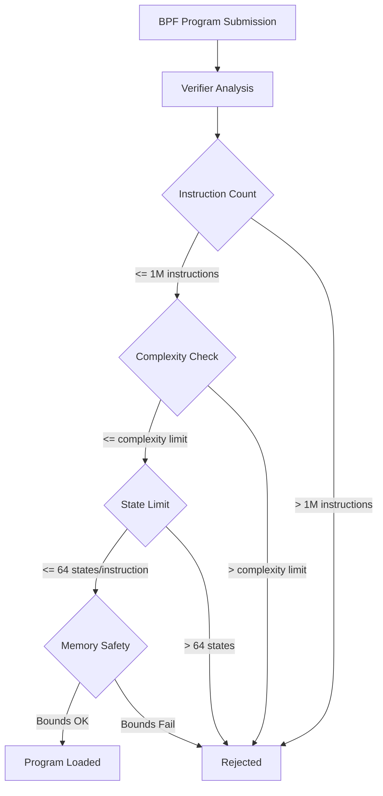

# How to Tune Kernel Parameters for eBPF Performance

Author: [nawazdhandala](https://github.com/nawazdhandala)

Tags: eBPF, Linux, Kernel, Performance, Tuning, Configuration

Description: Learn how to optimize kernel settings for better eBPF program performance.

---

## Introduction

Extended Berkeley Packet Filter (eBPF) is a revolutionary technology that allows you to run sandboxed programs in the Linux kernel without changing kernel source code or loading kernel modules. However, default kernel parameters are often conservative and may limit the performance and capabilities of your eBPF programs.

This comprehensive guide will walk you through tuning kernel parameters to maximize eBPF performance for production workloads, covering memory limits, stack size, map configurations, verifier limits, and essential sysctl parameters.

## Understanding eBPF Resource Constraints

Before diving into tuning, it is essential to understand the various constraints that affect eBPF programs:



## Prerequisites

Before proceeding, ensure you have:

- Linux kernel 5.4 or later (preferably 5.10+ for full feature support)
- Root or sudo access
- Basic understanding of eBPF concepts
- Tools: bpftool, sysctl, and a text editor

The following command verifies your kernel version supports eBPF tuning:

```bash
# Check your current kernel version - eBPF tuning requires kernel 4.9+
# with optimal support in 5.4+ versions
uname -r

# Verify eBPF is enabled in your kernel configuration
# Look for CONFIG_BPF=y and CONFIG_BPF_SYSCALL=y
cat /boot/config-$(uname -r) | grep -E "CONFIG_BPF|CONFIG_BPF_SYSCALL"
```

## Memory Limits Configuration

### Understanding Locked Memory Limits

eBPF maps and programs require locked memory (memory that cannot be swapped to disk). The kernel enforces limits on how much memory a process can lock, which directly affects eBPF capabilities.

The following diagram illustrates the memory hierarchy for eBPF:



### Checking Current Memory Limits

The following commands display current locked memory limits for your system:

```bash
# Display the current soft and hard limits for locked memory
# Soft limit: current enforced limit
# Hard limit: maximum value soft limit can be raised to
ulimit -l

# For more detailed information, check the proc filesystem
# This shows limits for the current shell process
cat /proc/self/limits | grep "locked memory"

# Check system-wide locked memory usage for eBPF specifically
# This shows how much memory is currently used by BPF programs and maps
cat /proc/meminfo | grep -E "Mlocked|Unevictable"
```

### Increasing Locked Memory Limits

For production eBPF workloads, you typically need to increase the locked memory limit significantly:

This configuration file sets memory limits system-wide via the limits.conf file:

```bash
# Edit the system limits configuration file
# This persists across reboots and affects all users/processes
sudo nano /etc/security/limits.conf

# Add these lines to increase locked memory limits
# Format: <domain> <type> <item> <value>
# * applies to all users, you can specify specific usernames instead
# soft is the default limit, hard is the maximum allowed
# memlock is measured in KB, unlimited removes the restriction
```

Add the following lines to `/etc/security/limits.conf`:

```
# Allow all users to lock unlimited memory for eBPF programs
# This is necessary for large eBPF maps and ring buffers
*               soft    memlock         unlimited
*               hard    memlock         unlimited

# Alternative: Set specific limits (in KB) for production environments
# 1GB = 1048576 KB - adjust based on your eBPF program requirements
# root            soft    memlock         1048576
# root            hard    memlock         1048576
```

For immediate effect without reboot, use the following commands:

```bash
# Temporarily increase locked memory limit for the current session
# This change is not persistent and will reset on logout/reboot
# -l sets the locked memory limit, unlimited removes any restriction
ulimit -l unlimited

# Verify the change took effect
ulimit -l

# For systemd services running eBPF programs, you need to set limits
# in the service unit file using LimitMEMLOCK directive
# Example: LimitMEMLOCK=infinity
```

### Memory Limits for Containerized Environments

When running eBPF programs in containers, additional configuration is required:

```yaml
# Docker Compose example with increased memory lock limits
# securityContext settings are required for eBPF in containers
version: '3.8'
services:
  ebpf-agent:
    image: your-ebpf-image:latest
    # Privileged mode is often required for eBPF
    # Consider using more granular capabilities instead for security
    privileged: true
    # Set memory lock limits to unlimited
    ulimits:
      memlock:
        soft: -1  # -1 means unlimited
        hard: -1
    # Required capabilities for eBPF operations
    cap_add:
      - SYS_ADMIN      # Required for loading BPF programs
      - SYS_RESOURCE   # Required for increasing rlimits
      - NET_ADMIN      # Required for network-related BPF programs
```

For Kubernetes deployments, configure the following in your pod specification:

```yaml
# Kubernetes pod specification with eBPF-compatible security context
apiVersion: v1
kind: Pod
metadata:
  name: ebpf-agent
spec:
  containers:
  - name: ebpf-container
    image: your-ebpf-image:latest
    securityContext:
      # Privileged mode bypasses most security restrictions
      # Required for loading eBPF programs in most cases
      privileged: true
    resources:
      limits:
        # Memory limit for the container itself
        memory: "2Gi"
      requests:
        memory: "1Gi"
  # Host namespaces are often needed for system-wide eBPF monitoring
  hostPID: true    # Access to host process namespace
  hostNetwork: true # Access to host network namespace
```

## Stack Size Configuration

### Understanding eBPF Stack Limits

eBPF programs have a strict stack size limit of 512 bytes per function. This is a compile-time limit that cannot be changed at runtime, but understanding how to work within this constraint is crucial.



### Analyzing Stack Usage

Use the following commands to analyze stack usage in your eBPF programs:

```bash
# Compile your eBPF program with stack usage information
# -g enables debug info, which includes stack usage details
# The resulting object file can be analyzed for stack consumption
clang -target bpf -g -O2 -c program.bpf.c -o program.bpf.o

# Use llvm-objdump to see the compiled BPF instructions
# This helps identify functions with high stack usage
llvm-objdump -S program.bpf.o

# Use bpftool to analyze a loaded program's stack usage
# First, find your program's ID
bpftool prog list

# Then dump the program with detailed information
# The 'xlated' shows the translated BPF instructions
# Look for 'stack_depth' in the output
bpftool prog dump xlated id <PROG_ID>
```

### Strategies for Managing Stack Size

Since the 512-byte limit cannot be increased, use these strategies in your eBPF code:

```c
// Example: Using per-CPU arrays instead of stack for large data structures
// Per-CPU arrays provide each CPU with its own copy, avoiding lock contention
// and allowing storage of data larger than the 512-byte stack limit

// Define a structure that would exceed stack limits if allocated on stack
struct large_event_data {
    __u64 timestamp;
    __u32 pid;
    __u32 tid;
    char comm[256];      // Task command name
    char filename[256];  // File being accessed
    __u64 metrics[16];   // Additional metrics
};  // Total: ~550 bytes - exceeds 512 byte stack limit!

// Solution: Create a per-CPU array map to store the data
// BPF_MAP_TYPE_PERCPU_ARRAY gives each CPU its own instance
// max_entries=1 because we only need one slot per CPU
struct {
    __uint(type, BPF_MAP_TYPE_PERCPU_ARRAY);
    __uint(max_entries, 1);
    __type(key, __u32);
    __type(value, struct large_event_data);
} heap_storage SEC(".maps");

// In your BPF program, use the map as scratch space
SEC("tracepoint/syscalls/sys_enter_openat")
int trace_openat(struct trace_event_raw_sys_enter *ctx) {
    __u32 key = 0;  // We always use key 0 for single-entry per-CPU arrays

    // Lookup returns a pointer to per-CPU storage
    // This avoids allocating large structures on the limited stack
    struct large_event_data *data = bpf_map_lookup_elem(&heap_storage, &key);
    if (!data) {
        return 0;  // Should never happen with PERCPU_ARRAY
    }

    // Now we can safely use the full structure
    data->timestamp = bpf_ktime_get_ns();
    data->pid = bpf_get_current_pid_tgid() >> 32;
    data->tid = bpf_get_current_pid_tgid() & 0xFFFFFFFF;

    // Read task command name into our map storage
    bpf_get_current_comm(&data->comm, sizeof(data->comm));

    // Process the data...
    return 0;
}
```

### Tail Call Configuration

Tail calls allow chaining eBPF programs together, effectively extending the available stack space across multiple programs:

```c
// Tail call map definition for program chaining
// BPF_MAP_TYPE_PROG_ARRAY holds references to other BPF programs
// max_entries defines how many programs can be in the chain
struct {
    __uint(type, BPF_MAP_TYPE_PROG_ARRAY);
    __uint(max_entries, 8);  // Support up to 8 different tail call targets
    __uint(key_size, sizeof(__u32));
    __uint(value_size, sizeof(__u32));
} tail_call_map SEC(".maps");

// Constants for tail call program indices
// Using an enum provides type safety and clarity
enum {
    TAIL_CALL_PARSE_HTTP = 0,
    TAIL_CALL_PARSE_DNS = 1,
    TAIL_CALL_PARSE_TLS = 2,
    TAIL_CALL_LOG_EVENT = 3,
};

// Main entry point program that dispatches to specialized handlers
SEC("xdp")
int xdp_main(struct xdp_md *ctx) {
    void *data = (void *)(long)ctx->data;
    void *data_end = (void *)(long)ctx->data_end;

    // Parse Ethernet header (bounds checking required by verifier)
    struct ethhdr *eth = data;
    if ((void *)(eth + 1) > data_end) {
        return XDP_PASS;
    }

    // Determine protocol and tail call to appropriate handler
    // bpf_tail_call transfers control to another BPF program
    // The current program's stack is replaced, not accumulated
    if (eth->h_proto == htons(ETH_P_IP)) {
        // Tail call to HTTP parser - note: this doesn't return!
        // If the tail call succeeds, execution continues in the target
        // If it fails (program not loaded), execution continues here
        bpf_tail_call(ctx, &tail_call_map, TAIL_CALL_PARSE_HTTP);
    }

    // Fallback if tail call fails (e.g., program not loaded)
    return XDP_PASS;
}

// Handler program that can be called via tail call
// Each tail call target has its own fresh 512-byte stack
SEC("xdp")
int xdp_parse_http(struct xdp_md *ctx) {
    // This program has its own 512-byte stack
    // The previous program's stack is not accumulated

    // Process HTTP-specific logic here...

    // Can chain to another program if needed
    // Maximum chain depth is 33 tail calls
    bpf_tail_call(ctx, &tail_call_map, TAIL_CALL_LOG_EVENT);

    return XDP_PASS;
}
```

## Map Size Configuration

### Understanding Map Limits

eBPF maps are the primary mechanism for storing data and communicating between eBPF programs and user space. Proper sizing is critical for performance.



### Configuring Map Sizes

The following configuration file shows how to define maps with appropriate sizes:

```c
// Hash map for tracking connections with configurable size
// max_entries should be sized based on expected concurrent connections
// Too small: entries get rejected, data loss
// Too large: wasted memory, slower iteration
struct {
    __uint(type, BPF_MAP_TYPE_HASH);
    // Size this based on expected concurrent entries
    // For connection tracking: estimate max_concurrent_connections × 1.5
    __uint(max_entries, 100000);
    __type(key, struct connection_key);    // Source/dest IP and port
    __type(value, struct connection_info); // Connection metadata
    // Optional: set map flags for specific behaviors
    __uint(map_flags, BPF_F_NO_PREALLOC);  // Don't preallocate all entries
} connections SEC(".maps");

// LRU hash map for high-volume scenarios with automatic eviction
// When the map is full, least-recently-used entries are evicted
// Ideal for caching scenarios where data loss is acceptable
struct {
    __uint(type, BPF_MAP_TYPE_LRU_HASH);
    // LRU maps can be sized more aggressively since old entries auto-evict
    __uint(max_entries, 500000);
    __type(key, __u64);                    // Flow hash or unique identifier
    __type(value, struct flow_metrics);    // Metrics data
} flow_cache SEC(".maps");

// Per-CPU hash for high-throughput scenarios
// Each CPU has its own hash table instance
// Eliminates lock contention at the cost of more memory
// Total memory = max_entries × value_size × num_cpus
struct {
    __uint(type, BPF_MAP_TYPE_PERCPU_HASH);
    __uint(max_entries, 10000);  // Per CPU, so actual = 10000 × num_cpus
    __type(key, __u32);
    __type(value, struct per_cpu_stats);
} cpu_stats SEC(".maps");

// Ring buffer for efficient event streaming to user space
// Size must be a power of 2 and represents total buffer size in bytes
// Larger buffers reduce event loss under high load but use more memory
struct {
    __uint(type, BPF_MAP_TYPE_RINGBUF);
    // Size in bytes - must be power of 2
    // 16MB ring buffer can hold many events before user space reads
    // Calculate: expected_events_per_second × avg_event_size × buffer_seconds
    __uint(max_entries, 16 * 1024 * 1024);  // 16 MB
} events SEC(".maps");
```

### Runtime Map Size Adjustments

While most map parameters are set at creation time, some can be adjusted:

```bash
# View current map information including size and usage
# This shows all loaded maps with their types, sizes, and memory usage
bpftool map list

# Get detailed information about a specific map by ID
# Shows max_entries, key/value sizes, and flags
bpftool map show id <MAP_ID>

# For maps that support it, you can resize at runtime (kernel 5.10+)
# Note: Not all map types support resizing
# BPF_MAP_TYPE_HASH and BPF_MAP_TYPE_ARRAY support this
bpftool map update id <MAP_ID> max_entries <NEW_SIZE>

# Monitor map memory usage continuously
# Useful for capacity planning and detecting memory issues
watch -n 1 'bpftool map list'
```

### Map Memory Calculation

Use this formula to estimate memory requirements for your maps:

```bash
#!/bin/bash
# Script to calculate eBPF map memory requirements
# This helps with capacity planning for production deployments

# Function to calculate hash map memory
# Hash maps use approximately: max_entries × (key_size + value_size + overhead)
calculate_hash_map_memory() {
    local max_entries=$1
    local key_size=$2
    local value_size=$3
    # Hash map overhead is approximately 40 bytes per entry for bucket pointers
    local overhead=40

    local total_bytes=$((max_entries * (key_size + value_size + overhead)))
    local total_mb=$((total_bytes / 1024 / 1024))

    echo "Hash Map Memory Estimate:"
    echo "  Entries: $max_entries"
    echo "  Per entry: $((key_size + value_size + overhead)) bytes"
    echo "  Total: $total_mb MB"
}

# Function to calculate per-CPU map memory
# Per-CPU maps multiply by the number of CPUs
calculate_percpu_map_memory() {
    local max_entries=$1
    local key_size=$2
    local value_size=$3
    local num_cpus=$(nproc)
    local overhead=40

    local per_cpu_bytes=$((max_entries * (key_size + value_size + overhead)))
    local total_bytes=$((per_cpu_bytes * num_cpus))
    local total_mb=$((total_bytes / 1024 / 1024))

    echo "Per-CPU Map Memory Estimate:"
    echo "  Entries per CPU: $max_entries"
    echo "  CPUs: $num_cpus"
    echo "  Total: $total_mb MB"
}

# Example calculations for common scenarios
echo "=== Connection Tracking Map ==="
calculate_hash_map_memory 100000 16 64  # 100K entries, 16B key, 64B value

echo ""
echo "=== Per-CPU Statistics Map ==="
calculate_percpu_map_memory 1000 4 128  # 1K entries, 4B key, 128B value

echo ""
echo "=== Ring Buffer ==="
echo "Ring buffer size is specified directly in bytes"
echo "Recommended: 16MB for moderate load, 64MB for high load"
```

## Verifier Limits Tuning

### Understanding the BPF Verifier

The BPF verifier ensures safety by analyzing programs before loading. It enforces several limits that may need tuning for complex programs.



### Verifier Limit Parameters

The following sysctl parameters control verifier behavior (available in kernel 5.2+):

```bash
# View current BPF-related kernel parameters
# These control various aspects of BPF program loading and execution
sysctl -a 2>/dev/null | grep bpf

# The instruction limit is hardcoded in the kernel (1 million instructions)
# but log verbosity can be controlled
# Set BPF verifier log level (0=off, 1=basic, 2=verbose)
# Higher levels provide more detail but can overwhelm logs
echo 1 | sudo tee /proc/sys/kernel/bpf_stats_enabled

# Enable JIT compilation for better performance
# JIT compiles BPF bytecode to native machine code
# 0=off, 1=on, 2=on with debug output
echo 1 | sudo tee /proc/sys/net/core/bpf_jit_enable

# Enable JIT hardening to protect against JIT spraying attacks
# 0=off, 1=for unprivileged, 2=for all
# Note: Hardening slightly reduces performance
echo 1 | sudo tee /proc/sys/net/core/bpf_jit_harden

# Limit unprivileged BPF operations (security measure)
# 0=allow unprivileged bpf, 1=require CAP_BPF, 2=require CAP_SYS_ADMIN
echo 2 | sudo tee /proc/sys/kernel/unprivileged_bpf_disabled
```

### Handling Verifier Complexity Limits

When programs hit verifier limits, use these strategies:

```c
// Strategy 1: Use bounded loops instead of unbounded iteration
// The verifier can analyze bounded loops but rejects unbounded ones
// Always ensure loops have a clear upper bound

// BAD: Unbounded loop - verifier cannot determine termination
// for (int i = 0; data_ptr < data_end; i++) { ... }

// GOOD: Bounded loop with explicit maximum iterations
#define MAX_LOOP_ITERATIONS 100

SEC("xdp")
int process_packet(struct xdp_md *ctx) {
    void *data = (void *)(long)ctx->data;
    void *data_end = (void *)(long)ctx->data_end;

    // Parse variable-length headers with bounded iteration
    // The verifier knows this loop runs at most MAX_LOOP_ITERATIONS times
    #pragma unroll
    for (int i = 0; i < MAX_LOOP_ITERATIONS; i++) {
        if (data >= data_end) {
            break;  // Explicit termination condition
        }

        // Process one unit of data
        // Always re-validate bounds after pointer arithmetic
        struct header *hdr = data;
        if ((void *)(hdr + 1) > data_end) {
            break;
        }

        // Move to next element
        data = (void *)(hdr + 1);
    }

    return XDP_PASS;
}

// Strategy 2: Use static keys to reduce branch complexity
// The verifier evaluates all possible branches
// Reducing branches reduces verifier complexity
struct {
    __uint(type, BPF_MAP_TYPE_ARRAY);
    __uint(max_entries, 1);
    __type(key, __u32);
    __type(value, struct config);
} config_map SEC(".maps");

// Read config once and use it to simplify branches
SEC("kprobe/sys_read")
int trace_read(struct pt_regs *ctx) {
    __u32 key = 0;
    struct config *cfg = bpf_map_lookup_elem(&config_map, &key);
    if (!cfg) {
        return 0;
    }

    // Use config values instead of runtime checks
    // This gives the verifier static values to analyze
    if (cfg->trace_enabled) {
        // Tracing logic here
    }

    return 0;
}
```

### Debugging Verifier Rejections

Use these techniques to understand why programs are rejected:

```bash
#!/bin/bash
# Script to analyze verifier rejections with detailed output

# Load a BPF program with maximum verbosity
# The -d flag enables debug output from bpftool
# Redirect stderr to capture verifier messages
bpftool prog load program.bpf.o /sys/fs/bpf/program -d 2>&1 | head -500

# Alternative: Use libbpf with verbose logging
# Set LIBBPF_LOG_LEVEL environment variable
LIBBPF_LOG_LEVEL=debug ./your-bpf-loader 2>&1 | grep -A 20 "verifier"

# For programmatic access to verifier output in C:
# struct bpf_object_open_opts opts = {
#     .sz = sizeof(opts),
#     .kernel_log_level = 2,  // Verbose logging
# };
```

## Essential Sysctl Parameters

### BPF-Specific Sysctls

Configure these system-wide parameters for optimal eBPF performance:

```bash
#!/bin/bash
# Comprehensive eBPF sysctl configuration script
# Run as root or with sudo

# Create a configuration file for persistent settings
# This file is read at boot time by systemd-sysctl
cat << 'EOF' | sudo tee /etc/sysctl.d/99-ebpf-tuning.conf
# eBPF Performance Tuning Configuration
# Generated for production eBPF workloads

# =============================================================================
# BPF JIT Compilation Settings
# =============================================================================

# Enable BPF JIT compiler for improved performance
# JIT compiles BPF bytecode to native x86_64 instructions
# This significantly improves execution speed (2-10x faster)
# Values: 0=disabled, 1=enabled, 2=enabled with debug output
net.core.bpf_jit_enable = 1

# JIT hardening mode to prevent JIT spraying attacks
# 0 = disabled (best performance)
# 1 = enabled for unprivileged users only
# 2 = enabled for all users (most secure but slower)
# Recommended: 1 for production (balance of security and performance)
net.core.bpf_jit_harden = 1

# Limit on BPF JIT allocations to prevent memory exhaustion
# Default is usually sufficient, increase if loading many programs
# Value in bytes (0 = use default kernel limit)
net.core.bpf_jit_limit = 536870912

# =============================================================================
# BPF Program Loading Controls
# =============================================================================

# Control unprivileged BPF access
# 0 = allow unprivileged users to load BPF programs
# 1 = require CAP_BPF capability (kernel 5.8+)
# 2 = require CAP_SYS_ADMIN capability (most restrictive)
# Recommended: 2 for production (security-first approach)
kernel.unprivileged_bpf_disabled = 2

# =============================================================================
# Memory and Resource Limits
# =============================================================================

# Maximum number of memory map areas a process may have
# BPF maps use memory mappings, increase for many maps
# Default is usually 65530, increase for complex BPF programs
vm.max_map_count = 262144

# Increase the maximum number of file descriptors
# Each BPF program and map consumes a file descriptor
# Important for systems with many BPF objects
fs.file-max = 2097152

# =============================================================================
# Network Stack Tuning for BPF Network Programs
# =============================================================================

# Increase netdev budget for XDP programs
# Higher values allow processing more packets per NAPI poll
# Important for high-throughput XDP applications
net.core.netdev_budget = 600
net.core.netdev_budget_usecs = 4000

# Increase socket buffer sizes for BPF socket programs
# Larger buffers reduce packet drops under load
net.core.rmem_max = 134217728
net.core.wmem_max = 134217728
net.core.rmem_default = 16777216
net.core.wmem_default = 16777216

# Increase the backlog for incoming packets
# Important for TC and XDP programs processing high packet rates
net.core.netdev_max_backlog = 10000

# =============================================================================
# Kernel Tracing and Perf Event Settings
# =============================================================================

# Control access to perf events (used by some BPF programs)
# -1 = no restrictions
# 0 = allow with CAP_PERFMON
# 1 = allow for sysadmin only
# 2 = disallow all
kernel.perf_event_paranoid = 0

# Maximum number of perf events per CPU
# Increase for intensive tracing with many kprobes/uprobes
kernel.perf_event_max_sample_rate = 100000

EOF

# Apply the configuration immediately without reboot
sudo sysctl --system

# Verify the settings were applied
echo "Verifying BPF sysctl settings:"
sysctl net.core.bpf_jit_enable
sysctl net.core.bpf_jit_harden
sysctl kernel.unprivileged_bpf_disabled
sysctl vm.max_map_count
```

### Networking-Specific Parameters for XDP/TC

For XDP and TC BPF programs, additional network tuning is beneficial:

```bash
#!/bin/bash
# Network tuning for high-performance XDP/TC programs

cat << 'EOF' | sudo tee /etc/sysctl.d/99-ebpf-network.conf
# =============================================================================
# XDP and TC Performance Tuning
# =============================================================================

# Enable packet timestamping for network monitoring BPF programs
# Useful for latency analysis and packet timing
net.core.netdev_tstamp_prequeue = 1

# Increase the optmem_max for larger socket options
# Required for some advanced BPF socket operations
net.core.optmem_max = 65536

# TCP buffer tuning for socket BPF programs
# Format: min default max (in bytes)
net.ipv4.tcp_rmem = 4096 87380 134217728
net.ipv4.tcp_wmem = 4096 65536 134217728

# Enable TCP BBR congestion control (works well with BPF)
net.ipv4.tcp_congestion_control = bbr
net.core.default_qdisc = fq

# Increase the number of allowed incoming connections
# Important for BPF programs that monitor/filter connection setup
net.core.somaxconn = 65535
net.ipv4.tcp_max_syn_backlog = 65535

# Reduce TIME_WAIT connections for high-throughput scenarios
net.ipv4.tcp_tw_reuse = 1
net.ipv4.tcp_fin_timeout = 30

EOF

sudo sysctl --system
```

### Tracing and Profiling Parameters

For eBPF programs that use kprobes, uprobes, or tracepoints:

```bash
#!/bin/bash
# Tuning for eBPF tracing and profiling programs

cat << 'EOF' | sudo tee /etc/sysctl.d/99-ebpf-tracing.conf
# =============================================================================
# Tracing and Profiling Tuning
# =============================================================================

# Allow attaching BPF programs to kprobes with less restrictions
# 0 = allow CAP_PERFMON processes to use kprobes
# 1 = require CAP_SYS_ADMIN
kernel.kptr_restrict = 0

# Control perf event access for BPF profiling
# Lower values = less restrictive
# -1 = no restrictions (not recommended for production)
# 0 = allow with CAP_PERFMON
# 1 = require CAP_SYSLOG for kernel addresses
kernel.perf_event_paranoid = 0

# Increase the maximum number of kprobes
# Default is 1000, increase for extensive kernel tracing
# Note: This requires kernel with CONFIG_KPROBES enabled
# Adjust via debugfs if available:
# echo 5000 > /sys/kernel/debug/kprobes/max_probes

# Enable function graph tracer for detailed tracing (if needed)
# kernel.ftrace_enabled = 1

EOF

sudo sysctl --system

# Additional debugfs configurations for tracing
# These are not persistent and must be set after each boot

# Increase kprobe limit if supported
if [ -f /sys/kernel/debug/kprobes/enabled ]; then
    echo 1 | sudo tee /sys/kernel/debug/kprobes/enabled
fi

# Set maximum number of probes (kernel dependent)
if [ -f /sys/kernel/debug/kprobes/max_probes ]; then
    echo 5000 | sudo tee /sys/kernel/debug/kprobes/max_probes
fi
```

## Performance Monitoring and Validation

### Monitoring eBPF Resource Usage

Create a monitoring script to track eBPF resource consumption:

```bash
#!/bin/bash
# ebpf-monitor.sh - Monitor eBPF resource usage
# Run this script periodically to track BPF resource consumption

echo "=== eBPF Resource Monitor ==="
echo "Timestamp: $(date)"
echo ""

# Count and list loaded BPF programs
echo "=== Loaded BPF Programs ==="
bpftool prog list 2>/dev/null | head -20
PROG_COUNT=$(bpftool prog list 2>/dev/null | grep -c "^[0-9]")
echo "Total programs loaded: $PROG_COUNT"
echo ""

# Count and summarize BPF maps
echo "=== BPF Maps Summary ==="
bpftool map list 2>/dev/null | head -20
MAP_COUNT=$(bpftool map list 2>/dev/null | grep -c "^[0-9]")
echo "Total maps: $MAP_COUNT"
echo ""

# Show memory usage by BPF
echo "=== BPF Memory Usage ==="
# Parse /proc/meminfo for relevant metrics
grep -E "Mlocked|Unevictable|SUnreclaim" /proc/meminfo
echo ""

# Show JIT status and statistics
echo "=== JIT Compilation Status ==="
sysctl net.core.bpf_jit_enable 2>/dev/null
if [ -f /proc/sys/net/core/bpf_jit_kallsyms ]; then
    echo "JIT kallsyms: $(cat /proc/sys/net/core/bpf_jit_kallsyms)"
fi
echo ""

# Show program statistics if bpf_stats is enabled
echo "=== BPF Program Statistics ==="
if [ "$(cat /proc/sys/kernel/bpf_stats_enabled 2>/dev/null)" = "1" ]; then
    # Show runtime stats for loaded programs
    for prog_id in $(bpftool prog list -j 2>/dev/null | jq -r '.[].id'); do
        echo "Program ID: $prog_id"
        bpftool prog show id "$prog_id" 2>/dev/null | grep -E "run_cnt|run_time"
    done
else
    echo "BPF stats not enabled. Enable with: echo 1 > /proc/sys/kernel/bpf_stats_enabled"
fi
echo ""

# Check for any errors in kernel logs related to BPF
echo "=== Recent BPF Kernel Messages ==="
dmesg | grep -i bpf | tail -10
```

### Validating Configuration Changes

After applying tuning parameters, verify they are effective:

```bash
#!/bin/bash
# validate-ebpf-tuning.sh - Verify eBPF tuning is applied correctly

echo "=== eBPF Tuning Validation ==="
echo ""

# Function to check a sysctl value
check_sysctl() {
    local param=$1
    local expected=$2
    local actual=$(sysctl -n "$param" 2>/dev/null)

    if [ "$actual" = "$expected" ]; then
        echo "[OK] $param = $actual"
    else
        echo "[WARN] $param = $actual (expected: $expected)"
    fi
}

echo "=== Core BPF Settings ==="
check_sysctl "net.core.bpf_jit_enable" "1"
check_sysctl "net.core.bpf_jit_harden" "1"
check_sysctl "kernel.unprivileged_bpf_disabled" "2"
echo ""

echo "=== Memory Settings ==="
check_sysctl "vm.max_map_count" "262144"

# Check locked memory limits
MEMLOCK=$(ulimit -l)
if [ "$MEMLOCK" = "unlimited" ]; then
    echo "[OK] Locked memory limit: unlimited"
else
    echo "[WARN] Locked memory limit: $MEMLOCK KB (consider setting to unlimited)"
fi
echo ""

echo "=== Network Settings ==="
check_sysctl "net.core.netdev_budget" "600"
check_sysctl "net.core.somaxconn" "65535"
echo ""

echo "=== Performance Capabilities ==="
# Test if we can load a simple BPF program
if command -v bpftool &> /dev/null; then
    echo "bpftool available: $(bpftool version)"
else
    echo "[WARN] bpftool not installed"
fi

# Check kernel BPF features
if [ -f /proc/config.gz ]; then
    echo ""
    echo "=== Kernel BPF Configuration ==="
    zcat /proc/config.gz | grep -E "CONFIG_BPF|CONFIG_XDP|CONFIG_NET_CLS_BPF" | head -20
elif [ -f "/boot/config-$(uname -r)" ]; then
    echo ""
    echo "=== Kernel BPF Configuration ==="
    grep -E "CONFIG_BPF|CONFIG_XDP|CONFIG_NET_CLS_BPF" "/boot/config-$(uname -r)" | head -20
fi
```

## Troubleshooting Common Issues

### Issue 1: "Cannot allocate memory" When Loading Programs

This error indicates locked memory limits are too low:

```bash
# Quick fix: Increase locked memory limit for current session
sudo prlimit --pid=$$ --memlock=unlimited:unlimited

# Permanent fix: Update limits.conf and PAM configuration
echo "* soft memlock unlimited" | sudo tee -a /etc/security/limits.conf
echo "* hard memlock unlimited" | sudo tee -a /etc/security/limits.conf

# For systemd services, add to the unit file:
# [Service]
# LimitMEMLOCK=infinity
```

### Issue 2: "BPF program is too large" Verifier Error

When programs exceed instruction limits:

```bash
# Check the current instruction count of your program
# First, find the program ID
bpftool prog list

# Then check instruction count and complexity
bpftool prog dump xlated id <PROG_ID> | wc -l

# Solutions:
# 1. Split into multiple programs with tail calls
# 2. Simplify logic and reduce branches
# 3. Use maps to store precomputed values instead of calculating
```

### Issue 3: "Permission denied" When Loading BPF Programs

Check capabilities and permissions:

```bash
# Check if unprivileged BPF is disabled
sysctl kernel.unprivileged_bpf_disabled

# If value is 1 or 2, you need CAP_BPF or CAP_SYS_ADMIN
# Grant capabilities to your binary:
sudo setcap cap_bpf,cap_perfmon+ep /path/to/your/program

# Or run with sudo for testing
sudo ./your-bpf-program

# For containers, ensure proper capabilities in securityContext:
# capabilities:
#   add:
#     - BPF
#     - PERFMON
#     - NET_ADMIN
```

### Issue 4: Ring Buffer Events Being Dropped

When events are lost due to ring buffer overflow:

```c
// Increase ring buffer size in your BPF program
struct {
    __uint(type, BPF_MAP_TYPE_RINGBUF);
    // Increase from 16MB to 64MB or more
    __uint(max_entries, 64 * 1024 * 1024);  // 64 MB
} events SEC(".maps");

// In user space, process events more frequently
// Use a dedicated thread for ring buffer polling
// Consider using multiple ring buffers for different event types
```

## Best Practices Summary

1. **Start Conservative, Scale Up**: Begin with default settings and increase limits based on observed needs.

2. **Monitor Continuously**: Implement monitoring for BPF resource usage to detect issues early.

3. **Document Changes**: Keep track of all kernel parameter changes and their reasons.

4. **Test in Staging**: Always test tuning changes in a non-production environment first.

5. **Consider Security**: Balance performance tuning with security requirements, especially in multi-tenant environments.

6. **Version Control Configurations**: Keep sysctl configuration files in version control.

7. **Automate Validation**: Create scripts to verify tuning is correctly applied after system updates or reboots.

## Conclusion

Tuning kernel parameters for eBPF performance requires understanding the interplay between memory limits, verifier constraints, and system resources. By carefully adjusting locked memory limits, optimizing map sizes, understanding verifier limits, and configuring appropriate sysctl parameters, you can significantly improve the performance and reliability of your eBPF programs.

Remember that kernel tuning is an iterative process. Start with the baseline configurations provided in this guide, monitor your specific workloads, and adjust parameters based on real-world observations. Always prioritize security alongside performance, especially in production environments.

## References

- [Linux Kernel BPF Documentation](https://www.kernel.org/doc/html/latest/bpf/)
- [BPF and XDP Reference Guide](https://docs.cilium.io/en/stable/bpf/)
- [libbpf Documentation](https://libbpf.readthedocs.io/)
- [bpftool Manual](https://man7.org/linux/man-pages/man8/bpftool.8.html)
- [Kernel sysctl Documentation](https://www.kernel.org/doc/Documentation/sysctl/)
