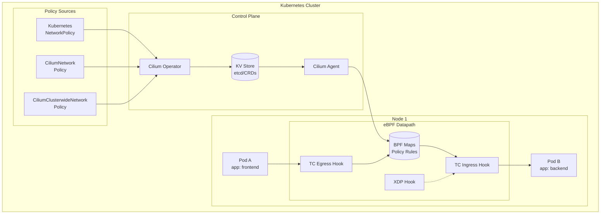
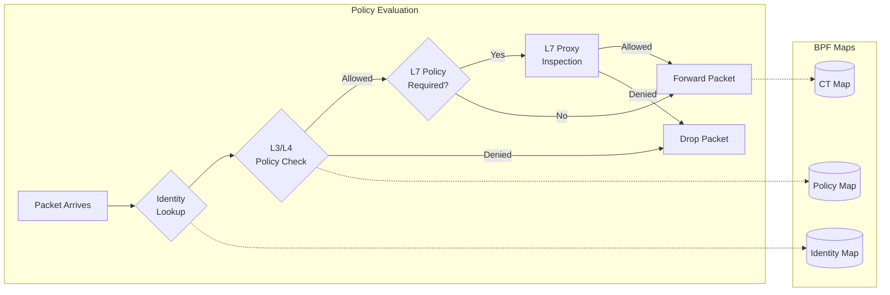
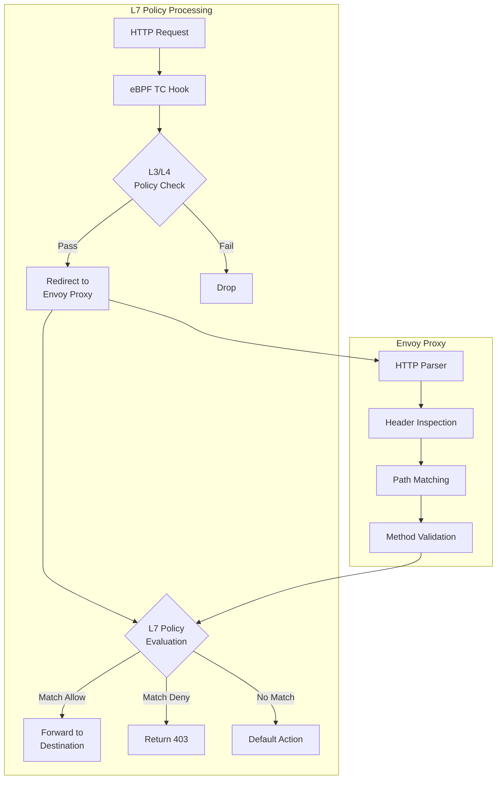
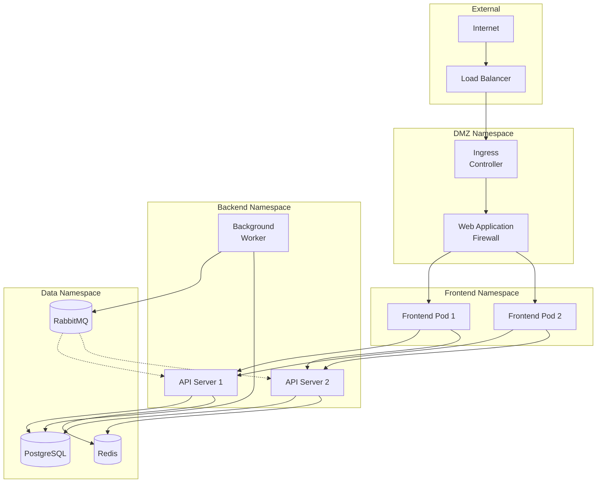
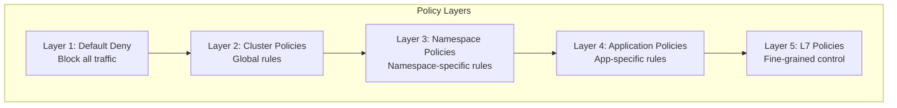

# How to Implement Network Policies with eBPF on Kubernetes

Author: [nawazdhandala](https://github.com/nawazdhandala)

Tags: eBPF, Kubernetes, Network Policies, Security, Cilium, Cloud Native

Description: Learn how to enforce Kubernetes network policies using eBPF for improved performance and security.

---

## Introduction

Network policies in Kubernetes are essential for securing communication between pods and services. Traditional implementations rely on iptables, which can become a performance bottleneck at scale. eBPF (extended Berkeley Packet Filter) offers a revolutionary approach to network policy enforcement, providing superior performance, deep visibility, and advanced capabilities like Layer 7 filtering.

In this comprehensive guide, we will explore how to implement network policies using eBPF through Cilium, the most widely adopted eBPF-based CNI (Container Network Interface) for Kubernetes.

## Why eBPF for Network Policies?

Before diving into implementation, let's understand why eBPF is transforming Kubernetes networking:

### Traditional iptables Limitations

- **Linear rule matching**: Performance degrades as rules increase
- **Lack of visibility**: Limited observability into packet flow
- **No L7 awareness**: Cannot filter based on HTTP, gRPC, or DNS
- **Complex management**: Rules become unwieldy in large clusters

### eBPF Advantages

- **O(1) lookups**: Hash-based lookups instead of linear chain traversal
- **Programmable**: Custom logic can be loaded into the kernel
- **Deep visibility**: Full packet introspection at kernel level
- **L7 support**: Native understanding of application protocols
- **Real-time metrics**: Built-in observability capabilities

## Architecture Overview

The following diagram illustrates how eBPF-based network policies work in Kubernetes:



## Prerequisites

Before we begin, ensure you have:

- A Kubernetes cluster (v1.21+)
- kubectl configured
- Helm 3.x installed
- Linux kernel 4.19+ (5.4+ recommended for full features)

## Installing Cilium

Cilium is the leading eBPF-based CNI that provides network policy enforcement. Let's install it using Helm.

First, add the Cilium Helm repository and install Cilium with eBPF-based kube-proxy replacement for optimal performance:

```bash
# Add the Cilium Helm repository
helm repo add cilium https://helm.cilium.io/

# Update Helm repositories to get the latest charts
helm repo update

# Install Cilium with eBPF-based kube-proxy replacement
# This configuration enables:
# - eBPF kube-proxy replacement for better performance
# - Hubble for observability
# - Host routing via eBPF for improved networking
helm install cilium cilium/cilium --version 1.15.0 \
  --namespace kube-system \
  --set kubeProxyReplacement=true \
  --set k8sServiceHost=${API_SERVER_IP} \
  --set k8sServicePort=${API_SERVER_PORT} \
  --set hubble.enabled=true \
  --set hubble.relay.enabled=true \
  --set hubble.ui.enabled=true \
  --set bpf.masquerade=true \
  --set ipam.mode=kubernetes
```

Verify that Cilium is running correctly by checking the status of all Cilium pods:

```bash
# Wait for Cilium pods to be ready
kubectl wait --for=condition=Ready pods -l app.kubernetes.io/name=cilium-agent \
  -n kube-system --timeout=300s

# Check Cilium status using the CLI
# This shows connectivity status, cluster health, and feature availability
kubectl exec -n kube-system -it ds/cilium -- cilium status

# Verify eBPF programs are loaded
# This lists all BPF programs attached by Cilium
kubectl exec -n kube-system -it ds/cilium -- bpftool prog list
```

## Understanding Cilium Network Policies

Cilium supports three types of network policies:

1. **Kubernetes NetworkPolicy**: Standard K8s API, limited to L3/L4
2. **CiliumNetworkPolicy (CNP)**: Extended capabilities with L7 support
3. **CiliumClusterwideNetworkPolicy (CCNP)**: Cluster-scoped policies

### Policy Processing Flow

The following diagram shows how policies are processed through the eBPF datapath:



## Implementing L3/L4 Network Policies

Let's start with basic L3/L4 policies using both Kubernetes NetworkPolicy and CiliumNetworkPolicy.

### Example Application Setup

First, deploy a sample microservices application to demonstrate network policies. This creates frontend, backend, and database tiers with appropriate labels:

```yaml
# Save as: sample-app.yaml
# This manifest creates a sample 3-tier application:
# - Frontend: public-facing web servers
# - Backend: API servers (internal)
# - Database: PostgreSQL (restricted access)
---
apiVersion: v1
kind: Namespace
metadata:
  name: demo
  labels:
    # Enable Cilium policy enforcement for this namespace
    policy.cilium.io/enforce: "true"
---
# Frontend deployment - simulates public-facing web servers
apiVersion: apps/v1
kind: Deployment
metadata:
  name: frontend
  namespace: demo
spec:
  replicas: 2
  selector:
    matchLabels:
      app: frontend
      tier: public
  template:
    metadata:
      labels:
        app: frontend
        tier: public
    spec:
      containers:
      - name: frontend
        image: nginx:alpine
        ports:
        - containerPort: 80
---
# Backend deployment - API servers that connect to database
apiVersion: apps/v1
kind: Deployment
metadata:
  name: backend
  namespace: demo
spec:
  replicas: 2
  selector:
    matchLabels:
      app: backend
      tier: internal
  template:
    metadata:
      labels:
        app: backend
        tier: internal
    spec:
      containers:
      - name: backend
        image: python:3.11-alpine
        command: ["python", "-m", "http.server", "8080"]
        ports:
        - containerPort: 8080
---
# Database deployment - PostgreSQL with restricted access
apiVersion: apps/v1
kind: Deployment
metadata:
  name: database
  namespace: demo
spec:
  replicas: 1
  selector:
    matchLabels:
      app: database
      tier: restricted
  template:
    metadata:
      labels:
        app: database
        tier: restricted
    spec:
      containers:
      - name: postgres
        image: postgres:15-alpine
        env:
        - name: POSTGRES_PASSWORD
          value: "demo-password"
        ports:
        - containerPort: 5432
---
# Services for each tier
apiVersion: v1
kind: Service
metadata:
  name: frontend
  namespace: demo
spec:
  selector:
    app: frontend
  ports:
  - port: 80
    targetPort: 80
---
apiVersion: v1
kind: Service
metadata:
  name: backend
  namespace: demo
spec:
  selector:
    app: backend
  ports:
  - port: 8080
    targetPort: 8080
---
apiVersion: v1
kind: Service
metadata:
  name: database
  namespace: demo
spec:
  selector:
    app: database
  ports:
  - port: 5432
    targetPort: 5432
```

Apply the sample application:

```bash
# Deploy the sample application
kubectl apply -f sample-app.yaml

# Wait for all pods to be ready
kubectl wait --for=condition=Ready pods --all -n demo --timeout=120s

# Verify deployment
kubectl get pods -n demo -o wide
```

### Default Deny Policy

The first step in securing your cluster is implementing a default deny policy. This ensures that all traffic is blocked unless explicitly allowed:

```yaml
# Save as: default-deny.yaml
# This policy implements a "zero trust" network model by:
# - Denying all ingress traffic to pods in the demo namespace
# - Denying all egress traffic from pods in the demo namespace
# After applying this, pods can only communicate if explicit allow rules exist
---
apiVersion: networking.k8s.io/v1
kind: NetworkPolicy
metadata:
  name: default-deny-all
  namespace: demo
spec:
  # Empty podSelector means this policy applies to ALL pods in namespace
  podSelector: {}
  # Specifying both Ingress and Egress with empty rules blocks all traffic
  policyTypes:
  - Ingress
  - Egress
```

Apply and verify the default deny policy:

```bash
# Apply the default deny policy
kubectl apply -f default-deny.yaml

# Test that traffic is blocked (should fail/timeout)
# First, get a frontend pod name
FRONTEND_POD=$(kubectl get pods -n demo -l app=frontend -o jsonpath='{.items[0].metadata.name}')

# Try to reach the backend (should timeout due to default deny)
kubectl exec -n demo $FRONTEND_POD -- wget --timeout=2 -q -O- http://backend:8080 || echo "Connection blocked as expected"
```

### Allow Frontend to Backend Communication

Now let's create a policy that allows frontend pods to communicate with the backend. This uses CiliumNetworkPolicy for enhanced features:

```yaml
# Save as: frontend-to-backend.yaml
# This CiliumNetworkPolicy allows:
# - Frontend pods to send traffic to backend pods on port 8080
# - Uses Cilium's identity-based filtering for efficient enforcement
---
apiVersion: cilium.io/v2
kind: CiliumNetworkPolicy
metadata:
  name: frontend-to-backend
  namespace: demo
spec:
  # This policy applies to backend pods (the destination)
  endpointSelector:
    matchLabels:
      app: backend
      tier: internal
  ingress:
  # Allow ingress from pods with app=frontend label
  - fromEndpoints:
    - matchLabels:
        app: frontend
        tier: public
    toPorts:
    # Only allow TCP traffic on port 8080
    - ports:
      - port: "8080"
        protocol: TCP
```

### Allow Backend to Database Communication

Create a policy allowing only backend pods to access the database:

```yaml
# Save as: backend-to-database.yaml
# This policy implements database access control:
# - Only backend pods can connect to the database
# - Access is restricted to PostgreSQL port (5432) only
# - Provides an audit trail through Cilium's policy verdicts
---
apiVersion: cilium.io/v2
kind: CiliumNetworkPolicy
metadata:
  name: backend-to-database
  namespace: demo
spec:
  # Apply policy to database pods
  endpointSelector:
    matchLabels:
      app: database
      tier: restricted
  ingress:
  # Only allow from backend pods
  - fromEndpoints:
    - matchLabels:
        app: backend
        tier: internal
    toPorts:
    - ports:
      # PostgreSQL default port
      - port: "5432"
        protocol: TCP
```

### Allow DNS Resolution

Pods need DNS resolution to function. Create a policy allowing DNS traffic to kube-dns:

```yaml
# Save as: allow-dns.yaml
# DNS is critical for service discovery in Kubernetes
# This policy allows all pods in the demo namespace to:
# - Resolve DNS queries via kube-dns/CoreDNS
# - Uses toEndpoints to reference the kube-system namespace
---
apiVersion: cilium.io/v2
kind: CiliumNetworkPolicy
metadata:
  name: allow-dns
  namespace: demo
spec:
  # Apply to all pods in the namespace
  endpointSelector: {}
  egress:
  # Allow DNS queries to kube-dns
  - toEndpoints:
    - matchLabels:
        # CoreDNS/kube-dns runs in kube-system namespace
        k8s:io.kubernetes.pod.namespace: kube-system
        k8s-app: kube-dns
    toPorts:
    - ports:
      # DNS uses both UDP and TCP on port 53
      - port: "53"
        protocol: UDP
      - port: "53"
        protocol: TCP
```

Apply all L3/L4 policies:

```bash
# Apply all the network policies
kubectl apply -f frontend-to-backend.yaml
kubectl apply -f backend-to-database.yaml
kubectl apply -f allow-dns.yaml

# Verify policies are applied
kubectl get cnp -n demo

# Test the allowed traffic paths
FRONTEND_POD=$(kubectl get pods -n demo -l app=frontend -o jsonpath='{.items[0].metadata.name}')
BACKEND_POD=$(kubectl get pods -n demo -l app=backend -o jsonpath='{.items[0].metadata.name}')

# Frontend to backend should work now
kubectl exec -n demo $FRONTEND_POD -- wget --timeout=5 -q -O- http://backend:8080

# Backend to database should work (connection test)
kubectl exec -n demo $BACKEND_POD -- nc -zv database 5432
```

## Implementing L7 Network Policies

One of the most powerful features of Cilium is Layer 7 (application layer) policy enforcement. This allows you to filter traffic based on HTTP paths, methods, headers, and more.

### L7 Policy Architecture

The following diagram shows how L7 policies are processed:



### HTTP-Based Policies

Create a policy that allows only specific HTTP methods and paths:

```yaml
# Save as: l7-http-policy.yaml
# This L7 policy provides fine-grained HTTP traffic control:
# - Restricts which HTTP methods are allowed
# - Limits access to specific URL paths
# - Uses Envoy proxy for deep packet inspection
---
apiVersion: cilium.io/v2
kind: CiliumNetworkPolicy
metadata:
  name: l7-http-policy
  namespace: demo
spec:
  # Apply to backend API pods
  endpointSelector:
    matchLabels:
      app: backend
      tier: internal
  ingress:
  - fromEndpoints:
    - matchLabels:
        app: frontend
    toPorts:
    - ports:
      - port: "8080"
        protocol: TCP
      # L7 rules provide HTTP-layer filtering
      rules:
        http:
        # Allow GET requests to health and metrics endpoints
        - method: GET
          path: "/health"
        - method: GET
          path: "/metrics"
        # Allow GET and POST to API endpoints
        # The regex allows any path starting with /api/v1/
        - method: GET
          path: "/api/v1/.*"
        - method: POST
          path: "/api/v1/.*"
        # Explicitly allow OPTIONS for CORS preflight
        - method: OPTIONS
          path: "/.*"
```

### Restricting API Access by Headers

You can also filter based on HTTP headers for advanced use cases like API versioning or authentication:

```yaml
# Save as: l7-header-policy.yaml
# This policy demonstrates header-based access control:
# - Requires specific API version header
# - Can be used for A/B testing or gradual rollouts
# - Provides granular access control based on client identity
---
apiVersion: cilium.io/v2
kind: CiliumNetworkPolicy
metadata:
  name: l7-header-policy
  namespace: demo
spec:
  endpointSelector:
    matchLabels:
      app: backend
  ingress:
  - fromEndpoints:
    - matchLabels:
        app: frontend
    toPorts:
    - ports:
      - port: "8080"
        protocol: TCP
      rules:
        http:
        # Only allow requests with the correct API version header
        # This is useful for API versioning and deprecation
        - method: GET
          path: "/api/.*"
          headers:
          - "X-API-Version: v2"
        # Allow admin endpoints only with admin token
        # Note: In production, use proper authentication mechanisms
        - method: ".*"
          path: "/admin/.*"
          headers:
          - "X-Admin-Token: .*"
```

### gRPC Policies

Cilium also supports gRPC-specific policies for microservices using Protocol Buffers:

```yaml
# Save as: l7-grpc-policy.yaml
# gRPC policy for microservices communication:
# - Filters based on gRPC service and method names
# - Works with Protocol Buffer definitions
# - Enables fine-grained RPC access control
---
apiVersion: cilium.io/v2
kind: CiliumNetworkPolicy
metadata:
  name: grpc-policy
  namespace: demo
spec:
  endpointSelector:
    matchLabels:
      app: grpc-backend
  ingress:
  - fromEndpoints:
    - matchLabels:
        app: grpc-client
    toPorts:
    - ports:
      - port: "9090"
        protocol: TCP
      rules:
        http:
        # gRPC uses HTTP/2 POST with specific path format
        # Path format: /{package}.{service}/{method}
        - method: POST
          path: "/api.v1.UserService/GetUser"
        - method: POST
          path: "/api.v1.UserService/ListUsers"
        # Allow health checks for gRPC
        - method: POST
          path: "/grpc.health.v1.Health/Check"
```

### DNS-Based Policies

Control egress traffic based on DNS names for external service access:

```yaml
# Save as: l7-dns-policy.yaml
# DNS-based egress policy for controlling external access:
# - Allows pods to access specific external domains
# - Uses FQDN matching for precise control
# - Supports wildcard patterns for flexibility
---
apiVersion: cilium.io/v2
kind: CiliumNetworkPolicy
metadata:
  name: dns-egress-policy
  namespace: demo
spec:
  endpointSelector:
    matchLabels:
      app: backend
  egress:
  # Allow DNS resolution first (required for FQDN rules)
  - toEndpoints:
    - matchLabels:
        k8s:io.kubernetes.pod.namespace: kube-system
        k8s-app: kube-dns
    toPorts:
    - ports:
      - port: "53"
        protocol: UDP
  # Allow access to specific external APIs
  - toFQDNs:
    # Exact domain match
    - matchName: "api.github.com"
    # Wildcard pattern for AWS services
    - matchPattern: "*.amazonaws.com"
    # Allow Google APIs
    - matchName: "www.googleapis.com"
    toPorts:
    - ports:
      - port: "443"
        protocol: TCP
```

## Cluster-Wide Policies

For policies that should apply across all namespaces, use CiliumClusterwideNetworkPolicy:

```yaml
# Save as: clusterwide-policy.yaml
# Cluster-wide policies for global security enforcement:
# - Apply to all namespaces without per-namespace configuration
# - Useful for compliance and baseline security requirements
# - Cannot be overridden by namespace-level policies
---
apiVersion: cilium.io/v2
kind: CiliumClusterwideNetworkPolicy
metadata:
  name: global-deny-external-access
spec:
  # This description helps with policy auditing
  description: "Deny direct internet access from all pods except explicitly allowed"
  endpointSelector:
    matchLabels: {}
  egress:
  # Block access to external networks (public internet)
  # CIDR 0.0.0.0/0 matches all IPv4 addresses
  - toCIDR:
    - "0.0.0.0/0"
    # Except for private networks and cluster IPs
    toCIDRSet:
    - cidr: "0.0.0.0/0"
      except:
      - "10.0.0.0/8"      # Private network (Class A)
      - "172.16.0.0/12"   # Private network (Class B)
      - "192.168.0.0/16"  # Private network (Class C)
---
# Allow specific namespaces to access the internet
apiVersion: cilium.io/v2
kind: CiliumClusterwideNetworkPolicy
metadata:
  name: allow-internet-for-egress-namespace
spec:
  description: "Allow internet access for pods with internet-access=true label"
  endpointSelector:
    matchLabels:
      internet-access: "true"
  egress:
  - toCIDR:
    - "0.0.0.0/0"
    toPorts:
    - ports:
      - port: "443"
        protocol: TCP
      - port: "80"
        protocol: TCP
```

## Policy Debugging and Troubleshooting

Debugging network policies can be challenging. Cilium provides excellent tools for this purpose.

### Using Hubble for Policy Visibility

Hubble is Cilium's observability platform that provides real-time visibility into network flows:

```bash
# Install the Hubble CLI
# This provides command-line access to flow visibility
export HUBBLE_VERSION=$(curl -s https://raw.githubusercontent.com/cilium/hubble/master/stable.txt)
curl -L --remote-name-all https://github.com/cilium/hubble/releases/download/$HUBBLE_VERSION/hubble-linux-amd64.tar.gz
tar xzvf hubble-linux-amd64.tar.gz
sudo mv hubble /usr/local/bin/

# Enable port forwarding to Hubble Relay
# This allows the CLI to connect to the Hubble service
kubectl port-forward -n kube-system svc/hubble-relay 4245:80 &

# Check Hubble status
hubble status

# Observe all flows in the demo namespace
# This shows real-time traffic including policy decisions
hubble observe --namespace demo

# Filter by policy verdict to see dropped packets
# DROPPED verdict indicates traffic blocked by policy
hubble observe --namespace demo --verdict DROPPED

# Show flows between specific pods
hubble observe --namespace demo \
  --from-label "app=frontend" \
  --to-label "app=backend"

# Export flows to JSON for analysis
hubble observe --namespace demo -o json > flows.json
```

### Policy Troubleshooting Commands

Use Cilium's built-in tools to diagnose policy issues:

```bash
# Check policy status on a specific endpoint
# First, get the endpoint ID for a pod
kubectl exec -n kube-system -it ds/cilium -- cilium endpoint list

# Get detailed policy information for an endpoint
# Replace <endpoint-id> with the actual ID from above
kubectl exec -n kube-system -it ds/cilium -- cilium endpoint get <endpoint-id>

# View the BPF policy map entries
# This shows the compiled policy rules in the datapath
kubectl exec -n kube-system -it ds/cilium -- cilium bpf policy get --all

# Check identity of a pod (identities are used for policy matching)
kubectl exec -n kube-system -it ds/cilium -- cilium identity list

# Debug policy for a specific identity pair
# Shows whether traffic between two identities would be allowed
kubectl exec -n kube-system -it ds/cilium -- \
  cilium policy trace --src-identity <src-id> --dst-identity <dst-id> --dport 8080

# Validate policy syntax before applying
kubectl apply --dry-run=client -f policy.yaml
```

### Policy Simulation

Test policies before applying them to production:

```yaml
# Save as: test-policy.yaml
# Policy for testing and simulation
# Use Cilium's policy trace feature to validate before applying
---
apiVersion: cilium.io/v2
kind: CiliumNetworkPolicy
metadata:
  name: test-policy
  namespace: demo
  # Add annotation for testing purposes
  annotations:
    description: "Test policy - validate before production"
spec:
  endpointSelector:
    matchLabels:
      app: backend
  ingress:
  - fromEndpoints:
    - matchLabels:
        app: frontend
    toPorts:
    - ports:
      - port: "8080"
```

Simulate the policy using Cilium's policy trace:

```bash
# Get the security identities for source and destination pods
SRC_ID=$(kubectl exec -n kube-system ds/cilium -- \
  cilium identity list | grep "app=frontend" | awk '{print $1}')
DST_ID=$(kubectl exec -n kube-system ds/cilium -- \
  cilium identity list | grep "app=backend" | awk '{print $1}')

# Trace the policy to see if traffic would be allowed
# This simulates the policy decision without affecting live traffic
kubectl exec -n kube-system ds/cilium -- \
  cilium policy trace \
  --src-identity $SRC_ID \
  --dst-identity $DST_ID \
  --dport 8080 \
  --proto TCP

# The output shows:
# - Which policies match
# - The final verdict (ALLOWED/DENIED)
# - The rule that caused the decision
```

### Using Cilium Monitor for Real-Time Debugging

Monitor eBPF events in real-time for deep debugging:

```bash
# Start monitoring all events on a Cilium agent
# This shows packet flow through the eBPF datapath
kubectl exec -n kube-system ds/cilium -- cilium monitor

# Filter for policy-related events only
kubectl exec -n kube-system ds/cilium -- cilium monitor --type policy-verdict

# Monitor drops only (helps identify blocked traffic)
kubectl exec -n kube-system ds/cilium -- cilium monitor --type drop

# Monitor specific endpoint
ENDPOINT_ID=$(kubectl exec -n kube-system ds/cilium -- \
  cilium endpoint list | grep "backend" | awk '{print $1}')
kubectl exec -n kube-system ds/cilium -- \
  cilium monitor --from $ENDPOINT_ID --to $ENDPOINT_ID
```

## Advanced Policy Patterns

### Multi-Tier Application Policies

The following diagram shows a comprehensive multi-tier policy architecture:



Implement this architecture with policies:

```yaml
# Save as: multi-tier-policies.yaml
# Comprehensive multi-tier application security policies
# Implements defense-in-depth with L3/L4 and L7 controls
---
# Namespace isolation - each tier in its own namespace
apiVersion: v1
kind: Namespace
metadata:
  name: frontend
  labels:
    tier: frontend
---
apiVersion: v1
kind: Namespace
metadata:
  name: backend
  labels:
    tier: backend
---
apiVersion: v1
kind: Namespace
metadata:
  name: data
  labels:
    tier: data
---
# Policy: Allow ingress controller to frontend
apiVersion: cilium.io/v2
kind: CiliumNetworkPolicy
metadata:
  name: ingress-to-frontend
  namespace: frontend
spec:
  endpointSelector:
    matchLabels:
      app: frontend
  ingress:
  - fromEndpoints:
    # Allow from ingress controller namespace
    - matchLabels:
        k8s:io.kubernetes.pod.namespace: ingress-nginx
        app.kubernetes.io/name: ingress-nginx
    toPorts:
    - ports:
      - port: "80"
        protocol: TCP
      rules:
        http:
        # Only allow GET, POST, PUT, DELETE methods
        - method: "GET|POST|PUT|DELETE"
          path: "/.*"
---
# Policy: Frontend to backend API access
apiVersion: cilium.io/v2
kind: CiliumNetworkPolicy
metadata:
  name: frontend-to-backend
  namespace: backend
spec:
  endpointSelector:
    matchLabels:
      app: api-server
  ingress:
  - fromEndpoints:
    - matchLabels:
        k8s:io.kubernetes.pod.namespace: frontend
        app: frontend
    toPorts:
    - ports:
      - port: "8080"
        protocol: TCP
      rules:
        http:
        # Restrict to specific API paths
        - method: GET
          path: "/api/v1/users.*"
        - method: POST
          path: "/api/v1/orders.*"
        - method: GET
          path: "/api/v1/products.*"
---
# Policy: Backend to database (strict)
apiVersion: cilium.io/v2
kind: CiliumNetworkPolicy
metadata:
  name: backend-to-database
  namespace: data
spec:
  endpointSelector:
    matchLabels:
      app: postgresql
  ingress:
  - fromEndpoints:
    # Only API servers can access database
    - matchLabels:
        k8s:io.kubernetes.pod.namespace: backend
        app: api-server
    toPorts:
    - ports:
      - port: "5432"
        protocol: TCP
---
# Policy: Backend to cache
apiVersion: cilium.io/v2
kind: CiliumNetworkPolicy
metadata:
  name: backend-to-cache
  namespace: data
spec:
  endpointSelector:
    matchLabels:
      app: redis
  ingress:
  - fromEndpoints:
    - matchLabels:
        k8s:io.kubernetes.pod.namespace: backend
    toPorts:
    - ports:
      - port: "6379"
        protocol: TCP
```

### Rate Limiting with L7 Policies

Implement rate limiting at the network policy level:

```yaml
# Save as: rate-limiting-policy.yaml
# L7 rate limiting policy using Cilium's Envoy integration
# Note: Requires Cilium's L7 proxy to be enabled
---
apiVersion: cilium.io/v2
kind: CiliumNetworkPolicy
metadata:
  name: api-rate-limiting
  namespace: backend
spec:
  endpointSelector:
    matchLabels:
      app: api-server
  ingress:
  - fromEndpoints:
    - matchLabels:
        app: frontend
    toPorts:
    - ports:
      - port: "8080"
        protocol: TCP
      rules:
        http:
        # L7 policy with implicit connection tracking
        # For explicit rate limiting, use Cilium's Envoy config
        - method: ".*"
          path: "/api/.*"
          # Headers can be used to implement token bucket
          # tracking per client
---
# For advanced rate limiting, configure Envoy via CiliumEnvoyConfig
apiVersion: cilium.io/v2
kind: CiliumEnvoyConfig
metadata:
  name: rate-limit-config
  namespace: backend
spec:
  services:
  - name: api-server
    namespace: backend
  resources:
  - "@type": type.googleapis.com/envoy.config.listener.v3.Listener
    name: api-rate-limit-listener
    filter_chains:
    - filters:
      - name: envoy.filters.network.http_connection_manager
        typed_config:
          "@type": type.googleapis.com/envoy.extensions.filters.network.http_connection_manager.v3.HttpConnectionManager
          stat_prefix: api_rate_limit
          http_filters:
          - name: envoy.filters.http.local_ratelimit
            typed_config:
              "@type": type.googleapis.com/envoy.extensions.filters.http.local_ratelimit.v3.LocalRateLimit
              stat_prefix: http_local_rate_limiter
              token_bucket:
                # 100 requests per second
                max_tokens: 100
                tokens_per_fill: 100
                fill_interval: 1s
              filter_enabled:
                runtime_key: local_rate_limit_enabled
                default_value:
                  numerator: 100
                  denominator: HUNDRED
```

## Monitoring and Metrics

### Prometheus Metrics for Policy Enforcement

Cilium exposes Prometheus metrics for policy monitoring:

```yaml
# Save as: cilium-metrics-service.yaml
# ServiceMonitor for collecting Cilium metrics
# Requires Prometheus Operator to be installed
---
apiVersion: monitoring.coreos.com/v1
kind: ServiceMonitor
metadata:
  name: cilium-metrics
  namespace: monitoring
spec:
  selector:
    matchLabels:
      k8s-app: cilium
  namespaceSelector:
    matchNames:
    - kube-system
  endpoints:
  - port: prometheus
    interval: 15s
    path: /metrics
```

Key metrics to monitor for network policies:

```bash
# Query Cilium metrics for policy enforcement
# These PromQL queries help monitor policy effectiveness

# Number of policy drops (blocked traffic)
# High values may indicate misconfiguration or attacks
cilium_drop_count_total{reason="Policy denied"}

# Policy import errors (syntax or semantic issues)
cilium_policy_import_errors_total

# Number of policy revision updates
# Helps track policy changes over time
cilium_policy_endpoint_enforcement_status

# L7 proxy statistics
# Monitor L7 policy performance
cilium_proxy_upstream_reply_seconds_bucket

# Identity count (helps understand policy complexity)
cilium_identity_count
```

### Creating a Policy Dashboard

Example Grafana dashboard configuration for policy monitoring:

```json
{
  "title": "Cilium Network Policy Dashboard",
  "panels": [
    {
      "title": "Policy Drops by Reason",
      "type": "graph",
      "targets": [
        {
          "expr": "sum(rate(cilium_drop_count_total{reason=~\"Policy.*\"}[5m])) by (reason)",
          "legendFormat": "{{reason}}"
        }
      ]
    },
    {
      "title": "Policy Enforcement Status",
      "type": "stat",
      "targets": [
        {
          "expr": "sum(cilium_policy_endpoint_enforcement_status{enforcement=\"true\"})",
          "legendFormat": "Enforcing"
        }
      ]
    },
    {
      "title": "L7 Policy Latency",
      "type": "heatmap",
      "targets": [
        {
          "expr": "histogram_quantile(0.99, sum(rate(cilium_proxy_upstream_reply_seconds_bucket[5m])) by (le))",
          "legendFormat": "p99 Latency"
        }
      ]
    }
  ]
}
```

## Best Practices

### 1. Start with Default Deny

Always implement default deny policies as the foundation:

```yaml
# Every namespace should start with this policy
# This ensures a secure baseline and explicit allow rules
apiVersion: networking.k8s.io/v1
kind: NetworkPolicy
metadata:
  name: default-deny-all
spec:
  podSelector: {}
  policyTypes:
  - Ingress
  - Egress
```

### 2. Use Labels Consistently

Establish a labeling convention for policy targeting:

```yaml
# Recommended label schema for network policies
# These labels provide consistent targeting across policies
metadata:
  labels:
    # Application identity
    app: myapp
    component: frontend
    # Environment tier
    tier: public
    environment: production
    # Security classification
    data-sensitivity: high
    internet-access: "false"
```

### 3. Implement Policies in Layers



### 4. Test Policies in Staging

Always test policies in a non-production environment:

```bash
# Create a staging namespace mirroring production
kubectl create namespace demo-staging

# Apply policies with dry-run first
kubectl apply --dry-run=server -f policy.yaml

# Use Cilium's policy trace to validate
kubectl exec -n kube-system ds/cilium -- cilium policy trace \
  --src-k8s-pod demo-staging:frontend-xxx \
  --dst-k8s-pod demo-staging:backend-xxx \
  --dport 8080

# Monitor for unexpected drops after applying
hubble observe --namespace demo-staging --verdict DROPPED --follow
```

### 5. Document Policies

Maintain documentation alongside your policies:

```yaml
apiVersion: cilium.io/v2
kind: CiliumNetworkPolicy
metadata:
  name: documented-policy
  annotations:
    # Policy metadata for governance
    description: "Allow frontend to access backend API"
    owner: "platform-team@example.com"
    last-review: "2026-01-07"
    compliance: "PCI-DSS-3.2"
    change-ticket: "JIRA-1234"
spec:
  # Policy rules...
```

## Conclusion

eBPF-based network policies represent a significant advancement in Kubernetes security. By leveraging Cilium's eBPF datapath, you gain:

- **Superior Performance**: O(1) policy lookups instead of linear iptables chains
- **Deep Visibility**: Real-time observability with Hubble
- **L7 Intelligence**: Application-aware policies for HTTP, gRPC, and DNS
- **Simplified Operations**: Single platform for networking and security

Key takeaways for implementing eBPF network policies:

1. **Start with default deny** and explicitly allow required traffic
2. **Use CiliumNetworkPolicy** for advanced features beyond standard Kubernetes NetworkPolicy
3. **Leverage L7 policies** for granular API-level access control
4. **Monitor and debug** using Hubble and Cilium's built-in tools
5. **Follow a layered approach** with cluster-wide, namespace, and application policies

As Kubernetes deployments grow in complexity, eBPF-based network policies provide the scalability, performance, and security features needed for modern cloud-native applications.

## Additional Resources

- [Cilium Documentation](https://docs.cilium.io/)
- [eBPF.io](https://ebpf.io/)
- [Kubernetes Network Policies](https://kubernetes.io/docs/concepts/services-networking/network-policies/)
- [Hubble Documentation](https://docs.cilium.io/en/stable/gettingstarted/hubble/)
- [Cilium Network Policy Editor](https://editor.cilium.io/)
