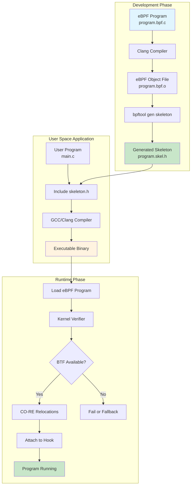
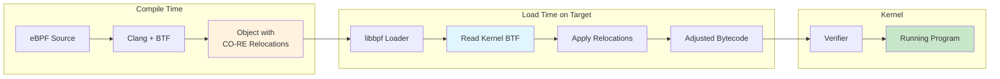

# How to Use libbpf for Portable eBPF Development

Author: [nawazdhandala](https://github.com/nawazdhandala)

Tags: eBPF, libbpf, C, Programming, Linux, Portability

Description: Learn how to develop portable eBPF programs using libbpf and CO-RE for cross-kernel compatibility.

---

## Introduction

eBPF (extended Berkeley Packet Filter) has revolutionized Linux systems programming, enabling powerful capabilities for observability, networking, and security without modifying kernel source code or loading kernel modules. However, one of the biggest challenges in eBPF development has been portability - programs often needed to be compiled for each specific kernel version they would run on.

**libbpf** solves this problem by providing a modern, lightweight library for loading and interacting with eBPF programs. Combined with **CO-RE (Compile Once - Run Everywhere)**, developers can now write eBPF programs that compile once and run across different kernel versions without modification.

This comprehensive guide will walk you through setting up libbpf, understanding CO-RE and BTF, and building portable eBPF applications.

## What is libbpf?

libbpf is the canonical library for working with eBPF programs on Linux. It provides:

- **Program loading and verification** - Load eBPF bytecode into the kernel
- **Map management** - Create and interact with eBPF maps
- **Skeleton generation** - Auto-generate C headers for easy program interaction
- **CO-RE support** - Enable portable eBPF programs across kernel versions
- **BTF integration** - Leverage type information for portability

## Understanding the libbpf Development Workflow

The following diagram illustrates the complete build and deployment flow for libbpf-based eBPF programs:



## Prerequisites and Environment Setup

Before starting, ensure you have the necessary dependencies installed.

The following commands install all required packages on Ubuntu/Debian systems:

```bash
# Install build essentials and kernel headers
sudo apt-get update
sudo apt-get install -y \
    build-essential \
    clang \
    llvm \
    libelf-dev \
    linux-headers-$(uname -r) \
    libbpf-dev \
    bpftool \
    pkg-config

# Verify clang version (requires clang 10+)
clang --version

# Verify bpftool is available
bpftool version
```

For Fedora/RHEL systems, use the following package manager commands:

```bash
# Install dependencies on Fedora/RHEL
sudo dnf install -y \
    clang \
    llvm \
    elfutils-libelf-devel \
    kernel-devel \
    libbpf-devel \
    bpftool
```

### Verifying BTF Support

BTF (BPF Type Format) is essential for CO-RE. Most modern kernels (5.2+) include BTF by default.

This command checks if your kernel has BTF support enabled:

```bash
# Check if kernel has BTF support
ls -la /sys/kernel/btf/vmlinux

# If the file exists, BTF is available
# You should see output like:
# -r--r--r-- 1 root root 5234567 Jan  1 00:00 /sys/kernel/btf/vmlinux
```

## Understanding CO-RE (Compile Once - Run Everywhere)

CO-RE is the technology that enables truly portable eBPF programs. Here's how it works:



### How CO-RE Relocations Work

When you compile an eBPF program with CO-RE:

1. **Compile time**: The compiler records field offsets from the development machine's kernel headers
2. **Load time**: libbpf reads the target kernel's BTF and adjusts field offsets to match
3. **Result**: The same compiled program works across different kernel versions

## Project Structure

A well-organized libbpf project follows this structure. Create the directories as shown:

```bash
# Create the project directory structure
mkdir -p my-ebpf-project/{src,include,build}

# The final structure should look like this:
# my-ebpf-project/
# ├── Makefile           # Build configuration
# ├── src/
# │   ├── program.bpf.c  # eBPF kernel-space program
# │   └── main.c         # User-space loader program
# ├── include/
# │   └── common.h       # Shared definitions
# └── build/             # Compiled artifacts
#     ├── program.bpf.o  # Compiled eBPF object
#     └── program.skel.h # Generated skeleton header
```

## Writing Your First libbpf Program

Let's create a complete example that traces process execution using the `execve` system call.

### Step 1: Common Header File

This header defines data structures shared between kernel and user space:

```c
// include/common.h
// Common definitions shared between eBPF and user-space programs
// This file is included by both program.bpf.c and main.c

#ifndef __COMMON_H
#define __COMMON_H

// Maximum length for command name storage
// Linux TASK_COMM_LEN is 16, we use the same
#define TASK_COMM_LEN 16

// Maximum length for filename storage
// Keep this reasonable to avoid stack overflow in eBPF
#define MAX_FILENAME_LEN 256

// Event structure passed from eBPF to user space via ring buffer
// This structure MUST be aligned properly for both kernel and user space
struct event {
    // Process ID of the executing process
    __u32 pid;

    // User ID of the process owner
    __u32 uid;

    // Command name (executable name, truncated to 16 chars)
    char comm[TASK_COMM_LEN];

    // Full filename/path of the executed binary
    char filename[MAX_FILENAME_LEN];
};

#endif /* __COMMON_H */
```

### Step 2: eBPF Kernel Program

This is the eBPF program that runs in kernel space. Pay close attention to the CO-RE macros:

```c
// src/program.bpf.c
// eBPF kernel-space program for tracing process execution
// Uses libbpf and CO-RE for portability across kernel versions

// Include vmlinux.h for kernel type definitions
// This is generated from kernel BTF and provides ALL kernel types
// It replaces the need for individual kernel headers
#include "vmlinux.h"

// libbpf helper macros for CO-RE and BPF operations
#include <bpf/bpf_helpers.h>

// CO-RE helper macros for reading kernel structures safely
// BPF_CORE_READ handles field offset relocations automatically
#include <bpf/bpf_core_read.h>

// Tracing-specific helpers for attaching to tracepoints
#include <bpf/bpf_tracing.h>

// Our shared definitions
#include "common.h"

// Declare the license - GPL is required for most BPF helper functions
// This MUST be present or the verifier will reject the program
char LICENSE[] SEC("license") = "GPL";

// Ring buffer map for sending events to user space
// Ring buffers are more efficient than perf buffers for high-throughput
// The size (256KB here) should be tuned based on expected event rate
struct {
    // Specify this is a ring buffer type map
    __uint(type, BPF_MAP_TYPE_RINGBUF);

    // Size in bytes - must be power of 2 and page-aligned
    // 256 * 1024 = 256KB, enough for ~1000 events in buffer
    __uint(max_entries, 256 * 1024);
} events SEC(".maps");

// Tracepoint program attached to sys_enter_execve
// SEC() macro specifies the attachment point
// Format: "tp/<category>/<tracepoint_name>"
SEC("tp/syscalls/sys_enter_execve")
int handle_execve(struct trace_event_raw_sys_enter *ctx)
{
    struct event *e;

    // Get the current task_struct using CO-RE
    // bpf_get_current_task() returns the current task pointer
    struct task_struct *task = (struct task_struct *)bpf_get_current_task();

    // Reserve space in the ring buffer for our event
    // Returns NULL if buffer is full - we must handle this case
    e = bpf_ringbuf_reserve(&events, sizeof(*e), 0);
    if (!e) {
        // Buffer full, drop this event
        // In production, you might want to track dropped events
        return 0;
    }

    // Get the current PID (process ID)
    // bpf_get_current_pid_tgid() returns (pid << 32 | tgid)
    // We want the lower 32 bits (tgid in kernel = pid in userspace)
    e->pid = bpf_get_current_pid_tgid() >> 32;

    // Get the current UID (user ID)
    // Similar to above, uid_gid returns (gid << 32 | uid)
    e->uid = bpf_get_current_uid_gid() & 0xFFFFFFFF;

    // Get the process command name (e.g., "bash", "ls")
    // This copies TASK_COMM_LEN bytes to our event structure
    bpf_get_current_comm(&e->comm, sizeof(e->comm));

    // Read the filename argument from the execve syscall
    // ctx->args[0] contains the pointer to the filename string
    // We use bpf_probe_read_user_str for user-space strings
    // This safely handles page faults and returns bytes read
    const char *filename_ptr = (const char *)ctx->args[0];
    bpf_probe_read_user_str(&e->filename, sizeof(e->filename), filename_ptr);

    // Submit the event to the ring buffer
    // 0 = flags (none needed)
    // This makes the event visible to user space
    bpf_ringbuf_submit(e, 0);

    return 0;
}
```

### Step 3: Generating vmlinux.h

Before compiling, you need to generate the `vmlinux.h` header from your kernel's BTF.

This command extracts all kernel type definitions into a single header file:

```bash
# Generate vmlinux.h from the running kernel's BTF
# This file contains ALL kernel type definitions
# Place it in your include directory
bpftool btf dump file /sys/kernel/btf/vmlinux format c > include/vmlinux.h

# The generated file will be large (several MB) - this is normal
# It replaces the need for hundreds of individual kernel headers
ls -lh include/vmlinux.h
```

### Step 4: User-Space Loader Program

This program loads the eBPF code and processes events. Note the use of the generated skeleton:

```c
// src/main.c
// User-space program to load and interact with the eBPF program
// Uses the auto-generated skeleton for type-safe program management

#include <stdio.h>
#include <stdlib.h>
#include <string.h>
#include <errno.h>
#include <signal.h>
#include <unistd.h>
#include <sys/resource.h>

// libbpf library header for core BPF functionality
#include <bpf/libbpf.h>

// Include our generated skeleton header
// This is created by: bpftool gen skeleton program.bpf.o > program.skel.h
// The skeleton provides type-safe access to maps, programs, and links
#include "program.skel.h"

// Our shared definitions (same file used by eBPF program)
#include "common.h"

// Global flag for graceful shutdown
// Marked volatile because it's modified by signal handler
static volatile sig_atomic_t exiting = 0;

// Signal handler for graceful shutdown (Ctrl+C)
// Sets the exiting flag to stop the main event loop
static void sig_handler(int sig)
{
    // Signal number is unused but required by handler signature
    (void)sig;
    exiting = 1;
}

// Callback function invoked for each event from the ring buffer
// This is called by libbpf's ring buffer polling mechanism
static int handle_event(void *ctx, void *data, size_t data_sz)
{
    // Suppress unused parameter warning
    // ctx could be used to pass user-defined context
    (void)ctx;

    // Cast the raw data to our event structure
    // The data comes directly from bpf_ringbuf_submit in kernel
    const struct event *e = data;

    // Validate the data size matches our expected structure
    // This is a safety check - sizes should always match
    if (data_sz < sizeof(*e)) {
        fprintf(stderr, "Error: event size mismatch\n");
        return 0;
    }

    // Print the event information
    // Format: PID, UID, command name, and executed filename
    printf("%-8d %-8d %-16s %s\n",
           e->pid,      // Process ID
           e->uid,      // User ID
           e->comm,     // Command name (parent process)
           e->filename  // Executed filename/path
    );

    // Return 0 to continue processing events
    // Non-zero would stop the ring buffer consumer
    return 0;
}

// Custom libbpf print callback for logging
// Filters out debug messages to reduce noise
static int libbpf_print_fn(enum libbpf_print_level level,
                           const char *format,
                           va_list args)
{
    // Only print warnings and errors, skip debug messages
    if (level == LIBBPF_DEBUG)
        return 0;

    // Print to stderr with the format string and arguments
    return vfprintf(stderr, format, args);
}

int main(int argc, char **argv)
{
    // Suppress unused parameter warnings
    (void)argc;
    (void)argv;

    // Pointer to our BPF skeleton structure
    // This is generated by bpftool and contains all program/map references
    struct program_bpf *skel = NULL;

    // Ring buffer pointer for receiving events
    struct ring_buffer *rb = NULL;

    // Return code for error handling
    int err;

    // Set up custom libbpf logging
    // This filters debug messages for cleaner output
    libbpf_set_print(libbpf_print_fn);

    // STEP 1: Open the BPF skeleton
    // This parses the embedded ELF data but doesn't load into kernel yet
    // Returns NULL on failure
    skel = program_bpf__open();
    if (!skel) {
        fprintf(stderr, "Failed to open BPF skeleton\n");
        return 1;
    }

    // STEP 2: Load and verify the BPF programs
    // This loads bytecode into kernel and runs the verifier
    // The verifier ensures the program is safe to run
    err = program_bpf__load(skel);
    if (err) {
        fprintf(stderr, "Failed to load BPF skeleton: %d\n", err);
        goto cleanup;
    }

    // STEP 3: Attach the BPF programs to their hooks
    // For our tracepoint program, this attaches to sys_enter_execve
    // The skeleton knows where to attach based on SEC() annotations
    err = program_bpf__attach(skel);
    if (err) {
        fprintf(stderr, "Failed to attach BPF skeleton: %d\n", err);
        goto cleanup;
    }

    // STEP 4: Set up signal handlers for graceful shutdown
    // SIGINT = Ctrl+C, SIGTERM = kill command
    signal(SIGINT, sig_handler);
    signal(SIGTERM, sig_handler);

    // STEP 5: Create ring buffer consumer
    // Arguments: file descriptor of ring buffer map, callback function, context
    // bpf_map__fd() returns the file descriptor for the 'events' map
    rb = ring_buffer__new(bpf_map__fd(skel->maps.events),
                          handle_event,  // Callback for each event
                          NULL,          // Context (unused)
                          NULL);         // Options (use defaults)
    if (!rb) {
        err = -1;
        fprintf(stderr, "Failed to create ring buffer\n");
        goto cleanup;
    }

    // Print header for the output table
    printf("%-8s %-8s %-16s %s\n", "PID", "UID", "COMM", "FILENAME");

    // STEP 6: Main event loop
    // Poll the ring buffer for events until exit signal received
    while (!exiting) {
        // Poll with 100ms timeout
        // Returns number of events consumed, or negative on error
        err = ring_buffer__poll(rb, 100 /* timeout in ms */);

        // Handle interruption by signal
        if (err == -EINTR) {
            err = 0;
            break;
        }

        // Handle actual errors
        if (err < 0) {
            fprintf(stderr, "Error polling ring buffer: %d\n", err);
            break;
        }
        // err > 0 means we processed that many events (handled by callback)
    }

cleanup:
    // Clean up resources in reverse order of creation

    // Free the ring buffer
    ring_buffer__free(rb);

    // Destroy the skeleton (detaches programs, closes maps)
    program_bpf__destroy(skel);

    return err < 0 ? 1 : 0;
}
```

## Building the Project

### Makefile

This Makefile automates the entire build process including skeleton generation:

```makefile
# Makefile for libbpf-based eBPF project
# Handles compilation of eBPF programs, skeleton generation, and user-space app

# Compiler settings
# CLANG is used for eBPF programs (required for BPF target)
CLANG := clang

# CC is used for user-space programs (can be gcc or clang)
CC := gcc

# Target architecture - detect automatically
ARCH := $(shell uname -m | sed 's/x86_64/x86/' | sed 's/aarch64/arm64/')

# Include paths for headers
INCLUDES := -Iinclude -Ibuild

# Compiler flags for eBPF programs
# -g: Include debug info (required for BTF)
# -O2: Optimization level (required for some BPF features)
# -target bpf: Generate BPF bytecode
# -D__TARGET_ARCH_$(ARCH): Define target architecture for CO-RE
BPF_CFLAGS := -g -O2 -target bpf -D__TARGET_ARCH_$(ARCH)

# Compiler flags for user-space program
# -Wall -Wextra: Enable warnings
# -g: Debug info for debugging
USER_CFLAGS := -Wall -Wextra -g $(INCLUDES)

# Libraries for user-space program
# -lbpf: libbpf library
# -lelf: Required by libbpf
# -lz: Compression library (required by libbpf)
USER_LIBS := -lbpf -lelf -lz

# Output directories and files
BUILD_DIR := build
SRC_DIR := src
BPF_OBJ := $(BUILD_DIR)/program.bpf.o
SKEL_H := $(BUILD_DIR)/program.skel.h
USER_BIN := $(BUILD_DIR)/execve-tracer

# Default target: build everything
.PHONY: all
all: $(USER_BIN)

# Create build directory if it doesn't exist
$(BUILD_DIR):
	mkdir -p $(BUILD_DIR)

# Generate vmlinux.h from kernel BTF
# This only needs to be done once per kernel version
$(BUILD_DIR)/vmlinux.h: | $(BUILD_DIR)
	bpftool btf dump file /sys/kernel/btf/vmlinux format c > $@

# Compile the eBPF program to object file
# Dependencies: the source file and vmlinux.h
$(BPF_OBJ): $(SRC_DIR)/program.bpf.c $(BUILD_DIR)/vmlinux.h | $(BUILD_DIR)
	$(CLANG) $(BPF_CFLAGS) $(INCLUDES) -I$(BUILD_DIR) \
		-c $< -o $@

# Generate the skeleton header from the BPF object file
# The skeleton provides type-safe access to maps and programs
$(SKEL_H): $(BPF_OBJ)
	bpftool gen skeleton $< > $@

# Compile the user-space program
# Links against libbpf and includes the generated skeleton
$(USER_BIN): $(SRC_DIR)/main.c $(SKEL_H)
	$(CC) $(USER_CFLAGS) -I$(BUILD_DIR) \
		$< -o $@ $(USER_LIBS)

# Clean build artifacts
.PHONY: clean
clean:
	rm -rf $(BUILD_DIR)

# Generate compile_commands.json for IDE support
.PHONY: compile_commands
compile_commands:
	bear -- make clean all

# Install to /usr/local/bin (requires root)
.PHONY: install
install: $(USER_BIN)
	install -m 755 $(USER_BIN) /usr/local/bin/

# Help target
.PHONY: help
help:
	@echo "Available targets:"
	@echo "  all     - Build everything (default)"
	@echo "  clean   - Remove build artifacts"
	@echo "  install - Install binary to /usr/local/bin"
	@echo "  help    - Show this help message"
```

### Building and Running

Execute these commands to build and run the tracer:

```bash
# Build the project
make

# Run the tracer (requires root for BPF operations)
sudo ./build/execve-tracer

# In another terminal, run some commands to see them traced
ls
cat /etc/passwd
whoami

# Example output:
# PID      UID      COMM             FILENAME
# 12345    1000     bash             /usr/bin/ls
# 12346    1000     bash             /usr/bin/cat
# 12347    1000     bash             /usr/bin/whoami
```

## Advanced CO-RE Techniques

### Using BPF_CORE_READ Macros

CO-RE provides several macros for safely reading kernel structures with automatic relocation.

The following examples demonstrate proper CO-RE usage patterns:

```c
// src/advanced_core.bpf.c
// Advanced CO-RE examples demonstrating safe kernel structure access

#include "vmlinux.h"
#include <bpf/bpf_helpers.h>
#include <bpf/bpf_core_read.h>

// BPF_CORE_READ - Read a single field with CO-RE relocation
// Syntax: BPF_CORE_READ(source_ptr, field1, field2, ...)
// This follows pointer chains safely

SEC("kprobe/do_sys_openat2")
int trace_openat2(struct pt_regs *ctx)
{
    struct task_struct *task;
    struct mm_struct *mm;
    pid_t pid;
    unsigned long start_brk;

    // Get the current task
    task = (struct task_struct *)bpf_get_current_task();

    // Example 1: Read a simple field
    // BPF_CORE_READ handles kernel version differences automatically
    pid = BPF_CORE_READ(task, pid);

    // Example 2: Read through pointer chain
    // This reads task->mm->start_brk safely, handling NULL pointers
    // Equivalent to: task->mm->start_brk but CO-RE safe
    start_brk = BPF_CORE_READ(task, mm, start_brk);

    // Example 3: Using BPF_CORE_READ_INTO for reading into local variable
    // Useful when you need to read the same field multiple times
    BPF_CORE_READ_INTO(&mm, task, mm);
    if (mm) {
        // Now we can use mm safely
        unsigned long end_data = BPF_CORE_READ(mm, end_data);
        bpf_printk("end_data: %lu\n", end_data);
    }

    // Example 4: Read a string field with CO-RE
    // BPF_CORE_READ_STR_INTO handles string copying safely
    char comm[16];
    BPF_CORE_READ_STR_INTO(&comm, task, comm);

    bpf_printk("pid=%d, comm=%s\n", pid, comm);

    return 0;
}

// Example: Reading nested structures with field existence checks
SEC("tracepoint/sched/sched_process_exec")
int handle_exec(struct trace_event_raw_sched_process_exec *ctx)
{
    struct task_struct *task;
    task = (struct task_struct *)bpf_get_current_task();

    // Check if a field exists in this kernel version
    // bpf_core_field_exists() returns true if the field is present
    if (bpf_core_field_exists(task->loginuid)) {
        // The loginuid field exists in this kernel
        // Safe to read it
        unsigned int loginuid = BPF_CORE_READ(task, loginuid.val);
        bpf_printk("loginuid: %u\n", loginuid);
    }

    // Check struct size for compatibility
    // bpf_core_type_size() returns the size of a type
    if (bpf_core_type_size(struct task_struct) > 1000) {
        bpf_printk("Large task_struct detected\n");
    }

    return 0;
}

char LICENSE[] SEC("license") = "GPL";
```

### Handling Kernel Version Differences

CO-RE allows you to write code that adapts to different kernel versions:

```c
// src/version_compat.bpf.c
// Demonstrating kernel version compatibility with CO-RE

#include "vmlinux.h"
#include <bpf/bpf_helpers.h>
#include <bpf/bpf_core_read.h>

// Use bpf_core_enum_value() to handle enum changes between versions
// Some enums are renumbered or renamed across kernel versions

SEC("tp_btf/task_newtask")
int handle_new_task(u64 *ctx)
{
    struct task_struct *task = (struct task_struct *)ctx[0];

    // Reading the exit_state field - location varies by kernel version
    // CO-RE automatically adjusts the offset
    int exit_state = BPF_CORE_READ(task, exit_state);

    // For optional fields that may not exist, use conditional access
    // This prevents compile errors on kernels without the field
    #define FIELD_EXISTS_HELPER(type, field) \
        bpf_core_field_exists(((type *)0)->field)

    // Example: reading cgroups v2 fields (not in all kernels)
    // The __builtin_preserve_access_index ensures CO-RE relocation
    if (bpf_core_field_exists(task->cgroups)) {
        void *cgroups = BPF_CORE_READ(task, cgroups);
        if (cgroups) {
            bpf_printk("Task has cgroups pointer\n");
        }
    }

    return 0;
}

// Handling renamed fields across kernel versions
// Use BPF_CORE_READ_BITFIELD for bitfield access
SEC("kprobe/__set_task_comm")
int handle_set_comm(struct pt_regs *ctx)
{
    struct task_struct *task = (struct task_struct *)ctx;

    // Access bitfield flags safely
    // Bitfields require special handling due to varying layouts
    unsigned int flags = BPF_CORE_READ_BITFIELD_PROBED(task, atomic_flags);

    bpf_printk("Task atomic_flags: %u\n", flags);

    return 0;
}

char LICENSE[] SEC("license") = "GPL";
```

## BTF (BPF Type Format) Deep Dive

BTF is the type information format that enables CO-RE. Understanding BTF helps debug portability issues.

The following diagram shows how BTF enables CO-RE relocations:

```mermaid
flowchart TD
    subgraph Source["Source Kernel"]
        A[struct task_struct] --> B["pid at offset 100<br/>comm at offset 200"]
        B --> C[Embedded in vmlinux.h]
    end

    subgraph Compile["Compilation"]
        C --> D[eBPF Program with<br/>CO-RE Relocations]
        D --> E[Records: 'task->pid'<br/>needs offset adjustment]
    end

    subgraph Target["Target Kernel"]
        F[Different kernel] --> G["pid at offset 120<br/>comm at offset 220"]
        G --> H[/sys/kernel/btf/vmlinux]
    end

    subgraph Load["Load Time"]
        E --> I[libbpf reads target BTF]
        H --> I
        I --> J[Calculates new offsets]
        J --> K[Patches eBPF bytecode]
        K --> L[Program works correctly!]
    end

    style D fill:#fff3e0
    style H fill:#e1f5fe
    style L fill:#c8e6c9
```

### Inspecting BTF Data

These commands help you explore and debug BTF information:

```bash
# List all types in kernel BTF
bpftool btf dump file /sys/kernel/btf/vmlinux | head -100

# Search for a specific type
bpftool btf dump file /sys/kernel/btf/vmlinux | grep -A 20 "struct task_struct {"

# Dump BTF from a compiled eBPF object file
bpftool btf dump file build/program.bpf.o

# Show BTF in a more readable format (with names)
bpftool btf dump file /sys/kernel/btf/vmlinux format raw | less

# List all available kernel modules with BTF
ls /sys/kernel/btf/

# Check a specific kernel module's BTF
bpftool btf dump file /sys/kernel/btf/nf_tables 2>/dev/null || \
    echo "Module BTF not available"
```

## Working with Multiple Program Types

libbpf supports various eBPF program types. Here are examples of different attachment points:

```c
// src/multi_programs.bpf.c
// Examples of different eBPF program types

#include "vmlinux.h"
#include <bpf/bpf_helpers.h>
#include <bpf/bpf_core_read.h>
#include <bpf/bpf_tracing.h>

// Map to count events by type
struct {
    __uint(type, BPF_MAP_TYPE_HASH);
    __uint(max_entries, 1024);
    __type(key, __u32);
    __type(value, __u64);
} event_counts SEC(".maps");

// TRACEPOINT: Attach to kernel tracepoints
// Good for stable, well-defined events
SEC("tp/syscalls/sys_enter_write")
int trace_write(struct trace_event_raw_sys_enter *ctx)
{
    __u32 key = 1;  // write syscall
    __u64 *count, init_val = 1;

    count = bpf_map_lookup_elem(&event_counts, &key);
    if (count) {
        __sync_fetch_and_add(count, 1);
    } else {
        bpf_map_update_elem(&event_counts, &key, &init_val, BPF_ANY);
    }

    return 0;
}

// KPROBE: Attach to any kernel function
// More flexible but less stable (function signatures may change)
SEC("kprobe/tcp_v4_connect")
int kprobe_tcp_connect(struct pt_regs *ctx)
{
    __u32 key = 2;  // TCP connect
    __u64 *count, init_val = 1;

    count = bpf_map_lookup_elem(&event_counts, &key);
    if (count) {
        __sync_fetch_and_add(count, 1);
    } else {
        bpf_map_update_elem(&event_counts, &key, &init_val, BPF_ANY);
    }

    return 0;
}

// KRETPROBE: Attach to function return
// Useful for capturing return values
SEC("kretprobe/tcp_v4_connect")
int kretprobe_tcp_connect(struct pt_regs *ctx)
{
    // Get the return value using PT_REGS_RC macro
    int ret = PT_REGS_RC(ctx);

    if (ret == 0) {
        bpf_printk("TCP connect succeeded\n");
    } else {
        bpf_printk("TCP connect failed with: %d\n", ret);
    }

    return 0;
}

// FENTRY: Modern, faster alternative to kprobe (requires BTF)
// Uses BTF for type-safe access to function arguments
SEC("fentry/do_unlinkat")
int BPF_PROG(trace_unlink, int dfd, struct filename *name)
{
    // Arguments are passed directly - no need for PT_REGS macros
    // This is the "BTF-enabled" or "typed" way of writing kprobes
    const char *fname;

    // Read the name string safely
    fname = BPF_CORE_READ(name, name);

    bpf_printk("unlinkat: dfd=%d, name=%s\n", dfd, fname);

    return 0;
}

// FEXIT: Modern alternative to kretprobe
// Has access to both arguments AND return value
SEC("fexit/do_unlinkat")
int BPF_PROG(trace_unlink_exit, int dfd, struct filename *name, int ret)
{
    // Both input arguments and return value are available
    const char *fname = BPF_CORE_READ(name, name);

    bpf_printk("unlinkat returned %d for %s\n", ret, fname);

    return 0;
}

// RAW_TRACEPOINT: Lower overhead than regular tracepoints
// Arguments are raw pointers that need manual parsing
SEC("raw_tp/sched_switch")
int raw_tp_sched_switch(struct bpf_raw_tracepoint_args *ctx)
{
    // Access raw arguments
    // arg 0: preempt flag
    // arg 1: previous task
    // arg 2: next task
    struct task_struct *prev = (struct task_struct *)ctx->args[1];
    struct task_struct *next = (struct task_struct *)ctx->args[2];

    pid_t prev_pid = BPF_CORE_READ(prev, pid);
    pid_t next_pid = BPF_CORE_READ(next, pid);

    // Only trace when switching to/from specific PIDs
    if (prev_pid > 1000 || next_pid > 1000) {
        bpf_printk("sched_switch: %d -> %d\n", prev_pid, next_pid);
    }

    return 0;
}

char LICENSE[] SEC("license") = "GPL";
```

## Error Handling and Debugging

### Common Errors and Solutions

Here's a comprehensive guide to debugging libbpf programs:

```c
// src/debug_helpers.c
// User-space debugging helpers for libbpf programs

#include <stdio.h>
#include <errno.h>
#include <string.h>
#include <bpf/libbpf.h>

// Custom print callback with more context
// This helps debug loading and verification issues
static int debug_print_fn(enum libbpf_print_level level,
                          const char *format,
                          va_list args)
{
    const char *level_str;

    // Translate level to string for clearer output
    switch (level) {
    case LIBBPF_WARN:
        level_str = "WARN";
        break;
    case LIBBPF_INFO:
        level_str = "INFO";
        break;
    case LIBBPF_DEBUG:
        level_str = "DEBUG";
        break;
    default:
        level_str = "UNKNOWN";
    }

    // Print with timestamp and level
    fprintf(stderr, "[libbpf %s] ", level_str);
    return vfprintf(stderr, format, args);
}

// Helper to print detailed error information
void print_bpf_error(const char *operation, int err)
{
    fprintf(stderr, "Error during %s: %d (%s)\n",
            operation,
            err,
            strerror(-err));

    // Provide specific guidance based on error
    switch (-err) {
    case EPERM:
        fprintf(stderr, "Hint: Run as root or with CAP_BPF capability\n");
        fprintf(stderr, "Try: sudo setcap cap_bpf+ep ./your-program\n");
        break;
    case ENOENT:
        fprintf(stderr, "Hint: Required file or kernel feature not found\n");
        fprintf(stderr, "Check: Is BTF enabled? (ls /sys/kernel/btf/vmlinux)\n");
        break;
    case EINVAL:
        fprintf(stderr, "Hint: Invalid argument or unsupported feature\n");
        fprintf(stderr, "Check: Kernel version and BPF program type\n");
        break;
    case E2BIG:
        fprintf(stderr, "Hint: BPF program too large\n");
        fprintf(stderr, "Try: Reduce complexity or split into multiple programs\n");
        break;
    default:
        break;
    }
}

// Enable all libbpf debug output
void enable_debug_mode(void)
{
    libbpf_set_print(debug_print_fn);

    // Also enable verifier log output on failure
    // This is done in program options before loading
}
```

### Reading Verifier Logs

When a program fails verification, you need the verifier log. Here's how to get it:

```c
// How to get detailed verifier output when loading fails

#include <bpf/libbpf.h>
#include <bpf/bpf.h>

// After skeleton open, before load, set log level:
int load_with_debug(struct program_bpf *skel)
{
    // Get the specific program you want to debug
    struct bpf_program *prog = skel->progs.handle_execve;

    // Enable logging for this program
    // LOG_LEVEL 1: Normal verbosity
    // LOG_LEVEL 2: More verbose, includes successful paths
    bpf_program__set_log_level(prog, 2);

    // Optionally set a larger log buffer (default is 64KB)
    // Useful for complex programs with long verification paths

    // Now load - if it fails, verifier log will be in stderr
    return program_bpf__load(skel);
}
```

Use these commands to debug BPF programs at runtime:

```bash
# View BPF debug messages from bpf_printk()
# These go to the kernel trace buffer
sudo cat /sys/kernel/debug/tracing/trace_pipe

# List all loaded BPF programs
sudo bpftool prog list

# Show detailed info about a specific program
sudo bpftool prog show id <PROG_ID> --pretty

# Dump the actual BPF bytecode
sudo bpftool prog dump xlated id <PROG_ID>

# Dump the JIT-compiled machine code
sudo bpftool prog dump jited id <PROG_ID>

# List all BPF maps
sudo bpftool map list

# Dump map contents
sudo bpftool map dump id <MAP_ID>

# Check for verifier issues in dmesg
dmesg | grep -i bpf | tail -50
```

## Best Practices Summary

### Code Organization

```mermaid
flowchart TD
    subgraph BestPractices["Best Practices"]
        A[Separate eBPF and User Code] --> B[Use Skeletons]
        B --> C[Handle Errors Gracefully]
        C --> D[Use Ring Buffers over Perf]
        D --> E[Minimize Map Lookups]
        E --> F[Test on Multiple Kernels]
    end

    subgraph Anti["Anti-Patterns to Avoid"]
        G[Hardcoded Offsets] --> H[Large Stack Usage]
        H --> I[Unbounded Loops]
        I --> J[Ignoring Verifier Limits]
        J --> K[Not Checking Return Values]
    end

    style BestPractices fill:#c8e6c9
    style Anti fill:#ffcdd2
```



### Key Recommendations

1. **Always use CO-RE macros** (`BPF_CORE_READ`, etc.) instead of direct pointer dereferences
2. **Generate vmlinux.h** from your development kernel but test on target kernels
3. **Use skeletons** for type-safe program management
4. **Prefer ring buffers** over perf buffers for better performance
5. **Handle all errors** - check return values from BPF helpers
6. **Keep stack usage low** - eBPF has a 512-byte stack limit
7. **Test across kernel versions** to ensure portability

## Conclusion

libbpf with CO-RE represents the modern approach to eBPF development, enabling truly portable programs that compile once and run across different kernel versions. By following the patterns and practices outlined in this guide, you can build robust, maintainable eBPF applications.

Key takeaways:

- **libbpf** provides the canonical API for eBPF development
- **CO-RE** eliminates the need for per-kernel compilation
- **BTF** is the foundation that makes CO-RE possible
- **Skeletons** offer type-safe, easy-to-use program management
- **Proper error handling** is essential for production-ready code

As the eBPF ecosystem continues to mature, libbpf and CO-RE will remain the foundation for portable eBPF development. Start with the examples in this guide and explore the rich capabilities that eBPF offers for observability, networking, and security.

## Additional Resources

- [libbpf GitHub Repository](https://github.com/libbpf/libbpf)
- [BPF CO-RE Reference Guide](https://nakryiko.com/posts/bpf-core-reference-guide/)
- [libbpf-bootstrap](https://github.com/libbpf/libbpf-bootstrap) - Template project for new eBPF programs
- [Kernel BPF Documentation](https://www.kernel.org/doc/html/latest/bpf/index.html)
- [bpftool Manual](https://www.mankier.com/8/bpftool)
