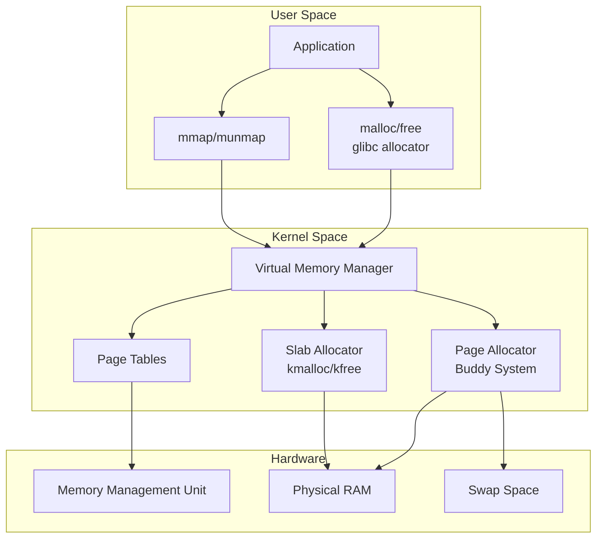
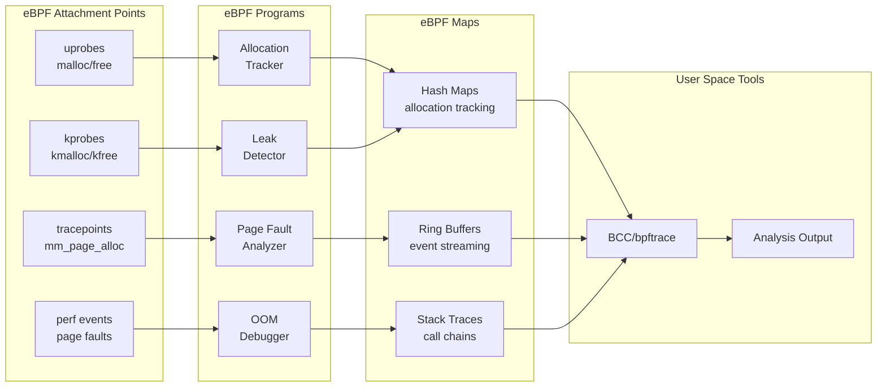
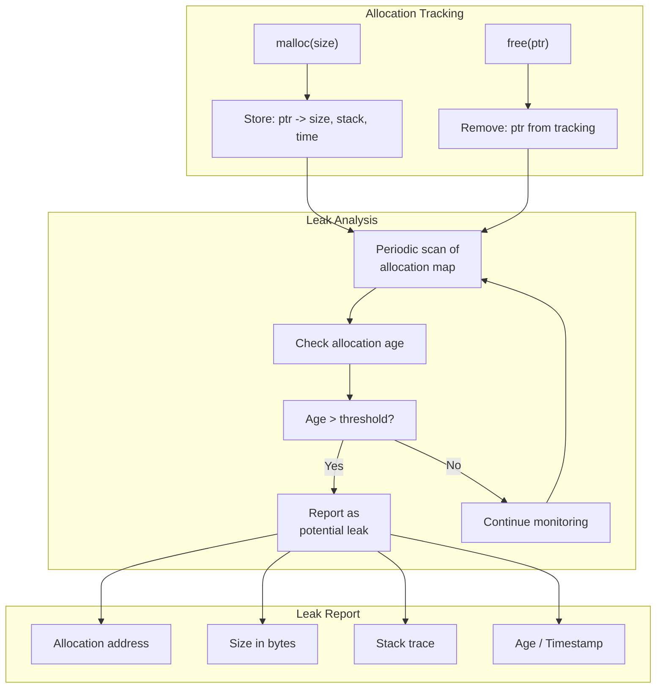
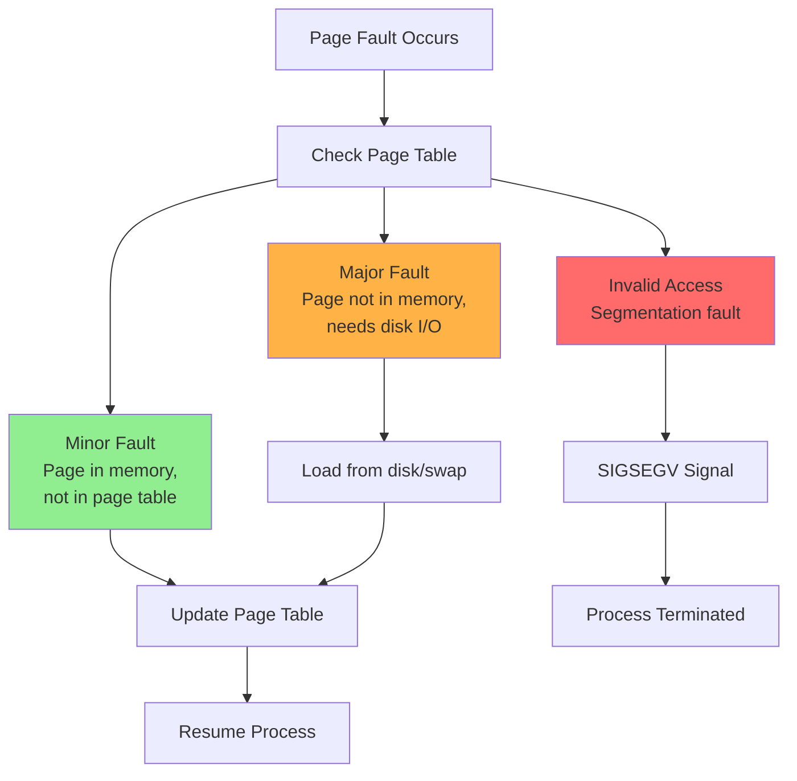
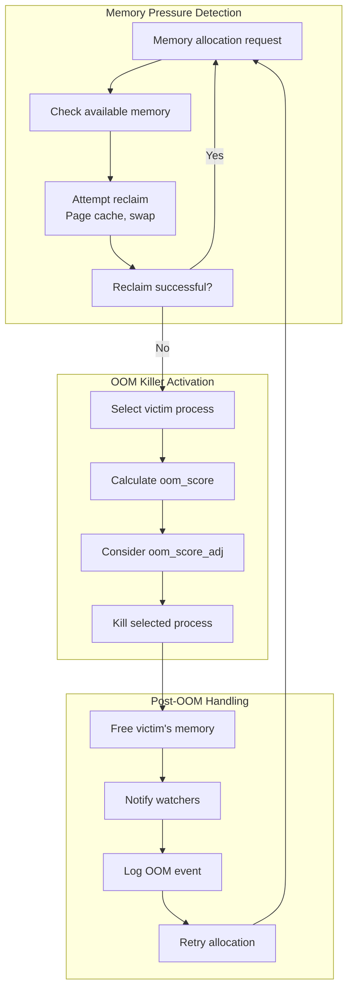

# How to Debug Memory Issues with eBPF

Author: [nawazdhandala](https://github.com/nawazdhandala)

Tags: eBPF, Memory, Debugging, Linux, Performance, Profiling

Description: Learn how to use eBPF to detect memory leaks, track allocations, and debug memory issues.

---

Memory issues are among the most challenging bugs to diagnose in production systems. Traditional debugging tools often fall short when dealing with complex memory problems in distributed systems or containerized environments. eBPF (extended Berkeley Packet Filter) offers a revolutionary approach to memory debugging by providing deep visibility into kernel and user-space memory operations without the overhead of traditional profiling tools.

In this comprehensive guide, we will explore how to use eBPF to detect memory leaks, trace allocations, analyze page faults, and debug Out-Of-Memory (OOM) conditions. By the end of this article, you will have practical tools and techniques to tackle even the most elusive memory bugs.

## Table of Contents

1. [Understanding Memory Management in Linux](#understanding-memory-management-in-linux)
2. [eBPF Memory Debugging Architecture](#ebpf-memory-debugging-architecture)
3. [Setting Up Your eBPF Environment](#setting-up-your-ebpf-environment)
4. [Memory Allocation Tracing](#memory-allocation-tracing)
5. [Memory Leak Detection](#memory-leak-detection)
6. [Page Fault Analysis](#page-fault-analysis)
7. [OOM Debugging](#oom-debugging)
8. [Advanced Techniques](#advanced-techniques)
9. [Production Best Practices](#production-best-practices)
10. [Conclusion](#conclusion)

## Understanding Memory Management in Linux

Before diving into eBPF-based debugging, it is essential to understand how Linux manages memory. The kernel uses a multi-layered approach involving virtual memory, page tables, and various allocators.

### Memory Management Overview

The following diagram illustrates the Linux memory management hierarchy:



### Key Memory Concepts

Understanding these concepts is crucial for effective memory debugging:

- **Virtual Memory**: Each process has its own virtual address space, mapped to physical memory by the kernel
- **Page Faults**: Occur when a process accesses memory not currently in physical RAM
- **Memory Allocators**: Include user-space (malloc, jemalloc) and kernel-space (slab, buddy) allocators
- **OOM Killer**: The kernel mechanism that terminates processes when memory is exhausted

## eBPF Memory Debugging Architecture

eBPF allows us to attach programs to various kernel probes and tracepoints related to memory operations. Here is how the architecture works:



## Setting Up Your eBPF Environment

Before we begin writing eBPF programs for memory debugging, we need to set up our development environment.

### Prerequisites

The following script checks and installs the necessary dependencies for eBPF development on Ubuntu/Debian systems:

```bash
#!/bin/bash

# Check kernel version - eBPF requires kernel 4.4+ for basic features
# and 5.8+ for advanced memory debugging features
echo "Checking kernel version..."
uname -r

# Install BCC (BPF Compiler Collection) which provides the Python bindings
# and pre-built tools for eBPF development
sudo apt-get update
sudo apt-get install -y bpfcc-tools linux-headers-$(uname -r)

# Install bpftrace for high-level eBPF scripting
# bpftrace provides a simpler syntax for quick memory debugging scripts
sudo apt-get install -y bpftrace

# Install libbpf development libraries for writing native eBPF programs
# This is needed if you want to compile eBPF programs in C
sudo apt-get install -y libbpf-dev

# Verify installation by checking if BPF filesystem is mounted
# The BPF filesystem is required for pinning maps and programs
mount | grep bpf

# If BPF filesystem is not mounted, mount it manually
# This filesystem allows eBPF maps to persist across program restarts
sudo mount -t bpf bpf /sys/fs/bpf
```

### Verify eBPF Capabilities

This script verifies that your system has the necessary capabilities for memory debugging with eBPF:

```bash
#!/bin/bash

# Check if the kernel supports BTF (BPF Type Format)
# BTF enables CO-RE (Compile Once, Run Everywhere) for portable eBPF programs
if [ -f /sys/kernel/btf/vmlinux ]; then
    echo "BTF is available - CO-RE programs will work"
else
    echo "BTF not available - may need to compile eBPF programs per kernel version"
fi

# Test basic eBPF functionality by running a simple bpftrace script
# This traces the write syscall to verify eBPF is working correctly
sudo bpftrace -e 'tracepoint:syscalls:sys_enter_write { @count = count(); } interval:s:1 { print(@count); clear(@count); exit(); }'
```

## Memory Allocation Tracing

Memory allocation tracing is fundamental to understanding how your application uses memory. We will trace both user-space (malloc/free) and kernel-space (kmalloc/kfree) allocations.

### User-Space Allocation Tracing with bpftrace

The following bpftrace script traces malloc and free calls in a specific process, tracking allocation sizes and calculating outstanding allocations:

```c
#!/usr/bin/env bpftrace

/*
 * malloc_trace.bt - Trace user-space memory allocations
 *
 * This script attaches uprobes to the glibc malloc and free functions
 * to track memory allocation patterns in a specific process.
 *
 * Usage: sudo bpftrace malloc_trace.bt -p <PID>
 */

/*
 * Attach to the malloc function entry point
 * arg0 contains the requested allocation size
 * We store this in a map keyed by thread ID for later correlation
 */
uprobe:/lib/x86_64-linux-gnu/libc.so.6:malloc
{
    /* Store the requested size for correlation with the return value */
    @size[tid] = arg0;
}

/*
 * Attach to malloc return to capture the allocated address
 * retval contains the pointer returned by malloc
 * We combine this with the stored size to track the allocation
 */
uretprobe:/lib/x86_64-linux-gnu/libc.so.6:malloc
{
    /* Only record if we have a corresponding size (valid allocation) */
    if (@size[tid]) {
        /*
         * Store allocation info: address -> (size, stack trace, timestamp)
         * This allows us to identify which code path made each allocation
         */
        @allocs[retval] = @size[tid];
        @alloc_stack[retval] = ustack;
        @total_allocated += @size[tid];
        @allocation_count++;

        /* Clean up the temporary size storage */
        delete(@size[tid]);
    }
}

/*
 * Attach to free function to track deallocations
 * arg0 contains the pointer being freed
 * We remove it from our tracking map and update statistics
 */
uprobe:/lib/x86_64-linux-gnu/libc.so.6:free
{
    $ptr = arg0;

    /* Only process if this pointer was previously tracked */
    if (@allocs[$ptr]) {
        @total_freed += @allocs[$ptr];
        @free_count++;

        /* Remove from tracking maps */
        delete(@allocs[$ptr]);
        delete(@alloc_stack[$ptr]);
    }
}

/*
 * Print summary statistics every 5 seconds
 * This helps monitor memory usage trends over time
 */
interval:s:5
{
    printf("\n=== Memory Allocation Summary ===\n");
    printf("Total allocated: %lu bytes\n", @total_allocated);
    printf("Total freed: %lu bytes\n", @total_freed);
    printf("Outstanding: %lu bytes\n", @total_allocated - @total_freed);
    printf("Allocation count: %lu\n", @allocation_count);
    printf("Free count: %lu\n", @free_count);
}

/*
 * On exit, print all outstanding allocations
 * These are potential memory leaks
 */
END
{
    printf("\n=== Outstanding Allocations (Potential Leaks) ===\n");
    print(@allocs);
    print(@alloc_stack);
}
```

### Kernel Memory Allocation Tracing

This bpftrace script traces kernel memory allocations using the kmalloc tracepoint, which is useful for debugging kernel modules or understanding kernel memory behavior:

```c
#!/usr/bin/env bpftrace

/*
 * kmalloc_trace.bt - Trace kernel memory allocations
 *
 * This script uses kernel tracepoints to monitor kmalloc/kfree activity.
 * Useful for debugging kernel modules or understanding kernel memory usage.
 *
 * Usage: sudo bpftrace kmalloc_trace.bt
 */

/*
 * Trace kmalloc allocations using the mm subsystem tracepoint
 * args->bytes_req: requested allocation size
 * args->bytes_alloc: actual allocated size (may be larger due to alignment)
 * args->ptr: returned pointer
 * args->gfp_flags: allocation flags (GFP_KERNEL, GFP_ATOMIC, etc.)
 */
tracepoint:kmem:kmalloc
{
    /*
     * Track allocations by call site (instruction pointer)
     * This helps identify which kernel function is allocating memory
     */
    @kmalloc_bytes[kstack(5)] = sum(args->bytes_alloc);
    @kmalloc_count[kstack(5)] = count();

    /* Store allocation for leak detection */
    @kernel_allocs[args->ptr] = args->bytes_alloc;

    /* Track allocations by GFP flags to identify allocation contexts */
    @by_flags[args->gfp_flags] = sum(args->bytes_alloc);
}

/*
 * Trace kfree to match deallocations with allocations
 * args->ptr: pointer being freed
 */
tracepoint:kmem:kfree
{
    if (@kernel_allocs[args->ptr]) {
        delete(@kernel_allocs[args->ptr]);
    }
}

/*
 * Also trace kmem_cache_alloc for slab allocations
 * Slab allocator is used for frequently allocated objects of the same size
 */
tracepoint:kmem:kmem_cache_alloc
{
    @slab_allocs[args->ptr] = args->bytes_alloc;
    @slab_by_cache[str(args->name)] = sum(args->bytes_alloc);
}

/*
 * Trace slab frees
 */
tracepoint:kmem:kmem_cache_free
{
    if (@slab_allocs[args->ptr]) {
        delete(@slab_allocs[args->ptr]);
    }
}

/*
 * Print statistics periodically
 */
interval:s:10
{
    printf("\n=== Kernel Memory Statistics ===\n");
    printf("Top kmalloc callers by bytes:\n");
    print(@kmalloc_bytes, 10);
    printf("\nAllocations by GFP flags:\n");
    print(@by_flags);
    printf("\nSlab allocations by cache:\n");
    print(@slab_by_cache, 10);
}
```

### Allocation Size Histogram

This script creates a histogram of allocation sizes to help identify memory usage patterns:

```c
#!/usr/bin/env bpftrace

/*
 * alloc_histogram.bt - Create histograms of allocation sizes
 *
 * Understanding allocation size distribution helps optimize memory allocators
 * and identify unexpected large allocations.
 *
 * Usage: sudo bpftrace alloc_histogram.bt -p <PID>
 */

/* Track malloc sizes in a log2 histogram for efficient visualization */
uprobe:/lib/x86_64-linux-gnu/libc.so.6:malloc
{
    /*
     * Use log2 histogram to group allocations by size ranges:
     * [1-2), [2-4), [4-8), [8-16), ... bytes
     * This gives a quick overview of allocation patterns
     */
    @size_hist = lhist(arg0, 0, 1048576, 1024);

    /* Also track by power of 2 for finer granularity */
    @size_log2 = hist(arg0);

    /* Track allocation frequency by size */
    @by_size[arg0] = count();
}

/* Track calloc for array allocations */
uprobe:/lib/x86_64-linux-gnu/libc.so.6:calloc
{
    /* calloc(count, size) - multiply to get total allocation */
    @calloc_sizes = hist(arg0 * arg1);
}

/* Track realloc for growing/shrinking allocations */
uprobe:/lib/x86_64-linux-gnu/libc.so.6:realloc
{
    /* arg1 is the new size */
    @realloc_sizes = hist(arg1);
}

/* Print distributions periodically */
interval:s:30
{
    printf("\n=== Allocation Size Distribution ===\n");
    print(@size_log2);
    printf("\nTop allocation sizes:\n");
    print(@by_size, 20);
}

END
{
    printf("\n=== Final Allocation Statistics ===\n");
    printf("malloc size histogram (log2):\n");
    print(@size_log2);
    printf("\ncalloc size histogram:\n");
    print(@calloc_sizes);
    printf("\nrealloc size histogram:\n");
    print(@realloc_sizes);
}
```

## Memory Leak Detection

Memory leaks occur when allocated memory is not properly freed. eBPF provides powerful tools for detecting these leaks by tracking allocations over time.

### Memory Leak Detection Flow

The following diagram shows how eBPF-based leak detection works:



### Comprehensive Leak Detector

This Python script using BCC provides a more sophisticated leak detection mechanism with aging and stack trace analysis:

```python
#!/usr/bin/env python3

"""
memleak.py - Advanced Memory Leak Detector using eBPF

This script tracks memory allocations and identifies potential leaks by:
1. Recording all allocations with timestamps and stack traces
2. Tracking deallocations to remove freed memory from tracking
3. Periodically reporting allocations that have been outstanding for too long

Usage: sudo python3 memleak.py -p <PID> [--age <seconds>]
"""

from bcc import BPF
import argparse
import time
from datetime import datetime

# Parse command line arguments
parser = argparse.ArgumentParser(description='Detect memory leaks using eBPF')
parser.add_argument('-p', '--pid', type=int, required=True, help='Process ID to trace')
parser.add_argument('--age', type=int, default=60, help='Report allocations older than this (seconds)')
parser.add_argument('--top', type=int, default=10, help='Number of top leaks to show')
args = parser.parse_args()

# The eBPF program that runs in kernel space
# This C code is compiled by BCC and loaded into the kernel
bpf_program = """
#include <uapi/linux/ptrace.h>
#include <linux/sched.h>

/*
 * Structure to store allocation metadata
 * Contains all information needed to identify and analyze potential leaks
 */
struct alloc_info_t {
    u64 size;           /* Size of the allocation in bytes */
    u64 timestamp_ns;   /* When the allocation occurred (nanoseconds) */
    int stack_id;       /* ID to look up the stack trace */
    u32 pid;            /* Process ID */
    u32 tid;            /* Thread ID */
    char comm[16];      /* Process name */
};

/*
 * Map to store allocation information keyed by pointer address
 * This allows O(1) lookup when free() is called
 */
BPF_HASH(allocs, u64, struct alloc_info_t, 1000000);

/*
 * Map to store stack traces
 * Stack IDs are used as keys to deduplicate identical call stacks
 */
BPF_STACK_TRACE(stack_traces, 16384);

/*
 * Temporary storage for malloc size between entry and return probes
 * Keyed by thread ID to handle concurrent allocations
 */
BPF_HASH(sizes, u32, u64);

/*
 * Statistics counters for monitoring overall behavior
 */
BPF_HASH(combined_allocs, int, u64);  /* Key 0: total allocated bytes */

/*
 * Probe attached to malloc entry
 * Records the requested size for later correlation
 */
int malloc_enter(struct pt_regs *ctx, size_t size) {
    /* Filter by target PID if specified */
    u32 pid = bpf_get_current_pid_tgid() >> 32;
    if (pid != TARGET_PID) {
        return 0;
    }

    u32 tid = bpf_get_current_pid_tgid();
    sizes.update(&tid, &size);
    return 0;
}

/*
 * Probe attached to malloc return
 * Records the allocation with full metadata
 */
int malloc_return(struct pt_regs *ctx) {
    u32 pid = bpf_get_current_pid_tgid() >> 32;
    if (pid != TARGET_PID) {
        return 0;
    }

    /* Get the return value (allocated pointer) */
    u64 addr = PT_REGS_RC(ctx);
    if (addr == 0) {
        return 0;  /* Allocation failed */
    }

    /* Retrieve the stored size */
    u32 tid = bpf_get_current_pid_tgid();
    u64 *size_ptr = sizes.lookup(&tid);
    if (!size_ptr) {
        return 0;
    }
    u64 size = *size_ptr;
    sizes.delete(&tid);

    /* Create allocation info structure */
    struct alloc_info_t info = {};
    info.size = size;
    info.timestamp_ns = bpf_ktime_get_ns();
    info.pid = pid;
    info.tid = tid;

    /* Capture the user-space stack trace for later analysis */
    info.stack_id = stack_traces.get_stackid(ctx, BPF_F_USER_STACK);

    /* Get the process name */
    bpf_get_current_comm(&info.comm, sizeof(info.comm));

    /* Store the allocation info */
    allocs.update(&addr, &info);

    /* Update total allocated counter */
    int zero = 0;
    u64 *total = combined_allocs.lookup(&zero);
    if (total) {
        __sync_fetch_and_add(total, size);
    } else {
        combined_allocs.update(&zero, &size);
    }

    return 0;
}

/*
 * Probe attached to free
 * Removes the allocation from tracking when memory is freed
 */
int free_enter(struct pt_regs *ctx, void *ptr) {
    u32 pid = bpf_get_current_pid_tgid() >> 32;
    if (pid != TARGET_PID) {
        return 0;
    }

    u64 addr = (u64)ptr;
    if (addr == 0) {
        return 0;  /* free(NULL) is valid but not tracked */
    }

    /* Look up and remove the allocation */
    struct alloc_info_t *info = allocs.lookup(&addr);
    if (info) {
        /* Update total allocated counter */
        int zero = 0;
        u64 *total = combined_allocs.lookup(&zero);
        if (total && *total >= info->size) {
            __sync_fetch_and_sub(total, info->size);
        }

        allocs.delete(&addr);
    }

    return 0;
}
"""

# Replace TARGET_PID placeholder with actual PID
bpf_program = bpf_program.replace('TARGET_PID', str(args.pid))

# Load the eBPF program
print(f"Attaching to PID {args.pid}...")
b = BPF(text=bpf_program)

# Attach probes to libc functions
# These are uprobes that trigger when the specified functions are called
b.attach_uprobe(name="c", sym="malloc", fn_name="malloc_enter", pid=args.pid)
b.attach_uretprobe(name="c", sym="malloc", fn_name="malloc_return", pid=args.pid)
b.attach_uprobe(name="c", sym="free", fn_name="free_enter", pid=args.pid)

# Also attach to calloc and realloc for complete coverage
b.attach_uprobe(name="c", sym="calloc", fn_name="malloc_enter", pid=args.pid)
b.attach_uretprobe(name="c", sym="calloc", fn_name="malloc_return", pid=args.pid)
b.attach_uprobe(name="c", sym="realloc", fn_name="malloc_enter", pid=args.pid)
b.attach_uretprobe(name="c", sym="realloc", fn_name="malloc_return", pid=args.pid)

print(f"Tracing memory allocations... Hit Ctrl-C to stop.")
print(f"Reporting allocations older than {args.age} seconds as potential leaks.\n")

def print_leak_report():
    """
    Analyze current allocations and report potential leaks.
    Leaks are identified as allocations that have been outstanding
    for longer than the specified age threshold.
    """
    allocs = b.get_table("allocs")
    stack_traces = b.get_table("stack_traces")

    now_ns = time.time() * 1e9
    age_threshold_ns = args.age * 1e9

    # Collect potential leaks
    leaks = []
    for addr, info in allocs.items():
        age_ns = now_ns - info.timestamp_ns
        if age_ns > age_threshold_ns:
            leaks.append({
                'addr': addr.value,
                'size': info.size,
                'age_seconds': age_ns / 1e9,
                'stack_id': info.stack_id,
                'comm': info.comm.decode('utf-8', errors='replace')
            })

    # Sort by size (largest first)
    leaks.sort(key=lambda x: x['size'], reverse=True)

    print(f"\n{'='*60}")
    print(f"Memory Leak Report - {datetime.now()}")
    print(f"{'='*60}")
    print(f"Potential leaks (allocations older than {args.age}s): {len(leaks)}")

    total_leaked = sum(leak['size'] for leak in leaks)
    print(f"Total potentially leaked memory: {total_leaked:,} bytes ({total_leaked/1024/1024:.2f} MB)")

    # Print top leaks
    print(f"\nTop {args.top} largest potential leaks:")
    for i, leak in enumerate(leaks[:args.top], 1):
        print(f"\n{i}. Address: 0x{leak['addr']:x}")
        print(f"   Size: {leak['size']:,} bytes")
        print(f"   Age: {leak['age_seconds']:.1f} seconds")
        print(f"   Process: {leak['comm']}")

        # Print stack trace
        if leak['stack_id'] >= 0:
            print("   Stack trace:")
            for frame in stack_traces.walk(leak['stack_id']):
                sym = b.sym(frame, args.pid, show_module=True, show_offset=True)
                print(f"      {sym.decode('utf-8', errors='replace')}")

# Main loop - periodically report leaks
try:
    while True:
        time.sleep(10)  # Check every 10 seconds
        print_leak_report()
except KeyboardInterrupt:
    print("\nFinal leak report:")
    print_leak_report()
    print("\nDetaching probes...")
```

### Using memleak from BCC Tools

BCC includes a pre-built memory leak detector that you can use immediately:

```bash
#!/bin/bash

# The memleak tool from BCC provides comprehensive leak detection
# It automatically tracks allocations and shows outstanding allocations
# with their stack traces

# Basic usage - trace a specific process
# -p: specify the process ID to trace
# The tool will show allocations that haven't been freed every 5 seconds
sudo /usr/share/bcc/tools/memleak -p $(pgrep myapp)

# Show allocations with a minimum age threshold
# Only show allocations that have been outstanding for at least 60 seconds
# This helps filter out legitimate long-lived allocations
sudo /usr/share/bcc/tools/memleak -p $(pgrep myapp) --older 60000

# Show top N allocation sites by total outstanding bytes
# Useful for identifying the code paths responsible for most leaks
sudo /usr/share/bcc/tools/memleak -p $(pgrep myapp) -T 10

# Include combined allocations (sum allocations from same stack)
# -c combines allocations from the same call stack
sudo /usr/share/bcc/tools/memleak -p $(pgrep myapp) -c

# Trace kernel memory allocations instead of user-space
# Useful for debugging kernel modules or understanding kernel memory usage
sudo /usr/share/bcc/tools/memleak
```

## Page Fault Analysis

Page faults occur when a process accesses memory that is not currently mapped in physical RAM. Understanding page faults is crucial for optimizing memory performance.

### Types of Page Faults



### Page Fault Tracer

This bpftrace script provides detailed analysis of page faults:

```c
#!/usr/bin/env bpftrace

/*
 * pagefault.bt - Comprehensive page fault analyzer
 *
 * This script traces page faults to help identify:
 * - Memory access patterns causing excessive page faults
 * - Processes with high page fault rates
 * - The difference between minor and major faults
 *
 * Usage: sudo bpftrace pagefault.bt
 */

/*
 * Trace minor page faults (page is in memory, just not mapped)
 * Minor faults are relatively fast as they don't require disk I/O
 * High minor fault rates can still impact performance due to TLB misses
 */
software:page-faults:1
{
    /* Count faults by process */
    @minor_by_process[comm, pid] = count();

    /* Track fault addresses to identify hot memory regions */
    @minor_by_addr[comm] = lhist(arg0, 0, 0xffffffff, 0x10000000);

    /* Track which CPUs are experiencing faults */
    @minor_by_cpu[cpu] = count();
}

/*
 * Trace major page faults using the exception:page_fault_user tracepoint
 * Major faults require reading data from disk, causing significant latency
 * These are critical for performance optimization
 */
tracepoint:exceptions:page_fault_user
{
    @major_by_process[comm, pid] = count();
    @major_by_addr_range[comm] = lhist(args->address, 0, 0xffffffff, 0x10000000);

    /* Record the timestamp to measure fault handling latency */
    @fault_start[tid] = nsecs;
}

/*
 * Alternative: Use kprobe on handle_mm_fault for more detailed info
 * This gives us access to the virtual memory area (VMA) information
 */
kprobe:handle_mm_fault
{
    @fault_count = count();
    @fault_by_process[comm] = count();

    /* Store timing for latency measurement */
    @handle_start[tid] = nsecs;
}

kretprobe:handle_mm_fault
{
    $start = @handle_start[tid];
    if ($start) {
        $latency = nsecs - $start;

        /* Track fault handling latency distribution */
        @fault_latency_us = hist($latency / 1000);

        /* Flag slow faults (likely major faults) */
        if ($latency > 1000000) {  /* > 1ms */
            @slow_faults[comm] = count();
            @slow_fault_latency_ms[comm] = hist($latency / 1000000);
        }

        delete(@handle_start[tid]);
    }
}

/*
 * Track page allocations to correlate with faults
 */
tracepoint:kmem:mm_page_alloc
{
    @page_allocs[comm] = count();
    @page_alloc_order[args->order] = count();
}

/*
 * Track page frees to understand memory pressure
 */
tracepoint:kmem:mm_page_free
{
    @page_frees[comm] = count();
}

/*
 * Print summary statistics every 10 seconds
 */
interval:s:10
{
    printf("\n=== Page Fault Analysis ===\n");
    time();

    printf("\nMinor faults by process (top 10):\n");
    print(@minor_by_process, 10);

    printf("\nMajor faults by process (top 10):\n");
    print(@major_by_process, 10);

    printf("\nFault handling latency (microseconds):\n");
    print(@fault_latency_us);

    printf("\nSlow faults (>1ms) by process:\n");
    print(@slow_faults, 10);

    printf("\nPage allocations by order:\n");
    print(@page_alloc_order);
}

END
{
    /* Clean up timing maps */
    clear(@handle_start);
    clear(@fault_start);
}
```

### Detailed Page Fault Analysis with BCC

This Python script provides detailed page fault analysis including memory region identification:

```python
#!/usr/bin/env python3

"""
pagefault_analyzer.py - Detailed page fault analysis with memory region mapping

This script traces page faults and correlates them with memory mappings
to identify which code or data regions are causing excessive faults.

Usage: sudo python3 pagefault_analyzer.py -p <PID>
"""

from bcc import BPF
import argparse
import time
import os

parser = argparse.ArgumentParser(description='Analyze page faults')
parser.add_argument('-p', '--pid', type=int, help='Process ID to trace')
parser.add_argument('--all', action='store_true', help='Trace all processes')
args = parser.parse_args()

bpf_program = """
#include <uapi/linux/ptrace.h>
#include <linux/mm.h>

/*
 * Structure to record page fault information
 */
struct fault_info_t {
    u64 timestamp;
    u64 address;
    u32 pid;
    u32 tid;
    int fault_type;  /* 0 = minor, 1 = major */
    char comm[16];
};

/*
 * Ring buffer for streaming fault events to user space
 */
BPF_PERF_OUTPUT(faults);

/*
 * Histograms for fault analysis
 */
BPF_HISTOGRAM(minor_latency_us, u64);
BPF_HISTOGRAM(major_latency_us, u64);

/*
 * Map to track fault start times
 */
BPF_HASH(fault_start, u32, u64);

/*
 * Count faults by address range (4KB pages)
 */
BPF_HASH(fault_by_page, u64, u64);

/*
 * Trace page fault entry
 */
TRACEPOINT_PROBE(exceptions, page_fault_user) {
    u32 pid = bpf_get_current_pid_tgid() >> 32;

    #ifdef FILTER_PID
    if (pid != FILTER_PID) {
        return 0;
    }
    #endif

    u32 tid = bpf_get_current_pid_tgid();
    u64 ts = bpf_ktime_get_ns();

    fault_start.update(&tid, &ts);

    /* Record fault address (page-aligned) */
    u64 page = args->address & ~0xFFF;
    u64 *count = fault_by_page.lookup(&page);
    if (count) {
        (*count)++;
    } else {
        u64 one = 1;
        fault_by_page.update(&page, &one);
    }

    return 0;
}

/*
 * Kprobe on the fault handler for detailed analysis
 */
int trace_fault_handler(struct pt_regs *ctx) {
    u32 pid = bpf_get_current_pid_tgid() >> 32;

    #ifdef FILTER_PID
    if (pid != FILTER_PID) {
        return 0;
    }
    #endif

    u32 tid = bpf_get_current_pid_tgid();
    u64 *start = fault_start.lookup(&tid);

    if (start) {
        u64 latency = bpf_ktime_get_ns() - *start;
        u64 latency_us = latency / 1000;

        /*
         * Classify as major fault if latency > 100us
         * Major faults involve disk I/O and are much slower
         */
        if (latency_us > 100) {
            major_latency_us.increment(bpf_log2l(latency_us));
        } else {
            minor_latency_us.increment(bpf_log2l(latency_us));
        }

        fault_start.delete(&tid);
    }

    return 0;
}
"""

# Apply PID filter if specified
if args.pid:
    bpf_program = f"#define FILTER_PID {args.pid}\n" + bpf_program

b = BPF(text=bpf_program)

# Attach to fault handler return for latency measurement
b.attach_kretprobe(event="handle_mm_fault", fn_name="trace_fault_handler")

def read_proc_maps(pid):
    """
    Read /proc/<pid>/maps to get memory region information
    Returns a list of (start, end, permissions, path) tuples
    """
    maps = []
    try:
        with open(f"/proc/{pid}/maps", 'r') as f:
            for line in f:
                parts = line.split()
                if len(parts) >= 1:
                    addr_range = parts[0].split('-')
                    start = int(addr_range[0], 16)
                    end = int(addr_range[1], 16)
                    perms = parts[1] if len(parts) > 1 else ''
                    path = parts[5] if len(parts) > 5 else '[anonymous]'
                    maps.append((start, end, perms, path))
    except Exception as e:
        print(f"Warning: Could not read /proc/{pid}/maps: {e}")
    return maps

def find_region(addr, maps):
    """Find which memory region an address belongs to"""
    for start, end, perms, path in maps:
        if start <= addr < end:
            return path
    return "[unknown]"

print("Tracing page faults... Press Ctrl-C to stop.")

# Read initial memory maps
if args.pid:
    proc_maps = read_proc_maps(args.pid)
else:
    proc_maps = []

try:
    while True:
        time.sleep(10)

        print("\n" + "="*60)
        print(f"Page Fault Analysis - {time.strftime('%Y-%m-%d %H:%M:%S')}")
        print("="*60)

        # Print latency histograms
        print("\nMinor fault latency (log2 microseconds):")
        b["minor_latency_us"].print_log2_hist("us")

        print("\nMajor fault latency (log2 microseconds):")
        b["major_latency_us"].print_log2_hist("us")

        # Analyze fault locations
        fault_by_page = b.get_table("fault_by_page")

        # Refresh process maps
        if args.pid:
            proc_maps = read_proc_maps(args.pid)

        # Group faults by memory region
        region_faults = {}
        for page, count in fault_by_page.items():
            region = find_region(page.value, proc_maps)
            region_faults[region] = region_faults.get(region, 0) + count.value

        # Sort by fault count
        sorted_regions = sorted(region_faults.items(), key=lambda x: x[1], reverse=True)

        print("\nFaults by memory region:")
        for region, count in sorted_regions[:20]:
            print(f"  {count:8d} faults: {region}")

        # Clear histograms for next interval
        b["minor_latency_us"].clear()
        b["major_latency_us"].clear()

except KeyboardInterrupt:
    print("\nExiting...")
```

## OOM Debugging

The Out-Of-Memory (OOM) killer is Linux's last resort when the system runs out of memory. Understanding OOM events is crucial for preventing unexpected process terminations.

### OOM Kill Flow



### OOM Event Tracer

This bpftrace script traces OOM killer events and provides detailed information about what triggered the OOM condition:

```c
#!/usr/bin/env bpftrace

/*
 * oom_trace.bt - Trace OOM killer events
 *
 * This script monitors OOM killer activity to help understand:
 * - When OOM events occur
 * - Which processes are killed
 * - What conditions led to OOM
 *
 * Usage: sudo bpftrace oom_trace.bt
 */

/*
 * Trace the OOM killer being invoked
 * This is the entry point when the kernel decides memory is exhausted
 */
kprobe:out_of_memory
{
    printf("OOM killer invoked!\n");
    printf("  Time: ");
    time();
    printf("  Triggered by: %s (PID: %d)\n", comm, pid);

    /* Print kernel stack to understand the allocation path */
    printf("  Kernel stack:\n");
    printf("%s\n", kstack);

    @oom_events = count();
    @oom_by_trigger[comm] = count();
}

/*
 * Trace process selection for OOM kill
 * The kernel calculates a badness score for each process
 */
kprobe:oom_badness
{
    @evaluated_processes[comm, pid] = count();
}

/*
 * Trace the actual OOM kill
 * This provides information about the victim process
 */
kprobe:oom_kill_process
{
    printf("\n=== OOM KILL EVENT ===\n");
    printf("Time: ");
    time();

    /* The first argument is typically the oom_control structure */
    printf("Victim process being selected...\n");

    @oom_kills = count();
}

/*
 * Alternative: Trace the oom_kill tracepoint for cleaner access
 */
tracepoint:oom:oom_score_adj_update
{
    /*
     * This traces when a process's OOM score adjustment changes
     * Lower oom_score_adj makes a process less likely to be killed
     * -1000 means never kill, +1000 means always prefer to kill
     */
    printf("OOM score adj updated: %s (PID: %d) -> %d\n",
           args->comm, args->pid, args->oom_score_adj);
    @oom_score_changes[args->comm] = count();
}

/*
 * Monitor memory allocation failures that might lead to OOM
 * These are early warnings before OOM killer is invoked
 */
tracepoint:kmem:mm_page_alloc_extfrag
{
    /* External fragmentation event - memory is fragmented */
    @fragmentation_events = count();
}

/*
 * Track memory reclaim activity
 * High reclaim activity indicates memory pressure
 */
kprobe:try_to_free_pages
{
    @reclaim_attempts[comm] = count();
    @reclaim_start[tid] = nsecs;
}

kretprobe:try_to_free_pages
{
    $start = @reclaim_start[tid];
    if ($start) {
        $latency_ms = (nsecs - $start) / 1000000;
        @reclaim_latency_ms = hist($latency_ms);

        /* Flag long reclaim times */
        if ($latency_ms > 100) {
            printf("Slow reclaim: %s spent %d ms in reclaim\n", comm, $latency_ms);
        }

        delete(@reclaim_start[tid]);
    }
}

/*
 * Monitor direct reclaim - process is forced to reclaim memory
 * This is a sign of significant memory pressure
 */
kprobe:__alloc_pages_direct_reclaim
{
    @direct_reclaim[comm] = count();
}

/*
 * Print periodic summary
 */
interval:s:30
{
    printf("\n=== OOM Monitoring Summary ===\n");
    time();

    printf("\nOOM events: ");
    print(@oom_events);

    printf("\nOOM kills: ");
    print(@oom_kills);

    printf("\nProcesses triggering OOM:\n");
    print(@oom_by_trigger, 10);

    printf("\nDirect reclaim by process (top 10):\n");
    print(@direct_reclaim, 10);

    printf("\nReclaim latency (ms):\n");
    print(@reclaim_latency_ms);

    printf("\nFragmentation events: ");
    print(@fragmentation_events);
}

END
{
    clear(@reclaim_start);
}
```

### Comprehensive OOM Analyzer

This Python script provides a more detailed OOM analysis with memory pressure monitoring:

```python
#!/usr/bin/env python3

"""
oom_analyzer.py - Comprehensive OOM and memory pressure analyzer

This script monitors:
- Memory pressure indicators
- OOM killer events
- Process memory usage trends
- Early warning signs of impending OOM

Usage: sudo python3 oom_analyzer.py [--threshold 90]
"""

from bcc import BPF
import argparse
import time
import os

parser = argparse.ArgumentParser(description='OOM and memory pressure analyzer')
parser.add_argument('--threshold', type=int, default=90,
                    help='Memory usage percentage to trigger warnings')
args = parser.parse_args()

bpf_program = """
#include <uapi/linux/ptrace.h>
#include <linux/oom.h>

/*
 * Structure for OOM event details
 */
struct oom_event_t {
    u64 timestamp;
    u32 pid;
    u32 victim_pid;
    u64 total_pages;
    u64 free_pages;
    char comm[16];
    char victim_comm[16];
};

/*
 * Ring buffer for OOM events
 */
BPF_PERF_OUTPUT(oom_events);

/*
 * Track memory pressure metrics
 */
BPF_HASH(direct_reclaim_count, u32, u64);
BPF_HASH(alloc_stall_count, u32, u64);
BPF_HISTOGRAM(reclaim_latency_us);

/*
 * Track per-process memory statistics
 */
struct mem_usage_t {
    u64 rss_bytes;
    u64 alloc_count;
    u64 free_count;
};
BPF_HASH(process_mem, u32, struct mem_usage_t);

/*
 * Trace when OOM killer is invoked
 */
int trace_out_of_memory(struct pt_regs *ctx) {
    struct oom_event_t event = {};

    event.timestamp = bpf_ktime_get_ns();
    event.pid = bpf_get_current_pid_tgid() >> 32;
    bpf_get_current_comm(&event.comm, sizeof(event.comm));

    oom_events.perf_submit(ctx, &event, sizeof(event));

    return 0;
}

/*
 * Trace direct reclaim attempts
 * Direct reclaim indicates memory pressure
 */
int trace_direct_reclaim(struct pt_regs *ctx) {
    u32 pid = bpf_get_current_pid_tgid() >> 32;

    u64 *count = direct_reclaim_count.lookup(&pid);
    if (count) {
        (*count)++;
    } else {
        u64 one = 1;
        direct_reclaim_count.update(&pid, &one);
    }

    return 0;
}

/*
 * Trace memory allocation stalls
 * These occur when allocations have to wait for memory
 */
int trace_alloc_stall(struct pt_regs *ctx) {
    u32 pid = bpf_get_current_pid_tgid() >> 32;

    u64 *count = alloc_stall_count.lookup(&pid);
    if (count) {
        (*count)++;
    } else {
        u64 one = 1;
        alloc_stall_count.update(&pid, &one);
    }

    return 0;
}

/*
 * Track reclaim timing
 */
BPF_HASH(reclaim_start, u32, u64);

int trace_reclaim_entry(struct pt_regs *ctx) {
    u32 tid = bpf_get_current_pid_tgid();
    u64 ts = bpf_ktime_get_ns();
    reclaim_start.update(&tid, &ts);
    return 0;
}

int trace_reclaim_return(struct pt_regs *ctx) {
    u32 tid = bpf_get_current_pid_tgid();
    u64 *ts = reclaim_start.lookup(&tid);

    if (ts) {
        u64 latency = bpf_ktime_get_ns() - *ts;
        reclaim_latency_us.increment(bpf_log2l(latency / 1000));
        reclaim_start.delete(&tid);
    }

    return 0;
}
"""

b = BPF(text=bpf_program)

# Attach probes
b.attach_kprobe(event="out_of_memory", fn_name="trace_out_of_memory")
b.attach_kprobe(event="__alloc_pages_direct_reclaim", fn_name="trace_direct_reclaim")
b.attach_kprobe(event="throttle_direct_reclaim", fn_name="trace_alloc_stall")
b.attach_kprobe(event="try_to_free_pages", fn_name="trace_reclaim_entry")
b.attach_kretprobe(event="try_to_free_pages", fn_name="trace_reclaim_return")

def get_memory_info():
    """Read current memory statistics from /proc/meminfo"""
    meminfo = {}
    with open('/proc/meminfo', 'r') as f:
        for line in f:
            parts = line.split(':')
            if len(parts) == 2:
                key = parts[0].strip()
                # Extract numeric value (in kB)
                value = int(parts[1].strip().split()[0])
                meminfo[key] = value
    return meminfo

def get_top_memory_processes(n=10):
    """Get top N processes by memory usage"""
    processes = []
    for pid_dir in os.listdir('/proc'):
        if pid_dir.isdigit():
            try:
                with open(f'/proc/{pid_dir}/statm', 'r') as f:
                    statm = f.read().split()
                    rss_pages = int(statm[1])
                    rss_kb = rss_pages * 4  # Assuming 4KB pages

                with open(f'/proc/{pid_dir}/comm', 'r') as f:
                    comm = f.read().strip()

                processes.append((int(pid_dir), comm, rss_kb))
            except (FileNotFoundError, PermissionError, ProcessLookupError):
                continue

    return sorted(processes, key=lambda x: x[2], reverse=True)[:n]

def handle_oom_event(cpu, data, size):
    """Callback for OOM events from eBPF"""
    event = b["oom_events"].event(data)
    print(f"\n{'!'*60}")
    print(f"OOM KILLER INVOKED!")
    print(f"  Time: {time.strftime('%Y-%m-%d %H:%M:%S')}")
    print(f"  Triggered by: {event.comm.decode()} (PID: {event.pid})")
    print(f"{'!'*60}")

# Set up the callback
b["oom_events"].open_perf_buffer(handle_oom_event)

print("OOM and Memory Pressure Analyzer")
print(f"Warning threshold: {args.threshold}% memory usage")
print("="*60)

try:
    while True:
        # Poll for OOM events
        b.perf_buffer_poll(timeout=1000)

        # Get memory statistics
        meminfo = get_memory_info()
        total = meminfo.get('MemTotal', 1)
        available = meminfo.get('MemAvailable', 0)
        used_percent = ((total - available) / total) * 100

        # Get swap statistics
        swap_total = meminfo.get('SwapTotal', 0)
        swap_free = meminfo.get('SwapFree', 0)
        swap_used = swap_total - swap_free if swap_total > 0 else 0

        # Print periodic status
        print(f"\n{'='*60}")
        print(f"Memory Status - {time.strftime('%Y-%m-%d %H:%M:%S')}")
        print(f"{'='*60}")
        print(f"Memory Usage: {used_percent:.1f}% ({(total-available)/1024:.0f}MB / {total/1024:.0f}MB)")
        print(f"Available: {available/1024:.0f}MB")
        print(f"Cached: {meminfo.get('Cached', 0)/1024:.0f}MB")
        print(f"Buffers: {meminfo.get('Buffers', 0)/1024:.0f}MB")

        if swap_total > 0:
            swap_percent = (swap_used / swap_total) * 100
            print(f"Swap Usage: {swap_percent:.1f}% ({swap_used/1024:.0f}MB / {swap_total/1024:.0f}MB)")
        else:
            print("Swap: Not configured")

        # Warning if above threshold
        if used_percent > args.threshold:
            print(f"\n*** WARNING: Memory usage above {args.threshold}% ***")

        # Print memory pressure indicators
        print(f"\nDirect reclaim events by PID:")
        direct_reclaim = b.get_table("direct_reclaim_count")
        for pid, count in sorted(direct_reclaim.items(),
                                  key=lambda x: x[1].value,
                                  reverse=True)[:5]:
            try:
                with open(f'/proc/{pid.value}/comm', 'r') as f:
                    comm = f.read().strip()
                print(f"  {comm} (PID: {pid.value}): {count.value} events")
            except:
                print(f"  PID {pid.value}: {count.value} events")

        print(f"\nReclaim latency distribution (log2 us):")
        b["reclaim_latency_us"].print_log2_hist("us")

        # Print top memory consumers
        print(f"\nTop memory consumers:")
        for pid, comm, rss_kb in get_top_memory_processes(10):
            print(f"  {comm:20s} (PID: {pid:6d}): {rss_kb/1024:.1f}MB")

        time.sleep(10)

except KeyboardInterrupt:
    print("\nExiting...")
```

### Monitoring OOM Score

This script monitors and displays OOM scores for all processes:

```bash
#!/bin/bash

# oom_score_monitor.sh - Monitor OOM scores for all processes
#
# This script shows which processes are most likely to be killed
# by the OOM killer based on their current oom_score.
#
# Usage: ./oom_score_monitor.sh [interval_seconds]

INTERVAL=${1:-5}

echo "Monitoring OOM scores (refreshing every ${INTERVAL}s)"
echo "Press Ctrl-C to stop"
echo

while true; do
    clear
    echo "=== OOM Score Monitor ==="
    echo "Time: $(date)"
    echo
    printf "%-8s %-20s %10s %12s %12s\n" "PID" "COMMAND" "OOM_SCORE" "OOM_ADJ" "RSS (MB)"
    echo "---------------------------------------------------------------"

    # Iterate through all processes and collect OOM info
    # Sort by oom_score (highest first = most likely to be killed)
    for pid in /proc/[0-9]*; do
        pid_num=$(basename "$pid")

        # Skip if process no longer exists
        [ -r "$pid/oom_score" ] || continue

        oom_score=$(cat "$pid/oom_score" 2>/dev/null)
        oom_adj=$(cat "$pid/oom_score_adj" 2>/dev/null || echo "0")
        comm=$(cat "$pid/comm" 2>/dev/null || echo "unknown")

        # Get RSS from statm (in pages, convert to MB)
        rss_pages=$(awk '{print $2}' "$pid/statm" 2>/dev/null || echo "0")
        rss_mb=$(echo "scale=1; $rss_pages * 4 / 1024" | bc 2>/dev/null || echo "0")

        echo "$pid_num $comm $oom_score $oom_adj $rss_mb"
    done 2>/dev/null | sort -k3 -rn | head -20 | \
    while read pid comm score adj rss; do
        printf "%-8s %-20s %10s %12s %12s\n" "$pid" "$comm" "$score" "$adj" "$rss"
    done

    echo
    echo "Note: Higher OOM score = more likely to be killed"
    echo "      Adjust with: echo -500 > /proc/<pid>/oom_score_adj"

    sleep "$INTERVAL"
done
```

## Advanced Techniques

### Memory Allocation Flamegraph

Generate flamegraphs of memory allocation patterns to visualize where memory is being allocated in your application:

```bash
#!/bin/bash

# generate_mem_flamegraph.sh - Generate memory allocation flamegraph
#
# This script uses eBPF to collect memory allocation stack traces
# and generates a flamegraph for visualization.
#
# Prerequisites: FlameGraph tools from https://github.com/brendangregg/FlameGraph
#
# Usage: ./generate_mem_flamegraph.sh <PID> <duration_seconds>

PID=$1
DURATION=${2:-30}
FLAMEGRAPH_DIR=${FLAMEGRAPH_DIR:-/opt/FlameGraph}

if [ -z "$PID" ]; then
    echo "Usage: $0 <PID> [duration_seconds]"
    exit 1
fi

echo "Collecting memory allocation stacks for PID $PID for $DURATION seconds..."

# Use bpftrace to collect allocation stacks
# This traces malloc calls and captures the user-space stack
sudo bpftrace -e "
    uprobe:/lib/x86_64-linux-gnu/libc.so.6:malloc /pid == $PID/ {
        @stacks[ustack] = sum(arg0);
    }

    interval:s:$DURATION {
        exit();
    }
" 2>/dev/null | \
# Filter and format the output for flamegraph processing
grep -E '^\t|^@' | \
# Convert bpftrace output to flamegraph format
awk '
    /^@stacks\[/ {
        # Extract the count from the line
        match($0, /]: ([0-9]+)/, arr)
        count = arr[1]
        next
    }
    /^\t/ {
        # Build the stack string
        gsub(/^\t/, "")
        if (stack != "") stack = $0 ";" stack
        else stack = $0
    }
    /^$/ && stack != "" {
        print stack, count
        stack = ""
    }
' > /tmp/mem_stacks.txt

# Generate the flamegraph
if [ -f "$FLAMEGRAPH_DIR/flamegraph.pl" ]; then
    cat /tmp/mem_stacks.txt | \
        "$FLAMEGRAPH_DIR/stackcollapse-bpftrace.pl" | \
        "$FLAMEGRAPH_DIR/flamegraph.pl" \
            --title "Memory Allocation Flamegraph - PID $PID" \
            --subtitle "Allocated bytes by stack trace" \
            --countname "bytes" \
            --colors mem \
        > mem_flamegraph.svg

    echo "Flamegraph generated: mem_flamegraph.svg"
    echo "Open in a browser to explore interactively."
else
    echo "FlameGraph tools not found at $FLAMEGRAPH_DIR"
    echo "Raw stack data saved to /tmp/mem_stacks.txt"
fi
```

### Memory Pattern Detection

This advanced script detects common memory usage patterns and anti-patterns:

```python
#!/usr/bin/env python3

"""
memory_patterns.py - Detect memory usage patterns and anti-patterns

This script analyzes allocation patterns to identify:
- Allocation bursts (rapid allocations)
- Memory fragmentation
- Inefficient allocation sizes
- Allocation/free imbalances

Usage: sudo python3 memory_patterns.py -p <PID>
"""

from bcc import BPF
import argparse
import time
from collections import deque
import statistics

parser = argparse.ArgumentParser(description='Detect memory patterns')
parser.add_argument('-p', '--pid', type=int, required=True, help='Process ID')
args = parser.parse_args()

bpf_program = """
#include <uapi/linux/ptrace.h>

/*
 * Structure for allocation events
 */
struct alloc_event_t {
    u64 timestamp_ns;
    u64 size;
    u64 addr;
    int is_alloc;  /* 1 = alloc, 0 = free */
};

/*
 * Ring buffer for streaming events
 */
BPF_PERF_OUTPUT(events);
BPF_HASH(sizes, u32, u64);

/*
 * Track allocation patterns
 */
int trace_malloc(struct pt_regs *ctx, size_t size) {
    u32 pid = bpf_get_current_pid_tgid() >> 32;
    if (pid != TARGET_PID) return 0;

    u32 tid = bpf_get_current_pid_tgid();
    sizes.update(&tid, &size);
    return 0;
}

int trace_malloc_ret(struct pt_regs *ctx) {
    u32 pid = bpf_get_current_pid_tgid() >> 32;
    if (pid != TARGET_PID) return 0;

    u32 tid = bpf_get_current_pid_tgid();
    u64 *size = sizes.lookup(&tid);
    if (!size) return 0;

    struct alloc_event_t event = {};
    event.timestamp_ns = bpf_ktime_get_ns();
    event.size = *size;
    event.addr = PT_REGS_RC(ctx);
    event.is_alloc = 1;

    events.perf_submit(ctx, &event, sizeof(event));
    sizes.delete(&tid);
    return 0;
}

int trace_free(struct pt_regs *ctx, void *ptr) {
    u32 pid = bpf_get_current_pid_tgid() >> 32;
    if (pid != TARGET_PID) return 0;

    struct alloc_event_t event = {};
    event.timestamp_ns = bpf_ktime_get_ns();
    event.addr = (u64)ptr;
    event.is_alloc = 0;

    events.perf_submit(ctx, &event, sizeof(event));
    return 0;
}
"""

bpf_program = bpf_program.replace('TARGET_PID', str(args.pid))
b = BPF(text=bpf_program)

b.attach_uprobe(name="c", sym="malloc", fn_name="trace_malloc", pid=args.pid)
b.attach_uretprobe(name="c", sym="malloc", fn_name="trace_malloc_ret", pid=args.pid)
b.attach_uprobe(name="c", sym="free", fn_name="trace_free", pid=args.pid)

# Pattern detection state
class PatternDetector:
    def __init__(self, window_size=1000):
        self.recent_allocs = deque(maxlen=window_size)
        self.recent_frees = deque(maxlen=window_size)
        self.alloc_sizes = deque(maxlen=window_size)
        self.allocation_count = 0
        self.free_count = 0
        self.total_allocated = 0
        self.outstanding = {}

    def add_event(self, event):
        """Process an allocation event"""
        ts = event.timestamp_ns

        if event.is_alloc:
            self.recent_allocs.append(ts)
            self.alloc_sizes.append(event.size)
            self.allocation_count += 1
            self.total_allocated += event.size
            self.outstanding[event.addr] = event.size
        else:
            self.recent_frees.append(ts)
            self.free_count += 1
            if event.addr in self.outstanding:
                del self.outstanding[event.addr]

    def detect_patterns(self):
        """Analyze collected data for patterns"""
        patterns = []

        # Pattern 1: Allocation burst detection
        # Check if many allocations happened in a short time
        if len(self.recent_allocs) >= 100:
            time_span = (self.recent_allocs[-1] - self.recent_allocs[0]) / 1e9
            if time_span > 0:
                alloc_rate = len(self.recent_allocs) / time_span
                if alloc_rate > 10000:  # More than 10K allocs/sec
                    patterns.append(f"BURST: High allocation rate: {alloc_rate:.0f}/sec")

        # Pattern 2: Size distribution analysis
        if len(self.alloc_sizes) >= 50:
            sizes = list(self.alloc_sizes)
            avg_size = statistics.mean(sizes)

            # Check for many tiny allocations (inefficient)
            tiny_count = sum(1 for s in sizes if s < 64)
            tiny_ratio = tiny_count / len(sizes)
            if tiny_ratio > 0.5:
                patterns.append(f"INEFFICIENT: {tiny_ratio*100:.0f}% of allocations are tiny (<64 bytes)")

            # Check for highly variable sizes (fragmentation risk)
            if len(sizes) > 10:
                stdev = statistics.stdev(sizes)
                cv = stdev / avg_size if avg_size > 0 else 0
                if cv > 2:
                    patterns.append(f"FRAGMENTATION RISK: High size variability (CV={cv:.1f})")

        # Pattern 3: Allocation/free imbalance
        if self.allocation_count > 100:
            ratio = self.free_count / self.allocation_count if self.allocation_count > 0 else 0
            if ratio < 0.5:
                patterns.append(f"IMBALANCE: Only {ratio*100:.0f}% of allocations have been freed")

        # Pattern 4: Growing outstanding allocations
        outstanding_size = sum(self.outstanding.values())
        outstanding_count = len(self.outstanding)
        if outstanding_count > 10000:
            patterns.append(f"GROWTH: {outstanding_count} outstanding allocations ({outstanding_size/1024/1024:.1f}MB)")

        return patterns

detector = PatternDetector()

def handle_event(cpu, data, size):
    """Callback for eBPF events"""
    event = b["events"].event(data)
    detector.add_event(event)

b["events"].open_perf_buffer(handle_event, page_cnt=256)

print(f"Analyzing memory patterns for PID {args.pid}")
print("="*60)

try:
    while True:
        b.perf_buffer_poll(timeout=100)

        # Periodic pattern analysis
        time.sleep(5)
        patterns = detector.detect_patterns()

        print(f"\n[{time.strftime('%H:%M:%S')}] Pattern Analysis")
        print(f"Allocations: {detector.allocation_count}, Frees: {detector.free_count}")
        print(f"Outstanding: {len(detector.outstanding)} ({sum(detector.outstanding.values())/1024/1024:.2f}MB)")

        if patterns:
            print("\nDetected patterns:")
            for pattern in patterns:
                print(f"  * {pattern}")
        else:
            print("No concerning patterns detected.")

except KeyboardInterrupt:
    print("\nFinal analysis:")
    patterns = detector.detect_patterns()
    for pattern in patterns:
        print(f"  * {pattern}")
```

### Container Memory Debugging

When debugging memory in containerized environments, you need to account for cgroups memory limits:

```c
#!/usr/bin/env bpftrace

/*
 * container_memory.bt - Memory debugging for containers
 *
 * This script traces memory events with container/cgroup awareness.
 * Useful for debugging memory issues in Docker/Kubernetes environments.
 *
 * Usage: sudo bpftrace container_memory.bt
 */

/*
 * Trace cgroup memory limit events
 * This fires when a cgroup approaches its memory limit
 */
tracepoint:cgroup:cgroup_memory_limit_reached
{
    printf("Memory limit reached for cgroup!\n");
    printf("  Time: ");
    time();
    printf("  Process: %s (PID: %d)\n", comm, pid);
    printf("  Cgroup: %s\n", str(args->cgrp_path));

    @limit_events[str(args->cgrp_path)] = count();
}

/*
 * Trace memory cgroup charging (allocation accounting)
 */
kprobe:mem_cgroup_charge
{
    @cgroup_charges[comm] = count();
}

/*
 * Trace memory reclaim in cgroups
 * This indicates memory pressure within the container
 */
kprobe:mem_cgroup_shrink_node
{
    @cgroup_reclaim[comm] = count();
    printf("Cgroup reclaim triggered by %s\n", comm);
}

/*
 * Track OOM events in cgroups
 */
kprobe:mem_cgroup_out_of_memory
{
    printf("\n=== CGROUP OOM EVENT ===\n");
    printf("Time: ");
    time();
    printf("Process: %s (PID: %d)\n", comm, pid);
    printf("This indicates a container hit its memory limit!\n");

    @cgroup_oom = count();
}

/*
 * Monitor page faults in container context
 */
software:page-faults:1
{
    @container_faults[cgroup] = count();
}

interval:s:10
{
    printf("\n=== Container Memory Summary ===\n");

    printf("\nLimit reached events by cgroup:\n");
    print(@limit_events);

    printf("\nCgroup reclaim by process:\n");
    print(@cgroup_reclaim, 10);

    printf("\nPage faults by cgroup:\n");
    print(@container_faults, 10);

    printf("\nCgroup OOM count: ");
    print(@cgroup_oom);
}
```

## Production Best Practices

### Minimal Overhead Memory Tracing

For production use, minimize overhead by sampling and filtering:

```c
#!/usr/bin/env bpftrace

/*
 * production_memory.bt - Low-overhead memory monitoring for production
 *
 * This script uses sampling and filtering to minimize overhead while
 * still providing useful memory debugging information.
 *
 * Usage: sudo bpftrace production_memory.bt
 */

/*
 * Only trace allocations larger than 1MB to reduce overhead
 * Large allocations are often more interesting for debugging
 */
uprobe:/lib/x86_64-linux-gnu/libc.so.6:malloc
/arg0 > 1048576/
{
    printf("Large allocation: %s (PID: %d) requesting %d MB\n",
           comm, pid, arg0 / 1048576);
    @large_allocs[comm] = sum(arg0);
    @large_alloc_count[comm] = count();
    print(ustack(5));  /* Limit stack depth */
}

/*
 * Sample page faults (1 in 1000) to reduce overhead
 */
software:page-faults:1000
{
    @sampled_faults[comm] = count();
}

/*
 * Only trace kernel allocations from specific subsystems
 * Filter by the requested size to focus on significant allocations
 */
tracepoint:kmem:kmalloc
/args->bytes_alloc > 65536/
{
    @large_kmalloc[kstack(3)] = sum(args->bytes_alloc);
}

/*
 * Aggregate statistics rather than individual events
 * This reduces data volume while preserving insights
 */
interval:s:60
{
    printf("\n=== Production Memory Stats (1 minute) ===\n");
    time();

    printf("\nLarge user-space allocations (>1MB):\n");
    print(@large_allocs, 5);

    printf("\nSampled page faults (extrapolate x1000):\n");
    print(@sampled_faults, 5);

    printf("\nLarge kernel allocations (>64KB):\n");
    print(@large_kmalloc, 5);

    /* Clear for next interval */
    clear(@large_allocs);
    clear(@large_alloc_count);
    clear(@sampled_faults);
    clear(@large_kmalloc);
}
```

### Safety Guidelines

When using eBPF for memory debugging in production, follow these guidelines:

```markdown
## Production Safety Checklist

1. **Test in staging first**: Always validate eBPF programs in a staging environment
   before deploying to production.

2. **Use sampling**: Reduce overhead by sampling events rather than tracing every
   allocation.

3. **Set timeouts**: Include automatic termination to prevent runaway tracing.

4. **Monitor overhead**: Watch for increased CPU usage from eBPF programs.

5. **Limit map sizes**: Configure appropriate map sizes to prevent memory exhaustion.

6. **Use appropriate privileges**: eBPF requires root or CAP_BPF capability.

7. **Kernel version compatibility**: Ensure your scripts work with your kernel version.
```

## Troubleshooting Common Issues

### eBPF Permission Errors

If you encounter permission errors, check the following:

```bash
#!/bin/bash

# Check if BPF is enabled in the kernel
grep CONFIG_BPF /boot/config-$(uname -r)

# Check current user capabilities
# eBPF requires CAP_SYS_ADMIN or CAP_BPF (kernel 5.8+)
capsh --print

# Check if unprivileged BPF is disabled (security setting)
# A value of 1 means only privileged users can use BPF
cat /proc/sys/kernel/unprivileged_bpf_disabled

# For Docker containers, ensure proper capabilities are set
# Run with: docker run --cap-add=SYS_ADMIN --cap-add=SYS_PTRACE ...
```

### Symbol Resolution Issues

If stack traces show addresses instead of function names:

```bash
#!/bin/bash

# Install debug symbols for glibc
# Ubuntu/Debian:
sudo apt-get install libc6-dbg

# RHEL/CentOS:
sudo debuginfo-install glibc

# For your application, compile with debug symbols
# gcc -g -o myapp myapp.c

# Verify debug info is present
file /lib/x86_64-linux-gnu/libc.so.6
readelf -S /lib/x86_64-linux-gnu/libc.so.6 | grep debug
```

## Conclusion

eBPF provides unprecedented visibility into memory operations in Linux systems. By leveraging the techniques and tools covered in this guide, you can:

1. **Track Memory Allocations**: Trace malloc/free and kmalloc/kfree calls with full stack traces
2. **Detect Memory Leaks**: Identify allocations that are never freed
3. **Analyze Page Faults**: Understand memory access patterns and performance implications
4. **Debug OOM Conditions**: Get early warnings and detailed information about memory exhaustion

The key advantages of using eBPF for memory debugging include:

- **Low Overhead**: eBPF programs run with minimal performance impact
- **Production Safe**: Can be used in production environments with proper precautions
- **Deep Visibility**: Access to both kernel and user-space memory operations
- **Flexible**: Can be customized for specific debugging needs

As you continue to develop your eBPF skills, remember to:

- Start with high-level tools like bpftrace before diving into BCC or raw eBPF
- Always test in non-production environments first
- Use sampling and filtering to minimize overhead in production
- Combine eBPF with traditional tools for comprehensive analysis

Memory debugging is a critical skill for any systems engineer, and eBPF makes it more accessible and powerful than ever before. With the techniques in this guide, you are well-equipped to tackle even the most challenging memory issues in your Linux systems.

## Additional Resources

- [BCC Tools Collection](https://github.com/iovisor/bcc)
- [bpftrace Reference Guide](https://github.com/iovisor/bpftrace/blob/master/docs/reference_guide.md)
- [Linux Memory Management Documentation](https://www.kernel.org/doc/html/latest/admin-guide/mm/index.html)
- [Brendan Gregg's eBPF Tools](https://www.brendangregg.com/ebpf.html)
