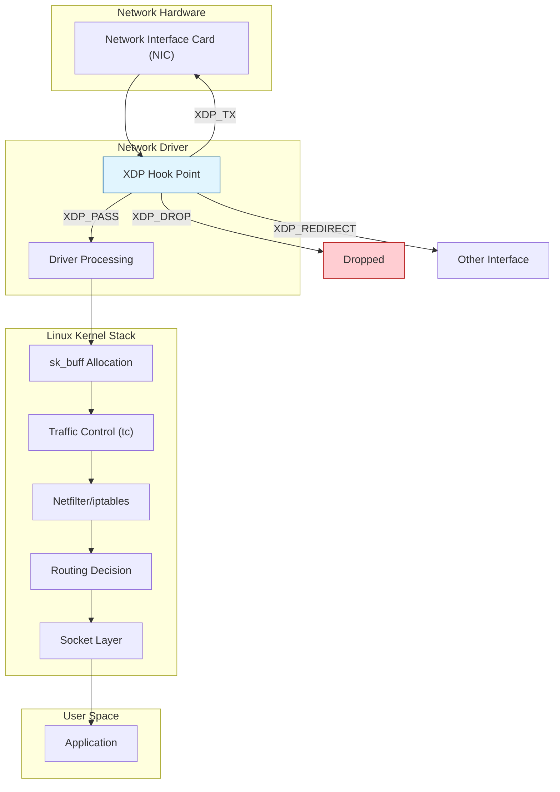
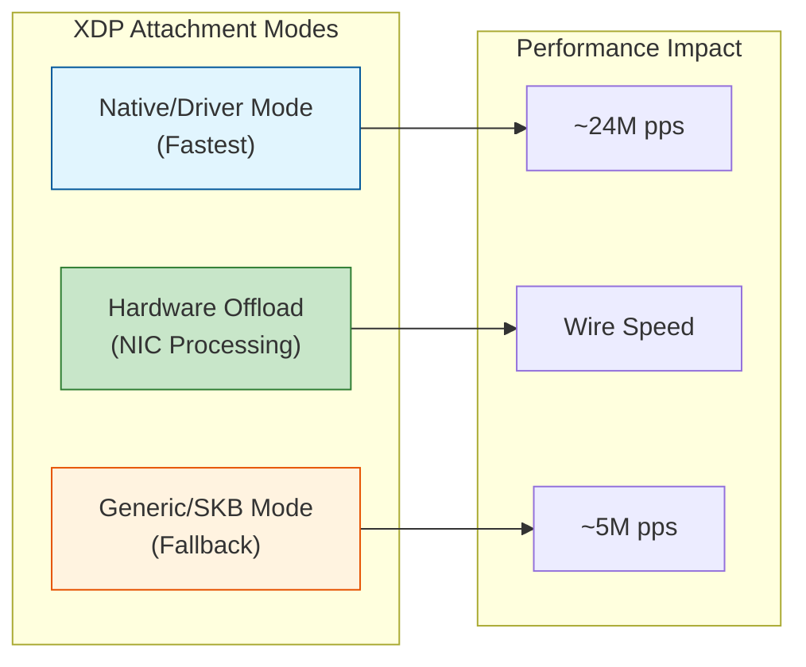
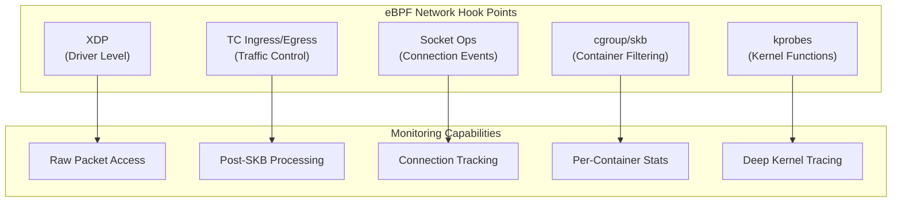
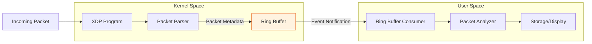
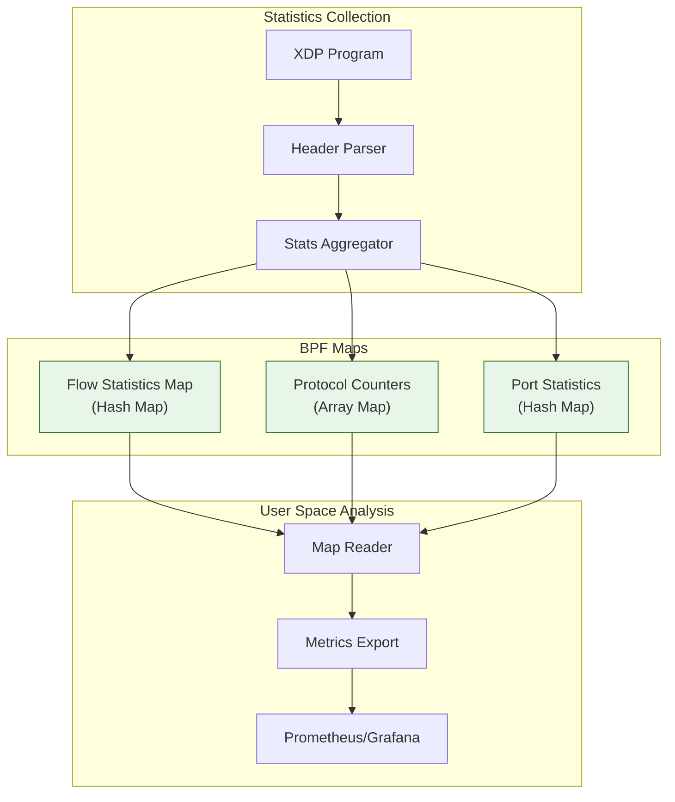
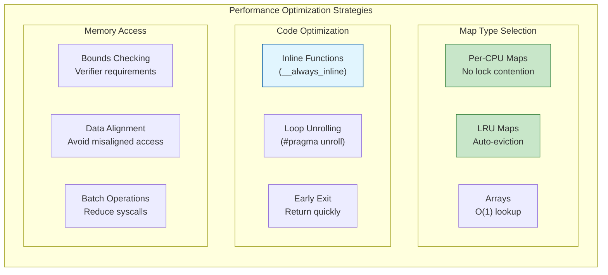
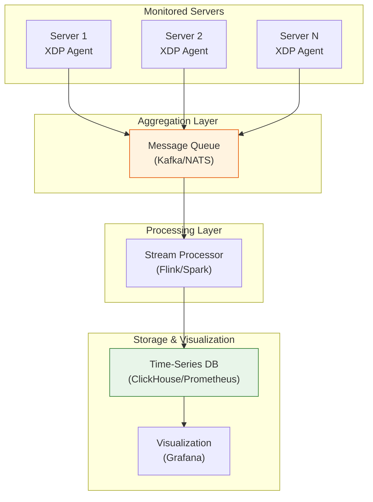

# How to Monitor Network Traffic with eBPF and XDP

Author: [nawazdhandala](https://github.com/nawazdhandala)

Tags: eBPF, XDP, Networking, Linux, Monitoring, Performance

Description: Learn how to use eBPF and XDP for high-performance network traffic monitoring and analysis.

---

Network traffic monitoring is essential for understanding application performance, detecting security threats, and troubleshooting connectivity issues. Traditional approaches using tools like tcpdump or libpcap work well but can introduce significant overhead at high packet rates. eBPF (extended Berkeley Packet Filter) combined with XDP (eXpress Data Path) offers a revolutionary approach to network monitoring with minimal performance impact. This comprehensive guide will walk you through building high-performance network monitoring solutions using these powerful Linux kernel technologies.

## Table of Contents

1. [Understanding eBPF and XDP Fundamentals](#understanding-ebpf-and-xdp-fundamentals)
2. [XDP Program Types and Hooks](#xdp-program-types-and-hooks)
3. [Setting Up the Development Environment](#setting-up-the-development-environment)
4. [Building a Basic XDP Packet Counter](#building-a-basic-xdp-packet-counter)
5. [Packet Capture with eBPF](#packet-capture-with-ebpf)
6. [Traffic Statistics Collection](#traffic-statistics-collection)
7. [Advanced Monitoring Patterns](#advanced-monitoring-patterns)
8. [Performance Considerations](#performance-considerations)
9. [Production Deployment Best Practices](#production-deployment-best-practices)

## Understanding eBPF and XDP Fundamentals

### What is eBPF?

eBPF is a revolutionary technology that allows running sandboxed programs in the Linux kernel without changing kernel source code or loading kernel modules. Originally designed for packet filtering, eBPF has evolved into a general-purpose execution engine for kernel-level programming.

### What is XDP?

XDP (eXpress Data Path) is an eBPF-based high-performance data path that operates at the earliest point in the Linux networking stack. XDP programs run before the kernel allocates an sk_buff (socket buffer), enabling extremely fast packet processing.

The following diagram illustrates how XDP fits into the Linux networking stack:



### Key Benefits of eBPF/XDP for Network Monitoring

1. **Ultra-Low Latency**: XDP processes packets before kernel network stack overhead
2. **High Throughput**: Capable of handling millions of packets per second
3. **Programmable**: Write custom logic for specific monitoring needs
4. **Safe**: eBPF verifier ensures program safety before execution
5. **Dynamic**: Load and unload programs without rebooting

## XDP Program Types and Hooks

### XDP Attach Modes

XDP programs can be attached in three different modes, each with different performance characteristics:



### XDP Return Actions

Every XDP program must return one of these actions to indicate how the kernel should handle the packet:

| Action | Description | Use Case |
|--------|-------------|----------|
| `XDP_PASS` | Pass packet to normal network stack | Allow traffic monitoring without modification |
| `XDP_DROP` | Drop the packet immediately | DDoS mitigation, firewall rules |
| `XDP_TX` | Transmit packet back out same interface | Load balancing, packet reflection |
| `XDP_REDIRECT` | Redirect to another interface or CPU | Container networking, forwarding |
| `XDP_ABORTED` | Error occurred, drop and trace | Debugging only |

### eBPF Hook Points for Networking

Beyond XDP, eBPF provides several hook points throughout the networking stack:



## Setting Up the Development Environment

### Prerequisites

Before we begin, ensure you have the following installed on your Linux system:

The following commands install the necessary development tools and libraries for eBPF development. We need clang for compiling eBPF C code, libbpf for the BPF library, and various kernel headers.

```bash
# Install development dependencies on Ubuntu/Debian
sudo apt-get update
sudo apt-get install -y \
    clang \
    llvm \
    libbpf-dev \
    libelf-dev \
    linux-headers-$(uname -r) \
    linux-tools-$(uname -r) \
    build-essential \
    pkg-config \
    bpftool

# For RHEL/CentOS/Fedora systems
sudo dnf install -y \
    clang \
    llvm \
    libbpf-devel \
    elfutils-libelf-devel \
    kernel-headers \
    kernel-devel \
    bpftool
```

### Verifying eBPF Support

This script checks if your kernel supports the necessary eBPF features. A kernel version of 5.x or higher is recommended for full XDP functionality.

```bash
#!/bin/bash
# verify_ebpf_support.sh - Check kernel eBPF capabilities

# Check kernel version (5.x+ recommended for full XDP support)
echo "Kernel version: $(uname -r)"

# Check if BPF filesystem is mounted (required for map pinning)
if mount | grep -q "bpf"; then
    echo "BPF filesystem: mounted"
else
    echo "BPF filesystem: not mounted"
    echo "Mount with: sudo mount -t bpf bpf /sys/fs/bpf"
fi

# List available BPF program types
echo "Available BPF program types:"
sudo bpftool feature probe | grep -E "^eBPF|program_type"

# Check XDP support on network interfaces
echo "XDP support per interface:"
for iface in $(ls /sys/class/net/); do
    driver=$(ethtool -i $iface 2>/dev/null | grep driver | awk '{print $2}')
    echo "  $iface: driver=$driver"
done
```

### Project Structure

Organize your eBPF project with a clear structure that separates kernel-space and user-space code:

```
ebpf-network-monitor/
├── src/
│   ├── bpf/                    # eBPF kernel-space code
│   │   ├── xdp_monitor.bpf.c   # XDP program
│   │   ├── tc_monitor.bpf.c    # TC program
│   │   └── common.h            # Shared definitions
│   └── userspace/              # User-space applications
│       ├── loader.c            # BPF program loader
│       └── stats.c             # Statistics display
├── include/
│   └── vmlinux.h               # Kernel type definitions
├── Makefile
└── README.md
```

## Building a Basic XDP Packet Counter

Let's start with a simple XDP program that counts incoming packets. This example demonstrates the fundamental structure of an XDP program.

### XDP Program (Kernel Space)

This is our eBPF program that runs in kernel space. It maintains a map to store packet counts per CPU and increments the counter for each packet before passing it to the network stack.

```c
/* xdp_packet_counter.bpf.c
 *
 * A simple XDP program that counts all incoming packets.
 * Demonstrates basic XDP structure and BPF map usage.
 */

#include <linux/bpf.h>
#include <bpf/bpf_helpers.h>
#include <linux/if_ether.h>

/* Define a per-CPU array map to store packet counts.
 * Per-CPU maps avoid lock contention and are ideal for counters.
 * The map has a single entry (max_entries=1) that each CPU updates independently.
 */
struct {
    __uint(type, BPF_MAP_TYPE_PERCPU_ARRAY);  /* Per-CPU array for lock-free updates */
    __uint(max_entries, 1);                    /* Single counter entry */
    __type(key, __u32);                        /* Key type: 32-bit unsigned integer */
    __type(value, __u64);                      /* Value type: 64-bit counter */
} packet_count SEC(".maps");

/* The SEC("xdp") macro places this function in the XDP program section.
 * The kernel recognizes this section name and knows to attach it as an XDP program.
 *
 * Parameters:
 *   ctx - XDP metadata context containing packet boundaries and interface info
 *
 * Returns:
 *   XDP action code (XDP_PASS to continue normal processing)
 */
SEC("xdp")
int count_packets(struct xdp_md *ctx)
{
    /* Key for our single-entry counter map */
    __u32 key = 0;

    /* Look up the current counter value from our per-CPU map.
     * bpf_map_lookup_elem returns a pointer to the value or NULL if not found.
     */
    __u64 *count = bpf_map_lookup_elem(&packet_count, &key);

    /* Always check for NULL - the verifier requires this.
     * Even though our map always has entry 0, the verifier doesn't know this.
     */
    if (count) {
        /* Increment the counter.
         * This is safe because per-CPU maps don't require synchronization.
         */
        (*count)++;
    }

    /* Return XDP_PASS to allow the packet to continue through the network stack.
     * The packet will proceed to normal kernel processing.
     */
    return XDP_PASS;
}

/* License declaration is required for eBPF programs.
 * GPL license allows calling GPL-only kernel helper functions.
 */
char LICENSE[] SEC("license") = "GPL";
```

### User-Space Loader

This user-space program loads the eBPF program into the kernel, attaches it to a network interface, and periodically reads the packet counter from the BPF map.

```c
/* loader.c
 *
 * User-space program to load, attach, and read from our XDP packet counter.
 * Uses libbpf for BPF program management.
 */

#include <stdio.h>
#include <stdlib.h>
#include <string.h>
#include <errno.h>
#include <unistd.h>
#include <signal.h>
#include <net/if.h>
#include <bpf/libbpf.h>
#include <bpf/bpf.h>

/* Global flag for graceful shutdown on SIGINT */
static volatile int running = 1;

/* Signal handler to stop the main loop when user presses Ctrl+C */
void sig_handler(int sig) {
    running = 0;
}

/* Sum values across all CPUs for a per-CPU map entry.
 * Per-CPU maps store separate values for each CPU core.
 * This function aggregates them into a single total.
 */
__u64 sum_percpu_values(int map_fd, __u32 key) {
    /* Get the number of possible CPUs on this system */
    int num_cpus = libbpf_num_possible_cpus();
    if (num_cpus < 0) {
        fprintf(stderr, "Failed to get CPU count: %d\n", num_cpus);
        return 0;
    }

    /* Allocate array to hold one value per CPU */
    __u64 *values = calloc(num_cpus, sizeof(__u64));
    if (!values) {
        fprintf(stderr, "Failed to allocate memory\n");
        return 0;
    }

    /* Read all per-CPU values at once */
    if (bpf_map_lookup_elem(map_fd, &key, values) != 0) {
        free(values);
        return 0;
    }

    /* Sum across all CPUs */
    __u64 total = 0;
    for (int i = 0; i < num_cpus; i++) {
        total += values[i];
    }

    free(values);
    return total;
}

int main(int argc, char **argv) {
    /* Validate command-line arguments */
    if (argc != 2) {
        fprintf(stderr, "Usage: %s <interface>\n", argv[0]);
        return 1;
    }

    const char *iface = argv[1];

    /* Convert interface name to index.
     * The kernel identifies interfaces by index, not name.
     */
    unsigned int ifindex = if_nametoindex(iface);
    if (ifindex == 0) {
        fprintf(stderr, "Failed to find interface %s: %s\n",
                iface, strerror(errno));
        return 1;
    }

    /* Open and load the BPF object file.
     * This parses the ELF file and prepares programs and maps.
     */
    struct bpf_object *obj = bpf_object__open_file(
        "xdp_packet_counter.bpf.o", NULL);
    if (libbpf_get_error(obj)) {
        fprintf(stderr, "Failed to open BPF object\n");
        return 1;
    }

    /* Load BPF programs and maps into the kernel.
     * This is where the verifier checks our program.
     */
    if (bpf_object__load(obj)) {
        fprintf(stderr, "Failed to load BPF object\n");
        bpf_object__close(obj);
        return 1;
    }

    /* Find our XDP program by its section name */
    struct bpf_program *prog = bpf_object__find_program_by_name(
        obj, "count_packets");
    if (!prog) {
        fprintf(stderr, "Failed to find XDP program\n");
        bpf_object__close(obj);
        return 1;
    }

    /* Attach XDP program to the network interface.
     * XDP_FLAGS_SKB_MODE uses generic mode for compatibility.
     * For production, use XDP_FLAGS_DRV_MODE if driver supports it.
     */
    int prog_fd = bpf_program__fd(prog);
    if (bpf_xdp_attach(ifindex, prog_fd, XDP_FLAGS_SKB_MODE, NULL) < 0) {
        fprintf(stderr, "Failed to attach XDP program to %s\n", iface);
        bpf_object__close(obj);
        return 1;
    }

    printf("XDP program attached to %s. Press Ctrl+C to stop.\n", iface);

    /* Get file descriptor for the packet_count map */
    struct bpf_map *map = bpf_object__find_map_by_name(obj, "packet_count");
    int map_fd = bpf_map__fd(map);

    /* Set up signal handler for graceful shutdown */
    signal(SIGINT, sig_handler);

    /* Main monitoring loop - read and display packet counts every second */
    __u64 prev_count = 0;
    while (running) {
        sleep(1);

        __u32 key = 0;
        __u64 count = sum_percpu_values(map_fd, key);

        /* Calculate packets per second as delta from previous reading */
        __u64 pps = count - prev_count;
        prev_count = count;

        printf("Total packets: %llu (Rate: %llu pps)\n", count, pps);
    }

    /* Clean up: detach XDP program from interface.
     * Passing -1 as prog_fd detaches any attached program.
     */
    printf("\nDetaching XDP program...\n");
    bpf_xdp_detach(ifindex, XDP_FLAGS_SKB_MODE, NULL);
    bpf_object__close(obj);

    return 0;
}
```

### Compilation

This Makefile handles the two-stage compilation process: first compiling eBPF code to BPF bytecode using clang, then compiling the user-space loader as a normal C program.

```makefile
# Makefile for eBPF network monitor
#
# eBPF programs require special compilation:
# 1. Compile to BPF bytecode using clang with -target bpf
# 2. The resulting .o file is an ELF object containing BPF instructions

# Compiler settings
CLANG := clang
LLC := llc
CC := gcc

# Architecture detection for eBPF compilation
ARCH := $(shell uname -m | sed 's/x86_64/x86/' | sed 's/aarch64/arm64/')

# Flags for compiling eBPF programs
BPF_CFLAGS := -g -O2 -target bpf \
    -D__TARGET_ARCH_$(ARCH) \
    -Wall -Werror

# Flags for user-space programs
USER_CFLAGS := -g -Wall
USER_LDFLAGS := -lbpf -lelf

# Build targets
all: xdp_packet_counter.bpf.o loader

# Compile eBPF program to BPF bytecode
# The -target bpf flag tells clang to generate BPF instructions
# -g includes debug info for better error messages from the verifier
xdp_packet_counter.bpf.o: xdp_packet_counter.bpf.c
	$(CLANG) $(BPF_CFLAGS) -c $< -o $@

# Compile user-space loader
# Links against libbpf for BPF program management
loader: loader.c
	$(CC) $(USER_CFLAGS) $< -o $@ $(USER_LDFLAGS)

clean:
	rm -f *.o loader

.PHONY: all clean
```

## Packet Capture with eBPF

For more sophisticated monitoring, we need to capture actual packet data. This section shows how to implement packet capture using eBPF ring buffers.

### Data Flow Architecture



### Packet Capture Program

This eBPF program parses incoming packets and sends metadata to user space via a ring buffer. It extracts Ethernet, IP, and TCP/UDP headers for analysis.

```c
/* packet_capture.bpf.c
 *
 * XDP program for capturing packet metadata and sending to user space.
 * Uses BPF ring buffer for efficient kernel-to-userspace data transfer.
 */

#include <linux/bpf.h>
#include <linux/if_ether.h>
#include <linux/ip.h>
#include <linux/ipv6.h>
#include <linux/tcp.h>
#include <linux/udp.h>
#include <linux/icmp.h>
#include <bpf/bpf_helpers.h>
#include <bpf/bpf_endian.h>

/* Maximum packet payload we'll capture (for deep inspection) */
#define MAX_PAYLOAD_SIZE 256

/* Structure to hold captured packet information.
 * This is what we send to user space for each packet.
 * Keep this structure aligned for efficient access.
 */
struct packet_info {
    __u64 timestamp;           /* Packet arrival timestamp (nanoseconds) */
    __u32 src_ip;              /* Source IPv4 address */
    __u32 dst_ip;              /* Destination IPv4 address */
    __u16 src_port;            /* Source port (TCP/UDP) */
    __u16 dst_port;            /* Destination port (TCP/UDP) */
    __u16 pkt_len;             /* Total packet length */
    __u8  protocol;            /* IP protocol number (TCP=6, UDP=17, ICMP=1) */
    __u8  tcp_flags;           /* TCP flags if applicable */
    __u32 ifindex;             /* Interface index packet arrived on */
    __u8  payload[MAX_PAYLOAD_SIZE];  /* Packet payload sample */
    __u16 payload_len;         /* Actual payload length captured */
};

/* Ring buffer for sending packet info to user space.
 * Ring buffers are more efficient than perf buffers for high-volume data.
 * Size must be a power of 2, in pages (4KB each).
 * 256 * 4KB = 1MB buffer
 */
struct {
    __uint(type, BPF_MAP_TYPE_RINGBUF);
    __uint(max_entries, 256 * 1024);  /* 256KB ring buffer */
} packet_ringbuf SEC(".maps");

/* Parse transport layer (TCP/UDP) and extract ports.
 *
 * Parameters:
 *   data      - Pointer to start of transport header
 *   data_end  - Pointer to end of packet data (for bounds checking)
 *   protocol  - IP protocol number
 *   pkt       - Packet info structure to populate
 *
 * Returns:
 *   Pointer to payload start, or NULL if parsing fails
 */
static __always_inline void *parse_transport(void *data, void *data_end,
                                              __u8 protocol,
                                              struct packet_info *pkt) {
    /* Handle TCP packets */
    if (protocol == IPPROTO_TCP) {
        struct tcphdr *tcp = data;

        /* Bounds check: ensure TCP header is within packet */
        if ((void *)(tcp + 1) > data_end)
            return NULL;

        /* Extract source and destination ports (convert from network byte order) */
        pkt->src_port = bpf_ntohs(tcp->source);
        pkt->dst_port = bpf_ntohs(tcp->dest);

        /* Capture TCP flags for connection state analysis */
        pkt->tcp_flags = ((tcp->fin) | (tcp->syn << 1) |
                          (tcp->rst << 2) | (tcp->psh << 3) |
                          (tcp->ack << 4) | (tcp->urg << 5));

        /* Return pointer to TCP payload (after header) */
        return (void *)tcp + (tcp->doff * 4);
    }

    /* Handle UDP packets */
    if (protocol == IPPROTO_UDP) {
        struct udphdr *udp = data;

        /* Bounds check: ensure UDP header is within packet */
        if ((void *)(udp + 1) > data_end)
            return NULL;

        pkt->src_port = bpf_ntohs(udp->source);
        pkt->dst_port = bpf_ntohs(udp->dest);
        pkt->tcp_flags = 0;  /* UDP has no flags */

        /* Return pointer to UDP payload */
        return (void *)(udp + 1);
    }

    /* For other protocols (ICMP, etc.), no port information */
    pkt->src_port = 0;
    pkt->dst_port = 0;
    pkt->tcp_flags = 0;

    return data;  /* Return current position as "payload" */
}

/* Main XDP program entry point.
 * Parses each incoming packet and sends metadata to user space.
 */
SEC("xdp")
int capture_packets(struct xdp_md *ctx)
{
    /* Get packet data boundaries.
     * data points to start of Ethernet header.
     * data_end points to end of packet.
     */
    void *data = (void *)(long)ctx->data;
    void *data_end = (void *)(long)ctx->data_end;

    /* Parse Ethernet header first.
     * All packets on Ethernet start with this 14-byte header.
     */
    struct ethhdr *eth = data;

    /* Bounds check: ensure Ethernet header is within packet.
     * The verifier requires this check before accessing eth fields.
     */
    if ((void *)(eth + 1) > data_end)
        return XDP_PASS;

    /* We only process IPv4 packets in this example.
     * ETH_P_IP is in host byte order, h_proto is in network byte order.
     */
    if (eth->h_proto != bpf_htons(ETH_P_IP))
        return XDP_PASS;

    /* Parse IPv4 header */
    struct iphdr *ip = (void *)(eth + 1);

    /* Bounds check for IP header */
    if ((void *)(ip + 1) > data_end)
        return XDP_PASS;

    /* Reserve space in the ring buffer for our packet info.
     * This may fail if the buffer is full (user space not reading fast enough).
     */
    struct packet_info *pkt = bpf_ringbuf_reserve(&packet_ringbuf,
                                                   sizeof(*pkt), 0);
    if (!pkt)
        return XDP_PASS;  /* Buffer full, skip this packet */

    /* Fill in packet metadata */
    pkt->timestamp = bpf_ktime_get_ns();  /* Monotonic clock timestamp */
    pkt->src_ip = ip->saddr;              /* Already in network byte order */
    pkt->dst_ip = ip->daddr;
    pkt->protocol = ip->protocol;
    pkt->pkt_len = bpf_ntohs(ip->tot_len);
    pkt->ifindex = ctx->ingress_ifindex;

    /* Calculate start of transport header.
     * IP header length (ihl) is in 4-byte units.
     */
    void *transport = (void *)ip + (ip->ihl * 4);

    /* Parse transport layer to get ports */
    void *payload = parse_transport(transport, data_end, ip->protocol, pkt);

    /* Capture a sample of the payload if available.
     * This is useful for protocol identification and debugging.
     */
    if (payload && payload < data_end) {
        __u64 payload_size = data_end - payload;

        /* Limit payload capture to our buffer size */
        if (payload_size > MAX_PAYLOAD_SIZE)
            payload_size = MAX_PAYLOAD_SIZE;

        /* bpf_probe_read_kernel safely copies data with bounds checking.
         * The verifier requires bounded size for memory operations.
         */
        pkt->payload_len = payload_size;
        if (payload_size > 0) {
            /* Clamp to ensure verifier is happy */
            payload_size &= (MAX_PAYLOAD_SIZE - 1);
            bpf_probe_read_kernel(pkt->payload, payload_size, payload);
        }
    } else {
        pkt->payload_len = 0;
    }

    /* Submit the packet info to the ring buffer.
     * This makes it available for user space to read.
     * Use 0 for flags (no special behavior needed).
     */
    bpf_ringbuf_submit(pkt, 0);

    /* Pass the packet to continue normal network processing */
    return XDP_PASS;
}

char LICENSE[] SEC("license") = "GPL";
```

### User-Space Consumer

The user-space program consumes packet information from the ring buffer and displays it. This example shows how to handle high-volume data efficiently.

```c
/* packet_consumer.c
 *
 * User-space program to consume packet information from the ring buffer.
 * Demonstrates efficient high-volume data processing from eBPF.
 */

#include <stdio.h>
#include <stdlib.h>
#include <string.h>
#include <errno.h>
#include <unistd.h>
#include <signal.h>
#include <arpa/inet.h>
#include <net/if.h>
#include <bpf/libbpf.h>
#include <bpf/bpf.h>
#include <time.h>

/* Include the shared packet_info structure definition */
#include "packet_capture.h"

static volatile int running = 1;

void sig_handler(int sig) {
    running = 0;
}

/* Convert IP protocol number to human-readable string */
const char *protocol_name(__u8 protocol) {
    switch (protocol) {
        case IPPROTO_TCP:  return "TCP";
        case IPPROTO_UDP:  return "UDP";
        case IPPROTO_ICMP: return "ICMP";
        default:           return "OTHER";
    }
}

/* Format TCP flags as string (e.g., "SYN,ACK") */
void format_tcp_flags(__u8 flags, char *buf, size_t len) {
    buf[0] = '\0';
    if (flags & 0x02) strncat(buf, "SYN,", len - strlen(buf) - 1);
    if (flags & 0x10) strncat(buf, "ACK,", len - strlen(buf) - 1);
    if (flags & 0x01) strncat(buf, "FIN,", len - strlen(buf) - 1);
    if (flags & 0x04) strncat(buf, "RST,", len - strlen(buf) - 1);
    if (flags & 0x08) strncat(buf, "PSH,", len - strlen(buf) - 1);
    if (flags & 0x20) strncat(buf, "URG,", len - strlen(buf) - 1);

    /* Remove trailing comma */
    size_t slen = strlen(buf);
    if (slen > 0 && buf[slen - 1] == ',')
        buf[slen - 1] = '\0';
}

/* Ring buffer callback function.
 * Called by libbpf for each item in the ring buffer.
 *
 * Parameters:
 *   ctx  - User context (unused in this example)
 *   data - Pointer to packet_info structure from kernel
 *   size - Size of the data
 *
 * Returns:
 *   0 to continue processing, negative to stop
 */
static int handle_packet(void *ctx, void *data, size_t size) {
    struct packet_info *pkt = data;

    /* Convert IP addresses from network to presentation format */
    char src_ip[INET_ADDRSTRLEN], dst_ip[INET_ADDRSTRLEN];
    inet_ntop(AF_INET, &pkt->src_ip, src_ip, sizeof(src_ip));
    inet_ntop(AF_INET, &pkt->dst_ip, dst_ip, sizeof(dst_ip));

    /* Format TCP flags if applicable */
    char flags_str[32] = "";
    if (pkt->protocol == IPPROTO_TCP) {
        format_tcp_flags(pkt->tcp_flags, flags_str, sizeof(flags_str));
    }

    /* Calculate relative timestamp (seconds since epoch) */
    double ts_sec = (double)pkt->timestamp / 1e9;

    /* Print packet summary */
    printf("[%.6f] %s %s:%u -> %s:%u len=%u",
           ts_sec,
           protocol_name(pkt->protocol),
           src_ip, pkt->src_port,
           dst_ip, pkt->dst_port,
           pkt->pkt_len);

    /* Add TCP flags if present */
    if (flags_str[0] != '\0') {
        printf(" [%s]", flags_str);
    }

    printf("\n");

    return 0;  /* Continue processing */
}

int main(int argc, char **argv) {
    if (argc != 2) {
        fprintf(stderr, "Usage: %s <interface>\n", argv[0]);
        return 1;
    }

    const char *iface = argv[1];
    unsigned int ifindex = if_nametoindex(iface);
    if (ifindex == 0) {
        fprintf(stderr, "Interface %s not found\n", iface);
        return 1;
    }

    /* Open and load BPF object */
    struct bpf_object *obj = bpf_object__open_file(
        "packet_capture.bpf.o", NULL);
    if (libbpf_get_error(obj)) {
        fprintf(stderr, "Failed to open BPF object\n");
        return 1;
    }

    if (bpf_object__load(obj)) {
        fprintf(stderr, "Failed to load BPF object\n");
        bpf_object__close(obj);
        return 1;
    }

    /* Attach XDP program */
    struct bpf_program *prog = bpf_object__find_program_by_name(
        obj, "capture_packets");
    int prog_fd = bpf_program__fd(prog);

    if (bpf_xdp_attach(ifindex, prog_fd, XDP_FLAGS_SKB_MODE, NULL) < 0) {
        fprintf(stderr, "Failed to attach XDP program\n");
        bpf_object__close(obj);
        return 1;
    }

    printf("Capturing packets on %s. Press Ctrl+C to stop.\n\n", iface);

    /* Get ring buffer map and create consumer */
    struct bpf_map *ringbuf_map = bpf_object__find_map_by_name(
        obj, "packet_ringbuf");
    int ringbuf_fd = bpf_map__fd(ringbuf_map);

    /* Create ring buffer manager.
     * handle_packet will be called for each packet.
     * NULL context since we don't need to pass state to callback.
     */
    struct ring_buffer *rb = ring_buffer__new(ringbuf_fd, handle_packet,
                                               NULL, NULL);
    if (!rb) {
        fprintf(stderr, "Failed to create ring buffer\n");
        bpf_xdp_detach(ifindex, XDP_FLAGS_SKB_MODE, NULL);
        bpf_object__close(obj);
        return 1;
    }

    signal(SIGINT, sig_handler);

    /* Main event loop.
     * ring_buffer__poll waits for data with timeout (100ms here).
     * Returns number of events processed or negative on error.
     */
    while (running) {
        int err = ring_buffer__poll(rb, 100);  /* 100ms timeout */
        if (err < 0 && err != -EINTR) {
            fprintf(stderr, "Ring buffer error: %d\n", err);
            break;
        }
    }

    /* Cleanup */
    printf("\nShutting down...\n");
    ring_buffer__free(rb);
    bpf_xdp_detach(ifindex, XDP_FLAGS_SKB_MODE, NULL);
    bpf_object__close(obj);

    return 0;
}
```

## Traffic Statistics Collection

For production monitoring, you often need aggregated statistics rather than per-packet data. This section shows how to collect traffic statistics efficiently using eBPF hash maps.

### Statistics Architecture



### Statistics Collection Program

This comprehensive eBPF program collects various network statistics including per-flow stats, protocol distribution, and port-based traffic analysis.

```c
/* traffic_stats.bpf.c
 *
 * eBPF program for comprehensive traffic statistics collection.
 * Maintains multiple maps for different aggregation levels.
 */

#include <linux/bpf.h>
#include <linux/if_ether.h>
#include <linux/ip.h>
#include <linux/tcp.h>
#include <linux/udp.h>
#include <bpf/bpf_helpers.h>
#include <bpf/bpf_endian.h>

/* Flow key for per-connection statistics.
 * Identifies a unique network flow (5-tuple).
 */
struct flow_key {
    __u32 src_ip;
    __u32 dst_ip;
    __u16 src_port;
    __u16 dst_port;
    __u8  protocol;
    __u8  pad[3];  /* Padding for alignment */
};

/* Flow statistics structure.
 * Tracks packets and bytes for each flow.
 */
struct flow_stats {
    __u64 packets;           /* Number of packets in this flow */
    __u64 bytes;             /* Total bytes in this flow */
    __u64 first_seen;        /* Timestamp of first packet (ns) */
    __u64 last_seen;         /* Timestamp of most recent packet (ns) */
};

/* Protocol statistics structure.
 * Indexed by IP protocol number.
 */
struct proto_stats {
    __u64 packets;
    __u64 bytes;
};

/* Port statistics for tracking service usage */
struct port_stats {
    __u64 packets;
    __u64 bytes;
    __u64 connections;  /* New connections (SYN packets for TCP) */
};

/* Flow statistics map - tracks per-connection stats.
 * LRU hash automatically evicts old entries when full.
 * This prevents memory exhaustion from flow table attacks.
 */
struct {
    __uint(type, BPF_MAP_TYPE_LRU_HASH);
    __uint(max_entries, 100000);  /* Support up to 100K concurrent flows */
    __type(key, struct flow_key);
    __type(value, struct flow_stats);
} flow_stats_map SEC(".maps");

/* Protocol statistics - array indexed by protocol number.
 * Fast O(1) lookup, fixed size.
 * Index 0-255 covers all possible IP protocols.
 */
struct {
    __uint(type, BPF_MAP_TYPE_PERCPU_ARRAY);
    __uint(max_entries, 256);
    __type(key, __u32);
    __type(value, struct proto_stats);
} proto_stats_map SEC(".maps");

/* Port statistics - tracks traffic by destination port.
 * Useful for identifying which services receive most traffic.
 */
struct {
    __uint(type, BPF_MAP_TYPE_LRU_HASH);
    __uint(max_entries, 65536);  /* Cover all possible ports */
    __type(key, __u16);
    __type(value, struct port_stats);
} port_stats_map SEC(".maps");

/* Global counters for overall traffic summary.
 * Per-CPU array for lock-free updates.
 */
struct global_stats {
    __u64 total_packets;
    __u64 total_bytes;
    __u64 tcp_packets;
    __u64 udp_packets;
    __u64 icmp_packets;
    __u64 other_packets;
    __u64 ipv4_packets;
    __u64 ipv6_packets;
    __u64 non_ip_packets;
};

struct {
    __uint(type, BPF_MAP_TYPE_PERCPU_ARRAY);
    __uint(max_entries, 1);
    __type(key, __u32);
    __type(value, struct global_stats);
} global_stats_map SEC(".maps");

/* Update flow statistics for a given flow key.
 * Creates new entry if flow doesn't exist.
 */
static __always_inline void update_flow_stats(struct flow_key *key,
                                               __u64 pkt_len,
                                               __u64 timestamp) {
    struct flow_stats *stats = bpf_map_lookup_elem(&flow_stats_map, key);

    if (stats) {
        /* Existing flow - update counters */
        __sync_fetch_and_add(&stats->packets, 1);
        __sync_fetch_and_add(&stats->bytes, pkt_len);
        stats->last_seen = timestamp;
    } else {
        /* New flow - create entry */
        struct flow_stats new_stats = {
            .packets = 1,
            .bytes = pkt_len,
            .first_seen = timestamp,
            .last_seen = timestamp,
        };
        bpf_map_update_elem(&flow_stats_map, key, &new_stats, BPF_ANY);
    }
}

/* Update protocol statistics */
static __always_inline void update_proto_stats(__u8 protocol, __u64 pkt_len) {
    __u32 key = protocol;
    struct proto_stats *stats = bpf_map_lookup_elem(&proto_stats_map, &key);

    if (stats) {
        stats->packets++;
        stats->bytes += pkt_len;
    }
}

/* Update port statistics */
static __always_inline void update_port_stats(__u16 port, __u64 pkt_len,
                                               int is_new_connection) {
    struct port_stats *stats = bpf_map_lookup_elem(&port_stats_map, &port);

    if (stats) {
        __sync_fetch_and_add(&stats->packets, 1);
        __sync_fetch_and_add(&stats->bytes, pkt_len);
        if (is_new_connection)
            __sync_fetch_and_add(&stats->connections, 1);
    } else {
        struct port_stats new_stats = {
            .packets = 1,
            .bytes = pkt_len,
            .connections = is_new_connection ? 1 : 0,
        };
        bpf_map_update_elem(&port_stats_map, &port, &new_stats, BPF_ANY);
    }
}

/* Main XDP program for statistics collection */
SEC("xdp")
int collect_stats(struct xdp_md *ctx)
{
    void *data = (void *)(long)ctx->data;
    void *data_end = (void *)(long)ctx->data_end;

    /* Get global stats pointer first for overall counters */
    __u32 zero = 0;
    struct global_stats *gstats = bpf_map_lookup_elem(&global_stats_map, &zero);
    if (!gstats)
        return XDP_PASS;

    /* Calculate total packet length */
    __u64 pkt_len = data_end - data;
    __u64 timestamp = bpf_ktime_get_ns();

    /* Update global counters */
    gstats->total_packets++;
    gstats->total_bytes += pkt_len;

    /* Parse Ethernet header */
    struct ethhdr *eth = data;
    if ((void *)(eth + 1) > data_end)
        return XDP_PASS;

    /* Handle IPv4 packets */
    if (eth->h_proto == bpf_htons(ETH_P_IP)) {
        gstats->ipv4_packets++;

        struct iphdr *ip = (void *)(eth + 1);
        if ((void *)(ip + 1) > data_end)
            return XDP_PASS;

        __u64 ip_len = bpf_ntohs(ip->tot_len);

        /* Update protocol statistics */
        update_proto_stats(ip->protocol, ip_len);

        /* Update protocol-specific global counters */
        switch (ip->protocol) {
            case IPPROTO_TCP:  gstats->tcp_packets++;  break;
            case IPPROTO_UDP:  gstats->udp_packets++;  break;
            case IPPROTO_ICMP: gstats->icmp_packets++; break;
            default:           gstats->other_packets++; break;
        }

        /* Build flow key for TCP/UDP flows */
        struct flow_key fkey = {
            .src_ip = ip->saddr,
            .dst_ip = ip->daddr,
            .protocol = ip->protocol,
        };

        void *transport = (void *)ip + (ip->ihl * 4);
        int is_new_connection = 0;

        if (ip->protocol == IPPROTO_TCP) {
            struct tcphdr *tcp = transport;
            if ((void *)(tcp + 1) <= data_end) {
                fkey.src_port = tcp->source;
                fkey.dst_port = tcp->dest;

                /* Check for new connection (SYN without ACK) */
                is_new_connection = tcp->syn && !tcp->ack;

                /* Update port stats for destination port */
                __u16 dport = bpf_ntohs(tcp->dest);
                update_port_stats(dport, ip_len, is_new_connection);
            }
        } else if (ip->protocol == IPPROTO_UDP) {
            struct udphdr *udp = transport;
            if ((void *)(udp + 1) <= data_end) {
                fkey.src_port = udp->source;
                fkey.dst_port = udp->dest;

                __u16 dport = bpf_ntohs(udp->dest);
                update_port_stats(dport, ip_len, 0);
            }
        }

        /* Update flow statistics */
        update_flow_stats(&fkey, ip_len, timestamp);

    } else if (eth->h_proto == bpf_htons(ETH_P_IPV6)) {
        gstats->ipv6_packets++;
        /* IPv6 handling similar to IPv4 - omitted for brevity */
    } else {
        gstats->non_ip_packets++;
    }

    return XDP_PASS;
}

char LICENSE[] SEC("license") = "GPL";
```

### Statistics Reader and Exporter

This user-space program reads statistics from the BPF maps and can export them in various formats suitable for monitoring systems.

```c
/* stats_exporter.c
 *
 * User-space program to read and export traffic statistics.
 * Supports console output and Prometheus-compatible metrics.
 */

#include <stdio.h>
#include <stdlib.h>
#include <string.h>
#include <unistd.h>
#include <signal.h>
#include <arpa/inet.h>
#include <net/if.h>
#include <bpf/libbpf.h>
#include <bpf/bpf.h>

/* Include shared structure definitions */
#include "traffic_stats.h"

static volatile int running = 1;

void sig_handler(int sig) {
    running = 0;
}

/* Sum per-CPU values for global statistics */
struct global_stats sum_global_stats(int map_fd) {
    struct global_stats result = {0};
    int num_cpus = libbpf_num_possible_cpus();

    struct global_stats *values = calloc(num_cpus, sizeof(*values));
    if (!values) return result;

    __u32 key = 0;
    if (bpf_map_lookup_elem(map_fd, &key, values) == 0) {
        for (int i = 0; i < num_cpus; i++) {
            result.total_packets += values[i].total_packets;
            result.total_bytes += values[i].total_bytes;
            result.tcp_packets += values[i].tcp_packets;
            result.udp_packets += values[i].udp_packets;
            result.icmp_packets += values[i].icmp_packets;
            result.other_packets += values[i].other_packets;
            result.ipv4_packets += values[i].ipv4_packets;
            result.ipv6_packets += values[i].ipv6_packets;
            result.non_ip_packets += values[i].non_ip_packets;
        }
    }

    free(values);
    return result;
}

/* Print top N flows by packet count */
void print_top_flows(int flow_map_fd, int top_n) {
    struct flow_key key, next_key;
    struct flow_stats stats;

    /* Simple approach: iterate all flows and track top N.
     * For production, consider using a more efficient data structure.
     */
    struct {
        struct flow_key key;
        struct flow_stats stats;
    } top_flows[10] = {0};

    if (top_n > 10) top_n = 10;

    /* Iterate through all flows in the map */
    memset(&key, 0, sizeof(key));
    while (bpf_map_get_next_key(flow_map_fd, &key, &next_key) == 0) {
        if (bpf_map_lookup_elem(flow_map_fd, &next_key, &stats) == 0) {
            /* Check if this flow should be in top N */
            for (int i = 0; i < top_n; i++) {
                if (stats.packets > top_flows[i].stats.packets) {
                    /* Shift down and insert */
                    memmove(&top_flows[i + 1], &top_flows[i],
                            (top_n - i - 1) * sizeof(top_flows[0]));
                    top_flows[i].key = next_key;
                    top_flows[i].stats = stats;
                    break;
                }
            }
        }
        key = next_key;
    }

    /* Print top flows */
    printf("\nTop %d Flows by Packet Count:\n", top_n);
    printf("%-15s %-6s %-15s %-6s %-8s %-12s %-12s\n",
           "Source IP", "SPort", "Dest IP", "DPort", "Proto", "Packets", "Bytes");
    printf("%s\n", "--------------------------------------------------------------------------------");

    for (int i = 0; i < top_n && top_flows[i].stats.packets > 0; i++) {
        char src_ip[INET_ADDRSTRLEN], dst_ip[INET_ADDRSTRLEN];
        inet_ntop(AF_INET, &top_flows[i].key.src_ip, src_ip, sizeof(src_ip));
        inet_ntop(AF_INET, &top_flows[i].key.dst_ip, dst_ip, sizeof(dst_ip));

        const char *proto = "?";
        switch (top_flows[i].key.protocol) {
            case IPPROTO_TCP:  proto = "TCP";  break;
            case IPPROTO_UDP:  proto = "UDP";  break;
            case IPPROTO_ICMP: proto = "ICMP"; break;
        }

        printf("%-15s %-6u %-15s %-6u %-8s %-12llu %-12llu\n",
               src_ip, bpf_ntohs(top_flows[i].key.src_port),
               dst_ip, bpf_ntohs(top_flows[i].key.dst_port),
               proto,
               top_flows[i].stats.packets,
               top_flows[i].stats.bytes);
    }
}

/* Print top ports by traffic */
void print_top_ports(int port_map_fd, int top_n) {
    __u16 port, next_port;
    struct port_stats stats;

    struct {
        __u16 port;
        struct port_stats stats;
    } top_ports[10] = {0};

    if (top_n > 10) top_n = 10;

    port = 0;
    while (bpf_map_get_next_key(port_map_fd, &port, &next_port) == 0) {
        if (bpf_map_lookup_elem(port_map_fd, &next_port, &stats) == 0) {
            for (int i = 0; i < top_n; i++) {
                if (stats.packets > top_ports[i].stats.packets) {
                    memmove(&top_ports[i + 1], &top_ports[i],
                            (top_n - i - 1) * sizeof(top_ports[0]));
                    top_ports[i].port = next_port;
                    top_ports[i].stats = stats;
                    break;
                }
            }
        }
        port = next_port;
    }

    printf("\nTop %d Ports by Traffic:\n", top_n);
    printf("%-8s %-15s %-15s %-15s\n", "Port", "Packets", "Bytes", "Connections");
    printf("%s\n", "----------------------------------------------------");

    for (int i = 0; i < top_n && top_ports[i].stats.packets > 0; i++) {
        printf("%-8u %-15llu %-15llu %-15llu\n",
               top_ports[i].port,
               top_ports[i].stats.packets,
               top_ports[i].stats.bytes,
               top_ports[i].stats.connections);
    }
}

/* Output metrics in Prometheus format */
void export_prometheus_metrics(int global_fd, FILE *out) {
    struct global_stats stats = sum_global_stats(global_fd);

    fprintf(out, "# HELP network_packets_total Total packets processed\n");
    fprintf(out, "# TYPE network_packets_total counter\n");
    fprintf(out, "network_packets_total %llu\n\n", stats.total_packets);

    fprintf(out, "# HELP network_bytes_total Total bytes processed\n");
    fprintf(out, "# TYPE network_bytes_total counter\n");
    fprintf(out, "network_bytes_total %llu\n\n", stats.total_bytes);

    fprintf(out, "# HELP network_packets_by_protocol Packets by protocol\n");
    fprintf(out, "# TYPE network_packets_by_protocol counter\n");
    fprintf(out, "network_packets_by_protocol{protocol=\"tcp\"} %llu\n",
            stats.tcp_packets);
    fprintf(out, "network_packets_by_protocol{protocol=\"udp\"} %llu\n",
            stats.udp_packets);
    fprintf(out, "network_packets_by_protocol{protocol=\"icmp\"} %llu\n",
            stats.icmp_packets);
    fprintf(out, "network_packets_by_protocol{protocol=\"other\"} %llu\n\n",
            stats.other_packets);

    fprintf(out, "# HELP network_packets_by_version Packets by IP version\n");
    fprintf(out, "# TYPE network_packets_by_version counter\n");
    fprintf(out, "network_packets_by_version{version=\"ipv4\"} %llu\n",
            stats.ipv4_packets);
    fprintf(out, "network_packets_by_version{version=\"ipv6\"} %llu\n",
            stats.ipv6_packets);
    fprintf(out, "network_packets_by_version{version=\"non_ip\"} %llu\n",
            stats.non_ip_packets);
}

int main(int argc, char **argv) {
    if (argc < 2) {
        fprintf(stderr, "Usage: %s <interface> [--prometheus]\n", argv[0]);
        return 1;
    }

    const char *iface = argv[1];
    int prometheus_mode = (argc > 2 && strcmp(argv[2], "--prometheus") == 0);

    unsigned int ifindex = if_nametoindex(iface);
    if (ifindex == 0) {
        fprintf(stderr, "Interface %s not found\n", iface);
        return 1;
    }

    /* Load and attach BPF program */
    struct bpf_object *obj = bpf_object__open_file("traffic_stats.bpf.o", NULL);
    if (libbpf_get_error(obj)) {
        fprintf(stderr, "Failed to open BPF object\n");
        return 1;
    }

    if (bpf_object__load(obj)) {
        fprintf(stderr, "Failed to load BPF object\n");
        bpf_object__close(obj);
        return 1;
    }

    struct bpf_program *prog = bpf_object__find_program_by_name(obj, "collect_stats");
    int prog_fd = bpf_program__fd(prog);

    if (bpf_xdp_attach(ifindex, prog_fd, XDP_FLAGS_SKB_MODE, NULL) < 0) {
        fprintf(stderr, "Failed to attach XDP program\n");
        bpf_object__close(obj);
        return 1;
    }

    /* Get map file descriptors */
    int global_fd = bpf_map__fd(
        bpf_object__find_map_by_name(obj, "global_stats_map"));
    int flow_fd = bpf_map__fd(
        bpf_object__find_map_by_name(obj, "flow_stats_map"));
    int port_fd = bpf_map__fd(
        bpf_object__find_map_by_name(obj, "port_stats_map"));

    signal(SIGINT, sig_handler);

    printf("Collecting statistics on %s. Press Ctrl+C to stop.\n", iface);

    /* Track previous values for rate calculation */
    struct global_stats prev_stats = {0};

    while (running) {
        sleep(1);

        if (prometheus_mode) {
            export_prometheus_metrics(global_fd, stdout);
        } else {
            /* Clear screen and print dashboard */
            printf("\033[2J\033[H");  /* Clear screen, move cursor to top */

            struct global_stats stats = sum_global_stats(global_fd);

            /* Calculate rates */
            __u64 pps = stats.total_packets - prev_stats.total_packets;
            __u64 bps = (stats.total_bytes - prev_stats.total_bytes) * 8;
            prev_stats = stats;

            printf("=== Network Traffic Statistics ===\n");
            printf("Interface: %s\n\n", iface);

            printf("Global Statistics:\n");
            printf("  Total Packets: %llu (Rate: %llu pps)\n",
                   stats.total_packets, pps);
            printf("  Total Bytes:   %llu (Rate: %.2f Mbps)\n",
                   stats.total_bytes, (double)bps / 1e6);
            printf("\n");

            printf("Protocol Distribution:\n");
            printf("  TCP:   %llu packets (%.1f%%)\n",
                   stats.tcp_packets,
                   stats.total_packets > 0 ?
                       100.0 * stats.tcp_packets / stats.total_packets : 0);
            printf("  UDP:   %llu packets (%.1f%%)\n",
                   stats.udp_packets,
                   stats.total_packets > 0 ?
                       100.0 * stats.udp_packets / stats.total_packets : 0);
            printf("  ICMP:  %llu packets (%.1f%%)\n",
                   stats.icmp_packets,
                   stats.total_packets > 0 ?
                       100.0 * stats.icmp_packets / stats.total_packets : 0);
            printf("  Other: %llu packets\n", stats.other_packets);

            print_top_flows(flow_fd, 5);
            print_top_ports(port_fd, 5);
        }
    }

    /* Cleanup */
    printf("\nDetaching XDP program...\n");
    bpf_xdp_detach(ifindex, XDP_FLAGS_SKB_MODE, NULL);
    bpf_object__close(obj);

    return 0;
}
```

## Advanced Monitoring Patterns

### Connection Tracking

For stateful monitoring, you can track connection state transitions using socket operations hooks. This is useful for detecting connection anomalies and calculating connection metrics.

```c
/* conntrack.bpf.c
 *
 * Connection tracking using eBPF socket operations.
 * Tracks TCP connection lifecycle events.
 */

#include <linux/bpf.h>
#include <bpf/bpf_helpers.h>
#include <bpf/bpf_endian.h>

/* Connection state enumeration matching TCP states */
enum conn_state {
    CONN_NEW = 0,
    CONN_ESTABLISHED,
    CONN_CLOSING,
    CONN_CLOSED,
    CONN_FAILED,
};

/* Connection tracking entry */
struct conn_entry {
    __u64 start_time;        /* Connection start timestamp */
    __u64 last_activity;     /* Last packet timestamp */
    __u64 bytes_sent;        /* Bytes sent by initiator */
    __u64 bytes_recv;        /* Bytes received by initiator */
    __u32 packets_sent;
    __u32 packets_recv;
    enum conn_state state;
    __u8  retransmits;       /* Retransmission count */
};

/* Connection key (4-tuple since direction is implicit) */
struct conn_key {
    __u32 local_ip;
    __u32 remote_ip;
    __u16 local_port;
    __u16 remote_port;
};

/* Connection tracking map */
struct {
    __uint(type, BPF_MAP_TYPE_HASH);
    __uint(max_entries, 100000);
    __type(key, struct conn_key);
    __type(value, struct conn_entry);
} connections SEC(".maps");

/* Connection events ring buffer for user-space notification */
struct conn_event {
    __u64 timestamp;
    struct conn_key key;
    enum conn_state old_state;
    enum conn_state new_state;
    __u64 duration_ns;       /* For closed connections */
};

struct {
    __uint(type, BPF_MAP_TYPE_RINGBUF);
    __uint(max_entries, 256 * 1024);
} conn_events SEC(".maps");

/* Socket operations program for connection tracking.
 * This hook is called for various socket operations.
 */
SEC("sockops")
int track_connections(struct bpf_sock_ops *skops)
{
    struct conn_key key = {};
    struct conn_entry *entry;
    struct conn_entry new_entry = {};
    __u64 now = bpf_ktime_get_ns();

    /* Build connection key from socket ops context */
    key.local_ip = skops->local_ip4;
    key.remote_ip = skops->remote_ip4;
    key.local_port = skops->local_port;
    key.remote_port = bpf_ntohl(skops->remote_port) >> 16;

    /* Handle different socket operations */
    switch (skops->op) {
        case BPF_SOCK_OPS_TCP_CONNECT_CB:
            /* Outgoing connection initiated */
            new_entry.start_time = now;
            new_entry.last_activity = now;
            new_entry.state = CONN_NEW;
            bpf_map_update_elem(&connections, &key, &new_entry, BPF_ANY);
            break;

        case BPF_SOCK_OPS_ACTIVE_ESTABLISHED_CB:
        case BPF_SOCK_OPS_PASSIVE_ESTABLISHED_CB:
            /* Connection established */
            entry = bpf_map_lookup_elem(&connections, &key);
            if (entry) {
                entry->state = CONN_ESTABLISHED;
                entry->last_activity = now;
            } else {
                /* Passive connection (incoming) - create new entry */
                new_entry.start_time = now;
                new_entry.last_activity = now;
                new_entry.state = CONN_ESTABLISHED;
                bpf_map_update_elem(&connections, &key, &new_entry, BPF_ANY);
            }
            break;

        case BPF_SOCK_OPS_STATE_CB:
            /* Connection state change */
            entry = bpf_map_lookup_elem(&connections, &key);
            if (entry) {
                int new_state = skops->args[1];  /* New TCP state */

                /* Check for connection close */
                if (new_state == BPF_TCP_CLOSE ||
                    new_state == BPF_TCP_CLOSE_WAIT) {

                    /* Send event to user space */
                    struct conn_event *evt = bpf_ringbuf_reserve(
                        &conn_events, sizeof(*evt), 0);
                    if (evt) {
                        evt->timestamp = now;
                        evt->key = key;
                        evt->old_state = entry->state;
                        evt->new_state = CONN_CLOSED;
                        evt->duration_ns = now - entry->start_time;
                        bpf_ringbuf_submit(evt, 0);
                    }

                    /* Remove connection from tracking */
                    bpf_map_delete_elem(&connections, &key);
                }
            }
            break;

        case BPF_SOCK_OPS_RETRANS_CB:
            /* Retransmission detected */
            entry = bpf_map_lookup_elem(&connections, &key);
            if (entry && entry->retransmits < 255) {
                entry->retransmits++;
            }
            break;
    }

    return 1;  /* Return value is ignored for most operations */
}

char LICENSE[] SEC("license") = "GPL";
```

### DNS Query Monitoring

Monitor DNS queries to detect suspicious activity or track domain resolution patterns.

```c
/* dns_monitor.bpf.c
 *
 * Monitor DNS queries passing through the network.
 * Captures query names and response codes.
 */

#include <linux/bpf.h>
#include <linux/if_ether.h>
#include <linux/ip.h>
#include <linux/udp.h>
#include <bpf/bpf_helpers.h>
#include <bpf/bpf_endian.h>

#define DNS_PORT 53
#define MAX_DNS_NAME_LEN 128

/* DNS header structure */
struct dns_header {
    __u16 id;
    __u16 flags;
    __u16 qdcount;    /* Number of questions */
    __u16 ancount;    /* Number of answers */
    __u16 nscount;    /* Number of authority records */
    __u16 arcount;    /* Number of additional records */
} __attribute__((packed));

/* DNS query event for user space */
struct dns_event {
    __u64 timestamp;
    __u32 src_ip;
    __u32 dst_ip;
    __u16 query_id;
    __u16 flags;
    __u8  query_type;       /* A=1, AAAA=28, etc. */
    __u8  is_response;      /* 0=query, 1=response */
    __u8  response_code;    /* 0=success, 3=NXDOMAIN, etc. */
    char  query_name[MAX_DNS_NAME_LEN];
};

struct {
    __uint(type, BPF_MAP_TYPE_RINGBUF);
    __uint(max_entries, 256 * 1024);
} dns_events SEC(".maps");

/* Parse DNS name from packet.
 * DNS names are encoded as length-prefixed labels.
 * Example: "www.example.com" -> "\x03www\x07example\x03com\x00"
 */
static __always_inline int parse_dns_name(void *dns_data, void *data_end,
                                           char *name, int max_len) {
    __u8 *ptr = dns_data;
    int name_pos = 0;
    int label_len;

    /* Parse up to 10 labels (reasonable limit) */
    #pragma unroll
    for (int labels = 0; labels < 10; labels++) {
        /* Bounds check for label length byte */
        if ((void *)(ptr + 1) > data_end)
            return -1;

        label_len = *ptr++;

        /* Zero length means end of name */
        if (label_len == 0)
            break;

        /* Check for compression pointer (not fully supported) */
        if (label_len & 0xC0)
            break;

        /* Bounds check for label content */
        if ((void *)(ptr + label_len) > data_end)
            return -1;

        /* Copy label with bounds checking */
        if (name_pos + label_len + 1 >= max_len)
            break;

        /* Add dot separator (except for first label) */
        if (name_pos > 0)
            name[name_pos++] = '.';

        /* Copy label bytes one at a time for verifier */
        #pragma unroll
        for (int i = 0; i < 63 && i < label_len; i++) {
            if (name_pos >= max_len - 1)
                break;
            name[name_pos++] = ptr[i];
        }

        ptr += label_len;
    }

    name[name_pos] = '\0';
    return name_pos;
}

SEC("xdp")
int monitor_dns(struct xdp_md *ctx)
{
    void *data = (void *)(long)ctx->data;
    void *data_end = (void *)(long)ctx->data_end;

    /* Parse Ethernet header */
    struct ethhdr *eth = data;
    if ((void *)(eth + 1) > data_end)
        return XDP_PASS;

    if (eth->h_proto != bpf_htons(ETH_P_IP))
        return XDP_PASS;

    /* Parse IP header */
    struct iphdr *ip = (void *)(eth + 1);
    if ((void *)(ip + 1) > data_end)
        return XDP_PASS;

    /* Only process UDP packets */
    if (ip->protocol != IPPROTO_UDP)
        return XDP_PASS;

    /* Parse UDP header */
    struct udphdr *udp = (void *)ip + (ip->ihl * 4);
    if ((void *)(udp + 1) > data_end)
        return XDP_PASS;

    /* Check if this is DNS traffic (port 53) */
    __u16 src_port = bpf_ntohs(udp->source);
    __u16 dst_port = bpf_ntohs(udp->dest);

    if (src_port != DNS_PORT && dst_port != DNS_PORT)
        return XDP_PASS;

    /* Parse DNS header */
    struct dns_header *dns = (void *)(udp + 1);
    if ((void *)(dns + 1) > data_end)
        return XDP_PASS;

    /* Reserve space in ring buffer for DNS event */
    struct dns_event *evt = bpf_ringbuf_reserve(&dns_events, sizeof(*evt), 0);
    if (!evt)
        return XDP_PASS;

    /* Fill in event data */
    evt->timestamp = bpf_ktime_get_ns();
    evt->src_ip = ip->saddr;
    evt->dst_ip = ip->daddr;
    evt->query_id = bpf_ntohs(dns->id);
    evt->flags = bpf_ntohs(dns->flags);
    evt->is_response = (evt->flags >> 15) & 1;  /* QR bit */
    evt->response_code = evt->flags & 0x0F;     /* RCODE */

    /* Parse query name (starts after DNS header) */
    void *query_start = (void *)(dns + 1);
    int name_len = parse_dns_name(query_start, data_end,
                                   evt->query_name, MAX_DNS_NAME_LEN);

    if (name_len > 0) {
        /* Parse query type (2 bytes after name) */
        void *qtype_ptr = query_start + name_len + 1;
        if ((void *)(qtype_ptr + 2) <= data_end) {
            evt->query_type = bpf_ntohs(*(__u16 *)qtype_ptr);
        }
    }

    bpf_ringbuf_submit(evt, 0);

    return XDP_PASS;
}

char LICENSE[] SEC("license") = "GPL";
```

## Performance Considerations

### Optimizing eBPF Programs

eBPF programs run in kernel context and must be carefully optimized to avoid impacting system performance.



### Performance Best Practices

Here are key strategies for optimizing eBPF network monitoring programs:

```c
/* performance_tips.bpf.c
 *
 * Demonstrates performance optimization techniques for eBPF programs.
 */

#include <linux/bpf.h>
#include <bpf/bpf_helpers.h>

/* Tip 1: Use per-CPU maps for counters to avoid lock contention.
 * Each CPU updates its own counter independently.
 */
struct {
    __uint(type, BPF_MAP_TYPE_PERCPU_ARRAY);  /* Per-CPU for performance */
    __uint(max_entries, 256);
    __type(key, __u32);
    __type(value, __u64);
} counters SEC(".maps");

/* Tip 2: Use LRU hash maps for flow tables.
 * LRU automatically evicts old entries, preventing memory exhaustion.
 */
struct {
    __uint(type, BPF_MAP_TYPE_LRU_HASH);
    __uint(max_entries, 10000);
    __type(key, __u64);
    __type(value, __u64);
} flows SEC(".maps");

/* Tip 3: Mark helper functions as __always_inline.
 * This eliminates function call overhead in the hot path.
 */
static __always_inline __u64 calculate_hash(__u32 a, __u32 b) {
    return ((__u64)a << 32) | b;
}

/* Tip 4: Use bounded loops with #pragma unroll.
 * The verifier requires bounded loops; unrolling improves performance.
 */
static __always_inline int sum_array(__u8 *arr, int len) {
    int sum = 0;

    /* Limit to maximum expected size for verifier */
    if (len > 64)
        len = 64;

    #pragma unroll
    for (int i = 0; i < 64; i++) {
        if (i >= len)
            break;
        sum += arr[i];
    }

    return sum;
}

/* Tip 5: Exit early for packets you don't need to process.
 * Every instruction counts in XDP path.
 */
SEC("xdp")
int optimized_handler(struct xdp_md *ctx)
{
    void *data = (void *)(long)ctx->data;
    void *data_end = (void *)(long)ctx->data_end;

    /* Quick length check before any parsing */
    if (data + 14 + 20 > data_end)  /* Ethernet + IP minimum */
        return XDP_PASS;  /* Too short to be interesting */

    /* Tip 6: Use packet data directly instead of copying.
     * Avoid unnecessary memcpy operations.
     */
    struct ethhdr *eth = data;

    /* Tip 7: Cache frequently accessed values.
     * Avoid repeated pointer arithmetic.
     */
    __u16 h_proto = eth->h_proto;

    /* Early exit for non-IP traffic */
    if (h_proto != bpf_htons(ETH_P_IP) &&
        h_proto != bpf_htons(ETH_P_IPV6))
        return XDP_PASS;

    /* Continue processing only relevant packets... */

    return XDP_PASS;
}

/* Tip 8: Minimize map lookups.
 * Combine data that's accessed together into a single map entry.
 */
struct combined_stats {
    __u64 packets;
    __u64 bytes;
    __u64 errors;
    __u64 last_seen;
};

/* Single lookup retrieves all related data */
struct {
    __uint(type, BPF_MAP_TYPE_HASH);
    __uint(max_entries, 1000);
    __type(key, __u32);
    __type(value, struct combined_stats);
} combined_map SEC(".maps");

char LICENSE[] SEC("license") = "GPL";
```

### XDP Mode Selection

Choosing the right XDP mode is critical for performance:

| Mode | Performance | Compatibility | Use Case |
|------|-------------|---------------|----------|
| **Native (Driver)** | Highest (~24M pps) | Requires driver support | Production high-throughput |
| **Hardware Offload** | Wire speed | Limited NIC support | Maximum performance needed |
| **Generic (SKB)** | Lower (~5M pps) | All Linux systems | Development/testing |

The following code demonstrates how to detect and select the appropriate XDP mode:

```c
/* xdp_mode_selector.c
 *
 * Detect and select optimal XDP mode for a given interface.
 */

#include <stdio.h>
#include <stdlib.h>
#include <string.h>
#include <errno.h>
#include <net/if.h>
#include <linux/if_link.h>
#include <bpf/libbpf.h>
#include <bpf/bpf.h>

/* Check if interface supports native XDP mode.
 * Returns 1 if supported, 0 otherwise.
 */
int check_native_xdp_support(const char *ifname) {
    char path[256];
    FILE *f;

    /* Check for XDP support in sysfs.
     * Drivers with native XDP support expose this attribute.
     */
    snprintf(path, sizeof(path),
             "/sys/class/net/%s/device/driver", ifname);

    f = fopen(path, "r");
    if (!f) {
        return 0;  /* Can't determine, assume no support */
    }
    fclose(f);

    /* List of drivers known to support native XDP.
     * This is not exhaustive - check driver documentation.
     */
    const char *xdp_drivers[] = {
        "mlx5_core",   /* Mellanox ConnectX-4/5/6 */
        "i40e",        /* Intel XL710/X710 */
        "ixgbe",       /* Intel 10GbE */
        "ixgbevf",
        "nfp",         /* Netronome */
        "bnxt",        /* Broadcom NetXtreme */
        "thunder_nicvf",
        "virtio_net",  /* With specific versions */
        "veth",        /* Virtual Ethernet pairs */
        NULL
    };

    /* Read actual driver name and compare */
    char driver_link[256];
    ssize_t len = readlink(path, driver_link, sizeof(driver_link) - 1);
    if (len < 0)
        return 0;
    driver_link[len] = '\0';

    /* Extract driver name from path */
    char *driver_name = strrchr(driver_link, '/');
    if (driver_name)
        driver_name++;
    else
        driver_name = driver_link;

    for (int i = 0; xdp_drivers[i] != NULL; i++) {
        if (strcmp(driver_name, xdp_drivers[i]) == 0) {
            return 1;
        }
    }

    return 0;
}

/* Select optimal XDP flags for the interface */
__u32 select_xdp_flags(const char *ifname) {
    if (check_native_xdp_support(ifname)) {
        printf("Using native XDP mode for %s\n", ifname);
        return XDP_FLAGS_DRV_MODE;
    }

    printf("Using generic (SKB) XDP mode for %s\n", ifname);
    printf("Note: Generic mode has lower performance than native mode.\n");
    return XDP_FLAGS_SKB_MODE;
}

/* Attach XDP program with automatic mode selection */
int attach_xdp_auto(int ifindex, int prog_fd, const char *ifname) {
    __u32 flags = select_xdp_flags(ifname);

    int err = bpf_xdp_attach(ifindex, prog_fd, flags, NULL);
    if (err < 0) {
        /* If native mode failed, fall back to generic */
        if (flags == XDP_FLAGS_DRV_MODE) {
            printf("Native mode failed, falling back to generic...\n");
            flags = XDP_FLAGS_SKB_MODE;
            err = bpf_xdp_attach(ifindex, prog_fd, flags, NULL);
        }
    }

    return err;
}
```

## Production Deployment Best Practices

### Deployment Architecture

For production deployments, consider the following architecture:



### Graceful Degradation

Implement proper error handling and fallback mechanisms:

```c
/* graceful_monitor.c
 *
 * Production-ready monitoring with graceful degradation.
 */

#include <stdio.h>
#include <stdlib.h>
#include <string.h>
#include <errno.h>
#include <signal.h>
#include <syslog.h>
#include <net/if.h>
#include <bpf/libbpf.h>
#include <bpf/bpf.h>

static volatile int running = 1;
static struct bpf_object *obj = NULL;
static unsigned int attached_ifindex = 0;
static __u32 attached_flags = 0;

/* Cleanup handler for graceful shutdown */
void cleanup(void) {
    if (attached_ifindex > 0) {
        syslog(LOG_INFO, "Detaching XDP program from interface index %u",
               attached_ifindex);
        bpf_xdp_detach(attached_ifindex, attached_flags, NULL);
    }

    if (obj) {
        bpf_object__close(obj);
    }

    syslog(LOG_INFO, "Network monitor shutdown complete");
    closelog();
}

/* Signal handler */
void sig_handler(int sig) {
    syslog(LOG_INFO, "Received signal %d, initiating shutdown", sig);
    running = 0;
}

/* Health check - verify BPF program is still functioning */
int health_check(int map_fd) {
    __u32 key = 0;
    __u64 value;

    /* Try to read from the map - if this fails, something is wrong */
    if (bpf_map_lookup_elem(map_fd, &key, &value) < 0) {
        syslog(LOG_ERR, "Health check failed: cannot read from BPF map");
        return -1;
    }

    return 0;
}

/* Monitor with automatic recovery */
int monitor_with_recovery(const char *iface, const char *bpf_obj_path) {
    int retry_count = 0;
    const int max_retries = 3;

    while (running && retry_count < max_retries) {
        unsigned int ifindex = if_nametoindex(iface);
        if (ifindex == 0) {
            syslog(LOG_ERR, "Interface %s not found, waiting...", iface);
            sleep(5);
            continue;
        }

        /* Load BPF program */
        obj = bpf_object__open_file(bpf_obj_path, NULL);
        if (libbpf_get_error(obj)) {
            syslog(LOG_ERR, "Failed to open BPF object: %s", bpf_obj_path);
            obj = NULL;
            retry_count++;
            sleep(5);
            continue;
        }

        if (bpf_object__load(obj)) {
            syslog(LOG_ERR, "Failed to load BPF object into kernel");
            bpf_object__close(obj);
            obj = NULL;
            retry_count++;
            sleep(5);
            continue;
        }

        /* Attach XDP program */
        struct bpf_program *prog = bpf_object__find_program_by_name(
            obj, "monitor_packets");
        if (!prog) {
            syslog(LOG_ERR, "XDP program not found in BPF object");
            bpf_object__close(obj);
            obj = NULL;
            retry_count++;
            sleep(5);
            continue;
        }

        int prog_fd = bpf_program__fd(prog);
        attached_flags = XDP_FLAGS_SKB_MODE;  /* Start with safe mode */

        if (bpf_xdp_attach(ifindex, prog_fd, attached_flags, NULL) < 0) {
            syslog(LOG_ERR, "Failed to attach XDP program to %s", iface);
            bpf_object__close(obj);
            obj = NULL;
            retry_count++;
            sleep(5);
            continue;
        }

        attached_ifindex = ifindex;
        retry_count = 0;  /* Reset retry count on successful attach */

        syslog(LOG_INFO, "XDP program attached to %s", iface);

        /* Get map for health checks */
        struct bpf_map *map = bpf_object__find_map_by_name(obj, "stats_map");
        int map_fd = bpf_map__fd(map);

        /* Main monitoring loop with health checks */
        int health_failures = 0;
        while (running) {
            sleep(10);  /* Health check interval */

            if (health_check(map_fd) < 0) {
                health_failures++;
                syslog(LOG_WARNING, "Health check failed (%d consecutive)",
                       health_failures);

                if (health_failures >= 3) {
                    syslog(LOG_ERR, "Too many health failures, restarting...");
                    break;  /* Exit inner loop to restart */
                }
            } else {
                health_failures = 0;
            }
        }

        /* Detach before retry */
        bpf_xdp_detach(ifindex, attached_flags, NULL);
        attached_ifindex = 0;
        bpf_object__close(obj);
        obj = NULL;
    }

    if (retry_count >= max_retries) {
        syslog(LOG_ERR, "Max retries exceeded, giving up");
        return -1;
    }

    return 0;
}

int main(int argc, char **argv) {
    if (argc != 3) {
        fprintf(stderr, "Usage: %s <interface> <bpf_object>\n", argv[0]);
        return 1;
    }

    /* Set up logging */
    openlog("xdp-monitor", LOG_PID | LOG_NDELAY, LOG_DAEMON);
    syslog(LOG_INFO, "Starting network monitor on %s", argv[1]);

    /* Set up signal handlers */
    signal(SIGINT, sig_handler);
    signal(SIGTERM, sig_handler);

    /* Register cleanup handler */
    atexit(cleanup);

    /* Start monitoring */
    return monitor_with_recovery(argv[1], argv[2]);
}
```

### Integration with Monitoring Systems

For complete observability, integrate your eBPF monitoring with existing monitoring infrastructure. Here is an example Prometheus exporter:

```python
#!/usr/bin/env python3
"""
prometheus_exporter.py

Export eBPF network statistics to Prometheus.
Reads from BPF maps and exposes metrics via HTTP.
"""

import ctypes
import http.server
import time
from bcc import BPF
from prometheus_client import start_http_server, Counter, Gauge, Histogram

# Define metrics
packets_total = Counter(
    'network_packets_total',
    'Total packets processed',
    ['interface', 'direction', 'protocol']
)

bytes_total = Counter(
    'network_bytes_total',
    'Total bytes processed',
    ['interface', 'direction', 'protocol']
)

active_flows = Gauge(
    'network_active_flows',
    'Number of active network flows',
    ['interface']
)

packet_size_histogram = Histogram(
    'network_packet_size_bytes',
    'Packet size distribution',
    ['interface'],
    buckets=[64, 128, 256, 512, 1024, 1500, 9000]
)

def collect_metrics(bpf, interface):
    """Collect metrics from BPF maps and update Prometheus metrics."""

    # Read global stats from per-CPU array
    stats_map = bpf["global_stats_map"]
    for key, values in stats_map.items():
        total_packets = sum(v.total_packets for v in values)
        total_bytes = sum(v.total_bytes for v in values)
        tcp_packets = sum(v.tcp_packets for v in values)
        udp_packets = sum(v.udp_packets for v in values)

        packets_total.labels(
            interface=interface,
            direction='ingress',
            protocol='tcp'
        )._value._value = tcp_packets

        packets_total.labels(
            interface=interface,
            direction='ingress',
            protocol='udp'
        )._value._value = udp_packets

        bytes_total.labels(
            interface=interface,
            direction='ingress',
            protocol='all'
        )._value._value = total_bytes

    # Count active flows
    flow_map = bpf["flow_stats_map"]
    flow_count = sum(1 for _ in flow_map.items())
    active_flows.labels(interface=interface).set(flow_count)

def main():
    import argparse
    parser = argparse.ArgumentParser(description='eBPF Prometheus Exporter')
    parser.add_argument('interface', help='Network interface to monitor')
    parser.add_argument('--port', type=int, default=9100, help='Metrics port')
    args = parser.parse_args()

    # Load and attach BPF program
    bpf = BPF(src_file="traffic_stats.bpf.c")
    fn = bpf.load_func("collect_stats", BPF.XDP)
    bpf.attach_xdp(args.interface, fn, 0)

    print(f"Starting Prometheus exporter on port {args.port}")
    start_http_server(args.port)

    try:
        while True:
            collect_metrics(bpf, args.interface)
            time.sleep(1)
    except KeyboardInterrupt:
        print("Shutting down...")
    finally:
        bpf.remove_xdp(args.interface, 0)

if __name__ == '__main__':
    main()
```

## Conclusion

eBPF and XDP provide a powerful foundation for building high-performance network monitoring solutions. By processing packets at the earliest point in the Linux networking stack, you can achieve monitoring capabilities that were previously impossible without specialized hardware.

### Key Takeaways

1. **XDP provides ultra-low latency**: Processing happens before sk_buff allocation, enabling millions of packets per second handling.

2. **eBPF maps enable efficient data sharing**: Choose the right map type (per-CPU, LRU, hash, array) based on your access patterns.

3. **Safety is built-in**: The eBPF verifier ensures your programs cannot crash the kernel, making experimentation safe.

4. **Start simple and iterate**: Begin with basic packet counting, then add complexity as needed.

5. **Consider production requirements**: Implement graceful degradation, health checks, and monitoring integration from the start.

### Next Steps

To continue your eBPF networking journey, consider exploring:

- **Traffic Control (TC) programs**: For more complex packet manipulation after sk_buff allocation
- **Socket filtering**: For application-level traffic monitoring
- **Cilium and other CNI plugins**: To see eBPF networking at scale in Kubernetes
- **Hardware offload**: For ultimate performance with compatible NICs

The combination of eBPF's safety, performance, and flexibility makes it the future of Linux networking observability. Start building your monitoring solutions today and unlock insights into your network traffic that were previously impossible to obtain.

## References

- [Linux Kernel BPF Documentation](https://www.kernel.org/doc/html/latest/bpf/)
- [XDP Tutorial](https://github.com/xdp-project/xdp-tutorial)
- [libbpf Documentation](https://libbpf.readthedocs.io/)
- [BPF and XDP Reference Guide](https://docs.cilium.io/en/stable/bpf/)
- [eBPF Summit Presentations](https://ebpf.io/summit-2023/)
