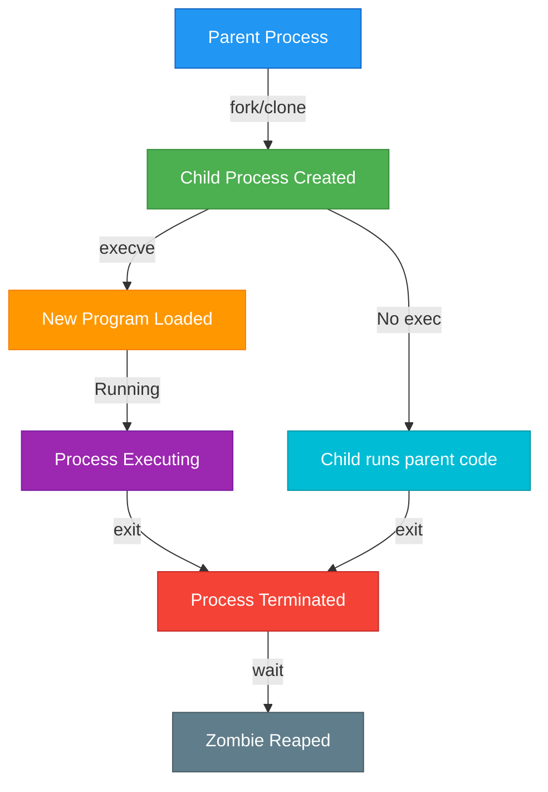
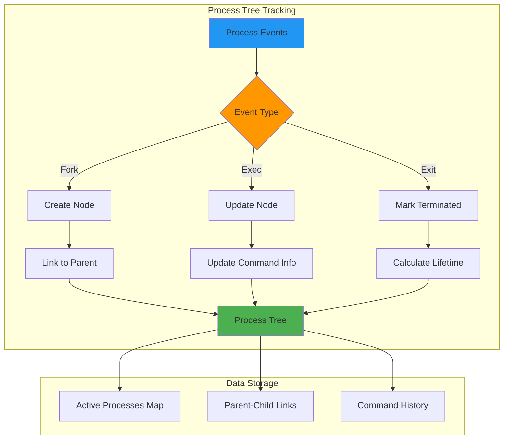
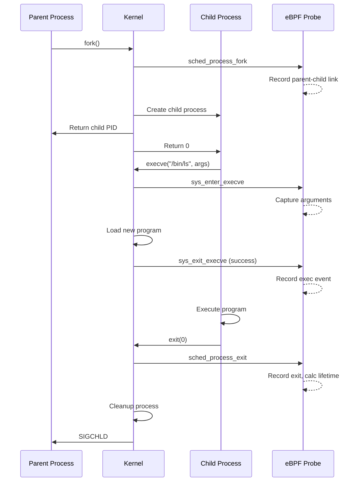

# How to Track Process Lifecycle Events with eBPF

Author: [nawazdhandala](https://github.com/nawazdhandala)

Tags: eBPF, Process, Linux, Monitoring, Security, Observability

Description: Learn how to use eBPF to track process creation, execution, and termination events.

---

## Introduction

Understanding process lifecycle events is fundamental for system observability, security monitoring, and debugging complex application behaviors. Traditional approaches using tools like `ps`, `top`, or audit frameworks often miss short-lived processes and lack the granularity needed for comprehensive system analysis.

eBPF (Extended Berkeley Packet Filter) revolutionizes this by allowing you to attach programs directly to kernel functions, capturing every process event in real-time with minimal overhead. In this comprehensive guide, you will learn how to track the complete process lifecycle using eBPF, including:

- Process creation via `fork()` and `clone()`
- Program execution via `exec()`
- Process termination via `exit()`
- Building process trees with parent-child relationships
- Capturing command line arguments

## Understanding Process Lifecycle in Linux

Before diving into eBPF implementation, let us understand the Linux process lifecycle:



### Key System Calls

| System Call | Purpose | When Triggered |
|-------------|---------|----------------|
| `fork()` | Creates a copy of the calling process | Process spawning |
| `clone()` | Creates a child process with shared resources | Thread/process creation |
| `execve()` | Replaces current process image with new program | Program execution |
| `exit()` | Terminates the calling process | Process completion |

## Prerequisites

Before proceeding, ensure you have the following:

This command installs the necessary development tools and BCC (BPF Compiler Collection) framework for writing eBPF programs:

```bash
# Install required packages on Ubuntu/Debian
sudo apt-get update
sudo apt-get install -y \
    bpfcc-tools \
    libbpfcc-dev \
    linux-headers-$(uname -r) \
    python3-bpfcc \
    clang \
    llvm

# For RHEL/CentOS/Fedora
sudo dnf install -y \
    bcc-tools \
    bcc-devel \
    kernel-devel \
    python3-bcc \
    clang \
    llvm
```

Verify your kernel supports eBPF (Linux 4.4+ required, 5.x+ recommended):

```bash
# Check kernel version - must be 4.4 or higher for eBPF support
uname -r

# Verify BPF filesystem is mounted - required for eBPF map persistence
mount | grep bpf
```

## Part 1: Tracking Process Fork Events

The first step in process lifecycle tracking is capturing fork events. When a process calls `fork()` or `clone()`, the kernel creates a new process.

### Understanding the Tracepoint

We will use the `sched:sched_process_fork` tracepoint, which fires whenever a new process is created. This tracepoint provides access to both parent and child process information.

This eBPF program attaches to the scheduler's fork tracepoint and captures essential information about newly created processes:

```python
#!/usr/bin/env python3
"""
fork_tracer.py - Track all fork/clone events in the system

This program uses eBPF to monitor process creation events,
capturing parent-child relationships as they happen.
"""

from bcc import BPF

# Define the eBPF program that will run in kernel space
# The TRACEPOINT_PROBE macro attaches to the sched_process_fork tracepoint
bpf_program = """
#include <linux/sched.h>

// Data structure to pass fork events to userspace
// This struct is used by the perf event buffer to communicate with Python
struct fork_event_t {
    u32 parent_pid;      // Parent process ID
    u32 parent_tgid;     // Parent thread group ID (actual PID in userspace terms)
    u32 child_pid;       // Child process ID
    u32 child_tgid;      // Child thread group ID
    char parent_comm[16]; // Parent process name (limited to 16 chars by kernel)
    char child_comm[16];  // Child process name
    u64 timestamp;        // Event timestamp in nanoseconds
};

// Declare a perf event array for sending events to userspace
// This is more efficient than using printk for high-frequency events
BPF_PERF_OUTPUT(fork_events);

// Tracepoint probe for sched_process_fork
// The 'args' parameter contains tracepoint-specific data defined by the kernel
TRACEPOINT_PROBE(sched, sched_process_fork) {
    struct fork_event_t event = {};

    // Extract parent process information from tracepoint arguments
    // args->parent_pid is actually the kernel's view of PID (thread ID)
    event.parent_pid = args->parent_pid;

    // Get the parent's task_struct to extract additional information
    struct task_struct *parent = (struct task_struct *)bpf_get_current_task();
    event.parent_tgid = parent->tgid;

    // Extract child process information
    event.child_pid = args->child_pid;
    event.child_tgid = args->child_pid;  // For new process, PID == TGID

    // Copy process names (comm field is the executable name)
    bpf_probe_read_kernel_str(&event.parent_comm, sizeof(event.parent_comm),
                              args->parent_comm);
    bpf_probe_read_kernel_str(&event.child_comm, sizeof(event.child_comm),
                              args->child_comm);

    // Record timestamp using kernel's monotonic clock
    event.timestamp = bpf_ktime_get_ns();

    // Submit event to userspace via perf buffer
    fork_events.perf_submit(args, &event, sizeof(event));

    return 0;
}
"""

def main():
    # Load and compile the eBPF program
    # BCC handles compilation and loading into the kernel
    print("Loading eBPF program...")
    b = BPF(text=bpf_program)

    # Define callback function to process fork events from the perf buffer
    # This function is called for each event the kernel sends us
    def handle_fork_event(cpu, data, size):
        # Parse the binary data into our struct format
        event = b["fork_events"].event(data)

        # Convert timestamp to human-readable format (seconds since boot)
        timestamp_s = event.timestamp / 1e9

        # Decode the process names from bytes to string
        parent_comm = event.parent_comm.decode('utf-8', errors='replace')
        child_comm = event.child_comm.decode('utf-8', errors='replace')

        # Print formatted output showing the fork relationship
        print(f"[{timestamp_s:14.6f}] FORK: {parent_comm}({event.parent_tgid}) "
              f"-> {child_comm}({event.child_tgid})")

    # Open the perf buffer and register our callback
    b["fork_events"].open_perf_buffer(handle_fork_event)

    print("Tracing fork events... Press Ctrl+C to stop.")
    print("-" * 70)
    print(f"{'TIMESTAMP':>16} | {'EVENT':<6} | {'PARENT -> CHILD'}")
    print("-" * 70)

    # Main event loop - poll for events indefinitely
    try:
        while True:
            # Poll with 100ms timeout to allow Ctrl+C handling
            b.perf_buffer_poll(timeout=100)
    except KeyboardInterrupt:
        print("\nDetaching probes...")

if __name__ == "__main__":
    main()
```

Run the fork tracer:

```bash
# Run with sudo as eBPF requires root privileges
sudo python3 fork_tracer.py
```

## Part 2: Tracking execve Events

After a fork, processes often call `execve()` to load a new program. This is where we capture command line arguments.

### The execve Tracepoint Approach

This program captures program execution events including the full command line arguments, which is crucial for security monitoring and debugging:

```python
#!/usr/bin/env python3
"""
exec_tracer.py - Track all execve events with command line arguments

This program captures every program execution in the system,
including the full command line arguments passed to the program.
"""

from bcc import BPF

# eBPF program to trace execve system calls
# We use sys_enter_execve tracepoint for argument capture
bpf_program = """
#include <linux/sched.h>
#include <linux/fs.h>

// Maximum length of arguments we can capture
// Limited by eBPF stack size constraints
#define ARGSIZE 256
#define MAXARGS 20

// Structure for exec events sent to userspace
struct exec_event_t {
    u32 pid;              // Process ID executing the new program
    u32 tgid;             // Thread group ID
    u32 ppid;             // Parent process ID
    u32 uid;              // User ID running the process
    char comm[16];        // New program name
    char filename[256];   // Full path to executable
    char args[ARGSIZE];   // Combined argument string
    u64 timestamp;
};

// Perf buffer for sending exec events
BPF_PERF_OUTPUT(exec_events);

// Hash map to temporarily store exec data between entry and return
// Key: pid_tgid, Value: exec_event_t
BPF_HASH(exec_start, u64, struct exec_event_t);

// Tracepoint for execve system call entry
// This fires BEFORE the new program is loaded
TRACEPOINT_PROBE(syscalls, sys_enter_execve) {
    struct exec_event_t event = {};
    u64 pid_tgid = bpf_get_current_pid_tgid();

    // Extract PID and TGID from combined value
    event.pid = pid_tgid;
    event.tgid = pid_tgid >> 32;

    // Get parent PID from current task structure
    struct task_struct *task = (struct task_struct *)bpf_get_current_task();
    event.ppid = task->real_parent->tgid;

    // Get user ID for security auditing
    event.uid = bpf_get_current_uid_gid();

    // Read the filename (path to executable) from userspace
    // args->filename is a pointer to userspace memory
    bpf_probe_read_user_str(&event.filename, sizeof(event.filename),
                            args->filename);

    // Capture command line arguments
    // args->argv is an array of pointers to argument strings
    const char **argv = (const char **)(args->argv);

    // Read arguments into our buffer
    // We concatenate them with spaces for readability
    int offset = 0;
    #pragma unroll
    for (int i = 0; i < MAXARGS && offset < ARGSIZE - 1; i++) {
        const char *argp = NULL;

        // Read the pointer to the argument string
        bpf_probe_read_user(&argp, sizeof(argp), &argv[i]);

        // NULL pointer means end of arguments
        if (!argp)
            break;

        // Add space separator between arguments
        if (i > 0 && offset < ARGSIZE - 1) {
            event.args[offset++] = ' ';
        }

        // Read the actual argument string
        int len = bpf_probe_read_user_str(&event.args[offset],
                                          ARGSIZE - offset, argp);
        if (len > 0)
            offset += len - 1;  // -1 to not count null terminator
    }

    event.timestamp = bpf_ktime_get_ns();

    // Store in hash map for retrieval on sys_exit_execve
    exec_start.update(&pid_tgid, &event);

    return 0;
}

// Tracepoint for execve return
// Only fires if execve succeeded (new program now running)
TRACEPOINT_PROBE(syscalls, sys_exit_execve) {
    u64 pid_tgid = bpf_get_current_pid_tgid();

    // Retrieve stored event data
    struct exec_event_t *event = exec_start.lookup(&pid_tgid);
    if (!event)
        return 0;

    // Only report successful execve calls
    // args->ret contains the return value (0 = success)
    if (args->ret == 0) {
        // Get the new comm (program name) after exec
        bpf_get_current_comm(&event->comm, sizeof(event->comm));

        // Submit to userspace
        exec_events.perf_submit(args, event, sizeof(*event));
    }

    // Clean up the hash map entry
    exec_start.delete(&pid_tgid);

    return 0;
}
"""

def main():
    print("Loading eBPF program for exec tracing...")
    b = BPF(text=bpf_program)

    # Callback to process exec events
    def handle_exec_event(cpu, data, size):
        event = b["exec_events"].event(data)

        # Format timestamp
        timestamp_s = event.timestamp / 1e9

        # Decode strings from bytes
        comm = event.comm.decode('utf-8', errors='replace')
        filename = event.filename.decode('utf-8', errors='replace')
        args = event.args.decode('utf-8', errors='replace')

        # Print exec event with full details
        print(f"[{timestamp_s:14.6f}] EXEC: "
              f"pid={event.tgid} ppid={event.ppid} uid={event.uid}")
        print(f"                   {filename}")
        print(f"                   Args: {args}")
        print()

    b["exec_events"].open_perf_buffer(handle_exec_event)

    print("Tracing execve events... Press Ctrl+C to stop.")
    print("=" * 70)

    try:
        while True:
            b.perf_buffer_poll(timeout=100)
    except KeyboardInterrupt:
        print("\nDetaching probes...")

if __name__ == "__main__":
    main()
```

## Part 3: Tracking Process Exit Events

Completing the lifecycle, we need to capture when processes terminate.

This program monitors process termination, capturing the exit code and runtime duration for performance analysis:

```python
#!/usr/bin/env python3
"""
exit_tracer.py - Track process exit events with exit codes

Monitors all process terminations, capturing exit codes and
allowing calculation of process lifetime.
"""

from bcc import BPF
import time

bpf_program = """
#include <linux/sched.h>

// Exit event data structure
struct exit_event_t {
    u32 pid;          // Process ID that exited
    u32 tgid;         // Thread group ID
    u32 ppid;         // Parent process ID
    int exit_code;    // Exit code (0 = success, >0 = error, <0 = signal)
    u64 start_time;   // Process start time (for duration calculation)
    u64 exit_time;    // Exit timestamp
    char comm[16];    // Process name
};

BPF_PERF_OUTPUT(exit_events);

// Hash map to store process start times
// Populated when we see fork events, used to calculate lifetime
BPF_HASH(start_times, u32, u64);

// Track fork events to record process start time
TRACEPOINT_PROBE(sched, sched_process_fork) {
    u32 child_pid = args->child_pid;
    u64 ts = bpf_ktime_get_ns();

    // Store the start time indexed by PID
    start_times.update(&child_pid, &ts);

    return 0;
}

// Tracepoint for process exit
// Fires when a process calls exit() or is killed
TRACEPOINT_PROBE(sched, sched_process_exit) {
    struct exit_event_t event = {};

    // Get current task information
    struct task_struct *task = (struct task_struct *)bpf_get_current_task();

    // Extract process identifiers
    event.pid = task->pid;
    event.tgid = task->tgid;
    event.ppid = task->real_parent->tgid;

    // Get the exit code from task structure
    // The exit_code field contains the full exit status
    event.exit_code = task->exit_code >> 8;  // Extract exit code portion

    // Record exit timestamp
    event.exit_time = bpf_ktime_get_ns();

    // Look up start time if available
    u64 *start_ts = start_times.lookup(&event.pid);
    if (start_ts) {
        event.start_time = *start_ts;
        // Clean up the entry
        start_times.delete(&event.pid);
    }

    // Get process name
    bpf_get_current_comm(&event.comm, sizeof(event.comm));

    // Send event to userspace
    exit_events.perf_submit(args, &event, sizeof(event));

    return 0;
}
"""

def main():
    print("Loading eBPF program for exit tracing...")
    b = BPF(text=bpf_program)

    def handle_exit_event(cpu, data, size):
        event = b["exit_events"].event(data)

        # Calculate process lifetime if start time was captured
        if event.start_time > 0:
            lifetime_ms = (event.exit_time - event.start_time) / 1e6
            lifetime_str = f"{lifetime_ms:.2f}ms"
        else:
            lifetime_str = "unknown"

        # Decode process name
        comm = event.comm.decode('utf-8', errors='replace')

        # Format exit code interpretation
        if event.exit_code == 0:
            exit_status = "SUCCESS"
        elif event.exit_code > 128:
            # Killed by signal = 128 + signal_number
            signal_num = event.exit_code - 128
            exit_status = f"SIGNAL({signal_num})"
        else:
            exit_status = f"ERROR({event.exit_code})"

        # Print exit event details
        timestamp_s = event.exit_time / 1e9
        print(f"[{timestamp_s:14.6f}] EXIT: {comm}({event.tgid}) "
              f"ppid={event.ppid} exit={exit_status} lifetime={lifetime_str}")

    b["exit_events"].open_perf_buffer(handle_exit_event)

    print("Tracing exit events... Press Ctrl+C to stop.")
    print("-" * 70)

    try:
        while True:
            b.perf_buffer_poll(timeout=100)
    except KeyboardInterrupt:
        print("\nDetaching probes...")

if __name__ == "__main__":
    main()
```

## Part 4: Complete Process Lifecycle Tracker

Now let us combine everything into a comprehensive process lifecycle tracker that builds a process tree.

### Process Tree Architecture



This is the complete unified process lifecycle tracker that combines fork, exec, and exit monitoring with process tree building:

```python
#!/usr/bin/env python3
"""
process_lifecycle_tracker.py - Complete process lifecycle monitoring

A comprehensive eBPF-based process tracker that monitors:
- Process creation (fork/clone)
- Program execution (execve)
- Process termination (exit)
- Parent-child relationships
- Command line arguments
- Process tree building

Usage: sudo python3 process_lifecycle_tracker.py
"""

from bcc import BPF
from collections import defaultdict
from datetime import datetime
import json
import sys

# Complete eBPF program combining all lifecycle events
bpf_program = """
#include <linux/sched.h>
#include <linux/nsproxy.h>
#include <linux/pid_namespace.h>

// Constants for buffer sizes
#define ARGSIZE 256
#define MAXARGS 16
#define TASK_COMM_LEN 16

// Event type enumeration for userspace parsing
enum event_type {
    EVENT_FORK = 1,
    EVENT_EXEC = 2,
    EVENT_EXIT = 3
};

// Unified event structure for all lifecycle events
struct process_event_t {
    u64 timestamp;           // Nanoseconds since boot
    u32 event_type;          // EVENT_FORK, EVENT_EXEC, or EVENT_EXIT

    // Process identification
    u32 pid;                 // Process ID
    u32 tgid;                // Thread group ID (userspace PID)
    u32 ppid;                // Parent process ID
    u32 uid;                 // User ID
    u32 gid;                 // Group ID

    // For fork events
    u32 child_pid;           // New child PID (fork only)

    // For exit events
    int exit_code;           // Exit code (exit only)
    u64 start_time;          // Process start time (for duration)

    // Process information
    char comm[TASK_COMM_LEN];        // Process name
    char filename[256];               // Executable path (exec only)
    char args[ARGSIZE];               // Command arguments (exec only)
};

// Perf buffer for all process events
BPF_PERF_OUTPUT(process_events);

// Hash map to track process start times for lifetime calculation
BPF_HASH(process_start_time, u32, u64);

// Hash map for exec data between syscall entry and exit
BPF_HASH(exec_data, u64, struct process_event_t);

// ===== FORK EVENT TRACKING =====

// Tracepoint fired when a new process is created via fork/clone
TRACEPOINT_PROBE(sched, sched_process_fork) {
    struct process_event_t event = {};

    event.timestamp = bpf_ktime_get_ns();
    event.event_type = EVENT_FORK;

    // Parent process info
    struct task_struct *task = (struct task_struct *)bpf_get_current_task();
    event.pid = bpf_get_current_pid_tgid();
    event.tgid = bpf_get_current_pid_tgid() >> 32;
    event.ppid = task->real_parent->tgid;

    // Get UID/GID
    u64 ugid = bpf_get_current_uid_gid();
    event.uid = ugid;
    event.gid = ugid >> 32;

    // Child process info from tracepoint arguments
    event.child_pid = args->child_pid;

    // Parent process name
    bpf_probe_read_kernel_str(&event.comm, sizeof(event.comm), args->parent_comm);

    // Store child's start time for lifetime tracking
    u32 child_pid = args->child_pid;
    u64 ts = event.timestamp;
    process_start_time.update(&child_pid, &ts);

    // Submit event
    process_events.perf_submit(args, &event, sizeof(event));

    return 0;
}

// ===== EXEC EVENT TRACKING =====

// Capture exec arguments at syscall entry
TRACEPOINT_PROBE(syscalls, sys_enter_execve) {
    struct process_event_t event = {};
    u64 pid_tgid = bpf_get_current_pid_tgid();

    event.timestamp = bpf_ktime_get_ns();
    event.event_type = EVENT_EXEC;
    event.pid = pid_tgid;
    event.tgid = pid_tgid >> 32;

    // Get parent PID
    struct task_struct *task = (struct task_struct *)bpf_get_current_task();
    event.ppid = task->real_parent->tgid;

    // Get credentials
    u64 ugid = bpf_get_current_uid_gid();
    event.uid = ugid;
    event.gid = ugid >> 32;

    // Read executable filename
    bpf_probe_read_user_str(&event.filename, sizeof(event.filename), args->filename);

    // Read command line arguments
    const char **argv = (const char **)(args->argv);
    int offset = 0;

    // Iterate through argv array and concatenate arguments
    #pragma unroll
    for (int i = 0; i < MAXARGS && offset < ARGSIZE - 1; i++) {
        const char *argp = NULL;
        bpf_probe_read_user(&argp, sizeof(argp), &argv[i]);

        if (!argp)
            break;

        if (i > 0 && offset < ARGSIZE - 1) {
            event.args[offset++] = ' ';
        }

        int len = bpf_probe_read_user_str(&event.args[offset],
                                          ARGSIZE - offset - 1, argp);
        if (len > 0)
            offset += len - 1;
    }

    // Store for retrieval on successful return
    exec_data.update(&pid_tgid, &event);

    return 0;
}

// Report exec only on successful completion
TRACEPOINT_PROBE(syscalls, sys_exit_execve) {
    u64 pid_tgid = bpf_get_current_pid_tgid();

    struct process_event_t *event = exec_data.lookup(&pid_tgid);
    if (!event)
        return 0;

    // Only report successful exec
    if (args->ret == 0) {
        // Update comm to reflect new program
        bpf_get_current_comm(&event->comm, sizeof(event->comm));
        event->timestamp = bpf_ktime_get_ns();

        process_events.perf_submit(args, event, sizeof(*event));
    }

    exec_data.delete(&pid_tgid);
    return 0;
}

// ===== EXIT EVENT TRACKING =====

// Capture process exit with exit code and lifetime
TRACEPOINT_PROBE(sched, sched_process_exit) {
    struct process_event_t event = {};

    event.timestamp = bpf_ktime_get_ns();
    event.event_type = EVENT_EXIT;

    struct task_struct *task = (struct task_struct *)bpf_get_current_task();
    event.pid = task->pid;
    event.tgid = task->tgid;
    event.ppid = task->real_parent->tgid;

    // Get credentials
    u64 ugid = bpf_get_current_uid_gid();
    event.uid = ugid;
    event.gid = ugid >> 32;

    // Extract exit code
    event.exit_code = task->exit_code >> 8;

    // Get process name
    bpf_get_current_comm(&event.comm, sizeof(event.comm));

    // Look up start time for lifetime calculation
    u32 pid = event.tgid;
    u64 *start_ts = process_start_time.lookup(&pid);
    if (start_ts) {
        event.start_time = *start_ts;
        process_start_time.delete(&pid);
    }

    process_events.perf_submit(args, &event, sizeof(event));

    return 0;
}
"""

class ProcessNode:
    """Represents a process in the process tree."""

    def __init__(self, pid, ppid, comm, uid):
        self.pid = pid
        self.ppid = ppid
        self.comm = comm
        self.uid = uid
        self.start_time = None
        self.end_time = None
        self.exit_code = None
        self.filename = None
        self.args = None
        self.children = []

    def to_dict(self):
        """Convert to dictionary for JSON serialization."""
        return {
            'pid': self.pid,
            'ppid': self.ppid,
            'comm': self.comm,
            'uid': self.uid,
            'filename': self.filename,
            'args': self.args,
            'start_time': self.start_time,
            'end_time': self.end_time,
            'exit_code': self.exit_code,
            'children': [c.to_dict() for c in self.children]
        }


class ProcessTreeTracker:
    """Maintains a tree of all tracked processes."""

    def __init__(self):
        # Map of PID to ProcessNode
        self.processes = {}
        # Root processes (those whose parent we haven't seen)
        self.roots = []

    def handle_fork(self, event):
        """Process a fork event - create new process node."""
        child_pid = event.child_pid
        parent_pid = event.tgid
        comm = event.comm.decode('utf-8', errors='replace')

        # Create new process node for child
        node = ProcessNode(
            pid=child_pid,
            ppid=parent_pid,
            comm=comm,
            uid=event.uid
        )
        node.start_time = event.timestamp

        self.processes[child_pid] = node

        # Link to parent if we're tracking it
        if parent_pid in self.processes:
            self.processes[parent_pid].children.append(node)
        else:
            self.roots.append(node)

        return node

    def handle_exec(self, event):
        """Process an exec event - update process with new program info."""
        pid = event.tgid

        if pid in self.processes:
            node = self.processes[pid]
        else:
            # Process existed before we started tracking
            node = ProcessNode(
                pid=pid,
                ppid=event.ppid,
                comm=event.comm.decode('utf-8', errors='replace'),
                uid=event.uid
            )
            self.processes[pid] = node
            self.roots.append(node)

        # Update with exec information
        node.comm = event.comm.decode('utf-8', errors='replace')
        node.filename = event.filename.decode('utf-8', errors='replace')
        node.args = event.args.decode('utf-8', errors='replace')

        return node

    def handle_exit(self, event):
        """Process an exit event - mark process as terminated."""
        pid = event.tgid

        if pid in self.processes:
            node = self.processes[pid]
            node.end_time = event.timestamp
            node.exit_code = event.exit_code
            return node

        return None

    def print_tree(self, node=None, indent=0):
        """Print the process tree structure."""
        if node is None:
            for root in self.roots:
                self.print_tree(root, 0)
            return

        prefix = "  " * indent + ("+-" if indent > 0 else "")
        status = "RUNNING" if node.end_time is None else f"EXIT({node.exit_code})"
        print(f"{prefix}{node.comm}({node.pid}) [{status}]")

        for child in node.children:
            self.print_tree(child, indent + 1)


def main():
    print("=" * 70)
    print("Process Lifecycle Tracker - eBPF-based Process Monitoring")
    print("=" * 70)
    print()

    # Load eBPF program
    print("[*] Loading eBPF program...")
    b = BPF(text=bpf_program)
    print("[+] eBPF program loaded successfully")

    # Initialize process tree tracker
    tracker = ProcessTreeTracker()

    # Event type names for display
    event_types = {
        1: "FORK",
        2: "EXEC",
        3: "EXIT"
    }

    # Statistics counters
    stats = {"fork": 0, "exec": 0, "exit": 0}

    def handle_event(cpu, data, size):
        """Callback to process all lifecycle events."""
        event = b["process_events"].event(data)

        event_type = event.event_type
        timestamp_s = event.timestamp / 1e9
        comm = event.comm.decode('utf-8', errors='replace')

        if event_type == 1:  # FORK
            stats["fork"] += 1
            node = tracker.handle_fork(event)
            print(f"[{timestamp_s:14.6f}] FORK: {comm}({event.tgid}) "
                  f"-> child({event.child_pid})")

        elif event_type == 2:  # EXEC
            stats["exec"] += 1
            node = tracker.handle_exec(event)
            filename = event.filename.decode('utf-8', errors='replace')
            args = event.args.decode('utf-8', errors='replace')
            print(f"[{timestamp_s:14.6f}] EXEC: {comm}({event.tgid}) "
                  f"ppid={event.ppid} uid={event.uid}")
            print(f"                   File: {filename}")
            if args:
                print(f"                   Args: {args}")

        elif event_type == 3:  # EXIT
            stats["exit"] += 1
            node = tracker.handle_exit(event)

            # Calculate lifetime if we have start time
            if event.start_time > 0:
                lifetime_ms = (event.timestamp - event.start_time) / 1e6
                lifetime_str = f"{lifetime_ms:.2f}ms"
            else:
                lifetime_str = "unknown"

            # Interpret exit code
            if event.exit_code == 0:
                status = "SUCCESS"
            elif event.exit_code > 128:
                signal_num = event.exit_code - 128
                status = f"SIGNAL-{signal_num}"
            else:
                status = f"ERROR-{event.exit_code}"

            print(f"[{timestamp_s:14.6f}] EXIT: {comm}({event.tgid}) "
                  f"status={status} lifetime={lifetime_str}")

    # Set up perf buffer
    b["process_events"].open_perf_buffer(handle_event, page_cnt=64)

    print()
    print("[*] Tracing process lifecycle events...")
    print("[*] Press Ctrl+C to stop and show process tree")
    print("-" * 70)

    try:
        while True:
            b.perf_buffer_poll(timeout=100)
    except KeyboardInterrupt:
        pass

    # Print final summary
    print()
    print("=" * 70)
    print("SUMMARY")
    print("=" * 70)
    print(f"Total events: FORK={stats['fork']} EXEC={stats['exec']} EXIT={stats['exit']}")
    print()
    print("Process Tree (processes seen during monitoring):")
    print("-" * 70)
    tracker.print_tree()
    print()


if __name__ == "__main__":
    main()
```

## Part 5: Advanced Topics

### Filtering by Namespace

For containerized environments, you may want to track processes within specific namespaces.

This helper function extracts the PID namespace ID, allowing you to filter events by container:

```c
// Helper function to get PID namespace ID for container filtering
// Add this to your eBPF program for container-aware tracing
static inline u32 get_pid_namespace_id() {
    struct task_struct *task = (struct task_struct *)bpf_get_current_task();

    // Navigate through nsproxy to get pid_namespace
    // nsproxy contains all namespace references for the task
    struct pid_namespace *pidns = NULL;

    // Read nsproxy pointer from task
    bpf_probe_read_kernel(&pidns, sizeof(pidns),
                          &task->nsproxy->pid_ns_for_children);

    if (!pidns)
        return 0;

    // The namespace ID (inode number) uniquely identifies the namespace
    unsigned int inum = 0;
    bpf_probe_read_kernel(&inum, sizeof(inum), &pidns->ns.inum);

    return inum;
}
```

### Capturing Environment Variables

This extended data structure allows you to capture environment variables in addition to command line arguments:

```c
// Extended structure to capture environment variables
// Useful for security auditing and debugging
struct exec_event_extended_t {
    u32 pid;
    u32 tgid;
    u32 ppid;
    u32 uid;
    char comm[16];
    char filename[256];
    char args[256];
    char env[512];        // Environment variables buffer
    u64 timestamp;
};

// In your sys_enter_execve tracepoint, add:
// Note: args->envp contains the environment variable array

// Read environment variables similar to arguments
const char **envp = (const char **)(args->envp);
int env_offset = 0;

#pragma unroll
for (int i = 0; i < 10 && env_offset < 500; i++) {
    const char *envvar = NULL;
    bpf_probe_read_user(&envvar, sizeof(envvar), &envp[i]);

    if (!envvar)
        break;

    // Add separator between env vars
    if (i > 0 && env_offset < 500) {
        event.env[env_offset++] = ';';
    }

    int len = bpf_probe_read_user_str(&event.env[env_offset],
                                       512 - env_offset - 1, envvar);
    if (len > 0)
        env_offset += len - 1;
}
```

### Process Relationship Diagram



## Security Use Cases

Process lifecycle tracking with eBPF enables several security applications:

### 1. Suspicious Process Detection

This function implements heuristics for detecting potentially malicious process behavior:

```python
def analyze_suspicious_behavior(event):
    """
    Analyze process events for suspicious patterns.

    Common indicators of compromise:
    - Processes spawned from /tmp or /dev/shm
    - Unusual parent-child relationships
    - Known malicious patterns
    """
    suspicious_indicators = []

    filename = event.filename.decode('utf-8', errors='replace')
    args = event.args.decode('utf-8', errors='replace')
    comm = event.comm.decode('utf-8', errors='replace')

    # Check for execution from world-writable directories
    # Malware often hides in these locations
    if filename.startswith(('/tmp/', '/dev/shm/', '/var/tmp/')):
        suspicious_indicators.append("EXEC_FROM_TEMP")

    # Check for common reverse shell patterns
    # These patterns indicate potential backdoor activity
    reverse_shell_patterns = [
        '/bin/sh -i',
        '/bin/bash -i',
        'python -c.*socket',
        'perl -e.*socket',
        'nc -e',
        'ncat -e',
    ]

    for pattern in reverse_shell_patterns:
        if pattern in args.lower():
            suspicious_indicators.append("REVERSE_SHELL_PATTERN")
            break

    # Check for privilege escalation attempts
    if event.uid == 0 and event.ppid != 1:
        # Root process not spawned by init - investigate parent
        suspicious_indicators.append("ROOT_SPAWN")

    # Check for hidden processes (starting with .)
    if comm.startswith('.'):
        suspicious_indicators.append("HIDDEN_PROCESS")

    return suspicious_indicators
```

### 2. Process Allowlisting

This class implements a process allowlist for high-security environments:

```python
class ProcessAllowlist:
    """
    Maintain an allowlist of permitted processes.
    Alert on any process not in the allowlist.
    """

    def __init__(self, allowlist_file):
        # Load allowed process patterns from configuration
        with open(allowlist_file) as f:
            self.allowed = json.load(f)

    def check_process(self, event):
        """
        Verify process against allowlist.
        Returns True if allowed, False if suspicious.
        """
        filename = event.filename.decode('utf-8', errors='replace')
        comm = event.comm.decode('utf-8', errors='replace')

        # Check exact matches first
        if filename in self.allowed.get('exact_paths', []):
            return True

        # Check pattern matches
        for pattern in self.allowed.get('patterns', []):
            if fnmatch.fnmatch(filename, pattern):
                return True

        # Not in allowlist - generate alert
        return False
```

## Performance Considerations

When deploying process lifecycle tracking in production:

### 1. Use Ring Buffers for High-Volume Systems

This example shows how to use the more efficient ring buffer for high-throughput environments:

```c
// Ring buffer provides better performance than perf buffers
// for high-frequency events (Linux 5.8+)

// Define a ring buffer instead of perf output
BPF_RINGBUF_OUTPUT(events, 1 << 20);  // 1MB buffer

// In your tracepoint, use ringbuf_output instead of perf_submit
struct process_event_t *event;

// Reserve space in ring buffer
// This is more efficient as it avoids copying
event = events.ringbuf_reserve(sizeof(*event));
if (!event)
    return 0;

// Fill in event data directly in the buffer
event->timestamp = bpf_ktime_get_ns();
event->pid = bpf_get_current_pid_tgid();
// ... fill other fields ...

// Submit the event
events.ringbuf_submit(event, 0);
```

### 2. Implement Rate Limiting

This kernel-side rate limiting prevents overwhelming userspace with events:

```c
// Rate limit events to prevent overwhelming userspace
// Useful when monitoring systems with very high process churn

// Hash map to track last event time per PID
BPF_HASH(last_event_time, u32, u64);

// Minimum interval between events in nanoseconds (1ms)
#define MIN_INTERVAL_NS 1000000

static inline int should_emit_event(u32 pid) {
    u64 now = bpf_ktime_get_ns();
    u64 *last_time = last_event_time.lookup(&pid);

    if (last_time) {
        // Check if enough time has passed
        if (now - *last_time < MIN_INTERVAL_NS) {
            return 0;  // Rate limited
        }
    }

    // Update last event time
    last_event_time.update(&pid, &now);
    return 1;  // Emit event
}
```

## Conclusion

eBPF provides powerful capabilities for tracking the complete process lifecycle in Linux systems. By attaching to kernel tracepoints for fork, exec, and exit events, you can build comprehensive monitoring solutions that capture:

- Every process creation with parent-child relationships
- Complete command line arguments and executable paths
- Process termination with exit codes and lifetime statistics
- Process trees for understanding system behavior

This foundation enables advanced use cases including:

- Security monitoring and intrusion detection
- Performance analysis and debugging
- Compliance auditing
- Container workload visibility

The techniques covered in this guide work across modern Linux distributions with kernel 4.4+ and provide near-zero overhead monitoring suitable for production environments.

## Further Reading

- [BCC Reference Guide](https://github.com/iovisor/bcc/blob/master/docs/reference_guide.md)
- [Linux Tracing Systems](https://www.brendangregg.com/blog/2015-07-08/choosing-a-linux-tracer.html)
- [eBPF and XDP Reference](https://docs.cilium.io/en/stable/bpf/)
- [Kernel Tracepoints Documentation](https://www.kernel.org/doc/html/latest/trace/tracepoints.html)
