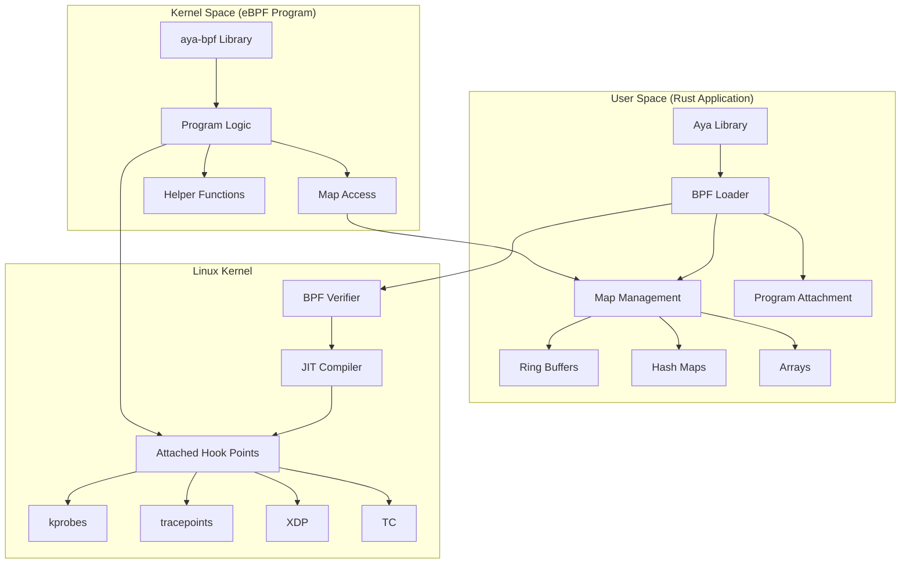
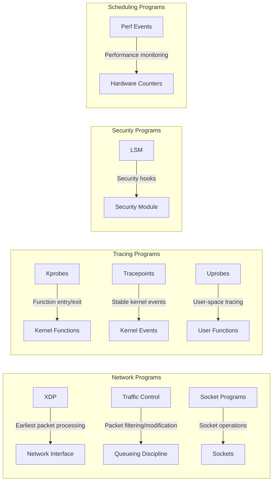
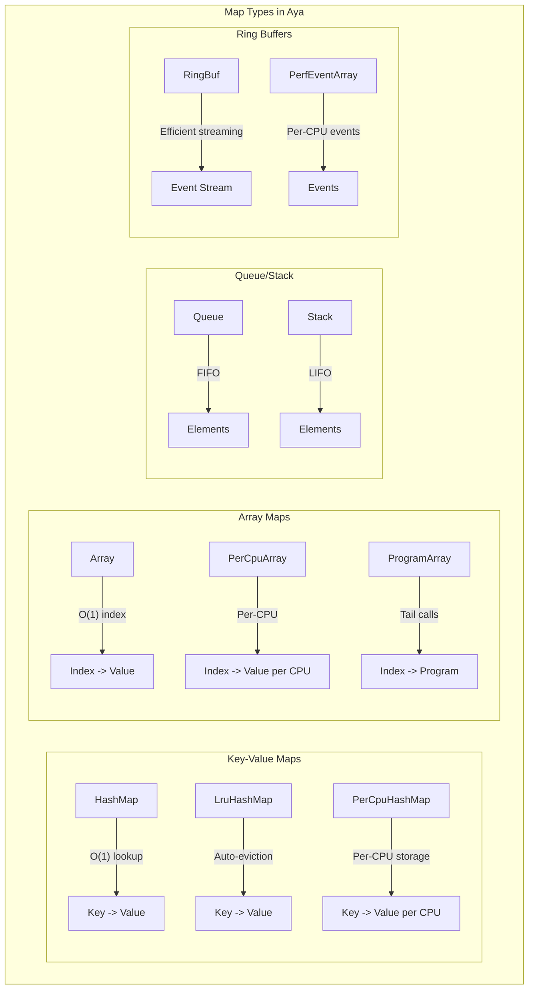

# How to Write eBPF Programs in Rust with Aya

Author: [nawazdhandala](https://github.com/nawazdhandala)

Tags: eBPF, Rust, Aya, Programming, Linux, Cloud Native

Description: A guide to developing eBPF programs in Rust using the Aya framework for safe, efficient code.

---

eBPF (extended Berkeley Packet Filter) has revolutionized how we interact with the Linux kernel, enabling powerful observability, networking, and security capabilities without modifying kernel source code. While C has traditionally been the language of choice for eBPF development, Rust's memory safety guarantees and modern tooling make it an increasingly attractive alternative. The Aya framework brings Rust's strengths to eBPF development, offering a pure-Rust experience for both kernel-space and user-space components.

In this comprehensive guide, we will explore how to write eBPF programs in Rust using Aya, from initial setup through advanced patterns including async integration and complex data structures.

## Understanding Aya's Architecture

Before diving into code, let us understand how Aya structures eBPF programs. Unlike traditional eBPF development where you might use different toolchains for kernel and user space, Aya provides a unified Rust experience.

The following diagram illustrates Aya's architecture and how kernel-space and user-space components interact:



## Setting Up Your Development Environment

Aya requires specific tooling to compile eBPF programs that target the BPF virtual machine. Let us set up the complete development environment.

### Installing Prerequisites

First, install the Rust toolchain with the nightly compiler and the BPF target. The nightly compiler is required because eBPF support uses unstable features:

```bash
# Install Rust with rustup if not already installed
curl --proto '=https' --tlsv1.2 -sSf https://sh.rustup.rs | sh

# Install the nightly toolchain - required for eBPF compilation
rustup install nightly

# Add the BPF target for compiling kernel-space code
rustup target add bpf --toolchain nightly

# Install bpf-linker - links eBPF object files
cargo install bpf-linker

# Install cargo-generate for project scaffolding
cargo install cargo-generate
```

### Installing System Dependencies

Your system needs certain packages for eBPF development. The following installs required tools for Debian/Ubuntu systems:

```bash
# Install LLVM and Clang - needed for BPF compilation
sudo apt-get update
sudo apt-get install -y llvm clang

# Install Linux headers - provides kernel data structures
sudo apt-get install -y linux-headers-$(uname -r)

# Install libbpf development files
sudo apt-get install -y libbpf-dev

# Install pkg-config for library discovery
sudo apt-get install -y pkg-config
```

### Creating a New Aya Project

Aya provides project templates that set up the correct structure for eBPF development:

```bash
# Generate a new Aya project using the official template
# This creates both kernel-space and user-space components
cargo generate https://github.com/aya-rs/aya-template
```

When prompted, enter your project name. The template creates a workspace with this structure:

```
my-ebpf-project/
├── Cargo.toml              # Workspace configuration
├── my-ebpf-project/        # User-space application
│   ├── Cargo.toml
│   └── src/
│       └── main.rs
├── my-ebpf-project-ebpf/   # Kernel-space eBPF programs
│   ├── Cargo.toml
│   └── src/
│       └── main.rs
└── my-ebpf-project-common/ # Shared data structures
    ├── Cargo.toml
    └── src/
        └── lib.rs
```

## Understanding eBPF Program Types

Aya supports various eBPF program types, each designed for specific use cases. The following diagram shows the program types and their attachment points:



## Writing Your First eBPF Program: XDP Packet Counter

Let us build an XDP program that counts incoming packets by IP protocol. This demonstrates the complete workflow from kernel code to user-space visualization.

### Kernel-Space Code

Create the eBPF program in the `-ebpf` crate. This code runs in kernel context:

```rust
// File: my-project-ebpf/src/main.rs
// This file contains the eBPF program that runs in kernel space.
// It must be compiled with the BPF target and cannot use std library.

// Disable standard library - eBPF programs run in restricted kernel environment
#![no_std]
// Disable Rust's entry point - eBPF has its own entry mechanism
#![no_main]

// Import Aya's eBPF library for kernel-space development
use aya_ebpf::{
    // bindings provides raw kernel structure definitions
    bindings::xdp_action,
    // macros provides procedural macros for program definition
    macros::{map, xdp},
    // maps provides eBPF map types for data storage
    maps::HashMap,
    // programs provides program context types
    programs::XdpContext,
};

// Import logging functionality for debugging
use aya_log_ebpf::info;

// Define a HashMap to store packet counts per protocol.
// Maps are the primary mechanism for eBPF programs to share data
// with user-space and persist state between program invocations.
// The #[map] attribute generates necessary BTF information.
#[map]
static PACKET_COUNT: HashMap<u8, u64> = HashMap::with_max_entries(256, 0);

// The #[xdp] attribute marks this function as an XDP program.
// XDP programs are attached to network interfaces and process
// every incoming packet at the earliest possible point.
#[xdp]
pub fn packet_counter(ctx: XdpContext) -> u32 {
    // Wrap the main logic in a helper function for cleaner error handling.
    // eBPF programs must always return a valid action code.
    match try_packet_counter(&ctx) {
        Ok(action) => action,
        // On error, pass the packet to the network stack normally
        Err(_) => xdp_action::XDP_PASS,
    }
}

// Helper function containing the main program logic.
// Returns Result to use the ? operator for cleaner error handling.
fn try_packet_counter(ctx: &XdpContext) -> Result<u32, ()> {
    // Get the start and end pointers of the packet data.
    // XDP provides direct access to packet memory for high performance.
    let data = ctx.data();
    let data_end = ctx.data_end();

    // Parse the Ethernet header (14 bytes).
    // We must validate all pointer arithmetic to pass the verifier.
    let eth_header_size = 14;

    // Safety check: ensure packet is large enough for Ethernet header.
    // The verifier requires explicit bounds checking before memory access.
    if data + eth_header_size > data_end {
        return Ok(xdp_action::XDP_PASS);
    }

    // Read the EtherType field to check if this is an IPv4 packet.
    // EtherType is at bytes 12-13 of the Ethernet header (big-endian).
    let ethertype_ptr = (data + 12) as *const u16;

    // Safety: we verified bounds above
    let ethertype = unsafe { *ethertype_ptr };

    // Check for IPv4 (0x0800 in network byte order)
    // Different architectures have different byte orders, so we compare directly
    if ethertype != 0x0008u16 {
        // Not IPv4, let it pass through
        return Ok(xdp_action::XDP_PASS);
    }

    // Parse the IP header to get the protocol field.
    // The protocol field is at byte 9 of the IP header.
    let ip_header_start = data + eth_header_size;
    let protocol_offset = 9;

    // Ensure we can read the protocol byte
    if ip_header_start + protocol_offset + 1 > data_end {
        return Ok(xdp_action::XDP_PASS);
    }

    // Read the protocol field (1 byte)
    let protocol_ptr = (ip_header_start + protocol_offset) as *const u8;
    let protocol = unsafe { *protocol_ptr };

    // Log the protocol for debugging (visible via aya-log in user-space)
    info!(ctx, "Received IPv4 packet with protocol: {}", protocol);

    // Update the packet counter for this protocol.
    // Use get_ptr_mut to get a mutable reference to the value.
    // This is an atomic operation from the eBPF program's perspective.
    if let Some(count) = unsafe { PACKET_COUNT.get_ptr_mut(&protocol) } {
        // Increment existing counter
        unsafe { *count += 1 };
    } else {
        // Initialize counter for new protocol
        // insert() may fail if map is full, but we ignore that case
        let _ = PACKET_COUNT.insert(&protocol, &1, 0);
    }

    // Return XDP_PASS to continue normal packet processing.
    // Other options include XDP_DROP, XDP_TX, and XDP_REDIRECT.
    Ok(xdp_action::XDP_PASS)
}

// Panic handler required for no_std environment.
// eBPF programs cannot panic, so this is just a placeholder.
#[panic_handler]
fn panic(_info: &core::panic::PanicInfo) -> ! {
    // Infinite loop as we cannot unwind in eBPF
    loop {}
}
```

### User-Space Code

Now create the user-space application that loads, attaches, and interacts with the eBPF program:

```rust
// File: my-project/src/main.rs
// This file contains the user-space application that manages the eBPF program.
// It handles loading, attaching, and reading data from the kernel program.

use anyhow::{Context, Result};
use aya::{
    // Ebpf is the main struct for managing eBPF programs
    Ebpf,
    // Include the compiled eBPF bytecode at compile time
    include_bytes_aligned,
    // Map types for accessing eBPF data structures
    maps::HashMap,
    // Program types and traits
    programs::{Xdp, XdpFlags},
};
use aya_log::EbpfLogger;
use clap::Parser;
use log::{info, warn};
use std::{
    collections::BTreeMap,
    time::Duration,
};
use tokio::{
    signal,
    time::interval,
};

// Command-line argument parsing using clap
#[derive(Debug, Parser)]
#[command(author, version, about, long_about = None)]
struct Args {
    /// Network interface to attach the XDP program to
    #[arg(short, long, default_value = "eth0")]
    interface: String,

    /// Polling interval in seconds for reading counters
    #[arg(short, long, default_value = "1")]
    poll_interval: u64,
}

// Protocol number to name mapping for human-readable output
fn protocol_name(proto: u8) -> &'static str {
    match proto {
        1 => "ICMP",
        6 => "TCP",
        17 => "UDP",
        47 => "GRE",
        50 => "ESP",
        51 => "AH",
        58 => "ICMPv6",
        _ => "Other",
    }
}

// Main async entry point using tokio runtime
#[tokio::main]
async fn main() -> Result<()> {
    // Parse command-line arguments
    let args = Args::parse();

    // Initialize logging with env_logger
    // Set RUST_LOG=info to see log messages
    env_logger::init();

    info!("Starting eBPF packet counter on interface {}", args.interface);

    // Load the compiled eBPF bytecode.
    // include_bytes_aligned! embeds the .o file at compile time.
    // The eBPF object file is generated during the build process.
    let mut ebpf = Ebpf::load(include_bytes_aligned!(
        "../../target/bpfel-unknown-none/release/my-project"
    ))?;

    // Initialize eBPF logging to forward kernel log messages.
    // This connects aya_log_ebpf::info! calls to user-space logging.
    if let Err(e) = EbpfLogger::init(&mut ebpf) {
        warn!("Failed to initialize eBPF logger: {}", e);
    }

    // Get a reference to the XDP program by name.
    // The name must match the function name in the eBPF code.
    let program: &mut Xdp = ebpf
        .program_mut("packet_counter")
        .context("Failed to find XDP program")?
        .try_into()
        .context("Program is not XDP type")?;

    // Load the program into the kernel.
    // This triggers the BPF verifier to validate the program.
    program.load().context("Failed to load XDP program")?;

    // Attach the program to the network interface.
    // XdpFlags::default() uses the best available mode (native if supported).
    // Other options include SKB_MODE for generic/slower processing.
    program
        .attach(&args.interface, XdpFlags::default())
        .context(format!("Failed to attach to interface {}", args.interface))?;

    info!("XDP program attached successfully");

    // Get a reference to the packet count map.
    // The map name must match the static variable name in eBPF code.
    let packet_count: HashMap<_, u8, u64> = HashMap::try_from(
        ebpf.map("PACKET_COUNT")
            .context("Failed to find PACKET_COUNT map")?,
    )?;

    // Create an interval timer for periodic stats display
    let mut poll_timer = interval(Duration::from_secs(args.poll_interval));

    // Main event loop - poll stats and handle shutdown signal
    info!("Monitoring packets... Press Ctrl+C to stop");

    loop {
        tokio::select! {
            // Handle Ctrl+C gracefully
            _ = signal::ctrl_c() => {
                info!("Received shutdown signal");
                break;
            }
            // Poll and display statistics periodically
            _ = poll_timer.tick() => {
                // Collect all counts into a sorted map for display
                let mut stats: BTreeMap<u8, u64> = BTreeMap::new();

                // Iterate over all entries in the eBPF map.
                // The iterator returns Result<(key, value), Error>.
                for result in packet_count.iter() {
                    if let Ok((protocol, count)) = result {
                        stats.insert(protocol, count);
                    }
                }

                // Display the current statistics
                if !stats.is_empty() {
                    println!("\n--- Packet Statistics ---");
                    for (protocol, count) in &stats {
                        println!(
                            "Protocol {:3} ({:8}): {} packets",
                            protocol,
                            protocol_name(*protocol),
                            count
                        );
                    }
                }
            }
        }
    }

    info!("Shutting down...");
    Ok(())
}
```

## Working with eBPF Maps

Maps are the primary mechanism for storing data and sharing it between eBPF programs and user-space. Aya supports many map types:



### Using Ring Buffers for Event Streaming

Ring buffers are ideal for streaming events from kernel to user space. Here is a complete example:

First, define shared data structures in the common crate:

```rust
// File: my-project-common/src/lib.rs
// Shared data structures between kernel and user space.
// This crate is compiled for both targets.

// Disable std for eBPF compatibility
#![no_std]

// Define an event structure for packet information.
// repr(C) ensures consistent memory layout across compilation targets.
// Clone and Copy allow efficient value semantics.
#[repr(C)]
#[derive(Clone, Copy, Debug)]
pub struct PacketEvent {
    /// Source IP address (network byte order)
    pub src_ip: u32,
    /// Destination IP address (network byte order)
    pub dst_ip: u32,
    /// IP protocol number (6=TCP, 17=UDP, etc.)
    pub protocol: u8,
    /// Packet size in bytes
    pub size: u32,
    /// Timestamp in nanoseconds (from bpf_ktime_get_ns)
    pub timestamp_ns: u64,
}

// Unsafe marker traits required for eBPF map value types.
// These indicate the type can safely be used in eBPF maps.
#[cfg(feature = "user")]
unsafe impl aya::Pod for PacketEvent {}
```

Now implement the kernel-space code using RingBuf:

```rust
// File: my-project-ebpf/src/main.rs
// Kernel-space eBPF program using ring buffer for event streaming

#![no_std]
#![no_main]

use aya_ebpf::{
    bindings::xdp_action,
    helpers::bpf_ktime_get_ns,
    macros::{map, xdp},
    maps::RingBuf,
    programs::XdpContext,
};
use my_project_common::PacketEvent;

// Ring buffer for sending events to user space.
// Size must be a power of 2 (here: 256KB).
// Ring buffers are more efficient than perf arrays for high-frequency events.
#[map]
static EVENTS: RingBuf = RingBuf::with_byte_size(256 * 1024, 0);

#[xdp]
pub fn packet_monitor(ctx: XdpContext) -> u32 {
    match try_packet_monitor(&ctx) {
        Ok(action) => action,
        Err(_) => xdp_action::XDP_PASS,
    }
}

fn try_packet_monitor(ctx: &XdpContext) -> Result<u32, ()> {
    let data = ctx.data();
    let data_end = ctx.data_end();

    // Parse Ethernet header
    let eth_hdr_size = 14;
    if data + eth_hdr_size > data_end {
        return Ok(xdp_action::XDP_PASS);
    }

    // Check for IPv4
    let ethertype = unsafe { *((data + 12) as *const u16) };
    if ethertype != 0x0008u16 {
        return Ok(xdp_action::XDP_PASS);
    }

    // Parse IPv4 header (minimum 20 bytes)
    let ip_hdr_start = data + eth_hdr_size;
    if ip_hdr_start + 20 > data_end {
        return Ok(xdp_action::XDP_PASS);
    }

    // Extract IP header fields.
    // IP header layout: version/IHL(1), TOS(1), length(2), ...
    // Source IP at offset 12, Dest IP at offset 16, Protocol at offset 9
    let src_ip = unsafe { *((ip_hdr_start + 12) as *const u32) };
    let dst_ip = unsafe { *((ip_hdr_start + 16) as *const u32) };
    let protocol = unsafe { *((ip_hdr_start + 9) as *const u8) };
    let total_length = u16::from_be(unsafe { *((ip_hdr_start + 2) as *const u16) });

    // Reserve space in the ring buffer for our event.
    // This returns None if the buffer is full (events dropped).
    if let Some(mut entry) = EVENTS.reserve::<PacketEvent>(0) {
        // Get current kernel time in nanoseconds
        let timestamp = unsafe { bpf_ktime_get_ns() };

        // Write the event data to the reserved buffer space.
        // entry.write() copies data into the ring buffer entry.
        entry.write(PacketEvent {
            src_ip,
            dst_ip,
            protocol,
            size: total_length as u32,
            timestamp_ns: timestamp,
        });

        // Submit the entry to make it visible to user space.
        // This is a memory barrier that ensures visibility.
        entry.submit(0);
    }
    // If reserve fails, we silently drop the event.
    // In production, you might increment a drop counter.

    Ok(xdp_action::XDP_PASS)
}

#[panic_handler]
fn panic(_info: &core::panic::PanicInfo) -> ! {
    loop {}
}
```

User-space code for consuming ring buffer events asynchronously:

```rust
// File: my-project/src/main.rs
// Async user-space application consuming ring buffer events

use anyhow::{Context, Result};
use aya::{Ebpf, include_bytes_aligned, maps::RingBuf, programs::{Xdp, XdpFlags}};
use bytes::BytesMut;
use log::info;
use my_project_common::PacketEvent;
use std::net::Ipv4Addr;
use tokio::signal;

#[tokio::main]
async fn main() -> Result<()> {
    env_logger::init();

    // Load and attach eBPF program
    let mut ebpf = Ebpf::load(include_bytes_aligned!(
        "../../target/bpfel-unknown-none/release/my-project"
    ))?;

    let program: &mut Xdp = ebpf
        .program_mut("packet_monitor")?
        .try_into()?;
    program.load()?;
    program.attach("eth0", XdpFlags::default())?;

    // Get the ring buffer map
    let mut ring_buf = RingBuf::try_from(ebpf.map_mut("EVENTS")?)?;

    info!("Monitoring packets with ring buffer...");

    // Create an async ring buffer for event-driven processing.
    // This uses epoll/io_uring internally for efficient waiting.
    let mut async_ring_buf = aya::maps::ring_buf::RingBufAsync::try_from(ring_buf)?;

    loop {
        tokio::select! {
            _ = signal::ctrl_c() => {
                info!("Shutting down...");
                break;
            }
            // Wait for and process events from the ring buffer.
            // next() returns when data is available or on error.
            result = async_ring_buf.next() => {
                if let Some(data) = result {
                    // Parse the event from raw bytes.
                    // The data layout matches our PacketEvent struct.
                    if data.len() >= std::mem::size_of::<PacketEvent>() {
                        let event: PacketEvent = unsafe {
                            std::ptr::read(data.as_ptr() as *const PacketEvent)
                        };

                        // Convert IP addresses from network byte order
                        let src = Ipv4Addr::from(u32::from_be(event.src_ip));
                        let dst = Ipv4Addr::from(u32::from_be(event.dst_ip));

                        println!(
                            "[{:.3}s] {} -> {} proto={} size={}",
                            event.timestamp_ns as f64 / 1_000_000_000.0,
                            src,
                            dst,
                            event.protocol,
                            event.size
                        );
                    }
                }
            }
        }
    }

    Ok(())
}
```

## Kprobes: Tracing Kernel Functions

Kprobes allow you to attach eBPF programs to almost any kernel function. This is powerful for observability and debugging:

```rust
// File: my-project-ebpf/src/main.rs
// Kprobe example: tracing TCP connection attempts

#![no_std]
#![no_main]

use aya_ebpf::{
    helpers::{bpf_get_current_pid_tgid, bpf_probe_read_kernel},
    macros::{kprobe, map},
    maps::{HashMap, RingBuf},
    programs::ProbeContext,
};
use aya_log_ebpf::info;

// Store information about TCP connection attempts
#[repr(C)]
#[derive(Clone, Copy)]
pub struct TcpConnectEvent {
    pub pid: u32,
    pub tgid: u32,
    pub daddr: u32,  // Destination address
    pub dport: u16,  // Destination port
}

#[map]
static EVENTS: RingBuf = RingBuf::with_byte_size(256 * 1024, 0);

// Attach to tcp_connect kernel function.
// This is called when a TCP connection is initiated.
// The function signature in the kernel is:
// int tcp_connect(struct sock *sk)
#[kprobe]
pub fn trace_tcp_connect(ctx: ProbeContext) -> u32 {
    match try_trace_tcp_connect(&ctx) {
        Ok(ret) => ret,
        Err(_) => 0,
    }
}

fn try_trace_tcp_connect(ctx: &ProbeContext) -> Result<u32, i64> {
    // Get current process ID and thread group ID.
    // The high 32 bits are TGID, low 32 bits are PID.
    let pid_tgid = bpf_get_current_pid_tgid();
    let pid = pid_tgid as u32;
    let tgid = (pid_tgid >> 32) as u32;

    // Read the first argument (struct sock *sk).
    // PT_REGS_PARM1 accesses the first function parameter.
    // The actual macro/method depends on architecture.
    let sock: *const core::ffi::c_void = ctx.arg(0).ok_or(1i64)?;

    // Read destination address from sock structure.
    // Offsets are kernel-version dependent - using BTF is preferred.
    // These are example offsets for a specific kernel version.
    // In production, use aya's BTF support for portability.

    // For this example, we'll just log that we saw a connection attempt
    info!(ctx, "TCP connect from PID {} TGID {}", pid, tgid);

    if let Some(mut entry) = EVENTS.reserve::<TcpConnectEvent>(0) {
        entry.write(TcpConnectEvent {
            pid,
            tgid,
            daddr: 0,  // Would read from sock structure
            dport: 0,  // Would read from sock structure
        });
        entry.submit(0);
    }

    Ok(0)
}

#[panic_handler]
fn panic(_info: &core::panic::PanicInfo) -> ! {
    loop {}
}
```

User-space code for loading and attaching kprobes:

```rust
// File: my-project/src/main.rs
// User-space for kprobe-based tracing

use anyhow::{Context, Result};
use aya::{
    Ebpf,
    include_bytes_aligned,
    programs::KProbe,
};
use aya_log::EbpfLogger;
use log::info;
use tokio::signal;

#[tokio::main]
async fn main() -> Result<()> {
    env_logger::init();

    let mut ebpf = Ebpf::load(include_bytes_aligned!(
        "../../target/bpfel-unknown-none/release/my-project"
    ))?;

    // Initialize logging
    if let Err(e) = EbpfLogger::init(&mut ebpf) {
        log::warn!("Failed to init eBPF logger: {}", e);
    }

    // Get and load the kprobe program
    let program: &mut KProbe = ebpf
        .program_mut("trace_tcp_connect")
        .context("Program not found")?
        .try_into()?;

    program.load()?;

    // Attach to the tcp_connect kernel function.
    // The function name must match exactly.
    program.attach("tcp_connect", 0)?;

    info!("Tracing TCP connections... Press Ctrl+C to stop");

    // Wait for shutdown signal
    signal::ctrl_c().await?;

    info!("Shutting down");
    Ok(())
}
```

## Tracepoints: Stable Kernel Events

Tracepoints provide a stable API for tracing kernel events, unlike kprobes which depend on function signatures:

```rust
// File: my-project-ebpf/src/main.rs
// Tracepoint example: monitoring process execution

#![no_std]
#![no_main]

use aya_ebpf::{
    cty::c_long,
    helpers::{bpf_get_current_comm, bpf_get_current_pid_tgid},
    macros::{map, tracepoint},
    maps::RingBuf,
    programs::TracePointContext,
};

// Event structure for process execution
#[repr(C)]
#[derive(Clone, Copy)]
pub struct ExecEvent {
    pub pid: u32,
    pub ppid: u32,
    pub comm: [u8; 16],  // Command name (TASK_COMM_LEN)
}

#[map]
static EXEC_EVENTS: RingBuf = RingBuf::with_byte_size(256 * 1024, 0);

// Attach to the sched_process_exec tracepoint.
// This fires whenever a process calls exec().
// Tracepoints are more stable than kprobes across kernel versions.
#[tracepoint]
pub fn trace_exec(ctx: TracePointContext) -> u32 {
    match try_trace_exec(&ctx) {
        Ok(ret) => ret,
        Err(_) => 0,
    }
}

fn try_trace_exec(ctx: &TracePointContext) -> Result<u32, c_long> {
    // Get process IDs
    let pid_tgid = bpf_get_current_pid_tgid();
    let pid = pid_tgid as u32;

    // Get the command name of the current process.
    // Returns up to 16 characters (TASK_COMM_LEN).
    let mut comm = [0u8; 16];
    bpf_get_current_comm(&mut comm)?;

    // Submit event to ring buffer
    if let Some(mut entry) = EXEC_EVENTS.reserve::<ExecEvent>(0) {
        entry.write(ExecEvent {
            pid,
            ppid: 0,  // Would need to read from task_struct
            comm,
        });
        entry.submit(0);
    }

    Ok(0)
}

#[panic_handler]
fn panic(_info: &core::panic::PanicInfo) -> ! {
    loop {}
}
```

User-space attachment for tracepoints:

```rust
// File: my-project/src/main.rs
// User-space for tracepoint-based process monitoring

use anyhow::Result;
use aya::{Ebpf, include_bytes_aligned, programs::TracePoint};
use log::info;
use tokio::signal;

#[tokio::main]
async fn main() -> Result<()> {
    env_logger::init();

    let mut ebpf = Ebpf::load(include_bytes_aligned!(
        "../../target/bpfel-unknown-none/release/my-project"
    ))?;

    // Get and load the tracepoint program
    let program: &mut TracePoint = ebpf
        .program_mut("trace_exec")?
        .try_into()?;

    program.load()?;

    // Attach to the tracepoint.
    // Format: category/name - found in /sys/kernel/debug/tracing/events/
    program.attach("sched", "sched_process_exec")?;

    info!("Monitoring process execution...");

    signal::ctrl_c().await?;
    Ok(())
}
```

## Async Rust Integration Patterns

Aya integrates seamlessly with async Rust. Here is a comprehensive example showing multiple concurrent operations:

```rust
// File: my-project/src/main.rs
// Advanced async pattern with multiple data sources

use anyhow::Result;
use aya::{
    Ebpf,
    include_bytes_aligned,
    maps::{HashMap, RingBuf},
    programs::{Xdp, XdpFlags},
};
use futures::stream::StreamExt;
use log::{error, info};
use std::{sync::Arc, time::Duration};
use tokio::{
    signal,
    sync::{broadcast, mpsc},
    task::JoinSet,
    time::interval,
};

// Message types for internal communication
#[derive(Clone, Debug)]
enum Command {
    GetStats,
    Reset,
    Shutdown,
}

#[derive(Debug)]
struct Stats {
    total_packets: u64,
    protocols: Vec<(u8, u64)>,
}

#[tokio::main]
async fn main() -> Result<()> {
    env_logger::init();

    // Load eBPF program
    let mut ebpf = Ebpf::load(include_bytes_aligned!(
        "../../target/bpfel-unknown-none/release/my-project"
    ))?;

    // Attach XDP program
    let program: &mut Xdp = ebpf.program_mut("packet_counter")?.try_into()?;
    program.load()?;
    program.attach("eth0", XdpFlags::default())?;

    // Create channels for async communication
    let (shutdown_tx, _) = broadcast::channel::<()>(1);
    let (stats_tx, mut stats_rx) = mpsc::channel::<Stats>(100);

    // Spawn multiple concurrent tasks
    let mut tasks = JoinSet::new();

    // Task 1: Periodic stats collection
    // This task reads from eBPF maps at regular intervals
    let shutdown_rx1 = shutdown_tx.subscribe();
    let packet_count = HashMap::<_, u8, u64>::try_from(
        ebpf.map("PACKET_COUNT")?
    )?;
    let stats_tx_clone = stats_tx.clone();

    tasks.spawn(async move {
        collect_stats_task(packet_count, stats_tx_clone, shutdown_rx1).await
    });

    // Task 2: Stats aggregation and display
    // This task processes stats and displays them
    let shutdown_rx2 = shutdown_tx.subscribe();
    tasks.spawn(async move {
        display_stats_task(stats_rx, shutdown_rx2).await
    });

    // Task 3: Ring buffer event processing (if using ring buffers)
    // Demonstrates async ring buffer consumption

    // Main loop: wait for shutdown
    info!("System running. Press Ctrl+C to stop.");

    signal::ctrl_c().await?;
    info!("Shutdown signal received");

    // Signal all tasks to stop
    let _ = shutdown_tx.send(());

    // Wait for all tasks to complete
    while let Some(result) = tasks.join_next().await {
        if let Err(e) = result {
            error!("Task error: {}", e);
        }
    }

    info!("Clean shutdown complete");
    Ok(())
}

// Async task for collecting stats from eBPF maps
async fn collect_stats_task(
    packet_count: HashMap<&aya::maps::MapData, u8, u64>,
    stats_tx: mpsc::Sender<Stats>,
    mut shutdown_rx: broadcast::Receiver<()>,
) -> Result<()> {
    let mut timer = interval(Duration::from_secs(1));

    loop {
        tokio::select! {
            // Check for shutdown signal
            _ = shutdown_rx.recv() => {
                info!("Stats collector shutting down");
                break;
            }
            // Collect stats on timer tick
            _ = timer.tick() => {
                let mut total = 0u64;
                let mut protocols = Vec::new();

                // Iterate over the eBPF map
                for result in packet_count.iter() {
                    if let Ok((proto, count)) = result {
                        total += count;
                        protocols.push((proto, count));
                    }
                }

                // Sort by count descending
                protocols.sort_by(|a, b| b.1.cmp(&a.1));

                // Send stats to display task
                let _ = stats_tx.send(Stats {
                    total_packets: total,
                    protocols,
                }).await;
            }
        }
    }

    Ok(())
}

// Async task for displaying stats
async fn display_stats_task(
    mut stats_rx: mpsc::Receiver<Stats>,
    mut shutdown_rx: broadcast::Receiver<()>,
) -> Result<()> {
    loop {
        tokio::select! {
            _ = shutdown_rx.recv() => {
                info!("Display task shutting down");
                break;
            }
            Some(stats) = stats_rx.recv() => {
                println!("\n=== Packet Statistics ===");
                println!("Total packets: {}", stats.total_packets);
                println!("By protocol:");
                for (proto, count) in stats.protocols.iter().take(5) {
                    println!("  Protocol {:3}: {} packets", proto, count);
                }
            }
        }
    }

    Ok(())
}
```

## Building and Running

The build process requires compiling for two different targets. Here is the complete workflow:

```bash
# Navigate to project root
cd my-ebpf-project

# Build the eBPF program first (requires nightly and bpf target)
# This compiles the kernel-space code to BPF bytecode
cargo +nightly build \
    --package my-project-ebpf \
    --target bpfel-unknown-none \
    --release

# Build the user-space application
# This compiles the host application that loads and manages the eBPF program
cargo build --package my-project --release

# Run with elevated privileges (required for loading eBPF)
# Set RUST_LOG for visibility into logging
sudo RUST_LOG=info ./target/release/my-project --interface eth0
```

For development, you can use a Makefile or cargo-xtask:

```makefile
# Makefile for eBPF project

.PHONY: build-ebpf build run clean

# Build the eBPF program
build-ebpf:
	cargo +nightly build \
		--package my-project-ebpf \
		--target bpfel-unknown-none \
		--release

# Build everything
build: build-ebpf
	cargo build --package my-project --release

# Run with sudo
run: build
	sudo RUST_LOG=info ./target/release/my-project

# Clean build artifacts
clean:
	cargo clean
```

## Error Handling and Debugging

Proper error handling is crucial for eBPF development. Here are patterns for handling common issues:

```rust
// User-space error handling patterns
use anyhow::{bail, Context, Result};
use aya::programs::ProgramError;
use thiserror::Error;

// Custom error types for better diagnostics
#[derive(Error, Debug)]
pub enum EbpfError {
    #[error("Program verification failed: {0}")]
    VerificationFailed(String),

    #[error("Failed to attach to {interface}: {reason}")]
    AttachFailed {
        interface: String,
        reason: String,
    },

    #[error("Map operation failed: {0}")]
    MapError(String),

    #[error("Permission denied - run with sudo")]
    PermissionDenied,
}

// Helper function for loading with detailed error messages
fn load_ebpf_program(interface: &str) -> Result<Ebpf> {
    // Check for root privileges
    if !nix::unistd::geteuid().is_root() {
        bail!(EbpfError::PermissionDenied);
    }

    // Load the eBPF bytecode with context
    let mut ebpf = Ebpf::load(include_bytes_aligned!(
        "../../target/bpfel-unknown-none/release/my-project"
    )).context("Failed to load eBPF bytecode - check compilation")?;

    // Get and configure the program
    let program: &mut Xdp = ebpf
        .program_mut("packet_counter")
        .context("Program 'packet_counter' not found in object file")?
        .try_into()
        .context("Program is not XDP type")?;

    // Load triggers the verifier
    program.load().map_err(|e| {
        // Provide detailed error for verification failures
        match &e {
            ProgramError::LoadError { verifier_log, .. } => {
                eprintln!("Verifier log:\n{}", verifier_log);
            }
            _ => {}
        }
        e
    }).context("Program verification failed")?;

    // Attach with detailed error
    program.attach(interface, XdpFlags::default()).map_err(|e| {
        EbpfError::AttachFailed {
            interface: interface.to_string(),
            reason: e.to_string(),
        }
    })?;

    Ok(ebpf)
}
```

For kernel-space debugging, use aya-log effectively:

```rust
// Kernel-space logging for debugging
use aya_log_ebpf::{debug, error, info, warn};

fn some_ebpf_function(ctx: &XdpContext) -> Result<u32, ()> {
    // Different log levels for different scenarios
    debug!(ctx, "Entering function with data_end={}", ctx.data_end());

    // Log values for debugging packet parsing
    let protocol = 6u8;
    info!(ctx, "Processing protocol {}", protocol);

    // Warn about unexpected conditions
    if something_unexpected {
        warn!(ctx, "Unexpected packet size: {}", size);
    }

    // Error conditions
    if critical_error {
        error!(ctx, "Critical: verification failed");
        return Err(());
    }

    Ok(xdp_action::XDP_PASS)
}
```

## Best Practices

When developing eBPF programs with Aya, follow these best practices:

### Memory Safety

```rust
// GOOD: Always validate pointer arithmetic before access
fn safe_read(ctx: &XdpContext) -> Result<u32, ()> {
    let data = ctx.data();
    let data_end = ctx.data_end();

    // Validate bounds BEFORE any access
    if data + 14 > data_end {
        return Err(());
    }

    // Now safe to read
    let value = unsafe { *(data as *const u32) };
    Ok(value)
}

// BAD: This will fail verifier - accessing without bounds check
fn unsafe_read(ctx: &XdpContext) -> u32 {
    unsafe { *(ctx.data() as *const u32) }  // Verifier rejects this!
}
```

### Map Operations

```rust
// GOOD: Handle map operation failures gracefully
fn update_counter(map: &HashMap<u32, u64>, key: u32) {
    match unsafe { map.get_ptr_mut(&key) } {
        Some(ptr) => {
            // Key exists, update in place
            unsafe { *ptr += 1 };
        }
        None => {
            // Key doesn't exist, insert new entry
            // insert can fail if map is full
            let _ = map.insert(&key, &1, 0);
        }
    }
}

// Use Per-CPU maps for high-frequency counters to avoid contention
#[map]
static COUNTERS: PerCpuArray<u64> = PerCpuArray::with_max_entries(1, 0);
```

### Program Size

```rust
// Keep eBPF programs small - they have size limits and verification complexity
// Split large programs into smaller functions

// GOOD: Small, focused helper functions
#[inline(always)]  // Inline hint for the compiler
fn parse_eth_header(ctx: &XdpContext) -> Result<u16, ()> {
    // Parse just the Ethernet header
    // ...
}

#[inline(always)]
fn parse_ip_header(ctx: &XdpContext, offset: usize) -> Result<IpInfo, ()> {
    // Parse just the IP header
    // ...
}

// Main program composes helpers
#[xdp]
pub fn main_program(ctx: XdpContext) -> u32 {
    let ethertype = parse_eth_header(&ctx).unwrap_or(0);
    if ethertype == ETH_P_IP {
        let ip_info = parse_ip_header(&ctx, 14).unwrap_or_default();
        // ...
    }
    xdp_action::XDP_PASS
}
```

## Complete Project Structure

Here is the recommended project structure for a production Aya project:

```
my-ebpf-project/
├── Cargo.toml                    # Workspace configuration
├── Makefile                      # Build automation
├── README.md                     # Project documentation
│
├── my-project/                   # User-space application
│   ├── Cargo.toml
│   └── src/
│       ├── main.rs              # Entry point
│       ├── lib.rs               # Library code
│       ├── config.rs            # Configuration handling
│       ├── handlers/            # Event handlers
│       │   ├── mod.rs
│       │   └── packet.rs
│       └── output/              # Output formatters
│           ├── mod.rs
│           ├── json.rs
│           └── prometheus.rs
│
├── my-project-ebpf/             # Kernel-space eBPF programs
│   ├── Cargo.toml
│   └── src/
│       ├── main.rs              # Program entry points
│       ├── xdp.rs               # XDP programs
│       ├── kprobe.rs            # Kprobe programs
│       └── tracepoint.rs        # Tracepoint programs
│
├── my-project-common/           # Shared code
│   ├── Cargo.toml
│   └── src/
│       ├── lib.rs
│       └── events.rs            # Event structures
│
└── xtask/                       # Build tooling (cargo-xtask)
    ├── Cargo.toml
    └── src/
        └── main.rs
```

## Summary

Developing eBPF programs in Rust with Aya provides significant advantages:

1. **Memory Safety**: Rust's ownership model prevents many common bugs
2. **Unified Toolchain**: Same language for kernel and user space
3. **Async Support**: Native integration with Tokio and async Rust
4. **Type Safety**: Shared types between kernel and user space
5. **Modern Tooling**: Cargo, rust-analyzer, and familiar Rust ecosystem

Key takeaways from this guide:

- Set up the development environment with nightly Rust and BPF target
- Understand the three-crate structure: eBPF, user-space, and common
- Use appropriate program types (XDP, kprobe, tracepoint) for your use case
- Leverage maps for kernel-user communication
- Integrate with async Rust for efficient event processing
- Follow best practices for verifier-friendly code

Aya continues to evolve with the Rust and eBPF ecosystems, making it an excellent choice for building production-grade observability, networking, and security tools. The combination of Rust's safety guarantees and eBPF's power creates a compelling platform for systems programming.

For more information, consult the official Aya documentation at https://aya-rs.dev and explore the example programs in the Aya repository.
