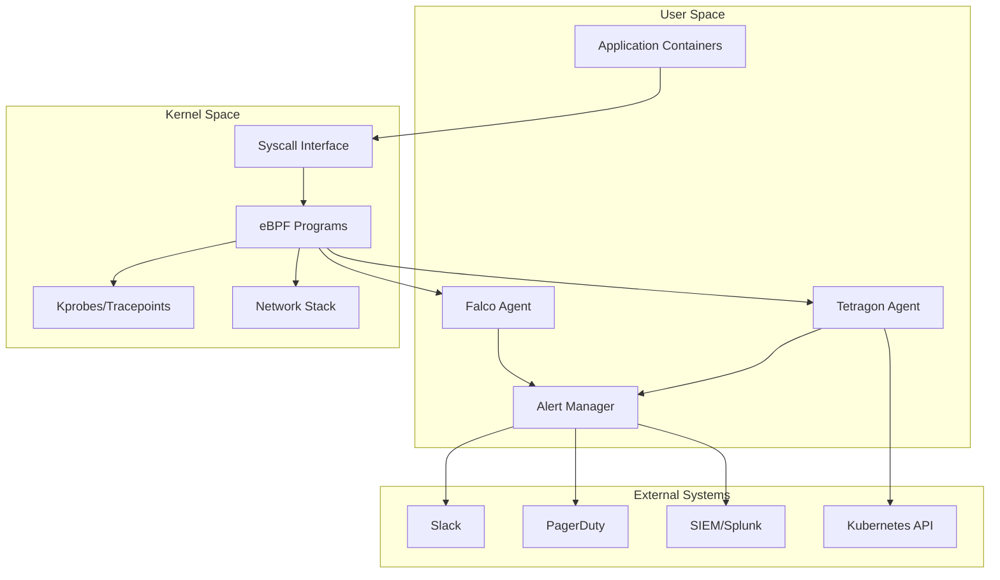
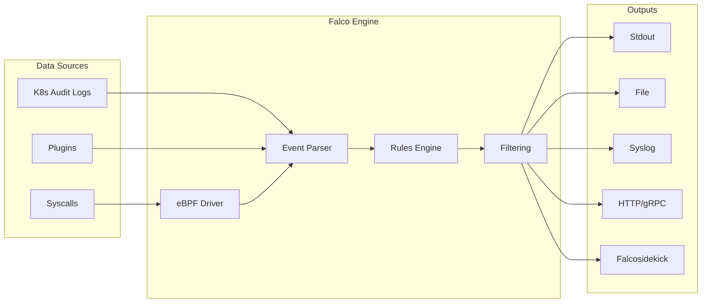
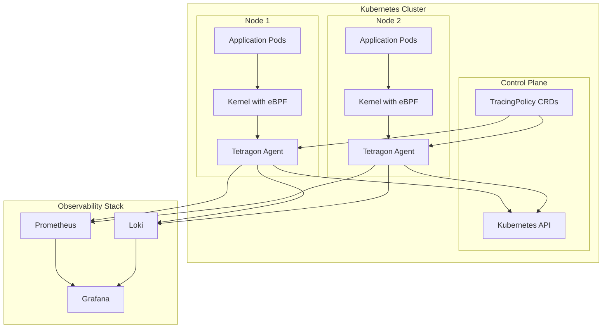
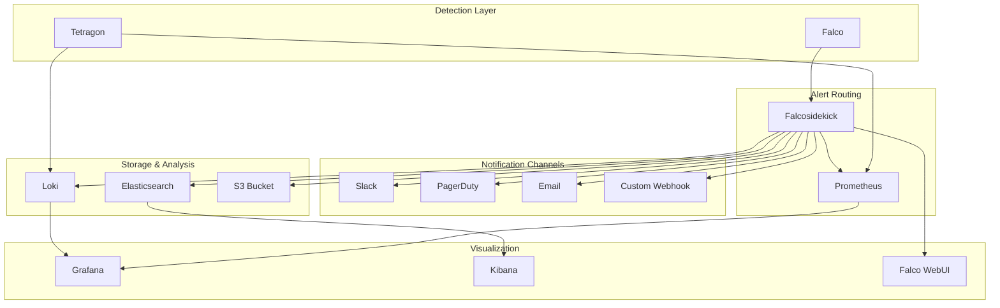
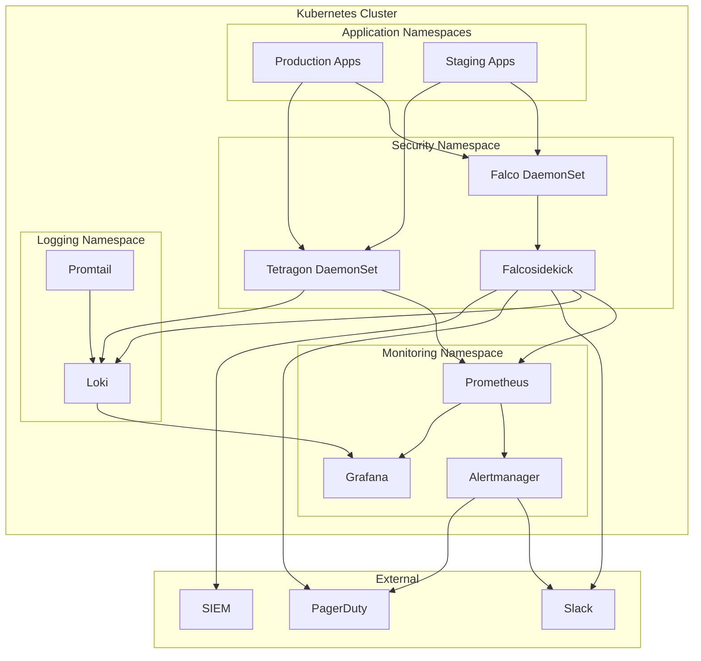

# How to Implement Security Monitoring with eBPF (Falco, Tetragon)

Author: [nawazdhandala](https://github.com/nawazdhandala)

Tags: eBPF, Security, Falco, Tetragon, Kubernetes, Linux

Description: A guide to using eBPF-based security tools like Falco and Tetragon for runtime security monitoring.

---

## Introduction

Runtime security monitoring is essential for detecting and responding to threats in modern cloud-native environments. Traditional security tools often struggle with the dynamic nature of containers and Kubernetes, leading to blind spots in security coverage. eBPF (extended Berkeley Packet Filter) has emerged as a powerful technology for implementing low-overhead, high-performance security monitoring directly in the Linux kernel.

This guide covers two leading eBPF-based security tools:
- **Falco**: An open-source runtime security tool that monitors system calls and container behavior
- **Tetragon**: A Kubernetes-aware security observability and runtime enforcement tool from Cilium

By the end of this guide, you will understand how to deploy these tools, write custom security rules, monitor syscalls, and integrate alerting for comprehensive runtime security.

## Understanding eBPF Security Monitoring

Before diving into the tools, let us understand why eBPF is ideal for security monitoring.

### What is eBPF?

eBPF allows you to run sandboxed programs in the Linux kernel without modifying kernel source code or loading kernel modules. For security monitoring, this means:

- **Zero kernel modifications**: No need to patch or recompile the kernel
- **Low overhead**: Minimal performance impact compared to traditional security tools
- **Deep visibility**: Access to syscalls, network events, and file operations
- **Real-time detection**: Immediate visibility into security-relevant events

### Security Monitoring Architecture

The following diagram shows how eBPF-based security monitoring fits into your infrastructure:



## Part 1: Falco Installation and Configuration

Falco is the CNCF's runtime security project that uses eBPF to monitor system calls and detect anomalous behavior.

### Installing Falco on Linux

The following script installs Falco on a Linux system using the official package repository. This method ensures you get the latest stable release with automatic updates.

```bash
# Add the Falco GPG key for package verification
# This ensures packages are authentic and haven't been tampered with
curl -fsSL https://falco.org/repo/falcosecurity-packages.asc | \
  sudo gpg --dearmor -o /usr/share/keyrings/falco-archive-keyring.gpg

# Add the Falco repository to your system's package sources
# The signed-by option ensures only properly signed packages are accepted
echo "deb [signed-by=/usr/share/keyrings/falco-archive-keyring.gpg] \
  https://download.falco.org/packages/deb stable main" | \
  sudo tee /etc/apt/sources.list.d/falcosecurity.list

# Update package lists and install Falco
# The dialog package is needed for kernel module selection during installation
sudo apt-get update
sudo apt-get install -y dialog falco

# Enable and start the Falco service
# This ensures Falco starts automatically on system boot
sudo systemctl enable falco
sudo systemctl start falco

# Verify Falco is running correctly
# You should see "active (running)" in the output
sudo systemctl status falco
```

### Installing Falco on Kubernetes with Helm

For Kubernetes deployments, Helm provides the easiest installation method. The following commands deploy Falco as a DaemonSet to ensure it runs on every node.

```bash
# Add the Falco Helm repository
# This repository contains the official Falco charts
helm repo add falcosecurity https://falcosecurity.github.io/charts
helm repo update

# Create a dedicated namespace for security monitoring
# Isolating security tools in their own namespace is a best practice
kubectl create namespace falco

# Install Falco with modern eBPF driver and JSON output enabled
# The modern_bpf driver uses CO-RE (Compile Once, Run Everywhere) for better compatibility
helm install falco falcosecurity/falco \
  --namespace falco \
  --set driver.kind=modern_bpf \
  --set falcosidekick.enabled=true \
  --set falcosidekick.webui.enabled=true \
  --set collectors.kubernetes.enabled=true \
  --set json_output=true
```

### Understanding Falco Architecture

The following diagram illustrates how Falco processes security events:



### Writing Custom Falco Rules

Falco rules define the security behaviors you want to detect. Rules consist of three main components: lists, macros, and rules.

Create a custom rules file with the following security-focused rules:

```yaml
# custom_rules.yaml
# This file defines custom Falco rules for enhanced security monitoring
# Save to /etc/falco/rules.d/custom_rules.yaml

# Lists define reusable collections of values
# Use lists to group related items for easier rule maintenance
- list: sensitive_file_paths
  items: [/etc/shadow, /etc/passwd, /etc/sudoers, /root/.ssh]

- list: suspicious_binaries
  items: [nc, netcat, ncat, nmap, socat, tcpdump, wireshark]

- list: crypto_mining_binaries
  items: [xmrig, minerd, cpuminer, cgminer, bfgminer, ethminer]

# Macros are reusable condition snippets
# They simplify complex rules by encapsulating common patterns
- macro: container
  condition: container.id != host

- macro: sensitive_files
  condition: fd.name in (sensitive_file_paths)

- macro: outbound_connection
  condition: >
    (evt.type = connect and evt.dir = < and
     fd.typechar = 4 and fd.ip != "0.0.0.0")

# Rule: Detect reads of sensitive files
# Priority: WARNING because reading these files might be legitimate
# but warrants investigation
- rule: Read Sensitive File
  desc: Detect any attempt to read sensitive system files
  condition: >
    sensitive_files and
    open_read and
    container and
    not proc.name in (allowed_sensitive_file_readers)
  output: >
    Sensitive file opened for reading
    (file=%fd.name user=%user.name user_uid=%user.uid
    command=%proc.cmdline container_id=%container.id
    container_name=%container.name image=%container.image.repository)
  priority: WARNING
  tags: [filesystem, security, sensitive_data]

# List of processes allowed to read sensitive files
# Customize based on your application requirements
- list: allowed_sensitive_file_readers
  items: [sshd, sudo, su, passwd, login, pam]

# Rule: Detect cryptocurrency mining
# Priority: CRITICAL because crypto miners consume resources and indicate compromise
- rule: Detect Crypto Mining Binary
  desc: Detect execution of known cryptocurrency mining binaries
  condition: >
    spawned_process and
    proc.name in (crypto_mining_binaries)
  output: >
    Cryptocurrency mining binary detected
    (process=%proc.name command=%proc.cmdline
    user=%user.name container_id=%container.id
    container_name=%container.name image=%container.image.repository)
  priority: CRITICAL
  tags: [cryptomining, malware, security]

# Rule: Detect reverse shell connections
# Priority: CRITICAL because reverse shells indicate active exploitation
- rule: Reverse Shell Detected
  desc: Detect potential reverse shell activity
  condition: >
    spawned_process and
    proc.name in (shell_binaries) and
    proc.cmdline contains "-i" and
    (proc.cmdline contains "/dev/tcp" or
     proc.cmdline contains "bash -c" or
     proc.cmdline contains "exec ")
  output: >
    Possible reverse shell detected
    (process=%proc.name command=%proc.cmdline
    parent=%proc.pname user=%user.name
    container_id=%container.id container_name=%container.name)
  priority: CRITICAL
  tags: [shell, reverse_shell, network, security]

# List of common shell binaries
- list: shell_binaries
  items: [bash, sh, zsh, ksh, csh, fish, dash]

# Rule: Detect container escape attempts
# Priority: CRITICAL because container escapes compromise host security
- rule: Container Escape Attempt via nsenter
  desc: Detect attempts to escape container using nsenter
  condition: >
    spawned_process and
    proc.name = nsenter and
    container
  output: >
    Container escape attempt via nsenter detected
    (command=%proc.cmdline user=%user.name
    container_id=%container.id container_name=%container.name
    image=%container.image.repository)
  priority: CRITICAL
  tags: [container, escape, security]

# Rule: Detect privileged container execution
# Priority: WARNING because privileged containers have elevated access
- rule: Privileged Container Started
  desc: Detect when a privileged container is started
  condition: >
    container_started and
    container.privileged = true
  output: >
    Privileged container started
    (container_id=%container.id container_name=%container.name
    image=%container.image.repository)
  priority: WARNING
  tags: [container, privileged, security]

# Rule: Detect modification of system binaries
# Priority: CRITICAL because modifying system binaries indicates rootkit installation
- rule: System Binary Modification
  desc: Detect modification of critical system binaries
  condition: >
    open_write and
    fd.directory in (/bin, /sbin, /usr/bin, /usr/sbin) and
    not proc.name in (package_mgmt_binaries)
  output: >
    System binary modification detected
    (file=%fd.name process=%proc.name command=%proc.cmdline
    user=%user.name container_id=%container.id)
  priority: CRITICAL
  tags: [filesystem, integrity, security]

# List of legitimate package management binaries
- list: package_mgmt_binaries
  items: [apt, apt-get, dpkg, yum, rpm, dnf, pacman, apk]
```

### Validating and Loading Custom Rules

After creating custom rules, validate them before deployment:

```bash
# Validate the custom rules file for syntax errors
# The --validate flag checks rules without starting Falco
sudo falco --validate /etc/falco/rules.d/custom_rules.yaml

# Test rules against a sample event log (if available)
# This helps verify rules trigger as expected
sudo falco -r /etc/falco/rules.d/custom_rules.yaml --dry-run

# Restart Falco to load the new rules
# The service will automatically load all rules from rules.d
sudo systemctl restart falco

# Verify rules are loaded by checking the Falco logs
# Look for messages about loaded rules and any warnings
sudo journalctl -u falco -n 50 --no-pager
```

### Monitoring Specific Syscalls

Falco can monitor specific system calls for deep security visibility. The following rules focus on syscall-level monitoring:

```yaml
# syscall_monitoring.yaml
# Advanced syscall monitoring rules for security detection
# Save to /etc/falco/rules.d/syscall_monitoring.yaml

# Rule: Detect ptrace-based process injection
# ptrace allows one process to control another - commonly used in attacks
- rule: PTRACE Detected
  desc: Detect use of ptrace for process injection or debugging
  condition: >
    evt.type = ptrace and
    evt.dir = < and
    not proc.name in (allowed_ptrace_tools)
  output: >
    PTRACE detected - possible process injection
    (process=%proc.name target_pid=%evt.arg.pid
    ptrace_request=%evt.arg.request user=%user.name
    container_id=%container.id)
  priority: WARNING
  tags: [syscall, ptrace, injection, security]

# Legitimate tools that use ptrace
- list: allowed_ptrace_tools
  items: [strace, ltrace, gdb, lldb, perf]

# Rule: Detect kernel module loading
# Loading kernel modules can be used to install rootkits
- rule: Kernel Module Loaded
  desc: Detect loading of kernel modules
  condition: >
    evt.type in (init_module, finit_module) and
    evt.dir = <
  output: >
    Kernel module loaded
    (module=%evt.arg.name process=%proc.name
    user=%user.name command=%proc.cmdline)
  priority: WARNING
  tags: [syscall, kernel, module, security]

# Rule: Detect memory execution (memfd_create)
# memfd_create can be used for fileless malware execution
- rule: Memory File Created for Execution
  desc: Detect creation of memory-backed files that may be used for fileless malware
  condition: >
    evt.type = memfd_create and
    evt.dir = <
  output: >
    Memory file created - possible fileless malware
    (memfd_name=%evt.arg.name process=%proc.name
    command=%proc.cmdline user=%user.name
    container_id=%container.id)
  priority: WARNING
  tags: [syscall, memory, fileless, malware]

# Rule: Detect process hollowing via execveat
# execveat with AT_EMPTY_PATH can execute from memory
- rule: Execveat with Memory Execution
  desc: Detect execveat syscall with empty path - possible process hollowing
  condition: >
    evt.type = execveat and
    evt.dir = < and
    evt.arg.flags contains AT_EMPTY_PATH
  output: >
    Execveat with memory execution detected
    (process=%proc.name fd=%evt.arg.fd flags=%evt.arg.flags
    user=%user.name container_id=%container.id)
  priority: CRITICAL
  tags: [syscall, execution, hollowing, security]

# Rule: Detect setuid/setgid changes
# Privilege escalation often involves changing user/group IDs
- rule: Privilege Escalation via Setuid
  desc: Detect processes changing their effective UID to root
  condition: >
    evt.type in (setuid, setreuid, setresuid) and
    evt.dir = < and
    evt.arg.uid = 0 and
    user.uid != 0
  output: >
    Privilege escalation detected via setuid
    (process=%proc.name original_uid=%user.uid
    new_uid=%evt.arg.uid command=%proc.cmdline
    container_id=%container.id)
  priority: CRITICAL
  tags: [syscall, privilege_escalation, security]

# Rule: Detect suspicious socket operations
# Creating raw sockets requires special privileges and may indicate network attacks
- rule: Raw Socket Created
  desc: Detect creation of raw network sockets
  condition: >
    evt.type = socket and
    evt.dir = < and
    evt.arg.type = SOCK_RAW and
    not proc.name in (allowed_raw_socket_binaries)
  output: >
    Raw socket created
    (process=%proc.name protocol=%evt.arg.protocol
    user=%user.name command=%proc.cmdline
    container_id=%container.id)
  priority: WARNING
  tags: [syscall, network, raw_socket, security]

# Legitimate tools that create raw sockets
- list: allowed_raw_socket_binaries
  items: [ping, traceroute, tcpdump, nmap, arp]

# Rule: Detect unexpected process capabilities
# Processes with certain capabilities can bypass normal security restrictions
- rule: Process with Dangerous Capabilities
  desc: Detect processes with dangerous Linux capabilities
  condition: >
    spawned_process and
    thread.cap_effective contains CAP_SYS_ADMIN or
    thread.cap_effective contains CAP_SYS_PTRACE or
    thread.cap_effective contains CAP_SYS_MODULE
  output: >
    Process started with dangerous capabilities
    (process=%proc.name capabilities=%thread.cap_effective
    user=%user.name command=%proc.cmdline
    container_id=%container.id)
  priority: WARNING
  tags: [capabilities, privilege, security]
```

## Part 2: Tetragon for Kubernetes Security

Tetragon is a Kubernetes-aware security observability and runtime enforcement platform from Cilium. It provides deeper integration with Kubernetes and supports real-time policy enforcement.

### Installing Tetragon on Kubernetes

Deploy Tetragon using Helm for optimal Kubernetes integration:

```bash
# Add the Cilium Helm repository containing Tetragon charts
helm repo add cilium https://helm.cilium.io
helm repo update

# Create a dedicated namespace for Tetragon
# Using a separate namespace improves security isolation
kubectl create namespace tetragon

# Install Tetragon with recommended settings for production
# export.stdout.enabled outputs events to container logs for easy viewing
# enableProcessCred captures process credentials for security analysis
helm install tetragon cilium/tetragon \
  --namespace tetragon \
  --set tetragon.export.stdout.enabled=true \
  --set tetragon.enableProcessCred=true \
  --set tetragon.enableProcessNs=true

# Verify Tetragon pods are running
# All pods should show Running status
kubectl get pods -n tetragon

# Check Tetragon agent logs for successful startup
# Look for "Tetragon agent started" message
kubectl logs -n tetragon -l app.kubernetes.io/name=tetragon -c tetragon
```

### Tetragon Architecture Overview

The following diagram shows how Tetragon integrates with Kubernetes:



### Creating TracingPolicy Resources

Tetragon uses TracingPolicy custom resources to define what to monitor. These policies are Kubernetes-native and can be managed with standard kubectl commands.

The following TracingPolicy monitors file access to sensitive paths:

```yaml
# sensitive-file-access.yaml
# TracingPolicy to monitor access to sensitive files
# Apply with: kubectl apply -f sensitive-file-access.yaml
apiVersion: cilium.io/v1alpha1
kind: TracingPolicy
metadata:
  name: sensitive-file-access
  # TracingPolicies are cluster-scoped resources
spec:
  # Hook into the sys_openat kprobe to monitor file opens
  kprobes:
    - call: "sys_openat"
      # Define the arguments we want to capture from the syscall
      syscall: true
      args:
        # First argument: directory file descriptor (AT_FDCWD for current dir)
        - index: 0
          type: "int"
        # Second argument: pathname being opened
        - index: 1
          type: "string"
        # Third argument: open flags (O_RDONLY, O_WRONLY, etc.)
        - index: 2
          type: "int"
      # Selectors filter which events to capture
      selectors:
        # First selector: Monitor /etc/shadow access
        - matchArgs:
            - index: 1
              operator: "Equal"
              values:
                - "/etc/shadow"
                - "/etc/passwd"
                - "/etc/sudoers"
        # Second selector: Monitor SSH key access
        - matchArgs:
            - index: 1
              operator: "Prefix"
              values:
                - "/root/.ssh/"
                - "/home/"
          # Additional filter: only match .ssh paths in home directories
          matchActions:
            - action: Post
```

The following TracingPolicy detects process execution for security monitoring:

```yaml
# process-execution-monitor.yaml
# TracingPolicy to monitor all process executions with full context
# This provides visibility into what processes are running in your cluster
apiVersion: cilium.io/v1alpha1
kind: TracingPolicy
metadata:
  name: process-execution-monitor
spec:
  # Use tracepoints for more reliable process monitoring
  tracepoints:
    - subsystem: "sched"
      event: "sched_process_exec"
      # Capture execution arguments for forensic analysis
      args:
        - index: 0
          type: "nop"
      selectors:
        # Selector to focus on container processes only
        # This reduces noise from host system processes
        - matchNamespaces:
            - namespace: Pid
              operator: NotEqual
              values:
                - "host_ns"
```

The following TracingPolicy specifically monitors for container escape attempts:

```yaml
# container-escape-detection.yaml
# TracingPolicy to detect container escape attempts
# Monitors dangerous syscalls and namespace operations
apiVersion: cilium.io/v1alpha1
kind: TracingPolicy
metadata:
  name: container-escape-detection
spec:
  kprobes:
    # Monitor setns syscall - used to enter different namespaces
    # Container escapes often involve namespace manipulation
    - call: "sys_setns"
      syscall: true
      args:
        # File descriptor for the namespace
        - index: 0
          type: "int"
        # Type of namespace (CLONE_NEWPID, CLONE_NEWNET, etc.)
        - index: 1
          type: "int"
      selectors:
        # Match when entering different namespaces from containers
        - matchNamespaces:
            - namespace: Pid
              operator: NotEqual
              values:
                - "host_ns"

    # Monitor unshare syscall - used to create new namespaces
    # Can be used to break out of container isolation
    - call: "sys_unshare"
      syscall: true
      args:
        # Flags specifying which namespaces to unshare
        - index: 0
          type: "int"
      selectors:
        - matchNamespaces:
            - namespace: Pid
              operator: NotEqual
              values:
                - "host_ns"

    # Monitor mount syscall - can be used to access host filesystem
    - call: "sys_mount"
      syscall: true
      args:
        # Source device/directory
        - index: 0
          type: "string"
        # Target mount point
        - index: 1
          type: "string"
        # Filesystem type
        - index: 2
          type: "string"
      selectors:
        - matchNamespaces:
            - namespace: Pid
              operator: NotEqual
              values:
                - "host_ns"
```

### Network Security Monitoring with Tetragon

Tetragon can monitor network connections for detecting lateral movement and data exfiltration:

```yaml
# network-security-policy.yaml
# TracingPolicy for network connection monitoring
# Tracks both inbound and outbound connections with full metadata
apiVersion: cilium.io/v1alpha1
kind: TracingPolicy
metadata:
  name: network-security-monitor
spec:
  kprobes:
    # Monitor TCP connect attempts (outbound connections)
    - call: "tcp_connect"
      syscall: false
      args:
        # Socket structure containing connection details
        - index: 0
          type: "sock"
      selectors:
        # Match connections to specific suspicious ports
        - matchArgs:
            - index: 0
              operator: "DPort"
              values:
                # Common ports used for data exfiltration
                - "4444"   # Metasploit default
                - "5555"   # Common reverse shell
                - "6666"   # IRC botnet
                - "31337"  # Elite backdoor port

    # Monitor all TCP connections for logging
    - call: "tcp_sendmsg"
      syscall: false
      args:
        - index: 0
          type: "sock"
      selectors:
        # Log connections to external addresses
        # Helps track potential data exfiltration
        - matchArgs:
            - index: 0
              operator: "NotDAddr"
              values:
                - "10.0.0.0/8"
                - "172.16.0.0/12"
                - "192.168.0.0/16"
                - "127.0.0.0/8"
```

### Tetragon Policy Enforcement

Unlike Falco which only detects, Tetragon can enforce policies by terminating malicious processes:

```yaml
# enforcement-policy.yaml
# TracingPolicy with enforcement actions
# WARNING: Test thoroughly before enabling in production
apiVersion: cilium.io/v1alpha1
kind: TracingPolicy
metadata:
  name: crypto-mining-prevention
spec:
  kprobes:
    # Monitor process execution
    - call: "sys_execve"
      syscall: true
      args:
        # Capture the binary path being executed
        - index: 0
          type: "string"
      selectors:
        # Match known cryptocurrency mining binaries
        - matchArgs:
            - index: 0
              operator: "Equal"
              values:
                - "/usr/bin/xmrig"
                - "/usr/local/bin/xmrig"
                - "/tmp/xmrig"
                - "/usr/bin/minerd"
                - "/usr/bin/cpuminer"
          # ENFORCEMENT: Kill the process immediately
          # Sigkill action terminates the process before it fully executes
          matchActions:
            - action: Sigkill
```

The following policy prevents container escape attempts:

```yaml
# escape-prevention-policy.yaml
# TracingPolicy to prevent container escape attempts
# Combines detection with enforcement for critical security events
apiVersion: cilium.io/v1alpha1
kind: TracingPolicy
metadata:
  name: container-escape-prevention
spec:
  kprobes:
    # Prevent nsenter from being used in containers
    - call: "sys_execve"
      syscall: true
      args:
        - index: 0
          type: "string"
      selectors:
        - matchArgs:
            - index: 0
              operator: "Postfix"
              values:
                - "/nsenter"
          matchNamespaces:
            - namespace: Pid
              operator: NotEqual
              values:
                - "host_ns"
          # Kill the process attempting container escape
          matchActions:
            - action: Sigkill

    # Prevent privilege escalation via dangerous binaries
    - call: "sys_execve"
      syscall: true
      args:
        - index: 0
          type: "string"
      selectors:
        - matchArgs:
            - index: 0
              operator: "Postfix"
              values:
                - "/mount"
                - "/umount"
                - "/pivot_root"
          matchNamespaces:
            - namespace: Pid
              operator: NotEqual
              values:
                - "host_ns"
          # Log a warning but don't kill (mount might be legitimate)
          matchActions:
            - action: Post
```

## Part 3: Alerting Integration

Effective security monitoring requires timely alerts. Both Falco and Tetragon support integration with alerting systems.

### Falco Alerting with Falcosidekick

Falcosidekick is the recommended way to route Falco alerts to various destinations:

```yaml
# falcosidekick-values.yaml
# Helm values for Falcosidekick alerting configuration
# Use with: helm upgrade falco falcosecurity/falco -f falcosidekick-values.yaml

# Enable Falcosidekick for alert routing
falcosidekick:
  enabled: true

  # Configuration for alert destinations
  config:
    # Slack integration for team notifications
    slack:
      webhookurl: "https://hooks.slack.com/services/YOUR/WEBHOOK/URL"
      channel: "#security-alerts"
      # Include footer with Falco version info
      footer: "Falco Security Monitoring"
      # Message format: all, text, or fields
      outputformat: "all"
      # Minimum priority to send to Slack (debug, info, notice, warning, error, critical)
      minimumpriority: "warning"

    # PagerDuty integration for on-call alerting
    pagerduty:
      routingkey: "YOUR_PAGERDUTY_ROUTING_KEY"
      # Only page for critical events
      minimumpriority: "critical"

    # Elasticsearch for log aggregation and analysis
    elasticsearch:
      hostport: "https://elasticsearch.monitoring.svc:9200"
      index: "falco-alerts"
      type: "_doc"
      # Include all priorities for comprehensive logging
      minimumpriority: "debug"
      # Enable TLS verification
      checkcert: true

    # Prometheus metrics endpoint
    prometheus:
      # Exposes /metrics endpoint for Prometheus scraping
      extralabels: "source:falco"

    # Webhook for custom integrations
    webhook:
      address: "https://your-siem.company.com/api/v1/security/events"
      method: "POST"
      customHeaders:
        Authorization: "Bearer YOUR_API_TOKEN"
      minimumpriority: "notice"

  # Web UI for viewing alerts
  webui:
    enabled: true
    # Redis for storing alert history
    redis:
      enabled: true
```

### Complete Alerting Architecture

The following diagram shows the complete alerting flow:



### Configuring Tetragon for Prometheus Metrics

Tetragon exposes metrics that can be scraped by Prometheus:

```yaml
# tetragon-servicemonitor.yaml
# ServiceMonitor for Prometheus Operator to scrape Tetragon metrics
apiVersion: monitoring.coreos.com/v1
kind: ServiceMonitor
metadata:
  name: tetragon
  namespace: tetragon
  labels:
    # Ensure this matches your Prometheus selector
    app: tetragon
spec:
  selector:
    matchLabels:
      app.kubernetes.io/name: tetragon
  namespaceSelector:
    matchNames:
      - tetragon
  endpoints:
    - port: metrics
      interval: 30s
      path: /metrics
```

Create Prometheus alerting rules for Tetragon events:

```yaml
# tetragon-alerting-rules.yaml
# PrometheusRule for Tetragon security alerts
apiVersion: monitoring.coreos.com/v1
kind: PrometheusRule
metadata:
  name: tetragon-security-alerts
  namespace: tetragon
spec:
  groups:
    - name: tetragon-security
      rules:
        # Alert when process kill actions are triggered
        - alert: TetragonPolicyViolation
          expr: |
            increase(tetragon_policy_event_total{action="sigkill"}[5m]) > 0
          for: 0m
          labels:
            severity: critical
          annotations:
            summary: "Tetragon killed a process due to policy violation"
            description: "A process was terminated by Tetragon enforcement policy. Check logs for details."

        # Alert on high volume of security events
        - alert: HighSecurityEventVolume
          expr: |
            sum(rate(tetragon_events_total[5m])) > 100
          for: 5m
          labels:
            severity: warning
          annotations:
            summary: "High volume of Tetragon security events"
            description: "More than 100 security events per second detected. Possible attack in progress."

        # Alert when Tetragon agent is down
        - alert: TetragonAgentDown
          expr: |
            up{job="tetragon"} == 0
          for: 2m
          labels:
            severity: critical
          annotations:
            summary: "Tetragon agent is not responding"
            description: "Tetragon agent on {{ $labels.instance }} has been down for more than 2 minutes."
```

### Sending Alerts to Alertmanager

Configure Alertmanager to handle Tetragon and Falco alerts:

```yaml
# alertmanager-config.yaml
# Alertmanager configuration for security monitoring alerts
apiVersion: v1
kind: Secret
metadata:
  name: alertmanager-config
  namespace: monitoring
type: Opaque
stringData:
  alertmanager.yaml: |
    global:
      # Default SMTP settings for email alerts
      smtp_smarthost: 'smtp.company.com:587'
      smtp_from: 'security-alerts@company.com'
      smtp_auth_username: 'alerting'
      smtp_auth_password: 'YOUR_SMTP_PASSWORD'

      # Slack webhook for all notifications
      slack_api_url: 'https://hooks.slack.com/services/YOUR/WEBHOOK/URL'

      # PagerDuty for critical alerts
      pagerduty_url: 'https://events.pagerduty.com/v2/enqueue'

    # Route tree for alert handling
    route:
      # Default receiver for unmatched alerts
      receiver: 'slack-notifications'
      # Group alerts by alertname and namespace
      group_by: ['alertname', 'namespace']
      # Wait before sending first notification
      group_wait: 30s
      # Wait before sending updated notification
      group_interval: 5m
      # Wait before re-sending notification
      repeat_interval: 4h

      routes:
        # Critical security alerts go to PagerDuty
        - receiver: 'pagerduty-critical'
          match:
            severity: critical
          continue: true

        # All security alerts go to security channel
        - receiver: 'slack-security'
          match_re:
            alertname: 'Tetragon.*|Falco.*|.*Security.*'

        # Container escape alerts need immediate attention
        - receiver: 'pagerduty-critical'
          match_re:
            alertname: '.*Escape.*|.*Privilege.*'

    receivers:
      - name: 'slack-notifications'
        slack_configs:
          - channel: '#monitoring-alerts'
            send_resolved: true

      - name: 'slack-security'
        slack_configs:
          - channel: '#security-alerts'
            send_resolved: true
            title: '{{ .GroupLabels.alertname }}'
            text: '{{ range .Alerts }}{{ .Annotations.description }}{{ end }}'

      - name: 'pagerduty-critical'
        pagerduty_configs:
          - routing_key: 'YOUR_PAGERDUTY_INTEGRATION_KEY'
            severity: critical
            description: '{{ .GroupLabels.alertname }}'
            details:
              firing: '{{ .Alerts.Firing | len }}'
              resolved: '{{ .Alerts.Resolved | len }}'
```

## Part 4: Complete Security Monitoring Stack

Now let us put everything together into a complete security monitoring deployment.

### Deployment Architecture



### Complete Helm Installation Script

The following script deploys the complete security monitoring stack:

```bash
#!/bin/bash
# deploy-security-monitoring.sh
# Complete deployment script for eBPF security monitoring stack
# Run with: chmod +x deploy-security-monitoring.sh && ./deploy-security-monitoring.sh

set -e  # Exit on any error

echo "=== Deploying eBPF Security Monitoring Stack ==="

# Add required Helm repositories
# These repositories contain the official charts for our security tools
echo "Adding Helm repositories..."
helm repo add falcosecurity https://falcosecurity.github.io/charts
helm repo add cilium https://helm.cilium.io
helm repo add prometheus-community https://prometheus-community.github.io/helm-charts
helm repo add grafana https://grafana.github.io/helm-charts
helm repo update

# Create namespaces for security components
# Separating components into namespaces improves security and organization
echo "Creating namespaces..."
kubectl create namespace falco --dry-run=client -o yaml | kubectl apply -f -
kubectl create namespace tetragon --dry-run=client -o yaml | kubectl apply -f -
kubectl create namespace monitoring --dry-run=client -o yaml | kubectl apply -f -

# Deploy Falco with Falcosidekick
# Using modern_bpf driver for best performance and compatibility
echo "Deploying Falco..."
helm upgrade --install falco falcosecurity/falco \
  --namespace falco \
  --set driver.kind=modern_bpf \
  --set falcosidekick.enabled=true \
  --set falcosidekick.webui.enabled=true \
  --set falcosidekick.config.slack.webhookurl="${SLACK_WEBHOOK_URL:-}" \
  --set falcosidekick.config.slack.minimumpriority="warning" \
  --set collectors.kubernetes.enabled=true \
  --set json_output=true \
  --wait

# Deploy Tetragon
# Enabling process credentials and namespace tracking for full visibility
echo "Deploying Tetragon..."
helm upgrade --install tetragon cilium/tetragon \
  --namespace tetragon \
  --set tetragon.enableProcessCred=true \
  --set tetragon.enableProcessNs=true \
  --set tetragon.export.stdout.enabled=true \
  --wait

# Deploy Prometheus for metrics collection
# Using the kube-prometheus-stack for complete monitoring
echo "Deploying Prometheus stack..."
helm upgrade --install prometheus prometheus-community/kube-prometheus-stack \
  --namespace monitoring \
  --set prometheus.prometheusSpec.serviceMonitorSelectorNilUsesHelmValues=false \
  --set prometheus.prometheusSpec.podMonitorSelectorNilUsesHelmValues=false \
  --wait

# Deploy Loki for log aggregation
# Loki provides efficient log storage and querying
echo "Deploying Loki..."
helm upgrade --install loki grafana/loki-stack \
  --namespace monitoring \
  --set promtail.enabled=true \
  --set grafana.enabled=false \
  --wait

echo "=== Deployment Complete ==="
echo ""
echo "Access points:"
echo "  - Falco WebUI: kubectl port-forward -n falco svc/falco-falcosidekick-ui 2802:2802"
echo "  - Grafana: kubectl port-forward -n monitoring svc/prometheus-grafana 3000:80"
echo "  - Prometheus: kubectl port-forward -n monitoring svc/prometheus-operated 9090:9090"
echo ""
echo "Verify deployments:"
echo "  kubectl get pods -n falco"
echo "  kubectl get pods -n tetragon"
echo "  kubectl get pods -n monitoring"
```

### Grafana Dashboard for Security Monitoring

Create a comprehensive Grafana dashboard for security visibility:

```json
{
  "dashboard": {
    "title": "eBPF Security Monitoring",
    "uid": "ebpf-security",
    "tags": ["security", "ebpf", "falco", "tetragon"],
    "timezone": "browser",
    "refresh": "30s",
    "panels": [
      {
        "title": "Security Events by Priority",
        "type": "timeseries",
        "gridPos": {"h": 8, "w": 12, "x": 0, "y": 0},
        "targets": [
          {
            "expr": "sum by (priority) (rate(falco_events_total[5m]))",
            "legendFormat": "{{priority}}"
          }
        ]
      },
      {
        "title": "Tetragon Policy Actions",
        "type": "timeseries",
        "gridPos": {"h": 8, "w": 12, "x": 12, "y": 0},
        "targets": [
          {
            "expr": "sum by (action) (rate(tetragon_policy_event_total[5m]))",
            "legendFormat": "{{action}}"
          }
        ]
      },
      {
        "title": "Top Security Events",
        "type": "table",
        "gridPos": {"h": 8, "w": 24, "x": 0, "y": 8},
        "targets": [
          {
            "expr": "topk(10, sum by (rule) (increase(falco_events_total[1h])))",
            "format": "table",
            "instant": true
          }
        ]
      },
      {
        "title": "Process Executions by Namespace",
        "type": "piechart",
        "gridPos": {"h": 8, "w": 12, "x": 0, "y": 16},
        "targets": [
          {
            "expr": "sum by (namespace) (tetragon_events_total{type=\"process_exec\"})",
            "legendFormat": "{{namespace}}"
          }
        ]
      },
      {
        "title": "Security Alerts Timeline",
        "type": "logs",
        "gridPos": {"h": 8, "w": 12, "x": 12, "y": 16},
        "targets": [
          {
            "expr": "{job=\"falco\"} |= \"priority\"",
            "refId": "A"
          }
        ],
        "datasource": "Loki"
      }
    ]
  }
}
```

## Part 5: Testing and Validation

Before trusting your security monitoring, validate it works correctly.

### Testing Falco Rules

Use the following script to trigger test events and verify Falco detection:

```bash
#!/bin/bash
# test-falco-detection.sh
# Script to test Falco detection capabilities
# WARNING: Run only in test environments

echo "=== Testing Falco Detection ==="

# Test 1: Read sensitive file
# This should trigger the "Read Sensitive File" rule
echo "Test 1: Reading /etc/shadow (should trigger alert)..."
cat /etc/shadow > /dev/null 2>&1 || true

# Test 2: Spawn a shell in a container (if running in container)
# This tests shell spawning detection
echo "Test 2: Spawning bash shell..."
bash -c "echo 'Shell spawned for testing'"

# Test 3: Attempt to write to /bin (will fail but should be detected)
echo "Test 3: Attempting write to /bin (should trigger alert)..."
touch /bin/test_file 2>/dev/null || true

# Test 4: Make an outbound connection to a suspicious port
echo "Test 4: Testing outbound connection detection..."
nc -z 8.8.8.8 4444 2>/dev/null || true

# Test 5: Check if nc/netcat execution is detected
echo "Test 5: Running netcat (should trigger suspicious binary alert)..."
nc -h 2>/dev/null || true

echo "=== Tests Complete ==="
echo "Check Falco logs: sudo journalctl -u falco -f"
echo "Or in Kubernetes: kubectl logs -n falco -l app.kubernetes.io/name=falco -f"
```

### Testing Tetragon Policies

Test Tetragon detection with Kubernetes workloads:

```yaml
# test-security-pod.yaml
# Test pod for validating Tetragon detection
# Apply with: kubectl apply -f test-security-pod.yaml
apiVersion: v1
kind: Pod
metadata:
  name: security-test
  namespace: default
  labels:
    app: security-test
spec:
  containers:
    - name: test
      image: ubuntu:22.04
      command: ["sleep", "3600"]
      securityContext:
        # Run as non-root for realistic testing
        runAsUser: 1000
        runAsGroup: 1000
---
# After pod is running, exec into it and run tests:
# kubectl exec -it security-test -- bash
#
# Then run these commands to trigger detection:
# cat /etc/shadow              # Should trigger file access alert
# apt-get update               # Should trigger package manager detection
# curl http://evil.com:4444    # Should trigger network alert (if curl installed)
```

### Viewing Security Events

Use these commands to view security events from both tools:

```bash
# View Falco events in real-time
# Events are output in JSON format for easy parsing
kubectl logs -n falco -l app.kubernetes.io/name=falco -f | \
  jq -r 'select(.priority != null) | "\(.time) [\(.priority)] \(.rule): \(.output)"'

# View Tetragon events
# The tetra CLI provides formatted output
kubectl exec -n tetragon -ti ds/tetragon -c tetragon -- tetra getevents -o compact

# View specific event types from Tetragon
kubectl exec -n tetragon -ti ds/tetragon -c tetragon -- \
  tetra getevents --process-exec

# Export events for analysis
kubectl logs -n falco -l app.kubernetes.io/name=falco --since=1h > falco-events.json
kubectl exec -n tetragon ds/tetragon -c tetragon -- \
  tetra getevents --since=1h > tetragon-events.json
```

## Best Practices

### Rule Tuning

Security monitoring generates many events. Proper tuning is essential:

```yaml
# tuning-rules.yaml
# Example of well-tuned Falco rules with exceptions
# Save to /etc/falco/rules.d/tuning.yaml

# Override default rules with environment-specific exceptions
# This reduces false positives while maintaining security

# Example: Allow specific processes to read sensitive files
- list: custom_sensitive_file_readers
  items: [your-backup-tool, config-sync, vault-agent]
  append: true

# Example: Exclude known-good container images from certain rules
- macro: trusted_images
  condition: >
    container.image.repository in
    (registry.company.com/approved-base,
     gcr.io/google-containers/busybox)

# Example: Reduce noise from development namespaces
- macro: production_namespace
  condition: k8s.ns.name in (production, prod, kube-system)

# Override sensitive file read rule for production only
- rule: Read Sensitive File
  desc: Detect reading of sensitive files (production only)
  condition: >
    sensitive_files and
    open_read and
    container and
    production_namespace and
    not proc.name in (allowed_sensitive_file_readers) and
    not trusted_images
  output: >
    Sensitive file read in production
    (file=%fd.name user=%user.name process=%proc.name
    container=%container.name namespace=%k8s.ns.name)
  priority: WARNING
  override:
    condition: replace
```

### Performance Optimization

eBPF monitoring is efficient but still requires optimization at scale:

```yaml
# performance-tuning.yaml
# Helm values for performance-optimized Falco deployment
falco:
  # Use modern eBPF driver for best performance
  driver:
    kind: modern_bpf

  # Buffer sizing for high-throughput environments
  # Increase if you see dropped events
  syscall_buf_size_preset: 4

  # Output buffering to reduce I/O overhead
  buffered_outputs: true

  # Limit the rate of events to prevent overload
  outputs_queue:
    capacity: 10000

  # Resource limits to prevent runaway consumption
  resources:
    limits:
      cpu: 1000m
      memory: 1024Mi
    requests:
      cpu: 100m
      memory: 512Mi

# Tetragon performance settings
tetragon:
  # Ring buffer size for event collection
  # Larger buffers reduce the chance of dropped events
  btf:
    enabled: true  # Use BTF for CO-RE

  # Export configuration
  export:
    # Batch events for efficiency
    filenames:
      maxEvents: 1000
      flushTimeoutMs: 5000

  resources:
    limits:
      cpu: 1000m
      memory: 1Gi
    requests:
      cpu: 100m
      memory: 256Mi
```

### Security Hardening

Protect your security monitoring infrastructure:

```yaml
# hardening.yaml
# Security hardening for monitoring components
apiVersion: v1
kind: Pod
metadata:
  name: falco-security-example
  namespace: falco
spec:
  # Run as non-root where possible
  securityContext:
    runAsNonRoot: false  # Falco needs root for eBPF
    seccompProfile:
      type: RuntimeDefault

  containers:
    - name: falco
      securityContext:
        # Falco needs these capabilities for eBPF
        capabilities:
          add:
            - SYS_ADMIN
            - SYS_RESOURCE
            - SYS_PTRACE
          drop:
            - ALL
        readOnlyRootFilesystem: true

      # Mount only required paths
      volumeMounts:
        - name: etc-falco
          mountPath: /etc/falco
          readOnly: true
        - name: proc
          mountPath: /host/proc
          readOnly: true

---
# NetworkPolicy to restrict Falcosidekick egress
apiVersion: networking.k8s.io/v1
kind: NetworkPolicy
metadata:
  name: falcosidekick-egress
  namespace: falco
spec:
  podSelector:
    matchLabels:
      app.kubernetes.io/name: falcosidekick
  policyTypes:
    - Egress
  egress:
    # Allow DNS
    - to: []
      ports:
        - port: 53
          protocol: UDP
    # Allow Slack webhook
    - to:
        - ipBlock:
            cidr: 0.0.0.0/0
      ports:
        - port: 443
          protocol: TCP
```

## Troubleshooting

### Common Issues and Solutions

1. **Falco fails to load eBPF driver**

```bash
# Check kernel version and headers
uname -r
ls /lib/modules/$(uname -r)/build

# If headers are missing, install them
sudo apt-get install linux-headers-$(uname -r)

# Try falling back to kernel module driver
helm upgrade falco falcosecurity/falco \
  --set driver.kind=module
```

2. **High event volume causing performance issues**

```bash
# Check current event rate
kubectl logs -n falco -l app.kubernetes.io/name=falco --tail=1000 | \
  wc -l

# Add more specific filters to rules
# Increase buffer sizes
# Consider sampling for high-volume events
```

3. **Tetragon policies not triggering**

```bash
# Verify TracingPolicy is applied
kubectl get tracingpolicy

# Check Tetragon agent logs for errors
kubectl logs -n tetragon -l app.kubernetes.io/name=tetragon -c tetragon

# Verify BTF is available
kubectl exec -n tetragon ds/tetragon -c tetragon -- ls /sys/kernel/btf/vmlinux
```

## Conclusion

eBPF-based security monitoring with Falco and Tetragon provides deep visibility into runtime behavior with minimal performance overhead. Key takeaways:

1. **Falco** excels at flexible rule-based detection with extensive ecosystem integration
2. **Tetragon** provides Kubernetes-native security with real-time enforcement capabilities
3. **Combine both tools** for comprehensive coverage: Falco for detection breadth, Tetragon for Kubernetes-specific enforcement
4. **Proper alerting integration** is essential for actionable security monitoring
5. **Tune rules** to reduce noise while maintaining security coverage

By implementing the patterns and configurations in this guide, you will have a robust security monitoring foundation for your cloud-native infrastructure.

## Further Reading

- [Falco Documentation](https://falco.org/docs/)
- [Tetragon Documentation](https://tetragon.io/docs/)
- [eBPF Security Patterns](https://ebpf.io/what-is-ebpf/)
- [CNCF Runtime Security](https://www.cncf.io/projects/falco/)
- [Cilium Security Features](https://cilium.io/use-cases/runtime-security/)
