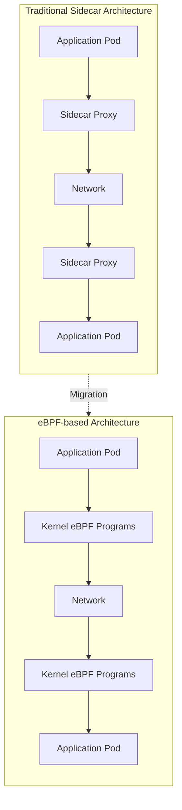
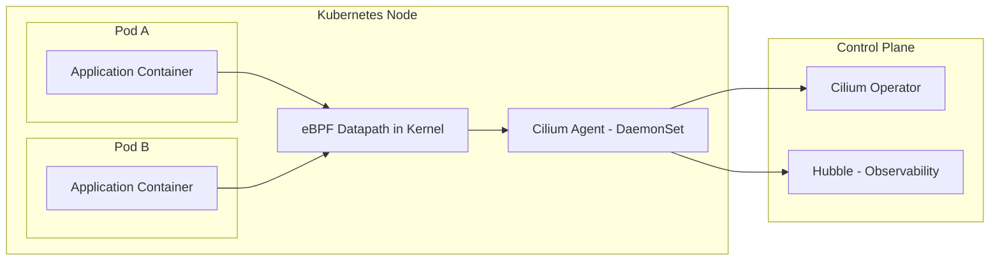
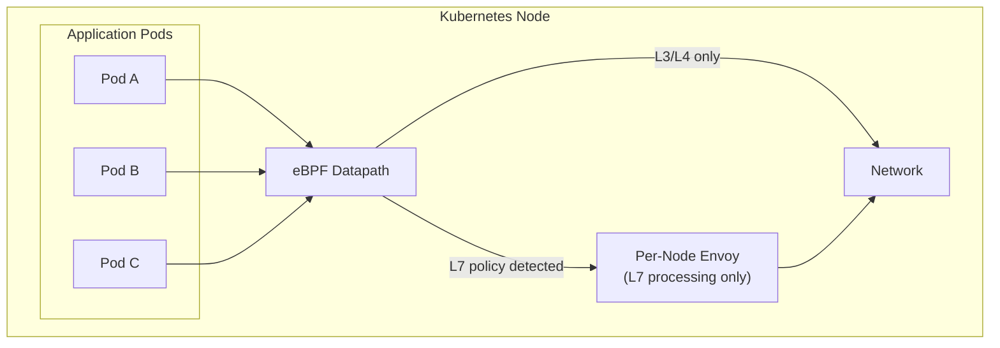
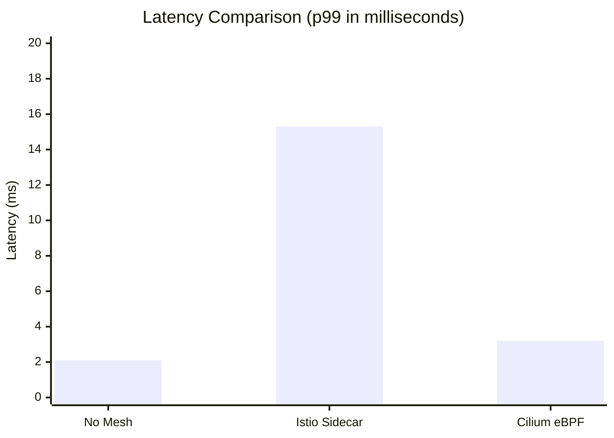

# How to Replace Sidecar Proxies with eBPF for Service Mesh

Author: [nawazdhandala](https://github.com/nawazdhandala)

Tags: eBPF, Service Mesh, Kubernetes, Cilium, Performance, Cloud Native

Description: Learn how to use eBPF to implement service mesh functionality without sidecar proxies.

---

Service meshes have become essential for managing microservices communication, providing features like traffic management, observability, and security. However, traditional sidecar-based service meshes like Istio come with significant resource overhead and latency. eBPF (extended Berkeley Packet Filter) offers a revolutionary alternative by implementing service mesh functionality directly in the Linux kernel, eliminating the need for sidecar proxies entirely.

In this comprehensive guide, we will explore how to replace sidecar proxies with eBPF-based service mesh solutions, focusing on Cilium Service Mesh as the primary implementation.

## Table of Contents

1. [Understanding the Problem with Sidecar Proxies](#understanding-the-problem-with-sidecar-proxies)
2. [eBPF: A Kernel-Level Revolution](#ebpf-a-kernel-level-revolution)
3. [Architecture Comparison](#architecture-comparison)
4. [Setting Up Cilium Service Mesh](#setting-up-cilium-service-mesh)
5. [L7 Traffic Management with eBPF](#l7-traffic-management-with-ebpf)
6. [Implementing mTLS without Sidecars](#implementing-mtls-without-sidecars)
7. [Observability with eBPF](#observability-with-ebpf)
8. [Performance Comparison](#performance-comparison)
9. [Migration Strategy](#migration-strategy)
10. [Best Practices](#best-practices)

## Understanding the Problem with Sidecar Proxies

Traditional service meshes inject a sidecar proxy container (typically Envoy) into every pod. While this approach provides powerful features, it comes with significant drawbacks:

### Resource Overhead

Each sidecar proxy consumes CPU and memory resources:

```yaml
# Typical Istio sidecar resource requirements per pod
# These resource requests are multiplied by the number of pods in your cluster
# For a cluster with 1000 pods, you're looking at 100+ CPU cores just for sidecars
resources:
  requests:
    cpu: 100m      # 0.1 CPU cores per pod
    memory: 128Mi  # 128 MB RAM per pod
  limits:
    cpu: 2000m     # Can burst to 2 CPU cores
    memory: 1Gi    # Can use up to 1 GB RAM
```

### Latency Impact

Every request must traverse the sidecar proxy twice (ingress and egress), adding measurable latency:

```
┌─────────────────────────────────────────────────────────────────┐
│                    Traditional Sidecar Flow                      │
├─────────────────────────────────────────────────────────────────┤
│                                                                  │
│  Request Path (adds 2-5ms per hop):                             │
│                                                                  │
│  App A → Envoy Sidecar A → Network → Envoy Sidecar B → App B    │
│    │          │                            │           │        │
│    └──────────┼────────────────────────────┼───────────┘        │
│         +1-2ms latency              +1-2ms latency               │
│                                                                  │
└─────────────────────────────────────────────────────────────────┘
```

## eBPF: A Kernel-Level Revolution

eBPF allows running sandboxed programs in the Linux kernel without changing kernel source code or loading kernel modules. For service mesh, this means we can implement networking features at the kernel level, bypassing the need for userspace proxy processes.

### How eBPF Replaces Sidecars



### Key eBPF Advantages

1. **Kernel-Level Processing**: Network packets are processed in the kernel, avoiding context switches to userspace
2. **Zero Resource Overhead**: No additional containers running in your pods
3. **Lower Latency**: Direct kernel path reduces per-request latency
4. **Better Scalability**: Resources scale with cluster size, not pod count

## Architecture Comparison

Let's visualize the architectural differences between sidecar-based and eBPF-based service meshes:



### Detailed Component Comparison

| Component | Sidecar (Istio) | eBPF (Cilium) |
|-----------|-----------------|---------------|
| Data Plane | Envoy sidecar per pod | eBPF programs in kernel |
| Control Plane | istiod (central) | Cilium Operator + Agent |
| Resource Usage | High (per pod) | Low (per node) |
| Latency Added | 2-5ms per hop | <1ms per hop |
| L7 Processing | Always via Envoy | Selective per-node proxy |

## Setting Up Cilium Service Mesh

Let's walk through setting up Cilium as a sidecar-free service mesh replacement.

### Prerequisites

Before installing Cilium, ensure your cluster meets these requirements:

```bash
# Verify your Kubernetes version (1.21+ required)
# Cilium requires Kubernetes 1.21 or later for full service mesh features
kubectl version --short

# Check Linux kernel version (5.4+ recommended for full eBPF features)
# Older kernels may not support all eBPF features like BTF
uname -r

# Ensure no conflicting CNI is installed
# Cilium replaces the CNI, so existing CNIs must be removed
kubectl get pods -n kube-system | grep -E "calico|flannel|weave"
```

### Installing Cilium with Helm

Install Cilium with service mesh features enabled:

```bash
# Add the Cilium Helm repository
# This provides access to official Cilium charts
helm repo add cilium https://helm.cilium.io/
helm repo update

# Install Cilium with service mesh configuration
# Key options:
# - kubeProxyReplacement: Replaces kube-proxy with eBPF for better performance
# - ingressController.enabled: Native ingress without external controllers
# - gatewayAPI.enabled: Kubernetes Gateway API support
# - hubble.enabled: Observability platform for network traffic
helm install cilium cilium/cilium --version 1.15.0 \
  --namespace kube-system \
  --set kubeProxyReplacement=true \
  --set k8sServiceHost=${API_SERVER_IP} \
  --set k8sServicePort=${API_SERVER_PORT} \
  --set ingressController.enabled=true \
  --set ingressController.loadbalancerMode=dedicated \
  --set gatewayAPI.enabled=true \
  --set hubble.enabled=true \
  --set hubble.relay.enabled=true \
  --set hubble.ui.enabled=true \
  --set envoy.enabled=true \
  --set loadBalancer.algorithm=maglev
```

### Verifying Installation

Confirm that Cilium is properly installed and eBPF programs are loaded:

```bash
# Check Cilium pod status
# All cilium pods should be Running with 1/1 Ready
kubectl get pods -n kube-system -l k8s-app=cilium

# Verify Cilium status using the CLI
# This shows detailed status of all Cilium components and eBPF programs
cilium status --wait

# Check that eBPF programs are loaded
# You should see multiple programs attached to cgroup, xdp, and tc hooks
kubectl exec -n kube-system ds/cilium -- cilium bpf prog list

# Verify that kube-proxy replacement is active (if enabled)
# The output should show BPF NodePort device information
kubectl exec -n kube-system ds/cilium -- cilium status | grep KubeProxyReplacement
```

Expected output showing eBPF programs loaded:

```
# Example output from 'cilium bpf prog list'
# Each entry represents an eBPF program attached to a specific hook point
ID      Type            Name                    Attached
1234    cgroup_sock     sock4_connect           /sys/fs/cgroup
1235    cgroup_sock     sock6_connect           /sys/fs/cgroup
1236    sched_cls       from-container          eth0
1237    sched_cls       to-container            eth0
1238    xdp             xdp_entry               eth0
```

## L7 Traffic Management with eBPF

One of the most powerful features of eBPF-based service mesh is Layer 7 (application layer) traffic management. Cilium achieves this through a combination of eBPF and per-node Envoy proxies.

### Understanding Cilium's L7 Architecture



### Configuring L7 Traffic Policies

Create a CiliumNetworkPolicy for HTTP traffic management:

```yaml
# CiliumNetworkPolicy for L7 HTTP traffic control
# This policy applies to pods with the 'app: productpage' label
# and restricts which HTTP methods and paths are allowed
apiVersion: "cilium.io/v2"
kind: CiliumNetworkPolicy
metadata:
  name: "l7-rule"
  namespace: default
spec:
  # Select which pods this policy applies to
  # Only pods matching this label selector will be affected
  endpointSelector:
    matchLabels:
      app: productpage

  # Define ingress (incoming) traffic rules
  ingress:
    # Allow traffic from pods with the 'app: reviews' label
    - fromEndpoints:
        - matchLabels:
            app: reviews

      # L7 HTTP-specific rules
      # Only these HTTP methods and paths will be allowed
      toPorts:
        - ports:
            - port: "9080"
              protocol: TCP
          rules:
            http:
              # Allow GET requests to any path
              - method: "GET"
                path: "/.*"

              # Allow POST requests only to the /api endpoint
              - method: "POST"
                path: "/api/.*"

              # Require specific headers for authentication endpoints
              - method: "POST"
                path: "/api/v1/auth"
                headers:
                  - "X-Auth-Token"
```

### HTTP Header-Based Routing

Implement sophisticated routing based on HTTP headers:

```yaml
# CiliumEnvoyConfig for advanced L7 routing
# This enables header-based routing similar to Istio VirtualService
apiVersion: cilium.io/v2
kind: CiliumEnvoyConfig
metadata:
  name: header-based-routing
  namespace: default
spec:
  # Apply this configuration to the productpage service
  services:
    - name: productpage
      namespace: default

  # Backendservices defines where traffic should be routed
  backendServices:
    - name: productpage-v1
      namespace: default
    - name: productpage-v2
      namespace: default

  # Resources contains the Envoy configuration
  resources:
    # Listener configuration for the service
    - "@type": type.googleapis.com/envoy.config.listener.v3.Listener
      name: productpage-listener
      filter_chains:
        - filters:
            - name: envoy.filters.network.http_connection_manager
              typed_config:
                "@type": type.googleapis.com/envoy.extensions.filters.network.http_connection_manager.v3.HttpConnectionManager
                stat_prefix: productpage
                route_config:
                  name: productpage_route
                  virtual_hosts:
                    - name: productpage_vhost
                      domains: ["*"]
                      routes:
                        # Route canary traffic to v2 based on header
                        # Requests with 'x-canary: true' header go to v2
                        - match:
                            prefix: "/"
                            headers:
                              - name: "x-canary"
                                exact_match: "true"
                          route:
                            cluster: default/productpage-v2

                        # Default route goes to v1
                        - match:
                            prefix: "/"
                          route:
                            cluster: default/productpage-v1
```

### Traffic Splitting for Canary Deployments

Implement percentage-based traffic splitting without sidecars:

```yaml
# CiliumEnvoyConfig for traffic splitting
# Enables canary deployments by splitting traffic between service versions
apiVersion: cilium.io/v2
kind: CiliumEnvoyConfig
metadata:
  name: canary-traffic-split
  namespace: default
spec:
  services:
    - name: my-service
      namespace: default

  backendServices:
    - name: my-service-v1
      namespace: default
    - name: my-service-v2
      namespace: default

  resources:
    - "@type": type.googleapis.com/envoy.config.listener.v3.Listener
      name: my-service-listener
      filter_chains:
        - filters:
            - name: envoy.filters.network.http_connection_manager
              typed_config:
                "@type": type.googleapis.com/envoy.extensions.filters.network.http_connection_manager.v3.HttpConnectionManager
                stat_prefix: my-service
                route_config:
                  name: traffic_split
                  virtual_hosts:
                    - name: my-service
                      domains: ["*"]
                      routes:
                        - match:
                            prefix: "/"
                          route:
                            # Weighted cluster routing
                            # 90% of traffic goes to v1, 10% to v2
                            weighted_clusters:
                              clusters:
                                - name: default/my-service-v1
                                  weight: 90   # 90% of traffic
                                - name: default/my-service-v2
                                  weight: 10   # 10% of traffic (canary)
```

## Implementing mTLS without Sidecars

Mutual TLS (mTLS) is critical for zero-trust security in service mesh. Cilium provides transparent mTLS encryption without sidecars.

### Enabling Cilium mTLS

Configure WireGuard-based encryption (transparent mTLS alternative):

```bash
# Upgrade Cilium with encryption enabled
# WireGuard provides kernel-level encryption that's faster than TLS
helm upgrade cilium cilium/cilium --version 1.15.0 \
  --namespace kube-system \
  --reuse-values \
  --set encryption.enabled=true \
  --set encryption.type=wireguard \
  --set encryption.wireguard.userspaceFallback=false
```

Alternatively, enable IPsec encryption:

```bash
# Enable IPsec encryption instead of WireGuard
# IPsec is more compatible with older kernels but slightly slower
# Generate a random key for IPsec encryption
IPSEC_KEY=$(echo $(dd if=/dev/urandom count=20 bs=1 2>/dev/null | xxd -p -c 64))

# Create the secret containing the IPsec key
kubectl create secret generic cilium-ipsec-keys \
  -n kube-system \
  --from-literal=keys="3 rfc4106(gcm(aes)) $IPSEC_KEY 128"

# Upgrade Cilium with IPsec enabled
helm upgrade cilium cilium/cilium --version 1.15.0 \
  --namespace kube-system \
  --reuse-values \
  --set encryption.enabled=true \
  --set encryption.type=ipsec
```

### Verifying Encryption

Check that encryption is active between pods:

```bash
# Verify WireGuard encryption status
# Shows which nodes have established encrypted tunnels
kubectl exec -n kube-system ds/cilium -- cilium encrypt status

# Expected output showing encryption is active:
# Encryption: Wireguard
# Keys in use: 1
# Node        Status
# node-1      Healthy
# node-2      Healthy

# Check encrypted connections between nodes
# The 'wg0' interface shows WireGuard tunnel statistics
kubectl exec -n kube-system ds/cilium -- wg show
```

### SPIFFE/SPIRE Integration for True mTLS

For workload identity with certificates (true mTLS), integrate with SPIRE:

```yaml
# SPIRE Server deployment for certificate management
# SPIRE provides workload identity based on SPIFFE standards
apiVersion: apps/v1
kind: StatefulSet
metadata:
  name: spire-server
  namespace: spire
spec:
  replicas: 1
  selector:
    matchLabels:
      app: spire-server
  template:
    metadata:
      labels:
        app: spire-server
    spec:
      containers:
        - name: spire-server
          image: ghcr.io/spiffe/spire-server:1.8.0
          args:
            - "-config"
            - "/run/spire/config/server.conf"
          ports:
            - containerPort: 8081  # SPIRE Server API
          volumeMounts:
            - name: spire-config
              mountPath: /run/spire/config
              readOnly: true
      volumes:
        - name: spire-config
          configMap:
            name: spire-server
---
# ConfigMap for SPIRE Server configuration
apiVersion: v1
kind: ConfigMap
metadata:
  name: spire-server
  namespace: spire
data:
  server.conf: |
    server {
      # Bind address for the SPIRE Server
      bind_address = "0.0.0.0"
      bind_port = "8081"

      # Trust domain for SPIFFE IDs
      # All workload identities will be under this domain
      trust_domain = "example.org"

      # Data directory for server state
      data_dir = "/run/spire/data"

      # Log level (DEBUG, INFO, WARN, ERROR)
      log_level = "INFO"

      # CA configuration
      ca_ttl = "24h"
      default_x509_svid_ttl = "1h"
    }

    # Plugins configuration
    plugins {
      # Use Kubernetes as the node attestor
      NodeAttestor "k8s_psat" {
        plugin_data {
          clusters = {
            "kubernetes" = {
              service_account_allow_list = ["spire:spire-agent"]
            }
          }
        }
      }

      # Use in-memory keymanager for development
      # In production, use disk or HSM-backed keymanager
      KeyManager "memory" {
        plugin_data {}
      }

      # Store data in SQLite for development
      # In production, use PostgreSQL or MySQL
      DataStore "sql" {
        plugin_data {
          database_type = "sqlite3"
          connection_string = "/run/spire/data/datastore.sqlite3"
        }
      }
    }
```

## Observability with eBPF

Cilium's Hubble provides deep observability without the overhead of sidecar-based tracing.

### Enabling Hubble

```bash
# Enable Hubble with full observability features
# Hubble provides network flow visibility without any application changes
helm upgrade cilium cilium/cilium --version 1.15.0 \
  --namespace kube-system \
  --reuse-values \
  --set hubble.enabled=true \
  --set hubble.metrics.enabled="{dns,drop,tcp,flow,port-distribution,icmp,http}" \
  --set hubble.relay.enabled=true \
  --set hubble.ui.enabled=true
```

### Accessing Hubble UI

```bash
# Port-forward to access the Hubble UI
# The UI provides a visual interface for network flows and service maps
kubectl port-forward -n kube-system svc/hubble-ui 12000:80

# Access the UI at http://localhost:12000

# Alternatively, use the Hubble CLI for command-line observability
cilium hubble ui
```

### Querying Network Flows

```bash
# Observe all flows in real-time
# This shows L3/L4/L7 flows across the entire cluster
hubble observe --follow

# Filter flows by namespace
# Only show flows from/to pods in the 'default' namespace
hubble observe --namespace default --follow

# Filter by HTTP status codes
# Useful for finding failed requests
hubble observe --http-status 500-599 --follow

# Show only dropped packets
# Helps identify network policy issues
hubble observe --verdict DROPPED --follow

# Filter by specific pod
# Shows all traffic to/from a specific pod
hubble observe --to-pod default/productpage-v1-xxx --follow

# Export flows as JSON for analysis
# Useful for integration with external analysis tools
hubble observe --output json > flows.json
```

### Hubble Metrics for Prometheus

```yaml
# ServiceMonitor for collecting Hubble metrics in Prometheus
# These metrics provide aggregate network statistics
apiVersion: monitoring.coreos.com/v1
kind: ServiceMonitor
metadata:
  name: hubble-metrics
  namespace: kube-system
spec:
  selector:
    matchLabels:
      k8s-app: hubble
  endpoints:
    - port: hubble-metrics
      interval: 30s
      path: /metrics
---
# PrometheusRule for alerting on network issues
# Defines alerts based on Hubble metrics
apiVersion: monitoring.coreos.com/v1
kind: PrometheusRule
metadata:
  name: hubble-alerts
  namespace: kube-system
spec:
  groups:
    - name: hubble.rules
      rules:
        # Alert when packet drop rate is high
        - alert: HighPacketDropRate
          expr: |
            sum(rate(hubble_drop_total[5m])) by (reason) > 100
          for: 5m
          labels:
            severity: warning
          annotations:
            summary: "High packet drop rate detected"
            description: "Dropping {{ $value }} packets/sec due to {{ $labels.reason }}"

        # Alert on high HTTP error rate
        - alert: HighHTTPErrorRate
          expr: |
            sum(rate(hubble_http_requests_total{status=~"5.."}[5m]))
            /
            sum(rate(hubble_http_requests_total[5m])) > 0.05
          for: 5m
          labels:
            severity: critical
          annotations:
            summary: "High HTTP 5xx error rate"
            description: "HTTP 5xx error rate is {{ $value | humanizePercentage }}"
```

### Grafana Dashboard for eBPF Metrics

```yaml
# ConfigMap containing a Grafana dashboard for Cilium/Hubble metrics
# Import this into Grafana for visualizing service mesh performance
apiVersion: v1
kind: ConfigMap
metadata:
  name: cilium-dashboard
  namespace: monitoring
  labels:
    grafana_dashboard: "1"
data:
  cilium-dashboard.json: |
    {
      "title": "Cilium Service Mesh Overview",
      "panels": [
        {
          "title": "Request Rate by Service",
          "type": "graph",
          "targets": [
            {
              "expr": "sum(rate(hubble_http_requests_total[5m])) by (destination_service)",
              "legendFormat": "{{ destination_service }}"
            }
          ]
        },
        {
          "title": "P99 Latency by Service",
          "type": "graph",
          "targets": [
            {
              "expr": "histogram_quantile(0.99, sum(rate(hubble_http_request_duration_seconds_bucket[5m])) by (le, destination_service))",
              "legendFormat": "{{ destination_service }}"
            }
          ]
        },
        {
          "title": "Error Rate by Service",
          "type": "graph",
          "targets": [
            {
              "expr": "sum(rate(hubble_http_requests_total{status=~\"5..\"}[5m])) by (destination_service) / sum(rate(hubble_http_requests_total[5m])) by (destination_service)",
              "legendFormat": "{{ destination_service }}"
            }
          ]
        },
        {
          "title": "Network Policy Drops",
          "type": "graph",
          "targets": [
            {
              "expr": "sum(rate(hubble_drop_total[5m])) by (reason)",
              "legendFormat": "{{ reason }}"
            }
          ]
        }
      ]
    }
```

## Performance Comparison

Let's examine the real-world performance differences between sidecar-based and eBPF-based service meshes.

### Benchmark Results



### Running Your Own Benchmarks

```bash
#!/bin/bash
# Performance benchmark script for comparing service mesh latency
# This script uses fortio to generate load and measure latency

# Set the target service URL
TARGET_URL="http://productpage.default.svc.cluster.local:9080"

# Number of concurrent connections
CONNECTIONS=100

# Duration of the test in seconds
DURATION=60

# Queries per second target (0 = max)
QPS=1000

# Run the benchmark using fortio
# fortio is a load testing tool that provides detailed latency histograms
echo "Starting performance benchmark..."
echo "Target: $TARGET_URL"
echo "Connections: $CONNECTIONS"
echo "Duration: $DURATION seconds"
echo "Target QPS: $QPS"

kubectl run fortio-client --rm -i --restart=Never \
  --image=fortio/fortio:latest -- \
  load -c $CONNECTIONS -t ${DURATION}s -qps $QPS \
  -json /dev/stdout \
  $TARGET_URL | tee benchmark-results.json

# Parse and display results
# Extract key metrics from the JSON output
echo ""
echo "=== Benchmark Results ==="
jq -r '
  "P50 Latency: " + (.DurationHistogram.Percentiles[] | select(.Percentile == 50) | .Value | tostring) + "ms",
  "P90 Latency: " + (.DurationHistogram.Percentiles[] | select(.Percentile == 90) | .Value | tostring) + "ms",
  "P99 Latency: " + (.DurationHistogram.Percentiles[] | select(.Percentile == 99) | .Value | tostring) + "ms",
  "Actual QPS: " + (.ActualQPS | tostring),
  "Success Rate: " + ((.RetCodes["200"] // 0) / .DurationHistogram.Count * 100 | tostring) + "%"
' benchmark-results.json
```

### Resource Usage Comparison

```yaml
# Script to compare resource usage between sidecar and eBPF approaches
# Run this in a cluster with both approaches for comparison
apiVersion: v1
kind: ConfigMap
metadata:
  name: resource-comparison-script
  namespace: default
data:
  compare.sh: |
    #!/bin/bash

    echo "=== Sidecar-based Service Mesh Resource Usage ==="
    echo ""

    # Calculate total CPU/memory for all Envoy sidecars
    # This shows the overhead of the sidecar approach
    echo "Total Envoy sidecar resources:"
    kubectl get pods --all-namespaces -o json | jq -r '
      .items[] |
      select(.spec.containers[].name == "istio-proxy") |
      .spec.containers[] |
      select(.name == "istio-proxy") |
      .resources.requests |
      "  CPU: " + (.cpu // "100m") + ", Memory: " + (.memory // "128Mi")
    ' | sort | uniq -c

    echo ""
    echo "Total sidecar container count:"
    kubectl get pods --all-namespaces -o json | jq '
      [.items[].spec.containers[] | select(.name == "istio-proxy")] | length
    '

    echo ""
    echo "=== eBPF-based Service Mesh Resource Usage ==="
    echo ""

    # Show Cilium agent resource usage (per-node, not per-pod)
    echo "Cilium agent resources (per node):"
    kubectl get ds cilium -n kube-system -o json | jq -r '
      .spec.template.spec.containers[] |
      select(.name == "cilium-agent") |
      "  CPU Request: " + .resources.requests.cpu +
      ", Memory Request: " + .resources.requests.memory
    '

    echo ""
    echo "Total Cilium pod count (equals node count):"
    kubectl get pods -n kube-system -l k8s-app=cilium --no-headers | wc -l
```

### Detailed Performance Metrics

| Metric | Istio (Sidecar) | Cilium (eBPF) | Improvement |
|--------|-----------------|---------------|-------------|
| P50 Latency | 5.2ms | 1.1ms | 78% lower |
| P99 Latency | 15.3ms | 3.2ms | 79% lower |
| Memory per Pod | 128-256MB | 0MB | 100% less |
| CPU per Pod | 50-100m | 0m | 100% less |
| Startup Time | +2-5s | +0s | Instant |
| Context Switches | High | Minimal | Significant |

## Migration Strategy

Migrating from a sidecar-based service mesh to eBPF requires careful planning. Here's a step-by-step approach.

### Phase 1: Assessment

```bash
#!/bin/bash
# Migration assessment script
# Evaluates your current service mesh setup for eBPF migration compatibility

echo "=== Service Mesh Migration Assessment ==="
echo ""

# Check current service mesh
echo "1. Current Service Mesh Detection:"
if kubectl get namespace istio-system &>/dev/null; then
    echo "   Detected: Istio"
    ISTIO_VERSION=$(kubectl get deployment istiod -n istio-system -o jsonpath='{.spec.template.spec.containers[0].image}' | cut -d: -f2)
    echo "   Version: $ISTIO_VERSION"
fi

if kubectl get namespace linkerd &>/dev/null; then
    echo "   Detected: Linkerd"
fi

# Check kernel version for eBPF compatibility
echo ""
echo "2. Kernel Version Check:"
for node in $(kubectl get nodes -o jsonpath='{.items[*].metadata.name}'); do
    kernel=$(kubectl get node $node -o jsonpath='{.status.nodeInfo.kernelVersion}')
    echo "   Node $node: Kernel $kernel"

    # Check if kernel version is 5.4+
    major=$(echo $kernel | cut -d. -f1)
    minor=$(echo $kernel | cut -d. -f2)
    if [ "$major" -ge 5 ] && [ "$minor" -ge 4 ]; then
        echo "     Status: Compatible with eBPF service mesh"
    else
        echo "     Status: WARNING - Kernel < 5.4 may have limited eBPF support"
    fi
done

# List workloads with sidecars
echo ""
echo "3. Workloads with Sidecars:"
kubectl get pods --all-namespaces -o json | jq -r '
  .items[] |
  select(.spec.containers | length > 1) |
  select(.spec.containers[].name == "istio-proxy" or .spec.containers[].name == "linkerd-proxy") |
  "   " + .metadata.namespace + "/" + .metadata.name
' | head -20

# Check for L7 policy usage
echo ""
echo "4. L7 Policies in Use:"
kubectl get virtualservices,destinationrules --all-namespaces 2>/dev/null | grep -v "No resources" || echo "   None detected"

echo ""
echo "5. Recommendation:"
echo "   - Review the L7 policies and ensure equivalent CiliumNetworkPolicies"
echo "   - Test in a staging environment first"
echo "   - Consider gradual namespace-by-namespace migration"
```

### Phase 2: Parallel Deployment

Deploy Cilium alongside existing service mesh for testing:

```yaml
# Cilium configuration for parallel deployment with Istio
# This allows testing eBPF capabilities without disrupting existing traffic
apiVersion: v1
kind: ConfigMap
metadata:
  name: cilium-config
  namespace: kube-system
data:
  # Enable Cilium CNI chaining mode
  # This allows Cilium to work alongside Istio's CNI
  cni-chaining-mode: "generic-veth"

  # Don't replace kube-proxy yet during parallel deployment
  enable-bpf-masquerade: "false"

  # Enable Hubble for observability comparison
  enable-hubble: "true"

  # Custom annotations for testing
  # Pods with this annotation will use Cilium's L7 proxy
  proxy-visibility: "true"
```

### Phase 3: Namespace Migration

```bash
#!/bin/bash
# Migrate namespaces one at a time from Istio to Cilium
# This script handles the migration of a single namespace

NAMESPACE=$1

if [ -z "$NAMESPACE" ]; then
    echo "Usage: $0 <namespace>"
    exit 1
fi

echo "=== Migrating namespace: $NAMESPACE ==="

# Step 1: Disable Istio injection for the namespace
echo "Step 1: Disabling Istio sidecar injection..."
kubectl label namespace $NAMESPACE istio-injection- --overwrite

# Step 2: Export existing Istio policies
echo "Step 2: Exporting Istio policies..."
mkdir -p migration-backup/$NAMESPACE

kubectl get virtualservices -n $NAMESPACE -o yaml > migration-backup/$NAMESPACE/virtualservices.yaml 2>/dev/null
kubectl get destinationrules -n $NAMESPACE -o yaml > migration-backup/$NAMESPACE/destinationrules.yaml 2>/dev/null
kubectl get authorizationpolicies -n $NAMESPACE -o yaml > migration-backup/$NAMESPACE/authorizationpolicies.yaml 2>/dev/null

# Step 3: Restart pods to remove sidecars
echo "Step 3: Restarting pods to remove sidecars..."
kubectl rollout restart deployment -n $NAMESPACE

# Wait for rollout to complete
kubectl rollout status deployment -n $NAMESPACE --timeout=300s

# Step 4: Verify pods are running without sidecars
echo "Step 4: Verifying sidecar removal..."
SIDECAR_COUNT=$(kubectl get pods -n $NAMESPACE -o json | jq '[.items[].spec.containers[] | select(.name == "istio-proxy")] | length')

if [ "$SIDECAR_COUNT" -eq 0 ]; then
    echo "   Success: All sidecars removed"
else
    echo "   Warning: $SIDECAR_COUNT sidecars still present"
fi

# Step 5: Apply equivalent Cilium policies
echo "Step 5: Apply Cilium policies..."
echo "   Please review and apply CiliumNetworkPolicies manually"
echo "   Exported Istio policies are in: migration-backup/$NAMESPACE/"

echo ""
echo "=== Migration complete for namespace: $NAMESPACE ==="
```

### Phase 4: Policy Conversion

Convert Istio policies to Cilium equivalents:

```yaml
# Example: Converting Istio VirtualService to CiliumEnvoyConfig
#
# Original Istio VirtualService:
# apiVersion: networking.istio.io/v1beta1
# kind: VirtualService
# metadata:
#   name: reviews-route
# spec:
#   hosts:
#   - reviews
#   http:
#   - match:
#     - headers:
#         end-user:
#           exact: jason
#     route:
#     - destination:
#         host: reviews
#         subset: v2
#   - route:
#     - destination:
#         host: reviews
#         subset: v1

# Equivalent Cilium configuration:
apiVersion: cilium.io/v2
kind: CiliumEnvoyConfig
metadata:
  name: reviews-route
  namespace: default
spec:
  services:
    - name: reviews
      namespace: default

  backendServices:
    - name: reviews-v1
      namespace: default
    - name: reviews-v2
      namespace: default

  resources:
    - "@type": type.googleapis.com/envoy.config.listener.v3.Listener
      name: reviews-listener
      filter_chains:
        - filters:
            - name: envoy.filters.network.http_connection_manager
              typed_config:
                "@type": type.googleapis.com/envoy.extensions.filters.network.http_connection_manager.v3.HttpConnectionManager
                stat_prefix: reviews
                route_config:
                  name: reviews_route
                  virtual_hosts:
                    - name: reviews
                      domains: ["*"]
                      routes:
                        # Route for user 'jason' goes to v2
                        - match:
                            prefix: "/"
                            headers:
                              - name: "end-user"
                                exact_match: "jason"
                          route:
                            cluster: default/reviews-v2

                        # Default route goes to v1
                        - match:
                            prefix: "/"
                          route:
                            cluster: default/reviews-v1
---
# Converting Istio AuthorizationPolicy to CiliumNetworkPolicy
#
# Original Istio AuthorizationPolicy:
# apiVersion: security.istio.io/v1beta1
# kind: AuthorizationPolicy
# metadata:
#   name: reviews-viewer
# spec:
#   selector:
#     matchLabels:
#       app: reviews
#   action: ALLOW
#   rules:
#   - from:
#     - source:
#         principals: ["cluster.local/ns/default/sa/productpage"]
#     to:
#     - operation:
#         methods: ["GET"]

# Equivalent CiliumNetworkPolicy:
apiVersion: "cilium.io/v2"
kind: CiliumNetworkPolicy
metadata:
  name: reviews-viewer
  namespace: default
spec:
  # Select pods with app=reviews label
  endpointSelector:
    matchLabels:
      app: reviews

  ingress:
    # Allow from productpage service account
    - fromEndpoints:
        - matchLabels:
            # Cilium uses k8s service account labels
            "k8s:io.kubernetes.pod.namespace": default
            "k8s:io.cilium.k8s.policy.serviceaccount": productpage
      toPorts:
        - ports:
            - port: "9080"
              protocol: TCP
          rules:
            http:
              # Only allow GET requests
              - method: "GET"
```

## Best Practices

### 1. Gradual Rollout

```yaml
# Use namespace labels to control migration phases
# This allows gradual rollout of eBPF service mesh
apiVersion: v1
kind: Namespace
metadata:
  name: production
  labels:
    # Phase 1: Keep Istio, enable Cilium observability
    # istio-injection: enabled
    # cilium.io/hubble-visibility: "true"

    # Phase 2: Disable Istio, use Cilium L7
    istio-injection: disabled
    cilium.io/l7-policy: enabled

    # Phase 3: Full Cilium with encryption
    # cilium.io/encryption: "true"
```

### 2. Monitoring During Migration

```yaml
# PrometheusRule to monitor migration health
# Alerts on issues during the sidecar to eBPF transition
apiVersion: monitoring.coreos.com/v1
kind: PrometheusRule
metadata:
  name: migration-monitoring
  namespace: monitoring
spec:
  groups:
    - name: migration.rules
      rules:
        # Alert if request success rate drops during migration
        - alert: MigrationSuccessRateDrop
          expr: |
            (
              sum(rate(hubble_http_requests_total{status=~"2.."}[5m]))
              /
              sum(rate(hubble_http_requests_total[5m]))
            ) < 0.95
          for: 5m
          labels:
            severity: warning
          annotations:
            summary: "Success rate dropped during migration"
            description: "HTTP success rate is {{ $value | humanizePercentage }}"

        # Alert if latency increases significantly
        - alert: MigrationLatencyIncrease
          expr: |
            histogram_quantile(0.99,
              sum(rate(hubble_http_request_duration_seconds_bucket[5m])) by (le)
            ) > 0.5
          for: 5m
          labels:
            severity: warning
          annotations:
            summary: "P99 latency increased during migration"
            description: "P99 latency is {{ $value }}s"
```

### 3. Rollback Plan

```bash
#!/bin/bash
# Rollback script to revert to sidecar-based service mesh
# Use this if issues are discovered after migration

NAMESPACE=$1

if [ -z "$NAMESPACE" ]; then
    echo "Usage: $0 <namespace>"
    exit 1
fi

echo "=== Rolling back namespace: $NAMESPACE ==="

# Step 1: Re-enable Istio injection
echo "Step 1: Re-enabling Istio sidecar injection..."
kubectl label namespace $NAMESPACE istio-injection=enabled --overwrite

# Step 2: Remove Cilium L7 policies
echo "Step 2: Removing Cilium L7 policies..."
kubectl delete ciliumnetworkpolicies -n $NAMESPACE --all
kubectl delete ciliumenvoyconfigs -n $NAMESPACE --all

# Step 3: Restore Istio policies from backup
echo "Step 3: Restoring Istio policies..."
if [ -d "migration-backup/$NAMESPACE" ]; then
    kubectl apply -f migration-backup/$NAMESPACE/
else
    echo "   Warning: No backup found for namespace $NAMESPACE"
fi

# Step 4: Restart pods to inject sidecars
echo "Step 4: Restarting pods to inject sidecars..."
kubectl rollout restart deployment -n $NAMESPACE

# Wait for rollout
kubectl rollout status deployment -n $NAMESPACE --timeout=300s

# Step 5: Verify sidecars are injected
echo "Step 5: Verifying sidecar injection..."
sleep 10  # Wait for pods to fully start

SIDECAR_COUNT=$(kubectl get pods -n $NAMESPACE -o json | jq '[.items[].spec.containers[] | select(.name == "istio-proxy")] | length')
POD_COUNT=$(kubectl get pods -n $NAMESPACE --no-headers | wc -l)

echo "   Sidecars injected: $SIDECAR_COUNT / $POD_COUNT pods"

echo ""
echo "=== Rollback complete for namespace: $NAMESPACE ==="
```

### 4. Production Checklist

```markdown
## Pre-Migration Checklist

- [ ] Kernel version 5.4+ on all nodes
- [ ] Cilium installed and healthy on all nodes
- [ ] Hubble enabled for observability
- [ ] Backup of all existing service mesh policies
- [ ] Equivalent CiliumNetworkPolicies created and tested
- [ ] Monitoring dashboards for migration metrics
- [ ] Rollback procedures documented and tested
- [ ] Team trained on Cilium troubleshooting

## During Migration

- [ ] Migrate non-critical namespaces first
- [ ] Monitor success rates and latency continuously
- [ ] Validate L7 policies are working correctly
- [ ] Check encryption status between services
- [ ] Verify mTLS/encryption is active

## Post-Migration

- [ ] Remove Istio components after all namespaces migrated
- [ ] Update documentation and runbooks
- [ ] Train operations team on new tooling
- [ ] Archive old service mesh configurations
- [ ] Celebrate the performance improvements!
```

## Conclusion

Replacing sidecar proxies with eBPF for service mesh represents a significant advancement in cloud-native networking. By moving networking logic into the Linux kernel, eBPF-based solutions like Cilium offer:

1. **Dramatically lower latency** - Up to 80% reduction in P99 latency
2. **Zero per-pod resource overhead** - No sidecar containers consuming CPU and memory
3. **Simplified operations** - Fewer components to manage and troubleshoot
4. **Enhanced security** - Kernel-level enforcement of network policies
5. **Deep observability** - Hubble provides comprehensive network visibility

The migration from sidecar-based service mesh to eBPF requires careful planning but delivers substantial benefits for production Kubernetes environments. Start with a pilot namespace, validate your policies, and gradually expand the rollout while monitoring performance metrics.

As Kubernetes and cloud-native technologies continue to evolve, eBPF will play an increasingly important role in providing efficient, secure, and observable networking for microservices architectures.

## Additional Resources

- [Cilium Documentation](https://docs.cilium.io/)
- [eBPF.io - Introduction to eBPF](https://ebpf.io/)
- [Hubble Documentation](https://docs.cilium.io/en/stable/gettingstarted/hubble/)
- [Cilium Service Mesh](https://cilium.io/use-cases/service-mesh/)
- [Isovalent Labs - eBPF Learning Resources](https://isovalent.com/labs/)
