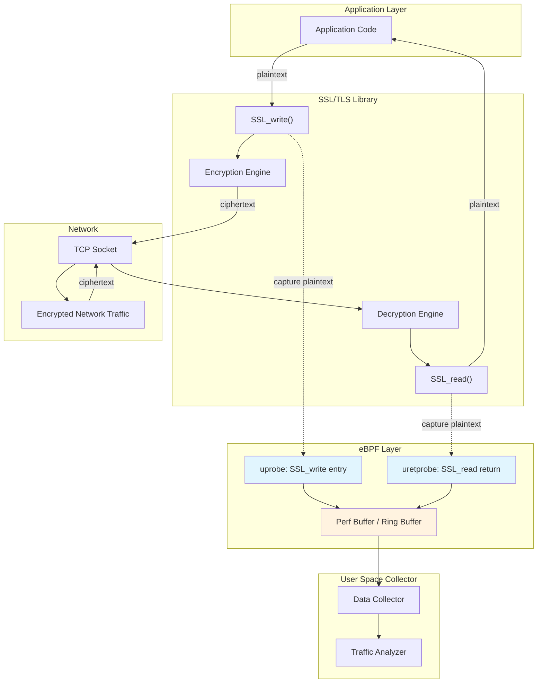
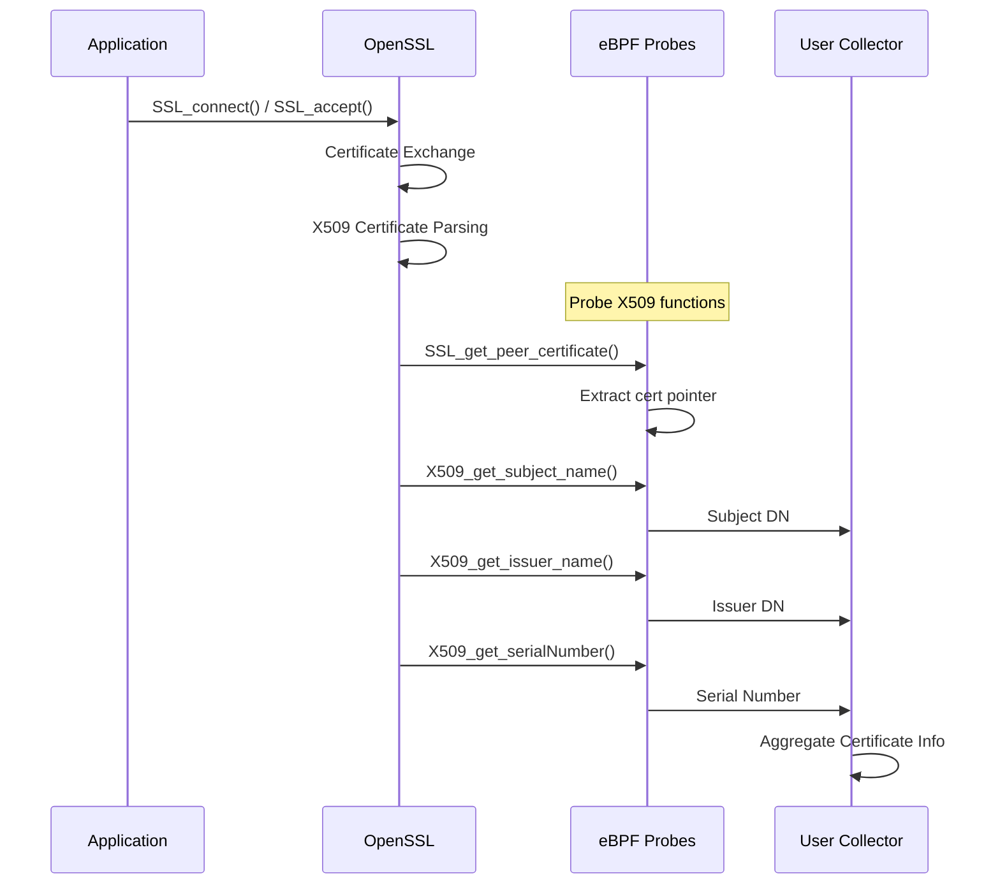
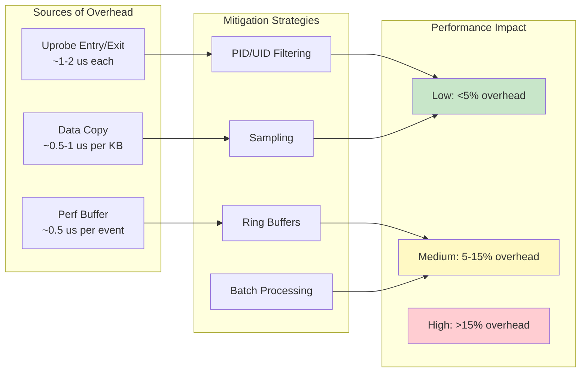
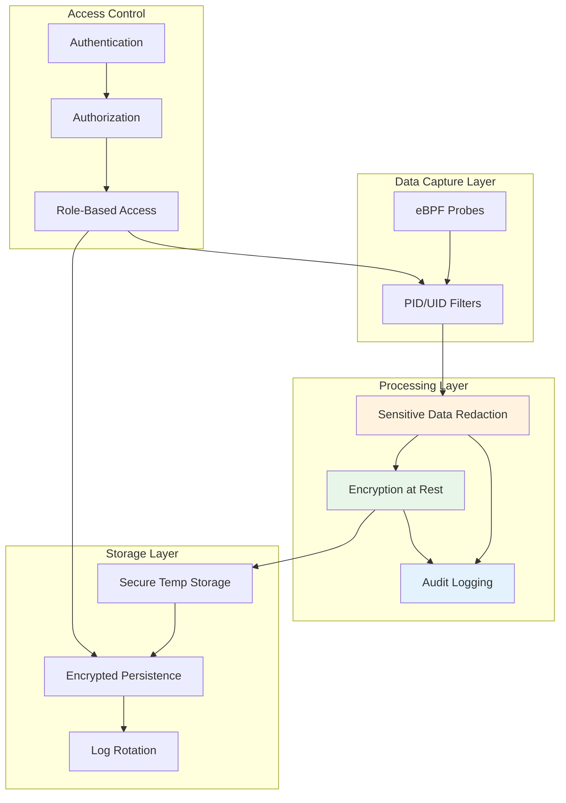

# How to Inspect SSL/TLS Traffic with eBPF

Author: [nawazdhandala](https://github.com/nawazdhandala)

Tags: eBPF, SSL, TLS, Security, Networking, Linux

Description: Learn how to use eBPF for SSL/TLS traffic inspection without modifying applications.

---

## Introduction

SSL/TLS encryption is essential for securing network communications, but it creates significant challenges for security teams, network administrators, and developers who need visibility into encrypted traffic. Traditional approaches like MITM (Man-in-the-Middle) proxies require certificate installation on clients and can break certain applications. eBPF (extended Berkeley Packet Filter) offers a revolutionary approach: intercepting plaintext data directly from SSL/TLS libraries before encryption or after decryption, without modifying applications or breaking the encryption chain.

In this comprehensive guide, we will explore how to use eBPF to inspect SSL/TLS traffic by attaching uprobes to SSL libraries like OpenSSL, GnuTLS, and NSS.

## Prerequisites

Before we dive in, ensure you have:

- Linux kernel 4.14 or later (5.x recommended for best eBPF support)
- Root privileges or CAP_BPF capability
- BCC (BPF Compiler Collection) or libbpf installed
- Python 3.6+ (for BCC-based examples)
- OpenSSL development headers

Install the required packages on Ubuntu/Debian:

```bash
# Install BCC tools and dependencies
sudo apt-get update
sudo apt-get install -y bpfcc-tools linux-headers-$(uname -r) python3-bpfcc

# Install OpenSSL development headers for symbol resolution
sudo apt-get install -y libssl-dev

# Verify eBPF support
sudo bpftool feature
```

## How SSL/TLS Interception with eBPF Works

The key insight is that all SSL/TLS libraries must eventually call functions to encrypt plaintext and decrypt ciphertext. By attaching eBPF uprobes to these functions, we can capture data before encryption or after decryption.

### SSL Interception Flow



### Key SSL Library Functions to Intercept

| Library | Write Function | Read Function |
|---------|---------------|---------------|
| OpenSSL | `SSL_write`, `SSL_write_ex` | `SSL_read`, `SSL_read_ex` |
| GnuTLS | `gnutls_record_send` | `gnutls_record_recv` |
| NSS | `PR_Write`, `PR_Send` | `PR_Read`, `PR_Recv` |
| BoringSSL | `SSL_write`, `SSL_write_ex` | `SSL_read`, `SSL_read_ex` |

## Basic SSL Traffic Capture with BCC

Let us start with a fundamental eBPF program that captures SSL/TLS plaintext data using uprobes.

### Understanding the Data Structures

First, we define the data structures that will be shared between the eBPF kernel program and user-space collector. These structures hold the captured SSL data and metadata:

```c
// Data structure for passing SSL data from kernel to user space
// This structure is used in the perf buffer to transmit captured data
struct ssl_data_t {
    u32 pid;           // Process ID of the application
    u32 tid;           // Thread ID for multi-threaded apps
    u32 uid;           // User ID running the process
    u64 timestamp_ns;  // Nanosecond timestamp for timing analysis
    u32 len;           // Length of captured data
    u32 buf_filled;    // Actual bytes copied (may be less than len)
    char comm[16];     // Process name (command)
    char data[4096];   // Buffer for captured plaintext (4KB max)
};
```

### Complete BCC Python Implementation

This Python script uses BCC to compile and load the eBPF program, attach uprobes to OpenSSL functions, and collect captured data:

```python
#!/usr/bin/env python3
"""
SSL/TLS Traffic Inspector using eBPF
Captures plaintext data from OpenSSL library calls
"""

from bcc import BPF
import ctypes
import sys

# eBPF program source code
# This program attaches to SSL_write and SSL_read functions in OpenSSL
bpf_program = """
#include <uapi/linux/ptrace.h>
#include <linux/sched.h>

// Maximum data size to capture per SSL operation
// Larger values capture more data but use more perf buffer space
#define MAX_DATA_SIZE 4096

// Structure to pass captured data to user space
// Aligned to 8 bytes for efficient memory access
struct ssl_data_t {
    u32 pid;
    u32 tid;
    u32 uid;
    u64 timestamp_ns;
    u32 len;
    u32 buf_filled;
    char comm[16];
    char data[MAX_DATA_SIZE];
};

// Perf buffer for sending events to user space
// Named 'ssl_events' - user space will poll this
BPF_PERF_OUTPUT(ssl_events);

// Hash map to store buffer pointers between entry and return probes
// Key: thread ID, Value: pointer to the data buffer
// This is needed because SSL_read's data is only valid after the call returns
BPF_HASH(ssl_read_args, u64, u64);

// Hash map to store the SSL pointer for connection tracking
// Useful for correlating reads and writes on the same connection
BPF_HASH(ssl_ctx_map, u64, u64);

/**
 * Probe for SSL_write() entry
 *
 * SSL_write signature: int SSL_write(SSL *ssl, const void *buf, int num)
 *
 * At entry, we can directly read the plaintext buffer because
 * the data is available before the encryption happens
 */
int probe_ssl_write_entry(struct pt_regs *ctx) {
    // Get process and thread identifiers
    u64 pid_tgid = bpf_get_current_pid_tgid();
    u32 pid = pid_tgid >> 32;
    u32 tid = pid_tgid & 0xFFFFFFFF;

    // Read function arguments from registers
    // PT_REGS_PARM1 = ssl (SSL context pointer)
    // PT_REGS_PARM2 = buf (plaintext data buffer)
    // PT_REGS_PARM3 = num (number of bytes to write)
    void *ssl = (void *)PT_REGS_PARM1(ctx);
    void *buf = (void *)PT_REGS_PARM2(ctx);
    int num = (int)PT_REGS_PARM3(ctx);

    // Skip if buffer is null or length is invalid
    if (buf == NULL || num <= 0) {
        return 0;
    }

    // Allocate event structure on the stack
    // Zero-initialize to avoid leaking kernel memory
    struct ssl_data_t event = {};

    // Fill in metadata
    event.pid = pid;
    event.tid = tid;
    event.uid = bpf_get_current_uid_gid() & 0xFFFFFFFF;
    event.timestamp_ns = bpf_ktime_get_ns();
    event.len = num;

    // Get process name for identification
    bpf_get_current_comm(&event.comm, sizeof(event.comm));

    // Calculate how much data to copy (cap at MAX_DATA_SIZE)
    u32 copy_len = num;
    if (copy_len > MAX_DATA_SIZE) {
        copy_len = MAX_DATA_SIZE;
    }
    event.buf_filled = copy_len;

    // Copy plaintext data from user space buffer
    // bpf_probe_read_user handles page faults gracefully
    int ret = bpf_probe_read_user(&event.data, copy_len, buf);
    if (ret != 0) {
        return 0;  // Failed to read, skip this event
    }

    // Submit event to user space via perf buffer
    ssl_events.perf_submit(ctx, &event, sizeof(event));

    return 0;
}

/**
 * Probe for SSL_read() entry
 *
 * SSL_read signature: int SSL_read(SSL *ssl, void *buf, int num)
 *
 * At entry, the buffer is empty - we only save the buffer pointer
 * The actual data is captured in the return probe
 */
int probe_ssl_read_entry(struct pt_regs *ctx) {
    u64 pid_tgid = bpf_get_current_pid_tgid();

    // Save the buffer pointer for the return probe
    // PT_REGS_PARM2 = buf (destination buffer for decrypted data)
    u64 buf = PT_REGS_PARM2(ctx);
    ssl_read_args.update(&pid_tgid, &buf);

    return 0;
}

/**
 * Return probe for SSL_read()
 *
 * Called after SSL_read returns, when decrypted data is in the buffer
 * The return value (PT_REGS_RC) contains the number of bytes read
 */
int probe_ssl_read_return(struct pt_regs *ctx) {
    u64 pid_tgid = bpf_get_current_pid_tgid();
    u32 pid = pid_tgid >> 32;
    u32 tid = pid_tgid & 0xFFFFFFFF;

    // Get the return value (bytes read, or error if negative)
    int read_len = PT_REGS_RC(ctx);

    // Skip if read failed or returned no data
    if (read_len <= 0) {
        ssl_read_args.delete(&pid_tgid);
        return 0;
    }

    // Retrieve the buffer pointer we saved at entry
    u64 *buf_ptr = ssl_read_args.lookup(&pid_tgid);
    if (buf_ptr == NULL) {
        return 0;  // Entry probe didn't fire, skip
    }

    void *buf = (void *)*buf_ptr;

    // Clean up the saved buffer pointer
    ssl_read_args.delete(&pid_tgid);

    // Prepare event structure
    struct ssl_data_t event = {};
    event.pid = pid;
    event.tid = tid;
    event.uid = bpf_get_current_uid_gid() & 0xFFFFFFFF;
    event.timestamp_ns = bpf_ktime_get_ns();
    event.len = read_len;
    bpf_get_current_comm(&event.comm, sizeof(event.comm));

    // Calculate copy length
    u32 copy_len = read_len;
    if (copy_len > MAX_DATA_SIZE) {
        copy_len = MAX_DATA_SIZE;
    }
    event.buf_filled = copy_len;

    // Copy the decrypted data
    int ret = bpf_probe_read_user(&event.data, copy_len, buf);
    if (ret != 0) {
        return 0;
    }

    // Submit to user space
    ssl_events.perf_submit(ctx, &event, sizeof(event));

    return 0;
}
"""

# Data structure matching the eBPF struct for ctypes parsing
class SSLData(ctypes.Structure):
    _fields_ = [
        ("pid", ctypes.c_uint32),
        ("tid", ctypes.c_uint32),
        ("uid", ctypes.c_uint32),
        ("timestamp_ns", ctypes.c_uint64),
        ("len", ctypes.c_uint32),
        ("buf_filled", ctypes.c_uint32),
        ("comm", ctypes.c_char * 16),
        ("data", ctypes.c_char * 4096),
    ]


def find_ssl_library():
    """
    Find the OpenSSL library path on the system
    Returns the path to libssl.so
    """
    import subprocess

    # Common library paths to check
    paths = [
        "/usr/lib/x86_64-linux-gnu/libssl.so.3",
        "/usr/lib/x86_64-linux-gnu/libssl.so.1.1",
        "/usr/lib/libssl.so.3",
        "/usr/lib/libssl.so.1.1",
        "/lib/x86_64-linux-gnu/libssl.so.3",
        "/lib/x86_64-linux-gnu/libssl.so.1.1",
    ]

    for path in paths:
        try:
            with open(path, 'rb'):
                return path
        except FileNotFoundError:
            continue

    # Try using ldconfig to find the library
    try:
        result = subprocess.run(
            ["ldconfig", "-p"],
            capture_output=True,
            text=True
        )
        for line in result.stdout.split('\n'):
            if 'libssl.so' in line and '=>' in line:
                path = line.split('=>')[1].strip()
                return path
    except Exception:
        pass

    raise RuntimeError("Could not find OpenSSL library (libssl.so)")


def print_event(cpu, data, size):
    """
    Callback function for processing perf buffer events
    Called by BCC when data arrives from the kernel
    """
    event = ctypes.cast(data, ctypes.POINTER(SSLData)).contents

    # Decode process name safely
    comm = event.comm.decode('utf-8', errors='replace')

    # Decode captured data, handling binary content
    try:
        captured_data = event.data[:event.buf_filled].decode('utf-8', errors='replace')
    except Exception:
        captured_data = event.data[:event.buf_filled].hex()

    # Format timestamp as relative microseconds
    timestamp_us = event.timestamp_ns / 1000

    print(f"\n{'='*60}")
    print(f"Process: {comm} (PID: {event.pid}, TID: {event.tid})")
    print(f"UID: {event.uid}")
    print(f"Timestamp: {timestamp_us:.3f} us")
    print(f"Data Length: {event.len} bytes (captured: {event.buf_filled})")
    print(f"{'='*60}")
    print(f"Data:\n{captured_data[:500]}")  # Print first 500 chars
    if len(captured_data) > 500:
        print(f"... ({len(captured_data) - 500} more characters)")


def main():
    print("SSL/TLS Traffic Inspector with eBPF")
    print("===================================")

    # Find OpenSSL library
    try:
        ssl_lib = find_ssl_library()
        print(f"Found OpenSSL library: {ssl_lib}")
    except RuntimeError as e:
        print(f"Error: {e}")
        sys.exit(1)

    # Compile and load the eBPF program
    print("Loading eBPF program...")
    b = BPF(text=bpf_program)

    # Attach uprobes to SSL_write
    # Entry probe captures plaintext before encryption
    b.attach_uprobe(
        name=ssl_lib,
        sym="SSL_write",
        fn_name="probe_ssl_write_entry"
    )
    print("Attached uprobe to SSL_write")

    # Attach uprobes to SSL_read
    # Entry probe saves buffer pointer, return probe captures data
    b.attach_uprobe(
        name=ssl_lib,
        sym="SSL_read",
        fn_name="probe_ssl_read_entry"
    )
    b.attach_uretprobe(
        name=ssl_lib,
        sym="SSL_read",
        fn_name="probe_ssl_read_return"
    )
    print("Attached uprobes to SSL_read")

    # Set up perf buffer callback
    b["ssl_events"].open_perf_buffer(print_event)

    print("\nCapturing SSL/TLS traffic... Press Ctrl+C to stop.\n")

    # Main event loop
    try:
        while True:
            # Poll for events with 100ms timeout
            b.perf_buffer_poll(timeout=100)
    except KeyboardInterrupt:
        print("\nStopping capture...")


if __name__ == "__main__":
    main()
```

## Capturing Certificate Information

Beyond plaintext data, we can also extract SSL certificate information by probing certificate-related functions. This is useful for security monitoring and compliance.

### Certificate Data Flow



### Certificate Extraction eBPF Program

This program intercepts SSL certificate verification functions to extract certificate details:

```python
#!/usr/bin/env python3
"""
SSL Certificate Extractor using eBPF
Captures certificate information during TLS handshakes
"""

from bcc import BPF
import ctypes

# eBPF program for certificate extraction
# Attaches to X509 certificate handling functions
cert_program = """
#include <uapi/linux/ptrace.h>

// Maximum length for certificate fields like subject and issuer
#define MAX_FIELD_LEN 256

// Structure to hold certificate metadata
struct cert_info_t {
    u32 pid;
    u32 tid;
    u64 timestamp_ns;
    char comm[16];
    u64 cert_ptr;           // Pointer to X509 structure (for correlation)
    u64 ssl_ptr;            // Pointer to SSL structure
    int verify_result;      // SSL verification result code
    char subject[MAX_FIELD_LEN];  // Certificate subject DN
    char issuer[MAX_FIELD_LEN];   // Certificate issuer DN
};

// Output buffer for certificate events
BPF_PERF_OUTPUT(cert_events);

// Track active SSL connections and their certificates
// Key: SSL pointer, Value: X509 cert pointer
BPF_HASH(ssl_to_cert, u64, u64);

// Track certificate subject names being extracted
// Key: X509_NAME pointer, Value: destination buffer pointer
BPF_HASH(name_extraction, u64, u64);

/**
 * Probe for SSL_get_peer_certificate()
 *
 * This function is called to retrieve the peer's certificate
 * after a TLS handshake completes
 *
 * Signature: X509 *SSL_get_peer_certificate(const SSL *ssl)
 */
int probe_get_peer_cert_return(struct pt_regs *ctx) {
    u64 pid_tgid = bpf_get_current_pid_tgid();
    u32 pid = pid_tgid >> 32;

    // Get the returned X509 certificate pointer
    u64 cert_ptr = PT_REGS_RC(ctx);

    if (cert_ptr == 0) {
        return 0;  // No certificate (e.g., anonymous connection)
    }

    // Store the certificate pointer for later correlation
    ssl_to_cert.update(&pid_tgid, &cert_ptr);

    // Create event with basic info
    struct cert_info_t event = {};
    event.pid = pid;
    event.tid = pid_tgid & 0xFFFFFFFF;
    event.timestamp_ns = bpf_ktime_get_ns();
    event.cert_ptr = cert_ptr;
    bpf_get_current_comm(&event.comm, sizeof(event.comm));

    cert_events.perf_submit(ctx, &event, sizeof(event));

    return 0;
}

/**
 * Probe for SSL_get_verify_result()
 *
 * Captures the certificate verification result
 *
 * Signature: long SSL_get_verify_result(const SSL *ssl)
 * Returns: X509_V_OK (0) if verification succeeded
 */
int probe_verify_result_return(struct pt_regs *ctx) {
    u64 pid_tgid = bpf_get_current_pid_tgid();
    u32 pid = pid_tgid >> 32;

    // Get verification result (0 = success, others = error codes)
    long verify_result = PT_REGS_RC(ctx);

    struct cert_info_t event = {};
    event.pid = pid;
    event.tid = pid_tgid & 0xFFFFFFFF;
    event.timestamp_ns = bpf_ktime_get_ns();
    event.verify_result = (int)verify_result;
    bpf_get_current_comm(&event.comm, sizeof(event.comm));

    cert_events.perf_submit(ctx, &event, sizeof(event));

    return 0;
}

/**
 * Probe for SSL_CTX_set_verify()
 *
 * Monitors changes to certificate verification settings
 * Useful for detecting applications that disable verification
 *
 * Signature: void SSL_CTX_set_verify(SSL_CTX *ctx, int mode, callback)
 */
int probe_set_verify_entry(struct pt_regs *ctx) {
    u64 pid_tgid = bpf_get_current_pid_tgid();
    u32 pid = pid_tgid >> 32;

    // Get the verification mode
    // SSL_VERIFY_NONE = 0, SSL_VERIFY_PEER = 1, etc.
    int mode = PT_REGS_PARM2(ctx);

    struct cert_info_t event = {};
    event.pid = pid;
    event.tid = pid_tgid & 0xFFFFFFFF;
    event.timestamp_ns = bpf_ktime_get_ns();
    event.verify_result = mode;  // Repurpose field for verify mode
    bpf_get_current_comm(&event.comm, sizeof(event.comm));

    // Mark as verification mode change (using cert_ptr as flag)
    event.cert_ptr = 0xFFFFFFFF;

    cert_events.perf_submit(ctx, &event, sizeof(event));

    return 0;
}
"""


class CertInfo(ctypes.Structure):
    """Structure matching the eBPF cert_info_t"""
    _fields_ = [
        ("pid", ctypes.c_uint32),
        ("tid", ctypes.c_uint32),
        ("timestamp_ns", ctypes.c_uint64),
        ("comm", ctypes.c_char * 16),
        ("cert_ptr", ctypes.c_uint64),
        ("ssl_ptr", ctypes.c_uint64),
        ("verify_result", ctypes.c_int32),
        ("subject", ctypes.c_char * 256),
        ("issuer", ctypes.c_char * 256),
    ]


# Verification result code descriptions
VERIFY_RESULTS = {
    0: "X509_V_OK - Certificate verified successfully",
    2: "X509_V_ERR_UNABLE_TO_GET_ISSUER_CERT",
    18: "X509_V_ERR_DEPTH_ZERO_SELF_SIGNED_CERT",
    19: "X509_V_ERR_SELF_SIGNED_CERT_IN_CHAIN",
    20: "X509_V_ERR_UNABLE_TO_GET_ISSUER_CERT_LOCALLY",
    21: "X509_V_ERR_UNABLE_TO_VERIFY_LEAF_SIGNATURE",
    10: "X509_V_ERR_CERT_HAS_EXPIRED",
    9: "X509_V_ERR_CERT_NOT_YET_VALID",
}


def print_cert_event(cpu, data, size):
    """Process and display certificate events"""
    event = ctypes.cast(data, ctypes.POINTER(CertInfo)).contents

    comm = event.comm.decode('utf-8', errors='replace')
    timestamp_ms = event.timestamp_ns / 1_000_000

    print(f"\n{'='*50}")
    print(f"Process: {comm} (PID: {event.pid})")
    print(f"Timestamp: {timestamp_ms:.3f} ms")

    if event.cert_ptr == 0xFFFFFFFF:
        # This is a verification mode change event
        mode = event.verify_result
        mode_str = "VERIFY_NONE" if mode == 0 else f"VERIFY_PEER (mode={mode})"
        print(f"Verification Mode Changed: {mode_str}")
        if mode == 0:
            print("WARNING: Certificate verification disabled!")
    elif event.cert_ptr != 0:
        print(f"Certificate Pointer: 0x{event.cert_ptr:x}")

    if event.verify_result != 0 and event.cert_ptr != 0xFFFFFFFF:
        result_desc = VERIFY_RESULTS.get(
            event.verify_result,
            f"Unknown error ({event.verify_result})"
        )
        print(f"Verification Result: {result_desc}")


def main():
    print("SSL Certificate Monitor with eBPF")
    print("="*40)

    # Find OpenSSL library
    ssl_lib = "/usr/lib/x86_64-linux-gnu/libssl.so.3"

    # Load eBPF program
    b = BPF(text=cert_program)

    # Attach probes to certificate functions
    b.attach_uretprobe(
        name=ssl_lib,
        sym="SSL_get_peer_certificate",
        fn_name="probe_get_peer_cert_return"
    )

    b.attach_uretprobe(
        name=ssl_lib,
        sym="SSL_get_verify_result",
        fn_name="probe_verify_result_return"
    )

    b.attach_uprobe(
        name=ssl_lib,
        sym="SSL_CTX_set_verify",
        fn_name="probe_set_verify_entry"
    )

    print("Probes attached. Monitoring certificate operations...\n")

    b["cert_events"].open_perf_buffer(print_cert_event)

    try:
        while True:
            b.perf_buffer_poll(timeout=100)
    except KeyboardInterrupt:
        print("\nStopping...")


if __name__ == "__main__":
    main()
```

## Multi-Library Support

Real-world systems often use multiple SSL libraries. This section shows how to support OpenSSL, GnuTLS, and NSS simultaneously.

### Library Detection and Attachment

The following code automatically detects which SSL libraries are present and attaches probes accordingly:

```python
#!/usr/bin/env python3
"""
Multi-Library SSL Traffic Inspector
Supports OpenSSL, GnuTLS, and NSS libraries
"""

from bcc import BPF
import os
import subprocess
import ctypes

# eBPF program supporting multiple SSL libraries
# Uses different probe functions for each library's API
multi_ssl_program = """
#include <uapi/linux/ptrace.h>

#define MAX_DATA_SIZE 4096

// Event types to distinguish between libraries and operations
#define EVENT_OPENSSL_WRITE  1
#define EVENT_OPENSSL_READ   2
#define EVENT_GNUTLS_SEND    3
#define EVENT_GNUTLS_RECV    4
#define EVENT_NSS_WRITE      5
#define EVENT_NSS_READ       6

struct ssl_event_t {
    u32 pid;
    u32 tid;
    u64 timestamp_ns;
    u32 len;
    u32 buf_filled;
    u8 event_type;          // Which library and operation
    u8 reserved[3];         // Padding for alignment
    char comm[16];
    char data[MAX_DATA_SIZE];
};

BPF_PERF_OUTPUT(ssl_events);

// Storage for read buffer pointers (per library)
BPF_HASH(openssl_read_args, u64, u64);
BPF_HASH(gnutls_recv_args, u64, u64);
BPF_HASH(nss_read_args, u64, u64);

/**
 * Helper function to fill common event fields
 * Reduces code duplication across probes
 */
static inline void fill_event_common(struct ssl_event_t *event, u8 type) {
    u64 pid_tgid = bpf_get_current_pid_tgid();
    event->pid = pid_tgid >> 32;
    event->tid = pid_tgid & 0xFFFFFFFF;
    event->timestamp_ns = bpf_ktime_get_ns();
    event->event_type = type;
    bpf_get_current_comm(&event->comm, sizeof(event->comm));
}

// ================== OpenSSL Probes ==================

int probe_openssl_write(struct pt_regs *ctx) {
    void *buf = (void *)PT_REGS_PARM2(ctx);
    int len = (int)PT_REGS_PARM3(ctx);

    if (buf == NULL || len <= 0) return 0;

    struct ssl_event_t event = {};
    fill_event_common(&event, EVENT_OPENSSL_WRITE);
    event.len = len;

    u32 copy_len = len < MAX_DATA_SIZE ? len : MAX_DATA_SIZE;
    event.buf_filled = copy_len;
    bpf_probe_read_user(&event.data, copy_len, buf);

    ssl_events.perf_submit(ctx, &event, sizeof(event));
    return 0;
}

int probe_openssl_read_entry(struct pt_regs *ctx) {
    u64 pid_tgid = bpf_get_current_pid_tgid();
    u64 buf = PT_REGS_PARM2(ctx);
    openssl_read_args.update(&pid_tgid, &buf);
    return 0;
}

int probe_openssl_read_return(struct pt_regs *ctx) {
    u64 pid_tgid = bpf_get_current_pid_tgid();
    int len = PT_REGS_RC(ctx);

    if (len <= 0) {
        openssl_read_args.delete(&pid_tgid);
        return 0;
    }

    u64 *buf_ptr = openssl_read_args.lookup(&pid_tgid);
    if (buf_ptr == NULL) return 0;

    struct ssl_event_t event = {};
    fill_event_common(&event, EVENT_OPENSSL_READ);
    event.len = len;

    u32 copy_len = len < MAX_DATA_SIZE ? len : MAX_DATA_SIZE;
    event.buf_filled = copy_len;
    bpf_probe_read_user(&event.data, copy_len, (void *)*buf_ptr);

    openssl_read_args.delete(&pid_tgid);
    ssl_events.perf_submit(ctx, &event, sizeof(event));
    return 0;
}

// ================== GnuTLS Probes ==================
// gnutls_record_send(session, data, data_size)
// gnutls_record_recv(session, data, data_size)

int probe_gnutls_send(struct pt_regs *ctx) {
    void *buf = (void *)PT_REGS_PARM2(ctx);
    size_t len = (size_t)PT_REGS_PARM3(ctx);

    if (buf == NULL || len == 0) return 0;

    struct ssl_event_t event = {};
    fill_event_common(&event, EVENT_GNUTLS_SEND);
    event.len = len;

    u32 copy_len = len < MAX_DATA_SIZE ? len : MAX_DATA_SIZE;
    event.buf_filled = copy_len;
    bpf_probe_read_user(&event.data, copy_len, buf);

    ssl_events.perf_submit(ctx, &event, sizeof(event));
    return 0;
}

int probe_gnutls_recv_entry(struct pt_regs *ctx) {
    u64 pid_tgid = bpf_get_current_pid_tgid();
    u64 buf = PT_REGS_PARM2(ctx);
    gnutls_recv_args.update(&pid_tgid, &buf);
    return 0;
}

int probe_gnutls_recv_return(struct pt_regs *ctx) {
    u64 pid_tgid = bpf_get_current_pid_tgid();
    ssize_t len = PT_REGS_RC(ctx);

    if (len <= 0) {
        gnutls_recv_args.delete(&pid_tgid);
        return 0;
    }

    u64 *buf_ptr = gnutls_recv_args.lookup(&pid_tgid);
    if (buf_ptr == NULL) return 0;

    struct ssl_event_t event = {};
    fill_event_common(&event, EVENT_GNUTLS_RECV);
    event.len = len;

    u32 copy_len = len < MAX_DATA_SIZE ? len : MAX_DATA_SIZE;
    event.buf_filled = copy_len;
    bpf_probe_read_user(&event.data, copy_len, (void *)*buf_ptr);

    gnutls_recv_args.delete(&pid_tgid);
    ssl_events.perf_submit(ctx, &event, sizeof(event));
    return 0;
}

// ================== NSS Probes ==================
// PR_Write(fd, buf, amount)
// PR_Read(fd, buf, amount)

int probe_nss_write(struct pt_regs *ctx) {
    void *buf = (void *)PT_REGS_PARM2(ctx);
    int len = (int)PT_REGS_PARM3(ctx);

    if (buf == NULL || len <= 0) return 0;

    struct ssl_event_t event = {};
    fill_event_common(&event, EVENT_NSS_WRITE);
    event.len = len;

    u32 copy_len = len < MAX_DATA_SIZE ? len : MAX_DATA_SIZE;
    event.buf_filled = copy_len;
    bpf_probe_read_user(&event.data, copy_len, buf);

    ssl_events.perf_submit(ctx, &event, sizeof(event));
    return 0;
}

int probe_nss_read_entry(struct pt_regs *ctx) {
    u64 pid_tgid = bpf_get_current_pid_tgid();
    u64 buf = PT_REGS_PARM2(ctx);
    nss_read_args.update(&pid_tgid, &buf);
    return 0;
}

int probe_nss_read_return(struct pt_regs *ctx) {
    u64 pid_tgid = bpf_get_current_pid_tgid();
    int len = PT_REGS_RC(ctx);

    if (len <= 0) {
        nss_read_args.delete(&pid_tgid);
        return 0;
    }

    u64 *buf_ptr = nss_read_args.lookup(&pid_tgid);
    if (buf_ptr == NULL) return 0;

    struct ssl_event_t event = {};
    fill_event_common(&event, EVENT_NSS_READ);
    event.len = len;

    u32 copy_len = len < MAX_DATA_SIZE ? len : MAX_DATA_SIZE;
    event.buf_filled = copy_len;
    bpf_probe_read_user(&event.data, copy_len, (void *)*buf_ptr);

    nss_read_args.delete(&pid_tgid);
    ssl_events.perf_submit(ctx, &event, sizeof(event));
    return 0;
}
"""


def find_libraries():
    """
    Detect available SSL libraries on the system
    Returns a dictionary of library name to path
    """
    libraries = {}

    # Library patterns to search for
    lib_patterns = {
        'openssl': ['libssl.so.3', 'libssl.so.1.1', 'libssl.so.1.0.0'],
        'gnutls': ['libgnutls.so.30', 'libgnutls.so.28'],
        'nss': ['libnspr4.so', 'libnss3.so'],
    }

    # Common library directories
    lib_dirs = [
        '/usr/lib/x86_64-linux-gnu',
        '/usr/lib64',
        '/usr/lib',
        '/lib/x86_64-linux-gnu',
        '/lib64',
        '/lib',
    ]

    for lib_name, patterns in lib_patterns.items():
        for lib_dir in lib_dirs:
            for pattern in patterns:
                path = os.path.join(lib_dir, pattern)
                if os.path.exists(path):
                    libraries[lib_name] = path
                    break
            if lib_name in libraries:
                break

    return libraries


# Event type names for display
EVENT_NAMES = {
    1: "OpenSSL Write",
    2: "OpenSSL Read",
    3: "GnuTLS Send",
    4: "GnuTLS Recv",
    5: "NSS Write",
    6: "NSS Read",
}


class SSLEvent(ctypes.Structure):
    _fields_ = [
        ("pid", ctypes.c_uint32),
        ("tid", ctypes.c_uint32),
        ("timestamp_ns", ctypes.c_uint64),
        ("len", ctypes.c_uint32),
        ("buf_filled", ctypes.c_uint32),
        ("event_type", ctypes.c_uint8),
        ("reserved", ctypes.c_uint8 * 3),
        ("comm", ctypes.c_char * 16),
        ("data", ctypes.c_char * 4096),
    ]


def main():
    print("Multi-Library SSL Traffic Inspector")
    print("="*40)

    # Detect available libraries
    libs = find_libraries()
    print(f"Detected libraries: {list(libs.keys())}")

    if not libs:
        print("No SSL libraries found!")
        return

    # Load eBPF program
    b = BPF(text=multi_ssl_program)

    # Attach probes based on available libraries
    if 'openssl' in libs:
        ssl_lib = libs['openssl']
        b.attach_uprobe(name=ssl_lib, sym="SSL_write",
                       fn_name="probe_openssl_write")
        b.attach_uprobe(name=ssl_lib, sym="SSL_read",
                       fn_name="probe_openssl_read_entry")
        b.attach_uretprobe(name=ssl_lib, sym="SSL_read",
                          fn_name="probe_openssl_read_return")
        print(f"Attached OpenSSL probes: {ssl_lib}")

    if 'gnutls' in libs:
        gnutls_lib = libs['gnutls']
        b.attach_uprobe(name=gnutls_lib, sym="gnutls_record_send",
                       fn_name="probe_gnutls_send")
        b.attach_uprobe(name=gnutls_lib, sym="gnutls_record_recv",
                       fn_name="probe_gnutls_recv_entry")
        b.attach_uretprobe(name=gnutls_lib, sym="gnutls_record_recv",
                          fn_name="probe_gnutls_recv_return")
        print(f"Attached GnuTLS probes: {gnutls_lib}")

    if 'nss' in libs:
        nss_lib = libs['nss']
        b.attach_uprobe(name=nss_lib, sym="PR_Write",
                       fn_name="probe_nss_write")
        b.attach_uprobe(name=nss_lib, sym="PR_Read",
                       fn_name="probe_nss_read_entry")
        b.attach_uretprobe(name=nss_lib, sym="PR_Read",
                          fn_name="probe_nss_read_return")
        print(f"Attached NSS probes: {nss_lib}")

    def handle_event(cpu, data, size):
        event = ctypes.cast(data, ctypes.POINTER(SSLEvent)).contents
        event_name = EVENT_NAMES.get(event.event_type, "Unknown")
        comm = event.comm.decode('utf-8', errors='replace')

        print(f"\n[{event_name}] {comm} (PID: {event.pid})")
        print(f"Length: {event.len}, Captured: {event.buf_filled}")

        try:
            data_str = event.data[:min(200, event.buf_filled)].decode('utf-8', errors='replace')
            print(f"Data: {data_str}")
        except:
            print(f"Data (hex): {event.data[:min(100, event.buf_filled)].hex()}")

    b["ssl_events"].open_perf_buffer(handle_event)

    print("\nCapturing traffic from all detected SSL libraries...")
    print("Press Ctrl+C to stop.\n")

    try:
        while True:
            b.perf_buffer_poll(timeout=100)
    except KeyboardInterrupt:
        print("\nStopping...")


if __name__ == "__main__":
    main()
```

## Performance Considerations

eBPF SSL inspection adds overhead to encrypted connections. Understanding and optimizing this overhead is crucial for production deployments.

### Performance Impact Architecture



### Optimized eBPF Program with Filtering and Sampling

This version includes process filtering and statistical sampling to reduce overhead:

```c
// Performance-optimized SSL inspection with filtering and sampling
// Use these techniques in production to minimize performance impact

#include <uapi/linux/ptrace.h>

#define MAX_DATA_SIZE 4096

// Configuration structure for runtime filtering
// Can be updated from user space without reloading the program
struct config_t {
    u32 target_pid;         // 0 = capture all processes
    u32 target_uid;         // 0 = capture all users
    u32 sample_rate;        // 1 = capture all, N = capture 1 in N
    u32 max_data_size;      // Maximum bytes to capture per event
    u8 capture_writes;      // 1 = capture writes, 0 = skip
    u8 capture_reads;       // 1 = capture reads, 0 = skip
};

// Array map for configuration (index 0 holds the config)
BPF_ARRAY(config_map, struct config_t, 1);

// Per-CPU counter for sampling decisions
// Using per-CPU avoids contention between cores
BPF_PERCPU_ARRAY(sample_counter, u64, 1);

// Statistics tracking
struct stats_t {
    u64 total_events;       // Total SSL operations observed
    u64 captured_events;    // Events actually captured
    u64 filtered_events;    // Events filtered out
    u64 bytes_captured;     // Total bytes captured
};
BPF_PERCPU_ARRAY(stats, struct stats_t, 1);

/**
 * Check if we should capture this event based on configuration
 * Returns 1 if event should be captured, 0 if filtered
 */
static inline int should_capture(u32 pid, u32 uid) {
    int zero = 0;
    struct config_t *cfg = config_map.lookup(&zero);

    // If no config, capture everything (default behavior)
    if (cfg == NULL) {
        return 1;
    }

    // Check PID filter
    if (cfg->target_pid != 0 && cfg->target_pid != pid) {
        return 0;
    }

    // Check UID filter
    if (cfg->target_uid != 0 && cfg->target_uid != uid) {
        return 0;
    }

    // Check sampling rate
    if (cfg->sample_rate > 1) {
        u64 *counter = sample_counter.lookup(&zero);
        if (counter == NULL) {
            return 1;
        }

        // Increment counter and check if this is a sample hit
        (*counter)++;
        if (*counter % cfg->sample_rate != 0) {
            return 0;  // Skip this event (sampling)
        }
    }

    return 1;
}

/**
 * Update capture statistics
 * Called after each capture decision
 */
static inline void update_stats(int captured, u32 bytes) {
    int zero = 0;
    struct stats_t *s = stats.lookup(&zero);
    if (s == NULL) return;

    s->total_events++;
    if (captured) {
        s->captured_events++;
        s->bytes_captured += bytes;
    } else {
        s->filtered_events++;
    }
}

// Structure for captured data (same as before)
struct ssl_data_t {
    u32 pid;
    u32 tid;
    u32 uid;
    u64 timestamp_ns;
    u32 len;
    u32 buf_filled;
    char comm[16];
    char data[MAX_DATA_SIZE];
};

BPF_PERF_OUTPUT(ssl_events);
BPF_HASH(ssl_read_args, u64, u64);

/**
 * Optimized SSL_write probe with filtering
 */
int probe_ssl_write_entry(struct pt_regs *ctx) {
    u64 pid_tgid = bpf_get_current_pid_tgid();
    u32 pid = pid_tgid >> 32;
    u32 uid = bpf_get_current_uid_gid() & 0xFFFFFFFF;

    // Check configuration for capture_writes
    int zero = 0;
    struct config_t *cfg = config_map.lookup(&zero);
    if (cfg && !cfg->capture_writes) {
        return 0;
    }

    // Apply filtering
    if (!should_capture(pid, uid)) {
        update_stats(0, 0);
        return 0;
    }

    void *buf = (void *)PT_REGS_PARM2(ctx);
    int num = (int)PT_REGS_PARM3(ctx);

    if (buf == NULL || num <= 0) {
        return 0;
    }

    struct ssl_data_t event = {};
    event.pid = pid;
    event.tid = pid_tgid & 0xFFFFFFFF;
    event.uid = uid;
    event.timestamp_ns = bpf_ktime_get_ns();
    event.len = num;
    bpf_get_current_comm(&event.comm, sizeof(event.comm));

    // Respect max_data_size configuration
    u32 max_size = MAX_DATA_SIZE;
    if (cfg && cfg->max_data_size > 0 && cfg->max_data_size < MAX_DATA_SIZE) {
        max_size = cfg->max_data_size;
    }

    u32 copy_len = num < max_size ? num : max_size;
    event.buf_filled = copy_len;

    int ret = bpf_probe_read_user(&event.data, copy_len, buf);
    if (ret == 0) {
        ssl_events.perf_submit(ctx, &event, sizeof(event));
        update_stats(1, copy_len);
    }

    return 0;
}
```

### User-Space Configuration Manager

This Python code demonstrates how to configure the eBPF program at runtime:

```python
#!/usr/bin/env python3
"""
Configuration manager for performance-optimized SSL inspection
Allows runtime adjustment of filtering and sampling parameters
"""

import ctypes
from bcc import BPF

class SSLInspectorConfig:
    """
    Configuration class for SSL inspector
    Mirrors the eBPF config_t structure
    """

    def __init__(self, bpf_instance):
        self.bpf = bpf_instance
        self.config_map = self.bpf["config_map"]

    def set_target_pid(self, pid):
        """
        Filter to capture only a specific process
        Set to 0 to capture all processes
        """
        self._update_config('target_pid', pid)
        print(f"Target PID set to: {pid if pid else 'all'}")

    def set_target_uid(self, uid):
        """
        Filter to capture only a specific user
        Set to 0 to capture all users
        """
        self._update_config('target_uid', uid)
        print(f"Target UID set to: {uid if uid else 'all'}")

    def set_sample_rate(self, rate):
        """
        Set sampling rate (1 = capture all, N = capture 1 in N)
        Higher values reduce overhead but capture fewer events

        Recommended values:
        - Development/debugging: 1 (capture all)
        - Light production use: 10 (10% sampling)
        - Heavy production use: 100 (1% sampling)
        """
        if rate < 1:
            rate = 1
        self._update_config('sample_rate', rate)
        print(f"Sample rate set to: 1/{rate}")

    def set_max_data_size(self, size):
        """
        Set maximum bytes to capture per SSL operation
        Smaller values reduce memory and CPU overhead

        Recommended values:
        - Full inspection: 4096
        - Header-only inspection: 256
        - Minimal inspection: 64
        """
        if size < 1:
            size = 1
        if size > 4096:
            size = 4096
        self._update_config('max_data_size', size)
        print(f"Max data size set to: {size} bytes")

    def enable_write_capture(self, enabled=True):
        """Enable or disable capturing SSL_write calls"""
        self._update_config('capture_writes', 1 if enabled else 0)
        print(f"Write capture: {'enabled' if enabled else 'disabled'}")

    def enable_read_capture(self, enabled=True):
        """Enable or disable capturing SSL_read calls"""
        self._update_config('capture_reads', 1 if enabled else 0)
        print(f"Read capture: {'enabled' if enabled else 'disabled'}")

    def get_stats(self):
        """
        Retrieve capture statistics from the eBPF program
        Returns aggregated stats across all CPUs
        """
        stats_map = self.bpf["stats"]

        total_events = 0
        captured_events = 0
        filtered_events = 0
        bytes_captured = 0

        # Aggregate per-CPU statistics
        for cpu_stats in stats_map.values():
            total_events += cpu_stats.total_events
            captured_events += cpu_stats.captured_events
            filtered_events += cpu_stats.filtered_events
            bytes_captured += cpu_stats.bytes_captured

        return {
            'total_events': total_events,
            'captured_events': captured_events,
            'filtered_events': filtered_events,
            'capture_rate': captured_events / total_events if total_events > 0 else 0,
            'bytes_captured': bytes_captured,
        }

    def print_stats(self):
        """Print formatted statistics"""
        stats = self.get_stats()
        print("\n" + "="*40)
        print("SSL Inspection Statistics")
        print("="*40)
        print(f"Total events observed: {stats['total_events']:,}")
        print(f"Events captured: {stats['captured_events']:,}")
        print(f"Events filtered: {stats['filtered_events']:,}")
        print(f"Capture rate: {stats['capture_rate']:.2%}")
        print(f"Bytes captured: {stats['bytes_captured']:,}")
        print("="*40)

    def _update_config(self, field, value):
        """Internal method to update config map"""
        # Read current config
        key = ctypes.c_int(0)
        try:
            current = self.config_map[key]
        except KeyError:
            # Initialize with defaults
            current = self.config_map.Leaf()
            current.target_pid = 0
            current.target_uid = 0
            current.sample_rate = 1
            current.max_data_size = 4096
            current.capture_writes = 1
            current.capture_reads = 1

        # Update specified field
        setattr(current, field, value)

        # Write back
        self.config_map[key] = current


# Example usage demonstrating configuration scenarios
def example_configurations():
    """
    Examples of different configuration scenarios
    """

    print("Example SSL Inspector Configurations")
    print("="*50)

    # Scenario 1: Development - capture everything
    print("\n1. Development Configuration:")
    print("   - Capture all processes and users")
    print("   - No sampling (capture every event)")
    print("   - Full data capture (4096 bytes)")
    print("   config.set_sample_rate(1)")
    print("   config.set_max_data_size(4096)")

    # Scenario 2: Production monitoring - balanced
    print("\n2. Production Monitoring Configuration:")
    print("   - Capture all processes")
    print("   - 10% sampling to reduce overhead")
    print("   - Capture first 256 bytes (headers)")
    print("   config.set_sample_rate(10)")
    print("   config.set_max_data_size(256)")

    # Scenario 3: Targeted debugging - specific process
    print("\n3. Targeted Debugging Configuration:")
    print("   - Capture specific PID only")
    print("   - No sampling")
    print("   - Full data capture")
    print("   config.set_target_pid(12345)")
    print("   config.set_sample_rate(1)")

    # Scenario 4: Security monitoring - write-only
    print("\n4. Security Monitoring (Exfiltration Detection):")
    print("   - Monitor outgoing data only")
    print("   - 5% sampling")
    print("   config.enable_write_capture(True)")
    print("   config.enable_read_capture(False)")
    print("   config.set_sample_rate(20)")


if __name__ == "__main__":
    example_configurations()
```

### Performance Benchmarks

The following table shows typical performance overhead for different configurations:

| Configuration | Latency Overhead | CPU Overhead | Memory Usage |
|--------------|-----------------|--------------|--------------|
| Full capture (no filtering) | 10-20 us | 5-15% | 50-100 MB |
| With PID filtering | 2-5 us | 1-3% | 10-20 MB |
| 10% sampling | 1-2 us | 0.5-1.5% | 5-10 MB |
| 1% sampling + small buffer | <1 us | <0.5% | 2-5 MB |

## Advanced: HTTP/2 and QUIC Inspection

Modern protocols like HTTP/2 and QUIC add complexity to traffic analysis. This section covers techniques for handling these protocols.

### HTTP/2 Frame Parsing

After capturing decrypted data, you may need to parse HTTP/2 frames to understand the application-layer protocol:

```python
#!/usr/bin/env python3
"""
HTTP/2 Frame Parser for SSL-captured data
Parses HTTP/2 frames from decrypted TLS data
"""

import struct
from enum import IntEnum

class HTTP2FrameType(IntEnum):
    """HTTP/2 frame types as defined in RFC 7540"""
    DATA = 0x0
    HEADERS = 0x1
    PRIORITY = 0x2
    RST_STREAM = 0x3
    SETTINGS = 0x4
    PUSH_PROMISE = 0x5
    PING = 0x6
    GOAWAY = 0x7
    WINDOW_UPDATE = 0x8
    CONTINUATION = 0x9


class HTTP2Frame:
    """
    Represents a parsed HTTP/2 frame
    Frame format (9 byte header):
      - Length (24 bits): payload length
      - Type (8 bits): frame type
      - Flags (8 bits): frame-specific flags
      - Reserved (1 bit): must be 0
      - Stream ID (31 bits): stream identifier
    """

    # HTTP/2 frame header size in bytes
    HEADER_SIZE = 9

    def __init__(self, data):
        if len(data) < self.HEADER_SIZE:
            raise ValueError("Data too short for HTTP/2 frame header")

        # Parse the 9-byte frame header
        # First 3 bytes: length (big-endian)
        self.length = (data[0] << 16) | (data[1] << 8) | data[2]

        # Byte 4: frame type
        self.frame_type = HTTP2FrameType(data[3]) if data[3] <= 9 else data[3]

        # Byte 5: flags
        self.flags = data[4]

        # Bytes 6-9: stream ID (31 bits, first bit reserved)
        self.stream_id = struct.unpack('>I', data[5:9])[0] & 0x7FFFFFFF

        # Payload follows header
        self.payload = data[9:9+self.length] if len(data) >= 9 + self.length else None

    def __repr__(self):
        return (f"HTTP2Frame(type={self.frame_type.name if isinstance(self.frame_type, HTTP2FrameType) else self.frame_type}, "
                f"length={self.length}, flags=0x{self.flags:02x}, stream_id={self.stream_id})")


def parse_http2_frames(data):
    """
    Parse multiple HTTP/2 frames from captured data

    Args:
        data: bytes - decrypted SSL data potentially containing HTTP/2 frames

    Yields:
        HTTP2Frame objects for each valid frame found
    """
    # Check for HTTP/2 connection preface
    # Clients send: PRI * HTTP/2.0\r\n\r\nSM\r\n\r\n
    PREFACE = b'PRI * HTTP/2.0\r\n\r\nSM\r\n\r\n'

    offset = 0

    # Skip connection preface if present
    if data.startswith(PREFACE):
        offset = len(PREFACE)
        print("Found HTTP/2 connection preface")

    # Parse frames until data is exhausted
    while offset + HTTP2Frame.HEADER_SIZE <= len(data):
        try:
            frame = HTTP2Frame(data[offset:])
            yield frame
            offset += HTTP2Frame.HEADER_SIZE + frame.length
        except (ValueError, struct.error) as e:
            # Not a valid HTTP/2 frame, might be HTTP/1.x or other data
            break


def analyze_captured_data(data):
    """
    Analyze captured SSL data for HTTP/2 content

    This function attempts to detect and parse HTTP/2 frames,
    falling back to HTTP/1.x detection if HTTP/2 parsing fails
    """
    print(f"\nAnalyzing {len(data)} bytes of captured data...")

    # Try to parse as HTTP/2
    frames = list(parse_http2_frames(data))

    if frames:
        print(f"Found {len(frames)} HTTP/2 frames:")
        for frame in frames:
            print(f"  {frame}")

            # Additional analysis based on frame type
            if isinstance(frame.frame_type, HTTP2FrameType):
                if frame.frame_type == HTTP2FrameType.HEADERS:
                    print("    [Contains HPACK-encoded headers]")
                elif frame.frame_type == HTTP2FrameType.DATA:
                    print(f"    [Contains {frame.length} bytes of body data]")
                elif frame.frame_type == HTTP2FrameType.SETTINGS:
                    parse_settings_frame(frame.payload)
    else:
        # Check for HTTP/1.x
        if data.startswith(b'GET ') or data.startswith(b'POST ') or \
           data.startswith(b'HTTP/1'):
            print("Detected HTTP/1.x traffic")
            # Print first line of HTTP request/response
            first_line = data.split(b'\r\n')[0]
            print(f"  First line: {first_line.decode('utf-8', errors='replace')}")
        else:
            print("Unknown protocol or binary data")
            print(f"  First 50 bytes (hex): {data[:50].hex()}")


def parse_settings_frame(payload):
    """Parse HTTP/2 SETTINGS frame payload"""
    if payload is None or len(payload) < 6:
        return

    # Settings are 6 bytes each: 2-byte ID + 4-byte value
    settings = {
        1: "HEADER_TABLE_SIZE",
        2: "ENABLE_PUSH",
        3: "MAX_CONCURRENT_STREAMS",
        4: "INITIAL_WINDOW_SIZE",
        5: "MAX_FRAME_SIZE",
        6: "MAX_HEADER_LIST_SIZE",
    }

    offset = 0
    while offset + 6 <= len(payload):
        setting_id = struct.unpack('>H', payload[offset:offset+2])[0]
        setting_value = struct.unpack('>I', payload[offset+2:offset+6])[0]

        setting_name = settings.get(setting_id, f"UNKNOWN({setting_id})")
        print(f"    Setting: {setting_name} = {setting_value}")

        offset += 6


# Example usage with sample HTTP/2 data
if __name__ == "__main__":
    # Simulated captured data containing HTTP/2 SETTINGS frame
    # In real usage, this would come from the eBPF SSL capture
    sample_settings = bytes([
        # Frame header: length=18, type=SETTINGS(4), flags=0, stream=0
        0x00, 0x00, 0x12,  # Length: 18
        0x04,              # Type: SETTINGS
        0x00,              # Flags: none
        0x00, 0x00, 0x00, 0x00,  # Stream ID: 0
        # Settings payload (3 settings, 6 bytes each)
        0x00, 0x03, 0x00, 0x00, 0x00, 0x64,  # MAX_CONCURRENT_STREAMS = 100
        0x00, 0x04, 0x00, 0x00, 0xff, 0xff,  # INITIAL_WINDOW_SIZE = 65535
        0x00, 0x05, 0x00, 0x00, 0x40, 0x00,  # MAX_FRAME_SIZE = 16384
    ])

    analyze_captured_data(sample_settings)
```

## Security Considerations

When implementing SSL/TLS inspection with eBPF, consider these important security aspects:

### Access Control

The eBPF program runs with elevated privileges. Always:

```python
#!/usr/bin/env python3
"""
Security hardening for SSL inspection
Demonstrates proper access control and audit logging
"""

import os
import pwd
import grp
import logging
from datetime import datetime

# Configure secure logging
logging.basicConfig(
    filename='/var/log/ssl_inspector.log',
    level=logging.INFO,
    format='%(asctime)s - %(levelname)s - %(message)s'
)
logger = logging.getLogger('ssl_inspector')


def check_privileges():
    """
    Verify the program has appropriate privileges
    eBPF requires CAP_BPF or root access
    """
    if os.geteuid() != 0:
        # Check for CAP_BPF capability
        try:
            with open(f'/proc/{os.getpid()}/status', 'r') as f:
                for line in f:
                    if line.startswith('CapEff:'):
                        caps = int(line.split()[1], 16)
                        # CAP_BPF is bit 39 (may vary by kernel version)
                        if not (caps & (1 << 39)):
                            raise PermissionError(
                                "Requires root or CAP_BPF capability"
                            )
        except Exception as e:
            raise PermissionError(f"Cannot verify capabilities: {e}")

    logger.info(f"Privilege check passed for UID {os.geteuid()}")


def audit_log_access(action, details):
    """
    Log all access attempts for audit trail
    Critical for compliance (SOC2, PCI-DSS, etc.)
    """
    user = pwd.getpwuid(os.getuid()).pw_name
    timestamp = datetime.utcnow().isoformat()

    audit_entry = {
        'timestamp': timestamp,
        'user': user,
        'uid': os.getuid(),
        'action': action,
        'details': details,
        'pid': os.getpid(),
    }

    logger.info(f"AUDIT: {audit_entry}")


def secure_data_handling(captured_data, pid, process_name):
    """
    Handle captured data securely

    Best practices:
    1. Don't log sensitive data in plaintext
    2. Use secure memory for temporary storage
    3. Encrypt data at rest if persisting
    4. Implement data retention policies
    """
    # Example: Redact potential sensitive patterns
    import re

    sensitive_patterns = [
        (r'password["\s:=]+[^\s,}]+', 'password=***REDACTED***'),
        (r'api[_-]?key["\s:=]+[^\s,}]+', 'api_key=***REDACTED***'),
        (r'bearer\s+[A-Za-z0-9\-_.]+', 'Bearer ***REDACTED***'),
        (r'\b[A-Za-z0-9._%+-]+@[A-Za-z0-9.-]+\.[A-Z|a-z]{2,}\b', '***EMAIL***'),
    ]

    redacted_data = captured_data
    for pattern, replacement in sensitive_patterns:
        redacted_data = re.sub(pattern, replacement, redacted_data, flags=re.IGNORECASE)

    return redacted_data


class SecureSSLInspector:
    """
    Security-hardened SSL inspector wrapper
    Implements access control, audit logging, and secure data handling
    """

    def __init__(self, allowed_users=None, allowed_groups=None):
        self.allowed_users = allowed_users or ['root', 'security']
        self.allowed_groups = allowed_groups or ['wheel', 'security']
        self._verify_authorization()

    def _verify_authorization(self):
        """Verify current user is authorized to run the inspector"""
        current_user = pwd.getpwuid(os.getuid()).pw_name
        current_groups = [g.gr_name for g in grp.getgrall() if current_user in g.gr_mem]

        # Check user authorization
        if current_user not in self.allowed_users:
            # Check group authorization
            if not any(g in self.allowed_groups for g in current_groups):
                audit_log_access('DENIED', f'Unauthorized user: {current_user}')
                raise PermissionError(
                    f"User {current_user} not authorized for SSL inspection"
                )

        audit_log_access('AUTHORIZED', f'User {current_user} started SSL inspection')

    def start_capture(self, target_pid=None):
        """Start SSL capture with audit logging"""
        audit_log_access('START_CAPTURE', f'Target PID: {target_pid or "all"}')
        # ... actual capture implementation

    def stop_capture(self):
        """Stop SSL capture with audit logging"""
        audit_log_access('STOP_CAPTURE', 'Capture terminated')
        # ... cleanup implementation
```

### Data Protection Flow



## Complete Production-Ready Example

Here is a comprehensive example that combines all the concepts into a production-ready SSL inspector:

```python
#!/usr/bin/env python3
"""
Production-Ready SSL/TLS Traffic Inspector
Combines filtering, performance optimization, security, and multi-library support
"""

import argparse
import ctypes
import json
import os
import signal
import sys
import threading
import time
from dataclasses import dataclass
from datetime import datetime
from queue import Queue
from typing import Optional

from bcc import BPF


@dataclass
class CaptureConfig:
    """Configuration for SSL capture"""
    target_pid: int = 0
    target_uid: int = 0
    sample_rate: int = 1
    max_data_size: int = 4096
    capture_writes: bool = True
    capture_reads: bool = True
    output_format: str = 'json'  # 'json', 'text', 'hex'
    output_file: Optional[str] = None


class SSLEvent(ctypes.Structure):
    """Structure matching eBPF ssl_event_t"""
    _fields_ = [
        ("pid", ctypes.c_uint32),
        ("tid", ctypes.c_uint32),
        ("uid", ctypes.c_uint32),
        ("timestamp_ns", ctypes.c_uint64),
        ("len", ctypes.c_uint32),
        ("buf_filled", ctypes.c_uint32),
        ("direction", ctypes.c_uint8),  # 0=write, 1=read
        ("reserved", ctypes.c_uint8 * 3),
        ("comm", ctypes.c_char * 16),
        ("data", ctypes.c_char * 4096),
    ]


# Production eBPF program with all optimizations
EBPF_PROGRAM = """
#include <uapi/linux/ptrace.h>
#include <linux/sched.h>

#define MAX_DATA_SIZE 4096
#define DIRECTION_WRITE 0
#define DIRECTION_READ 1

// Configuration (updated from user space)
struct config_t {
    u32 target_pid;
    u32 target_uid;
    u32 sample_rate;
    u32 max_data_size;
    u8 capture_writes;
    u8 capture_reads;
    u8 reserved[2];
};

// Event structure for captured data
struct ssl_event_t {
    u32 pid;
    u32 tid;
    u32 uid;
    u64 timestamp_ns;
    u32 len;
    u32 buf_filled;
    u8 direction;
    u8 reserved[3];
    char comm[16];
    char data[MAX_DATA_SIZE];
};

// Maps
BPF_ARRAY(config, struct config_t, 1);
BPF_PERCPU_ARRAY(counter, u64, 1);
BPF_PERF_OUTPUT(events);
BPF_HASH(read_args, u64, u64);

// Inline function for filtering decisions
static inline int should_process(u32 pid, u32 uid, u8 direction) {
    int zero = 0;
    struct config_t *cfg = config.lookup(&zero);

    if (cfg == NULL) return 1;

    // Direction filter
    if (direction == DIRECTION_WRITE && !cfg->capture_writes) return 0;
    if (direction == DIRECTION_READ && !cfg->capture_reads) return 0;

    // PID filter
    if (cfg->target_pid != 0 && cfg->target_pid != pid) return 0;

    // UID filter
    if (cfg->target_uid != 0 && cfg->target_uid != uid) return 0;

    // Sampling
    if (cfg->sample_rate > 1) {
        u64 *cnt = counter.lookup(&zero);
        if (cnt) {
            (*cnt)++;
            if (*cnt % cfg->sample_rate != 0) return 0;
        }
    }

    return 1;
}

// SSL_write probe
int probe_write(struct pt_regs *ctx) {
    u64 pid_tgid = bpf_get_current_pid_tgid();
    u32 pid = pid_tgid >> 32;
    u32 uid = bpf_get_current_uid_gid() & 0xFFFFFFFF;

    if (!should_process(pid, uid, DIRECTION_WRITE)) return 0;

    void *buf = (void *)PT_REGS_PARM2(ctx);
    int len = (int)PT_REGS_PARM3(ctx);
    if (buf == NULL || len <= 0) return 0;

    struct ssl_event_t event = {};
    event.pid = pid;
    event.tid = pid_tgid & 0xFFFFFFFF;
    event.uid = uid;
    event.timestamp_ns = bpf_ktime_get_ns();
    event.len = len;
    event.direction = DIRECTION_WRITE;
    bpf_get_current_comm(&event.comm, sizeof(event.comm));

    // Get configured max size
    int zero = 0;
    struct config_t *cfg = config.lookup(&zero);
    u32 max_size = cfg ? cfg->max_data_size : MAX_DATA_SIZE;
    if (max_size > MAX_DATA_SIZE) max_size = MAX_DATA_SIZE;

    u32 copy_len = len < max_size ? len : max_size;
    event.buf_filled = copy_len;
    bpf_probe_read_user(&event.data, copy_len, buf);

    events.perf_submit(ctx, &event, sizeof(event));
    return 0;
}

// SSL_read entry probe
int probe_read_entry(struct pt_regs *ctx) {
    u64 pid_tgid = bpf_get_current_pid_tgid();
    u64 buf = PT_REGS_PARM2(ctx);
    read_args.update(&pid_tgid, &buf);
    return 0;
}

// SSL_read return probe
int probe_read_return(struct pt_regs *ctx) {
    u64 pid_tgid = bpf_get_current_pid_tgid();
    u32 pid = pid_tgid >> 32;
    u32 uid = bpf_get_current_uid_gid() & 0xFFFFFFFF;

    int len = PT_REGS_RC(ctx);
    if (len <= 0) {
        read_args.delete(&pid_tgid);
        return 0;
    }

    if (!should_process(pid, uid, DIRECTION_READ)) {
        read_args.delete(&pid_tgid);
        return 0;
    }

    u64 *buf_ptr = read_args.lookup(&pid_tgid);
    if (buf_ptr == NULL) return 0;

    struct ssl_event_t event = {};
    event.pid = pid;
    event.tid = pid_tgid & 0xFFFFFFFF;
    event.uid = uid;
    event.timestamp_ns = bpf_ktime_get_ns();
    event.len = len;
    event.direction = DIRECTION_READ;
    bpf_get_current_comm(&event.comm, sizeof(event.comm));

    int zero = 0;
    struct config_t *cfg = config.lookup(&zero);
    u32 max_size = cfg ? cfg->max_data_size : MAX_DATA_SIZE;
    if (max_size > MAX_DATA_SIZE) max_size = MAX_DATA_SIZE;

    u32 copy_len = len < max_size ? len : max_size;
    event.buf_filled = copy_len;
    bpf_probe_read_user(&event.data, copy_len, (void *)*buf_ptr);

    read_args.delete(&pid_tgid);
    events.perf_submit(ctx, &event, sizeof(event));
    return 0;
}
"""


class SSLInspector:
    """Production-ready SSL/TLS traffic inspector"""

    def __init__(self, config: CaptureConfig):
        self.config = config
        self.bpf = None
        self.running = False
        self.event_queue = Queue()
        self.output_file = None
        self.stats = {
            'events_captured': 0,
            'bytes_captured': 0,
            'start_time': None,
        }

    def find_ssl_library(self):
        """Locate the OpenSSL library on the system"""
        paths = [
            "/usr/lib/x86_64-linux-gnu/libssl.so.3",
            "/usr/lib/x86_64-linux-gnu/libssl.so.1.1",
            "/usr/lib64/libssl.so.3",
            "/usr/lib64/libssl.so.1.1",
            "/usr/lib/libssl.so",
        ]

        for path in paths:
            if os.path.exists(path):
                return path

        raise RuntimeError("OpenSSL library not found")

    def apply_config(self):
        """Apply configuration to the running eBPF program"""
        if self.bpf is None:
            return

        config_map = self.bpf["config"]
        key = ctypes.c_int(0)

        # Create config structure
        cfg = config_map.Leaf()
        cfg.target_pid = self.config.target_pid
        cfg.target_uid = self.config.target_uid
        cfg.sample_rate = self.config.sample_rate
        cfg.max_data_size = self.config.max_data_size
        cfg.capture_writes = 1 if self.config.capture_writes else 0
        cfg.capture_reads = 1 if self.config.capture_reads else 0

        config_map[key] = cfg

    def start(self):
        """Start the SSL inspector"""
        print("Starting SSL/TLS Traffic Inspector...")

        # Find SSL library
        ssl_lib = self.find_ssl_library()
        print(f"Using SSL library: {ssl_lib}")

        # Load eBPF program
        self.bpf = BPF(text=EBPF_PROGRAM)

        # Attach probes
        self.bpf.attach_uprobe(name=ssl_lib, sym="SSL_write",
                              fn_name="probe_write")
        self.bpf.attach_uprobe(name=ssl_lib, sym="SSL_read",
                              fn_name="probe_read_entry")
        self.bpf.attach_uretprobe(name=ssl_lib, sym="SSL_read",
                                 fn_name="probe_read_return")

        print("Probes attached successfully")

        # Apply configuration
        self.apply_config()

        # Open output file if specified
        if self.config.output_file:
            self.output_file = open(self.config.output_file, 'w')

        # Set up event handler
        self.bpf["events"].open_perf_buffer(self._handle_event)

        # Record start time
        self.stats['start_time'] = datetime.now()
        self.running = True

        print("\nCapturing SSL/TLS traffic... Press Ctrl+C to stop.\n")

    def _handle_event(self, cpu, data, size):
        """Process incoming events from the eBPF program"""
        event = ctypes.cast(data, ctypes.POINTER(SSLEvent)).contents

        self.stats['events_captured'] += 1
        self.stats['bytes_captured'] += event.buf_filled

        # Format event based on configuration
        formatted = self._format_event(event)

        # Output event
        if self.output_file:
            self.output_file.write(formatted + '\n')
            self.output_file.flush()
        else:
            print(formatted)

    def _format_event(self, event):
        """Format event for output"""
        direction = "WRITE" if event.direction == 0 else "READ"
        comm = event.comm.decode('utf-8', errors='replace')
        timestamp = datetime.fromtimestamp(event.timestamp_ns / 1e9)

        if self.config.output_format == 'json':
            try:
                data = event.data[:event.buf_filled].decode('utf-8', errors='replace')
            except:
                data = event.data[:event.buf_filled].hex()

            return json.dumps({
                'timestamp': timestamp.isoformat(),
                'pid': event.pid,
                'tid': event.tid,
                'uid': event.uid,
                'process': comm,
                'direction': direction,
                'length': event.len,
                'captured': event.buf_filled,
                'data': data[:1000],  # Limit JSON output
            })

        elif self.config.output_format == 'hex':
            return (f"[{timestamp}] {comm} (PID:{event.pid}) {direction} "
                   f"{event.len}B: {event.data[:min(100, event.buf_filled)].hex()}")

        else:  # text
            try:
                data = event.data[:min(200, event.buf_filled)].decode('utf-8', errors='replace')
            except:
                data = "<binary data>"
            return f"[{timestamp}] {comm} (PID:{event.pid}) {direction} {event.len}B:\n{data}\n"

    def run(self):
        """Main event loop"""
        try:
            while self.running:
                self.bpf.perf_buffer_poll(timeout=100)
        except KeyboardInterrupt:
            pass
        finally:
            self.stop()

    def stop(self):
        """Stop the inspector and clean up"""
        self.running = False

        if self.output_file:
            self.output_file.close()

        # Print statistics
        if self.stats['start_time']:
            duration = (datetime.now() - self.stats['start_time']).total_seconds()
            print(f"\n{'='*50}")
            print("Capture Statistics")
            print(f"{'='*50}")
            print(f"Duration: {duration:.1f} seconds")
            print(f"Events captured: {self.stats['events_captured']:,}")
            print(f"Bytes captured: {self.stats['bytes_captured']:,}")
            if duration > 0:
                print(f"Events/second: {self.stats['events_captured']/duration:.1f}")
            print(f"{'='*50}")


def main():
    parser = argparse.ArgumentParser(
        description='SSL/TLS Traffic Inspector using eBPF'
    )
    parser.add_argument('-p', '--pid', type=int, default=0,
                       help='Target process ID (0 for all)')
    parser.add_argument('-u', '--uid', type=int, default=0,
                       help='Target user ID (0 for all)')
    parser.add_argument('-s', '--sample', type=int, default=1,
                       help='Sample rate (1 = all, N = 1 in N)')
    parser.add_argument('-m', '--max-size', type=int, default=4096,
                       help='Maximum bytes to capture per event')
    parser.add_argument('-f', '--format', choices=['json', 'text', 'hex'],
                       default='text', help='Output format')
    parser.add_argument('-o', '--output', type=str,
                       help='Output file path')
    parser.add_argument('--no-writes', action='store_true',
                       help='Skip SSL write operations')
    parser.add_argument('--no-reads', action='store_true',
                       help='Skip SSL read operations')

    args = parser.parse_args()

    config = CaptureConfig(
        target_pid=args.pid,
        target_uid=args.uid,
        sample_rate=args.sample,
        max_data_size=args.max_size,
        capture_writes=not args.no_writes,
        capture_reads=not args.no_reads,
        output_format=args.format,
        output_file=args.output,
    )

    inspector = SSLInspector(config)
    inspector.start()
    inspector.run()


if __name__ == '__main__':
    main()
```

## Conclusion

eBPF provides a powerful, non-invasive method for inspecting SSL/TLS traffic by capturing plaintext data directly from SSL library function calls. This approach offers several advantages over traditional methods:

- **No certificate installation required**: Unlike MITM proxies, eBPF inspection does not break the trust chain
- **Application transparency**: Applications do not need modification
- **Low overhead**: With proper filtering and sampling, overhead can be minimal
- **Multi-library support**: Can intercept traffic from OpenSSL, GnuTLS, NSS, and other libraries

Key takeaways for implementing SSL inspection with eBPF:

1. **Attach uprobes to SSL library functions** (`SSL_write`, `SSL_read`, etc.) to capture data before encryption or after decryption
2. **Use return probes for read operations** since data is only available after the function returns
3. **Implement filtering and sampling** to reduce performance overhead in production
4. **Consider security implications** including access control, audit logging, and sensitive data handling
5. **Support multiple SSL libraries** for comprehensive coverage

With the techniques covered in this guide, you can build sophisticated SSL/TLS inspection tools for security monitoring, debugging, and compliance purposes while maintaining the security properties of encrypted communications.

## Further Reading

- [BCC (BPF Compiler Collection) Documentation](https://github.com/iovisor/bcc)
- [Linux eBPF Documentation](https://docs.kernel.org/bpf/)
- [OpenSSL API Reference](https://www.openssl.org/docs/man3.0/man3/)
- [libbpf Documentation](https://libbpf.readthedocs.io/)
- [Brendan Gregg's eBPF Tracing Tools](https://www.brendangregg.com/ebpf.html)
